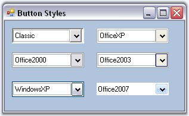
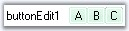
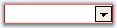
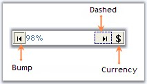
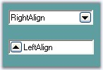
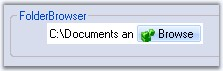
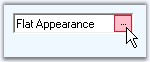
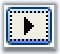
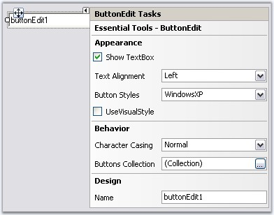

::: {style="DISPLAY: none"}
{#d2h_url_template}{#d2h_package_url style="WIDTH: 0px; DISPLAY: none; HEIGHT: 0px"}
:::

:::::::::::::::::::: {.d2h_secondary_topic style="PADDING-BOTTOM: 10pt; MARGIN: 0pt; PADDING-LEFT: 0pt; PADDING-RIGHT: 0pt; PADDING-TOP: 0pt"}
##### Concepts and Features {#concepts-and-features style="tab-stops: 0pt"}

[]{style="COLOR: #15428b"} 

The following topics will help you become more familiar in using the ButtonEdit control.

[]{style="COLOR: #15428b"} 

###### []{#_ButtonEdit_Appearance}3.3.2.2.3.1 ButtonEdit Appearance[]{#p227} {#buttonedit-appearance style="tab-stops: 0pt"}

[]{style="COLOR: #15428b"} 

A ButtonEdit control is a combination of controls with textbox and buttons. The buttons are normal windows buttons which supports all their properties and events. The ButtonEdit control itself supports properties which controls the appearance and behavior of the control. This section will discuss those properties in the below topics.

[]{style="COLOR: #15428b"} 

[]{style="COLOR: #15428b"} 

See Also

[]{style="COLOR: #15428b"} 

[TextBox Settings for ButtonEdit]{.UGHyperlink}[, ]{.UGHyperlink}[Child Button Customization]{.UGHyperlink}[]{.UGHyperlink}

[]{#p228}[]{#_Style_Settings}3.3.2.2.3.1.1      Style Settings

**[]{style="COLOR: #333399"}** 

This section discusses the different styles available for the ButtonEdit control.

[]{style="COLOR: #15428b"} 

Button Styles

[]{style="COLOR: #15428b"} 

Styles for the ButtonEdit control is specified using **ButtonStyle** property.

[]{style="COLOR: #15428b"} 

::: {align="center"}
+-----------------------------------+----------------------------------------------------------------------------------------------------------------------------------------------------------------------+
| Properties                        | Description                                                                                                                                                          |
+-----------------------------------+----------------------------------------------------------------------------------------------------------------------------------------------------------------------+
| ButtonStyle                       | Specifies the button style for the control. The styles are,                                                                                                          |
|                                   |                                                                                                                                                                      |
|                                   |                                                                                                                                                                      |
|                                   |                                                                                                                                                                      |
|                                   | *Classic,*                                                                                                                                                           |
|                                   |                                                                                                                                                                      |
|                                   | *Office2000,*                                                                                                                                                        |
|                                   |                                                                                                                                                                      |
|                                   | *WindowsXP,*                                                                                                                                                         |
|                                   |                                                                                                                                                                      |
|                                   | *OfficeXP,*                                                                                                                                                          |
|                                   |                                                                                                                                                                      |
|                                   | *Office2003 and*                                                                                                                                                     |
|                                   |                                                                                                                                                                      |
|                                   | *Office2007.*                                                                                                                                                        |
+-----------------------------------+----------------------------------------------------------------------------------------------------------------------------------------------------------------------+
| UseVisualStyle                    | Specifies whether the visual styles can be applied using ButtonStyle property or not. This property should be set to true to make the ButtonStyle setting effective. |
+-----------------------------------+----------------------------------------------------------------------------------------------------------------------------------------------------------------------+
:::

[]{style="COLOR: #15428b"} 

+---------------------------------------------------------------------------------------------------------------------------------------------------------------------------------------------------+
| **[\[C#\]]{style="FONT-FAMILY: 'Courier New'; COLOR: black"}**                                                                                                                                    |
|                                                                                                                                                                                                   |
| []{style="FONT-FAMILY: 'Courier New'; COLOR: black"}                                                                                                                                              |
|                                                                                                                                                                                                   |
| [this]{style="FONT-FAMILY: 'Courier New'; COLOR: blue"}[.buttonEdit3.UseVisualStyle = [true]{style="COLOR: blue"};]{style="FONT-FAMILY: 'Courier New'"}                                           |
|                                                                                                                                                                                                   |
| [this]{style="FONT-FAMILY: 'Courier New'; COLOR: blue"}[.buttonEdit3.ButtonStyle = Syncfusion.Windows.Forms.[ButtonAppearance]{style="COLOR: teal"}.Classic;]{style="FONT-FAMILY: 'Courier New'"} |
+---------------------------------------------------------------------------------------------------------------------------------------------------------------------------------------------------+

[]{style="COLOR: #15428b"} 

+-------------------------------------------------------------------------------------------------------------------------------------------------------------------------------------------------+
| **[\[VB.NET\]]{style="FONT-FAMILY: 'Courier New'; COLOR: black"}**                                                                                                                              |
|                                                                                                                                                                                                 |
| []{style="FONT-FAMILY: 'Courier New'; COLOR: blue"}                                                                                                                                             |
|                                                                                                                                                                                                 |
| [Me]{style="FONT-FAMILY: 'Courier New'; COLOR: blue"}[.buttonEdit3.UseVisualStyle = [True]{style="COLOR: blue"}]{style="FONT-FAMILY: 'Courier New'"}                                            |
|                                                                                                                                                                                                 |
| [Me]{style="FONT-FAMILY: 'Courier New'; COLOR: blue"}[.buttonEdit3.ButtonStyle = Syncfusion.Windows.Forms[.ButtonAppearance]{style="COLOR: black"}.Classic]{style="FONT-FAMILY: 'Courier New'"} |
+-------------------------------------------------------------------------------------------------------------------------------------------------------------------------------------------------+

[]{style="COLOR: #15428b"} 

{border="0"}

[]{style="COLOR: #15428b"} 

Figure 169: ButtonStyles for ButtonEdit Control

**[]{style="COLOR: #15428b"}** 

::: {style="BORDER-BOTTOM: windowtext 1pt solid; BORDER-LEFT: medium none; PADDING-BOTTOM: 1pt; MARGIN-TOP: 9pt; PADDING-LEFT: 0pt; PADDING-RIGHT: 0pt; MARGIN-BOTTOM: 9pt; BORDER-TOP: windowtext 1pt solid; BORDER-RIGHT: medium none; PADDING-TOP: 1pt"}
{border="0"} Note:[ ]{style="COLOR: black; FONT-SIZE: 8pt"}ButtonEdit control also supports all the three windows color themes, i.e., Blue, Silver and Oliver themes. We need to change the Windows theme color in desktop properties for this.
:::

[]{style="COLOR: #15428b"} 

Custom Colors

[]{style="COLOR: #15428b"} 

We can also apply custom colors to the ButtonEditControl by setting Office2007ColorScheme of individual child buttons to \"*Managed*\" and specifying the custom color through the **ApplyManagedColors** method as follows.

[]{style="COLOR: #15428b"} 

+-----------------------------------------------------------------------------------------------------------------------------------------------------------------------------------------------------------------------+
| **[\[C#\]]{style="FONT-FAMILY: 'Courier New'; COLOR: black"}**                                                                                                                                                        |
|                                                                                                                                                                                                                       |
| []{style="COLOR: #15428b"}                                                                                                                                                                                            |
|                                                                                                                                                                                                                       |
| [this]{style="FONT-FAMILY: 'Courier New'; COLOR: blue"}[.buttonEditChildButton1.Office2007ColorScheme = Syncfusion.Windows.Forms.[Office2007Theme]{style="COLOR: teal"}.Managed;]{style="FONT-FAMILY: 'Courier New'"} |
|                                                                                                                                                                                                                       |
| [this]{style="FONT-FAMILY: 'Courier New'; COLOR: blue"}[.buttonEditChildButton2.Office2007ColorScheme = Syncfusion.Windows.Forms.[Office2007Theme]{style="COLOR: teal"}.Managed;]{style="FONT-FAMILY: 'Courier New'"} |
|                                                                                                                                                                                                                       |
| [this]{style="FONT-FAMILY: 'Courier New'; COLOR: blue"}[.buttonEditChildButton3.Office2007ColorScheme = Syncfusion.Windows.Forms.[Office2007Theme]{style="COLOR: teal"}.Managed;]{style="FONT-FAMILY: 'Courier New'"} |
|                                                                                                                                                                                                                       |
| [Office2007Colors]{style="FONT-FAMILY: 'Courier New'; COLOR: teal"}[.ApplyManagedColors([this]{style="COLOR: blue"}, [Color]{style="COLOR: teal"}.LightGreen);]{style="FONT-FAMILY: 'Courier New'"}                   |
+-----------------------------------------------------------------------------------------------------------------------------------------------------------------------------------------------------------------------+

[]{style="COLOR: #15428b"} 

+---------------------------------------------------------------------------------------------------------------------------------------------------------------------------------------------------------------------+
| **[\[VB.NET\]]{style="FONT-FAMILY: 'Courier New'; COLOR: black"}**                                                                                                                                                  |
|                                                                                                                                                                                                                     |
| []{style="COLOR: #15428b"}                                                                                                                                                                                          |
|                                                                                                                                                                                                                     |
| [Me]{style="FONT-FAMILY: 'Courier New'; COLOR: blue"}[.buttonEditChildButton1.Office2007ColorScheme = Syncfusion.Windows.Forms.[Office2007Theme]{style="COLOR: black"}.Managed]{style="FONT-FAMILY: 'Courier New'"} |
|                                                                                                                                                                                                                     |
| [Me]{style="FONT-FAMILY: 'Courier New'; COLOR: blue"}[.buttonEditChildButton2.Office2007ColorScheme = Syncfusion.Windows.Forms.[Office2007Theme]{style="COLOR: black"}.Managed]{style="FONT-FAMILY: 'Courier New'"} |
|                                                                                                                                                                                                                     |
| [Me]{style="FONT-FAMILY: 'Courier New'; COLOR: blue"}[.buttonEditChildButton3.Office2007ColorScheme = Syncfusion.Windows.Forms.[Office2007Theme]{style="COLOR: black"}.Managed]{style="FONT-FAMILY: 'Courier New'"} |
|                                                                                                                                                                                                                     |
| [Office2007Colors.]{style="FONT-FAMILY: 'Courier New'; COLOR: black"}[ApplyManagedColors([Me]{style="COLOR: blue"}, [Color]{style="COLOR: black"}.LightGreen)]{style="FONT-FAMILY: 'Courier New'"}                  |
+---------------------------------------------------------------------------------------------------------------------------------------------------------------------------------------------------------------------+

[]{style="COLOR: #15428b"} 

{border="0"}

[]{style="COLOR: #15428b"} 

Figure 170: CustomColor Of Child Buttons= \"LightGreen\"

**[]{style="COLOR: #15428b"}** 

Border Styles

[]{style="COLOR: #15428b"} 

The border styles for the ButtonEdit can be controlled using the below properties.

[]{style="COLOR: #15428b"} 

::: {align="center"}
+-----------------------------------+--------------------------------------------------------------------------------------------------------------------------------------------+
| Properties                        | Description                                                                                                                                |
+-----------------------------------+--------------------------------------------------------------------------------------------------------------------------------------------+
| Border3DStyle                     | Sets the 3D border style for the control. The options are,                                                                                 |
|                                   |                                                                                                                                            |
|                                   | *[]{style="COLOR: black; FONT-SIZE: 8pt"}*                                                                                                 |
|                                   |                                                                                                                                            |
|                                   | *RaisedOuter,*                                                                                                                             |
|                                   |                                                                                                                                            |
|                                   | *RaisedInner,*                                                                                                                             |
|                                   |                                                                                                                                            |
|                                   | *SunkenOuter,*                                                                                                                             |
|                                   |                                                                                                                                            |
|                                   | *SunkenInner,*                                                                                                                             |
|                                   |                                                                                                                                            |
|                                   | *Raised,*                                                                                                                                  |
|                                   |                                                                                                                                            |
|                                   | *Sunken,*                                                                                                                                  |
|                                   |                                                                                                                                            |
|                                   | *Etched,*                                                                                                                                  |
|                                   |                                                                                                                                            |
|                                   | *Flat,*                                                                                                                                    |
|                                   |                                                                                                                                            |
|                                   | *Adjust and*                                                                                                                               |
|                                   |                                                                                                                                            |
|                                   | *Bump.*                                                                                                                                    |
+-----------------------------------+--------------------------------------------------------------------------------------------------------------------------------------------+
| BorderSides                       | Specifies the sides of the control which should have border.                                                                               |
+-----------------------------------+--------------------------------------------------------------------------------------------------------------------------------------------+
| FlatStyle                         | Specifies the flat style to be applied to the ButtonEdit control. Set **UseVisualStyle** property to false to make this setting effective. |
+-----------------------------------+--------------------------------------------------------------------------------------------------------------------------------------------+
| FlatBorderColor                   | Specifies the border color for the control, when FlatStyle is set to \"Flat\".                                                             |
|                                   |                                                                                                                                            |
|                                   |                                                                                                                                            |
|                                   |                                                                                                                                            |
|                                   | This color setting can be reset by calling **ButtonEdit.ResetFlatBorderColor** method.                                                     |
+-----------------------------------+--------------------------------------------------------------------------------------------------------------------------------------------+
:::

[]{style="COLOR: #15428b"} 

+-----------------------------------------------------------------------------------------------------------------------------------------------------------------------------------+
| **[\[C#\]]{style="FONT-FAMILY: 'Courier New'; COLOR: black"}**                                                                                                                    |
|                                                                                                                                                                                   |
| []{style="FONT-FAMILY: 'Courier New'; COLOR: black"}                                                                                                                              |
|                                                                                                                                                                                   |
| [this]{style="FONT-FAMILY: 'Courier New'; COLOR: blue"}[.buttonEdit3.UseVisualStyle = [false;]{style="COLOR: blue"}]{style="FONT-FAMILY: 'Courier New'"}                          |
|                                                                                                                                                                                   |
| [this]{style="FONT-FAMILY: 'Courier New'; COLOR: blue"}[.buttonEdit3.FlatBorderColor = System.Drawing.[Color]{style="COLOR: teal"}.Red;]{style="FONT-FAMILY: 'Courier New'"}      |
|                                                                                                                                                                                   |
| [this]{style="FONT-FAMILY: 'Courier New'; COLOR: blue"}[.buttonEdit3.FlatStyle = System.Windows.Forms.[FlatStyle]{style="COLOR: teal"}.Flat;]{style="FONT-FAMILY: 'Courier New'"} |
+-----------------------------------------------------------------------------------------------------------------------------------------------------------------------------------+

[]{style="COLOR: #15428b"} 

+----------------------------------------------------------------------------------------------------------------------------------------------------------------------------------------------------------------+
| **[\[VB.NET\]]{style="FONT-FAMILY: 'Courier New'; COLOR: black"}**                                                                                                                                             |
|                                                                                                                                                                                                                |
| []{style="FONT-FAMILY: 'Courier New'; COLOR: blue"}                                                                                                                                                            |
|                                                                                                                                                                                                                |
| [Me]{style="FONT-FAMILY: 'Courier New'; COLOR: blue"}[.buttonEdit3.UseVisualStyle = [False]{style="COLOR: blue"}]{style="FONT-FAMILY: 'Courier New'"}                                                          |
|                                                                                                                                                                                                                |
| [this]{style="FONT-FAMILY: 'Courier New'; COLOR: blue"}[.buttonEdit3.FlatBorderColor = System.Drawing.[Color.Red;]{style="COLOR: black"}]{style="FONT-FAMILY: 'Courier New'"}                                  |
|                                                                                                                                                                                                                |
| [this]{style="FONT-FAMILY: 'Courier New'; COLOR: blue"}[.buttonEdit3.FlatStyle = System.Windows.Forms.FlatStyle]{style="FONT-FAMILY: 'Courier New'; COLOR: black"}[.Flat;]{style="FONT-FAMILY: 'Courier New'"} |
+----------------------------------------------------------------------------------------------------------------------------------------------------------------------------------------------------------------+

[]{style="COLOR: #15428b"} 

{border="0"}

[]{style="COLOR: #15428b"} 

Figure 171: FlatBorderColor=\"Red\"

**[]{style="COLOR: #15428b"}** 

::: {style="BORDER-BOTTOM: windowtext 1pt solid; BORDER-LEFT: medium none; PADDING-BOTTOM: 1pt; MARGIN-TOP: 9pt; PADDING-LEFT: 0pt; PADDING-RIGHT: 0pt; MARGIN-BOTTOM: 9pt; BORDER-TOP: windowtext 1pt solid; BORDER-RIGHT: medium none; PADDING-TOP: 1pt"}
{border="0"} Note: The Border styles of the child buttons can be controlled using ButtonEditChildButton.BorderStyleAdv property. SeeSee Button Types and Border Styles topic for details.
:::

[]{style="COLOR: #15428b"} 

Size Settings

**[]{style="COLOR: #15428b"}** 

We can specify the maximum and minimum size for the ButtonEdit control using **MaximumSize** and **MinimumSize** properties.

[]{style="COLOR: #15428b"} 

::: {align="center"}
  ------------- --------------------------------------------------
  Properties    Description
  MaximumSize   Sets the maximum size of the ButtonEdit control.
  MinimumSize   Sets the minimum size of the ButtonEdit control.
  ------------- --------------------------------------------------
:::

**[]{style="COLOR: #15428b"}** 

See Also

[]{style="COLOR: #15428b"} 

[Foreground Settings]{.UGHyperlink}[]{.UGHyperlink}

[]{#p229}3.3.2.2.3.1.2      Foreground Settings

**[]{style="COLOR: #333399"}** 

This section discusses the foreground settings available for the ButtonEdit control.

[]{style="COLOR: #15428b"} 

Font and ForeColor

[]{style="COLOR: #15428b"} 

The font style and the forecolor for the ButtonEdit text can be set using **Font** and **ForeColor** properties. These property settings can be overridden by **TextBox.Font** and **TextBox.ForeColor** respectively.

[]{style="COLOR: #15428b"} 

+-----------------------------------------------------------------------------------------------------------------------------------------------------------------------------------------------------------------------------------------------------------------------------------------------+
| **[\[C#\]]{style="FONT-FAMILY: 'Courier New'; COLOR: black"}**                                                                                                                                                                                                                                |
|                                                                                                                                                                                                                                                                                               |
| []{style="FONT-FAMILY: 'Courier New'; COLOR: black"}                                                                                                                                                                                                                                          |
|                                                                                                                                                                                                                                                                                               |
| [this]{style="FONT-FAMILY: 'Courier New'; COLOR: blue"}[.buttonEdit3.Font = [new]{style="COLOR: blue"} System.Drawing.[Font]{style="COLOR: teal"}([\"Verdana\"]{style="COLOR: maroon"}, 8.25F, System.Drawing.[FontStyle]{style="COLOR: teal"}.Regular);]{style="FONT-FAMILY: 'Courier New'"} |
|                                                                                                                                                                                                                                                                                               |
| [this]{style="FONT-FAMILY: 'Courier New'; COLOR: blue"}[.buttonEdit3.ForeColor = [Color]{style="COLOR: teal"}.SteelBlue;]{style="FONT-FAMILY: 'Courier New'"}                                                                                                                                 |
+-----------------------------------------------------------------------------------------------------------------------------------------------------------------------------------------------------------------------------------------------------------------------------------------------+

[]{style="COLOR: #15428b"} 

+---------------------------------------------------------------------------------------------------------------------------------------------------------------------------------------------------------------------------------------------------------------------------------------------+
| **[\[VB.NET\]]{style="FONT-FAMILY: 'Courier New'; COLOR: black"}**                                                                                                                                                                                                                          |
|                                                                                                                                                                                                                                                                                             |
| []{style="FONT-FAMILY: 'Courier New'; COLOR: blue"}                                                                                                                                                                                                                                         |
|                                                                                                                                                                                                                                                                                             |
| [Me]{style="FONT-FAMILY: 'Courier New'; COLOR: blue"}[.buttonEdit3.Font = [New]{style="COLOR: blue"} System.Drawing.[Font]{style="COLOR: black"}([\"Verdana\"]{style="COLOR: maroon"}, 8.25F, System.Drawing.[FontStyle]{style="COLOR: teal"}.Regular)]{style="FONT-FAMILY: 'Courier New'"} |
|                                                                                                                                                                                                                                                                                             |
| [Me]{style="FONT-FAMILY: 'Courier New'; COLOR: blue"}[.buttonEdit3.ForeColor = [Color]{style="COLOR: black"}.SteelBlue]{style="FONT-FAMILY: 'Courier New'"}                                                                                                                                 |
+---------------------------------------------------------------------------------------------------------------------------------------------------------------------------------------------------------------------------------------------------------------------------------------------+

[]{style="COLOR: #15428b"} 

::: {style="BORDER-BOTTOM: windowtext 1pt solid; BORDER-LEFT: medium none; PADDING-BOTTOM: 1pt; MARGIN-TOP: 9pt; PADDING-LEFT: 0pt; PADDING-RIGHT: 0pt; MARGIN-BOTTOM: 9pt; BORDER-TOP: windowtext 1pt solid; BORDER-RIGHT: medium none; PADDING-TOP: 1pt"}
{border="0"} Note:[ ]{style="COLOR: black; FONT-SIZE: 8pt"}Foreground settings for the child buttons can be specified using ButtonEditChildButton.Font and ButtonEditChildButton.ForeColor properties.
:::

[]{style="COLOR: #15428b"} 

{border="0"}

[]{style="COLOR: #15428b"} 

Figure 172: Foreground Text of Child Button Overriding ButtonEdit Foreground Settings

[]{style="COLOR: #15428b"} 

Case Settings

[]{style="COLOR: #15428b"} 

Using **ButtonEdit.CharacterCasing** property, we can specify whether the case of the character can be modified as they are typed. The values are Upper, Lower and Normal.

[]{style="COLOR: #15428b"} 

+-----------------------------------------------------------------------------------------------------------------------------------------------------------------------------------------------------------------------------------------------------------------------------------------------+
| **[\[C#\]]{style="FONT-FAMILY: 'Courier New'; COLOR: black"}**                                                                                                                                                                                                                                |
|                                                                                                                                                                                                                                                                                               |
| []{style="FONT-FAMILY: 'Courier New'; COLOR: black"}                                                                                                                                                                                                                                          |
|                                                                                                                                                                                                                                                                                               |
| [this]{style="FONT-FAMILY: 'Courier New'; COLOR: blue"}[.buttonEdit3.Font = [new]{style="COLOR: blue"} System.Drawing.[Font]{style="COLOR: teal"}([\"Verdana\"]{style="COLOR: maroon"}, 8.25F, System.Drawing.[FontStyle]{style="COLOR: teal"}.Regular);]{style="FONT-FAMILY: 'Courier New'"} |
|                                                                                                                                                                                                                                                                                               |
| [this]{style="FONT-FAMILY: 'Courier New'; COLOR: blue"}[.buttonEdit3.ForeColor = [Color]{style="COLOR: teal"}.SteelBlue;]{style="FONT-FAMILY: 'Courier New'"}                                                                                                                                 |
+-----------------------------------------------------------------------------------------------------------------------------------------------------------------------------------------------------------------------------------------------------------------------------------------------+

[]{style="COLOR: #15428b"} 

+---------------------------------------------------------------------------------------------------------------------------------------------------------------------------------------------------------------------------------------------------------------------------------------------+
| **[\[VB.NET\]]{style="FONT-FAMILY: 'Courier New'; COLOR: black"}**                                                                                                                                                                                                                          |
|                                                                                                                                                                                                                                                                                             |
| []{style="FONT-FAMILY: 'Courier New'; COLOR: blue"}                                                                                                                                                                                                                                         |
|                                                                                                                                                                                                                                                                                             |
| [Me]{style="FONT-FAMILY: 'Courier New'; COLOR: blue"}[.buttonEdit3.Font = [New]{style="COLOR: blue"} System.Drawing.[Font]{style="COLOR: black"}([\"Verdana\"]{style="COLOR: maroon"}, 8.25F, System.Drawing.[FontStyle]{style="COLOR: teal"}.Regular)]{style="FONT-FAMILY: 'Courier New'"} |
|                                                                                                                                                                                                                                                                                             |
| [Me]{style="FONT-FAMILY: 'Courier New'; COLOR: blue"}[.buttonEdit3.ForeColor = [Color]{style="COLOR: black"}.SteelBlue]{style="FONT-FAMILY: 'Courier New'"}                                                                                                                                 |
+---------------------------------------------------------------------------------------------------------------------------------------------------------------------------------------------------------------------------------------------------------------------------------------------+

[]{style="COLOR: #15428b"} 

::: {style="BORDER-BOTTOM: windowtext 1pt solid; BORDER-LEFT: medium none; PADDING-BOTTOM: 1pt; MARGIN-TOP: 9pt; PADDING-LEFT: 0pt; PADDING-RIGHT: 0pt; MARGIN-BOTTOM: 9pt; BORDER-TOP: windowtext 1pt solid; BORDER-RIGHT: medium none; PADDING-TOP: 1pt"}
{border="0"} Note:[ ]{style="COLOR: black; FONT-SIZE: 8pt"}This case setting can be overridden by TextBox.CharacterCasing property.
:::

[]{style="COLOR: #15428b"} 

See Also

[]{style="COLOR: #15428b"} 

[TextBox Settings for ButtonEdit]{.UGHyperlink}[]{.UGHyperlink}

###### []{#p230}[]{#_Child_Button_Customization}3.3.2.2.3.2 Child Button Customization {#child-button-customization style="tab-stops: 0pt"}

[]{style="COLOR: #15428b"} 

The child buttons in a ButtonEdit control are normal windows button, but supports additional features within our ButtonEdit control. Those features are discussed in the below topics.

[]{style="COLOR: #15428b"} 

[]{#_Button_Types_and}3.3.2.2.3.2.1      Button Types and Border Styles[]{#p231}

**[]{style="COLOR: #15428b"}** 

Button Types

[]{style="COLOR: #15428b"} 

The button types for ButtonEdit control are similar to that of ButtonAdv control. Refer Button Types topic for details.

 

Use **ButtonEditChildButton1.ButtonType** property for setting the button types of the child buttons.

[]{style="COLOR: #15428b"} 

Border Styles

[]{style="COLOR: #15428b"} 

The border styles for the child buttons can be set through BorderStyleAdv property.

[]{style="COLOR: #15428b"} 

::: {align="center"}
+-----------------------------------+-----------------------------------------------------------------------------------------+
| Property                          | Description                                                                             |
+-----------------------------------+-----------------------------------------------------------------------------------------+
| BorderStyleAdv                    | Specifies the border style for child buttons of the ButtonEdit control. The styles are, |
|                                   |                                                                                         |
|                                   |                                                                                         |
|                                   |                                                                                         |
|                                   | *None,*                                                                                 |
|                                   |                                                                                         |
|                                   | *Default,*                                                                              |
|                                   |                                                                                         |
|                                   | *Dashed,*                                                                               |
|                                   |                                                                                         |
|                                   | *Dotted,*                                                                               |
|                                   |                                                                                         |
|                                   | *Inset,*                                                                                |
|                                   |                                                                                         |
|                                   | *Outset,*                                                                               |
|                                   |                                                                                         |
|                                   | *Solid,*                                                                                |
|                                   |                                                                                         |
|                                   | *Bump,*                                                                                 |
|                                   |                                                                                         |
|                                   | *Etched,*                                                                               |
|                                   |                                                                                         |
|                                   | *Flat,*                                                                                 |
|                                   |                                                                                         |
|                                   | *Raised,*                                                                               |
|                                   |                                                                                         |
|                                   | *RaisedInner,*                                                                          |
|                                   |                                                                                         |
|                                   | *RaisedOuter,*                                                                          |
|                                   |                                                                                         |
|                                   | *Sunken,*                                                                               |
|                                   |                                                                                         |
|                                   | *SunkenInner and*                                                                       |
|                                   |                                                                                         |
|                                   | *SunkenOuter.*                                                                          |
+-----------------------------------+-----------------------------------------------------------------------------------------+
:::

[]{style="COLOR: #15428b"} 

::: {style="BORDER-BOTTOM: windowtext 1pt solid; BORDER-LEFT: medium none; PADDING-BOTTOM: 1pt; MARGIN-TOP: 9pt; PADDING-LEFT: 0pt; PADDING-RIGHT: 0pt; MARGIN-BOTTOM: 9pt; BORDER-TOP: windowtext 1pt solid; BORDER-RIGHT: medium none; PADDING-TOP: 1pt"}
{border="0"} Note: This setting will be effective only for Office2003, OfficeXP and WindowsXP styles set through ButtonEdit.ButtonStyle property. See [Style Settings]{style="COLOR: black"}. We can also set border style for ButtonEdit controls without enabling visual styles.
:::

[]{style="COLOR: #15428b"} 

+------------------------------------------------------------------------------------------------------------------------------------------------------------------------------------------------------------------+
| **[\[C#\]]{style="FONT-FAMILY: 'Courier New'; COLOR: black"}**                                                                                                                                                   |
|                                                                                                                                                                                                                  |
| []{style="COLOR: #15428b"}                                                                                                                                                                                       |
|                                                                                                                                                                                                                  |
| [//Sample code for setting \"Bump\" Border Style for BorderEdit Child Button]{style="FONT-FAMILY: 'Courier New'; COLOR: green"}                                                                                  |
|                                                                                                                                                                                                                  |
| [this]{style="FONT-FAMILY: 'Courier New'; COLOR: blue"}[.buttonEditChildButton4.BorderStyleAdv = Syncfusion.Windows.Forms.[ButtonAdvBorderStyle]{style="COLOR: teal"}.Bump;]{style="FONT-FAMILY: 'Courier New'"} |
+------------------------------------------------------------------------------------------------------------------------------------------------------------------------------------------------------------------+

[]{style="COLOR: #15428b"} 

+---------------------------------------------------------------------------------------------------------------------------------------------------------------------------------------------------------------+
| **[\[VB.NET\]]{style="FONT-FAMILY: 'Courier New'; COLOR: black"}**                                                                                                                                            |
|                                                                                                                                                                                                               |
| []{style="COLOR: #15428b"}                                                                                                                                                                                    |
|                                                                                                                                                                                                               |
| [\'Sample code for setting \"Bump\" Border Style for BorderEdit Child Button]{style="FONT-FAMILY: 'Courier New'; COLOR: green"}                                                                               |
|                                                                                                                                                                                                               |
| [Me]{style="FONT-FAMILY: 'Courier New'; COLOR: blue"}[.buttonEditChildButton4.BorderStyleAdv = Syncfusion.Windows.Forms.[ButtonAdvBorderStyle]{style="COLOR: teal"}.Bump]{style="FONT-FAMILY: 'Courier New'"} |
+---------------------------------------------------------------------------------------------------------------------------------------------------------------------------------------------------------------+

[]{style="COLOR: #15428b"} 

{border="0"}

[]{style="COLOR: #15428b"} 

Figure 173: Border Styles set for Child Buttons

**[]{style="COLOR: #15428b"}** 

See Also

**[]{style="COLOR: #15428b"}** 

[Style Settings]{.UGHyperlink}[, ]{.UGHyperlink}[How to set tooltip for ButtonEdit Child buttons?]{.UGHyperlink}[]{.UGHyperlink}

[]{#_Properties}3.3.2.2.3.2.2      Properties

[]{#p232} 

The properties which controls the appearance and behavior of the ButtonEdit Child Buttons are listed below with their description.

[]{style="COLOR: #15428b"} 

Button Alignment

[]{style="COLOR: #15428b"} 

Placement of the child buttons inside the ButtonEdit control is set through below property.

[]{style="COLOR: #15428b"} 

::: {align="center"}
  ------------- --------------------------------------------------------------------------------------------------
  Property      Description
  ButtonAlign   Specifies whether the child button should be aligned to left or right of the ButtonEdit control.
  ------------- --------------------------------------------------------------------------------------------------
:::

[]{style="COLOR: #15428b"} 

+----------------------------------------------------------------------------------------------------------------------------------------------------------------------------------------------------------------+
| **[\[C#\]]{style="FONT-FAMILY: 'Courier New'; COLOR: black"}**                                                                                                                                                 |
|                                                                                                                                                                                                                |
| []{style="COLOR: #15428b"}                                                                                                                                                                                     |
|                                                                                                                                                                                                                |
| [this]{style="FONT-FAMILY: 'Courier New'; COLOR: blue"}[.buttonEditChildButton6.ButtonAlign = Syncfusion.Windows.Forms.Tools.[ButtonAlignment]{style="COLOR: teal"}.Left;]{style="FONT-FAMILY: 'Courier New'"} |
+----------------------------------------------------------------------------------------------------------------------------------------------------------------------------------------------------------------+

[]{style="COLOR: #15428b"} 

+--------------------------------------------------------------------------------------------------------------------------------------------------------------------------------------------------------------+
| **[\[VB.NET\]]{style="FONT-FAMILY: 'Courier New'; COLOR: black"}**                                                                                                                                           |
|                                                                                                                                                                                                              |
| []{style="COLOR: #15428b"}                                                                                                                                                                                   |
|                                                                                                                                                                                                              |
| [Me]{style="FONT-FAMILY: 'Courier New'; COLOR: blue"}[.buttonEditChildButton6.ButtonAlign = Syncfusion.Windows.Forms.Tools.[ButtonAlignment]{style="COLOR: black"}.Left]{style="FONT-FAMILY: 'Courier New'"} |
+--------------------------------------------------------------------------------------------------------------------------------------------------------------------------------------------------------------+

[]{style="COLOR: #15428b"} 

{border="0"}

[]{style="COLOR: #15428b"} 

Figure 174: Child Button Alignments

[]{style="COLOR: #15428b"} 

::: {style="BORDER-BOTTOM: windowtext 1pt solid; BORDER-LEFT: medium none; PADDING-BOTTOM: 1pt; MARGIN-TOP: 9pt; PADDING-LEFT: 0pt; PADDING-RIGHT: 0pt; MARGIN-BOTTOM: 9pt; BORDER-TOP: windowtext 1pt solid; BORDER-RIGHT: medium none; PADDING-TOP: 1pt"}
{border="0"} Note:[ ]{style="COLOR: black; FONT-SIZE: 8pt"}There is no support for placing more than one buttons on the same side. We need to add the buttons in the order we require.
:::

[]{style="COLOR: #15428b"} 

Image Settings

[]{style="COLOR: #15428b"} 

The below properties can be used to set text and image for the child buttons.

[]{style="COLOR: #15428b"} 

::: {align="center"}
  ------------------- --------------------------------------------------------------------
  Properties          Description
  Image               Sets image for the child button.
  ImageAlign          Sets alignment of the image.
  ImageIndex          Sets the index of the image to be set for the child button.
  ImageList           Indicates the imagelist to be used for child button.
  PreferredWidth      Specifies the width of the button. Default value is 18.
  Text                Sets text for the button if ButtonType is set to Normal.
  TextAlign           Sets the alignment of the text in the child button control.
  TextImageRelation   Sets the relative location of the image to the text in the button.
  ------------------- --------------------------------------------------------------------
:::

[]{style="COLOR: #15428b"} 

+---------------------------------------------------------------------------------------------------------------------------------------------------------------------------------------------------------------------------------------------------------------+
| **[\[C#\]]{style="FONT-FAMILY: 'Courier New'; COLOR: black"}**                                                                                                                                                                                                |
|                                                                                                                                                                                                                                                               |
| []{style="COLOR: #15428b"}                                                                                                                                                                                                                                    |
|                                                                                                                                                                                                                                                               |
| [this]{style="FONT-FAMILY: 'Courier New'; COLOR: blue"}[.buttonEditChildButton2.Image = ((System.Drawing.[Image]{style="COLOR: teal"})(resources.GetObject([\"buttonEditChildButton2.Image\"]{style="COLOR: maroon"})));]{style="FONT-FAMILY: 'Courier New'"} |
|                                                                                                                                                                                                                                                               |
| [this]{style="FONT-FAMILY: 'Courier New'; COLOR: blue"}[.buttonEditChildButton2.ImageAlign = System.Drawing.[ContentAlignment]{style="COLOR: teal"}.MiddleLeft;]{style="FONT-FAMILY: 'Courier New'"}                                                          |
|                                                                                                                                                                                                                                                               |
| [this]{style="FONT-FAMILY: 'Courier New'; COLOR: blue"}[.buttonEditChildButton2.Text = [\"Browse\"]{style="COLOR: maroon"};]{style="FONT-FAMILY: 'Courier New'"}                                                                                              |
|                                                                                                                                                                                                                                                               |
| [this]{style="FONT-FAMILY: 'Courier New'; COLOR: blue"}[.buttonEditChildButton2.TextAlign = System.Drawing.[ContentAlignment]{style="COLOR: teal"}.MiddleLeft;]{style="FONT-FAMILY: 'Courier New'"}                                                           |
|                                                                                                                                                                                                                                                               |
| [this]{style="FONT-FAMILY: 'Courier New'; COLOR: blue"}[.buttonEditChildButton2.TextImageRelation = System.Windows.Forms.[TextImageRelation]{style="COLOR: teal"}.ImageBeforeText;]{style="FONT-FAMILY: 'Courier New'"}                                       |
|                                                                                                                                                                                                                                                               |
| [this]{style="FONT-FAMILY: 'Courier New'; COLOR: blue"}[.buttonEditChildButton2.PreferredWidth = 64;]{style="FONT-FAMILY: 'Courier New'"}                                                                                                                     |
+---------------------------------------------------------------------------------------------------------------------------------------------------------------------------------------------------------------------------------------------------------------+

[]{style="COLOR: #15428b"} 

+---------------------------------------------------------------------------------------------------------------------------------------------------------------------------------------------------------------------------------------------------------------------------------------------+
| **[\[VB.NET\]]{style="FONT-FAMILY: 'Courier New'; COLOR: black"}**                                                                                                                                                                                                                          |
|                                                                                                                                                                                                                                                                                             |
| []{style="COLOR: #15428b"}                                                                                                                                                                                                                                                                  |
|                                                                                                                                                                                                                                                                                             |
| [Me]{style="FONT-FAMILY: 'Courier New'; COLOR: blue"}[.buttonEditChildButton2.Image = [DirectCast]{style="COLOR: teal"}((resources.GetObject([\"buttonEditChildButton2.Image\"]{style="COLOR: maroon"})), System.Drawing.[Image]{style="COLOR: teal"})]{style="FONT-FAMILY: 'Courier New'"} |
|                                                                                                                                                                                                                                                                                             |
| [Me]{style="FONT-FAMILY: 'Courier New'; COLOR: blue"}[.buttonEditChildButton2.ImageAlign = System.Drawing.[ContentAlignment]{style="COLOR: black"}.MiddleLeft]{style="FONT-FAMILY: 'Courier New'"}                                                                                          |
|                                                                                                                                                                                                                                                                                             |
| [Me]{style="FONT-FAMILY: 'Courier New'; COLOR: blue"}[.buttonEditChildButton2.Text = [\"Browse\"]{style="COLOR: maroon"}]{style="FONT-FAMILY: 'Courier New'"}                                                                                                                               |
|                                                                                                                                                                                                                                                                                             |
| [Me]{style="FONT-FAMILY: 'Courier New'; COLOR: blue"}[.buttonEditChildButton2.TextAlign = System.Drawing.[ContentAlignment]{style="COLOR: black"}.MiddleLeft]{style="FONT-FAMILY: 'Courier New'"}                                                                                           |
|                                                                                                                                                                                                                                                                                             |
| [Me]{style="FONT-FAMILY: 'Courier New'; COLOR: blue"}[.buttonEditChildButton2.TextImageRelation = System.Windows.Forms.[TextImageRelation]{style="COLOR: black"}.ImageBeforeText]{style="FONT-FAMILY: 'Courier New'"}                                                                       |
|                                                                                                                                                                                                                                                                                             |
| [Me]{style="FONT-FAMILY: 'Courier New'; COLOR: blue"}[.buttonEditChildButton2.PreferredWidth = 64]{style="FONT-FAMILY: 'Courier New'"}                                                                                                                                                      |
+---------------------------------------------------------------------------------------------------------------------------------------------------------------------------------------------------------------------------------------------------------------------------------------------+

[]{style="COLOR: #15428b"} 

{border="0"}

[]{style="COLOR: #15428b"} 

Figure 175: TextAlign = \"MiddleLeft\"; ImageAlign = \"MiddleLeft\"; TextImageRelation = \"ImageBeforeText\"

[]{style="COLOR: #15428b"} 

Flat Style for the Buttons

[]{style="COLOR: #15428b"} 

::: {align="center"}
  ---------------- ----------------------------------------------------------------------------------------------------------------------------------------------------------------------------------------------------------
  Properties       Description
  FlatAppearance   Represents the appearance of the border and the color for the check state and mouse over state. Set FlatStyle to Flat and UseVisualStyleBackColor should be set to false to make this setting effective.
  FlatStyle        Specifies the flat style for the button. The options are Flat, Popup, Standard and System.
  ---------------- ----------------------------------------------------------------------------------------------------------------------------------------------------------------------------------------------------------
:::

[]{style="COLOR: #15428b"} 

+------------------------------------------------------------------------------------------------------------------------------------------------------------------------------------------------------------+
| **[\[C#\]]{style="FONT-FAMILY: 'Courier New'; COLOR: black"}**                                                                                                                                             |
|                                                                                                                                                                                                            |
| []{style="COLOR: #15428b"}                                                                                                                                                                                 |
|                                                                                                                                                                                                            |
| [this]{style="FONT-FAMILY: 'Courier New'; COLOR: blue"}[.buttonEditChildButton5.FlatStyle = System.Windows.Forms.[FlatStyle]{style="COLOR: teal"}.Flat;]{style="FONT-FAMILY: 'Courier New'"}               |
|                                                                                                                                                                                                            |
| [this]{style="FONT-FAMILY: 'Courier New'; COLOR: blue"}[.buttonEditChildButton5.FlatAppearance.BorderColor = System.Drawing.[Color]{style="COLOR: teal"}.Crimson;]{style="FONT-FAMILY: 'Courier New'"}     |
|                                                                                                                                                                                                            |
| [this]{style="FONT-FAMILY: 'Courier New'; COLOR: blue"}[.buttonEditChildButton5.FlatAppearance.MouseOverBackColor = System.Drawing.[Color]{style="COLOR: teal"}.Pink;]{style="FONT-FAMILY: 'Courier New'"} |
+------------------------------------------------------------------------------------------------------------------------------------------------------------------------------------------------------------+

[]{style="COLOR: #15428b"} 

+----------------------------------------------------------------------------------------------------------------------------------------------------------------------------------------------------------+
| **[\[VB.NET\]]{style="FONT-FAMILY: 'Courier New'; COLOR: black"}**                                                                                                                                       |
|                                                                                                                                                                                                          |
| []{style="COLOR: #15428b"}                                                                                                                                                                               |
|                                                                                                                                                                                                          |
| [Me]{style="FONT-FAMILY: 'Courier New'; COLOR: blue"}[.buttonEditChildButton5.FlatStyle = System.Windows.Forms.[FlatStyle.Flat]{style="COLOR: black"}]{style="FONT-FAMILY: 'Courier New'"}               |
|                                                                                                                                                                                                          |
| [Me]{style="FONT-FAMILY: 'Courier New'; COLOR: blue"}[.buttonEditChildButton5.FlatAppearance.BorderColor = System.Drawing.[Color]{style="COLOR: black"}.Crimson]{style="FONT-FAMILY: 'Courier New'"}     |
|                                                                                                                                                                                                          |
| [Me]{style="FONT-FAMILY: 'Courier New'; COLOR: blue"}[.buttonEditChildButton5.FlatAppearance.MouseOverBackColor = System.Drawing.[Color]{style="COLOR: black"}.Pink]{style="FONT-FAMILY: 'Courier New'"} |
+----------------------------------------------------------------------------------------------------------------------------------------------------------------------------------------------------------+

[]{style="COLOR: #15428b"} 

{border="0"}

[]{style="COLOR: #15428b"} 

Figure 176: CrimsonRed Border Color with Pink MouseHover Color

[]{style="COLOR: #15428b"} 

Style Settings

[]{style="COLOR: #15428b"} 

::: {align="center"}
  ------------------------- ---------------------------------------------------------------------------------------------------------------------
  Properties                Description
  UseVisualStyleBackColor   Determines whether the background of child button is drawn using visual style if the button supports visual styles.
  Office2007ColorScheme     Specifies the office color scheme.
  ------------------------- ---------------------------------------------------------------------------------------------------------------------
:::

[]{style="COLOR: #15428b"} 

::: {style="BORDER-BOTTOM: windowtext 1pt solid; BORDER-LEFT: medium none; PADDING-BOTTOM: 1pt; MARGIN-TOP: 9pt; PADDING-LEFT: 0pt; PADDING-RIGHT: 0pt; MARGIN-BOTTOM: 9pt; BORDER-TOP: windowtext 1pt solid; BORDER-RIGHT: medium none; PADDING-TOP: 1pt"}
{border="0"} Note:[ ]{style="COLOR: black; FONT-SIZE: 8pt"}Visual style of a child buttons is inherited from the visual style of it\'s parent (ButtonEdit) control. See Style Settings topic. You can override those settings using the above properties.
:::

[]{style="COLOR: #15428b"} 

Focusing the Child Button at Runtime

[]{style="COLOR: #15428b"} 

The Child buttons can be focussed based on the order of the **ChildButton.TabIndex** set for individual buttons. **ChildButton.TabStop** property should be set to true to make this effective. While focusing the button, we can either display or don\'t display a focus rectangle, by using the  **ButtonEdit.KeepFocusRectangle** property.

[]{style="COLOR: #15428b"} 

+------------------------------------------------------------------------------------------------------------------------------------------------------------------------+
| **[\[C#\]]{style="FONT-FAMILY: 'Courier New'; COLOR: black"}**                                                                                                         |
|                                                                                                                                                                        |
| []{style="COLOR: #15428b"}                                                                                                                                             |
|                                                                                                                                                                        |
| [this]{style="FONT-FAMILY: 'Courier New'; COLOR: blue"}[.buttonEditChildButton3.KeepFocusRectangle = [true]{style="COLOR: blue"};]{style="FONT-FAMILY: 'Courier New'"} |
+------------------------------------------------------------------------------------------------------------------------------------------------------------------------+

[]{style="COLOR: #15428b"} 

+---------------------------------------------------------------------------------------------------------------------------------------------------------------------+
| **[\[VB.NET\]]{style="FONT-FAMILY: 'Courier New'; COLOR: black"}**                                                                                                  |
|                                                                                                                                                                     |
| []{style="COLOR: #15428b"}                                                                                                                                          |
|                                                                                                                                                                     |
| [Me]{style="FONT-FAMILY: 'Courier New'; COLOR: blue"}[.buttonEditChildButton3.KeepFocusRectangle = [True]{style="COLOR: blue"}]{style="FONT-FAMILY: 'Courier New'"} |
+---------------------------------------------------------------------------------------------------------------------------------------------------------------------+

[]{style="COLOR: #15428b"} 

{border="0"}

[]{style="COLOR: #15428b"} 

Figure 177: Focus Rectangle for Child Button

[]{style="COLOR: #15428b"} 

See Also

[]{style="COLOR: #15428b"} 

[How to hide a child button of a ButtonEdit control?]{.UGHyperlink}[]{.UGHyperlink}

###### []{#p233}[]{#_TextBox_Settings_For}3.3.2.2.3.3 TextBox Settings For ButtonEdit {#textbox-settings-for-buttonedit style="tab-stops: 0pt"}

[]{style="COLOR: #333399"} 

The default textbox within the ButtonEdit control can be replaced with any custom textbox like PercentTextBox, IntegerTextBox, and so on. The properties of Embedded textbox of a ButtonEdit control are discussed below.

[]{style="COLOR: #15428b"} 

::: {align="center"}
  ----------------------- ------------------------------------------------------------------------------------------------------------------------------------------------------------------------------------------------------------------------------
  ButtonEdit Properties   Description
  ShowTexBox              Indicates whether the embedded TextBox is visible in the ButtonEdit control. This property setting can be reset to default by calling **ResetShowTextBox** method.
  SelectionLength         Sets the selection length of the embedded TextBox. This property setting can be reset to default by calling **ResetSelectionLength** method.
  SelectionStart          Sets the SelectionStart property of the ButtonEdit control which is same as the TextBoxBase.SelectionStart of the embedded TextBox. This property setting can be reset to default by calling **ResetSelectionStart** method.
  ----------------------- ------------------------------------------------------------------------------------------------------------------------------------------------------------------------------------------------------------------------------
:::

[]{style="COLOR: #15428b"} 

+-----------------------------------------------------------------------------------------------------------------------------------------------------------------------------------------------------+
| **[\[C#\]]{style="FONT-FAMILY: 'Courier New'; COLOR: black"}**                                                                                                                                      |
|                                                                                                                                                                                                     |
| []{style="FONT-FAMILY: 'Courier New'; COLOR: black"}                                                                                                                                                |
|                                                                                                                                                                                                     |
| [this]{style="FONT-FAMILY: 'Courier New'; COLOR: blue"}[.buttonEdit1.SelectionLength = 1;]{style="FONT-FAMILY: 'Courier New'"}                                                                      |
|                                                                                                                                                                                                     |
| [this]{style="FONT-FAMILY: 'Courier New'; COLOR: blue"}[.buttonEdit1.SelectionStart = 3;]{style="FONT-FAMILY: 'Courier New'"}                                                                       |
|                                                                                                                                                                                                     |
| [this]{style="FONT-FAMILY: 'Courier New'; COLOR: blue"}[.buttonEdit1.[ShowTexBox = ]{style="COLOR: black"}[true]{style="COLOR: blue"}[;]{style="COLOR: black"}]{style="FONT-FAMILY: 'Courier New'"} |
+-----------------------------------------------------------------------------------------------------------------------------------------------------------------------------------------------------+

[]{style="COLOR: #15428b"} 

+--------------------------------------------------------------------------------------------------------------------------------------------------+
| **[\[VB.NET\]]{style="FONT-FAMILY: 'Courier New'; COLOR: black"}**                                                                               |
|                                                                                                                                                  |
| []{style="FONT-FAMILY: 'Courier New'; COLOR: black"}                                                                                             |
|                                                                                                                                                  |
| [Me]{style="FONT-FAMILY: 'Courier New'; COLOR: blue"}[.buttonEdit1.SelectionLength = 1]{style="FONT-FAMILY: 'Courier New'"}                      |
|                                                                                                                                                  |
| [Me]{style="FONT-FAMILY: 'Courier New'; COLOR: blue"}[.buttonEdit1.SelectionStart = 3]{style="FONT-FAMILY: 'Courier New'"}                       |
|                                                                                                                                                  |
| [Me]{style="FONT-FAMILY: 'Courier New'; COLOR: blue"}[.buttonEdit1.ShowTexBox = [True]{style="COLOR: blue"}]{style="FONT-FAMILY: 'Courier New'"} |
+--------------------------------------------------------------------------------------------------------------------------------------------------+

*[]{style="COLOR: black; FONT-SIZE: 8pt"}* 

::: {style="BORDER-BOTTOM: windowtext 1pt solid; BORDER-LEFT: medium none; PADDING-BOTTOM: 1pt; MARGIN-TOP: 9pt; PADDING-LEFT: 0pt; PADDING-RIGHT: 0pt; MARGIN-BOTTOM: 9pt; BORDER-TOP: windowtext 1pt solid; BORDER-RIGHT: medium none; PADDING-TOP: 1pt"}
[{border="0"}]{style="COLOR: black; FONT-SIZE: 8pt"} Note: To increase the height of the ButtonEdit control, make the text as multiline textbox.
:::

###### []{#p234}[]{#_Design_Time_Features}3.3.2.2.3.4 Design Time Features {#design-time-features style="tab-stops: 0pt"}

 

ButtonEdit control has Smart Tag, which lets you set the properties easily.

[]{style="COLOR: #15428b"} 

Smart Tag Options

**[]{style="COLOR: #15428b"}** 

{border="0"}

[]{style="COLOR: #15428b"} 

Figure 178: TaskWindow of ButtonEdit Control

**[]{style="COLOR: #15428b"}** 

The Options are as follows.

[]{style="COLOR: #15428b"} 

[·      ]{style="FONT-FAMILY: Symbol"}Show TextBox - Shows or hides embedded textbox.

[·      ]{style="FONT-FAMILY: Symbol"}Text Alignment - Sets alignment of the text.

[·      ]{style="FONT-FAMILY: Symbol"}Button Styles - Sets the button styles

[·      ]{style="FONT-FAMILY: Symbol"}UseVisualStyle - Enables or disables visual style for the control.

[·      ]{style="FONT-FAMILY: Symbol"}Character Casing - Set the case settings for the text in the textbox.

[·      ]{style="FONT-FAMILY: Symbol"}ButtonCollection - Opens Button Collection Editor.

[·      ]{style="FONT-FAMILY: Symbol"}Name - Sets the name of the ButtonEdit control.

 

[]{#related-topics}
::::::::::::::::::::
