::: {style="DISPLAY: none"}
{#d2h_url_template}{#d2h_package_url style="WIDTH: 0px; DISPLAY: none; HEIGHT: 0px"}
:::

::::::::::: {.d2h_secondary_topic style="PADDING-BOTTOM: 10pt; MARGIN: 0pt; PADDING-LEFT: 0pt; PADDING-RIGHT: 0pt; PADDING-TOP: 0pt"}
##### Concepts and Features {#concepts-and-features style="tab-stops: 0pt"}

[]{style="COLOR: #15428b"} 

The following topics will help you become more familiar in using the Calculator control.

[]{style="COLOR: #15428b"} 

###### []{#p248}[]{#_Display_TextBox}3.3.2.3.3.1 Display TextBox {#display-textbox style="tab-stops: 0pt"}

[]{style="COLOR: #333399"} 

The Calculator control has a display text area on its top corner, which displays all the digits and the calculations performed on the calculator. This display area is displayed by default. To hide this display area, set the **ShowDisplayArea** property to false.

[]{style="COLOR: #15428b"} 

The below properties controls the behavior of the display area.

[]{style="COLOR: #333399"} 

::: {align="center"}
  ------------------------------ -------------------------------------------------------------------------------------------------------------------------------
  Calculatorcontrol Properties   Description
  DisplayTextAlign               Specifies the text alignment in the display text area. The values are Right, Left and Center. By default, it is set to Right.
  Font                           Sets font style for display text in the textbox control.
  DoubleValue                    Sets the value of the Calculator control as double value. The default value is zero.
  ------------------------------ -------------------------------------------------------------------------------------------------------------------------------
:::

[]{style="COLOR: #15428b"} 

+---------------------------------------------------------------------------------------------------------------------------------------------------------------------------------------------------------------------------------------------------------------------------------------------------+
| **[\[C#\]]{style="FONT-FAMILY: 'Courier New'; COLOR: black"}**                                                                                                                                                                                                                                    |
|                                                                                                                                                                                                                                                                                                   |
| []{style="FONT-FAMILY: 'Courier New'"}                                                                                                                                                                                                                                                            |
|                                                                                                                                                                                                                                                                                                   |
| [this]{style="FONT-FAMILY: 'Courier New'; COLOR: blue"}[.calculatorControl1.DisplayTextAlign = System.Windows.Forms.HorizontalAlignment.Left;]{style="FONT-FAMILY: 'Courier New'"}                                                                                                                |
|                                                                                                                                                                                                                                                                                                   |
| [this]{style="FONT-FAMILY: 'Courier New'; COLOR: blue"}[.calculatorControl1.DoubleValue = 5;]{style="FONT-FAMILY: 'Courier New'"}                                                                                                                                                                 |
|                                                                                                                                                                                                                                                                                                   |
| [this]{style="FONT-FAMILY: 'Courier New'; COLOR: blue"}[.calculatorControl1.Font = [new]{style="COLOR: blue"} System.Drawing.[Font]{style="COLOR: teal"}([\"Verdana\"]{style="COLOR: maroon"}, 8.25F, System.Drawing.[FontStyle]{style="COLOR: teal"}.Bold);]{style="FONT-FAMILY: 'Courier New'"} |
+---------------------------------------------------------------------------------------------------------------------------------------------------------------------------------------------------------------------------------------------------------------------------------------------------+

[]{style="COLOR: #15428b"} 

+--------------------------------------------------------------------------------------------------------------------------------------------------------------------------------------------------------------------------------------------------------------------------------------------------+
| **[\[VB.NET\]]{style="FONT-FAMILY: 'Courier New'; COLOR: black"}**                                                                                                                                                                                                                               |
|                                                                                                                                                                                                                                                                                                  |
| []{style="FONT-FAMILY: 'Courier New'; COLOR: blue"}                                                                                                                                                                                                                                              |
|                                                                                                                                                                                                                                                                                                  |
| [Me]{style="FONT-FAMILY: 'Courier New'; COLOR: blue"}[.calculatorControl1.DisplayTextAlign = System.Windows.Forms.HorizontalAlignment.Left]{style="FONT-FAMILY: 'Courier New'"}                                                                                                                  |
|                                                                                                                                                                                                                                                                                                  |
| [Me]{style="FONT-FAMILY: 'Courier New'; COLOR: blue"}[.calculatorControl1.DoubleValue = 5]{style="FONT-FAMILY: 'Courier New'"}                                                                                                                                                                   |
|                                                                                                                                                                                                                                                                                                  |
| [Me]{style="FONT-FAMILY: 'Courier New'; COLOR: blue"}[.calculatorControl1.Font = [New]{style="COLOR: blue"} System.Drawing.[Font]{style="COLOR: black"}([\"Verdana\"]{style="COLOR: maroon"}, 8.25F, System.Drawing.[FontStyle]{style="COLOR: black"}.Bold)]{style="FONT-FAMILY: 'Courier New'"} |
+--------------------------------------------------------------------------------------------------------------------------------------------------------------------------------------------------------------------------------------------------------------------------------------------------+

[]{style="COLOR: #15428b"} 

 

{border="0"}

Figure 188: DisplayTextAlign = \"Left\"; DoubleValue = \"5\"; Font = \"Verdana, 8, Bold\"

**[]{style="COLOR: #15428b"}** 

TextBox Value

**[]{style="COLOR: #15428b"}** 

The behavior of the TextBox value can be controlled using the below properties.

[]{style="COLOR: #15428b"} 

::: {align="center"}
  ------------------------------ -------------------------------------------------------------------------------------------------------------------------------------------------------------------------------------------------------------------------------------------------------------------------------------------------------------------------------------------------------------------------------------------------------------------
  Calculatorcontrol Properties   Description
  Culture                        Specifies the culture that is used for formatting the currency display.
  RepeatAssignAction             Indicates whether the assignment action (=) will repeat the previous action. Whenever the user assigns an action in the calculator at run time and clicks \"=\" button, the result will be displayed in the textbox area. If the user clicks the \"=\" button again, the assigned action will be repeated, with the existing result, only when RepeatAssignAction property is set to true. By default it is true.
  UseUserOverride                Indicates whether the **NumberFormatInfo** used for formatting will use **UseUserOverride** parameter for CultureInfo.
  ------------------------------ -------------------------------------------------------------------------------------------------------------------------------------------------------------------------------------------------------------------------------------------------------------------------------------------------------------------------------------------------------------------------------------------------------------------
:::

**[]{style="COLOR: #15428b"}** 

+----------------------------------------------------------------------------------------------------------------------------------------------------------------------------------------------------+
| **[\[C#\]]{style="FONT-FAMILY: 'Courier New'; COLOR: black"}**                                                                                                                                     |
|                                                                                                                                                                                                    |
| []{style="FONT-FAMILY: 'Courier New'"}                                                                                                                                                             |
|                                                                                                                                                                                                    |
| [this]{style="FONT-FAMILY: 'Courier New'; COLOR: blue"}[.calculatorControl1.Culture = [new]{style="COLOR: blue"} System.Globalization.CultureInfo(\"en-US\");]{style="FONT-FAMILY: 'Courier New'"} |
|                                                                                                                                                                                                    |
| [this]{style="FONT-FAMILY: 'Courier New'; COLOR: blue"}[.calculatorControl1.RepeatAssignAction = [true]{style="COLOR: blue"};]{style="FONT-FAMILY: 'Courier New'"}                                 |
|                                                                                                                                                                                                    |
| [this]{style="FONT-FAMILY: 'Courier New'; COLOR: blue"}[.calculatorControl1.UseUserOverride = [true]{style="COLOR: blue"};]{style="FONT-FAMILY: 'Courier New'"}                                    |
+----------------------------------------------------------------------------------------------------------------------------------------------------------------------------------------------------+

[]{style="COLOR: #15428b"} 

+--------------------------------------------------------------------------------------------------------------------------------------------------------------------------------------------------------------------------+
| **[\[VB.NET\]]{style="FONT-FAMILY: 'Courier New'; COLOR: black"}**                                                                                                                                                       |
|                                                                                                                                                                                                                          |
| []{style="FONT-FAMILY: 'Courier New'; COLOR: blue"}                                                                                                                                                                      |
|                                                                                                                                                                                                                          |
| [Me]{style="FONT-FAMILY: 'Courier New'; COLOR: blue"}[.calculatorControl1.Culture = [New]{style="COLOR: blue"} System.Globalization.CultureInfo([\"en-US\"]{style="COLOR: maroon"})]{style="FONT-FAMILY: 'Courier New'"} |
|                                                                                                                                                                                                                          |
| [Me]{style="FONT-FAMILY: 'Courier New'; COLOR: blue"}[.calculatorControl1.RepeatAssignAction = [True]{style="COLOR: blue"}]{style="FONT-FAMILY: 'Courier New'"}                                                          |
|                                                                                                                                                                                                                          |
| [Me]{style="FONT-FAMILY: 'Courier New'; COLOR: blue"}[.calculatorControl1.UseUserOverride = [True]{style="COLOR: blue"}]{style="FONT-FAMILY: 'Courier New'"}                                                             |
+--------------------------------------------------------------------------------------------------------------------------------------------------------------------------------------------------------------------------+

[]{style="COLOR: #15428b"} 

See Also

[]{style="COLOR: #15428b"} 

[How to customize the calculator display text area to use NumberGroupSeparator?]{.UGHyperlink}[]{.UGHyperlink}

###### []{#p249}[]{#_Calculator_Appearance}3.3.2.3.3.2 Calculator Appearance {#calculator-appearance style="tab-stops: 0pt"}

[]{style="COLOR: #15428b"} 

This section will walk you through the different appearance settings for the Calculator control.

[]{style="COLOR: #15428b"} 

[·      ]{style="FONT-FAMILY: Symbol"}Layout Modes - Layout of the components in a Calculator.

[·      ]{style="FONT-FAMILY: Symbol"}Background Settings - Background settings for the control.

[·      ]{style="FONT-FAMILY: Symbol"}Border Styles - Border for the control.

[·      ]{style="FONT-FAMILY: Symbol"}Button Spacing - Spacing between the Calculator buttons.

[·      ]{style="FONT-FAMILY: Symbol"}Button Foreground - Foreground settings for the buttons.

[]{#p250}[]{#_Layout_Modes}3.3.2.3.3.2.1      Layout Modes

**[]{style="COLOR: #333399"}** 

The Calculator control can be laid out in the following modes.

[]{style="FONT-SIZE: 8pt"} 

[·      ]{style="FONT-FAMILY: Symbol"}*WindowsStandard* Mode - Modeled with windows standard layout(Default) and

[·      ]{style="FONT-FAMILY: Symbol"}*Financial Mode* - Modeled with windows financial layout.

 

+----------------------------------------------------------------------------------------------------------------------------------------------------------------------------------------------------------------------+
| **[\[C#\]]{style="FONT-FAMILY: 'Courier New'; COLOR: black"}**                                                                                                                                                       |
|                                                                                                                                                                                                                      |
| []{style="FONT-FAMILY: 'Courier New'"}                                                                                                                                                                               |
|                                                                                                                                                                                                                      |
| [this]{style="FONT-FAMILY: 'Courier New'; COLOR: blue"}[.calculatorControl1.LayoutType = Syncfusion.Windows.Forms.Tools.[CalculatorLayoutTypes]{style="COLOR: teal"}.Financial;]{style="FONT-FAMILY: 'Courier New'"} |
+----------------------------------------------------------------------------------------------------------------------------------------------------------------------------------------------------------------------+

[]{style="COLOR: #15428b"} 

+--------------------------------------------------------------------------------------------------------------------------------------------------------------------------------------------------------------------+
| **[\[VB.NET\]]{style="FONT-FAMILY: 'Courier New'; COLOR: black"}**                                                                                                                                                 |
|                                                                                                                                                                                                                    |
| []{style="FONT-FAMILY: 'Courier New'; COLOR: blue"}                                                                                                                                                                |
|                                                                                                                                                                                                                    |
| [Me]{style="FONT-FAMILY: 'Courier New'; COLOR: blue"}[.calculatorControl1.LayoutType = Syncfusion.Windows.Forms.Tools.[CalculatorLayoutTypes]{style="COLOR: black"}.Financial]{style="FONT-FAMILY: 'Courier New'"} |
+--------------------------------------------------------------------------------------------------------------------------------------------------------------------------------------------------------------------+

**[]{style="COLOR: #333399"}** 

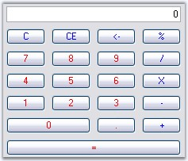{border="0"}

**[]{style="COLOR: #15428b"}** 

Figure 189: Financial Standard Layout Mode

**[]{style="COLOR: #15428b"}** 

::: {style="BORDER-BOTTOM: windowtext 1pt solid; BORDER-LEFT: medium none; PADDING-BOTTOM: 1pt; MARGIN-TOP: 9pt; PADDING-LEFT: 0pt; PADDING-RIGHT: 0pt; MARGIN-BOTTOM: 9pt; BORDER-TOP: windowtext 1pt solid; BORDER-RIGHT: medium none; PADDING-TOP: 1pt"}
{border="0"} Note:[ ]{style="COLOR: black; FONT-SIZE: 8pt"}We can set different button styles for the Calculator control, using CalculatorControl.ButtonStyle property. Refer Themes and Button Styles topic to know more. ButtonStyles can be applied to both the layout modes.
:::

[]{#_Background_Settings_1}3.3.2.3.3.2.2      Background Settings[]{#p251}

Background settings for a Calculator control is discussed in this section.

[]{style="COLOR: #15428b"} 

Background Color

[]{style="COLOR: #15428b"} 

The background of the Calculator can be painted using the below properties.

[]{style="COLOR: #15428b"} 

::: {align="center"}
  ------------------------------ ----------------------------------------------------------------------------------------------
  Calculatorcontrol Properties   Description
  BackColor                      Specifies BackColor of the Calculator control.
  BackgroundColor                Sets the gradient background for the control. This setting overrides the BackColor property.
  ------------------------------ ----------------------------------------------------------------------------------------------
:::

[]{style="COLOR: #15428b"} 

+-----------------------------------------------------------------------------------------------------------------------------------------------------------------------------------------------------------------------------------------------------------------------------------------------------------------------------------------------------------------------------------------------------+
| **[\[C#\]]{style="FONT-FAMILY: 'Courier New'; COLOR: black"}**                                                                                                                                                                                                                                                                                                                                      |
|                                                                                                                                                                                                                                                                                                                                                                                                     |
| []{style="FONT-FAMILY: 'Courier New'"}                                                                                                                                                                                                                                                                                                                                                              |
|                                                                                                                                                                                                                                                                                                                                                                                                     |
| [this]{style="FONT-FAMILY: 'Courier New'; COLOR: blue"}[.calculatorControl1.BackColor = System.Drawing.[Color]{style="COLOR: teal"}.WhiteSmoke;]{style="FONT-FAMILY: 'Courier New'"}                                                                                                                                                                                                                |
|                                                                                                                                                                                                                                                                                                                                                                                                     |
| [this]{style="FONT-FAMILY: 'Courier New'; COLOR: blue"}[.calculatorControl1.BackgroundColor = [new]{style="COLOR: blue"} Syncfusion.Drawing.[BrushInfo]{style="COLOR: teal"}(Syncfusion.Drawing.[GradientStyle]{style="COLOR: teal"}.Vertical, System.Drawing.[Color]{style="COLOR: teal"}.WhiteSmoke, System.Drawing.[Color]{style="COLOR: teal"}.SlateGray);]{style="FONT-FAMILY: 'Courier New'"} |
+-----------------------------------------------------------------------------------------------------------------------------------------------------------------------------------------------------------------------------------------------------------------------------------------------------------------------------------------------------------------------------------------------------+

[]{style="COLOR: #15428b"} 

+-----------------------------------------------------------------------------------------------------------------------------------------------------------------------------------------------------------------------------------------------------------------------------------------------------------------------------------------------------------------------------------------------------+
| **[\[VB.NET\]]{style="FONT-FAMILY: 'Courier New'; COLOR: black"}**                                                                                                                                                                                                                                                                                                                                  |
|                                                                                                                                                                                                                                                                                                                                                                                                     |
| []{style="FONT-FAMILY: 'Courier New'; COLOR: blue"}                                                                                                                                                                                                                                                                                                                                                 |
|                                                                                                                                                                                                                                                                                                                                                                                                     |
| [Me]{style="FONT-FAMILY: 'Courier New'; COLOR: blue"}[.calculatorControl1.BackColor = System.Drawing.[Color.WhiteSmoke]{style="COLOR: black"}]{style="FONT-FAMILY: 'Courier New'"}                                                                                                                                                                                                                  |
|                                                                                                                                                                                                                                                                                                                                                                                                     |
| [Me]{style="FONT-FAMILY: 'Courier New'; COLOR: blue"}[.calculatorControl1.BackgroundColor = [New]{style="COLOR: blue"} Syncfusion.Drawing.[BrushInfo]{style="COLOR: black"}(Syncfusion.Drawing.[GradientStyle]{style="COLOR: black"}.Vertical, System.Drawing.[Color]{style="COLOR: teal"}.WhiteSmoke, System.Drawing.[Color]{style="COLOR: black"}.SlateGray)]{style="FONT-FAMILY: 'Courier New'"} |
+-----------------------------------------------------------------------------------------------------------------------------------------------------------------------------------------------------------------------------------------------------------------------------------------------------------------------------------------------------------------------------------------------------+

**[]{style="COLOR: #333399"}** 

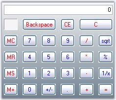{border="0"}

[]{style="COLOR: #15428b"} 

Figure 190: GradientStyle = \"Vertical\"; BackColor = \"WhiteSmoke\"; BackgroundColor = \"SlateGray\"

**[]{style="COLOR: #15428b"}** 

Background Image

**[]{style="COLOR: #15428b"}** 

The background of the Calculator control can be filled with an image using **BackgroundImage** property.

[]{style="COLOR: #15428b"} 

+---------------------------------------------------------------------------------------------------------------------------------------------------------------------------------------------------------------------------------------------------------------------------+
| **[\[C#\]]{style="FONT-FAMILY: 'Courier New'; COLOR: black"}**                                                                                                                                                                                                            |
|                                                                                                                                                                                                                                                                           |
| []{style="FONT-FAMILY: 'Courier New'"}                                                                                                                                                                                                                                    |
|                                                                                                                                                                                                                                                                           |
| [this]{style="FONT-FAMILY: 'Courier New'; COLOR: blue"}[.calculatorControl1.BackgroundImage = ((System.Drawing.[Image]{style="COLOR: teal"})(resources.GetObject([\"calculatorControl1.BackgroundImage\"]{style="COLOR: maroon"})));]{style="FONT-FAMILY: 'Courier New'"} |
|                                                                                                                                                                                                                                                                           |
| [this]{style="FONT-FAMILY: 'Courier New'; COLOR: blue"}[.calculatorControl1.BackgroundImageLayout = System.Windows.Forms.[ImageLayout]{style="COLOR: teal"}.Center;]{style="FONT-FAMILY: 'Courier New'"}                                                                  |
+---------------------------------------------------------------------------------------------------------------------------------------------------------------------------------------------------------------------------------------------------------------------------+

[]{style="COLOR: #15428b"} 

+-----------------------------------------------------------------------------------------------------------------------------------------------------------------------------------------------------------------------------------------------------------------------------------+
| **[\[VB.NET\]]{style="FONT-FAMILY: 'Courier New'; COLOR: black"}**                                                                                                                                                                                                                |
|                                                                                                                                                                                                                                                                                   |
| []{style="FONT-FAMILY: 'Courier New'; COLOR: blue"}                                                                                                                                                                                                                               |
|                                                                                                                                                                                                                                                                                   |
| [Me]{style="FONT-FAMILY: 'Courier New'; COLOR: blue"}[.calculatorControl1.BackgroundImage = [DirectCast]{style="COLOR: blue"}((resources.GetObject([\"calculatorControl1.BackgroundImage\"]{style="COLOR: maroon"})), System.Drawing.Image) ]{style="FONT-FAMILY: 'Courier New'"} |
|                                                                                                                                                                                                                                                                                   |
| [Me]{style="FONT-FAMILY: 'Courier New'; COLOR: blue"}[.calculatorControl1.BackgroundImageLayout = System.Windows.Forms[.ImageLayout.Center]{style="COLOR: black"}]{style="FONT-FAMILY: 'Courier New'"}                                                                            |
+-----------------------------------------------------------------------------------------------------------------------------------------------------------------------------------------------------------------------------------------------------------------------------------+

**[]{style="COLOR: #333399"}** 

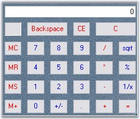{border="0"}

**[]{style="COLOR: #15428b"}** 

Figure 191: Background Image for Calculator

[]{#_Border_Styles_1}3.3.2.3.3.2.3      Border Styles

[]{#p252}**[]{style="COLOR: #333399"}** 

The below property will let you specify the border style for the Calculator control.

[]{style="COLOR: #15428b"} 

::: {align="center"}
+-----------------------------------+-----------------------------------------------------------------+
| Calculatorcontrol Properties      | Description                                                     |
+-----------------------------------+-----------------------------------------------------------------+
| BorderStyle                       | Specifies the 3D border style for the control. The options are, |
|                                   |                                                                 |
|                                   |                                                                 |
|                                   |                                                                 |
|                                   | [·      ]{style="FONT-FAMILY: Symbol"}*RaisedOuter*             |
|                                   |                                                                 |
|                                   | [·      ]{style="FONT-FAMILY: Symbol"}*RaisedInner*             |
|                                   |                                                                 |
|                                   | [·      ]{style="FONT-FAMILY: Symbol"}*SunkenOuter*             |
|                                   |                                                                 |
|                                   | [·      ]{style="FONT-FAMILY: Symbol"}*SunkenInner*             |
|                                   |                                                                 |
|                                   | [·      ]{style="FONT-FAMILY: Symbol"}*Raised*                  |
|                                   |                                                                 |
|                                   | [·      ]{style="FONT-FAMILY: Symbol"}*Sunken*                  |
|                                   |                                                                 |
|                                   | [·      ]{style="FONT-FAMILY: Symbol"}*Etched*                  |
|                                   |                                                                 |
|                                   | [·      ]{style="FONT-FAMILY: Symbol"}*Flat*                    |
|                                   |                                                                 |
|                                   | [·      ]{style="FONT-FAMILY: Symbol"}*Adjust*                  |
|                                   |                                                                 |
|                                   | [·      ]{style="FONT-FAMILY: Symbol"}*Bump*                    |
+-----------------------------------+-----------------------------------------------------------------+
:::

[]{style="COLOR: #15428b"} 

+--------------------------------------------------------------------------------------------------------------------------------------------------------------------------------------------------+
| **[\[C#\]]{style="FONT-FAMILY: 'Courier New'; COLOR: black"}**                                                                                                                                   |
|                                                                                                                                                                                                  |
| []{style="FONT-FAMILY: 'Courier New'"}                                                                                                                                                           |
|                                                                                                                                                                                                  |
| [this]{style="FONT-FAMILY: 'Courier New'; COLOR: blue"}[.calculatorControl1.BorderStyle = System.Windows.Forms.[Border3DStyle]{style="COLOR: teal"}.Etched;]{style="FONT-FAMILY: 'Courier New'"} |
+--------------------------------------------------------------------------------------------------------------------------------------------------------------------------------------------------+

[]{style="COLOR: #15428b"} 

+--------------------------------------------------------------------------------------------------------------------------------------------------------------------------------------------------+
| **[\[VB.NET\]]{style="FONT-FAMILY: 'Courier New'; COLOR: black"}**                                                                                                                               |
|                                                                                                                                                                                                  |
| []{style="FONT-FAMILY: 'Courier New'; COLOR: blue"}                                                                                                                                              |
|                                                                                                                                                                                                  |
| [this]{style="FONT-FAMILY: 'Courier New'; COLOR: blue"}[.calculatorControl1.BorderStyle = System.Windows.Forms.[Border3DStyle]{style="COLOR: teal"}.Etched;]{style="FONT-FAMILY: 'Courier New'"} |
+--------------------------------------------------------------------------------------------------------------------------------------------------------------------------------------------------+

**[]{style="COLOR: #333399"}** 

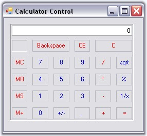{border="0"}

**[]{style="COLOR: #15428b"}** 

Figure 192: BorderStyle = \"Etched\"

[]{#p253}[]{#_Button_Spacing}3.3.2.3.3.2.4      Button Spacing

[]{style="COLOR: #15428b"} 

The default spacing between the Calculator buttons can be modified by enabling *UseVerticalAndHorizontalSpacing* property. The below properties controls the horizontal and vertical spacing.

[]{style="COLOR: #333399"} 

::: {align="center"}
  --------------------------------- ----------------------------------------------------------------------------------------------------------------------------------------------
  Calculatorcontrol Properties      Description
  UseVerticalAndHorizontalSpacing   Specifies whether horizontal and vertical spacing can be set using HorizontalSpacing and VerticalSpacing properties. By default it is false.
  HorizontalSpacing                 Sets horizontal spacing between buttons. The default value is 10. UseVerticalAndHorizontalSpacing must be set to true.
  VerticalSpacing                   Sets vertical spacing between buttons. The default value is 10. UseVerticalAndHorizontalSpacing must be set to true.
  --------------------------------- ----------------------------------------------------------------------------------------------------------------------------------------------
:::

[]{style="COLOR: #15428b"} 

+---------------------------------------------------------------------------------------------------------------------------------------------------------------------------------+
| **[\[C#\]]{style="FONT-FAMILY: 'Courier New'; COLOR: black"}**                                                                                                                  |
|                                                                                                                                                                                 |
| []{style="FONT-FAMILY: 'Courier New'"}                                                                                                                                          |
|                                                                                                                                                                                 |
| [this]{style="FONT-FAMILY: 'Courier New'; COLOR: blue"}[.calculatorControl1.UseVerticalAndHorizontalSpacing = [true]{style="COLOR: blue"};]{style="FONT-FAMILY: 'Courier New'"} |
|                                                                                                                                                                                 |
| [this]{style="FONT-FAMILY: 'Courier New'; COLOR: blue"}[.calculatorControl1.HorizontalSpacing = 5;]{style="FONT-FAMILY: 'Courier New'"}                                         |
|                                                                                                                                                                                 |
| [this]{style="FONT-FAMILY: 'Courier New'; COLOR: blue"}[.calculatorControl1.VerticalSpacing = 5;]{style="FONT-FAMILY: 'Courier New'"}                                           |
+---------------------------------------------------------------------------------------------------------------------------------------------------------------------------------+

[]{style="COLOR: #15428b"} 

+------------------------------------------------------------------------------------------------------------------------------------------------------------------------------+
| **[\[VB.NET\]]{style="FONT-FAMILY: 'Courier New'; COLOR: black"}**                                                                                                           |
|                                                                                                                                                                              |
| []{style="FONT-FAMILY: 'Courier New'; COLOR: blue"}                                                                                                                          |
|                                                                                                                                                                              |
| [Me]{style="FONT-FAMILY: 'Courier New'; COLOR: blue"}[.calculatorControl1.UseVerticalAndHorizontalSpacing = [True]{style="COLOR: blue"}]{style="FONT-FAMILY: 'Courier New'"} |
|                                                                                                                                                                              |
| [Me]{style="FONT-FAMILY: 'Courier New'; COLOR: blue"}[.calculatorControl1.HorizontalSpacing = 5]{style="FONT-FAMILY: 'Courier New'"}                                         |
|                                                                                                                                                                              |
| [Me]{style="FONT-FAMILY: 'Courier New'; COLOR: blue"}[.calculatorControl1.VerticalSpacing = 5]{style="FONT-FAMILY: 'Courier New'"}                                           |
+------------------------------------------------------------------------------------------------------------------------------------------------------------------------------+

**[]{style="COLOR: #15428b"}** 

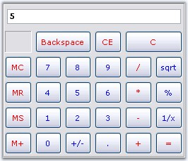{border="0"}

[]{style="COLOR: #15428b"} 

Figure 193: HorizontalSpacing = \"5\"; VerticalSpacing = \"5\"

 

[]{#p254}[]{#_Button_Foreground}3.3.2.3.3.2.5      Button Foreground

[]{style="COLOR: #15428b"} 

Using SetButtonFont and SetButtonColor properties, we can set the font style and color for the button text. The button can be identified using CalcActions enumerator.

[   ]{style="FONT-SIZE: 8pt"}

::: {align="center"}
+-----------------------------------+--------------------------------------------------------------------------------+
| Calculatorcontrol Methods         | Description                                                                    |
+-----------------------------------+--------------------------------------------------------------------------------+
| SetButtonColor                    | Sets text color for the calculator button. The parameters are,                 |
|                                   |                                                                                |
|                                   |                                                                                |
|                                   |                                                                                |
|                                   | *caCalcButton* - The calculator button,                                        |
|                                   |                                                                                |
|                                   | *color* - The color to set for the button text.                                |
+-----------------------------------+--------------------------------------------------------------------------------+
| SetButtonFont                     | Sets the font style for the text in the calculator button. The parameters are, |
|                                   |                                                                                |
|                                   |                                                                                |
|                                   |                                                                                |
|                                   | *caCalcButton* - The calculator button,                                        |
|                                   |                                                                                |
|                                   | *font* - The font style for the button text.                                   |
+-----------------------------------+--------------------------------------------------------------------------------+
:::

[]{style="FONT-SIZE: 8pt"} 

+--------------------------------------------------------------------------------------------------------------------------------------------------------------------------------------------------------------------------------------------------------------------------------------------------------------------------------+
| **[\[C#\]]{style="FONT-FAMILY: 'Courier New'; COLOR: black"}**                                                                                                                                                                                                                                                                 |
|                                                                                                                                                                                                                                                                                                                                |
| []{style="FONT-FAMILY: 'Courier New'; COLOR: black"}                                                                                                                                                                                                                                                                           |
|                                                                                                                                                                                                                                                                                                                                |
| [this]{style="FONT-FAMILY: 'Courier New'; COLOR: blue"}[.calculatorControl1.SetButtonColor([CalcActions]{style="COLOR: teal"}.CalcSpecialBackspace, [Color]{style="COLOR: teal"}.Black);]{style="FONT-FAMILY: 'Courier New'"}                                                                                                  |
|                                                                                                                                                                                                                                                                                                                                |
| [this]{style="FONT-FAMILY: 'Courier New'; COLOR: blue"}[.calculatorControl1.SetButtonFont([CalcActions]{style="COLOR: teal"}.CalcSpecialBackspace, [new]{style="COLOR: blue"} [Font]{style="COLOR: teal"}([\"Arial\"]{style="COLOR: maroon"}, 9, [FontStyle]{style="COLOR: teal"}.Bold));]{style="FONT-FAMILY: 'Courier New'"} |
+--------------------------------------------------------------------------------------------------------------------------------------------------------------------------------------------------------------------------------------------------------------------------------------------------------------------------------+

[]{style="COLOR: #15428b"} 

+--------------------------------------------------------------------------------------------------------------------------------------------------------------------------------------------------------------------------------------------------------------------------------------------------------------------------------+
| **[\[VB.NET\]]{style="FONT-FAMILY: 'Courier New'; COLOR: black"}**                                                                                                                                                                                                                                                             |
|                                                                                                                                                                                                                                                                                                                                |
| **[]{style="FONT-FAMILY: 'Courier New'"}**                                                                                                                                                                                                                                                                                     |
|                                                                                                                                                                                                                                                                                                                                |
| [Me]{style="FONT-FAMILY: 'Courier New'; COLOR: blue"}[.calculatorControl1.SetButtonColor([CalcActions]{style="COLOR: black"}.CalcSpecialBackspace, [Color]{style="COLOR: black"}.Black);]{style="FONT-FAMILY: 'Courier New'"}                                                                                                  |
|                                                                                                                                                                                                                                                                                                                                |
| [Me]{style="FONT-FAMILY: 'Courier New'; COLOR: blue"}[.calculatorControl1.SetButtonFont([CalcActions]{style="COLOR: black"}.CalcSpecialBackspace, [New]{style="COLOR: blue"} [Font]{style="COLOR: black"}([\"Arial\"]{style="COLOR: maroon"}, 9, [FontStyle]{style="COLOR: black"}.Bold))]{style="FONT-FAMILY: 'Courier New'"} |
+--------------------------------------------------------------------------------------------------------------------------------------------------------------------------------------------------------------------------------------------------------------------------------------------------------------------------------+

[]{style="COLOR: #15428b"} 

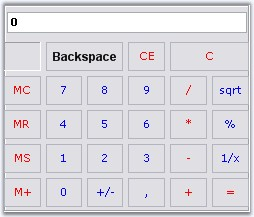{border="0"}

[]{style="COLOR: #15428b"} 

Figure 194: Backspace Button text Font Arial, 9, Bold; Color=\"Black\"

 

 

###### []{#_Runtime_Features_1}3.3.2.3.3.3 Runtime Features[]{#p255} {#runtime-features style="tab-stops: 0pt"}

[]{style="COLOR: #15428b"} 

This section elaborated keyboard support for the control.

[]{#p256}[]{#_Keyboard_Support}3.3.2.3.3.3.1      Keyboard Support

[]{style="COLOR: #15428b"} 

Essential Tools Calculator control does the functionality of a normal calculator, using the Mouse or Keyboard, at run time. The control provides Keyboard equivalents for the Calculator buttons. They are listed in the below table.

[]{style="COLOR: #15428b"} 

::: {align="center"}
+-----------------------+----------------------------------------------------------------------------------------------------------------------------------------------------------------------------------------------------------+-----------------------+
| Button                | Description                                                                                                                                                                                              | Keyboard Equivalent   |
+-----------------------+----------------------------------------------------------------------------------------------------------------------------------------------------------------------------------------------------------+-----------------------+
| Backspace             | Deletes the last digit of the displayed number.                                                                                                                                                          | BACKSPACE             |
+-----------------------+----------------------------------------------------------------------------------------------------------------------------------------------------------------------------------------------------------+-----------------------+
| CE                    | Clears the displayed number.                                                                                                                                                                             | DELETE                |
+-----------------------+----------------------------------------------------------------------------------------------------------------------------------------------------------------------------------------------------------+-----------------------+
| C                     | Clears the current calculation.                                                                                                                                                                          | ESC                   |
+-----------------------+----------------------------------------------------------------------------------------------------------------------------------------------------------------------------------------------------------+-----------------------+
| MC                    | Clears any number stored in memory.                                                                                                                                                                      | CTRL+L                |
+-----------------------+----------------------------------------------------------------------------------------------------------------------------------------------------------------------------------------------------------+-----------------------+
| 7                     | Puts this number in the calculator display.                                                                                                                                                              | 7                     |
+-----------------------+----------------------------------------------------------------------------------------------------------------------------------------------------------------------------------------------------------+-----------------------+
| 8                     | Puts this number in the calculator display.                                                                                                                                                              | 8                     |
+-----------------------+----------------------------------------------------------------------------------------------------------------------------------------------------------------------------------------------------------+-----------------------+
| 9                     | Puts this number in the calculator display.                                                                                                                                                              | 9                     |
+-----------------------+----------------------------------------------------------------------------------------------------------------------------------------------------------------------------------------------------------+-----------------------+
| /                     | Divides.                                                                                                                                                                                                 | /                     |
+-----------------------+----------------------------------------------------------------------------------------------------------------------------------------------------------------------------------------------------------+-----------------------+
| sqrt                  | Calculates the square root of the displayed number.                                                                                                                                                      | @                     |
+-----------------------+----------------------------------------------------------------------------------------------------------------------------------------------------------------------------------------------------------+-----------------------+
| MR                    | Recalls the number stored in memory. The number remains in memory.                                                                                                                                       | CTRL+R                |
+-----------------------+----------------------------------------------------------------------------------------------------------------------------------------------------------------------------------------------------------+-----------------------+
| 4                     | Puts this number in the calculator display.                                                                                                                                                              | 4                     |
+-----------------------+----------------------------------------------------------------------------------------------------------------------------------------------------------------------------------------------------------+-----------------------+
| 5                     | Puts this number in the calculator display.                                                                                                                                                              | 5                     |
+-----------------------+----------------------------------------------------------------------------------------------------------------------------------------------------------------------------------------------------------+-----------------------+
| 6                     | Puts this number in the calculator display.                                                                                                                                                              | 6                     |
+-----------------------+----------------------------------------------------------------------------------------------------------------------------------------------------------------------------------------------------------+-----------------------+
| \*                    | Multiplies.                                                                                                                                                                                              | \*                    |
+-----------------------+----------------------------------------------------------------------------------------------------------------------------------------------------------------------------------------------------------+-----------------------+
| \%                    | Displays the result of multiplication as a percentage. Enter on number, click , enter the second number, and then click %. For example, 50 \* 25 % will display 12.5.                                    | \%                    |
|                       |                                                                                                                                                                                                          |                       |
|                       |                                                                                                                                                                                                          |                       |
|                       |                                                                                                                                                                                                          |                       |
|                       | You can also perform operations with percentages. Enter one number, click the operator(+, -, \*, or /), enter the second number, click % and then click =.                                               |                       |
|                       |                                                                                                                                                                                                          |                       |
|                       |                                                                                                                                                                                                          |                       |
|                       |                                                                                                                                                                                                          |                       |
|                       | For example:                                                                                                                                                                                             |                       |
|                       |                                                                                                                                                                                                          |                       |
|                       |  50 + 25% (of 50) = 62.5.                                                                                                                                                                                |                       |
+-----------------------+----------------------------------------------------------------------------------------------------------------------------------------------------------------------------------------------------------+-----------------------+
| MS                    | Stores the displayed number in memory.                                                                                                                                                                   | CTRL+M                |
+-----------------------+----------------------------------------------------------------------------------------------------------------------------------------------------------------------------------------------------------+-----------------------+
| 1                     | Puts this number in the calculator display.                                                                                                                                                              | 1                     |
+-----------------------+----------------------------------------------------------------------------------------------------------------------------------------------------------------------------------------------------------+-----------------------+
| 2                     | Puts this number in the calculator display.                                                                                                                                                              | 2                     |
+-----------------------+----------------------------------------------------------------------------------------------------------------------------------------------------------------------------------------------------------+-----------------------+
| 3                     | Puts this number in the calculator display.                                                                                                                                                              | 3                     |
+-----------------------+----------------------------------------------------------------------------------------------------------------------------------------------------------------------------------------------------------+-----------------------+
| \-                    | Subtracts.                                                                                                                                                                                               | \-                    |
+-----------------------+----------------------------------------------------------------------------------------------------------------------------------------------------------------------------------------------------------+-----------------------+
| 1/x                   | Calculates the reciprocal of the displayed number.                                                                                                                                                       | R                     |
+-----------------------+----------------------------------------------------------------------------------------------------------------------------------------------------------------------------------------------------------+-----------------------+
| M+                    | Adds the displayed number to any number already in memory but does not display the sum of these numbers.                                                                                                 | CTRL+P                |
+-----------------------+----------------------------------------------------------------------------------------------------------------------------------------------------------------------------------------------------------+-----------------------+
| +/-                   | Changes the sign of the displayed number.                                                                                                                                                                | F9                    |
+-----------------------+----------------------------------------------------------------------------------------------------------------------------------------------------------------------------------------------------------+-----------------------+
| .                     | Inserts a decimal point. To use a different character for the decimal point, click start, point to settings, and then click control panel. Double click Regional Options and then click the Numbers tab. | . or ,                |
+-----------------------+----------------------------------------------------------------------------------------------------------------------------------------------------------------------------------------------------------+-----------------------+
| \+                    | Adds.                                                                                                                                                                                                    | \+                    |
+-----------------------+----------------------------------------------------------------------------------------------------------------------------------------------------------------------------------------------------------+-----------------------+
| =                     | Perform any operation on the previous two numbers. To repeat the last operation, click = again.                                                                                                          | Enter                 |
+-----------------------+----------------------------------------------------------------------------------------------------------------------------------------------------------------------------------------------------------+-----------------------+
:::

###### []{#p257}3.3.2.3.3.4 Style Settings {#style-settings style="tab-stops: 0pt"}

[]{style="COLOR: #15428b"} 

This section discusses on the following styles:

[]{style="COLOR: #15428b"} 

[]{#p258}[]{#_Button_Flat_Styles}3.3.2.3.3.4.1      Button Flat Styles

The flat styles for the button objects in a Calculator control is set using **CalculatorControl.FlatStyle** property. The styles are Flat, Popup, Standard (default) and System.

[]{style="COLOR: #15428b"} 

+------------------------------------------------------------------------------------------------------------------------------------------------------------------------------------------+
| **[\[C#\]]{style="FONT-FAMILY: 'Courier New'; COLOR: black"}**                                                                                                                           |
|                                                                                                                                                                                          |
| []{style="FONT-FAMILY: 'Courier New'"}                                                                                                                                                   |
|                                                                                                                                                                                          |
| [this]{style="FONT-FAMILY: 'Courier New'; COLOR: blue"}[.calculatorControl1.FlatStyle = System.Windows.Forms.[FlatStyle]{style="COLOR: teal"}.Flat;]{style="FONT-FAMILY: 'Courier New'"} |
+------------------------------------------------------------------------------------------------------------------------------------------------------------------------------------------+

[]{style="COLOR: #15428b"} 

+----------------------------------------------------------------------------------------------------------------------------------------------------------------------------------------+
| **[\[VB.NET\]]{style="FONT-FAMILY: 'Courier New'; COLOR: black"}**                                                                                                                     |
|                                                                                                                                                                                        |
| []{style="FONT-FAMILY: 'Courier New'; COLOR: blue"}                                                                                                                                    |
|                                                                                                                                                                                        |
| [Me]{style="FONT-FAMILY: 'Courier New'; COLOR: blue"}[.calculatorControl1.FlatStyle = System.Windows.Forms.[FlatStyle]{style="COLOR: black"}.Flat]{style="FONT-FAMILY: 'Courier New'"} |
+----------------------------------------------------------------------------------------------------------------------------------------------------------------------------------------+

**[]{style="COLOR: #333399"}** 

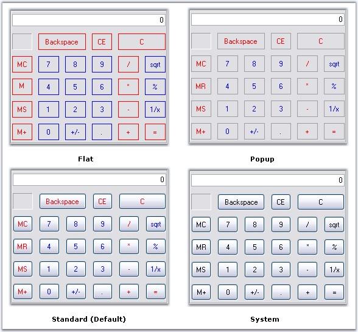{border="0"}

**[]{style="COLOR: #15428b"}** 

Figure 195: Flat Styles set for Calculator Control

[]{#_Themes_and_Button}3.3.2.3.3.4.2      Themes and Button Styles

[]{#p259}[]{style="COLOR: #15428b"} 

Themes for the Calculator control

[]{style="COLOR: #15428b"} 

Essential Tools Calculator control is themed by default. To disable, set **ThemesEnabled** property to false.

[]{style="COLOR: #15428b"} 

+----------------------------------------------------------------------------------------------------------------------------------------------------------------+
| **[\[C#\]]{style="FONT-FAMILY: 'Courier New'; COLOR: black"}**                                                                                                 |
|                                                                                                                                                                |
| **[]{style="FONT-FAMILY: 'Courier New'; COLOR: black"}**                                                                                                       |
|                                                                                                                                                                |
| [this]{style="FONT-FAMILY: 'Courier New'; COLOR: blue"}[.calculatorControl1.ThemesEnabled = [false]{style="COLOR: blue"};]{style="FONT-FAMILY: 'Courier New'"} |
+----------------------------------------------------------------------------------------------------------------------------------------------------------------+

[]{style="COLOR: #15428b"} 

+-------------------------------------------------------------------------------------------------------------------------------------------------------------+
| **[\[VB.NET\]]{style="FONT-FAMILY: 'Courier New'; COLOR: black"}**                                                                                          |
|                                                                                                                                                             |
| **[]{style="FONT-FAMILY: 'Courier New'; COLOR: black"}**                                                                                                    |
|                                                                                                                                                             |
| [Me]{style="FONT-FAMILY: 'Courier New'; COLOR: blue"}[.calculatorControl1.ThemesEnabled = [False]{style="COLOR: blue"}]{style="FONT-FAMILY: 'Courier New'"} |
+-------------------------------------------------------------------------------------------------------------------------------------------------------------+

[]{style="FONT-SIZE: 8pt"} 

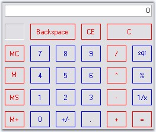{border="0"}

[]{style="COLOR: #15428b"} 

***[]{style="COLOR: #15428b"}*** 

Figure 196: Calculator Control Without Themes

[]{style="COLOR: #15428b"} 

Button Styles

[]{style="COLOR: #15428b"} 

The Calculator control supports the below button styles. **UseVisualStyle** property should be set to true to enable button styles for the control.

[]{style="COLOR: #15428b"} 

[·      ]{style="FONT-FAMILY: Symbol"}Classic (default)

[·      ]{style="FONT-FAMILY: Symbol"}Office2000

[·      ]{style="FONT-FAMILY: Symbol"}WindowsXP

[·      ]{style="FONT-FAMILY: Symbol"}OfficeXP

[·      ]{style="FONT-FAMILY: Symbol"}Office2003

[·      ]{style="FONT-FAMILY: Symbol"}Office2007

[]{style="COLOR: #15428b"} 

+-------------------------------------------------------------------------------------------------------------------------------------------------------------------------------------------------------------+
| **[\[C#\]]{style="FONT-FAMILY: 'Courier New'; COLOR: black"}**                                                                                                                                              |
|                                                                                                                                                                                                             |
| **[]{style="FONT-FAMILY: 'Courier New'; COLOR: black"}**                                                                                                                                                    |
|                                                                                                                                                                                                             |
| [this]{style="FONT-FAMILY: 'Courier New'; COLOR: blue"}[.calculatorControl1.UseVisualStyle = [true]{style="COLOR: blue"};]{style="FONT-FAMILY: 'Courier New'"}                                              |
|                                                                                                                                                                                                             |
| [//Setting Office2007 button style for the calculator control]{style="FONT-FAMILY: 'Courier New'; COLOR: green"}                                                                                            |
|                                                                                                                                                                                                             |
| [this]{style="FONT-FAMILY: 'Courier New'; COLOR: blue"}[.calculatorControl1.ButtonStyle = Syncfusion.Windows.Forms.[ButtonAppearance]{style="COLOR: teal"}.Office2007;]{style="FONT-FAMILY: 'Courier New'"} |
+-------------------------------------------------------------------------------------------------------------------------------------------------------------------------------------------------------------+

[]{style="COLOR: #15428b"} 

+-------------------------------------------------------------------------------------------------------------------------------------------------------------------------------------------------------------+
| **[\[VB.NET\]]{style="FONT-FAMILY: 'Courier New'; COLOR: black"}**                                                                                                                                          |
|                                                                                                                                                                                                             |
| **[]{style="FONT-FAMILY: 'Courier New'; COLOR: black"}**                                                                                                                                                    |
|                                                                                                                                                                                                             |
| [Me]{style="FONT-FAMILY: 'Courier New'; COLOR: blue"}[.calculatorControl1.UseVisualStyle = [True]{style="COLOR: blue"}]{style="FONT-FAMILY: 'Courier New'"}                                                 |
|                                                                                                                                                                                                             |
| [\'Setting Office2007 button style for the calculator control]{style="FONT-FAMILY: 'Courier New'; COLOR: green"}                                                                                            |
|                                                                                                                                                                                                             |
| [this]{style="FONT-FAMILY: 'Courier New'; COLOR: blue"}[.calculatorControl1.ButtonStyle = Syncfusion.Windows.Forms.[ButtonAppearance]{style="COLOR: teal"}.Office2007;]{style="FONT-FAMILY: 'Courier New'"} |
+-------------------------------------------------------------------------------------------------------------------------------------------------------------------------------------------------------------+

[]{style="FONT-SIZE: 8pt"} 

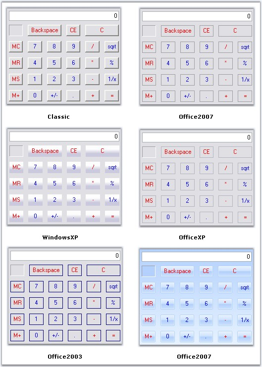{border="0"}

**[]{style="COLOR: #15428b"}** 

Figure 197: ButtonStyles for Calculator Control

**[]{style="COLOR: #15428b"}** 

OfficeColor Schemes

**[]{style="COLOR: #15428b"}** 

Essential Tools Calculator control supports all the three OfficeColorSchemes. When the ButtonStyle is set to Office2007 style, the color schemes will be blue by default. It can be modified using **Office2007Theme** property.

[]{style="COLOR: #15428b"} 

+------------------------------------------------------------------------------------------------------------------------------------------------------------------------------------------------------------+
| **[\[C#\]]{style="FONT-FAMILY: 'Courier New'; COLOR: black"}**                                                                                                                                             |
|                                                                                                                                                                                                            |
| **[]{style="FONT-FAMILY: 'Courier New'; COLOR: black"}**                                                                                                                                                   |
|                                                                                                                                                                                                            |
| [this]{style="FONT-FAMILY: 'Courier New'; COLOR: blue"}[.calculatorControl1.Office2007Theme = Syncfusion.Windows.Forms.[Office2007Theme]{style="COLOR: teal"}.Silver;]{style="FONT-FAMILY: 'Courier New'"} |
+------------------------------------------------------------------------------------------------------------------------------------------------------------------------------------------------------------+

[]{style="COLOR: #15428b"} 

+----------------------------------------------------------------------------------------------------------------------------------------------------------------------------------------------------------+
| **[\[VB.NET\]]{style="FONT-FAMILY: 'Courier New'; COLOR: black"}**                                                                                                                                       |
|                                                                                                                                                                                                          |
| **[]{style="FONT-FAMILY: 'Courier New'; COLOR: black"}**                                                                                                                                                 |
|                                                                                                                                                                                                          |
| [Me]{style="FONT-FAMILY: 'Courier New'; COLOR: blue"}[.calculatorControl1.Office2007Theme = Syncfusion.Windows.Forms.[Office2007Theme.Silver]{style="COLOR: black"}]{style="FONT-FAMILY: 'Courier New'"} |
+----------------------------------------------------------------------------------------------------------------------------------------------------------------------------------------------------------+

[]{style="FONT-SIZE: 8pt"} 

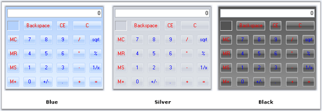{border="0"}

**[]{style="COLOR: #15428b"}** 

Figure 198: OfficeColor Schemes applied to Calculator Control

**[]{style="COLOR: #15428b"}** 

Custom Colors

[]{style="COLOR: #15428b"} 

We can also apply custom colors to the Calculator control by setting Office2007Theme to \"Managed\" and specifying the custom color through the **ApplyManagedColors** method as follows.

[]{style="COLOR: #15428b"} 

+-------------------------------------------------------------------------------------------------------------------------------------------------------------------------------------------------------------+
| **[\[C#\]]{style="FONT-FAMILY: 'Courier New'; COLOR: black"}**                                                                                                                                              |
|                                                                                                                                                                                                             |
| []{style="COLOR: #15428b"}                                                                                                                                                                                  |
|                                                                                                                                                                                                             |
| [this]{style="FONT-FAMILY: 'Courier New'; COLOR: blue"}[.calculatorControl1.Office2007Theme = Syncfusion.Windows.Forms.[Office2007Theme]{style="COLOR: teal"}.Managed;]{style="FONT-FAMILY: 'Courier New'"} |
|                                                                                                                                                                                                             |
| [Office2007Colors]{style="FONT-FAMILY: 'Courier New'; COLOR: teal"}[.ApplyManagedColors([this]{style="COLOR: blue"}, [Color]{style="COLOR: teal"}.Navy);]{style="FONT-FAMILY: 'Courier New'"}               |
+-------------------------------------------------------------------------------------------------------------------------------------------------------------------------------------------------------------+

[]{style="COLOR: #15428b"} 

+-----------------------------------------------------------------------------------------------------------------------------------------------------------------------------------------------------------+
| **[\[VB.NET\]]{style="FONT-FAMILY: 'Courier New'; COLOR: black"}**                                                                                                                                        |
|                                                                                                                                                                                                           |
| []{style="COLOR: #15428b"}                                                                                                                                                                                |
|                                                                                                                                                                                                           |
| [Me]{style="FONT-FAMILY: 'Courier New'; COLOR: blue"}[.calculatorControl1.Office2007Theme = Syncfusion.Windows.Forms.[Office2007Theme]{style="COLOR: teal"}.Managed;]{style="FONT-FAMILY: 'Courier New'"} |
|                                                                                                                                                                                                           |
| [Office2007Colors.]{style="FONT-FAMILY: 'Courier New'; COLOR: black"}[ApplyManagedColors([Me]{style="COLOR: blue"}, [Color]{style="COLOR: black"}.Navy)]{style="FONT-FAMILY: 'Courier New'"}              |
+-----------------------------------------------------------------------------------------------------------------------------------------------------------------------------------------------------------+

[]{style="COLOR: #15428b"} 

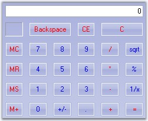{border="0"}

Figure 199: CustomColor = \"Navy\"

 

 

###### []{#p260}[]{#_Popup_CalculatorControl}3.3.2.3.3.5 Popup CalculatorControl {#popup-calculatorcontrol style="tab-stops: 0pt"}

[]{style="COLOR: #15428b"} 

The**[ ]{style="COLOR: black"}PopupCalculator** class can be used to display a popup Calculator control. This class can be created programmatically.

 

The PopupCalculator control lets you embed a Calculator control object to a button for example. Drop the button onto the form and add the following code snippet.

[]{style="COLOR: #15428b"} 

+-------------------------------------------------------------------------------------------------------------------------------------------------------------------------------------------------------------------------+
| **[\[C#\]]{style="FONT-FAMILY: 'Courier New'; COLOR: black"}**                                                                                                                                                          |
|                                                                                                                                                                                                                         |
| **[]{style="FONT-FAMILY: 'Courier New'; COLOR: black"}**                                                                                                                                                                |
|                                                                                                                                                                                                                         |
| [private]{style="FONT-FAMILY: 'Courier New'; COLOR: blue"}[ Syncfusion.Windows.Forms.Tools.PopupCalculator popupCalculator1;]{style="FONT-FAMILY: 'Courier New'"}                                                       |
|                                                                                                                                                                                                                         |
| []{style="FONT-FAMILY: 'Courier New'; COLOR: black"}                                                                                                                                                                    |
|                                                                                                                                                                                                                         |
| [private]{style="FONT-FAMILY: 'Courier New'; COLOR: blue"}[ [void]{style="COLOR: blue"} buttonAdv1_Click([object]{style="COLOR: blue"} sender, [EventArgs]{style="COLOR: teal"} e)]{style="FONT-FAMILY: 'Courier New'"} |
|                                                                                                                                                                                                                         |
| [{]{style="FONT-FAMILY: 'Courier New'"}                                                                                                                                                                                 |
|                                                                                                                                                                                                                         |
| [    [// Create the Popup Calculator.]{style="COLOR: green"}]{style="FONT-FAMILY: 'Courier New'"}                                                                                                                       |
|                                                                                                                                                                                                                         |
| [    popupCalculator1 = [new]{style="COLOR: blue"} Syncfusion.Windows.Forms.Tools.[PopupCalculator]{style="COLOR: teal"}();]{style="FONT-FAMILY: 'Courier New'"}                                                        |
|                                                                                                                                                                                                                         |
| []{style="FONT-FAMILY: 'Courier New'"}                                                                                                                                                                                  |
|                                                                                                                                                                                                                         |
| [    [// The control that will act as the Popup\'s parent.]{style="COLOR: green"}]{style="FONT-FAMILY: 'Courier New'"}                                                                                                  |
|                                                                                                                                                                                                                         |
| [    [this]{style="COLOR: blue"}.popupCalculator1.ParentControl = [this]{style="COLOR: blue"}.button1;]{style="FONT-FAMILY: 'Courier New'"}                                                                             |
|                                                                                                                                                                                                                         |
| []{style="FONT-FAMILY: 'Courier New'"}                                                                                                                                                                                  |
|                                                                                                                                                                                                                         |
| [    [// Set the alignment.]{style="COLOR: green"}]{style="FONT-FAMILY: 'Courier New'"}                                                                                                                                 |
|                                                                                                                                                                                                                         |
| [    [this]{style="COLOR: blue"}.popupCalculator1.PopupCalculatorAlignment = Syncfusion.Windows.Forms.Tools.[CalculatorPopupAlignment]{style="COLOR: teal"}.Right;]{style="FONT-FAMILY: 'Courier New'"}                 |
|                                                                                                                                                                                                                         |
| []{style="FONT-FAMILY: 'Courier New'"}                                                                                                                                                                                  |
|                                                                                                                                                                                                                         |
| [    [// Display the Calculator control.]{style="COLOR: green"}]{style="FONT-FAMILY: 'Courier New'"}                                                                                                                    |
|                                                                                                                                                                                                                         |
| [    [this]{style="COLOR: blue"}.popupCalculator1.DisplayCalculator([Point]{style="COLOR: teal"}.Empty);]{style="FONT-FAMILY: 'Courier New'"}                                                                           |
|                                                                                                                                                                                                                         |
| []{style="FONT-FAMILY: 'Courier New'"}                                                                                                                                                                                  |
|                                                                                                                                                                                                                         |
| [    [//Sets the size of the calculator]{style="COLOR: green"}]{style="FONT-FAMILY: 'Courier New'"}                                                                                                                     |
|                                                                                                                                                                                                                         |
| [    [this]{style="COLOR: blue"}.popupCalculator1.Size = [this]{style="COLOR: blue"}.calculatorControl1.Size;]{style="FONT-FAMILY: 'Courier New'"}                                                                      |
|                                                                                                                                                                                                                         |
| [}]{style="FONT-FAMILY: 'Courier New'"}                                                                                                                                                                                 |
+-------------------------------------------------------------------------------------------------------------------------------------------------------------------------------------------------------------------------+

[]{style="COLOR: #15428b"} 

+---------------------------------------------------------------------------------------------------------------------------------------------------------------------------------------------------------------------------------------------------------------------------------------------------------------+
| **[\[VB.NET\]]{style="FONT-FAMILY: 'Courier New'; COLOR: black"}**                                                                                                                                                                                                                                            |
|                                                                                                                                                                                                                                                                                                               |
| **[]{style="FONT-FAMILY: 'Courier New'; COLOR: black"}**                                                                                                                                                                                                                                                      |
|                                                                                                                                                                                                                                                                                                               |
| [Private]{style="FONT-FAMILY: 'Courier New'; COLOR: blue"}[ popupCalculator1 [As]{style="COLOR: blue"} Syncfusion.Windows.Forms.Tools.PopupCalculator]{style="FONT-FAMILY: 'Courier New'"}                                                                                                                    |
|                                                                                                                                                                                                                                                                                                               |
| []{style="FONT-FAMILY: 'Courier New'; COLOR: black"}                                                                                                                                                                                                                                                          |
|                                                                                                                                                                                                                                                                                                               |
| [Private]{style="FONT-FAMILY: 'Courier New'; COLOR: blue"}[ [Sub]{style="COLOR: blue"} buttonAdv1_Click([ByVal]{style="COLOR: blue"} sender [As]{style="COLOR: blue"} [Object]{style="COLOR: blue"}, [ByVal]{style="COLOR: blue"} e [As]{style="COLOR: blue"} EventArgs)]{style="FONT-FAMILY: 'Courier New'"} |
|                                                                                                                                                                                                                                                                                                               |
| [    [\' Create the Popup Calculator. ]{style="COLOR: green"}]{style="FONT-FAMILY: 'Courier New'"}                                                                                                                                                                                                            |
|                                                                                                                                                                                                                                                                                                               |
| [    popupCalculator1 = [New]{style="COLOR: blue"} Syncfusion.Windows.Forms.Tools.PopupCalculator()]{style="FONT-FAMILY: 'Courier New'"}                                                                                                                                                                      |
|                                                                                                                                                                                                                                                                                                               |
| []{style="FONT-FAMILY: 'Courier New'"}                                                                                                                                                                                                                                                                        |
|                                                                                                                                                                                                                                                                                                               |
| [    [\' The control that will act as the Popup\'s parent. ]{style="COLOR: green"}]{style="FONT-FAMILY: 'Courier New'"}                                                                                                                                                                                       |
|                                                                                                                                                                                                                                                                                                               |
| [    [Me]{style="COLOR: blue"}.popupCalculator1.ParentControl = [Me]{style="COLOR: blue"}.button1]{style="FONT-FAMILY: 'Courier New'"}                                                                                                                                                                        |
|                                                                                                                                                                                                                                                                                                               |
| []{style="FONT-FAMILY: 'Courier New'"}                                                                                                                                                                                                                                                                        |
|                                                                                                                                                                                                                                                                                                               |
| [    [\' Set the alignment. ]{style="COLOR: green"}]{style="FONT-FAMILY: 'Courier New'"}                                                                                                                                                                                                                      |
|                                                                                                                                                                                                                                                                                                               |
| [    [Me]{style="COLOR: blue"}.popupCalculator1.PopupCalculatorAlignment = Syncfusion.Windows.Forms.Tools.CalculatorPopupAlignment.Right]{style="FONT-FAMILY: 'Courier New'"}                                                                                                                                 |
|                                                                                                                                                                                                                                                                                                               |
| []{style="FONT-FAMILY: 'Courier New'"}                                                                                                                                                                                                                                                                        |
|                                                                                                                                                                                                                                                                                                               |
| [    [\' Display the Calculator control. ]{style="COLOR: green"}]{style="FONT-FAMILY: 'Courier New'"}                                                                                                                                                                                                         |
|                                                                                                                                                                                                                                                                                                               |
| [    [Me]{style="COLOR: blue"}.popupCalculator1.DisplayCalculator(Point.Empty)]{style="FONT-FAMILY: 'Courier New'"}                                                                                                                                                                                           |
|                                                                                                                                                                                                                                                                                                               |
| []{style="FONT-FAMILY: 'Courier New'"}                                                                                                                                                                                                                                                                        |
|                                                                                                                                                                                                                                                                                                               |
| [    [\'Sets the size of the calculator ]{style="COLOR: green"}]{style="FONT-FAMILY: 'Courier New'"}                                                                                                                                                                                                          |
|                                                                                                                                                                                                                                                                                                               |
| [    [Me]{style="COLOR: blue"}.popupCalculator1.Size = [Me]{style="COLOR: blue"}.calculatorControl1.Size]{style="FONT-FAMILY: 'Courier New'"}                                                                                                                                                                 |
|                                                                                                                                                                                                                                                                                                               |
| [End]{style="FONT-FAMILY: 'Courier New'; COLOR: blue"}[ [Sub]{style="COLOR: blue"}]{style="FONT-FAMILY: 'Courier New'"}                                                                                                                                                                                       |
+---------------------------------------------------------------------------------------------------------------------------------------------------------------------------------------------------------------------------------------------------------------------------------------------------------------+

[]{style="FONT-FAMILY: 'Courier New'"} 

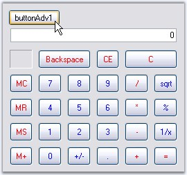{border="0"}

Figure 200: Calculator Control Using PopupCalculator Class

 

 

[]{#related-topics}
:::::::::::
