::: {style="DISPLAY: none"}
{#d2h_url_template}{#d2h_package_url style="WIDTH: 0px; DISPLAY: none; HEIGHT: 0px"}
:::

::::::::::::::::::::::: {.d2h_secondary_topic style="PADDING-BOTTOM: 10pt; MARGIN: 0pt; PADDING-LEFT: 0pt; PADDING-RIGHT: 0pt; PADDING-TOP: 0pt"}
##### [        ]{style="COLOR: windowtext; TEXT-DECORATION: none; text-underline: none"}Concepts and Features {#concepts-and-features style="tab-stops: 0pt"}

**[]{style="COLOR: black"}** 

This section discusses the concepts of MonthCalendarAdv in some commonly used scenarios.

[]{style="COLOR: #15428b"} 

###### []{#p273}[]{#_Calendar_Appearance}3.3.3.1.4.1 Calendar Appearance {#calendar-appearance style="tab-stops: 0pt"}

[]{style="COLOR: #15428b"} 

This section comprises the appearance settings under the following topics:

[]{style="COLOR: #15428b"} 

[]{#p274}3.3.3.1.4.1.1      Border Styles

Border for a MonthCalendarAdv control can be in 2D or 3D modes. The below properties controls the border settings for the MonthCalendarAdv control.

[]{style="COLOR: #15428b"} 

::: {align="center"}
+-----------------------------------+------------------------------------------------------------------------------------------------------+
| Properties                        | Description                                                                                          |
+-----------------------------------+------------------------------------------------------------------------------------------------------+
| BorderStyle                       | Specifies whether the control should have a 2D or a 3D border. The options are,                      |
|                                   |                                                                                                      |
|                                   |                                                                                                      |
|                                   |                                                                                                      |
|                                   | *FixedSingle,*                                                                                       |
|                                   |                                                                                                      |
|                                   | *Fixed3D and*                                                                                        |
|                                   |                                                                                                      |
|                                   | *None (default).*                                                                                    |
+-----------------------------------+------------------------------------------------------------------------------------------------------+
| Border3DStyle                     | Sets 3D border style for the MonthCalendarAdv control, when the BorderStyle=Fixed3D. The styles are, |
|                                   |                                                                                                      |
|                                   |                                                                                                      |
|                                   |                                                                                                      |
|                                   | *Raised,*                                                                                            |
|                                   |                                                                                                      |
|                                   | *RaisedOuter,*                                                                                       |
|                                   |                                                                                                      |
|                                   | *RaisedInner,*                                                                                       |
|                                   |                                                                                                      |
|                                   | *Sunken (default),*                                                                                  |
|                                   |                                                                                                      |
|                                   | *SunkenOuter,*                                                                                       |
|                                   |                                                                                                      |
|                                   | *SunkenInner,*                                                                                       |
|                                   |                                                                                                      |
|                                   | *Etched,*                                                                                            |
|                                   |                                                                                                      |
|                                   | *Bump,*                                                                                              |
|                                   |                                                                                                      |
|                                   | *Adjust and*                                                                                         |
|                                   |                                                                                                      |
|                                   | *Flat.*                                                                                              |
+-----------------------------------+------------------------------------------------------------------------------------------------------+
| BorderSides                       | Specifies the sides of the control which can have a border. The sides options are,                   |
|                                   |                                                                                                      |
|                                   |                                                                                                      |
|                                   |                                                                                                      |
|                                   | *Left,*                                                                                              |
|                                   |                                                                                                      |
|                                   | *Top,*                                                                                               |
|                                   |                                                                                                      |
|                                   | *Right,*                                                                                             |
|                                   |                                                                                                      |
|                                   | *Bottom,*                                                                                            |
|                                   |                                                                                                      |
|                                   | *Middle and*                                                                                         |
|                                   |                                                                                                      |
|                                   | *All (default).*                                                                                     |
+-----------------------------------+------------------------------------------------------------------------------------------------------+
| BorderColor                       | Specifies the 2D border color when BorderStyle=\"FixedSingle\".                                      |
+-----------------------------------+------------------------------------------------------------------------------------------------------+
:::

[]{style="COLOR: #15428b"} 

+--------------------------------------------------------------------------------------------------------------------------------------------------------------------------------------------------------+
| **[\[C#\]]{style="FONT-FAMILY: 'Courier New'; COLOR: black"}**                                                                                                                                         |
|                                                                                                                                                                                                        |
| []{style="FONT-FAMILY: 'Courier New'; COLOR: black"}                                                                                                                                                   |
|                                                                                                                                                                                                        |
| [//Setting 3D border style ]{style="FONT-FAMILY: 'Courier New'; COLOR: green"}                                                                                                                         |
|                                                                                                                                                                                                        |
| [this]{style="FONT-FAMILY: 'Courier New'; COLOR: blue"}[.monthCalendarAdv1.BorderStyle = System.Windows.Forms.[BorderStyle]{style="COLOR: teal"}.Fixed3D;]{style="FONT-FAMILY: 'Courier New'"}         |
|                                                                                                                                                                                                        |
| [//Setting \"SunkenInner\" 3D border style]{style="FONT-FAMILY: 'Courier New'; COLOR: green"}                                                                                                          |
|                                                                                                                                                                                                        |
| [this]{style="FONT-FAMILY: 'Courier New'; COLOR: blue"}[.monthCalendarAdv1.Border3DStyle = System.Windows.Forms.[Border3DStyle]{style="COLOR: teal"}.SunkenInner;]{style="FONT-FAMILY: 'Courier New'"} |
+--------------------------------------------------------------------------------------------------------------------------------------------------------------------------------------------------------+

[]{style="COLOR: #15428b"} 

+------------------------------------------------------------------------------------------------------------------------------------------------------------------------------------------------------+
| **[\[VB.NET\]]{style="FONT-FAMILY: 'Courier New'; COLOR: black"}**                                                                                                                                   |
|                                                                                                                                                                                                      |
| []{style="COLOR: #15428b"}                                                                                                                                                                           |
|                                                                                                                                                                                                      |
| [\'Setting 3D border style ]{style="FONT-FAMILY: 'Courier New'; COLOR: green"}                                                                                                                       |
|                                                                                                                                                                                                      |
| [Me]{style="FONT-FAMILY: 'Courier New'; COLOR: blue"}[.monthCalendarAdv1.BorderStyle = System.Windows.Forms.[BorderStyle]{style="COLOR: black"}.Fixed3D]{style="FONT-FAMILY: 'Courier New'"}         |
|                                                                                                                                                                                                      |
| [\'Setting \"SunkenInner\" 3D border style]{style="FONT-FAMILY: 'Courier New'; COLOR: green"}                                                                                                        |
|                                                                                                                                                                                                      |
| [Me]{style="FONT-FAMILY: 'Courier New'; COLOR: blue"}[.monthCalendarAdv1.Border3DStyle = System.Windows.Forms.[Border3DStyle]{style="COLOR: black"}.SunkenInner]{style="FONT-FAMILY: 'Courier New'"} |
+------------------------------------------------------------------------------------------------------------------------------------------------------------------------------------------------------+

[]{style="COLOR: #15428b"} 

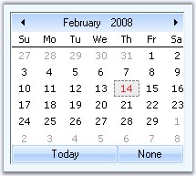{border="0"}

[]{style="COLOR: #15428b"} 

Figure 209: Border3DStyle = \"SunkenInner\"

**[]{style="COLOR: #15428b"}** 

::: {style="BORDER-BOTTOM: windowtext 1pt solid; BORDER-LEFT: medium none; PADDING-BOTTOM: 1pt; MARGIN-TOP: 9pt; PADDING-LEFT: 0pt; PADDING-RIGHT: 0pt; MARGIN-BOTTOM: 9pt; BORDER-TOP: windowtext 1pt solid; BORDER-RIGHT: medium none; PADDING-TOP: 1pt"}
{border="0"} Note:[ ]{style="COLOR: black; FONT-SIZE: 8pt"}MonthCalendarAdv.ThemedBorder property should be set to false to make the 3D border setting effective. Refer ***[[Visual Settings.]{style="FONT-STYLE: normal; LAYOUT-GRID-MODE: both; FONT-SIZE: 10pt; FONT-WEIGHT: normal"}]{style="LAYOUT-GRID-MODE: line; COLOR: black; FONT-SIZE: 9pt"}***
:::

[[Visual Settings.]{style="COLOR: blue"}]{.UGHyperlink}

**[]{style="FONT-FAMILY: 'Segoe UI','sans-serif'; COLOR: #15428b"}** 

+---------------------------------------------------------------------------------------------------------------------------------------------------------------------------------------------+
| **[\[C#\]]{style="FONT-FAMILY: 'Courier New'; COLOR: black"}**                                                                                                                              |
|                                                                                                                                                                                             |
| []{style="FONT-FAMILY: 'Courier New'; COLOR: black"}                                                                                                                                        |
|                                                                                                                                                                                             |
| [//Setting border to \"All\" sides]{style="FONT-FAMILY: 'Courier New'; COLOR: green"}                                                                                                       |
|                                                                                                                                                                                             |
| [this]{style="FONT-FAMILY: 'Courier New'; COLOR: blue"}[.monthCalendarAdv1.BorderSides = System.Windows.Forms.[Border3DSide]{style="COLOR: teal"}.All;]{style="FONT-FAMILY: 'Courier New'"} |
|                                                                                                                                                                                             |
| [//Setting color for 2D border]{style="FONT-FAMILY: 'Courier New'; COLOR: green"}                                                                                                           |
|                                                                                                                                                                                             |
| [this]{style="FONT-FAMILY: 'Courier New'; COLOR: blue"}[.monthCalendarAdv1.BorderColor = System.Drawing.[Color]{style="COLOR: teal"}.DodgerBlue;]{style="FONT-FAMILY: 'Courier New'"}       |
+---------------------------------------------------------------------------------------------------------------------------------------------------------------------------------------------+

[]{style="COLOR: #15428b"} 

+-------------------------------------------------------------------------------------------------------------------------------------------------------------------------------------------+
| **[\[VB.NET\]]{style="FONT-FAMILY: 'Courier New'; COLOR: black"}**                                                                                                                        |
|                                                                                                                                                                                           |
| []{style="COLOR: #15428b"}                                                                                                                                                                |
|                                                                                                                                                                                           |
| [\'Setting border to \"All\" sides]{style="FONT-FAMILY: 'Courier New'; COLOR: green"}                                                                                                     |
|                                                                                                                                                                                           |
| [Me]{style="FONT-FAMILY: 'Courier New'; COLOR: blue"}[.monthCalendarAdv1.BorderSides = System.Windows.Forms.[Border3DSide]{style="COLOR: black"}.All]{style="FONT-FAMILY: 'Courier New'"} |
|                                                                                                                                                                                           |
| [\'Setting color for 2D border]{style="FONT-FAMILY: 'Courier New'; COLOR: green"}                                                                                                         |
|                                                                                                                                                                                           |
| [this]{style="FONT-FAMILY: 'Courier New'; COLOR: blue"}[.monthCalendarAdv1.BorderColor = System.Drawing.[Color]{style="COLOR: black"}.DodgerBlue]{style="FONT-FAMILY: 'Courier New'"}     |
+-------------------------------------------------------------------------------------------------------------------------------------------------------------------------------------------+

**[]{style="COLOR: #15428b"}** 

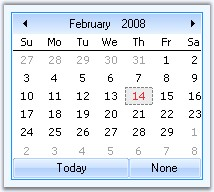{border="0"}

**[]{style="COLOR: #15428b"}** 

Figure 210: 2DBorderColor = \"DodgerBlue\"

**[]{style="COLOR: #15428b"}** 

See Also

[[]{style="COLOR: blue"}]{.UGHyperlink}

[[Background Settings]{style="COLOR: blue"}, ]{.UGHyperlink}[Visual Settings]{.UGHyperlink}[]{.UGHyperlink}

[]{#_Background_Settings_2}3.3.3.1.4.1.2      Background Settings

[]{#p275} 

Background image for the MonthCalendarAdv is specified in **BackgroundImage** property.

[]{style="COLOR: #15428b"} 

+-------------------------------------------------------------------------------------------------------------------------------------------------------------------------------------------------------------------------------------------------------------------------+
| **[\[C#\]]{style="FONT-FAMILY: 'Courier New'; COLOR: black"}**                                                                                                                                                                                                          |
|                                                                                                                                                                                                                                                                         |
| []{style="COLOR: black"}                                                                                                                                                                                                                                                |
|                                                                                                                                                                                                                                                                         |
| [this]{style="FONT-FAMILY: 'Courier New'; COLOR: blue"}[.monthCalendarAdv1.BackgroundImage = ((System.Drawing.[Image]{style="COLOR: teal"})(resources.GetObject([\"monthCalendarAdv1.BackgroundImage\"]{style="COLOR: maroon"})));]{style="FONT-FAMILY: 'Courier New'"} |
|                                                                                                                                                                                                                                                                         |
| [this]{style="FONT-FAMILY: 'Courier New'; COLOR: blue"}[.monthCalendarAdv1.BackgroundImageLayout = System.Windows.Forms.[ImageLayout]{style="COLOR: teal"}.Stretch;]{style="FONT-FAMILY: 'Courier New'"}                                                                |
+-------------------------------------------------------------------------------------------------------------------------------------------------------------------------------------------------------------------------------------------------------------------------+

[]{style="COLOR: #15428b"} 

+---------------------------------------------------------------------------------------------------------------------------------------------------------------------------------------------------------------------------------------------------------------------------------+
| **[\[VB.NET\]]{style="FONT-FAMILY: 'Courier New'; COLOR: black"}**                                                                                                                                                                                                              |
|                                                                                                                                                                                                                                                                                 |
| []{style="COLOR: black"}                                                                                                                                                                                                                                                        |
|                                                                                                                                                                                                                                                                                 |
| [Me]{style="FONT-FAMILY: 'Courier New'; COLOR: blue"}[.monthCalendarAdv1.BackgroundImage = [DirectCast]{style="COLOR: blue"}((resources.GetObject([\"monthCalendarAdv1.BackgroundImage\"]{style="COLOR: maroon"})), System.Drawing.Image) ]{style="FONT-FAMILY: 'Courier New'"} |
|                                                                                                                                                                                                                                                                                 |
| [Me]{style="FONT-FAMILY: 'Courier New'; COLOR: blue"}[.monthCalendarAdv1.BackgroundImageLayout = System.Windows.Forms.ImageLayout.Stretch ]{style="FONT-FAMILY: 'Courier New'"}                                                                                                 |
+---------------------------------------------------------------------------------------------------------------------------------------------------------------------------------------------------------------------------------------------------------------------------------+

[]{style="COLOR: #15428b"} 

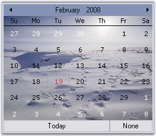{border="0"}

[]{style="COLOR: #15428b"} 

Figure 211: BackgroundImage for MonthCalendarAdv

**[]{style="COLOR: #15428b"}** 

See Also

[]{style="COLOR: #15428b"} 

[Border Styles]{.UGHyperlink}[, ]{.UGHyperlink}[Visual Settings]{.UGHyperlink}[]{.UGHyperlink}

[]{#_Visual_Settings}3.3.3.1.4.1.3      Visual Settings

[]{#p276} 

Themes for MonthCalendarAdv

[]{style="COLOR: #15428b"} 

Some sections of the MonthCalendarAdv control are themed by default. The below table list the properties which controls the themed behavior border, grid and scroll buttons.

[]{style="COLOR: #15428b"} 

::: {align="center"}
  ----------------------------- ---------------------------------------------------------------------------------------
  MonthCalendarAdv Properties   Description
  ThemedBorder                  Specifies whether the border of the control is themed. By default it is true.
  ThemedEnabledGrid             Specifies whether the grid holding the days is themed or not. By default it is false.
  ThemedEnabledScrollButtons    Specifies whether the scroll buttons are themed. It is set to true by default.
  ----------------------------- ---------------------------------------------------------------------------------------
:::

[]{style="COLOR: #15428b"} 

+---------------------------------------------------------------------------------------------------------------------------------------------------------------------------+
| **[\[C#\]]{style="FONT-FAMILY: 'Courier New'; COLOR: black"}**                                                                                                            |
|                                                                                                                                                                           |
| []{style="COLOR: #15428b"}                                                                                                                                                |
|                                                                                                                                                                           |
| [this]{style="FONT-FAMILY: 'Courier New'; COLOR: blue"}[.monthCalendarAdv1.ThemedBorder = [true]{style="COLOR: blue"};]{style="FONT-FAMILY: 'Courier New'"}               |
|                                                                                                                                                                           |
| [this]{style="FONT-FAMILY: 'Courier New'; COLOR: blue"}[.monthCalendarAdv1.ThemedEnabledGrid = [true]{style="COLOR: blue"};]{style="FONT-FAMILY: 'Courier New'"}          |
|                                                                                                                                                                           |
| [this]{style="FONT-FAMILY: 'Courier New'; COLOR: blue"}[.monthCalendarAdv1.ThemedEnabledScrollButtons = [true]{style="COLOR: blue"};]{style="FONT-FAMILY: 'Courier New'"} |
+---------------------------------------------------------------------------------------------------------------------------------------------------------------------------+

[]{style="COLOR: #15428b"} 

+------------------------------------------------------------------------------------------------------------------------------------------------------------------------+
| **[\[VB.NET\]]{style="FONT-FAMILY: 'Courier New'; COLOR: black"}**                                                                                                     |
|                                                                                                                                                                        |
| []{style="COLOR: #15428b"}                                                                                                                                             |
|                                                                                                                                                                        |
| [Me]{style="FONT-FAMILY: 'Courier New'; COLOR: blue"}[.monthCalendarAdv1.ThemedBorder = [True]{style="COLOR: blue"}]{style="FONT-FAMILY: 'Courier New'"}               |
|                                                                                                                                                                        |
| [Me]{style="FONT-FAMILY: 'Courier New'; COLOR: blue"}[.monthCalendarAdv1.ThemedEnabledGrid = [True]{style="COLOR: blue"}]{style="FONT-FAMILY: 'Courier New'"}          |
|                                                                                                                                                                        |
| [Me]{style="FONT-FAMILY: 'Courier New'; COLOR: blue"}[.monthCalendarAdv1.ThemedEnabledScrollButtons = [True]{style="COLOR: blue"}]{style="FONT-FAMILY: 'Courier New'"} |
+------------------------------------------------------------------------------------------------------------------------------------------------------------------------+

[]{style="COLOR: #15428b"} 

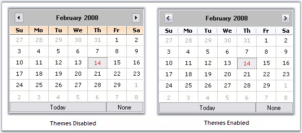{border="0"}

[]{style="COLOR: #15428b"} 

Figure 212: MonthCalendarAdv With and without Themes

**[]{style="COLOR: #15428b"}** 

Styles

[]{style="COLOR: #15428b"} 

MonthCalendarAdv supports the styles in the below table, which can be set through **Style** property.

[]{style="COLOR: #15428b"} 

::: {align="center"}
+-----------------------------------+------------------------------------------------------------------------+
| MonthCalendarAdv Property         | Description                                                            |
+-----------------------------------+------------------------------------------------------------------------+
| Style                             | Gets or Sets the visual style of the MonthCalendarAdv. The options are |
|                                   |                                                                        |
|                                   |                                                                        |
|                                   |                                                                        |
|                                   | *Default*                                                              |
|                                   |                                                                        |
|                                   | *OfficeXP*                                                             |
|                                   |                                                                        |
|                                   | *Office2003*                                                           |
|                                   |                                                                        |
|                                   | *VS2005*                                                               |
|                                   |                                                                        |
|                                   | *Office2007*                                                           |
|                                   |                                                                        |
|                                   |                                                                        |
|                                   |                                                                        |
|                                   | The default value is \'Default\'.                                      |
+-----------------------------------+------------------------------------------------------------------------+
:::

[]{style="COLOR: #15428b"} 

+--------------------------------------------------------------------------------------------------------------------------------------------------------------------------------------------------+
| **[\[C#\]]{style="FONT-FAMILY: 'Courier New'; COLOR: black"}**                                                                                                                                   |
|                                                                                                                                                                                                  |
| []{style="COLOR: #15428b"}                                                                                                                                                                       |
|                                                                                                                                                                                                  |
| [// Sample code for setting Office2003 style for MonthCalendarAdv]{style="FONT-FAMILY: 'Courier New'; COLOR: green"}                                                                             |
|                                                                                                                                                                                                  |
| [this]{style="FONT-FAMILY: 'Courier New'; COLOR: blue"}[.monthCalendarAdv1.[Style = Syncfusion.Windows.Forms.VisualStyle.Office2003;]{style="COLOR: black"}]{style="FONT-FAMILY: 'Courier New'"} |
+--------------------------------------------------------------------------------------------------------------------------------------------------------------------------------------------------+

[]{style="COLOR: #15428b"} 

+------------------------------------------------------------------------------------------------------------------------------------------------------------------------------------------------+
| **[\[VB.NET\]]{style="FONT-FAMILY: 'Courier New'; COLOR: black"}**                                                                                                                             |
|                                                                                                                                                                                                |
| []{style="COLOR: #15428b"}                                                                                                                                                                     |
|                                                                                                                                                                                                |
| [\' Sample code for setting Office2003 style for MonthCalendarAdv]{style="FONT-FAMILY: 'Courier New'; COLOR: green"}                                                                           |
|                                                                                                                                                                                                |
| [Me]{style="FONT-FAMILY: 'Courier New'; COLOR: blue"}[.monthCalendarAdv1.Style [ = Syncfusion.Windows.Forms.VisualStyle.Office2003]{style="COLOR: black"}]{style="FONT-FAMILY: 'Courier New'"} |
+------------------------------------------------------------------------------------------------------------------------------------------------------------------------------------------------+

[]{style="COLOR: #15428b"} 

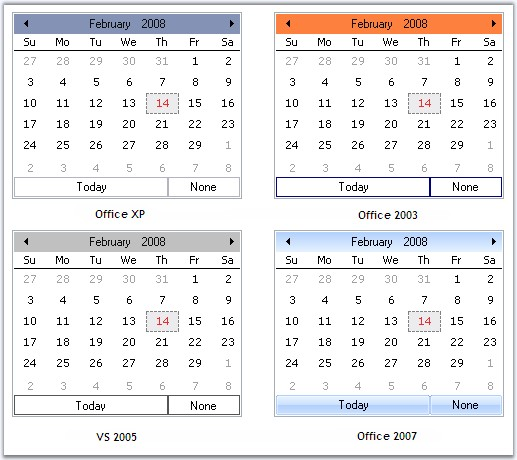{border="0"}

[]{style="COLOR: #15428b"} 

Figure 213: Styles Applied for MonthCalendarAdv Control

**[]{style="COLOR: #15428b"}** 

+-----------------------------------------------------------------------------------------------------------------------------------------------------------------------------------------------------------+
| **[\[C#\]]{style="FONT-FAMILY: 'Courier New'; COLOR: black"}**                                                                                                                                            |
|                                                                                                                                                                                                           |
| []{style="COLOR: #15428b"}                                                                                                                                                                                |
|                                                                                                                                                                                                           |
| [//Sets the Color scheme as Silver when the style is Office2007]{style="FONT-FAMILY: 'Courier New'; COLOR: green"}                                                                                        |
|                                                                                                                                                                                                           |
| [this]{style="FONT-FAMILY: 'Courier New'; COLOR: blue"}[.monthCalendarAdv1.Office2007Theme = Syncfusion.Windows.Forms.[Office2007Theme]{style="COLOR: teal"}.Silver;]{style="FONT-FAMILY: 'Courier New'"} |
+-----------------------------------------------------------------------------------------------------------------------------------------------------------------------------------------------------------+

[]{style="COLOR: #15428b"} 

+---------------------------------------------------------------------------------------------------------------------------------------------------------------------------------+
| **[\[VB.NET\]]{style="FONT-FAMILY: 'Courier New'; COLOR: black"}**                                                                                                              |
|                                                                                                                                                                                 |
| []{style="COLOR: #15428b"}                                                                                                                                                      |
|                                                                                                                                                                                 |
| [\'Sets the Color scheme as Silver when the style is Office2007]{style="FONT-FAMILY: 'Courier New'; COLOR: green"}                                                              |
|                                                                                                                                                                                 |
| [Me]{style="FONT-FAMILY: 'Courier New'; COLOR: blue"}[.monthCalendarAdv1.Office2007Theme = Syncfusion.Windows.Forms.Office2007Theme.Silver]{style="FONT-FAMILY: 'Courier New'"} |
+---------------------------------------------------------------------------------------------------------------------------------------------------------------------------------+

[]{style="COLOR: #15428b"} 

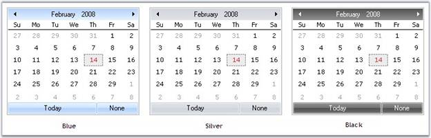{border="0"}

[]{style="COLOR: #15428b"} 

Figure 214: Office Color Schemes for MonthCalendarAdv Control

**[]{style="COLOR: #15428b"}** 

Custom Colors

[]{style="COLOR: #15428b"} 

We can also apply custom colors to the MonthCalendarAdv control by setting Office2007Theme to \"Managed\" and specifying the custom color through the **ApplyManagedColors** method as follows.

[]{style="COLOR: #15428b"} 

+------------------------------------------------------------------------------------------------------------------------------------------------------------------------------------------------------------+
| **[\[C#\]]{style="FONT-FAMILY: 'Courier New'; COLOR: black"}**                                                                                                                                             |
|                                                                                                                                                                                                            |
| []{style="COLOR: #15428b"}                                                                                                                                                                                 |
|                                                                                                                                                                                                            |
| [this]{style="FONT-FAMILY: 'Courier New'; COLOR: blue"}[.monthCalendarAdv1.Office2007Theme = Syncfusion.Windows.Forms.[Office2007Theme]{style="COLOR: teal"}.Managed;]{style="FONT-FAMILY: 'Courier New'"} |
|                                                                                                                                                                                                            |
| [Office2007Colors]{style="FONT-FAMILY: 'Courier New'; COLOR: teal"}[.ApplyManagedColors([this]{style="COLOR: blue"}, [Color]{style="COLOR: teal"}.Orange);]{style="FONT-FAMILY: 'Courier New'"}            |
+------------------------------------------------------------------------------------------------------------------------------------------------------------------------------------------------------------+

[]{style="COLOR: #15428b"} 

+----------------------------------------------------------------------------------------------------------------------------------------------------------------------------------------------------------+
| **[\[VB.NET\]]{style="FONT-FAMILY: 'Courier New'; COLOR: black"}**                                                                                                                                       |
|                                                                                                                                                                                                          |
| []{style="COLOR: #15428b"}                                                                                                                                                                               |
|                                                                                                                                                                                                          |
| [Me]{style="FONT-FAMILY: 'Courier New'; COLOR: blue"}[.monthCalendarAdv1.Office2007Theme = Syncfusion.Windows.Forms.[Office2007Theme]{style="COLOR: black"}.Managed]{style="FONT-FAMILY: 'Courier New'"} |
|                                                                                                                                                                                                          |
| [Office2007Colors.]{style="FONT-FAMILY: 'Courier New'; COLOR: black"}[ApplyManagedColors([Me]{style="COLOR: blue"}, [Color]{style="COLOR: black"}.Orange)]{style="FONT-FAMILY: 'Courier New'"}           |
+----------------------------------------------------------------------------------------------------------------------------------------------------------------------------------------------------------+

[]{style="COLOR: #15428b"} 

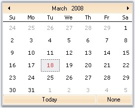{border="0"}

[]{style="COLOR: #15428b"} 

Figure 215: Custom Color = \"Orange\"

[]{style="COLOR: #15428b"} 

::: {style="BORDER-BOTTOM: windowtext 1pt solid; BORDER-LEFT: medium none; PADDING-BOTTOM: 1pt; MARGIN-TOP: 9pt; PADDING-LEFT: 0pt; PADDING-RIGHT: 0pt; MARGIN-BOTTOM: 9pt; BORDER-TOP: windowtext 1pt solid; BORDER-RIGHT: medium none; PADDING-TOP: 1pt"}
{border="0"} Note: Visual styles of the Today and None button can be overridden by MonthCalendarAdv.TodayButton and MonthCalendarAdv.NoneButton respectively. See ***[[Scroll Buttons.]{style="FONT-STYLE: normal; LAYOUT-GRID-MODE: both; FONT-SIZE: 10pt; FONT-WEIGHT: normal"}]{style="LAYOUT-GRID-MODE: line; COLOR: black; FONT-SIZE: 9pt"}***
:::

[[Scroll Buttons.]{style="COLOR: blue"}]{.UGHyperlink}

[]{style="COLOR: #15428b"} 

See Also

[]{style="COLOR: #15428b"} 

[Border Styles]{.UGHyperlink}[, ]{.UGHyperlink}[[Background Settings]{.UGHyperlink}]()[]{.UGHyperlink}

###### []{#_Customizing_sections_of}3.3.3.1.4.2 Customizing sections of Calendar {#customizing-sections-of-calendar style="tab-stops: 0pt"}

[]{#p277}[]{style="COLOR: #15428b"} 

This section comprises the following:

[]{style="COLOR: #15428b"} 

[]{#_Grid_Settings}3.3.3.1.4.2.1      Grid Settings

[]{#p278}[]{style="COLOR: #15428b"} 

In the MonthCalendarAdv control, the dates of a month is placed inside a grid and the dates are separated using grid lines.

[]{style="COLOR: #15428b"} 

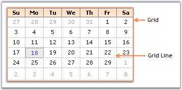{border="0"}

[]{style="COLOR: #15428b"} 

Figure 216: Grid with Dates Separated by Grid Lines

[]{style="COLOR: #15428b"} 

The below properties lets you to change the default appearance of the grid in the MonthCalendarAdv.

[]{style="COLOR: #15428b"} 

::: {align="center"}
+-----------------------------------+-----------------------------------------------------------+
| MonthCalendarAdv  Properties      | Description                                               |
+-----------------------------------+-----------------------------------------------------------+
| GridBackColor                     | Gets or Sets the back color of the Grid.                  |
+-----------------------------------+-----------------------------------------------------------+
| GridLines                         | Gets or Sets the style of the Grid lines. The options are |
|                                   |                                                           |
|                                   |                                                           |
|                                   |                                                           |
|                                   | [·      ]{style="FONT-FAMILY: Symbol"}*NotSet*            |
|                                   |                                                           |
|                                   | [·      ]{style="FONT-FAMILY: Symbol"}*None*              |
|                                   |                                                           |
|                                   | [·      ]{style="FONT-FAMILY: Symbol"}*Dashed*            |
|                                   |                                                           |
|                                   | [·      ]{style="FONT-FAMILY: Symbol"}*Dotted*            |
|                                   |                                                           |
|                                   | [·      ]{style="FONT-FAMILY: Symbol"}*DashDot*           |
|                                   |                                                           |
|                                   | [·      ]{style="FONT-FAMILY: Symbol"}*DashDotDot*        |
|                                   |                                                           |
|                                   | [·      ]{style="FONT-FAMILY: Symbol"}*Solid*             |
|                                   |                                                           |
|                                   | [·      ]{style="FONT-FAMILY: Symbol"}*Standard*          |
|                                   |                                                           |
|                                   |                                                           |
|                                   |                                                           |
|                                   | The default value is \'Dotted\'.                          |
+-----------------------------------+-----------------------------------------------------------+
:::

[]{style="COLOR: #15428b"} 

+-----------------------------------------------------------------------------------------------------------------------------------------------------------------------------------+
| **[\[C#\]]{style="FONT-FAMILY: 'Courier New'; COLOR: black"}**                                                                                                                    |
|                                                                                                                                                                                   |
| []{style="FONT-FAMILY: 'Courier New'; COLOR: black"}                                                                                                                              |
|                                                                                                                                                                                   |
| [this]{style="FONT-FAMILY: 'Courier New'; COLOR: blue"}[.monthCalendarAdv1.GridBackColor = System.Drawing.Color.FloralWhite;]{style="FONT-FAMILY: 'Courier New'"}                 |
|                                                                                                                                                                                   |
| [this]{style="FONT-FAMILY: 'Courier New'; COLOR: blue"}[.monthCalendarAdv1.GridLines = Syncfusion.Windows.Forms.Grid.GridBorderStyle.Dashed;]{style="FONT-FAMILY: 'Courier New'"} |
+-----------------------------------------------------------------------------------------------------------------------------------------------------------------------------------+

[]{style="COLOR: #15428b"} 

+--------------------------------------------------------------------------------------------------------------------------------------------------------------------------------+
| **[\[VB.NET\]]{style="FONT-FAMILY: 'Courier New'; COLOR: black"}**                                                                                                             |
|                                                                                                                                                                                |
| []{style="COLOR: #15428b"}                                                                                                                                                     |
|                                                                                                                                                                                |
| [Me]{style="FONT-FAMILY: 'Courier New'; COLOR: blue"}[.monthCalendarAdv1.GridBackColor = System.Drawing.Color.FloralWhite]{style="FONT-FAMILY: 'Courier New'"}                 |
|                                                                                                                                                                                |
| [Me]{style="FONT-FAMILY: 'Courier New'; COLOR: blue"}[.monthCalendarAdv1.GridLines = Syncfusion.Windows.Forms.Grid.GridBorderStyle.Dashed]{style="FONT-FAMILY: 'Courier New'"} |
+--------------------------------------------------------------------------------------------------------------------------------------------------------------------------------+

[]{style="COLOR: #15428b"} 

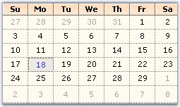{border="0"}

[]{style="COLOR: #15428b"} 

Figure 217: GridBackColor = \"FloralWhite\"; GridLines = \"Dashed\"

[]{#p279} 

[]{#_Header_Settings}3.3.3.1.4.2.1.1    Header Settings

[]{style="COLOR: #15428b"} 

This section will walk you through the different properties used to customize the header portion of the MonthCalendarAdv control.

[]{style="COLOR: #15428b"} 

Gradient Background

[]{style="COLOR: #15428b"} 

Gradient background can be set for the header using the below properties.

[]{style="COLOR: #15428b"} 

::: {align="center"}
  ----------------------------- --------------------------------------------------------------------------------------------------------------------------------------------------------------------------------------
  MonthCalendarAdv Properties   Description
  HeadGradient                  Specifies whether the header can show a gradient background.
  HeaderStartColor              Sets the start color of the header gradient when HeaderGradient property is true.
  HeaderEndColor                Sets the end color of the header gradient when HeaderGradient property is true.
  HeaderVerticalGradient        When HeadGradient property is set to true, vertical gradient style will be applied to the header, by default. To change it to horizontal gradient style, set this property to false.
  ----------------------------- --------------------------------------------------------------------------------------------------------------------------------------------------------------------------------------
:::

[]{style="COLOR: #15428b"} 

+-------------------------------------------------------------------------------------------------------------------------------------------------------------------------------------------------------------+
| **[\[C#\]]{style="FONT-FAMILY: 'Courier New'; COLOR: black"}**                                                                                                                                              |
|                                                                                                                                                                                                             |
| []{style="FONT-FAMILY: 'Courier New'; COLOR: black"}                                                                                                                                                        |
|                                                                                                                                                                                                             |
| [this]{style="FONT-FAMILY: 'Courier New'; COLOR: blue"}[.monthCalendarAdv1.HeadGradient = [true]{style="COLOR: blue"};]{style="FONT-FAMILY: 'Courier New'"}                                                 |
|                                                                                                                                                                                                             |
| [this]{style="FONT-FAMILY: 'Courier New'; COLOR: blue"}[.monthCalendarAdv1.HeaderVerticalGradient = [true]{style="COLOR: blue"};]{style="FONT-FAMILY: 'Courier New'"}                                       |
|                                                                                                                                                                                                             |
| [this]{style="FONT-FAMILY: 'Courier New'; COLOR: blue"}[.monthCalendarAdv1.HeaderEndColor = System.Drawing.[Color]{style="COLOR: teal"}.SteelBlue;                    ]{style="FONT-FAMILY: 'Courier New'"} |
|                                                                                                                                                                                                             |
| [this]{style="FONT-FAMILY: 'Courier New'; COLOR: blue"}[.monthCalendarAdv1.HeaderStartColor = System.Drawing.[Color]{style="COLOR: teal"}.AliceBlue;]{style="FONT-FAMILY: 'Courier New'"}                   |
+-------------------------------------------------------------------------------------------------------------------------------------------------------------------------------------------------------------+

[]{style="COLOR: #15428b"} 

+----------------------------------------------------------------------------------------------------------------------------------------------------------------------------------------------------------+
| **[\[VB.NET\]]{style="FONT-FAMILY: 'Courier New'; COLOR: black"}**                                                                                                                                       |
|                                                                                                                                                                                                          |
| []{style="COLOR: #15428b"}                                                                                                                                                                               |
|                                                                                                                                                                                                          |
| [Me]{style="FONT-FAMILY: 'Courier New'; COLOR: blue"}[.monthCalendarAdv1.HeadGradient = [True]{style="COLOR: blue"}]{style="FONT-FAMILY: 'Courier New'"}                                                 |
|                                                                                                                                                                                                          |
| [Me]{style="FONT-FAMILY: 'Courier New'; COLOR: blue"}[.monthCalendarAdv1.HeaderVerticalGradient = [True]{style="COLOR: blue"}]{style="FONT-FAMILY: 'Courier New'"}                                       |
|                                                                                                                                                                                                          |
| [Me]{style="FONT-FAMILY: 'Courier New'; COLOR: blue"}[.monthCalendarAdv1.HeaderEndColor = System.Drawing.[Color]{style="COLOR: black"}.SteelBlue                   ]{style="FONT-FAMILY: 'Courier New'"} |
|                                                                                                                                                                                                          |
| [Me]{style="FONT-FAMILY: 'Courier New'; COLOR: blue"}[.monthCalendarAdv1.HeaderStartColor = System.Drawing.[Color]{style="COLOR: black"}.AliceBlue]{style="FONT-FAMILY: 'Courier New'"}                  |
+----------------------------------------------------------------------------------------------------------------------------------------------------------------------------------------------------------+

[]{style="COLOR: #15428b"} 

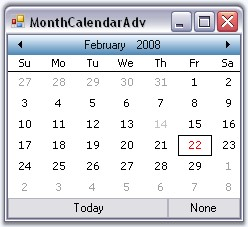{border="0"}

[]{style="COLOR: #15428b"} 

Figure 218: HeaderStartColor = \"AliceBlue\"; HeaderEndColor = \"SteelBlue\"

[]{style="COLOR: #15428b"} 

Foreground Settings

[]{style="COLOR: #15428b"} 

The font style and fore color of the header text can be specified through **HeaderFont** and **HeadForeColor** properties.

[]{style="COLOR: #15428b"} 

::: {align="center"}
  ----------------------------- -----------------------------------------
  MonthCalendarAdv Properties   Description
  HeaderFont                    Specifies the font of the header.
  HeaderForeColor               Specifies the fore color of the header.
  ----------------------------- -----------------------------------------
:::

[]{style="COLOR: #15428b"} 

+---------------------------------------------------------------------------------------------------------------------------------------------------------------------------------------------------------------------------------------------------------------------------------------------------+
| **[\[C#\]]{style="FONT-FAMILY: 'Courier New'; COLOR: black"}**                                                                                                                                                                                                                                    |
|                                                                                                                                                                                                                                                                                                   |
| []{style="FONT-FAMILY: 'Courier New'; COLOR: black"}                                                                                                                                                                                                                                              |
|                                                                                                                                                                                                                                                                                                   |
| [this]{style="FONT-FAMILY: 'Courier New'; COLOR: blue"}[.monthCalendarAdv1.HeaderFont = [new]{style="COLOR: blue"} System.Drawing.[Font]{style="COLOR: teal"}([\"Arial\"]{style="COLOR: maroon"}, 9F, System.Drawing.[FontStyle]{style="COLOR: teal"}.Bold);]{style="FONT-FAMILY: 'Courier New'"} |
|                                                                                                                                                                                                                                                                                                   |
| [this]{style="FONT-FAMILY: 'Courier New'; COLOR: blue"}[.monthCalendarAdv1.HeadForeColor = System.Drawing.[Color]{style="COLOR: teal"}.Navy;]{style="FONT-FAMILY: 'Courier New'"}                                                                                                                 |
+---------------------------------------------------------------------------------------------------------------------------------------------------------------------------------------------------------------------------------------------------------------------------------------------------+

[]{style="COLOR: #15428b"} 

+--------------------------------------------------------------------------------------------------------------------------------------------------------------------------------------------------------------------------------------------------------------------------------------------------+
| **[\[VB.NET\]]{style="FONT-FAMILY: 'Courier New'; COLOR: black"}**                                                                                                                                                                                                                               |
|                                                                                                                                                                                                                                                                                                  |
| []{style="COLOR: #15428b"}                                                                                                                                                                                                                                                                       |
|                                                                                                                                                                                                                                                                                                  |
| [Me]{style="FONT-FAMILY: 'Courier New'; COLOR: blue"}[.monthCalendarAdv1.HeaderFont = [New]{style="COLOR: blue"} System.Drawing.[Font]{style="COLOR: black"}([\"Arial\"]{style="COLOR: maroon"}, 9F, System.Drawing.[FontStyle]{style="COLOR: black"}.Bold)]{style="FONT-FAMILY: 'Courier New'"} |
|                                                                                                                                                                                                                                                                                                  |
| [Me]{style="FONT-FAMILY: 'Courier New'; COLOR: blue"}[.monthCalendarAdv1.HeadForeColor = System.Drawing.[Color]{style="COLOR: black"}.Navy]{style="FONT-FAMILY: 'Courier New'"}                                                                                                                  |
+--------------------------------------------------------------------------------------------------------------------------------------------------------------------------------------------------------------------------------------------------------------------------------------------------+

[]{style="COLOR: #15428b"} 

{border="0"}

[]{style="COLOR: #15428b"} 

Figure 219: HeaderFont = \"Arial, 9, Bold\"; HeaderForeColor=\"Navy\"

**[]{style="COLOR: #15428b"}** 

Height and Image for Header

[]{style="COLOR: #15428b"} 

The height of the header can be increased or decreased using **HeaderHeight** property. Header can also host an image in its background using **HeaderImage** property.

[]{style="COLOR: #15428b"} 

::: {align="center"}
  ----------------------------- ----------------------------------------------------------------------------------------------------------
  MonthCalendarAdv Properties   Description
  HeaderHeight                  Specifies the height of the header. Default value is 32 for Default Style and for other styles it is 20.
  HeaderImage                   Specifies the image of the header.
  ----------------------------- ----------------------------------------------------------------------------------------------------------
:::

[]{style="COLOR: #15428b"} 

+-----------------------------------------------------------------------------------------------------------------------------------------------------------------------------------------------------------------------------------------------------------------+
| **[\[C#\]]{style="FONT-FAMILY: 'Courier New'; COLOR: black"}**                                                                                                                                                                                                  |
|                                                                                                                                                                                                                                                                 |
| []{style="FONT-FAMILY: 'Courier New'; COLOR: black"}                                                                                                                                                                                                            |
|                                                                                                                                                                                                                                                                 |
| [this]{style="FONT-FAMILY: 'Courier New'; COLOR: blue"}[.monthCalendarAdv1.HeaderImage = ((System.Drawing.[Image]{style="COLOR: teal"})(resources.GetObject([\"monthCalendarAdv1.HeaderImage\"]{style="COLOR: maroon"})));]{style="FONT-FAMILY: 'Courier New'"} |
|                                                                                                                                                                                                                                                                 |
| [this]{style="FONT-FAMILY: 'Courier New'; COLOR: blue"}[.monthCalendarAdv1.HeaderHeight = 30;]{style="FONT-FAMILY: 'Courier New'"}                                                                                                                              |
+-----------------------------------------------------------------------------------------------------------------------------------------------------------------------------------------------------------------------------------------------------------------+

[]{style="COLOR: #15428b"} 

+-------------------------------------------------------------------------------------------------------------------------------------------------------------------------------------------------------------------------------------------------------------------------+
| **[\[VB.NET\]]{style="FONT-FAMILY: 'Courier New'; COLOR: black"}**                                                                                                                                                                                                      |
|                                                                                                                                                                                                                                                                         |
| []{style="COLOR: #15428b"}                                                                                                                                                                                                                                              |
|                                                                                                                                                                                                                                                                         |
| [Me]{style="FONT-FAMILY: 'Courier New'; COLOR: blue"}[.monthCalendarAdv1.HeaderImage = [DirectCast]{style="COLOR: blue"}((resources.GetObject([\"monthCalendarAdv1.HeaderImage\"]{style="COLOR: maroon"})), System.Drawing.Image) ]{style="FONT-FAMILY: 'Courier New'"} |
|                                                                                                                                                                                                                                                                         |
| [Me]{style="FONT-FAMILY: 'Courier New'; COLOR: blue"}[.monthCalendarAdv1.HeaderHeight = 30]{style="FONT-FAMILY: 'Courier New'"}                                                                                                                                         |
+-------------------------------------------------------------------------------------------------------------------------------------------------------------------------------------------------------------------------------------------------------------------------+

[]{style="COLOR: #15428b"} 

{border="0"}

[]{style="COLOR: #15428b"} 

Figure 220: HeaderHeight = \"30\"

[]{#_Week_Numbers}3.3.3.1.4.2.2      Week Numbers

[]{#p280}***[]{style="COLOR: #15428b"}*** 

MonthCalendarAdv control can display unique week numbers for all the weeks in a year. This section discusses the properties which can customize the appearance of the week numbers.

[]{style="COLOR: #15428b"} 

Foreground Settings

[]{style="COLOR: #15428b"} 

By default, week numbers will not be shown in the calendar. **ShowWeekNumbers** property should be set to true to display the week numbers. The font and fore color can be set using the below properties.

[]{style="COLOR: #15428b"} 

::: {align="center"}
  ----------------------------- ------------------------------------------------------
  MonthCalendarAdv Properties   Description
  WeekFont                      Gets or sets the font of the week numbers column.
  WeekTextColor                 Gets or sets the text color for week numbers column.
  ----------------------------- ------------------------------------------------------
:::

**[]{style="COLOR: #15428b"}** 

+-----------------------------------------------------------------------------------------------------------------------------------------------------------------------------------------------------------------------------------------------------------------------------------------------------------------------------------------------------------------------------------------------------+
| **[\[C#\]]{style="FONT-FAMILY: 'Courier New'; COLOR: black"}**                                                                                                                                                                                                                                                                                                                                      |
|                                                                                                                                                                                                                                                                                                                                                                                                     |
| []{style="FONT-FAMILY: 'Courier New'; COLOR: black"}                                                                                                                                                                                                                                                                                                                                                |
|                                                                                                                                                                                                                                                                                                                                                                                                     |
| [this]{style="FONT-FAMILY: 'Courier New'; COLOR: blue"}[.monthCalendarAdv1.ShowWeekNumbers = [true]{style="COLOR: blue"};]{style="FONT-FAMILY: 'Courier New'"}                                                                                                                                                                                                                                      |
|                                                                                                                                                                                                                                                                                                                                                                                                     |
| [this]{style="FONT-FAMILY: 'Courier New'; COLOR: blue"}[.monthCalendarAdv1.WeekFont = [new]{style="COLOR: blue"} System.Drawing.[Font]{style="COLOR: teal"}([\"Courier New\"]{style="COLOR: maroon"}, 9F, System.Drawing.[FontStyle]{style="COLOR: teal"}.Bold, System.Drawing.[GraphicsUnit]{style="COLOR: teal"}.Point, (([byte]{style="COLOR: blue"})(0)));]{style="FONT-FAMILY: 'Courier New'"} |
|                                                                                                                                                                                                                                                                                                                                                                                                     |
| [this]{style="FONT-FAMILY: 'Courier New'; COLOR: blue"}[.monthCalendarAdv1.WeekTextColor = System.Drawing.[Color]{style="COLOR: teal"}.Blue;]{style="FONT-FAMILY: 'Courier New'"}                                                                                                                                                                                                                   |
+-----------------------------------------------------------------------------------------------------------------------------------------------------------------------------------------------------------------------------------------------------------------------------------------------------------------------------------------------------------------------------------------------------+

[]{style="COLOR: #15428b"} 

+-----------------------------------------------------------------------------------------------------------------------------------------------------------------------------------------------------------------------------------------------------------------------------------------------------------------------------+
| **[\[VB.NET\]]{style="FONT-FAMILY: 'Courier New'; COLOR: black"}**                                                                                                                                                                                                                                                          |
|                                                                                                                                                                                                                                                                                                                             |
| []{style="COLOR: black"}                                                                                                                                                                                                                                                                                                    |
|                                                                                                                                                                                                                                                                                                                             |
| [Me]{style="FONT-FAMILY: 'Courier New'; COLOR: blue"}[.monthCalendarAdv1.ShowWeekNumbers = [True]{style="COLOR: blue"}]{style="FONT-FAMILY: 'Courier New'"}                                                                                                                                                                 |
|                                                                                                                                                                                                                                                                                                                             |
| [Me]{style="FONT-FAMILY: 'Courier New'; COLOR: blue"}[.monthCalendarAdv1.WeekFont = [New]{style="COLOR: blue"} System.Drawing.Font([\"Courier New\"]{style="COLOR: maroon"}, 9F, System.Drawing.FontStyle.Bold, System.Drawing.GraphicsUnit.Point, [CByte]{style="COLOR: blue"}((0))) ]{style="FONT-FAMILY: 'Courier New'"} |
|                                                                                                                                                                                                                                                                                                                             |
| [Me]{style="FONT-FAMILY: 'Courier New'; COLOR: blue"}[.monthCalendarAdv1.WeekTextColor = System.Drawing.Color.Blue ]{style="FONT-FAMILY: 'Courier New'"}                                                                                                                                                                    |
+-----------------------------------------------------------------------------------------------------------------------------------------------------------------------------------------------------------------------------------------------------------------------------------------------------------------------------+

[]{style="COLOR: #15428b"} 

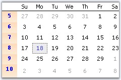{border="0"}

[]{style="COLOR: #15428b"} 

Figure 221: WeekFont = \"Courier new, 9, Bold\"; WeekTextColor = \"Blue\"

**[]{style="COLOR: #15428b"}** 

Gradient Background

**[]{style="COLOR: #15428b"}** 

By default the week numbers column has a gradient background. To customize the background manually, use **WeekInterior** property.

[]{style="COLOR: #15428b"} 

+-----------------------------------------------------------------------------------------------------------------------------------------------------------------------------------------------------------------------------------------------------------------------------------------------------------------------------------------------------------------------------------------------------+
| **[\[C#\]]{style="FONT-FAMILY: 'Courier New'; COLOR: black"}**                                                                                                                                                                                                                                                                                                                                      |
|                                                                                                                                                                                                                                                                                                                                                                                                     |
| []{style="FONT-FAMILY: 'Courier New'; COLOR: black"}                                                                                                                                                                                                                                                                                                                                                |
|                                                                                                                                                                                                                                                                                                                                                                                                     |
| [this]{style="FONT-FAMILY: 'Courier New'; COLOR: blue"}[.monthCalendarAdv1.WeekInterior = [new]{style="COLOR: blue"} Syncfusion.Drawing.[BrushInfo]{style="COLOR: teal"}(Syncfusion.Drawing.[GradientStyle]{style="COLOR: teal"}.Vertical, System.Drawing.[Color]{style="COLOR: teal"}.AliceBlue, System.Drawing.[Color]{style="COLOR: teal"}.LightSteelBlue);]{style="FONT-FAMILY: 'Courier New'"} |
+-----------------------------------------------------------------------------------------------------------------------------------------------------------------------------------------------------------------------------------------------------------------------------------------------------------------------------------------------------------------------------------------------------+

[]{style="COLOR: #15428b"} 

+-------------------------------------------------------------------------------------------------------------------------------------------------------------------------------------------------------------------------------------------------------------------------------------------------------+
| **[\[VB.NET\]]{style="FONT-FAMILY: 'Courier New'; COLOR: black"}**                                                                                                                                                                                                                                    |
|                                                                                                                                                                                                                                                                                                       |
| []{style="COLOR: black"}                                                                                                                                                                                                                                                                              |
|                                                                                                                                                                                                                                                                                                       |
| [Me]{style="FONT-FAMILY: 'Courier New'; COLOR: blue"}[.monthCalendarAdv1.WeekInterior = [New]{style="COLOR: blue"} Syncfusion.Drawing.BrushInfo(Syncfusion.Drawing.GradientStyle.Vertical, System.Drawing.Color.AliceBlue, System.Drawing.Color.LightSteelBlue) ]{style="FONT-FAMILY: 'Courier New'"} |
+-------------------------------------------------------------------------------------------------------------------------------------------------------------------------------------------------------------------------------------------------------------------------------------------------------+

[]{style="COLOR: #15428b"} 

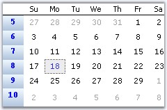{border="0"}

[]{style="COLOR: #15428b"} 

Figure 222: Custom Gradient Background for Week Numbers

 

 

[]{#p281}[]{#_Day_Settings}3.3.3.1.4.2.3      Day Settings

***[]{style="COLOR: #15428b"}*** 

MonthCalendarAdv has properties to customize the days displayed in the calendar. This section discusses those properties.

[]{style="COLOR: #15428b"} 

Foreground Settings

**[]{style="COLOR: #15428b"}** 

The below properties deals with the foreground appearance of the dates.

[]{style="COLOR: #15428b"} 

::: {align="center"}
  ----------------------------- -----------------------------------------------
  MonthCalendarAdv Properties   Description
  DayNamesColor                 Specifies the fore color of the day names.
  DayNamesFont                  Specifies the font style of the day names.
  DaysFont                      Specifies the font style of the days / dates.
  DaysColor                     Specifies the fore color of the day names.
  ----------------------------- -----------------------------------------------
:::

[]{style="COLOR: #15428b"} 

+-------------------------------------------------------------------------------------------------------------------------------------------------------------------------------------------------------------------------------------------------------------------------------------------------------------+
| **[\[C#\]]{style="FONT-FAMILY: 'Courier New'; COLOR: black"}**                                                                                                                                                                                                                                              |
|                                                                                                                                                                                                                                                                                                             |
| []{style="FONT-FAMILY: 'Courier New'; COLOR: black"}                                                                                                                                                                                                                                                        |
|                                                                                                                                                                                                                                                                                                             |
| [this]{style="FONT-FAMILY: 'Courier New'; COLOR: blue"}[.monthCalendarAdv1.DayNamesFont = [new]{style="COLOR: blue"} System.Drawing.[Font]{style="COLOR: teal"}([\"Courier New\"]{style="COLOR: maroon"}, 9F, System.Drawing.[FontStyle]{style="COLOR: teal"}.Bold);]{style="FONT-FAMILY: 'Courier New'"}   |
|                                                                                                                                                                                                                                                                                                             |
| [this]{style="FONT-FAMILY: 'Courier New'; COLOR: blue"}[.monthCalendarAdv1.DaysNamesColor = [Color]{style="COLOR: teal"}.Black;]{style="FONT-FAMILY: 'Courier New'"}                                                                                                                                        |
|                                                                                                                                                                                                                                                                                                             |
| [this]{style="FONT-FAMILY: 'Courier New'; COLOR: blue"}[.monthCalendarAdv1.DaysColor = System.Drawing.[SystemColors]{style="COLOR: teal"}.HotTrack;]{style="FONT-FAMILY: 'Courier New'"}                                                                                                                    |
|                                                                                                                                                                                                                                                                                                             |
| [this]{style="FONT-FAMILY: 'Courier New'; COLOR: blue"}[.monthCalendarAdv1.DaysFont = [new]{style="COLOR: blue"} System.Drawing.[Font]{style="COLOR: teal"}([\"Courier New\"]{style="COLOR: maroon"}, 8.25F, System.Drawing.[FontStyle]{style="COLOR: teal"}.Regular);]{style="FONT-FAMILY: 'Courier New'"} |
+-------------------------------------------------------------------------------------------------------------------------------------------------------------------------------------------------------------------------------------------------------------------------------------------------------------+

[]{style="COLOR: #15428b"} 

+-------------------------------------------------------------------------------------------------------------------------------------------------------------------------------------------------------------------------------------------------------------+
| **[\[VB.NET\]]{style="FONT-FAMILY: 'Courier New'; COLOR: black"}**                                                                                                                                                                                          |
|                                                                                                                                                                                                                                                             |
| []{style="COLOR: black"}                                                                                                                                                                                                                                    |
|                                                                                                                                                                                                                                                             |
| [Me]{style="FONT-FAMILY: 'Courier New'; COLOR: blue"}[.monthCalendarAdv1.DayNamesFont = [New]{style="COLOR: blue"} System.Drawing.Font([\"Courier New\"]{style="COLOR: maroon"}, 9F, System.Drawing.FontStyle.Bold) ]{style="FONT-FAMILY: 'Courier New'"}   |
|                                                                                                                                                                                                                                                             |
| [Me]{style="FONT-FAMILY: 'Courier New'; COLOR: blue"}[.monthCalendarAdv1.DaysNamesColor = [Color]{style="COLOR: teal"}.Black]{style="FONT-FAMILY: 'Courier New'"}                                                                                           |
|                                                                                                                                                                                                                                                             |
| [Me]{style="FONT-FAMILY: 'Courier New'; COLOR: blue"}[.monthCalendarAdv1.DaysColor = System.Drawing.SystemColors.HotTrack ]{style="FONT-FAMILY: 'Courier New'"}                                                                                             |
|                                                                                                                                                                                                                                                             |
| [Me]{style="FONT-FAMILY: 'Courier New'; COLOR: blue"}[.monthCalendarAdv1.DaysFont = [New]{style="COLOR: blue"} System.Drawing.Font([\"Courier New\"]{style="COLOR: maroon"}, 8.25F, System.Drawing.FontStyle.Regular) ]{style="FONT-FAMILY: 'Courier New'"} |
+-------------------------------------------------------------------------------------------------------------------------------------------------------------------------------------------------------------------------------------------------------------+

[]{style="COLOR: #15428b"} 

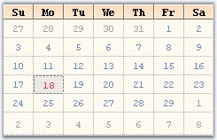{border="0"}

[]{style="COLOR: #15428b"} 

Figure 223: MonthCalendarAdv with Customized Days and Day Names

[]{style="COLOR: #15428b"} 

Height and Day Names Format

[]{style="COLOR: #15428b"} 

The height of the day header and the day name formats are specified using below properties.

[]{style="COLOR: #15428b"} 

::: {align="center"}
  ----------------------------- ------------------------------------------------------------------------------
  MonthCalendarAdv Properties   Description
  DayNamesHeight                Sets the height of the days header. Default value is 17.
  UseShortestDayNames           Specifies whether shortest day names are used or not. by default it is true.
  ----------------------------- ------------------------------------------------------------------------------
:::

[]{style="COLOR: #15428b"} 

+---------------------------------------------------------------------------------------------------------------------------------------------------------------------+
| **[\[C#\]]{style="FONT-FAMILY: 'Courier New'; COLOR: black"}**                                                                                                      |
|                                                                                                                                                                     |
| []{style="FONT-FAMILY: 'Courier New'; COLOR: black"}                                                                                                                |
|                                                                                                                                                                     |
| [this]{style="FONT-FAMILY: 'Courier New'; COLOR: blue"}[.monthCalendarAdv1.DayNamesHeight = 22;]{style="FONT-FAMILY: 'Courier New'"}                                |
|                                                                                                                                                                     |
| [this]{style="FONT-FAMILY: 'Courier New'; COLOR: blue"}[.monthCalendarAdv1.UseShortestDayNames = [false]{style="COLOR: blue"};]{style="FONT-FAMILY: 'Courier New'"} |
+---------------------------------------------------------------------------------------------------------------------------------------------------------------------+

[]{style="COLOR: #15428b"} 

+------------------------------------------------------------------------------------------------------------------------------------------------------------------+
| **[\[VB.NET\]]{style="FONT-FAMILY: 'Courier New'; COLOR: black"}**                                                                                               |
|                                                                                                                                                                  |
| []{style="COLOR: black"}                                                                                                                                         |
|                                                                                                                                                                  |
| [Me]{style="FONT-FAMILY: 'Courier New'; COLOR: blue"}[.monthCalendarAdv1.DayNamesHeight = 22]{style="FONT-FAMILY: 'Courier New'"}                                |
|                                                                                                                                                                  |
| [Me]{style="FONT-FAMILY: 'Courier New'; COLOR: blue"}[.monthCalendarAdv1.UseShortestDayNames = [False]{style="COLOR: blue"}]{style="FONT-FAMILY: 'Courier New'"} |
+------------------------------------------------------------------------------------------------------------------------------------------------------------------+

[]{style="COLOR: #15428b"} 

{border="0"}

[]{style="COLOR: #15428b"} 

Figure 224: DayNamesHeight = \"22\" and without ShortDayNames

[]{style="COLOR: #15428b"} 

Gradient Background for Day Header

**[]{style="COLOR: #15428b"}** 

By default the day\'s header has a gradient background. We can change the default background style using **DaysHeaderInterior** property.

[]{style="COLOR: #15428b"} 

+----------------------------------------------------------------------------------------------------------------------------------------------------------------------------------------------------------------------------------------------------------------------------------------------------------------------------------------------------------------------------------------------------------+
| **[\[C#\]]{style="FONT-FAMILY: 'Courier New'; COLOR: black"}**                                                                                                                                                                                                                                                                                                                                           |
|                                                                                                                                                                                                                                                                                                                                                                                                          |
| []{style="FONT-FAMILY: 'Courier New'; COLOR: black"}                                                                                                                                                                                                                                                                                                                                                     |
|                                                                                                                                                                                                                                                                                                                                                                                                          |
| [this]{style="FONT-FAMILY: 'Courier New'; COLOR: blue"}[.monthCalendarAdv1.DaysHeaderInterior = [new]{style="COLOR: blue"} Syncfusion.Drawing.[BrushInfo]{style="COLOR: teal"}(Syncfusion.Drawing.[GradientStyle]{style="COLOR: teal"}.Vertical, System.Drawing.[Color]{style="COLOR: teal"}.AntiqueWhite, System.Drawing.[Color]{style="COLOR: teal"}.SandyBrown);]{style="FONT-FAMILY: 'Courier New'"} |
+----------------------------------------------------------------------------------------------------------------------------------------------------------------------------------------------------------------------------------------------------------------------------------------------------------------------------------------------------------------------------------------------------------+

[]{style="COLOR: #15428b"} 

+-----------------------------------------------------------------------------------------------------------------------------------------------------------------------------------------------------------------------------------------------------------------------------------------------------------------------------------+
| **[\[VB.NET\]]{style="FONT-FAMILY: 'Courier New'; COLOR: black"}**                                                                                                                                                                                                                                                                |
|                                                                                                                                                                                                                                                                                                                                   |
| []{style="COLOR: #15428b"}                                                                                                                                                                                                                                                                                                        |
|                                                                                                                                                                                                                                                                                                                                   |
| [Me]{style="FONT-FAMILY: 'Courier New'; COLOR: blue"}[.monthCalendarAdv1.DaysHeaderInterior = [New]{style="COLOR: blue"} Syncfusion[.Drawing.BrushInfo(Syncfusion.Drawing.GradientStyle.Vertical, System.Drawing.Color.AntiqueWhite, System.Drawing.Color.SandyBrown)]{style="COLOR: black"}]{style="FONT-FAMILY: 'Courier New'"} |
+-----------------------------------------------------------------------------------------------------------------------------------------------------------------------------------------------------------------------------------------------------------------------------------------------------------------------------------+

[]{style="COLOR: #15428b"} 

{border="0"}

[]{style="COLOR: #15428b"} 

Figure 225: Custom Gradient Style for DaysHeader Background

**[]{style="COLOR: #15428b"}** 

[]{#p282}[]{#_Today's_Date}3.3.3.1.4.2.3.1    Today\'s Date

[]{style="COLOR: #15428b"} 

The fore color for Today\'s date is set using **TodayFontColor** property. Using Today button at the bottom of the control, today\'s date can be focussed. See Buttons for details.

[]{style="COLOR: #15428b"} 

+----------------------------------------------------------------------------------------------------------------------------------------------------------------+
| **[\[C#\]]{style="FONT-FAMILY: 'Courier New'; COLOR: black"}**                                                                                                 |
|                                                                                                                                                                |
| []{style="FONT-FAMILY: 'Courier New'; COLOR: black"}                                                                                                           |
|                                                                                                                                                                |
| [this]{style="FONT-FAMILY: 'Courier New'; COLOR: blue"}[.monthCalendarAdv1.TodayFontColor = System.Drawing.Color.Crimson;]{style="FONT-FAMILY: 'Courier New'"} |
+----------------------------------------------------------------------------------------------------------------------------------------------------------------+

[]{style="COLOR: #15428b"} 

+-------------------------------------------------------------------------------------------------------------------------------------------------------------+
| **[\[VB.NET\]]{style="FONT-FAMILY: 'Courier New'; COLOR: black"}**                                                                                          |
|                                                                                                                                                             |
| []{style="FONT-FAMILY: 'Courier New'; COLOR: blue"}                                                                                                         |
|                                                                                                                                                             |
| [Me]{style="FONT-FAMILY: 'Courier New'; COLOR: blue"}[.monthCalendarAdv1.TodayFontColor = System.Drawing.Color.Crimson]{style="FONT-FAMILY: 'Courier New'"} |
+-------------------------------------------------------------------------------------------------------------------------------------------------------------+

[]{style="COLOR: #15428b"} 

The today\'s date for the below calendar image is \"eighteenth\".

[]{style="COLOR: #15428b"} 

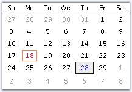{border="0"}

[]{style="COLOR: #15428b"} 

Figure 226: TodayFontColor = \"Crimson\"

**[]{style="COLOR: #15428b"}** 

See Also

[\
]{style="COLOR: #15428b"}[Day Settings]{.UGHyperlink}[, ]{.UGHyperlink}[Text Settings]{.UGHyperlink}[]{.UGHyperlink}

[]{#p283}[]{#_Text_Settings}3.3.3.1.4.2.3.2    Text Settings

[]{style="COLOR: #15428b"} 

This section discusses the properties which controls the appearance and behavior of the dates (contents) inside the grid cells.

[]{style="COLOR: #15428b"} 

Highlighting the dates

[]{style="COLOR: #15428b"} 

We can highlight the selected date using HighlightColor property.

**[]{style="COLOR: #15428b"}** 

+-------------------------------------------------------------------------------------------------------------------------------------------------------------+
| **[\[C#\]]{style="FONT-FAMILY: 'Courier New'; COLOR: black"}**                                                                                              |
|                                                                                                                                                             |
| []{style="FONT-FAMILY: 'Courier New'; COLOR: black"}                                                                                                        |
|                                                                                                                                                             |
| [this]{style="FONT-FAMILY: 'Courier New'; COLOR: blue"}[.monthCalendarAdv1.HighlightColor = System.Drawing.Color.Blue;]{style="FONT-FAMILY: 'Courier New'"} |
+-------------------------------------------------------------------------------------------------------------------------------------------------------------+

[]{style="COLOR: #15428b"} 

+----------------------------------------------------------------------------------------------------------------------------------------------------------+
| **[\[VB.NET\]]{style="FONT-FAMILY: 'Courier New'; COLOR: black"}**                                                                                       |
|                                                                                                                                                          |
| []{style="COLOR: #15428b"}                                                                                                                               |
|                                                                                                                                                          |
| [Me]{style="FONT-FAMILY: 'Courier New'; COLOR: blue"}[.monthCalendarAdv1.HighlightColor = System.Drawing.Color.Blue]{style="FONT-FAMILY: 'Courier New'"} |
+----------------------------------------------------------------------------------------------------------------------------------------------------------+

**[]{style="COLOR: #15428b"}** 

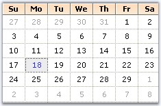{border="0"}

[]{style="COLOR: #15428b"} 

Figure 227: HighlightColor = \"Blue\"

**[]{style="COLOR: #15428b"}** 

Alignment and Wrapping of text

[]{style="COLOR: #15428b"} 

The alignment and text wrapping of the dates inside the grid cells is controlled using the below properties.

[]{style="COLOR: #15428b"} 

::: {align="center"}
+-----------------------------------+------------------------------------------------------------------------------------------+
| MonthCalendarAdv  Properties      | Description                                                                              |
+-----------------------------------+------------------------------------------------------------------------------------------+
| HorizontalAlignment               | Specifies the horizontal alignment of the dates inside a grid cell. The options are,     |
|                                   |                                                                                          |
|                                   | *[]{style="COLOR: black"}*                                                               |
|                                   |                                                                                          |
|                                   | *Left,*                                                                                  |
|                                   |                                                                                          |
|                                   | *Center and*                                                                             |
|                                   |                                                                                          |
|                                   | *Right.*                                                                                 |
+-----------------------------------+------------------------------------------------------------------------------------------+
| VerticalAlignment                 | Specifies the vertical alignment of the dates inside a grid cell. The options are,       |
|                                   |                                                                                          |
|                                   |                                                                                          |
|                                   |                                                                                          |
|                                   | *Top,*                                                                                   |
|                                   |                                                                                          |
|                                   | *Middle and*                                                                             |
|                                   |                                                                                          |
|                                   | *Bottom.*                                                                                |
+-----------------------------------+------------------------------------------------------------------------------------------+
| WrapText                          | Indicates whether the grid can wrap the text inside grid cells. By default, it is false. |
+-----------------------------------+------------------------------------------------------------------------------------------+
:::

[]{style="COLOR: #15428b"} 

+---------------------------------------------------------------------------------------------------------------------------------------------------------------------------------------------------------------------------+
| **[\[C#\]]{style="FONT-FAMILY: 'Courier New'; COLOR: black"}**                                                                                                                                                            |
|                                                                                                                                                                                                                           |
| []{style="FONT-FAMILY: 'Courier New'; COLOR: black"}                                                                                                                                                                      |
|                                                                                                                                                                                                                           |
| [this]{style="FONT-FAMILY: 'Courier New'; COLOR: blue"}[.monthCalendarAdv1.HorizontalAlignment = Syncfusion.Windows.Forms.Grid.[GridHorizontalAlignment]{style="COLOR: teal"}.Right;]{style="FONT-FAMILY: 'Courier New'"} |
|                                                                                                                                                                                                                           |
| [this]{style="FONT-FAMILY: 'Courier New'; COLOR: blue"}[.monthCalendarAdv1.VerticalAlignment = Syncfusion.Windows.Forms.Grid.[GridVerticalAlignment]{style="COLOR: teal"}.Top;]{style="FONT-FAMILY: 'Courier New'"}       |
|                                                                                                                                                                                                                           |
| [this]{style="FONT-FAMILY: 'Courier New'; COLOR: blue"}[.monthCalendarAdv1.WrapText = [true]{style="COLOR: blue"};]{style="FONT-FAMILY: 'Courier New'"}                                                                   |
+---------------------------------------------------------------------------------------------------------------------------------------------------------------------------------------------------------------------------+

[]{style="COLOR: #15428b"} 

+-------------------------------------------------------------------------------------------------------------------------------------------------------------------------------------------------------------------------+
| **[\[VB.NET\]]{style="FONT-FAMILY: 'Courier New'; COLOR: black"}**                                                                                                                                                      |
|                                                                                                                                                                                                                         |
| []{style="COLOR: #15428b"}                                                                                                                                                                                              |
|                                                                                                                                                                                                                         |
| [Me]{style="FONT-FAMILY: 'Courier New'; COLOR: blue"}[.monthCalendarAdv1.HorizontalAlignment = Syncfusion.Windows.Forms.Grid.[GridHorizontalAlignment]{style="COLOR: black"}.Right]{style="FONT-FAMILY: 'Courier New'"} |
|                                                                                                                                                                                                                         |
| [Me]{style="FONT-FAMILY: 'Courier New'; COLOR: blue"}[.monthCalendarAdv1.VerticalAlignment = Syncfusion.Windows.Forms.Grid.[GridVerticalAlignment]{style="COLOR: black"}.Top]{style="FONT-FAMILY: 'Courier New'"}       |
|                                                                                                                                                                                                                         |
| [Me]{style="FONT-FAMILY: 'Courier New'; COLOR: blue"}[.monthCalendarAdv1.WrapText = [True]{style="COLOR: blue"}]{style="FONT-FAMILY: 'Courier New'"}                                                                    |
+-------------------------------------------------------------------------------------------------------------------------------------------------------------------------------------------------------------------------+

**[]{style="COLOR: #15428b"}** 

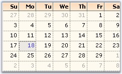{border="0"}

**[]{style="COLOR: #15428b"}** 

Figure 228: HorizontalAlignment = \"Right\"; VerticalAlignment = \"Top\"

**[]{style="COLOR: #15428b"}** 

See Also

[[]{style="TEXT-DECORATION: none"}]{.UGHyperlink} 

[Today\'s Date]{.UGHyperlink}[]{.UGHyperlink}

[]{#p284}[]{#_Buttons}3.3.3.1.4.2.4      Buttons

[]{style="COLOR: black"} 

The MonthCalendarAdv control contains the below buttons.

[]{style="COLOR: #15428b"} 

[·      ]{style="FONT-FAMILY: Symbol"}LeftScrollButton,

[·      ]{style="FONT-FAMILY: Symbol"}RightScrollButton,

[·      ]{style="FONT-FAMILY: Symbol"}\'Today\' button and

[·      ]{style="FONT-FAMILY: Symbol"}\'None\' button.

[]{style="COLOR: #15428b"} 

To know about the placement of these buttons in the control, refer MonthCalendarAdv topic. Left and Right scroll buttons at the top of the control can have custom images. See Scroll Buttons for details.

 

Today and None buttons are displayed at the bottom of the calendar and they can be customized to set background image and font styles. This section will discuss the properties which controls the appearance and behavior of the MonthCalendarAdv.

[]{style="COLOR: #15428b"} 

::: {align="center"}
  ----------------------------- --------------------------------------------------------------------------------------------------------------------------
  MonthCalendarAdv Properties   Description
  TodayButton                   Clicking this button at run time will move the focus to today\'s date in the calendar.
  NoneButton                    Clicking this button at run time, will remove the focus of the date in the calendar.
  BottomHeight                  The height of the bottom which contains the Today and None buttons are changed using this property. Default value is 20.
  ----------------------------- --------------------------------------------------------------------------------------------------------------------------
:::

[]{style="COLOR: #15428b"} 

Customizing Today and None Buttons

[]{style="COLOR: #15428b"} 

The \"Today\" and \"None\" buttons are like Essential Tools [ButtonAdv]{style="FONT-FAMILY: 'Verdana','sans-serif'; COLOR: black; FONT-SIZE: 8pt"} controls and they support all the properties of ButtonAdv control. You can access those properties using **MonthCalendarAdv.NoneButton.Visible** which controls the visibility (for example).

[]{style="COLOR: #15428b"} 

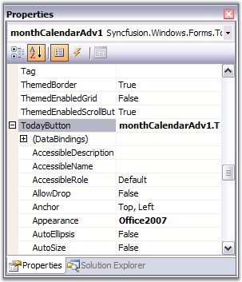{border="0"}

[]{style="COLOR: #15428b"} 

Figure 229: Accessing Properties of TodayButton in MonthCalendarAdv PropertyGrid

[]{style="COLOR: #15428b"} 

+---------------------------------------------------------------------------------------------------------------------------------------------------------------------------------------------------------+
| **[\[C#\]]{style="FONT-FAMILY: 'Courier New'; COLOR: black"}**                                                                                                                                          |
|                                                                                                                                                                                                         |
| []{style="COLOR: #15428b"}                                                                                                                                                                              |
|                                                                                                                                                                                                         |
| [//Hides the Today and None Buttons]{style="FONT-FAMILY: 'Courier New'; COLOR: green"}                                                                                                                  |
|                                                                                                                                                                                                         |
| [monthCalendarAdv1.TodayButton.Visible=]{style="FONT-FAMILY: 'Courier New'; COLOR: black"}[false]{style="FONT-FAMILY: 'Courier New'; COLOR: blue"}[;]{style="FONT-FAMILY: 'Courier New'; COLOR: black"} |
|                                                                                                                                                                                                         |
| [monthCalendarAdv1.NoneButton.Visible=]{style="FONT-FAMILY: 'Courier New'; COLOR: black"}[false]{style="FONT-FAMILY: 'Courier New'; COLOR: blue"}[;]{style="FONT-FAMILY: 'Courier New'; COLOR: black"}  |
+---------------------------------------------------------------------------------------------------------------------------------------------------------------------------------------------------------+

[]{style="COLOR: #15428b"} 

+----------------------------------------------------------------------------------------------------------------------------------------------------+
| **[\[VB.NET\]]{style="FONT-FAMILY: 'Courier New'; COLOR: black"}**                                                                                 |
|                                                                                                                                                    |
| []{style="COLOR: #15428b"}                                                                                                                         |
|                                                                                                                                                    |
| [\'Hides the Today and None Buttons]{style="FONT-FAMILY: 'Courier New'; COLOR: green"}                                                             |
|                                                                                                                                                    |
| [monthCalendarAdv1.TodayButton.Visible=]{style="FONT-FAMILY: 'Courier New'; COLOR: black"}[False]{style="FONT-FAMILY: 'Courier New'; COLOR: blue"} |
|                                                                                                                                                    |
| [monthCalendarAdv1.NoneButton.Visible=]{style="FONT-FAMILY: 'Courier New'; COLOR: black"}[False]{style="FONT-FAMILY: 'Courier New'; COLOR: blue"}  |
+----------------------------------------------------------------------------------------------------------------------------------------------------+

[]{style="COLOR: #15428b"} 

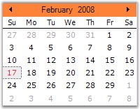{border="0"}

**[]{style="COLOR: #15428b"}** 

Figure 230: MonthCalendar without Today and None Button

**[]{style="COLOR: #15428b"}** 

See Also

[]{style="COLOR: #15428b"} 

[ButtonAdv]{.UGHyperlink}[, ]{.UGHyperlink}[Scroll Buttons]{.UGHyperlink}[]{.UGHyperlink}

[]{#p285}[]{#_Scroll_Buttons}3.3.3.1.4.2.4.1    Scroll Buttons

Scroll Button images

[]{style="COLOR: #15428b"} 

The default scroll button images can be replaced with custom images using the LeftScrollButtonImage and RightScrollButtonImage properties. The properties related to scroll buttons are as follows.

[]{style="COLOR: #15428b"} 

::: {align="center"}
  ------------------------------ ---------------------------------------------------------------------------------------------------
  MonthCalendarAdv  Properties   Description
  LeftScrollButtonImage          Specifies Image for left scroll button.
  RightftScrollButtonImage       Specifies Image for right scroll button.
  StretchScrollImage             Specifies whether the image for scroll buttons is stretched to fit the size of the scroll button.
  ScrollButtonSize               Specifies the size of the scroll buttons.
  ------------------------------ ---------------------------------------------------------------------------------------------------
:::

**[]{style="COLOR: #15428b"}** 

+---------------------------------------------------------------------------------------------------------------------------------------------------------------------------------------------------------------------------------------------------------------------------------------+
| **[\[C#\]]{style="FONT-FAMILY: 'Courier New'; COLOR: black"}**                                                                                                                                                                                                                        |
|                                                                                                                                                                                                                                                                                       |
| []{style="FONT-FAMILY: 'Courier New'; COLOR: black"}                                                                                                                                                                                                                                  |
|                                                                                                                                                                                                                                                                                       |
| [this]{style="FONT-FAMILY: 'Courier New'; COLOR: blue"}[.monthCalendarAdv1.LeftScrollButtonImage = ((System.Drawing.[Image]{style="COLOR: teal"})(resources.GetObject([\"monthCalendarAdv1.LeftScrollButtonImage\"]{style="COLOR: maroon"})));]{style="FONT-FAMILY: 'Courier New'"}   |
|                                                                                                                                                                                                                                                                                       |
| [this]{style="FONT-FAMILY: 'Courier New'; COLOR: blue"}[.monthCalendarAdv1.RightScrollButtonImage = ((System.Drawing.[Image]{style="COLOR: teal"})(resources.GetObject([\"monthCalendarAdv1.RightScrollButtonImage\"]{style="COLOR: maroon"})));]{style="FONT-FAMILY: 'Courier New'"} |
|                                                                                                                                                                                                                                                                                       |
| [this]{style="FONT-FAMILY: 'Courier New'; COLOR: blue"}[.monthCalendarAdv1.ScrollButtonSize = [new]{style="COLOR: blue"} System.Drawing.[Size]{style="COLOR: teal"}(30, 25);]{style="FONT-FAMILY: 'Courier New'"}                                                                     |
|                                                                                                                                                                                                                                                                                       |
| [this]{style="FONT-FAMILY: 'Courier New'; COLOR: blue"}[.monthCalendarAdv1.StretchScrollImage = [false]{style="COLOR: blue"};]{style="FONT-FAMILY: 'Courier New'"}                                                                                                                    |
+---------------------------------------------------------------------------------------------------------------------------------------------------------------------------------------------------------------------------------------------------------------------------------------+

[]{style="COLOR: #15428b"} 

+-----------------------------------------------------------------------------------------------------------------------------------------------------------------------------------------------------------------------------------------------------------------------------------------------+
| **[\[VB.NET\]]{style="FONT-FAMILY: 'Courier New'; COLOR: black"}**                                                                                                                                                                                                                            |
|                                                                                                                                                                                                                                                                                               |
| []{style="COLOR: black"}                                                                                                                                                                                                                                                                      |
|                                                                                                                                                                                                                                                                                               |
| [Me]{style="FONT-FAMILY: 'Courier New'; COLOR: blue"}[.monthCalendarAdv1.LeftScrollButtonImage = [DirectCast]{style="COLOR: blue"}((resources.GetObject([\"monthCalendarAdv1.LeftScrollButtonImage\"]{style="COLOR: maroon"})), System.Drawing.Image) ]{style="FONT-FAMILY: 'Courier New'"}   |
|                                                                                                                                                                                                                                                                                               |
| [Me]{style="FONT-FAMILY: 'Courier New'; COLOR: blue"}[.monthCalendarAdv1.RightScrollButtonImage = [DirectCast]{style="COLOR: blue"}((resources.GetObject([\"monthCalendarAdv1.RightScrollButtonImage\"]{style="COLOR: maroon"})), System.Drawing.Image) ]{style="FONT-FAMILY: 'Courier New'"} |
|                                                                                                                                                                                                                                                                                               |
| [Me]{style="FONT-FAMILY: 'Courier New'; COLOR: blue"}[.monthCalendarAdv1.ScrollButtonSize = [New]{style="COLOR: blue"} System.Drawing.Size(30, 25) ]{style="FONT-FAMILY: 'Courier New'"}                                                                                                      |
|                                                                                                                                                                                                                                                                                               |
| [Me]{style="FONT-FAMILY: 'Courier New'; COLOR: blue"}[.monthCalendarAdv1.StretchScrollImage = [False]{style="COLOR: blue"} ]{style="FONT-FAMILY: 'Courier New'"}                                                                                                                              |
+-----------------------------------------------------------------------------------------------------------------------------------------------------------------------------------------------------------------------------------------------------------------------------------------------+

[]{style="COLOR: #15428b"} 

{border="0"}

[]{style="COLOR: #15428b"} 

Figure 231: Custom Images for Scroll Buttons

###### []{#p286}3.3.3.1.4.3 Runtime Features {#runtime-features style="tab-stops: 0pt"}

 

This section covers the below topics:

[]{style="COLOR: #15428b"} 

[]{#p287}[]{#_Selecting_a_Date}3.3.3.1.4.3.1      Selecting a Date

Range of Selection

[]{style="COLOR: #15428b"} 

The minimum and maximum date selectable by the calendar can be specified using **MinValue** and **MaxValue** properties. (This is similar to MinDate and MaxDate of windows MonthCalendar control).

[]{style="COLOR: #15428b"} 

::: {align="center"}
  ------------------------------ ----------------------------------------------------------------------------------------------
  MonthCalendarAdv  Properties   Description
  Value                          Indicates the current value of the calendar. By default this value will be the current date.
  MinValue                       Specifies the minimum value selectable by the calendar.
  MaxValue                       Specifies the maximum value selectable by the calendar.
  ------------------------------ ----------------------------------------------------------------------------------------------
:::

[]{style="COLOR: #15428b"} 

+---------------------------------------------------------------------------------------------------------------------------------------------------------------------------------------------------------+
| **[\[C#\]]{style="FONT-FAMILY: 'Courier New'; COLOR: black"}**                                                                                                                                          |
|                                                                                                                                                                                                         |
| []{style="FONT-FAMILY: 'Courier New'; COLOR: black"}                                                                                                                                                    |
|                                                                                                                                                                                                         |
| [this]{style="FONT-FAMILY: 'Courier New'; COLOR: blue"}[.monthCalendarAdv1.Value = [new]{style="COLOR: blue"} System.[DateTime]{style="COLOR: teal"}(2008, 2, 19);]{style="FONT-FAMILY: 'Courier New'"} |
|                                                                                                                                                                                                         |
| [this]{style="FONT-FAMILY: 'Courier New'; COLOR: blue"}[.monthCalendarAdv1.MinValue = [new]{style="COLOR: blue"} System.DateTime(2000, 2, 21, 0, 0, 0, 0);]{style="FONT-FAMILY: 'Courier New'"}         |
|                                                                                                                                                                                                         |
| [this]{style="FONT-FAMILY: 'Courier New'; COLOR: blue"}[.monthCalendarAdv1.MaxValue = [new]{style="COLOR: blue"} System.DateTime(2008, 2, 21, 0, 0, 0, 0);]{style="FONT-FAMILY: 'Courier New'"}         |
+---------------------------------------------------------------------------------------------------------------------------------------------------------------------------------------------------------+

[]{style="COLOR: #15428b"} 

+----------------------------------------------------------------------------------------------------------------------------------------------------------------------------------------------+
| **[\[VB.NET\]]{style="FONT-FAMILY: 'Courier New'; COLOR: black"}**                                                                                                                           |
|                                                                                                                                                                                              |
| []{style="COLOR: #15428b"}                                                                                                                                                                   |
|                                                                                                                                                                                              |
| [Me]{style="FONT-FAMILY: 'Courier New'; COLOR: blue"}[.monthCalendarAdv1.Value = [New]{style="COLOR: blue"} [Date]{style="COLOR: blue"}(2008, 2, 19) ]{style="FONT-FAMILY: 'Courier New'"}   |
|                                                                                                                                                                                              |
| [Me]{style="FONT-FAMILY: 'Courier New'; COLOR: blue"}[.monthCalendarAdv1.MinValue = [New]{style="COLOR: blue"} System.DateTime(2000, 2, 21, 0, 0, 0, 0)]{style="FONT-FAMILY: 'Courier New'"} |
|                                                                                                                                                                                              |
| [Me]{style="FONT-FAMILY: 'Courier New'; COLOR: blue"}[.monthCalendarAdv1.MaxValue = [New]{style="COLOR: blue"} System.DateTime(2008, 2, 21, 0, 0, 0, 0)]{style="FONT-FAMILY: 'Courier New'"} |
+----------------------------------------------------------------------------------------------------------------------------------------------------------------------------------------------+

[]{style="COLOR: #15428b"} 

When we drag and drop a MonthCalendarAdv control, current system date, i.e, today\'s date will be selected by default. To change the selected date, DateTime Collection Editor is used, which is invoked using **SelectedDates** property.

[]{style="COLOR: #15428b"} 

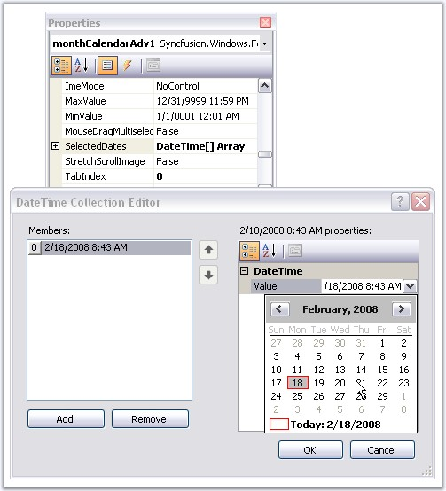{border="0"}

[]{style="COLOR: #15428b"} 

Figure 232: Accessing DateTime Collection Editor using SelectedDates Property

[]{style="COLOR: #15428b"} 

::: {style="BORDER-BOTTOM: windowtext 1pt solid; BORDER-LEFT: medium none; PADDING-BOTTOM: 1pt; MARGIN-TOP: 9pt; PADDING-LEFT: 0pt; PADDING-RIGHT: 0pt; MARGIN-BOTTOM: 9pt; BORDER-TOP: windowtext 1pt solid; BORDER-RIGHT: medium none; PADDING-TOP: 1pt"}
{border="0"} Note: It is possible to set color for the highlighted date. See Text Settings topic for details.
:::

[]{style="COLOR: #15428b"} 

Multiple Selection at run time

[]{style="COLOR: #15428b"} 

It is possible to enable multiple selection of the dates at run time. The below properties enables multiple selection.

[]{style="COLOR: #15428b"} 

::: {align="center"}
  ------------------------------ -----------------------------------------------------------------------------------------------------------------------------
  MonthCalendarAdv  Properties   Description
  AllowMultipleSelection         Indicates whether multiple selection of dates is allowed. i.e, by holding the Ctrl key and selecting the dates using mouse.
  MouseDragMultiSelect           Indicates whether selection of dates are allowed using mouse down and dragging at run time.
  ------------------------------ -----------------------------------------------------------------------------------------------------------------------------
:::

[]{style="COLOR: #15428b"} 

+-----------------------------------------------------------------------------------------------------------------------------------------------------------------------+
| **[\[C#\]]{style="FONT-FAMILY: 'Courier New'; COLOR: black"}**                                                                                                        |
|                                                                                                                                                                       |
| []{style="FONT-FAMILY: 'Courier New'; COLOR: black"}                                                                                                                  |
|                                                                                                                                                                       |
| [this]{style="FONT-FAMILY: 'Courier New'; COLOR: blue"}[.monthCalendarAdv1.AllowMultipleSelection = [true]{style="COLOR: blue"};]{style="FONT-FAMILY: 'Courier New'"} |
|                                                                                                                                                                       |
| [this]{style="FONT-FAMILY: 'Courier New'; COLOR: blue"}[.monthCalendarAdv1.MouseDragMultiselect = [true]{style="COLOR: blue"};]{style="FONT-FAMILY: 'Courier New'"}   |
+-----------------------------------------------------------------------------------------------------------------------------------------------------------------------+

[]{style="COLOR: #15428b"} 

+----------------------------------------------------------------------------------------------------------------------------------------------------------------------+
| **[\[VB.NET\]]{style="FONT-FAMILY: 'Courier New'; COLOR: black"}**                                                                                                   |
|                                                                                                                                                                      |
| []{style="COLOR: #15428b"}                                                                                                                                           |
|                                                                                                                                                                      |
| [this]{style="FONT-FAMILY: 'Courier New'; COLOR: blue"}[.monthCalendarAdv1.AllowMultipleSelection = [True]{style="COLOR: blue"}]{style="FONT-FAMILY: 'Courier New'"} |
|                                                                                                                                                                      |
| [Me]{style="FONT-FAMILY: 'Courier New'; COLOR: blue"}[.monthCalendarAdv1.MouseDragMultiselect = [True]{style="COLOR: blue"}]{style="FONT-FAMILY: 'Courier New'"}     |
+----------------------------------------------------------------------------------------------------------------------------------------------------------------------+

**[]{style="COLOR: #15428b"}** 

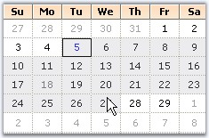{border="0"}

[]{style="COLOR: #15428b"} 

Figure 233: Selection of Dates by Mouse Dragging

***[]{style="COLOR: #15428b"}*** 

Select Date Range Programmatically[]{style="FONT-SIZE: 14pt"}

            Using the **SelectedDates** property, range of dates can be selected in the MonthCalendarAdv control. The dates should be given in array format using the DateTime Array list.

+----------------------------------------------------------------------------------------------------------------------------------------------------------------------------------------------------------------------------------------------------------------------------------------------------------------------------------------------------+
| **[\[C#\]]{style="FONT-FAMILY: 'Courier New'"}**                                                                                                                                                                                                                                                                                                   |
|                                                                                                                                                                                                                                                                                                                                                    |
| []{style="FONT-FAMILY: Consolas; COLOR: #2b91af; FONT-SIZE: 8pt"}                                                                                                                                                                                                                                                                                  |
|                                                                                                                                                                                                                                                                                                                                                    |
| [DateTime]{style="FONT-FAMILY: 'Courier New'; COLOR: #2b91af"}[\[\] dateTimes = [new]{style="COLOR: blue"} [DateTime]{style="COLOR: #2b91af"}\[\] { [new]{style="COLOR: blue"} [DateTime]{style="COLOR: #2b91af"}(2010, 11, 2), [new]{style="COLOR: blue"} [DateTime]{style="COLOR: #2b91af"}(2010, 11, 3) };]{style="FONT-FAMILY: 'Courier New'"} |
|                                                                                                                                                                                                                                                                                                                                                    |
| [DateTime]{style="FONT-FAMILY: 'Courier New'; COLOR: #2b91af"}[\[\] dateTotal = [new]{style="COLOR: blue"} [DateTime]{style="COLOR: #2b91af"}\[\] { };]{style="FONT-FAMILY: 'Courier New'"}                                                                                                                                                        |
+----------------------------------------------------------------------------------------------------------------------------------------------------------------------------------------------------------------------------------------------------------------------------------------------------------------------------------------------------+

 

+------------------------------------------------------------------------------------------------------------------------------------------------------------------------------------------------------------------------------------------------------------------------------------------+
| **[\[VB.NET\]]{style="FONT-FAMILY: 'Courier New'"}**                                                                                                                                                                                                                                     |
|                                                                                                                                                                                                                                                                                          |
|                                                                                                                                                                                                                                                                                          |
|                                                                                                                                                                                                                                                                                          |
| [Dim]{style="FONT-FAMILY: 'Courier New'; COLOR: blue"}[ dateTimes [As]{style="COLOR: blue"} DateTime() = [New]{style="COLOR: blue"} DateTime() {[New]{style="COLOR: blue"} DateTime(2010, 11, 2), [New]{style="COLOR: blue"} DateTime(2010, 11, 3)}]{style="FONT-FAMILY: 'Courier New'"} |
|                                                                                                                                                                                                                                                                                          |
| [Me]{style="FONT-FAMILY: 'Courier New'; COLOR: blue"}[.monthCalendarAdv1.SelectedDates = dateTimes]{style="FONT-FAMILY: 'Courier New'"}                                                                                                                                                  |
+------------------------------------------------------------------------------------------------------------------------------------------------------------------------------------------------------------------------------------------------------------------------------------------+

 

Dates should be specified in the DataTime Array List. Then the DateTime Array list should be declared to the SelectedDates Property. This would select the dates that are in the DateTime Array list.

 

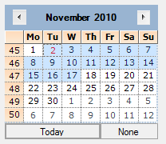{border="0"}

Figure 234: Select Date Range Programmatically

 

::: {style="BORDER-BOTTOM: windowtext 1pt solid; BORDER-LEFT: medium none; PADDING-BOTTOM: 1pt; MARGIN-TOP: 9pt; PADDING-LEFT: 0pt; PADDING-RIGHT: 0pt; MARGIN-BOTTOM: 9pt; BORDER-TOP: windowtext 1pt solid; BORDER-RIGHT: medium none; PADDING-TOP: 1pt"}
{border="0"} Note: Date range should be specified manually in the DateTime Array list.
:::

***[]{style="COLOR: #15428b"}*** 

***[]{style="COLOR: #15428b"}*** 

[]{#_Month_Settings}3.3.3.1.4.3.2      Month Settings

[]{#p288} Navigation at RunTime

**[]{style="COLOR: #15428b"}** 

At run time, you have options to move to the next month or previous month using the left or right scroll buttons and also using the context menu displayed, when you click on the month of the calendar. To specify images for individual months in the menu, use **MonthImageList** property.

[]{style="COLOR: #15428b"} 

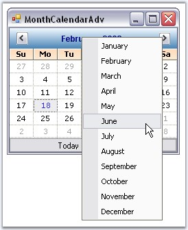{border="0"}

[]{style="COLOR: #15428b"} 

Figure 235: Navigating to other Months using Context Menu

**[]{style="COLOR: #15428b"}** 

+--------------------------------------------------------------------------------------------------------------------------------------------------------------------------+
| **[\[C#\]]{style="FONT-FAMILY: 'Courier New'; COLOR: black"}**                                                                                                           |
|                                                                                                                                                                          |
| []{style="FONT-FAMILY: 'Courier New'; COLOR: black"}                                                                                                                     |
|                                                                                                                                                                          |
| [this]{style="FONT-FAMILY: 'Courier New'; COLOR: blue"}[.monthCalendarAdv1.MonthImageList = [this]{style="COLOR: blue"}.imageList1;]{style="FONT-FAMILY: 'Courier New'"} |
+--------------------------------------------------------------------------------------------------------------------------------------------------------------------------+

[]{style="COLOR: #15428b"} 

+---------------------------------------------------------------------------------------------------------------------------------------------------------------------+
| **[\[VB.NET\]]{style="FONT-FAMILY: 'Courier New'; COLOR: black"}**                                                                                                  |
|                                                                                                                                                                     |
| []{style="COLOR: #15428b"}                                                                                                                                          |
|                                                                                                                                                                     |
| [Me]{style="FONT-FAMILY: 'Courier New'; COLOR: blue"}[.monthCalendarAdv1.MonthImageList = [Me]{style="COLOR: blue"}.imageList1]{style="FONT-FAMILY: 'Courier New'"} |
+---------------------------------------------------------------------------------------------------------------------------------------------------------------------+

[]{style="COLOR: #15428b"} 

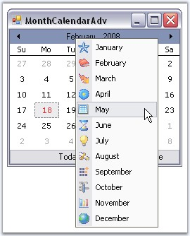{border="0"}

**[]{style="COLOR: #15428b"}** 

Figure 236: Image icons for the Months at Run Time

**[]{style="COLOR: #15428b"}** 

Foreground Color for Inactive Months

**[]{style="COLOR: #15428b"}** 

The below property sets the color for the inactive months.

[]{style="COLOR: #15428b"} 

::: {align="center"}
  ------------------------------ ----------------------------------------------------------------------------------------------------------------------------------------------------------------------
  MonthCalendarAdv  Properties   Description
  InactiveMonthColor             The previous or next month dates of the current month will be inactive in the MonthCalendarAdv control. This property specifies color of those inactive month dates.
  ------------------------------ ----------------------------------------------------------------------------------------------------------------------------------------------------------------------
:::

[]{style="COLOR: #15428b"} 

+--------------------------------------------------------------------------------------------------------------------------------------------------------------------------------+
| **[\[C#\]]{style="FONT-FAMILY: 'Courier New'; COLOR: black"}**                                                                                                                 |
|                                                                                                                                                                                |
| []{style="FONT-FAMILY: 'Courier New'; COLOR: black"}                                                                                                                           |
|                                                                                                                                                                                |
| [this]{style="FONT-FAMILY: 'Courier New'; COLOR: blue"}[.monthCalendarAdv1.InactiveMonthColor = System.Drawing.Color.InactiveCaptionText;]{style="FONT-FAMILY: 'Courier New'"} |
+--------------------------------------------------------------------------------------------------------------------------------------------------------------------------------+

[]{style="COLOR: #15428b"} 

+-----------------------------------------------------------------------------------------------------------------------------------------------------------------------------+
| **[\[VB.NET\]]{style="FONT-FAMILY: 'Courier New'; COLOR: black"}**                                                                                                          |
|                                                                                                                                                                             |
| []{style="COLOR: #15428b"}                                                                                                                                                  |
|                                                                                                                                                                             |
| [Me]{style="FONT-FAMILY: 'Courier New'; COLOR: blue"}[.monthCalendarAdv1.InactiveMonthColor = System.Drawing.Color.InactiveCaptionText]{style="FONT-FAMILY: 'Courier New'"} |
+-----------------------------------------------------------------------------------------------------------------------------------------------------------------------------+

[]{style="COLOR: #15428b"} 

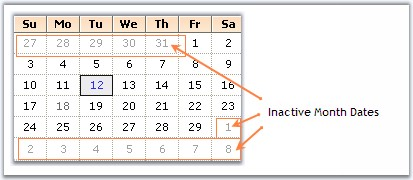{border="0"}

[]{style="COLOR: #15428b"} 

Figure 237: InactiveMonthColor = \"InactiveCaptionText\"

**[]{style="COLOR: #15428b"}** 

First Day of the Week

[]{style="COLOR: #15428b"} 

MonthCalendarAdv lets you specify the first day to be displayed in a week using **FirstDayOfWeek** property. Default will be Sunday.

[]{style="COLOR: #15428b"} 

+---------------------------------------------------------------------------------------------------------------------------------------------------------------------+
| **[\[C#\]]{style="FONT-FAMILY: 'Courier New'; COLOR: black"}**                                                                                                      |
|                                                                                                                                                                     |
| []{style="FONT-FAMILY: 'Courier New'; COLOR: black"}                                                                                                                |
|                                                                                                                                                                     |
| [this]{style="FONT-FAMILY: 'Courier New'; COLOR: blue"}[.monthCalendarAdv1.FirstDayOfWeek = [Day]{style="COLOR: teal"}.Monday;]{style="FONT-FAMILY: 'Courier New'"} |
+---------------------------------------------------------------------------------------------------------------------------------------------------------------------+

[]{style="COLOR: #15428b"} 

+-------------------------------------------------------------------------------------------------------------------------------------------------------------------+
| **[\[VB.NET\]]{style="FONT-FAMILY: 'Courier New'; COLOR: black"}**                                                                                                |
|                                                                                                                                                                   |
| []{style="COLOR: #15428b"}                                                                                                                                        |
|                                                                                                                                                                   |
| [Me]{style="FONT-FAMILY: 'Courier New'; COLOR: blue"}[.monthCalendarAdv1.FirstDayOfWeek = [Day.]{style="COLOR: black"}Monday]{style="FONT-FAMILY: 'Courier New'"} |
+-------------------------------------------------------------------------------------------------------------------------------------------------------------------+

[]{style="COLOR: #15428b"} 

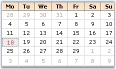{border="0"}

[]{style="COLOR: #15428b"} 

Figure 238: First Day of the Week set to \"Monday\"

[]{#_Interactive_Features_1}3.3.3.1.4.3.3      Interactive Features

[]{#p289}[]{style="COLOR: #15428b"} 

This section covers the below topics:

[]{style="COLOR: #15428b"} 

[]{#p290}3.3.3.1.4.3.3.1    Context Menu

This section deals with replacing MonthCalendarAdv \'Go to Today\' ContextMenu with a Custom Context Menu. At run-time, you can right click any calendar date and go to the today date using \'Go to Today\' ContextMenu.

[]{style="COLOR: #15428b"} 

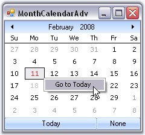{border="0"}

[]{style="COLOR: #15428b"} 

Figure 239: \'Go to Today\' Context Menu

[]{style="COLOR: #15428b"} 

This is the default context menu. To replace this with a custom context menu, you need to derive a Custom MonthCalendarAdv from the existing one and override the InitializeGrid so that the GetInternalGridControl method can be used to access the ContextMenu and replace it with a custom contextMenu.

 

It can be done programmatically using the below code snippet.

[]{style="COLOR: #15428b"} 

+------------------------------------------------------------------------------------------------------------------------------------------------------------------------------------------------------------------------------------------------------------------+
| **[\[C#\]]{style="FONT-FAMILY: 'Courier New'; COLOR: black"}**                                                                                                                                                                                                   |
|                                                                                                                                                                                                                                                                  |
| []{style="COLOR: #15428b"}                                                                                                                                                                                                                                       |
|                                                                                                                                                                                                                                                                  |
| [//Declaring and Initializing the calendar, Context menu and menu item]{style="FONT-FAMILY: 'Courier New'; COLOR: green"}                                                                                                                                        |
|                                                                                                                                                                                                                                                                  |
| [private]{style="FONT-FAMILY: 'Courier New'; COLOR: blue"}[ [CustomMonthCalendarAdv]{style="COLOR: teal"} monthCalendarAdv1;]{style="FONT-FAMILY: 'Courier New'"}                                                                                                |
|                                                                                                                                                                                                                                                                  |
| [private]{style="FONT-FAMILY: 'Courier New'; COLOR: blue"}[ System.Windows.Forms.[MenuItem]{style="COLOR: teal"} menuItem1;]{style="FONT-FAMILY: 'Courier New'"}                                                                                                 |
|                                                                                                                                                                                                                                                                  |
| [private]{style="FONT-FAMILY: 'Courier New'; COLOR: blue"}[ System.Windows.Forms.[ContextMenu]{style="COLOR: teal"} contextMenuStrip1;]{style="FONT-FAMILY: 'Courier New'"}                                                                                      |
|                                                                                                                                                                                                                                                                  |
| [this]{style="FONT-FAMILY: 'Courier New'; COLOR: blue"}[.contextMenuStrip1 = [new]{style="COLOR: blue"} System.Windows.Forms.[ContextMenu]{style="COLOR: teal"}();]{style="FONT-FAMILY: 'Courier New'"}                                                          |
|                                                                                                                                                                                                                                                                  |
| [this]{style="FONT-FAMILY: 'Courier New'; COLOR: blue"}[.menuItem1 = [new]{style="COLOR: blue"} System.Windows.Forms.[MenuItem]{style="COLOR: teal"}();]{style="FONT-FAMILY: 'Courier New'"}                                                                     |
|                                                                                                                                                                                                                                                                  |
| [this]{style="FONT-FAMILY: 'Courier New'; COLOR: blue"}[.monthCalendarAdv1 = [new]{style="COLOR: blue"} MonthCalendar.[Form1]{style="COLOR: teal"}.[CustomMonthCalendarAdv]{style="COLOR: teal"}();]{style="FONT-FAMILY: 'Courier New'"}                         |
|                                                                                                                                                                                                                                                                  |
| []{style="FONT-FAMILY: 'Courier New'"}                                                                                                                                                                                                                           |
|                                                                                                                                                                                                                                                                  |
| [this]{style="FONT-FAMILY: 'Courier New'; COLOR: blue"}[.contextMenuStrip1.MenuItems.AddRange([new]{style="COLOR: blue"} System.Windows.Forms.[MenuItem]{style="COLOR: teal"}\[\] {[this]{style="COLOR: blue"}.menuItem1});]{style="FONT-FAMILY: 'Courier New'"} |
|                                                                                                                                                                                                                                                                  |
| [this]{style="FONT-FAMILY: 'Courier New'; COLOR: blue"}[.menuItem1.Text = [\"Go To Tomorrow\"]{style="COLOR: maroon"};]{style="FONT-FAMILY: 'Courier New'"}                                                                                                      |
|                                                                                                                                                                                                                                                                  |
| [this]{style="FONT-FAMILY: 'Courier New'; COLOR: blue"}[.menuItem1.Click += [new]{style="COLOR: blue"} System.[EventHandler]{style="COLOR: teal"}([this]{style="COLOR: blue"}.menuItem1_Click);]{style="FONT-FAMILY: 'Courier New'"}                             |
|                                                                                                                                                                                                                                                                  |
| []{style="FONT-FAMILY: 'Courier New'"}                                                                                                                                                                                                                           |
|                                                                                                                                                                                                                                                                  |
| [//Override the internal grid context menu using the custom context menu]{style="FONT-FAMILY: 'Courier New'; COLOR: green"}                                                                                                                                      |
|                                                                                                                                                                                                                                                                  |
| [private]{style="FONT-FAMILY: 'Courier New'; COLOR: blue"}[ [void]{style="COLOR: blue"} Form1_Load_1([object]{style="COLOR: blue"} sender, [EventArgs]{style="COLOR: teal"} e)]{style="FONT-FAMILY: 'Courier New'"}                                              |
|                                                                                                                                                                                                                                                                  |
| [{]{style="FONT-FAMILY: 'Courier New'"}                                                                                                                                                                                                                          |
|                                                                                                                                                                                                                                                                  |
| [    [this]{style="COLOR: blue"}.monthCalendarAdv1.GetInternalGridControl().ContextMenu = [this]{style="COLOR: blue"}.contextMenuStrip1;]{style="FONT-FAMILY: 'Courier New'"}                                                                                    |
|                                                                                                                                                                                                                                                                  |
| [}]{style="FONT-FAMILY: 'Courier New'"}                                                                                                                                                                                                                          |
|                                                                                                                                                                                                                                                                  |
| []{style="FONT-FAMILY: 'Courier New'"}                                                                                                                                                                                                                           |
|                                                                                                                                                                                                                                                                  |
| [//Focus moves to tomorrow\'s date, when menu item is clicked]{style="FONT-FAMILY: 'Courier New'; COLOR: green"}                                                                                                                                                 |
|                                                                                                                                                                                                                                                                  |
| [private]{style="FONT-FAMILY: 'Courier New'; COLOR: blue"}[ [void]{style="COLOR: blue"} menuItem1_Click([object]{style="COLOR: blue"} sender, System.[EventArgs]{style="COLOR: teal"} e)]{style="FONT-FAMILY: 'Courier New'"}                                    |
|                                                                                                                                                                                                                                                                  |
| [{]{style="FONT-FAMILY: 'Courier New'"}                                                                                                                                                                                                                          |
|                                                                                                                                                                                                                                                                  |
| [    [this]{style="COLOR: blue"}.monthCalendarAdv1.Value = [DateTime]{style="COLOR: teal"}.Today.AddDays(1);]{style="FONT-FAMILY: 'Courier New'"}                                                                                                                |
|                                                                                                                                                                                                                                                                  |
| [}]{style="FONT-FAMILY: 'Courier New'"}                                                                                                                                                                                                                          |
|                                                                                                                                                                                                                                                                  |
| []{style="FONT-FAMILY: 'Courier New'"}                                                                                                                                                                                                                           |
|                                                                                                                                                                                                                                                                  |
| [//Defining CustomMonthCalendarAdv class]{style="FONT-FAMILY: 'Courier New'; COLOR: green"}                                                                                                                                                                      |
|                                                                                                                                                                                                                                                                  |
| [public]{style="FONT-FAMILY: 'Courier New'; COLOR: blue"}[ [class]{style="COLOR: blue"} [CustomMonthCalendarAdv]{style="COLOR: teal"} : Syncfusion.Windows.Forms.Tools.[MonthCalendarAdv]{style="COLOR: teal"}]{style="FONT-FAMILY: 'Courier New'"}              |
|                                                                                                                                                                                                                                                                  |
| [{]{style="FONT-FAMILY: 'Courier New'"}                                                                                                                                                                                                                          |
|                                                                                                                                                                                                                                                                  |
| [    [private]{style="COLOR: blue"} Syncfusion.Windows.Forms.Tools.[CalendarGrid]{style="COLOR: teal"} internalGrid;]{style="FONT-FAMILY: 'Courier New'"}                                                                                                        |
|                                                                                                                                                                                                                                                                  |
| [    [// Overrides the InitializeGrid.]{style="COLOR: green"}]{style="FONT-FAMILY: 'Courier New'"}                                                                                                                                                               |
|                                                                                                                                                                                                                                                                  |
| [    [protected]{style="COLOR: blue"} [override]{style="COLOR: blue"} [void]{style="COLOR: blue"} InitializeGrid([ref]{style="COLOR: blue"} Syncfusion.Windows.Forms.Tools.[CalendarGrid]{style="COLOR: teal"} grid)]{style="FONT-FAMILY: 'Courier New'"}        |
|                                                                                                                                                                                                                                                                  |
| [    {]{style="FONT-FAMILY: 'Courier New'"}                                                                                                                                                                                                                      |
|                                                                                                                                                                                                                                                                  |
| [        [base]{style="COLOR: blue"}.InitializeGrid([ref]{style="COLOR: blue"} grid);]{style="FONT-FAMILY: 'Courier New'"}                                                                                                                                       |
|                                                                                                                                                                                                                                                                  |
| [        internalGrid = grid;]{style="FONT-FAMILY: 'Courier New'"}                                                                                                                                                                                               |
|                                                                                                                                                                                                                                                                  |
| [    }]{style="FONT-FAMILY: 'Courier New'"}                                                                                                                                                                                                                      |
|                                                                                                                                                                                                                                                                  |
| [    [// Returns the internal grid.]{style="COLOR: green"}]{style="FONT-FAMILY: 'Courier New'"}                                                                                                                                                                  |
|                                                                                                                                                                                                                                                                  |
| [    [public]{style="COLOR: blue"} Syncfusion.Windows.Forms.Tools.[CalendarGrid]{style="COLOR: teal"} GetInternalGridControl()]{style="FONT-FAMILY: 'Courier New'"}                                                                                              |
|                                                                                                                                                                                                                                                                  |
| [    {]{style="FONT-FAMILY: 'Courier New'"}                                                                                                                                                                                                                      |
|                                                                                                                                                                                                                                                                  |
| [        [return]{style="COLOR: blue"} internalGrid;]{style="FONT-FAMILY: 'Courier New'"}                                                                                                                                                                        |
|                                                                                                                                                                                                                                                                  |
| [    }]{style="FONT-FAMILY: 'Courier New'"}                                                                                                                                                                                                                      |
|                                                                                                                                                                                                                                                                  |
| [}]{style="FONT-FAMILY: 'Courier New'"}                                                                                                                                                                                                                          |
+------------------------------------------------------------------------------------------------------------------------------------------------------------------------------------------------------------------------------------------------------------------+

[]{style="COLOR: #15428b"} 

+---------------------------------------------------------------------------------------------------------------------------------------------------------------------------------------------------------------------------------------------------------------------------------------------------------------------+
| **[\[VB.NET\]]{style="FONT-FAMILY: 'Courier New'; COLOR: black"}**                                                                                                                                                                                                                                                  |
|                                                                                                                                                                                                                                                                                                                     |
| []{style="COLOR: #15428b"}                                                                                                                                                                                                                                                                                          |
|                                                                                                                                                                                                                                                                                                                     |
| [\'Declaring and Initializing the calendar, Context menu and menu item ]{style="FONT-FAMILY: 'Courier New'; COLOR: green"}                                                                                                                                                                                          |
|                                                                                                                                                                                                                                                                                                                     |
| [Private]{style="FONT-FAMILY: 'Courier New'; COLOR: blue"}[ monthCalendarAdv1 [As]{style="COLOR: blue"} CustomMonthCalendarAdv]{style="FONT-FAMILY: 'Courier New'"}                                                                                                                                                 |
|                                                                                                                                                                                                                                                                                                                     |
| [Private]{style="FONT-FAMILY: 'Courier New'; COLOR: blue"}[ menuItem1 [As]{style="COLOR: blue"} System.Windows.Forms.MenuItem]{style="FONT-FAMILY: 'Courier New'"}                                                                                                                                                  |
|                                                                                                                                                                                                                                                                                                                     |
| [Private]{style="FONT-FAMILY: 'Courier New'; COLOR: blue"}[ contextMenuStrip1 [As]{style="COLOR: blue"} System.Windows.Forms.ContextMenu]{style="FONT-FAMILY: 'Courier New'"}                                                                                                                                       |
|                                                                                                                                                                                                                                                                                                                     |
| [Me]{style="FONT-FAMILY: 'Courier New'; COLOR: blue"}[.contextMenuStrip1 = [New]{style="COLOR: blue"} System.Windows.Forms.ContextMenu() ]{style="FONT-FAMILY: 'Courier New'"}                                                                                                                                      |
|                                                                                                                                                                                                                                                                                                                     |
| [Me]{style="FONT-FAMILY: 'Courier New'; COLOR: blue"}[.menuItem1 = [New]{style="COLOR: blue"} System.Windows.Forms.MenuItem() ]{style="FONT-FAMILY: 'Courier New'"}                                                                                                                                                 |
|                                                                                                                                                                                                                                                                                                                     |
| [Me]{style="FONT-FAMILY: 'Courier New'; COLOR: blue"}[.monthCalendarAdv1 = [New]{style="COLOR: blue"} MonthCalendar.Form1.CustomMonthCalendarAdv() ]{style="FONT-FAMILY: 'Courier New'"}                                                                                                                            |
|                                                                                                                                                                                                                                                                                                                     |
| [Me]{style="FONT-FAMILY: 'Courier New'; COLOR: blue"}[.contextMenuStrip1.MenuItems.AddRange([New]{style="COLOR: blue"} System.Windows.Forms.MenuItem() {[Me]{style="COLOR: blue"}.menuItem1}) ]{style="FONT-FAMILY: 'Courier New'"}                                                                                 |
|                                                                                                                                                                                                                                                                                                                     |
| [Me]{style="FONT-FAMILY: 'Courier New'; COLOR: blue"}[.menuItem1.Text = [\"Go To Tomorrow\"]{style="COLOR: maroon"} ]{style="FONT-FAMILY: 'Courier New'"}                                                                                                                                                           |
|                                                                                                                                                                                                                                                                                                                     |
| [AddHandler]{style="FONT-FAMILY: 'Courier New'; COLOR: blue"}[ [Me]{style="COLOR: blue"}.menuItem1.Click, [AddressOf]{style="COLOR: blue"} [Me]{style="COLOR: blue"}.menuItem1_Click ]{style="FONT-FAMILY: 'Courier New'"}                                                                                          |
|                                                                                                                                                                                                                                                                                                                     |
| []{style="FONT-FAMILY: 'Courier New'"}                                                                                                                                                                                                                                                                              |
|                                                                                                                                                                                                                                                                                                                     |
| [\'Override the internal grid context menu using the custom context menu ]{style="FONT-FAMILY: 'Courier New'; COLOR: green"}                                                                                                                                                                                        |
|                                                                                                                                                                                                                                                                                                                     |
| [Private]{style="FONT-FAMILY: 'Courier New'; COLOR: blue"}[ [Sub]{style="COLOR: blue"} Form1_Load_1([ByVal]{style="COLOR: blue"} sender [As]{style="COLOR: blue"} [Object]{style="COLOR: blue"}, [ByVal]{style="COLOR: blue"} e [As]{style="COLOR: blue"} EventArgs)]{style="FONT-FAMILY: 'Courier New'"}           |
|                                                                                                                                                                                                                                                                                                                     |
| [    [Me]{style="COLOR: blue"}.monthCalendarAdv1.GetInternalGridControl().ContextMenu = [Me]{style="COLOR: blue"}.contextMenuStrip1]{style="FONT-FAMILY: 'Courier New'"}                                                                                                                                            |
|                                                                                                                                                                                                                                                                                                                     |
| [End]{style="FONT-FAMILY: 'Courier New'; COLOR: blue"}[ [Sub]{style="COLOR: blue"}]{style="FONT-FAMILY: 'Courier New'"}                                                                                                                                                                                             |
|                                                                                                                                                                                                                                                                                                                     |
| []{style="FONT-FAMILY: 'Courier New'; COLOR: blue"}                                                                                                                                                                                                                                                                 |
|                                                                                                                                                                                                                                                                                                                     |
| [\'Focus moves to tomorrow\'s date, when menu item is clicked. ]{style="FONT-FAMILY: 'Courier New'; COLOR: green"}                                                                                                                                                                                                  |
|                                                                                                                                                                                                                                                                                                                     |
| [Private]{style="FONT-FAMILY: 'Courier New'; COLOR: blue"}[ [Sub]{style="COLOR: blue"} menuItem1_Click([ByVal]{style="COLOR: blue"} sender [As]{style="COLOR: blue"} [Object]{style="COLOR: blue"}, [ByVal]{style="COLOR: blue"} e [As]{style="COLOR: blue"} System.EventArgs)]{style="FONT-FAMILY: 'Courier New'"} |
|                                                                                                                                                                                                                                                                                                                     |
| [    [Me]{style="COLOR: blue"}.monthCalendarAdv1.Value = DateTime.Today.AddDays(1)]{style="FONT-FAMILY: 'Courier New'"}                                                                                                                                                                                             |
|                                                                                                                                                                                                                                                                                                                     |
| [End]{style="FONT-FAMILY: 'Courier New'; COLOR: blue"}[ [Sub]{style="COLOR: blue"}]{style="FONT-FAMILY: 'Courier New'"}                                                                                                                                                                                             |
|                                                                                                                                                                                                                                                                                                                     |
| []{style="FONT-FAMILY: 'Courier New'; COLOR: blue"}                                                                                                                                                                                                                                                                 |
|                                                                                                                                                                                                                                                                                                                     |
| [\'Defining CustomMonthCalendarAdv class ]{style="FONT-FAMILY: 'Courier New'; COLOR: green"}                                                                                                                                                                                                                        |
|                                                                                                                                                                                                                                                                                                                     |
| [Public]{style="FONT-FAMILY: 'Courier New'; COLOR: blue"}[ [Class]{style="COLOR: blue"} CustomMonthCalendarAdv]{style="FONT-FAMILY: 'Courier New'"}                                                                                                                                                                 |
|                                                                                                                                                                                                                                                                                                                     |
| [    [Inherits]{style="COLOR: blue"} Syncfusion.Windows.Forms.Tools.MonthCalendarAdv]{style="FONT-FAMILY: 'Courier New'"}                                                                                                                                                                                           |
|                                                                                                                                                                                                                                                                                                                     |
| [    [Private]{style="COLOR: blue"} internalGrid [As]{style="COLOR: blue"} Syncfusion.Windows.Forms.Tools.CalendarGrid]{style="FONT-FAMILY: 'Courier New'"}                                                                                                                                                         |
|                                                                                                                                                                                                                                                                                                                     |
| [    [\' Overrides the InitializeGrid. ]{style="COLOR: green"}]{style="FONT-FAMILY: 'Courier New'"}                                                                                                                                                                                                                 |
|                                                                                                                                                                                                                                                                                                                     |
| [    [Protected]{style="COLOR: blue"} [Overloads]{style="COLOR: blue"} [Overrides]{style="COLOR: blue"} [Sub]{style="COLOR: blue"} InitializeGrid([ByRef]{style="COLOR: blue"} grid [As]{style="COLOR: blue"} Syncfusion.Windows.Forms.Tools.CalendarGrid)]{style="FONT-FAMILY: 'Courier New'"}                     |
|                                                                                                                                                                                                                                                                                                                     |
| [        [MyBase]{style="COLOR: blue"}.InitializeGrid(grid)]{style="FONT-FAMILY: 'Courier New'"}                                                                                                                                                                                                                    |
|                                                                                                                                                                                                                                                                                                                     |
| [        internalGrid = grid]{style="FONT-FAMILY: 'Courier New'"}                                                                                                                                                                                                                                                   |
|                                                                                                                                                                                                                                                                                                                     |
| [    [End]{style="COLOR: blue"} [Sub]{style="COLOR: blue"}]{style="FONT-FAMILY: 'Courier New'"}                                                                                                                                                                                                                     |
|                                                                                                                                                                                                                                                                                                                     |
| [    [\' Returns the internal grid. ]{style="COLOR: green"}]{style="FONT-FAMILY: 'Courier New'"}                                                                                                                                                                                                                    |
|                                                                                                                                                                                                                                                                                                                     |
| [    [Public]{style="COLOR: blue"} [Function]{style="COLOR: blue"} GetInternalGridControl() [As]{style="COLOR: blue"} Syncfusion.Windows.Forms.Tools.CalendarGrid]{style="FONT-FAMILY: 'Courier New'"}                                                                                                              |
|                                                                                                                                                                                                                                                                                                                     |
| [        [Return]{style="COLOR: blue"} internalGrid]{style="FONT-FAMILY: 'Courier New'"}                                                                                                                                                                                                                            |
|                                                                                                                                                                                                                                                                                                                     |
| [    [End]{style="COLOR: blue"} [Function]{style="COLOR: blue"}]{style="FONT-FAMILY: 'Courier New'"}                                                                                                                                                                                                                |
|                                                                                                                                                                                                                                                                                                                     |
| [End]{style="FONT-FAMILY: 'Courier New'; COLOR: blue"}[ [Class]{style="COLOR: blue"}]{style="FONT-FAMILY: 'Courier New'"}                                                                                                                                                                                           |
+---------------------------------------------------------------------------------------------------------------------------------------------------------------------------------------------------------------------------------------------------------------------------------------------------------------------+

[]{style="COLOR: #15428b"} 

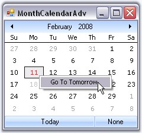{border="0"}

[]{style="COLOR: #15428b"} 

Figure 240: MonthCalendarAdv with Custom Context Menu

[]{#p291}[]{#_ToolTips}3.3.3.1.4.3.3.2    ToolTips

[]{style="COLOR: #15428b"} 

Tooltips[ can be set using ]{style="COLOR: #15428b"}DateCellQueryInfo event.[]{style="COLOR: #15428b"}

###### []{#p292}[]{#_Globalization}3.3.3.1.4.4 Globalization {#globalization style="tab-stops: 0pt"}

MonthCalendarAdv supports globalization through **MonthCalendarAdv.Culture** property.

[]{style="COLOR: #15428b"} 

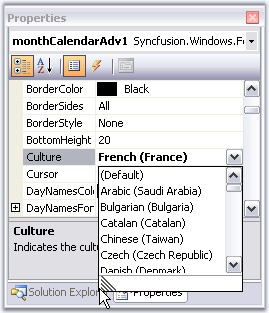{border="0"}

**[]{style="COLOR: #15428b"}** 

Figure 241: Selecting Culture Through PropertyGrid

**[]{style="COLOR: #15428b"}** 

+----------------------------------------------------------------------------------------------------------------------------------------------------------------------------------------------------------------------------------------------------------------------------------------------+
| **[\[C#\]]{style="FONT-FAMILY: 'Courier New'; COLOR: black"}**                                                                                                                                                                                                                               |
|                                                                                                                                                                                                                                                                                              |
| []{style="COLOR: #15428b"}                                                                                                                                                                                                                                                                   |
|                                                                                                                                                                                                                                                                                              |
| [this]{style="FONT-FAMILY: 'Courier New'; COLOR: blue"}[.monthCalendarAdv1.Culture = [new]{style="COLOR: blue"} System.Globalization.CultureInfo(]{style="FONT-FAMILY: 'Courier New'"}[\"fr-FR\"]{style="FONT-FAMILY: 'Courier New'; COLOR: maroon"}[);]{style="FONT-FAMILY: 'Courier New'"} |
+----------------------------------------------------------------------------------------------------------------------------------------------------------------------------------------------------------------------------------------------------------------------------------------------+

[]{style="COLOR: #15428b"} 

+-------------------------------------------------------------------------------------------------------------------------------------------------------------------------------------------------------------------------------------------------------------------------------------------+
| **[\[VB.NET\]]{style="FONT-FAMILY: 'Courier New'; COLOR: black"}**                                                                                                                                                                                                                        |
|                                                                                                                                                                                                                                                                                           |
| []{style="COLOR: #15428b"}                                                                                                                                                                                                                                                                |
|                                                                                                                                                                                                                                                                                           |
| [Me]{style="FONT-FAMILY: 'Courier New'; COLOR: blue"}[.monthCalendarAdv1.Culture = [New]{style="COLOR: blue"} System.Globalization.CultureInfo(]{style="FONT-FAMILY: 'Courier New'"}[\"fr-FR\"]{style="FONT-FAMILY: 'Courier New'; COLOR: maroon"}[)]{style="FONT-FAMILY: 'Courier New'"} |
+-------------------------------------------------------------------------------------------------------------------------------------------------------------------------------------------------------------------------------------------------------------------------------------------+

[]{style="COLOR: #15428b"} 

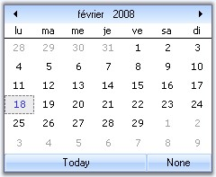{border="0"}

**[]{style="COLOR: #15428b"}** 

Figure 242: MonthCalendar with Culture French (France)

[]{#related-topics}
:::::::::::::::::::::::
