::: {style="DISPLAY: none"}
{#d2h_url_template}{#d2h_package_url style="WIDTH: 0px; DISPLAY: none; HEIGHT: 0px"}
:::

:::::::::::::::::::::::::: {.d2h_secondary_topic style="PADDING-BOTTOM: 10pt; MARGIN: 0pt; PADDING-LEFT: 0pt; PADDING-RIGHT: 0pt; PADDING-TOP: 0pt"}
##### Concepts and Features[]{#p304} {#concepts-and-features style="tab-stops: 0pt"}

[]{style="COLOR: #15428b"} 

The following topics will help you become more familiar with using the DateTimePickerAdv control:

[]{style="COLOR: #15428b"} 

###### []{#p305}[]{#_Child_Controls}3.3.3.2.3.1 Child Controls {#child-controls style="tab-stops: 0pt"}

 

DateTimePickerAdv has child controls like DropDown, Updown arrows, checkbox. This section discusses the properties which controls the appearance and behavior of these controls.

[]{style="COLOR: #15428b"} 

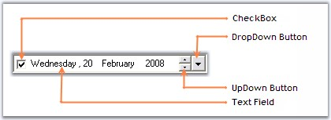{border="0"}

[]{style="COLOR: #15428b"} 

Figure 251: Child Controls in DateTimePickerAdv

[]{style="COLOR: #15428b"} 

[]{style="COLOR: #15428b"} 

[]{#p306}[]{#_UpDown_and_DropDown}3.3.3.2.3.1.1      UpDown and DropDown Buttons

[]{style="COLOR: #15428b"} 

This section discusses the properties of DateTimePickerAdv control which customizes the UpDown and DropDown buttons.

**[]{style="COLOR: #15428b"}** 

UpDown Buttons

[]{style="COLOR: #15428b"} 

The below properties controls the appearance and behavior of the UpDown buttons.

[]{style="COLOR: #15428b"} 

::: {align="center"}
  ------------------------------ --------------------------------------------------------------------------------
  DateTimePickerAdv Properties   Description
  ShowUpDown                     Shows or hides the UpDown buttons.
  ShowUpDownOnFocus              Shows or hides the UpDown button when focussed. By default it is set to false.
  VSLikeUpDown                   Specifies whether the UpDown button will have VS-like look.
  ------------------------------ --------------------------------------------------------------------------------
:::

[]{style="COLOR: #15428b"} 

+-------------------------------------------------------------------------------------------------------------------------------------------------------------------+
| **[\[C#\]]{style="FONT-FAMILY: 'Courier New'; COLOR: black"}**                                                                                                    |
|                                                                                                                                                                   |
| **[]{style="FONT-FAMILY: 'Courier New'; COLOR: black"}**                                                                                                          |
|                                                                                                                                                                   |
| [this]{style="FONT-FAMILY: 'Courier New'; COLOR: blue"}[.dateTimePickerAdv2.ShowUpDown = [true]{style="COLOR: blue"};]{style="FONT-FAMILY: 'Courier New'"}        |
|                                                                                                                                                                   |
| [this]{style="FONT-FAMILY: 'Courier New'; COLOR: blue"}[.dateTimePickerAdv2.ShowUpDownOnFocus = [true]{style="COLOR: blue"};]{style="FONT-FAMILY: 'Courier New'"} |
+-------------------------------------------------------------------------------------------------------------------------------------------------------------------+

[]{style="COLOR: #15428b"} 

+----------------------------------------------------------------------------------------------------------------------------------------------------------------+
| **[\[VB.NET\]]{style="FONT-FAMILY: 'Courier New'; COLOR: black"}**                                                                                             |
|                                                                                                                                                                |
| **[]{style="FONT-FAMILY: 'Courier New'; COLOR: black"}**                                                                                                       |
|                                                                                                                                                                |
| [Me]{style="FONT-FAMILY: 'Courier New'; COLOR: blue"}[.dateTimePickerAdv2.ShowUpDown = [True]{style="COLOR: blue"}]{style="FONT-FAMILY: 'Courier New'"}        |
|                                                                                                                                                                |
| [Me]{style="FONT-FAMILY: 'Courier New'; COLOR: blue"}[.dateTimePickerAdv2.ShowUpDownOnFocus = [True]{style="COLOR: blue"}]{style="FONT-FAMILY: 'Courier New'"} |
+----------------------------------------------------------------------------------------------------------------------------------------------------------------+

[]{style="COLOR: #15428b"} 

In the below image, when focus is on button control, the updown button is hidden. In the second image, DateTimePickerAdv is focussed and the UpDown button is shown.

[]{style="COLOR: #15428b"} 

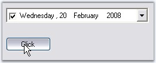{border="0"}

[]{style="COLOR: #15428b"} 

Figure 252: UpDown button Hidden

**[]{style="COLOR: #15428b"}** 

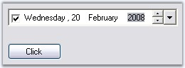{border="0"}

**[]{style="COLOR: #15428b"}** 

Figure 253: UpDown button Shown

**[]{style="COLOR: #15428b"}** 

{border="0"}

**[]{style="COLOR: #15428b"}** 

Figure 254: VS-Like UpDown Button in Office2007 Style

**[]{style="COLOR: #15428b"}** 

DropDown Button

[]{style="COLOR: #15428b"} 

DropDown button in the DateTimePickerAdv is visible by default. To hide the dropdown button set **ShowDropDown** property to false. The below are the properties available, to change the default appearance of the control.

[]{style="COLOR: #15428b"} 

Color Settings

[]{style="COLOR: #15428b"} 

At run time, drop down button can be in normal mode, pressed mode or in selected mode. Different colors can be set for different modes.

[]{style="COLOR: #15428b"} 

::: {align="center"}
  ------------------------------ --------------------------------------------------------------------------------------------------------------
  DateTimePickerAdv Properties   Description
  DropDownNormalColor            Gets or Sets the dropdown backcolor in Normal mode.
  DropDownPressedColor           Gets or Sets the dropdown backcolor in Pressed mode, i.e, when the date is selected in the text field.
  DropDownSelectedColor          Gets or Sets the dropdown backcolor in Selected mode, i.e, when a date is selected using the popup calendar.
  ------------------------------ --------------------------------------------------------------------------------------------------------------
:::

[]{style="COLOR: #15428b"} 

+-------------------------------------------------------------------------------------------------------------------------------------------------------------------------------------------------+
| **[\[C#\]]{style="FONT-FAMILY: 'Courier New'; COLOR: black"}**                                                                                                                                  |
|                                                                                                                                                                                                 |
| **[]{style="FONT-FAMILY: 'Courier New'; COLOR: black"}**                                                                                                                                        |
|                                                                                                                                                                                                 |
| [this]{style="FONT-FAMILY: 'Courier New'; COLOR: blue"}[.dateTimePickerAdv2.DropDownNormalColor = System.Drawing.[Color]{style="COLOR: teal"}.LightBlue;]{style="FONT-FAMILY: 'Courier New'"}   |
|                                                                                                                                                                                                 |
| [this]{style="FONT-FAMILY: 'Courier New'; COLOR: blue"}[.dateTimePickerAdv2.DropDownPressedColor = System.Drawing.[Color]{style="COLOR: teal"}.Goldenrod;]{style="FONT-FAMILY: 'Courier New'"}  |
|                                                                                                                                                                                                 |
| [this]{style="FONT-FAMILY: 'Courier New'; COLOR: blue"}[.dateTimePickerAdv2.DropDownSelectedColor = System.Drawing.[Color]{style="COLOR: teal"}.SteelBlue;]{style="FONT-FAMILY: 'Courier New'"} |
+-------------------------------------------------------------------------------------------------------------------------------------------------------------------------------------------------+

[]{style="COLOR: #15428b"} 

+-----------------------------------------------------------------------------------------------------------------------------------------------------------------------------------------------+
| **[\[VB.NET\]]{style="FONT-FAMILY: 'Courier New'; COLOR: black"}**                                                                                                                            |
|                                                                                                                                                                                               |
| **[]{style="FONT-FAMILY: 'Courier New'; COLOR: black"}**                                                                                                                                      |
|                                                                                                                                                                                               |
| [Me]{style="FONT-FAMILY: 'Courier New'; COLOR: blue"}[.dateTimePickerAdv2.DropDownNormalColor = System.Drawing.[Color]{style="COLOR: black"}.LightBlue]{style="FONT-FAMILY: 'Courier New'"}   |
|                                                                                                                                                                                               |
| [Me]{style="FONT-FAMILY: 'Courier New'; COLOR: blue"}[.dateTimePickerAdv2.DropDownPressedColor = System.Drawing.[Color]{style="COLOR: black"}.Goldenrod]{style="FONT-FAMILY: 'Courier New'"}  |
|                                                                                                                                                                                               |
| [Me]{style="FONT-FAMILY: 'Courier New'; COLOR: blue"}[.dateTimePickerAdv2.DropDownSelectedColor = System.Drawing.[Color]{style="COLOR: black"}.SteelBlue]{style="FONT-FAMILY: 'Courier New'"} |
+-----------------------------------------------------------------------------------------------------------------------------------------------------------------------------------------------+

[]{style="COLOR: #15428b"} 

::: {style="BORDER-BOTTOM: windowtext 1pt solid; BORDER-LEFT: medium none; PADDING-BOTTOM: 1pt; MARGIN-TOP: 9pt; PADDING-LEFT: 0pt; PADDING-RIGHT: 0pt; MARGIN-BOTTOM: 9pt; BORDER-TOP: windowtext 1pt solid; BORDER-RIGHT: medium none; PADDING-TOP: 1pt"}
{border="0"} Note: These settings will be effective only when DateTimePickerAdv.Style is Office2003, OfficeXP and VS2005.
:::

[]{style="COLOR: #15428b"} 

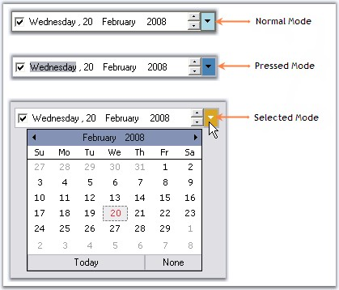{border="0"}

[]{style="COLOR: #15428b"} 

Figure 255: Different color set for Different Modes of DropDown Button

**[]{style="COLOR: #15428b"}** 

Flat Appearance

**[]{style="COLOR: #15428b"}** 

Dropdown can be given flat appearance using FlatDropDown property. By default it is false.

[]{style="COLOR: #15428b"} 

+----------------------------------------------------------------------------------------------------------------------------------------------------------------+
| **[\[C#\]]{style="FONT-FAMILY: 'Courier New'; COLOR: black"}**                                                                                                 |
|                                                                                                                                                                |
| **[]{style="FONT-FAMILY: 'Courier New'; COLOR: black"}**                                                                                                       |
|                                                                                                                                                                |
| [this]{style="FONT-FAMILY: 'Courier New'; COLOR: blue"}[.dateTimePickerAdv2.FlatDropButton = [true]{style="COLOR: blue"};]{style="FONT-FAMILY: 'Courier New'"} |
+----------------------------------------------------------------------------------------------------------------------------------------------------------------+

[]{style="COLOR: #15428b"} 

+----------------------------------------------------------------------------------------------------------------------------------------------------------------+
| **[\[VB.NET\]]{style="FONT-FAMILY: 'Courier New'; COLOR: black"}**                                                                                             |
|                                                                                                                                                                |
| **[]{style="FONT-FAMILY: 'Courier New'; COLOR: black"}**                                                                                                       |
|                                                                                                                                                                |
| [this]{style="FONT-FAMILY: 'Courier New'; COLOR: blue"}[.dateTimePickerAdv2.FlatDropButton = [true]{style="COLOR: blue"};]{style="FONT-FAMILY: 'Courier New'"} |
+----------------------------------------------------------------------------------------------------------------------------------------------------------------+

[]{style="COLOR: #15428b"} 

::: {style="BORDER-BOTTOM: windowtext 1pt solid; BORDER-LEFT: medium none; PADDING-BOTTOM: 1pt; MARGIN-TOP: 9pt; PADDING-LEFT: 0pt; PADDING-RIGHT: 0pt; MARGIN-BOTTOM: 9pt; BORDER-TOP: windowtext 1pt solid; BORDER-RIGHT: medium none; PADDING-TOP: 1pt"}
{border="0"} Note: These setting will be effective only when DateTimePickerAdv.Style is Default.
:::

[]{style="COLOR: #15428b"} 

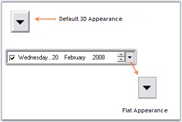{border="0"}

[]{style="COLOR: #15428b"} 

Figure 256: Flat Appearance for DropDown Button

[]{style="COLOR: #15428b"} 

Alignment of the DropDown

[]{style="COLOR: #15428b"} 

When the dropdown button is clicked, the calendar pops up, based on the alignment specified in **DropDownAlign** property. Default value is Left.

[]{style="COLOR: #15428b"} 

+--------------------------------------------------------------------------------------------------------------------------------------------------------------------------------------------------------+
| **[\[C#\]]{style="FONT-FAMILY: 'Courier New'; COLOR: black"}**                                                                                                                                         |
|                                                                                                                                                                                                        |
| **[]{style="FONT-FAMILY: 'Courier New'; COLOR: black"}**                                                                                                                                               |
|                                                                                                                                                                                                        |
| [this]{style="FONT-FAMILY: 'Courier New'; COLOR: blue"}[.dateTimePickerAdv1.DropDownAlign = System.Windows.Forms.[LeftRightAlignment]{style="COLOR: teal"}.Right;]{style="FONT-FAMILY: 'Courier New'"} |
+--------------------------------------------------------------------------------------------------------------------------------------------------------------------------------------------------------+

[]{style="COLOR: #15428b"} 

+------------------------------------------------------------------------------------------------------------------------------------------------------------------------------------------------------+
| **[\[VB.NET\]]{style="FONT-FAMILY: 'Courier New'; COLOR: black"}**                                                                                                                                   |
|                                                                                                                                                                                                      |
| **[]{style="FONT-FAMILY: 'Courier New'; COLOR: black"}**                                                                                                                                             |
|                                                                                                                                                                                                      |
| [Me]{style="FONT-FAMILY: 'Courier New'; COLOR: blue"}[.dateTimePickerAdv1.DropDownAlign = System.Windows.Forms.[LeftRightAlignment.Right]{style="COLOR: black"}]{style="FONT-FAMILY: 'Courier New'"} |
+------------------------------------------------------------------------------------------------------------------------------------------------------------------------------------------------------+

[]{style="COLOR: #15428b"} 

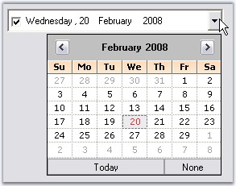{border="0"}

[]{style="COLOR: #15428b"} 

Figure 257: DropDownAlign = \"Right\"

**[]{style="COLOR: #15428b"}** 

Image for DropDown

**[]{style="COLOR: #15428b"}** 

The existing dropdown icon can be replaced with a custom image using the below properties.

[]{style="COLOR: #15428b"} 

::: {align="center"}
  ------------------------------ -----------------------------------------------------------
  DateTimePickerAdv Properties   Description
  DropDownImage                  Gets or Sets the Image for dropdown button.
  StretchDropDownImage           Specifies whether the image of the dropdown is stretched.
  ------------------------------ -----------------------------------------------------------
:::

[]{style="COLOR: #15428b"} 

+-----------------------------------------------------------------------------------------------------------------------------------------------------------------------------------------------------------------------------------------------------------------------+
| **[\[C#\]]{style="FONT-FAMILY: 'Courier New'; COLOR: black"}**                                                                                                                                                                                                        |
|                                                                                                                                                                                                                                                                       |
| **[]{style="FONT-FAMILY: 'Courier New'; COLOR: black"}**                                                                                                                                                                                                              |
|                                                                                                                                                                                                                                                                       |
| [this]{style="FONT-FAMILY: 'Courier New'; COLOR: blue"}[.dateTimePickerAdv1.DropDownImage = ((System.Drawing.[Image]{style="COLOR: teal"})(resources.GetObject([\"dateTimePickerAdv1.DropDownImage\"]{style="COLOR: maroon"})));]{style="FONT-FAMILY: 'Courier New'"} |
|                                                                                                                                                                                                                                                                       |
| [this]{style="FONT-FAMILY: 'Courier New'; COLOR: blue"}[.dateTimePickerAdv1.StretchDropDownImage = [true]{style="COLOR: blue"};]{style="FONT-FAMILY: 'Courier New'"}                                                                                                  |
+-----------------------------------------------------------------------------------------------------------------------------------------------------------------------------------------------------------------------------------------------------------------------+

[]{style="COLOR: #15428b"} 

+-------------------------------------------------------------------------------------------------------------------------------------------------------------------------------------------------------------------------------------------------------------------------------+
| **[\[VB.NET\]]{style="FONT-FAMILY: 'Courier New'; COLOR: black"}**                                                                                                                                                                                                            |
|                                                                                                                                                                                                                                                                               |
| **[]{style="FONT-FAMILY: 'Courier New'; COLOR: black"}**                                                                                                                                                                                                                      |
|                                                                                                                                                                                                                                                                               |
| [Me]{style="FONT-FAMILY: 'Courier New'; COLOR: blue"}[.dateTimePickerAdv1.DropDownImage = [DirectCast]{style="COLOR: blue"}((resources.GetObject([\"dateTimePickerAdv1.DropDownImage\"]{style="COLOR: maroon"})), System.Drawing.Image) ]{style="FONT-FAMILY: 'Courier New'"} |
|                                                                                                                                                                                                                                                                               |
| [Me]{style="FONT-FAMILY: 'Courier New'; COLOR: blue"}[.dateTimePickerAdv1.StretchDropDownImage = [True]{style="COLOR: blue"} ]{style="FONT-FAMILY: 'Courier New'"}                                                                                                            |
+-------------------------------------------------------------------------------------------------------------------------------------------------------------------------------------------------------------------------------------------------------------------------------+

[]{style="COLOR: #15428b"} 

{border="0"}

[]{style="COLOR: #15428b"} 

Figure 258: Custom Image for DropDown Button

[]{style="COLOR: #15428b"} 

{border="0"}

[]{style="COLOR: #15428b"} 

Figure 259: Stretched Custom Image

[]{style="COLOR: #15428b"} 

See Also

[]{style="COLOR: #15428b"} 

[Checkbox]{.UGHyperlink}[, ]{.UGHyperlink}[Text Field]{.UGHyperlink}[]{.UGHyperlink}

[]{#_CheckBox}3.3.3.2.3.1.2      CheckBox

[]{style="COLOR: #15428b"} 

By default the DateTimePicker control has a checkbox in checked state. This checkbox can be hidden using **ShowCheckBox** property and the state can be unchecked through designer, using **Checked** property.

[]{style="COLOR: #15428b"} 

+---------------------------------------------------------------------------------------------------------------------------------------------------------------+
| **[\[C#\]]{style="FONT-FAMILY: 'Courier New'; COLOR: black"}**                                                                                                |
|                                                                                                                                                               |
| **[]{style="FONT-FAMILY: 'Courier New'; COLOR: black"}**                                                                                                      |
|                                                                                                                                                               |
| [this]{style="FONT-FAMILY: 'Courier New'; COLOR: blue"}[.dateTimePickerAdv1.ShowCheckBox = [false]{style="COLOR: blue"};]{style="FONT-FAMILY: 'Courier New'"} |
|                                                                                                                                                               |
| [this]{style="FONT-FAMILY: 'Courier New'; COLOR: blue"}[.dateTimePickerAdv5.Checked = [false]{style="COLOR: blue"};]{style="FONT-FAMILY: 'Courier New'"}      |
+---------------------------------------------------------------------------------------------------------------------------------------------------------------+

[]{style="COLOR: #15428b"} 

+------------------------------------------------------------------------------------------------------------------------------------------------------------+
| **[\[VB.NET\]]{style="FONT-FAMILY: 'Courier New'; COLOR: black"}**                                                                                         |
|                                                                                                                                                            |
| **[]{style="FONT-FAMILY: 'Courier New'; COLOR: black"}**                                                                                                   |
|                                                                                                                                                            |
| [Me]{style="FONT-FAMILY: 'Courier New'; COLOR: blue"}[.dateTimePickerAdv1.ShowCheckBox = [False]{style="COLOR: blue"}]{style="FONT-FAMILY: 'Courier New'"} |
|                                                                                                                                                            |
| [Me]{style="FONT-FAMILY: 'Courier New'; COLOR: blue"}[.dateTimePickerAdv5.Checked = [False]{style="COLOR: blue"}]{style="FONT-FAMILY: 'Courier New'"}      |
+------------------------------------------------------------------------------------------------------------------------------------------------------------+

[]{style="COLOR: #15428b"} 

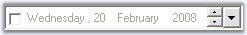{border="0"}

[]{style="COLOR: #15428b"} 

Figure 260: Unchecked State of the CheckBox

**[]{style="COLOR: #15428b"}** 

See Also

[]{style="COLOR: #15428b"} 

[Text Field]{.UGHyperlink}[, ]{.UGHyperlink}[UpDown and DropDown Buttons]{.UGHyperlink}[]{.UGHyperlink}

[]{#p308}[]{#_Text_Field}3.3.3.2.3.1.3      Text Field

[]{style="COLOR: #15428b"} 

This section discusses the properties related to Checkbox and text field in the DateTimePicker control.

[]{style="COLOR: #15428b"} 

CheckBox

[]{style="COLOR: #15428b"} 

By default the DateTimePicker control has a checkbox in checked state. This checkbox can be hidden using **ShowCheckBox** property and the state can be unchecked through designer, using **Checked** property.

[]{style="COLOR: #15428b"} 

+---------------------------------------------------------------------------------------------------------------------------------------------------------------+
| **[\[C#\]]{style="FONT-FAMILY: 'Courier New'; COLOR: black"}**                                                                                                |
|                                                                                                                                                               |
| **[]{style="FONT-FAMILY: 'Courier New'; COLOR: black"}**                                                                                                      |
|                                                                                                                                                               |
| [this]{style="FONT-FAMILY: 'Courier New'; COLOR: blue"}[.dateTimePickerAdv1.ShowCheckBox = [false]{style="COLOR: blue"};]{style="FONT-FAMILY: 'Courier New'"} |
|                                                                                                                                                               |
| [this]{style="FONT-FAMILY: 'Courier New'; COLOR: blue"}[.dateTimePickerAdv5.Checked = [false]{style="COLOR: blue"};]{style="FONT-FAMILY: 'Courier New'"}      |
+---------------------------------------------------------------------------------------------------------------------------------------------------------------+

[]{style="COLOR: #15428b"} 

+------------------------------------------------------------------------------------------------------------------------------------------------------------+
| **[\[VB.NET\]]{style="FONT-FAMILY: 'Courier New'; COLOR: black"}**                                                                                         |
|                                                                                                                                                            |
| **[]{style="FONT-FAMILY: 'Courier New'; COLOR: black"}**                                                                                                   |
|                                                                                                                                                            |
| [Me]{style="FONT-FAMILY: 'Courier New'; COLOR: blue"}[.dateTimePickerAdv1.ShowCheckBox = [False]{style="COLOR: blue"}]{style="FONT-FAMILY: 'Courier New'"} |
|                                                                                                                                                            |
| [Me]{style="FONT-FAMILY: 'Courier New'; COLOR: blue"}[.dateTimePickerAdv5.Checked = [False]{style="COLOR: blue"}]{style="FONT-FAMILY: 'Courier New'"}      |
+------------------------------------------------------------------------------------------------------------------------------------------------------------+

[]{style="COLOR: #15428b"} 

{border="0"}

[]{style="COLOR: #15428b"} 

Figure 261: Unchecked State of the CheckBox

[]{style="COLOR: #15428b"} 

Text Field Formatting

[]{style="COLOR: #15428b"} 

**Format** and **CustomFormat** properties are used to format the text field. Below are the details

[]{style="COLOR: #15428b"} 

::: {align="center"}
+-----------------------------------+-----------------------------------------------------------------------------------------------------------------------------------------------------------+
| DateTimePickerAdv Properties      | Description                                                                                                                                               |
+-----------------------------------+-----------------------------------------------------------------------------------------------------------------------------------------------------------+
| Format                            | Gets or Sets the format of the picker. The options are,                                                                                                   |
|                                   |                                                                                                                                                           |
|                                   |                                                                                                                                                           |
|                                   |                                                                                                                                                           |
|                                   | *Long(default),*                                                                                                                                          |
|                                   |                                                                                                                                                           |
|                                   | *Short,*                                                                                                                                                  |
|                                   |                                                                                                                                                           |
|                                   | *Time and*                                                                                                                                                |
|                                   |                                                                                                                                                           |
|                                   | *Custom.*                                                                                                                                                 |
+-----------------------------------+-----------------------------------------------------------------------------------------------------------------------------------------------------------+
| CustomFormat                      | Specifies the custom format, when the Format is set to \'Custom\'.  For example, If you want to display \'March/2007\', set CustomFormat to \'MMMM/yyyy\' |
+-----------------------------------+-----------------------------------------------------------------------------------------------------------------------------------------------------------+
:::

[]{style="COLOR: #15428b"} 

+----------------------------------------------------------------------------------------------------------------------------------------------------------------------------------------------------+
| **[\[C#\]]{style="FONT-FAMILY: 'Courier New'; COLOR: black"}**                                                                                                                                     |
|                                                                                                                                                                                                    |
| **[]{style="FONT-FAMILY: 'Courier New'; COLOR: black"}**                                                                                                                                           |
|                                                                                                                                                                                                    |
| [//Sets \"Long\" format for the text field]{style="FONT-FAMILY: 'Courier New'; COLOR: green"}                                                                                                      |
|                                                                                                                                                                                                    |
| [this]{style="FONT-FAMILY: 'Courier New'; COLOR: blue"}[.dateTimePickerAdv5.Format = System.Windows.Forms.[DateTimePickerFormat]{style="COLOR: teal"}.Long;]{style="FONT-FAMILY: 'Courier New'"}   |
|                                                                                                                                                                                                    |
| []{style="FONT-FAMILY: 'Courier New'"}                                                                                                                                                             |
|                                                                                                                                                                                                    |
| [//Sets \"Short\" format for the text field]{style="FONT-FAMILY: 'Courier New'; COLOR: green"}                                                                                                     |
|                                                                                                                                                                                                    |
| [this]{style="FONT-FAMILY: 'Courier New'; COLOR: blue"}[.dateTimePickerAdv5.Format = System.Windows.Forms.[DateTimePickerFormat]{style="COLOR: teal"}.Short;]{style="FONT-FAMILY: 'Courier New'"}  |
|                                                                                                                                                                                                    |
| []{style="FONT-FAMILY: 'Courier New'"}                                                                                                                                                             |
|                                                                                                                                                                                                    |
| [//Sets \"Time\" format for the text field]{style="FONT-FAMILY: 'Courier New'; COLOR: green"}                                                                                                      |
|                                                                                                                                                                                                    |
| [this]{style="FONT-FAMILY: 'Courier New'; COLOR: blue"}[.dateTimePickerAdv5.Format = System.Windows.Forms.[DateTimePickerFormat]{style="COLOR: teal"}.Time;]{style="FONT-FAMILY: 'Courier New'"}   |
|                                                                                                                                                                                                    |
| []{style="FONT-FAMILY: 'Courier New'"}                                                                                                                                                             |
|                                                                                                                                                                                                    |
| [//Sets custom format for the text field]{style="FONT-FAMILY: 'Courier New'; COLOR: green"}                                                                                                        |
|                                                                                                                                                                                                    |
| [this]{style="FONT-FAMILY: 'Courier New'; COLOR: blue"}[.dateTimePickerAdv5.Format = System.Windows.Forms.[DateTimePickerFormat]{style="COLOR: teal"}.Custom;]{style="FONT-FAMILY: 'Courier New'"} |
|                                                                                                                                                                                                    |
| [this]{style="FONT-FAMILY: 'Courier New'; COLOR: blue"}[.dateTimePickerAdv5.CustomFormat = [\"dd - MM - yyyy\"]{style="COLOR: maroon"};]{style="FONT-FAMILY: 'Courier New'"}                       |
+----------------------------------------------------------------------------------------------------------------------------------------------------------------------------------------------------+

[]{style="COLOR: #15428b"} 

+--------------------------------------------------------------------------------------------------------------------------------------------------------------------------------------------------+
| **[\[VB.NET\]]{style="FONT-FAMILY: 'Courier New'; COLOR: black"}**                                                                                                                               |
|                                                                                                                                                                                                  |
| **[]{style="FONT-FAMILY: 'Courier New'; COLOR: black"}**                                                                                                                                         |
|                                                                                                                                                                                                  |
| [\'Sets \"Long\" format for the text field]{style="FONT-FAMILY: 'Courier New'; COLOR: green"}                                                                                                    |
|                                                                                                                                                                                                  |
| [Me]{style="FONT-FAMILY: 'Courier New'; COLOR: blue"}[.dateTimePickerAdv5.Format = System.Windows.Forms[.DateTimePickerFormat]{style="COLOR: black"}.Long]{style="FONT-FAMILY: 'Courier New'"}   |
|                                                                                                                                                                                                  |
| []{style="FONT-FAMILY: 'Courier New'"}                                                                                                                                                           |
|                                                                                                                                                                                                  |
| [\'Sets \"Short\" format for the text field]{style="FONT-FAMILY: 'Courier New'; COLOR: green"}                                                                                                   |
|                                                                                                                                                                                                  |
| [Me]{style="FONT-FAMILY: 'Courier New'; COLOR: blue"}[.dateTimePickerAdv5.Format = System.Windows.Forms.[DateTimePickerFormat.Short]{style="COLOR: black"}]{style="FONT-FAMILY: 'Courier New'"}  |
|                                                                                                                                                                                                  |
| []{style="FONT-FAMILY: 'Courier New'"}                                                                                                                                                           |
|                                                                                                                                                                                                  |
| [\'Sets \"Time\" format for the text field]{style="FONT-FAMILY: 'Courier New'; COLOR: green"}                                                                                                    |
|                                                                                                                                                                                                  |
| [Me]{style="FONT-FAMILY: 'Courier New'; COLOR: blue"}[.dateTimePickerAdv5.Format = System.Windows.[Forms.DateTimePickerFormat.Time]{style="COLOR: black"}]{style="FONT-FAMILY: 'Courier New'"}   |
|                                                                                                                                                                                                  |
| []{style="FONT-FAMILY: 'Courier New'"}                                                                                                                                                           |
|                                                                                                                                                                                                  |
| [\'Sets custom format for the text field]{style="FONT-FAMILY: 'Courier New'; COLOR: green"}                                                                                                      |
|                                                                                                                                                                                                  |
| [Me]{style="FONT-FAMILY: 'Courier New'; COLOR: blue"}[.dateTimePickerAdv5.Format = System.Windows.Forms.[DateTimePickerFormat.]{style="COLOR: black"}Custom]{style="FONT-FAMILY: 'Courier New'"} |
|                                                                                                                                                                                                  |
| [Me]{style="FONT-FAMILY: 'Courier New'; COLOR: blue"}[.dateTimePickerAdv5.CustomFormat = [\"dd - MM - yyyy\"]{style="COLOR: maroon"}]{style="FONT-FAMILY: 'Courier New'"}                        |
+--------------------------------------------------------------------------------------------------------------------------------------------------------------------------------------------------+

[]{style="COLOR: #15428b"} 

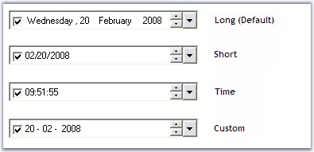{border="0"}

[]{style="COLOR: #15428b"} 

Figure 262: TextField Formats for DateTimePickerAdv

**[]{style="COLOR: #15428b"}** 

Spacing in TextField

**[]{style="COLOR: #15428b"}** 

We can specify spacing for the text field in the control, (ex: between month, year and date) using **Spacing** property. Default value is 0.

[]{style="COLOR: #15428b"} 

+-------------------------------------------------------------------------------------------------------------------------------+
| **[\[C#\]]{style="FONT-FAMILY: 'Courier New'; COLOR: black"}**                                                                |
|                                                                                                                               |
| **[]{style="FONT-FAMILY: 'Courier New'; COLOR: black"}**                                                                      |
|                                                                                                                               |
| [this]{style="FONT-FAMILY: 'Courier New'; COLOR: blue"}[.dateTimePickerAdv1.Spacing = 5;]{style="FONT-FAMILY: 'Courier New'"} |
+-------------------------------------------------------------------------------------------------------------------------------+

[]{style="COLOR: #15428b"} 

+----------------------------------------------------------------------------------------------------------------------------+
| **[\[VB.NET\]]{style="FONT-FAMILY: 'Courier New'; COLOR: black"}**                                                         |
|                                                                                                                            |
| **[]{style="FONT-FAMILY: 'Courier New'; COLOR: black"}**                                                                   |
|                                                                                                                            |
| [Me]{style="FONT-FAMILY: 'Courier New'; COLOR: blue"}[.dateTimePickerAdv1.Spacing = 5]{style="FONT-FAMILY: 'Courier New'"} |
+----------------------------------------------------------------------------------------------------------------------------+

[]{style="COLOR: #15428b"} 

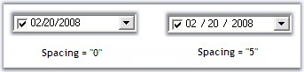{border="0"}

Figure 263: Spacing Applied to TextField

**[]{style="COLOR: #15428b"}** 

::: {style="BORDER-BOTTOM: windowtext 1pt solid; BORDER-LEFT: medium none; PADDING-BOTTOM: 1pt; MARGIN-TOP: 9pt; PADDING-LEFT: 0pt; PADDING-RIGHT: 0pt; MARGIN-BOTTOM: 9pt; BORDER-TOP: windowtext 1pt solid; BORDER-RIGHT: medium none; PADDING-TOP: 1pt"}
{border="0"} Note: The text field can be refreshed programmatically by calling DateTimePickerAdv[.]{style="FONT-FAMILY: 'Courier New'"}RefreshFields() method.
:::

**[]{style="COLOR: #15428b"}** 

See Also

[]{style="COLOR: #15428b"} 

[Navigating between Fields]{.UGHyperlink}[, ]{.UGHyperlink}[UpDown and DropDown Buttons]{.UGHyperlink}[]{.UGHyperlink}

[]{#_Null_Value_Settings}3.3.3.2.3.1.3.1    Null Value Settings

[]{#p309}**[]{style="COLOR: black"}** 

At run time, on clicking the \"None\" button of the popup calendar, \"No date is selected\" string will be displayed in the [text field]{.UGHyperlink} like the below image.

[]{style="COLOR: #15428b"} 

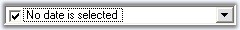{border="0"}

[]{style="COLOR: #15428b"} 

Figure 264: NullValue Selected

[]{style="COLOR: #15428b"} 

This default string can be changed using **NullString** property. Below table describes the properties which controls the Null value behavior.

[]{style="COLOR: #15428b"} 

::: {align="center"}
+-----------------------------------+------------------------------------------------------------------------------------------------------------------------------------------------------------------------------------------------------------------------------------------------------------+
| DateTimePickerAdv Properties      | Description                                                                                                                                                                                                                                                |
+-----------------------------------+------------------------------------------------------------------------------------------------------------------------------------------------------------------------------------------------------------------------------------------------------------+
| EnableNullDate                    | Specifies whether null date support is enabled. If it is set to false, DateTimePickerAdv will always have a selected date instead of null string .i.e,  text field displays the selected date even when *None* button is selected. By default it is true.  |
+-----------------------------------+------------------------------------------------------------------------------------------------------------------------------------------------------------------------------------------------------------------------------------------------------------+
| EnableNullKeys                    | Specifies Backspace or Delete keys makes the date null.  EnableNullDate must be set to true to make this setting effective.                                                                                                                                |
+-----------------------------------+------------------------------------------------------------------------------------------------------------------------------------------------------------------------------------------------------------------------------------------------------------+
| NullString                        | Specifies the text visible when there is no date selected.  EnableNullDate must be set to true to make this setting effective.                                                                                                                             |
+-----------------------------------+------------------------------------------------------------------------------------------------------------------------------------------------------------------------------------------------------------------------------------------------------------+
| NullModeKeyReset                  | Specifies what keys will toggle off null date. i.e, when null value is selected, by pressing the keys we can replace the null value with date selected. The keys are,                                                                                      |
|                                   |                                                                                                                                                                                                                                                            |
|                                   |                                                                                                                                                                                                                                                            |
|                                   |                                                                                                                                                                                                                                                            |
|                                   | *ArrowKeys (default),*                                                                                                                                                                                                                                     |
|                                   |                                                                                                                                                                                                                                                            |
|                                   | *NumericKeys and*                                                                                                                                                                                                                                          |
|                                   |                                                                                                                                                                                                                                                            |
|                                   | *Any.*                                                                                                                                                                                                                                                     |
|                                   |                                                                                                                                                                                                                                                            |
|                                   |                                                                                                                                                                                                                                                            |
|                                   |                                                                                                                                                                                                                                                            |
|                                   | EnableNullDate must be set to true to make this setting effective.                                                                                                                                                                                         |
+-----------------------------------+------------------------------------------------------------------------------------------------------------------------------------------------------------------------------------------------------------------------------------------------------------+
| IsNullDate                        | Set this to true, if you want to display null value (*String specified in NullString*) instead of current value, specified using DateTimePicker.value property.                                                                                            |
|                                   |                                                                                                                                                                                                                                                            |
|                                   | By default it is set to false.                                                                                                                                                                                                                             |
+-----------------------------------+------------------------------------------------------------------------------------------------------------------------------------------------------------------------------------------------------------------------------------------------------------+
:::

[]{style="COLOR: #15428b"} 

+--------------------------------------------------------------------------------------------------------------------------------------------------------------------------------------------------+
| **[\[C#\]]{style="FONT-FAMILY: 'Courier New'; COLOR: black"}**                                                                                                                                   |
|                                                                                                                                                                                                  |
| []{style="COLOR: #15428b"}                                                                                                                                                                       |
|                                                                                                                                                                                                  |
| [this]{style="FONT-FAMILY: 'Courier New'; COLOR: blue"}[.dateTimePickerAdv1.EnableNullDate = [true]{style="COLOR: blue"};]{style="FONT-FAMILY: 'Courier New'"}                                   |
|                                                                                                                                                                                                  |
| [this]{style="FONT-FAMILY: 'Courier New'; COLOR: blue"}[.dateTimePickerAdv1.EnableNullKeys = [true]{style="COLOR: blue"};]{style="FONT-FAMILY: 'Courier New'"}                                   |
|                                                                                                                                                                                                  |
| [this]{style="FONT-FAMILY: 'Courier New'; COLOR: blue"}[.dateTimePickerAdv1.NullString = [\"Null Value\"]{style="COLOR: maroon"}]{style="FONT-FAMILY: 'Courier New'"}                            |
|                                                                                                                                                                                                  |
| [this]{style="FONT-FAMILY: 'Courier New'; COLOR: blue"}[.dateTimePickerAdv1.NullModeKeyReset = Syncfusion.Windows.Forms.Tools.NullModeKeyReset.NumericKeys;]{style="FONT-FAMILY: 'Courier New'"} |
+--------------------------------------------------------------------------------------------------------------------------------------------------------------------------------------------------+

[]{style="COLOR: #15428b"} 

+-----------------------------------------------------------------------------------------------------------------------------------------------------------------------------------------------+
| **[\[VB.NET\]]{style="FONT-FAMILY: 'Courier New'; COLOR: black"}**                                                                                                                            |
|                                                                                                                                                                                               |
| []{style="COLOR: #15428b"}                                                                                                                                                                    |
|                                                                                                                                                                                               |
| [Me]{style="FONT-FAMILY: 'Courier New'; COLOR: blue"}[.dateTimePickerAdv1.EnableNullDate = [True]{style="COLOR: blue"}]{style="FONT-FAMILY: 'Courier New'"}                                   |
|                                                                                                                                                                                               |
| [Me]{style="FONT-FAMILY: 'Courier New'; COLOR: blue"}[.dateTimePickerAdv1.EnableNullKeys = [True]{style="COLOR: blue"}]{style="FONT-FAMILY: 'Courier New'"}                                   |
|                                                                                                                                                                                               |
| [Me]{style="FONT-FAMILY: 'Courier New'; COLOR: blue"}[.dateTimePickerAdv1.NullString = [\"Null Value\"]{style="COLOR: maroon"}]{style="FONT-FAMILY: 'Courier New'"}                           |
|                                                                                                                                                                                               |
| [Me]{style="FONT-FAMILY: 'Courier New'; COLOR: blue"}[.dateTimePickerAdv1.NullModeKeyReset = Syncfusion.Windows.Forms.Tools.NullModeKeyReset.NumericKeys]{style="FONT-FAMILY: 'Courier New'"} |
+-----------------------------------------------------------------------------------------------------------------------------------------------------------------------------------------------+

**[]{style="COLOR: #15428b"}** 

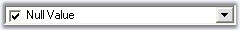{border="0"}

**[]{style="COLOR: #15428b"}** 

Figure 265: Custom NullString for Text Field

###### []{#p310}[]{#_Calendar}3.3.3.2.3.2 Calendar {#calendar style="tab-stops: 0pt"}

[]{style="COLOR: #15428b"} 

DateTimePickerAdv control contains embedded calendar control which pops-up on clicking the dropdown button at the end of the control. The popup calendar is a MonthCalendarAdv control and hence supports all the properties of the MonthCalendarAdv control. These properties of the calendar can be accessed using **DateTimePickerAdv.Calendar.TodayButton** *(for example)* property.

[]{style="COLOR: #15428b"} 

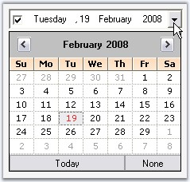{border="0"}

[]{style="COLOR: #15428b"} 

Figure 266: Calendar Popup in a DateTimePickerAdv

**[]{style="COLOR: #15428b"}** 

Additionally, the calendar popup can be customized using the DateTimePickerAdv properties. Refer Customizing the Calendar topic.

[]{style="COLOR: #15428b"} 

Day Names

**[]{style="COLOR: #15428b"}** 

In the calendar, we can specify whether shortest day names can be used or not using **UseShortestDayNames** property. By default it is true.

[]{style="COLOR: #15428b"} 

+----------------------------------------------------------------------------------------------------------------------------------------------------------------------+
| **[\[C#\]]{style="FONT-FAMILY: 'Courier New'; COLOR: black"}**                                                                                                       |
|                                                                                                                                                                      |
| []{style="FONT-FAMILY: 'Courier New'; COLOR: black"}                                                                                                                 |
|                                                                                                                                                                      |
| [this]{style="FONT-FAMILY: 'Courier New'; COLOR: blue"}[.dateTimePickerAdv1.UseShortestDayNames = [false]{style="COLOR: blue"};]{style="FONT-FAMILY: 'Courier New'"} |
+----------------------------------------------------------------------------------------------------------------------------------------------------------------------+

[]{style="COLOR: #15428b"} 

+-------------------------------------------------------------------------------------------------------------------------------------------------------------------+
| **[\[VB.NET\]]{style="FONT-FAMILY: 'Courier New'; COLOR: black"}**                                                                                                |
|                                                                                                                                                                   |
| []{style="COLOR: black"}                                                                                                                                          |
|                                                                                                                                                                   |
| [Me]{style="FONT-FAMILY: 'Courier New'; COLOR: blue"}[.dateTimePickerAdv1.UseShortestDayNames = [False]{style="COLOR: blue"}]{style="FONT-FAMILY: 'Courier New'"} |
+-------------------------------------------------------------------------------------------------------------------------------------------------------------------+

[]{style="COLOR: #15428b"} 

Buttons in Calendar

[]{style="COLOR: #15428b"} 

We can specify the visibility of the None button using **NoneButtonVisible** property. Default value is true.

[]{style="COLOR: #15428b"} 

+--------------------------------------------------------------------------------------------------------------------------------------------------------------------------------------------+
| **[\[C#\]]{style="FONT-FAMILY: 'Courier New'; COLOR: black"}**                                                                                                                             |
|                                                                                                                                                                                            |
| []{style="FONT-FAMILY: 'Courier New'; COLOR: black"}                                                                                                                                       |
|                                                                                                                                                                                            |
| [this]{style="FONT-FAMILY: 'Courier New'; COLOR: blue"}[.dateTimePickerAdv1.[NoneButtonVisible]{style="COLOR: black"} = [false]{style="COLOR: blue"};]{style="FONT-FAMILY: 'Courier New'"} |
+--------------------------------------------------------------------------------------------------------------------------------------------------------------------------------------------+

[]{style="COLOR: #15428b"} 

+-----------------------------------------------------------------------------------------------------------------------------------------------------------------------------------------+
| **[\[VB.NET\]]{style="FONT-FAMILY: 'Courier New'; COLOR: black"}**                                                                                                                      |
|                                                                                                                                                                                         |
| []{style="COLOR: black"}                                                                                                                                                                |
|                                                                                                                                                                                         |
| [Me]{style="FONT-FAMILY: 'Courier New'; COLOR: blue"}[.dateTimePickerAdv1.[NoneButtonVisible]{style="COLOR: black"} = [False]{style="COLOR: blue"}]{style="FONT-FAMILY: 'Courier New'"} |
+-----------------------------------------------------------------------------------------------------------------------------------------------------------------------------------------+

[]{style="COLOR: #15428b"} 

::: {style="BORDER-BOTTOM: windowtext 1pt solid; BORDER-LEFT: medium none; PADDING-BOTTOM: 1pt; MARGIN-TOP: 9pt; PADDING-LEFT: 0pt; PADDING-RIGHT: 0pt; MARGIN-BOTTOM: 9pt; BORDER-TOP: windowtext 1pt solid; BORDER-RIGHT: medium none; PADDING-TOP: 1pt"}
{border="0"} Note:[ ]{style="COLOR: black; FONT-SIZE: 8pt"}None button will not be visible when EnableNullDate property is set to false. See [Null Value Settings]() to know about EnableNullDate property.
:::

[]{style="COLOR: #15428b"} 

[]{#p311}[]{#_Customizing_the_Calendar}3.3.3.2.3.2.1      Customizing the Calendar

[]{style="COLOR: #15428b"} 

DateTimePickerAdv control has properties which can improve the look and feel of the popup calendar. This section discusses various appearance settings available for the calendar.

[]{style="COLOR: #15428b"} 

Background Settings

[]{style="COLOR: #15428b"} 

The background of the Calendar can be customized using below properties.

[]{style="COLOR: #15428b"} 

::: {align="center"}
  ------------------------------- ---------------------------------------------------
  DateTimePickerAdv  Properties   Description
  CalendarMonthBackground         Sets the background color for the popup calendar.
  CalendarTitleBackColor          Sets the background of the calendar header.
  ------------------------------- ---------------------------------------------------
:::

[]{style="COLOR: #15428b"} 

+-------------------------------------------------------------------------------------------------------------------------------------------------------------------------------------------------+
| **[\[C#\]]{style="FONT-FAMILY: 'Courier New'; COLOR: black"}**                                                                                                                                  |
|                                                                                                                                                                                                 |
| []{style="COLOR: black"}                                                                                                                                                                        |
|                                                                                                                                                                                                 |
| [this]{style="FONT-FAMILY: 'Courier New'; COLOR: blue"}[.dateTimePickerAdv1.CalendarMonthBackground = System.Drawing.[Color]{style="COLOR: teal"}.OldLace;]{style="FONT-FAMILY: 'Courier New'"} |
|                                                                                                                                                                                                 |
| [this]{style="FONT-FAMILY: 'Courier New'; COLOR: blue"}[.dateTimePickerAdv1.CalendarTitleBackColor = System.Drawing.[Color]{style="COLOR: teal"}.Wheat;]{style="FONT-FAMILY: 'Courier New'"}    |
+-------------------------------------------------------------------------------------------------------------------------------------------------------------------------------------------------+

[]{style="COLOR: #15428b"} 

+-----------------------------------------------------------------------------------------------------------------------------------------------------------------------------------------------+
| **[\[VB.NET\]]{style="FONT-FAMILY: 'Courier New'; COLOR: black"}**                                                                                                                            |
|                                                                                                                                                                                               |
| []{style="COLOR: black"}                                                                                                                                                                      |
|                                                                                                                                                                                               |
| [Me]{style="FONT-FAMILY: 'Courier New'; COLOR: blue"}[.dateTimePickerAdv1.CalendarMonthBackground = System.Drawing.[Color]{style="COLOR: black"}.OldLace]{style="FONT-FAMILY: 'Courier New'"} |
|                                                                                                                                                                                               |
| [Me]{style="FONT-FAMILY: 'Courier New'; COLOR: blue"}[.dateTimePickerAdv1.CalendarTitleBackColor = System.Drawing.[Color]{style="COLOR: teal"}.Wheat]{style="FONT-FAMILY: 'Courier New'"}     |
+-----------------------------------------------------------------------------------------------------------------------------------------------------------------------------------------------+

**[]{style="COLOR: #15428b"}** 

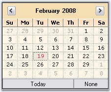{border="0"}

[]{style="COLOR: #15428b"} 

Figure 267: CalendarMonthBackground = \"OldLace\"; CalendarTitleBackColor = \"Wheat\"

**[]{style="COLOR: #15428b"}** 

Foreground Settings

[]{style="COLOR: #15428b"} 

The foreground appearance can be customized using the below properties.

[]{style="COLOR: #15428b"} 

::: {align="center"}
  ------------------------------- ------------------------------------------------------
  DateTimePickerAdv  Properties   Description
  CalendarFont                    Sets font style for the text in the popup calendar.
  CalendarForeColor               Sets the fore color of the popup calendar.
  CalendarTitleForeColor          Specifies the fore color of the calendar header.
  CalendarTrailingForeColor       Specifies the fore color of the inactive month date.
  ------------------------------- ------------------------------------------------------
:::

[]{style="COLOR: #15428b"} 

+--------------------------------------------------------------------------------------------------------------------------------------------------------------------------------------------------------------------------------------------------------------------------------------------------------------------------+
| **[\[C#\]]{style="FONT-FAMILY: 'Courier New'; COLOR: black"}**                                                                                                                                                                                                                                                           |
|                                                                                                                                                                                                                                                                                                                          |
| []{style="COLOR: black"}                                                                                                                                                                                                                                                                                                 |
|                                                                                                                                                                                                                                                                                                                          |
| [this]{style="FONT-FAMILY: 'Courier New'; COLOR: blue"}[.dateTimePickerAdv1.CalendarFont = [new]{style="COLOR: blue"} System.Drawing.[Font]{style="COLOR: teal"}([\"Microsoft Sans Serif\"]{style="COLOR: maroon"}, 8.25F, System.Drawing.[FontStyle]{style="COLOR: teal"}.Italic);]{style="FONT-FAMILY: 'Courier New'"} |
|                                                                                                                                                                                                                                                                                                                          |
| [this]{style="FONT-FAMILY: 'Courier New'; COLOR: blue"}[.dateTimePickerAdv1.CalendarForeColor = System.Drawing.[Color]{style="COLOR: teal"}.SaddleBrown;]{style="FONT-FAMILY: 'Courier New'"}                                                                                                                            |
|                                                                                                                                                                                                                                                                                                                          |
| [this]{style="FONT-FAMILY: 'Courier New'; COLOR: blue"}[.dateTimePickerAdv1.CalendarTitleForeColor = System.Drawing.[Color]{style="COLOR: teal"}.SaddleBrown;]{style="FONT-FAMILY: 'Courier New'"}                                                                                                                       |
|                                                                                                                                                                                                                                                                                                                          |
| [this]{style="FONT-FAMILY: 'Courier New'; COLOR: blue"}[.dateTimePickerAdv1.CalendarTrailingForeColor = System.Drawing.[Color]{style="COLOR: teal"}.Blue;]{style="FONT-FAMILY: 'Courier New'"}                                                                                                                           |
+--------------------------------------------------------------------------------------------------------------------------------------------------------------------------------------------------------------------------------------------------------------------------------------------------------------------------+

[]{style="COLOR: #15428b"} 

+--------------------------------------------------------------------------------------------------------------------------------------------------------------------------------------------------------------------------------------------------------------------------+
| **[\[VB.NET\]]{style="FONT-FAMILY: 'Courier New'; COLOR: black"}**                                                                                                                                                                                                       |
|                                                                                                                                                                                                                                                                          |
| []{style="COLOR: black"}                                                                                                                                                                                                                                                 |
|                                                                                                                                                                                                                                                                          |
| [Me]{style="FONT-FAMILY: 'Courier New'; COLOR: blue"}[.dateTimePickerAdv1.CalendarFont = [New]{style="COLOR: blue"} System.Drawing.Font([\"Microsoft Sans Serif\"]{style="COLOR: maroon"}, 8.25F, System.Drawing.FontStyle.Italic) ]{style="FONT-FAMILY: 'Courier New'"} |
|                                                                                                                                                                                                                                                                          |
| [Me]{style="FONT-FAMILY: 'Courier New'; COLOR: blue"}[.dateTimePickerAdv1.CalendarForeColor = System.Drawing.Color.SaddleBrown ]{style="FONT-FAMILY: 'Courier New'"}                                                                                                     |
|                                                                                                                                                                                                                                                                          |
| [Me]{style="FONT-FAMILY: 'Courier New'; COLOR: blue"}[.dateTimePickerAdv1.CalendarTitleForeColor = System.Drawing.Color.SaddleBrown ]{style="FONT-FAMILY: 'Courier New'"}                                                                                                |
|                                                                                                                                                                                                                                                                          |
| [Me]{style="FONT-FAMILY: 'Courier New'; COLOR: blue"}[.dateTimePickerAdv1.CalendarTrailingForeColor = System.Drawing.Color.Blue]{style="FONT-FAMILY: 'Courier New'"}                                                                                                     |
+--------------------------------------------------------------------------------------------------------------------------------------------------------------------------------------------------------------------------------------------------------------------------+

**[]{style="COLOR: #15428b"}** 

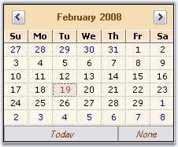{border="0"}

**[]{style="COLOR: #15428b"}** 

Figure 268: TitleForeColor = \"SaddleBrown\"; CalendarForeColor = \"SaddleBrown\";

CalendarFont = \"Italic\"; TrailingForeColor = \"Blue\"

**[]{style="COLOR: #15428b"}** 

Calendar Size

[]{style="COLOR: #15428b"} 

The default size of the popup calendar can be changed using the below properties.

[]{style="COLOR: #15428b"} 

::: {align="center"}
  ------------------------------- ------------------------------------------------------------------------------------
  DateTimePickerAdv  Properties   Description
  CalendarSize                    Indicates size of the popup calendar.
  CalendarSizeToFit               Indicates whether the calendar will size to fit according to the size of the days.
  ------------------------------- ------------------------------------------------------------------------------------
:::

**[]{style="COLOR: #15428b"}** 

+------------------------------------------------------------------------------------------------------------------------------------------------------------------------------------------------------------------+
| **[\[C#\]]{style="FONT-FAMILY: 'Courier New'; COLOR: black"}**                                                                                                                                                   |
|                                                                                                                                                                                                                  |
| []{style="COLOR: black"}                                                                                                                                                                                         |
|                                                                                                                                                                                                                  |
| [this]{style="FONT-FAMILY: 'Courier New'; COLOR: blue"}[.dateTimePickerAdv1.CalendarSize = [new]{style="COLOR: blue"} System.Drawing.[Size]{style="COLOR: teal"}(250, 200);]{style="FONT-FAMILY: 'Courier New'"} |
|                                                                                                                                                                                                                  |
| [this]{style="FONT-FAMILY: 'Courier New'; COLOR: blue"}[.dateTimePickerAdv1.CalendarSizeToFit = [false]{style="COLOR: blue"};]{style="FONT-FAMILY: 'Courier New'"}                                               |
+------------------------------------------------------------------------------------------------------------------------------------------------------------------------------------------------------------------+

[]{style="COLOR: #15428b"} 

+----------------------------------------------------------------------------------------------------------------------------------------------------------------------------------------------------------------+
| **[\[VB.NET\]]{style="FONT-FAMILY: 'Courier New'; COLOR: black"}**                                                                                                                                             |
|                                                                                                                                                                                                                |
| []{style="COLOR: black"}                                                                                                                                                                                       |
|                                                                                                                                                                                                                |
| [Me]{style="FONT-FAMILY: 'Courier New'; COLOR: blue"}[.dateTimePickerAdv1.CalendarSize = [New]{style="COLOR: blue"} System.Drawing.[Size]{style="COLOR: black"}(250, 200)]{style="FONT-FAMILY: 'Courier New'"} |
|                                                                                                                                                                                                                |
| [Me]{style="FONT-FAMILY: 'Courier New'; COLOR: blue"}[.dateTimePickerAdv1.CalendarSizeToFit = [False]{style="COLOR: blue"}]{style="FONT-FAMILY: 'Courier New'"}                                                |
+----------------------------------------------------------------------------------------------------------------------------------------------------------------------------------------------------------------+

**[]{style="COLOR: #15428b"}** 

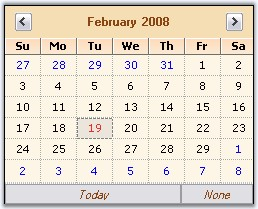{border="0"}

[]{style="COLOR: #15428b"} 

Figure 269: Size set for the Popup Calendar

**[]{style="COLOR: #15428b"}** 

See Also

[]{style="COLOR: #15428b"} 

[Calendar Value]{.UGHyperlink}[]{.UGHyperlink}

[]{#p312}[]{#_Calendar_Value}3.3.3.2.3.2.2      Calendar Value

[]{style="COLOR: #15428b"} 

In the Popup calendar, today\'s date will be selected by default, at run time. This default date can be changed using **Value** property. You can also specify the range of values / dates that can be selected at run time.

[]{style="COLOR: #15428b"} 

  ------------------------------ ----------------------------------------------------------------------------
  DateTimePickerAdv Properties   Description
  MaxValue                       Specifies the maximum value that can be picked from the DateTimePickerAdv.
  MinValue                       Specifies the minimum value that can be picked from the DateTimePickerAdv.
  ------------------------------ ----------------------------------------------------------------------------

[]{style="COLOR: #15428b"} 

+-------------------------------------------------------------------------------------------------------------------------------------------------------------------------------------------------------------------------+
| **[\[C#\]]{style="FONT-FAMILY: 'Courier New'; COLOR: black"}**                                                                                                                                                          |
|                                                                                                                                                                                                                         |
| []{style="COLOR: #15428b"}                                                                                                                                                                                              |
|                                                                                                                                                                                                                         |
| [this]{style="FONT-FAMILY: 'Courier New'; COLOR: blue"}[.dateTimePickerAdv1.Value = [new]{style="COLOR: blue"} System.[DateTime]{style="COLOR: teal"}(2008, 2, 23, 16, 15, 46, 0);]{style="FONT-FAMILY: 'Courier New'"} |
|                                                                                                                                                                                                                         |
| [this]{style="FONT-FAMILY: 'Courier New'; COLOR: blue"}[.dateTimePickerAdv1.MaxValue = [new]{style="COLOR: blue"} System.DateTime(2008, 12, 31, 23, 59, 0, 0);]{style="FONT-FAMILY: 'Courier New'"}                     |
|                                                                                                                                                                                                                         |
| [this]{style="FONT-FAMILY: 'Courier New'; COLOR: blue"}[.dateTimePickerAdv1.MinValue = [new]{style="COLOR: blue"} System.DateTime(2007, 1, 1, 0, 0, 0, 0);]{style="FONT-FAMILY: 'Courier New'"}                         |
+-------------------------------------------------------------------------------------------------------------------------------------------------------------------------------------------------------------------------+

[]{style="COLOR: #15428b"} 

+----------------------------------------------------------------------------------------------------------------------------------------------------------------------------------------------------------------------+
| **[\[VB.NET\]]{style="FONT-FAMILY: 'Courier New'; COLOR: black"}**                                                                                                                                                   |
|                                                                                                                                                                                                                      |
| []{style="COLOR: #15428b"}                                                                                                                                                                                           |
|                                                                                                                                                                                                                      |
| [Me]{style="FONT-FAMILY: 'Courier New'; COLOR: blue"}[.dateTimePickerAdv1.Value = [New]{style="COLOR: blue"} System.[DateTime]{style="COLOR: teal"}(2008, 2, 23, 16, 15, 46, 0)]{style="FONT-FAMILY: 'Courier New'"} |
|                                                                                                                                                                                                                      |
| [Me]{style="FONT-FAMILY: 'Courier New'; COLOR: blue"}[.dateTimePickerAdv1.MaxValue = [New]{style="COLOR: blue"} System.DateTime(2008, 12, 31, 23, 59, 0, 0)]{style="FONT-FAMILY: 'Courier New'"}                     |
|                                                                                                                                                                                                                      |
| [Me]{style="FONT-FAMILY: 'Courier New'; COLOR: blue"}[.dateTimePickerAdv1.MinValue = [New]{style="COLOR: blue"} System.DateTime(2007, 1, 1, 0, 0, 0, 0)]{style="FONT-FAMILY: 'Courier New'"}                         |
+----------------------------------------------------------------------------------------------------------------------------------------------------------------------------------------------------------------------+

[]{style="COLOR: #15428b"} 

See Also

[]{style="COLOR: #15428b"} 

[Customizing the Calendar]{.UGHyperlink}[]{.UGHyperlink}

###### []{#_DesignTime_Features_1}3.3.3.2.3.3 DesignTime Features[]{#p313} {#designtime-features style="tab-stops: 0pt"}

In the designer, DateTimePickerAdv control has shortcut for some property settings in its Task Window. Task Window is opened through the control\'s smart tag option.

[]{style="COLOR: #15428b"} 

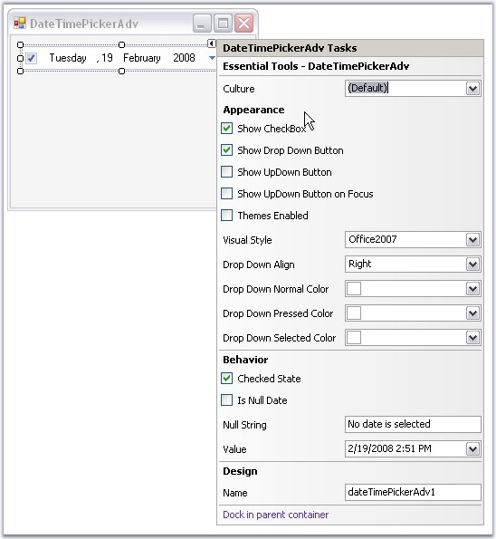{border="0"}

*[]{style="COLOR: #15428b"}* 

Figure 270: Tasks Window of DateTimePickerAdv Control

 

###### []{#p314}[]{#_DateTimePickerAdv_Appearance}3.3.3.2.3.4 DateTimePickerAdv Appearance {#datetimepickeradv-appearance style="tab-stops: 0pt"}

[]{style="COLOR: #15428b"} 

This below topics discusses the background and border settings for the DateTimePickerAdv control.

**[]{style="COLOR: #15428b"}** 

[]{#p315}3.3.3.2.3.4.1      Background Settings

[]{style="COLOR: #15428b"} 

DateTimePickerAdv control can have custom back color and background images using the properties discussed in this section.

[]{style="COLOR: #15428b"} 

Background Color

[]{style="COLOR: #15428b"} 

The control\'s back color can be set using the below properties.

[]{style="COLOR: #15428b"} 

::: {align="center"}
  ------------------------------- ------------------------------------------------------------------------------------------------------------------------------------------
  DateTimePickerAdv  Properties   Description
  BackColor                       Sets the back color for the DateTimePickerAdv control.
  BackgroundColor                 Sets Solid, Gradient or Pattern style of background for the control. This property setting will override the BackColor property setting.
  ------------------------------- ------------------------------------------------------------------------------------------------------------------------------------------
:::

[]{style="COLOR: #15428b"} 

+------------------------------------------------------------------------------------------------------------------------------------------------------------------------------------------------------------------------------------------------------------------------------------------------------------------------------------------------------------------------------------------------+
| **[\[C#\]]{style="FONT-FAMILY: 'Courier New'; COLOR: black"}**                                                                                                                                                                                                                                                                                                                                 |
|                                                                                                                                                                                                                                                                                                                                                                                                |
| []{style="COLOR: black"}                                                                                                                                                                                                                                                                                                                                                                       |
|                                                                                                                                                                                                                                                                                                                                                                                                |
| [this]{style="FONT-FAMILY: 'Courier New'; COLOR: blue"}[.dateTimePickerAdv1.BackColor = System.Drawing.[Color]{style="COLOR: teal"}.Cornsilk;]{style="FONT-FAMILY: 'Courier New'"}                                                                                                                                                                                                             |
|                                                                                                                                                                                                                                                                                                                                                                                                |
| [this]{style="FONT-FAMILY: 'Courier New'; COLOR: blue"}[.dateTimePickerAdv1.BackgroundColor = [new]{style="COLOR: blue"} Syncfusion.Drawing.[BrushInfo]{style="COLOR: teal"}(Syncfusion.Drawing.[GradientStyle]{style="COLOR: teal"}.Vertical, System.Drawing.[Color]{style="COLOR: teal"}.Linen, System.Drawing.[Color]{style="COLOR: teal"}.BurlyWood);]{style="FONT-FAMILY: 'Courier New'"} |
+------------------------------------------------------------------------------------------------------------------------------------------------------------------------------------------------------------------------------------------------------------------------------------------------------------------------------------------------------------------------------------------------+

[]{style="COLOR: #15428b"} 

+--------------------------------------------------------------------------------------------------------------------------------------------------------------------------------------------------------------------------------------------------------------------------------------------------+
| **[\[VB.NET\]]{style="FONT-FAMILY: 'Courier New'; COLOR: black"}**                                                                                                                                                                                                                               |
|                                                                                                                                                                                                                                                                                                  |
| []{style="COLOR: black"}                                                                                                                                                                                                                                                                         |
|                                                                                                                                                                                                                                                                                                  |
| [Me]{style="FONT-FAMILY: 'Courier New'; COLOR: blue"}[.dateTimePickerAdv1.BackColor = System.Drawing.Color.Cornsilk ]{style="FONT-FAMILY: 'Courier New'"}                                                                                                                                        |
|                                                                                                                                                                                                                                                                                                  |
| [Me]{style="FONT-FAMILY: 'Courier New'; COLOR: blue"}[.dateTimePickerAdv1.BackgroundColor = [New]{style="COLOR: blue"} Syncfusion.Drawing.BrushInfo(Syncfusion.Drawing.GradientStyle.Vertical, System.Drawing.Color.Linen, System.Drawing.Color.BurlyWood) ]{style="FONT-FAMILY: 'Courier New'"} |
+--------------------------------------------------------------------------------------------------------------------------------------------------------------------------------------------------------------------------------------------------------------------------------------------------+

**[]{style="COLOR: #15428b"}** 

{border="0"}

**[]{style="COLOR: #15428b"}** 

Figure 271: Gradient Background for DateTimePicker

**[]{style="COLOR: #15428b"}** 

Background Image

[]{style="COLOR: #15428b"} 

Background image for the DateTimePickerAdv is set using the below property.

[]{style="COLOR: #15428b"} 

::: {align="center"}
  ------------------------------- ---------------------------------------------------
  DateTimePickerAdv  Properties   Description
  BackgroundImage                 Sets the background image for the control.
  BackgroundImageLayout           Sets the background image layout for the control.
  ------------------------------- ---------------------------------------------------
:::

[]{style="COLOR: #15428b"} 

+---------------------------------------------------------------------------------------------------------------------------------------------------------------------------------------------------------------------------------------------------------------------------+
| **[\[C#\]]{style="FONT-FAMILY: 'Courier New'; COLOR: black"}**                                                                                                                                                                                                            |
|                                                                                                                                                                                                                                                                           |
| []{style="COLOR: black"}                                                                                                                                                                                                                                                  |
|                                                                                                                                                                                                                                                                           |
| [this]{style="FONT-FAMILY: 'Courier New'; COLOR: blue"}[.dateTimePickerAdv2.BackgroundImage = ((System.Drawing.[Image]{style="COLOR: teal"})(resources.GetObject([\"dateTimePickerAdv2.BackgroundImage\"]{style="COLOR: maroon"})));]{style="FONT-FAMILY: 'Courier New'"} |
+---------------------------------------------------------------------------------------------------------------------------------------------------------------------------------------------------------------------------------------------------------------------------+

[]{style="COLOR: #15428b"} 

+-----------------------------------------------------------------------------------------------------------------------------------------------------------------------------------------------------------------------------------------------------------------------------------+
| **[\[VB.NET\]]{style="FONT-FAMILY: 'Courier New'; COLOR: black"}**                                                                                                                                                                                                                |
|                                                                                                                                                                                                                                                                                   |
| []{style="COLOR: #15428b"}                                                                                                                                                                                                                                                        |
|                                                                                                                                                                                                                                                                                   |
| [Me]{style="FONT-FAMILY: 'Courier New'; COLOR: blue"}[.dateTimePickerAdv2.BackgroundImage = [DirectCast]{style="COLOR: blue"}((resources.GetObject([\"dateTimePickerAdv2.BackgroundImage\"]{style="COLOR: maroon"})), System.Drawing.Image) ]{style="FONT-FAMILY: 'Courier New'"} |
+-----------------------------------------------------------------------------------------------------------------------------------------------------------------------------------------------------------------------------------------------------------------------------------+

**[]{style="COLOR: #15428b"}** 

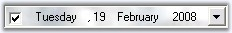{border="0"}

**[]{style="COLOR: #15428b"}** 

Figure 272: Background Image for DateTimePickerAdv

**[]{style="COLOR: #15428b"}** 

See Also

**[]{style="COLOR: #15428b"}** 

[Border Styles]{.UGHyperlink}[]{.UGHyperlink}

[]{#p316}3.3.3.2.3.4.2      Border Styles

[]{style="COLOR: #15428b"} 

The wide variety of border options are available for DateTimePickerAdv control when they are in 2D or in 3D mode. The properties in the below table illustrates the border settings.

[]{style="COLOR: #15428b"} 

::: {align="center"}
+-----------------------------------+-------------------------------------------------------------------------------------------------------------+
| DateTimePickerAdv Properties      | Description                                                                                                 |
+-----------------------------------+-------------------------------------------------------------------------------------------------------------+
| BorderStyle                       | Specifies whether the DateTimePickerAdv should have a border and if it is 2D or 3D border. The options are, |
|                                   |                                                                                                             |
|                                   |                                                                                                             |
|                                   |                                                                                                             |
|                                   | [·      ]{style="FONT-FAMILY: Symbol"}*None*                                                                |
|                                   |                                                                                                             |
|                                   | [·      ]{style="FONT-FAMILY: Symbol"}*FixedSingle*                                                         |
|                                   |                                                                                                             |
|                                   | [·      ]{style="FONT-FAMILY: Symbol"}*Fixed3D(Default)*                                                    |
+-----------------------------------+-------------------------------------------------------------------------------------------------------------+
| Border3DStyle                     | Specifies the 3D border style of the DateTimePickerAdv.                                                     |
|                                   |                                                                                                             |
|                                   | The options are,                                                                                            |
|                                   |                                                                                                             |
|                                   |                                                                                                             |
|                                   |                                                                                                             |
|                                   | [·      ]{style="FONT-FAMILY: Symbol"}*Raised*                                                              |
|                                   |                                                                                                             |
|                                   | [·      ]{style="FONT-FAMILY: Symbol"}*RaisedOuter*                                                         |
|                                   |                                                                                                             |
|                                   | [·      ]{style="FONT-FAMILY: Symbol"}*RaisedInner*                                                         |
|                                   |                                                                                                             |
|                                   | [·      ]{style="FONT-FAMILY: Symbol"}*Sunken(Default)*                                                     |
|                                   |                                                                                                             |
|                                   | [·      ]{style="FONT-FAMILY: Symbol"}*SunkenOuter*                                                         |
|                                   |                                                                                                             |
|                                   | [·      ]{style="FONT-FAMILY: Symbol"}*SunkenInner*                                                         |
|                                   |                                                                                                             |
|                                   | [·      ]{style="FONT-FAMILY: Symbol"}*Etched*                                                              |
|                                   |                                                                                                             |
|                                   | [·      ]{style="FONT-FAMILY: Symbol"}*Bump*                                                                |
|                                   |                                                                                                             |
|                                   | [·      ]{style="FONT-FAMILY: Symbol"}*Adjust*                                                              |
|                                   |                                                                                                             |
|                                   | [·      ]{style="FONT-FAMILY: Symbol"}*Flat*                                                                |
+-----------------------------------+-------------------------------------------------------------------------------------------------------------+
| BorderSingle                      | Specifies the 2D border style of the DateTimePickerAdv. The options are,                                    |
|                                   |                                                                                                             |
|                                   |                                                                                                             |
|                                   |                                                                                                             |
|                                   | [·      ]{style="FONT-FAMILY: Symbol"}*None*                                                                |
|                                   |                                                                                                             |
|                                   | [·      ]{style="FONT-FAMILY: Symbol"}*Dotted*                                                              |
|                                   |                                                                                                             |
|                                   | [·      ]{style="FONT-FAMILY: Symbol"}*Dashed*                                                              |
|                                   |                                                                                                             |
|                                   | [·      ]{style="FONT-FAMILY: Symbol"}*Solid (default)*                                                     |
|                                   |                                                                                                             |
|                                   | [·      ]{style="FONT-FAMILY: Symbol"}*Inset*                                                               |
|                                   |                                                                                                             |
|                                   | [·      ]{style="FONT-FAMILY: Symbol"}*Outset*                                                              |
+-----------------------------------+-------------------------------------------------------------------------------------------------------------+
| BorderSides                       | Specifies the sides of the control which should have a border. The sides are,                               |
|                                   |                                                                                                             |
|                                   |                                                                                                             |
|                                   |                                                                                                             |
|                                   | [·      ]{style="FONT-FAMILY: Symbol"}*Left*                                                                |
|                                   |                                                                                                             |
|                                   | [·      ]{style="FONT-FAMILY: Symbol"}*Top*                                                                 |
|                                   |                                                                                                             |
|                                   | [·      ]{style="FONT-FAMILY: Symbol"}*Right*                                                               |
|                                   |                                                                                                             |
|                                   | [·      ]{style="FONT-FAMILY: Symbol"}*Bottom*                                                              |
|                                   |                                                                                                             |
|                                   | [·      ]{style="FONT-FAMILY: Symbol"}*Middle*                                                              |
|                                   |                                                                                                             |
|                                   | [·      ]{style="FONT-FAMILY: Symbol"}*All (Default)*                                                       |
+-----------------------------------+-------------------------------------------------------------------------------------------------------------+
| BorderColor                       | Specifies the color of the 2D border when BorderStyle is set FixedSingle.                                   |
+-----------------------------------+-------------------------------------------------------------------------------------------------------------+
:::

[]{style="COLOR: #15428b"} 

+---------------------------------------------------------------------------------------------------------------------------------------------------------------------------------------------------------+
| **[\[C#\]]{style="FONT-FAMILY: 'Courier New'; COLOR: black"}**                                                                                                                                          |
|                                                                                                                                                                                                         |
| []{style="COLOR: black"}                                                                                                                                                                                |
|                                                                                                                                                                                                         |
| [//Sets 2D border]{style="FONT-FAMILY: 'Courier New'; COLOR: green"}                                                                                                                                    |
|                                                                                                                                                                                                         |
| [this]{style="FONT-FAMILY: 'Courier New'; COLOR: blue"}[.dateTimePickerAdv1.BorderStyle = System.Windows.Forms.[BorderStyle]{style="COLOR: teal"}.FixedSingle;]{style="FONT-FAMILY: 'Courier New'"}     |
|                                                                                                                                                                                                         |
| [//Sets 2D border style]{style="FONT-FAMILY: 'Courier New'; COLOR: green"}                                                                                                                              |
|                                                                                                                                                                                                         |
| [this]{style="FONT-FAMILY: 'Courier New'; COLOR: blue"}[.dateTimePickerAdv1.BorderSingle = System.Windows.Forms.[ButtonBorderStyle]{style="COLOR: teal"}.Dashed;]{style="FONT-FAMILY: 'Courier New'"}   |
|                                                                                                                                                                                                         |
| [//Sets border for all the side of the control]{style="FONT-FAMILY: 'Courier New'; COLOR: green"}                                                                                                       |
|                                                                                                                                                                                                         |
| [this]{style="FONT-FAMILY: 'Courier New'; COLOR: blue"}[.dateTimePickerAdv1.BorderSides = System.Windows.Forms.[Border3DSide]{style="COLOR: teal"}.All;]{style="FONT-FAMILY: 'Courier New'"}            |
|                                                                                                                                                                                                         |
| [//Sets color for the 2D border]{style="FONT-FAMILY: 'Courier New'; COLOR: green"}                                                                                                                      |
|                                                                                                                                                                                                         |
| [this]{style="FONT-FAMILY: 'Courier New'; COLOR: blue"}[.dateTimePickerAdv1.BorderColor = System.Drawing.[Color]{style="COLOR: teal"}.SteelBlue;]{style="FONT-FAMILY: 'Courier New'"}                   |
|                                                                                                                                                                                                         |
| []{style="FONT-FAMILY: 'Courier New'"}                                                                                                                                                                  |
|                                                                                                                                                                                                         |
| [//Sets 3D border]{style="FONT-FAMILY: 'Courier New'; COLOR: green"}                                                                                                                                    |
|                                                                                                                                                                                                         |
| [this]{style="FONT-FAMILY: 'Courier New'; COLOR: blue"}[.dateTimePickerAdv1.BorderStyle = System.Windows.Forms.[BorderStyle]{style="COLOR: teal"}.Fixed3D;]{style="FONT-FAMILY: 'Courier New'"}         |
|                                                                                                                                                                                                         |
| [//Sets SunkenInner 3D border style]{style="FONT-FAMILY: 'Courier New'; COLOR: green"}                                                                                                                  |
|                                                                                                                                                                                                         |
| [this]{style="FONT-FAMILY: 'Courier New'; COLOR: blue"}[.dateTimePickerAdv1.Border3DStyle = System.Windows.Forms.[Border3DStyle]{style="COLOR: teal"}.SunkenInner;]{style="FONT-FAMILY: 'Courier New'"} |
+---------------------------------------------------------------------------------------------------------------------------------------------------------------------------------------------------------+

[]{style="COLOR: #15428b"} 

+--------------------------------------------------------------------------------------------------------------------------------------------------------------------------------+
| **[\[VB.NET\]]{style="FONT-FAMILY: 'Courier New'; COLOR: black"}**                                                                                                             |
|                                                                                                                                                                                |
| []{style="COLOR: #15428b"}                                                                                                                                                     |
|                                                                                                                                                                                |
| [\'Sets 2D border ]{style="FONT-FAMILY: 'Courier New'; COLOR: green"}                                                                                                          |
|                                                                                                                                                                                |
| [Me]{style="FONT-FAMILY: 'Courier New'; COLOR: blue"}[.dateTimePickerAdv1.BorderStyle = System.Windows.Forms.BorderStyle.FixedSingle ]{style="FONT-FAMILY: 'Courier New'"}     |
|                                                                                                                                                                                |
| [\'Sets 2D border style ]{style="FONT-FAMILY: 'Courier New'; COLOR: green"}                                                                                                    |
|                                                                                                                                                                                |
| [Me]{style="FONT-FAMILY: 'Courier New'; COLOR: blue"}[.dateTimePickerAdv1.BorderSingle = System.Windows.Forms.ButtonBorderStyle.Dashed ]{style="FONT-FAMILY: 'Courier New'"}   |
|                                                                                                                                                                                |
| [\'Sets border for all the side of the control ]{style="FONT-FAMILY: 'Courier New'; COLOR: green"}                                                                             |
|                                                                                                                                                                                |
| [Me]{style="FONT-FAMILY: 'Courier New'; COLOR: blue"}[.dateTimePickerAdv1.BorderSides = System.Windows.Forms.Border3DSide.All ]{style="FONT-FAMILY: 'Courier New'"}            |
|                                                                                                                                                                                |
| [\'Sets color for the 2D border ]{style="FONT-FAMILY: 'Courier New'; COLOR: green"}                                                                                            |
|                                                                                                                                                                                |
| [Me]{style="FONT-FAMILY: 'Courier New'; COLOR: blue"}[.dateTimePickerAdv1.BorderColor = System.Drawing.Color.SteelBlue ]{style="FONT-FAMILY: 'Courier New'"}                   |
|                                                                                                                                                                                |
| []{style="FONT-FAMILY: 'Courier New'"}                                                                                                                                         |
|                                                                                                                                                                                |
| [\'Sets 3D border ]{style="FONT-FAMILY: 'Courier New'; COLOR: green"}                                                                                                          |
|                                                                                                                                                                                |
| [Me]{style="FONT-FAMILY: 'Courier New'; COLOR: blue"}[.dateTimePickerAdv1.BorderStyle = System.Windows.Forms.BorderStyle.Fixed3D ]{style="FONT-FAMILY: 'Courier New'"}         |
|                                                                                                                                                                                |
| [\'Sets SunkenInner 3D border style ]{style="FONT-FAMILY: 'Courier New'; COLOR: green"}                                                                                        |
|                                                                                                                                                                                |
| [Me]{style="FONT-FAMILY: 'Courier New'; COLOR: blue"}[.dateTimePickerAdv1.Border3DStyle = System.Windows.Forms.Border3DStyle.SunkenInner ]{style="FONT-FAMILY: 'Courier New'"} |
+--------------------------------------------------------------------------------------------------------------------------------------------------------------------------------+

[]{style="COLOR: #15428b"} 

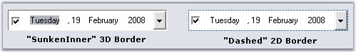{border="0"}

[]{style="COLOR: #15428b"} 

Figure 273: Border Style for DateTimePickerAdv

**[]{style="COLOR: #15428b"}** 

See Also

[]{style="COLOR: #15428b"} 

[Background Settings]{.UGHyperlink}[]{.UGHyperlink}

###### []{#p317}3.3.3.2.3.5 Runtime Features {#runtime-features style="tab-stops: 0pt"}

[]{style="COLOR: #15428b"} 

This section covers the below topics:

[]{style="COLOR: #15428b"} 

[]{#p318}[]{#_Month_Images}3.3.3.2.3.5.1      Month Images

[]{style="COLOR: #15428b"} 

We can set images for the popup menu of the Calendar using **MonthImageList** property of DateTimePickerAdv control.

[]{style="COLOR: #15428b"} 

+-------------------------------------------------------------------------------------------------------------------------------------------------------------------------------------------------------------------------------------------------------------------------+
| **[\[C#\]]{style="FONT-FAMILY: 'Courier New'; COLOR: black"}**                                                                                                                                                                                                          |
|                                                                                                                                                                                                                                                                         |
| **[]{style="FONT-FAMILY: 'Courier New'; COLOR: black"}**                                                                                                                                                                                                                |
|                                                                                                                                                                                                                                                                         |
| [// imageList1]{style="FONT-FAMILY: 'Courier New'; COLOR: green"}                                                                                                                                                                                                       |
|                                                                                                                                                                                                                                                                         |
| [this]{style="FONT-FAMILY: 'Courier New'; COLOR: blue"}[.imageList1.ImageSize = [new]{style="COLOR: blue"} System.Drawing.Size(16, 16);]{style="FONT-FAMILY: 'Courier New'"}                                                                                            |
|                                                                                                                                                                                                                                                                         |
| [this]{style="FONT-FAMILY: 'Courier New'; COLOR: blue"}[.imageList1.ImageStream = ((System.Windows.Forms.ImageListStreamer)(resources.GetObject(\"imageList1.ImageStream\")));]{style="FONT-FAMILY: 'Courier New'"}                                                     |
|                                                                                                                                                                                                                                                                         |
| []{style="FONT-FAMILY: 'Courier New'; COLOR: green"}                                                                                                                                                                                                                    |
|                                                                                                                                                                                                                                                                         |
| [// ImageList of the PopupMenu of the Popup Calendar]{style="FONT-FAMILY: 'Courier New'; COLOR: green"}                                                                                                                                                                 |
|                                                                                                                                                                                                                                                                         |
| [this]{style="FONT-FAMILY: 'Courier New'; COLOR: blue"}[.dateTimePickerAdv1.MonthImageList = ]{style="FONT-FAMILY: 'Courier New'; COLOR: black"}[this]{style="FONT-FAMILY: 'Courier New'; COLOR: blue"}[.imageList1;]{style="FONT-FAMILY: 'Courier New'; COLOR: black"} |
+-------------------------------------------------------------------------------------------------------------------------------------------------------------------------------------------------------------------------------------------------------------------------+

[]{style="COLOR: #15428b"} 

+-------------------------------------------------------------------------------------------------------------------------------------------------------------------------------------------------------------------------------------------------------------------------------------------------------------------------------------------+
| **[\[VB.NET\]]{style="FONT-FAMILY: 'Courier New'; COLOR: black"}**                                                                                                                                                                                                                                                                        |
|                                                                                                                                                                                                                                                                                                                                           |
| []{style="FONT-FAMILY: 'Courier New'; COLOR: green"}                                                                                                                                                                                                                                                                                      |
|                                                                                                                                                                                                                                                                                                                                           |
| [\' imageList1]{style="FONT-FAMILY: 'Courier New'; COLOR: green"}                                                                                                                                                                                                                                                                         |
|                                                                                                                                                                                                                                                                                                                                           |
| [Me]{style="FONT-FAMILY: 'Courier New'; COLOR: blue"}[.imageList1.ImageSize = ]{style="FONT-FAMILY: 'Courier New'; COLOR: black"}[New]{style="FONT-FAMILY: 'Courier New'; COLOR: blue"}[ System.Drawing.Size(16, 16)]{style="FONT-FAMILY: 'Courier New'; COLOR: black"}                                                                   |
|                                                                                                                                                                                                                                                                                                                                           |
| [Me]{style="FONT-FAMILY: 'Courier New'; COLOR: blue"}[.imageList1.ImageStream= (]{style="FONT-FAMILY: 'Courier New'; COLOR: black"}[CType]{style="FONT-FAMILY: 'Courier New'; COLOR: blue"}[(resources.GetObject(\"imageList1.ImageStream\"), System.Windows.Forms.ImageListStreamer))]{style="FONT-FAMILY: 'Courier New'; COLOR: black"} |
|                                                                                                                                                                                                                                                                                                                                           |
| []{style="FONT-FAMILY: 'Courier New'; COLOR: black"}                                                                                                                                                                                                                                                                                      |
|                                                                                                                                                                                                                                                                                                                                           |
| [\' ImageList of the PopupMenu of the Popup Calendar]{style="FONT-FAMILY: 'Courier New'; COLOR: green"}                                                                                                                                                                                                                                   |
|                                                                                                                                                                                                                                                                                                                                           |
| [Me]{style="FONT-FAMILY: 'Courier New'; COLOR: blue"}[.dateTimePickerAdv1.MonthImageList = ]{style="FONT-FAMILY: 'Courier New'; COLOR: black"}[Me]{style="FONT-FAMILY: 'Courier New'; COLOR: blue"}[.imageList1]{style="FONT-FAMILY: 'Courier New'; COLOR: black"}                                                                        |
+-------------------------------------------------------------------------------------------------------------------------------------------------------------------------------------------------------------------------------------------------------------------------------------------------------------------------------------------+

[]{style="COLOR: #15428b"} 

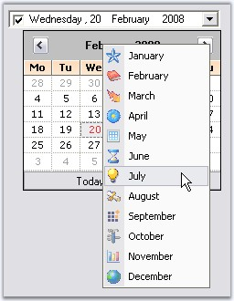{border="0"}

[]{style="COLOR: #15428b"} 

Figure 274: Images for the Popup Menu

[]{#p319}3.3.3.2.3.5.2      Context Menu

[]{style="COLOR: #15428b"} 

When you right-click on a DateTimePickerAdv control at run time, a context menu will be displayed like the below image.

[]{style="COLOR: #15428b"} 

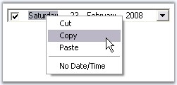{border="0"}

[]{style="COLOR: #15428b"} 

Figure 275: Default Context Menu

[]{style="COLOR: #15428b"} 

This default context menu can be replaced with Syncfusion XP Menu by setting UseEnhancedMenu property to true. By default it is set to false.

[]{style="COLOR: #15428b"} 

+---------------------------------------------------------------------------------------------------------------------------------------------------------------------------------------------------------------------------------------------------------------+
| **[\[C#\]]{style="FONT-FAMILY: 'Courier New'; COLOR: black"}**                                                                                                                                                                                                |
|                                                                                                                                                                                                                                                               |
| **[]{style="FONT-FAMILY: 'Courier New'; COLOR: black"}**                                                                                                                                                                                                      |
|                                                                                                                                                                                                                                                               |
| [this]{style="FONT-FAMILY: 'Courier New'; COLOR: blue"}[.dateTimePickerAdv1.UseEnhancedMenu = ]{style="FONT-FAMILY: 'Courier New'; COLOR: black"}[true]{style="FONT-FAMILY: 'Courier New'; COLOR: blue"}[;]{style="FONT-FAMILY: 'Courier New'; COLOR: black"} |
+---------------------------------------------------------------------------------------------------------------------------------------------------------------------------------------------------------------------------------------------------------------+

[]{style="COLOR: #15428b"} 

+--------------------------------------------------------------------------------------------------------------------------------------------------------------------------------------------------------+
| **[\[VB.NET\]]{style="FONT-FAMILY: 'Courier New'; COLOR: black"}**                                                                                                                                     |
|                                                                                                                                                                                                        |
| **[]{style="FONT-FAMILY: 'Courier New'; COLOR: black"}**                                                                                                                                               |
|                                                                                                                                                                                                        |
| [Me]{style="FONT-FAMILY: 'Courier New'; COLOR: blue"}[.dateTimePickerAdv1.UseEnhancedMenu = ]{style="FONT-FAMILY: 'Courier New'; COLOR: black"}[True]{style="FONT-FAMILY: 'Courier New'; COLOR: blue"} |
+--------------------------------------------------------------------------------------------------------------------------------------------------------------------------------------------------------+

[]{style="COLOR: #15428b"} 

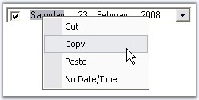{border="0"}

[]{style="COLOR: #15428b"} 

Figure 276: Syncfusion XP Menu as Context Menu

**[]{style="COLOR: #15428b"}** 

Menu Options

**[]{style="COLOR: #15428b"}** 

The menu options are:

[]{style="COLOR: #15428b"} 

[·      ]{style="FONT-FAMILY: Symbol"}Cut - Cuts the displayed date and by default displays \"No Date is selected\" string.

[·      ]{style="FONT-FAMILY: Symbol"}Copy - Copies the displayed date and stores in clipboard.

[·      ]{style="FONT-FAMILY: Symbol"}Paste - Pastes the copied date.

[·      ]{style="FONT-FAMILY: Symbol"}No Date/Time - Selects no date and displays \"No Date is selected\".

[]{style="COLOR: #15428b"} 

We can set the text value format that is copied to the clipboard using **ClipboardFormat** property.

[]{style="COLOR: #15428b"} 

::: {align="center"}
+-----------------------------------+-------------------------------------------------------------------------------------------------------------------------------------------------------------------------------------+
| DateTimePickerAdv Properties      | Description                                                                                                                                                                         |
+-----------------------------------+-------------------------------------------------------------------------------------------------------------------------------------------------------------------------------------+
| ClipboardFormat                   | While doing copy / paste operation, we can specify the format of the value of the DateTimePickerAdv control that is copied, by using **ClipBoardFormat** property. The formats are, |
|                                   |                                                                                                                                                                                     |
|                                   |                                                                                                                                                                                     |
|                                   |                                                                                                                                                                                     |
|                                   | [·      ]{style="FONT-FAMILY: Symbol"}*Long(default)*                                                                                                                               |
|                                   |                                                                                                                                                                                     |
|                                   | [·      ]{style="FONT-FAMILY: Symbol"}*Short*                                                                                                                                       |
|                                   |                                                                                                                                                                                     |
|                                   | [·      ]{style="FONT-FAMILY: Symbol"}*Time*                                                                                                                                        |
|                                   |                                                                                                                                                                                     |
|                                   | [·      ]{style="FONT-FAMILY: Symbol"}*Custom*                                                                                                                                      |
+-----------------------------------+-------------------------------------------------------------------------------------------------------------------------------------------------------------------------------------+
| CopyFieldsOnly                    | Indicates whether only the selected field will be copied or the whole text field will be copied.                                                                                    |
+-----------------------------------+-------------------------------------------------------------------------------------------------------------------------------------------------------------------------------------+
:::

[]{style="COLOR: #15428b"} 

+------------------------------------------------------------------------------------------------------------------------------------------------------------------------------------------------------------+
| **[\[C#\]]{style="FONT-FAMILY: 'Courier New'; COLOR: black"}**                                                                                                                                             |
|                                                                                                                                                                                                            |
| **[]{style="FONT-FAMILY: 'Courier New'; COLOR: black"}**                                                                                                                                                   |
|                                                                                                                                                                                                            |
| [this]{style="FONT-FAMILY: 'Courier New'; COLOR: blue"}[.dateTimePickerAdv1.CopyFieldsOnly = [true]{style="COLOR: blue"};]{style="FONT-FAMILY: 'Courier New'"}                                             |
|                                                                                                                                                                                                            |
| [this]{style="FONT-FAMILY: 'Courier New'; COLOR: blue"}[.dateTimePickerAdv1.ClipboardFormat = System.Windows.Forms.[DateTimePickerFormat]{style="COLOR: teal"}.Short;]{style="FONT-FAMILY: 'Courier New'"} |
+------------------------------------------------------------------------------------------------------------------------------------------------------------------------------------------------------------+

[]{style="COLOR: #15428b"} 

+----------------------------------------------------------------------------------------------------------------------------------------------------------------------------------------------------------+
| **[\[VB.NET\]]{style="FONT-FAMILY: 'Courier New'; COLOR: black"}**                                                                                                                                       |
|                                                                                                                                                                                                          |
| **[]{style="FONT-FAMILY: 'Courier New'; COLOR: black"}**                                                                                                                                                 |
|                                                                                                                                                                                                          |
| [Me]{style="FONT-FAMILY: 'Courier New'; COLOR: blue"}[.dateTimePickerAdv1.CopyFieldsOnly = [True]{style="COLOR: blue"}]{style="FONT-FAMILY: 'Courier New'"}                                              |
|                                                                                                                                                                                                          |
| [Me]{style="FONT-FAMILY: 'Courier New'; COLOR: blue"}[.dateTimePickerAdv1.ClipboardFormat = System.Windows.Forms.[DateTimePickerFormat]{style="COLOR: black"}.Short]{style="FONT-FAMILY: 'Courier New'"} |
+----------------------------------------------------------------------------------------------------------------------------------------------------------------------------------------------------------+

[]{style="COLOR: #15428b"} 

See Also

[]{style="COLOR: #15428b"} 

[Text Field]{.UGHyperlink}[, ]{.UGHyperlink}[[Null value Settings]{.UGHyperlink}]()[]{.UGHyperlink}

[]{#p320}[]{#_Navigating_between_fields}3.3.3.2.3.5.3      Navigating between fields

 

At run time, user can easily navigate between values in the text field like date, month, year, time using the TAB key. The below properties settings are necessary for tabbing between the fields.

[]{style="COLOR: #15428b"} 

::: {align="center"}
  ------------------------------ ------------------------------------------------------------------------------------------------------------
  DateTimePickerAdv Properties   Description
  TabStop                        Indicates whether the user can use the Tab key, to focus the DateTimePickerAdv control.
  TabForwarding                  Indicates if the control will moves its focus to the next field when the tab key is pressed.
  TabIndex                       Indicates the index in the TAB order that this control will occupy.
  TabLeave                       Indicates whether the focus should be moved away from the control, when there is no fields to tab through.
  ------------------------------ ------------------------------------------------------------------------------------------------------------
:::

[]{style="COLOR: #15428b"} 

+---------------------------------------------------------------------------------------------------------------------------------------------------------------+
| **[\[C#\]]{style="FONT-FAMILY: 'Courier New'; COLOR: black"}**                                                                                                |
|                                                                                                                                                               |
| **[]{style="FONT-FAMILY: 'Courier New'; COLOR: black"}**                                                                                                      |
|                                                                                                                                                               |
| [this]{style="FONT-FAMILY: 'Courier New'; COLOR: blue"}[.dateTimePickerAdv1.TabForwarding = [true]{style="COLOR: blue"};]{style="FONT-FAMILY: 'Courier New'"} |
|                                                                                                                                                               |
| [this]{style="FONT-FAMILY: 'Courier New'; COLOR: blue"}[.dateTimePickerAdv1.TabIndex = 1;]{style="FONT-FAMILY: 'Courier New'"}                                |
|                                                                                                                                                               |
| [this]{style="FONT-FAMILY: 'Courier New'; COLOR: blue"}[.dateTimePickerAdv1.TabLeave = [true]{style="COLOR: blue"};]{style="FONT-FAMILY: 'Courier New'"}      |
|                                                                                                                                                               |
| [this]{style="FONT-FAMILY: 'Courier New'; COLOR: blue"}[.dateTimePickerAdv1.TabStop = [true]{style="COLOR: blue"};]{style="FONT-FAMILY: 'Courier New'"}       |
+---------------------------------------------------------------------------------------------------------------------------------------------------------------+

[]{style="COLOR: #15428b"} 

+------------------------------------------------------------------------------------------------------------------------------------------------------------+
| **[\[VB.NET\]]{style="FONT-FAMILY: 'Courier New'; COLOR: black"}**                                                                                         |
|                                                                                                                                                            |
| **[]{style="FONT-FAMILY: 'Courier New'; COLOR: black"}**                                                                                                   |
|                                                                                                                                                            |
| [Me]{style="FONT-FAMILY: 'Courier New'; COLOR: blue"}[.dateTimePickerAdv1.TabForwarding = [True]{style="COLOR: blue"}]{style="FONT-FAMILY: 'Courier New'"} |
|                                                                                                                                                            |
| [Me]{style="FONT-FAMILY: 'Courier New'; COLOR: blue"}[.dateTimePickerAdv1.TabIndex = 1]{style="FONT-FAMILY: 'Courier New'"}                                |
|                                                                                                                                                            |
| [Me]{style="FONT-FAMILY: 'Courier New'; COLOR: blue"}[.dateTimePickerAdv1.TabLeave = [True]{style="COLOR: blue"}]{style="FONT-FAMILY: 'Courier New'"}      |
|                                                                                                                                                            |
| [Me]{style="FONT-FAMILY: 'Courier New'; COLOR: blue"}[.dateTimePickerAdv1.TabStop = [True]{style="COLOR: blue"}]{style="FONT-FAMILY: 'Courier New'"}       |
+------------------------------------------------------------------------------------------------------------------------------------------------------------+

###### []{#p321}[]{#_Themes_and_Styles}3.3.3.2.3.6 Themes and Styles {#themes-and-styles style="tab-stops: 0pt"}

**[]{style="COLOR: #15428b"}** 

Themes

**[]{style="COLOR: #15428b"}** 

We can apply themes for the DateTimePickerAdv and also the child controls using the below properties.

**[]{style="COLOR: #15428b"}** 

::: {align="center"}
  ------------------------------ -----------------------------------------------------------------------------------------------------------------------------------------------------------------------------------------------------------------------------
  DateTimePickerAdv Properties   Description
  ThemesEnabled                  Specifies whether to enable themes for the DateTimePickerAdv control.
  ThemedChildControls            Setting ThemesEnabled to true will not enable themes for its child controls (CheckBox, DropDown , UpDown and Calendar). To enable themes for the child controls of the DateTimePicker, set **ThemedChildControls** to true.
  ------------------------------ -----------------------------------------------------------------------------------------------------------------------------------------------------------------------------------------------------------------------------
:::

**[]{style="COLOR: #15428b"}** 

+---------------------------------------------------------------------------------------------------------------------------------------------------------------------+
| **[\[C#\]]{style="FONT-FAMILY: 'Courier New'; COLOR: black"}**                                                                                                      |
|                                                                                                                                                                     |
| []{style="FONT-FAMILY: 'Courier New'"}                                                                                                                              |
|                                                                                                                                                                     |
| [this]{style="FONT-FAMILY: 'Courier New'; COLOR: blue"}[.dateTimePickerAdv1.ThemesEnabled = [true]{style="COLOR: blue"};]{style="FONT-FAMILY: 'Courier New'"}       |
|                                                                                                                                                                     |
| [this]{style="FONT-FAMILY: 'Courier New'; COLOR: blue"}[.dateTimePickerAdv1.ThemedChildControls = [true]{style="COLOR: blue"};]{style="FONT-FAMILY: 'Courier New'"} |
+---------------------------------------------------------------------------------------------------------------------------------------------------------------------+

[]{style="COLOR: #15428b"} 

+--------------------------------------------------------------------------------------------------------------------------------------------------------------------+
| **[\[VB.NET\]]{style="FONT-FAMILY: 'Courier New'; COLOR: black"}**                                                                                                 |
|                                                                                                                                                                    |
| **[]{style="FONT-FAMILY: 'Courier New'; COLOR: black"}**                                                                                                           |
|                                                                                                                                                                    |
| [Me]{style="FONT-FAMILY: 'Courier New'; COLOR: blue"}[.dateTimePickerAdv1.ThemesEnabled = [True]{style="COLOR: blue"}]{style="FONT-FAMILY: 'Courier New'"}         |
|                                                                                                                                                                    |
| [Me]{style="FONT-FAMILY: 'Courier New'; COLOR: blue"}[.dateTimePickerAdv1.ThemedChildControls = [True]{style="COLOR: blue"}]{style="FONT-FAMILY: 'Courier New'"}   |
|                                                                                                                                                                    |
| []{style="FONT-FAMILY: 'Courier New'; COLOR: blue"}                                                                                                                |
|                                                                                                                                                                    |
| [\' Setting backcolor for the control when it is ReadOnly]{style="FONT-FAMILY: 'Courier New'; COLOR: green"}                                                       |
|                                                                                                                                                                    |
| [Me]{style="FONT-FAMILY: 'Courier New'; COLOR: blue"}[.dateTimePickerAdv1.ReadOnly = [True]{style="COLOR: blue"}]{style="FONT-FAMILY: 'Courier New'"}              |
|                                                                                                                                                                    |
| [Me]{style="FONT-FAMILY: 'Courier New'; COLOR: blue"}[.dateTimePickerAdv1.IgnoreThemeBackground = [True]{style="COLOR: blue"}]{style="FONT-FAMILY: 'Courier New'"} |
+--------------------------------------------------------------------------------------------------------------------------------------------------------------------+

**[]{style="COLOR: #15428b"}** 

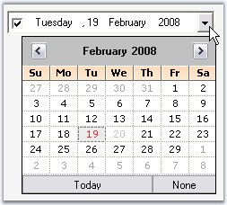{border="0"}

**[]{style="COLOR: #15428b"}** 

Figure 277: DateTimePicker and Child Controls Without Themes

**[]{style="COLOR: #15428b"}** 

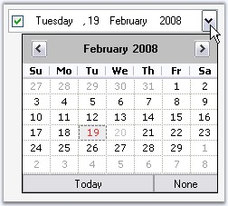{border="0"}

**[]{style="COLOR: #15428b"}** 

Figure 278: DateTimePicker and Child Controls With Themes

**[]{style="COLOR: #15428b"}** 

Styles

**[]{style="COLOR: #15428b"}** 

Visual Styles for the DateTimePickerAdv and its [child controls]{style="FONT-FAMILY: 'Verdana','sans-serif'; FONT-SIZE: 8pt"} can be applied using the **Style** property.

[]{style="COLOR: #15428b"} 

::: {align="center"}
+-----------------------------------+--------------------------------------------------------------------------+
| DateTimePickerAdv Properties      | Description                                                              |
+-----------------------------------+--------------------------------------------------------------------------+
| Style                             | Specifies the Office style of the picker. The options are :              |
|                                   |                                                                          |
|                                   |                                                                          |
|                                   |                                                                          |
|                                   | [·      ]{style="FONT-FAMILY: Symbol"}*OfficeXP*                         |
|                                   |                                                                          |
|                                   | [·      ]{style="FONT-FAMILY: Symbol"}*Office2003*                       |
|                                   |                                                                          |
|                                   | [·      ]{style="FONT-FAMILY: Symbol"}*VS2005*                           |
|                                   |                                                                          |
|                                   | [·      ]{style="FONT-FAMILY: Symbol"}*Office2007*                       |
|                                   |                                                                          |
|                                   | [·      ]{style="FONT-FAMILY: Symbol"}*Default (default)*                |
+-----------------------------------+--------------------------------------------------------------------------+
| Office2007Theme                   | Indicates the office color scheme used, when Style is set to Office2007. |
+-----------------------------------+--------------------------------------------------------------------------+
:::

[]{style="COLOR: #15428b"} 

+-------------------------------------------------------------------------------------------------------------------------------------------------------------------------------------------------------------------------------------------------------+
| **[\[C#\]]{style="FONT-FAMILY: 'Courier New'; COLOR: black"}**                                                                                                                                                                                        |
|                                                                                                                                                                                                                                                       |
| **[]{style="FONT-FAMILY: 'Courier New'; COLOR: black"}**                                                                                                                                                                                              |
|                                                                                                                                                                                                                                                       |
| [// Sample for setting Office2007 style for the control]{style="FONT-FAMILY: 'Courier New'; COLOR: green"}                                                                                                                                            |
|                                                                                                                                                                                                                                                       |
| [this]{style="FONT-FAMILY: 'Courier New'; COLOR: blue"}[.dateTimePickerAdv1.Style = Syncfusion.Windows.Forms.VisualStyle.]{style="FONT-FAMILY: 'Courier New'; COLOR: black"}[Office2007[;]{style="COLOR: black"}]{style="FONT-FAMILY: 'Courier New'"} |
+-------------------------------------------------------------------------------------------------------------------------------------------------------------------------------------------------------------------------------------------------------+

[]{style="COLOR: #15428b"} 

+----------------------------------------------------------------------------------------------------------------------------------------------------------------------------------------------------------------------------+
| **[\[VB.NET\]]{style="FONT-FAMILY: 'Courier New'; COLOR: black"}**                                                                                                                                                         |
|                                                                                                                                                                                                                            |
| **[]{style="FONT-FAMILY: 'Courier New'; COLOR: black"}**                                                                                                                                                                   |
|                                                                                                                                                                                                                            |
| [\' Sample for setting Office2007 style for the control]{style="FONT-FAMILY: 'Courier New'; COLOR: green"}                                                                                                                 |
|                                                                                                                                                                                                                            |
| [Me]{style="FONT-FAMILY: 'Courier New'; COLOR: blue"}[.dateTimePickerAdv1.Style = Syncfusion.Windows.Forms.VisualStyle.]{style="FONT-FAMILY: 'Courier New'; COLOR: black"}[Office2007]{style="FONT-FAMILY: 'Courier New'"} |
+----------------------------------------------------------------------------------------------------------------------------------------------------------------------------------------------------------------------------+

[]{style="COLOR: #15428b"} 

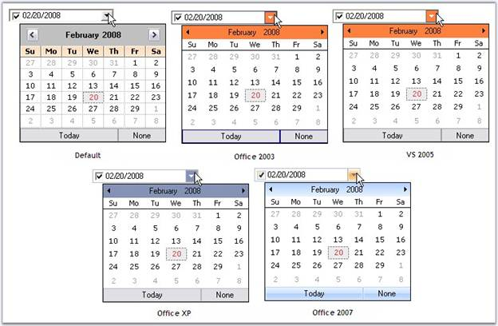{border="0"}

Figure 279: Visual Styles for DateTimePickerAdv

**[]{style="COLOR: #15428b"}** 

+----------------------------------------------------------------------------------------------------------------------------------------------------------------------------------------------------------+
| **[\[C#\]]{style="FONT-FAMILY: 'Courier New'; COLOR: black"}**                                                                                                                                           |
|                                                                                                                                                                                                          |
| **[]{style="FONT-FAMILY: 'Courier New'; COLOR: black"}**                                                                                                                                                 |
|                                                                                                                                                                                                          |
| [//Sets the Color scheme as Blue when the style is Office2007]{style="FONT-FAMILY: 'Courier New'; COLOR: green"}                                                                                         |
|                                                                                                                                                                                                          |
| [this]{style="FONT-FAMILY: 'Courier New'; COLOR: blue"}[.dateTimePickerAdv1.Office2007Theme = Syncfusion.Windows.Forms.[Office2007Theme]{style="COLOR: teal"}.Blue;]{style="FONT-FAMILY: 'Courier New'"} |
+----------------------------------------------------------------------------------------------------------------------------------------------------------------------------------------------------------+

[]{style="COLOR: #15428b"} 

+--------------------------------------------------------------------------------------------------------------------------------------------------------------------------------+
| **[\[VB.NET\]]{style="FONT-FAMILY: 'Courier New'; COLOR: black"}**                                                                                                             |
|                                                                                                                                                                                |
| **[]{style="FONT-FAMILY: 'Courier New'; COLOR: black"}**                                                                                                                       |
|                                                                                                                                                                                |
| [\'Sets the Color scheme as Blue when the style is Office2007]{style="FONT-FAMILY: 'Courier New'; COLOR: green"}                                                               |
|                                                                                                                                                                                |
| [Me]{style="FONT-FAMILY: 'Courier New'; COLOR: blue"}[.dateTimePickerAdv1.Office2007Theme = Syncfusion.Windows.Forms.Office2007Theme.Blue]{style="FONT-FAMILY: 'Courier New'"} |
+--------------------------------------------------------------------------------------------------------------------------------------------------------------------------------+

[]{style="COLOR: #15428b"} 

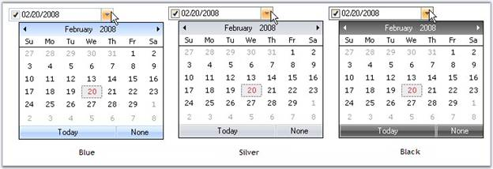{border="0"}

Figure 280: Office Color Scheme for DateTimePickerAdv Control

**[]{style="COLOR: #15428b"}** 

Custom Colors

[]{style="COLOR: #15428b"} 

We can also apply custom colors to the DateTimePickerAdv control by setting Office2007Theme to \"Managed\" and specifying the custom color through the **ApplyManagedColors** method as follows.

[]{style="COLOR: #15428b"} 

+-------------------------------------------------------------------------------------------------------------------------------------------------------------------------------------------------------------+
| **[\[C#\]]{style="FONT-FAMILY: 'Courier New'; COLOR: black"}**                                                                                                                                              |
|                                                                                                                                                                                                             |
| []{style="COLOR: #15428b"}                                                                                                                                                                                  |
|                                                                                                                                                                                                             |
| [this]{style="FONT-FAMILY: 'Courier New'; COLOR: blue"}[.dateTimePickerAdv1.Office2007Theme = Syncfusion.Windows.Forms.[Office2007Theme]{style="COLOR: teal"}.Managed;]{style="FONT-FAMILY: 'Courier New'"} |
|                                                                                                                                                                                                             |
| [Office2007Colors]{style="FONT-FAMILY: 'Courier New'; COLOR: teal"}[.ApplyManagedColors([this]{style="COLOR: blue"}, [Color]{style="COLOR: teal"}.Orange);]{style="FONT-FAMILY: 'Courier New'"}             |
+-------------------------------------------------------------------------------------------------------------------------------------------------------------------------------------------------------------+

[]{style="COLOR: #15428b"} 

+-----------------------------------------------------------------------------------------------------------------------------------------------------------------------------------------------------------+
| **[\[VB.NET\]]{style="FONT-FAMILY: 'Courier New'; COLOR: black"}**                                                                                                                                        |
|                                                                                                                                                                                                           |
| []{style="COLOR: #15428b"}                                                                                                                                                                                |
|                                                                                                                                                                                                           |
| [Me]{style="FONT-FAMILY: 'Courier New'; COLOR: blue"}[.dateTimePickerAdv1.Office2007Theme = Syncfusion.Windows.Forms.[Office2007Theme]{style="COLOR: teal"}.Managed;]{style="FONT-FAMILY: 'Courier New'"} |
|                                                                                                                                                                                                           |
| [Office2007Colors.]{style="FONT-FAMILY: 'Courier New'; COLOR: black"}[ApplyManagedColors([Me]{style="COLOR: blue"}, [Color]{style="COLOR: black"}.Orange)]{style="FONT-FAMILY: 'Courier New'"}            |
+-----------------------------------------------------------------------------------------------------------------------------------------------------------------------------------------------------------+

[]{style="COLOR: #15428b"} 

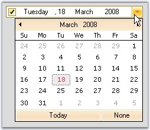{border="0"}

[]{style="COLOR: #15428b"} 

Figure 281: Custom Color = \"Orange\"

###### []{#p322}3.3.3.2.3.7 Advanced Features {#advanced-features style="tab-stops: 0pt"}

[]{style="COLOR: #15428b"} 

This section covers the below topics:

[]{style="COLOR: #15428b"} 

[]{#p323}[]{#_Data_Binding}3.3.3.2.3.7.1      Data Binding

[]{style="COLOR: #15428b"} 

Essential Tools supports extensive DataBinding in DateTimePickerAdv using the **Value** and **BindableValue** property. The following example illustrates the DataBinding of the DataSet belonging to a DataGrid.

[]{style="COLOR: #15428b"} 

::: {style="BORDER-BOTTOM: windowtext 1pt solid; BORDER-LEFT: medium none; PADDING-BOTTOM: 1pt; MARGIN-TOP: 9pt; PADDING-LEFT: 0pt; PADDING-RIGHT: 0pt; MARGIN-BOTTOM: 9pt; BORDER-TOP: windowtext 1pt solid; BORDER-RIGHT: medium none; PADDING-TOP: 1pt"}
{border="0"}Note: Always use BindableValue property if dataset contains Null value. In cases where no Null value exists in the dataset, Value property can be used.
:::

[]{style="COLOR: #15428b"} 

To bind a DateTimePickerAdv, perform the following steps.

[]{style="COLOR: #15428b"} 

1.   Add a DateTimePickerAdv and a DataGrid controls to the form.

2.   Create a dataset using the code below.

[]{style="COLOR: #15428b"} 

+----------------------------------------------------------------------------------------------------------------------------------------------------------------------------------------------------------------------------------+
| **[\[C#\]]{style="FONT-FAMILY: 'Courier New'; COLOR: black"}**                                                                                                                                                                   |
|                                                                                                                                                                                                                                  |
| **[]{style="FONT-FAMILY: 'Courier New'; COLOR: black"}**                                                                                                                                                                         |
|                                                                                                                                                                                                                                  |
| [// Creating DataSet,Table and rows.]{style="FONT-FAMILY: 'Courier New'; COLOR: green"}                                                                                                                                          |
|                                                                                                                                                                                                                                  |
| [DataSet dataSet = ]{style="FONT-FAMILY: 'Courier New'; COLOR: black"}[null]{style="FONT-FAMILY: 'Courier New'; COLOR: blue"}[;]{style="FONT-FAMILY: 'Courier New'; COLOR: black"}                                               |
|                                                                                                                                                                                                                                  |
| [DataTable table = ]{style="FONT-FAMILY: 'Courier New'; COLOR: black"}[null]{style="FONT-FAMILY: 'Courier New'; COLOR: blue"}[;]{style="FONT-FAMILY: 'Courier New'; COLOR: black"}                                               |
|                                                                                                                                                                                                                                  |
| []{style="FONT-FAMILY: 'Courier New'; COLOR: black"}                                                                                                                                                                             |
|                                                                                                                                                                                                                                  |
| [dataSet = ]{style="FONT-FAMILY: 'Courier New'; COLOR: black"}[new]{style="FONT-FAMILY: 'Courier New'; COLOR: blue"}[ DataSet();]{style="FONT-FAMILY: 'Courier New'; COLOR: black"}                                              |
|                                                                                                                                                                                                                                  |
| [table = dataSet.Tables.Add(\"Table\");]{style="FONT-FAMILY: 'Courier New'; COLOR: black"}                                                                                                                                       |
|                                                                                                                                                                                                                                  |
| []{style="FONT-FAMILY: 'Courier New'; COLOR: black"}                                                                                                                                                                             |
|                                                                                                                                                                                                                                  |
| [table.Columns.Add(\"DateTimeColumn\", ]{style="FONT-FAMILY: 'Courier New'; COLOR: black"}[typeof]{style="FONT-FAMILY: 'Courier New'; COLOR: blue"}[(DateTime));]{style="FONT-FAMILY: 'Courier New'; COLOR: black"}              |
|                                                                                                                                                                                                                                  |
| []{style="FONT-FAMILY: 'Courier New'; COLOR: black"}                                                                                                                                                                             |
|                                                                                                                                                                                                                                  |
| [table.Columns\[0\].AllowDBNull = ]{style="FONT-FAMILY: 'Courier New'; COLOR: black"}[true]{style="FONT-FAMILY: 'Courier New'; COLOR: blue"}[;]{style="FONT-FAMILY: 'Courier New'; COLOR: black"}                                |
|                                                                                                                                                                                                                                  |
| []{style="FONT-FAMILY: 'Courier New'; COLOR: black"}                                                                                                                                                                             |
|                                                                                                                                                                                                                                  |
| [table.Rows.Add(]{style="FONT-FAMILY: 'Courier New'; COLOR: black"}[new]{style="FONT-FAMILY: 'Courier New'; COLOR: blue"}[ object\[\]{DateTime.Now - TimeSpan.FromDays(60)});]{style="FONT-FAMILY: 'Courier New'; COLOR: black"} |
|                                                                                                                                                                                                                                  |
| [table.Rows.Add(]{style="FONT-FAMILY: 'Courier New'; COLOR: black"}[new]{style="FONT-FAMILY: 'Courier New'; COLOR: blue"}[ object\[\]{DateTime.Now});]{style="FONT-FAMILY: 'Courier New'; COLOR: black"}                         |
|                                                                                                                                                                                                                                  |
| [table.Rows.Add(]{style="FONT-FAMILY: 'Courier New'; COLOR: black"}[new]{style="FONT-FAMILY: 'Courier New'; COLOR: blue"}[ object\[\]{DBNull.Value});]{style="FONT-FAMILY: 'Courier New'; COLOR: black"}                         |
+----------------------------------------------------------------------------------------------------------------------------------------------------------------------------------------------------------------------------------+

[]{style="COLOR: #15428b"} 

+-------------------------------------------------------------------------------------------------------------------------------------------------------------------------------------------------------------------------------------------------------------------------------------------------------+
| **[\[VB.NET\]]{style="FONT-FAMILY: 'Courier New'; COLOR: black"}**                                                                                                                                                                                                                                    |
|                                                                                                                                                                                                                                                                                                       |
| **[]{style="FONT-FAMILY: 'Courier New'; COLOR: black"}**                                                                                                                                                                                                                                              |
|                                                                                                                                                                                                                                                                                                       |
| [\' Creating DataSet,Table and rows.]{style="FONT-FAMILY: 'Courier New'; COLOR: green"}                                                                                                                                                                                                               |
|                                                                                                                                                                                                                                                                                                       |
| [Private]{style="FONT-FAMILY: 'Courier New'; COLOR: blue"}[ dataSet ]{style="FONT-FAMILY: 'Courier New'; COLOR: black"}[As]{style="FONT-FAMILY: 'Courier New'; COLOR: blue"}[ DataSet = ]{style="FONT-FAMILY: 'Courier New'; COLOR: black"}[Nothing]{style="FONT-FAMILY: 'Courier New'; COLOR: blue"} |
|                                                                                                                                                                                                                                                                                                       |
| [Private]{style="FONT-FAMILY: 'Courier New'; COLOR: blue"}[ table ]{style="FONT-FAMILY: 'Courier New'; COLOR: black"}[As]{style="FONT-FAMILY: 'Courier New'; COLOR: blue"}[ DataTable = ]{style="FONT-FAMILY: 'Courier New'; COLOR: black"}[Nothing]{style="FONT-FAMILY: 'Courier New'; COLOR: blue"} |
|                                                                                                                                                                                                                                                                                                       |
| []{style="FONT-FAMILY: 'Courier New'; COLOR: black"}                                                                                                                                                                                                                                                  |
|                                                                                                                                                                                                                                                                                                       |
| [Private]{style="FONT-FAMILY: 'Courier New'; COLOR: blue"}[ dataSet = New DataSet()]{style="FONT-FAMILY: 'Courier New'; COLOR: black"}                                                                                                                                                                |
|                                                                                                                                                                                                                                                                                                       |
| [Private]{style="FONT-FAMILY: 'Courier New'; COLOR: blue"}[ table = dataSet.Tables.Add(\"Table\")]{style="FONT-FAMILY: 'Courier New'; COLOR: black"}                                                                                                                                                  |
|                                                                                                                                                                                                                                                                                                       |
| []{style="FONT-FAMILY: 'Courier New'; COLOR: black"}                                                                                                                                                                                                                                                  |
|                                                                                                                                                                                                                                                                                                       |
| [table.Columns.Add(\"DateTimeColumn\", ]{style="FONT-FAMILY: 'Courier New'; COLOR: black"}[GetType]{style="FONT-FAMILY: 'Courier New'; COLOR: blue"}[(DateTime))]{style="FONT-FAMILY: 'Courier New'; COLOR: black"}                                                                                   |
|                                                                                                                                                                                                                                                                                                       |
| []{style="FONT-FAMILY: 'Courier New'; COLOR: black"}                                                                                                                                                                                                                                                  |
|                                                                                                                                                                                                                                                                                                       |
| [Private]{style="FONT-FAMILY: 'Courier New'; COLOR: blue"}[ table.Columns(0).AllowDBNull = ]{style="FONT-FAMILY: 'Courier New'; COLOR: black"}[True]{style="FONT-FAMILY: 'Courier New'; COLOR: blue"}                                                                                                 |
|                                                                                                                                                                                                                                                                                                       |
| []{style="FONT-FAMILY: 'Courier New'; COLOR: black"}                                                                                                                                                                                                                                                  |
|                                                                                                                                                                                                                                                                                                       |
| [table.Rows.Add(]{style="FONT-FAMILY: 'Courier New'; COLOR: black"}[New]{style="FONT-FAMILY: 'Courier New'; COLOR: blue"}[ Object(){DateTime.Now - TimeSpan.FromDays(60)})]{style="FONT-FAMILY: 'Courier New'; COLOR: black"}                                                                         |
|                                                                                                                                                                                                                                                                                                       |
| [table.Rows.Add(]{style="FONT-FAMILY: 'Courier New'; COLOR: black"}[New]{style="FONT-FAMILY: 'Courier New'; COLOR: blue"}[ Object(){DateTime.Now})]{style="FONT-FAMILY: 'Courier New'; COLOR: black"}                                                                                                 |
|                                                                                                                                                                                                                                                                                                       |
| [table.Rows.Add(]{style="FONT-FAMILY: 'Courier New'; COLOR: black"}[New]{style="FONT-FAMILY: 'Courier New'; COLOR: blue"}[ Object(){DBNull.Value})              ]{style="FONT-FAMILY: 'Courier New'; COLOR: black"}                                                                                   |
+-------------------------------------------------------------------------------------------------------------------------------------------------------------------------------------------------------------------------------------------------------------------------------------------------------+

[]{style="COLOR: #15428b"} 

3.   Assign the dataset to the DataGrid control using its **DataSource** property. Set the control\'s **DataMember** property to the member that must be bound.

[]{style="COLOR: #15428b"} 

+---------------------------------------------------------------------------------------+
| **[\[C#\]]{style="FONT-FAMILY: 'Courier New'; COLOR: black"}**                        |
|                                                                                       |
| **[]{style="FONT-FAMILY: 'Courier New'; COLOR: black"}**                              |
|                                                                                       |
| [dataGrid1.DataSource = dataSet;]{style="FONT-FAMILY: 'Courier New'; COLOR: black"}   |
|                                                                                       |
| [dataGrid1.DataMember = \"Table\";]{style="FONT-FAMILY: 'Courier New'; COLOR: black"} |
+---------------------------------------------------------------------------------------+

[]{style="COLOR: #15428b"} 

+-------------------------------------------------------------------------------------------------------------------------------------------------+
| **[\[VB.NET\]]{style="FONT-FAMILY: 'Courier New'; COLOR: black"}**                                                                              |
|                                                                                                                                                 |
| []{style="FONT-FAMILY: 'Courier New'; COLOR: black"}                                                                                            |
|                                                                                                                                                 |
| [Private]{style="FONT-FAMILY: 'Courier New'; COLOR: blue"}[ dataGrid1.DataSource = dataSet]{style="FONT-FAMILY: 'Courier New'; COLOR: black"}   |
|                                                                                                                                                 |
| [Private]{style="FONT-FAMILY: 'Courier New'; COLOR: blue"}[ dataGrid1.DataMember = \"Table\"]{style="FONT-FAMILY: 'Courier New'; COLOR: black"} |
+-------------------------------------------------------------------------------------------------------------------------------------------------+

[]{style="COLOR: #15428b"} 

4.   Bind the datasource with the DateTimePickerAdv control.

[]{style="COLOR: #15428b"} 

+------------------------------------------------------------------------------------------------------------------------------------------------+
| **[\[C#\]]{style="FONT-FAMILY: 'Courier New'; COLOR: black"}**                                                                                 |
|                                                                                                                                                |
| **[]{style="FONT-FAMILY: 'Courier New'; COLOR: black"}**                                                                                       |
|                                                                                                                                                |
| [// Setting the BindableValue property in order to Data Bind.]{style="FONT-FAMILY: 'Courier New'; COLOR: green"}                               |
|                                                                                                                                                |
| [dateTimePickerAdv1.DataBindings.Add(\"BindableValue\", dataSet, \"Table.DateTimeColumn\");]{style="FONT-FAMILY: 'Courier New'; COLOR: black"} |
|                                                                                                                                                |
| [dateTimePickerAdv1.Focus();]{style="FONT-FAMILY: 'Courier New'; COLOR: black"}                                                                |
+------------------------------------------------------------------------------------------------------------------------------------------------+

[]{style="COLOR: #15428b"} 

+-----------------------------------------------------------------------------------------------------------------------------------------------+
| **[\[VB.NET\]]{style="FONT-FAMILY: 'Courier New'; COLOR: black"}**                                                                            |
|                                                                                                                                               |
| []{style="FONT-FAMILY: 'Courier New'; COLOR: black"}                                                                                          |
|                                                                                                                                               |
| [\' Setting the BindableValue property in order to Data Bind.]{style="FONT-FAMILY: 'Courier New'; COLOR: green"}                              |
|                                                                                                                                               |
| [dateTimePickerAdv1.DataBindings.Add(\"BindableValue\", dataSet, \"Table.DateTimeColumn\")]{style="FONT-FAMILY: 'Courier New'; COLOR: black"} |
|                                                                                                                                               |
| [dateTimePickerAdv1.Focus()                       ]{style="FONT-FAMILY: 'Courier New'; COLOR: black"}                                         |
+-----------------------------------------------------------------------------------------------------------------------------------------------+

[]{style="COLOR: #15428b"} 

5.   Run the application. Select a data in the datagrid and DateTimePicker will display the corresponding date value (The DateTimePickerAdv is bound to the datasource using BindableValue property as datasource contains Null value. Selecting in the datagrid will automatically position the datasource to the related row which will update the DateTimePickerAdv with the appropriate data).

[]{style="COLOR: #15428b"} 

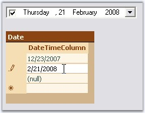{border="0"}

[]{style="COLOR: #15428b"} 

Figure 282: DateTimePickerAdv Bound to DataSet

**[]{style="COLOR: #15428b"}** 

A sample which demonstrates this feature is available in the below sample installation path.

[]{style="COLOR: #15428b"} 

..\\My Documents\\Syncfusion\\EssentialStudio\\***Version Number***\\Windows\\Tools.Windows\\Samples\\2.0\\Editors Package\\CalendarControls

[]{#p324}3.3.3.2.3.7.2        Globalization

[]{style="COLOR: #15428b"} 

DateTimePickerAdv supports globalization through **DateTimePickerAdv.Culture** property.

[]{style="COLOR: #15428b"} 

::: {align="center"}
  ------------------------------ ---------------------------------------------------------------------------------------------------------------------------------------------
  DateTimePickerAdv Properties   Description
  Culture                        Gets or sets the current culture of the DateTimePickerAdv control. UseCurrentCulture should be set to false to make this setting effective.
  UseCurrentCulture              Specifies whether the current culture of the machine will be used. By default it is false.
  ------------------------------ ---------------------------------------------------------------------------------------------------------------------------------------------
:::

[]{style="COLOR: #15428b"} 

+-----------------------------------------------------------------------------------------------------------------------------------------------------------------------------------------------------------------------------+
| **[\[C#\]]{style="FONT-FAMILY: 'Courier New'; COLOR: black"}**                                                                                                                                                              |
|                                                                                                                                                                                                                             |
| []{style="COLOR: #15428b"}                                                                                                                                                                                                  |
|                                                                                                                                                                                                                             |
| [this]{style="FONT-FAMILY: 'Courier New'; COLOR: blue"}[.dateTimePickerAdv1.UseCurrentCulture = [false]{style="COLOR: blue"};]{style="FONT-FAMILY: 'Courier New'"}                                                          |
|                                                                                                                                                                                                                             |
| [this]{style="FONT-FAMILY: 'Courier New'; COLOR: blue"}[.dateTimePickerAdv1.Culture = [new]{style="COLOR: blue"} System.Globalization.CultureInfo([\"hi-IN\"]{style="COLOR: maroon"});]{style="FONT-FAMILY: 'Courier New'"} |
+-----------------------------------------------------------------------------------------------------------------------------------------------------------------------------------------------------------------------------+

[]{style="COLOR: #15428b"} 

+--------------------------------------------------------------------------------------------------------------------------------------------------------------------------------------------------------------------------+
| **[\[VB.NET\]]{style="FONT-FAMILY: 'Courier New'; COLOR: black"}**                                                                                                                                                       |
|                                                                                                                                                                                                                          |
| []{style="COLOR: #15428b"}                                                                                                                                                                                               |
|                                                                                                                                                                                                                          |
| [Me]{style="FONT-FAMILY: 'Courier New'; COLOR: blue"}[.dateTimePickerAdv1.UseCurrentCulture = [False]{style="COLOR: blue"}]{style="FONT-FAMILY: 'Courier New'"}                                                          |
|                                                                                                                                                                                                                          |
| [Me]{style="FONT-FAMILY: 'Courier New'; COLOR: blue"}[.dateTimePickerAdv1.Culture = [New]{style="COLOR: blue"} System.Globalization.CultureInfo([\"hi-IN\"]{style="COLOR: maroon"})]{style="FONT-FAMILY: 'Courier New'"} |
+--------------------------------------------------------------------------------------------------------------------------------------------------------------------------------------------------------------------------+

[]{style="COLOR: #15428b"} 

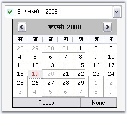{border="0"}

[]{style="COLOR: #15428b"} 

Figure 283 Culture=\"Hindi(India)\"

[]{#_Custom_PopupWindow}3.3.3.2.3.7.3      Custom PopupWindow[]{#p325}

**[]{style="COLOR: #15428b"}** 

This section deals with creating a custom popup window for the DateTimePickerAdv control. We can implement IDateTimePickerAdvCalendar interface to drop down a custom window.

[]{style="COLOR: #15428b"} 

IDateTimePickerAdvCalendar Interface Members

[]{style="COLOR: #15428b"} 

::: {align="center"}
+----------------------------------------------------------------------------------------------------------------------------------------+--------------------------------------------------------------------------------------------------------------------------------+
| IDateTimePickerAdvCalendar Member                                                                                                      | Description                                                                                                                    |
+----------------------------------------------------------------------------------------------------------------------------------------+--------------------------------------------------------------------------------------------------------------------------------+
| Active                                                                                                                                 | Boolean value indicating if the DateTimePickerAdv should consider the interface events fired by this control.                  |
+----------------------------------------------------------------------------------------------------------------------------------------+--------------------------------------------------------------------------------------------------------------------------------+
| Appearance properties (CalendarFont, CalendarForeColor, CalendarMonthBackground, TitleBackColor, TitleForeColor and TrailingForeColor) | *CalendarFont* - Gets / sets the font used to draw the calendar that implements the interface,                                 |
|                                                                                                                                        |                                                                                                                                |
|                                                                                                                                        | *CalendarForeColor* - Gets / sets the color used to draw the foreground of calendar that implements the interface,             |
|                                                                                                                                        |                                                                                                                                |
|                                                                                                                                        | *CalendarMonthBackground* - Gets / sets the color used to draw the month background of calendar that implements the interface, |
|                                                                                                                                        |                                                                                                                                |
|                                                                                                                                        | *TitleBackColor* - Gets / sets the color used to draw the title background of calendar that implements the interface,          |
|                                                                                                                                        |                                                                                                                                |
|                                                                                                                                        | *TitleForeColor* - Gets / sets the color used to draw the foreground of the title of calendar that implements the interface,   |
|                                                                                                                                        |                                                                                                                                |
|                                                                                                                                        | *TrailingForeColor* - Gets / sets the color used to draw the trailing foreground of calendar that implements the interface.    |
+----------------------------------------------------------------------------------------------------------------------------------------+--------------------------------------------------------------------------------------------------------------------------------+
| Value properties (MinDate, MaxDate, Value)                                                                                             | *MinDate* - Gets / sets the minimum date of the calendar that implements the interface,                                        |
|                                                                                                                                        |                                                                                                                                |
|                                                                                                                                        | *MaxDate* - Gets / sets the maximum date of the calendar that implements the interface and                                     |
|                                                                                                                                        |                                                                                                                                |
|                                                                                                                                        | *Value* - Gets / sets the date of the calendar that implements the interface.                                                  |
+----------------------------------------------------------------------------------------------------------------------------------------+--------------------------------------------------------------------------------------------------------------------------------+
| Culture                                                                                                                                | Gets or set the culture of the calendar that implements this interface.                                                        |
+----------------------------------------------------------------------------------------------------------------------------------------+--------------------------------------------------------------------------------------------------------------------------------+
:::

[]{style="COLOR: #15428b"} 

::: {align="center"}
  ----------------------------------- ---------------------------------------------------------------------------------------------------------------------------------------------------------------------------------------------------------------------------------------------------------
  IDateTimePickerAdvCalendar Events   Description
  NullButtonDown                      Event is similar to the DateTimePickerAdv.NullButtonEventHandler. It is handled when the none button is clicked or when the control implementing the interface wants the DateTimePickerAdv to have the NullString displayed.
  SelectDate                          Event is similar to the DateTimePickerAdv.SelectDateEventHandler. It is handled when the user selects a date on the control implementing the interface or the control wants the popup to close and set the picker\'s date to the Value member.
  DateChange                          Event is similar to the DateTimePickerAdv.DateChangedEventHandler. It is handled when the user has changed the date of the control implementing the interface and doesn\'t want the popup to close, just update the picker\'s date to the Value member.
  ----------------------------------- ---------------------------------------------------------------------------------------------------------------------------------------------------------------------------------------------------------------------------------------------------------
:::

[]{style="COLOR: #15428b"} 

Creating a Custom Popup Window for DateTimePickerAdv

[]{style="COLOR: #15428b"} 

Follow the below steps to add a Windows MonthCalendar control as the Popup for the DateTimePickerAdv, using PopupControlContainer.

[]{style="COLOR: #15428b"} 

1.   Drag a DateTimePickerAdv, PopupControlContainer and a button onto the form designer from the toolbox.

[]{style="COLOR: #15428b"} 

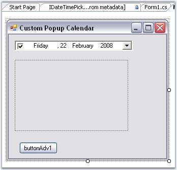{border="0"}

[]{style="COLOR: #15428b"} 

Figure 284: Control added to the Form

[]{style="COLOR: #15428b"} 

2.   Create a control that implements the **IDateTimePickerAdvCalendar** interface using the below code.

[]{style="COLOR: #15428b"} 

+----------------------------------------------------------------------------------------------------------------------------------------------------------------------------------------------------------------------------------------------------------------+
| **[\[C#\]]{style="FONT-FAMILY: 'Courier New'; COLOR: black"}**                                                                                                                                                                                                 |
|                                                                                                                                                                                                                                                                |
| **[]{style="FONT-FAMILY: 'Courier New'; COLOR: black"}**                                                                                                                                                                                                       |
|                                                                                                                                                                                                                                                                |
| [//Creating Calendar which implements the IDateTimePickerAdvCalendar]{style="FONT-FAMILY: 'Courier New'; COLOR: green"}                                                                                                                                        |
|                                                                                                                                                                                                                                                                |
| [private]{style="FONT-FAMILY: 'Courier New'; COLOR: blue"}[ [MyCustomCalendar]{style="COLOR: teal"} MonthCalendar;]{style="FONT-FAMILY: 'Courier New'"}                                                                                                        |
|                                                                                                                                                                                                                                                                |
| []{style="FONT-FAMILY: 'Courier New'"}                                                                                                                                                                                                                         |
|                                                                                                                                                                                                                                                                |
| [//Initializing the Calendar ]{style="FONT-FAMILY: 'Courier New'; COLOR: green"}                                                                                                                                                                               |
|                                                                                                                                                                                                                                                                |
| [this]{style="FONT-FAMILY: 'Courier New'; COLOR: blue"}[.MonthCalendar = [new]{style="COLOR: blue"} [MyCustomCalendar]{style="COLOR: teal"}();]{style="FONT-FAMILY: 'Courier New'"}                                                                            |
|                                                                                                                                                                                                                                                                |
| []{style="FONT-FAMILY: 'Courier New'"}                                                                                                                                                                                                                         |
|                                                                                                                                                                                                                                                                |
| [//Defining the Calendar Class which implements IDateTimePickerAdvCalendar]{style="FONT-FAMILY: 'Courier New'; COLOR: green"}                                                                                                                                  |
|                                                                                                                                                                                                                                                                |
| [public]{style="FONT-FAMILY: 'Courier New'; COLOR: blue"}[ [class]{style="COLOR: blue"} [MyCustomCalendar]{style="COLOR: teal"} : [MonthCalendar]{style="COLOR: teal"}, [IDateTimePickerAdvCalendar]{style="COLOR: teal"}]{style="FONT-FAMILY: 'Courier New'"} |
|                                                                                                                                                                                                                                                                |
| [{]{style="FONT-FAMILY: 'Courier New'"}                                                                                                                                                                                                                        |
|                                                                                                                                                                                                                                                                |
| [    [private]{style="COLOR: blue"} [bool]{style="COLOR: blue"} active;]{style="FONT-FAMILY: 'Courier New'"}                                                                                                                                                   |
|                                                                                                                                                                                                                                                                |
| []{style="FONT-FAMILY: 'Courier New'"}                                                                                                                                                                                                                         |
|                                                                                                                                                                                                                                                                |
| [    [public]{style="COLOR: blue"} [bool]{style="COLOR: blue"} Active]{style="FONT-FAMILY: 'Courier New'"}                                                                                                                                                     |
|                                                                                                                                                                                                                                                                |
| [    {]{style="FONT-FAMILY: 'Courier New'"}                                                                                                                                                                                                                    |
|                                                                                                                                                                                                                                                                |
| [        [get]{style="COLOR: blue"} { [return]{style="COLOR: blue"} active; }]{style="FONT-FAMILY: 'Courier New'"}                                                                                                                                             |
|                                                                                                                                                                                                                                                                |
| [        [set]{style="COLOR: blue"} { active = [value]{style="COLOR: blue"}; }]{style="FONT-FAMILY: 'Courier New'"}                                                                                                                                            |
|                                                                                                                                                                                                                                                                |
| [    }]{style="FONT-FAMILY: 'Courier New'"}                                                                                                                                                                                                                    |
|                                                                                                                                                                                                                                                                |
| []{style="FONT-FAMILY: 'Courier New'"}                                                                                                                                                                                                                         |
|                                                                                                                                                                                                                                                                |
| [    [public]{style="COLOR: blue"} System.Drawing.[Font]{style="COLOR: teal"} CalendarFont]{style="FONT-FAMILY: 'Courier New'"}                                                                                                                                |
|                                                                                                                                                                                                                                                                |
| [    {]{style="FONT-FAMILY: 'Courier New'"}                                                                                                                                                                                                                    |
|                                                                                                                                                                                                                                                                |
| [        [get]{style="COLOR: blue"} { [return]{style="COLOR: blue"} Font; }]{style="FONT-FAMILY: 'Courier New'"}                                                                                                                                               |
|                                                                                                                                                                                                                                                                |
| [        [set]{style="COLOR: blue"} { Font = [value]{style="COLOR: blue"}; }]{style="FONT-FAMILY: 'Courier New'"}                                                                                                                                              |
|                                                                                                                                                                                                                                                                |
| [    }]{style="FONT-FAMILY: 'Courier New'"}                                                                                                                                                                                                                    |
|                                                                                                                                                                                                                                                                |
| []{style="FONT-FAMILY: 'Courier New'"}                                                                                                                                                                                                                         |
|                                                                                                                                                                                                                                                                |
| [    [public]{style="COLOR: blue"} [Color]{style="COLOR: teal"} CalendarForeColor]{style="FONT-FAMILY: 'Courier New'"}                                                                                                                                         |
|                                                                                                                                                                                                                                                                |
| [    {]{style="FONT-FAMILY: 'Courier New'"}                                                                                                                                                                                                                    |
|                                                                                                                                                                                                                                                                |
| [        [get]{style="COLOR: blue"} { [return]{style="COLOR: blue"} ForeColor; }]{style="FONT-FAMILY: 'Courier New'"}                                                                                                                                          |
|                                                                                                                                                                                                                                                                |
| [        [set]{style="COLOR: blue"} { ForeColor = [value]{style="COLOR: blue"}; }]{style="FONT-FAMILY: 'Courier New'"}                                                                                                                                         |
|                                                                                                                                                                                                                                                                |
| [    }]{style="FONT-FAMILY: 'Courier New'"}                                                                                                                                                                                                                    |
|                                                                                                                                                                                                                                                                |
| []{style="FONT-FAMILY: 'Courier New'"}                                                                                                                                                                                                                         |
|                                                                                                                                                                                                                                                                |
| [    [public]{style="COLOR: blue"} [Color]{style="COLOR: teal"} CalendarMonthBackground]{style="FONT-FAMILY: 'Courier New'"}                                                                                                                                   |
|                                                                                                                                                                                                                                                                |
| [    {]{style="FONT-FAMILY: 'Courier New'"}                                                                                                                                                                                                                    |
|                                                                                                                                                                                                                                                                |
| [        [get]{style="COLOR: blue"} { [return]{style="COLOR: blue"} BackColor; }]{style="FONT-FAMILY: 'Courier New'"}                                                                                                                                          |
|                                                                                                                                                                                                                                                                |
| [        [set]{style="COLOR: blue"} { BackColor = [value]{style="COLOR: blue"}; }]{style="FONT-FAMILY: 'Courier New'"}                                                                                                                                         |
|                                                                                                                                                                                                                                                                |
| [    }]{style="FONT-FAMILY: 'Courier New'"}                                                                                                                                                                                                                    |
|                                                                                                                                                                                                                                                                |
| []{style="FONT-FAMILY: 'Courier New'"}                                                                                                                                                                                                                         |
|                                                                                                                                                                                                                                                                |
| [    [public]{style="COLOR: blue"} [DateTime]{style="COLOR: teal"} Value]{style="FONT-FAMILY: 'Courier New'"}                                                                                                                                                  |
|                                                                                                                                                                                                                                                                |
| [    {]{style="FONT-FAMILY: 'Courier New'"}                                                                                                                                                                                                                    |
|                                                                                                                                                                                                                                                                |
| [        [get]{style="COLOR: blue"} { [return]{style="COLOR: blue"} SelectionStart; }]{style="FONT-FAMILY: 'Courier New'"}                                                                                                                                     |
|                                                                                                                                                                                                                                                                |
| [        [set]{style="COLOR: blue"} { SelectionStart = SelectionEnd = [value]{style="COLOR: blue"}; }]{style="FONT-FAMILY: 'Courier New'"}                                                                                                                     |
|                                                                                                                                                                                                                                                                |
| [    }]{style="FONT-FAMILY: 'Courier New'"}                                                                                                                                                                                                                    |
|                                                                                                                                                                                                                                                                |
| []{style="FONT-FAMILY: 'Courier New'"}                                                                                                                                                                                                                         |
|                                                                                                                                                                                                                                                                |
| [    [public]{style="COLOR: blue"} [event]{style="COLOR: blue"} [DateTimePickerAdv]{style="COLOR: teal"}.[NullButtonEventHandler]{style="COLOR: teal"} NullButtonDown;]{style="FONT-FAMILY: 'Courier New'"}                                                    |
|                                                                                                                                                                                                                                                                |
| [    [public]{style="COLOR: blue"} [event]{style="COLOR: blue"} [DateTimePickerAdv]{style="COLOR: teal"}.[SelectDateEventHandler]{style="COLOR: teal"} SelectDate;]{style="FONT-FAMILY: 'Courier New'"}                                                        |
|                                                                                                                                                                                                                                                                |
| [    [public]{style="COLOR: blue"} [event]{style="COLOR: blue"} [DateTimePickerAdv]{style="COLOR: teal"}.[DateChangedEventHandler]{style="COLOR: teal"} DateChange;]{style="FONT-FAMILY: 'Courier New'"}                                                       |
|                                                                                                                                                                                                                                                                |
| []{style="FONT-FAMILY: 'Courier New'"}                                                                                                                                                                                                                         |
|                                                                                                                                                                                                                                                                |
| [    [public]{style="COLOR: blue"} MyCustomCalendar()]{style="FONT-FAMILY: 'Courier New'"}                                                                                                                                                                     |
|                                                                                                                                                                                                                                                                |
| [    {]{style="FONT-FAMILY: 'Courier New'"}                                                                                                                                                                                                                    |
|                                                                                                                                                                                                                                                                |
| [        [this]{style="COLOR: blue"}.DateSelected += [new]{style="COLOR: blue"} System.Windows.Forms.[DateRangeEventHandler]{style="COLOR: teal"}(OnDateSelected);]{style="FONT-FAMILY: 'Courier New'"}                                                        |
|                                                                                                                                                                                                                                                                |
| [        [this]{style="COLOR: blue"}.DateChanged += [new]{style="COLOR: blue"} System.Windows.Forms.[DateRangeEventHandler]{style="COLOR: teal"}(OnDateChanged);]{style="FONT-FAMILY: 'Courier New'"}                                                          |
|                                                                                                                                                                                                                                                                |
| [    }]{style="FONT-FAMILY: 'Courier New'"}                                                                                                                                                                                                                    |
|                                                                                                                                                                                                                                                                |
| []{style="FONT-FAMILY: 'Courier New'"}                                                                                                                                                                                                                         |
|                                                                                                                                                                                                                                                                |
| [    [protected]{style="COLOR: blue"} [void]{style="COLOR: blue"} OnDateSelected([object]{style="COLOR: blue"} sender, System.Windows.Forms.[DateRangeEventArgs]{style="COLOR: teal"} e)]{style="FONT-FAMILY: 'Courier New'"}                                  |
|                                                                                                                                                                                                                                                                |
| [    {]{style="FONT-FAMILY: 'Courier New'"}                                                                                                                                                                                                                    |
|                                                                                                                                                                                                                                                                |
| [        [if]{style="COLOR: blue"} (SelectDate != [null]{style="COLOR: blue"})]{style="FONT-FAMILY: 'Courier New'"}                                                                                                                                            |
|                                                                                                                                                                                                                                                                |
| [        {]{style="FONT-FAMILY: 'Courier New'"}                                                                                                                                                                                                                |
|                                                                                                                                                                                                                                                                |
| [            SelectDate([this]{style="COLOR: blue"}, [new]{style="COLOR: blue"} [EventArgs]{style="COLOR: teal"}());]{style="FONT-FAMILY: 'Courier New'"}                                                                                                      |
|                                                                                                                                                                                                                                                                |
| [        }]{style="FONT-FAMILY: 'Courier New'"}                                                                                                                                                                                                                |
|                                                                                                                                                                                                                                                                |
| [    }]{style="FONT-FAMILY: 'Courier New'"}                                                                                                                                                                                                                    |
|                                                                                                                                                                                                                                                                |
| [    [protected]{style="COLOR: blue"} [void]{style="COLOR: blue"} OnDateChanged([object]{style="COLOR: blue"} sender, System.Windows.Forms.[DateRangeEventArgs]{style="COLOR: teal"} e)]{style="FONT-FAMILY: 'Courier New'"}                                   |
|                                                                                                                                                                                                                                                                |
| [    {]{style="FONT-FAMILY: 'Courier New'"}                                                                                                                                                                                                                    |
|                                                                                                                                                                                                                                                                |
| [        [if]{style="COLOR: blue"} (DateChange != [null]{style="COLOR: blue"})]{style="FONT-FAMILY: 'Courier New'"}                                                                                                                                            |
|                                                                                                                                                                                                                                                                |
| [        {]{style="FONT-FAMILY: 'Courier New'"}                                                                                                                                                                                                                |
|                                                                                                                                                                                                                                                                |
| [            DateChange([this]{style="COLOR: blue"}, [new]{style="COLOR: blue"} [EventArgs]{style="COLOR: teal"}());]{style="FONT-FAMILY: 'Courier New'"}                                                                                                      |
|                                                                                                                                                                                                                                                                |
| [        }]{style="FONT-FAMILY: 'Courier New'"}                                                                                                                                                                                                                |
|                                                                                                                                                                                                                                                                |
| [    }]{style="FONT-FAMILY: 'Courier New'"}                                                                                                                                                                                                                    |
|                                                                                                                                                                                                                                                                |
| []{style="FONT-FAMILY: 'Courier New'"}                                                                                                                                                                                                                         |
|                                                                                                                                                                                                                                                                |
| [    [public]{style="COLOR: blue"} [string]{style="COLOR: blue"} Culture]{style="FONT-FAMILY: 'Courier New'"}                                                                                                                                                  |
|                                                                                                                                                                                                                                                                |
| [    {]{style="FONT-FAMILY: 'Courier New'"}                                                                                                                                                                                                                    |
|                                                                                                                                                                                                                                                                |
| [        [get]{style="COLOR: blue"} { [return]{style="COLOR: blue"} [\"Not Supported\"]{style="COLOR: maroon"}; }]{style="FONT-FAMILY: 'Courier New'"}                                                                                                         |
|                                                                                                                                                                                                                                                                |
| [    }]{style="FONT-FAMILY: 'Courier New'"}                                                                                                                                                                                                                    |
|                                                                                                                                                                                                                                                                |
| []{style="FONT-FAMILY: 'Courier New'"}                                                                                                                                                                                                                         |
|                                                                                                                                                                                                                                                                |
| [    [public]{style="COLOR: blue"} [void]{style="COLOR: blue"} FireNullEvent()]{style="FONT-FAMILY: 'Courier New'"}                                                                                                                                            |
|                                                                                                                                                                                                                                                                |
| [    {]{style="FONT-FAMILY: 'Courier New'"}                                                                                                                                                                                                                    |
|                                                                                                                                                                                                                                                                |
| [        [if]{style="COLOR: blue"} (NullButtonDown != [null]{style="COLOR: blue"})]{style="FONT-FAMILY: 'Courier New'"}                                                                                                                                        |
|                                                                                                                                                                                                                                                                |
| [        {]{style="FONT-FAMILY: 'Courier New'"}                                                                                                                                                                                                                |
|                                                                                                                                                                                                                                                                |
| [            NullButtonDown([this]{style="COLOR: blue"}, [new]{style="COLOR: blue"} [EventArgs]{style="COLOR: teal"}());]{style="FONT-FAMILY: 'Courier New'"}                                                                                                  |
|                                                                                                                                                                                                                                                                |
| [        }]{style="FONT-FAMILY: 'Courier New'"}                                                                                                                                                                                                                |
|                                                                                                                                                                                                                                                                |
| [    }]{style="FONT-FAMILY: 'Courier New'"}                                                                                                                                                                                                                    |
|                                                                                                                                                                                                                                                                |
| []{style="FONT-FAMILY: 'Courier New'"}                                                                                                                                                                                                                         |
|                                                                                                                                                                                                                                                                |
| [    [CultureInfo]{style="COLOR: teal"} [IDateTimePickerAdvCalendar]{style="COLOR: teal"}.Culture]{style="FONT-FAMILY: 'Courier New'"}                                                                                                                         |
|                                                                                                                                                                                                                                                                |
| [    {]{style="FONT-FAMILY: 'Courier New'"}                                                                                                                                                                                                                    |
|                                                                                                                                                                                                                                                                |
| [        [get ]{style="COLOR: blue"}{ [throw]{style="COLOR: blue"} [new]{style="COLOR: blue"} [Exception]{style="COLOR: teal"}([\"The method or operation is not implemented.\"]{style="COLOR: maroon"}); }]{style="FONT-FAMILY: 'Courier New'"}               |
|                                                                                                                                                                                                                                                                |
| [        [set ]{style="COLOR: blue"}{ [throw]{style="COLOR: blue"} [new]{style="COLOR: blue"} [Exception]{style="COLOR: teal"}([\"The method or operation is not implemented.\"]{style="COLOR: maroon"}); }]{style="FONT-FAMILY: 'Courier New'"}               |
|                                                                                                                                                                                                                                                                |
| [    }           ]{style="FONT-FAMILY: 'Courier New'"}                                                                                                                                                                                                         |
|                                                                                                                                                                                                                                                                |
| [}]{style="FONT-FAMILY: 'Courier New'"}                                                                                                                                                                                                                        |
+----------------------------------------------------------------------------------------------------------------------------------------------------------------------------------------------------------------------------------------------------------------+

[]{style="COLOR: #15428b"} 

+---------------------------------------------------------------------------------------------------------------------------------------------------------------------------------------------------------------------------------------------------------------------------------------------------------------------+
| **[\[VB.NET\]]{style="FONT-FAMILY: 'Courier New'; COLOR: black"}**                                                                                                                                                                                                                                                  |
|                                                                                                                                                                                                                                                                                                                     |
| **[]{style="FONT-FAMILY: 'Courier New'; COLOR: black"}**                                                                                                                                                                                                                                                            |
|                                                                                                                                                                                                                                                                                                                     |
| [ [\'Creating Calendar which implements the IDateTimePickerAdvCalendar ]{style="COLOR: green"}]{style="FONT-FAMILY: 'Courier New'"}                                                                                                                                                                                 |
|                                                                                                                                                                                                                                                                                                                     |
| [Private]{style="FONT-FAMILY: 'Courier New'; COLOR: blue"}[ MonthCalendar [As]{style="COLOR: blue"} MyCustomCalendar]{style="FONT-FAMILY: 'Courier New'"}                                                                                                                                                           |
|                                                                                                                                                                                                                                                                                                                     |
| []{style="FONT-FAMILY: 'Courier New'"}                                                                                                                                                                                                                                                                              |
|                                                                                                                                                                                                                                                                                                                     |
| [\'Initializing the Calendar ]{style="FONT-FAMILY: 'Courier New'; COLOR: green"}                                                                                                                                                                                                                                    |
|                                                                                                                                                                                                                                                                                                                     |
| [Me]{style="FONT-FAMILY: 'Courier New'; COLOR: blue"}[.MonthCalendar = [New]{style="COLOR: blue"} MyCustomCalendar()]{style="FONT-FAMILY: 'Courier New'"}                                                                                                                                                           |
|                                                                                                                                                                                                                                                                                                                     |
| []{style="FONT-FAMILY: 'Courier New'"}                                                                                                                                                                                                                                                                              |
|                                                                                                                                                                                                                                                                                                                     |
| [\'Defining the Calendar Class which implements IDateTimePickerAdvCalendar ]{style="FONT-FAMILY: 'Courier New'; COLOR: green"}                                                                                                                                                                                      |
|                                                                                                                                                                                                                                                                                                                     |
| [Public]{style="FONT-FAMILY: 'Courier New'; COLOR: blue"}[ [Class]{style="COLOR: blue"} MyCustomCalendar]{style="FONT-FAMILY: 'Courier New'"}                                                                                                                                                                       |
|                                                                                                                                                                                                                                                                                                                     |
| [    [Inherits]{style="COLOR: blue"} MonthCalendar]{style="FONT-FAMILY: 'Courier New'"}                                                                                                                                                                                                                             |
|                                                                                                                                                                                                                                                                                                                     |
| [    [Implements]{style="COLOR: blue"} IDateTimePickerAdvCalendar]{style="FONT-FAMILY: 'Courier New'"}                                                                                                                                                                                                              |
|                                                                                                                                                                                                                                                                                                                     |
| [   ]{style="FONT-FAMILY: 'Courier New'"}                                                                                                                                                                                                                                                                           |
|                                                                                                                                                                                                                                                                                                                     |
| [    ]{style="FONT-FAMILY: 'Courier New'"}                                                                                                                                                                                                                                                                          |
|                                                                                                                                                                                                                                                                                                                     |
| [    [Private]{style="COLOR: blue"} m_active [As]{style="COLOR: blue"} [Boolean]{style="COLOR: blue"}]{style="FONT-FAMILY: 'Courier New'"}                                                                                                                                                                          |
|                                                                                                                                                                                                                                                                                                                     |
| []{style="FONT-FAMILY: 'Courier New'; COLOR: blue"}                                                                                                                                                                                                                                                                 |
|                                                                                                                                                                                                                                                                                                                     |
| [    [Public]{style="COLOR: blue"} [Property]{style="COLOR: blue"} Active() [As]{style="COLOR: blue"} [Boolean]{style="COLOR: blue"}]{style="FONT-FAMILY: 'Courier New'"}                                                                                                                                           |
|                                                                                                                                                                                                                                                                                                                     |
| [        [Get]{style="COLOR: blue"}]{style="FONT-FAMILY: 'Courier New'"}                                                                                                                                                                                                                                            |
|                                                                                                                                                                                                                                                                                                                     |
| [            [Return]{style="COLOR: blue"} m_active]{style="FONT-FAMILY: 'Courier New'"}                                                                                                                                                                                                                            |
|                                                                                                                                                                                                                                                                                                                     |
| [        [End]{style="COLOR: blue"} [Get]{style="COLOR: blue"}]{style="FONT-FAMILY: 'Courier New'"}                                                                                                                                                                                                                 |
|                                                                                                                                                                                                                                                                                                                     |
| [        [Set]{style="COLOR: blue"}([ByVal]{style="COLOR: blue"} value [As]{style="COLOR: blue"} [Boolean]{style="COLOR: blue"})]{style="FONT-FAMILY: 'Courier New'"}                                                                                                                                               |
|                                                                                                                                                                                                                                                                                                                     |
| [            m_active = value]{style="FONT-FAMILY: 'Courier New'"}                                                                                                                                                                                                                                                  |
|                                                                                                                                                                                                                                                                                                                     |
| [        [End]{style="COLOR: blue"} [Set]{style="COLOR: blue"}]{style="FONT-FAMILY: 'Courier New'"}                                                                                                                                                                                                                 |
|                                                                                                                                                                                                                                                                                                                     |
| [    [End]{style="COLOR: blue"} [Property]{style="COLOR: blue"}]{style="FONT-FAMILY: 'Courier New'"}                                                                                                                                                                                                                |
|                                                                                                                                                                                                                                                                                                                     |
| []{style="FONT-FAMILY: 'Courier New'; COLOR: blue"}                                                                                                                                                                                                                                                                 |
|                                                                                                                                                                                                                                                                                                                     |
| [    [Public]{style="COLOR: blue"} [Property]{style="COLOR: blue"} CalendarFont() [As]{style="COLOR: blue"} System.Drawing.Font]{style="FONT-FAMILY: 'Courier New'"}                                                                                                                                                |
|                                                                                                                                                                                                                                                                                                                     |
| [        [Get]{style="COLOR: blue"}]{style="FONT-FAMILY: 'Courier New'"}                                                                                                                                                                                                                                            |
|                                                                                                                                                                                                                                                                                                                     |
| [            [Return]{style="COLOR: blue"} Font]{style="FONT-FAMILY: 'Courier New'"}                                                                                                                                                                                                                                |
|                                                                                                                                                                                                                                                                                                                     |
| [        [End]{style="COLOR: blue"} [Get]{style="COLOR: blue"}]{style="FONT-FAMILY: 'Courier New'"}                                                                                                                                                                                                                 |
|                                                                                                                                                                                                                                                                                                                     |
| [        [Set]{style="COLOR: blue"}([ByVal]{style="COLOR: blue"} value [As]{style="COLOR: blue"} System.Drawing.Font)]{style="FONT-FAMILY: 'Courier New'"}                                                                                                                                                          |
|                                                                                                                                                                                                                                                                                                                     |
| [            Font = value]{style="FONT-FAMILY: 'Courier New'"}                                                                                                                                                                                                                                                      |
|                                                                                                                                                                                                                                                                                                                     |
| [        [End]{style="COLOR: blue"} [Set]{style="COLOR: blue"}]{style="FONT-FAMILY: 'Courier New'"}                                                                                                                                                                                                                 |
|                                                                                                                                                                                                                                                                                                                     |
| [    [End]{style="COLOR: blue"} [Property]{style="COLOR: blue"}]{style="FONT-FAMILY: 'Courier New'"}                                                                                                                                                                                                                |
|                                                                                                                                                                                                                                                                                                                     |
| []{style="FONT-FAMILY: 'Courier New'; COLOR: blue"}                                                                                                                                                                                                                                                                 |
|                                                                                                                                                                                                                                                                                                                     |
| [    [Public]{style="COLOR: blue"} [Property]{style="COLOR: blue"} CalendarForeColor() [As]{style="COLOR: blue"} Color]{style="FONT-FAMILY: 'Courier New'"}                                                                                                                                                         |
|                                                                                                                                                                                                                                                                                                                     |
| [        [Get]{style="COLOR: blue"}]{style="FONT-FAMILY: 'Courier New'"}                                                                                                                                                                                                                                            |
|                                                                                                                                                                                                                                                                                                                     |
| [            [Return]{style="COLOR: blue"} ForeColor]{style="FONT-FAMILY: 'Courier New'"}                                                                                                                                                                                                                           |
|                                                                                                                                                                                                                                                                                                                     |
| [        [End]{style="COLOR: blue"} [Get]{style="COLOR: blue"}]{style="FONT-FAMILY: 'Courier New'"}                                                                                                                                                                                                                 |
|                                                                                                                                                                                                                                                                                                                     |
| [        [Set]{style="COLOR: blue"}([ByVal]{style="COLOR: blue"} value [As]{style="COLOR: blue"} Color)]{style="FONT-FAMILY: 'Courier New'"}                                                                                                                                                                        |
|                                                                                                                                                                                                                                                                                                                     |
| [            ForeColor = value]{style="FONT-FAMILY: 'Courier New'"}                                                                                                                                                                                                                                                 |
|                                                                                                                                                                                                                                                                                                                     |
| [        [End]{style="COLOR: blue"} [Set]{style="COLOR: blue"}]{style="FONT-FAMILY: 'Courier New'"}                                                                                                                                                                                                                 |
|                                                                                                                                                                                                                                                                                                                     |
| [    [End]{style="COLOR: blue"} [Property]{style="COLOR: blue"}]{style="FONT-FAMILY: 'Courier New'"}                                                                                                                                                                                                                |
|                                                                                                                                                                                                                                                                                                                     |
| []{style="FONT-FAMILY: 'Courier New'; COLOR: blue"}                                                                                                                                                                                                                                                                 |
|                                                                                                                                                                                                                                                                                                                     |
| [    [Public]{style="COLOR: blue"} [Property]{style="COLOR: blue"} CalendarMonthBackground() [As]{style="COLOR: blue"} Color]{style="FONT-FAMILY: 'Courier New'"}                                                                                                                                                   |
|                                                                                                                                                                                                                                                                                                                     |
| [        [Get]{style="COLOR: blue"}]{style="FONT-FAMILY: 'Courier New'"}                                                                                                                                                                                                                                            |
|                                                                                                                                                                                                                                                                                                                     |
| [            [Return]{style="COLOR: blue"} BackColor]{style="FONT-FAMILY: 'Courier New'"}                                                                                                                                                                                                                           |
|                                                                                                                                                                                                                                                                                                                     |
| [        [End]{style="COLOR: blue"} [Get]{style="COLOR: blue"}]{style="FONT-FAMILY: 'Courier New'"}                                                                                                                                                                                                                 |
|                                                                                                                                                                                                                                                                                                                     |
| [        [Set]{style="COLOR: blue"}([ByVal]{style="COLOR: blue"} value [As]{style="COLOR: blue"} Color)]{style="FONT-FAMILY: 'Courier New'"}                                                                                                                                                                        |
|                                                                                                                                                                                                                                                                                                                     |
| [            BackColor = value]{style="FONT-FAMILY: 'Courier New'"}                                                                                                                                                                                                                                                 |
|                                                                                                                                                                                                                                                                                                                     |
| [        [End]{style="COLOR: blue"} [Set]{style="COLOR: blue"}]{style="FONT-FAMILY: 'Courier New'"}                                                                                                                                                                                                                 |
|                                                                                                                                                                                                                                                                                                                     |
| [    [End]{style="COLOR: blue"} [Property]{style="COLOR: blue"}]{style="FONT-FAMILY: 'Courier New'"}                                                                                                                                                                                                                |
|                                                                                                                                                                                                                                                                                                                     |
| []{style="FONT-FAMILY: 'Courier New'; COLOR: blue"}                                                                                                                                                                                                                                                                 |
|                                                                                                                                                                                                                                                                                                                     |
| [    [Public]{style="COLOR: blue"} [Property]{style="COLOR: blue"} Value() [As]{style="COLOR: blue"} DateTime]{style="FONT-FAMILY: 'Courier New'"}                                                                                                                                                                  |
|                                                                                                                                                                                                                                                                                                                     |
| [        [Get]{style="COLOR: blue"}]{style="FONT-FAMILY: 'Courier New'"}                                                                                                                                                                                                                                            |
|                                                                                                                                                                                                                                                                                                                     |
| [            [Return]{style="COLOR: blue"} SelectionStart]{style="FONT-FAMILY: 'Courier New'"}                                                                                                                                                                                                                      |
|                                                                                                                                                                                                                                                                                                                     |
| [        [End]{style="COLOR: blue"} [Get]{style="COLOR: blue"}]{style="FONT-FAMILY: 'Courier New'"}                                                                                                                                                                                                                 |
|                                                                                                                                                                                                                                                                                                                     |
| [        [Set]{style="COLOR: blue"}([ByVal]{style="COLOR: blue"} value [As]{style="COLOR: blue"} DateTime)]{style="FONT-FAMILY: 'Courier New'"}                                                                                                                                                                     |
|                                                                                                                                                                                                                                                                                                                     |
| [            SelectionStart = SelectionEnd = value]{style="FONT-FAMILY: 'Courier New'"}                                                                                                                                                                                                                             |
|                                                                                                                                                                                                                                                                                                                     |
| [        [End]{style="COLOR: blue"} [Set]{style="COLOR: blue"}]{style="FONT-FAMILY: 'Courier New'"}                                                                                                                                                                                                                 |
|                                                                                                                                                                                                                                                                                                                     |
| [    [End]{style="COLOR: blue"} [Property]{style="COLOR: blue"}]{style="FONT-FAMILY: 'Courier New'"}                                                                                                                                                                                                                |
|                                                                                                                                                                                                                                                                                                                     |
| []{style="FONT-FAMILY: 'Courier New'; COLOR: blue"}                                                                                                                                                                                                                                                                 |
|                                                                                                                                                                                                                                                                                                                     |
| [    [Public]{style="COLOR: blue"} [Event]{style="COLOR: blue"} NullButtonDown [As]{style="COLOR: blue"} DateTimePickerAdv.NullButtonEventHandler]{style="FONT-FAMILY: 'Courier New'"}                                                                                                                              |
|                                                                                                                                                                                                                                                                                                                     |
| [    [Public]{style="COLOR: blue"} [Event]{style="COLOR: blue"} SelectDate [As]{style="COLOR: blue"} DateTimePickerAdv.SelectDateEventHandler]{style="FONT-FAMILY: 'Courier New'"}                                                                                                                                  |
|                                                                                                                                                                                                                                                                                                                     |
| [    [Public]{style="COLOR: blue"} [Event]{style="COLOR: blue"} DateChange [As]{style="COLOR: blue"} DateTimePickerAdv.DateChangedEventHandler]{style="FONT-FAMILY: 'Courier New'"}                                                                                                                                 |
|                                                                                                                                                                                                                                                                                                                     |
| []{style="FONT-FAMILY: 'Courier New'"}                                                                                                                                                                                                                                                                              |
|                                                                                                                                                                                                                                                                                                                     |
| [    [Public]{style="COLOR: blue"} [Sub]{style="COLOR: blue"} [New]{style="COLOR: blue"}()]{style="FONT-FAMILY: 'Courier New'"}                                                                                                                                                                                     |
|                                                                                                                                                                                                                                                                                                                     |
| [        [AddHandler]{style="COLOR: blue"} [Me]{style="COLOR: blue"}.DateSelected, [AddressOf]{style="COLOR: blue"} OnDateSelected]{style="FONT-FAMILY: 'Courier New'"}                                                                                                                                             |
|                                                                                                                                                                                                                                                                                                                     |
| [        [AddHandler]{style="COLOR: blue"} [Me]{style="COLOR: blue"}.DateChanged, [AddressOf]{style="COLOR: blue"} OnDateChanged]{style="FONT-FAMILY: 'Courier New'"}                                                                                                                                               |
|                                                                                                                                                                                                                                                                                                                     |
| [    [End]{style="COLOR: blue"} [Sub]{style="COLOR: blue"}]{style="FONT-FAMILY: 'Courier New'"}                                                                                                                                                                                                                     |
|                                                                                                                                                                                                                                                                                                                     |
| []{style="FONT-FAMILY: 'Courier New'; COLOR: blue"}                                                                                                                                                                                                                                                                 |
|                                                                                                                                                                                                                                                                                                                     |
| [    [Protected]{style="COLOR: blue"} [Sub]{style="COLOR: blue"} OnDateSelected([ByVal]{style="COLOR: blue"} sender [As]{style="COLOR: blue"} [Object]{style="COLOR: blue"}, [ByVal]{style="COLOR: blue"} e [As]{style="COLOR: blue"} System.Windows.Forms.DateRangeEventArgs)]{style="FONT-FAMILY: 'Courier New'"} |
|                                                                                                                                                                                                                                                                                                                     |
| [        [RaiseEvent]{style="COLOR: blue"} SelectDate([Me]{style="COLOR: blue"}, [New]{style="COLOR: blue"} EventArgs())]{style="FONT-FAMILY: 'Courier New'"}                                                                                                                                                       |
|                                                                                                                                                                                                                                                                                                                     |
| [    [End]{style="COLOR: blue"} [Sub]{style="COLOR: blue"}]{style="FONT-FAMILY: 'Courier New'"}                                                                                                                                                                                                                     |
|                                                                                                                                                                                                                                                                                                                     |
| [    [Protected]{style="COLOR: blue"} [Sub]{style="COLOR: blue"} OnDateChanged([ByVal]{style="COLOR: blue"} sender [As]{style="COLOR: blue"} [Object]{style="COLOR: blue"}, [ByVal]{style="COLOR: blue"} e [As]{style="COLOR: blue"} System.Windows.Forms.DateRangeEventArgs)]{style="FONT-FAMILY: 'Courier New'"}  |
|                                                                                                                                                                                                                                                                                                                     |
| [        [RaiseEvent]{style="COLOR: blue"} DateChange([Me]{style="COLOR: blue"}, [New]{style="COLOR: blue"} EventArgs())]{style="FONT-FAMILY: 'Courier New'"}                                                                                                                                                       |
|                                                                                                                                                                                                                                                                                                                     |
| [    [End]{style="COLOR: blue"} [Sub]{style="COLOR: blue"}]{style="FONT-FAMILY: 'Courier New'"}                                                                                                                                                                                                                     |
|                                                                                                                                                                                                                                                                                                                     |
| []{style="FONT-FAMILY: 'Courier New'; COLOR: blue"}                                                                                                                                                                                                                                                                 |
|                                                                                                                                                                                                                                                                                                                     |
| [    [Public]{style="COLOR: blue"} [ReadOnly]{style="COLOR: blue"} [Property]{style="COLOR: blue"} Culture() [As]{style="COLOR: blue"} [String]{style="COLOR: blue"}]{style="FONT-FAMILY: 'Courier New'"}                                                                                                           |
|                                                                                                                                                                                                                                                                                                                     |
| [        [Get]{style="COLOR: blue"}]{style="FONT-FAMILY: 'Courier New'"}                                                                                                                                                                                                                                            |
|                                                                                                                                                                                                                                                                                                                     |
| [            [Return]{style="COLOR: blue"} [\"Not Supported\"]{style="COLOR: maroon"}]{style="FONT-FAMILY: 'Courier New'"}                                                                                                                                                                                          |
|                                                                                                                                                                                                                                                                                                                     |
| [        [End]{style="COLOR: blue"} [Get]{style="COLOR: blue"}]{style="FONT-FAMILY: 'Courier New'"}                                                                                                                                                                                                                 |
|                                                                                                                                                                                                                                                                                                                     |
| [    [End]{style="COLOR: blue"} [Property]{style="COLOR: blue"}]{style="FONT-FAMILY: 'Courier New'"}                                                                                                                                                                                                                |
|                                                                                                                                                                                                                                                                                                                     |
| []{style="FONT-FAMILY: 'Courier New'; COLOR: blue"}                                                                                                                                                                                                                                                                 |
|                                                                                                                                                                                                                                                                                                                     |
| [    [Public]{style="COLOR: blue"} [Sub]{style="COLOR: blue"} FireNullEvent()]{style="FONT-FAMILY: 'Courier New'"}                                                                                                                                                                                                  |
|                                                                                                                                                                                                                                                                                                                     |
| [        [RaiseEvent]{style="COLOR: blue"} NullButtonDown([Me]{style="COLOR: blue"}, [New]{style="COLOR: blue"} EventArgs())]{style="FONT-FAMILY: 'Courier New'"}                                                                                                                                                   |
|                                                                                                                                                                                                                                                                                                                     |
| [    [End]{style="COLOR: blue"} [Sub]{style="COLOR: blue"}]{style="FONT-FAMILY: 'Courier New'"}                                                                                                                                                                                                                     |
|                                                                                                                                                                                                                                                                                                                     |
| []{style="FONT-FAMILY: 'Courier New'; COLOR: blue"}                                                                                                                                                                                                                                                                 |
|                                                                                                                                                                                                                                                                                                                     |
| [    [Private]{style="COLOR: blue"} [Property]{style="COLOR: blue"} Culture() [As]{style="COLOR: blue"} CultureInfo [Implements]{style="COLOR: blue"} IDateTimePickerAdvCalendar.Culture]{style="FONT-FAMILY: 'Courier New'"}                                                                                       |
|                                                                                                                                                                                                                                                                                                                     |
| [        [Get]{style="COLOR: blue"}]{style="FONT-FAMILY: 'Courier New'"}                                                                                                                                                                                                                                            |
|                                                                                                                                                                                                                                                                                                                     |
| [            [Throw]{style="COLOR: blue"} [New]{style="COLOR: blue"} Exception([\"The method or operation is not implemented.\"]{style="COLOR: maroon"})]{style="FONT-FAMILY: 'Courier New'"}                                                                                                                       |
|                                                                                                                                                                                                                                                                                                                     |
| [        [End]{style="COLOR: blue"} [Get]{style="COLOR: blue"}]{style="FONT-FAMILY: 'Courier New'"}                                                                                                                                                                                                                 |
|                                                                                                                                                                                                                                                                                                                     |
| [        [Set]{style="COLOR: blue"}([ByVal]{style="COLOR: blue"} value [As]{style="COLOR: blue"} CultureInfo)]{style="FONT-FAMILY: 'Courier New'"}                                                                                                                                                                  |
|                                                                                                                                                                                                                                                                                                                     |
| [            [Throw]{style="COLOR: blue"} [New]{style="COLOR: blue"} Exception([\"The method or operation is not implemented.\"]{style="COLOR: maroon"})]{style="FONT-FAMILY: 'Courier New'"}                                                                                                                       |
|                                                                                                                                                                                                                                                                                                                     |
| [        [End]{style="COLOR: blue"} [Set]{style="COLOR: blue"}]{style="FONT-FAMILY: 'Courier New'"}                                                                                                                                                                                                                 |
|                                                                                                                                                                                                                                                                                                                     |
| [    [End]{style="COLOR: blue"} [Property]{style="COLOR: blue"}]{style="FONT-FAMILY: 'Courier New'"}                                                                                                                                                                                                                |
|                                                                                                                                                                                                                                                                                                                     |
| [End]{style="FONT-FAMILY: 'Courier New'; COLOR: blue"}[ [Class]{style="COLOR: blue"}]{style="FONT-FAMILY: 'Courier New'"}                                                                                                                                                                                           |
+---------------------------------------------------------------------------------------------------------------------------------------------------------------------------------------------------------------------------------------------------------------------------------------------------------------------+

[]{style="COLOR: #15428b"} 

3.   Set the [Active]{style="FONT-FAMILY: 'Verdana','sans-serif'; COLOR: black; FONT-SIZE: 8pt"} property of the MonthCalendar to True. Set the DateTimePickerAdv\'s **CustomPopupWindow** property to the PopupControlContainer control. Set the DateTimePickerAdv\'s **CustomDrop** property to the True.

[]{style="COLOR: #15428b"} 

+------------------------------------------------------------------------------------------------------------------------------------------------------------------------------------------+
| **[\[C#\]]{style="FONT-FAMILY: 'Courier New'; COLOR: black"}**                                                                                                                           |
|                                                                                                                                                                                          |
| **[]{style="FONT-FAMILY: 'Courier New'; COLOR: black"}**                                                                                                                                 |
|                                                                                                                                                                                          |
| [this]{style="FONT-FAMILY: 'Courier New'; COLOR: blue"}[.dateTimePickerAdv1.CustomDrop = [true]{style="COLOR: blue"};]{style="FONT-FAMILY: 'Courier New'"}                               |
|                                                                                                                                                                                          |
| [this]{style="FONT-FAMILY: 'Courier New'; COLOR: blue"}[.dateTimePickerAdv1.CustomPopupWindow = [this]{style="COLOR: blue"}.popupControlContainer1;]{style="FONT-FAMILY: 'Courier New'"} |
|                                                                                                                                                                                          |
| [//Setting the DateTimePickerAdv control to consider the interface events by enabling Active property]{style="FONT-FAMILY: 'Courier New'; COLOR: green"}                                 |
|                                                                                                                                                                                          |
| [this]{style="FONT-FAMILY: 'Courier New'; COLOR: blue"}[.MonthCalendar.Active = [true]{style="COLOR: blue"};]{style="FONT-FAMILY: 'Courier New'"}                                        |
|                                                                                                                                                                                          |
| [//Adding Calendar to the Popup Control Container]{style="FONT-FAMILY: 'Courier New'; COLOR: green"}                                                                                     |
|                                                                                                                                                                                          |
| [this]{style="FONT-FAMILY: 'Courier New'; COLOR: blue"}[.popupControlContainer1.Controls.Add([this]{style="COLOR: blue"}.MonthCalendar);]{style="FONT-FAMILY: 'Courier New'"}            |
+------------------------------------------------------------------------------------------------------------------------------------------------------------------------------------------+

[]{style="COLOR: #15428b"} 

+--------------------------------------------------------------------------------------------------------------------------------------------------------------------------------------+
| **[\[VB.NET\]]{style="FONT-FAMILY: 'Courier New'; COLOR: black"}**                                                                                                                   |
|                                                                                                                                                                                      |
| **[]{style="FONT-FAMILY: 'Courier New'; COLOR: black"}**                                                                                                                             |
|                                                                                                                                                                                      |
| [Me]{style="FONT-FAMILY: 'Courier New'; COLOR: blue"}[.dateTimePickerAdv1.CustomDrop = [True]{style="COLOR: blue"} ]{style="FONT-FAMILY: 'Courier New'"}                             |
|                                                                                                                                                                                      |
| [Me]{style="FONT-FAMILY: 'Courier New'; COLOR: blue"}[.dateTimePickerAdv1.CustomPopupWindow = [Me]{style="COLOR: blue"}.popupControlContainer1 ]{style="FONT-FAMILY: 'Courier New'"} |
|                                                                                                                                                                                      |
| [\'Setting the DateTimePickerAdv control to consider the interface events by enabling Active property ]{style="FONT-FAMILY: 'Courier New'; COLOR: green"}                            |
|                                                                                                                                                                                      |
| [Me]{style="FONT-FAMILY: 'Courier New'; COLOR: blue"}[.MonthCalendar.Active = [True]{style="COLOR: blue"} ]{style="FONT-FAMILY: 'Courier New'"}                                      |
|                                                                                                                                                                                      |
| [\'Adding Calendar to the Popup Control Container ]{style="FONT-FAMILY: 'Courier New'; COLOR: green"}                                                                                |
|                                                                                                                                                                                      |
| [Me]{style="FONT-FAMILY: 'Courier New'; COLOR: blue"}[.popupControlContainer1.Controls.Add([Me]{style="COLOR: blue"}.MonthCalendar)]{style="FONT-FAMILY: 'Courier New'"}             |
+--------------------------------------------------------------------------------------------------------------------------------------------------------------------------------------+

[]{style="COLOR: #15428b"} 

4.   In the button click event, call the MyCustomCalendar\'s **FireNullEvent** method.

[]{style="COLOR: #15428b"} 

+-------------------------------------------------------------------------------------------------------------------------------------------------------------------------------------------------------------------------+
| **[\[C#\]]{style="FONT-FAMILY: 'Courier New'; COLOR: black"}**                                                                                                                                                          |
|                                                                                                                                                                                                                         |
| **[]{style="FONT-FAMILY: 'Courier New'; COLOR: black"}**                                                                                                                                                                |
|                                                                                                                                                                                                                         |
| [private]{style="FONT-FAMILY: 'Courier New'; COLOR: blue"}[ [void]{style="COLOR: blue"} buttonAdv1_Click([object]{style="COLOR: blue"} sender, [EventArgs]{style="COLOR: teal"} e)]{style="FONT-FAMILY: 'Courier New'"} |
|                                                                                                                                                                                                                         |
| [{]{style="FONT-FAMILY: 'Courier New'"}                                                                                                                                                                                 |
|                                                                                                                                                                                                                         |
| [    [//Calling the below method to fire the Null Event of the Calendar control created]{style="COLOR: green"}]{style="FONT-FAMILY: 'Courier New'"}                                                                     |
|                                                                                                                                                                                                                         |
| [    MonthCalendar.FireNullEvent();]{style="FONT-FAMILY: 'Courier New'"}                                                                                                                                                |
|                                                                                                                                                                                                                         |
| [}]{style="FONT-FAMILY: 'Courier New'"}                                                                                                                                                                                 |
+-------------------------------------------------------------------------------------------------------------------------------------------------------------------------------------------------------------------------+

[]{style="COLOR: #15428b"} 

+---------------------------------------------------------------------------------------------------------------------------------------------------------------------------------------------------------------------------------------------------------------------------------------------------------------+
| **[\[VB.NET\]]{style="FONT-FAMILY: 'Courier New'; COLOR: black"}**                                                                                                                                                                                                                                            |
|                                                                                                                                                                                                                                                                                                               |
| **[]{style="FONT-FAMILY: 'Courier New'; COLOR: black"}**                                                                                                                                                                                                                                                      |
|                                                                                                                                                                                                                                                                                                               |
| [Private]{style="FONT-FAMILY: 'Courier New'; COLOR: blue"}[ [Sub]{style="COLOR: blue"} buttonAdv1_Click([ByVal]{style="COLOR: blue"} sender [As]{style="COLOR: blue"} [Object]{style="COLOR: blue"}, [ByVal]{style="COLOR: blue"} e [As]{style="COLOR: blue"} EventArgs)]{style="FONT-FAMILY: 'Courier New'"} |
|                                                                                                                                                                                                                                                                                                               |
| [    [\'Calling the below method to fire the Null Event of the Calendar control created ]{style="COLOR: green"}]{style="FONT-FAMILY: 'Courier New'"}                                                                                                                                                          |
|                                                                                                                                                                                                                                                                                                               |
| [    MonthCalendar.FireNullEvent()]{style="FONT-FAMILY: 'Courier New'"}                                                                                                                                                                                                                                       |
|                                                                                                                                                                                                                                                                                                               |
| [End]{style="FONT-FAMILY: 'Courier New'; COLOR: blue"}[ [Sub]{style="COLOR: blue"}]{style="FONT-FAMILY: 'Courier New'"}                                                                                                                                                                                       |
+---------------------------------------------------------------------------------------------------------------------------------------------------------------------------------------------------------------------------------------------------------------------------------------------------------------+

[]{style="COLOR: #15428b"} 

5.   Run the application and click the dropdown button of the DateTimePickerAdv control to display the custom popup.

[]{style="COLOR: #15428b"} 

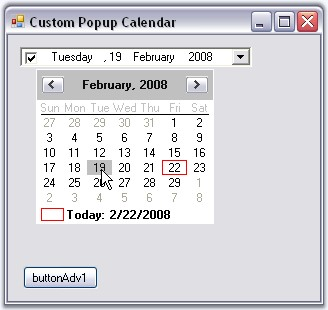{border="0"}

[]{style="COLOR: #15428b"} 

Figure 285: CustomPopup for the DateTimePickerAdv Control

[]{style="COLOR: #15428b"} 

6.   When you click the button, the DateTimePickerAdv will display the NullString specified in [NullString]{style="COLOR: black"} property.

[]{style="COLOR: #15428b"} 

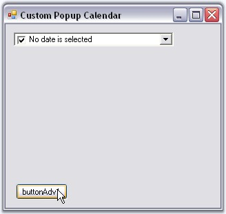{border="0"}

[]{style="COLOR: #15428b"} 

Figure 286: NullString Displayed in Text Field

[]{style="COLOR: #15428b"} 

A sample which demonstrates adding a MonthCalendarAdv itself as a custom popup calendar to the DateTimePickerAdv control is available in the below sample installation location.

 

..\\My Documents\\Syncfusion\\EssentialStudio\\***Version Number***\\Windows\\Tools.Windows\\Samples\\2.0\\Editors Package\\CalendarControls

[]{#related-topics}
::::::::::::::::::::::::::
