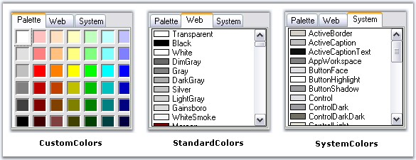
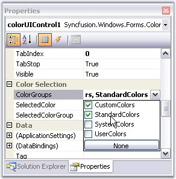
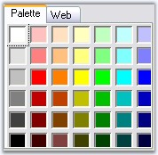
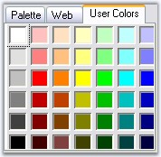
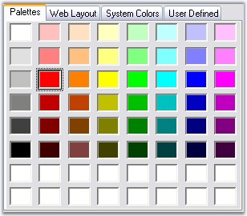

::: {style="DISPLAY: none"}
{#d2h_url_template}{#d2h_package_url style="WIDTH: 0px; DISPLAY: none; HEIGHT: 0px"}
:::

::::::: {.d2h_secondary_topic style="PADDING-BOTTOM: 10pt; MARGIN: 0pt; PADDING-LEFT: 0pt; PADDING-RIGHT: 0pt; PADDING-TOP: 0pt"}
##### Concepts and Features {#concepts-and-features style="tab-stops: 0pt"}

 

The following topics will help you become more familiar in using the ColorUI control.

[]{style="COLOR: #15428b"} 

###### []{#_Color_Groups}3.3.4.1.3.1 Color Groups {#color-groups style="tab-stops: 0pt"}

[]{#p339}[]{style="COLOR: #15428b"} 

ColorUI control has three in-built color groups which are CustomColors, StandardColor, and SystemColors. This section gives you an idea of the color groups available.

[]{style="COLOR: #15428b"} 

{border="0"}

[]{style="COLOR: #15428b"} 

Figure 291: In-Built Color Groups

[]{style="COLOR: #15428b"} 

Displaying the Color Groups

[]{style="COLOR: #15428b"} 

We can control the display of the color groups using **ColorGroups** property.

[]{style="COLOR: #15428b"} 

{border="0"}

**[]{style="COLOR: #15428b"}** 

Figure 292: ColorGroups Property

**[]{style="COLOR: #15428b"}** 

+--------------------------------------------------------------------------------------------------------------------------------------------------------------------------------------------------------------------------------------------------------------------------------------------------------------------------------------------------------------+
| **[\[C#\]]{style="FONT-FAMILY: 'Courier New'; COLOR: black"}**                                                                                                                                                                                                                                                                                               |
|                                                                                                                                                                                                                                                                                                                                                              |
| []{style="COLOR: #15428b"}                                                                                                                                                                                                                                                                                                                                   |
|                                                                                                                                                                                                                                                                                                                                                              |
| [this]{style="FONT-FAMILY: 'Courier New'; COLOR: blue"}[.colorUIControl1.ColorGroups = ((Syncfusion.Windows.Forms.[ColorUIGroups]{style="COLOR: teal"})((Syncfusion.Windows.Forms.[ColorUIGroups]{style="COLOR: teal"}.CustomColors \| Syncfusion.Windows.Forms.[ColorUIGroups]{style="COLOR: teal"}.StandardColors)));]{style="FONT-FAMILY: 'Courier New'"} |
+--------------------------------------------------------------------------------------------------------------------------------------------------------------------------------------------------------------------------------------------------------------------------------------------------------------------------------------------------------------+

[]{style="COLOR: #15428b"} 

+-----------------------------------------------------------------------------------------------------------------------------------------------------------------------------------------------------------------------------------------------------------------------------------------------------------------------------------------------+
| **[\[VB.NET\]]{style="FONT-FAMILY: 'Courier New'; COLOR: black"}**                                                                                                                                                                                                                                                                            |
|                                                                                                                                                                                                                                                                                                                                               |
| []{style="COLOR: #15428b"}                                                                                                                                                                                                                                                                                                                    |
|                                                                                                                                                                                                                                                                                                                                               |
| [Me]{style="FONT-FAMILY: 'Courier New'; COLOR: blue"}[.colorUIControl1.ColorGroups = [DirectCast]{style="COLOR: blue"}(((Syncfusion.Windows.Forms.ColorUIGroups.CustomColors [Or]{style="COLOR: blue"} Syncfusion.Windows.Forms.ColorUIGroups.StandardColors)), Syncfusion.Windows.Forms.ColorUIGroups) ]{style="FONT-FAMILY: 'Courier New'"} |
+-----------------------------------------------------------------------------------------------------------------------------------------------------------------------------------------------------------------------------------------------------------------------------------------------------------------------------------------------+

[]{style="COLOR: #15428b"} 

{border="0"}

[]{style="COLOR: #15428b"} 

Figure 293: Color Groups = \"CustomColors\" and \"StandardColor Groups\"

[]{style="COLOR: #15428b"} 

User Groups

[]{style="COLOR: #15428b"} 

ColorGroups property also let you add user groups in addition to the standard groups. The color palette for the UserGroups will be CustomColors, by default.

[]{style="COLOR: #15428b"} 

+-------------------------------------------------------------------------------------------------------------------------------------------------------------------------------------------------------------------------------------------------------------------------------------------------------------------------------------------------------------------------------------------------------------------------------------------+
| **[\[C#\]]{style="FONT-FAMILY: 'Courier New'; COLOR: black"}**                                                                                                                                                                                                                                                                                                                                                                            |
|                                                                                                                                                                                                                                                                                                                                                                                                                                           |
| []{style="COLOR: #15428b"}                                                                                                                                                                                                                                                                                                                                                                                                                |
|                                                                                                                                                                                                                                                                                                                                                                                                                                           |
| [this]{style="FONT-FAMILY: 'Courier New'; COLOR: blue"}[.colorUIControl1.ColorGroups = ((Syncfusion.Windows.Forms.[ColorUIGroups]{style="COLOR: teal"})(((Syncfusion.Windows.Forms.[ColorUIGroups]{style="COLOR: teal"}.CustomColors \| Syncfusion.Windows.Forms.[ColorUIGroups]{style="COLOR: teal"}.StandardColors)\| Syncfusion.Windows.Forms.[ColorUIGroups]{style="COLOR: teal"}.UserColors)));]{style="FONT-FAMILY: 'Courier New'"} |
+-------------------------------------------------------------------------------------------------------------------------------------------------------------------------------------------------------------------------------------------------------------------------------------------------------------------------------------------------------------------------------------------------------------------------------------------+

[]{style="COLOR: #15428b"} 

+-------------------------------------------------------------------------------------------------------------------------------------------------------------------------------------------------------------------------------------------------------------------------------------------------------------------------------------------------------------------------------------------------------------------------------+
| **[\[VB.NET\]]{style="FONT-FAMILY: 'Courier New'; COLOR: black"}**                                                                                                                                                                                                                                                                                                                                                            |
|                                                                                                                                                                                                                                                                                                                                                                                                                               |
| []{style="COLOR: black"}                                                                                                                                                                                                                                                                                                                                                                                                      |
|                                                                                                                                                                                                                                                                                                                                                                                                                               |
| [Me]{style="FONT-FAMILY: 'Courier New'; COLOR: blue"}[.colorUIControl1.ColorGroups = [DirectCast]{style="COLOR: blue"}((((Syncfusion.Windows.Forms.ColorUIGroups.CustomColors [Or]{style="COLOR: blue"}  Syncfusion.Windows.Forms.ColorUIGroups.StandardColors) [Or]{style="COLOR: blue"} Syncfusion.Windows.Forms.ColorUIGroups.UserColors)),  Syncfusion.Windows.Forms.ColorUIGroups) ]{style="FONT-FAMILY: 'Courier New'"} |
+-------------------------------------------------------------------------------------------------------------------------------------------------------------------------------------------------------------------------------------------------------------------------------------------------------------------------------------------------------------------------------------------------------------------------------+

[]{style="COLOR: #15428b"} 

{border="0"}

[]{style="COLOR: #15428b"} 

Figure 294: User Group added to ColorUIControl

**[]{style="COLOR: #15428b"}** 

::: {style="BORDER-BOTTOM: windowtext 1pt solid; BORDER-LEFT: medium none; PADDING-BOTTOM: 1pt; MARGIN-TOP: 9pt; PADDING-LEFT: 0pt; PADDING-RIGHT: 0pt; MARGIN-BOTTOM: 9pt; BORDER-TOP: windowtext 1pt solid; BORDER-RIGHT: medium none; PADDING-TOP: 1pt"}
{border="0"} Note: We can add custom text for the tabs of the Color groups. See Tab Text for details.
:::

[]{style="COLOR: #15428b"} 

::: {style="BORDER-BOTTOM: windowtext 1pt solid; BORDER-LEFT: medium none; PADDING-BOTTOM: 1pt; MARGIN-TOP: 9pt; PADDING-LEFT: 0pt; PADDING-RIGHT: 0pt; MARGIN-BOTTOM: 9pt; BORDER-TOP: windowtext 1pt solid; BORDER-RIGHT: medium none; PADDING-TOP: 1pt"}
{border="0"} Note: The Custom Color Panels and User Color Panels can be stretched according to the size of the control. Refer ColorUIControl Appearance for details.
:::

[]{style="COLOR: #15428b"} 

See Also

[]{style="COLOR: #15428b"} 

[Runtime Settings]{.UGHyperlink}[]{.UGHyperlink}

###### []{#_Tab_Text}3.3.4.1.3.2 Tab Text {#tab-text style="tab-stops: 0pt"}

[]{#p340}[]{style="COLOR: #15428b"} 

The default tab text of the ColorGroups can be set using the below properties.

[]{style="COLOR: #15428b"} 

::: {align="center"}
+-----------------------------------+----------------------------------------------------------------+
| ColorUIControl Properties         | Description                                                    |
+-----------------------------------+----------------------------------------------------------------+
| CustomTabName                     | Set the text displayed on the custom colors tab.               |
|                                   |                                                                |
|                                   | The tab name can be reset using ResetCustomTabName() method.   |
+-----------------------------------+----------------------------------------------------------------+
| StandardTabName                   | Set the text displayed on the Standard colors tab.             |
|                                   |                                                                |
|                                   | The tab name can be reset using ResetStandardTabName() method. |
+-----------------------------------+----------------------------------------------------------------+
| SystemTabName                     | Set the text displayed on the System colors tab.               |
|                                   |                                                                |
|                                   | The tab name can be reset using ResetSystemTabName() method.   |
+-----------------------------------+----------------------------------------------------------------+
| UserTabName                       | Set the text displayed on the User colors tab.                 |
|                                   |                                                                |
|                                   | The tab name can be reset using ResetUserTabName() method.     |
+-----------------------------------+----------------------------------------------------------------+
:::

**[]{style="COLOR: #15428b"}** 

+---------------------------------------------------------------------------------------------------------------------------------------------------------------------------+
| **[\[C#\]]{style="FONT-FAMILY: 'Courier New'; COLOR: black"}**                                                                                                            |
|                                                                                                                                                                           |
| []{style="COLOR: #15428b"}                                                                                                                                                |
|                                                                                                                                                                           |
| [this]{style="FONT-FAMILY: 'Courier New'; COLOR: blue"}[.colorUIControl1.StandardTabName = [\"Web Layout\"]{style="COLOR: maroon"};]{style="FONT-FAMILY: 'Courier New'"}  |
|                                                                                                                                                                           |
| [this]{style="FONT-FAMILY: 'Courier New'; COLOR: blue"}[.colorUIControl1.SystemTabName = [\"System Colors\"]{style="COLOR: maroon"};]{style="FONT-FAMILY: 'Courier New'"} |
|                                                                                                                                                                           |
| [this]{style="FONT-FAMILY: 'Courier New'; COLOR: blue"}[.colorUIControl1.UserTabName = [\"User Defined\"]{style="COLOR: maroon"};]{style="FONT-FAMILY: 'Courier New'"}    |
|                                                                                                                                                                           |
| [this]{style="FONT-FAMILY: 'Courier New'; COLOR: blue"}[.colorUIControl1.CustomTabName = [\"Palettes\"]{style="COLOR: maroon"};]{style="FONT-FAMILY: 'Courier New'"}      |
+---------------------------------------------------------------------------------------------------------------------------------------------------------------------------+

[]{style="COLOR: #15428b"} 

+------------------------------------------------------------------------------------------------------------------------------------------------------------------------+
| **[\[VB.NET\]]{style="FONT-FAMILY: 'Courier New'; COLOR: black"}**                                                                                                     |
|                                                                                                                                                                        |
| []{style="COLOR: #15428b"}                                                                                                                                             |
|                                                                                                                                                                        |
| [Me]{style="FONT-FAMILY: 'Courier New'; COLOR: blue"}[.colorUIControl1.StandardTabName = [\"Web Layout\"]{style="COLOR: maroon"}]{style="FONT-FAMILY: 'Courier New'"}  |
|                                                                                                                                                                        |
| [Me]{style="FONT-FAMILY: 'Courier New'; COLOR: blue"}[.colorUIControl1.SystemTabName = [\"System Colors\"]{style="COLOR: maroon"}]{style="FONT-FAMILY: 'Courier New'"} |
|                                                                                                                                                                        |
| [Me]{style="FONT-FAMILY: 'Courier New'; COLOR: blue"}[.colorUIControl1.UserTabName = [\"User Defined\"]{style="COLOR: maroon"}]{style="FONT-FAMILY: 'Courier New'"}    |
|                                                                                                                                                                        |
| [Me]{style="FONT-FAMILY: 'Courier New'; COLOR: blue"}[.colorUIControl1.CustomTabName = [\"Palettes\"]{style="COLOR: maroon"}]{style="FONT-FAMILY: 'Courier New'"}      |
+------------------------------------------------------------------------------------------------------------------------------------------------------------------------+

**[]{style="COLOR: #15428b"}** 

{border="0"}

**[]{style="COLOR: #15428b"}** 

Figure 295: Custom Text for Color Group Tabs

**[]{style="COLOR: #15428b"}** 

::: {style="BORDER-BOTTOM: windowtext 1pt solid; BORDER-LEFT: medium none; PADDING-BOTTOM: 1pt; MARGIN-TOP: 9pt; PADDING-LEFT: 0pt; PADDING-RIGHT: 0pt; MARGIN-BOTTOM: 9pt; BORDER-TOP: windowtext 1pt solid; BORDER-RIGHT: medium none; PADDING-TOP: 1pt"}
{border="0"} Note: We can also change the font style of the tab text using ColorUIControl.Font property.
:::

[]{#related-topics}
:::::::
