::: {style="DISPLAY: none"}
{#d2h_url_template}{#d2h_package_url style="WIDTH: 0px; DISPLAY: none; HEIGHT: 0px"}
:::

::::::::::::: {.d2h_secondary_topic style="PADDING-BOTTOM: 10pt; MARGIN: 0pt; PADDING-LEFT: 0pt; PADDING-RIGHT: 0pt; PADDING-TOP: 0pt"}
##### Concepts and Features {#concepts-and-features style="tab-stops: 0pt"}

[]{style="COLOR: #15428b"} 

The following aspects of the ColorPickerUIAdv have been discussed in this section.

[]{style="COLOR: #15428b"} 

###### []{#_Color_Groups_1}3.3.4.5.3.1 Color Groups[]{#p356} {#color-groups style="tab-stops: 0pt"}

[]{style="COLOR: #15428b"} 

The default color groups available for ColorPickerUIAdv control are listed in the below table.

[]{style="COLOR: #15428b"} 

::: {align="center"}
+-----------------------------------+------------------------------------------+
| ColorPickerUIAdv Color Groups     | Description                              |
+-----------------------------------+------------------------------------------+
| RecentGroup                       | Represents the group of recent colors.   |
|                                   |                                          |
|                                   |                                          |
+-----------------------------------+------------------------------------------+
| StandardGroup                     | Represents the group of standard colors. |
+-----------------------------------+------------------------------------------+
| ThemeGroup                        | Represents the group of theme colors.    |
+-----------------------------------+------------------------------------------+
:::

[]{style="COLOR: #15428b"} 

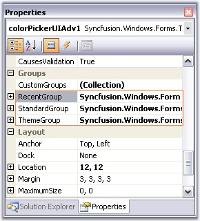{border="0"}

[]{style="COLOR: #15428b"} 

Figure 311: Color Groups for ColorPickerUIAdv Control

[]{style="COLOR: #15428b"} 

::: {style="BORDER-BOTTOM: windowtext 1pt solid; BORDER-LEFT: medium none; PADDING-BOTTOM: 1pt; MARGIN-TOP: 9pt; PADDING-LEFT: 0pt; PADDING-RIGHT: 0pt; MARGIN-BOTTOM: 9pt; BORDER-TOP: windowtext 1pt solid; BORDER-RIGHT: medium none; PADDING-TOP: 1pt"}
{border="0"} Note: You can also add custom ColorGroups apart from the above default groups. Refer Custom ColorGroups topic to know more.
:::

[]{style="COLOR: #15428b"} 

Sections of Color Groups

[]{style="COLOR: #15428b"} 

The sections of a color group is illustrated in the below image.

[]{style="COLOR: #15428b"} 

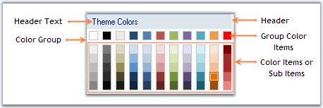{border="0"}

[]{style="COLOR: #15428b"} 

Figure 312: Sections of Color Groups

[]{style="COLOR: #15428b"} 

See Also

[]{style="COLOR: #15428b"} 

[Custom Color Groups]{.UGHyperlink}[, ]{.UGHyperlink}[Customizing the Color Groups]{.UGHyperlink}[]{.UGHyperlink}

[]{#p357}[]{#_Custom_Color_Groups}3.3.4.5.3.1.1      Custom Color Groups

[]{style="COLOR: #15428b"} 

Custom Color Groups can be added to ColorPickerUIAdv control using **CustomGroups** property. This property invokes ColorUIAdvGroup Collection Editor and lets you to add custom user groups.

[]{style="COLOR: #15428b"} 

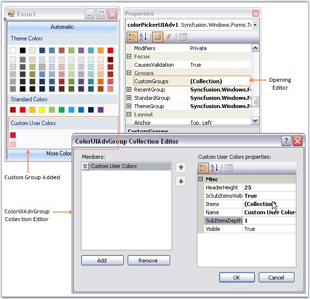{border="0"}

[]{style="COLOR: #15428b"} 

Figure 313: Custom ColorGroup added Through Designer

**[]{style="COLOR: #15428b"}** 

+------------------------------------------------------------------------------------------------------------------------------------------------------------------------------------------------------------------------------------------------------------------------------------------------------+
| **[\[C#\]]{style="FONT-FAMILY: 'Courier New'; COLOR: black"}**                                                                                                                                                                                                                                       |
|                                                                                                                                                                                                                                                                                                      |
| []{style="FONT-FAMILY: 'Courier New'; COLOR: black"}                                                                                                                                                                                                                                                 |
|                                                                                                                                                                                                                                                                                                      |
| [Syncfusion.Windows.Forms.Tools.[GroupColorItem]{style="COLOR: teal"} groupColorItem1 = [new]{style="COLOR: blue"} Syncfusion.Windows.Forms.Tools.[GroupColorItem]{style="COLOR: teal"}(colorUIAdvGroup1, System.Drawing.[Color]{style="COLOR: teal"}.Crimson);]{style="FONT-FAMILY: 'Courier New'"} |
|                                                                                                                                                                                                                                                                                                      |
| [groupColorItem1.Color = System.Drawing.[Color]{style="COLOR: teal"}.Crimson;]{style="FONT-FAMILY: 'Courier New'"}                                                                                                                                                                                   |
|                                                                                                                                                                                                                                                                                                      |
| [groupColorItem1.Index = 0;]{style="FONT-FAMILY: 'Courier New'"}                                                                                                                                                                                                                                     |
|                                                                                                                                                                                                                                                                                                      |
| [groupColorItem1.SubItems.Add([new]{style="COLOR: blue"} Syncfusion.Windows.Forms.Tools.[ColorItem]{style="COLOR: teal"}(groupColorItem1, System.Drawing.[Color]{style="COLOR: teal"}.LightPink));]{style="FONT-FAMILY: 'Courier New'"}                                                              |
|                                                                                                                                                                                                                                                                                                      |
| [colorUIAdvGroup1.Items.Add(groupColorItem1);]{style="FONT-FAMILY: 'Courier New'"}                                                                                                                                                                                                                   |
|                                                                                                                                                                                                                                                                                                      |
| [colorUIAdvGroup1.Name = [\"Custom User Colors\"]{style="COLOR: maroon"};]{style="FONT-FAMILY: 'Courier New'"}                                                                                                                                                                                       |
|                                                                                                                                                                                                                                                                                                      |
| [colorUIAdvGroup1.SubItemsDepth = 1;]{style="FONT-FAMILY: 'Courier New'"}                                                                                                                                                                                                                            |
|                                                                                                                                                                                                                                                                                                      |
| [this]{style="FONT-FAMILY: 'Courier New'; COLOR: blue"}[.colorPickerUIAdv1.CustomGroups.Add(colorUIAdvGroup1);]{style="FONT-FAMILY: 'Courier New'"}                                                                                                                                                  |
+------------------------------------------------------------------------------------------------------------------------------------------------------------------------------------------------------------------------------------------------------------------------------------------------------+

**[]{style="COLOR: #15428b"}** 

+-----------------------------------------------------------------------------------------------------------------------------------------------------------------------------------------------------------------------------------------------------------------+
| **[\[VB.NET\]]{style="FONT-FAMILY: 'Courier New'; COLOR: black"}**                                                                                                                                                                                              |
|                                                                                                                                                                                                                                                                 |
| []{style="FONT-FAMILY: 'Courier New'; COLOR: black"}                                                                                                                                                                                                            |
|                                                                                                                                                                                                                                                                 |
| [Dim]{style="FONT-FAMILY: 'Courier New'; COLOR: blue"}[ groupColorItem1 [As]{style="COLOR: blue"} [New]{style="COLOR: blue"} Syncfusion.Windows.Forms.Tools.GroupColorItem(colorUIAdvGroup1, System.Drawing.Color.Crimson)]{style="FONT-FAMILY: 'Courier New'"} |
|                                                                                                                                                                                                                                                                 |
| [groupColorItem1.Color = System.Drawing.Color.Crimson]{style="FONT-FAMILY: 'Courier New'"}                                                                                                                                                                      |
|                                                                                                                                                                                                                                                                 |
| [groupColorItem1.Index = 0]{style="FONT-FAMILY: 'Courier New'"}                                                                                                                                                                                                 |
|                                                                                                                                                                                                                                                                 |
| [groupColorItem1.SubItems.Add([New]{style="COLOR: blue"} Syncfusion.Windows.Forms.Tools.ColorItem(groupColorItem1, System.Drawing.Color.LightPink)) ]{style="FONT-FAMILY: 'Courier New'"}                                                                       |
|                                                                                                                                                                                                                                                                 |
| [colorUIAdvGroup1.Items.Add(groupColorItem1) ]{style="FONT-FAMILY: 'Courier New'"}                                                                                                                                                                              |
|                                                                                                                                                                                                                                                                 |
| [colorUIAdvGroup1.Name = [\"Custom User Colors\"]{style="COLOR: maroon"} ]{style="FONT-FAMILY: 'Courier New'"}                                                                                                                                                  |
|                                                                                                                                                                                                                                                                 |
| [colorUIAdvGroup1.SubItemsDepth = 1 ]{style="FONT-FAMILY: 'Courier New'"}                                                                                                                                                                                       |
|                                                                                                                                                                                                                                                                 |
| [Me]{style="FONT-FAMILY: 'Courier New'; COLOR: blue"}[.colorPickerUIAdv1.CustomGroups.Add(colorUIAdvGroup1) ]{style="FONT-FAMILY: 'Courier New'"}                                                                                                               |
+-----------------------------------------------------------------------------------------------------------------------------------------------------------------------------------------------------------------------------------------------------------------+

**[]{style="COLOR: #15428b"}** 

{border="0"}

**[]{style="COLOR: #15428b"}** 

Figure 314: Custom ColorGroup= \"Custom User Colors\"

**[]{style="COLOR: #15428b"}** 

::: {style="BORDER-BOTTOM: windowtext 1pt solid; BORDER-LEFT: medium none; PADDING-BOTTOM: 1pt; MARGIN-TOP: 9pt; PADDING-LEFT: 0pt; PADDING-RIGHT: 0pt; MARGIN-BOTTOM: 9pt; BORDER-TOP: windowtext 1pt solid; BORDER-RIGHT: medium none; PADDING-TOP: 1pt"}
{border="0"} Note: The properties to customize the color groups are similar to default color groups. See how to Customize the Color Groups in Customizing the Color Groups topic.

 
:::

[]{#p358}[]{#_Customizing_the_Color}3.3.4.5.3.1.2      Customizing the Color Groups

[]{style="COLOR: #15428b"} 

This section discusses the properties in the below topics, which customizes the color groups.

[]{style="COLOR: #15428b"} 

[]{#_Adding_Color_Items}3.3.4.5.3.1.2.1    Adding Color Items and sub items to Color Groups

[]{#p359} 

The below properties lets you add color items and sub items.

[]{style="COLOR: #15428b"} 

::: {align="center"}
  ----------------------------- ---------------------------------------------------------------------------------------------------------------------------------------------------------------------------------------------------------------------------------------------------
  ColorPickerUIAdv Properties   Description
  Items                         This property invokes a ColorItem Collection Editor, which lets you add the colors to the group. You can also add sub items to this particular color item using another ColorItem Collection Editor which is invoked using **SubItems** property.
  IsSubItemsVisible             Specifies if sub items should be visible.
  SubItemsDepth                 Specifies the depth of the sub items, i.e the number of sub items that can be added to a color item.
  ----------------------------- ---------------------------------------------------------------------------------------------------------------------------------------------------------------------------------------------------------------------------------------------------
:::

[]{style="COLOR: #15428b"} 

[·      ]{style="FONT-FAMILY: Symbol"}Opening ColorItem Collection Editor using **Items** property.

[]{style="COLOR: #15428b"} 

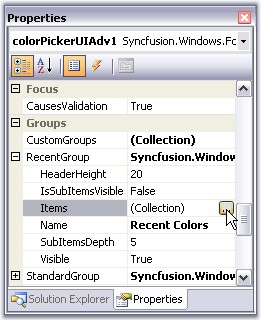{border="0"}

[]{style="COLOR: #15428b"} 

Figure 315: Accessing ColorItem Collection Editor Through Property Grid

[]{style="COLOR: #15428b"} 

[·      ]{style="FONT-FAMILY: Symbol"}Adding GroupColor items.

**[]{style="COLOR: #15428b"}** 

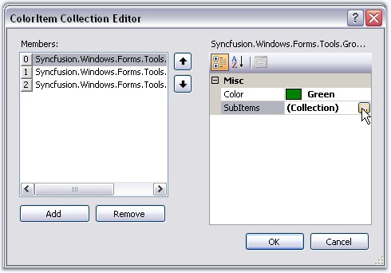{border="0"}

**[]{style="COLOR: #15428b"}** 

Figure 316: Accessing ColorItem Collection Editor using SubItems Property

**[]{style="COLOR: #15428b"}** 

[·      ]{style="FONT-FAMILY: Symbol"}Adding color / sub items to the GroupColor items.

**[]{style="COLOR: #15428b"}** 

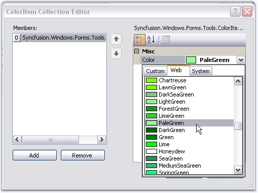{border="0"}

**[]{style="COLOR: #15428b"}** 

Figure 317: Selecting SubItem Color

**[]{style="COLOR: #15428b"}** 

+------------------------------------------------------------------------------------------------------------------------------------------------------------------------------+
| **[\[C#\]]{style="FONT-FAMILY: 'Courier New'; COLOR: black"}**                                                                                                               |
|                                                                                                                                                                              |
| []{style="FONT-FAMILY: 'Courier New'; COLOR: black"}                                                                                                                         |
|                                                                                                                                                                              |
| [this]{style="FONT-FAMILY: 'Courier New'; COLOR: blue"}[.colorPickerUIAdv1.RecentGroup.Items.Add(groupColorItem0);]{style="FONT-FAMILY: 'Courier New'"}                      |
|                                                                                                                                                                              |
| [this]{style="FONT-FAMILY: 'Courier New'; COLOR: blue"}[.colorPickerUIAdv1.RecentGroup.IsSubItemsVisible = [true]{style="COLOR: blue"};]{style="FONT-FAMILY: 'Courier New'"} |
|                                                                                                                                                                              |
| [this]{style="FONT-FAMILY: 'Courier New'; COLOR: blue"}[.colorPickerUIAdv1.RecentGroup.SubItemsDepth = 1;]{style="FONT-FAMILY: 'Courier New'"}                               |
+------------------------------------------------------------------------------------------------------------------------------------------------------------------------------+

**[]{style="COLOR: #15428b"}** 

+---------------------------------------------------------------------------------------------------------------------------------------------------------------------------+
| **[\[VB.NET\]]{style="FONT-FAMILY: 'Courier New'; COLOR: black"}**                                                                                                        |
|                                                                                                                                                                           |
| []{style="FONT-FAMILY: 'Courier New'; COLOR: black"}                                                                                                                      |
|                                                                                                                                                                           |
| [Me]{style="FONT-FAMILY: 'Courier New'; COLOR: blue"}[.colorPickerUIAdv1.RecentGroup.Items.Add(groupColorItem0)]{style="FONT-FAMILY: 'Courier New'"}                      |
|                                                                                                                                                                           |
| [Me]{style="FONT-FAMILY: 'Courier New'; COLOR: blue"}[.colorPickerUIAdv1.RecentGroup.IsSubItemsVisible = [True]{style="COLOR: blue"}]{style="FONT-FAMILY: 'Courier New'"} |
|                                                                                                                                                                           |
| [Me]{style="FONT-FAMILY: 'Courier New'; COLOR: blue"}[.colorPickerUIAdv1.RecentGroup.SubItemsDepth = 1]{style="FONT-FAMILY: 'Courier New'"}                               |
+---------------------------------------------------------------------------------------------------------------------------------------------------------------------------+

**[]{style="COLOR: #15428b"}** 

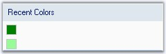{border="0"}

**[]{style="COLOR: #15428b"}** 

Figure 318: GroupColor Item and a Sub Item added to Recent Color Group

**[]{style="COLOR: #15428b"}** 

::: {style="BORDER-BOTTOM: windowtext 1pt solid; BORDER-LEFT: medium none; PADDING-BOTTOM: 1pt; MARGIN-TOP: 9pt; PADDING-LEFT: 0pt; PADDING-RIGHT: 0pt; MARGIN-BOTTOM: 9pt; BORDER-TOP: windowtext 1pt solid; BORDER-RIGHT: medium none; PADDING-TOP: 1pt"}
{border="0"} Note:[ ]{style="COLOR: black; FONT-SIZE: 8pt"}To know how to customize a color item, refer Color Items topic.
:::

[]{#p360}[]{#_Color_Items}3.3.4.5.3.1.2.2    Color Items

[]{style="COLOR: #15428b"} 

Customizing Color Items

**[]{style="COLOR: #15428b"}** 

Size of the color items can be set through **ColorItemSize** property. Default width is 13 and height is 13.

[]{style="COLOR: #15428b"} 

::: {style="BORDER-BOTTOM: windowtext 1pt solid; BORDER-LEFT: medium none; PADDING-BOTTOM: 1pt; MARGIN-TOP: 9pt; PADDING-LEFT: 0pt; PADDING-RIGHT: 0pt; MARGIN-BOTTOM: 9pt; BORDER-TOP: windowtext 1pt solid; BORDER-RIGHT: medium none; PADDING-TOP: 1pt"}
{border="0"} Note: The colors within the groups are clickable at design time and you can change the color using property grid as in the below image.
:::

[]{style="COLOR: #15428b"} 

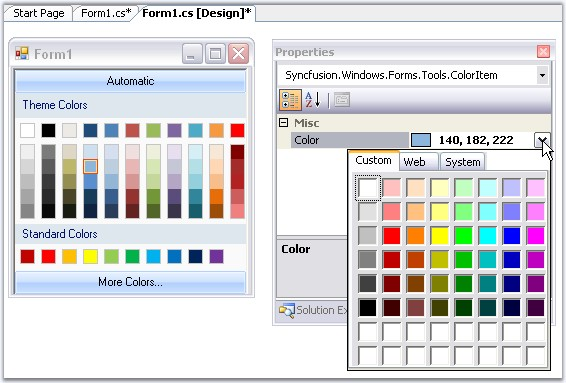{border="0"}

[]{style="COLOR: #15428b"} 

Figure 319: Changing the Color using PropertyGrid

[]{style="COLOR: #15428b"} 

+----------------------------------------------------------------------------------------------------------------------------------------------------------------------------------------------------------------+
| **[\[C#\]]{style="FONT-FAMILY: 'Courier New'; COLOR: black"}**                                                                                                                                                 |
|                                                                                                                                                                                                                |
| []{style="FONT-FAMILY: 'Courier New'; COLOR: black"}                                                                                                                                                           |
|                                                                                                                                                                                                                |
| [this]{style="FONT-FAMILY: 'Courier New'; COLOR: blue"}[.colorPickerUIAdv1.ColorItemSize = [new]{style="COLOR: blue"} System.Drawing.[Size]{style="COLOR: teal"}(20, 20);]{style="FONT-FAMILY: 'Courier New'"} |
+----------------------------------------------------------------------------------------------------------------------------------------------------------------------------------------------------------------+

**[]{style="COLOR: #15428b"}** 

+--------------------------------------------------------------------------------------------------------------------------------------------------------------------------------------------------------------+
| **[\[VB.NET\]]{style="FONT-FAMILY: 'Courier New'; COLOR: black"}**                                                                                                                                           |
|                                                                                                                                                                                                              |
| []{style="FONT-FAMILY: 'Courier New'; COLOR: blue"}                                                                                                                                                          |
|                                                                                                                                                                                                              |
| [Me]{style="FONT-FAMILY: 'Courier New'; COLOR: blue"}[.colorPickerUIAdv1.ColorItemSize = [New]{style="COLOR: blue"} System.Drawing.[Size(]{style="COLOR: black"}20, 20)]{style="FONT-FAMILY: 'Courier New'"} |
+--------------------------------------------------------------------------------------------------------------------------------------------------------------------------------------------------------------+

**[]{style="COLOR: #15428b"}** 

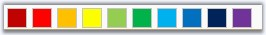{border="0"}

**[]{style="COLOR: #15428b"}** 

Figure 320: ColorItemSize = 20X20

**[]{style="COLOR: #15428b"}** 

Spacing Between Color Items

[]{style="COLOR: #15428b"} 

**HorizontalItemsSpacing** and **VerticalItemsSpacing** properties of ColorPickerUIAdv control can be used to set the horizontal and vertical spacing between the color items respectively. Default value of these properties are 4 and 0 respectively.

[]{style="COLOR: #15428b"} 

+----------------------------------------------------------------------------------------------------------------------------------------------+
| **[\[C#\]]{style="FONT-FAMILY: 'Courier New'; COLOR: black"}**                                                                               |
|                                                                                                                                              |
| []{style="FONT-FAMILY: 'Courier New'; COLOR: black"}                                                                                         |
|                                                                                                                                              |
| [this]{style="FONT-FAMILY: 'Courier New'; COLOR: blue"}[.colorPickerUIAdv1.HorizontalItemsSpacing = 15;]{style="FONT-FAMILY: 'Courier New'"} |
|                                                                                                                                              |
| [this]{style="FONT-FAMILY: 'Courier New'; COLOR: blue"}[.colorPickerUIAdv1.VerticalItemsSpacing = 15;]{style="FONT-FAMILY: 'Courier New'"}   |
+----------------------------------------------------------------------------------------------------------------------------------------------+

**[]{style="COLOR: #15428b"}** 

+-------------------------------------------------------------------------------------------------------------------------------------------+
| **[\[VB.NET\]]{style="FONT-FAMILY: 'Courier New'; COLOR: black"}**                                                                        |
|                                                                                                                                           |
| []{style="FONT-FAMILY: 'Courier New'; COLOR: blue"}                                                                                       |
|                                                                                                                                           |
| [Me]{style="FONT-FAMILY: 'Courier New'; COLOR: blue"}[.colorPickerUIAdv1.HorizontalItemsSpacing = 15]{style="FONT-FAMILY: 'Courier New'"} |
|                                                                                                                                           |
| [Me]{style="FONT-FAMILY: 'Courier New'; COLOR: blue"}[.colorPickerUIAdv1.VerticalItemsSpacing = 15]{style="FONT-FAMILY: 'Courier New'"}   |
+-------------------------------------------------------------------------------------------------------------------------------------------+

**[]{style="COLOR: #15428b"}** 

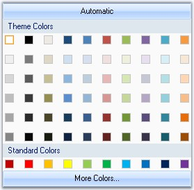{border="0"}

**[]{style="COLOR: #15428b"}** 

Figure 321: HorizontalSpacing and VerticalSpacing = 15

**[]{style="COLOR: #15428b"}** 

See Also

[]{style="COLOR: #15428b"} 

[Header Settings]{.UGHyperlink}[]{.UGHyperlink}

[]{#p361}3.3.4.5.3.1.2.3    Header Settings

[]{style="COLOR: #15428b"} 

The below properties are used to change the default appearance of the color group headers.

[]{style="COLOR: #15428b"} 

::: {align="center"}
  ------------------------ ------------------------------------------------------------------
  Color Group Properties   Description
  HeaderHeight             Sets the height for the color group header. Default value is 20.
  Name                     Sets the name of the color group, i.e, the header text.
  ------------------------ ------------------------------------------------------------------
:::

**[]{style="COLOR: #15428b"}** 

::: {align="center"}
  --------------------------- ---------------------------------------------------------------------------------------------
  ColorPickerUIAdv Property   Description
  TextAlignment               Sets the header text alignment of all the color groups. By default it is set to MiddleLeft.
  Font                        Sets the font for the header text.
  --------------------------- ---------------------------------------------------------------------------------------------
:::

[]{style="COLOR: #15428b"} 

+-----------------------------------------------------------------------------------------------------------------------------------------------------------------------------------------------------------------------------------------------------------------------------------------------------------+
| **[\[C#\]]{style="FONT-FAMILY: 'Courier New'; COLOR: black"}**                                                                                                                                                                                                                                            |
|                                                                                                                                                                                                                                                                                                           |
| []{style="FONT-FAMILY: 'Courier New'; COLOR: black"}                                                                                                                                                                                                                                                      |
|                                                                                                                                                                                                                                                                                                           |
| [//Sets header height for Theme group]{style="FONT-FAMILY: 'Courier New'; COLOR: green"}                                                                                                                                                                                                                  |
|                                                                                                                                                                                                                                                                                                           |
| [this]{style="FONT-FAMILY: 'Courier New'; COLOR: blue"}[.colorPickerUIAdv1.ThemeGroup.HeaderHeight = 25;]{style="FONT-FAMILY: 'Courier New'"}                                                                                                                                                             |
|                                                                                                                                                                                                                                                                                                           |
| [//Sets header text for Theme group]{style="FONT-FAMILY: 'Courier New'; COLOR: green"}                                                                                                                                                                                                                    |
|                                                                                                                                                                                                                                                                                                           |
| [this]{style="FONT-FAMILY: 'Courier New'; COLOR: blue"}[.colorPickerUIAdv1.ThemeGroup.Name = [\"Recent Colors\"]{style="COLOR: maroon"};]{style="FONT-FAMILY: 'Courier New'"}                                                                                                                             |
|                                                                                                                                                                                                                                                                                                           |
| [//Sets text alignment of the color group headers]{style="FONT-FAMILY: 'Courier New'; COLOR: green"}                                                                                                                                                                                                      |
|                                                                                                                                                                                                                                                                                                           |
| [this]{style="FONT-FAMILY: 'Courier New'; COLOR: blue"}[.colorPickerUIAdv1.TextAlign = System.Drawing.[ContentAlignment]{style="COLOR: teal"}.MiddleCenter;]{style="FONT-FAMILY: 'Courier New'"}                                                                                                          |
|                                                                                                                                                                                                                                                                                                           |
| [//Sets the font style for the header text]{style="FONT-FAMILY: 'Courier New'; COLOR: green"}                                                                                                                                                                                                             |
|                                                                                                                                                                                                                                                                                                           |
| [this]{style="FONT-FAMILY: 'Courier New'; COLOR: blue"}[.colorPickerUIAdv1.Font = [new]{style="COLOR: blue"} System.Drawing.[Font]{style="COLOR: teal"}([\"Microsoft Sans Serif\"]{style="COLOR: maroon"},9F, System.Drawing.[FontStyle]{style="COLOR: teal"}.Bold);]{style="FONT-FAMILY: 'Courier New'"} |
+-----------------------------------------------------------------------------------------------------------------------------------------------------------------------------------------------------------------------------------------------------------------------------------------------------------+

**[]{style="COLOR: #15428b"}** 

+----------------------------------------------------------------------------------------------------------------------------------------------------------------------------------------------------------------------------------------------------------------------------------------------------------+
| **[\[VB.NET\]]{style="FONT-FAMILY: 'Courier New'; COLOR: black"}**                                                                                                                                                                                                                                       |
|                                                                                                                                                                                                                                                                                                          |
| []{style="FONT-FAMILY: 'Courier New'; COLOR: black"}                                                                                                                                                                                                                                                     |
|                                                                                                                                                                                                                                                                                                          |
| [\'Sets header height for Theme group]{style="FONT-FAMILY: 'Courier New'; COLOR: green"}                                                                                                                                                                                                                 |
|                                                                                                                                                                                                                                                                                                          |
| [Me]{style="FONT-FAMILY: 'Courier New'; COLOR: blue"}[.colorPickerUIAdv1.ThemeGroup.HeaderHeight = 25]{style="FONT-FAMILY: 'Courier New'"}                                                                                                                                                               |
|                                                                                                                                                                                                                                                                                                          |
| [\'Sets header text for Theme group]{style="FONT-FAMILY: 'Courier New'; COLOR: green"}                                                                                                                                                                                                                   |
|                                                                                                                                                                                                                                                                                                          |
| [Me]{style="FONT-FAMILY: 'Courier New'; COLOR: blue"}[.colorPickerUIAdv1.ThemeGroup.Name = [\"Recent Colors\"]{style="COLOR: maroon"}]{style="FONT-FAMILY: 'Courier New'"}                                                                                                                               |
|                                                                                                                                                                                                                                                                                                          |
| [\'Sets text alignment of the color group headers]{style="FONT-FAMILY: 'Courier New'; COLOR: green"}                                                                                                                                                                                                     |
|                                                                                                                                                                                                                                                                                                          |
| [Me]{style="FONT-FAMILY: 'Courier New'; COLOR: blue"}[.colorPickerUIAdv1.TextAlign = System.Drawing.[ContentAlignment]{style="COLOR: black"}.MiddleCenter]{style="FONT-FAMILY: 'Courier New'"}                                                                                                           |
|                                                                                                                                                                                                                                                                                                          |
| [\'Sets the font style for the header text]{style="FONT-FAMILY: 'Courier New'; COLOR: green"}                                                                                                                                                                                                            |
|                                                                                                                                                                                                                                                                                                          |
| [Me]{style="FONT-FAMILY: 'Courier New'; COLOR: blue"}[.colorPickerUIAdv1.Font = [New]{style="COLOR: blue"} System.Drawing.[Font]{style="COLOR: black"}([\"Microsoft Sans Serif\"]{style="COLOR: maroon"},9F, System.Drawing.[FontStyle.Bold]{style="COLOR: black"})]{style="FONT-FAMILY: 'Courier New'"} |
+----------------------------------------------------------------------------------------------------------------------------------------------------------------------------------------------------------------------------------------------------------------------------------------------------------+

**[]{style="COLOR: #15428b"}** 

{border="0"}

**[]{style="COLOR: #15428b"}** 

Figure 322: ColorGroup Header with above Settings

###### []{#_ColorPickerUIAdv_Appearance}3.3.4.5.3.2 ColorPickerUIAdv Appearance {#colorpickeruiadv-appearance style="tab-stops: 0pt"}

[]{#p362}[]{style="COLOR: #15428b"} 

This section covers the below topics:

[]{style="COLOR: #15428b"} 

[]{#p363}3.3.4.5.3.2.1      Border Styles

 

Border for ColorPickerUIAdv control can be Fixed Single, Fixed3D or None, which is set using **BorderStyle** property. By default the border style is None.

[]{style="COLOR: #15428b"} 

+------------------------------------------------------------------------------------------------------------------------------------------------------------------------------------------------+
| **[\[C#\]]{style="FONT-FAMILY: 'Courier New'; COLOR: black"}**                                                                                                                                 |
|                                                                                                                                                                                                |
| []{style="FONT-FAMILY: 'Courier New'; COLOR: black"}                                                                                                                                           |
|                                                                                                                                                                                                |
| [this]{style="FONT-FAMILY: 'Courier New'; COLOR: blue"}[.colorPickerUIAdv1.BorderStyle = System.Windows.Forms.[BorderStyle]{style="COLOR: teal"}.Fixed3D;]{style="FONT-FAMILY: 'Courier New'"} |
+------------------------------------------------------------------------------------------------------------------------------------------------------------------------------------------------+

**[]{style="COLOR: #15428b"}** 

+----------------------------------------------------------------------------------------------------------------------------------------------------------------------------------------------+
| **[\[VB.NET\]]{style="FONT-FAMILY: 'Courier New'; COLOR: black"}**                                                                                                                           |
|                                                                                                                                                                                              |
| []{style="FONT-FAMILY: 'Courier New'; COLOR: black"}                                                                                                                                         |
|                                                                                                                                                                                              |
| [Me]{style="FONT-FAMILY: 'Courier New'; COLOR: blue"}[.colorPickerUIAdv1.BorderStyle = System.Windows.Forms.[BorderStyle.]{style="COLOR: black"}Fixed3D]{style="FONT-FAMILY: 'Courier New'"} |
+----------------------------------------------------------------------------------------------------------------------------------------------------------------------------------------------+

[]{style="COLOR: #15428b"} 

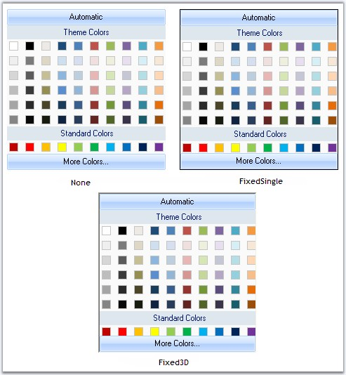{border="0"}

[]{style="COLOR: #15428b"} 

Figure 323: BorderStyles for ColorPickerUIAdv

**[]{style="COLOR: #15428b"}** 

See Also

[]{style="COLOR: #15428b"} 

[Style Settings]{.UGHyperlink}[]{.UGHyperlink}

[]{#p364}3.3.4.5.3.2.2      Style Settings

[]{style="COLOR: #15428b"} 

The appearance and behavior settings, available for the ColorPickerUIAdv are discussed in this section.

 

By default ColorPickerUIAdv control has Office2007 look and feel.

[]{style="COLOR: #15428b"} 

::: {align="center"}
  ----------------------------- ------------------------------------------------------------------------------------------
  ColorPickerUIAdv Properties   Description
  UseOffice2007Style            Office 2007 style can be enabled or disabled using this property. By default it is true.
  Office2007Theme               Sets the color scheme for the Office2007 Style.
  ----------------------------- ------------------------------------------------------------------------------------------
:::

[]{style="COLOR: #15428b"} 

+--------------------------------------------------------------------------------------------------------------------------------------------------+
| **[\[C#\]]{style="FONT-FAMILY: 'Courier New'; COLOR: black"}**                                                                                   |
|                                                                                                                                                  |
| []{style="FONT-FAMILY: 'Courier New'; COLOR: black"}                                                                                             |
|                                                                                                                                                  |
| [colorPickerUIAdv1.UseOffice2007Style = [true]{style="COLOR: blue"};]{style="FONT-FAMILY: 'Courier New'"}                                        |
|                                                                                                                                                  |
| []{style="FONT-FAMILY: 'Courier New'"}                                                                                                           |
|                                                                                                                                                  |
| [//Sets Office2007 Black color Theme]{style="FONT-FAMILY: 'Courier New'; COLOR: green"}                                                          |
|                                                                                                                                                  |
| [colorPickerUIAdv1.Office2007Theme = Syncfusion.Windows.Forms.[Office2007Theme]{style="COLOR: teal"}.Black;]{style="FONT-FAMILY: 'Courier New'"} |
+--------------------------------------------------------------------------------------------------------------------------------------------------+

**[]{style="COLOR: #15428b"}** 

+-------------------------------------------------------------------------------------------------------------------------------------------------------------------------------------+
| **[\[VB.NET\]]{style="FONT-FAMILY: 'Courier New'; COLOR: black"}**                                                                                                                  |
|                                                                                                                                                                                     |
| []{style="FONT-FAMILY: 'Courier New'; COLOR: black"}                                                                                                                                |
|                                                                                                                                                                                     |
| [colorPickerUIAdv1.UseOffice2007Style = [True]{style="COLOR: blue"}]{style="FONT-FAMILY: 'Courier New'"}                                                                            |
|                                                                                                                                                                                     |
| []{style="FONT-FAMILY: 'Courier New'; COLOR: blue"}                                                                                                                                 |
|                                                                                                                                                                                     |
| [\'Sets Office2007 Black color Theme]{style="FONT-FAMILY: 'Courier New'; COLOR: green"}                                                                                             |
|                                                                                                                                                                                     |
| [Private]{style="FONT-FAMILY: 'Courier New'; COLOR: blue"}[ colorPickerUIAdv1.Office2007Theme = Syncfusion.Windows.Forms.Office2007Theme.Black]{style="FONT-FAMILY: 'Courier New'"} |
+-------------------------------------------------------------------------------------------------------------------------------------------------------------------------------------+

[]{style="COLOR: #15428b"} 

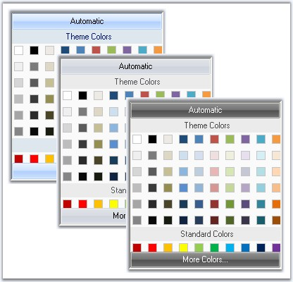{border="0"}

[]{style="COLOR: #15428b"} 

Figure 324: Blue, Silver and Black Color schemes of ColorPickerUIAdv

[]{style="COLOR: #15428b"} 

The Office2007 Visual Styles can be turned off by setting the **UseOffice2007Style** property to false.

[]{style="COLOR: #15428b"} 

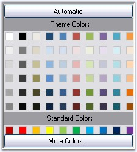{border="0"}

**[]{style="COLOR: #15428b"}** 

Figure 325: ColorPickerUIAdv with Office2007 Style Turned Off

**[]{style="COLOR: #15428b"}** 

Custom Colors

[]{style="COLOR: #15428b"} 

We can also apply custom colors to the ColorPickerUIAdv control by setting Office2007Theme to \"Managed\" and specifying the custom color through the **ApplyManagedColors** method as follows.

[]{style="COLOR: #15428b"} 

+------------------------------------------------------------------------------------------------------------------------------------------------------------------------------------------------------------+
| **[\[C#\]]{style="FONT-FAMILY: 'Courier New'; COLOR: black"}**                                                                                                                                             |
|                                                                                                                                                                                                            |
| []{style="COLOR: #15428b"}                                                                                                                                                                                 |
|                                                                                                                                                                                                            |
| [this]{style="FONT-FAMILY: 'Courier New'; COLOR: blue"}[.colorPickerUIAdv1.Office2007Theme = Syncfusion.Windows.Forms.[Office2007Theme]{style="COLOR: teal"}.Managed;]{style="FONT-FAMILY: 'Courier New'"} |
|                                                                                                                                                                                                            |
| [Office2007Colors]{style="FONT-FAMILY: 'Courier New'; COLOR: teal"}[.ApplyManagedColors([this]{style="COLOR: blue"}, [Color]{style="COLOR: teal"}.Orange);]{style="FONT-FAMILY: 'Courier New'"}            |
+------------------------------------------------------------------------------------------------------------------------------------------------------------------------------------------------------------+

[]{style="COLOR: #15428b"} 

+-----------------------------------------------------------------------------------------------------------------------------------------------------------------------------------------------------------+
| **[\[VB.NET\]]{style="FONT-FAMILY: 'Courier New'; COLOR: black"}**                                                                                                                                        |
|                                                                                                                                                                                                           |
| []{style="COLOR: #15428b"}                                                                                                                                                                                |
|                                                                                                                                                                                                           |
| [Me]{style="FONT-FAMILY: 'Courier New'; COLOR: blue"}[.colorPickerUIAdv1.Office2007Theme = Syncfusion.Windows.Forms.[Office2007Theme]{style="COLOR: black"}.Managed;]{style="FONT-FAMILY: 'Courier New'"} |
|                                                                                                                                                                                                           |
| [Office2007Colors.]{style="FONT-FAMILY: 'Courier New'; COLOR: black"}[ApplyManagedColors([Me]{style="COLOR: blue"}, [Color]{style="COLOR: black"}.Orange)]{style="FONT-FAMILY: 'Courier New'"}            |
+-----------------------------------------------------------------------------------------------------------------------------------------------------------------------------------------------------------+

[]{style="COLOR: #15428b"} 

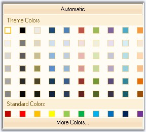{border="0"}

[]{style="COLOR: #15428b"} 

Figure 326: Custom Color = \"Orange\"

###### []{#p365}[]{#_Runtime_Selection}3.3.4.5.3.3 Runtime Selection {#runtime-selection style="tab-stops: 0pt"}

[]{style="COLOR: #15428b"} 

The ColorPickerUIAdv control at run time provides a Color dialog, using which we can select and add colors to the color groups.

[]{style="COLOR: #15428b"} 

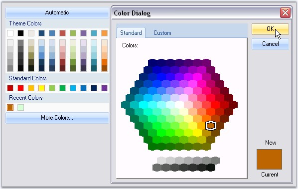{border="0"}

[]{style="COLOR: #15428b"} 

Figure 327: Adding Color Through Color Dialog at Run Time

[]{style="COLOR: #15428b"} 

Color Selection at run time

[]{style="COLOR: #15428b"} 

Automatic color that has to be selected, when Automatic button is clicked at run time, is set through **AutomaticColor** property. Default color is black.

[]{style="COLOR: #15428b"} 

+-----------------------------------------------------------------------------------------------------------------------------------------------------------------------------------------+
| **[\[C#\]]{style="FONT-FAMILY: 'Courier New'; COLOR: black"}**                                                                                                                          |
|                                                                                                                                                                                         |
| []{style="FONT-FAMILY: 'Courier New'; COLOR: black"}                                                                                                                                    |
|                                                                                                                                                                                         |
| [this]{style="FONT-FAMILY: 'Courier New'; COLOR: blue"}[.colorPickerUIAdv1.AutomaticColor = System.Drawing.[Color]{style="COLOR: teal"}.OrangeRed;]{style="FONT-FAMILY: 'Courier New'"} |
+-----------------------------------------------------------------------------------------------------------------------------------------------------------------------------------------+

**[]{style="COLOR: #15428b"}** 

+-------------------------------------------------------------------------------------------------------------------------------------------------------------------------------------------------------------------------------+
| **[\[VB.NET\]]{style="FONT-FAMILY: 'Courier New'; COLOR: black"}**                                                                                                                                                            |
|                                                                                                                                                                                                                               |
| []{style="FONT-FAMILY: 'Courier New'; COLOR: blue"}                                                                                                                                                                           |
|                                                                                                                                                                                                                               |
| [Me]{style="FONT-FAMILY: 'Courier New'; COLOR: blue"}[.colorPickerUIAdv1.AutomaticColor = System.Drawing.]{style="FONT-FAMILY: 'Courier New'"}[Color]{style="COLOR: #15428b"}[.OrangeRed]{style="FONT-FAMILY: 'Courier New'"} |
+-------------------------------------------------------------------------------------------------------------------------------------------------------------------------------------------------------------------------------+

**[]{style="COLOR: #15428b"}** 

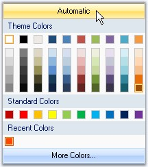{border="0"}

**[]{style="COLOR: #15428b"}** 

Figure 328: AutomaticColor = \"OrangeRed\"

**[]{style="COLOR: #15428b"}** 

::: {style="BORDER-BOTTOM: windowtext 1pt solid; BORDER-LEFT: medium none; PADDING-BOTTOM: 1pt; MARGIN-TOP: 9pt; PADDING-LEFT: 0pt; PADDING-RIGHT: 0pt; MARGIN-BOTTOM: 9pt; BORDER-TOP: windowtext 1pt solid; BORDER-RIGHT: medium none; PADDING-TOP: 1pt"}
{border="0"} Note:[ ]{style="COLOR: black; FONT-SIZE: 8pt"}Height of this Automatic button can be specified in ColorPickerUIAdv.ButtonHeight property. Default value is 23.
:::

[]{#related-topics}
:::::::::::::
