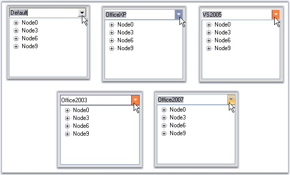
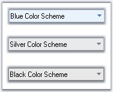

::: {style="DISPLAY: none"}
{#d2h_url_template}{#d2h_package_url style="WIDTH: 0px; DISPLAY: none; HEIGHT: 0px"}
:::

::::::: {.d2h_secondary_topic style="PADDING-BOTTOM: 10pt; MARGIN: 0pt; PADDING-LEFT: 0pt; PADDING-RIGHT: 0pt; PADDING-TOP: 0pt"}
##### Concepts and Features {#concepts-and-features style="tab-stops: 0pt"}

[]{style="COLOR: #15428b"} 

The following topics will help you become more familiar in using the ComboDropDown control.

[]{style="COLOR: #15428b"} 

###### []{#p376}[]{#_ComboDropDown_Text}3.3.5.1.3.1 ComboDropDown Text {#combodropdown-text style="tab-stops: 0pt"}

[]{style="COLOR: #15428b"} 

ComboDropDown control supports the properties which can change the appearance and behavior of the control\'s edit portion.

[]{style="COLOR: #15428b"} 

{border="0"}

[]{style="COLOR: #15428b"} 

Figure 334: Control\'s Edit Portion

[]{style="COLOR: #15428b"} 

::: {align="center"}
  -------------------------- ---------------------------------------------------------------------------------------------------------------------------------------------------
  ComboDropDown Properties   Description
  CharacterCasing            Specifies the ComboDropDown control modifies the case of characters when they are typed in the edit portion.
  NumberOnly                 Specifies whether the user should be forced to enter only numbers in the edit portion of ComboDropDown.
  ReadOnly                   Specifies whether the text in the edit portion of ComboDropDown should be set to read-only or can be changed. By default it will be set to false.
  -------------------------- ---------------------------------------------------------------------------------------------------------------------------------------------------
:::

[]{style="COLOR: #15428b"} 

+----------------------------------------------------------------------------------------------------------------------------------------------------------------------------+
| **[\[C#\]]{style="FONT-FAMILY: 'Courier New'; COLOR: black"}**                                                                                                             |
|                                                                                                                                                                            |
| []{style="FONT-FAMILY: 'Courier New'; COLOR: blue"}                                                                                                                        |
|                                                                                                                                                                            |
| [this]{style="FONT-FAMILY: 'Courier New'; COLOR: blue"}[.comboDropDown1.CharacterCasing = System.Windows.Forms.CharacterCasing.Upper;]{style="FONT-FAMILY: 'Courier New'"} |
|                                                                                                                                                                            |
| [this]{style="FONT-FAMILY: 'Courier New'; COLOR: blue"}[.comboDropDown1.NumberOnly = [true]{style="COLOR: blue"};]{style="FONT-FAMILY: 'Courier New'"}                     |
|                                                                                                                                                                            |
| [this]{style="FONT-FAMILY: 'Courier New'; COLOR: blue"}[.comboDropDown1.ReadOnly = [true]{style="COLOR: blue"};]{style="FONT-FAMILY: 'Courier New'"}                       |
|                                                                                                                                                                            |
| []{style="FONT-FAMILY: 'Courier New'"}                                                                                                                                     |
|                                                                                                                                                                            |
| [this]{style="FONT-FAMILY: 'Courier New'; COLOR: blue"}[.comboDropDown1.CaseSensitiveAutocomplete = [false]{style="COLOR: blue"};]{style="FONT-FAMILY: 'Courier New'"}     |
|                                                                                                                                                                            |
| [this]{style="FONT-FAMILY: 'Courier New'; COLOR: blue"}[.comboDropDown1.MatchFirstCharacterOnly = [false]{style="COLOR: blue"};]{style="FONT-FAMILY: 'Courier New'"}       |
+----------------------------------------------------------------------------------------------------------------------------------------------------------------------------+

[]{style="COLOR: #15428b"} 

+-------------------------------------------------------------------------------------------------------------------------------------------------------------------------+
| **[\[VB.NET\]]{style="FONT-FAMILY: 'Courier New'; COLOR: black"}**                                                                                                      |
|                                                                                                                                                                         |
| []{style="FONT-FAMILY: 'Courier New'; COLOR: blue"}                                                                                                                     |
|                                                                                                                                                                         |
| [Me]{style="FONT-FAMILY: 'Courier New'; COLOR: blue"}[.comboDropDown1.CharacterCasing = System.Windows.Forms.CharacterCasing.Upper]{style="FONT-FAMILY: 'Courier New'"} |
|                                                                                                                                                                         |
| [Me]{style="FONT-FAMILY: 'Courier New'; COLOR: blue"}[.comboDropDown1.NumberOnly = [True]{style="COLOR: blue"}]{style="FONT-FAMILY: 'Courier New'"}                     |
|                                                                                                                                                                         |
| [Me]{style="FONT-FAMILY: 'Courier New'; COLOR: blue"}[.comboDropDown1.ReadOnly = [True]{style="COLOR: blue"}]{style="FONT-FAMILY: 'Courier New'"}                       |
|                                                                                                                                                                         |
| []{style="FONT-FAMILY: 'Courier New'; COLOR: blue"}                                                                                                                     |
|                                                                                                                                                                         |
| [Me]{style="FONT-FAMILY: 'Courier New'; COLOR: blue"}[.comboDropDown1.CaseSensitiveAutocomplete = [False]{style="COLOR: blue"}]{style="FONT-FAMILY: 'Courier New'"}     |
|                                                                                                                                                                         |
| [Me]{style="FONT-FAMILY: 'Courier New'; COLOR: blue"}[.comboDropDown1.MatchFirstCharacterOnly = [False]{style="COLOR: blue"}]{style="FONT-FAMILY: 'Courier New'"}       |
+-------------------------------------------------------------------------------------------------------------------------------------------------------------------------+

[]{style="COLOR: #15428b"} 

Banner Text Support

[]{style="COLOR: #15428b"} 

We can set banner text for the ComboBoxDropDown control. Refer [[BannerTextProvider Component]{.UGHyperlink}](../../../../../../../../Documents%20and%20Settings/sindhujamj/Desktop/D2H/ui/windows/tools/Documents/Tools%20-%20Part%202.docx#BannerTextProviderComponent) topic for more details.

 

{border="0"}

[]{style="COLOR: #15428b"} 

Figure 335: Banner Text set for ComboDropDown

###### []{#p377}[]{#_ComboDropDown_Appearance}3.3.5.1.3.2 ComboDropDown Appearance {#combodropdown-appearance style="tab-stops: 0pt"}

[]{style="COLOR: #15428b"} 

This section discusses the appearance settings for ComboDropDown control.

[]{style="COLOR: #15428b"} 

Border Styles

[]{style="COLOR: #15428b"} 

The below properties lets you set 3D border style for the control.

[]{style="COLOR: #15428b"} 

::: {align="center"}
+-----------------------------------+--------------------------------------------------------------------------------------+
| Properties                        | Description                                                                          |
+-----------------------------------+--------------------------------------------------------------------------------------+
| Border3DStyle                     | Sets the 3D border style for the control. The options are,                           |
|                                   |                                                                                      |
|                                   | *[]{style="COLOR: black"}*                                                           |
|                                   |                                                                                      |
|                                   | [·      ]{style="FONT-FAMILY: Symbol"}*RaisedOuter*                                  |
|                                   |                                                                                      |
|                                   | [·      ]{style="FONT-FAMILY: Symbol"}*RaisedInner*                                  |
|                                   |                                                                                      |
|                                   | [·      ]{style="FONT-FAMILY: Symbol"}*SunkenOuter*                                  |
|                                   |                                                                                      |
|                                   | [·      ]{style="FONT-FAMILY: Symbol"}*SunkenInner*                                  |
|                                   |                                                                                      |
|                                   | [·      ]{style="FONT-FAMILY: Symbol"}*Raised*                                       |
|                                   |                                                                                      |
|                                   | [·      ]{style="FONT-FAMILY: Symbol"}*Sunken*                                       |
|                                   |                                                                                      |
|                                   | [·      ]{style="FONT-FAMILY: Symbol"}*Etched*                                       |
|                                   |                                                                                      |
|                                   | [·      ]{style="FONT-FAMILY: Symbol"}*Flat*                                         |
|                                   |                                                                                      |
|                                   | [·      ]{style="FONT-FAMILY: Symbol"}*Adjust*                                       |
|                                   |                                                                                      |
|                                   | [·      ]{style="FONT-FAMILY: Symbol"}*Bump*                                         |
|                                   |                                                                                      |
|                                   | *[]{style="COLOR: black"}*                                                           |
|                                   |                                                                                      |
|                                   | FlatStyle property should be set to Standard to effect this settings.                |
+-----------------------------------+--------------------------------------------------------------------------------------+
| BorderSides                       | Specifies the sides of the control which should have border.                         |
+-----------------------------------+--------------------------------------------------------------------------------------+
| FlatStyle                         | Specifies the flat style to be applied to the ComboDropDown control. The styles are, |
|                                   |                                                                                      |
|                                   |                                                                                      |
|                                   |                                                                                      |
|                                   | Flat - The control and the button appear flat.                                       |
|                                   |                                                                                      |
|                                   | System - Appearance based on the OS used and                                         |
|                                   |                                                                                      |
|                                   | Standard - The control and button appears three-dimensional.                         |
+-----------------------------------+--------------------------------------------------------------------------------------+
| FlatBorderColor                   | Specifies the border color for the control, when FlatStyle is set to \"Flat\".       |
+-----------------------------------+--------------------------------------------------------------------------------------+
:::

[]{style="COLOR: #15428b"} 

+-----------------------------------------------------------------------------------------------------------------------------------------------------------------------------------------------------+
| **[\[C#\]]{style="FONT-FAMILY: 'Courier New'; COLOR: black"}**                                                                                                                                      |
|                                                                                                                                                                                                     |
| []{style="FONT-FAMILY: 'Courier New'; COLOR: black"}                                                                                                                                                |
|                                                                                                                                                                                                     |
| [this]{style="FONT-FAMILY: 'Courier New'; COLOR: blue"}[.comboDropDown1.Border3DStyle = System.Windows.Forms.[Border3DStyle]{style="COLOR: teal"}.RaisedInner;]{style="FONT-FAMILY: 'Courier New'"} |
|                                                                                                                                                                                                     |
| [this]{style="FONT-FAMILY: 'Courier New'; COLOR: blue"}[.comboDropDown1.BorderSides = System.Windows.Forms.[Border3DSide]{style="COLOR: teal"}.All;]{style="FONT-FAMILY: 'Courier New'"}            |
+-----------------------------------------------------------------------------------------------------------------------------------------------------------------------------------------------------+

[]{style="COLOR: #15428b"} 

+---------------------------------------------------------------------------------------------------------------------------------------------------------------------------------------------------+
| **[\[VB.NET\]]{style="FONT-FAMILY: 'Courier New'; COLOR: black"}**                                                                                                                                |
|                                                                                                                                                                                                   |
| []{style="FONT-FAMILY: 'Courier New'; COLOR: black"}                                                                                                                                              |
|                                                                                                                                                                                                   |
| [Me]{style="FONT-FAMILY: 'Courier New'; COLOR: blue"}[.comboDropDown1.Border3DStyle = System.Windows.Forms.[Border3DStyle]{style="COLOR: black"}.RaisedInner]{style="FONT-FAMILY: 'Courier New'"} |
|                                                                                                                                                                                                   |
| [Me]{style="FONT-FAMILY: 'Courier New'; COLOR: blue"}[.comboDropDown1.BorderSides = System.Windows.Forms.[Border3DSide]{style="COLOR: black"}.All]{style="FONT-FAMILY: 'Courier New'"}            |
+---------------------------------------------------------------------------------------------------------------------------------------------------------------------------------------------------+

[]{style="COLOR: #15428b"} 

{border="0"}

[]{style="COLOR: #15428b"} 

Figure 336: Border3DStyle = \"RaisedInner\"; BorderSides = \"All\"

**[]{style="COLOR: #15428b"}** 

::: {style="BORDER-BOTTOM: windowtext 1pt solid; BORDER-LEFT: medium none; PADDING-BOTTOM: 1pt; MARGIN-TOP: 9pt; PADDING-LEFT: 0pt; PADDING-RIGHT: 0pt; MARGIN-BOTTOM: 9pt; BORDER-TOP: windowtext 1pt solid; BORDER-RIGHT: medium none; PADDING-TOP: 1pt"}
{border="0"} Note: ComboDropDown.Style property should be set to Default to effect the above settings. See Themes and Styles topic.
:::

###### []{#_Themes_And_Styles_1}3.3.5.1.3.3 Themes And Styles {#themes-and-styles style="tab-stops: 0pt"}

[]{#p378}[]{style="COLOR: #15428b"} 

The below given properties enhances the look and feel of the ComboDropDown.

[]{style="COLOR: #15428b"} 

::: {align="center"}
+-----------------------------------+---------------------------------------------------------------------------------------------------------------------+
| ComboDropDown Properties          | Description                                                                                                         |
+-----------------------------------+---------------------------------------------------------------------------------------------------------------------+
| IgnoreThemeBackground             | Specifies whether the control will ignore the theme\'s background color and draw the backcolor instead.             |
+-----------------------------------+---------------------------------------------------------------------------------------------------------------------+
| Style                             | Specifies advanced appearance and behavior of the ComboDropDown. The default value is \'Default\'. The options are, |
|                                   |                                                                                                                     |
|                                   |                                                                                                                     |
|                                   |                                                                                                                     |
|                                   | *Default,*                                                                                                          |
|                                   |                                                                                                                     |
|                                   | *OfficeXP,*                                                                                                         |
|                                   |                                                                                                                     |
|                                   | *Office2003,*                                                                                                       |
|                                   |                                                                                                                     |
|                                   | *VS2005 and*                                                                                                        |
|                                   |                                                                                                                     |
|                                   | *Office2007.*                                                                                                       |
+-----------------------------------+---------------------------------------------------------------------------------------------------------------------+
:::

[]{style="COLOR: #15428b"} 

+----------------------------------------------------------------------------------------------------------------------------------------------------------------------------------------------------------------------------------------------+
| **[\[C#\]]{style="FONT-FAMILY: 'Courier New'; COLOR: black"}**                                                                                                                                                                               |
|                                                                                                                                                                                                                                              |
| **[]{style="FONT-FAMILY: 'Courier New'; COLOR: black"}**                                                                                                                                                                                     |
|                                                                                                                                                                                                                                              |
| [this]{style="FONT-FAMILY: 'Courier New'; COLOR: blue"}[.comboDropDown1.IgnoreThemeBackground = [true]{style="COLOR: blue"};]{style="FONT-FAMILY: 'Courier New'"}                                                                            |
|                                                                                                                                                                                                                                              |
| []{style="COLOR: #15428b"}                                                                                                                                                                                                                   |
|                                                                                                                                                                                                                                              |
| [//To set Default Visual Style]{style="FONT-FAMILY: 'Courier New'; COLOR: green"}                                                                                                                                                            |
|                                                                                                                                                                                                                                              |
| [this]{style="FONT-FAMILY: 'Courier New'; COLOR: blue"}[.comboDropDown1.Style = Syncfusion.Windows.Forms.[VisualStyle]{style="COLOR: teal"}.Default;]{style="FONT-FAMILY: 'Courier New'"}                                                    |
|                                                                                                                                                                                                                                              |
| [//To set Office2003 Visual Style]{style="FONT-FAMILY: 'Courier New'; COLOR: green"}                                                                                                                                                         |
|                                                                                                                                                                                                                                              |
| [this]{style="FONT-FAMILY: 'Courier New'; COLOR: blue"}[.comboDropDown1.Style = Syncfusion.Windows.Forms.[VisualStyle]{style="COLOR: teal"}.Office2003;]{style="FONT-FAMILY: 'Courier New'"}                                                 |
|                                                                                                                                                                                                                                              |
| [//To set OfficeXP Visual Style]{style="FONT-FAMILY: 'Courier New'; COLOR: green"}                                                                                                                                                           |
|                                                                                                                                                                                                                                              |
| [this]{style="FONT-FAMILY: 'Courier New'; COLOR: blue"}[.comboDropDown1.Style = Syncfusion.Windows.Forms.[VisualStyle]{style="COLOR: teal"}.OfficeXP;]{style="FONT-FAMILY: 'Courier New'"}                                                   |
|                                                                                                                                                                                                                                              |
| [//To set VS2005 Visual Style]{style="FONT-FAMILY: 'Courier New'; COLOR: green"}                                                                                                                                                             |
|                                                                                                                                                                                                                                              |
| [this]{style="FONT-FAMILY: 'Courier New'; COLOR: blue"}[.comboDropDown1.Style = Syncfusion.Windows.Forms.[VisualStyle]{style="COLOR: teal"}.VS2005;]{style="FONT-FAMILY: 'Courier New'"}                                                     |
|                                                                                                                                                                                                                                              |
| [//To set Office2007 Visual Style]{style="FONT-FAMILY: 'Courier New'; COLOR: green"}                                                                                                                                                         |
|                                                                                                                                                                                                                                              |
| [this]{style="FONT-FAMILY: 'Courier New'; COLOR: blue"}[.comboDropDown1.Style = Syncfusion.Windows.Forms.[VisualStyle]{style="COLOR: teal"}.Office2007;]{style="FONT-FAMILY: 'Courier New'"}[          ]{style="FONT-FAMILY: 'Courier New'"} |
+----------------------------------------------------------------------------------------------------------------------------------------------------------------------------------------------------------------------------------------------+

[]{style="COLOR: #15428b"} 

+--------------------------------------------------------------------------------------------------------------------------------------------------------------------+
| **[\[VB\]]{style="FONT-FAMILY: 'Courier New'; COLOR: black"}**                                                                                                     |
|                                                                                                                                                                    |
| **[]{style="FONT-FAMILY: 'Courier New'; COLOR: black"}**                                                                                                           |
|                                                                                                                                                                    |
| [Me]{style="FONT-FAMILY: 'Courier New'; COLOR: blue"}[.comboDropDown1.IgnoreThemeBackground = [True]{style="COLOR: blue"}]{style="FONT-FAMILY: 'Courier New'"}     |
|                                                                                                                                                                    |
| []{style="FONT-FAMILY: 'Courier New'; COLOR: blue"}                                                                                                                |
|                                                                                                                                                                    |
| [\'To set Default Visual Style]{style="FONT-FAMILY: 'Courier New'; COLOR: green"}                                                                                  |
|                                                                                                                                                                    |
| [Me]{style="FONT-FAMILY: 'Courier New'; COLOR: blue"}[.comboDropDown1.Style = Syncfusion.Windows.Forms.VisualStyle.Default]{style="FONT-FAMILY: 'Courier New'"}    |
|                                                                                                                                                                    |
| [\'To set Office2003 Visual Style]{style="FONT-FAMILY: 'Courier New'; COLOR: green"}                                                                               |
|                                                                                                                                                                    |
| [Me]{style="FONT-FAMILY: 'Courier New'; COLOR: blue"}[.comboDropDown1.Style = Syncfusion.Windows.Forms.VisualStyle.Office2003]{style="FONT-FAMILY: 'Courier New'"} |
|                                                                                                                                                                    |
| [\'To set OfficeXP Visual Style]{style="FONT-FAMILY: 'Courier New'; COLOR: green"}                                                                                 |
|                                                                                                                                                                    |
| [Me]{style="FONT-FAMILY: 'Courier New'; COLOR: blue"}[.comboDropDown1.Style = Syncfusion.Windows.Forms.VisualStyle.OfficeXP]{style="FONT-FAMILY: 'Courier New'"}   |
|                                                                                                                                                                    |
| [\'To set VS2005 Visual Style]{style="FONT-FAMILY: 'Courier New'; COLOR: green"}                                                                                   |
|                                                                                                                                                                    |
| [Me]{style="FONT-FAMILY: 'Courier New'; COLOR: blue"}[.comboDropDown1.Style = Syncfusion.Windows.Forms.VisualStyle.VS2005]{style="FONT-FAMILY: 'Courier New'"}     |
|                                                                                                                                                                    |
| [\'To set Office2007 Visual Style]{style="FONT-FAMILY: 'Courier New'; COLOR: green"}                                                                               |
|                                                                                                                                                                    |
| [Me]{style="FONT-FAMILY: 'Courier New'; COLOR: blue"}[.comboDropDown1.Style = Syncfusion.Windows.Forms.VisualStyle.Office2007]{style="FONT-FAMILY: 'Courier New'"} |
+--------------------------------------------------------------------------------------------------------------------------------------------------------------------+

[]{style="COLOR: #15428b"} 

{border="0"}

[]{style="COLOR: #15428b"} 

Figure 337: Styles for ComboDropDown Control

[]{style="COLOR: #15428b"} 

Office Color Schemes

**[]{style="COLOR: #15428b"}** 

The ComboDropDown control supports blue, silver and black office colors scheme. It is set using **Office2007ColorTheme** property. **Style** property should be set to Office2007.

[]{style="COLOR: #15428b"} 

+------------------------------------------------------------------------------------------------------------------------------------------------------------------------------------------------------------------------------------------------------------------+
| **[\[C#\]]{style="FONT-FAMILY: 'Courier New'; COLOR: black"}**                                                                                                                                                                                                   |
|                                                                                                                                                                                                                                                                  |
| **[]{style="FONT-FAMILY: 'Courier New'; COLOR: black"}**                                                                                                                                                                                                         |
|                                                                                                                                                                                                                                                                  |
| [//To set Blue Color scheme]{style="FONT-FAMILY: 'Courier New'; COLOR: green"}                                                                                                                                                                                   |
|                                                                                                                                                                                                                                                                  |
| [this]{style="FONT-FAMILY: 'Courier New'; COLOR: blue"}[.comboDropDown1.Office2007ColorTheme = Syncfusion.Windows.Forms.[Office2007Theme]{style="COLOR: teal"}.Blue;]{style="FONT-FAMILY: 'Courier New'"}                                                        |
|                                                                                                                                                                                                                                                                  |
| [//To set Silver Color scheme]{style="FONT-FAMILY: 'Courier New'; COLOR: green"}                                                                                                                                                                                 |
|                                                                                                                                                                                                                                                                  |
| [this]{style="FONT-FAMILY: 'Courier New'; COLOR: blue"}[.comboDropDown1.Office2007ColorTheme = Syncfusion.Windows.Forms.[Office2007Theme.]{style="COLOR: teal"}Silver;]{style="FONT-FAMILY: 'Courier New'"}                                                      |
|                                                                                                                                                                                                                                                                  |
| [//To set Black Color scheme]{style="FONT-FAMILY: 'Courier New'; COLOR: green"}                                                                                                                                                                                  |
|                                                                                                                                                                                                                                                                  |
| [this]{style="FONT-FAMILY: 'Courier New'; COLOR: blue"}[.comboDropDown1.Office2007ColorTheme = Syncfusion.Windows.Forms.[Office2007Theme]{style="COLOR: teal"}.Black;]{style="FONT-FAMILY: 'Courier New'"}[                ]{style="FONT-FAMILY: 'Courier New'"} |
+------------------------------------------------------------------------------------------------------------------------------------------------------------------------------------------------------------------------------------------------------------------+

[]{style="COLOR: #15428b"} 

+-----------------------------------------------------------------------------------------------------------------------------------------------------------------------------------+
| **[\[VB\]]{style="FONT-FAMILY: 'Courier New'; COLOR: black"}**                                                                                                                    |
|                                                                                                                                                                                   |
| **[]{style="FONT-FAMILY: 'Courier New'; COLOR: black"}**                                                                                                                          |
|                                                                                                                                                                                   |
| [\'To set Blue Color scheme]{style="FONT-FAMILY: 'Courier New'; COLOR: green"}                                                                                                    |
|                                                                                                                                                                                   |
| [Me]{style="FONT-FAMILY: 'Courier New'; COLOR: blue"}[.comboDropDown1.Office2007ColorTheme = Syncfusion.Windows.Forms.Office2007Theme.Blue]{style="FONT-FAMILY: 'Courier New'"}   |
|                                                                                                                                                                                   |
| [\'To set Silver Color scheme]{style="FONT-FAMILY: 'Courier New'; COLOR: green"}                                                                                                  |
|                                                                                                                                                                                   |
| [Me]{style="FONT-FAMILY: 'Courier New'; COLOR: blue"}[.comboDropDown1.Office2007ColorTheme = Syncfusion.Windows.Forms.Office2007Theme.Silver]{style="FONT-FAMILY: 'Courier New'"} |
|                                                                                                                                                                                   |
| [\'To set Black Color scheme]{style="FONT-FAMILY: 'Courier New'; COLOR: green"}                                                                                                   |
|                                                                                                                                                                                   |
| [Me]{style="FONT-FAMILY: 'Courier New'; COLOR: blue"}[.comboDropDown1.Office2007ColorTheme = Syncfusion.Windows.Forms.Office2007Theme.Black]{style="FONT-FAMILY: 'Courier New'"}  |
+-----------------------------------------------------------------------------------------------------------------------------------------------------------------------------------+

[]{style="COLOR: #15428b"} 

{border="0"}

[]{style="COLOR: #15428b"} 

Figure 338: Blue, Silver and Black OfficeColorSchemes

**[]{style="COLOR: #15428b"}** 

Custom Colors

[]{style="COLOR: #15428b"} 

We can also apply custom colors to the ComboDropDown control by setting Office2007ColorTheme to \"Managed\" and specifying the custom color through the ApplyManagedColors method as follows.

[]{style="COLOR: #15428b"} 

+--------------------------------------------------------------------------------------------------------------------------------------------------------------------------------------------------------------+
| **[\[C#\]]{style="FONT-FAMILY: 'Courier New'; COLOR: black"}**                                                                                                                                               |
|                                                                                                                                                                                                              |
| []{style="COLOR: #15428b"}                                                                                                                                                                                   |
|                                                                                                                                                                                                              |
| [this]{style="FONT-FAMILY: 'Courier New'; COLOR: blue"}[.comboDropDown1.Office2007ColorTheme = Syncfusion.Windows.Forms.[Office2007Theme]{style="COLOR: teal"}.Managed;]{style="FONT-FAMILY: 'Courier New'"} |
|                                                                                                                                                                                                              |
| [Office2007Colors]{style="FONT-FAMILY: 'Courier New'; COLOR: teal"}[.ApplyManagedColors([this]{style="COLOR: blue"}, [Color]{style="COLOR: teal"}.Orchid);]{style="FONT-FAMILY: 'Courier New'"}              |
+--------------------------------------------------------------------------------------------------------------------------------------------------------------------------------------------------------------+

[]{style="COLOR: #15428b"} 

+------------------------------------------------------------------------------------------------------------------------------------------------------------------------------------------------------------+
| **[\[VB.NET\]]{style="FONT-FAMILY: 'Courier New'; COLOR: black"}**                                                                                                                                         |
|                                                                                                                                                                                                            |
| []{style="COLOR: #15428b"}                                                                                                                                                                                 |
|                                                                                                                                                                                                            |
| [Me]{style="FONT-FAMILY: 'Courier New'; COLOR: blue"}[.comboDropDown1.Office2007ColorTheme = Syncfusion.Windows.Forms.[Office2007Theme]{style="COLOR: teal"}.Managed;]{style="FONT-FAMILY: 'Courier New'"} |
|                                                                                                                                                                                                            |
| [Office2007Colors.]{style="FONT-FAMILY: 'Courier New'; COLOR: black"}[ApplyManagedColors([Me]{style="COLOR: blue"}, [Color]{style="COLOR: black"}.Orchid)]{style="FONT-FAMILY: 'Courier New'"}             |
+------------------------------------------------------------------------------------------------------------------------------------------------------------------------------------------------------------+

[]{style="COLOR: #15428b"} 

{border="0"}

[]{style="COLOR: #15428b"} 

Figure 339: Custom Color = \"Orchid\"

[]{#related-topics}
:::::::
