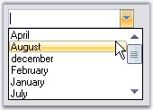
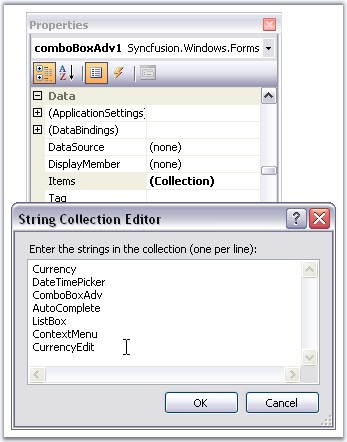
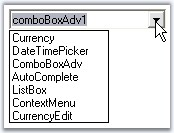
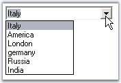
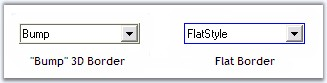
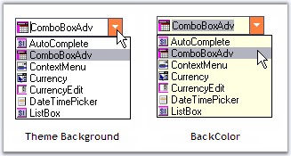
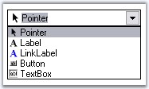

::: {style="DISPLAY: none"}
{#d2h_url_template}{#d2h_package_url style="WIDTH: 0px; DISPLAY: none; HEIGHT: 0px"}
:::

::::::::::::: {.d2h_secondary_topic style="PADDING-BOTTOM: 10pt; MARGIN: 0pt; PADDING-LEFT: 0pt; PADDING-RIGHT: 0pt; PADDING-TOP: 0pt"}
##### Concepts and Features {#concepts-and-features style="tab-stops: 0pt"}

[]{style="COLOR: #15428b"} 

The following topics will help you become more familiar in using the ComboBoxAdv control.

[]{style="COLOR: #15428b"} 

###### []{#p389}[]{#_ComboBoxAdv}3.3.5.2.3.1 ComboBoxAdv {#comboboxadv style="tab-stops: 0pt"}

 

ComboBoxAdv control has a textbox which is the edit portion of the control and a dropdown. This section will discuss these components in detail in the below topics.

[]{style="COLOR: #15428b"} 

[]{#_TextBox}3.3.5.2.3.1.1      TextBox[]{#p390}

ComboBoxAdv control has properties which changes the appearance and behavior of the textbox or the edit portion of the control.

[]{style="COLOR: #15428b"} 

Text Appearance

[]{style="COLOR: #15428b"} 

The below properties customizes the text in the ComboBoxAdv control.

[]{style="COLOR: #15428b"} 

::: {align="center"}
  -------------------------------- ---------------------------------------------------------------------------------------
  ComboBoxAdv TextBox Properties   Description
  Text                             Sets text for the textbox. The text can set to null to clear the text in the textbox.
  TextAlign                        Sets the alignment of the text in the textbox.
  ForeColor                        Sets the fore color for the text entered in the edit portion of the control.
  -------------------------------- ---------------------------------------------------------------------------------------
:::

[]{style="COLOR: #15428b"} 

+----------------------------------------------------------------------------------------------------------------------------------------------------------------------------------------------------------------------------------+
| **[\[C#\]]{style="FONT-FAMILY: 'Courier New'; COLOR: black"}**                                                                                                                                                                   |
|                                                                                                                                                                                                                                  |
| **[]{style="FONT-FAMILY: 'Courier New'; COLOR: black"}**                                                                                                                                                                         |
|                                                                                                                                                                                                                                  |
| [this]{style="FONT-FAMILY: 'Courier New'; COLOR: blue"}[.comboBoxAdv1.TextBox.Text[ ]{style="COLOR: blue"}=[ ]{style="COLOR: blue"}[\"Simple text in ComboBoxAdv\"]{style="COLOR: maroon"};]{style="FONT-FAMILY: 'Courier New'"} |
|                                                                                                                                                                                                                                  |
| [this]{style="FONT-FAMILY: 'Courier New'; COLOR: blue"}[.comboBoxAdv1.TextBox.TextAlign[ ]{style="COLOR: blue"}= HorizontalAlignment.Center;]{style="FONT-FAMILY: 'Courier New'"}                                                |
|                                                                                                                                                                                                                                  |
| [this]{style="FONT-FAMILY: 'Courier New'; COLOR: blue"}[.comboBoxAdv1.TextBox.ForeColor[ ]{style="COLOR: blue"}= [Color]{style="COLOR: teal"}.Red;]{style="FONT-FAMILY: 'Courier New'"}                                          |
+----------------------------------------------------------------------------------------------------------------------------------------------------------------------------------------------------------------------------------+

[]{style="COLOR: #15428b"} 

+---------------------------------------------------------------------------------------------------------------------------------------------------------------------------------+
| **[\[VB.NET\]]{style="FONT-FAMILY: 'Courier New'; COLOR: black"}**                                                                                                              |
|                                                                                                                                                                                 |
| []{style="FONT-FAMILY: 'Courier New'; COLOR: blue"}                                                                                                                             |
|                                                                                                                                                                                 |
| [Me]{style="FONT-FAMILY: 'Courier New'; COLOR: blue"}[.comboBoxAdv1.TextBox.Text = [\"Simple text in ComboBoxAdv\"]{style="COLOR: maroon"}]{style="FONT-FAMILY: 'Courier New'"} |
|                                                                                                                                                                                 |
| [Me]{style="FONT-FAMILY: 'Courier New'; COLOR: blue"}[.comboBoxAdv1.TextBox.TextAlign = HorizontalAlignment.Center]{style="FONT-FAMILY: 'Courier New'"}                         |
|                                                                                                                                                                                 |
| [Me]{style="FONT-FAMILY: 'Courier New'; COLOR: blue"}[.comboBoxAdv1.TextBox.ForeColor = [Color]{style="COLOR: teal"}.Red]{style="FONT-FAMILY: 'Courier New'"}                   |
+---------------------------------------------------------------------------------------------------------------------------------------------------------------------------------+

[]{style="COLOR: #15428b"} 

Text Selection

[]{style="COLOR: #15428b"} 

The selection of text during run time can be controlled through below properties.

[]{style="COLOR: #15428b"} 

::: {align="center"}
  -------------------------------- ----------------------------------------------------
  ComboBoxAdv TextBox Properties   Description
  SelectedText                     Sets the currently selected text at runtime.
  SelectionLength                  Sets the number of characters selected in textbox.
  SelectionStart                   Sets the starting point of the text selection.
  -------------------------------- ----------------------------------------------------
:::

[]{style="COLOR: #15428b"} 

+-----------------------------------------------------------------------------------------------------------------------------------------------------------------------+
| **[\[C#\]]{style="FONT-FAMILY: 'Courier New'; COLOR: black"}**                                                                                                        |
|                                                                                                                                                                       |
| **[]{style="FONT-FAMILY: 'Courier New'; COLOR: black"}**                                                                                                              |
|                                                                                                                                                                       |
| [this.]{style="FONT-FAMILY: 'Courier New'; COLOR: blue"}[comboBoxAdv1.TextBox.SelectedText = [\"Combo\"]{style="COLOR: maroon"};]{style="FONT-FAMILY: 'Courier New'"} |
|                                                                                                                                                                       |
| [this.]{style="FONT-FAMILY: 'Courier New'; COLOR: blue"}[comboBoxAdv1.TextBox.SelectionLength = 5;]{style="FONT-FAMILY: 'Courier New'"}                               |
|                                                                                                                                                                       |
| [this.]{style="FONT-FAMILY: 'Courier New'; COLOR: blue"}[comboBoxAdv1.TextBox.SelectionStart = 2;]{style="FONT-FAMILY: 'Courier New'"}                                |
+-----------------------------------------------------------------------------------------------------------------------------------------------------------------------+

[]{style="COLOR: #15428b"} 

+--------------------------------------------------------------------------------------------------------------------------------------------------------------------+
| **[\[VB.NET\]]{style="FONT-FAMILY: 'Courier New'; COLOR: black"}**                                                                                                 |
|                                                                                                                                                                    |
| []{style="FONT-FAMILY: 'Courier New'; COLOR: black"}                                                                                                               |
|                                                                                                                                                                    |
| [Me]{style="FONT-FAMILY: 'Courier New'; COLOR: blue"}[.comboBoxAdv1.TextBox.SelectedText = [\"Combo\"]{style="COLOR: maroon"}]{style="FONT-FAMILY: 'Courier New'"} |
|                                                                                                                                                                    |
| [Me]{style="FONT-FAMILY: 'Courier New'; COLOR: blue"}[.comboBoxAdv1.TextBox.SelectionLength = 5]{style="FONT-FAMILY: 'Courier New'"}                               |
|                                                                                                                                                                    |
| [Me]{style="FONT-FAMILY: 'Courier New'; COLOR: blue"}[.comboBoxAdv1.TextBox.SelectionStart = 2]{style="FONT-FAMILY: 'Courier New'"}                                |
+--------------------------------------------------------------------------------------------------------------------------------------------------------------------+

[]{style="COLOR: #15428b"} 

ReadOnly Settings

[]{style="COLOR: #15428b"} 

The below properties deals with read-only settings for the ComboBoxAdv control.

[]{style="COLOR: #15428b"} 

::: {align="center"}
+-----------------------------------+-----------------------------------------------------------------------------------------------------------------------------------------------------------------------+
| ComboBoxAdv TextBox Properties    | Description                                                                                                                                                           |
+-----------------------------------+-----------------------------------------------------------------------------------------------------------------------------------------------------------------------+
| ReadOnly                          | Specifies whether the control can be made read only. By default it is set to false.                                                                                   |
+-----------------------------------+-----------------------------------------------------------------------------------------------------------------------------------------------------------------------+
| DropDownStyle                     | Specifies the dropdown style of the ComboBoxAdv control. Based on its below options, it specifies whether the text in the control is editable or not. The styles are, |
|                                   |                                                                                                                                                                       |
|                                   |                                                                                                                                                                       |
|                                   |                                                                                                                                                                       |
|                                   | Simple - The text portion is editable. The list portion is always visible.                                                                                            |
|                                   |                                                                                                                                                                       |
|                                   | DropDown (default style) - The text portion is editable. Clicking the arrow button will display the list portion.                                                     |
|                                   |                                                                                                                                                                       |
|                                   | DropDownList - The text portion is not editable. Clicking the arrow button will display the list portion.                                                             |
+-----------------------------------+-----------------------------------------------------------------------------------------------------------------------------------------------------------------------+
:::

[]{style="COLOR: #15428b"} 

+----------------------------------------------------------------------------------------------------------------------------------------------------------------------------------------------+
| **[\[C#\]]{style="FONT-FAMILY: 'Courier New'; COLOR: black"}**                                                                                                                               |
|                                                                                                                                                                                              |
| **[]{style="FONT-FAMILY: 'Courier New'; COLOR: black"}**                                                                                                                                     |
|                                                                                                                                                                                              |
| [this]{style="FONT-FAMILY: 'Courier New'; COLOR: blue"}[.comboBoxAdv1.ReadOnly = [true]{style="COLOR: blue"};]{style="FONT-FAMILY: 'Courier New'"}                                           |
|                                                                                                                                                                                              |
| [this]{style="FONT-FAMILY: 'Courier New'; COLOR: blue"}[.comboBoxAdv1.DropDownStyle = System.Windows.Forms.[ComboBoxStyle]{style="COLOR: teal"}.Simple;]{style="FONT-FAMILY: 'Courier New'"} |
+----------------------------------------------------------------------------------------------------------------------------------------------------------------------------------------------+

[]{style="COLOR: #15428b"} 

+--------------------------------------------------------------------------------------------------------------------------------------------------------------------------------------------+
| **[\[VB.NET\]]{style="FONT-FAMILY: 'Courier New'; COLOR: black"}**                                                                                                                         |
|                                                                                                                                                                                            |
| []{style="FONT-FAMILY: 'Courier New'; COLOR: black"}                                                                                                                                       |
|                                                                                                                                                                                            |
| [Me]{style="FONT-FAMILY: 'Courier New'; COLOR: blue"}[.comboBoxAdv1.ReadOnly = [True]{style="COLOR: blue"}]{style="FONT-FAMILY: 'Courier New'"}                                            |
|                                                                                                                                                                                            |
| [Me]{style="FONT-FAMILY: 'Courier New'; COLOR: blue"}[.comboBoxAdv1.DropDownStyle = System.Windows.Forms.[ComboBoxStyle.]{style="COLOR: black"}Simple]{style="FONT-FAMILY: 'Courier New'"} |
+--------------------------------------------------------------------------------------------------------------------------------------------------------------------------------------------+

[]{style="COLOR: #15428b"} 

Behavior Settings

[]{style="COLOR: #15428b"} 

The below properties controls the behavior of the text typed in the Textbox.

[]{style="COLOR: #15428b"} 

::: {align="center"}
+-----------------------------------+---------------------------------------------------------------------------------------------------------------------------------------------------------------------------------------------+
| ComboBoxAdv Properties            | Description                                                                                                                                                                                 |
+-----------------------------------+---------------------------------------------------------------------------------------------------------------------------------------------------------------------------------------------+
| NumberOnly                        | Specifies whether the user should be allowed to enter only numbers in the edit portion of the ComboBoxAdv.                                                                                  |
+-----------------------------------+---------------------------------------------------------------------------------------------------------------------------------------------------------------------------------------------+
| CharacterCasing                   | Specifies the case of the characters that are entered in the textbox. The options are,                                                                                                      |
|                                   |                                                                                                                                                                                             |
|                                   |                                                                                                                                                                                             |
|                                   |                                                                                                                                                                                             |
|                                   | Normal - Characters are left unchanged,                                                                                                                                                     |
|                                   |                                                                                                                                                                                             |
|                                   | UpperCase - Changes the case of the characters to UPPERCASE and                                                                                                                             |
|                                   |                                                                                                                                                                                             |
|                                   | LowerCase  - Changes the case of the characters to LOWERCASE.                                                                                                                               |
+-----------------------------------+---------------------------------------------------------------------------------------------------------------------------------------------------------------------------------------------+
| TextBox.HideSelection             | When set to false will always highlight the selected text in the edit portion, even if the control losses focus.                                                                            |
+-----------------------------------+---------------------------------------------------------------------------------------------------------------------------------------------------------------------------------------------+
| TextBox.WordWrap                  | Indicates whether the textbox automatically wraps words to the beginning of the next line. Note that the multiline property should be set to true, to make the word wrap feature effective. |
+-----------------------------------+---------------------------------------------------------------------------------------------------------------------------------------------------------------------------------------------+
| AllowNewText                      | Indicates whether the user is allowed to enter new text at run time.                                                                                                                        |
+-----------------------------------+---------------------------------------------------------------------------------------------------------------------------------------------------------------------------------------------+
| MaxLength                         | Specifies the maximum number of characters allowed in the edit portion of the ComboBoxAdv control. Default (32767).                                                                         |
+-----------------------------------+---------------------------------------------------------------------------------------------------------------------------------------------------------------------------------------------+
:::

[]{style="COLOR: #15428b"} 

+----------------------------------------------------------------------------------------------------------------------------------------------------------------------------+
| **[\[C#\]]{style="FONT-FAMILY: 'Courier New'; COLOR: black"}**                                                                                                             |
|                                                                                                                                                                            |
| []{style="FONT-FAMILY: 'Courier New'"}                                                                                                                                     |
|                                                                                                                                                                            |
| [this]{style="FONT-FAMILY: 'Courier New'; COLOR: blue"}[.comboBoxAdv1.NumberOnly = [true]{style="COLOR: blue"};]{style="FONT-FAMILY: 'Courier New'"}                       |
|                                                                                                                                                                            |
| [this]{style="FONT-FAMILY: 'Courier New'; COLOR: blue"}[.comboBoxAdv1.CharacterCasing = [CharacterCasing]{style="COLOR: teal"}.Upper;]{style="FONT-FAMILY: 'Courier New'"} |
|                                                                                                                                                                            |
| [this]{style="FONT-FAMILY: 'Courier New'; COLOR: blue"}[.comboBoxAdv1.TextBox.HideSelection = [false]{style="COLOR: blue"};]{style="FONT-FAMILY: 'Courier New'"}           |
|                                                                                                                                                                            |
| [this]{style="FONT-FAMILY: 'Courier New'; COLOR: blue"}[.comboBoxAdv1.TextBox.WordWrap = [true]{style="COLOR: blue"};]{style="FONT-FAMILY: 'Courier New'"}                 |
|                                                                                                                                                                            |
| []{style="FONT-FAMILY: 'Courier New'"}                                                                                                                                     |
|                                                                                                                                                                            |
| [this]{style="FONT-FAMILY: 'Courier New'; COLOR: blue"}[.comboBoxAdv1.AllowNewText = [true]{style="COLOR: blue"};]{style="FONT-FAMILY: 'Courier New'"}                     |
|                                                                                                                                                                            |
| [this]{style="FONT-FAMILY: 'Courier New'; COLOR: blue"}[.comboBoxAdv1.MaxLength = 32766;]{style="FONT-FAMILY: 'Courier New'"}                                              |
+----------------------------------------------------------------------------------------------------------------------------------------------------------------------------+

[]{style="COLOR: #15428b"} 

+-------------------------------------------------------------------------------------------------------------------------------------------------------------------------+
| **[\[VB.NET\]]{style="FONT-FAMILY: 'Courier New'; COLOR: black"}**                                                                                                      |
|                                                                                                                                                                         |
| []{style="FONT-FAMILY: 'Courier New'; COLOR: black"}                                                                                                                    |
|                                                                                                                                                                         |
| [Me]{style="FONT-FAMILY: 'Courier New'; COLOR: blue"}[.comboBoxAdv1.NumberOnly = [True]{style="COLOR: blue"}]{style="FONT-FAMILY: 'Courier New'"}                       |
|                                                                                                                                                                         |
| [Me]{style="FONT-FAMILY: 'Courier New'; COLOR: blue"}[.comboBoxAdv1.CharacterCasing = [CharacterCasing]{style="COLOR: teal"}.Upper]{style="FONT-FAMILY: 'Courier New'"} |
|                                                                                                                                                                         |
| [Me]{style="FONT-FAMILY: 'Courier New'; COLOR: blue"}[.comboBoxAdv1.TextBox.HideSelection = [false]{style="COLOR: blue"}]{style="FONT-FAMILY: 'Courier New'"}           |
|                                                                                                                                                                         |
| [Me]{style="FONT-FAMILY: 'Courier New'; COLOR: blue"}[.comboBoxAdv1.TextBox.WordWrap = [True]{style="COLOR: blue"}]{style="FONT-FAMILY: 'Courier New'"}                 |
|                                                                                                                                                                         |
| []{style="FONT-FAMILY: 'Courier New'"}                                                                                                                                  |
|                                                                                                                                                                         |
| [Me]{style="FONT-FAMILY: 'Courier New'; COLOR: blue"}[.comboBoxAdv1.AllowNewText = [True]{style="COLOR: blue"}]{style="FONT-FAMILY: 'Courier New'"}                     |
|                                                                                                                                                                         |
| [Me]{style="FONT-FAMILY: 'Courier New'; COLOR: blue"}[.comboBoxAdv1.MaxLength = 32766]{style="FONT-FAMILY: 'Courier New'"}                                              |
+-------------------------------------------------------------------------------------------------------------------------------------------------------------------------+

[]{style="COLOR: #15428b"} 

Banner Text Support

[]{style="COLOR: #15428b"} 

We can set banner text for the ComboBoxAdv control. Refer to BannerTextProvider Component topic for more details.

[]{style="COLOR: #15428b"} 

{border="0"}

[]{style="COLOR: #15428b"} 

Figure 346: Banner Text set for ComboBoxAdv

[]{style="COLOR: #15428b"} 

See Also

[]{style="COLOR: #15428b"} 

[DropDown Settings]{.UGHyperlink}[, ]{.UGHyperlink}[Data Settings]{.UGHyperlink}[]{.UGHyperlink}

[]{#_DropDown_Settings}3.3.5.2.3.1.2      DropDown Settings

[]{#p391}[]{style="COLOR: #15428b"} 

Dropdown for the ComboBoxAdv control can be customized using the below properties.

[]{style="COLOR: #15428b"} 

::: {align="center"}
  ------------------------ --------------------------------------------------------------------------------------------------------------------------------------------------------------------------------------
  ComboBoxAdv Properties   Description
  DropDownWidth            Specifies the width of the dropdown. Default value is 100.
  IntegralHeight           Indicates whether the list portion will have only complete items. i.e when this property is set to true, it will display only those items that are fully visible in terms of height.
  MaxDropDownItems         Maximum number of entries that can be displayed in the dropdown. Set image for the dropdown items. Refer [Image Settings]{style="COLOR: black"} topic.
  Sorted                   When set to true, will sort the dropdown items in the alphabetical order.
  ------------------------ --------------------------------------------------------------------------------------------------------------------------------------------------------------------------------------
:::

[]{style="COLOR: #15428b"} 

+----------------------------------------------------------------------------------------------------------------------------------------------------------+
| **[\[C#\]]{style="FONT-FAMILY: 'Courier New'; COLOR: black"}**                                                                                           |
|                                                                                                                                                          |
| **[]{style="FONT-FAMILY: 'Courier New'; COLOR: black"}**                                                                                                 |
|                                                                                                                                                          |
| [this]{style="FONT-FAMILY: 'Courier New'; COLOR: blue"}[.comboBoxAdv1.DropDownWidth = 150;]{style="FONT-FAMILY: 'Courier New'"}                          |
|                                                                                                                                                          |
| [this]{style="FONT-FAMILY: 'Courier New'; COLOR: blue"}[.comboBoxAdv1.IntegralHeight = [true]{style="COLOR: blue"};]{style="FONT-FAMILY: 'Courier New'"} |
|                                                                                                                                                          |
| [this]{style="FONT-FAMILY: 'Courier New'; COLOR: blue"}[.comboBoxAdv1.MaxDropDownItems = 5;]{style="FONT-FAMILY: 'Courier New'"}                         |
|                                                                                                                                                          |
| [this]{style="FONT-FAMILY: 'Courier New'; COLOR: blue"}[.comboBoxAdv1.Sorted = [true]{style="COLOR: blue"};]{style="FONT-FAMILY: 'Courier New'"}         |
+----------------------------------------------------------------------------------------------------------------------------------------------------------+

[]{style="COLOR: #15428b"} 

+-------------------------------------------------------------------------------------------------------------------------------------------------------+
| **[\[VB.NET\]]{style="FONT-FAMILY: 'Courier New'; COLOR: black"}**                                                                                    |
|                                                                                                                                                       |
| []{style="FONT-FAMILY: 'Courier New'; COLOR: black"}                                                                                                  |
|                                                                                                                                                       |
| [Me]{style="FONT-FAMILY: 'Courier New'; COLOR: blue"}[.comboBoxAdv1.DropDownWidth = 150]{style="FONT-FAMILY: 'Courier New'"}                          |
|                                                                                                                                                       |
| [Me]{style="FONT-FAMILY: 'Courier New'; COLOR: blue"}[.comboBoxAdv1.IntegralHeight = [True]{style="COLOR: blue"}]{style="FONT-FAMILY: 'Courier New'"} |
|                                                                                                                                                       |
| [Me]{style="FONT-FAMILY: 'Courier New'; COLOR: blue"}[.comboBoxAdv1.MaxDropDownItems = 5]{style="FONT-FAMILY: 'Courier New'"}                         |
|                                                                                                                                                       |
| [Me]{style="FONT-FAMILY: 'Courier New'; COLOR: blue"}[.comboBoxAdv1.Sorted = [True]{style="COLOR: blue"}]{style="FONT-FAMILY: 'Courier New'"}         |
+-------------------------------------------------------------------------------------------------------------------------------------------------------+

[]{style="COLOR: #15428b"} 

{border="0"}

[]{style="COLOR: #15428b"} 

Figure 347: DropDownWidth = \"150\"; MaxDropDownItems = \"6\"; Sorted = \"True\"

[]{style="COLOR: #15428b"} 

::: {style="BORDER-BOTTOM: windowtext 1pt solid; BORDER-LEFT: medium none; PADDING-BOTTOM: 1pt; MARGIN-TOP: 9pt; PADDING-LEFT: 0pt; PADDING-RIGHT: 0pt; MARGIN-BOTTOM: 9pt; BORDER-TOP: windowtext 1pt solid; BORDER-RIGHT: medium none; PADDING-TOP: 1pt"}
{border="0"} Note: Data for the dropdown can be set using Items property. Refer Data Settings for details.

 

{border="0"} Note: To know about different dropdown styles available for the control, see ReadOnly Settings section in [TextBox]() topic.
:::

[]{style="COLOR: #15428b"} 

See Also

[]{style="COLOR: #15428b"} 

[[TextBox]{.UGHyperlink}]()[, ]{.UGHyperlink}[Image Settings]{.UGHyperlink}[]{.UGHyperlink}

###### []{#p392}3.3.5.2.3.2 Data Settings {#data-settings style="tab-stops: 0pt"}

[]{style="COLOR: #15428b"} 

Data for the ComboBoxAdv is added through String Collection Editor, which is invoked through **ComboBoxAdv.Items** property.

[]{style="COLOR: #15428b"} 

{border="0"}

[]{style="COLOR: #15428b"} 

Figure 348: Adding DropDown Items to ComboBoxAdv Control

**[]{style="COLOR: #15428b"}** 

+---------------------------------------------------------------------------------------------------------------------------------------------------------------------------------------------------------------------------------------------------------------------------------------------------------------------------------------------------------------------------------------------------------------------------------------------------------------------------------------------+
| **[\[C#\]]{style="FONT-FAMILY: 'Courier New'; COLOR: black"}**                                                                                                                                                                                                                                                                                                                                                                                                                              |
|                                                                                                                                                                                                                                                                                                                                                                                                                                                                                             |
| []{style="FONT-FAMILY: 'Courier New'; COLOR: black"}                                                                                                                                                                                                                                                                                                                                                                                                                                        |
|                                                                                                                                                                                                                                                                                                                                                                                                                                                                                             |
| [this]{style="FONT-FAMILY: 'Courier New'; COLOR: blue"}[.comboBoxAdv1.Items.AddRange([new]{style="COLOR: blue"} [object]{style="COLOR: blue"}\[\] {[\"Currency\"]{style="COLOR: maroon"}, [\"DateTimePicker\"]{style="COLOR: maroon"}, [\"ComboBoxAdv\"]{style="COLOR: maroon"}, [\"AutoComplete\"]{style="COLOR: maroon"}, [\"ListBox\"]{style="COLOR: maroon"},[\"ContextMenu\"]{style="COLOR: maroon"},[\"CurrencyEdit\"]{style="COLOR: maroon"}});]{style="FONT-FAMILY: 'Courier New'"} |
+---------------------------------------------------------------------------------------------------------------------------------------------------------------------------------------------------------------------------------------------------------------------------------------------------------------------------------------------------------------------------------------------------------------------------------------------------------------------------------------------+

[]{style="COLOR: #15428b"} 

+--------------------------------------------------------------------------------------------------------------------------------------------------------------------------------------------------------------------------------------------------------------------------------------------------------------------------------------------------------------------------------------------------------------------------------------------------+
| **[\[VB.NET\]]{style="FONT-FAMILY: 'Courier New'; COLOR: black"}**                                                                                                                                                                                                                                                                                                                                                                               |
|                                                                                                                                                                                                                                                                                                                                                                                                                                                  |
| []{style="FONT-FAMILY: 'Courier New'; COLOR: black"}                                                                                                                                                                                                                                                                                                                                                                                             |
|                                                                                                                                                                                                                                                                                                                                                                                                                                                  |
| [Me]{style="FONT-FAMILY: 'Courier New'; COLOR: blue"}[.comboBoxAdv1.Items.AddRange([New]{style="COLOR: blue"} [Object]{style="COLOR: blue"}() {[\"Currency\"]{style="COLOR: maroon"}, [\"DateTimePicker\"]{style="COLOR: maroon"}, [\"ComboBoxAdv\"]{style="COLOR: maroon"}, [\"AutoComplete\"]{style="COLOR: maroon"}, [\"ListBox\"]{style="COLOR: maroon"}, [\"ContextMenu\"]{style="COLOR: maroon"}, \_ ]{style="FONT-FAMILY: 'Courier New'"} |
|                                                                                                                                                                                                                                                                                                                                                                                                                                                  |
| [\"CurrencyEdit\"]{style="FONT-FAMILY: 'Courier New'; COLOR: maroon"}[}) ]{style="FONT-FAMILY: 'Courier New'"}                                                                                                                                                                                                                                                                                                                                   |
+--------------------------------------------------------------------------------------------------------------------------------------------------------------------------------------------------------------------------------------------------------------------------------------------------------------------------------------------------------------------------------------------------------------------------------------------------+

[]{style="COLOR: #15428b"} 

{border="0"}

[]{style="COLOR: #15428b"} 

Figure 349: DropDown Items for ComboBoxAdv Control

[]{style="COLOR: #15428b"} 

::: {style="BORDER-BOTTOM: windowtext 1pt solid; BORDER-LEFT: medium none; PADDING-BOTTOM: 1pt; MARGIN-TOP: 9pt; PADDING-LEFT: 0pt; PADDING-RIGHT: 0pt; MARGIN-BOTTOM: 9pt; BORDER-TOP: windowtext 1pt solid; BORDER-RIGHT: medium none; PADDING-TOP: 1pt"}
{border="0"} Note: ComboBoxAdv can also be bound to an external Data source like Data Table. Refer Databinding topic.
:::

[]{style="COLOR: #15428b"} 

To set image for dropdown items refer Image settings topic.

###### []{#p393}3.3.5.2.3.3 Advanced Features {#advanced-features style="tab-stops: 0pt"}

[]{style="COLOR: #15428b"} 

This section will discuss the auto complete support available for the ComboBoxAdv control and databinding using external source.

[]{#p394}[]{#_AutoComplete_Support}3.3.5.2.3.3.1      AutoComplete Support

[]{style="COLOR: #15428b"} 

ComboBoxAdv has in-built support of auto completion of the text entered in the control. This feature is automatically enabled for the control. To disable, set **ComboBoxAdv.AutoComplete** property to false.

[]{style="COLOR: #15428b"} 

::: {align="center"}
  --------------------------- --------------------------------------------------------------------------------------------------------------------------------------------------------------------
  ComboBoxAdv Properties      Description
  CaseSensitiveAutoComplete   Specifies whether search in the AutoComplete is case sensitive.
  MatchFirstCharacterOnly     It specifies the AutoComplete behavior in the dropdown mode. When set to true, it will match the first character in the drop list and returns the matching result.
  --------------------------- --------------------------------------------------------------------------------------------------------------------------------------------------------------------
:::

[]{style="COLOR: #15428b"} 

+---------------------------------------------------------------------------------------------------------------------------------------------------------------------+
| **[\[C#\]]{style="FONT-FAMILY: 'Courier New'; COLOR: black"}**                                                                                                      |
|                                                                                                                                                                     |
| []{style="FONT-FAMILY: 'Courier New'; COLOR: black"}                                                                                                                |
|                                                                                                                                                                     |
| [this]{style="FONT-FAMILY: 'Courier New'; COLOR: blue"}[.comboBoxAdv1.AutoComplete = [true]{style="COLOR: blue"};]{style="FONT-FAMILY: 'Courier New'"}              |
|                                                                                                                                                                     |
| [this]{style="FONT-FAMILY: 'Courier New'; COLOR: blue"}[.comboBoxAdv1.CaseSensitiveAutocomplete = [true]{style="COLOR: blue"};]{style="FONT-FAMILY: 'Courier New'"} |
|                                                                                                                                                                     |
| [this]{style="FONT-FAMILY: 'Courier New'; COLOR: blue"}[.comboBoxAdv1.MatchFirstCharacterOnly = [true]{style="COLOR: blue"};]{style="FONT-FAMILY: 'Courier New'"}   |
+---------------------------------------------------------------------------------------------------------------------------------------------------------------------+

[]{style="COLOR: #15428b"} 

+------------------------------------------------------------------------------------------------------------------------------------------------------------------+
| **[\[VB.NET\]]{style="FONT-FAMILY: 'Courier New'; COLOR: black"}**                                                                                               |
|                                                                                                                                                                  |
| **[]{style="FONT-FAMILY: 'Courier New'; COLOR: black"}**                                                                                                         |
|                                                                                                                                                                  |
| [Me]{style="FONT-FAMILY: 'Courier New'; COLOR: blue"}[.comboBoxAdv1.AutoComplete = [True]{style="COLOR: blue"}]{style="FONT-FAMILY: 'Courier New'"}              |
|                                                                                                                                                                  |
| [Me]{style="FONT-FAMILY: 'Courier New'; COLOR: blue"}[.comboBoxAdv1.CaseSensitiveAutocomplete = [True]{style="COLOR: blue"}]{style="FONT-FAMILY: 'Courier New'"} |
|                                                                                                                                                                  |
| [Me]{style="FONT-FAMILY: 'Courier New'; COLOR: blue"}[.comboBoxAdv1.MatchFirstCharacterOnly = [True]{style="COLOR: blue"}]{style="FONT-FAMILY: 'Courier New'"}   |
+------------------------------------------------------------------------------------------------------------------------------------------------------------------+

[]{style="COLOR: #15428b"} 

{border="0"}

[]{style="COLOR: #15428b"} 

Figure 350: AutoComplete = \"True\"

[]{#p395}3.3.5.2.3.3.2      Data Binding

[]{style="COLOR: #15428b"} 

ComboBoxAdv control can be bound with external data source. Objects that can acts as Datasource to ComboBoxAdv are

 

[·      ]{style="FONT-FAMILY: Symbol"}ArrayList

[·      ]{style="FONT-FAMILY: Symbol"}DataView

[·      ]{style="FONT-FAMILY: Symbol"}DataTable

[]{style="FONT-SIZE: 8pt"} 

We can add objects to the ComboBoxAdv by using the Items method. You can also add objects to a ComboBoxAdv using the **DataSource**, **DisplayMember** and **Valuemember** properties to fill the ComboBox.

 

When the DataSource property is set, we cannot modify the items collection. If setting the DataSource property causes the data source to change, the **Datasource** event is raised. If setting this property causes the data member to change, the **DisplayMember** event is raised.

 

When you set DataSource to a null reference, DisplayMember is set to an empty string (\"\").

 

ComboBoxAdv can be bound to DataView using the following code snippet.

[]{style="COLOR: #15428b"} 

+--------------------------------------------------------------------------------------------------------------------------------------------------------------------------------------------------------------------------------------------+
| **[\[C#\]]{style="FONT-FAMILY: 'Courier New'; COLOR: black"}**                                                                                                                                                                             |
|                                                                                                                                                                                                                                            |
| **[]{style="FONT-FAMILY: 'Courier New'; COLOR: black"}**                                                                                                                                                                                   |
|                                                                                                                                                                                                                                            |
| [// Create a DataTable.        ]{style="FONT-FAMILY: 'Courier New'; COLOR: green"}[     ]{style="FONT-FAMILY: 'Courier New'; COLOR: black"}                                                                                                |
|                                                                                                                                                                                                                                            |
| [DataTable dt = ]{style="FONT-FAMILY: 'Courier New'; COLOR: black"}[new]{style="FONT-FAMILY: 'Courier New'; COLOR: blue"}[ DataTable(\"Table1\");]{style="FONT-FAMILY: 'Courier New'; COLOR: black"}                                       |
|                                                                                                                                                                                                                                            |
| []{style="FONT-FAMILY: 'Courier New'; COLOR: black"}                                                                                                                                                                                       |
|                                                                                                                                                                                                                                            |
| [// Adding Columns.]{style="FONT-FAMILY: 'Courier New'; COLOR: green"}                                                                                                                                                                     |
|                                                                                                                                                                                                                                            |
| [dt.Columns.Add(\"FirstName\");]{style="FONT-FAMILY: 'Courier New'; COLOR: black"}                                                                                                                                                         |
|                                                                                                                                                                                                                                            |
| [dt.Columns.Add(\"LastName\");]{style="FONT-FAMILY: 'Courier New'; COLOR: black"}                                                                                                                                                          |
|                                                                                                                                                                                                                                            |
| [dt.Columns.Add(\"occupation\");]{style="FONT-FAMILY: 'Courier New'; COLOR: black"}                                                                                                                                                        |
|                                                                                                                                                                                                                                            |
| [dt.Columns.Add(\"place\");]{style="FONT-FAMILY: 'Courier New'; COLOR: black"}                                                                                                                                                             |
|                                                                                                                                                                                                                                            |
| []{style="FONT-FAMILY: 'Courier New'; COLOR: black"}                                                                                                                                                                                       |
|                                                                                                                                                                                                                                            |
| [// Create a Data Set.]{style="FONT-FAMILY: 'Courier New'; COLOR: green"}                                                                                                                                                                  |
|                                                                                                                                                                                                                                            |
| [DataSet ds = ]{style="FONT-FAMILY: 'Courier New'; COLOR: black"}[new]{style="FONT-FAMILY: 'Courier New'; COLOR: blue"}[ DataSet();]{style="FONT-FAMILY: 'Courier New'; COLOR: black"}                                                     |
|                                                                                                                                                                                                                                            |
| [ds.Tables.Add(dt);]{style="FONT-FAMILY: 'Courier New'; COLOR: black"}                                                                                                                                                                     |
|                                                                                                                                                                                                                                            |
| [dt.Rows.Add(]{style="FONT-FAMILY: 'Courier New'; COLOR: black"}[new]{style="FONT-FAMILY: 'Courier New'; COLOR: blue"}[ string\[\] { \"John\", \"Tina\", \"Doctor\", \"Italy\" });]{style="FONT-FAMILY: 'Courier New'; COLOR: black"}      |
|                                                                                                                                                                                                                                            |
| [dt.Rows.Add(]{style="FONT-FAMILY: 'Courier New'; COLOR: black"}[new]{style="FONT-FAMILY: 'Courier New'; COLOR: blue"}[ string\[\] { \"Mary\", \"anu\", \"Teacher\", \"America\" });]{style="FONT-FAMILY: 'Courier New'; COLOR: black"}    |
|                                                                                                                                                                                                                                            |
| [dt.Rows.Add(]{style="FONT-FAMILY: 'Courier New'; COLOR: black"}[new]{style="FONT-FAMILY: 'Courier New'; COLOR: blue"}[ string\[\] { \"asha\", \"roy\", \"Staff\", \"London\" });]{style="FONT-FAMILY: 'Courier New'; COLOR: black"}       |
|                                                                                                                                                                                                                                            |
| [dt.Rows.Add(]{style="FONT-FAMILY: 'Courier New'; COLOR: black"}[new]{style="FONT-FAMILY: 'Courier New'; COLOR: blue"}[ string\[\] { \"George\", \"Gaskin\", \"Nurse\", \"germany\" });]{style="FONT-FAMILY: 'Courier New'; COLOR: black"} |
|                                                                                                                                                                                                                                            |
| [dt.Rows.Add(]{style="FONT-FAMILY: 'Courier New'; COLOR: black"}[new]{style="FONT-FAMILY: 'Courier New'; COLOR: blue"}[ string\[\] { \"sam\", \"jens\", \"Engineer\", \"Russia\" });]{style="FONT-FAMILY: 'Courier New'; COLOR: black"}    |
|                                                                                                                                                                                                                                            |
| [dt.Rows.Add(]{style="FONT-FAMILY: 'Courier New'; COLOR: black"}[new]{style="FONT-FAMILY: 'Courier New'; COLOR: blue"}[ string\[\] { \"Ben\", \"Geo\", \"Developer\", \"India\" });]{style="FONT-FAMILY: 'Courier New'; COLOR: black"}     |
|                                                                                                                                                                                                                                            |
| []{style="FONT-FAMILY: 'Courier New'; COLOR: black"}                                                                                                                                                                                       |
|                                                                                                                                                                                                                                            |
| [// Create a DataView.]{style="FONT-FAMILY: 'Courier New'; COLOR: green"}                                                                                                                                                                  |
|                                                                                                                                                                                                                                            |
| [DataView view = ]{style="FONT-FAMILY: 'Courier New'; COLOR: black"}[new]{style="FONT-FAMILY: 'Courier New'; COLOR: blue"}[ DataView(dt);]{style="FONT-FAMILY: 'Courier New'; COLOR: black"}                                               |
|                                                                                                                                                                                                                                            |
| []{style="FONT-FAMILY: 'Courier New'; COLOR: black"}                                                                                                                                                                                       |
|                                                                                                                                                                                                                                            |
| [// Set DataSource.]{style="FONT-FAMILY: 'Courier New'; COLOR: green"}                                                                                                                                                                     |
|                                                                                                                                                                                                                                            |
| [this]{style="FONT-FAMILY: 'Courier New'; COLOR: blue"}[.comboBoxAdv1.DataSource = view;]{style="FONT-FAMILY: 'Courier New'; COLOR: black"}                                                                                                |
|                                                                                                                                                                                                                                            |
| []{style="FONT-FAMILY: 'Courier New'; COLOR: black"}                                                                                                                                                                                       |
|                                                                                                                                                                                                                                            |
| [// Set DisplayMember.]{style="FONT-FAMILY: 'Courier New'; COLOR: green"}                                                                                                                                                                  |
|                                                                                                                                                                                                                                            |
| [this]{style="FONT-FAMILY: 'Courier New'; COLOR: blue"}[.comboBoxAdv1.DisplayMember = \"place\";]{style="FONT-FAMILY: 'Courier New'; COLOR: black"}                                                                                        |
+--------------------------------------------------------------------------------------------------------------------------------------------------------------------------------------------------------------------------------------------+

[]{style="COLOR: #15428b"} 

+-----------------------------------------------------------------------------------------------------------------------------------------------------------------------------------------------------------------------------------------------------------------------------------------------------------------------------------------------------------------------+
| **[\[VB.NET\]]{style="FONT-FAMILY: 'Courier New'; COLOR: black"}**                                                                                                                                                                                                                                                                                                    |
|                                                                                                                                                                                                                                                                                                                                                                       |
| **[]{style="FONT-FAMILY: 'Courier New'; COLOR: black"}**                                                                                                                                                                                                                                                                                                              |
|                                                                                                                                                                                                                                                                                                                                                                       |
| [\' Create a DataTable.     ]{style="FONT-FAMILY: 'Courier New'; COLOR: green"}                                                                                                                                                                                                                                                                                       |
|                                                                                                                                                                                                                                                                                                                                                                       |
| [Dim]{style="FONT-FAMILY: 'Courier New'; COLOR: blue"}[ dt ]{style="FONT-FAMILY: 'Courier New'; COLOR: black"}[As]{style="FONT-FAMILY: 'Courier New'; COLOR: blue"}[ DataTable = ]{style="FONT-FAMILY: 'Courier New'; COLOR: black"}[New]{style="FONT-FAMILY: 'Courier New'; COLOR: blue"}[ DataTable(\"Table1\") ]{style="FONT-FAMILY: 'Courier New'; COLOR: black"} |
|                                                                                                                                                                                                                                                                                                                                                                       |
| []{style="FONT-FAMILY: 'Courier New'; COLOR: black"}                                                                                                                                                                                                                                                                                                                  |
|                                                                                                                                                                                                                                                                                                                                                                       |
| [\' Adding Columns.]{style="FONT-FAMILY: 'Courier New'; COLOR: green"}                                                                                                                                                                                                                                                                                                |
|                                                                                                                                                                                                                                                                                                                                                                       |
| [dt.Columns.Add(\"FirstName\")\                                                                                                                                                                                                                                                                                                                                       |
| dt.Columns.Add(\"LastName\")\                                                                                                                                                                                                                                                                                                                                         |
| dt.Columns.Add(\"occupation\")\                                                                                                                                                                                                                                                                                                                                       |
| dt.Columns.Add(\"place\") ]{style="FONT-FAMILY: 'Courier New'; COLOR: black"}                                                                                                                                                                                                                                                                                         |
|                                                                                                                                                                                                                                                                                                                                                                       |
| []{style="FONT-FAMILY: 'Courier New'; COLOR: black"}                                                                                                                                                                                                                                                                                                                  |
|                                                                                                                                                                                                                                                                                                                                                                       |
| [\' Create a Data Set.]{style="FONT-FAMILY: 'Courier New'; COLOR: green"}                                                                                                                                                                                                                                                                                             |
|                                                                                                                                                                                                                                                                                                                                                                       |
| [Dim]{style="FONT-FAMILY: 'Courier New'; COLOR: blue"}[ ds ]{style="FONT-FAMILY: 'Courier New'; COLOR: black"}[As]{style="FONT-FAMILY: 'Courier New'; COLOR: blue"}[ DataSet = ]{style="FONT-FAMILY: 'Courier New'; COLOR: black"}[New]{style="FONT-FAMILY: 'Courier New'; COLOR: blue"}[ DataSet\                                                                    |
| ds.Tables.Add(dt)\                                                                                                                                                                                                                                                                                                                                                    |
| dt.Rows.Add(]{style="FONT-FAMILY: 'Courier New'; COLOR: black"}[New]{style="FONT-FAMILY: 'Courier New'; COLOR: blue"}[ String() {\"John\", \"Tina\", \"Doctor\", \"Italy\"})\                                                                                                                                                                                         |
| dt.Rows.Add(]{style="FONT-FAMILY: 'Courier New'; COLOR: black"}[New]{style="FONT-FAMILY: 'Courier New'; COLOR: blue"}[ String() {\"Mary\", \"anu\", \"Teacher\", \"America\"})\                                                                                                                                                                                       |
| dt.Rows.Add(]{style="FONT-FAMILY: 'Courier New'; COLOR: black"}[New]{style="FONT-FAMILY: 'Courier New'; COLOR: blue"}[ String() {\"asha\", \"roy\", \"Staff\", \"London\"})\                                                                                                                                                                                          |
| dt.Rows.Add(]{style="FONT-FAMILY: 'Courier New'; COLOR: black"}[New]{style="FONT-FAMILY: 'Courier New'; COLOR: blue"}[ String() {\"George\", \"Gaskin\", \"Nurse\", \"germany\"})\                                                                                                                                                                                    |
| dt.Rows.Add(]{style="FONT-FAMILY: 'Courier New'; COLOR: black"}[New]{style="FONT-FAMILY: 'Courier New'; COLOR: blue"}[ String() {\"sam\", \"jens\", \"Engineer\", \"Russia\"})\                                                                                                                                                                                       |
| dt.Rows.Add(]{style="FONT-FAMILY: 'Courier New'; COLOR: black"}[New]{style="FONT-FAMILY: 'Courier New'; COLOR: blue"}[ String() {\"Ben\", \"Geo\", \"Developer\", \"India\"}) ]{style="FONT-FAMILY: 'Courier New'; COLOR: black"}                                                                                                                                     |
|                                                                                                                                                                                                                                                                                                                                                                       |
| []{style="FONT-FAMILY: 'Courier New'; COLOR: black"}                                                                                                                                                                                                                                                                                                                  |
|                                                                                                                                                                                                                                                                                                                                                                       |
| [\' Create a DataView.]{style="FONT-FAMILY: 'Courier New'; COLOR: green"}                                                                                                                                                                                                                                                                                             |
|                                                                                                                                                                                                                                                                                                                                                                       |
| [Dim]{style="FONT-FAMILY: 'Courier New'; COLOR: blue"}[ view ]{style="FONT-FAMILY: 'Courier New'; COLOR: black"}[As]{style="FONT-FAMILY: 'Courier New'; COLOR: blue"}[ DataView = ]{style="FONT-FAMILY: 'Courier New'; COLOR: black"}[New]{style="FONT-FAMILY: 'Courier New'; COLOR: blue"}[ DataView(dt)]{style="FONT-FAMILY: 'Courier New'; COLOR: black"}          |
|                                                                                                                                                                                                                                                                                                                                                                       |
| []{style="FONT-FAMILY: 'Courier New'; COLOR: black"}                                                                                                                                                                                                                                                                                                                  |
|                                                                                                                                                                                                                                                                                                                                                                       |
| [\' Set DataSource.\                                                                                                                                                                                                                                                                                                                                                  |
| ]{style="FONT-FAMILY: 'Courier New'; COLOR: green"}[Me]{style="FONT-FAMILY: 'Courier New'; COLOR: blue"}[.comboBoxAdv1.DataSource = view ]{style="FONT-FAMILY: 'Courier New'; COLOR: black"}                                                                                                                                                                          |
|                                                                                                                                                                                                                                                                                                                                                                       |
| []{style="FONT-FAMILY: 'Courier New'; COLOR: black"}                                                                                                                                                                                                                                                                                                                  |
|                                                                                                                                                                                                                                                                                                                                                                       |
| [\' Set DisplayMember.\                                                                                                                                                                                                                                                                                                                                               |
| ]{style="FONT-FAMILY: 'Courier New'; COLOR: green"}[Me]{style="FONT-FAMILY: 'Courier New'; COLOR: blue"}[.comboBoxAdv1.DisplayMember = \"place\" ]{style="FONT-FAMILY: 'Courier New'; COLOR: black"}                                                                                                                                                                  |
+-----------------------------------------------------------------------------------------------------------------------------------------------------------------------------------------------------------------------------------------------------------------------------------------------------------------------------------------------------------------------+

[]{style="COLOR: #15428b"} 

{border="0"}

**[]{style="COLOR: #15428b"}** 

Figure 351: ComboBoxAdv databound with Data Table

###### []{#p396}[]{#_ComboBoxAdv_Appearance}3.3.5.2.3.4 ComboBoxAdv Appearance {#comboboxadv-appearance style="tab-stops: 0pt"}

This section discusses the below topics.

[]{style="COLOR: #15428b"} 

[]{#_Border_Styles_2}3.3.5.2.3.4.1      Border Styles[]{#p397}

This section discusses the border settings for the ComboBoxAdv control.

[]{style="COLOR: #15428b"} 

::: {align="center"}
+-----------------------------------+------------------------------------------------------------------------------------------------------------------------+
| ComboBoxAdv Properties            | Description                                                                                                            |
+-----------------------------------+------------------------------------------------------------------------------------------------------------------------+
| Border3DStyle                     | Specifies the 3D BorderStyle for the control.                                                                          |
|                                   |                                                                                                                        |
|                                   | The options are,                                                                                                       |
|                                   |                                                                                                                        |
|                                   |                                                                                                                        |
|                                   |                                                                                                                        |
|                                   | *RaisedInner,*                                                                                                         |
|                                   |                                                                                                                        |
|                                   | *RaisedOuter,*                                                                                                         |
|                                   |                                                                                                                        |
|                                   | *Raised,*                                                                                                              |
|                                   |                                                                                                                        |
|                                   | *Sunken, (Default)*                                                                                                    |
|                                   |                                                                                                                        |
|                                   | *SunkenInner,*                                                                                                         |
|                                   |                                                                                                                        |
|                                   | *SunkenOuter,*                                                                                                         |
|                                   |                                                                                                                        |
|                                   | *Flat,*                                                                                                                |
|                                   |                                                                                                                        |
|                                   | *Bump and*                                                                                                             |
|                                   |                                                                                                                        |
|                                   | *Adjust.*                                                                                                              |
|                                   |                                                                                                                        |
|                                   |                                                                                                                        |
|                                   |                                                                                                                        |
|                                   | FlatStyle should be set to \"Standard\" to make this property setting effective.                                       |
+-----------------------------------+------------------------------------------------------------------------------------------------------------------------+
| BorderSides                       | Specifies the BorderSides of the control.                                                                              |
|                                   |                                                                                                                        |
|                                   | The options are,                                                                                                       |
|                                   |                                                                                                                        |
|                                   |                                                                                                                        |
|                                   |                                                                                                                        |
|                                   | *Left,*                                                                                                                |
|                                   |                                                                                                                        |
|                                   | *Top,*                                                                                                                 |
|                                   |                                                                                                                        |
|                                   | *Right,*                                                                                                               |
|                                   |                                                                                                                        |
|                                   | *Bottom,*                                                                                                              |
|                                   |                                                                                                                        |
|                                   | *Middle and*                                                                                                           |
|                                   |                                                                                                                        |
|                                   | *All. (Default)*                                                                                                       |
+-----------------------------------+------------------------------------------------------------------------------------------------------------------------+
| FlatStyle                         | Specifies the Flat Style. The options are                                                                              |
|                                   |                                                                                                                        |
|                                   |                                                                                                                        |
|                                   |                                                                                                                        |
|                                   | *Flat,*                                                                                                                |
|                                   |                                                                                                                        |
|                                   | *Standard (Default) and*                                                                                               |
|                                   |                                                                                                                        |
|                                   | *System.*                                                                                                              |
+-----------------------------------+------------------------------------------------------------------------------------------------------------------------+
| FlatBorderColor                   | Specifies the color with which flat border should be drawn. FlatStyle must be set to \'Flat\' to get the color effect. |
+-----------------------------------+------------------------------------------------------------------------------------------------------------------------+
:::

**[]{style="COLOR: #15428b"}** 

+----------------------------------------------------------------------------------------------------------------------------------------------------------------------------+
| **[\[C#\]]{style="FONT-FAMILY: 'Courier New'; COLOR: black"}**                                                                                                             |
|                                                                                                                                                                            |
| []{style="FONT-FAMILY: 'Courier New'; COLOR: black"}                                                                                                                       |
|                                                                                                                                                                            |
| [this]{style="FONT-FAMILY: 'Courier New'; COLOR: blue"}[.comboBoxAdv1.Border3DStyle = System.Windows.Forms.Border3DStyle.Flat;]{style="FONT-FAMILY: 'Courier New'"}        |
|                                                                                                                                                                            |
| [this]{style="FONT-FAMILY: 'Courier New'; COLOR: blue"}[.comboBoxAdv1.BorderSides = System.Windows.Forms.Border3DSide.All;]{style="FONT-FAMILY: 'Courier New'"}            |
|                                                                                                                                                                            |
| [this]{style="FONT-FAMILY: 'Courier New'; COLOR: blue"}[.comboBoxAdv1.FlatStyle = Syncfusion.Windows.Forms.Tools.ComboFlatStyle.Flat;]{style="FONT-FAMILY: 'Courier New'"} |
|                                                                                                                                                                            |
| [this]{style="FONT-FAMILY: 'Courier New'; COLOR: blue"}[.comboBoxAdv1.FlatBorderColor = System.Drawing.Color.Blue;]{style="FONT-FAMILY: 'Courier New'"}                    |
+----------------------------------------------------------------------------------------------------------------------------------------------------------------------------+

[]{style="COLOR: #15428b"} 

+-------------------------------------------------------------------------------------------------------------------------------------------------------------------------+
| **[\[VB.NET\]]{style="FONT-FAMILY: 'Courier New'; COLOR: black"}**                                                                                                      |
|                                                                                                                                                                         |
| **[]{style="FONT-FAMILY: 'Courier New'; COLOR: black"}**                                                                                                                |
|                                                                                                                                                                         |
| [Me]{style="FONT-FAMILY: 'Courier New'; COLOR: blue"}[.comboBoxAdv1.Border3DStyle = System.Windows.Forms.Border3DStyle.Flat]{style="FONT-FAMILY: 'Courier New'"}        |
|                                                                                                                                                                         |
| [Me]{style="FONT-FAMILY: 'Courier New'; COLOR: blue"}[.comboBoxAdv1.BorderSides = System.Windows.Forms.Border3DSide.All]{style="FONT-FAMILY: 'Courier New'"}            |
|                                                                                                                                                                         |
| [Me]{style="FONT-FAMILY: 'Courier New'; COLOR: blue"}[.comboBoxAdv1.FlatStyle = Syncfusion.Windows.Forms.Tools.ComboFlatStyle.Flat]{style="FONT-FAMILY: 'Courier New'"} |
|                                                                                                                                                                         |
| [Me]{style="FONT-FAMILY: 'Courier New'; COLOR: blue"}[.comboBoxAdv1.FlatBorderColor = System.Drawing.Color.Blue]{style="FONT-FAMILY: 'Courier New'"}                    |
+-------------------------------------------------------------------------------------------------------------------------------------------------------------------------+

**[]{style="COLOR: #15428b"}** 

{border="0"}

[]{style="COLOR: #15428b"} 

Figure 352: Border Settings

[]{#p398}3.3.5.2.3.4.2      Visual Styles

[]{style="COLOR: #15428b"} 

ComboBoxAdv supports visual styles such as Default, OfficeXP, Office2003, VS2005 and Office2007 with all three color schemes. The style can be set using **Style** property.

[]{style="COLOR: #15428b"} 

+-------------------------------------------------------------------------------------------------------------------------------------------------------------------------------------------------------------------------------------------------+
| **[\[C#\]]{style="FONT-FAMILY: 'Courier New'; COLOR: black"}**                                                                                                                                                                                  |
|                                                                                                                                                                                                                                                 |
| []{style="COLOR: #15428b"}                                                                                                                                                                                                                      |
|                                                                                                                                                                                                                                                 |
| [//To set Default Visual Style]{style="FONT-FAMILY: 'Courier New'; COLOR: green"}                                                                                                                                                               |
|                                                                                                                                                                                                                                                 |
| [this]{style="FONT-FAMILY: 'Courier New'; COLOR: blue"}[.comboBoxAdv1.Style = Syncfusion.Windows.Forms.[VisualStyle]{style="COLOR: teal"}.Default;]{style="FONT-FAMILY: 'Courier New'"}                                                         |
|                                                                                                                                                                                                                                                 |
| [//To set Office2003 Visual Style]{style="FONT-FAMILY: 'Courier New'; COLOR: green"}                                                                                                                                                            |
|                                                                                                                                                                                                                                                 |
| [this]{style="FONT-FAMILY: 'Courier New'; COLOR: blue"}[.comboBoxAdv1.Style = Syncfusion.Windows.Forms.[VisualStyle]{style="COLOR: teal"}.Office2003;]{style="FONT-FAMILY: 'Courier New'"}                                                      |
|                                                                                                                                                                                                                                                 |
| [//To set OfficeXP Visual Style]{style="FONT-FAMILY: 'Courier New'; COLOR: green"}                                                                                                                                                              |
|                                                                                                                                                                                                                                                 |
| [this]{style="FONT-FAMILY: 'Courier New'; COLOR: blue"}[.comboBoxAdv1.Style = Syncfusion.Windows.Forms.[VisualStyle]{style="COLOR: teal"}.OfficeXP;]{style="FONT-FAMILY: 'Courier New'"}                                                        |
|                                                                                                                                                                                                                                                 |
| [//To set VS2005 Visual Style]{style="FONT-FAMILY: 'Courier New'; COLOR: green"}                                                                                                                                                                |
|                                                                                                                                                                                                                                                 |
| [this]{style="FONT-FAMILY: 'Courier New'; COLOR: blue"}[.comboBoxAdv1.Style = Syncfusion.Windows.Forms.[VisualStyle]{style="COLOR: teal"}.VS2005;]{style="FONT-FAMILY: 'Courier New'"}                                                          |
|                                                                                                                                                                                                                                                 |
| [//To set Office2007 Visual Style]{style="FONT-FAMILY: 'Courier New'; COLOR: green"}                                                                                                                                                            |
|                                                                                                                                                                                                                                                 |
| [this]{style="FONT-FAMILY: 'Courier New'; COLOR: blue"}[.comboBoxAdv1.Style = Syncfusion.Windows.Forms.[VisualStyle]{style="COLOR: teal"}.Office2007;]{style="FONT-FAMILY: 'Courier New'"}[               ]{style="FONT-FAMILY: 'Courier New'"} |
+-------------------------------------------------------------------------------------------------------------------------------------------------------------------------------------------------------------------------------------------------+

[]{style="COLOR: #15428b"} 

+------------------------------------------------------------------------------------------------------------------------------------------------------------------+
| **[\[VB\]]{style="FONT-FAMILY: 'Courier New'; COLOR: black"}**                                                                                                   |
|                                                                                                                                                                  |
| []{style="COLOR: #15428b"}                                                                                                                                       |
|                                                                                                                                                                  |
| [\'To set Default Visual Style]{style="FONT-FAMILY: 'Courier New'; COLOR: green"}                                                                                |
|                                                                                                                                                                  |
| [Me]{style="FONT-FAMILY: 'Courier New'; COLOR: blue"}[.comboBoxAdv1.Style = Syncfusion.Windows.Forms.VisualStyle.Default]{style="FONT-FAMILY: 'Courier New'"}    |
|                                                                                                                                                                  |
| [\'To set Office2003 Visual Style]{style="FONT-FAMILY: 'Courier New'; COLOR: green"}                                                                             |
|                                                                                                                                                                  |
| [Me]{style="FONT-FAMILY: 'Courier New'; COLOR: blue"}[.comboBoxAdv1.Style = Syncfusion.Windows.Forms.VisualStyle.Office2003]{style="FONT-FAMILY: 'Courier New'"} |
|                                                                                                                                                                  |
| [\'To set OfficeXP Visual Style]{style="FONT-FAMILY: 'Courier New'; COLOR: green"}                                                                               |
|                                                                                                                                                                  |
| [Me]{style="FONT-FAMILY: 'Courier New'; COLOR: blue"}[.comboBoxAdv1.Style = Syncfusion.Windows.Forms.VisualStyle.OfficeXP]{style="FONT-FAMILY: 'Courier New'"}   |
|                                                                                                                                                                  |
| [\'To set VS2005 Visual Style]{style="FONT-FAMILY: 'Courier New'; COLOR: green"}                                                                                 |
|                                                                                                                                                                  |
| [Me]{style="FONT-FAMILY: 'Courier New'; COLOR: blue"}[.comboBoxAdv1.Style = Syncfusion.Windows.Forms.VisualStyle.VS2005]{style="FONT-FAMILY: 'Courier New'"}     |
|                                                                                                                                                                  |
| [\'To set Office2007 Visual Style]{style="FONT-FAMILY: 'Courier New'; COLOR: green"}                                                                             |
|                                                                                                                                                                  |
| [Me]{style="FONT-FAMILY: 'Courier New'; COLOR: blue"}[.comboBoxAdv1.Style = Syncfusion.Windows.Forms.VisualStyle.Office2007]{style="FONT-FAMILY: 'Courier New'"} |
+------------------------------------------------------------------------------------------------------------------------------------------------------------------+

[]{style="COLOR: #15428b"} 

{border="0"}

[]{style="COLOR: #15428b"} 

Figure 353: Visual Styles Set for ComboBoxAdv Control

**[]{style="COLOR: #15428b"}** 

+----------------------------------------------------------------------------------------------------------------------------------------------------------------------------------------------------------------------------------------------------------------+
| **[\[C#\]]{style="FONT-FAMILY: 'Courier New'; COLOR: black"}**                                                                                                                                                                                                 |
|                                                                                                                                                                                                                                                                |
| []{style="COLOR: #15428b"}                                                                                                                                                                                                                                     |
|                                                                                                                                                                                                                                                                |
| [//To set Blue Color scheme]{style="FONT-FAMILY: 'Courier New'; COLOR: green"}                                                                                                                                                                                 |
|                                                                                                                                                                                                                                                                |
| [this]{style="FONT-FAMILY: 'Courier New'; COLOR: blue"}[.comboBoxAdv1.Office2007ColorTheme = Syncfusion.Windows.Forms.[Office2007Theme]{style="COLOR: teal"}.Blue;]{style="FONT-FAMILY: 'Courier New'"}                                                        |
|                                                                                                                                                                                                                                                                |
| [//To set Silver Color scheme]{style="FONT-FAMILY: 'Courier New'; COLOR: green"}                                                                                                                                                                               |
|                                                                                                                                                                                                                                                                |
| [this]{style="FONT-FAMILY: 'Courier New'; COLOR: blue"}[.comboBoxAdv1.Office2007ColorTheme = Syncfusion.Windows.Forms.[Office2007Theme.]{style="COLOR: teal"}Silver;]{style="FONT-FAMILY: 'Courier New'"}                                                      |
|                                                                                                                                                                                                                                                                |
| [//To set Black Color scheme]{style="FONT-FAMILY: 'Courier New'; COLOR: green"}                                                                                                                                                                                |
|                                                                                                                                                                                                                                                                |
| [this]{style="FONT-FAMILY: 'Courier New'; COLOR: blue"}[.comboBoxAdv1.Office2007ColorTheme = Syncfusion.Windows.Forms.[Office2007Theme]{style="COLOR: teal"}.Black;]{style="FONT-FAMILY: 'Courier New'"}[                ]{style="FONT-FAMILY: 'Courier New'"} |
+----------------------------------------------------------------------------------------------------------------------------------------------------------------------------------------------------------------------------------------------------------------+

[]{style="COLOR: #15428b"} 

+---------------------------------------------------------------------------------------------------------------------------------------------------------------------------------+
| **[\[VB\]]{style="FONT-FAMILY: 'Courier New'; COLOR: black"}**                                                                                                                  |
|                                                                                                                                                                                 |
| []{style="COLOR: #15428b"}                                                                                                                                                      |
|                                                                                                                                                                                 |
| [\'To set Blue Color scheme]{style="FONT-FAMILY: 'Courier New'; COLOR: green"}                                                                                                  |
|                                                                                                                                                                                 |
| [Me]{style="FONT-FAMILY: 'Courier New'; COLOR: blue"}[.comboBoxAdv1.Office2007ColorTheme = Syncfusion.Windows.Forms.Office2007Theme.Blue]{style="FONT-FAMILY: 'Courier New'"}   |
|                                                                                                                                                                                 |
| [\'To set Silver Color scheme]{style="FONT-FAMILY: 'Courier New'; COLOR: green"}                                                                                                |
|                                                                                                                                                                                 |
| [Me]{style="FONT-FAMILY: 'Courier New'; COLOR: blue"}[.comboBoxAdv1.Office2007ColorTheme = Syncfusion.Windows.Forms.Office2007Theme.Silver]{style="FONT-FAMILY: 'Courier New'"} |
|                                                                                                                                                                                 |
| [\'To set Black Color scheme]{style="FONT-FAMILY: 'Courier New'; COLOR: green"}                                                                                                 |
|                                                                                                                                                                                 |
| [Me]{style="FONT-FAMILY: 'Courier New'; COLOR: blue"}[.comboBoxAdv1.Office2007ColorTheme = Syncfusion.Windows.Forms.Office2007Theme.Black]{style="FONT-FAMILY: 'Courier New'"}  |
+---------------------------------------------------------------------------------------------------------------------------------------------------------------------------------+

[]{style="COLOR: #15428b"} 

{border="0"}

[]{style="COLOR: #15428b"} 

Figure 354: Blue, Silver and Black OfficeColorSchemes

**[]{style="COLOR: #15428b"}** 

Custom Colors

[]{style="COLOR: #15428b"} 

We can also apply custom colors to the ComboBoxAdv control by setting Office2007ColorTheme to \"Managed\" and specifying the custom color through the ApplyManagedColors method as follows.

[]{style="COLOR: #15428b"} 

+------------------------------------------------------------------------------------------------------------------------------------------------------------------------------------------------------------+
| **[\[C#\]]{style="FONT-FAMILY: 'Courier New'; COLOR: black"}**                                                                                                                                             |
|                                                                                                                                                                                                            |
| []{style="COLOR: #15428b"}                                                                                                                                                                                 |
|                                                                                                                                                                                                            |
| [this]{style="FONT-FAMILY: 'Courier New'; COLOR: blue"}[.comboBoxAdv1.Office2007ColorTheme = Syncfusion.Windows.Forms.[Office2007Theme]{style="COLOR: teal"}.Managed;]{style="FONT-FAMILY: 'Courier New'"} |
|                                                                                                                                                                                                            |
| [Office2007Colors]{style="FONT-FAMILY: 'Courier New'; COLOR: teal"}[.ApplyManagedColors([this]{style="COLOR: blue"}, [Color]{style="COLOR: teal"}.Orchid);]{style="FONT-FAMILY: 'Courier New'"}            |
+------------------------------------------------------------------------------------------------------------------------------------------------------------------------------------------------------------+

[]{style="COLOR: #15428b"} 

+----------------------------------------------------------------------------------------------------------------------------------------------------------------------------------------------------------+
| **[\[VB.NET\]]{style="FONT-FAMILY: 'Courier New'; COLOR: black"}**                                                                                                                                       |
|                                                                                                                                                                                                          |
| []{style="COLOR: #15428b"}                                                                                                                                                                               |
|                                                                                                                                                                                                          |
| [Me]{style="FONT-FAMILY: 'Courier New'; COLOR: blue"}[.comboBoxAdv1.Office2007ColorTheme = Syncfusion.Windows.Forms.[Office2007Theme]{style="COLOR: teal"}.Managed;]{style="FONT-FAMILY: 'Courier New'"} |
|                                                                                                                                                                                                          |
| [Office2007Colors.]{style="FONT-FAMILY: 'Courier New'; COLOR: black"}[ApplyManagedColors([Me]{style="COLOR: blue"}, [Color]{style="COLOR: black"}.Orchid)]{style="FONT-FAMILY: 'Courier New'"}           |
+----------------------------------------------------------------------------------------------------------------------------------------------------------------------------------------------------------+

[]{style="COLOR: #15428b"} 

{border="0"}

[]{style="COLOR: #15428b"} 

Figure 355: Custom Color = \"Orchid\"

[]{#p399}3.3.5.2.3.4.3      Background Settings

[]{style="COLOR: #15428b"} 

When ComboBoxAdv control is set with some style, theme background will be drawn. We can override this background with **BackColor** property using **IgnoreThemeBackground** property. When this IgnoreThemeBackground is set to true, the control will ignore the theme background and draws the backcolor as the background.

[]{style="COLOR: #15428b"} 

+---------------------------------------------------------------------------------------------------------------------------------------------------------------------------------+
| **[\[C#\]]{style="FONT-FAMILY: 'Courier New'; COLOR: black"}**                                                                                                                  |
|                                                                                                                                                                                 |
| []{style="FONT-FAMILY: 'Courier New'; COLOR: black"}                                                                                                                            |
|                                                                                                                                                                                 |
| [this]{style="FONT-FAMILY: 'Courier New'; COLOR: blue"}[.comboBoxAdv1.BackColor = System.Drawing.[SystemColors]{style="COLOR: teal"}.Info;]{style="FONT-FAMILY: 'Courier New'"} |
|                                                                                                                                                                                 |
| [this]{style="FONT-FAMILY: 'Courier New'; COLOR: blue"}[.comboBoxAdv1.IgnoreThemeBackground = [true]{style="COLOR: blue"};]{style="FONT-FAMILY: 'Courier New'"}                 |
+---------------------------------------------------------------------------------------------------------------------------------------------------------------------------------+

[]{style="COLOR: #15428b"} 

+-------------------------------------------------------------------------------------------------------------------------------------------------------------------------------+
| **[\[VB.NET\]]{style="FONT-FAMILY: 'Courier New'; COLOR: black"}**                                                                                                            |
|                                                                                                                                                                               |
| **[]{style="FONT-FAMILY: 'Courier New'; COLOR: black"}**                                                                                                                      |
|                                                                                                                                                                               |
| [Me]{style="FONT-FAMILY: 'Courier New'; COLOR: blue"}[.comboBoxAdv1.BackColor = System.Drawing.[SystemColors]{style="COLOR: black"}.Info]{style="FONT-FAMILY: 'Courier New'"} |
|                                                                                                                                                                               |
| [Me]{style="FONT-FAMILY: 'Courier New'; COLOR: blue"}[.comboBoxAdv1.IgnoreThemeBackground = [True]{style="COLOR: blue"}]{style="FONT-FAMILY: 'Courier New'"}                  |
+-------------------------------------------------------------------------------------------------------------------------------------------------------------------------------+

**[]{style="COLOR: #15428b"}** 

{border="0"}

**[]{style="COLOR: #15428b"}** 

Figure 356: Background set using BackColor

[]{#p400}3.3.5.2.3.4.4      Image Settings

 

Images can be easily associated with the items of the ComboBoxAdv control using the below properties.

[]{style="COLOR: #15428b"} 

::: {align="center"}
  ------------------------ ----------------------------------------------------------------------------------
  ComboBoxAdv Properties   Description
  ImageList                Specifies the imagelist that is used for the ComboBoxAdv control.
  ShowImageInTextBox       It sets the selected image in the textbox of the ComboBoxAdv control.
  ItemsImageIndexes        Invokes an editor and lets you to set image index for individual dropdown items.
  ------------------------ ----------------------------------------------------------------------------------
:::

[]{style="COLOR: #15428b"} 

+----------------------------------------------------------------------------------------------------------------------------------------------------------------------------------------------------------------------------------------------------------------------------------------------------------------------------------------------------------+
| **[\[C#\]]{style="FONT-FAMILY: 'Courier New'; COLOR: black"}**                                                                                                                                                                                                                                                                                           |
|                                                                                                                                                                                                                                                                                                                                                          |
| []{style="FONT-FAMILY: 'Courier New'; COLOR: black"}                                                                                                                                                                                                                                                                                                     |
|                                                                                                                                                                                                                                                                                                                                                          |
| [this]{style="FONT-FAMILY: 'Courier New'; COLOR: blue"}[.comboBoxAdv1.ImageList = [this]{style="COLOR: blue"}.imageList1;]{style="FONT-FAMILY: 'Courier New'"}                                                                                                                                                                                           |
|                                                                                                                                                                                                                                                                                                                                                          |
| [this]{style="FONT-FAMILY: 'Courier New'; COLOR: blue"}[.comboBoxAdv1.ItemsImageIndexes.Add([new]{style="COLOR: blue"} Syncfusion.Windows.Forms.Tools.[ComboBoxAdv]{style="COLOR: teal"}.[ImageIndexItem]{style="COLOR: teal"}([this]{style="COLOR: blue"}.comboBoxAdv1, [\"Pointer\"]{style="COLOR: maroon"}, 0));]{style="FONT-FAMILY: 'Courier New'"} |
+----------------------------------------------------------------------------------------------------------------------------------------------------------------------------------------------------------------------------------------------------------------------------------------------------------------------------------------------------------+

[]{style="COLOR: #15428b"} 

+--------------------------------------------------------------------------------------------------------------------------------------------------------------------------------------------------------------------------------------------------------------------------------------------------------+
| **[\[VB.NET\]]{style="FONT-FAMILY: 'Courier New'; COLOR: black"}**                                                                                                                                                                                                                                     |
|                                                                                                                                                                                                                                                                                                        |
| []{style="FONT-FAMILY: 'Courier New'; COLOR: black"}                                                                                                                                                                                                                                                   |
|                                                                                                                                                                                                                                                                                                        |
| [Me]{style="FONT-FAMILY: 'Courier New'; COLOR: blue"}[.comboBoxAdv1.ImageList = [Me]{style="COLOR: blue"}.imageList1]{style="FONT-FAMILY: 'Courier New'"}                                                                                                                                              |
|                                                                                                                                                                                                                                                                                                        |
| [Me]{style="FONT-FAMILY: 'Courier New'; COLOR: blue"}[.comboBoxAdv1.ItemsImageIndexes.Add([New]{style="COLOR: blue"} Syncfusion.Windows.Forms.Tools.ComboBoxAdv.ImageIndexItem([Me]{style="COLOR: blue"}.comboBoxAdv1, [\"Pointer\"]{style="COLOR: maroon"}, 0)) ]{style="FONT-FAMILY: 'Courier New'"} |
+--------------------------------------------------------------------------------------------------------------------------------------------------------------------------------------------------------------------------------------------------------------------------------------------------------+

**[]{style="COLOR: #15428b"}** 

Image in TextBox

**[]{style="COLOR: #15428b"}** 

The following code snippet is used to show the images together with the selected text in the TextArea of the ComboBoxAdv control.

[]{style="COLOR: #15428b"} 

+--------------------------------------------------------------------------------------------------------------------------------------------------------------------------------------------------------+
| **[\[C#\]]{style="FONT-FAMILY: 'Courier New'; COLOR: black"}**                                                                                                                                         |
|                                                                                                                                                                                                        |
| []{style="COLOR: #15428b"}                                                                                                                                                                             |
|                                                                                                                                                                                                        |
| [// Show the images in the TextArea.]{style="FONT-FAMILY: 'Courier New'; COLOR: green"}                                                                                                                |
|                                                                                                                                                                                                        |
|  [this]{style="FONT-FAMILY: 'Courier New'; COLOR: blue"}[.comboBoxAdv1.ShowImageInTextBox = ]{style="FONT-FAMILY: 'Courier New'; COLOR: black"}[true]{style="FONT-FAMILY: 'Courier New'; COLOR: blue"} |
+--------------------------------------------------------------------------------------------------------------------------------------------------------------------------------------------------------+

[]{style="COLOR: #15428b"} 

+-----------------------------------------------------------------------------------------------------------------------------------------------------------------------------------------------------+
| **[\[VB.NET\]]{style="FONT-FAMILY: 'Courier New'; COLOR: black"}**                                                                                                                                  |
|                                                                                                                                                                                                     |
| []{style="COLOR: #15428b"}                                                                                                                                                                          |
|                                                                                                                                                                                                     |
| [\' Show the images in the TextArea.]{style="FONT-FAMILY: 'Courier New'; COLOR: green"}                                                                                                             |
|                                                                                                                                                                                                     |
| [Me]{style="FONT-FAMILY: 'Courier New'; COLOR: blue"}[.comboBoxAdv1.ShowImageInTextBox = ]{style="FONT-FAMILY: 'Courier New'; COLOR: black"}[True]{style="FONT-FAMILY: 'Courier New'; COLOR: blue"} |
+-----------------------------------------------------------------------------------------------------------------------------------------------------------------------------------------------------+

**[]{style="COLOR: #15428b"}** 

{border="0"}

[]{style="COLOR: #15428b"} 

Figure 357: TextArea with Image

***[]{style="COLOR: #15428b"}*** 

3.3.5.2.3.4.5      Customizable ComboBoxAdv height

** **ComboBoxAdv allows to customize the height of the Display area, making more space to display larger images and text items  by setting the **TextBoxHeight** property of the ComboBox.

+-----------------------------------------------------------------------------+
| **\[C#\]**                                                                  |
|                                                                             |
| // Sets the height of the ComboBox.                                         |
|                                                                             |
| [this.comboBoxAdv1.TextBoxHeight = 80;]{style="FONT-FAMILY: 'Courier New'"} |
+-----------------------------------------------------------------------------+

 

+-----------------------------------------------------------------------------------------------------------------------------+
| **\[VB.NET\]**                                                                                                              |
|                                                                                                                             |
| 'Sets the height of the ComboBox.                                                                                           |
|                                                                                                                             |
| [Me]{style="FONT-FAMILY: 'Courier New'; COLOR: blue"}[.comboBoxAdv1.TextBoxHeight = 80]{style="FONT-FAMILY: 'Courier New'"} |
+-----------------------------------------------------------------------------------------------------------------------------+

***[]{style="COLOR: #15428b"}*** 

[]{#related-topics}
:::::::::::::
