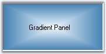
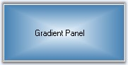
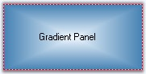

::: {style="DISPLAY: none"}
{#d2h_url_template}{#d2h_package_url style="WIDTH: 0px; DISPLAY: none; HEIGHT: 0px"}
:::

::::::: {.d2h_secondary_topic style="PADDING-BOTTOM: 10pt; MARGIN: 0pt; PADDING-LEFT: 0pt; PADDING-RIGHT: 0pt; PADDING-TOP: 0pt"}
##### Concepts and Features {#concepts-and-features style="tab-stops: 0pt"}

[]{style="COLOR: #15428b"} 

This section will take you in detail about the concepts and features available for the gradient panel and guides you to customize the control using the features available.

[]{style="COLOR: #15428b"} 

###### []{#p458}[]{#_GradientPanel_Appearance}3.3.6.2.4.1 GradientPanel Appearance {#gradientpanel-appearance style="tab-stops: 0pt"}

[]{style="COLOR: #15428b"} 

The background of the GradientPanel can be customized using the below properties.

[]{style="COLOR: black; FONT-SIZE: 8pt"} 

::: {align="center"}
  -------------------------- ------------------------------------------------------------------------
  GradientPanel Properties   Description
  BackColor                  Background color used to display the text and graphics in the control.
  BackgroundColor            Sets a gradient style background for the control.
  -------------------------- ------------------------------------------------------------------------
:::

[]{style="COLOR: black; FONT-SIZE: 8pt"} 

+-----------------------------------------------------------------------------------------------------------------------------------------------------------------------------------------------------------------------------------------------------------------------------------------------------------------------------------------------------------------------------------------------------+
| **[\[C#\]]{style="FONT-FAMILY: 'Courier New'; COLOR: black"}**                                                                                                                                                                                                                                                                                                                                      |
|                                                                                                                                                                                                                                                                                                                                                                                                     |
| **[]{style="FONT-FAMILY: 'Courier New'; COLOR: black"}**                                                                                                                                                                                                                                                                                                                                            |
|                                                                                                                                                                                                                                                                                                                                                                                                     |
| [this]{style="FONT-FAMILY: 'Courier New'; COLOR: blue"}[.gradientPanel1.BackColor = System.Drawing.Color.LightCoral;]{style="FONT-FAMILY: 'Courier New'"}                                                                                                                                                                                                                                           |
|                                                                                                                                                                                                                                                                                                                                                                                                     |
| [this]{style="FONT-FAMILY: 'Courier New'; COLOR: blue"}[.gradientPanel1.BackgroundColor = [new]{style="COLOR: blue"} Syncfusion.Drawing.[BrushInfo]{style="COLOR: teal"}(Syncfusion.Drawing.[GradientStyle]{style="COLOR: teal"}.PathRectangle, System.Drawing.[Color]{style="COLOR: teal"}.AliceBlue, System.Drawing.[Color]{style="COLOR: teal"}.SteelBlue);]{style="FONT-FAMILY: 'Courier New'"} |
+-----------------------------------------------------------------------------------------------------------------------------------------------------------------------------------------------------------------------------------------------------------------------------------------------------------------------------------------------------------------------------------------------------+

[]{style="COLOR: #15428b"} 

+-------------------------------------------------------------------------------------------------------------------------------------------------------------------------------------------------------------------------------------------------------------------------------------------------------+
| **[\[VB.NET\]]{style="FONT-FAMILY: 'Courier New'; COLOR: black"}**                                                                                                                                                                                                                                    |
|                                                                                                                                                                                                                                                                                                       |
| **[]{style="FONT-FAMILY: 'Courier New'; COLOR: black"}**                                                                                                                                                                                                                                              |
|                                                                                                                                                                                                                                                                                                       |
| [Me]{style="FONT-FAMILY: 'Courier New'; COLOR: blue"}[.gradientPanel1.BackColor = System.Drawing.Color.LightCoral]{style="FONT-FAMILY: 'Courier New'"}                                                                                                                                                |
|                                                                                                                                                                                                                                                                                                       |
| [Me]{style="FONT-FAMILY: 'Courier New'; COLOR: blue"}[.gradientPanel1.BackgroundColor = [New]{style="COLOR: blue"} Syncfusion.Drawing.BrushInfo(Syncfusion.Drawing.GradientStyle.PathRectangle, System.Drawing.Color.AliceBlue, System.Drawing.Color.SteelBlue) ]{style="FONT-FAMILY: 'Courier New'"} |
+-------------------------------------------------------------------------------------------------------------------------------------------------------------------------------------------------------------------------------------------------------------------------------------------------------+

[]{style="FONT-SIZE: 8pt"} 

{border="0"}

**[]{style="COLOR: #15428b"}** 

Figure 392: Gradient Panel with Gradient Background

**[]{style="COLOR: #15428b"}** 

Foreground Settings

[]{style="COLOR: #15428b"} 

The foreground text in the control can be customized using the below properties.

[]{style="COLOR: #15428b"} 

::: {align="center"}
  -------------------------- --------------------------------------------------------------
  GradientPanel Properties   Description
  Font                       Indicates the Font style of the text in the control.
  ForeColor                  Indicates the color of the text and graphics in the control.
  -------------------------- --------------------------------------------------------------
:::

[]{style="COLOR: #15428b"} 

+-----------------------------------------------------------------------------------------------------------------------------------------------------------------------------------------------------------------------------------------------------------------------------------------------+
| **[\[C#\]]{style="FONT-FAMILY: 'Courier New'; COLOR: black"}**                                                                                                                                                                                                                                |
|                                                                                                                                                                                                                                                                                               |
| **[]{style="FONT-FAMILY: 'Courier New'; COLOR: black"}**                                                                                                                                                                                                                                      |
|                                                                                                                                                                                                                                                                                               |
| [this]{style="FONT-FAMILY: 'Courier New'; COLOR: blue"}[.gradientPanel1.Font = [new]{style="COLOR: blue"} System.Drawing.[Font]{style="COLOR: teal"}([\"Verdana\"]{style="COLOR: maroon"}, 8.25F, System.Drawing.[FontStyle]{style="COLOR: teal"}.Bold);]{style="FONT-FAMILY: 'Courier New'"} |
|                                                                                                                                                                                                                                                                                               |
| [this]{style="FONT-FAMILY: 'Courier New'; COLOR: blue"}[.gradientPanel1.ForeColor = System.Drawing.[Color]{style="COLOR: teal"}.Blue;]{style="FONT-FAMILY: 'Courier New'"}                                                                                                                    |
+-----------------------------------------------------------------------------------------------------------------------------------------------------------------------------------------------------------------------------------------------------------------------------------------------+

[]{style="COLOR: #15428b"} 

+----------------------------------------------------------------------------------------------------------------------------------------------------------------------------------------------------------------------------------------------------------------------------------------------------------------------------+
| **[\[VB.NET\]]{style="FONT-FAMILY: 'Courier New'; COLOR: black"}**                                                                                                                                                                                                                                                         |
|                                                                                                                                                                                                                                                                                                                            |
| **[]{style="FONT-FAMILY: 'Courier New'; COLOR: black"}**                                                                                                                                                                                                                                                                   |
|                                                                                                                                                                                                                                                                                                                            |
| [Me]{style="FONT-FAMILY: 'Courier New'; COLOR: blue"}[.GradientPanel1.Font = [New]{style="COLOR: blue"} System.Drawing.Font(\"Comic Sans MS\", 9.75F, System.Drawing.FontStyle.Bold, System.Drawing.GraphicsUnit.Point, [CType]{style="COLOR: blue"}(0, [Byte]{style="COLOR: blue"}))]{style="FONT-FAMILY: 'Courier New'"} |
|                                                                                                                                                                                                                                                                                                                            |
| [this]{style="FONT-FAMILY: 'Courier New'; COLOR: blue"}[.gradientPanel1.ForeColor = System.Drawing.Color.Blue;]{style="FONT-FAMILY: 'Courier New'"}                                                                                                                                                                        |
+----------------------------------------------------------------------------------------------------------------------------------------------------------------------------------------------------------------------------------------------------------------------------------------------------------------------------+

[]{style="FONT-SIZE: 8pt"} 

{border="0"}

**[]{style="COLOR: #15428b"}** 

Figure 393: Gradient Panel with FontStyle

**[]{style="COLOR: #15428b"}** 

Image Settings

[]{style="COLOR: #15428b"} 

Background image for the GradientPanel control is set using below properties.

[]{style="COLOR: #15428b"} 

::: {align="center"}
  -------------------------- --------------------------------------------
  GradientPanel Properties   Description
  BackgroundImage            Sets the background image for the control.
  BackgroundImageLayout      Specifies the layout of the image.
  -------------------------- --------------------------------------------
:::

[]{style="FONT-SIZE: 8pt"} 

+-------------------------------------------------------------------------------------------------------------------------------------------------------------------------------------------------------------------------------------------------------------------+
| **[\[C#\]]{style="FONT-FAMILY: 'Courier New'; COLOR: black"}**                                                                                                                                                                                                    |
|                                                                                                                                                                                                                                                                   |
| **[]{style="FONT-FAMILY: 'Courier New'; COLOR: black"}**                                                                                                                                                                                                          |
|                                                                                                                                                                                                                                                                   |
| [this]{style="FONT-FAMILY: 'Courier New'; COLOR: blue"}[.gradientPanel1.BackgroundImage = ((System.Drawing.[Image]{style="COLOR: teal"})(resources.GetObject([\"gradientPanel1.BackgroundImage\"]{style="COLOR: maroon"})));]{style="FONT-FAMILY: 'Courier New'"} |
|                                                                                                                                                                                                                                                                   |
| [this]{style="FONT-FAMILY: 'Courier New'; COLOR: blue"}[.gradientPanel1.BackgroundImageLayout = System.Windows.Forms.[ImageLayout]{style="COLOR: teal"}.Stretch;     ]{style="FONT-FAMILY: 'Courier New'"}[      ]{style="FONT-FAMILY: 'Courier New'"}            |
+-------------------------------------------------------------------------------------------------------------------------------------------------------------------------------------------------------------------------------------------------------------------+

[]{style="COLOR: #15428b"} 

+---------------------------------------------------------------------------------------------------------------------------------------------------------------------------------------------------------------------------------------------------------------------+
| **[\[VB.NET\]]{style="FONT-FAMILY: 'Courier New'; COLOR: black"}**                                                                                                                                                                                                  |
|                                                                                                                                                                                                                                                                     |
| **[]{style="FONT-FAMILY: 'Courier New'; COLOR: black"}**                                                                                                                                                                                                            |
|                                                                                                                                                                                                                                                                     |
| [Me]{style="FONT-FAMILY: 'Courier New'; COLOR: blue"}[.gradientPanel1.BackgroundImage = [CType]{style="COLOR: blue"}((resources.GetObject([\"gradientPanel1.BackgroundImage\"]{style="COLOR: maroon"})),System.Drawing.Image) ]{style="FONT-FAMILY: 'Courier New'"} |
|                                                                                                                                                                                                                                                                     |
| [Me]{style="FONT-FAMILY: 'Courier New'; COLOR: blue"}[.gradientPanel1.BackgroundImageLayout = System.Windows.Forms.ImageLayout.Stretch]{style="FONT-FAMILY: 'Courier New'"}                                                                                         |
+---------------------------------------------------------------------------------------------------------------------------------------------------------------------------------------------------------------------------------------------------------------------+

[]{style="FONT-SIZE: 8pt"} 

{border="0"}

**[]{style="COLOR: #15428b"}** 

Figure 394: Background Image for GradientPanel

**[]{style="COLOR: #15428b"}** 

See Also

**[]{style="COLOR: #15428b"}** 

[Border Settings]{.UGHyperlink}[]{.UGHyperlink}

###### []{#p459}[]{#_Border_Settings}3.3.6.2.4.2 Border Settings {#border-settings style="tab-stops: 0pt"}

[]{style="COLOR: #15428b"} 

GradientPanel can have 2D and 3D borders. The properties which sets the border style are as follows.

**[]{style="COLOR: #15428b"}** 

::: {align="center"}
+-----------------------------------+-------------------------------------------------------------------------------------------------------------------------------+
| GradientPanel Property            | Description                                                                                                                   |
+-----------------------------------+-------------------------------------------------------------------------------------------------------------------------------+
| BorderStyle                       | Sets the 2D or 3D border for the GradientPanel. The options are,                                                              |
|                                   |                                                                                                                               |
|                                   |                                                                                                                               |
|                                   |                                                                                                                               |
|                                   | FixedSingle and                                                                                                               |
|                                   |                                                                                                                               |
|                                   | Fixed3D.                                                                                                                      |
+-----------------------------------+-------------------------------------------------------------------------------------------------------------------------------+
| Border3DStyle                     | Sets the style of the 3D border. The options are,                                                                             |
|                                   |                                                                                                                               |
|                                   |                                                                                                                               |
|                                   |                                                                                                                               |
|                                   | RaisedOuter,                                                                                                                  |
|                                   |                                                                                                                               |
|                                   | RaisedInner,                                                                                                                  |
|                                   |                                                                                                                               |
|                                   | SunkenOuter,                                                                                                                  |
|                                   |                                                                                                                               |
|                                   | SunkenInner,                                                                                                                  |
|                                   |                                                                                                                               |
|                                   | Raised,                                                                                                                       |
|                                   |                                                                                                                               |
|                                   | Etched,                                                                                                                       |
|                                   |                                                                                                                               |
|                                   | Bump,                                                                                                                         |
|                                   |                                                                                                                               |
|                                   | Sunken,                                                                                                                       |
|                                   |                                                                                                                               |
|                                   | Adjust and                                                                                                                    |
|                                   |                                                                                                                               |
|                                   | Flat.                                                                                                                         |
+-----------------------------------+-------------------------------------------------------------------------------------------------------------------------------+
| BorderSingle                      | Indicates the 2D border style. The options are,                                                                               |
|                                   |                                                                                                                               |
|                                   |                                                                                                                               |
|                                   |                                                                                                                               |
|                                   | Solid,                                                                                                                        |
|                                   |                                                                                                                               |
|                                   | Dotted,                                                                                                                       |
|                                   |                                                                                                                               |
|                                   | Dashed,                                                                                                                       |
|                                   |                                                                                                                               |
|                                   | Inset,                                                                                                                        |
|                                   |                                                                                                                               |
|                                   | Outset and                                                                                                                    |
|                                   |                                                                                                                               |
|                                   | None.                                                                                                                         |
+-----------------------------------+-------------------------------------------------------------------------------------------------------------------------------+
| BorderColor                       | Sets the color for the 2D border. The BorderColor will be effective only when the BorderStyle property is set to FixedSingle. |
+-----------------------------------+-------------------------------------------------------------------------------------------------------------------------------+
| BorderSides                       | Specifies the sides of the control which should have a border.                                                                |
+-----------------------------------+-------------------------------------------------------------------------------------------------------------------------------+
:::

[]{style="COLOR: #15428b"} 

+---------------------------------------------------------------------------------------------------------------------------------------------------------------------------------------------------+
| **[\[C#\]]{style="FONT-FAMILY: 'Courier New'; COLOR: black"}**                                                                                                                                    |
|                                                                                                                                                                                                   |
| **[]{style="FONT-FAMILY: 'Courier New'; COLOR: black"}**                                                                                                                                          |
|                                                                                                                                                                                                   |
| [//Sets the 3D border style ]{style="FONT-FAMILY: 'Courier New'; COLOR: green"}                                                                                                                   |
|                                                                                                                                                                                                   |
| [this]{style="FONT-FAMILY: 'Courier New'; COLOR: blue"}[.gradientPanel1.BorderStyle = System.Windows.Forms.[BorderStyle]{style="COLOR: teal"}.FixedSingle;]{style="FONT-FAMILY: 'Courier New'"}   |
|                                                                                                                                                                                                   |
| [this]{style="FONT-FAMILY: 'Courier New'; COLOR: blue"}[.gradientPanel1.Border3DStyle = System.Windows.Forms.Border3DStyle.Etched;]{style="FONT-FAMILY: 'Courier New'"}                           |
|                                                                                                                                                                                                   |
| []{style="FONT-FAMILY: 'Courier New'; COLOR: blue"}                                                                                                                                               |
|                                                                                                                                                                                                   |
| [//Sets the 2D Border style]{style="FONT-FAMILY: 'Courier New'; COLOR: green"}                                                                                                                    |
|                                                                                                                                                                                                   |
| [this]{style="FONT-FAMILY: 'Courier New'; COLOR: blue"}[.gradientPanel1.BorderColor = System.Drawing.Color.Blue;]{style="FONT-FAMILY: 'Courier New'"}                                             |
|                                                                                                                                                                                                   |
| [this]{style="FONT-FAMILY: 'Courier New'; COLOR: blue"}[.gradientPanel1.BorderSingle = System.Windows.Forms.[ButtonBorderStyle]{style="COLOR: teal"}.Dashed;]{style="FONT-FAMILY: 'Courier New'"} |
|                                                                                                                                                                                                   |
| [this]{style="FONT-FAMILY: 'Courier New'; COLOR: blue"}[.gradientPanel1.BorderSides = System.Windows.Forms.[Border3DSide]{style="COLOR: teal"}.All;]{style="FONT-FAMILY: 'Courier New'"}          |
+---------------------------------------------------------------------------------------------------------------------------------------------------------------------------------------------------+

[]{style="COLOR: #15428b"} 

+------------------------------------------------------------------------------------------------------------------------------------------------------------------------------------------------+
| **[\[VB.NET\]]{style="FONT-FAMILY: 'Courier New'; COLOR: black"}**                                                                                                                             |
|                                                                                                                                                                                                |
| **[]{style="FONT-FAMILY: 'Courier New'; COLOR: black"}**                                                                                                                                       |
|                                                                                                                                                                                                |
| [\'Sets the 3D border style]{style="FONT-FAMILY: 'Courier New'; COLOR: green"}                                                                                                                 |
|                                                                                                                                                                                                |
| [Me]{style="FONT-FAMILY: 'Courier New'; COLOR: blue"}[.gradientPanel1.BorderStyle = System.Windows.Forms.[BorderStyle]{style="COLOR: teal"}.FixedSingle]{style="FONT-FAMILY: 'Courier New'"}   |
|                                                                                                                                                                                                |
| [Me]{style="FONT-FAMILY: 'Courier New'; COLOR: blue"}[.gradientPanel1.Border3DStyle = System.Windows.Forms.Border3DStyle.Etched]{style="FONT-FAMILY: 'Courier New'"}                           |
|                                                                                                                                                                                                |
| [Me]{style="FONT-FAMILY: 'Courier New'; COLOR: blue"}[.gradientPanel1.BorderColor = System.Drawing.Color.Blue]{style="FONT-FAMILY: 'Courier New'"}                                             |
|                                                                                                                                                                                                |
| []{style="FONT-FAMILY: 'Courier New'"}                                                                                                                                                         |
|                                                                                                                                                                                                |
| [\'Sets the 2D Border style]{style="FONT-FAMILY: 'Courier New'; COLOR: green"}                                                                                                                 |
|                                                                                                                                                                                                |
| [Me]{style="FONT-FAMILY: 'Courier New'; COLOR: blue"}[.gradientPanel1.BorderSingle = System.Windows.Forms.[ButtonBorderStyle]{style="COLOR: teal"}.Dashed]{style="FONT-FAMILY: 'Courier New'"} |
|                                                                                                                                                                                                |
| [Me]{style="FONT-FAMILY: 'Courier New'; COLOR: blue"}[.gradientPanel1.BorderSides = System.Windows.Forms.[Border3DSide]{style="COLOR: teal"}.All]{style="FONT-FAMILY: 'Courier New'"}          |
+------------------------------------------------------------------------------------------------------------------------------------------------------------------------------------------------+

[]{style="COLOR: #15428b"} 

{border="0"}

Figure 395: Border3DStyle = \"Etched\"

**[]{style="COLOR: #15428b"}** 

{border="0"}

Figure 396: BorderSingle = \"Dashed\"; BorderColor = \"Crimson\"

[]{style="FONT-SIZE: 8pt"} 

See Also

**[]{style="COLOR: #15428b"}** 

[GradientPanel Appearance]{.UGHyperlink}[]{.UGHyperlink}

###### []{#p460}[]{#_Scroll_Settings}3.3.6.2.4.3 Scroll Settings {#scroll-settings style="tab-stops: 0pt"}

[]{style="COLOR: #15428b"} 

When the contents inside the gradient panel exceeds the visible area, the scroll bars appears. AutoScroll property should be set to true for this purpose. Margin width for the control during auto scroll is set through **AutoScrollMargin** property. The minimum logical size for the auto scroll region is specified using the **AutoScrollMinSize**.

[]{style="COLOR: #15428b"} 

+-----------------------------------------------------------------------------------------------------------------------------------------------------------------------------------------------------------------+
| **[\[C#\]]{style="FONT-FAMILY: 'Courier New'; COLOR: black"}**                                                                                                                                                  |
|                                                                                                                                                                                                                 |
| **[]{style="FONT-FAMILY: 'Courier New'; COLOR: black"}**                                                                                                                                                        |
|                                                                                                                                                                                                                 |
| [this]{style="FONT-FAMILY: 'Courier New'; COLOR: blue"}[.gradientPanel1.AutoScroll = [true]{style="COLOR: blue"};]{style="FONT-FAMILY: 'Courier New'"}                                                          |
|                                                                                                                                                                                                                 |
| [this]{style="FONT-FAMILY: 'Courier New'; COLOR: blue"}[.gradientPanel1.AutoScrollMargin = [new]{style="COLOR: blue"} System.Drawing.[Size]{style="COLOR: teal"}(5, 5);]{style="FONT-FAMILY: 'Courier New'"}    |
|                                                                                                                                                                                                                 |
| [this]{style="FONT-FAMILY: 'Courier New'; COLOR: blue"}[.gradientPanel1.AutoScrollMinSize = [new]{style="COLOR: blue"} System.Drawing.[Size]{style="COLOR: teal"}(20, 20);]{style="FONT-FAMILY: 'Courier New'"} |
+-----------------------------------------------------------------------------------------------------------------------------------------------------------------------------------------------------------------+

[]{style="COLOR: #15428b"} 

+--------------------------------------------------------------------------------------------------------------------------------------------------------------------------------------------------------------+
| **[\[VB.NET\]]{style="FONT-FAMILY: 'Courier New'; COLOR: black"}**                                                                                                                                           |
|                                                                                                                                                                                                              |
| **[]{style="FONT-FAMILY: 'Courier New'; COLOR: black"}**                                                                                                                                                     |
|                                                                                                                                                                                                              |
| [Me]{style="FONT-FAMILY: 'Courier New'; COLOR: blue"}[.gradientPanel1.AutoScroll = [True]{style="COLOR: blue"}]{style="FONT-FAMILY: 'Courier New'"}                                                          |
|                                                                                                                                                                                                              |
| [Me]{style="FONT-FAMILY: 'Courier New'; COLOR: blue"}[.gradientPanel1.AutoScrollMargin = [New]{style="COLOR: blue"} System.Drawing.[Size]{style="COLOR: teal"}(5, 5)]{style="FONT-FAMILY: 'Courier New'"}    |
|                                                                                                                                                                                                              |
| [Me]{style="FONT-FAMILY: 'Courier New'; COLOR: blue"}[.gradientPanel1.AutoScrollMinSize = [New]{style="COLOR: blue"} System.Drawing.[Size]{style="COLOR: teal"}(20, 20)]{style="FONT-FAMILY: 'Courier New'"} |
+--------------------------------------------------------------------------------------------------------------------------------------------------------------------------------------------------------------+

[]{style="COLOR: #15428b"} 

Size properties

**[]{style="COLOR: #15428b"}** 

The GradientPanel can automatically size itself based on the contents available in the control by enabling the **AutoSize** property. The mode of this resizing can be specified through **AutoSizeMode** property. There are two options provided for the AutoSizeMode.

[]{style="COLOR: #15428b"} 

[·      ]{style="FONT-FAMILY: Symbol"}GrowOnly - the control grows as much as necessary to fit its contents but doesn\'t shrink smaller than the value specified in Size property of the control.

[·      ]{style="FONT-FAMILY: Symbol"}GrowAndShrink - the control grows and shrinks to fit its contents to a size may be less than that specified in Size property.

[]{style="COLOR: #15428b"} 

+------------------------------------------------------------------------------------------------------------------------------------------------------------------------------------------------+
| **[\[C#\]]{style="FONT-FAMILY: 'Courier New'; COLOR: black"}**                                                                                                                                 |
|                                                                                                                                                                                                |
| **[]{style="FONT-FAMILY: 'Courier New'; COLOR: black"}**                                                                                                                                       |
|                                                                                                                                                                                                |
| [this]{style="FONT-FAMILY: 'Courier New'; COLOR: blue"}[.gradientPanel1.AutoSize = [true]{style="COLOR: blue"};]{style="FONT-FAMILY: 'Courier New'"}                                           |
|                                                                                                                                                                                                |
| [this]{style="FONT-FAMILY: 'Courier New'; COLOR: blue"}[.gradientPanel1.AutoSizeMode = System.Windows.Forms.[AutoSizeMode]{style="COLOR: teal"}.GrowOnly;]{style="FONT-FAMILY: 'Courier New'"} |
+------------------------------------------------------------------------------------------------------------------------------------------------------------------------------------------------+

[]{style="COLOR: #15428b"} 

+---------------------------------------------------------------------------------------------------------------------------------------------------------------------------------------------+
| **[\[VB.NET\]]{style="FONT-FAMILY: 'Courier New'; COLOR: black"}**                                                                                                                          |
|                                                                                                                                                                                             |
| **[]{style="FONT-FAMILY: 'Courier New'; COLOR: black"}**                                                                                                                                    |
|                                                                                                                                                                                             |
| [Me]{style="FONT-FAMILY: 'Courier New'; COLOR: blue"}[.gradientPanel1.AutoSize = [True]{style="COLOR: blue"}]{style="FONT-FAMILY: 'Courier New'"}                                           |
|                                                                                                                                                                                             |
| [Me]{style="FONT-FAMILY: 'Courier New'; COLOR: blue"}[.gradientPanel1.AutoSizeMode = System.Windows.Forms.[AutoSizeMode]{style="COLOR: teal"}.GrowOnly]{style="FONT-FAMILY: 'Courier New'"} |
+---------------------------------------------------------------------------------------------------------------------------------------------------------------------------------------------+

[]{#related-topics}
:::::::
