::: {style="DISPLAY: none"}
{#d2h_url_template}{#d2h_package_url style="WIDTH: 0px; DISPLAY: none; HEIGHT: 0px"}
:::

:::::: {.d2h_secondary_topic style="PADDING-BOTTOM: 10pt; MARGIN: 0pt; PADDING-LEFT: 0pt; PADDING-RIGHT: 0pt; PADDING-TOP: 0pt"}
##### Concepts and Features {#concepts-and-features style="tab-stops: 0pt"}

**[]{style="COLOR: #15428b"}** 

A few important aspects of the GradientPanelExt have been discussed in this section.

[]{style="COLOR: #15428b"} 

###### []{#p467}[]{#_Primitives}3.3.6.3.3.1 Primitives {#primitives style="tab-stops: 0pt"}

[]{style="COLOR: #15428b"} 

One of the most sophisticated features provided by the GradientPanelExt is its ability to include primitives in the borders.

[]{style="COLOR: #15428b"} 

The primitives that can be included in the GradientPanelExt are,

[]{style="COLOR: #15428b"} 

[·      ]{style="FONT-FAMILY: Symbol"}Collapse Primitive - Facilitates expand and collapse option for the GradientPanelExt, with image provisions.

[·      ]{style="FONT-FAMILY: Symbol"}Image Primitive - Images can be placed along any of the panel borders with gradient background.

[·      ]{style="FONT-FAMILY: Symbol"}Text Primitive - Text can be included in the GradientPanelExt\'s borders.

[·      ]{style="FONT-FAMILY: Symbol"}Host Primitive - Any Windows Forms or custom .NET Control can be placed along the panel borders.

[]{style="COLOR: #15428b"} 

The primitives for the GradientPanelExt can be included using the **GradientPanelExt PrimitiveCollection Editor**, which can be opened using the **primitives** property.

[]{style="COLOR: #15428b"} 

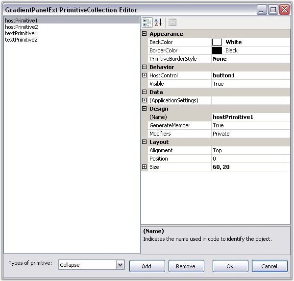{border="0"}

Figure 401: GradientPanelExt Primitive Collection Editor

**[]{style="COLOR: #15428b"}** 

The primitive type to be included should be chosen from the Types of Primitives available in the GradientPanelExt Collection Editor, and added to the control. The properties for the primitive can be set in the property grid available at the right side.

[]{#p468}[]{#_Expand_and_Collapse}3.3.6.3.3.1.1      Expand and Collapse Options

[]{style="COLOR: #15428b"} 

Including the Collapse primitive, provides option to expand and collapse the GradientPanelExt. Performing the following steps will add the Collapse Primitive at design time.

[]{style="COLOR: #15428b"} 

1.   Open the GradientPanelExt Collection Editor, and choose the Collapse primitive from the ComboBox available and add it.

2.   Set the collapse and expand images in the **CollapseImage** and **ExpandImage** property respectively.

3.   Specify the alignment and position of the primitive using its respective properties.

4.   Close the GradientPanelExt Collection Editor. Build and run the application.

5.   Now clicking on the Collapse primitive, collapses the control. The control collapses and expands on alternate clicks.

[]{style="COLOR: #15428b"} 

+---------------------------------------------------------------------------------------------------------------------------------------------------------------------------------------------------------------+
| **[\[C#\]]{style="FONT-FAMILY: 'Courier New'; COLOR: black"}**                                                                                                                                                |
|                                                                                                                                                                                                               |
| []{style="FONT-FAMILY: 'Courier New'"}                                                                                                                                                                        |
|                                                                                                                                                                                                               |
| [Syncfusion.Windows.Forms.Tools.[CollapsePrimitive]{style="COLOR: teal"} collapsePrimitive1;]{style="FONT-FAMILY: 'Courier New'"}                                                                             |
|                                                                                                                                                                                                               |
| [gradientPanelExt1.Primitives.Add(collapsePrimitive1);]{style="FONT-FAMILY: 'Courier New'"}                                                                                                                   |
|                                                                                                                                                                                                               |
| [collapsePrimitive1.Alignment = Syncfusion.Windows.Forms.Tools.[Alignment]{style="COLOR: teal"}.Bottom;]{style="FONT-FAMILY: 'Courier New'"}                                                                  |
|                                                                                                                                                                                                               |
| [collapsePrimitive1.BackColor = System.Drawing.[Color]{style="COLOR: teal"}.Transparent;]{style="FONT-FAMILY: 'Courier New'"}                                                                                 |
|                                                                                                                                                                                                               |
| [collapsePrimitive1.CollapseImage = ((System.Drawing.[Image]{style="COLOR: teal"})(resources.GetObject([\"collapsePrimitive1.CollapseImage\"]{style="COLOR: maroon"})));]{style="FONT-FAMILY: 'Courier New'"} |
|                                                                                                                                                                                                               |
| [collapsePrimitive1.ExpandImage = ((System.Drawing.[Image]{style="COLOR: teal"})(resources.GetObject([\"collapsePrimitive1.ExpandImage\"]{style="COLOR: maroon"})));]{style="FONT-FAMILY: 'Courier New'"}     |
|                                                                                                                                                                                                               |
| [collapsePrimitive1.Position = 130;]{style="FONT-FAMILY: 'Courier New'"}                                                                                                                                      |
|                                                                                                                                                                                                               |
| [collapsePrimitive1.Size = [new]{style="COLOR: blue"} System.Drawing.[Size]{style="COLOR: teal"}(40, 40);]{style="FONT-FAMILY: 'Courier New'"}                                                                |
+---------------------------------------------------------------------------------------------------------------------------------------------------------------------------------------------------------------+

[]{style="COLOR: #15428b"} 

+----------------------------------------------------------------------------------------------------------------------------------------------------------------------------------------------------------------------------------------------------------------------------------------------+
| **[\[VB.NET\]]{style="FONT-FAMILY: 'Courier New'; COLOR: black"}**                                                                                                                                                                                                                           |
|                                                                                                                                                                                                                                                                                              |
| **[]{style="FONT-FAMILY: 'Courier New'; COLOR: black"}**                                                                                                                                                                                                                                     |
|                                                                                                                                                                                                                                                                                              |
| [Private]{style="FONT-FAMILY: 'Courier New'; COLOR: blue"}[ collapsePrimitive1 [As]{style="COLOR: blue"} Syncfusion.Windows.Forms.Tools.CollapsePrimitive]{style="FONT-FAMILY: 'Courier New'"}                                                                                               |
|                                                                                                                                                                                                                                                                                              |
| [gradientPanelExt1.Primitives.Add(collapsePrimitive1)]{style="FONT-FAMILY: 'Courier New'"}                                                                                                                                                                                                   |
|                                                                                                                                                                                                                                                                                              |
| [Private]{style="FONT-FAMILY: 'Courier New'; COLOR: blue"}[ collapsePrimitive1.Alignment = Syncfusion.Windows.Forms.Tools.Alignment.Bottom]{style="FONT-FAMILY: 'Courier New'"}                                                                                                              |
|                                                                                                                                                                                                                                                                                              |
| [Private]{style="FONT-FAMILY: 'Courier New'; COLOR: blue"}[ collapsePrimitive1.BackColor = System.Drawing.Color.Transparent]{style="FONT-FAMILY: 'Courier New'"}                                                                                                                             |
|                                                                                                                                                                                                                                                                                              |
| [Private]{style="FONT-FAMILY: 'Courier New'; COLOR: blue"}[ collapsePrimitive1.CollapseImage = ([CType]{style="COLOR: blue"}(resources.GetObject([\"collapsePrimitive1.CollapseImage\"]{style="COLOR: maroon"}),                 System.Drawing.Image))]{style="FONT-FAMILY: 'Courier New'"} |
|                                                                                                                                                                                                                                                                                              |
| [Private]{style="FONT-FAMILY: 'Courier New'; COLOR: blue"}[ collapsePrimitive1.ExpandImage = ([CType]{style="COLOR: blue"}(resources.GetObject([\"collapsePrimitive1.ExpandImage\"]{style="COLOR: maroon"}),                     System.Drawing.Image))]{style="FONT-FAMILY: 'Courier New'"} |
|                                                                                                                                                                                                                                                                                              |
| [Private]{style="FONT-FAMILY: 'Courier New'; COLOR: blue"}[ collapsePrimitive1.Position = 130]{style="FONT-FAMILY: 'Courier New'"}                                                                                                                                                           |
|                                                                                                                                                                                                                                                                                              |
| [Private]{style="FONT-FAMILY: 'Courier New'; COLOR: blue"}[ collapsePrimitive1.Size = [New]{style="COLOR: blue"} System.Drawing.Size(40, 40)]{style="FONT-FAMILY: 'Courier New'"}                                                                                                            |
+----------------------------------------------------------------------------------------------------------------------------------------------------------------------------------------------------------------------------------------------------------------------------------------------+

[]{style="COLOR: #15428b"} 

 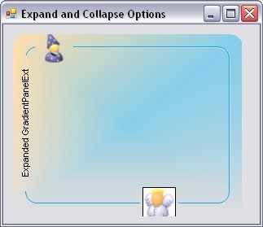{border="0"}

Figure 402: Expanded GradientPanelExt

**[]{style="COLOR: #15428b"}** 

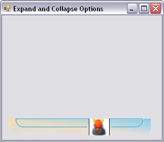{border="0"}

Figure 403: Collapsed GradientPanelExt

**[]{style="COLOR: #15428b"}** 

See Also

[]{style="COLOR: #15428b"} 

[Image and Text Primitives]{.UGHyperlink}[, ]{.UGHyperlink}[Host Primitives]{.UGHyperlink}[]{.UGHyperlink}

[]{#p469}[]{#_Image_and_Text}3.3.6.3.3.1.2      Image and Text Primitives

[]{style="COLOR: #15428b"} 

Images and text can be included as individual primitives for the GradientPanelExt.

 

The image to be included, should be referenced in the **Image** property available for the primitive in the GradientPanelExt Collection Editor.

 

The text for text primitive, can be specified using the **Text** property available for the primitive in the GradientPanelExt Collection Editor. The text font and color can also be defined for the text primitive, using the **TextFont** and **TextColor** properties, respectively.

**[]{style="COLOR: #15428b"}** 

+------------------------------------------------------------------------------------------------------------------------------------------------------------------------------------------------------------------------------------------------------------------------------------------------------------------------------------------------------------------------------------------------------------------------------------------------------------------------------------------------------------------------+
| **[\[C#\]]{style="FONT-FAMILY: 'Courier New'; COLOR: black"}**                                                                                                                                                                                                                                                                                                                                                                                                                                                         |
|                                                                                                                                                                                                                                                                                                                                                                                                                                                                                                                        |
| []{style="FONT-FAMILY: 'Courier New'"}                                                                                                                                                                                                                                                                                                                                                                                                                                                                                 |
|                                                                                                                                                                                                                                                                                                                                                                                                                                                                                                                        |
| [// Defining Primitives and Adding them]{style="FONT-FAMILY: 'Courier New'; COLOR: green"}                                                                                                                                                                                                                                                                                                                                                                                                                             |
|                                                                                                                                                                                                                                                                                                                                                                                                                                                                                                                        |
| [private]{style="FONT-FAMILY: 'Courier New'; COLOR: blue"}[ Syncfusion.Windows.Forms.Tools.[ImagePrimitive]{style="COLOR: teal"} imagePrimitive1;]{style="FONT-FAMILY: 'Courier New'"}                                                                                                                                                                                                                                                                                                                                 |
|                                                                                                                                                                                                                                                                                                                                                                                                                                                                                                                        |
| [private]{style="FONT-FAMILY: 'Courier New'; COLOR: blue"}[ Syncfusion.Windows.Forms.Tools.[ImagePrimitive]{style="COLOR: teal"} imagePrimitive2;]{style="FONT-FAMILY: 'Courier New'"}                                                                                                                                                                                                                                                                                                                                 |
|                                                                                                                                                                                                                                                                                                                                                                                                                                                                                                                        |
| [private]{style="FONT-FAMILY: 'Courier New'; COLOR: blue"}[ Syncfusion.Windows.Forms.Tools.[ImagePrimitive]{style="COLOR: teal"} imagePrimitive3;]{style="FONT-FAMILY: 'Courier New'"}                                                                                                                                                                                                                                                                                                                                 |
|                                                                                                                                                                                                                                                                                                                                                                                                                                                                                                                        |
| [private]{style="FONT-FAMILY: 'Courier New'; COLOR: blue"}[ Syncfusion.Windows.Forms.Tools.[ImagePrimitive]{style="COLOR: teal"} imagePrimitive4;]{style="FONT-FAMILY: 'Courier New'"}                                                                                                                                                                                                                                                                                                                                 |
|                                                                                                                                                                                                                                                                                                                                                                                                                                                                                                                        |
| [private]{style="FONT-FAMILY: 'Courier New'; COLOR: blue"}[ Syncfusion.Windows.Forms.Tools.[TextPrimitive]{style="COLOR: teal"} textPrimitive1;]{style="FONT-FAMILY: 'Courier New'"}                                                                                                                                                                                                                                                                                                                                   |
|                                                                                                                                                                                                                                                                                                                                                                                                                                                                                                                        |
| [private]{style="FONT-FAMILY: 'Courier New'; COLOR: blue"}[ Syncfusion.Windows.Forms.Tools.[TextPrimitive]{style="COLOR: teal"} textPrimitive2;]{style="FONT-FAMILY: 'Courier New'"}                                                                                                                                                                                                                                                                                                                                   |
|                                                                                                                                                                                                                                                                                                                                                                                                                                                                                                                        |
| [this]{style="FONT-FAMILY: 'Courier New'; COLOR: blue"}[.gradientPanelExt1.Primitives.AddRange([new]{style="COLOR: blue"} Syncfusion.Windows.Forms.Tools.[Primitive]{style="COLOR: teal"}\[\] {]{style="FONT-FAMILY: 'Courier New'"}                                                                                                                                                                                                                                                                                   |
|                                                                                                                                                                                                                                                                                                                                                                                                                                                                                                                        |
| [            [this]{style="COLOR: blue"}.imagePrimitive1,]{style="FONT-FAMILY: 'Courier New'"}                                                                                                                                                                                                                                                                                                                                                                                                                         |
|                                                                                                                                                                                                                                                                                                                                                                                                                                                                                                                        |
| [            [this]{style="COLOR: blue"}.imagePrimitive2,]{style="FONT-FAMILY: 'Courier New'"}                                                                                                                                                                                                                                                                                                                                                                                                                         |
|                                                                                                                                                                                                                                                                                                                                                                                                                                                                                                                        |
| [            [this]{style="COLOR: blue"}.textPrimitive1,]{style="FONT-FAMILY: 'Courier New'"}                                                                                                                                                                                                                                                                                                                                                                                                                          |
|                                                                                                                                                                                                                                                                                                                                                                                                                                                                                                                        |
| [            [this]{style="COLOR: blue"}.textPrimitive2,]{style="FONT-FAMILY: 'Courier New'"}                                                                                                                                                                                                                                                                                                                                                                                                                          |
|                                                                                                                                                                                                                                                                                                                                                                                                                                                                                                                        |
| [            [this]{style="COLOR: blue"}.imagePrimitive3,]{style="FONT-FAMILY: 'Courier New'"}                                                                                                                                                                                                                                                                                                                                                                                                                         |
|                                                                                                                                                                                                                                                                                                                                                                                                                                                                                                                        |
| [            [this]{style="COLOR: blue"}.imagePrimitive4});]{style="FONT-FAMILY: 'Courier New'"}                                                                                                                                                                                                                                                                                                                                                                                                                       |
|                                                                                                                                                                                                                                                                                                                                                                                                                                                                                                                        |
| []{style="FONT-FAMILY: 'Courier New'"}                                                                                                                                                                                                                                                                                                                                                                                                                                                                                 |
|                                                                                                                                                                                                                                                                                                                                                                                                                                                                                                                        |
| [// imagePrimitive1]{style="FONT-FAMILY: 'Courier New'; COLOR: green"}[       ]{style="FONT-FAMILY: 'Courier New'"}                                                                                                                                                                                                                                                                                                                                                                                                    |
|                                                                                                                                                                                                                                                                                                                                                                                                                                                                                                                        |
| [this]{style="FONT-FAMILY: 'Courier New'; COLOR: blue"}[.imagePrimitive1.Image = ((System.Drawing.[Image]{style="COLOR: teal"})(resources.GetObject([\"imagePrimitive1.Image\"]{style="COLOR: maroon"})));]{style="FONT-FAMILY: 'Courier New'"}                                                                                                                                                                                                                                                                        |
|                                                                                                                                                                                                                                                                                                                                                                                                                                                                                                                        |
| [this]{style="FONT-FAMILY: 'Courier New'; COLOR: blue"}[.imagePrimitive1.PrimitiveBorderStyle = Syncfusion.Windows.Forms.Tools.[PrimitiveBorderStyle]{style="COLOR: teal"}.None;]{style="FONT-FAMILY: 'Courier New'"}                                                                                                                                                                                                                                                                                                  |
|                                                                                                                                                                                                                                                                                                                                                                                                                                                                                                                        |
| [this]{style="FONT-FAMILY: 'Courier New'; COLOR: blue"}[.imagePrimitive1.Size = [new]{style="COLOR: blue"} System.Drawing.[Size]{style="COLOR: teal"}(20, 20);]{style="FONT-FAMILY: 'Courier New'"}                                                                                                                                                                                                                                                                                                                    |
|                                                                                                                                                                                                                                                                                                                                                                                                                                                                                                                        |
| [    ]{style="FONT-FAMILY: 'Courier New'"}                                                                                                                                                                                                                                                                                                                                                                                                                                                                             |
|                                                                                                                                                                                                                                                                                                                                                                                                                                                                                                                        |
| [// imagePrimitive2]{style="FONT-FAMILY: 'Courier New'; COLOR: green"}                                                                                                                                                                                                                                                                                                                                                                                                                                                 |
|                                                                                                                                                                                                                                                                                                                                                                                                                                                                                                                        |
| [this]{style="FONT-FAMILY: 'Courier New'; COLOR: blue"}[.imagePrimitive2.Alignment = Syncfusion.Windows.Forms.Tools.[Alignment]{style="COLOR: teal"}.Bottom;]{style="FONT-FAMILY: 'Courier New'"}                                                                                                                                                                                                                                                                                                                      |
|                                                                                                                                                                                                                                                                                                                                                                                                                                                                                                                        |
| [this]{style="FONT-FAMILY: 'Courier New'; COLOR: blue"}[.imagePrimitive2.Image = ((System.Drawing.[Image]{style="COLOR: teal"})(resources.GetObject([\"imagePrimitive2.Image\"]{style="COLOR: maroon"})));]{style="FONT-FAMILY: 'Courier New'"}                                                                                                                                                                                                                                                                        |
|                                                                                                                                                                                                                                                                                                                                                                                                                                                                                                                        |
| [this]{style="FONT-FAMILY: 'Courier New'; COLOR: blue"}[.imagePrimitive2.Position = 2;]{style="FONT-FAMILY: 'Courier New'"}                                                                                                                                                                                                                                                                                                                                                                                            |
|                                                                                                                                                                                                                                                                                                                                                                                                                                                                                                                        |
| [this]{style="FONT-FAMILY: 'Courier New'; COLOR: blue"}[.imagePrimitive2.PrimitiveBorderStyle = Syncfusion.Windows.Forms.Tools.[PrimitiveBorderStyle]{style="COLOR: teal"}.None;]{style="FONT-FAMILY: 'Courier New'"}                                                                                                                                                                                                                                                                                                  |
|                                                                                                                                                                                                                                                                                                                                                                                                                                                                                                                        |
| [this]{style="FONT-FAMILY: 'Courier New'; COLOR: blue"}[.imagePrimitive2.Size = [new]{style="COLOR: blue"} System.Drawing.[Size]{style="COLOR: teal"}(20, 20);]{style="FONT-FAMILY: 'Courier New'"}                                                                                                                                                                                                                                                                                                                    |
|                                                                                                                                                                                                                                                                                                                                                                                                                                                                                                                        |
| [         ]{style="FONT-FAMILY: 'Courier New'"}                                                                                                                                                                                                                                                                                                                                                                                                                                                                        |
|                                                                                                                                                                                                                                                                                                                                                                                                                                                                                                                        |
| [// textPrimitive1]{style="FONT-FAMILY: 'Courier New'; COLOR: green"}[   ]{style="FONT-FAMILY: 'Courier New'"}                                                                                                                                                                                                                                                                                                                                                                                                         |
|                                                                                                                                                                                                                                                                                                                                                                                                                                                                                                                        |
| [this]{style="FONT-FAMILY: 'Courier New'; COLOR: blue"}[.textPrimitive1.Alignment = Syncfusion.Windows.Forms.Tools.[Alignment]{style="COLOR: teal"}.Left;]{style="FONT-FAMILY: 'Courier New'"}                                                                                                                                                                                                                                                                                                                         |
|                                                                                                                                                                                                                                                                                                                                                                                                                                                                                                                        |
| [this]{style="FONT-FAMILY: 'Courier New'; COLOR: blue"}[.textPrimitive1.Position = 21;]{style="FONT-FAMILY: 'Courier New'"}                                                                                                                                                                                                                                                                                                                                                                                            |
|                                                                                                                                                                                                                                                                                                                                                                                                                                                                                                                        |
| [this]{style="FONT-FAMILY: 'Courier New'; COLOR: blue"}[.textPrimitive1.Size = [new]{style="COLOR: blue"} System.Drawing.[Size]{style="COLOR: teal"}(150, 20);]{style="FONT-FAMILY: 'Courier New'"}                                                                                                                                                                                                                                                                                                                    |
|                                                                                                                                                                                                                                                                                                                                                                                                                                                                                                                        |
| [this]{style="FONT-FAMILY: 'Courier New'; COLOR: blue"}[.textPrimitive1.Text = [\"Text in Left Border\"]{style="COLOR: maroon"};]{style="FONT-FAMILY: 'Courier New'"}                                                                                                                                                                                                                                                                                                                                                  |
|                                                                                                                                                                                                                                                                                                                                                                                                                                                                                                                        |
| [this]{style="FONT-FAMILY: 'Courier New'; COLOR: blue"}[.textPrimitive1.TextColor = System.Drawing.[Color]{style="COLOR: teal"}.DarkOliveGreen;]{style="FONT-FAMILY: 'Courier New'"}                                                                                                                                                                                                                                                                                                                                   |
|                                                                                                                                                                                                                                                                                                                                                                                                                                                                                                                        |
| [this]{style="FONT-FAMILY: 'Courier New'; COLOR: blue"}[.textPrimitive1.TextFont = [new]{style="COLOR: blue"} System.Drawing.[Font]{style="COLOR: teal"}([\"Arial\"]{style="COLOR: maroon"}, 9.75F, ((System.Drawing.[FontStyle]{style="COLOR: teal"})((System.Drawing.[        FontStyle]{style="COLOR: teal"}.Bold \| System.Drawing.[FontStyle]{style="COLOR: teal"}.Italic))), System.Drawing.[GraphicsUnit]{style="COLOR: teal"}.Point, (([byte]{style="COLOR: blue"})(0)));]{style="FONT-FAMILY: 'Courier New'"} |
|                                                                                                                                                                                                                                                                                                                                                                                                                                                                                                                        |
| [            ]{style="FONT-FAMILY: 'Courier New'"}                                                                                                                                                                                                                                                                                                                                                                                                                                                                     |
|                                                                                                                                                                                                                                                                                                                                                                                                                                                                                                                        |
| [// textPrimitive2]{style="FONT-FAMILY: 'Courier New'; COLOR: green"}                                                                                                                                                                                                                                                                                                                                                                                                                                                  |
|                                                                                                                                                                                                                                                                                                                                                                                                                                                                                                                        |
| [this]{style="FONT-FAMILY: 'Courier New'; COLOR: blue"}[.textPrimitive2.Alignment = Syncfusion.Windows.Forms.Tools.[Alignment]{style="COLOR: teal"}.Right;]{style="FONT-FAMILY: 'Courier New'"}                                                                                                                                                                                                                                                                                                                        |
|                                                                                                                                                                                                                                                                                                                                                                                                                                                                                                                        |
| [this]{style="FONT-FAMILY: 'Courier New'; COLOR: blue"}[.textPrimitive2.Position = 24;]{style="FONT-FAMILY: 'Courier New'"}                                                                                                                                                                                                                                                                                                                                                                                            |
|                                                                                                                                                                                                                                                                                                                                                                                                                                                                                                                        |
| [this]{style="FONT-FAMILY: 'Courier New'; COLOR: blue"}[.textPrimitive2.Size = [new]{style="COLOR: blue"} System.Drawing.[Size]{style="COLOR: teal"}(150, 20);]{style="FONT-FAMILY: 'Courier New'"}                                                                                                                                                                                                                                                                                                                    |
|                                                                                                                                                                                                                                                                                                                                                                                                                                                                                                                        |
| [this]{style="FONT-FAMILY: 'Courier New'; COLOR: blue"}[.textPrimitive2.Text = [\"Text in Right Border\"]{style="COLOR: maroon"};]{style="FONT-FAMILY: 'Courier New'"}                                                                                                                                                                                                                                                                                                                                                 |
|                                                                                                                                                                                                                                                                                                                                                                                                                                                                                                                        |
| [this]{style="FONT-FAMILY: 'Courier New'; COLOR: blue"}[.textPrimitive2.TextColor = System.Drawing.[Color]{style="COLOR: teal"}.DarkGreen;]{style="FONT-FAMILY: 'Courier New'"}                                                                                                                                                                                                                                                                                                                                        |
|                                                                                                                                                                                                                                                                                                                                                                                                                                                                                                                        |
| [this]{style="FONT-FAMILY: 'Courier New'; COLOR: blue"}[.textPrimitive2.TextFont = [new]{style="COLOR: blue"} System.Drawing.[Font]{style="COLOR: teal"}([\"Arial\"]{style="COLOR: maroon"}, 9.75F, ((System.Drawing.[FontStyle]{style="COLOR: teal"})((System.Drawing.[        FontStyle]{style="COLOR: teal"}.Bold \| System.Drawing.[FontStyle]{style="COLOR: teal"}.Italic))), System.Drawing.[GraphicsUnit]{style="COLOR: teal"}.Point, (([byte]{style="COLOR: blue"})(0)));]{style="FONT-FAMILY: 'Courier New'"} |
|                                                                                                                                                                                                                                                                                                                                                                                                                                                                                                                        |
| [         ]{style="FONT-FAMILY: 'Courier New'"}                                                                                                                                                                                                                                                                                                                                                                                                                                                                        |
|                                                                                                                                                                                                                                                                                                                                                                                                                                                                                                                        |
| [// imagePrimitive3]{style="FONT-FAMILY: 'Courier New'; COLOR: green"}                                                                                                                                                                                                                                                                                                                                                                                                                                                 |
|                                                                                                                                                                                                                                                                                                                                                                                                                                                                                                                        |
| [this]{style="FONT-FAMILY: 'Courier New'; COLOR: blue"}[.imagePrimitive3.Image = ((System.Drawing.[Image]{style="COLOR: teal"})(resources.GetObject([\"imagePrimitive3.Image\"]{style="COLOR: maroon"})));]{style="FONT-FAMILY: 'Courier New'"}                                                                                                                                                                                                                                                                        |
|                                                                                                                                                                                                                                                                                                                                                                                                                                                                                                                        |
| [this]{style="FONT-FAMILY: 'Courier New'; COLOR: blue"}[.imagePrimitive3.Position = 256;]{style="FONT-FAMILY: 'Courier New'"}                                                                                                                                                                                                                                                                                                                                                                                          |
|                                                                                                                                                                                                                                                                                                                                                                                                                                                                                                                        |
| [this]{style="FONT-FAMILY: 'Courier New'; COLOR: blue"}[.imagePrimitive3.PrimitiveBorderStyle = Syncfusion.Windows.Forms.Tools.[PrimitiveBorderStyle]{style="COLOR: teal"}.None;]{style="FONT-FAMILY: 'Courier New'"}                                                                                                                                                                                                                                                                                                  |
|                                                                                                                                                                                                                                                                                                                                                                                                                                                                                                                        |
| [this]{style="FONT-FAMILY: 'Courier New'; COLOR: blue"}[.imagePrimitive3.Size = [new]{style="COLOR: blue"} System.Drawing.[Size]{style="COLOR: teal"}(20, 20);]{style="FONT-FAMILY: 'Courier New'"}                                                                                                                                                                                                                                                                                                                    |
|                                                                                                                                                                                                                                                                                                                                                                                                                                                                                                                        |
| []{style="FONT-FAMILY: 'Courier New'"}                                                                                                                                                                                                                                                                                                                                                                                                                                                                                 |
|                                                                                                                                                                                                                                                                                                                                                                                                                                                                                                                        |
| [// imagePrimitive4]{style="FONT-FAMILY: 'Courier New'; COLOR: green"}                                                                                                                                                                                                                                                                                                                                                                                                                                                 |
|                                                                                                                                                                                                                                                                                                                                                                                                                                                                                                                        |
| [this]{style="FONT-FAMILY: 'Courier New'; COLOR: blue"}[.imagePrimitive4.Alignment = Syncfusion.Windows.Forms.Tools.[Alignment]{style="COLOR: teal"}.Bottom;]{style="FONT-FAMILY: 'Courier New'"}                                                                                                                                                                                                                                                                                                                      |
|                                                                                                                                                                                                                                                                                                                                                                                                                                                                                                                        |
| [this]{style="FONT-FAMILY: 'Courier New'; COLOR: blue"}[.imagePrimitive4.Image = ((System.Drawing.[Image]{style="COLOR: teal"})(resources.GetObject([\"imagePrimitive4.Image\"]{style="COLOR: maroon"})));]{style="FONT-FAMILY: 'Courier New'"}                                                                                                                                                                                                                                                                        |
|                                                                                                                                                                                                                                                                                                                                                                                                                                                                                                                        |
| [this]{style="FONT-FAMILY: 'Courier New'; COLOR: blue"}[.imagePrimitive4.Position = 256;]{style="FONT-FAMILY: 'Courier New'"}                                                                                                                                                                                                                                                                                                                                                                                          |
|                                                                                                                                                                                                                                                                                                                                                                                                                                                                                                                        |
| [this]{style="FONT-FAMILY: 'Courier New'; COLOR: blue"}[.imagePrimitive4.PrimitiveBorderStyle = Syncfusion.Windows.Forms.Tools.[PrimitiveBorderStyle]{style="COLOR: teal"}.None;]{style="FONT-FAMILY: 'Courier New'"}                                                                                                                                                                                                                                                                                                  |
|                                                                                                                                                                                                                                                                                                                                                                                                                                                                                                                        |
| [this]{style="FONT-FAMILY: 'Courier New'; COLOR: blue"}[.imagePrimitive4.Size = [new]{style="COLOR: blue"} System.Drawing.[Size]{style="COLOR: teal"}(20, 20);]{style="FONT-FAMILY: 'Courier New'"}                                                                                                                                                                                                                                                                                                                    |
|                                                                                                                                                                                                                                                                                                                                                                                                                                                                                                                        |
| []{style="FONT-FAMILY: 'Courier New'"}                                                                                                                                                                                                                                                                                                                                                                                                                                                                                 |
+------------------------------------------------------------------------------------------------------------------------------------------------------------------------------------------------------------------------------------------------------------------------------------------------------------------------------------------------------------------------------------------------------------------------------------------------------------------------------------------------------------------------+

[]{style="COLOR: #15428b"} 

+---------------------------------------------------------------------------------------------------------------------------------------------------------------------------------------------------------------------------------------------------------------------------------------------------------------------------------------------------------------------------------------------------------------------------------------------------------------------------------------+
| **[\[VB.NET\]]{style="FONT-FAMILY: 'Courier New'; COLOR: black"}**                                                                                                                                                                                                                                                                                                                                                                                                                    |
|                                                                                                                                                                                                                                                                                                                                                                                                                                                                                       |
| **[]{style="FONT-FAMILY: 'Courier New'; COLOR: black"}**                                                                                                                                                                                                                                                                                                                                                                                                                              |
|                                                                                                                                                                                                                                                                                                                                                                                                                                                                                       |
| [\' Defining Primitives and Adding them]{style="FONT-FAMILY: 'Courier New'; COLOR: green"}                                                                                                                                                                                                                                                                                                                                                                                            |
|                                                                                                                                                                                                                                                                                                                                                                                                                                                                                       |
| [Private]{style="FONT-FAMILY: 'Courier New'; COLOR: blue"}[ imagePrimitive1 [As]{style="COLOR: blue"} Syncfusion.Windows.Forms.Tools.ImagePrimitive]{style="FONT-FAMILY: 'Courier New'"}                                                                                                                                                                                                                                                                                              |
|                                                                                                                                                                                                                                                                                                                                                                                                                                                                                       |
| [Private]{style="FONT-FAMILY: 'Courier New'; COLOR: blue"}[ imagePrimitive2 [As]{style="COLOR: blue"} Syncfusion.Windows.Forms.Tools.ImagePrimitive]{style="FONT-FAMILY: 'Courier New'"}                                                                                                                                                                                                                                                                                              |
|                                                                                                                                                                                                                                                                                                                                                                                                                                                                                       |
| [Private]{style="FONT-FAMILY: 'Courier New'; COLOR: blue"}[ imagePrimitive3 [As]{style="COLOR: blue"} Syncfusion.Windows.Forms.Tools.ImagePrimitive]{style="FONT-FAMILY: 'Courier New'"}                                                                                                                                                                                                                                                                                              |
|                                                                                                                                                                                                                                                                                                                                                                                                                                                                                       |
| [Private]{style="FONT-FAMILY: 'Courier New'; COLOR: blue"}[ imagePrimitive4 [As]{style="COLOR: blue"} Syncfusion.Windows.Forms.Tools.ImagePrimitive]{style="FONT-FAMILY: 'Courier New'"}                                                                                                                                                                                                                                                                                              |
|                                                                                                                                                                                                                                                                                                                                                                                                                                                                                       |
| [Private]{style="FONT-FAMILY: 'Courier New'; COLOR: blue"}[ textPrimitive1 [As]{style="COLOR: blue"} Syncfusion.Windows.Forms.Tools.TextPrimitive]{style="FONT-FAMILY: 'Courier New'"}                                                                                                                                                                                                                                                                                                |
|                                                                                                                                                                                                                                                                                                                                                                                                                                                                                       |
| [Private]{style="FONT-FAMILY: 'Courier New'; COLOR: blue"}[ textPrimitive2 [As]{style="COLOR: blue"} Syncfusion.Windows.Forms.Tools.TextPrimitive]{style="FONT-FAMILY: 'Courier New'"}                                                                                                                                                                                                                                                                                                |
|                                                                                                                                                                                                                                                                                                                                                                                                                                                                                       |
| [Me]{style="FONT-FAMILY: 'Courier New'; COLOR: blue"}[.gradientPanelExt1.Primitives.AddRange([New]{style="COLOR: blue"} Syncfusion.Windows.Forms.Tools.Primitive() {[Me]{style="COLOR: blue"}.imagePrimitive1, [Me]{style="COLOR: blue"}            .imagePrimitive2, [Me]{style="COLOR: blue"}.textPrimitive1, [Me]{style="COLOR: blue"}.textPrimitive2, [Me]{style="COLOR: blue"}.imagePrimitive3, [Me]{style="COLOR: blue"}.imagePrimitive4})]{style="FONT-FAMILY: 'Courier New'"} |
|                                                                                                                                                                                                                                                                                                                                                                                                                                                                                       |
| []{style="FONT-FAMILY: 'Courier New'"}                                                                                                                                                                                                                                                                                                                                                                                                                                                |
|                                                                                                                                                                                                                                                                                                                                                                                                                                                                                       |
| []{style="FONT-FAMILY: 'Courier New'"}                                                                                                                                                                                                                                                                                                                                                                                                                                                |
|                                                                                                                                                                                                                                                                                                                                                                                                                                                                                       |
| [\' imagePrimitive1       ]{style="FONT-FAMILY: 'Courier New'; COLOR: green"}                                                                                                                                                                                                                                                                                                                                                                                                         |
|                                                                                                                                                                                                                                                                                                                                                                                                                                                                                       |
| [Private]{style="FONT-FAMILY: 'Courier New'; COLOR: blue"}[ [Me]{style="COLOR: blue"}.imagePrimitive1.Image = ([CType]{style="COLOR: blue"}(resources.GetObject([\"imagePrimitive1.Image\"]{style="COLOR: maroon"}), System.Drawing.Image))]{style="FONT-FAMILY: 'Courier New'"}                                                                                                                                                                                                      |
|                                                                                                                                                                                                                                                                                                                                                                                                                                                                                       |
| [Private]{style="FONT-FAMILY: 'Courier New'; COLOR: blue"}[ [Me]{style="COLOR: blue"}.imagePrimitive1.PrimitiveBorderStyle = Syncfusion.Windows.Forms.Tools.PrimitiveBorderStyle.None]{style="FONT-FAMILY: 'Courier New'"}                                                                                                                                                                                                                                                            |
|                                                                                                                                                                                                                                                                                                                                                                                                                                                                                       |
| [Private]{style="FONT-FAMILY: 'Courier New'; COLOR: blue"}[ [Me]{style="COLOR: blue"}.imagePrimitive1.Size = [New]{style="COLOR: blue"} System.Drawing.Size(20, 20)]{style="FONT-FAMILY: 'Courier New'"}                                                                                                                                                                                                                                                                              |
|                                                                                                                                                                                                                                                                                                                                                                                                                                                                                       |
| []{style="FONT-FAMILY: 'Courier New'"}                                                                                                                                                                                                                                                                                                                                                                                                                                                |
|                                                                                                                                                                                                                                                                                                                                                                                                                                                                                       |
| [\' imagePrimitive2]{style="FONT-FAMILY: 'Courier New'; COLOR: green"}                                                                                                                                                                                                                                                                                                                                                                                                                |
|                                                                                                                                                                                                                                                                                                                                                                                                                                                                                       |
| [Private]{style="FONT-FAMILY: 'Courier New'; COLOR: blue"}[ [Me]{style="COLOR: blue"}.imagePrimitive2.Alignment = Syncfusion.Windows.Forms.Tools.Alignment.Bottom]{style="FONT-FAMILY: 'Courier New'"}                                                                                                                                                                                                                                                                                |
|                                                                                                                                                                                                                                                                                                                                                                                                                                                                                       |
| [Private]{style="FONT-FAMILY: 'Courier New'; COLOR: blue"}[ [Me]{style="COLOR: blue"}.imagePrimitive2.Image = ([CType]{style="COLOR: blue"}(resources.GetObject([\"imagePrimitive2.Image\"]{style="COLOR: maroon"}), System.Drawing.Image))]{style="FONT-FAMILY: 'Courier New'"}                                                                                                                                                                                                      |
|                                                                                                                                                                                                                                                                                                                                                                                                                                                                                       |
| [Private]{style="FONT-FAMILY: 'Courier New'; COLOR: blue"}[ [Me]{style="COLOR: blue"}.imagePrimitive2.Position = 2]{style="FONT-FAMILY: 'Courier New'"}                                                                                                                                                                                                                                                                                                                               |
|                                                                                                                                                                                                                                                                                                                                                                                                                                                                                       |
| [Private]{style="FONT-FAMILY: 'Courier New'; COLOR: blue"}[ [Me]{style="COLOR: blue"}.imagePrimitive2.PrimitiveBorderStyle = Syncfusion.Windows.Forms.Tools.PrimitiveBorderStyle.None]{style="FONT-FAMILY: 'Courier New'"}                                                                                                                                                                                                                                                            |
|                                                                                                                                                                                                                                                                                                                                                                                                                                                                                       |
| [Private]{style="FONT-FAMILY: 'Courier New'; COLOR: blue"}[ [Me]{style="COLOR: blue"}.imagePrimitive2.Size = [New]{style="COLOR: blue"} System.Drawing.Size(20, 20)]{style="FONT-FAMILY: 'Courier New'"}                                                                                                                                                                                                                                                                              |
|                                                                                                                                                                                                                                                                                                                                                                                                                                                                                       |
| []{style="FONT-FAMILY: 'Courier New'"}                                                                                                                                                                                                                                                                                                                                                                                                                                                |
|                                                                                                                                                                                                                                                                                                                                                                                                                                                                                       |
| [\' textPrimitive1   ]{style="FONT-FAMILY: 'Courier New'; COLOR: green"}                                                                                                                                                                                                                                                                                                                                                                                                              |
|                                                                                                                                                                                                                                                                                                                                                                                                                                                                                       |
| [Private]{style="FONT-FAMILY: 'Courier New'; COLOR: blue"}[ [Me]{style="COLOR: blue"}.textPrimitive1.Alignment = Syncfusion.Windows.Forms.Tools.Alignment.Left]{style="FONT-FAMILY: 'Courier New'"}                                                                                                                                                                                                                                                                                   |
|                                                                                                                                                                                                                                                                                                                                                                                                                                                                                       |
| [Private]{style="FONT-FAMILY: 'Courier New'; COLOR: blue"}[ [Me]{style="COLOR: blue"}.textPrimitive1.Position = 21]{style="FONT-FAMILY: 'Courier New'"}                                                                                                                                                                                                                                                                                                                               |
|                                                                                                                                                                                                                                                                                                                                                                                                                                                                                       |
| [Private]{style="FONT-FAMILY: 'Courier New'; COLOR: blue"}[ [Me]{style="COLOR: blue"}.textPrimitive1.Size = [New]{style="COLOR: blue"} System.Drawing.Size(150, 20)]{style="FONT-FAMILY: 'Courier New'"}                                                                                                                                                                                                                                                                              |
|                                                                                                                                                                                                                                                                                                                                                                                                                                                                                       |
| [Private]{style="FONT-FAMILY: 'Courier New'; COLOR: blue"}[ [Me]{style="COLOR: blue"}.textPrimitive1.Text = [\"Text in Left Border\"]{style="COLOR: maroon"}]{style="FONT-FAMILY: 'Courier New'"}                                                                                                                                                                                                                                                                                     |
|                                                                                                                                                                                                                                                                                                                                                                                                                                                                                       |
| [Private]{style="FONT-FAMILY: 'Courier New'; COLOR: blue"}[ [Me]{style="COLOR: blue"}.textPrimitive1.TextColor = System.Drawing.Color.DarkOliveGreen]{style="FONT-FAMILY: 'Courier New'"}                                                                                                                                                                                                                                                                                             |
|                                                                                                                                                                                                                                                                                                                                                                                                                                                                                       |
| [Private]{style="FONT-FAMILY: 'Courier New'; COLOR: blue"}[ [Me]{style="COLOR: blue"}.textPrimitive1.TextFont = [New]{style="COLOR: blue"} System.Drawing.Font([\"Arial\"]{style="COLOR: maroon"}, 9.75F, ([CType]{style="COLOR: blue"}((System.Drawing. FontStyle.Bold [     Or]{style="COLOR: blue"} System.Drawing.FontStyle.Italic), System.Drawing.FontStyle)), System.Drawing.GraphicsUnit.Point, ([CByte]{style="COLOR: blue"}(0)))]{style="FONT-FAMILY: 'Courier New'"}       |
|                                                                                                                                                                                                                                                                                                                                                                                                                                                                                       |
| []{style="FONT-FAMILY: 'Courier New'"}                                                                                                                                                                                                                                                                                                                                                                                                                                                |
|                                                                                                                                                                                                                                                                                                                                                                                                                                                                                       |
| [\' textPrimitive2]{style="FONT-FAMILY: 'Courier New'; COLOR: green"}                                                                                                                                                                                                                                                                                                                                                                                                                 |
|                                                                                                                                                                                                                                                                                                                                                                                                                                                                                       |
| [Private]{style="FONT-FAMILY: 'Courier New'; COLOR: blue"}[ [Me]{style="COLOR: blue"}.textPrimitive2.Alignment = Syncfusion.Windows.Forms.Tools.Alignment.Right]{style="FONT-FAMILY: 'Courier New'"}                                                                                                                                                                                                                                                                                  |
|                                                                                                                                                                                                                                                                                                                                                                                                                                                                                       |
| [Private]{style="FONT-FAMILY: 'Courier New'; COLOR: blue"}[ [Me]{style="COLOR: blue"}.textPrimitive2.Position = 24]{style="FONT-FAMILY: 'Courier New'"}                                                                                                                                                                                                                                                                                                                               |
|                                                                                                                                                                                                                                                                                                                                                                                                                                                                                       |
| [Private]{style="FONT-FAMILY: 'Courier New'; COLOR: blue"}[ [Me]{style="COLOR: blue"}.textPrimitive2.Size = [New]{style="COLOR: blue"} System.Drawing.Size(150, 20)]{style="FONT-FAMILY: 'Courier New'"}                                                                                                                                                                                                                                                                              |
|                                                                                                                                                                                                                                                                                                                                                                                                                                                                                       |
| [Private]{style="FONT-FAMILY: 'Courier New'; COLOR: blue"}[ [Me]{style="COLOR: blue"}.textPrimitive2.Text = [\"Text in Right Border\"]{style="COLOR: maroon"}]{style="FONT-FAMILY: 'Courier New'"}                                                                                                                                                                                                                                                                                    |
|                                                                                                                                                                                                                                                                                                                                                                                                                                                                                       |
| [Private]{style="FONT-FAMILY: 'Courier New'; COLOR: blue"}[ [Me]{style="COLOR: blue"}.textPrimitive2.TextColor = System.Drawing.Color.DarkGreen]{style="FONT-FAMILY: 'Courier New'"}                                                                                                                                                                                                                                                                                                  |
|                                                                                                                                                                                                                                                                                                                                                                                                                                                                                       |
| [Private]{style="FONT-FAMILY: 'Courier New'; COLOR: blue"}[ [Me]{style="COLOR: blue"}.textPrimitive2.TextFont = [New]{style="COLOR: blue"} System.Drawing.Font([\"Arial\"]{style="COLOR: maroon"}, 9.75F, ([CType]{style="COLOR: blue"}((System.Drawing. FontStyle.Bold [       Or]{style="COLOR: blue"} System.Drawing.FontStyle.Italic), System.Drawing.FontStyle)), System.Drawing.GraphicsUnit.Point, ([CByte]{style="COLOR: blue"}(0)))]{style="FONT-FAMILY: 'Courier New'"}     |
|                                                                                                                                                                                                                                                                                                                                                                                                                                                                                       |
| []{style="FONT-FAMILY: 'Courier New'"}                                                                                                                                                                                                                                                                                                                                                                                                                                                |
|                                                                                                                                                                                                                                                                                                                                                                                                                                                                                       |
| [\' imagePrimitive3]{style="FONT-FAMILY: 'Courier New'; COLOR: green"}                                                                                                                                                                                                                                                                                                                                                                                                                |
|                                                                                                                                                                                                                                                                                                                                                                                                                                                                                       |
| [Private]{style="FONT-FAMILY: 'Courier New'; COLOR: blue"}[ [Me]{style="COLOR: blue"}.imagePrimitive3.Image = ([CType]{style="COLOR: blue"}(resources.GetObject([\"imagePrimitive3.Image\"]{style="COLOR: maroon"}), System.Drawing.Image))]{style="FONT-FAMILY: 'Courier New'"}                                                                                                                                                                                                      |
|                                                                                                                                                                                                                                                                                                                                                                                                                                                                                       |
| [Private]{style="FONT-FAMILY: 'Courier New'; COLOR: blue"}[ [Me]{style="COLOR: blue"}.imagePrimitive3.Position = 256]{style="FONT-FAMILY: 'Courier New'"}                                                                                                                                                                                                                                                                                                                             |
|                                                                                                                                                                                                                                                                                                                                                                                                                                                                                       |
| [Private]{style="FONT-FAMILY: 'Courier New'; COLOR: blue"}[ [Me]{style="COLOR: blue"}.imagePrimitive3.PrimitiveBorderStyle = Syncfusion.Windows.Forms.Tools.PrimitiveBorderStyle.None]{style="FONT-FAMILY: 'Courier New'"}                                                                                                                                                                                                                                                            |
|                                                                                                                                                                                                                                                                                                                                                                                                                                                                                       |
| [Private]{style="FONT-FAMILY: 'Courier New'; COLOR: blue"}[ [Me]{style="COLOR: blue"}.imagePrimitive3.Size = [New]{style="COLOR: blue"} System.Drawing.Size(20, 20)]{style="FONT-FAMILY: 'Courier New'"}                                                                                                                                                                                                                                                                              |
|                                                                                                                                                                                                                                                                                                                                                                                                                                                                                       |
| []{style="FONT-FAMILY: 'Courier New'"}                                                                                                                                                                                                                                                                                                                                                                                                                                                |
|                                                                                                                                                                                                                                                                                                                                                                                                                                                                                       |
| [\' imagePrimitive4]{style="FONT-FAMILY: 'Courier New'; COLOR: green"}                                                                                                                                                                                                                                                                                                                                                                                                                |
|                                                                                                                                                                                                                                                                                                                                                                                                                                                                                       |
| [Private]{style="FONT-FAMILY: 'Courier New'; COLOR: blue"}[ [Me]{style="COLOR: blue"}.imagePrimitive4.Alignment = Syncfusion.Windows.Forms.Tools.Alignment.Bottom]{style="FONT-FAMILY: 'Courier New'"}                                                                                                                                                                                                                                                                                |
|                                                                                                                                                                                                                                                                                                                                                                                                                                                                                       |
| [Private]{style="FONT-FAMILY: 'Courier New'; COLOR: blue"}[ [Me]{style="COLOR: blue"}.imagePrimitive4.Image = ([CType]{style="COLOR: blue"}(resources.GetObject([\"imagePrimitive4.Image\"]{style="COLOR: maroon"}), System.Drawing.Image))]{style="FONT-FAMILY: 'Courier New'"}                                                                                                                                                                                                      |
|                                                                                                                                                                                                                                                                                                                                                                                                                                                                                       |
| [Private]{style="FONT-FAMILY: 'Courier New'; COLOR: blue"}[ [Me]{style="COLOR: blue"}.imagePrimitive4.Position = 256]{style="FONT-FAMILY: 'Courier New'"}                                                                                                                                                                                                                                                                                                                             |
|                                                                                                                                                                                                                                                                                                                                                                                                                                                                                       |
| [Private]{style="FONT-FAMILY: 'Courier New'; COLOR: blue"}[ [Me]{style="COLOR: blue"}.imagePrimitive4.PrimitiveBorderStyle = Syncfusion.Windows.Forms.Tools.PrimitiveBorderStyle.None]{style="FONT-FAMILY: 'Courier New'"}                                                                                                                                                                                                                                                            |
+---------------------------------------------------------------------------------------------------------------------------------------------------------------------------------------------------------------------------------------------------------------------------------------------------------------------------------------------------------------------------------------------------------------------------------------------------------------------------------------+

[]{style="COLOR: #15428b"} 

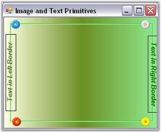{border="0"}

Figure 404: GradientPanelExt with Image and Text

**[]{style="COLOR: #15428b"}** 

See Also

[]{style="COLOR: #15428b"} 

[Host Primitives]{.UGHyperlink}[, ]{.UGHyperlink}[Expand and Collapse Options]{.UGHyperlink}[]{.UGHyperlink}

[]{#p470}[]{#_Host_Primitives}3.3.6.3.3.1.3      Host Primitives

[]{style="COLOR: #15428b"} 

Any .NET Windows Forms control or custom control can be included as a primitive in the GradientPanelExt. The host control should be referred in the **HostControl** property of the GradientPanelExt Collection Editor.

**[]{style="COLOR: #15428b"}** 

+---------------------------------------------------------------------------------------------------------------------------------------------------------------------------------------------------------------------------------------------------------------------------------------------------------------------------------------------------------------------------------------+
| **[\[C#\]]{style="FONT-FAMILY: 'Courier New'; COLOR: black"}**                                                                                                                                                                                                                                                                                                                        |
|                                                                                                                                                                                                                                                                                                                                                                                       |
| []{style="FONT-FAMILY: 'Courier New'"}                                                                                                                                                                                                                                                                                                                                                |
|                                                                                                                                                                                                                                                                                                                                                                                       |
| [//button1]{style="FONT-FAMILY: 'Courier New'; COLOR: green"}                                                                                                                                                                                                                                                                                                                         |
|                                                                                                                                                                                                                                                                                                                                                                                       |
| [Button]{style="FONT-FAMILY: 'Courier New'; COLOR: teal"}[ button1 = [new]{style="COLOR: blue"} [Button]{style="COLOR: teal"}();]{style="FONT-FAMILY: 'Courier New'"}                                                                                                                                                                                                                 |
|                                                                                                                                                                                                                                                                                                                                                                                       |
| [button1.FlatStyle = System.Windows.Forms.[FlatStyle]{style="COLOR: teal"}.Popup;]{style="FONT-FAMILY: 'Courier New'"}                                                                                                                                                                                                                                                                |
|                                                                                                                                                                                                                                                                                                                                                                                       |
| [button1.Text = [\"Button\"]{style="COLOR: maroon"};]{style="FONT-FAMILY: 'Courier New'"}                                                                                                                                                                                                                                                                                             |
|                                                                                                                                                                                                                                                                                                                                                                                       |
| []{style="FONT-FAMILY: 'Courier New'"}                                                                                                                                                                                                                                                                                                                                                |
|                                                                                                                                                                                                                                                                                                                                                                                       |
| [//hostPrimitive1]{style="FONT-FAMILY: 'Courier New'; COLOR: green"}                                                                                                                                                                                                                                                                                                                  |
|                                                                                                                                                                                                                                                                                                                                                                                       |
| [HostPrimitive]{style="FONT-FAMILY: 'Courier New'; COLOR: teal"}[ hostPrimitive1 = [new]{style="COLOR: blue"} [HostPrimitive]{style="COLOR: teal"}();]{style="FONT-FAMILY: 'Courier New'"}                                                                                                                                                                                            |
|                                                                                                                                                                                                                                                                                                                                                                                       |
| [hostPrimitive1.BackColor = System.Drawing.[Color]{style="COLOR: teal"}.Transparent;]{style="FONT-FAMILY: 'Courier New'"}                                                                                                                                                                                                                                                             |
|                                                                                                                                                                                                                                                                                                                                                                                       |
| [hostPrimitive1.HostControl = button1;]{style="FONT-FAMILY: 'Courier New'"}                                                                                                                                                                                                                                                                                                           |
|                                                                                                                                                                                                                                                                                                                                                                                       |
| [hostPrimitive1.Size = [new]{style="COLOR: blue"} System.Drawing.[Size]{style="COLOR: teal"}(60, 20);]{style="FONT-FAMILY: 'Courier New'"}                                                                                                                                                                                                                                            |
|                                                                                                                                                                                                                                                                                                                                                                                       |
| []{style="FONT-FAMILY: 'Courier New'"}                                                                                                                                                                                                                                                                                                                                                |
|                                                                                                                                                                                                                                                                                                                                                                                       |
| [//progressBarAdv1]{style="FONT-FAMILY: 'Courier New'; COLOR: green"}                                                                                                                                                                                                                                                                                                                 |
|                                                                                                                                                                                                                                                                                                                                                                                       |
| [ProgressBarAdv]{style="FONT-FAMILY: 'Courier New'; COLOR: teal"}[ progressBarAdv1= [new]{style="COLOR: blue"} [ProgressBarAdv]{style="COLOR: teal"}();]{style="FONT-FAMILY: 'Courier New'"}                                                                                                                                                                                          |
|                                                                                                                                                                                                                                                                                                                                                                                       |
| [progressBarAdv1.BackColor = System.Drawing.[Color]{style="COLOR: teal"}.Transparent;]{style="FONT-FAMILY: 'Courier New'"}                                                                                                                                                                                                                                                            |
|                                                                                                                                                                                                                                                                                                                                                                                       |
| [progressBarAdv1.ProgressStyle = Syncfusion.Windows.Forms.Tools.[ProgressBarStyles]{style="COLOR: teal"}.Tube;]{style="FONT-FAMILY: 'Courier New'"}                                                                                                                                                                                                                                   |
|                                                                                                                                                                                                                                                                                                                                                                                       |
| [progressBarAdv1.TubeStartColor = System.Drawing.[Color]{style="COLOR: teal"}.FromArgb((([int]{style="COLOR: blue"})((([byte]{style="COLOR: blue"})(255)))), (([int]{style="COLOR: blue"})((([byte]{style="COLOR: blue"})(192)))), (([int]{style="COLOR: blue"})[ ]{style="COLOR: blue"}  ((([byte]{style="COLOR: blue"}             )(192)))));]{style="FONT-FAMILY: 'Courier New'"} |
|                                                                                                                                                                                                                                                                                                                                                                                       |
| []{style="FONT-FAMILY: 'Courier New'"}                                                                                                                                                                                                                                                                                                                                                |
|                                                                                                                                                                                                                                                                                                                                                                                       |
| [//hostPrimitive2]{style="FONT-FAMILY: 'Courier New'; COLOR: green"}                                                                                                                                                                                                                                                                                                                  |
|                                                                                                                                                                                                                                                                                                                                                                                       |
| [HostPrimitive]{style="FONT-FAMILY: 'Courier New'; COLOR: teal"}[ hostPrimitive2 = [new]{style="COLOR: blue"} [HostPrimitive]{style="COLOR: teal"}();]{style="FONT-FAMILY: 'Courier New'"}                                                                                                                                                                                            |
|                                                                                                                                                                                                                                                                                                                                                                                       |
| [hostPrimitive2.Alignment = Syncfusion.Windows.Forms.Tools.[Alignment]{style="COLOR: teal"}.Bottom;]{style="FONT-FAMILY: 'Courier New'"}                                                                                                                                                                                                                                              |
|                                                                                                                                                                                                                                                                                                                                                                                       |
| [hostPrimitive2.BackColor = System.Drawing.[Color]{style="COLOR: teal"}.Transparent;]{style="FONT-FAMILY: 'Courier New'"}                                                                                                                                                                                                                                                             |
|                                                                                                                                                                                                                                                                                                                                                                                       |
| [hostPrimitive2.HostControl = progressBarAdv1;]{style="FONT-FAMILY: 'Courier New'"}                                                                                                                                                                                                                                                                                                   |
|                                                                                                                                                                                                                                                                                                                                                                                       |
| [hostPrimitive2.Position = 200;]{style="FONT-FAMILY: 'Courier New'"}                                                                                                                                                                                                                                                                                                                  |
|                                                                                                                                                                                                                                                                                                                                                                                       |
| [hostPrimitive2.Size = [new]{style="COLOR: blue"} System.Drawing.[Size]{style="COLOR: teal"}(100, 20);]{style="FONT-FAMILY: 'Courier New'"}                                                                                                                                                                                                                                           |
|                                                                                                                                                                                                                                                                                                                                                                                       |
| []{style="FONT-FAMILY: 'Courier New'"}                                                                                                                                                                                                                                                                                                                                                |
|                                                                                                                                                                                                                                                                                                                                                                                       |
| [//Adding Primitives]{style="FONT-FAMILY: 'Courier New'; COLOR: green"}                                                                                                                                                                                                                                                                                                               |
|                                                                                                                                                                                                                                                                                                                                                                                       |
| [gpe.Primitives.AddRange([new]{style="COLOR: blue"} Syncfusion.Windows.Forms.Tools.[Primitive]{style="COLOR: teal"}\[\] {]{style="FONT-FAMILY: 'Courier New'"}                                                                                                                                                                                                                        |
|                                                                                                                                                                                                                                                                                                                                                                                       |
| [  hostPrimitive1,]{style="FONT-FAMILY: 'Courier New'"}                                                                                                                                                                                                                                                                                                                               |
|                                                                                                                                                                                                                                                                                                                                                                                       |
| [  hostPrimitive2});]{style="FONT-FAMILY: 'Courier New'"}                                                                                                                                                                                                                                                                                                                             |
+---------------------------------------------------------------------------------------------------------------------------------------------------------------------------------------------------------------------------------------------------------------------------------------------------------------------------------------------------------------------------------------+

[]{style="COLOR: #15428b"} 

+------------------------------------------------------------------------------------------------------------------------------------------------------------------------------------------------------------------------------------------------------------------------------------------------------------------------------------------------------------------------------------------+
| **[\[VB.NET\]]{style="FONT-FAMILY: 'Courier New'; COLOR: black"}**                                                                                                                                                                                                                                                                                                                       |
|                                                                                                                                                                                                                                                                                                                                                                                          |
| **[]{style="FONT-FAMILY: 'Courier New'; COLOR: black"}**                                                                                                                                                                                                                                                                                                                                 |
|                                                                                                                                                                                                                                                                                                                                                                                          |
| [\'button1]{style="FONT-FAMILY: 'Courier New'; COLOR: green"}                                                                                                                                                                                                                                                                                                                            |
|                                                                                                                                                                                                                                                                                                                                                                                          |
| [Private]{style="FONT-FAMILY: 'Courier New'; COLOR: blue"}[ button1 [As]{style="COLOR: blue"} Button = [New]{style="COLOR: blue"} Button()]{style="FONT-FAMILY: 'Courier New'"}                                                                                                                                                                                                          |
|                                                                                                                                                                                                                                                                                                                                                                                          |
| [Private]{style="FONT-FAMILY: 'Courier New'; COLOR: blue"}[ button1.FlatStyle = System.Windows.Forms.FlatStyle.Popup]{style="FONT-FAMILY: 'Courier New'"}                                                                                                                                                                                                                                |
|                                                                                                                                                                                                                                                                                                                                                                                          |
| [Private]{style="FONT-FAMILY: 'Courier New'; COLOR: blue"}[ button1.Text = [\"Button\"]{style="COLOR: maroon"}]{style="FONT-FAMILY: 'Courier New'"}                                                                                                                                                                                                                                      |
|                                                                                                                                                                                                                                                                                                                                                                                          |
| []{style="FONT-FAMILY: 'Courier New'; COLOR: maroon"}                                                                                                                                                                                                                                                                                                                                    |
|                                                                                                                                                                                                                                                                                                                                                                                          |
| [\'hostPrimitive1]{style="FONT-FAMILY: 'Courier New'; COLOR: green"}                                                                                                                                                                                                                                                                                                                     |
|                                                                                                                                                                                                                                                                                                                                                                                          |
| [Private]{style="FONT-FAMILY: 'Courier New'; COLOR: blue"}[ hostPrimitive1 [As]{style="COLOR: blue"} HostPrimitive = [New]{style="COLOR: blue"} HostPrimitive()]{style="FONT-FAMILY: 'Courier New'"}                                                                                                                                                                                     |
|                                                                                                                                                                                                                                                                                                                                                                                          |
| [Private]{style="FONT-FAMILY: 'Courier New'; COLOR: blue"}[ hostPrimitive1.BackColor = System.Drawing.Color.Transparent]{style="FONT-FAMILY: 'Courier New'"}                                                                                                                                                                                                                             |
|                                                                                                                                                                                                                                                                                                                                                                                          |
| [Private]{style="FONT-FAMILY: 'Courier New'; COLOR: blue"}[ hostPrimitive1.HostControl = button1]{style="FONT-FAMILY: 'Courier New'"}                                                                                                                                                                                                                                                    |
|                                                                                                                                                                                                                                                                                                                                                                                          |
| [Private]{style="FONT-FAMILY: 'Courier New'; COLOR: blue"}[ hostPrimitive1.Size = [New]{style="COLOR: blue"} System.Drawing.Size(60, 20)]{style="FONT-FAMILY: 'Courier New'"}                                                                                                                                                                                                            |
|                                                                                                                                                                                                                                                                                                                                                                                          |
| []{style="FONT-FAMILY: 'Courier New'"}                                                                                                                                                                                                                                                                                                                                                   |
|                                                                                                                                                                                                                                                                                                                                                                                          |
| [\'progressBarAdv1]{style="FONT-FAMILY: 'Courier New'; COLOR: green"}                                                                                                                                                                                                                                                                                                                    |
|                                                                                                                                                                                                                                                                                                                                                                                          |
| [Private]{style="FONT-FAMILY: 'Courier New'; COLOR: blue"}[ progressBarAdv1 [As]{style="COLOR: blue"} ProgressBarAdv = [New]{style="COLOR: blue"} ProgressBarAdv()]{style="FONT-FAMILY: 'Courier New'"}                                                                                                                                                                                  |
|                                                                                                                                                                                                                                                                                                                                                                                          |
| [Private]{style="FONT-FAMILY: 'Courier New'; COLOR: blue"}[ progressBarAdv1.BackColor = System.Drawing.Color.Transparent]{style="FONT-FAMILY: 'Courier New'"}                                                                                                                                                                                                                            |
|                                                                                                                                                                                                                                                                                                                                                                                          |
| [Private]{style="FONT-FAMILY: 'Courier New'; COLOR: blue"}[ progressBarAdv1.ProgressStyle = Syncfusion.Windows.Forms.Tools.ProgressBarStyles.Tube]{style="FONT-FAMILY: 'Courier New'"}                                                                                                                                                                                                   |
|                                                                                                                                                                                                                                                                                                                                                                                          |
| [Private]{style="FONT-FAMILY: 'Courier New'; COLOR: blue"}[ progressBarAdv1.TubeStartColor = System.Drawing.Color.FromArgb(([CInt]{style="COLOR: blue"}(([CByte]{style="COLOR: blue"}(255)))), ([CInt]{style="COLOR: blue"}(([CByte]{style="COLOR: blue"}(192)))), ([      CInt]{style="COLOR: blue"}(([CByte]{style="COLOR: blue"}       (192)))))]{style="FONT-FAMILY: 'Courier New'"} |
|                                                                                                                                                                                                                                                                                                                                                                                          |
| []{style="FONT-FAMILY: 'Courier New'"}                                                                                                                                                                                                                                                                                                                                                   |
|                                                                                                                                                                                                                                                                                                                                                                                          |
| [\'hostPrimitive2]{style="FONT-FAMILY: 'Courier New'; COLOR: green"}                                                                                                                                                                                                                                                                                                                     |
|                                                                                                                                                                                                                                                                                                                                                                                          |
| [Private]{style="FONT-FAMILY: 'Courier New'; COLOR: blue"}[ hostPrimitive2 [As]{style="COLOR: blue"} HostPrimitive = [New]{style="COLOR: blue"} HostPrimitive()]{style="FONT-FAMILY: 'Courier New'"}                                                                                                                                                                                     |
|                                                                                                                                                                                                                                                                                                                                                                                          |
| [Private]{style="FONT-FAMILY: 'Courier New'; COLOR: blue"}[ hostPrimitive2.Alignment = Syncfusion.Windows.Forms.Tools.Alignment.Bottom]{style="FONT-FAMILY: 'Courier New'"}                                                                                                                                                                                                              |
|                                                                                                                                                                                                                                                                                                                                                                                          |
| [Private]{style="FONT-FAMILY: 'Courier New'; COLOR: blue"}[ hostPrimitive2.BackColor = System.Drawing.Color.Transparent]{style="FONT-FAMILY: 'Courier New'"}                                                                                                                                                                                                                             |
|                                                                                                                                                                                                                                                                                                                                                                                          |
| [Private]{style="FONT-FAMILY: 'Courier New'; COLOR: blue"}[ hostPrimitive2.HostControl = progressBarAdv1]{style="FONT-FAMILY: 'Courier New'"}                                                                                                                                                                                                                                            |
|                                                                                                                                                                                                                                                                                                                                                                                          |
| [Private]{style="FONT-FAMILY: 'Courier New'; COLOR: blue"}[ hostPrimitive2.Position = 200]{style="FONT-FAMILY: 'Courier New'"}                                                                                                                                                                                                                                                           |
|                                                                                                                                                                                                                                                                                                                                                                                          |
| [Private]{style="FONT-FAMILY: 'Courier New'; COLOR: blue"}[ hostPrimitive2.Size = [New]{style="COLOR: blue"} System.Drawing.Size(100, 20)]{style="FONT-FAMILY: 'Courier New'"}                                                                                                                                                                                                           |
|                                                                                                                                                                                                                                                                                                                                                                                          |
| []{style="FONT-FAMILY: 'Courier New'"}                                                                                                                                                                                                                                                                                                                                                   |
|                                                                                                                                                                                                                                                                                                                                                                                          |
| [\'Adding Primitives]{style="FONT-FAMILY: 'Courier New'; COLOR: green"}                                                                                                                                                                                                                                                                                                                  |
|                                                                                                                                                                                                                                                                                                                                                                                          |
| [gpe.Primitives.AddRange([New]{style="COLOR: blue"} Syncfusion.Windows.Forms.Tools.Primitive() {hostPrimitive1, hostPrimitive2})]{style="FONT-FAMILY: 'Courier New'"}                                                                                                                                                                                                                    |
+------------------------------------------------------------------------------------------------------------------------------------------------------------------------------------------------------------------------------------------------------------------------------------------------------------------------------------------------------------------------------------------+

[]{style="COLOR: #15428b"} 

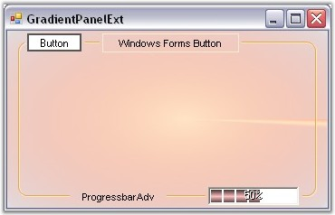{border="0"}

Figure 405: GradientPanelExt with Host Controls

See Also

[]{style="COLOR: #15428b"} 

Expand and Collapse Options[, ]{style="COLOR: #15428b"}Image and Text Primitives

###### []{#p471}[]{#_Collapse_Expand_Animation}3.3.6.3.3.2 Collapse Expand Animation {#collapse-expand-animation style="tab-stops: 0pt"}

 

The collapse and expand operation in a GradientPanelExt control can be animated by setting **Animated** property to true. Delay in animation and the speed of animation is specified in **AnimationDelay** and **AnimationSpeed** properties.

[]{style="COLOR: #15428b"} 

+---------------------------------------------------------------------------------------------------------------------------------------------------------+
| **[\[C#\]]{style="FONT-FAMILY: 'Courier New'; COLOR: black"}**                                                                                          |
|                                                                                                                                                         |
| []{style="FONT-FAMILY: 'Courier New'"}                                                                                                                  |
|                                                                                                                                                         |
| [this]{style="FONT-FAMILY: 'Courier New'; COLOR: blue"}[.gradientPanelExt1.Animated = [true]{style="COLOR: blue"};]{style="FONT-FAMILY: 'Courier New'"} |
|                                                                                                                                                         |
| [this]{style="FONT-FAMILY: 'Courier New'; COLOR: blue"}[.gradientPanelExt1.AnimationDelay = 11;]{style="FONT-FAMILY: 'Courier New'"}                    |
|                                                                                                                                                         |
| [this]{style="FONT-FAMILY: 'Courier New'; COLOR: blue"}[.gradientPanelExt1.AnimationSpeed = 2;]{style="FONT-FAMILY: 'Courier New'"}                     |
+---------------------------------------------------------------------------------------------------------------------------------------------------------+

[]{style="COLOR: #15428b"} 

+--------------------------------------------------------------------------------------------------------------------------------------------------------+
| **[\[VB.NET\]]{style="FONT-FAMILY: 'Courier New'; COLOR: black"}**                                                                                     |
|                                                                                                                                                        |
| **[]{style="FONT-FAMILY: 'Courier New'; COLOR: black"}**                                                                                               |
|                                                                                                                                                        |
| [this]{style="FONT-FAMILY: 'Courier New'; COLOR: blue"}[.gradientPanelExt1.Animated = [True]{style="COLOR: blue"}]{style="FONT-FAMILY: 'Courier New'"} |
|                                                                                                                                                        |
| [this]{style="FONT-FAMILY: 'Courier New'; COLOR: blue"}[.gradientPanelExt1.AnimationDelay = 11]{style="FONT-FAMILY: 'Courier New'"}                    |
|                                                                                                                                                        |
| [this]{style="FONT-FAMILY: 'Courier New'; COLOR: blue"}[.gradientPanelExt1.AnimationSpeed = 2]{style="FONT-FAMILY: 'Courier New'"}                     |
+--------------------------------------------------------------------------------------------------------------------------------------------------------+

###### []{#p472}[]{#_Background_and_Foreground}3.3.6.3.3.3 Background and Foreground Settings {#background-and-foreground-settings style="tab-stops: 0pt"}

 

By setting the background properties, the user can create a GradientPanelExt according to his requirements. The properties and styles for the GradientPanelExt have been listed and discussed below.

[]{style="COLOR: #15428b"} 

Background Properties

[]{style="COLOR: #15428b"} 

BackColor represents the background color used to display the text or the graphics in the control.

[]{style="COLOR: #15428b"} 

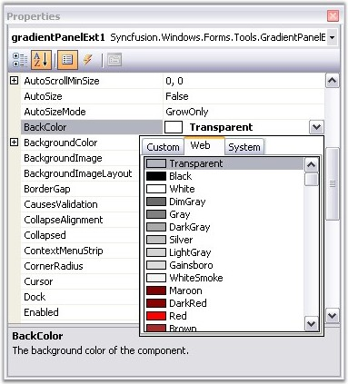{border="0"}

Figure 406: Setting the BackColor for the GradientPanelExt

**[]{style="COLOR: #15428b"}** 

+------------------------------------------------------------------------------------------------------------------------------+
| **[\[C#\]]{style="FONT-FAMILY: 'Courier New'; COLOR: black"}**                                                               |
|                                                                                                                              |
| []{style="FONT-FAMILY: 'Courier New'"}                                                                                       |
|                                                                                                                              |
| [gradientPanelExt1.BackColor = System.Drawing.[Color]{style="COLOR: teal"}.Transparent;]{style="FONT-FAMILY: 'Courier New'"} |
+------------------------------------------------------------------------------------------------------------------------------+

[]{style="COLOR: #15428b"} 

+-----------------------------------------------------------------------------------------------------------------------------------------------------------------+
| **[\[VB.NET\]]{style="FONT-FAMILY: 'Courier New'; COLOR: black"}**                                                                                              |
|                                                                                                                                                                 |
| **[]{style="FONT-FAMILY: 'Courier New'; COLOR: black"}**                                                                                                        |
|                                                                                                                                                                 |
| [Private]{style="FONT-FAMILY: 'Courier New'; COLOR: blue"}[ gradientPanelExt1.BackColor = System.Drawing.Color.Transparent]{style="FONT-FAMILY: 'Courier New'"} |
+-----------------------------------------------------------------------------------------------------------------------------------------------------------------+

[]{style="COLOR: #15428b"} 

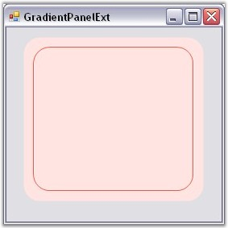{border="0"}

Figure 407: GradientPanelExt with BackColor Set

**[]{style="COLOR: #15428b"}** 

The colors and styles of the GradientPanelExt control can be set using the BackgroundColor properties, which have been explained below:

[]{style="COLOR: #15428b"} 

[·      ]{style="FONT-FAMILY: Symbol"}Style - The styles available are solid, pattern and gradient.

[·      ]{style="FONT-FAMILY: Symbol"}BackColor - User can select the required colors for the background using Backcolor property.

[·      ]{style="FONT-FAMILY: Symbol"}ForeColor - Foreground color, for text or graphics can be set using ForeColor property.

[·      ]{style="FONT-FAMILY: Symbol"}PatternStyle - Provides the pattern styles available for the style selected.

[·      ]{style="FONT-FAMILY: Symbol"}GradientColors - This pops up the Color Collection Editor, which allows the user to add colors and get a combination of colors to display in the gradient panel with the specified style.

**[]{style="COLOR: #15428b"}** 

::: {align="center"}
  ----------------------------- ---------------------------------------------------------------------------------------------------------
  GradientPanelExt Properties   Description
  Style                         Specifies the brush style (Solid, Pattern, Gradient).
  BackColor                     Gets or sets the back color.
  ForeColor                     Gets or sets the fore color.
  PatternStyle                  Gets or sets specifies the pattern style.
  GradientColor                 Specifies the gradient colors, with the first color same as BackColor and last color same as ForeColor.
  BackgroundImage               Specifies the background image for the control.
  ----------------------------- ---------------------------------------------------------------------------------------------------------
:::

**[]{style="COLOR: #15428b"}** 

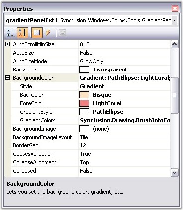{border="0"}

Figure 408: Setting the BackgroundColor properties for the GradientPanelExt

**[]{style="COLOR: #15428b"}** 

Alternatively, the BackgroundColor for the control can also be set using the following code snippet.

[]{style="COLOR: #15428b"} 

+----------------------------------------------------------------------------------------------------------------------------------------------------------------------------------------------------------------------------------------------------------------------------------------------------------------+
| **[\[C#\]]{style="FONT-FAMILY: 'Courier New'; COLOR: black"}**                                                                                                                                                                                                                                                 |
|                                                                                                                                                                                                                                                                                                                |
| []{style="FONT-FAMILY: 'Courier New'"}                                                                                                                                                                                                                                                                         |
|                                                                                                                                                                                                                                                                                                                |
| [gradientPanelExt1.BackgroundColor = [new]{style="COLOR: blue"} Syncfusion.Drawing.[BrushInfo]{style="COLOR: teal"}(Syncfusion.Drawing.[GradientStyle]{style="COLOR: teal"}.PathEllipse, [new]{style="COLOR: blue"}     System.Drawing.[Color]{style="COLOR: teal"}\[\] {]{style="FONT-FAMILY: 'Courier New'"} |
|                                                                                                                                                                                                                                                                                                                |
| [  System.Drawing.[Color]{style="COLOR: teal"}.Bisque,]{style="FONT-FAMILY: 'Courier New'"}                                                                                                                                                                                                                    |
|                                                                                                                                                                                                                                                                                                                |
| [  System.Drawing.[Color]{style="COLOR: teal"}.LightSalmon,]{style="FONT-FAMILY: 'Courier New'"}                                                                                                                                                                                                               |
|                                                                                                                                                                                                                                                                                                                |
| [  System.Drawing.[Color]{style="COLOR: teal"}.LightCoral});]{style="FONT-FAMILY: 'Courier New'"}                                                                                                                                                                                                              |
+----------------------------------------------------------------------------------------------------------------------------------------------------------------------------------------------------------------------------------------------------------------------------------------------------------------+

[]{style="COLOR: #15428b"} 

+---------------------------------------------------------------------------------------------------------------------------------------------------------------------------------------------------------------------------------------------------------------------------------------------------------------------------------------------------------------------------------------------------------------------------------------------------------------------------------------------+
| **[\[VB.NET\]]{style="FONT-FAMILY: 'Courier New'; COLOR: black"}**                                                                                                                                                                                                                                                                                                                                                                                                                          |
|                                                                                                                                                                                                                                                                                                                                                                                                                                                                                             |
| []{style="FONT-FAMILY: 'Courier New'; COLOR: blue"}                                                                                                                                                                                                                                                                                                                                                                                                                                         |
|                                                                                                                                                                                                                                                                                                                                                                                                                                                                                             |
| [Private]{style="FONT-FAMILY: 'Courier New'; COLOR: blue"}[ gradientPanelExt1.BackgroundColor = [New]{style="COLOR: blue"}                                                                            Syncfusion.Drawing.BrushInfo(Syncfusion.Drawing.GradientStyle.PathEllipse, [New]{style="COLOR: blue"} System.Drawing.Color() {                  System.Drawing.Color.Bisque, System.Drawing.Color.LightSalmon, System.Drawing.Color.LightCoral})]{style="FONT-FAMILY: 'Courier New'"} |
+---------------------------------------------------------------------------------------------------------------------------------------------------------------------------------------------------------------------------------------------------------------------------------------------------------------------------------------------------------------------------------------------------------------------------------------------------------------------------------------------+

**[]{style="COLOR: #15428b"}** 

**[]{style="COLOR: #15428b"}** 

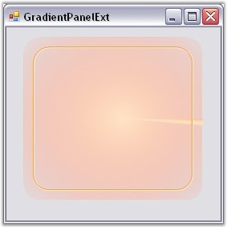{border="0"}

Figure 409: GradientPanelExt with BackgroundColor Set

[]{style="COLOR: #15428b"} 

Image Settings

[]{style="COLOR: #15428b"} 

A background image can be set for the gradient panel using the BackgroundImage property. User can set the layout for the background image using the **BackgroundImageLayout** property. These properties can be set programmatically using the below code snippets.

[]{style="COLOR: #15428b"} 

+----------------------------------------------------------------------------------------------------------------------------------------------------------------------------------------------------------------------------------------------------------+
| **[\[C#\]]{style="FONT-FAMILY: 'Courier New'; COLOR: black"}**                                                                                                                                                                                           |
|                                                                                                                                                                                                                                                          |
| []{style="FONT-FAMILY: 'Courier New'"}                                                                                                                                                                                                                   |
|                                                                                                                                                                                                                                                          |
| [gradientPanelExt1.BackgroundImage = ((System.Drawing.[Image]{style="COLOR: teal"})(resources.GetObject([\"gradientPanelExt1.BackgroundImage\"]{style="COLOR: maroon"})));[                ]{style="COLOR: maroon"}]{style="FONT-FAMILY: 'Courier New'"} |
|                                                                                                                                                                                                                                                          |
| [gradientPanelExt1.BackgroundImageLayout = System.Windows.Forms.[ImageLayout]{style="COLOR: teal"}.Stretch;       ]{style="FONT-FAMILY: 'Courier New'"}                                                                                                  |
+----------------------------------------------------------------------------------------------------------------------------------------------------------------------------------------------------------------------------------------------------------+

[]{style="FONT-SIZE: 8pt"} 

+------------------------------------------------------------------------------------------------------------------------------------------------------------------------------------------------------------------------------------------------------------------------------------------------------------+
| **[\[VB.NET\]]{style="FONT-FAMILY: 'Courier New'; COLOR: black"}**                                                                                                                                                                                                                                         |
|                                                                                                                                                                                                                                                                                                            |
| **[]{style="FONT-FAMILY: 'Courier New'; COLOR: black"}**                                                                                                                                                                                                                                                   |
|                                                                                                                                                                                                                                                                                                            |
| [Private]{style="FONT-FAMILY: 'Courier New'; COLOR: blue"}[ [Me]{style="COLOR: blue"}.gradientPanelExt1.BackgroundImage = ([CType]{style="COLOR: blue"}(resources.GetObject([\"gradientPanelExt1.BackgroundImage\"]{style="COLOR: maroon"}),System.Drawing.Image))   ]{style="FONT-FAMILY: 'Courier New'"} |
|                                                                                                                                                                                                                                                                                                            |
| [Private]{style="FONT-FAMILY: 'Courier New'; COLOR: blue"}[ [Me]{style="COLOR: blue"}.gradientPanelExt1.BackgroundImageLayout = System.Windows.Forms.ImageLayout.Stretch]{style="FONT-FAMILY: 'Courier New'"}                                                                                              |
+------------------------------------------------------------------------------------------------------------------------------------------------------------------------------------------------------------------------------------------------------------------------------------------------------------+

[]{style="FONT-SIZE: 8pt"} 

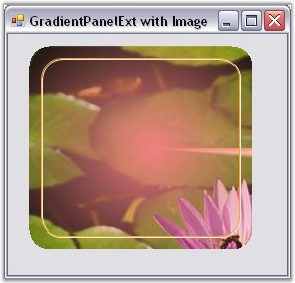{border="0"}

Figure 410: GradientPanelExt with a Background Image

**[]{style="COLOR: #15428b"}** 

Foreground\
\

The control\'s text can be customized by altering its **Font** properties. The **ForeColor** property represents the GradientPanelExt\'s text color. Using the following code snippet customizes the foreground of the GradientPanelExt.

[]{style="COLOR: #15428b"} 

+---------------------------------------------------------------------------------------------------------------------------------------------------------------------------------------------------------------------------------------------------------------------------------------------------------------------------------------------------------------------------------------------------------------------------------------------------------+
| **[\[C#\]]{style="FONT-FAMILY: 'Courier New'; COLOR: black"}**                                                                                                                                                                                                                                                                                                                                                                                          |
|                                                                                                                                                                                                                                                                                                                                                                                                                                                         |
| []{style="FONT-FAMILY: 'Courier New'; COLOR: blue"}                                                                                                                                                                                                                                                                                                                                                                                                     |
|                                                                                                                                                                                                                                                                                                                                                                                                                                                         |
| [this]{style="FONT-FAMILY: 'Courier New'; COLOR: blue"}[.gradientPanelExt1.Font = [new]{style="COLOR: blue"} System.Drawing.[Font]{style="COLOR: teal"}([\"Comic Sans MS\"]{style="COLOR: maroon"}, 9.75F, ((System.Drawing.[FontStyle]{style="COLOR: teal"})                                   (((System.Drawing.[FontStyle]{style="COLOR: teal"}.Bold \| System.Drawing.[FontStyle]{style="COLOR: teal"}.Italic)]{style="FONT-FAMILY: 'Courier New'"} |
|                                                                                                                                                                                                                                                                                                                                                                                                                                                         |
| [  \| System.Drawing.[FontStyle]{style="COLOR: teal"}.Underline))), System.Drawing.[GraphicsUnit]{style="COLOR: teal"}.Point, (([byte]{style="COLOR: blue"})(0)));]{style="FONT-FAMILY: 'Courier New'"}                                                                                                                                                                                                                                                 |
|                                                                                                                                                                                                                                                                                                                                                                                                                                                         |
| [this]{style="FONT-FAMILY: 'Courier New'; COLOR: blue"}[.gradientPanelExt1.ForeColor = System.Drawing.[Color]{style="COLOR: teal"}.DarkGreen;      ]{style="FONT-FAMILY: 'Courier New'"}                                                                                                                                                                                                                                                                |
+---------------------------------------------------------------------------------------------------------------------------------------------------------------------------------------------------------------------------------------------------------------------------------------------------------------------------------------------------------------------------------------------------------------------------------------------------------+

**[]{style="COLOR: #15428b"}** 

+--------------------------------------------------------------------------------------------------------------------------------------------------------------------------------------------------------------------------------------------------------------------------------------------------------------------------------------------------------------------------------------------------------------------------------------------------------------------------------------------------------------------------------------------------------------------------------------------------------------------------------+
| **[\[VB.NET\]]{style="FONT-FAMILY: 'Courier New'; COLOR: black"}**                                                                                                                                                                                                                                                                                                                                                                                                                                                                                                                                                             |
|                                                                                                                                                                                                                                                                                                                                                                                                                                                                                                                                                                                                                                |
| **[]{style="FONT-FAMILY: 'Courier New'; COLOR: black"}**                                                                                                                                                                                                                                                                                                                                                                                                                                                                                                                                                                       |
|                                                                                                                                                                                                                                                                                                                                                                                                                                                                                                                                                                                                                                |
| [Private]{style="FONT-FAMILY: 'Courier New'; COLOR: blue"}[ [Me]{style="COLOR: blue"}.gradientPanelExt1.Font = [New]{style="COLOR: blue"} System.Drawing.Font([\"Comic Sans MS\"]{style="COLOR: maroon"}, 9.75F, ([CType]{style="COLOR: blue"}                                                  (((System.Drawing.FontStyle.Bold [Or]{style="COLOR: blue"} System.Drawing.FontStyle.Italic) [Or]{style="COLOR: blue"} System.Drawing.FontStyle.Underline),                              System.Drawing.FontStyle)), System.Drawing.GraphicsUnit.Point, ([CByte]{style="COLOR: blue"}(0)))]{style="FONT-FAMILY: 'Courier New'"} |
|                                                                                                                                                                                                                                                                                                                                                                                                                                                                                                                                                                                                                                |
| [Private]{style="FONT-FAMILY: 'Courier New'; COLOR: blue"}[ [Me]{style="COLOR: blue"}.gradientPanelExt1.ForeColor = System.Drawing.Color.DarkGreen]{style="FONT-FAMILY: 'Courier New'"}                                                                                                                                                                                                                                                                                                                                                                                                                                        |
+--------------------------------------------------------------------------------------------------------------------------------------------------------------------------------------------------------------------------------------------------------------------------------------------------------------------------------------------------------------------------------------------------------------------------------------------------------------------------------------------------------------------------------------------------------------------------------------------------------------------------------+

[]{style="COLOR: #15428b"} 

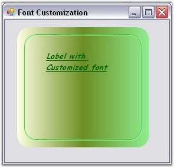{border="0"}

Figure 411: GradientPanelExt with Customized Foreground

###### []{#p473}3.3.6.3.3.4 Border Settings {#border-settings style="tab-stops: 0pt"}

Corner Radius

[]{style="COLOR: #15428b"} 

The GradientPanelExt comes as a rounded rectangle by default. The rounded corners can be removed or their radius can be modified using the **CornerRadius** property.

[]{style="COLOR: #15428b"} 

::: {align="center"}
  --------------------------- ----------------------------------------------------------------------
  GradientPanelExt Property   Description
  CornerRadius                Used to set or get the radius truncation for the control\'s corners.
  --------------------------- ----------------------------------------------------------------------
:::

[]{style="COLOR: #15428b"} 

+----------------------------------------------------------------------------+
| **[\[C#\]]{style="FONT-FAMILY: 'Courier New'; COLOR: black"}**             |
|                                                                            |
| **[]{style="FONT-FAMILY: 'Courier New'; COLOR: black"}**                   |
|                                                                            |
| [gradientPanelExt1.CornerRadius = 14;]{style="FONT-FAMILY: 'Courier New'"} |
+----------------------------------------------------------------------------+

[]{style="COLOR: #15428b"} 

+--------------------------------------------------------------------------------------------------------------------------------------+
| **[\[VB.NET\]]{style="FONT-FAMILY: 'Courier New'; COLOR: black"}**                                                                   |
|                                                                                                                                      |
| **[]{style="FONT-FAMILY: 'Courier New'; COLOR: black"}**                                                                             |
|                                                                                                                                      |
| [Private]{style="FONT-FAMILY: 'Courier New'; COLOR: blue"}[ gradientPanelExt1.CornerRadius = 14]{style="FONT-FAMILY: 'Courier New'"} |
+--------------------------------------------------------------------------------------------------------------------------------------+

[]{style="COLOR: #15428b"} 

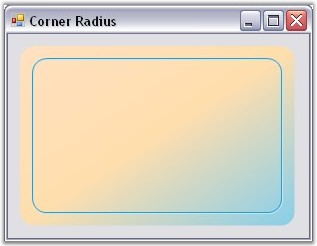{border="0"}

Figure 412: GradientPanelExt with CornerRadius

**[]{style="COLOR: #15428b"}** 

The CornerRadius can be turned off by giving a value of zero for it.

[]{style="COLOR: #15428b"} 

+---------------------------------------------------------------------------+
| **[\[C#\]]{style="FONT-FAMILY: 'Courier New'; COLOR: black"}**            |
|                                                                           |
| **[]{style="FONT-FAMILY: 'Courier New'; COLOR: black"}**                  |
|                                                                           |
| [gradientPanelExt1.CornerRadius = 0;]{style="FONT-FAMILY: 'Courier New'"} |
+---------------------------------------------------------------------------+

[]{style="COLOR: #15428b"} 

+-------------------------------------------------------------------------------------------------------------------------------------+
| **[\[VB.NET\]]{style="FONT-FAMILY: 'Courier New'; COLOR: black"}**                                                                  |
|                                                                                                                                     |
| **[]{style="FONT-FAMILY: 'Courier New'; COLOR: black"}**                                                                            |
|                                                                                                                                     |
| [Private]{style="FONT-FAMILY: 'Courier New'; COLOR: blue"}[ gradientPanelExt1.CornerRadius = 0]{style="FONT-FAMILY: 'Courier New'"} |
+-------------------------------------------------------------------------------------------------------------------------------------+

[]{style="COLOR: #15428b"} 

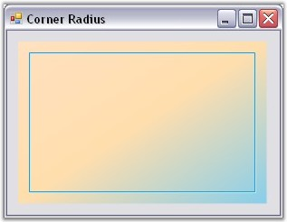{border="0"}

Figure 413: GradientPanelExt without Rounded Corners

**[]{style="COLOR: #15428b"}** 

Border Gap

**[]{style="COLOR: #15428b"}** 

The GradientPanelExt comes with a margin for all the four sides. The spacing between the margin and the control\'s border can be set using the **BorderGap** property.

**[]{style="COLOR: #15428b"}** 

::: {align="center"}
  --------------------------- ----------------------------------------------------------------
  GradientPanelExt Property   Description
  BorderGap                   Used to get or set the gap between the border and the margins.
  --------------------------- ----------------------------------------------------------------
:::

[]{style="COLOR: #15428b"} 

The border gap for the GradientPanelExt can be set programmatically as given below.

[]{style="COLOR: #15428b"} 

+-------------------------------------------------------------------------+
| **[\[C#\]]{style="FONT-FAMILY: 'Courier New'; COLOR: black"}**          |
|                                                                         |
| **[]{style="FONT-FAMILY: 'Courier New'; COLOR: black"}**                |
|                                                                         |
| [gradientPanelExt1.BorderGap = 40;]{style="FONT-FAMILY: 'Courier New'"} |
+-------------------------------------------------------------------------+

[]{style="COLOR: #15428b"} 

+-----------------------------------------------------------------------------------------------------------------------------------+
| **[\[VB.NET\]]{style="FONT-FAMILY: 'Courier New'; COLOR: black"}**                                                                |
|                                                                                                                                   |
| **[]{style="FONT-FAMILY: 'Courier New'; COLOR: black"}**                                                                          |
|                                                                                                                                   |
| [Private]{style="FONT-FAMILY: 'Courier New'; COLOR: blue"}[ gradientPanelExt1.BorderGap = 40]{style="FONT-FAMILY: 'Courier New'"} |
+-----------------------------------------------------------------------------------------------------------------------------------+

**[]{style="COLOR: #15428b"}** 

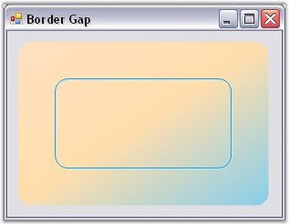{border="0"}

Figure 414: GradientPanelExt with increased Border Gap

###### []{#p474}3.3.6.3.3.5 Scroll Settings {#scroll-settings style="tab-stops: 0pt"}

[]{style="COLOR: #15428b"} 

The scroll settings that apply for the GradientPanel also applies for GradientPanelExt control.

[]{style="COLOR: #15428b"} 

See Also

**[]{style="COLOR: #15428b"}** 

[Scroll Settings]{.UGHyperlink}[]{.UGHyperlink}

[]{#related-topics}
::::::
