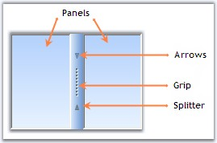
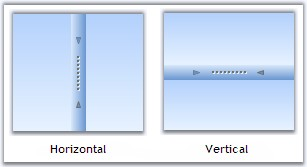
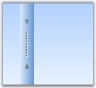
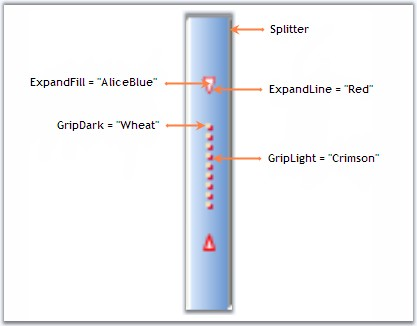
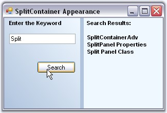
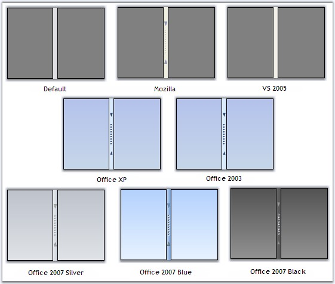

::: {style="DISPLAY: none"}
{#d2h_url_template}{#d2h_package_url style="WIDTH: 0px; DISPLAY: none; HEIGHT: 0px"}
:::

:::::::::: {.d2h_secondary_topic style="PADDING-BOTTOM: 10pt; MARGIN: 0pt; PADDING-LEFT: 0pt; PADDING-RIGHT: 0pt; PADDING-TOP: 0pt"}
##### Concepts and Features {#concepts-and-features style="tab-stops: 0pt"}

[]{style="FONT-SIZE: 8pt"} 

This section will guide you in getting started with the SplitContainerAdv control. It explains all the concepts and features of the control in detail.

[]{style="COLOR: #15428b"} 

###### []{#p482}3.3.6.4.3.1 SplitContainerAdv {#splitcontaineradv style="tab-stops: 0pt"}

[]{style="COLOR: #15428b"} 

The below image illustrates the components of a SplitContainerAdv control. It has two panels separated by a splitter, which has arrows and a grip for the splitter.

[]{style="COLOR: #15428b"} 

{border="0"}

Figure 419: SplitContainerAdv Illustrated with its Components

[]{style="COLOR: #15428b"} 

A sample which demonstrates the SplitContainerAdv control is available in the below sample installation location.

[]{style="COLOR: #15428b"} 

..\\My Documents\\Syncfusion\\EssentialStudio***\\Version Number***\\Windows\\Tools.Windows\\Samples\\2.0\\Editors Package\\Container controls\\SplitContainerAdv

[]{style="COLOR: #15428b"} 

See Also

[]{style="COLOR: #15428b"} 

[]{#p483}[]{#_Panel_Settings}3.3.6.4.3.1.1      Panel Settings

[]{style="COLOR: #15428b"} 

This section discusses about various properties available for the SplitContainerAdv to control the behavior of the panels. The panels has properties and events similar to Window\'s Panel control, to change its appearance.

**[]{style="COLOR: #15428b"}** 

Panel Orientation

[]{style="COLOR: #15428b"} 

The SplitContainerAdv Panels can be oriented horizontally or vertically using the **Orientation** property. Default value is horizontal.

[]{style="COLOR: #15428b"} 

+---------------------------------------------------------------------------------------------------------------------------------------------------------------------------+
| **[\[C#\]]{style="FONT-FAMILY: 'Courier New'; COLOR: black"}**                                                                                                            |
|                                                                                                                                                                           |
| **[]{style="FONT-FAMILY: 'Courier New'; COLOR: black"}**                                                                                                                  |
|                                                                                                                                                                           |
| [this]{style="FONT-FAMILY: 'Courier New'; COLOR: blue"}[.splitContainerAdv1.Orientation = System.Windows.Forms.Orientation.Vertical;]{style="FONT-FAMILY: 'Courier New'"} |
+---------------------------------------------------------------------------------------------------------------------------------------------------------------------------+

[]{style="COLOR: #15428b"} 

+------------------------------------------------------------------------------------------------------------------------------------------------------------------------+
| **[\[VB.NET\]]{style="FONT-FAMILY: 'Courier New'; COLOR: black"}**                                                                                                     |
|                                                                                                                                                                        |
| **[]{style="FONT-FAMILY: 'Courier New'; COLOR: black"}**                                                                                                               |
|                                                                                                                                                                        |
| [Me]{style="FONT-FAMILY: 'Courier New'; COLOR: blue"}[.splitContainerAdv1.Orientation = System.Windows.Forms.Orientation.Vertical]{style="FONT-FAMILY: 'Courier New'"} |
+------------------------------------------------------------------------------------------------------------------------------------------------------------------------+

[]{style="COLOR: #15428b"} 

{border="0"}

Figure 420: Panel Orientation

[]{style="COLOR: #15428b"} 

Resizing the Panels

**[]{style="COLOR: #15428b"}** 

While resizing the control at design time or at run time, we can make one panel as fixed and resize the other panel alone. Select the panel which needs to be fixed, in **FixedPanel** property.

**[]{style="COLOR: #15428b"}** 

+--------------------------------------------------------------------------------------------------------------------------------------------------------------------------------------+
| **[\[C#\]]{style="FONT-FAMILY: 'Courier New'; COLOR: black"}**                                                                                                                       |
|                                                                                                                                                                                      |
| **[]{style="FONT-FAMILY: 'Courier New'; COLOR: black"}**                                                                                                                             |
|                                                                                                                                                                                      |
| [this]{style="FONT-FAMILY: 'Courier New'; COLOR: blue"}[.SplitContainerAdv1.FixedPanel = Syncfusion.Windows.Forms.Tools.Enums.FixedPanel.Panel1]{style="FONT-FAMILY: 'Courier New'"} |
+--------------------------------------------------------------------------------------------------------------------------------------------------------------------------------------+

[]{style="COLOR: #15428b"} 

+------------------------------------------------------------------------------------------------------------------------------------------------------------------------------------+
| **[\[VB.NET\]]{style="FONT-FAMILY: 'Courier New'; COLOR: black"}**                                                                                                                 |
|                                                                                                                                                                                    |
| **[]{style="FONT-FAMILY: 'Courier New'; COLOR: black"}**                                                                                                                           |
|                                                                                                                                                                                    |
| [Me]{style="FONT-FAMILY: 'Courier New'; COLOR: blue"}[.SplitContainerAdv1.FixedPanel = Syncfusion.Windows.Forms.Tools.Enums.FixedPanel.Panel1]{style="FONT-FAMILY: 'Courier New'"} |
+------------------------------------------------------------------------------------------------------------------------------------------------------------------------------------+

[]{style="COLOR: #15428b"} 

Collapsing a Panel

[]{style="COLOR: #15428b"} 

We can make any of the panels to be collapsed at run time. The below properties helps you to do that.

[]{style="COLOR: #15428b"} 

::: {align="center"}
  ------------------------------ --------------------------------------------------------------------------------------------------------------------------------------------------------------------------------------------------------------------------------
  SplitContainerAdv Properties   Description
  Panel1                         Gives properties of the panel1 which represents the first panel to the left of the Splitter.
  Panel1Collapsed                Indicates if the Panel1 is collapsed or not.
  Panel2                         Gives properties of the panel2 which represents the last or the second panel to the right of the Splitter.
  Panel2Collapsed                Indicates if the Panel2 is collapsed or not.
  PanelToBeCollapsed             Sets the panel to be collapsed when a predefined event occurs on it.
  TogglePanelOn                  A predefined event, which leads to collapsing of the panel specified in PanelToBeCollapsed property. Using TogglePanelOn property, we can decide whether, the panel needs to be collapsed on a single click or a double click.
  ------------------------------ --------------------------------------------------------------------------------------------------------------------------------------------------------------------------------------------------------------------------------
:::

[]{style="COLOR: #15428b"} 

+--------------------------------------------------------------------------------------------------------------------------------------------------------------------------------------------------------------------+
| **[\[C#\]]{style="FONT-FAMILY: 'Courier New'; COLOR: black"}**                                                                                                                                                     |
|                                                                                                                                                                                                                    |
| **[]{style="FONT-FAMILY: 'Courier New'; COLOR: black"}**                                                                                                                                                           |
|                                                                                                                                                                                                                    |
| [this]{style="FONT-FAMILY: 'Courier New'; COLOR: blue"}[.splitContainerAdv1.Panel1Collapsed = [true]{style="COLOR: blue"};]{style="FONT-FAMILY: 'Courier New'"}                                                    |
|                                                                                                                                                                                                                    |
| [this]{style="FONT-FAMILY: 'Courier New'; COLOR: blue"}[.splitContainerAdv1.Panel2Collapsed = [false]{style="COLOR: blue"};]{style="FONT-FAMILY: 'Courier New'"}                                                   |
|                                                                                                                                                                                                                    |
| [this]{style="FONT-FAMILY: 'Courier New'; COLOR: blue"}[.splitContainerAdv1.PanelToBeCollapsed = Syncfusion.Windows.Forms.Tools.[CollapsedPanel]{style="COLOR: teal"}.Panel1;]{style="FONT-FAMILY: 'Courier New'"} |
|                                                                                                                                                                                                                    |
| [this]{style="FONT-FAMILY: 'Courier New'; COLOR: blue"}[.splitContainerAdv1.TogglePanelOn = Syncfusion.Windows.Forms.Tools.[TogglePanelOn]{style="COLOR: teal"}.DoubleClick;]{style="FONT-FAMILY: 'Courier New'"}  |
+--------------------------------------------------------------------------------------------------------------------------------------------------------------------------------------------------------------------+

[]{style="COLOR: #15428b"} 

+-----------------------------------------------------------------------------------------------------------------------------------------------------------------------------------------------------------------+
| **[\[VB.NET\]]{style="FONT-FAMILY: 'Courier New'; COLOR: black"}**                                                                                                                                              |
|                                                                                                                                                                                                                 |
| **[]{style="FONT-FAMILY: 'Courier New'; COLOR: black"}**                                                                                                                                                        |
|                                                                                                                                                                                                                 |
| [Me]{style="FONT-FAMILY: 'Courier New'; COLOR: blue"}[.SplitContainerAdv1.Panel1Collapsed = [True]{style="COLOR: blue"}]{style="FONT-FAMILY: 'Courier New'"}                                                    |
|                                                                                                                                                                                                                 |
| [Me]{style="FONT-FAMILY: 'Courier New'; COLOR: blue"}[.SplitContainerAdv1.Panel2Collapsed = [False]{style="COLOR: blue"}]{style="FONT-FAMILY: 'Courier New'"}                                                   |
|                                                                                                                                                                                                                 |
| [Me]{style="FONT-FAMILY: 'Courier New'; COLOR: blue"}[.splitContainerAdv1.PanelToBeCollapsed = Syncfusion.Windows.Forms.Tools.[CollapsedPanel]{style="COLOR: teal"}.Panel1]{style="FONT-FAMILY: 'Courier New'"} |
|                                                                                                                                                                                                                 |
| [Me]{style="FONT-FAMILY: 'Courier New'; COLOR: blue"}[.splitContainerAdv1.TogglePanelOn = Syncfusion.Windows.Forms.Tools.[TogglePanelOn]{style="COLOR: teal"}.DoubleClick]{style="FONT-FAMILY: 'Courier New'"}  |
+-----------------------------------------------------------------------------------------------------------------------------------------------------------------------------------------------------------------+

[]{style="COLOR: #15428b"} 

Panel Size

[]{style="COLOR: #15428b"} 

We can specify the minimum size for the Panel1 and Panel2 in **Panel1MinSize** and **Panel2MinSize** properties. Default value for both the properties is 25.

[]{style="COLOR: #15428b"} 

+--------------------------------------------------------------------------------------------------------------------------------------+
| **[\[C#\]]{style="FONT-FAMILY: 'Courier New'; COLOR: black"}**                                                                       |
|                                                                                                                                      |
| **[]{style="FONT-FAMILY: 'Courier New'; COLOR: black"}**                                                                             |
|                                                                                                                                      |
| [this]{style="FONT-FAMILY: 'Courier New'; COLOR: blue"}[.splitContainerAdv1.Panel1MinSize = 50;]{style="FONT-FAMILY: 'Courier New'"} |
|                                                                                                                                      |
| [this]{style="FONT-FAMILY: 'Courier New'; COLOR: blue"}[.splitContainerAdv1.Panel2MinSize = 50;]{style="FONT-FAMILY: 'Courier New'"} |
+--------------------------------------------------------------------------------------------------------------------------------------+

[]{style="COLOR: #15428b"} 

+-----------------------------------------------------------------------------------------------------------------------------------+
| **[\[VB.NET\]]{style="FONT-FAMILY: 'Courier New'; COLOR: black"}**                                                                |
|                                                                                                                                   |
| **[]{style="FONT-FAMILY: 'Courier New'; COLOR: black"}**                                                                          |
|                                                                                                                                   |
| [Me]{style="FONT-FAMILY: 'Courier New'; COLOR: blue"}[.splitContainerAdv1.Panel1MinSize = 50]{style="FONT-FAMILY: 'Courier New'"} |
|                                                                                                                                   |
| [Me]{style="FONT-FAMILY: 'Courier New'; COLOR: blue"}[.splitContainerAdv1.Panel2MinSize = 50]{style="FONT-FAMILY: 'Courier New'"} |
+-----------------------------------------------------------------------------------------------------------------------------------+

[]{#_Splitter_Settings}3.3.6.4.3.1.2      Splitter Settings

[]{#p484}[]{style="FONT-SIZE: 8pt"} 

The properties which changes the behavior of the Splitter in a SplitContainerAdv control are discussed in this section.

[]{style="COLOR: #15428b"} 

Splitter Settings

[]{style="COLOR: #15428b"} 

The below table describes the properties to control the behavior of the splitter.

[]{style="COLOR: #15428b"} 

::: {align="center"}
  ------------------------------ ----------------------------------------------------------------------------------------------
  SplitContainerAdv Properties   Description
  IsSplitterFixed                Gets / sets whether the user is allowed to move the splitter or not. Default value is false.
  SplitterDistance               Indicates the distance from the left top border.
  SplitterIncrement              Determines the number of pixels the splitter moves in each increment.
  SplitterWidth                  Indicates the width of the splitter.
  ------------------------------ ----------------------------------------------------------------------------------------------
:::

[]{style="COLOR: #15428b"} 

+-----------------------------------------------------------------------------------------------------------------------------------------------------------------+
| **[\[C#\]]{style="FONT-FAMILY: 'Courier New'; COLOR: black"}**                                                                                                  |
|                                                                                                                                                                 |
| **[]{style="FONT-FAMILY: 'Courier New'; COLOR: black"}**                                                                                                        |
|                                                                                                                                                                 |
| [this]{style="FONT-FAMILY: 'Courier New'; COLOR: blue"}[.SplitContainerAdv1.IsSplitterFixed = [true]{style="COLOR: blue"};]{style="FONT-FAMILY: 'Courier New'"} |
|                                                                                                                                                                 |
| [this]{style="FONT-FAMILY: 'Courier New'; COLOR: blue"}[.splitContainerAdv1.SplitterDistance = 25]{style="FONT-FAMILY: 'Courier New'"}                          |
|                                                                                                                                                                 |
| [this]{style="FONT-FAMILY: 'Courier New'; COLOR: blue"}[.splitContainerAdv1.SplitterIncrement = 5]{style="FONT-FAMILY: 'Courier New'"}                          |
|                                                                                                                                                                 |
| [this]{style="FONT-FAMILY: 'Courier New'; COLOR: blue"}[.splitContainerAdv1.SplitterWidth = 20]{style="FONT-FAMILY: 'Courier New'"}                             |
+-----------------------------------------------------------------------------------------------------------------------------------------------------------------+

[]{style="COLOR: #15428b"} 

+--------------------------------------------------------------------------------------------------------------------------------------------------------------+
| **[\[VB.NET\]]{style="FONT-FAMILY: 'Courier New'; COLOR: black"}**                                                                                           |
|                                                                                                                                                              |
| **[]{style="FONT-FAMILY: 'Courier New'; COLOR: black"}**                                                                                                     |
|                                                                                                                                                              |
| [Me]{style="FONT-FAMILY: 'Courier New'; COLOR: blue"}[.SplitContainerAdv1.IsSplitterFixed = [True]{style="COLOR: blue"}]{style="FONT-FAMILY: 'Courier New'"} |
|                                                                                                                                                              |
| [Me]{style="FONT-FAMILY: 'Courier New'; COLOR: blue"}[.splitContainerAdv1.SplitterDistance = 25]{style="FONT-FAMILY: 'Courier New'"}                         |
|                                                                                                                                                              |
| [Me]{style="FONT-FAMILY: 'Courier New'; COLOR: blue"}[.splitContainerAdv1.SplitterIncrement = 5]{style="FONT-FAMILY: 'Courier New'"}                         |
|                                                                                                                                                              |
| [Me]{style="FONT-FAMILY: 'Courier New'; COLOR: blue"}[.splitContainerAdv1.SplitterWidth = 20]{style="FONT-FAMILY: 'Courier New'"}                            |
+--------------------------------------------------------------------------------------------------------------------------------------------------------------+

[]{style="COLOR: #15428b"} 

{border="0"}

Figure 421: SplitterDistance = \"25\"; SplitterWidth = \"20\"

[]{#p485}[]{#_Thumbnail_Arrow_and} 

[]{#_Thumbnail_Arrow_and_1}3.3.6.4.3.1.2.1    Thumbnail Arrow and Grip Settings

 

SplitContainerAdv control supports various appearance settings for the ThumbnailArrow in the control which are discussed in detail below. The properties which control the appearance of the splitter components are as follows.

[]{style="COLOR: #15428b"} 

::: {align="center"}
  ------------------------------ ----------------------------------------
  SplitContainerAdv Properties   Description
  ExpandFill                     Sets the color for the arrows.
  ExpandLine                     Sets the outline color for the arrows.
  GripDark                       Sets color for the grip.
  GridLight                      Sets the shadow around the grip.
  ------------------------------ ----------------------------------------
:::

[]{style="COLOR: #15428b"} 

+----------------------------------------------------------------------------------------------------------------------------------------------------------------------------------------------------------------------------------------------------------------------+
| **[\[C#\]]{style="FONT-FAMILY: 'Courier New'; COLOR: black"}**                                                                                                                                                                                                       |
|                                                                                                                                                                                                                                                                      |
| **[]{style="FONT-FAMILY: 'Courier New'; COLOR: black"}**                                                                                                                                                                                                             |
|                                                                                                                                                                                                                                                                      |
| [this]{style="FONT-FAMILY: 'Courier New'; COLOR: blue"}[.splitContainerAdv2.ExpandFill = [new]{style="COLOR: blue"} Syncfusion.Drawing.[BrushInfo]{style="COLOR: teal"}(System.Drawing.[Color]{style="COLOR: teal"}.AliceBlue);]{style="FONT-FAMILY: 'Courier New'"} |
|                                                                                                                                                                                                                                                                      |
| [this]{style="FONT-FAMILY: 'Courier New'; COLOR: blue"}[.splitContainerAdv2.ExpandLine = System.Drawing.[Color]{style="COLOR: teal"}.Red;]{style="FONT-FAMILY: 'Courier New'"}                                                                                       |
|                                                                                                                                                                                                                                                                      |
| [this]{style="FONT-FAMILY: 'Courier New'; COLOR: blue"}[.splitContainerAdv2.GripDark = [new]{style="COLOR: blue"} Syncfusion.Drawing.[BrushInfo]{style="COLOR: teal"}(System.Drawing.[Color]{style="COLOR: teal"}.Wheat);]{style="FONT-FAMILY: 'Courier New'"}       |
|                                                                                                                                                                                                                                                                      |
| [this]{style="FONT-FAMILY: 'Courier New'; COLOR: blue"}[.splitContainerAdv2.GripLight = [new]{style="COLOR: blue"} Syncfusion.Drawing.[BrushInfo]{style="COLOR: teal"}(System.Drawing.[Color]{style="COLOR: teal"}.Crimson);]{style="FONT-FAMILY: 'Courier New'"}    |
+----------------------------------------------------------------------------------------------------------------------------------------------------------------------------------------------------------------------------------------------------------------------+

[]{style="COLOR: #15428b"} 

+---------------------------------------------------------------------------------------------------------------------------------------------------------------------------------------------------------------------------------------------------------------------+
| **[\[VB.NET\]]{style="FONT-FAMILY: 'Courier New'; COLOR: black"}**                                                                                                                                                                                                  |
|                                                                                                                                                                                                                                                                     |
| **[]{style="FONT-FAMILY: 'Courier New'; COLOR: black"}**                                                                                                                                                                                                            |
|                                                                                                                                                                                                                                                                     |
| [Me]{style="FONT-FAMILY: 'Courier New'; COLOR: blue"}[.splitContainerAdv2.ExpandFill = [New]{style="COLOR: blue"} Syncfusion.Drawing.[BrushInfo]{style="COLOR: black"}(System.Drawing.[Color]{style="COLOR: black"}.AliceBlue)]{style="FONT-FAMILY: 'Courier New'"} |
|                                                                                                                                                                                                                                                                     |
| [Me]{style="FONT-FAMILY: 'Courier New'; COLOR: blue"}[.splitContainerAdv2.ExpandLine = System.Drawing.[Color]{style="COLOR: black"}.Red]{style="FONT-FAMILY: 'Courier New'"}                                                                                        |
|                                                                                                                                                                                                                                                                     |
| [Me]{style="FONT-FAMILY: 'Courier New'; COLOR: blue"}[.splitContainerAdv2.GripDark = [New]{style="COLOR: blue"} Syncfusion.Drawing.[BrushInfo]{style="COLOR: black"}(System.Drawing.[Color]{style="COLOR: black"}.Wheat)]{style="FONT-FAMILY: 'Courier New'"}       |
|                                                                                                                                                                                                                                                                     |
| [Me]{style="FONT-FAMILY: 'Courier New'; COLOR: blue"}[.splitContainerAdv2.GripLight = [New]{style="COLOR: blue"} Syncfusion.Drawing.[BrushInfo]{style="COLOR: black"}(System.Drawing.[Color]{style="COLOR: black"}.Crimson)]{style="FONT-FAMILY: 'Courier New'"}    |
+---------------------------------------------------------------------------------------------------------------------------------------------------------------------------------------------------------------------------------------------------------------------+

[]{style="COLOR: #15428b"} 

{border="0"}

Figure 422: Splitter with Appearance Settings

[]{style="COLOR: #15428b"} 

RunTime Appearance

[]{style="COLOR: #15428b"} 

The properties to control the appearance of the thumbnail arrows, and grip, while mouse hovering at runtime, are as follows.

[]{style="COLOR: #15428b"} 

::: {align="center"}
  ------------------------------ ----------------------------------------------------------------------
  SplitContainerAdv Properties   Description
  HotBackgroundColor             Sets the background color of the Thumbnail while under mouse cursor.
  HotExpandFill                  Sets the color for the arrows while under mouse cursor.
  HotExpandLine                  Sets the outline color for the arrows while under mouse cursor.
  HotGripDark                    Sets color for the grip while under mouse cursor.
  HotGridLight                   Sets the shadow around the grip while under mouse cursor.
  ------------------------------ ----------------------------------------------------------------------
:::

[]{style="COLOR: #15428b"} 

+-------------------------------------------------------------------------------------------------------------------------------------------------------------------------------------------------------------------------------------------------------------------------------------------------------------------------------------------------------------------------------------------------------------+
| **[\[C#\]]{style="FONT-FAMILY: 'Courier New'; COLOR: black"}**                                                                                                                                                                                                                                                                                                                                              |
|                                                                                                                                                                                                                                                                                                                                                                                                             |
| **[]{style="FONT-FAMILY: 'Courier New'; COLOR: black"}**                                                                                                                                                                                                                                                                                                                                                    |
|                                                                                                                                                                                                                                                                                                                                                                                                             |
| [this]{style="FONT-FAMILY: 'Courier New'; COLOR: blue"}[.splitContainerAdv2.HotBackgroundColor = [new]{style="COLOR: blue"} Syncfusion.Drawing.[BrushInfo]{style="COLOR: teal"}(Syncfusion.Drawing.[GradientStyle]{style="COLOR: teal"}.Horizontal, System.Drawing.[Color]{style="COLOR: teal"}.SandyBrown, System.Drawing.[Color]{style="COLOR: teal"}.AntiqueWhite);]{style="FONT-FAMILY: 'Courier New'"} |
|                                                                                                                                                                                                                                                                                                                                                                                                             |
| [this]{style="FONT-FAMILY: 'Courier New'; COLOR: blue"}[.splitContainerAdv2.HotExpandFill = [new]{style="COLOR: blue"} Syncfusion.Drawing.[BrushInfo]{style="COLOR: teal"}(System.Drawing.[Color]{style="COLOR: teal"}.Red);]{style="FONT-FAMILY: 'Courier New'"}                                                                                                                                           |
|                                                                                                                                                                                                                                                                                                                                                                                                             |
| [this]{style="FONT-FAMILY: 'Courier New'; COLOR: blue"}[.splitContainerAdv2.HotExpandLine = System.Drawing.[Color]{style="COLOR: teal"}.DeepPink;]{style="FONT-FAMILY: 'Courier New'"}                                                                                                                                                                                                                      |
|                                                                                                                                                                                                                                                                                                                                                                                                             |
| [this]{style="FONT-FAMILY: 'Courier New'; COLOR: blue"}[.splitContainerAdv2.HotGripDark = [new]{style="COLOR: blue"} Syncfusion.Drawing.[BrushInfo]{style="COLOR: teal"}(System.Drawing.[Color]{style="COLOR: teal"}.MistyRose);]{style="FONT-FAMILY: 'Courier New'"}                                                                                                                                       |
|                                                                                                                                                                                                                                                                                                                                                                                                             |
| [this]{style="FONT-FAMILY: 'Courier New'; COLOR: blue"}[.splitContainerAdv2.HotGripLight = [new]{style="COLOR: blue"} Syncfusion.Drawing.[BrushInfo]{style="COLOR: teal"}(System.Drawing.[Color]{style="COLOR: teal"}.Purple);]{style="FONT-FAMILY: 'Courier New'"}                                                                                                                                         |
+-------------------------------------------------------------------------------------------------------------------------------------------------------------------------------------------------------------------------------------------------------------------------------------------------------------------------------------------------------------------------------------------------------------+

[]{style="COLOR: #15428b"} 

+---------------------------------------------------------------------------------------------------------------------------------------------------------------------------------------------------------------------------------------------------------------------------------------------------------------+
| **[\[VB.NET\]]{style="FONT-FAMILY: 'Courier New'; COLOR: black"}**                                                                                                                                                                                                                                            |
|                                                                                                                                                                                                                                                                                                               |
| **[]{style="FONT-FAMILY: 'Courier New'; COLOR: black"}**                                                                                                                                                                                                                                                      |
|                                                                                                                                                                                                                                                                                                               |
| [Me]{style="FONT-FAMILY: 'Courier New'; COLOR: blue"}[.splitContainerAdv2.HotBackgroundColor = [New]{style="COLOR: blue"} Syncfusion.Drawing.BrushInfo(Syncfusion.Drawing.GradientStyle.Horizontal, System.Drawing.Color.SandyBrown, System.Drawing.Color.AntiqueWhite) ]{style="FONT-FAMILY: 'Courier New'"} |
|                                                                                                                                                                                                                                                                                                               |
| [Me]{style="FONT-FAMILY: 'Courier New'; COLOR: blue"}[.splitContainerAdv2.HotExpandFill = [New]{style="COLOR: blue"} Syncfusion.Drawing.BrushInfo(System.Drawing.Color.Red) ]{style="FONT-FAMILY: 'Courier New'"}                                                                                             |
|                                                                                                                                                                                                                                                                                                               |
| [Me]{style="FONT-FAMILY: 'Courier New'; COLOR: blue"}[.splitContainerAdv2.HotExpandLine = System.Drawing.Color.DeepPink ]{style="FONT-FAMILY: 'Courier New'"}                                                                                                                                                 |
|                                                                                                                                                                                                                                                                                                               |
| [Me]{style="FONT-FAMILY: 'Courier New'; COLOR: blue"}[.splitContainerAdv2.HotGripDark = [New]{style="COLOR: blue"} Syncfusion.Drawing.BrushInfo(System.Drawing.Color.MistyRose) ]{style="FONT-FAMILY: 'Courier New'"}                                                                                         |
|                                                                                                                                                                                                                                                                                                               |
| [Me]{style="FONT-FAMILY: 'Courier New'; COLOR: blue"}[.splitContainerAdv2.HotGripLight = [New]{style="COLOR: blue"} Syncfusion.Drawing.BrushInfo(System.Drawing.Color.Purple)]{style="FONT-FAMILY: 'Courier New'"}                                                                                            |
+---------------------------------------------------------------------------------------------------------------------------------------------------------------------------------------------------------------------------------------------------------------------------------------------------------------+

[]{style="COLOR: #15428b"} 

{border="0"}

Figure 423: Appearance Settings on Mouse Hovering at Run Time

[]{#p486}3.3.6.4.3.1.3      Appearance Settings

**[]{style="COLOR: #15428b"}** 

This section discusses the properties which controls the appearance of the SplitContainerAdv control.

[]{style="COLOR: #15428b"} 

Background Settings

[]{style="COLOR: #15428b"} 

The below table describes the background settings.

[]{style="COLOR: #15428b"} 

::: {align="center"}
  ------------------------------ -----------------------------------------------------------------------
  SplitContainerAdv Properties   Description
  BackgroundImage                Sets the background image for the control.
  BackgroundImageLayout          Specifies the background image layout.
  BackColor                      Sets the background color for the control.
  BackgroundColor                Sets the solid, gradient or pattern style background for the control.
  ------------------------------ -----------------------------------------------------------------------
:::

***[]{style="COLOR: black; FONT-SIZE: 8pt"}*** 

::: {style="BORDER-BOTTOM: windowtext 1pt solid; BORDER-LEFT: medium none; PADDING-BOTTOM: 1pt; MARGIN-TOP: 9pt; PADDING-LEFT: 0pt; PADDING-RIGHT: 0pt; MARGIN-BOTTOM: 9pt; BORDER-TOP: windowtext 1pt solid; BORDER-RIGHT: medium none; PADDING-TOP: 1pt"}
[{border="0"}]{style="COLOR: black; FONT-SIZE: 8pt"} Note:[ ]{style="COLOR: black; FONT-SIZE: 8pt"}The above properties can be overridden by SplitContainerAdv.Panel properties.
:::

[]{style="COLOR: #15428b"} 

+------------------------------------------------------------------------------------------------------------------------------------------------------------------------------------------------------------------------------------------------------------------------------------------------------------------------------------------------------------------------------------------------------------------------+
| **[\[C#\]]{style="FONT-FAMILY: 'Courier New'; COLOR: black"}**                                                                                                                                                                                                                                                                                                                                                         |
|                                                                                                                                                                                                                                                                                                                                                                                                                        |
| **[]{style="FONT-FAMILY: 'Courier New'; COLOR: black"}**                                                                                                                                                                                                                                                                                                                                                               |
|                                                                                                                                                                                                                                                                                                                                                                                                                        |
| [this]{style="FONT-FAMILY: 'Courier New'; COLOR: blue"}[.splitContainerAdv1.BackColor = System.Drawing.[Color]{style="COLOR: teal"}.LightSteelBlue;]{style="FONT-FAMILY: 'Courier New'"}                                                                                                                                                                                                                               |
|                                                                                                                                                                                                                                                                                                                                                                                                                        |
| [this]{style="FONT-FAMILY: 'Courier New'; COLOR: blue"}[.splitContainerAdv1.Panel1.BackgroundColor = [new]{style="COLOR: blue"} Syncfusion.Drawing.[BrushInfo]{style="COLOR: teal"}(Syncfusion.Drawing.[GradientStyle]{style="COLOR: teal"}.BackwardDiagonal, System.Drawing.[Color]{style="COLOR: teal"}.AliceBlue, System.Drawing.[Color]{style="COLOR: teal"}.LightSteelBlue);]{style="FONT-FAMILY: 'Courier New'"} |
|                                                                                                                                                                                                                                                                                                                                                                                                                        |
| [this]{style="FONT-FAMILY: 'Courier New'; COLOR: blue"}[.splitContainerAdv1.Panel2.BackColor = System.Drawing.[Color]{style="COLOR: teal"}.AliceBlue;]{style="FONT-FAMILY: 'Courier New'"}                                                                                                                                                                                                                             |
+------------------------------------------------------------------------------------------------------------------------------------------------------------------------------------------------------------------------------------------------------------------------------------------------------------------------------------------------------------------------------------------------------------------------+

[]{style="COLOR: #15428b"} 

+--------------------------------------------------------------------------------------------------------------------------------------------------------------------------------------------------------------------------------------------------------------------------------------------------------------------------+
| **[\[VB.NET\]]{style="FONT-FAMILY: 'Courier New'; COLOR: black"}**                                                                                                                                                                                                                                                       |
|                                                                                                                                                                                                                                                                                                                          |
| **[]{style="FONT-FAMILY: 'Courier New'; COLOR: black"}**                                                                                                                                                                                                                                                                 |
|                                                                                                                                                                                                                                                                                                                          |
| [Me]{style="FONT-FAMILY: 'Courier New'; COLOR: blue"}[.splitContainerAdv1.BackColor = System.Drawing.Color.LightSteelBlue ]{style="FONT-FAMILY: 'Courier New'"}                                                                                                                                                          |
|                                                                                                                                                                                                                                                                                                                          |
| [Me]{style="FONT-FAMILY: 'Courier New'; COLOR: blue"}[.splitContainerAdv1.Panel1.BackgroundColor = [New]{style="COLOR: blue"} Syncfusion.Drawing.BrushInfo(Syncfusion.Drawing.GradientStyle.BackwardDiagonal, System.Drawing.Color.AliceBlue, System.Drawing.Color.LightSteelBlue) ]{style="FONT-FAMILY: 'Courier New'"} |
|                                                                                                                                                                                                                                                                                                                          |
| [Me]{style="FONT-FAMILY: 'Courier New'; COLOR: blue"}[.splitContainerAdv1.Panel2.BackColor = System.Drawing.Color.AliceBlue]{style="FONT-FAMILY: 'Courier New'"}                                                                                                                                                         |
+--------------------------------------------------------------------------------------------------------------------------------------------------------------------------------------------------------------------------------------------------------------------------------------------------------------------------+

[]{style="COLOR: #15428b"} 

Foreground Settings

**[]{style="COLOR: #15428b"}** 

The below table describes the foreground settings.

[]{style="COLOR: #15428b"} 

::: {align="center"}
  ------------------------------ ----------------------------------------------------------
  SplitContainerAdv Properties   Description
  Font                           Sets the font style for the display text in the control.
  ForeColor                      Sets the color for the display text in the control.
  ------------------------------ ----------------------------------------------------------
:::

**[]{style="COLOR: #15428b"}** 

+--------------------------------------------------------------------------------------------------------------------------------------------------------------------------------------------------------------------------------------------------------------------------------------------------------+
| **[\[C#\]]{style="FONT-FAMILY: 'Courier New'; COLOR: black"}**                                                                                                                                                                                                                                         |
|                                                                                                                                                                                                                                                                                                        |
| **[]{style="FONT-FAMILY: 'Courier New'; COLOR: black"}**                                                                                                                                                                                                                                               |
|                                                                                                                                                                                                                                                                                                        |
| [this]{style="FONT-FAMILY: 'Courier New'; COLOR: blue"}[.splitContainerAdv1.Panel2.Font = [new]{style="COLOR: blue"} System.Drawing.[Font]{style="COLOR: teal"}([\"Arial\"]{style="COLOR: maroon"}, 8.25F, System.Drawing.[FontStyle]{style="COLOR: teal"}.Bold);]{style="FONT-FAMILY: 'Courier New'"} |
|                                                                                                                                                                                                                                                                                                        |
| [this]{style="FONT-FAMILY: 'Courier New'; COLOR: blue"}[.splitContainerAdv1.Panel1.ForeColor = System.Drawing.[Color]{style="COLOR: teal"}.Black;]{style="FONT-FAMILY: 'Courier New'"}                                                                                                                 |
+--------------------------------------------------------------------------------------------------------------------------------------------------------------------------------------------------------------------------------------------------------------------------------------------------------+

[]{style="COLOR: #15428b"} 

+--------------------------------------------------------------------------------------------------------------------------------------------------------------------------------------------------------------------------------------------------------+
| **[\[VB.NET\]]{style="FONT-FAMILY: 'Courier New'; COLOR: black"}**                                                                                                                                                                                     |
|                                                                                                                                                                                                                                                        |
| **[]{style="FONT-FAMILY: 'Courier New'; COLOR: black"}**                                                                                                                                                                                               |
|                                                                                                                                                                                                                                                        |
| [Me]{style="FONT-FAMILY: 'Courier New'; COLOR: blue"}[.splitContainerAdv1.Panel2.Font = [New]{style="COLOR: blue"} System.Drawing.Font([\"Arial\"]{style="COLOR: maroon"}, 8.25F, System.Drawing.FontStyle.Bold) ]{style="FONT-FAMILY: 'Courier New'"} |
|                                                                                                                                                                                                                                                        |
| [Me]{style="FONT-FAMILY: 'Courier New'; COLOR: blue"}[.splitContainerAdv1.Panel1.ForeColor = System.Drawing.[Color.]{style="COLOR: black"}Black]{style="FONT-FAMILY: 'Courier New'"}                                                                   |
+--------------------------------------------------------------------------------------------------------------------------------------------------------------------------------------------------------------------------------------------------------+

[]{style="COLOR: #15428b"} 

{border="0"}

Figure 424: SplitContainerAdv Control with Appearance Settings

**[]{style="COLOR: #15428b"}** 

Border Settings

**[]{style="COLOR: #15428b"}** 

**BorderStyle** property sets 2D or 3D border for the SplitContainerAdv control. The options are FixedSingle or Fixed3D.

[]{style="COLOR: #15428b"} 

+------------------------------------------------------------------------------------------------------------------------------------------------------------------------------------------------------+
| **[\[C#\]]{style="FONT-FAMILY: 'Courier New'; COLOR: black"}**                                                                                                                                       |
|                                                                                                                                                                                                      |
| []{style="FONT-FAMILY: 'Courier New'"}                                                                                                                                                               |
|                                                                                                                                                                                                      |
| [this]{style="FONT-FAMILY: 'Courier New'; COLOR: blue"}[.splitContainerAdv1.BorderStyle = System.Windows.Forms.[BorderStyle]{style="COLOR: black"}.FixedSingle;]{style="FONT-FAMILY: 'Courier New'"} |
+------------------------------------------------------------------------------------------------------------------------------------------------------------------------------------------------------+

[]{style="COLOR: #15428b"} 

+---------------------------------------------------------------------------------------------------------------------------------------------------------------------------------------------------+
| **[\[VB.NET\]]{style="FONT-FAMILY: 'Courier New'; COLOR: black"}**                                                                                                                                |
|                                                                                                                                                                                                   |
| **[]{style="FONT-FAMILY: 'Courier New'; COLOR: black"}**                                                                                                                                          |
|                                                                                                                                                                                                   |
| [Me]{style="FONT-FAMILY: 'Courier New'; COLOR: blue"}[.splitContainerAdv1.BorderStyle = System.Windows.Forms.[BorderStyle]{style="COLOR: black"}.FixedSingle]{style="FONT-FAMILY: 'Courier New'"} |
+---------------------------------------------------------------------------------------------------------------------------------------------------------------------------------------------------+

[]{#p487}[]{#_Styles}3.3.6.4.3.1.4      Styles

 

Visual Styles for the SplitContainerAdv control is set through **Style** property. The available styles are,

[]{style="COLOR: #15428b"} 

[·      ]{style="FONT-FAMILY: Symbol"}Office2007Black,

[·      ]{style="FONT-FAMILY: Symbol"}Office2007Blue,

[·      ]{style="FONT-FAMILY: Symbol"}Office2007Silver,

[·      ]{style="FONT-FAMILY: Symbol"}OfficeXP,

[·      ]{style="FONT-FAMILY: Symbol"}Office2003,

[·      ]{style="FONT-FAMILY: Symbol"}VS2005,

[·      ]{style="FONT-FAMILY: Symbol"}Mozilla and

[·      ]{style="FONT-FAMILY: Symbol"}Default.

[]{style="FONT-FAMILY: 'Courier New'"} 

+-------------------------------------------------------------------------------------------------------------------------------------------------------------------------------------------------------+
| **[\[C#\]]{style="FONT-FAMILY: 'Courier New'; COLOR: black"}**                                                                                                                                        |
|                                                                                                                                                                                                       |
| **[]{style="FONT-FAMILY: 'Courier New'; COLOR: black"}**                                                                                                                                              |
|                                                                                                                                                                                                       |
| [//Sets Office2007 Black color scheme for the control.]{style="FONT-FAMILY: 'Courier New'; COLOR: green"}                                                                                             |
|                                                                                                                                                                                                       |
| [this]{style="FONT-FAMILY: 'Courier New'; COLOR: blue"}[.splitContainerAdv1.Style = Syncfusion.Windows.Forms.Tools.[Style]{style="COLOR: teal"}.Office2007Black;]{style="FONT-FAMILY: 'Courier New'"} |
+-------------------------------------------------------------------------------------------------------------------------------------------------------------------------------------------------------+

[]{style="COLOR: #15428b"} 

+----------------------------------------------------------------------------------------------------------------------------------------------------------------------------------------------------+
| **[\[VB.NET\]]{style="FONT-FAMILY: 'Courier New'; COLOR: black"}**                                                                                                                                 |
|                                                                                                                                                                                                    |
| **[]{style="FONT-FAMILY: 'Courier New'; COLOR: black"}**                                                                                                                                           |
|                                                                                                                                                                                                    |
| [\'Sets Office2007 Black color scheme for the control.]{style="FONT-FAMILY: 'Courier New'; COLOR: green"}                                                                                          |
|                                                                                                                                                                                                    |
| [Me]{style="FONT-FAMILY: 'Courier New'; COLOR: blue"}[.splitContainerAdv1.Style = Syncfusion.Windows.Forms.Tools.[Style]{style="COLOR: teal"}.Office2007Black]{style="FONT-FAMILY: 'Courier New'"} |
+----------------------------------------------------------------------------------------------------------------------------------------------------------------------------------------------------+

[]{style="COLOR: #15428b"} 

{border="0"}

Figure 425: Visual Styles for SplitContainerAdv

**[]{style="COLOR: #15428b"}** 

See Also

**[]{style="COLOR: #15428b"}** 

[[Thumbnail Arrow Settings]{.UGHyperlink}]()[]{.UGHyperlink}

[]{#related-topics}
::::::::::
