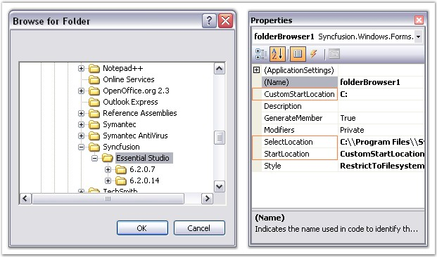
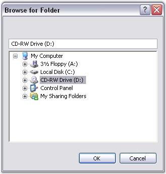
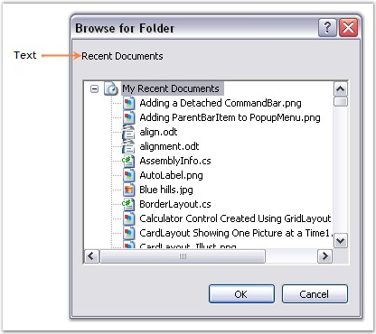

::: {style="DISPLAY: none"}
{#d2h_url_template}{#d2h_package_url style="WIDTH: 0px; DISPLAY: none; HEIGHT: 0px"}
:::

::::::: {.d2h_secondary_topic style="PADDING-BOTTOM: 10pt; MARGIN: 0pt; PADDING-LEFT: 0pt; PADDING-RIGHT: 0pt; PADDING-TOP: 0pt"}
##### Concepts and Features {#concepts-and-features style="tab-stops: 0pt"}

[]{style="COLOR: #15428b"} 

The following topics will help you become more familiar in using the FolderBrowser control.

[]{style="COLOR: #15428b"} 

###### []{#p496}[]{#_Location_Settings}3.3.7.1.3.1 Location Settings {#location-settings style="tab-stops: 0pt"}

[]{style="COLOR: #15428b"} 

This section deals with the location settings of the FolderBrowser control.

 

The FolderBrowser allows the user to provide the location from which browsing should start. It also provides various options from which the root folder for browsing can be selected. The following properties illustrate this.

[]{style="COLOR: #15428b"} 

::: {align="center"}
+-----------------------------------+------------------------------------------------------------------------------------------------------------------------------------+
| FolderBrowser Properties          | Description                                                                                                                        |
+-----------------------------------+------------------------------------------------------------------------------------------------------------------------------------+
| StartLocation                     | Specifies the location of the root folder from which to start browsing. It is the functional equivalent of setting the PIDL value. |
|                                   |                                                                                                                                    |
|                                   |                                                                                                                                    |
|                                   |                                                                                                                                    |
|                                   | *Desktop,*                                                                                                                         |
|                                   |                                                                                                                                    |
|                                   | *Internet,*                                                                                                                        |
|                                   |                                                                                                                                    |
|                                   | *Programs,*                                                                                                                        |
|                                   |                                                                                                                                    |
|                                   | *Controls,*                                                                                                                        |
|                                   |                                                                                                                                    |
|                                   | *Printers,*                                                                                                                        |
|                                   |                                                                                                                                    |
|                                   | *Personal,*                                                                                                                        |
|                                   |                                                                                                                                    |
|                                   | *Favorites,*                                                                                                                       |
|                                   |                                                                                                                                    |
|                                   | *Startup,*                                                                                                                         |
|                                   |                                                                                                                                    |
|                                   | *Recent,*                                                                                                                          |
|                                   |                                                                                                                                    |
|                                   | *SendTo,*                                                                                                                          |
|                                   |                                                                                                                                    |
|                                   | *BitBucket,*                                                                                                                       |
|                                   |                                                                                                                                    |
|                                   | *StartMenu,*                                                                                                                       |
|                                   |                                                                                                                                    |
|                                   | *MyDocuments,*                                                                                                                     |
|                                   |                                                                                                                                    |
|                                   | *MyMusic,*                                                                                                                         |
|                                   |                                                                                                                                    |
|                                   | *MyVideo,*                                                                                                                         |
|                                   |                                                                                                                                    |
|                                   | *DesktopDirectory,*                                                                                                                |
|                                   |                                                                                                                                    |
|                                   | *MyComputer,*                                                                                                                      |
|                                   |                                                                                                                                    |
|                                   | *NetworkNeighborhood,*                                                                                                             |
|                                   |                                                                                                                                    |
|                                   | *NetHood,*                                                                                                                         |
|                                   |                                                                                                                                    |
|                                   | *Fonts,*                                                                                                                           |
|                                   |                                                                                                                                    |
|                                   | *Templates,*                                                                                                                       |
|                                   |                                                                                                                                    |
|                                   | *MyPictures,*                                                                                                                      |
|                                   |                                                                                                                                    |
|                                   | *CommonDocuments,*                                                                                                                 |
|                                   |                                                                                                                                    |
|                                   | *CommonAdminTools,*                                                                                                                |
|                                   |                                                                                                                                    |
|                                   | *AdminTools,*                                                                                                                      |
|                                   |                                                                                                                                    |
|                                   | *NetAndDialUpConnections,*                                                                                                         |
|                                   |                                                                                                                                    |
|                                   | *CommonMusic,*                                                                                                                     |
|                                   |                                                                                                                                    |
|                                   | *CommonPictures,*                                                                                                                  |
|                                   |                                                                                                                                    |
|                                   | *CommonVideo,*                                                                                                                     |
|                                   |                                                                                                                                    |
|                                   | *Resources,*                                                                                                                       |
|                                   |                                                                                                                                    |
|                                   | *ResourcesLocalized,*                                                                                                              |
|                                   |                                                                                                                                    |
|                                   | *CommonOemLinks,*                                                                                                                  |
|                                   |                                                                                                                                    |
|                                   | *CDBurnArea,*                                                                                                                      |
|                                   |                                                                                                                                    |
|                                   | *ComputersNearMe,*                                                                                                                 |
|                                   |                                                                                                                                    |
|                                   | *CustomStartLocation,*                                                                                                             |
|                                   |                                                                                                                                    |
|                                   | *FlagPerUserInit,*                                                                                                                 |
|                                   |                                                                                                                                    |
|                                   | *FlagNoAlias,*                                                                                                                     |
|                                   |                                                                                                                                    |
|                                   | *FlagDontVerify,*                                                                                                                  |
|                                   |                                                                                                                                    |
|                                   | *FlagCreate and*                                                                                                                   |
|                                   |                                                                                                                                    |
|                                   | *FlagMask.*                                                                                                                        |
+-----------------------------------+------------------------------------------------------------------------------------------------------------------------------------+
| CustomStartLocation               | Gets / sets custom start location for showing the dialog.                                                                          |
+-----------------------------------+------------------------------------------------------------------------------------------------------------------------------------+
| SelectLocation                    | Gets / sets the selected location for showing the dialog.                                                                          |
+-----------------------------------+------------------------------------------------------------------------------------------------------------------------------------+
| DirectoryPath                     | Retrieves the location of the selected folder.                                                                                     |
+-----------------------------------+------------------------------------------------------------------------------------------------------------------------------------+
:::

[]{style="COLOR: #15428b"} 

::: {style="BORDER-BOTTOM: windowtext 1pt solid; BORDER-LEFT: medium none; PADDING-BOTTOM: 1pt; MARGIN-TOP: 9pt; PADDING-LEFT: 0pt; PADDING-RIGHT: 0pt; MARGIN-BOTTOM: 9pt; BORDER-TOP: windowtext 1pt solid; BORDER-RIGHT: medium none; PADDING-TOP: 1pt"}
{border="0"} Note: For the SelectLocation property to take effect, the StartLocation property must be set to \'CustomStartLocation\'.
:::

[]{style="COLOR: #15428b"} 

+--------------------------------------------------------------------------------------------------------------------------------------------------------------------------------------------------------------------------+
| **[\[C#\]]{style="FONT-FAMILY: 'Courier New'; COLOR: black"}**                                                                                                                                                           |
|                                                                                                                                                                                                                          |
| []{style="FONT-FAMILY: 'Courier New'; COLOR: black"}                                                                                                                                                                     |
|                                                                                                                                                                                                                          |
| [// Set the enumeration value FolderBrowserFolder.CustomStartLocation for Folder.StartLocation property.]{style="FONT-FAMILY: 'Courier New'; COLOR: green"}                                                              |
|                                                                                                                                                                                                                          |
| [this]{style="FONT-FAMILY: 'Courier New'; COLOR: blue"}[.folderBrowser1.StartLocation = Syncfusion.Windows.Forms.[FolderBrowserFolder]{style="COLOR: #2b91af"}.CustomStartLocation;]{style="FONT-FAMILY: 'Courier New'"} |
|                                                                                                                                                                                                                          |
| [this]{style="FONT-FAMILY: 'Courier New'; COLOR: blue"}[.folderBrowser1.CustomStartLocation = [\"C:\"]{style="COLOR: #a31515"};]{style="FONT-FAMILY: 'Courier New'"}                                                     |
|                                                                                                                                                                                                                          |
| []{style="FONT-FAMILY: 'Courier New'"}                                                                                                                                                                                   |
|                                                                                                                                                                                                                          |
| [// SelectLocation property for Automatic Scroll and Highlight of desired path.]{style="FONT-FAMILY: 'Courier New'; COLOR: green"}                                                                                       |
|                                                                                                                                                                                                                          |
| [this]{style="FONT-FAMILY: 'Courier New'; COLOR: blue"}[.folderBrowser1.SelectLocation = [\"C:\\\\Program Files\\\\Syncfusion\\\\Essential Studio\"]{style="COLOR: #a31515"};]{style="FONT-FAMILY: 'Courier New'"}       |
+--------------------------------------------------------------------------------------------------------------------------------------------------------------------------------------------------------------------------+

[]{style="COLOR: #15428b"} 

+-----------------------------------------------------------------------------------------------------------------------------------------------------------------------------------------------------------------+
| **[\[VB.NET\]]{style="FONT-FAMILY: 'Courier New'; COLOR: black"}**                                                                                                                                              |
|                                                                                                                                                                                                                 |
| []{style="FONT-FAMILY: 'Courier New'; COLOR: black"}                                                                                                                                                            |
|                                                                                                                                                                                                                 |
| [\' Set the enumeration value FolderBrowserFolder.CustomStartLocation for Folder.StartLocation property.]{style="FONT-FAMILY: 'Courier New'; COLOR: green"}                                                     |
|                                                                                                                                                                                                                 |
| [Me]{style="FONT-FAMILY: 'Courier New'; COLOR: blue"}[.folderBrowser1.StartLocation = Syncfusion.Windows.Forms.FolderBrowserFolder.CustomStartLocation]{style="FONT-FAMILY: 'Courier New'"}                     |
|                                                                                                                                                                                                                 |
| [Me]{style="FONT-FAMILY: 'Courier New'; COLOR: blue"}[.folderBrowser1.CustomStartLocation = [\"C:\"]{style="COLOR: #a31515"}]{style="FONT-FAMILY: 'Courier New'"}                                               |
|                                                                                                                                                                                                                 |
| []{style="FONT-FAMILY: 'Courier New'; COLOR: #a31515"}                                                                                                                                                          |
|                                                                                                                                                                                                                 |
| [\' SelectLocation property for Automatic Scroll and Highlight of desired path.]{style="FONT-FAMILY: 'Courier New'; COLOR: green"}                                                                              |
|                                                                                                                                                                                                                 |
| [Me]{style="FONT-FAMILY: 'Courier New'; COLOR: blue"}[.folderBrowser1.SelectLocation = [\"C:\\\\Program Files\\\\Syncfusion\\\\Essential Studio\"]{style="COLOR: #a31515"}]{style="FONT-FAMILY: 'Courier New'"} |
+-----------------------------------------------------------------------------------------------------------------------------------------------------------------------------------------------------------------+

[]{style="COLOR: #15428b"} 

{border="0"}

Figure 432: Location Settings of FolderBrowser

[]{style="COLOR: #15428b"} 

[]{style="COLOR: #15428b"} 

A Sample which demonstrates the Location Settings of FolderBrowser is available in the below sample installation path.

 

..My Documents\\Syncfusion\\EssentialStudio\\***Version Number***\\Windows\\Tools.Windows\\Samples\\2.0\\Editors Package\\FolderBrowserDemo

###### []{#p497}3.3.7.1.3.2 Style Settings {#style-settings style="tab-stops: 0pt"}

The style settings that are available for the FolderBrowser Dialog are given below.

[]{style="COLOR: #15428b"} 

::: {align="center"}
+-----------------------------------+-----------------------------------------------------+
| FolderBrowser Property            | Description                                         |
+-----------------------------------+-----------------------------------------------------+
| Style                             | Specifies the options for the FolderBrowser Dialog. |
|                                   |                                                     |
|                                   |                                                     |
|                                   |                                                     |
|                                   | The options included are as follows.                |
|                                   |                                                     |
|                                   |                                                     |
|                                   |                                                     |
|                                   | *RestrictToFilesystem,*                             |
|                                   |                                                     |
|                                   | *RestrictToSubfolders,*                             |
|                                   |                                                     |
|                                   | *RestrictToDomain,*                                 |
|                                   |                                                     |
|                                   | *BrowseForComputer,*                                |
|                                   |                                                     |
|                                   | *BrowseForEverything,*                              |
|                                   |                                                     |
|                                   | *BrowseForPrinter,*                                 |
|                                   |                                                     |
|                                   | *NewDialogStyle,*                                   |
|                                   |                                                     |
|                                   | *AllowUrls,*                                        |
|                                   |                                                     |
|                                   | *ShowAdministrativeShares,*                         |
|                                   |                                                     |
|                                   | *ShowShares,*                                       |
|                                   |                                                     |
|                                   | *ShowTextBox,*                                      |
|                                   |                                                     |
|                                   | *StatusText,*                                       |
|                                   |                                                     |
|                                   | *UAHint and*                                        |
|                                   |                                                     |
|                                   | *Validate.*                                         |
+-----------------------------------+-----------------------------------------------------+
:::

[]{style="COLOR: #15428b"} 

The various options of the **Style** property are described below.

[]{style="COLOR: #15428b"} 

[·      ]{style="FONT-FAMILY: Symbol"}**RestrictToFilesystem** - Restricts selection to file system directories.

[·      ]{style="FONT-FAMILY: Symbol"}**RestrictToSubfolders** - Returns only file system ancestors.

[·      ]{style="FONT-FAMILY: Symbol"}**RestrictToDomain** - Excludes network folders below the domain level.

[·      ]{style="FONT-FAMILY: Symbol"}**BrowseForComputer** - Displays only computers.

[·      ]{style="FONT-FAMILY: Symbol"}**BrowseForEverything** - Displays files as well as folders.

[·      ]{style="FONT-FAMILY: Symbol"}**BrowseForPrinter** - Displays only printers.

[·      ]{style="FONT-FAMILY: Symbol"}**NewDialogStyle** - Uses the new resizable folder selection dialog.

[·      ]{style="FONT-FAMILY: Symbol"}**AllowUrls** - Displays URLs. \'NewDialogStyle\' and \'BrowseForEverything\' must be set along with this flag.

[·      ]{style="FONT-FAMILY: Symbol"}**ShowAdministrativeShares** - Displays administrative shares existing on the remote system.

[·      ]{style="FONT-FAMILY: Symbol"}**ShowShares** - Displays shareable resources existing on the remote system.

[·      ]{style="FONT-FAMILY: Symbol"}**ShowTextBox** - Displays textbox in the FolderBrowser Dialog.

[·      ]{style="FONT-FAMILY: Symbol"}**StatusText** - Includes status area in the dialog box. StatusText can be specified in the FolderBrowserCallBack event handler. This style does not apply to \'NewDialogStyle\'.

[·      ]{style="FONT-FAMILY: Symbol"}**UAHint** - Adds an usage hint to the folder dialog. It can be applied only with \'NewDialogStyle\'.

[·      ]{style="FONT-FAMILY: Symbol"}**Validate** - Typing invalid name in the textbox triggers FolderBrowserCallBack event.

[]{style="COLOR: #15428b"} 

+----------------------------------------------------------------------------------------------------------------------------------------------------------------------------------------------------------+
| **[\[C#\]]{style="FONT-FAMILY: 'Courier New'; COLOR: black"}**                                                                                                                                           |
|                                                                                                                                                                                                          |
| []{style="FONT-FAMILY: 'Courier New'; COLOR: black"}                                                                                                                                                     |
|                                                                                                                                                                                                          |
| [this]{style="FONT-FAMILY: 'Courier New'; COLOR: blue"}[.folderBrowser1.Style = Syncfusion.Windows.Forms.[FolderBrowserStyles]{style="COLOR: #2b91af"}.ShowTextBox;]{style="FONT-FAMILY: 'Courier New'"} |
+----------------------------------------------------------------------------------------------------------------------------------------------------------------------------------------------------------+

[]{style="COLOR: #15428b"} 

+-----------------------------------------------------------------------------------------------------------------------------------------------------------------------------+
| **[\[VB.NET\]]{style="FONT-FAMILY: 'Courier New'; COLOR: black"}**                                                                                                          |
|                                                                                                                                                                             |
| []{style="FONT-FAMILY: 'Courier New'; COLOR: black"}                                                                                                                        |
|                                                                                                                                                                             |
| [Me]{style="FONT-FAMILY: 'Courier New'; COLOR: blue"}[.folderBrowser1.Style = Syncfusion.Windows.Forms.FolderBrowserStyles.ShowTextBox]{style="FONT-FAMILY: 'Courier New'"} |
+-----------------------------------------------------------------------------------------------------------------------------------------------------------------------------+

[]{style="COLOR: #15428b"} 

{border="0"}

Figure 433: \"ShowTextBox\" Style of FolderBrowser

[]{style="COLOR: #15428b"} 

***[]{style="COLOR: #15428b"}*** 

[]{style="COLOR: #15428b"} 

A Sample which demonstrates the Style Settings of FolderBrowser is available in the below sample installation path.

 

..My Documents\\Syncfusion\\EssentialStudio\\***Version Number***\\Windows\\Tools.Windows\\Samples\\2.0\\Editors Package\\FolderBrowserDemo

 

[]{#p498} 

 

[]{style="COLOR: #15428b"} 

###### []{#_Text_Settings_1}[3.3.7.1.3.3      ]{style="FONT-SIZE: 9pt"}Text Settings[]{style="FONT-SIZE: 9pt"} {#text-settings style="tab-stops: 0pt"}

[]{style="COLOR: #15428b"} 

The text settings of the FolderBrowser control are described below.

 

The text for the FolderBrowser can be set using the below given property.

[]{style="COLOR: #15428b"} 

::: {align="center"}
  ------------------------ ------------------------------------------------------------------------------------
  FolderBrowser Property   Description
  Description              Gets / sets the text displayed above the tree control in the FolderBrowser Dialog.
  ------------------------ ------------------------------------------------------------------------------------
:::

[]{style="COLOR: #15428b"} 

The **Description** property of the FolderBrowser supports the \'AutoComplete\' feature, that provides options that can be used to complete text even before it is entered.

[]{style="COLOR: #15428b"} 

+----------------------------------------------------------------------------------------------------------------------------------------------------------------------------+
| **[\[C#\]]{style="FONT-FAMILY: 'Courier New'; COLOR: black"}**                                                                                                             |
|                                                                                                                                                                            |
| []{style="FONT-FAMILY: 'Courier New'; COLOR: black"}                                                                                                                       |
|                                                                                                                                                                            |
| [this]{style="FONT-FAMILY: 'Courier New'; COLOR: blue"}[.folderBrowser1.Description = [\"Recent Documents\"]{style="COLOR: #a31515"};]{style="FONT-FAMILY: 'Courier New'"} |
+----------------------------------------------------------------------------------------------------------------------------------------------------------------------------+

[]{style="COLOR: #15428b"} 

+-------------------------------------------------------------------------------------------------------------------------------------------------------------------------+
| **[\[VB.NET\]]{style="FONT-FAMILY: 'Courier New'; COLOR: black"}**                                                                                                      |
|                                                                                                                                                                         |
| []{style="FONT-FAMILY: 'Courier New'; COLOR: black"}                                                                                                                    |
|                                                                                                                                                                         |
| [Me]{style="FONT-FAMILY: 'Courier New'; COLOR: blue"}[.folderBrowser1.Description = [\"Recent Documents\"]{style="COLOR: #a31515"}]{style="FONT-FAMILY: 'Courier New'"} |
+-------------------------------------------------------------------------------------------------------------------------------------------------------------------------+

[]{style="COLOR: #15428b"} 

{border="0"}

Figure 434: Text set for the FolderBrowser

[]{style="COLOR: #15428b"} 

[]{#related-topics}
:::::::
