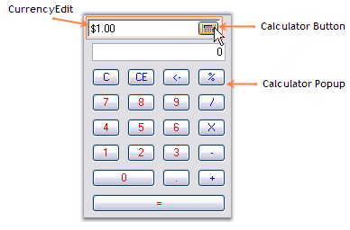
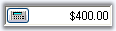

::: {style="DISPLAY: none"}
{#d2h_url_template}{#d2h_package_url style="WIDTH: 0px; DISPLAY: none; HEIGHT: 0px"}
:::

::::::: {.d2h_secondary_topic style="PADDING-BOTTOM: 10pt; MARGIN: 0pt; PADDING-LEFT: 0pt; PADDING-RIGHT: 0pt; PADDING-TOP: 0pt"}
##### Concepts and Features {#concepts-and-features style="tab-stops: 0pt"}

The following topics will help you become more familiar in using the CurrencyEdit control.

###### 3.3.8.1.3.1 [[Calculator Settings]{style="COLOR: windowtext; TEXT-DECORATION: none; text-underline: none"}](http://help.syncfusion.com/ug_82/WindowsFormsUI_Tools/CalculatorSettings.html) {#calculator-settings style="tab-stops: 0pt"}

A CurrencyEdit control has a text field and a Calculator button, pressing which will open a Calculator control. The below image illustrates the same.[]{style="COLOR: black"}

[]{style="COLOR: black"} 

{border="0"}

Figure 438: CurrencyEdit Control with its Components

[]{style="COLOR: black"} 

The properties which controls the behavior of the Calculator button is as follows.[]{style="COLOR: black"}

[]{style="COLOR: black"} 

::: {align="center"}
+--------------------------------------------------+-----------------------------------------------------------------------------------------------------------------------------------------------------------------------------------------------------------------------------------------------------------------------------------------------------------------------+
| CurrencyEdit Properties[]{style="COLOR: black"}  | Description[]{style="COLOR: black"}                                                                                                                                                                                                                                                                                   |
+--------------------------------------------------+-----------------------------------------------------------------------------------------------------------------------------------------------------------------------------------------------------------------------------------------------------------------------------------------------------------------------+
| ShowCalculator[]{style="COLOR: black"}           | Specifies whether calculator button is to be displayed. By default it is **True**.[]{style="COLOR: black"}                                                                                                                                                                                                            |
+--------------------------------------------------+-----------------------------------------------------------------------------------------------------------------------------------------------------------------------------------------------------------------------------------------------------------------------------------------------------------------------+
| CalculatorButton[]{style="COLOR: black"}         | Provides properties to customize the calculator button. [See ButtonEdit](http://172.168.111.149/UG_82/WindowsFormsUI_Tools/ButtonEdit.html) control user guide to know about the settings.[]{style="COLOR: black"}                                                                                                    |
+--------------------------------------------------+-----------------------------------------------------------------------------------------------------------------------------------------------------------------------------------------------------------------------------------------------------------------------------------------------------------------------+
| CalculatorLayoutType[]{style="COLOR: black"}     | Specifies the LayoutType for the Calculator control. The layout types are,[]{style="COLOR: black"}                                                                                                                                                                                                                    |
|                                                  |                                                                                                                                                                                                                                                                                                                       |
|                                                  | []{style="COLOR: black"}                                                                                                                                                                                                                                                                                              |
|                                                  |                                                                                                                                                                                                                                                                                                                       |
|                                                  | *Financial (default) and*[]{style="COLOR: black"}                                                                                                                                                                                                                                                                     |
|                                                  |                                                                                                                                                                                                                                                                                                                       |
|                                                  | *WindowStandard.*[]{style="COLOR: black"}                                                                                                                                                                                                                                                                             |
+--------------------------------------------------+-----------------------------------------------------------------------------------------------------------------------------------------------------------------------------------------------------------------------------------------------------------------------------------------------------------------------+
| PopupCalculatorAlignment[]{style="COLOR: black"} | It sets the alignment of the popup calculator with respect to the ButtonEdit control. The options are,[]{style="COLOR: black"}                                                                                                                                                                                        |
|                                                  |                                                                                                                                                                                                                                                                                                                       |
|                                                  | []{style="COLOR: black"}                                                                                                                                                                                                                                                                                              |
|                                                  |                                                                                                                                                                                                                                                                                                                       |
|                                                  | *Right(default) and*[]{style="COLOR: black"}                                                                                                                                                                                                                                                                          |
|                                                  |                                                                                                                                                                                                                                                                                                                       |
|                                                  | *Left.*[]{style="COLOR: black"}                                                                                                                                                                                                                                                                                       |
+--------------------------------------------------+-----------------------------------------------------------------------------------------------------------------------------------------------------------------------------------------------------------------------------------------------------------------------------------------------------------------------+
| CloseAction[]{style="COLOR: black"}              | Specifies the action that will close the popup calculator. After performing calculations in the popup calculator, we may press \'=\' to close the popup calculator. This is called closed action. We can select any operator instead of \'=\' to close the popup calculator. The options are,[]{style="COLOR: black"} |
|                                                  |                                                                                                                                                                                                                                                                                                                       |
|                                                  | []{style="COLOR: black"}                                                                                                                                                                                                                                                                                              |
|                                                  |                                                                                                                                                                                                                                                                                                                       |
|                                                  | *Calcdigit0\...Calcdigit9,*[]{style="COLOR: black"}                                                                                                                                                                                                                                                                   |
|                                                  |                                                                                                                                                                                                                                                                                                                       |
|                                                  | *CalcOperatorNone,*[]{style="COLOR: black"}                                                                                                                                                                                                                                                                           |
|                                                  |                                                                                                                                                                                                                                                                                                                       |
|                                                  | *CalcOperatorMultiply,*[]{style="COLOR: black"}                                                                                                                                                                                                                                                                       |
|                                                  |                                                                                                                                                                                                                                                                                                                       |
|                                                  | *CalcOperatorPlus,*[]{style="COLOR: black"}                                                                                                                                                                                                                                                                           |
|                                                  |                                                                                                                                                                                                                                                                                                                       |
|                                                  | *CalcOperatorMinus,*[]{style="COLOR: black"}                                                                                                                                                                                                                                                                          |
|                                                  |                                                                                                                                                                                                                                                                                                                       |
|                                                  | *CalcOperatorDivide,*[]{style="COLOR: black"}                                                                                                                                                                                                                                                                         |
|                                                  |                                                                                                                                                                                                                                                                                                                       |
|                                                  | *CalcOperatorPercent,*[]{style="COLOR: black"}                                                                                                                                                                                                                                                                        |
|                                                  |                                                                                                                                                                                                                                                                                                                       |
|                                                  | *CalcOperatorEquals (default),*[]{style="COLOR: black"}                                                                                                                                                                                                                                                               |
|                                                  |                                                                                                                                                                                                                                                                                                                       |
|                                                  | *CalcOperatorSqrt,*[]{style="COLOR: black"}                                                                                                                                                                                                                                                                           |
|                                                  |                                                                                                                                                                                                                                                                                                                       |
|                                                  | *CalcOperatorSign,*[]{style="COLOR: black"}                                                                                                                                                                                                                                                                           |
|                                                  |                                                                                                                                                                                                                                                                                                                       |
|                                                  | *CalcOperatorMemoryClear,*[]{style="COLOR: black"}                                                                                                                                                                                                                                                                    |
|                                                  |                                                                                                                                                                                                                                                                                                                       |
|                                                  | *CalcOperatorMemoryRecall,*[]{style="COLOR: black"}                                                                                                                                                                                                                                                                   |
|                                                  |                                                                                                                                                                                                                                                                                                                       |
|                                                  | *CalcOperatorMemoryStore,*[]{style="COLOR: black"}                                                                                                                                                                                                                                                                    |
|                                                  |                                                                                                                                                                                                                                                                                                                       |
|                                                  | *CalcOperatorMemoryPlus,*[]{style="COLOR: black"}                                                                                                                                                                                                                                                                     |
|                                                  |                                                                                                                                                                                                                                                                                                                       |
|                                                  | *CalcSpecialClear,*[]{style="COLOR: black"}                                                                                                                                                                                                                                                                           |
|                                                  |                                                                                                                                                                                                                                                                                                                       |
|                                                  | *CalcSpecialClearEntry,*[]{style="COLOR: black"}                                                                                                                                                                                                                                                                      |
|                                                  |                                                                                                                                                                                                                                                                                                                       |
|                                                  | *CalcSpecialDecimal and*[]{style="COLOR: black"}                                                                                                                                                                                                                                                                      |
|                                                  |                                                                                                                                                                                                                                                                                                                       |
|                                                  | *CalcSpecialBackspace.*[]{style="COLOR: black"}                                                                                                                                                                                                                                                                       |
+--------------------------------------------------+-----------------------------------------------------------------------------------------------------------------------------------------------------------------------------------------------------------------------------------------------------------------------------------------------------------------------+
:::

[]{style="COLOR: black"} 

::: {align="center"}
+-----------------------------------------------------------------------------------------------------------------------------------------------------------------------------------------------------------------------------------------------------------------------------------------+
| **[\[C#\]]{style="FONT-FAMILY: 'Courier New'; COLOR: black"}**[]{style="COLOR: black"}                                                                                                                                                                                                  |
|                                                                                                                                                                                                                                                                                         |
| []{style="COLOR: black"}                                                                                                                                                                                                                                                                |
|                                                                                                                                                                                                                                                                                         |
| [this]{style="FONT-FAMILY: 'Courier New'; COLOR: blue"}[.currencyEdit1.CalculatorLayoutType = Syncfusion.Windows.Forms.Tools.CalculatorLayoutTypes.WindowsStandard;]{style="FONT-FAMILY: 'Courier New'; COLOR: black"}[]{style="COLOR: black"}                                          |
|                                                                                                                                                                                                                                                                                         |
| [this]{style="FONT-FAMILY: 'Courier New'; COLOR: blue"}[.currencyEdit1.CloseAction = Syncfusion.Windows.Forms.Tools.CalcActions.CalcOperatorEquals;]{style="FONT-FAMILY: 'Courier New'; COLOR: black"}[]{style="COLOR: black"}                                                          |
|                                                                                                                                                                                                                                                                                         |
| [this]{style="FONT-FAMILY: 'Courier New'; COLOR: blue"}[.currencyEdit1.PopupCalculatorAlignment = Syncfusion.Windows.Forms.Tools.CalculatorPopupAlignment.Left;]{style="FONT-FAMILY: 'Courier New'; COLOR: black"}[]{style="COLOR: black"}                                              |
|                                                                                                                                                                                                                                                                                         |
| [this]{style="FONT-FAMILY: 'Courier New'; COLOR: blue"}[.currencyEdit1.ShowCalculator = ]{style="FONT-FAMILY: 'Courier New'; COLOR: black"}[true]{style="FONT-FAMILY: 'Courier New'; COLOR: blue"}[;]{style="FONT-FAMILY: 'Courier New'; COLOR: black"}[]{style="COLOR: black"}         |
|                                                                                                                                                                                                                                                                                         |
| [this]{style="FONT-FAMILY: 'Courier New'; COLOR: blue"}[.currencyEdit1.TransferFromCalculator = ]{style="FONT-FAMILY: 'Courier New'; COLOR: black"}[true]{style="FONT-FAMILY: 'Courier New'; COLOR: blue"}[;]{style="FONT-FAMILY: 'Courier New'; COLOR: black"}[]{style="COLOR: black"} |
|                                                                                                                                                                                                                                                                                         |
| [this]{style="FONT-FAMILY: 'Courier New'; COLOR: blue"}[.currencyEdit1.TransferToCalculator = ]{style="FONT-FAMILY: 'Courier New'; COLOR: black"}[true]{style="FONT-FAMILY: 'Courier New'; COLOR: blue"}[;]{style="FONT-FAMILY: 'Courier New'; COLOR: black"}[]{style="COLOR: black"}   |
+-----------------------------------------------------------------------------------------------------------------------------------------------------------------------------------------------------------------------------------------------------------------------------------------+
:::

[]{style="COLOR: black"} 

[]{style="COLOR: black"} 

+---------------------------------------------------------------------------------------------------------------------------------------------------------------------------------------------------------------------------------------------+
| **[\[VB.NET\]]{style="FONT-FAMILY: 'Courier New'; COLOR: black"}**[]{style="COLOR: black"}                                                                                                                                                  |
|                                                                                                                                                                                                                                             |
| []{style="COLOR: black"}                                                                                                                                                                                                                    |
|                                                                                                                                                                                                                                             |
| [Me]{style="FONT-FAMILY: 'Courier New'; COLOR: blue"}[.currencyEdit1.CalculatorLayoutType = Syncfusion.Windows.Forms.Tools.CalculatorLayoutTypes.WindowsStandard]{style="FONT-FAMILY: 'Courier New'; COLOR: black"}[]{style="COLOR: black"} |
|                                                                                                                                                                                                                                             |
| [Me]{style="FONT-FAMILY: 'Courier New'; COLOR: blue"}[.currencyEdit1.CloseAction = Syncfusion.Windows.Forms.Tools.CalcActions.CalcOperatorEquals]{style="FONT-FAMILY: 'Courier New'; COLOR: black"}[]{style="COLOR: black"}                 |
|                                                                                                                                                                                                                                             |
| [Me]{style="FONT-FAMILY: 'Courier New'; COLOR: blue"}[.currencyEdit1.PopupCalculatorAlignment = Syncfusion.Windows.Forms.Tools.CalculatorPopupAlignment.Left]{style="FONT-FAMILY: 'Courier New'; COLOR: black"}[]{style="COLOR: black"}     |
|                                                                                                                                                                                                                                             |
| [Me]{style="FONT-FAMILY: 'Courier New'; COLOR: blue"}[.currencyEdit1.ShowCalculator = ]{style="FONT-FAMILY: 'Courier New'; COLOR: black"}[True]{style="FONT-FAMILY: 'Courier New'; COLOR: blue"}[]{style="COLOR: black"}                    |
|                                                                                                                                                                                                                                             |
| [Me]{style="FONT-FAMILY: 'Courier New'; COLOR: blue"}[.currencyEdit1.TransferFromCalculator = ]{style="FONT-FAMILY: 'Courier New'; COLOR: black"}[True]{style="FONT-FAMILY: 'Courier New'; COLOR: blue"}[]{style="COLOR: black"}            |
|                                                                                                                                                                                                                                             |
| [Me]{style="FONT-FAMILY: 'Courier New'; COLOR: blue"}[.currencyEdit1.TransferToCalculator = ]{style="FONT-FAMILY: 'Courier New'; COLOR: black"}[True]{style="FONT-FAMILY: 'Courier New'; COLOR: blue"}[]{style="COLOR: black"}              |
+---------------------------------------------------------------------------------------------------------------------------------------------------------------------------------------------------------------------------------------------+

 

###### 3.3.8.1.3.2 [[Text Settings]{style="COLOR: windowtext; TEXT-DECORATION: none; text-underline: none"}](http://help.syncfusion.com/ug_82/WindowsFormsUI_Tools/TextSettings2.html) {#text-settings style="tab-stops: 0pt"}

The below properties will let you control the behavior of the text in the CurrencyEdit control.[]{style="COLOR: black"}

[]{style="COLOR: black"} 

::: {align="center"}
  ------------------------------------------------- ---------------------------------------------------------------------------------------------------
  CurrencyEdit Properties[]{style="COLOR: black"}   Description[]{style="COLOR: black"}
  ShowTextBox[]{style="COLOR: black"}               Indicates whether to show the textbox or not.[]{style="COLOR: black"}
  Text[]{style="COLOR: black"}                      Specifies the text of the embedded control.[]{style="COLOR: black"}
  TextBox[]{style="COLOR: black"}                   Specifies the properties for customizing the embedded textbox.[]{style="COLOR: black"}
  TextAlign[]{style="COLOR: black"}                 Specifies the alignment of the text in the control.[]{style="COLOR: black"}
  TransferFromCalculator[]{style="COLOR: black"}    Specifies whether to transfer the calculated value to the edit control.[]{style="COLOR: black"}
  TransferToCalculator[]{style="COLOR: black"}      Specifies whether to transfer the calculated value from the edit control.[]{style="COLOR: black"}
  DecimalValue[]{style="COLOR: black"}              Specifies the decimal value of the currency control.[]{style="COLOR: black"}
  ------------------------------------------------- ---------------------------------------------------------------------------------------------------
:::

[]{style="COLOR: black"} 

+------------------------------------------------------------------------------------------------------------------------------------------------------------------------------------------------------------------------------------------------------------------------------------------------------------------------------------------------------------------------------------------------------------------------------------------------------------------------------------------------------------------------------------------------------------------------------------------------------------------------------------------------------+
| **[\[C#\]]{style="FONT-FAMILY: 'Courier New'; COLOR: black"}**[]{style="COLOR: black"}                                                                                                                                                                                                                                                                                                                                                                                                                                                                                                                                                               |
|                                                                                                                                                                                                                                                                                                                                                                                                                                                                                                                                                                                                                                                      |
| []{style="COLOR: black"}                                                                                                                                                                                                                                                                                                                                                                                                                                                                                                                                                                                                                             |
|                                                                                                                                                                                                                                                                                                                                                                                                                                                                                                                                                                                                                                                      |
| [this]{style="FONT-FAMILY: 'Courier New'; COLOR: blue"}[.currencyEdit1.ShowTextBox = ]{style="FONT-FAMILY: 'Courier New'; COLOR: black"}[true]{style="FONT-FAMILY: 'Courier New'; COLOR: blue"}[;]{style="FONT-FAMILY: 'Courier New'; COLOR: black"}[]{style="COLOR: black"}                                                                                                                                                                                                                                                                                                                                                                         |
|                                                                                                                                                                                                                                                                                                                                                                                                                                                                                                                                                                                                                                                      |
| [this]{style="FONT-FAMILY: 'Courier New'; COLOR: blue"}[.currencyEdit1.Text = ]{style="FONT-FAMILY: 'Courier New'; COLOR: black"}[\"\$400.00\"]{style="FONT-FAMILY: 'Courier New'; COLOR: maroon"}[;]{style="FONT-FAMILY: 'Courier New'; COLOR: black"}[]{style="COLOR: black"}                                                                                                                                                                                                                                                                                                                                                                      |
|                                                                                                                                                                                                                                                                                                                                                                                                                                                                                                                                                                                                                                                      |
| [this]{style="FONT-FAMILY: 'Courier New'; COLOR: blue"}[.currencyEdit1.TextAlign = ]{style="FONT-FAMILY: 'Courier New'; COLOR: black"}[HorizontalAlignment]{style="FONT-FAMILY: 'Courier New'; COLOR: teal"}[.Right;]{style="FONT-FAMILY: 'Courier New'; COLOR: black"}[]{style="COLOR: black"}                                                                                                                                                                                                                                                                                                                                                      |
|                                                                                                                                                                                                                                                                                                                                                                                                                                                                                                                                                                                                                                                      |
| [this]{style="FONT-FAMILY: 'Courier New'; COLOR: blue"}[.currencyEdit1.TransferFromCalculator=]{style="FONT-FAMILY: 'Courier New'; COLOR: black"}[true]{style="FONT-FAMILY: 'Courier New'; COLOR: blue"}[;]{style="FONT-FAMILY: 'Courier New'; COLOR: black"}[]{style="COLOR: black"}                                                                                                                                                                                                                                                                                                                                                                |
|                                                                                                                                                                                                                                                                                                                                                                                                                                                                                                                                                                                                                                                      |
| [this]{style="FONT-FAMILY: 'Courier New'; COLOR: blue"}[.currencyEdit1.TransferToCalculator= ]{style="FONT-FAMILY: 'Courier New'; COLOR: black"}[false]{style="FONT-FAMILY: 'Courier New'; COLOR: blue"}[;]{style="FONT-FAMILY: 'Courier New'; COLOR: black"}[]{style="COLOR: black"}                                                                                                                                                                                                                                                                                                                                                                |
|                                                                                                                                                                                                                                                                                                                                                                                                                                                                                                                                                                                                                                                      |
| [this]{style="FONT-FAMILY: 'Courier New'; COLOR: blue"}[.currencyEdit1.TextBox.DecimalValue = ]{style="FONT-FAMILY: 'Courier New'; COLOR: black"}[new]{style="FONT-FAMILY: 'Courier New'; COLOR: blue"}[ ]{style="FONT-FAMILY: 'Courier New'; COLOR: black"}[decimal]{style="FONT-FAMILY: 'Courier New'; COLOR: blue"}[(]{style="FONT-FAMILY: 'Courier New'; COLOR: black"}[new]{style="FONT-FAMILY: 'Courier New'; COLOR: blue"}[ ]{style="FONT-FAMILY: 'Courier New'; COLOR: black"}[int]{style="FONT-FAMILY: 'Courier New'; COLOR: blue"}[\[\] {40000, 0, 0, 131072});]{style="FONT-FAMILY: 'Courier New'; COLOR: black"}[]{style="COLOR: black"} |
+------------------------------------------------------------------------------------------------------------------------------------------------------------------------------------------------------------------------------------------------------------------------------------------------------------------------------------------------------------------------------------------------------------------------------------------------------------------------------------------------------------------------------------------------------------------------------------------------------------------------------------------------------+

[]{style="COLOR: black"} 

+-----------------------------------------------------------------------------------------------------------------------------------------------------------------------------------------------------------------------------------------------------------------------------------------------------------------------------------------------------------------------------------------------------------------------------------------------------------------------------------------------------------------------------------------------------------------------------------------------------------------------------------------------------+
| **[\[VB.NET\]]{style="FONT-FAMILY: 'Courier New'; COLOR: black"}**[]{style="COLOR: black"}                                                                                                                                                                                                                                                                                                                                                                                                                                                                                                                                                          |
|                                                                                                                                                                                                                                                                                                                                                                                                                                                                                                                                                                                                                                                     |
| []{style="COLOR: black"}                                                                                                                                                                                                                                                                                                                                                                                                                                                                                                                                                                                                                            |
|                                                                                                                                                                                                                                                                                                                                                                                                                                                                                                                                                                                                                                                     |
| [Me]{style="FONT-FAMILY: 'Courier New'; COLOR: blue"}[.currencyEdit1.ShowTextBox = ]{style="FONT-FAMILY: 'Courier New'; COLOR: black"}[True]{style="FONT-FAMILY: 'Courier New'; COLOR: blue"}[]{style="COLOR: black"}                                                                                                                                                                                                                                                                                                                                                                                                                               |
|                                                                                                                                                                                                                                                                                                                                                                                                                                                                                                                                                                                                                                                     |
| [Me]{style="FONT-FAMILY: 'Courier New'; COLOR: blue"}[.currencyEdit1.Text = ]{style="FONT-FAMILY: 'Courier New'; COLOR: black"}[\"\$400.00\"]{style="FONT-FAMILY: 'Courier New'; COLOR: maroon"}[]{style="COLOR: black"}                                                                                                                                                                                                                                                                                                                                                                                                                            |
|                                                                                                                                                                                                                                                                                                                                                                                                                                                                                                                                                                                                                                                     |
| [Me]{style="FONT-FAMILY: 'Courier New'; COLOR: blue"}[.currencyEdit1.TextAlign = HorizontalAlignment.Right]{style="FONT-FAMILY: 'Courier New'; COLOR: black"}[]{style="COLOR: black"}                                                                                                                                                                                                                                                                                                                                                                                                                                                               |
|                                                                                                                                                                                                                                                                                                                                                                                                                                                                                                                                                                                                                                                     |
| [Me]{style="FONT-FAMILY: 'Courier New'; COLOR: blue"}[.currencyEdit1.TransferFromCalculator = ]{style="FONT-FAMILY: 'Courier New'; COLOR: black"}[True]{style="FONT-FAMILY: 'Courier New'; COLOR: blue"}[]{style="COLOR: black"}                                                                                                                                                                                                                                                                                                                                                                                                                    |
|                                                                                                                                                                                                                                                                                                                                                                                                                                                                                                                                                                                                                                                     |
| [Me]{style="FONT-FAMILY: 'Courier New'; COLOR: blue"}[.currencyEdit1.TransferToCalculator = ]{style="FONT-FAMILY: 'Courier New'; COLOR: black"}[False]{style="FONT-FAMILY: 'Courier New'; COLOR: blue"}[]{style="COLOR: black"}                                                                                                                                                                                                                                                                                                                                                                                                                     |
|                                                                                                                                                                                                                                                                                                                                                                                                                                                                                                                                                                                                                                                     |
| [Me]{style="FONT-FAMILY: 'Courier New'; COLOR: blue"}[.currencyEdit1.TextBox.DecimalValue = ]{style="FONT-FAMILY: 'Courier New'; COLOR: black"}[New]{style="FONT-FAMILY: 'Courier New'; COLOR: blue"}[ ]{style="FONT-FAMILY: 'Courier New'; COLOR: black"}[Decimal]{style="FONT-FAMILY: 'Courier New'; COLOR: blue"}[(]{style="FONT-FAMILY: 'Courier New'; COLOR: black"}[New]{style="FONT-FAMILY: 'Courier New'; COLOR: blue"}[ ]{style="FONT-FAMILY: 'Courier New'; COLOR: black"}[Integer]{style="FONT-FAMILY: 'Courier New'; COLOR: blue"}[() {40000, 0, 0, 131072})]{style="FONT-FAMILY: 'Courier New'; COLOR: black"}[]{style="COLOR: black"} |
+-----------------------------------------------------------------------------------------------------------------------------------------------------------------------------------------------------------------------------------------------------------------------------------------------------------------------------------------------------------------------------------------------------------------------------------------------------------------------------------------------------------------------------------------------------------------------------------------------------------------------------------------------------+

[]{style="COLOR: black"} 

{border="0"}

Figure 439: Text = \"\$400\"; TextAlign = \"Right\"; TransferFromCalculator = \"True\"

[]{style="COLOR: black"} 

::: {style="BORDER-BOTTOM: windowtext 1pt solid; BORDER-LEFT: medium none; PADDING-BOTTOM: 1pt; MARGIN-TOP: 9pt; PADDING-LEFT: 0pt; PADDING-RIGHT: 0pt; MARGIN-BOTTOM: 9pt; BORDER-TOP: windowtext 1pt solid; BORDER-RIGHT: medium none; PADDING-TOP: 1pt"}
[{border="0"}]{style="COLOR: black"} Note: Enabling ButtonEdit.UseVisualStyle property and by setting visual style for control using ButtonEdit.ButtonStyle property, we can change the appearance of the calculator button.[]{style="COLOR: black"}
:::

 

[]{#related-topics}
:::::::
