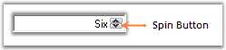
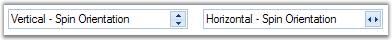
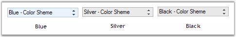
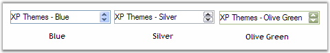
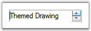
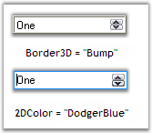

::: {style="DISPLAY: none"}
{#d2h_url_template}{#d2h_package_url style="WIDTH: 0px; DISPLAY: none; HEIGHT: 0px"}
:::

:::::: {.d2h_secondary_topic style="PADDING-BOTTOM: 10pt; MARGIN: 0pt; PADDING-LEFT: 0pt; PADDING-RIGHT: 0pt; PADDING-TOP: 0pt"}
##### Concepts and Features {#concepts-and-features style="tab-stops: 0pt"}

###### 3.3.8.2.3.1 [[Text Settings]{style="COLOR: windowtext; TEXT-DECORATION: none; text-underline: none"}](http://help.syncfusion.com/ug_82/WindowsFormsUI_Tools/TextSettings3.html) {#text-settings style="tab-stops: 0pt"}

The text for the DomainUpDownExt control can be specified in String Collection Editor. This section discusses the properties which deals with this text.[]{style="COLOR: black"}

[]{style="COLOR: black"} 

::: {align="center"}
  -------------------------------------------------- --------------------------------------------------------------------------------------------------------------------------------------------------------
  DomainUpDownExt Property[]{style="COLOR: black"}   Description[]{style="COLOR: black"}
  Items[]{style="COLOR: black"}                      Invokes String Collection Editor. Text for the control can be specified in this editor.[]{style="COLOR: black"}
  TextAlign[]{style="COLOR: black"}                  Specifies the alignment of the text in the text field.[]{style="COLOR: black"}
  MaxLength[]{style="COLOR: black"}                  Indicates the maximum length of the text that can be entered into the editable portion of the control. Default value is 32767.[]{style="COLOR: black"}
  -------------------------------------------------- --------------------------------------------------------------------------------------------------------------------------------------------------------
:::

[]{style="COLOR: black"} 

+-------------------------------------------------------------------------------------------------------------------------------------------------------------------------------------------------------------------------------------------------------------------------------------------------------------------------+
| **[\[C#\]]{style="FONT-FAMILY: 'Courier New'; COLOR: black"}**[]{style="COLOR: black"}                                                                                                                                                                                                                                  |
|                                                                                                                                                                                                                                                                                                                         |
| []{style="COLOR: black"}                                                                                                                                                                                                                                                                                                |
|                                                                                                                                                                                                                                                                                                                         |
| [this]{style="FONT-FAMILY: 'Courier New'; COLOR: blue"}[.domainUpDownExt2.Items.Add(]{style="FONT-FAMILY: 'Courier New'; COLOR: black"}[\"Six\"]{style="FONT-FAMILY: 'Courier New'; COLOR: maroon"}[);]{style="FONT-FAMILY: 'Courier New'; COLOR: black"}[]{style="COLOR: black"}                                       |
|                                                                                                                                                                                                                                                                                                                         |
| [this]{style="FONT-FAMILY: 'Courier New'; COLOR: blue"}[.domainUpDownExt1.TextAlign = System.Windows.Forms.]{style="FONT-FAMILY: 'Courier New'; COLOR: black"}[HorizontalAlignment]{style="FONT-FAMILY: 'Courier New'; COLOR: teal"}[.Right;]{style="FONT-FAMILY: 'Courier New'; COLOR: black"}[]{style="COLOR: black"} |
|                                                                                                                                                                                                                                                                                                                         |
| [this]{style="FONT-FAMILY: 'Courier New'; COLOR: blue"}[.domainUpDownExt2.MaxLength = 32768;]{style="FONT-FAMILY: 'Courier New'; COLOR: black"}[]{style="COLOR: black"}                                                                                                                                                 |
+-------------------------------------------------------------------------------------------------------------------------------------------------------------------------------------------------------------------------------------------------------------------------------------------------------------------------+

[]{style="COLOR: black"} 

+--------------------------------------------------------------------------------------------------------------------------------------------------------------------------------------------------------------------------------------------------------------------------------+
| **[\[VB.NET\]]{style="FONT-FAMILY: 'Courier New'; COLOR: black"}**[]{style="COLOR: black"}                                                                                                                                                                                     |
|                                                                                                                                                                                                                                                                                |
| []{style="COLOR: black"}                                                                                                                                                                                                                                                       |
|                                                                                                                                                                                                                                                                                |
| [Me]{style="FONT-FAMILY: 'Courier New'; COLOR: blue"}[.domainUpDownExt2.Items.Add(]{style="FONT-FAMILY: 'Courier New'; COLOR: black"}[\"Six\"]{style="FONT-FAMILY: 'Courier New'; COLOR: maroon"}[)]{style="FONT-FAMILY: 'Courier New'; COLOR: black"}[]{style="COLOR: black"} |
|                                                                                                                                                                                                                                                                                |
| [Me]{style="FONT-FAMILY: 'Courier New'; COLOR: blue"}[.domainUpDownExt1.TextAlign = System.Windows.Forms.HorizontalAlignment.Right]{style="FONT-FAMILY: 'Courier New'; COLOR: black"}[]{style="COLOR: black"}                                                                  |
|                                                                                                                                                                                                                                                                                |
| [Me]{style="FONT-FAMILY: 'Courier New'; COLOR: blue"}[.domainUpDownExt2.MaxLength = 32768]{style="FONT-FAMILY: 'Courier New'; COLOR: black"}[]{style="COLOR: black"}                                                                                                           |
+--------------------------------------------------------------------------------------------------------------------------------------------------------------------------------------------------------------------------------------------------------------------------------+

[]{style="COLOR: black"} 

{border="0"}

Figure 444: Items = \" Six\"; TextAlign = \"Right\"[]{style="COLOR: black"}

 

###### []{#_SpinButton}3.3.8.2.3.2 [[SpinButton]{style="COLOR: windowtext; TEXT-DECORATION: none; text-underline: none"}](http://help.syncfusion.com/ug_82/WindowsFormsUI_Tools/SpinButtonOrientation.html) {#spinbutton style="tab-stops: 0pt"}

This section will discuss the properties which controls the alignment and orientation of the spin button in a DomainUpDownExt control.[]{style="COLOR: black"}

[]{style="COLOR: black"} 

{border="0"}

Figure 445: SpinButton in a DomainUpDownExt Control

[]{style="COLOR: black"} 

Orientation[]{style="COLOR: black"}

[]{style="COLOR: black"} 

The spin button orientation can be changed to vertical or horizontal using the **SpinOrientation** property.[]{style="COLOR: black"}

[]{style="COLOR: black"} 

+--------------------------------------------------------------------------------------------------------------------------------------------------------------------------------------------------------------------------------------------------------------------------------------------------------------------------------------------------------------------+
| **[\[C#\]]{style="FONT-FAMILY: 'Courier New'; COLOR: black"}**[]{style="COLOR: black"}                                                                                                                                                                                                                                                                             |
|                                                                                                                                                                                                                                                                                                                                                                    |
| []{style="COLOR: black"}                                                                                                                                                                                                                                                                                                                                           |
|                                                                                                                                                                                                                                                                                                                                                                    |
| [//Spin button will be oriented horizontally.]{style="FONT-FAMILY: 'Courier New'; COLOR: green"}[]{style="COLOR: black"}                                                                                                                                                                                                                                           |
|                                                                                                                                                                                                                                                                                                                                                                    |
| [this]{style="FONT-FAMILY: 'Courier New'; COLOR: blue"}[.domainUpDownExt1.SpinOrientation = ]{style="FONT-FAMILY: 'Courier New'; COLOR: black"}[Orientation]{style="FONT-FAMILY: 'Courier New'; COLOR: teal"}[.Horizontal;]{style="FONT-FAMILY: 'Courier New'; COLOR: black"}[]{style="COLOR: black"}                                                              |
|                                                                                                                                                                                                                                                                                                                                                                    |
| [//Spin button will be oriented vertically.]{style="FONT-FAMILY: 'Courier New'; COLOR: green"}[]{style="COLOR: black"}                                                                                                                                                                                                                                             |
|                                                                                                                                                                                                                                                                                                                                                                    |
| [this]{style="FONT-FAMILY: 'Courier New'; COLOR: blue"}[.domainUpDownExt1.SpinOrientation = ]{style="FONT-FAMILY: 'Courier New'; COLOR: black"}[Orientation]{style="FONT-FAMILY: 'Courier New'; COLOR: teal"}[.Vertical;  ]{style="FONT-FAMILY: 'Courier New'; COLOR: black"}[         ]{style="FONT-FAMILY: 'Courier New'; COLOR: black"}[]{style="COLOR: black"} |
+--------------------------------------------------------------------------------------------------------------------------------------------------------------------------------------------------------------------------------------------------------------------------------------------------------------------------------------------------------------------+

[]{style="COLOR: black"} 

+---------------------------------------------------------------------------------------------------------------------------------------------------------------------------------------------+
| **[\[VB\]]{style="FONT-FAMILY: 'Courier New'; COLOR: black"}**[]{style="COLOR: black"}                                                                                                      |
|                                                                                                                                                                                             |
| []{style="COLOR: black"}                                                                                                                                                                    |
|                                                                                                                                                                                             |
| [\'SpinButton will be oriented horizontally.]{style="FONT-FAMILY: 'Courier New'; COLOR: green"}[]{style="COLOR: black"}                                                                     |
|                                                                                                                                                                                             |
| [Me]{style="FONT-FAMILY: 'Courier New'; COLOR: blue"}[.domainUpDownExt1.SpinOrientation = Orientation.Horizontal]{style="FONT-FAMILY: 'Courier New'; COLOR: black"}[]{style="COLOR: black"} |
|                                                                                                                                                                                             |
| [\'SpinButton will be oriented vertically.]{style="FONT-FAMILY: 'Courier New'; COLOR: green"}[]{style="COLOR: black"}                                                                       |
|                                                                                                                                                                                             |
| [Me]{style="FONT-FAMILY: 'Courier New'; COLOR: blue"}[.domainUpDownExt1.SpinOrientation = Orientation.Vertical]{style="FONT-FAMILY: 'Courier New'; COLOR: black"}[]{style="COLOR: black"}   |
+---------------------------------------------------------------------------------------------------------------------------------------------------------------------------------------------+

[]{style="COLOR: black"} 

[]{style="COLOR: black"} 

{border="0"}

Figure 446: SpinButton Orientation = Horizontal and Vertical

[]{style="COLOR: black"} 

Alignment[]{style="COLOR: black"}

[]{style="COLOR: black"} 

The spin button alignment can be set through **UpDownAlign** property. By default it is set to right.[]{style="COLOR: black"}

[]{style="COLOR: black"} 

+---------------------------------------------------------------------------------------------------------------------------------------------------------------------------------------------------------------------------------------------------------------------------------------------------------------------------------------------------------------+
| **[\[C#\]]{style="FONT-FAMILY: 'Courier New'; COLOR: black"}**[]{style="COLOR: black"}                                                                                                                                                                                                                                                                        |
|                                                                                                                                                                                                                                                                                                                                                               |
| []{style="COLOR: black"}                                                                                                                                                                                                                                                                                                                                      |
|                                                                                                                                                                                                                                                                                                                                                               |
| [this]{style="FONT-FAMILY: 'Courier New'; COLOR: blue"}[.domainUpDownExt1.UpDownAlign = ]{style="FONT-FAMILY: 'Courier New'; COLOR: black"}[LeftRightAlignment]{style="FONT-FAMILY: 'Courier New'; COLOR: teal"}[.Left;    ]{style="FONT-FAMILY: 'Courier New'; COLOR: black"}[   ]{style="FONT-FAMILY: 'Courier New'; COLOR: black"}[]{style="COLOR: black"} |
+---------------------------------------------------------------------------------------------------------------------------------------------------------------------------------------------------------------------------------------------------------------------------------------------------------------------------------------------------------------+

[]{style="COLOR: black"} 

+------------------------------------------------------------------------------------------------------------------------------------------------------------------------------------------+
| **[\[VB\]]{style="FONT-FAMILY: 'Courier New'; COLOR: black"}**[]{style="COLOR: black"}                                                                                                   |
|                                                                                                                                                                                          |
| []{style="COLOR: black"}                                                                                                                                                                 |
|                                                                                                                                                                                          |
| [Me]{style="FONT-FAMILY: 'Courier New'; COLOR: blue"}[.domainUpDownExt1.UpDownAlign = LeftRightAlignment.Left]{style="FONT-FAMILY: 'Courier New'; COLOR: black"}[]{style="COLOR: black"} |
+------------------------------------------------------------------------------------------------------------------------------------------------------------------------------------------+

[]{style="COLOR: black"} 

{border="0"}

Figure 447: UpDownAlign = \"Left\"

 

3.3.8.2.3.2.1      [[Keyboard Support]{style="COLOR: windowtext; TEXT-DECORATION: none; text-underline: none"}](http://help.syncfusion.com/ug_82/WindowsFormsUI_Tools/KeyboardSupport.html)

Using Up and Down arrow keys we can increment and decrement the value of DomainUpDownExt control by setting**InterceptArrowKeys** to true.[]{style="COLOR: black"}

[]{style="COLOR: black"} 

::: {align="center"}
  -------------------------------------------------- -------------------------------------------------------------------------------------------------------------------------------------------
  DomainUpDownExt Property[]{style="COLOR: black"}   Description[]{style="COLOR: black"}
  InterceptArrowKeys[]{style="COLOR: black"}         Specifies whether the up down control will increment and decrement when Up Arrow and Down Arrow keys are pressed.[]{style="COLOR: black"}
  -------------------------------------------------- -------------------------------------------------------------------------------------------------------------------------------------------
:::

[]{style="COLOR: black"} 

+----------------------------------------------------------------------------------------------------------------------------------------------------------------------------------------------------------------------------------------------------------------------------------------+
| **[\[C#\]]{style="FONT-FAMILY: 'Courier New'; COLOR: black"}**[]{style="COLOR: black"}                                                                                                                                                                                                 |
|                                                                                                                                                                                                                                                                                        |
| []{style="COLOR: black"}                                                                                                                                                                                                                                                               |
|                                                                                                                                                                                                                                                                                        |
| [this]{style="FONT-FAMILY: 'Courier New'; COLOR: blue"}[.domainUpDownExt1.InterceptArrowKeys = ]{style="FONT-FAMILY: 'Courier New'; COLOR: black"}[true]{style="FONT-FAMILY: 'Courier New'; COLOR: blue"}[;]{style="FONT-FAMILY: 'Courier New'; COLOR: black"}[]{style="COLOR: black"} |
+----------------------------------------------------------------------------------------------------------------------------------------------------------------------------------------------------------------------------------------------------------------------------------------+

[]{style="COLOR: black"} 

+------------------------------------------------------------------------------------------------------------------------------------------------------------------------------------------------------------------------------------------------------------------------------------------------------------------------------------------------+
| **[\[VB.NET\]]{style="FONT-FAMILY: 'Courier New'; COLOR: black"}**[]{style="COLOR: black"}                                                                                                                                                                                                                                                     |
|                                                                                                                                                                                                                                                                                                                                                |
| []{style="COLOR: black"}                                                                                                                                                                                                                                                                                                                       |
|                                                                                                                                                                                                                                                                                                                                                |
| [Private]{style="FONT-FAMILY: 'Courier New'; COLOR: blue"}[ ]{style="FONT-FAMILY: 'Courier New'; COLOR: black"}[Me]{style="FONT-FAMILY: 'Courier New'; COLOR: blue"}[.domainUpDownExt1.InterceptArrowKeys = ]{style="FONT-FAMILY: 'Courier New'; COLOR: black"}[True]{style="FONT-FAMILY: 'Courier New'; COLOR: blue"}[]{style="COLOR: black"} |
+------------------------------------------------------------------------------------------------------------------------------------------------------------------------------------------------------------------------------------------------------------------------------------------------------------------------------------------------+

###### 3.3.8.2.3.3 [[Visual Styles]{style="COLOR: windowtext; TEXT-DECORATION: none; text-underline: none"}](http://help.syncfusion.com/ug_82/WindowsFormsUI_Tools/VisualStyles4.html) {#visual-styles style="tab-stops: 0pt"}

DomainUpDownExt supports Office2007 visual style with all three color schemes.[]{style="COLOR: black"}

[]{style="COLOR: black"} 

+----------------------------------------------------------------------------------------------------------------------------------------------------------------------------------------------------------------------------------------------------------------------------------------------------------------------------------------------------------------------------------------------+
| **[\[C#\]]{style="FONT-FAMILY: 'Courier New'; COLOR: black"}**[]{style="COLOR: black"}                                                                                                                                                                                                                                                                                                       |
|                                                                                                                                                                                                                                                                                                                                                                                              |
| []{style="COLOR: black"}                                                                                                                                                                                                                                                                                                                                                                     |
|                                                                                                                                                                                                                                                                                                                                                                                              |
| [//sets the Office2007 Visual Style.]{style="FONT-FAMILY: 'Courier New'; COLOR: green"}[]{style="COLOR: black"}                                                                                                                                                                                                                                                                              |
|                                                                                                                                                                                                                                                                                                                                                                                              |
| [this]{style="FONT-FAMILY: 'Courier New'; COLOR: blue"}[.domainUpDownExt1.VisualStyle = Syncfusion.Windows.Forms.]{style="FONT-FAMILY: 'Courier New'; COLOR: black"}[VisualStyle]{style="FONT-FAMILY: 'Courier New'; COLOR: teal"}[.Office2007;]{style="FONT-FAMILY: 'Courier New'; COLOR: black"}[]{style="COLOR: black"}                                                                   |
|                                                                                                                                                                                                                                                                                                                                                                                              |
| [//To set Blue Color scheme.]{style="FONT-FAMILY: 'Courier New'; COLOR: green"}[]{style="COLOR: black"}                                                                                                                                                                                                                                                                                      |
|                                                                                                                                                                                                                                                                                                                                                                                              |
| [this]{style="FONT-FAMILY: 'Courier New'; COLOR: blue"}[.domainUpDownExt1.ColorScheme = Syncfusion.Windows.Forms.]{style="FONT-FAMILY: 'Courier New'; COLOR: black"}[Office2007Theme]{style="FONT-FAMILY: 'Courier New'; COLOR: teal"}[.Blue;]{style="FONT-FAMILY: 'Courier New'; COLOR: black"}[]{style="COLOR: black"}                                                                     |
|                                                                                                                                                                                                                                                                                                                                                                                              |
| [//To set Silver Color scheme.]{style="FONT-FAMILY: 'Courier New'; COLOR: green"}[]{style="COLOR: black"}                                                                                                                                                                                                                                                                                    |
|                                                                                                                                                                                                                                                                                                                                                                                              |
| [this]{style="FONT-FAMILY: 'Courier New'; COLOR: blue"}[.domainUpDownExt1.ColorScheme = Syncfusion.Windows.Forms.]{style="FONT-FAMILY: 'Courier New'; COLOR: black"}[Office2007Theme]{style="FONT-FAMILY: 'Courier New'; COLOR: teal"}[.Silver;]{style="FONT-FAMILY: 'Courier New'; COLOR: black"}[]{style="COLOR: black"}                                                                   |
|                                                                                                                                                                                                                                                                                                                                                                                              |
| [//To set Black Color scheme.]{style="FONT-FAMILY: 'Courier New'; COLOR: green"}[]{style="COLOR: black"}                                                                                                                                                                                                                                                                                     |
|                                                                                                                                                                                                                                                                                                                                                                                              |
| [this]{style="FONT-FAMILY: 'Courier New'; COLOR: blue"}[.domainUpDownExt1.ColorScheme = Syncfusion.Windows.Forms.]{style="FONT-FAMILY: 'Courier New'; COLOR: black"}[Office2007Theme]{style="FONT-FAMILY: 'Courier New'; COLOR: teal"}[.Black;     ]{style="FONT-FAMILY: 'Courier New'; COLOR: black"}[          ]{style="FONT-FAMILY: 'Courier New'; COLOR: black"}[]{style="COLOR: black"} |
+----------------------------------------------------------------------------------------------------------------------------------------------------------------------------------------------------------------------------------------------------------------------------------------------------------------------------------------------------------------------------------------------+

[]{style="COLOR: black"} 

+------------------------------------------------------------------------------------------------------------------------------------------------------------------------------------------------------------------+
| **[\[VB\]]{style="FONT-FAMILY: 'Courier New'; COLOR: black"}**[]{style="COLOR: black"}                                                                                                                           |
|                                                                                                                                                                                                                  |
| []{style="COLOR: black"}                                                                                                                                                                                         |
|                                                                                                                                                                                                                  |
| [\'Sets the Office2007 Visual Style.]{style="FONT-FAMILY: 'Courier New'; COLOR: green"}[]{style="COLOR: black"}                                                                                                  |
|                                                                                                                                                                                                                  |
| [Me]{style="FONT-FAMILY: 'Courier New'; COLOR: blue"}[.domainUpDownExt1.VisualStyle = Syncfusion.Windows.Forms.VisualStyle.Office2007]{style="FONT-FAMILY: 'Courier New'; COLOR: black"}[]{style="COLOR: black"} |
|                                                                                                                                                                                                                  |
| [\'To set Blue Color scheme.]{style="FONT-FAMILY: 'Courier New'; COLOR: green"}[]{style="COLOR: black"}                                                                                                          |
|                                                                                                                                                                                                                  |
| [Me]{style="FONT-FAMILY: 'Courier New'; COLOR: blue"}[.domainUpDownExt1.ColorScheme = Syncfusion.Windows.Forms.Office2007Theme.Blue]{style="FONT-FAMILY: 'Courier New'; COLOR: black"}[]{style="COLOR: black"}   |
|                                                                                                                                                                                                                  |
| [\'To set Silver Color scheme.]{style="FONT-FAMILY: 'Courier New'; COLOR: green"}[]{style="COLOR: black"}                                                                                                        |
|                                                                                                                                                                                                                  |
| [Me]{style="FONT-FAMILY: 'Courier New'; COLOR: blue"}[.domainUpDownExt1.ColorScheme = Syncfusion.Windows.Forms.Office2007Theme.Silver]{style="FONT-FAMILY: 'Courier New'; COLOR: black"}[]{style="COLOR: black"} |
|                                                                                                                                                                                                                  |
| [\'To set Black Color scheme.]{style="FONT-FAMILY: 'Courier New'; COLOR: green"}[]{style="COLOR: black"}                                                                                                         |
|                                                                                                                                                                                                                  |
| [Me]{style="FONT-FAMILY: 'Courier New'; COLOR: blue"}[.domainUpDownExt1.ColorScheme = Syncfusion.Windows.Forms.Office2007Theme.Black]{style="FONT-FAMILY: 'Courier New'; COLOR: black"}[]{style="COLOR: black"}  |
+------------------------------------------------------------------------------------------------------------------------------------------------------------------------------------------------------------------+

[]{style="COLOR: black"} 

{border="0"}

Figure 448: DomainUpDownExt Office 2007 Themes

[]{style="COLOR: black"} 

It also provides support for XP Themes look and feel.[]{style="COLOR: black"}

[]{style="COLOR: black"} 

+-----------------------------------------------------------------------------------------------------------------------------------------------------------------------------------------------------------------------------------------------------------------------------------------------------------------------------------------------------------------+
| **[\[C#\]]{style="FONT-FAMILY: 'Courier New'; COLOR: black"}**[]{style="COLOR: black"}                                                                                                                                                                                                                                                                          |
|                                                                                                                                                                                                                                                                                                                                                                 |
| []{style="COLOR: black"}                                                                                                                                                                                                                                                                                                                                        |
|                                                                                                                                                                                                                                                                                                                                                                 |
| [//Enable Themes.]{style="FONT-FAMILY: 'Courier New'; COLOR: green"}[]{style="COLOR: black"}                                                                                                                                                                                                                                                                    |
|                                                                                                                                                                                                                                                                                                                                                                 |
| [this]{style="FONT-FAMILY: 'Courier New'; COLOR: blue"}[.domainUpDownExt1.ThemesEnabled = ]{style="FONT-FAMILY: 'Courier New'; COLOR: black"}[true]{style="FONT-FAMILY: 'Courier New'; COLOR: blue"}[;  ]{style="FONT-FAMILY: 'Courier New'; COLOR: black"}[                        ]{style="FONT-FAMILY: 'Courier New'; COLOR: black"}[]{style="COLOR: black"} |
+-----------------------------------------------------------------------------------------------------------------------------------------------------------------------------------------------------------------------------------------------------------------------------------------------------------------------------------------------------------------+

[]{style="COLOR: black"} 

+----------------------------------------------------------------------------------------------------------------------------------------------------------------------------------------------------------------------------+
| **[\[VB\]]{style="FONT-FAMILY: 'Courier New'; COLOR: black"}**[]{style="COLOR: black"}                                                                                                                                     |
|                                                                                                                                                                                                                            |
| []{style="COLOR: black"}                                                                                                                                                                                                   |
|                                                                                                                                                                                                                            |
| [\'Enable Themes.]{style="FONT-FAMILY: 'Courier New'; COLOR: green"}[]{style="COLOR: black"}                                                                                                                               |
|                                                                                                                                                                                                                            |
| [Me]{style="FONT-FAMILY: 'Courier New'; COLOR: blue"}[.domainUpDownExt1.ThemesEnabled = ]{style="FONT-FAMILY: 'Courier New'; COLOR: black"}[True]{style="FONT-FAMILY: 'Courier New'; COLOR: blue"}[]{style="COLOR: black"} |
+----------------------------------------------------------------------------------------------------------------------------------------------------------------------------------------------------------------------------+

[]{style="COLOR: black"} 

{border="0"}

Figure 449: DomainUpDownExt XP Themes

[]{style="COLOR: black"} 

{border="0"}

Figure 450: DomainUpDownExt Vista Theme

[]{style="COLOR: black"} 

[]{style="COLOR: black"} 

Custom Colors[]{style="COLOR: black"}

[]{style="COLOR: black"} 

We can also apply custom colors to the DomainUpDownExt control by setting ColorScheme to \"Managed\" and specifying the custom color through the **ApplyManagedColors** method as follows.[]{style="COLOR: black"}

[]{style="COLOR: black"} 

+-------------------------------------------------------------------------------------------------------------------------------------------------------------------------------------------------------------------------------------------------------------------------------------------------------------------------------------------------------------------------------------------------------+
| **[\[C#\]]{style="FONT-FAMILY: 'Courier New'; COLOR: black"}**[]{style="COLOR: black"}                                                                                                                                                                                                                                                                                                                |
|                                                                                                                                                                                                                                                                                                                                                                                                       |
| []{style="COLOR: black"}                                                                                                                                                                                                                                                                                                                                                                              |
|                                                                                                                                                                                                                                                                                                                                                                                                       |
| [this]{style="FONT-FAMILY: 'Courier New'; COLOR: blue"}[.domainUpDownExt1.ColorScheme = Syncfusion.Windows.Forms.]{style="FONT-FAMILY: 'Courier New'; COLOR: black"}[Office2007Theme]{style="FONT-FAMILY: 'Courier New'; COLOR: teal"}[.Managed;]{style="FONT-FAMILY: 'Courier New'; COLOR: black"}[]{style="COLOR: black"}                                                                           |
|                                                                                                                                                                                                                                                                                                                                                                                                       |
| [Office2007Colors]{style="FONT-FAMILY: 'Courier New'; COLOR: teal"}[.ApplyManagedColors(]{style="FONT-FAMILY: 'Courier New'; COLOR: black"}[this]{style="FONT-FAMILY: 'Courier New'; COLOR: blue"}[, ]{style="FONT-FAMILY: 'Courier New'; COLOR: black"}[Color]{style="FONT-FAMILY: 'Courier New'; COLOR: teal"}[.Orange);]{style="FONT-FAMILY: 'Courier New'; COLOR: black"}[]{style="COLOR: black"} |
+-------------------------------------------------------------------------------------------------------------------------------------------------------------------------------------------------------------------------------------------------------------------------------------------------------------------------------------------------------------------------------------------------------+

[]{style="COLOR: black"} 

+------------------------------------------------------------------------------------------------------------------------------------------------------------------------------------------------------------------------------------------+
| **[\[VB.NET\]]{style="FONT-FAMILY: 'Courier New'; COLOR: black"}**[]{style="COLOR: black"}                                                                                                                                               |
|                                                                                                                                                                                                                                          |
| []{style="COLOR: black"}                                                                                                                                                                                                                 |
|                                                                                                                                                                                                                                          |
| [Me]{style="FONT-FAMILY: 'Courier New'; COLOR: blue"}[.domainUpDownExt1.ColorScheme = Syncfusion.Windows.Forms.Office2007Theme.Managed;]{style="FONT-FAMILY: 'Courier New'; COLOR: black"}[]{style="COLOR: black"}                       |
|                                                                                                                                                                                                                                          |
| [Office2007Colors.ApplyManagedColors(]{style="FONT-FAMILY: 'Courier New'; COLOR: black"}[Me]{style="FONT-FAMILY: 'Courier New'; COLOR: blue"}[, Color.Orange)]{style="FONT-FAMILY: 'Courier New'; COLOR: black"}[]{style="COLOR: black"} |
+------------------------------------------------------------------------------------------------------------------------------------------------------------------------------------------------------------------------------------------+

[]{style="COLOR: black"} 

{border="0"}

Figure 451: Custom Color = \"Orange\"

 

###### 3.3.8.2.3.4 [[Appearance Settings]{style="COLOR: windowtext; TEXT-DECORATION: none; text-underline: none"}](http://help.syncfusion.com/ug_82/WindowsFormsUI_Tools/BorderStyles4.html) {#appearance-settings style="tab-stops: 0pt"}

This section discusses the border styles and back color that can be applied for DomainUpDownExt control.[]{style="COLOR: black"}

[]{style="COLOR: black"} 

The below table lists the appearance properties of DomainUpDownExt control.[]{style="COLOR: black"}

[]{style="COLOR: black"} 

::: {align="center"}
+----------------------------------------------------+--------------------------------------------------------------------------------------------------------------------------------------+
| DomainUpDownExt Properties[]{style="COLOR: black"} | Description[]{style="COLOR: black"}                                                                                                  |
+----------------------------------------------------+--------------------------------------------------------------------------------------------------------------------------------------+
| BorderStyle[]{style="COLOR: black"}                | Specifies the border style for the control. The options includes[]{style="COLOR: black"}                                             |
|                                                    |                                                                                                                                      |
|                                                    | []{style="COLOR: black"}                                                                                                             |
|                                                    |                                                                                                                                      |
|                                                    | FixedSingle,[]{style="COLOR: black"}                                                                                                 |
|                                                    |                                                                                                                                      |
|                                                    | Fixed3D, and[]{style="COLOR: black"}                                                                                                 |
|                                                    |                                                                                                                                      |
|                                                    | None.[]{style="COLOR: black"}                                                                                                        |
+----------------------------------------------------+--------------------------------------------------------------------------------------------------------------------------------------+
| Border3DStyle[]{style="COLOR: black"}              | Specifies the 3D BorderStyle for the control when BorderStyle = Fixed3D.[]{style="COLOR: black"}                                     |
|                                                    |                                                                                                                                      |
|                                                    | The options are,[]{style="COLOR: black"}                                                                                             |
|                                                    |                                                                                                                                      |
|                                                    | []{style="COLOR: black"}                                                                                                             |
|                                                    |                                                                                                                                      |
|                                                    | RaisedInner,[]{style="COLOR: black"}                                                                                                 |
|                                                    |                                                                                                                                      |
|                                                    | RaisedOuter,[]{style="COLOR: black"}                                                                                                 |
|                                                    |                                                                                                                                      |
|                                                    | Raised,[]{style="COLOR: black"}                                                                                                      |
|                                                    |                                                                                                                                      |
|                                                    | Sunken (default),[]{style="COLOR: black"}                                                                                            |
|                                                    |                                                                                                                                      |
|                                                    | SunkenInner,[]{style="COLOR: black"}                                                                                                 |
|                                                    |                                                                                                                                      |
|                                                    | SunkenOuter,[]{style="COLOR: black"}                                                                                                 |
|                                                    |                                                                                                                                      |
|                                                    | Flat,[]{style="COLOR: black"}                                                                                                        |
|                                                    |                                                                                                                                      |
|                                                    | Bump and[]{style="COLOR: black"}                                                                                                     |
|                                                    |                                                                                                                                      |
|                                                    | Adjust.[]{style="COLOR: black"}                                                                                                      |
+----------------------------------------------------+--------------------------------------------------------------------------------------------------------------------------------------+
| BorderSides[]{style="COLOR: black"}                | Specifies the sides of the control which can have border. The options are,[]{style="COLOR: black"}                                   |
|                                                    |                                                                                                                                      |
|                                                    | []{style="COLOR: black"}                                                                                                             |
|                                                    |                                                                                                                                      |
|                                                    | Left,[]{style="COLOR: black"}                                                                                                        |
|                                                    |                                                                                                                                      |
|                                                    | Top,[]{style="COLOR: black"}                                                                                                         |
|                                                    |                                                                                                                                      |
|                                                    | Right,[]{style="COLOR: black"}                                                                                                       |
|                                                    |                                                                                                                                      |
|                                                    | Bottom,[]{style="COLOR: black"}                                                                                                      |
|                                                    |                                                                                                                                      |
|                                                    | Middle and[]{style="COLOR: black"}                                                                                                   |
|                                                    |                                                                                                                                      |
|                                                    | All (default).[]{style="COLOR: black"}                                                                                               |
+----------------------------------------------------+--------------------------------------------------------------------------------------------------------------------------------------+
| BorderColor[]{style="COLOR: black"}                | Specifies the color for 2D border. The default color is \'black\'.[]{style="COLOR: black"}                                           |
+----------------------------------------------------+--------------------------------------------------------------------------------------------------------------------------------------+
| ThemedBorder[]{style="COLOR: black"}               | Specifies whether to enable themes for the border around the control. ThemesEnabled must be set to \'True\'.[]{style="COLOR: black"} |
+----------------------------------------------------+--------------------------------------------------------------------------------------------------------------------------------------+
| BackColor[]{style="COLOR: black"}                  | Specifies the back color for the control.[]{style="COLOR: black"}                                                                    |
+----------------------------------------------------+--------------------------------------------------------------------------------------------------------------------------------------+
:::

[]{style="COLOR: black"} 

+------------------------------------------------------------------------------------------------------------------------------------------------------------------------------------------------------------------------------------------------------------------------------------------------------------+
| **[\[C#\]]{style="FONT-FAMILY: 'Courier New'; COLOR: black"}**[]{style="COLOR: black"}                                                                                                                                                                                                                     |
|                                                                                                                                                                                                                                                                                                            |
| []{style="COLOR: black"}                                                                                                                                                                                                                                                                                   |
|                                                                                                                                                                                                                                                                                                            |
| [this]{style="FONT-FAMILY: 'Courier New'; COLOR: blue"}[.domainUpDownExt1.BorderStyle = System.Windows.Forms.BorderStyle.FixedSingle;]{style="FONT-FAMILY: 'Courier New'; COLOR: black"}[]{style="COLOR: black"}                                                                                           |
|                                                                                                                                                                                                                                                                                                            |
| [this]{style="FONT-FAMILY: 'Courier New'; COLOR: blue"}[.domainUpDownExt1.Border3DStyle = System.Windows.Forms.Border3DStyle.Bump;]{style="FONT-FAMILY: 'Courier New'; COLOR: black"}[]{style="COLOR: black"}                                                                                              |
|                                                                                                                                                                                                                                                                                                            |
| [this]{style="FONT-FAMILY: 'Courier New'; COLOR: blue"}[.domainUpDownExt1.BorderSides = System.Windows.Forms.Border3DSide.Right;]{style="FONT-FAMILY: 'Courier New'; COLOR: black"}[]{style="COLOR: black"}                                                                                                |
|                                                                                                                                                                                                                                                                                                            |
| [this]{style="FONT-FAMILY: 'Courier New'; COLOR: blue"}[.domainUpDownExt1.BorderColor = System.Drawing.Color.DodgerBlue;        ]{style="FONT-FAMILY: 'Courier New'; COLOR: black"}[]{style="COLOR: black"}                                                                                                |
|                                                                                                                                                                                                                                                                                                            |
| [this]{style="FONT-FAMILY: 'Courier New'; COLOR: blue"}[.domainUpDownExt1.BackColor = System.Drawing.]{style="FONT-FAMILY: 'Courier New'; COLOR: black"}[Color]{style="FONT-FAMILY: 'Courier New'; COLOR: teal"}[.AntiqueWhite;]{style="FONT-FAMILY: 'Courier New'; COLOR: black"}[]{style="COLOR: black"} |
+------------------------------------------------------------------------------------------------------------------------------------------------------------------------------------------------------------------------------------------------------------------------------------------------------------+

[]{style="COLOR: black"} 

+---------------------------------------------------------------------------------------------------------------------------------------------------------------------------------------------------------------+
| **[\[VB.NET\]]{style="FONT-FAMILY: 'Courier New'; COLOR: black"}**[]{style="COLOR: black"}                                                                                                                    |
|                                                                                                                                                                                                               |
| []{style="COLOR: black"}                                                                                                                                                                                      |
|                                                                                                                                                                                                               |
| [Me]{style="FONT-FAMILY: 'Courier New'; COLOR: blue"}[.domainUpDownExt1.BorderStyle = System.Windows.Forms.BorderStyle.FixedSingle]{style="FONT-FAMILY: 'Courier New'; COLOR: black"}[]{style="COLOR: black"} |
|                                                                                                                                                                                                               |
| [Me]{style="FONT-FAMILY: 'Courier New'; COLOR: blue"}[.domainUpDownExt1.Border3DStyle = System.Windows.Forms.Border3DStyle.Bump]{style="FONT-FAMILY: 'Courier New'; COLOR: black"}[]{style="COLOR: black"}    |
|                                                                                                                                                                                                               |
| [Me]{style="FONT-FAMILY: 'Courier New'; COLOR: blue"}[.domainUpDownExt1.BorderSides = System.Windows.Forms.Border3DSide.Right]{style="FONT-FAMILY: 'Courier New'; COLOR: black"}[]{style="COLOR: black"}      |
|                                                                                                                                                                                                               |
| [Me]{style="FONT-FAMILY: 'Courier New'; COLOR: blue"}[.domainUpDownExt1.BorderColor = System.Drawing.Color.DodgerBlue]{style="FONT-FAMILY: 'Courier New'; COLOR: black"}[]{style="COLOR: black"}              |
|                                                                                                                                                                                                               |
| [Me]{style="FONT-FAMILY: 'Courier New'; COLOR: blue"}[.domainUpDownExt1.BackColor = System.Drawing.Color.AntiqueWhite]{style="FONT-FAMILY: 'Courier New'; COLOR: black"}[]{style="COLOR: black"}              |
+---------------------------------------------------------------------------------------------------------------------------------------------------------------------------------------------------------------+

[]{style="COLOR: black"} 

{border="0"}

Figure 452: DomainUpDownExt Control with Border Settings

[]{style="COLOR: black"} 

{border="0"}

Figure 453: BackColor = \"AntiqueWhite\"

 

 

[]{#related-topics}
::::::
