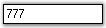
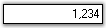
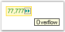
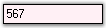
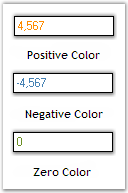
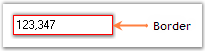

::: {style="DISPLAY: none"}
{#d2h_url_template}{#d2h_package_url style="WIDTH: 0px; DISPLAY: none; HEIGHT: 0px"}
:::

::::::::::::::::::::::::::: {.d2h_secondary_topic style="PADDING-BOTTOM: 10pt; MARGIN: 0pt; PADDING-LEFT: 0pt; PADDING-RIGHT: 0pt; PADDING-TOP: 0pt"}
##### Concepts and Features {#concepts-and-features style="tab-stops: 0pt"}

The following Editors controls (DoubleTextBox, IntegerTextBox, PercentTextBox, and CurrencyTextBox) have been revamped, click here to see the details of revamping.

###### 3.3.8.4.3.1 [[Display Settings]{style="COLOR: windowtext; TEXT-DECORATION: none; text-underline: none"}](http://help.syncfusion.com/ug_82/WindowsFormsUI_Tools/_DisplaySettings.html) {#display-settings style="tab-stops: 0pt"}

This section discusses the display settings of the IntegerTextBox control.[]{style="COLOR: black"}

[]{style="COLOR: black"} 

The IntegerTextBox provides a list of properties to set the display characteristics associated with the integer value.[]{style="COLOR: black"}

[]{style="COLOR: black"} 

::: {align="center"}
  --------------------------------------------------- -----------------------------------------------------------------------------------------------
  IntegerTextBox Properties[]{style="COLOR: black"}   Description[]{style="COLOR: black"}
  NumberGroupSeparator[]{style="COLOR: black"}        Gets / sets the separator to be used for grouping the digits.[]{style="COLOR: black"}
  NumberGroupSizes[]{style="COLOR: black"}            Specifies the grouping of number digits in the IntegerTextBox.[]{style="COLOR: black"}
  NumberNegativePattern[]{style="COLOR: black"}       Gets / sets the pattern to use when the value is negative.[]{style="COLOR: black"}
  NegativeSign[]{style="COLOR: black"}                Gets / sets the sign that is to be used to indicate a negative value.[]{style="COLOR: black"}
  --------------------------------------------------- -----------------------------------------------------------------------------------------------
:::

[]{style="COLOR: black"} 

The grouping size of the number digits can be set using the **Int32 Collection Editor **which will be displayed on selecting the**NumberGroupSizes** property in the property grid.[]{style="COLOR: black"}

[]{style="COLOR: black"} 

+---------------------------------------------------------------------------------------------------------------------------------------------------------------------------------------------------------------------------------------------------------------------------------------------------------------------------------------------------------------------------------------------------------+
| **[\[C#\]]{style="FONT-FAMILY: 'Courier New'; COLOR: black"}**[]{style="COLOR: black"}                                                                                                                                                                                                                                                                                                                  |
|                                                                                                                                                                                                                                                                                                                                                                                                         |
| []{style="COLOR: black"}                                                                                                                                                                                                                                                                                                                                                                                |
|                                                                                                                                                                                                                                                                                                                                                                                                         |
| [this]{style="FONT-FAMILY: 'Courier New'; COLOR: blue"}[.integerTextBox1.NumberGroupSeparator = ]{style="FONT-FAMILY: 'Courier New'; COLOR: black"}[\"/\"]{style="FONT-FAMILY: 'Courier New'; COLOR: maroon"}[;]{style="FONT-FAMILY: 'Courier New'; COLOR: black"}[]{style="COLOR: black"}                                                                                                              |
|                                                                                                                                                                                                                                                                                                                                                                                                         |
| [this]{style="FONT-FAMILY: 'Courier New'; COLOR: blue"}[.integerTextBox1.NumberGroupSizes = ]{style="FONT-FAMILY: 'Courier New'; COLOR: black"}[new]{style="FONT-FAMILY: 'Courier New'; COLOR: blue"}[ ]{style="FONT-FAMILY: 'Courier New'; COLOR: black"}[int]{style="FONT-FAMILY: 'Courier New'; COLOR: blue"}[\[\] { 5 };]{style="FONT-FAMILY: 'Courier New'; COLOR: black"}[]{style="COLOR: black"} |
|                                                                                                                                                                                                                                                                                                                                                                                                         |
| [this]{style="FONT-FAMILY: 'Courier New'; COLOR: blue"}[.integerTextBox1.NumberNegativePattern = 2;]{style="FONT-FAMILY: 'Courier New'; COLOR: black"}[]{style="COLOR: black"}                                                                                                                                                                                                                          |
|                                                                                                                                                                                                                                                                                                                                                                                                         |
| [this]{style="FONT-FAMILY: 'Courier New'; COLOR: blue"}[.integerTextBox1.NegativeSign = ]{style="FONT-FAMILY: 'Courier New'; COLOR: black"}[\"-\"]{style="FONT-FAMILY: 'Courier New'; COLOR: maroon"}[;]{style="FONT-FAMILY: 'Courier New'; COLOR: black"}[]{style="COLOR: black"}                                                                                                                      |
+---------------------------------------------------------------------------------------------------------------------------------------------------------------------------------------------------------------------------------------------------------------------------------------------------------------------------------------------------------------------------------------------------------+

[]{style="COLOR: black"} 

+------------------------------------------------------------------------------------------------------------------------------------------------------------------------------------------------------------------------------------------------------------------------------------------------------------------------------------------------------------------------------------------------------+
| **[\[VB.NET\]]{style="FONT-FAMILY: 'Courier New'; COLOR: black"}**[]{style="COLOR: black"}                                                                                                                                                                                                                                                                                                           |
|                                                                                                                                                                                                                                                                                                                                                                                                      |
| []{style="COLOR: black"}                                                                                                                                                                                                                                                                                                                                                                             |
|                                                                                                                                                                                                                                                                                                                                                                                                      |
| [Me]{style="FONT-FAMILY: 'Courier New'; COLOR: blue"}[.integerTextBox1.NumberGroupSeparator = ]{style="FONT-FAMILY: 'Courier New'; COLOR: black"}[\"/\"]{style="FONT-FAMILY: 'Courier New'; COLOR: #a31515"}[]{style="COLOR: black"}                                                                                                                                                                 |
|                                                                                                                                                                                                                                                                                                                                                                                                      |
| [Me]{style="FONT-FAMILY: 'Courier New'; COLOR: blue"}[.integerTextBox1.NumberGroupSizes = ]{style="FONT-FAMILY: 'Courier New'; COLOR: black"}[New]{style="FONT-FAMILY: 'Courier New'; COLOR: blue"}[ ]{style="FONT-FAMILY: 'Courier New'; COLOR: black"}[Integer]{style="FONT-FAMILY: 'Courier New'; COLOR: blue"}[() {5}]{style="FONT-FAMILY: 'Courier New'; COLOR: black"}[]{style="COLOR: black"} |
|                                                                                                                                                                                                                                                                                                                                                                                                      |
| [Me]{style="FONT-FAMILY: 'Courier New'; COLOR: blue"}[.integerTextBox1.NumberNegativePattern = 2]{style="FONT-FAMILY: 'Courier New'; COLOR: black"}[]{style="COLOR: black"}                                                                                                                                                                                                                          |
|                                                                                                                                                                                                                                                                                                                                                                                                      |
| [Me]{style="FONT-FAMILY: 'Courier New'; COLOR: blue"}[.integerTextBox1.NegativeSign = ]{style="FONT-FAMILY: 'Courier New'; COLOR: black"}[\"-\"]{style="FONT-FAMILY: 'Courier New'; COLOR: #a31515"}[]{style="COLOR: black"}                                                                                                                                                                         |
+------------------------------------------------------------------------------------------------------------------------------------------------------------------------------------------------------------------------------------------------------------------------------------------------------------------------------------------------------------------------------------------------------+

[]{style="COLOR: black"} 

{border="0"}

Figure 463: Display Settings of IntegerTextBox

[]{style="COLOR: black"} 

[]{style="COLOR: black"} 

A Sample which demonstrates the Display Settings of IntegerTextBox control is available in the below sample installation path.[]{style="COLOR: black"}

[]{style="COLOR: black"} 

..My Documents\\Syncfusion\\EssentialStudio\\***Version Number\\***Windows\\Tools.Windows\\Samples\\2.0\\Editors Package\\EditorControls[]{style="COLOR: black"}

 

[[Value ]{style="COLOR: #15428b; TEXT-DECORATION: none; text-underline: none"}[Settings]{style="COLOR: windowtext; TEXT-DECORATION: none; text-underline: none"}](http://help.syncfusion.com/ug_82/WindowsFormsUI_Tools/IntegerTextBox_ValueSettings.html)[]{style="COLOR: #15428b"}

The various values of the IntegerTextBox control and their settings are given below.[]{style="COLOR: black"}

[]{style="COLOR: black"} 

::: {align="center"}
  --------------------------------------------------- -------------------------------------------------------------------------------------------------------------------------------------------
  IntegerTextBox Properties[]{style="COLOR: black"}   Description[]{style="COLOR: black"}
  IntegerValue[]{style="COLOR: black"}                Specifies the integer value of the text.[]{style="COLOR: black"}
  DefaultValue[]{style="COLOR: black"}                Specifies the default value. The default value is set to \'Null\'.[]{style="COLOR: black"}
  BindableValue[]{style="COLOR: black"}               Wrapper property that indicates the value. This property can be used to set the value of the control to \'Null\'.[]{style="COLOR: black"}
  --------------------------------------------------- -------------------------------------------------------------------------------------------------------------------------------------------
:::

[]{style="COLOR: black"} 

+------------------------------------------------------------------------------------------------------------------------------------------------------------------------------------------------------------------------------------------------------------------------------------------+
| **[\[C#\]]{style="FONT-FAMILY: 'Courier New'; COLOR: black"}**[]{style="COLOR: black"}                                                                                                                                                                                                   |
|                                                                                                                                                                                                                                                                                          |
| []{style="COLOR: black"}                                                                                                                                                                                                                                                                 |
|                                                                                                                                                                                                                                                                                          |
| [this]{style="FONT-FAMILY: 'Courier New'; COLOR: blue"}[.integerTextBox1.IntegerValue = ((]{style="FONT-FAMILY: 'Courier New'; COLOR: black"}[long]{style="FONT-FAMILY: 'Courier New'; COLOR: blue"}[)(777));]{style="FONT-FAMILY: 'Courier New'; COLOR: black"}[]{style="COLOR: black"} |
|                                                                                                                                                                                                                                                                                          |
| [this]{style="FONT-FAMILY: 'Courier New'; COLOR: blue"}[.integerTextBox1.DefaultValue = 0;]{style="FONT-FAMILY: 'Courier New'; COLOR: black"}[]{style="COLOR: black"}                                                                                                                    |
|                                                                                                                                                                                                                                                                                          |
| [this]{style="FONT-FAMILY: 'Courier New'; COLOR: blue"}[.integerTextBox1.BindableValue = 777;]{style="FONT-FAMILY: 'Courier New'; COLOR: black"}[]{style="COLOR: black"}                                                                                                                 |
+------------------------------------------------------------------------------------------------------------------------------------------------------------------------------------------------------------------------------------------------------------------------------------------+

[]{style="COLOR: black"} 

+-------------------------------------------------------------------------------------------------------------------------------------------------------------------------------------------------------------------------------------------------------------------------------------+
| **[\[VB.NET\]]{style="FONT-FAMILY: 'Courier New'; COLOR: black"}**[]{style="COLOR: black"}                                                                                                                                                                                          |
|                                                                                                                                                                                                                                                                                     |
| []{style="COLOR: black"}                                                                                                                                                                                                                                                            |
|                                                                                                                                                                                                                                                                                     |
| [Me]{style="FONT-FAMILY: 'Courier New'; COLOR: blue"}[.integerTextBox1.IntegerValue = (]{style="FONT-FAMILY: 'Courier New'; COLOR: black"}[CLng]{style="FONT-FAMILY: 'Courier New'; COLOR: blue"}[(777))]{style="FONT-FAMILY: 'Courier New'; COLOR: black"}[]{style="COLOR: black"} |
|                                                                                                                                                                                                                                                                                     |
| [Me]{style="FONT-FAMILY: 'Courier New'; COLOR: blue"}[.integerTextBox1.DefaultValue = 0]{style="FONT-FAMILY: 'Courier New'; COLOR: black"}[]{style="COLOR: black"}                                                                                                                  |
|                                                                                                                                                                                                                                                                                     |
| [Me]{style="FONT-FAMILY: 'Courier New'; COLOR: blue"}[.integerTextBox1.BindableValue = 777]{style="FONT-FAMILY: 'Courier New'; COLOR: black"}[]{style="COLOR: black"}                                                                                                               |
+-------------------------------------------------------------------------------------------------------------------------------------------------------------------------------------------------------------------------------------------------------------------------------------+

[]{style="COLOR: black"} 

{border="0"}

[]{style="COLOR: black"} 

Figure 464: Integer Value Set

[]{style="COLOR: black"} 

Null Value Settings[]{style="COLOR: black"}

[]{style="COLOR: black"} 

There are various settings that can be applied to the IntegerTextBox control when the value of the control is set to \'Null\'. These settings are illustrated below.[]{style="COLOR: black"}

[]{style="COLOR: black"} 

::: {align="center"}
+---------------------------------------------------+---------------------------------------------------------------------------------------------+
| IntegerTextBox Properties[]{style="COLOR: black"} | Description[]{style="COLOR: black"}                                                         |
+---------------------------------------------------+---------------------------------------------------------------------------------------------+
| NullString[]{style="COLOR: black"}                | Specifies the string to be displayed when the DecimalValue is Null.[]{style="COLOR: black"} |
+---------------------------------------------------+---------------------------------------------------------------------------------------------+
| NullFormat[]{style="COLOR: black"}                | Returns the NumberFormatInfo object for the null display.[]{style="COLOR: black"}           |
+---------------------------------------------------+---------------------------------------------------------------------------------------------+
| IsNull                                            | Specifies the Null State of the Control.                                                    |
+---------------------------------------------------+---------------------------------------------------------------------------------------------+
| AllowNull                                         | Specifes whether the control can be Nulled,                                                 |
|                                                   |                                                                                             |
|                                                   | Null String will be set when the control becomes null.                                      |
+---------------------------------------------------+---------------------------------------------------------------------------------------------+
:::

[]{style="COLOR: black"} 

+-------------------------------------------------------------------------------------------------------------------------------------------------------------------------------------------------------------------------------------------------------------------------------------------------------------------------------------------------------------+
| **[\[C#\]]{style="FONT-FAMILY: 'Courier New'; COLOR: black"}**[]{style="COLOR: black"}                                                                                                                                                                                                                                                                      |
|                                                                                                                                                                                                                                                                                                                                                             |
| []{style="COLOR: black"}                                                                                                                                                                                                                                                                                                                                    |
|                                                                                                                                                                                                                                                                                                                                                             |
| [this]{style="FONT-FAMILY: 'Courier New'; COLOR: blue"}[.integerTextBox1.NullString = ]{style="FONT-FAMILY: 'Courier New'; COLOR: black"}[\"Null Value\"]{style="FONT-FAMILY: 'Courier New'; COLOR: maroon"}[;]{style="FONT-FAMILY: 'Courier New'; COLOR: black"}[]{style="COLOR: black"}                                                                   |
|                                                                                                                                                                                                                                                                                                                                                             |
| [this]{style="FONT-FAMILY: 'Courier New'; COLOR: blue"}[.integerTextBox1.]{style="FONT-FAMILY: 'Courier New'; COLOR: black"}[ AllowNull]{style="COLOR: #15428b"}[ = ]{style="FONT-FAMILY: 'Courier New'; COLOR: black"}[true]{style="FONT-FAMILY: 'Courier New'; COLOR: blue"}[;]{style="FONT-FAMILY: 'Courier New'; COLOR: black"}[]{style="COLOR: black"} |
+-------------------------------------------------------------------------------------------------------------------------------------------------------------------------------------------------------------------------------------------------------------------------------------------------------------------------------------------------------------+

[]{style="COLOR: black"} 

+------------------------------------------------------------------------------------------------------------------------------------------------------------------------------------------------------------------------------------------------------------------------------------------------------+
| **[\[VB.NET\]]{style="FONT-FAMILY: 'Courier New'; COLOR: black"}**[]{style="COLOR: black"}                                                                                                                                                                                                           |
|                                                                                                                                                                                                                                                                                                      |
| []{style="COLOR: black"}                                                                                                                                                                                                                                                                             |
|                                                                                                                                                                                                                                                                                                      |
| [Me]{style="FONT-FAMILY: 'Courier New'; COLOR: blue"}[.integerTextBox1.NullString = ]{style="FONT-FAMILY: 'Courier New'; COLOR: black"}[\"Null Value\"]{style="FONT-FAMILY: 'Courier New'; COLOR: #a31515"}[]{style="COLOR: black"}                                                                  |
|                                                                                                                                                                                                                                                                                                      |
| [Me]{style="FONT-FAMILY: 'Courier New'; COLOR: blue"}[.integerTextBox1.]{style="FONT-FAMILY: 'Courier New'; COLOR: black"}[ AllowNull]{style="COLOR: #15428b"}[ = ]{style="FONT-FAMILY: 'Courier New'; COLOR: black"}[True]{style="FONT-FAMILY: 'Courier New'; COLOR: blue"}[]{style="COLOR: black"} |
+------------------------------------------------------------------------------------------------------------------------------------------------------------------------------------------------------------------------------------------------------------------------------------------------------+

[]{style="COLOR: black"} 

{border="0"}

[]{style="COLOR: black"} 

Figure 465: Null String Set

[]{style="COLOR: black"} 

[]{style="COLOR: black"} 

Min and Max Value Settings[]{style="COLOR: black"}

[]{style="COLOR: black"} 

The minimum and maximum values of the IntegerTextBox can be set using the below given properties.[]{style="COLOR: black"}

[]{style="COLOR: black"} 

::: {align="center"}
  --------------------------------------------------- ---------------------------------------------------------------------------------------------------------------------------------------------------------
  IntegerTextBox Properties[]{style="COLOR: black"}   Description[]{style="COLOR: black"}
  MaxValue[]{style="COLOR: black"}                    Gets / sets the maximum value that can be set through the IntegerTextBox. The default value is set to \'9223372036854775807\'.[]{style="COLOR: black"}
  MinValue[]{style="COLOR: black"}                    Gets / sets the minimum value that can be set through the IntegerTextBox. The default value is set to \'-9223372036854775808\'.[]{style="COLOR: black"}
  --------------------------------------------------- ---------------------------------------------------------------------------------------------------------------------------------------------------------
:::

[]{style="COLOR: black"} 

+--------------------------------------------------------------------------------------------------------------------------------------------------------------------------------------+
| **[\[C#\]]{style="FONT-FAMILY: 'Courier New'; COLOR: black"}**[]{style="COLOR: black"}                                                                                               |
|                                                                                                                                                                                      |
| []{style="COLOR: black"}                                                                                                                                                             |
|                                                                                                                                                                                      |
| [this]{style="FONT-FAMILY: 'Courier New'; COLOR: blue"}[.integerTextBox1.MaxValue = 9223372036854775807;]{style="FONT-FAMILY: 'Courier New'; COLOR: black"}[]{style="COLOR: black"}  |
|                                                                                                                                                                                      |
| [this]{style="FONT-FAMILY: 'Courier New'; COLOR: blue"}[.integerTextBox1.MinValue = -9223372036854775808;]{style="FONT-FAMILY: 'Courier New'; COLOR: black"}[]{style="COLOR: black"} |
+--------------------------------------------------------------------------------------------------------------------------------------------------------------------------------------+

[]{style="COLOR: black"} 

+-----------------------------------------------------------------------------------------------------------------------------------------------------------------------------------+
| **[\[VB.NET\]]{style="FONT-FAMILY: 'Courier New'; COLOR: black"}**[]{style="COLOR: black"}                                                                                        |
|                                                                                                                                                                                   |
| []{style="COLOR: black"}                                                                                                                                                          |
|                                                                                                                                                                                   |
| [Me]{style="FONT-FAMILY: 'Courier New'; COLOR: blue"}[.integerTextBox1.MaxValue = 9223372036854775807]{style="FONT-FAMILY: 'Courier New'; COLOR: black"}[]{style="COLOR: black"}  |
|                                                                                                                                                                                   |
| [Me]{style="FONT-FAMILY: 'Courier New'; COLOR: blue"}[.integerTextBox1.MinValue = -9223372036854775808]{style="FONT-FAMILY: 'Courier New'; COLOR: black"}[]{style="COLOR: black"} |
+-----------------------------------------------------------------------------------------------------------------------------------------------------------------------------------+

###### 3.3.8.4.3.2 [[Culture Settings]{style="COLOR: windowtext; TEXT-DECORATION: none; text-underline: none"}](http://help.syncfusion.com/ug_82/WindowsFormsUI_Tools/CultureSettings.html) {#culture-settings style="tab-stops: 0pt"}

This section discusses the culture settings of the IntegerTextBox control.[]{style="COLOR: black"}

[]{style="COLOR: black"} 

::: {align="center"}
+---------------------------------------------------+------------------------------------------------------------------------------------------------------------------------------------------------------------------+
| IntegerTextBox Properties[]{style="COLOR: black"} | Description[]{style="COLOR: black"}                                                                                                                              |
+---------------------------------------------------+------------------------------------------------------------------------------------------------------------------------------------------------------------------+
| Culture[]{style="COLOR: black"}                   | Gets / sets the culture that is to be used for formatting the numeric display.[]{style="COLOR: black"}                                                           |
+---------------------------------------------------+------------------------------------------------------------------------------------------------------------------------------------------------------------------+
| CurrentCultureRefresh[]{style="COLOR: black"}     | Indicates whether the Culture property is to be refreshed when the culture changes.[]{style="COLOR: black"}                                                      |
+---------------------------------------------------+------------------------------------------------------------------------------------------------------------------------------------------------------------------+
| SpecialCultureValue[]{style="COLOR: black"}       | Gets / sets the mode for the cultures.[]{style="COLOR: black"}                                                                                                   |
|                                                   |                                                                                                                                                                  |
|                                                   | []{style="COLOR: black"}                                                                                                                                         |
|                                                   |                                                                                                                                                                  |
|                                                   | It includes the below given options.[]{style="COLOR: black"}                                                                                                     |
|                                                   |                                                                                                                                                                  |
|                                                   | []{style="COLOR: black"}                                                                                                                                         |
|                                                   |                                                                                                                                                                  |
|                                                   | *None,*[]{style="COLOR: black"}                                                                                                                                  |
|                                                   |                                                                                                                                                                  |
|                                                   | *CurrentCulture,*[]{style="COLOR: black"}                                                                                                                        |
|                                                   |                                                                                                                                                                  |
|                                                   | *UICulture and*[]{style="COLOR: black"}                                                                                                                          |
|                                                   |                                                                                                                                                                  |
|                                                   | *InstalledCulture.*[]{style="COLOR: black"}                                                                                                                      |
+---------------------------------------------------+------------------------------------------------------------------------------------------------------------------------------------------------------------------+
| UseUserOverride[]{style="COLOR: black"}           | Specifies if the NumberFormatInfo used for formatting will use the User Overrides for the culture. The default value is set to \'True\'.[]{style="COLOR: black"} |
+---------------------------------------------------+------------------------------------------------------------------------------------------------------------------------------------------------------------------+
:::

[]{style="COLOR: black"} 

+---------------------------------------------------------------------------------------------------------------------------------------------------------------------------------------------------------------------------------------------------------------------------------------------------------------------------------------------------------------------------------------------------------------------------------------------------------------------------------------------------------------------------------------+
| **[\[C#\]]{style="FONT-FAMILY: 'Courier New'; COLOR: black"}**[]{style="COLOR: black"}                                                                                                                                                                                                                                                                                                                                                                                                                                                |
|                                                                                                                                                                                                                                                                                                                                                                                                                                                                                                                                       |
| []{style="COLOR: black"}                                                                                                                                                                                                                                                                                                                                                                                                                                                                                                              |
|                                                                                                                                                                                                                                                                                                                                                                                                                                                                                                                                       |
| [this]{style="FONT-FAMILY: 'Courier New'; COLOR: blue"}[.integerTextBox1.Culture = ]{style="FONT-FAMILY: 'Courier New'; COLOR: black"}[new]{style="FONT-FAMILY: 'Courier New'; COLOR: blue"}[ System.Globalization.]{style="FONT-FAMILY: 'Courier New'; COLOR: black"}[CultureInfo]{style="FONT-FAMILY: 'Courier New'; COLOR: teal"}[(]{style="FONT-FAMILY: 'Courier New'; COLOR: black"}[\"ar-SA\"]{style="FONT-FAMILY: 'Courier New'; COLOR: maroon"}[);]{style="FONT-FAMILY: 'Courier New'; COLOR: black"}[]{style="COLOR: black"} |
|                                                                                                                                                                                                                                                                                                                                                                                                                                                                                                                                       |
| [this]{style="FONT-FAMILY: 'Courier New'; COLOR: blue"}[.integerTextBox1.CurrentCultureRefresh = ]{style="FONT-FAMILY: 'Courier New'; COLOR: black"}[true]{style="FONT-FAMILY: 'Courier New'; COLOR: blue"}[;]{style="FONT-FAMILY: 'Courier New'; COLOR: black"}[]{style="COLOR: black"}                                                                                                                                                                                                                                              |
|                                                                                                                                                                                                                                                                                                                                                                                                                                                                                                                                       |
| [this]{style="FONT-FAMILY: 'Courier New'; COLOR: blue"}[.integerTextBox1.SpecialCultureValue = Syncfusion.Windows.Forms.Tools.]{style="FONT-FAMILY: 'Courier New'; COLOR: black"}[SpecialCultureValues]{style="FONT-FAMILY: 'Courier New'; COLOR: teal"}[.None;]{style="FONT-FAMILY: 'Courier New'; COLOR: black"}[]{style="COLOR: black"}                                                                                                                                                                                            |
|                                                                                                                                                                                                                                                                                                                                                                                                                                                                                                                                       |
| [this]{style="FONT-FAMILY: 'Courier New'; COLOR: blue"}[.integerTextBox1.UseUserOverride = ]{style="FONT-FAMILY: 'Courier New'; COLOR: black"}[true]{style="FONT-FAMILY: 'Courier New'; COLOR: blue"}[;]{style="FONT-FAMILY: 'Courier New'; COLOR: black"}[]{style="COLOR: black"}                                                                                                                                                                                                                                                    |
+---------------------------------------------------------------------------------------------------------------------------------------------------------------------------------------------------------------------------------------------------------------------------------------------------------------------------------------------------------------------------------------------------------------------------------------------------------------------------------------------------------------------------------------+

[]{style="COLOR: black"} 

+-----------------------------------------------------------------------------------------------------------------------------------------------------------------------------------------------------------------------------------------------------------------------------------------------------------------------------------------------------------------------------------------------------------------------------+
| **[\[VB.NET\]]{style="FONT-FAMILY: 'Courier New'; COLOR: black"}**[]{style="COLOR: black"}                                                                                                                                                                                                                                                                                                                                  |
|                                                                                                                                                                                                                                                                                                                                                                                                                             |
| []{style="COLOR: black"}                                                                                                                                                                                                                                                                                                                                                                                                    |
|                                                                                                                                                                                                                                                                                                                                                                                                                             |
| [Me]{style="FONT-FAMILY: 'Courier New'; COLOR: blue"}[.integerTextBox1.Culture = ]{style="FONT-FAMILY: 'Courier New'; COLOR: black"}[New]{style="FONT-FAMILY: 'Courier New'; COLOR: blue"}[ System.Globalization.CultureInfo(]{style="FONT-FAMILY: 'Courier New'; COLOR: black"}[\"ar-SA\"]{style="FONT-FAMILY: 'Courier New'; COLOR: maroon"}[)]{style="FONT-FAMILY: 'Courier New'; COLOR: black"}[]{style="COLOR: black"} |
|                                                                                                                                                                                                                                                                                                                                                                                                                             |
| [Me]{style="FONT-FAMILY: 'Courier New'; COLOR: blue"}[.integerTextBox1.CurrentCultureRefresh = ]{style="FONT-FAMILY: 'Courier New'; COLOR: black"}[True]{style="FONT-FAMILY: 'Courier New'; COLOR: blue"}[]{style="COLOR: black"}                                                                                                                                                                                           |
|                                                                                                                                                                                                                                                                                                                                                                                                                             |
| [Me]{style="FONT-FAMILY: 'Courier New'; COLOR: blue"}[.integerTextBox1.SpecialCultureValue = Syncfusion.Windows.Forms.Tools.SpecialCultureValues.None]{style="FONT-FAMILY: 'Courier New'; COLOR: black"}[]{style="COLOR: black"}                                                                                                                                                                                            |
|                                                                                                                                                                                                                                                                                                                                                                                                                             |
| [Me]{style="FONT-FAMILY: 'Courier New'; COLOR: blue"}[.integerTextBox1.UseUserOverride = ]{style="FONT-FAMILY: 'Courier New'; COLOR: black"}[True]{style="FONT-FAMILY: 'Courier New'; COLOR: blue"}[]{style="COLOR: black"}                                                                                                                                                                                                 |
+-----------------------------------------------------------------------------------------------------------------------------------------------------------------------------------------------------------------------------------------------------------------------------------------------------------------------------------------------------------------------------------------------------------------------------+

[]{style="COLOR: black"} 

{border="0"}

[]{style="COLOR: black"} 

Figure 466: Culture Set for the PercentTextBox Control[]{style="COLOR: black"}

[]{style="COLOR: black"} 

::: {style="BORDER-BOTTOM: windowtext 1pt solid; BORDER-LEFT: medium none; PADDING-BOTTOM: 1pt; MARGIN-TOP: 9pt; PADDING-LEFT: 0pt; PADDING-RIGHT: 0pt; MARGIN-BOTTOM: 9pt; BORDER-TOP: windowtext 1pt solid; BORDER-RIGHT: medium none; PADDING-TOP: 1pt"}
[{border="0"}]{style="COLOR: black"} Note: The RefreshCulture() method can be used to refresh and reapply the culture specific settings.[]{style="COLOR: black"}
:::

[]{style="COLOR: black"} 

A Sample which demonstrates the Culture Settings of the IntegerTextBox control is available in the below sample installation path.[]{style="COLOR: black"}

[]{style="COLOR: black"} 

..My Documents\\Syncfusion\\EssentialStudio\\***Version Number***\\Windows\\Tools.Windows\\Samples\\2.0\\Editors Package\\EditorControls[]{style="COLOR: black"}

 

###### 3.3.8.4.3.3 [[Text Settings]{style="COLOR: windowtext; TEXT-DECORATION: none; text-underline: none"}](http://help.syncfusion.com/ug_82/WindowsFormsUI_Tools/TextSettings11.html) {#text-settings style="tab-stops: 0pt"}

\
This section discusses the text settings of the IntegerTextBox control.[]{style="COLOR: black"}

[]{style="COLOR: black"} 

The text associated with the IntegerTextBox control can be set and customized using the below given settings.[]{style="COLOR: black"}

 

::: {align="center"}
  ------------------------------------------ ---------------------------------------------------------------------------------------------------
  IntegerTextBox Properties                  Description
  Text[]{style="COLOR: black"}               Specifies the text associated with the control.[]{style="COLOR: black"}
  TextAlign[]{style="COLOR: black"}          Indicates how the text should be aligned for edit controls.[]{style="COLOR: black"}
  SelectedText[]{style="COLOR: black"}       Gets / sets the selected text in the IntegerTextBox.[]{style="COLOR: black"}
  SelectAllOnFocus[]{style="COLOR: black"}   Specifies if the text should be selected when the control gets the focus.[]{style="COLOR: black"}
  ClipText[]{style="COLOR: black"}           Returns the clipped text without the formatting.[]{style="COLOR: black"}
  ------------------------------------------ ---------------------------------------------------------------------------------------------------
:::

[]{style="COLOR: black"} 

+-------------------------------------------------------------------------------------------------------------------------------------------------------------------------------------------------------------------------------------------------------------------------------------------------------------------------+
| **[\[C#\]]{style="FONT-FAMILY: 'Courier New'; COLOR: black"}**[]{style="COLOR: black"}                                                                                                                                                                                                                                  |
|                                                                                                                                                                                                                                                                                                                         |
| []{style="COLOR: black"}                                                                                                                                                                                                                                                                                                |
|                                                                                                                                                                                                                                                                                                                         |
| [this]{style="FONT-FAMILY: 'Courier New'; COLOR: blue"}[.integerTextBox1.TextAlign = System.Windows.Forms.]{style="FONT-FAMILY: 'Courier New'; COLOR: black"}[HorizontalAlignment]{style="FONT-FAMILY: 'Courier New'; COLOR: teal"}[.Center;]{style="FONT-FAMILY: 'Courier New'; COLOR: black"}[]{style="COLOR: black"} |
|                                                                                                                                                                                                                                                                                                                         |
| [this]{style="FONT-FAMILY: 'Courier New'; COLOR: blue"}[.integerTextBox1.SelectedText = ]{style="FONT-FAMILY: 'Courier New'; COLOR: black"}[\"-12345678\"]{style="FONT-FAMILY: 'Courier New'; COLOR: maroon"}[;]{style="FONT-FAMILY: 'Courier New'; COLOR: black"}[]{style="COLOR: black"}                              |
|                                                                                                                                                                                                                                                                                                                         |
| [this]{style="FONT-FAMILY: 'Courier New'; COLOR: blue"}[.integerTextBox1.SelectAllOnFocus = ]{style="FONT-FAMILY: 'Courier New'; COLOR: black"}[true]{style="FONT-FAMILY: 'Courier New'; COLOR: blue"}[;]{style="FONT-FAMILY: 'Courier New'; COLOR: black"}[]{style="COLOR: black"}                                     |
|                                                                                                                                                                                                                                                                                                                         |
| [this]{style="FONT-FAMILY: 'Courier New'; COLOR: blue"}[.integerTextBox1.ClipText = ]{style="FONT-FAMILY: 'Courier New'; COLOR: black"}[\"12\"]{style="FONT-FAMILY: 'Courier New'; COLOR: maroon"}[;]{style="FONT-FAMILY: 'Courier New'; COLOR: black"}[]{style="COLOR: black"}                                         |
+-------------------------------------------------------------------------------------------------------------------------------------------------------------------------------------------------------------------------------------------------------------------------------------------------------------------------+

[]{style="COLOR: black"} 

+-------------------------------------------------------------------------------------------------------------------------------------------------------------------------------------------------------------------------------------+
| **[\[VB.NET\]]{style="FONT-FAMILY: 'Courier New'; COLOR: black"}**[]{style="COLOR: black"}                                                                                                                                          |
|                                                                                                                                                                                                                                     |
| []{style="COLOR: black"}                                                                                                                                                                                                            |
|                                                                                                                                                                                                                                     |
| [Me]{style="FONT-FAMILY: 'Courier New'; COLOR: blue"}[.integerTextBox1.TextAlign = System.Windows.Forms.HorizontalAlignment.Center]{style="FONT-FAMILY: 'Courier New'; COLOR: black"}[]{style="COLOR: black"}                       |
|                                                                                                                                                                                                                                     |
| [Me]{style="FONT-FAMILY: 'Courier New'; COLOR: blue"}[.integerTextBox1.SelectedText = ]{style="FONT-FAMILY: 'Courier New'; COLOR: black"}[\"-12345678\"]{style="FONT-FAMILY: 'Courier New'; COLOR: maroon"}[]{style="COLOR: black"} |
|                                                                                                                                                                                                                                     |
| [Me]{style="FONT-FAMILY: 'Courier New'; COLOR: blue"}[.integerTextBox1.SelectAllOnFocus = ]{style="FONT-FAMILY: 'Courier New'; COLOR: black"}[true]{style="FONT-FAMILY: 'Courier New'; COLOR: blue"}[]{style="COLOR: black"}        |
|                                                                                                                                                                                                                                     |
| [Me]{style="FONT-FAMILY: 'Courier New'; COLOR: blue"}[.integerTextBox1.ClipText = ]{style="FONT-FAMILY: 'Courier New'; COLOR: black"}[\"12\"]{style="FONT-FAMILY: 'Courier New'; COLOR: maroon"}[]{style="COLOR: black"}            |
+-------------------------------------------------------------------------------------------------------------------------------------------------------------------------------------------------------------------------------------+

[]{style="COLOR: black"} 

{border="0"}

[]{style="COLOR: black"} 

Figure 467: Text Aligned to the \"Center\"

[]{style="COLOR: black"} 

{border="0"}

[]{style="COLOR: black"} 

Figure 468: \"SelectAllOnFocus\" property Set

[]{style="COLOR: black"} 

The methods associated with the above properties are given below.[]{style="COLOR: black"}

[]{style="COLOR: black"} 

::: {align="center"}
  ------------------------------------- ----------------------------------------------------------------------------------------------------------------------------------------
  Methods[]{style="COLOR: black"}       Description[]{style="COLOR: black"}
  GetClipText[]{style="COLOR: black"}   Gets / sets the clipped text without the formatting.[]{style="COLOR: black"}
  Cut[]{style="COLOR: black"}           Cuts the selected data to the clipboard.[]{style="COLOR: black"}
  Copy[]{style="COLOR: black"}          Copies the content of the NumberTextBox to the clipboard. The **ClipMode** property dictates what gets copied.[]{style="COLOR: black"}
  Delete[]{style="COLOR: black"}        Deletes the current selection of the TextBox.[]{style="COLOR: black"}
  Paste[]{style="COLOR: black"}         Pastes the data in the clipboard into the NumberTextBox control.[]{style="COLOR: black"}
  SelectAll[]{style="COLOR: black"}     Selects all text in the TextBox.[]{style="COLOR: black"}
  ------------------------------------- ----------------------------------------------------------------------------------------------------------------------------------------
:::

[]{style="COLOR: black"} 

Clip Mode[]{style="COLOR: black"}

[]{style="COLOR: black"} 

The formatting for the text can be enabled or disabled by using the property given below.[]{style="COLOR: black"}

[]{style="COLOR: black"} 

::: {align="center"}
+-------------------------------------------------+--------------------------------------------------------------------------------------------------------------------------------------+
| IntegerTextBox Property[]{style="COLOR: black"} | Description[]{style="COLOR: black"}                                                                                                  |
+-------------------------------------------------+--------------------------------------------------------------------------------------------------------------------------------------+
| ClipMode[]{style="COLOR: black"}                | Determines whether to include or exclude the literal characters in the input mask when doing a copy command.[]{style="COLOR: black"} |
|                                                 |                                                                                                                                      |
|                                                 | []{style="COLOR: black"}                                                                                                             |
|                                                 |                                                                                                                                      |
|                                                 | It includes the below given options:[]{style="COLOR: black"}                                                                         |
|                                                 |                                                                                                                                      |
|                                                 | []{style="COLOR: black"}                                                                                                             |
|                                                 |                                                                                                                                      |
|                                                 | *IncludeFormatting and*[]{style="COLOR: black"}                                                                                      |
|                                                 |                                                                                                                                      |
|                                                 | *ExcludeFormatting.*[]{style="COLOR: black"}                                                                                         |
+-------------------------------------------------+--------------------------------------------------------------------------------------------------------------------------------------+
:::

[]{style="COLOR: black"} 

+-------------------------------------------------------------------------------------------------------------------------------------------------------------------------------------------------------------------------------------------------------------------------------------------------------------------------------------------+
| **[\[C#\]]{style="FONT-FAMILY: 'Courier New'; COLOR: black"}**[]{style="COLOR: black"}                                                                                                                                                                                                                                                    |
|                                                                                                                                                                                                                                                                                                                                           |
| []{style="COLOR: black"}                                                                                                                                                                                                                                                                                                                  |
|                                                                                                                                                                                                                                                                                                                                           |
| [this]{style="FONT-FAMILY: 'Courier New'; COLOR: blue"}[.integerTextBox1.ClipMode = Syncfusion.Windows.Forms.Tools.]{style="FONT-FAMILY: 'Courier New'; COLOR: black"}[CurrencyClipModes]{style="FONT-FAMILY: 'Courier New'; COLOR: teal"}[.IncludeFormatting;]{style="FONT-FAMILY: 'Courier New'; COLOR: black"}[]{style="COLOR: black"} |
+-------------------------------------------------------------------------------------------------------------------------------------------------------------------------------------------------------------------------------------------------------------------------------------------------------------------------------------------+

[]{style="COLOR: black"} 

+---------------------------------------------------------------------------------------------------------------------------------------------------------------------------------------------------------------------------------+
| **[\[VB.NET\]]{style="FONT-FAMILY: 'Courier New'; COLOR: black"}**[]{style="COLOR: black"}                                                                                                                                      |
|                                                                                                                                                                                                                                 |
| []{style="COLOR: black"}                                                                                                                                                                                                        |
|                                                                                                                                                                                                                                 |
| [Me]{style="FONT-FAMILY: 'Courier New'; COLOR: blue"}[.integerTextBox1.ClipMode = Syncfusion.Windows.Forms.Tools.CurrencyClipModes.IncludeFormatting]{style="FONT-FAMILY: 'Courier New'; COLOR: black"}[]{style="COLOR: black"} |
+---------------------------------------------------------------------------------------------------------------------------------------------------------------------------------------------------------------------------------+

[]{style="COLOR: black"} 

Formatted Text[]{style="COLOR: black"}

[]{style="COLOR: black"} 

Formatted text can be displayed using the below given property.[]{style="COLOR: black"}

[]{style="COLOR: black"} 

::: {align="center"}
  ------------------------------------------------- -------------------------------------------------------------------------
  IntegerTextBox Property[]{style="COLOR: black"}   Description[]{style="COLOR: black"}
  FormattedText[]{style="COLOR: black"}             Returns the formatted text with the formatting.[]{style="COLOR: black"}
  ------------------------------------------------- -------------------------------------------------------------------------
:::

[]{style="COLOR: black"} 

+-----------------------------------------------------------------------------------------------------------------------------------------------------------------------------------------------------------------------------------------------------------------------------------------+
| **[\[C#\]]{style="FONT-FAMILY: 'Courier New'; COLOR: black"}**[]{style="COLOR: black"}                                                                                                                                                                                                  |
|                                                                                                                                                                                                                                                                                         |
| []{style="COLOR: black"}                                                                                                                                                                                                                                                                |
|                                                                                                                                                                                                                                                                                         |
| [this]{style="FONT-FAMILY: 'Courier New'; COLOR: blue"}[.integerTextBox1.FormattedText = ]{style="FONT-FAMILY: 'Courier New'; COLOR: black"}[\"Hello\"]{style="FONT-FAMILY: 'Courier New'; COLOR: maroon"}[;]{style="FONT-FAMILY: 'Courier New'; COLOR: black"}[]{style="COLOR: black"} |
+-----------------------------------------------------------------------------------------------------------------------------------------------------------------------------------------------------------------------------------------------------------------------------------------+

[]{style="COLOR: black"} 

+----------------------------------------------------------------------------------------------------------------------------------------------------------------------------------------------------------------------------------+
| **[\[VB.NET\]]{style="FONT-FAMILY: 'Courier New'; COLOR: black"}**[]{style="COLOR: black"}                                                                                                                                       |
|                                                                                                                                                                                                                                  |
| []{style="COLOR: black"}                                                                                                                                                                                                         |
|                                                                                                                                                                                                                                  |
| [Me]{style="FONT-FAMILY: 'Courier New'; COLOR: blue"}[.integerTextBox1.FormattedText = ]{style="FONT-FAMILY: 'Courier New'; COLOR: black"}[\"Hello\"]{style="FONT-FAMILY: 'Courier New'; COLOR: maroon"}[]{style="COLOR: black"} |
+----------------------------------------------------------------------------------------------------------------------------------------------------------------------------------------------------------------------------------+

[]{style="COLOR: black"} 

RightToLeft[]{style="COLOR: black"}

[]{style="COLOR: black"} 

The text can be displayed from right to left for RTL languages using this property.[]{style="COLOR: black"}

[]{style="COLOR: black"} 

::: {align="center"}
  ------------------------------------------------- ---------------------------------------------------------------------------------------------------------------------------------------------
  IntegerTextBox Property[]{style="COLOR: black"}   Description[]{style="COLOR: black"}
  RightToLeft[]{style="COLOR: black"}               Indicates whether the component should draw right-to-left for RTL languages. The default value is set to \'False\'.[]{style="COLOR: black"}
  ------------------------------------------------- ---------------------------------------------------------------------------------------------------------------------------------------------
:::

[]{style="COLOR: black"} 

::: {style="BORDER-BOTTOM: windowtext 1pt solid; BORDER-LEFT: medium none; PADDING-BOTTOM: 1pt; MARGIN-TOP: 9pt; PADDING-LEFT: 0pt; PADDING-RIGHT: 0pt; MARGIN-BOTTOM: 9pt; BORDER-TOP: windowtext 1pt solid; BORDER-RIGHT: medium none; PADDING-TOP: 1pt"}
[{border="0"}]{style="COLOR: black"} Note: The RightToLeft property will be automatically set to \'True\' for RTL languages.[]{style="COLOR: black"}
:::

[]{style="COLOR: black"} 

+----------------------------------------------------------------------------------------------------------------------------------------------------------------------------------------------------------------------------------------------------------------------------------------------------------------+
| **[\[C#\]]{style="FONT-FAMILY: 'Courier New'; COLOR: black"}**[]{style="COLOR: black"}                                                                                                                                                                                                                         |
|                                                                                                                                                                                                                                                                                                                |
| []{style="COLOR: black"}                                                                                                                                                                                                                                                                                       |
|                                                                                                                                                                                                                                                                                                                |
| [this]{style="FONT-FAMILY: 'Courier New'; COLOR: blue"}[.integerTextBox1.RightToLeft = System.Windows.Forms.]{style="FONT-FAMILY: 'Courier New'; COLOR: black"}[RightToLeft]{style="FONT-FAMILY: 'Courier New'; COLOR: teal"}[.Yes;]{style="FONT-FAMILY: 'Courier New'; COLOR: black"}[]{style="COLOR: black"} |
+----------------------------------------------------------------------------------------------------------------------------------------------------------------------------------------------------------------------------------------------------------------------------------------------------------------+

[]{style="COLOR: black"} 

+------------------------------------------------------------------------------------------------------------------------------------------------------------------------------------------------------+
| **[\[VB.NET\]]{style="FONT-FAMILY: 'Courier New'; COLOR: black"}**[]{style="COLOR: black"}                                                                                                           |
|                                                                                                                                                                                                      |
| []{style="COLOR: black"}                                                                                                                                                                             |
|                                                                                                                                                                                                      |
| [Me]{style="FONT-FAMILY: 'Courier New'; COLOR: blue"}[.integerTextBox1.RightToLeft = System.Windows.Forms.RightToLeft.Yes]{style="FONT-FAMILY: 'Courier New'; COLOR: black"}[]{style="COLOR: black"} |
+------------------------------------------------------------------------------------------------------------------------------------------------------------------------------------------------------+

[]{style="COLOR: black"} 

{border="0"}

[]{style="COLOR: black"} 

Figure 469: Text displayed from Right To Left

[]{style="COLOR: black"} 

::: {style="BORDER-BOTTOM: windowtext 1pt solid; BORDER-LEFT: medium none; PADDING-BOTTOM: 1pt; MARGIN-TOP: 9pt; PADDING-LEFT: 0pt; PADDING-RIGHT: 0pt; MARGIN-BOTTOM: 9pt; BORDER-TOP: windowtext 1pt solid; BORDER-RIGHT: medium none; PADDING-TOP: 1pt"}
[{border="0"}]{style="COLOR: black"} Note:[ ]{style="COLOR: black; FONT-SIZE: 8pt"}The ResetRightToLeft() method can be used to reset the RightToLeft property to it\'s default value.[]{style="COLOR: black"}
:::

[]{style="COLOR: black"} 

OverflowIndicatorToolTipText[]{style="COLOR: black"}

[]{style="COLOR: black"} 

::: {align="center"}
  ------------------------------------------------------ -----------------------------------------------------------------------------------
  IntegerTextBox Properties[]{style="COLOR: black"}      Description[]{style="COLOR: black"}
  OverflowIndicatorToolTipText[]{style="COLOR: black"}   Specifies the overflow indicator tooltip text.[]{style="COLOR: black"}
  ShowOverflowIndicator[]{style="COLOR: black"}          Gets / sets overflow indicator visibility.[]{style="COLOR: black"}
  ShowOverflowIndicatorToolTip[]{style="COLOR: black"}   Indicates whether to show the overflow indicator tooltip.[]{style="COLOR: black"}
  ------------------------------------------------------ -----------------------------------------------------------------------------------
:::

[]{style="COLOR: black"} 

+-----------------------------------------------------------------------------------------------------------------------------------------------------------------------------------------------------------------------------------------------------------------------------------------------------------+
| **[\[C#\]]{style="FONT-FAMILY: 'Courier New'; COLOR: black"}**[]{style="COLOR: black"}                                                                                                                                                                                                                    |
|                                                                                                                                                                                                                                                                                                           |
| []{style="COLOR: black"}                                                                                                                                                                                                                                                                                  |
|                                                                                                                                                                                                                                                                                                           |
| [this]{style="FONT-FAMILY: 'Courier New'; COLOR: blue"}[.integerTextBox1.OverflowIndicatorToolTipText = ]{style="FONT-FAMILY: 'Courier New'; COLOR: black"}[\"Overflow\"]{style="FONT-FAMILY: 'Courier New'; COLOR: maroon"}[;]{style="FONT-FAMILY: 'Courier New'; COLOR: black"}[]{style="COLOR: black"} |
|                                                                                                                                                                                                                                                                                                           |
| [this]{style="FONT-FAMILY: 'Courier New'; COLOR: blue"}[.integerTextBox1.ShowOverflowIndicator = ]{style="FONT-FAMILY: 'Courier New'; COLOR: black"}[true]{style="FONT-FAMILY: 'Courier New'; COLOR: blue"}[;]{style="FONT-FAMILY: 'Courier New'; COLOR: black"}[]{style="COLOR: black"}                  |
|                                                                                                                                                                                                                                                                                                           |
| [this]{style="FONT-FAMILY: 'Courier New'; COLOR: blue"}[.integerTextBox1.ShowOverflowIndicatorToolTip = ]{style="FONT-FAMILY: 'Courier New'; COLOR: black"}[true]{style="FONT-FAMILY: 'Courier New'; COLOR: blue"}[;]{style="FONT-FAMILY: 'Courier New'; COLOR: black"}[]{style="COLOR: black"}           |
+-----------------------------------------------------------------------------------------------------------------------------------------------------------------------------------------------------------------------------------------------------------------------------------------------------------+

[]{style="COLOR: black"} 

+----------------------------------------------------------------------------------------------------------------------------------------------------------------------------------------------------------------------------------------------------+
| **[\[VB.NET\]]{style="FONT-FAMILY: 'Courier New'; COLOR: black"}**[]{style="COLOR: black"}                                                                                                                                                         |
|                                                                                                                                                                                                                                                    |
| []{style="COLOR: black"}                                                                                                                                                                                                                           |
|                                                                                                                                                                                                                                                    |
| [Me]{style="FONT-FAMILY: 'Courier New'; COLOR: blue"}[.integerTextBox1.OverflowIndicatorToolTipText = ]{style="FONT-FAMILY: 'Courier New'; COLOR: black"}[\"Overflow\"]{style="FONT-FAMILY: 'Courier New'; COLOR: maroon"}[]{style="COLOR: black"} |
|                                                                                                                                                                                                                                                    |
| [Me]{style="FONT-FAMILY: 'Courier New'; COLOR: blue"}[.integerTextBox1.ShowOverflowIndicator = ]{style="FONT-FAMILY: 'Courier New'; COLOR: black"}[True]{style="FONT-FAMILY: 'Courier New'; COLOR: blue"}[]{style="COLOR: black"}                  |
|                                                                                                                                                                                                                                                    |
| [Me]{style="FONT-FAMILY: 'Courier New'; COLOR: blue"}[.integerTextBox1.ShowOverflowIndicatorToolTip = ]{style="FONT-FAMILY: 'Courier New'; COLOR: black"}[True]{style="FONT-FAMILY: 'Courier New'; COLOR: blue"}[]{style="COLOR: black"}           |
+----------------------------------------------------------------------------------------------------------------------------------------------------------------------------------------------------------------------------------------------------+

[]{style="COLOR: black"} 

{border="0"}

[]{style="COLOR: black"} 

Figure 470: Overflow Indicator ToolTip Text Set[]{style="COLOR: black"}

[]{style="COLOR: black"} 

A Sample which demonstrates the Text, Text Align and Overflow Indicator features of the IntegerTextBox control is available in the below sample installation path.[]{style="COLOR: black"}

[]{style="COLOR: black"} 

..My Documents\\Syncfusion\\EssentialStudio\\***Version Number\\***Windows\\Tools.Windows\\Samples\\2.0\\Editors Package\\EditorControls[]{style="COLOR: black"}

 

###### []{#_Banner_Text_Support}3.3.8.4.3.4 [[Banner Text Support]{style="COLOR: windowtext; TEXT-DECORATION: none; text-underline: none"}](http://help.syncfusion.com/ug_82/WindowsFormsUI_Tools/BannerTextSupport.html) {#banner-text-support style="tab-stops: 0pt"}

The IntegerTextBox control can display banner text in the text field, at run time. A [[BannerTextProvider]{style="COLOR: blue"}](http://help.syncfusion.com/ug_82/WindowsFormsUI_Tools/BannerText.html) Component should be available for this purpose. Also, we need to set AllowNull, NullString and Text properties as below, to make this feature effective.[]{style="COLOR: black"}

[]{style="COLOR: black"} 

+------------------------------------------------------------------------------------------------------------------------------------------------------------------------------------------------------------------------------------------------------------------------------+
| **[\[C#\]]{style="FONT-FAMILY: 'Courier New'; COLOR: black"}**[]{style="COLOR: black"}                                                                                                                                                                                       |
|                                                                                                                                                                                                                                                                              |
| []{style="COLOR: black"}                                                                                                                                                                                                                                                     |
|                                                                                                                                                                                                                                                                              |
| [this]{style="FONT-FAMILY: 'Courier New'; COLOR: blue"}[.integerTextBox1.AllowNull = ]{style="FONT-FAMILY: 'Courier New'; COLOR: black"}[true]{style="FONT-FAMILY: 'Courier New'; COLOR: blue"}[;]{style="FONT-FAMILY: 'Courier New'; COLOR: black"}[]{style="COLOR: black"} |
|                                                                                                                                                                                                                                                                              |
| [this]{style="FONT-FAMILY: 'Courier New'; COLOR: blue"}[.integerTextBox1.NullString = \"\";]{style="FONT-FAMILY: 'Courier New'; COLOR: black"}[]{style="COLOR: black"}                                                                                                       |
|                                                                                                                                                                                                                                                                              |
| [this]{style="FONT-FAMILY: 'Courier New'; COLOR: blue"}[.integerTextBox1.Text = \"\";]{style="FONT-FAMILY: 'Courier New'; COLOR: black"}[]{style="COLOR: black"}                                                                                                             |
+------------------------------------------------------------------------------------------------------------------------------------------------------------------------------------------------------------------------------------------------------------------------------+

[]{style="COLOR: black"} 

+-----------------------------------------------------------------------------------------------------------------------------------------------------------------------------------------------------------------------+
| **[\[VB.NET\]]{style="FONT-FAMILY: 'Courier New'; COLOR: black"}**[]{style="COLOR: black"}                                                                                                                            |
|                                                                                                                                                                                                                       |
| []{style="COLOR: black"}                                                                                                                                                                                              |
|                                                                                                                                                                                                                       |
| [Me]{style="FONT-FAMILY: 'Courier New'; COLOR: blue"}[.integerTextBox1.AllowNull = ]{style="FONT-FAMILY: 'Courier New'; COLOR: black"}[True]{style="FONT-FAMILY: 'Courier New'; COLOR: blue"}[]{style="COLOR: black"} |
|                                                                                                                                                                                                                       |
| [Me]{style="FONT-FAMILY: 'Courier New'; COLOR: blue"}[.integerTextBox1.NullString = \"\"]{style="FONT-FAMILY: 'Courier New'; COLOR: black"}[]{style="COLOR: black"}                                                   |
|                                                                                                                                                                                                                       |
| [Me]{style="FONT-FAMILY: 'Courier New'; COLOR: blue"}[.integerTextBox1.Text = \"\"]{style="FONT-FAMILY: 'Courier New'; COLOR: black"}[]{style="COLOR: black"}                                                         |
+-----------------------------------------------------------------------------------------------------------------------------------------------------------------------------------------------------------------------+

 

###### 3.3.8.4.3.5 [[Appearance Settings]{style="COLOR: windowtext; TEXT-DECORATION: none; text-underline: none"}](http://help.syncfusion.com/ug_82/WindowsFormsUI_Tools/AppearanceSettings13.html) {#appearance-settings style="tab-stops: 0pt"}

3.3.8.4.3.5.1      [[Background Settings]{style="COLOR: windowtext; TEXT-DECORATION: none; text-underline: none"}](http://help.syncfusion.com/ug_82/WindowsFormsUI_Tools/BackgroundSettings7.html)

The background settings of the IntegerTextBox control are discussed below.[]{style="COLOR: black"}

[]{style="COLOR: black"} 

Background Color[]{style="COLOR: black"}

[]{style="COLOR: black"} 

The background color of the control can be set using the properties given below.[]{style="COLOR: black"}

[]{style="COLOR: black"} 

::: {align="center"}
  --------------------------------------------------- ------------------------------------------------------------------------------------------------------
  IntegerTextBox Properties[]{style="COLOR: black"}   Description[]{style="COLOR: black"}
  BackColor[]{style="COLOR: black"}                   Specifies the background color of the component.[]{style="COLOR: black"}
  ReadOnlyBackColor[]{style="COLOR: black"}           Specifies the backcolor to be used when the control is in the ReadOnly mode.[]{style="COLOR: black"}
  --------------------------------------------------- ------------------------------------------------------------------------------------------------------
:::

[]{style="COLOR: black"} 

+--------------------------------------------------------------------------------------------------------------------------------------------------------------------------------------------------------------------------------------------------------------------------------------------------------------------+
| **[\[C#\]]{style="FONT-FAMILY: 'Courier New'; COLOR: black"}**[]{style="COLOR: black"}                                                                                                                                                                                                                             |
|                                                                                                                                                                                                                                                                                                                    |
| []{style="COLOR: black"}                                                                                                                                                                                                                                                                                           |
|                                                                                                                                                                                                                                                                                                                    |
| [this]{style="FONT-FAMILY: 'Courier New'; COLOR: blue"}[.integerTextBox1.BackColor = System.Drawing.]{style="FONT-FAMILY: 'Courier New'; COLOR: black"}[Color]{style="FONT-FAMILY: 'Courier New'; COLOR: teal"}[.PeachPuff;]{style="FONT-FAMILY: 'Courier New'; COLOR: black"}[]{style="COLOR: black"}             |
|                                                                                                                                                                                                                                                                                                                    |
| []{style="COLOR: black"}                                                                                                                                                                                                                                                                                           |
|                                                                                                                                                                                                                                                                                                                    |
| [this]{style="FONT-FAMILY: 'Courier New'; COLOR: blue"}[.integerTextBox1.ReadOnly = ]{style="FONT-FAMILY: 'Courier New'; COLOR: black"}[true]{style="FONT-FAMILY: 'Courier New'; COLOR: blue"}[;]{style="FONT-FAMILY: 'Courier New'; COLOR: black"}[]{style="COLOR: black"}                                        |
|                                                                                                                                                                                                                                                                                                                    |
| [this]{style="FONT-FAMILY: 'Courier New'; COLOR: blue"}[.integerTextBox1.ReadOnlyBackColor = System.Drawing.]{style="FONT-FAMILY: 'Courier New'; COLOR: black"}[Color]{style="FONT-FAMILY: 'Courier New'; COLOR: teal"}[.LavenderBlush;]{style="FONT-FAMILY: 'Courier New'; COLOR: black"}[]{style="COLOR: black"} |
+--------------------------------------------------------------------------------------------------------------------------------------------------------------------------------------------------------------------------------------------------------------------------------------------------------------------+

[]{style="COLOR: black"} 

+----------------------------------------------------------------------------------------------------------------------------------------------------------------------------------------------------------------------+
| **[\[VB.NET\]]{style="FONT-FAMILY: 'Courier New'; COLOR: black"}**[]{style="COLOR: black"}                                                                                                                           |
|                                                                                                                                                                                                                      |
| []{style="COLOR: black"}                                                                                                                                                                                             |
|                                                                                                                                                                                                                      |
| [Me]{style="FONT-FAMILY: 'Courier New'; COLOR: blue"}[.integerTextBox1.BackColor = System.Drawing.Color.PeachPuff]{style="FONT-FAMILY: 'Courier New'; COLOR: black"}[]{style="COLOR: black"}                         |
|                                                                                                                                                                                                                      |
| []{style="COLOR: black"}                                                                                                                                                                                             |
|                                                                                                                                                                                                                      |
| [Me]{style="FONT-FAMILY: 'Courier New'; COLOR: blue"}[.integerTextBox1.ReadOnly = ]{style="FONT-FAMILY: 'Courier New'; COLOR: black"}[True]{style="FONT-FAMILY: 'Courier New'; COLOR: blue"}[]{style="COLOR: black"} |
|                                                                                                                                                                                                                      |
| [=Me]{style="FONT-FAMILY: 'Courier New'; COLOR: blue"}[.integerTextBox1.ReadOnlyBackColor = System.Drawing.Color.LavenderBlush]{style="FONT-FAMILY: 'Courier New'; COLOR: black"}[]{style="COLOR: black"}            |
+----------------------------------------------------------------------------------------------------------------------------------------------------------------------------------------------------------------------+

[]{style="COLOR: black"} 

{border="0"}

[]{style="COLOR: black"} 

Figure 471: IntegerTextBox with Background Color Set[]{style="COLOR: black"}

[]{style="COLOR: black"} 

{border="0"}

[]{style="COLOR: black"} 

Figure 472: \"ReadOnlyBackColor\" property Set

[]{style="COLOR: black"} 

::: {style="BORDER-BOTTOM: windowtext 1pt solid; BORDER-LEFT: medium none; PADDING-BOTTOM: 1pt; MARGIN-TOP: 9pt; PADDING-LEFT: 0pt; PADDING-RIGHT: 0pt; MARGIN-BOTTOM: 9pt; BORDER-TOP: windowtext 1pt solid; BORDER-RIGHT: medium none; PADDING-TOP: 1pt"}
[{border="0"}]{style="COLOR: black"} Note:[ ]{style="COLOR: black; FONT-SIZE: 8pt"}The ReadOnly property must be set to \'True\' for the above setting to take effect.[]{style="COLOR: black"}
:::

[]{style="COLOR: black"} 

The methods associated with the above properties are given below.[]{style="COLOR: black"}

[]{style="COLOR: black"} 

::: {align="center"}
  ------------------------------------------------ -------------------------------------------------------------------------------------------
  Methods[]{style="COLOR: black"}                  Description[]{style="COLOR: black"}
  ResetBackColor[]{style="COLOR: black"}           Resets the **BackColor** property to it\'s default value.[]{style="COLOR: black"}
  ResetReadOnlyBackColor[]{style="COLOR: black"}   Resets the **ReadOnlyBackColor** property to it\'s default value.[]{style="COLOR: black"}
  ------------------------------------------------ -------------------------------------------------------------------------------------------
:::

 

3.3.8.4.3.5.2      [[Foreground Settings]{style="COLOR: windowtext; TEXT-DECORATION: none; text-underline: none"}](http://help.syncfusion.com/ug_82/WindowsFormsUI_Tools/ForegroundSettings8.html)

The foreground settings of the IntegerTextBox control are discussed below.[]{style="COLOR: black"}

[]{style="COLOR: black"} 

Foreground Color[]{style="COLOR: black"}

[]{style="COLOR: black"} 

The foreground color of the control can be set using the properties given below.[]{style="COLOR: black"}

[]{style="COLOR: black"} 

::: {align="center"}
  --------------------------------------------------- ----------------------------------------------------------------------------------------------------------------------------
  IntegerTextBox Properties[]{style="COLOR: black"}   Description[]{style="COLOR: black"}
  PositiveColor[]{style="COLOR: black"}               Gets / sets the forecolor when the current value is positive.[]{style="COLOR: black"}
  NegativeColor[]{style="COLOR: black"}               Gets / sets the forecolor when the current value is negative. The default value is set to \'Red\'.[]{style="COLOR: black"}
  ZeroColor[]{style="COLOR: black"}                   Gets / sets the forecolor, when the current value is zero.[]{style="COLOR: black"}
  --------------------------------------------------- ----------------------------------------------------------------------------------------------------------------------------
:::

[]{style="COLOR: black"} 

+-------------------------------------------------------------------------------------------------------------------------------------------------------------------------------------------------------------------------------------------------------------------------------------------------------------+
| **[\[C#\]]{style="FONT-FAMILY: 'Courier New'; COLOR: black"}**[]{style="COLOR: black"}                                                                                                                                                                                                                      |
|                                                                                                                                                                                                                                                                                                             |
| []{style="COLOR: black"}                                                                                                                                                                                                                                                                                    |
|                                                                                                                                                                                                                                                                                                             |
| [this]{style="FONT-FAMILY: 'Courier New'; COLOR: blue"}[.integerTextBox1.PositiveColor = System.Drawing.]{style="FONT-FAMILY: 'Courier New'; COLOR: black"}[Color]{style="FONT-FAMILY: 'Courier New'; COLOR: teal"}[.DarkOrange;]{style="FONT-FAMILY: 'Courier New'; COLOR: black"}[]{style="COLOR: black"} |
|                                                                                                                                                                                                                                                                                                             |
| [this]{style="FONT-FAMILY: 'Courier New'; COLOR: blue"}[.integerTextBox1.NegativeColor = System.Drawing.]{style="FONT-FAMILY: 'Courier New'; COLOR: black"}[Color]{style="FONT-FAMILY: 'Courier New'; COLOR: teal"}[.SteelBlue;]{style="FONT-FAMILY: 'Courier New'; COLOR: black"}[]{style="COLOR: black"}  |
|                                                                                                                                                                                                                                                                                                             |
| [this]{style="FONT-FAMILY: 'Courier New'; COLOR: blue"}[.integerTextBox1.ZeroColor = System.Drawing.]{style="FONT-FAMILY: 'Courier New'; COLOR: black"}[Color]{style="FONT-FAMILY: 'Courier New'; COLOR: teal"}[.OliveDrab;]{style="FONT-FAMILY: 'Courier New'; COLOR: black"}[]{style="COLOR: black"}      |
+-------------------------------------------------------------------------------------------------------------------------------------------------------------------------------------------------------------------------------------------------------------------------------------------------------------+

[]{style="COLOR: black"} 

+---------------------------------------------------------------------------------------------------------------------------------------------------------------------------------------------------+
| **[\[VB.NET\]]{style="FONT-FAMILY: 'Courier New'; COLOR: black"}**[]{style="COLOR: black"}                                                                                                        |
|                                                                                                                                                                                                   |
| []{style="COLOR: black"}                                                                                                                                                                          |
|                                                                                                                                                                                                   |
| [Me]{style="FONT-FAMILY: 'Courier New'; COLOR: blue"}[.integerTextBox1.PositiveColor = System.Drawing.Color.DarkOrange]{style="FONT-FAMILY: 'Courier New'; COLOR: black"}[]{style="COLOR: black"} |
|                                                                                                                                                                                                   |
| [Me]{style="FONT-FAMILY: 'Courier New'; COLOR: blue"}[.integerTextBox1.NegativeColor = System.Drawing.Color.SteelBlue]{style="FONT-FAMILY: 'Courier New'; COLOR: black"}[]{style="COLOR: black"}  |
|                                                                                                                                                                                                   |
| [Me]{style="FONT-FAMILY: 'Courier New'; COLOR: blue"}[.integerTextBox1.ZeroColor = System.Drawing.Color.OliveDrab]{style="FONT-FAMILY: 'Courier New'; COLOR: black"}[]{style="COLOR: black"}      |
+---------------------------------------------------------------------------------------------------------------------------------------------------------------------------------------------------+

[]{style="COLOR: black"} 

{border="0"}

[]{style="COLOR: black"} 

Figure 473: Foreground Settings of IntegerTextBox

[]{style="COLOR: black"} 

The methods associated with the above properties are given below.[]{style="COLOR: black"}

[]{style="COLOR: black"} 

::: {align="center"}
  ------------------------------------------------------ ---------------------------------------------------------------------------------------------------------------
  Methods[]{style="COLOR: black"}                        Description[]{style="COLOR: black"}
  ResetForeColor[]{style="COLOR: black"}                 Resets the forecolor of the control to it\'s default value.[]{style="COLOR: black"}
  ResetPositiveColor[]{style="COLOR: black"}             Resets the **PositiveColor** property to it\'s default value.[]{style="COLOR: black"}
  ResetNegativeColor[]{style="COLOR: black"}             Resets the **NegativeColor** property to it\'s default value.[]{style="COLOR: black"}
  ResetZeroColor[]{style="COLOR: black"}                 Resets the **ZeroColor** property to it\'s default value.[]{style="COLOR: black"}
  SetControlColor[]{style="COLOR: black"}                Sets the forecolor of the control depending on whether the current value is negative.[]{style="COLOR: black"}
  ShouldSerializePositiveColor[]{style="COLOR: black"}   Serializes the **PositiveColor** property.[]{style="COLOR: black"}
  ShouldSerializeNegativeColor[]{style="COLOR: black"}   Serializes the **NegativeColor** property.[]{style="COLOR: black"}
  ShouldSerializeZeroColor[]{style="COLOR: black"}       Serializes the **ZeroColor** property.[]{style="COLOR: black"}
  ------------------------------------------------------ ---------------------------------------------------------------------------------------------------------------
:::

[]{style="COLOR: black"} 

A sample which demonstrates the Foreground Settings of IntegerTextBox control is available in the below sample installation path.[]{style="COLOR: black"}

[]{style="COLOR: black"} 

..My Documents\\Syncfusion\\EssentialStudio\\***Version Number***\\Windows\\Tools.Windows\\Samples\\2.0\\Editors Package\\EditorControls[]{style="COLOR: black"}

 

###### 3.3.8.4.3.6 [[Behavior Settings]{style="COLOR: windowtext; TEXT-DECORATION: none; text-underline: none"}](http://help.syncfusion.com/ug_82/WindowsFormsUI_Tools/BehaviorSettings4.html) {#behavior-settings style="tab-stops: 0pt"}

The behavior settings of the IntegerTextBox control are discussed below.[]{style="COLOR: black"}

[]{style="COLOR: black"} 

Negative Key Settings[]{style="COLOR: black"}

[]{style="COLOR: black"} 

The integer value of the IntegerTextBox can be reset or changed to a negative value using the properties given below.[]{style="COLOR: black"}

[]{style="COLOR: black"} 

::: {align="center"}
+---------------------------------------------------------+------------------------------------------------------------------------------------------------------------------------------------------------------------------------------------------------------------------------------------------------------------+
| IntegerTextBox Properties[]{style="COLOR: black"}       | Description[]{style="COLOR: black"}                                                                                                                                                                                                                        |
+---------------------------------------------------------+------------------------------------------------------------------------------------------------------------------------------------------------------------------------------------------------------------------------------------------------------------+
| DeleteSelectionOnNegative[]{style="COLOR: black"}       | This property defines the behavior when the contents of the IntegerTextBox is fully selected and the negative key is pressed by the user.[]{style="COLOR: black"}                                                                                          |
|                                                         |                                                                                                                                                                                                                                                            |
|                                                         | []{style="COLOR: black"}                                                                                                                                                                                                                                   |
|                                                         |                                                                                                                                                                                                                                                            |
|                                                         | When set to \'True\', the current value is replaced by the default value.[]{style="COLOR: black"}                                                                                                                                                          |
|                                                         |                                                                                                                                                                                                                                                            |
|                                                         | []{style="COLOR: black"}                                                                                                                                                                                                                                   |
|                                                         |                                                                                                                                                                                                                                                            |
|                                                         | When set to \'False\', the current value is changed to the negative value immediately.[]{style="COLOR: black"}                                                                                                                                             |
+---------------------------------------------------------+------------------------------------------------------------------------------------------------------------------------------------------------------------------------------------------------------------------------------------------------------------+
| NegativeInputPendingOnSelectAll[]{style="COLOR: black"} | This property defines the behavior when the contents of the IntegerTextBox is fully selected and the negative key is pressed by the user.[]{style="COLOR: black"}                                                                                          |
|                                                         |                                                                                                                                                                                                                                                            |
|                                                         | []{style="COLOR: black"}                                                                                                                                                                                                                                   |
|                                                         |                                                                                                                                                                                                                                                            |
|                                                         | When set to \'True\', the current value is not changed at all. The next key stroke is taken to be a new value and the entire contents of the IntegerTextBox is replaced by the negative value of the key stroke character entered.[]{style="COLOR: black"} |
|                                                         |                                                                                                                                                                                                                                                            |
|                                                         | []{style="COLOR: black"}                                                                                                                                                                                                                                   |
|                                                         |                                                                                                                                                                                                                                                            |
|                                                         | When set to \'False\', the current value is changed to the negative value immediately.[]{style="COLOR: black"}                                                                                                                                             |
+---------------------------------------------------------+------------------------------------------------------------------------------------------------------------------------------------------------------------------------------------------------------------------------------------------------------------+
:::

[]{style="COLOR: black"} 

+----------------------------------------------------------------------------------------------------------------------------------------------------------------------------------------------------------------------------------------------------------------------------------------------------+
| **[\[C#\]]{style="FONT-FAMILY: 'Courier New'; COLOR: black"}**[]{style="COLOR: black"}                                                                                                                                                                                                             |
|                                                                                                                                                                                                                                                                                                    |
| []{style="COLOR: black"}                                                                                                                                                                                                                                                                           |
|                                                                                                                                                                                                                                                                                                    |
| [this]{style="FONT-FAMILY: 'Courier New'; COLOR: blue"}[.integerTextBox1.DeleteSelectionOnNegative = ]{style="FONT-FAMILY: 'Courier New'; COLOR: black"}[true]{style="FONT-FAMILY: 'Courier New'; COLOR: blue"}[;]{style="FONT-FAMILY: 'Courier New'; COLOR: black"}[]{style="COLOR: black"}       |
|                                                                                                                                                                                                                                                                                                    |
| [this]{style="FONT-FAMILY: 'Courier New'; COLOR: blue"}[.integerTextBox1.NegativeInputPendingOnSelectAll = ]{style="FONT-FAMILY: 'Courier New'; COLOR: black"}[true]{style="FONT-FAMILY: 'Courier New'; COLOR: blue"}[;]{style="FONT-FAMILY: 'Courier New'; COLOR: black"}[]{style="COLOR: black"} |
+----------------------------------------------------------------------------------------------------------------------------------------------------------------------------------------------------------------------------------------------------------------------------------------------------+

[]{style="COLOR: black"} 

+---------------------------------------------------------------------------------------------------------------------------------------------------------------------------------------------------------------------------------------------+
| **[\[VB.NET\]]{style="FONT-FAMILY: 'Courier New'; COLOR: black"}**[]{style="COLOR: black"}                                                                                                                                                  |
|                                                                                                                                                                                                                                             |
| []{style="COLOR: black"}                                                                                                                                                                                                                    |
|                                                                                                                                                                                                                                             |
| [Me]{style="FONT-FAMILY: 'Courier New'; COLOR: blue"}[.integerTextBox1.DeleteSelectionOnNegative = ]{style="FONT-FAMILY: 'Courier New'; COLOR: black"}[True]{style="FONT-FAMILY: 'Courier New'; COLOR: blue"}[]{style="COLOR: black"}       |
|                                                                                                                                                                                                                                             |
| [Me]{style="FONT-FAMILY: 'Courier New'; COLOR: blue"}[.integerTextBox1.NegativeInputPendingOnSelectAll = ]{style="FONT-FAMILY: 'Courier New'; COLOR: black"}[True]{style="FONT-FAMILY: 'Courier New'; COLOR: blue"}[]{style="COLOR: black"} |
+---------------------------------------------------------------------------------------------------------------------------------------------------------------------------------------------------------------------------------------------+

[]{style="COLOR: black"} 

AllowLeadingZeros[]{style="COLOR: black"}

[]{style="COLOR: black"} 

This property can be used to include zeros before the beginning value of the integer value of the control.[]{style="COLOR: black"}

[]{style="COLOR: black"} 

::: {align="center"}
  ------------------------------------------------- -------------------------------------------------------------------------------------------------------------------------------
  IntegerTextBox Property[]{style="COLOR: black"}   Description[]{style="COLOR: black"}
  AllowLeadingZeros[]{style="COLOR: black"}         Indicates whether to allow insets zero in the beginning value. The default value is set to \'False\'.[]{style="COLOR: black"}
  ------------------------------------------------- -------------------------------------------------------------------------------------------------------------------------------
:::

[]{style="COLOR: black"} 

+--------------------------------------------------------------------------------------------------------------------------------------------------------------------------------------------------------------------------------------------------------------------------------------+
| **[\[C#\]]{style="FONT-FAMILY: 'Courier New'; COLOR: black"}**[]{style="COLOR: black"}                                                                                                                                                                                               |
|                                                                                                                                                                                                                                                                                      |
| []{style="COLOR: black"}                                                                                                                                                                                                                                                             |
|                                                                                                                                                                                                                                                                                      |
| [this]{style="FONT-FAMILY: 'Courier New'; COLOR: blue"}[.integerTextBox1.AllowLeadingZeros = ]{style="FONT-FAMILY: 'Courier New'; COLOR: black"}[true]{style="FONT-FAMILY: 'Courier New'; COLOR: blue"}[;]{style="FONT-FAMILY: 'Courier New'; COLOR: black"}[]{style="COLOR: black"} |
+--------------------------------------------------------------------------------------------------------------------------------------------------------------------------------------------------------------------------------------------------------------------------------------+

[]{style="COLOR: black"} 

+-------------------------------------------------------------------------------------------------------------------------------------------------------------------------------------------------------------------------------+
| **[\[VB.NET\]]{style="FONT-FAMILY: 'Courier New'; COLOR: black"}**[]{style="COLOR: black"}                                                                                                                                    |
|                                                                                                                                                                                                                               |
| []{style="COLOR: black"}                                                                                                                                                                                                      |
|                                                                                                                                                                                                                               |
| [Me]{style="FONT-FAMILY: 'Courier New'; COLOR: blue"}[.integerTextBox1.AllowLeadingZeros = ]{style="FONT-FAMILY: 'Courier New'; COLOR: black"}[True]{style="FONT-FAMILY: 'Courier New'; COLOR: blue"}[]{style="COLOR: black"} |
+-------------------------------------------------------------------------------------------------------------------------------------------------------------------------------------------------------------------------------+

[]{style="COLOR: black"} 

{border="0"}

 

Figure 474: Zeros inserted before the Beginning Value

 

###### 3.3.8.4.3.7 [[Border Settings]{style="COLOR: windowtext; TEXT-DECORATION: none; text-underline: none"}](http://help.syncfusion.com/ug_82/WindowsFormsUI_Tools/BorderSettings9.html) {#border-settings style="tab-stops: 0pt"}

Color and Styles can be applied to the border of the IntegerTextBox control as discussed below.[]{style="COLOR: black"}

[]{style="COLOR: black"} 

::: {align="center"}
+---------------------------------------------------+------------------------------------------------------------------------------------------------------------------------+
| IntegerTextBox Properties[]{style="COLOR: black"} | Description[]{style="COLOR: black"}                                                                                    |
+---------------------------------------------------+------------------------------------------------------------------------------------------------------------------------+
| Border3DStyle[]{style="COLOR: black"}             | Indicates the style of the 3D border. The options included are as follows:[]{style="COLOR: black"}                     |
|                                                   |                                                                                                                        |
|                                                   | []{style="COLOR: black"}                                                                                               |
|                                                   |                                                                                                                        |
|                                                   | *RaisedOuter,*[]{style="COLOR: black"}                                                                                 |
|                                                   |                                                                                                                        |
|                                                   | *SunkenOuter,*[]{style="COLOR: black"}                                                                                 |
|                                                   |                                                                                                                        |
|                                                   | *RaisedInner,*[]{style="COLOR: black"}                                                                                 |
|                                                   |                                                                                                                        |
|                                                   | *SunkenInner,*[]{style="COLOR: black"}                                                                                 |
|                                                   |                                                                                                                        |
|                                                   | *Raised,*[]{style="COLOR: black"}                                                                                      |
|                                                   |                                                                                                                        |
|                                                   | *Etched,*[]{style="COLOR: black"}                                                                                      |
|                                                   |                                                                                                                        |
|                                                   | *Bump,*[]{style="COLOR: black"}                                                                                        |
|                                                   |                                                                                                                        |
|                                                   | *Sunken,*[]{style="COLOR: black"}                                                                                      |
|                                                   |                                                                                                                        |
|                                                   | *Adjust and*[]{style="COLOR: black"}                                                                                   |
|                                                   |                                                                                                                        |
|                                                   | *Flat.*[]{style="COLOR: black"}                                                                                        |
|                                                   |                                                                                                                        |
|                                                   | []{style="COLOR: black"}                                                                                               |
|                                                   |                                                                                                                        |
|                                                   | The default value is set to \'Sunken\'.[]{style="COLOR: black"}                                                        |
+---------------------------------------------------+------------------------------------------------------------------------------------------------------------------------+
| BorderColor[]{style="COLOR: black"}               | Specifies the color of the 2D border.[]{style="COLOR: black"}                                                          |
+---------------------------------------------------+------------------------------------------------------------------------------------------------------------------------+
| BorderSides[]{style="COLOR: black"}               | Indicates the border sides of the panel. The options are as follows.[]{style="COLOR: black"}                           |
|                                                   |                                                                                                                        |
|                                                   | []{style="COLOR: black"}                                                                                               |
|                                                   |                                                                                                                        |
|                                                   | *Left,*[]{style="COLOR: black"}                                                                                        |
|                                                   |                                                                                                                        |
|                                                   | *Top,*[]{style="COLOR: black"}                                                                                         |
|                                                   |                                                                                                                        |
|                                                   | *Right,*[]{style="COLOR: black"}                                                                                       |
|                                                   |                                                                                                                        |
|                                                   | *Bottom,*[]{style="COLOR: black"}                                                                                      |
|                                                   |                                                                                                                        |
|                                                   | *Middle and*[]{style="COLOR: black"}                                                                                   |
|                                                   |                                                                                                                        |
|                                                   | *All.*[]{style="COLOR: black"}                                                                                         |
+---------------------------------------------------+------------------------------------------------------------------------------------------------------------------------+
| BorderStyle[]{style="COLOR: black"}               | Indicates whether the edit control should have a border. The options included are given below:[]{style="COLOR: black"} |
|                                                   |                                                                                                                        |
|                                                   | []{style="COLOR: black"}                                                                                               |
|                                                   |                                                                                                                        |
|                                                   | *FixedSingle,*[]{style="COLOR: black"}                                                                                 |
|                                                   |                                                                                                                        |
|                                                   | *Fixed3D and*[]{style="COLOR: black"}                                                                                  |
|                                                   |                                                                                                                        |
|                                                   | *None.*[]{style="COLOR: black"}                                                                                        |
+---------------------------------------------------+------------------------------------------------------------------------------------------------------------------------+
:::

[]{style="COLOR: black"} 

+------------------------------------------------------------------------------------------------------------------------------------------------------------------------------------------------------------------------------------------------------------------------------------------------------------------------+
| **[\[C#\]]{style="FONT-FAMILY: 'Courier New'; COLOR: black"}**[]{style="COLOR: black"}                                                                                                                                                                                                                                 |
|                                                                                                                                                                                                                                                                                                                        |
| []{style="COLOR: black"}                                                                                                                                                                                                                                                                                               |
|                                                                                                                                                                                                                                                                                                                        |
| [this]{style="FONT-FAMILY: 'Courier New'; COLOR: blue"}[.integerTextBox1.Border3DStyle = System.Windows.Forms.]{style="FONT-FAMILY: 'Courier New'; COLOR: black"}[Border3DStyle]{style="FONT-FAMILY: 'Courier New'; COLOR: teal"}[.Bump;]{style="FONT-FAMILY: 'Courier New'; COLOR: black"}[]{style="COLOR: black"}    |
|                                                                                                                                                                                                                                                                                                                        |
| [this]{style="FONT-FAMILY: 'Courier New'; COLOR: blue"}[.integerTextBox1.BorderColor = System.Drawing.]{style="FONT-FAMILY: 'Courier New'; COLOR: black"}[Color]{style="FONT-FAMILY: 'Courier New'; COLOR: teal"}[.Red;]{style="FONT-FAMILY: 'Courier New'; COLOR: black"}[]{style="COLOR: black"}                     |
|                                                                                                                                                                                                                                                                                                                        |
| [this]{style="FONT-FAMILY: 'Courier New'; COLOR: blue"}[.integerTextBox1.BorderSides = System.Windows.Forms.]{style="FONT-FAMILY: 'Courier New'; COLOR: black"}[Border3DSide]{style="FONT-FAMILY: 'Courier New'; COLOR: teal"}[.All;]{style="FONT-FAMILY: 'Courier New'; COLOR: black"}[]{style="COLOR: black"}        |
|                                                                                                                                                                                                                                                                                                                        |
| [this]{style="FONT-FAMILY: 'Courier New'; COLOR: blue"}[.integerTextBox1.BorderStyle = System.Windows.Forms.]{style="FONT-FAMILY: 'Courier New'; COLOR: black"}[BorderStyle]{style="FONT-FAMILY: 'Courier New'; COLOR: teal"}[.FixedSingle;]{style="FONT-FAMILY: 'Courier New'; COLOR: black"}[]{style="COLOR: black"} |
+------------------------------------------------------------------------------------------------------------------------------------------------------------------------------------------------------------------------------------------------------------------------------------------------------------------------+

[]{style="COLOR: black"} 

+--------------------------------------------------------------------------------------------------------------------------------------------------------------------------------------------------------------+
| **[\[VB.NET\]]{style="FONT-FAMILY: 'Courier New'; COLOR: black"}**[]{style="COLOR: black"}                                                                                                                   |
|                                                                                                                                                                                                              |
| []{style="COLOR: black"}                                                                                                                                                                                     |
|                                                                                                                                                                                                              |
| [Me]{style="FONT-FAMILY: 'Courier New'; COLOR: blue"}[.integerTextBox1.Border3DStyle = System.Windows.Forms.Border3DStyle.Bump]{style="FONT-FAMILY: 'Courier New'; COLOR: black"}[]{style="COLOR: black"}    |
|                                                                                                                                                                                                              |
| [Me]{style="FONT-FAMILY: 'Courier New'; COLOR: blue"}[.integerTextBox1.BorderColor = System.Drawing.Color.Red]{style="FONT-FAMILY: 'Courier New'; COLOR: black"}[]{style="COLOR: black"}                     |
|                                                                                                                                                                                                              |
| [Me]{style="FONT-FAMILY: 'Courier New'; COLOR: blue"}[.integerTextBox1.BorderSides = System.Windows.Forms.Border3DSide.All]{style="FONT-FAMILY: 'Courier New'; COLOR: black"}[]{style="COLOR: black"}        |
|                                                                                                                                                                                                              |
| [Me]{style="FONT-FAMILY: 'Courier New'; COLOR: blue"}[.integerTextBox1.BorderStyle = System.Windows.Forms.BorderStyle.FixedSingle]{style="FONT-FAMILY: 'Courier New'; COLOR: black"}[]{style="COLOR: black"} |
+--------------------------------------------------------------------------------------------------------------------------------------------------------------------------------------------------------------+

[]{style="COLOR: black"} 

[{border="0"}]{style="COLOR: black"}[]{style="COLOR: black"}

[]{style="COLOR: black"} 

Figure 475: IntegerTextBox with Border Set

[]{style="COLOR: black"} 

A sample which demonstrates the Border Settings of IntegerTextBox control is available in the below sample installation path.

 

..My Documents\\Syncfusion\\EssentialStudio\\Version Number\\Windows\\Tools.Windows\\Samples\\2.0\\Editors Package\\EditorControls

 

###### 3.3.8.4.3.8 [[Key Settings]{style="COLOR: windowtext; TEXT-DECORATION: none; text-underline: none"}](http://help.syncfusion.com/ug_82/WindowsFormsUI_Tools/KeySettings.html) {#key-settings style="tab-stops: 0pt"}

Sometimes there may be some situation for entering large values, like in Mega, Kilo etc., In such situations, if we add some sort of keyboard support, it will be very much useful for the users.[]{style="COLOR: black"}

[]{style="COLOR: black"} 

For example if the user wants to enter 32000, he just needs to enter 32 and then press the \'K\'. The value will change to 32000 automatically. This is illustrated in the code snippet given below.[]{style="COLOR: black"}

[]{style="COLOR: black"} 

+-----------------------------------------------------------------------------------------------------------------------------------------------------------------------------------------------------------------------------------------------------------------------------------------------------------+
| **[\[C#\]]{style="FONT-FAMILY: 'Courier New'; COLOR: black"}**[]{style="COLOR: black"}                                                                                                                                                                                                                    |
|                                                                                                                                                                                                                                                                                                           |
| []{style="COLOR: black"}                                                                                                                                                                                                                                                                                  |
|                                                                                                                                                                                                                                                                                                           |
| [private void]{style="FONT-FAMILY: 'Courier New'; COLOR: blue"}[ integerTextBox1_KeyDown(]{style="FONT-FAMILY: 'Courier New'; COLOR: black"}[object]{style="FONT-FAMILY: 'Courier New'; COLOR: blue"}[ sender, KeyEventArgs e)]{style="FONT-FAMILY: 'Courier New'; COLOR: black"}[]{style="COLOR: black"} |
|                                                                                                                                                                                                                                                                                                           |
| [{]{style="FONT-FAMILY: 'Courier New'; COLOR: black"}[]{style="COLOR: black"}                                                                                                                                                                                                                             |
|                                                                                                                                                                                                                                                                                                           |
| [long]{style="FONT-FAMILY: 'Courier New'; COLOR: blue"}[ v = integerTextBox1.IntegerValue;]{style="FONT-FAMILY: 'Courier New'; COLOR: black"}[]{style="COLOR: black"}                                                                                                                                     |
|                                                                                                                                                                                                                                                                                                           |
| [switch]{style="FONT-FAMILY: 'Courier New'; COLOR: blue"}[(e.KeyCode)]{style="FONT-FAMILY: 'Courier New'; COLOR: black"}[]{style="COLOR: black"}                                                                                                                                                          |
|                                                                                                                                                                                                                                                                                                           |
| [{]{style="FONT-FAMILY: 'Courier New'; COLOR: black"}[]{style="COLOR: black"}                                                                                                                                                                                                                             |
|                                                                                                                                                                                                                                                                                                           |
| [// Enter the value as multiples of thousand.]{style="FONT-FAMILY: 'Courier New'; COLOR: green"}[]{style="COLOR: black"}                                                                                                                                                                                  |
|                                                                                                                                                                                                                                                                                                           |
| [case]{style="FONT-FAMILY: 'Courier New'; COLOR: blue"}[ Keys.G : v = v \* 1000000000;]{style="FONT-FAMILY: 'Courier New'; COLOR: black"}[]{style="COLOR: black"}                                                                                                                                         |
|                                                                                                                                                                                                                                                                                                           |
| [break]{style="FONT-FAMILY: 'Courier New'; COLOR: blue"}[;]{style="FONT-FAMILY: 'Courier New'; COLOR: black"}[]{style="COLOR: black"}                                                                                                                                                                     |
|                                                                                                                                                                                                                                                                                                           |
| [case]{style="FONT-FAMILY: 'Courier New'; COLOR: blue"}[ Keys.M : v = v \* 1000000;]{style="FONT-FAMILY: 'Courier New'; COLOR: black"}[]{style="COLOR: black"}                                                                                                                                            |
|                                                                                                                                                                                                                                                                                                           |
| [break]{style="FONT-FAMILY: 'Courier New'; COLOR: blue"}[;]{style="FONT-FAMILY: 'Courier New'; COLOR: black"}[]{style="COLOR: black"}                                                                                                                                                                     |
|                                                                                                                                                                                                                                                                                                           |
| [case]{style="FONT-FAMILY: 'Courier New'; COLOR: blue"}[ Keys.K : v = v \* 1000;]{style="FONT-FAMILY: 'Courier New'; COLOR: black"}[]{style="COLOR: black"}                                                                                                                                               |
|                                                                                                                                                                                                                                                                                                           |
| [break]{style="FONT-FAMILY: 'Courier New'; COLOR: blue"}[;]{style="FONT-FAMILY: 'Courier New'; COLOR: black"}[]{style="COLOR: black"}                                                                                                                                                                     |
|                                                                                                                                                                                                                                                                                                           |
| [}]{style="FONT-FAMILY: 'Courier New'; COLOR: black"}[]{style="COLOR: black"}                                                                                                                                                                                                                             |
|                                                                                                                                                                                                                                                                                                           |
| [integerTextBox.IntegerValue = v;]{style="FONT-FAMILY: 'Courier New'; COLOR: black"}[]{style="COLOR: black"}                                                                                                                                                                                              |
|                                                                                                                                                                                                                                                                                                           |
| [}]{style="FONT-FAMILY: 'Courier New'; COLOR: black"}[]{style="COLOR: black"}                                                                                                                                                                                                                             |
+-----------------------------------------------------------------------------------------------------------------------------------------------------------------------------------------------------------------------------------------------------------------------------------------------------------+

[]{style="COLOR: black"} 

+-------------------------------------------------------------------------------------------------------------------------------------------------------------------------------------------------------------------------------------------------------------------------------------------------------------------------------------------------------------------------------------------------------------------------------------------------------------------------------------------------------------------------------------------------------------------------------------------------------------------------------------------------+
| **[\[VB.NET\]]{style="FONT-FAMILY: 'Courier New'; COLOR: black"}**[]{style="COLOR: black"}                                                                                                                                                                                                                                                                                                                                                                                                                                                                                                                                                      |
|                                                                                                                                                                                                                                                                                                                                                                                                                                                                                                                                                                                                                                                 |
| []{style="COLOR: black"}                                                                                                                                                                                                                                                                                                                                                                                                                                                                                                                                                                                                                        |
|                                                                                                                                                                                                                                                                                                                                                                                                                                                                                                                                                                                                                                                 |
| [Private Sub]{style="FONT-FAMILY: 'Courier New'; COLOR: blue"}[ integerTextBox1_KeyDown(]{style="FONT-FAMILY: 'Courier New'; COLOR: black"}[ByVal]{style="FONT-FAMILY: 'Courier New'; COLOR: blue"}[ sender ]{style="FONT-FAMILY: 'Courier New'; COLOR: black"}[As Object]{style="FONT-FAMILY: 'Courier New'; COLOR: blue"}[,]{style="FONT-FAMILY: 'Courier New'; COLOR: black"}[ ByVal]{style="FONT-FAMILY: 'Courier New'; COLOR: blue"}[ e]{style="FONT-FAMILY: 'Courier New'; COLOR: black"}[ As]{style="FONT-FAMILY: 'Courier New'; COLOR: blue"}[ KeyEventArgs)]{style="FONT-FAMILY: 'Courier New'; COLOR: black"}[]{style="COLOR: black"} |
|                                                                                                                                                                                                                                                                                                                                                                                                                                                                                                                                                                                                                                                 |
| [Dim]{style="FONT-FAMILY: 'Courier New'; COLOR: blue"}[ v ]{style="FONT-FAMILY: 'Courier New'; COLOR: black"}[As Long]{style="FONT-FAMILY: 'Courier New'; COLOR: blue"}[ = integerTextBox1.IntegerValue]{style="FONT-FAMILY: 'Courier New'; COLOR: black"}[]{style="COLOR: black"}                                                                                                                                                                                                                                                                                                                                                              |
|                                                                                                                                                                                                                                                                                                                                                                                                                                                                                                                                                                                                                                                 |
| [Select]{style="FONT-FAMILY: 'Courier New'; COLOR: blue"}[ e.KeyCode]{style="FONT-FAMILY: 'Courier New'; COLOR: black"}[]{style="COLOR: black"}                                                                                                                                                                                                                                                                                                                                                                                                                                                                                                 |
|                                                                                                                                                                                                                                                                                                                                                                                                                                                                                                                                                                                                                                                 |
| [\' Enter the value as multiples of thousand.]{style="FONT-FAMILY: 'Courier New'; COLOR: green"}[]{style="COLOR: black"}                                                                                                                                                                                                                                                                                                                                                                                                                                                                                                                        |
|                                                                                                                                                                                                                                                                                                                                                                                                                                                                                                                                                                                                                                                 |
| [Case]{style="FONT-FAMILY: 'Courier New'; COLOR: blue"}[ Keys.G]{style="FONT-FAMILY: 'Courier New'; COLOR: black"}[]{style="COLOR: black"}                                                                                                                                                                                                                                                                                                                                                                                                                                                                                                      |
|                                                                                                                                                                                                                                                                                                                                                                                                                                                                                                                                                                                                                                                 |
| [v = v \* 1000000000]{style="FONT-FAMILY: 'Courier New'; COLOR: black"}[]{style="COLOR: black"}                                                                                                                                                                                                                                                                                                                                                                                                                                                                                                                                                 |
|                                                                                                                                                                                                                                                                                                                                                                                                                                                                                                                                                                                                                                                 |
| [Case]{style="FONT-FAMILY: 'Courier New'; COLOR: blue"}[ Keys.M]{style="FONT-FAMILY: 'Courier New'; COLOR: black"}[]{style="COLOR: black"}                                                                                                                                                                                                                                                                                                                                                                                                                                                                                                      |
|                                                                                                                                                                                                                                                                                                                                                                                                                                                                                                                                                                                                                                                 |
| [v = v \* 1000000]{style="FONT-FAMILY: 'Courier New'; COLOR: black"}[]{style="COLOR: black"}                                                                                                                                                                                                                                                                                                                                                                                                                                                                                                                                                    |
|                                                                                                                                                                                                                                                                                                                                                                                                                                                                                                                                                                                                                                                 |
| [Case]{style="FONT-FAMILY: 'Courier New'; COLOR: blue"}[ Keys.K]{style="FONT-FAMILY: 'Courier New'; COLOR: black"}[]{style="COLOR: black"}                                                                                                                                                                                                                                                                                                                                                                                                                                                                                                      |
|                                                                                                                                                                                                                                                                                                                                                                                                                                                                                                                                                                                                                                                 |
| [v = v \* 1000]{style="FONT-FAMILY: 'Courier New'; COLOR: black"}[]{style="COLOR: black"}                                                                                                                                                                                                                                                                                                                                                                                                                                                                                                                                                       |
|                                                                                                                                                                                                                                                                                                                                                                                                                                                                                                                                                                                                                                                 |
| [End Select]{style="FONT-FAMILY: 'Courier New'; COLOR: blue"}[]{style="COLOR: black"}                                                                                                                                                                                                                                                                                                                                                                                                                                                                                                                                                           |
|                                                                                                                                                                                                                                                                                                                                                                                                                                                                                                                                                                                                                                                 |
| [integerTextBox1.IntegerValue = v]{style="FONT-FAMILY: 'Courier New'; COLOR: black"}[]{style="COLOR: black"}                                                                                                                                                                                                                                                                                                                                                                                                                                                                                                                                    |
|                                                                                                                                                                                                                                                                                                                                                                                                                                                                                                                                                                                                                                                 |
| [End Sub]{style="FONT-FAMILY: 'Courier New'; COLOR: blue"}[]{style="COLOR: black"}                                                                                                                                                                                                                                                                                                                                                                                                                                                                                                                                                              |
+-------------------------------------------------------------------------------------------------------------------------------------------------------------------------------------------------------------------------------------------------------------------------------------------------------------------------------------------------------------------------------------------------------------------------------------------------------------------------------------------------------------------------------------------------------------------------------------------------------------------------------------------------+

 

3.3.8.4.3.8.1      [[Shortcut Keys]{style="COLOR: windowtext; TEXT-DECORATION: none; text-underline: none"}](http://help.syncfusion.com/ug_82/WindowsFormsUI_Tools/ShortcutKeys.html)

Sometimes there may be some situations for incrementing or decrementing the value in the IntegerTextBox. In such situations, it is better to use shortcut keys.[]{style="COLOR: black"}

[]{style="COLOR: black"} 

The following implementation will illustrate how this can be achieved. Here we are using **Up** and **Down** keys for incrementing and decrementing respectively. We cannot use the \'-\' key, because it is already reserved to enter the minus sign.[]{style="COLOR: black"}

[]{style="COLOR: black"} 

+-----------------------------------------------------------------------------------------------------------------------------------------------------------------------------------------------------------------------------------------------------------------------------------------------------------+
| **[\[C#\]]{style="FONT-FAMILY: 'Courier New'; COLOR: black"}**[]{style="COLOR: black"}                                                                                                                                                                                                                    |
|                                                                                                                                                                                                                                                                                                           |
| []{style="COLOR: black"}                                                                                                                                                                                                                                                                                  |
|                                                                                                                                                                                                                                                                                                           |
| [private void]{style="FONT-FAMILY: 'Courier New'; COLOR: blue"}[ integerTextBox1_KeyDown(]{style="FONT-FAMILY: 'Courier New'; COLOR: black"}[object]{style="FONT-FAMILY: 'Courier New'; COLOR: blue"}[ sender, KeyEventArgs e)]{style="FONT-FAMILY: 'Courier New'; COLOR: black"}[]{style="COLOR: black"} |
|                                                                                                                                                                                                                                                                                                           |
| [{]{style="FONT-FAMILY: 'Courier New'; COLOR: black"}[]{style="COLOR: black"}                                                                                                                                                                                                                             |
|                                                                                                                                                                                                                                                                                                           |
| [long]{style="FONT-FAMILY: 'Courier New'; COLOR: blue"}[ v = integerTextBox1.IntegerValue;]{style="FONT-FAMILY: 'Courier New'; COLOR: black"}[]{style="COLOR: black"}                                                                                                                                     |
|                                                                                                                                                                                                                                                                                                           |
| [switch]{style="FONT-FAMILY: 'Courier New'; COLOR: blue"}[(e.KeyCode)]{style="FONT-FAMILY: 'Courier New'; COLOR: black"}[]{style="COLOR: black"}                                                                                                                                                          |
|                                                                                                                                                                                                                                                                                                           |
| [{]{style="FONT-FAMILY: 'Courier New'; COLOR: black"}[]{style="COLOR: black"}                                                                                                                                                                                                                             |
|                                                                                                                                                                                                                                                                                                           |
| [// Increments and decrements values.]{style="FONT-FAMILY: 'Courier New'; COLOR: green"}[]{style="COLOR: black"}                                                                                                                                                                                          |
|                                                                                                                                                                                                                                                                                                           |
| [case]{style="FONT-FAMILY: 'Courier New'; COLOR: blue"}[ Keys.Up : v++;]{style="FONT-FAMILY: 'Courier New'; COLOR: black"}[]{style="COLOR: black"}                                                                                                                                                        |
|                                                                                                                                                                                                                                                                                                           |
| [break]{style="FONT-FAMILY: 'Courier New'; COLOR: blue"}[;]{style="FONT-FAMILY: 'Courier New'; COLOR: black"}[]{style="COLOR: black"}                                                                                                                                                                     |
|                                                                                                                                                                                                                                                                                                           |
| [case]{style="FONT-FAMILY: 'Courier New'; COLOR: blue"}[ Keys.Down : v\--;]{style="FONT-FAMILY: 'Courier New'; COLOR: black"}[]{style="COLOR: black"}                                                                                                                                                     |
|                                                                                                                                                                                                                                                                                                           |
| [break]{style="FONT-FAMILY: 'Courier New'; COLOR: blue"}[;]{style="FONT-FAMILY: 'Courier New'; COLOR: black"}[]{style="COLOR: black"}                                                                                                                                                                     |
|                                                                                                                                                                                                                                                                                                           |
| [}]{style="FONT-FAMILY: 'Courier New'; COLOR: black"}[]{style="COLOR: black"}                                                                                                                                                                                                                             |
|                                                                                                                                                                                                                                                                                                           |
| [integerTextBox1.IntegerValue = v;]{style="FONT-FAMILY: 'Courier New'; COLOR: black"}[]{style="COLOR: black"}                                                                                                                                                                                             |
|                                                                                                                                                                                                                                                                                                           |
| [}]{style="FONT-FAMILY: 'Courier New'; COLOR: black"}[]{style="COLOR: black"}                                                                                                                                                                                                                             |
+-----------------------------------------------------------------------------------------------------------------------------------------------------------------------------------------------------------------------------------------------------------------------------------------------------------+

[]{style="COLOR: black"} 

+-------------------------------------------------------------------------------------------------------------------------------------------------------------------------------------------------------------------------------------------------------------------------------------------------------------------------------------------------------------------------------------------------------------------------------------------------------------------------------------------------------------------------------------------------------------------------------------------------------------------------------------------------+
| **[\[VB.NET\]]{style="FONT-FAMILY: 'Courier New'; COLOR: black"}**[]{style="COLOR: black"}                                                                                                                                                                                                                                                                                                                                                                                                                                                                                                                                                      |
|                                                                                                                                                                                                                                                                                                                                                                                                                                                                                                                                                                                                                                                 |
| []{style="COLOR: black"}                                                                                                                                                                                                                                                                                                                                                                                                                                                                                                                                                                                                                        |
|                                                                                                                                                                                                                                                                                                                                                                                                                                                                                                                                                                                                                                                 |
| [Private Sub]{style="FONT-FAMILY: 'Courier New'; COLOR: blue"}[ integerTextBox1_KeyDown(]{style="FONT-FAMILY: 'Courier New'; COLOR: black"}[ByVal]{style="FONT-FAMILY: 'Courier New'; COLOR: blue"}[ sender ]{style="FONT-FAMILY: 'Courier New'; COLOR: black"}[As Object]{style="FONT-FAMILY: 'Courier New'; COLOR: blue"}[, ]{style="FONT-FAMILY: 'Courier New'; COLOR: black"}[ByVal]{style="FONT-FAMILY: 'Courier New'; COLOR: blue"}[ e ]{style="FONT-FAMILY: 'Courier New'; COLOR: black"}[As]{style="FONT-FAMILY: 'Courier New'; COLOR: blue"}[ KeyEventArgs)]{style="FONT-FAMILY: 'Courier New'; COLOR: black"}[]{style="COLOR: black"} |
|                                                                                                                                                                                                                                                                                                                                                                                                                                                                                                                                                                                                                                                 |
| [Dim]{style="FONT-FAMILY: 'Courier New'; COLOR: blue"}[ v ]{style="FONT-FAMILY: 'Courier New'; COLOR: black"}[As Long]{style="FONT-FAMILY: 'Courier New'; COLOR: blue"}[ = integerTextBox1.IntegerValue]{style="FONT-FAMILY: 'Courier New'; COLOR: black"}[]{style="COLOR: black"}                                                                                                                                                                                                                                                                                                                                                              |
|                                                                                                                                                                                                                                                                                                                                                                                                                                                                                                                                                                                                                                                 |
| [Select]{style="FONT-FAMILY: 'Courier New'; COLOR: blue"}[ e.KeyCode]{style="FONT-FAMILY: 'Courier New'; COLOR: black"}[]{style="COLOR: black"}                                                                                                                                                                                                                                                                                                                                                                                                                                                                                                 |
|                                                                                                                                                                                                                                                                                                                                                                                                                                                                                                                                                                                                                                                 |
| [\' Increments and decrements values.]{style="FONT-FAMILY: 'Courier New'; COLOR: green"}[]{style="COLOR: black"}                                                                                                                                                                                                                                                                                                                                                                                                                                                                                                                                |
|                                                                                                                                                                                                                                                                                                                                                                                                                                                                                                                                                                                                                                                 |
| [Case]{style="FONT-FAMILY: 'Courier New'; COLOR: blue"}[ Keys.Up]{style="FONT-FAMILY: 'Courier New'; COLOR: black"}[]{style="COLOR: black"}                                                                                                                                                                                                                                                                                                                                                                                                                                                                                                     |
|                                                                                                                                                                                                                                                                                                                                                                                                                                                                                                                                                                                                                                                 |
| [v = v+1]{style="FONT-FAMILY: 'Courier New'; COLOR: black"}[]{style="COLOR: black"}                                                                                                                                                                                                                                                                                                                                                                                                                                                                                                                                                             |
|                                                                                                                                                                                                                                                                                                                                                                                                                                                                                                                                                                                                                                                 |
| [Case]{style="FONT-FAMILY: 'Courier New'; COLOR: blue"}[ Keys.Down]{style="FONT-FAMILY: 'Courier New'; COLOR: black"}[]{style="COLOR: black"}                                                                                                                                                                                                                                                                                                                                                                                                                                                                                                   |
|                                                                                                                                                                                                                                                                                                                                                                                                                                                                                                                                                                                                                                                 |
| [v = v-1]{style="FONT-FAMILY: 'Courier New'; COLOR: black"}[]{style="COLOR: black"}                                                                                                                                                                                                                                                                                                                                                                                                                                                                                                                                                             |
|                                                                                                                                                                                                                                                                                                                                                                                                                                                                                                                                                                                                                                                 |
| [End Select]{style="FONT-FAMILY: 'Courier New'; COLOR: blue"}[]{style="COLOR: black"}                                                                                                                                                                                                                                                                                                                                                                                                                                                                                                                                                           |
|                                                                                                                                                                                                                                                                                                                                                                                                                                                                                                                                                                                                                                                 |
| [integerTextBox1.IntegerValue = v]{style="FONT-FAMILY: 'Courier New'; COLOR: black"}[]{style="COLOR: black"}                                                                                                                                                                                                                                                                                                                                                                                                                                                                                                                                    |
|                                                                                                                                                                                                                                                                                                                                                                                                                                                                                                                                                                                                                                                 |
| [End Sub]{style="FONT-FAMILY: 'Courier New'; COLOR: blue"}[]{style="COLOR: black"}                                                                                                                                                                                                                                                                                                                                                                                                                                                                                                                                                              |
+-------------------------------------------------------------------------------------------------------------------------------------------------------------------------------------------------------------------------------------------------------------------------------------------------------------------------------------------------------------------------------------------------------------------------------------------------------------------------------------------------------------------------------------------------------------------------------------------------------------------------------------------------+

 

###### 3.3.8.4.3.9 [[Applying Themes]{style="COLOR: windowtext; TEXT-DECORATION: none; text-underline: none"}](http://help.syncfusion.com/ug_82/WindowsFormsUI_Tools/Themes.html) {#applying-themes style="tab-stops: 0pt"}

Themes can be applied to the IntegerTextBox control using the property given below.[]{style="COLOR: black"}

[]{style="COLOR: black"} 

::: {align="center"}
  ------------------------------------------------- ---------------------------------------------------------------------------------------------------------------------
  IntegerTextBox Property[]{style="COLOR: black"}   Description[]{style="COLOR: black"}
  ThemesEnabled[]{style="COLOR: black"}             Specifies whether or not to use XP themes, when BorderStyle property is set to \'Fixed3D\'.[]{style="COLOR: black"}
  ------------------------------------------------- ---------------------------------------------------------------------------------------------------------------------
:::

[]{style="COLOR: black"} 

::: {style="BORDER-BOTTOM: windowtext 1pt solid; BORDER-LEFT: medium none; PADDING-BOTTOM: 1pt; MARGIN-TOP: 9pt; PADDING-LEFT: 0pt; PADDING-RIGHT: 0pt; MARGIN-BOTTOM: 9pt; BORDER-TOP: windowtext 1pt solid; BORDER-RIGHT: medium none; PADDING-TOP: 1pt"}
[{border="0"}]{style="COLOR: black"}[ ]{style="COLOR: #15428b"}Note: Refer [[Border Settings]{.UGHyperlink}](http://help.syncfusion.com/ug_82/WindowsFormsUI_Tools/BorderSettings13.html) topic to know about the BorderStyle property.
:::

[]{style="COLOR: black"} 

+------------------------------------------------------------------------------------------------------------------------------------------------------------------+
| **[\[C#\]]{style="COLOR: black"}**[]{style="COLOR: black"}                                                                                                       |
|                                                                                                                                                                  |
| []{style="COLOR: black"}                                                                                                                                         |
|                                                                                                                                                                  |
| [this]{style="COLOR: blue"}[.integerTextBox1.ThemesEnabled = ]{style="COLOR: black"}[true]{style="COLOR: blue"}[;]{style="COLOR: black"}[]{style="COLOR: black"} |
+------------------------------------------------------------------------------------------------------------------------------------------------------------------+

[]{style="COLOR: black"} 

+---------------------------------------------------------------------------------------------------------------------------------------------------------------------------------------------------------------------------+
| **[\[VB.NET\]]{style="FONT-FAMILY: 'Courier New'; COLOR: black"}**[]{style="COLOR: black"}                                                                                                                                |
|                                                                                                                                                                                                                           |
| []{style="COLOR: black"}                                                                                                                                                                                                  |
|                                                                                                                                                                                                                           |
| [Me]{style="FONT-FAMILY: 'Courier New'; COLOR: blue"}[.integerTextBox1.ThemesEnabled = ]{style="FONT-FAMILY: 'Courier New'; COLOR: black"}[true]{style="FONT-FAMILY: 'Courier New'; COLOR: blue"}[]{style="COLOR: black"} |
+---------------------------------------------------------------------------------------------------------------------------------------------------------------------------------------------------------------------------+

[]{style="COLOR: black"} 

{border="0"}

[]{style="COLOR: black"} 

Figure 476: Themes Applied to IntegerTextBox Control

[]{style="COLOR: black"} 

A sample which demonstrates the ThemesEnabled property of the IntegerTextBox control is available in the below sample installation path.[]{style="COLOR: black"}

[]{style="COLOR: black"} 

..My Documents\\Syncfusion\\EssentialStudio\\***Version Number***\\Windows\\Tools.Windows\\Samples\\2.0\\Editors Package\\EditorControls[]{style="COLOR: black"}

 

[]{#related-topics}
:::::::::::::::::::::::::::
