::: {style="DISPLAY: none"}
{#d2h_url_template}{#d2h_package_url style="WIDTH: 0px; DISPLAY: none; HEIGHT: 0px"}
:::

::::::::::::::::::::::::::::: {.d2h_secondary_topic style="PADDING-BOTTOM: 10pt; MARGIN: 0pt; PADDING-LEFT: 0pt; PADDING-RIGHT: 0pt; PADDING-TOP: 0pt"}
##### Concepts and Features[[]{style="COLOR: #4e84c4; TEXT-DECORATION: none; text-underline: none"}]{.MsoHyperlink} {#concepts-and-features style="tab-stops: 0pt"}

The following Editors controls (DoubleTextBox, IntegerTextBox, PercentTextBox, and CurrencyTextBox) have been revamped, click here to see the details of revamping.

###### 3.3.8.5.3.1 [[Display Settings]{style="COLOR: windowtext; TEXT-DECORATION: none; text-underline: none"}](http://help.syncfusion.com/ug_82/WindowsFormsUI_Tools/PercentSettings.html) {#display-settings style="tab-stops: 0pt"}

This section discusses the display settings of the PercentTextBox control.[]{style="COLOR: black"}

[]{style="COLOR: black"} 

The PercentTextBox provides a list of properties to set the display characteristics of the percentage.[]{style="COLOR: black"}

[]{style="COLOR: black"} 

::: {align="center"}
  --------------------------------------------------- -------------------------------------------------------------------------------------------------------------
  PercentTextBox Properties[]{style="COLOR: black"}   Description[]{style="COLOR: black"}
  PercentDecimalDigits[]{style="COLOR: black"}        Gets / sets the maximum number of digits for the decimal portion of the percentage.[]{style="COLOR: black"}
  PercentDecimalSeparator[]{style="COLOR: black"}     Gets / sets the decimal separator character that will be used for the display.[]{style="COLOR: black"}
  PercentGroupSeparator[]{style="COLOR: black"}       Gets / sets the separator to be used for grouping digits.[]{style="COLOR: black"}
  PercentGroupSizes[]{style="COLOR: black"}           Gets / sets the grouping of percent digits in the PercentTextBox.[]{style="COLOR: black"}
  PercentNegativePattern[]{style="COLOR: black"}      Gets / sets the pattern to use when the value is negative.[]{style="COLOR: black"}
  NegativeSign[]{style="COLOR: black"}                Gets / sets the sign that is to be used to indicate a negative value.[]{style="COLOR: black"}
  PercentPositivePattern[]{style="COLOR: black"}      Gets / sets the pattern to use when the value is positive.[]{style="COLOR: black"}
  PercentSymbol[]{style="COLOR: black"}               Gets / sets the percent symbol which represents the Percentage.[]{style="COLOR: black"}
  --------------------------------------------------- -------------------------------------------------------------------------------------------------------------
:::

[]{style="COLOR: black"} 

The grouping size of the percent digits can be set using the **Int32 Collection Editor **which will be displayed on selecting the**PercentGroupSizes** property in the property grid.[]{style="COLOR: black"}

[]{style="COLOR: black"} 

+--------------------------------------------------------------------------------------------------------------------------------------------------------------------------------------------------------------------------------------------------------------------------------------------------------------------------------------------------------------------------------------------------------+
| **[\[C#\]]{style="FONT-FAMILY: 'Courier New'; COLOR: black"}**[]{style="COLOR: black"}                                                                                                                                                                                                                                                                                                                 |
|                                                                                                                                                                                                                                                                                                                                                                                                        |
| []{style="COLOR: black"}                                                                                                                                                                                                                                                                                                                                                                               |
|                                                                                                                                                                                                                                                                                                                                                                                                        |
| [this]{style="FONT-FAMILY: 'Courier New'; COLOR: blue"}[.percentTextBox1.PercentDecimalDigits = 3;]{style="FONT-FAMILY: 'Courier New'; COLOR: black"}[]{style="COLOR: black"}                                                                                                                                                                                                                          |
|                                                                                                                                                                                                                                                                                                                                                                                                        |
| [this]{style="FONT-FAMILY: 'Courier New'; COLOR: blue"}[.percentTextBox1.PercentDecimalSeparator = ]{style="FONT-FAMILY: 'Courier New'; COLOR: black"}[\".\"]{style="FONT-FAMILY: 'Courier New'; COLOR: maroon"}[;]{style="FONT-FAMILY: 'Courier New'; COLOR: black"}[]{style="COLOR: black"}                                                                                                          |
|                                                                                                                                                                                                                                                                                                                                                                                                        |
| [this]{style="FONT-FAMILY: 'Courier New'; COLOR: blue"}[.percentTextBox1.PercentGroupSeparator = ]{style="FONT-FAMILY: 'Courier New'; COLOR: black"}[\",\"]{style="FONT-FAMILY: 'Courier New'; COLOR: maroon"}[;]{style="FONT-FAMILY: 'Courier New'; COLOR: black"}[]{style="COLOR: black"}                                                                                                            |
|                                                                                                                                                                                                                                                                                                                                                                                                        |
| [this]{style="FONT-FAMILY: 'Courier New'; COLOR: blue"}[.percentTextBox1.PercentGroupSizes = ]{style="FONT-FAMILY: 'Courier New'; COLOR: black"}[new]{style="FONT-FAMILY: 'Courier New'; COLOR: blue"}[ ]{style="FONT-FAMILY: 'Courier New'; COLOR: black"}[int]{style="FONT-FAMILY: 'Courier New'; COLOR: blue"}[\[\] {5};]{style="FONT-FAMILY: 'Courier New'; COLOR: black"}[]{style="COLOR: black"} |
|                                                                                                                                                                                                                                                                                                                                                                                                        |
| [this]{style="FONT-FAMILY: 'Courier New'; COLOR: blue"}[.percentTextBox1.PercentNegativePattern = 2;]{style="FONT-FAMILY: 'Courier New'; COLOR: black"}[]{style="COLOR: black"}                                                                                                                                                                                                                        |
|                                                                                                                                                                                                                                                                                                                                                                                                        |
| [this]{style="FONT-FAMILY: 'Courier New'; COLOR: blue"}[.percentTextBox1.NegativeSign = ]{style="FONT-FAMILY: 'Courier New'; COLOR: black"}[\"-\"]{style="FONT-FAMILY: 'Courier New'; COLOR: maroon"}[;]{style="FONT-FAMILY: 'Courier New'; COLOR: black"}[]{style="COLOR: black"}                                                                                                                     |
|                                                                                                                                                                                                                                                                                                                                                                                                        |
| [this]{style="FONT-FAMILY: 'Courier New'; COLOR: blue"}[.percentTextBox1.PercentPositivePattern = 2;]{style="FONT-FAMILY: 'Courier New'; COLOR: black"}[]{style="COLOR: black"}                                                                                                                                                                                                                        |
|                                                                                                                                                                                                                                                                                                                                                                                                        |
| [this]{style="FONT-FAMILY: 'Courier New'; COLOR: blue"}[.percentTextBox1.PercentSymbol = ]{style="FONT-FAMILY: 'Courier New'; COLOR: black"}[\"%\"]{style="FONT-FAMILY: 'Courier New'; COLOR: maroon"}[;]{style="FONT-FAMILY: 'Courier New'; COLOR: black"}[]{style="COLOR: black"}                                                                                                                    |
+--------------------------------------------------------------------------------------------------------------------------------------------------------------------------------------------------------------------------------------------------------------------------------------------------------------------------------------------------------------------------------------------------------+

[]{style="COLOR: black"} 

+-------------------------------------------------------------------------------------------------------------------------------------------------------------------------------------------------------------------------------------------------------------------------------------------------------------------------------------------------------------------------------------------------------+
| **[\[VB.NET\]]{style="FONT-FAMILY: 'Courier New'; COLOR: black"}**[]{style="COLOR: black"}                                                                                                                                                                                                                                                                                                            |
|                                                                                                                                                                                                                                                                                                                                                                                                       |
| []{style="COLOR: black"}                                                                                                                                                                                                                                                                                                                                                                              |
|                                                                                                                                                                                                                                                                                                                                                                                                       |
| [Me]{style="FONT-FAMILY: 'Courier New'; COLOR: blue"}[.percentTextBox1.PercentDecimalDigits = 3]{style="FONT-FAMILY: 'Courier New'; COLOR: black"}[]{style="COLOR: black"}                                                                                                                                                                                                                            |
|                                                                                                                                                                                                                                                                                                                                                                                                       |
| [Me]{style="FONT-FAMILY: 'Courier New'; COLOR: blue"}[.percentTextBox1.PercentDecimalSeparator = ]{style="FONT-FAMILY: 'Courier New'; COLOR: black"}[\".\"]{style="FONT-FAMILY: 'Courier New'; COLOR: maroon"}[]{style="COLOR: black"}                                                                                                                                                                |
|                                                                                                                                                                                                                                                                                                                                                                                                       |
| [Me]{style="FONT-FAMILY: 'Courier New'; COLOR: blue"}[.percentTextBox1.PercentGroupSeparator = ]{style="FONT-FAMILY: 'Courier New'; COLOR: black"}[\",\"]{style="FONT-FAMILY: 'Courier New'; COLOR: maroon"}[]{style="COLOR: black"}                                                                                                                                                                  |
|                                                                                                                                                                                                                                                                                                                                                                                                       |
| [Me]{style="FONT-FAMILY: 'Courier New'; COLOR: blue"}[.percentTextBox1.PercentGroupSizes = ]{style="FONT-FAMILY: 'Courier New'; COLOR: black"}[New]{style="FONT-FAMILY: 'Courier New'; COLOR: blue"}[ ]{style="FONT-FAMILY: 'Courier New'; COLOR: black"}[Integer]{style="FONT-FAMILY: 'Courier New'; COLOR: blue"}[() {5}]{style="FONT-FAMILY: 'Courier New'; COLOR: black"}[]{style="COLOR: black"} |
|                                                                                                                                                                                                                                                                                                                                                                                                       |
| [Me]{style="FONT-FAMILY: 'Courier New'; COLOR: blue"}[.percentTextBox1.PercentNegativePattern = 2]{style="FONT-FAMILY: 'Courier New'; COLOR: black"}[]{style="COLOR: black"}                                                                                                                                                                                                                          |
|                                                                                                                                                                                                                                                                                                                                                                                                       |
| [Me]{style="FONT-FAMILY: 'Courier New'; COLOR: blue"}[.percentTextBox1.NegativeSign = ]{style="FONT-FAMILY: 'Courier New'; COLOR: black"}[\"-\"]{style="FONT-FAMILY: 'Courier New'; COLOR: maroon"}[;]{style="FONT-FAMILY: 'Courier New'; COLOR: black"}[]{style="COLOR: black"}                                                                                                                      |
|                                                                                                                                                                                                                                                                                                                                                                                                       |
| [Me]{style="FONT-FAMILY: 'Courier New'; COLOR: blue"}[.percentTextBox1.PercentPositivePattern = 2]{style="FONT-FAMILY: 'Courier New'; COLOR: black"}[]{style="COLOR: black"}                                                                                                                                                                                                                          |
|                                                                                                                                                                                                                                                                                                                                                                                                       |
| [Me]{style="FONT-FAMILY: 'Courier New'; COLOR: blue"}[.percentTextBox1.PercentSymbol = ]{style="FONT-FAMILY: 'Courier New'; COLOR: black"}[\"%\"]{style="FONT-FAMILY: 'Courier New'; COLOR: maroon"}[]{style="COLOR: black"}                                                                                                                                                                          |
+-------------------------------------------------------------------------------------------------------------------------------------------------------------------------------------------------------------------------------------------------------------------------------------------------------------------------------------------------------------------------------------------------------+

[]{style="COLOR: black"} 

The following screen shot illustrates the above settings.[]{style="COLOR: black"}

[]{style="COLOR: black"} 

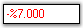{border="0"}

[]{style="COLOR: black"} 

Figure 481: Display Settings of PercentTextBox[]{style="COLOR: black"}

[]{style="COLOR: black"} 

A sample which demonstrates the Display Settings of PercentTextBox control is available in the below sample installation path.[]{style="COLOR: black"}

[]{style="COLOR: black"} 

..My Documents\\Syncfusion\\EssentialStudio\\***Version Number***\\Windows\\Tools.Windows\\Samples\\2.0\\Editors Package\\EditorControls[]{style="COLOR: black"}

 

###### 3.3.8.5.3.2 [[Value Settings]{style="COLOR: windowtext; TEXT-DECORATION: none; text-underline: none"}](http://help.syncfusion.com/ug_82/WindowsFormsUI_Tools/ValueSettings.html) {#value-settings style="tab-stops: 0pt"}

The various values of the PercentTextBox control and their settings are given below.[]{style="COLOR: black"}

[]{style="COLOR: black"} 

::: {align="center"}
  --------------------------------------------------- ---------------------------------------------------------------------------------------------------------------------------------------------------
  PercentTextBox Properties[]{style="COLOR: black"}   Description[]{style="COLOR: black"}
  PercentValue[]{style="COLOR: black"}                Specifies the double value of the PercentTextBox control.[]{style="COLOR: black"}
  DefaultValue[]{style="COLOR: black"}                Specifies the default value. The default value is set to \'Null\'.[]{style="COLOR: black"}
  BindableValue[]{style="COLOR: black"}               Wrapper property that indicates the value. This property can be used to set the value of the control to \'Null\'.[]{style="COLOR: black"}
  BindablePercentValue[]{style="COLOR: black"}        Wrapper property that indicates the percent value. This property can be used to set the value of the control to \'Null\'.[]{style="COLOR: black"}
  DoubleValue[]{style="COLOR: black"}                 Gets / sets the double value of the control. This will be formatted and displayed.[]{style="COLOR: black"}
  --------------------------------------------------- ---------------------------------------------------------------------------------------------------------------------------------------------------
:::

[]{style="COLOR: black"} 

+-------------------------------------------------------------------------------------------------------------------------------------------------------------------------------+
| **[\[C#\]]{style="FONT-FAMILY: 'Courier New'; COLOR: black"}**[]{style="COLOR: black"}                                                                                        |
|                                                                                                                                                                               |
| []{style="COLOR: black"}                                                                                                                                                      |
|                                                                                                                                                                               |
| [this]{style="FONT-FAMILY: 'Courier New'; COLOR: blue"}[.percentTextBox1.PercentValue = 5;]{style="FONT-FAMILY: 'Courier New'; COLOR: black"}[]{style="COLOR: black"}         |
|                                                                                                                                                                               |
| [this]{style="FONT-FAMILY: 'Courier New'; COLOR: blue"}[.percentTextBox1.DefaultValue = 0;]{style="FONT-FAMILY: 'Courier New'; COLOR: black"}[]{style="COLOR: black"}         |
|                                                                                                                                                                               |
| [this]{style="FONT-FAMILY: 'Courier New'; COLOR: blue"}[.percentTextBox1.BindableValue = 0.05;]{style="FONT-FAMILY: 'Courier New'; COLOR: black"}[]{style="COLOR: black"}     |
|                                                                                                                                                                               |
| [this]{style="FONT-FAMILY: 'Courier New'; COLOR: blue"}[.percentTextBox1.BindablePercentValue = 5;]{style="FONT-FAMILY: 'Courier New'; COLOR: black"}[]{style="COLOR: black"} |
|                                                                                                                                                                               |
| [this]{style="FONT-FAMILY: 'Courier New'; COLOR: blue"}[.percentTextBox1.DoubleValue = 0.05;]{style="FONT-FAMILY: 'Courier New'; COLOR: black"}[]{style="COLOR: black"}       |
+-------------------------------------------------------------------------------------------------------------------------------------------------------------------------------+

[]{style="COLOR: black"} 

+----------------------------------------------------------------------------------------------------------------------------------------------------------------------------+
| **[\[VB.NET\]]{style="FONT-FAMILY: 'Courier New'; COLOR: black"}**[]{style="COLOR: black"}                                                                                 |
|                                                                                                                                                                            |
| []{style="COLOR: black"}                                                                                                                                                   |
|                                                                                                                                                                            |
| [Me]{style="FONT-FAMILY: 'Courier New'; COLOR: blue"}[.percentTextBox1.PercentValue = 5]{style="FONT-FAMILY: 'Courier New'; COLOR: black"}[]{style="COLOR: black"}         |
|                                                                                                                                                                            |
| [Me]{style="FONT-FAMILY: 'Courier New'; COLOR: blue"}[.percentTextBox1.DefaultValue = 0]{style="FONT-FAMILY: 'Courier New'; COLOR: black"}[]{style="COLOR: black"}         |
|                                                                                                                                                                            |
| [Me]{style="FONT-FAMILY: 'Courier New'; COLOR: blue"}[.percentTextBox1.BindableValue = 0.05]{style="FONT-FAMILY: 'Courier New'; COLOR: black"}[]{style="COLOR: black"}     |
|                                                                                                                                                                            |
| [Me]{style="FONT-FAMILY: 'Courier New'; COLOR: blue"}[.percentTextBox1.BindablePercentValue = 5]{style="FONT-FAMILY: 'Courier New'; COLOR: black"}[]{style="COLOR: black"} |
|                                                                                                                                                                            |
| [Me]{style="FONT-FAMILY: 'Courier New'; COLOR: blue"}[.percentTextBox1.DoubleValue = 0.05]{style="FONT-FAMILY: 'Courier New'; COLOR: black"}[]{style="COLOR: black"}       |
+----------------------------------------------------------------------------------------------------------------------------------------------------------------------------+

[]{style="COLOR: black"} 

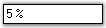{border="0"}

 

Figure 482: Percent Value Set

[]{style="COLOR: black"} 

Null Value Settings[]{style="COLOR: black"}

[]{style="COLOR: black"} 

There are various settings that can be applied to the PercentTextBox control, when the value of the control is set to \'Null\'. These settings are illustrated below.[]{style="COLOR: black"}

[]{style="COLOR: black"} 

::: {align="center"}
  --------------------------------------------------- ---------------------------------------------------------------------------------------------
  PercentTextBox Properties[]{style="COLOR: black"}   Description[]{style="COLOR: black"}
  AllowNull[]{style="COLOR: black"}                   Specifies if the NullString will be used when the value is Null.[]{style="COLOR: black"}
  NullString[]{style="COLOR: black"}                  Specifies the string to be displayed when the DecimalValue is Null.[]{style="COLOR: black"}
  NullFormat[]{style="COLOR: black"}                  Returns the NumberFormatInfo object for the null display.[]{style="COLOR: black"}
  --------------------------------------------------- ---------------------------------------------------------------------------------------------
:::

[]{style="COLOR: black"} 

+-------------------------------------------------------------------------------------------------------------------------------------------------------------------------------------------------------------------------------------------------------------------------------------------+
| **[\[C#\]]{style="FONT-FAMILY: 'Courier New'; COLOR: black"}**[]{style="COLOR: black"}                                                                                                                                                                                                    |
|                                                                                                                                                                                                                                                                                           |
| []{style="COLOR: black"}                                                                                                                                                                                                                                                                  |
|                                                                                                                                                                                                                                                                                           |
| [this]{style="FONT-FAMILY: 'Courier New'; COLOR: blue"}[.percentTextBox1.NullString = ]{style="FONT-FAMILY: 'Courier New'; COLOR: black"}[\"Null Value\"]{style="FONT-FAMILY: 'Courier New'; COLOR: maroon"}[;]{style="FONT-FAMILY: 'Courier New'; COLOR: black"}[]{style="COLOR: black"} |
|                                                                                                                                                                                                                                                                                           |
| [this]{style="FONT-FAMILY: 'Courier New'; COLOR: blue"}[.percentTextBox1.AllowNull = ]{style="FONT-FAMILY: 'Courier New'; COLOR: black"}[true]{style="FONT-FAMILY: 'Courier New'; COLOR: blue"}[;]{style="FONT-FAMILY: 'Courier New'; COLOR: black"}[]{style="COLOR: black"}              |
+-------------------------------------------------------------------------------------------------------------------------------------------------------------------------------------------------------------------------------------------------------------------------------------------+

[]{style="COLOR: black"} 

+-------------------------------------------------------------------------------------------------------------------------------------------------------------------------------------------------------------------------------------+
| **[\[VB.NET\]]{style="FONT-FAMILY: 'Courier New'; COLOR: black"}**[]{style="COLOR: black"}                                                                                                                                          |
|                                                                                                                                                                                                                                     |
| []{style="COLOR: black"}                                                                                                                                                                                                            |
|                                                                                                                                                                                                                                     |
| [Me]{style="FONT-FAMILY: 'Courier New'; COLOR: blue"}[.percentTextBox1.NullString = ]{style="FONT-FAMILY: 'Courier New'; COLOR: black"}[\"Null Value\"]{style="FONT-FAMILY: 'Courier New'; COLOR: #a31515"}[]{style="COLOR: black"} |
|                                                                                                                                                                                                                                     |
| [Me]{style="FONT-FAMILY: 'Courier New'; COLOR: blue"}[.percentTextBox1.AllowNull = ]{style="FONT-FAMILY: 'Courier New'; COLOR: black"}[True]{style="FONT-FAMILY: 'Courier New'; COLOR: blue"}[]{style="COLOR: black"}               |
+-------------------------------------------------------------------------------------------------------------------------------------------------------------------------------------------------------------------------------------+

[]{style="COLOR: black"} 

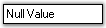{border="0"}

[]{style="COLOR: black"} 

Figure 483: Null String Set

[]{style="COLOR: black"} 

Min and Max Value Settings[]{style="COLOR: black"}

[]{style="COLOR: black"} 

The minimum and maximum values of the IntegerTextBox can be set using the below given properties.[]{style="COLOR: black"}

[]{style="COLOR: black"} 

::: {align="center"}
  ------------------------------------------------------- --------------------------------------------------------------------------------------------------------------------------------------------------------
  PercentTextBox Properties[]{style="COLOR: black"}       Description[]{style="COLOR: black"}
  MaxValue[]{style="COLOR: black"}                        Gets / sets the maximum value that can be set through the PercentTextBox. The default value is set to \'1\'.[]{style="COLOR: black"}
  MinValue[]{style="COLOR: black"}                        Gets / sets the minimum value that can be set through the PercentTextBox. The default value is set to \'-1\'.[]{style="COLOR: black"}
  EnforceMinMaxDuringValidating[]{style="COLOR: black"}   If the min and max values are not met, the Validating event will be handled and cancelled if this property is set to \'True\'.[]{style="COLOR: black"}
  ------------------------------------------------------- --------------------------------------------------------------------------------------------------------------------------------------------------------
:::

[]{style="COLOR: black"} 

+--------------------------------------------------------------------------------------------------------------------------------------------------------------------------------------------------------------------------------------------------------------------------------------------------+
| **[\[C#\]]{style="FONT-FAMILY: 'Courier New'; COLOR: black"}**[]{style="COLOR: black"}                                                                                                                                                                                                           |
|                                                                                                                                                                                                                                                                                                  |
| []{style="COLOR: black"}                                                                                                                                                                                                                                                                         |
|                                                                                                                                                                                                                                                                                                  |
| [this]{style="FONT-FAMILY: 'Courier New'; COLOR: blue"}[.percentTextBox1.MaxValue = 6;]{style="FONT-FAMILY: 'Courier New'; COLOR: black"}[]{style="COLOR: black"}                                                                                                                                |
|                                                                                                                                                                                                                                                                                                  |
| [this]{style="FONT-FAMILY: 'Courier New'; COLOR: blue"}[.percentTextBox1.MinValue = -6;]{style="FONT-FAMILY: 'Courier New'; COLOR: black"}[]{style="COLOR: black"}                                                                                                                               |
|                                                                                                                                                                                                                                                                                                  |
| [this]{style="FONT-FAMILY: 'Courier New'; COLOR: blue"}[.percentTextBox1.EnforceMinMaxDuringValidating = ]{style="FONT-FAMILY: 'Courier New'; COLOR: black"}[true]{style="FONT-FAMILY: 'Courier New'; COLOR: blue"}[;]{style="FONT-FAMILY: 'Courier New'; COLOR: black"}[]{style="COLOR: black"} |
+--------------------------------------------------------------------------------------------------------------------------------------------------------------------------------------------------------------------------------------------------------------------------------------------------+

[]{style="COLOR: black"} 

+-------------------------------------------------------------------------------------------------------------------------------------------------------------------------------------------------------------------------------------------+
| **[\[VB.NET\]]{style="FONT-FAMILY: 'Courier New'; COLOR: black"}**[]{style="COLOR: black"}                                                                                                                                                |
|                                                                                                                                                                                                                                           |
| []{style="COLOR: black"}                                                                                                                                                                                                                  |
|                                                                                                                                                                                                                                           |
| [Me]{style="FONT-FAMILY: 'Courier New'; COLOR: blue"}[.percentTextBox1.MaxValue = 6]{style="FONT-FAMILY: 'Courier New'; COLOR: black"}[]{style="COLOR: black"}                                                                            |
|                                                                                                                                                                                                                                           |
| [Me]{style="FONT-FAMILY: 'Courier New'; COLOR: blue"}[.percentTextBox1.MinValue = -6]{style="FONT-FAMILY: 'Courier New'; COLOR: black"}[]{style="COLOR: black"}                                                                           |
|                                                                                                                                                                                                                                           |
| [Me]{style="FONT-FAMILY: 'Courier New'; COLOR: blue"}[.percentTextBox1.EnforceMinMaxDuringValidating = ]{style="FONT-FAMILY: 'Courier New'; COLOR: black"}[True]{style="FONT-FAMILY: 'Courier New'; COLOR: blue"}[]{style="COLOR: black"} |
+-------------------------------------------------------------------------------------------------------------------------------------------------------------------------------------------------------------------------------------------+

[]{style="COLOR: black"} 

The methods associated with the above properties are given below.[]{style="COLOR: black"}

[]{style="COLOR: black"} 

::: {align="center"}
  --------------------------------------- ------------------------------------------------------------------------------
  Methods[]{style="COLOR: black"}         Description[]{style="COLOR: black"}
  ResetMaxValue[]{style="COLOR: black"}   Resets the MaxValue property to it\'s default value.[]{style="COLOR: black"}
  ResetMinValue[]{style="COLOR: black"}   Resets the MinValue property to it\'s default value.[]{style="COLOR: black"}
  --------------------------------------- ------------------------------------------------------------------------------
:::

 

###### 3.3.8.5.3.3 [[Culture Settings]{style="COLOR: windowtext; TEXT-DECORATION: none; text-underline: none"}](http://help.syncfusion.com/ug_82/WindowsFormsUI_Tools/CultureSettings1.html) {#culture-settings style="tab-stops: 0pt"}

This section discusses the Culture settings of the PercentTextBox control.[]{style="COLOR: black"}

 

::: {align="center"}
+-----------------------------------+------------------------------------------------------------------------------------------------------------------------------------------+
| PercentTextBox Properties         | Description                                                                                                                              |
+-----------------------------------+------------------------------------------------------------------------------------------------------------------------------------------+
| Culture                           | Gets / sets the culture that is to be used for formatting the numeric display.                                                           |
+-----------------------------------+------------------------------------------------------------------------------------------------------------------------------------------+
| CurrentCultureRefresh             | Indicates whether the Culture property is to be refreshed when the culture changes.                                                      |
+-----------------------------------+------------------------------------------------------------------------------------------------------------------------------------------+
| SpecialCultureValue               | Gets / sets the mode for the cultures.                                                                                                   |
|                                   |                                                                                                                                          |
|                                   |                                                                                                                                          |
|                                   |                                                                                                                                          |
|                                   | It includes the below given options.                                                                                                     |
|                                   |                                                                                                                                          |
|                                   |                                                                                                                                          |
|                                   |                                                                                                                                          |
|                                   | *None,*                                                                                                                                  |
|                                   |                                                                                                                                          |
|                                   | *CurrentCulture,*                                                                                                                        |
|                                   |                                                                                                                                          |
|                                   | *UICulture and*                                                                                                                          |
|                                   |                                                                                                                                          |
|                                   | *InstalledCulture.*                                                                                                                      |
+-----------------------------------+------------------------------------------------------------------------------------------------------------------------------------------+
| UseUserOverride                   | Specifies if the NumberFormatInfo used for formatting will use the User Overrides for the culture. The default value is set to \'True\'. |
+-----------------------------------+------------------------------------------------------------------------------------------------------------------------------------------+
:::

[]{style="COLOR: black"} 

+---------------------------------------------------------------------------------------------------------------------------------------------------------------------------------------------------------------------------------------------------------------------------------------------------------------------------------------------------------------------------------------------------------------------------------------------------------------------------------------------------------------------------------------+
| **[\[C#\]]{style="FONT-FAMILY: 'Courier New'; COLOR: black"}**[]{style="COLOR: black"}                                                                                                                                                                                                                                                                                                                                                                                                                                                |
|                                                                                                                                                                                                                                                                                                                                                                                                                                                                                                                                       |
| []{style="COLOR: black"}                                                                                                                                                                                                                                                                                                                                                                                                                                                                                                              |
|                                                                                                                                                                                                                                                                                                                                                                                                                                                                                                                                       |
| [this]{style="FONT-FAMILY: 'Courier New'; COLOR: blue"}[.percentTextBox1.Culture = ]{style="FONT-FAMILY: 'Courier New'; COLOR: black"}[new]{style="FONT-FAMILY: 'Courier New'; COLOR: blue"}[ System.Globalization.]{style="FONT-FAMILY: 'Courier New'; COLOR: black"}[CultureInfo]{style="FONT-FAMILY: 'Courier New'; COLOR: teal"}[(]{style="FONT-FAMILY: 'Courier New'; COLOR: black"}[\"ar-JO\"]{style="FONT-FAMILY: 'Courier New'; COLOR: maroon"}[);]{style="FONT-FAMILY: 'Courier New'; COLOR: black"}[]{style="COLOR: black"} |
|                                                                                                                                                                                                                                                                                                                                                                                                                                                                                                                                       |
| [this]{style="FONT-FAMILY: 'Courier New'; COLOR: blue"}[.percentTextBox1.CurrentCultureRefresh = ]{style="FONT-FAMILY: 'Courier New'; COLOR: black"}[true]{style="FONT-FAMILY: 'Courier New'; COLOR: blue"}[;]{style="FONT-FAMILY: 'Courier New'; COLOR: black"}[]{style="COLOR: black"}                                                                                                                                                                                                                                              |
|                                                                                                                                                                                                                                                                                                                                                                                                                                                                                                                                       |
| [this]{style="FONT-FAMILY: 'Courier New'; COLOR: blue"}[.percentTextBox1.SpecialCultureValue = Syncfusion.Windows.Forms.Tools.]{style="FONT-FAMILY: 'Courier New'; COLOR: black"}[SpecialCultureValues]{style="FONT-FAMILY: 'Courier New'; COLOR: teal"}[.None;]{style="FONT-FAMILY: 'Courier New'; COLOR: black"}[]{style="COLOR: black"}                                                                                                                                                                                            |
|                                                                                                                                                                                                                                                                                                                                                                                                                                                                                                                                       |
| [this]{style="FONT-FAMILY: 'Courier New'; COLOR: blue"}[.percentTextBox1.UseUserOverride = ]{style="FONT-FAMILY: 'Courier New'; COLOR: black"}[true]{style="FONT-FAMILY: 'Courier New'; COLOR: blue"}[;]{style="FONT-FAMILY: 'Courier New'; COLOR: black"}[]{style="COLOR: black"}                                                                                                                                                                                                                                                    |
+---------------------------------------------------------------------------------------------------------------------------------------------------------------------------------------------------------------------------------------------------------------------------------------------------------------------------------------------------------------------------------------------------------------------------------------------------------------------------------------------------------------------------------------+

[]{style="COLOR: black"} 

+-----------------------------------------------------------------------------------------------------------------------------------------------------------------------------------------------------------------------------------------------------------------------------------------------------------------------------------------------------------------------------------------------------------------------------+
| **[\[VB.NET\]]{style="FONT-FAMILY: 'Courier New'; COLOR: black"}**[]{style="COLOR: black"}                                                                                                                                                                                                                                                                                                                                  |
|                                                                                                                                                                                                                                                                                                                                                                                                                             |
| []{style="COLOR: black"}                                                                                                                                                                                                                                                                                                                                                                                                    |
|                                                                                                                                                                                                                                                                                                                                                                                                                             |
| [Me]{style="FONT-FAMILY: 'Courier New'; COLOR: blue"}[.percentTextBox1.Culture = ]{style="FONT-FAMILY: 'Courier New'; COLOR: black"}[New]{style="FONT-FAMILY: 'Courier New'; COLOR: blue"}[ System.Globalization.CultureInfo(]{style="FONT-FAMILY: 'Courier New'; COLOR: black"}[\"ar-JO\"]{style="FONT-FAMILY: 'Courier New'; COLOR: maroon"}[)]{style="FONT-FAMILY: 'Courier New'; COLOR: black"}[]{style="COLOR: black"} |
|                                                                                                                                                                                                                                                                                                                                                                                                                             |
| [Me]{style="FONT-FAMILY: 'Courier New'; COLOR: blue"}[.percentTextBox1.CurrentCultureRefresh = ]{style="FONT-FAMILY: 'Courier New'; COLOR: black"}[True]{style="FONT-FAMILY: 'Courier New'; COLOR: blue"}[]{style="COLOR: black"}                                                                                                                                                                                           |
|                                                                                                                                                                                                                                                                                                                                                                                                                             |
| [Me]{style="FONT-FAMILY: 'Courier New'; COLOR: blue"}[.percentTextBox1.SpecialCultureValue = Syncfusion.Windows.Forms.Tools.SpecialCultureValues.None]{style="FONT-FAMILY: 'Courier New'; COLOR: black"}[]{style="COLOR: black"}                                                                                                                                                                                            |
|                                                                                                                                                                                                                                                                                                                                                                                                                             |
| [Me]{style="FONT-FAMILY: 'Courier New'; COLOR: blue"}[.percentTextBox1.UseUserOverride = ]{style="FONT-FAMILY: 'Courier New'; COLOR: black"}[True]{style="FONT-FAMILY: 'Courier New'; COLOR: blue"}[]{style="COLOR: black"}                                                                                                                                                                                                 |
+-----------------------------------------------------------------------------------------------------------------------------------------------------------------------------------------------------------------------------------------------------------------------------------------------------------------------------------------------------------------------------------------------------------------------------+

[]{style="COLOR: black"} 

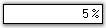{border="0"}

 

Figure 484: Culture Set for the PercentTextBox Control

[]{style="COLOR: black"} 

::: {style="BORDER-BOTTOM: windowtext 1pt solid; BORDER-LEFT: medium none; PADDING-BOTTOM: 1pt; MARGIN-TOP: 9pt; PADDING-LEFT: 0pt; PADDING-RIGHT: 0pt; MARGIN-BOTTOM: 9pt; BORDER-TOP: windowtext 1pt solid; BORDER-RIGHT: medium none; PADDING-TOP: 1pt"}
[{border="0"}]{style="COLOR: black"} Note: The RefreshCulture() method can be used to refresh and reapply the culture specific settings.[]{style="COLOR: black"}
:::

[]{style="COLOR: black"} 

A sample which demonstrates the Culture Settings of the PercentTextBox control is available in the below sample installation path.[]{style="COLOR: black"}

[]{style="COLOR: black"} 

..My Documents\\Syncfusion\\EssentialStudio\\***Version Number***\\Windows\\Tools.Windows\\Samples\\2.0\\Editors Package\\EditorControls[]{style="COLOR: black"}

 

###### 3.3.8.5.3.4 [[Text Settings]{style="COLOR: windowtext; TEXT-DECORATION: none; text-underline: none"}](http://help.syncfusion.com/ug_82/WindowsFormsUI_Tools/TextSettings11.html) {#text-settings style="tab-stops: 0pt"}

This section discusses the text settings of the PercentTextBox control.[]{style="COLOR: black"}

[]{style="COLOR: black"} 

The text associated with the PercentTextBox control can be set and customized using the below given settings.[]{style="COLOR: black"}

[]{style="COLOR: black"} 

::: {align="center"}
+---------------------------------------------------+----------------------------------------------------------------------------------------------------------------------------+
| PercentTextBox Properties[]{style="COLOR: black"} | Description[]{style="COLOR: black"}                                                                                        |
+---------------------------------------------------+----------------------------------------------------------------------------------------------------------------------------+
| Text[]{style="COLOR: black"}                      | Specifies the text associated with the control.[]{style="COLOR: black"}                                                    |
+---------------------------------------------------+----------------------------------------------------------------------------------------------------------------------------+
| CharacterCasing[]{style="COLOR: black"}           | Gets / sets the case of character as they are typed.[]{style="COLOR: black"}                                               |
|                                                   |                                                                                                                            |
|                                                   | []{style="COLOR: black"}                                                                                                   |
|                                                   |                                                                                                                            |
|                                                   | It includes the below given options.[]{style="COLOR: black"}                                                               |
|                                                   |                                                                                                                            |
|                                                   | []{style="COLOR: black"}                                                                                                   |
|                                                   |                                                                                                                            |
|                                                   | *Normal,*[]{style="COLOR: black"}                                                                                          |
|                                                   |                                                                                                                            |
|                                                   | *Upper and*[]{style="COLOR: black"}                                                                                        |
|                                                   |                                                                                                                            |
|                                                   | *Lower.*[]{style="COLOR: black"}                                                                                           |
+---------------------------------------------------+----------------------------------------------------------------------------------------------------------------------------+
| TextAlign[]{style="COLOR: black"}                 | Indicates how the text should be aligned for edit controls.[]{style="COLOR: black"}                                        |
+---------------------------------------------------+----------------------------------------------------------------------------------------------------------------------------+
| SelectedText[]{style="COLOR: black"}              | Gets / sets the selected text in the PercentTextBox.[]{style="COLOR: black"}                                               |
+---------------------------------------------------+----------------------------------------------------------------------------------------------------------------------------+
| SelectAllOnFocus[]{style="COLOR: black"}          | Specifies if the text should be selected when the control gets the focus.[]{style="COLOR: black"}                          |
+---------------------------------------------------+----------------------------------------------------------------------------------------------------------------------------+
| SwitchModeOnFocus[]{style="COLOR: black"}         | Indicates whether the PercentTextBox should allow editing in numeric mode, when it receives focus.[]{style="COLOR: black"} |
+---------------------------------------------------+----------------------------------------------------------------------------------------------------------------------------+
| HideSelection[]{style="COLOR: black"}             | Indicates that the selection should be hidden when the edit control loses focus.[]{style="COLOR: black"}                   |
+---------------------------------------------------+----------------------------------------------------------------------------------------------------------------------------+
| ClipText[]{style="COLOR: black"}                  | Returns the clipped text without the formatting.[]{style="COLOR: black"}                                                   |
+---------------------------------------------------+----------------------------------------------------------------------------------------------------------------------------+
| DrawActiveWhenDisabled[]{style="COLOR: black"}    | Specifies if the text should be drawn active, even when disabled.[]{style="COLOR: black"}                                  |
+---------------------------------------------------+----------------------------------------------------------------------------------------------------------------------------+
:::

[]{style="COLOR: black"} 

+--------------------------------------------------------------------------------------------------------------------------------------------------------------------------------------------------------------------------------------------------------------------------------------------------------------------------+
| **[\[C#\]]{style="FONT-FAMILY: 'Courier New'; COLOR: black"}**[]{style="COLOR: black"}                                                                                                                                                                                                                                   |
|                                                                                                                                                                                                                                                                                                                          |
| []{style="COLOR: black"}                                                                                                                                                                                                                                                                                                 |
|                                                                                                                                                                                                                                                                                                                          |
| [this]{style="FONT-FAMILY: 'Courier New'; COLOR: blue"}[.percentTextBox1.CharacterCasing = System.Windows.Forms.]{style="FONT-FAMILY: 'Courier New'; COLOR: black"}[CharacterCasing]{style="FONT-FAMILY: 'Courier New'; COLOR: teal"}[.Upper;]{style="FONT-FAMILY: 'Courier New'; COLOR: black"}[]{style="COLOR: black"} |
|                                                                                                                                                                                                                                                                                                                          |
| [this]{style="FONT-FAMILY: 'Courier New'; COLOR: blue"}[.percentTextBox1.TextAlign = System.Windows.Forms.]{style="FONT-FAMILY: 'Courier New'; COLOR: black"}[HorizontalAlignment]{style="FONT-FAMILY: 'Courier New'; COLOR: teal"}[.Center;]{style="FONT-FAMILY: 'Courier New'; COLOR: black"}[]{style="COLOR: black"}  |
|                                                                                                                                                                                                                                                                                                                          |
| [this]{style="FONT-FAMILY: 'Courier New'; COLOR: blue"}[.percentTextBox1.SelectedText = ]{style="FONT-FAMILY: 'Courier New'; COLOR: black"}[\"34\"]{style="FONT-FAMILY: 'Courier New'; COLOR: maroon"}[;]{style="FONT-FAMILY: 'Courier New'; COLOR: black"}[]{style="COLOR: black"}                                      |
|                                                                                                                                                                                                                                                                                                                          |
| [this]{style="FONT-FAMILY: 'Courier New'; COLOR: blue"}[.percentTextBox1.SelectAllOnFocus = ]{style="FONT-FAMILY: 'Courier New'; COLOR: black"}[true]{style="FONT-FAMILY: 'Courier New'; COLOR: blue"}[;]{style="FONT-FAMILY: 'Courier New'; COLOR: black"}[]{style="COLOR: black"}                                      |
|                                                                                                                                                                                                                                                                                                                          |
| [this]{style="FONT-FAMILY: 'Courier New'; COLOR: blue"}[.percentTextBox1.SwitchModeOnFocus = ]{style="FONT-FAMILY: 'Courier New'; COLOR: black"}[true]{style="FONT-FAMILY: 'Courier New'; COLOR: blue"}[;]{style="FONT-FAMILY: 'Courier New'; COLOR: black"}[]{style="COLOR: black"}                                     |
|                                                                                                                                                                                                                                                                                                                          |
| [this]{style="FONT-FAMILY: 'Courier New'; COLOR: blue"}[.percentTextBox1.HideSelection = ]{style="FONT-FAMILY: 'Courier New'; COLOR: black"}[true]{style="FONT-FAMILY: 'Courier New'; COLOR: blue"}[;]{style="FONT-FAMILY: 'Courier New'; COLOR: black"}[]{style="COLOR: black"}                                         |
|                                                                                                                                                                                                                                                                                                                          |
| [this]{style="FONT-FAMILY: 'Courier New'; COLOR: blue"}[.percentTextBox1.ClipText = ]{style="FONT-FAMILY: 'Courier New'; COLOR: black"}[\"34\"]{style="FONT-FAMILY: 'Courier New'; COLOR: maroon"}[;]{style="FONT-FAMILY: 'Courier New'; COLOR: black"}[]{style="COLOR: black"}                                          |
|                                                                                                                                                                                                                                                                                                                          |
| [this]{style="FONT-FAMILY: 'Courier New'; COLOR: blue"}[.percentTextBox1.DrawActiveWhenDisabled = ]{style="FONT-FAMILY: 'Courier New'; COLOR: black"}[true]{style="FONT-FAMILY: 'Courier New'; COLOR: blue"}[;]{style="FONT-FAMILY: 'Courier New'; COLOR: black"}[]{style="COLOR: black"}                                |
+--------------------------------------------------------------------------------------------------------------------------------------------------------------------------------------------------------------------------------------------------------------------------------------------------------------------------+

[]{style="COLOR: black"} 

+------------------------------------------------------------------------------------------------------------------------------------------------------------------------------------------------------------------------------------+
| **[\[VB.NET\]]{style="FONT-FAMILY: 'Courier New'; COLOR: black"}**[]{style="COLOR: black"}                                                                                                                                         |
|                                                                                                                                                                                                                                    |
| []{style="COLOR: black"}                                                                                                                                                                                                           |
|                                                                                                                                                                                                                                    |
| [Me]{style="FONT-FAMILY: 'Courier New'; COLOR: blue"}[.percentTextBox1.CharacterCasing = System.Windows.Forms.CharacterCasing.Upper]{style="FONT-FAMILY: 'Courier New'; COLOR: black"}[]{style="COLOR: black"}                     |
|                                                                                                                                                                                                                                    |
| [Me]{style="FONT-FAMILY: 'Courier New'; COLOR: blue"}[.percentTextBox1.TextAlign = System.Windows.Forms.HorizontalAlignment.Center]{style="FONT-FAMILY: 'Courier New'; COLOR: black"}[]{style="COLOR: black"}                      |
|                                                                                                                                                                                                                                    |
| [Me]{style="FONT-FAMILY: 'Courier New'; COLOR: blue"}[.percentTextBox1.SelectedText = ]{style="FONT-FAMILY: 'Courier New'; COLOR: black"}[\"34\"]{style="FONT-FAMILY: 'Courier New'; COLOR: maroon"}[]{style="COLOR: black"}       |
|                                                                                                                                                                                                                                    |
| [Me]{style="FONT-FAMILY: 'Courier New'; COLOR: blue"}[.percentTextBox1.SelectAllOnFocus = ]{style="FONT-FAMILY: 'Courier New'; COLOR: black"}[true]{style="FONT-FAMILY: 'Courier New'; COLOR: blue"}[]{style="COLOR: black"}       |
|                                                                                                                                                                                                                                    |
| [Me]{style="FONT-FAMILY: 'Courier New'; COLOR: blue"}[.percentTextBox1.SwitchModeOnFocus = ]{style="FONT-FAMILY: 'Courier New'; COLOR: black"}[True]{style="FONT-FAMILY: 'Courier New'; COLOR: blue"}[]{style="COLOR: black"}      |
|                                                                                                                                                                                                                                    |
| [Me]{style="FONT-FAMILY: 'Courier New'; COLOR: blue"}[.percentTextBox1.HideSelection = ]{style="FONT-FAMILY: 'Courier New'; COLOR: black"}[True]{style="FONT-FAMILY: 'Courier New'; COLOR: blue"}[]{style="COLOR: black"}          |
|                                                                                                                                                                                                                                    |
| [Me]{style="FONT-FAMILY: 'Courier New'; COLOR: blue"}[.percentTextBox1.ClipText = ]{style="FONT-FAMILY: 'Courier New'; COLOR: black"}[\"34\"]{style="FONT-FAMILY: 'Courier New'; COLOR: maroon"}[]{style="COLOR: black"}           |
|                                                                                                                                                                                                                                    |
| [Me]{style="FONT-FAMILY: 'Courier New'; COLOR: blue"}[.percentTextBox1.DrawActiveWhenDisabled = ]{style="FONT-FAMILY: 'Courier New'; COLOR: black"}[True]{style="FONT-FAMILY: 'Courier New'; COLOR: blue"}[]{style="COLOR: black"} |
+------------------------------------------------------------------------------------------------------------------------------------------------------------------------------------------------------------------------------------+

[]{style="COLOR: black"} 

{border="0"}

Figure 485: Character Case set to \"Upper\"

[]{style="COLOR: black"} 

{border="0"}

[]{style="COLOR: black"} 

Figure 486: Text Aligned to the \"Center\"

[]{style="COLOR: black"} 

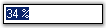{border="0"}

[]{style="COLOR: black"} 

Figure 487: \"SelectAllOnFocus\" property Set

[]{style="COLOR: black"} 

The methods associated with the above properties are given below.[]{style="COLOR: black"}

[]{style="COLOR: black"} 

::: {align="center"}
  -------------------------------------------------- ------------------------------------------------------------------------------------------------------------------------------------
  Methods[]{style="COLOR: black"}                    Description[]{style="COLOR: black"}
  AppendText[]{style="COLOR: black"}                 Appends text to the current text of a textbox.[]{style="COLOR: black"}
  ResetText[]{style="COLOR: black"}                  Resets the Text property to its default value.[]{style="COLOR: black"}
  OnCharacterCasingChanged[]{style="COLOR: black"}   Raises the CharacterCasingChanged event.[]{style="COLOR: black"}
  GetClipText[]{style="COLOR: black"}                Gets / sets the clipped text without the formatting.[]{style="COLOR: black"}
  Cut[]{style="COLOR: black"}                        Cuts the selected data to the clipboard.[]{style="COLOR: black"}
  Copy[]{style="COLOR: black"}                       Copies the content of the NumberTextBox to the clipboard. The ClipMode property dictates what gets copied.[]{style="COLOR: black"}
  Delete[]{style="COLOR: black"}                     Deletes the current selection of the TextBox.[]{style="COLOR: black"}
  Paste[]{style="COLOR: black"}                      Pastes the data in the clipboard into the NumberTextBox control.[]{style="COLOR: black"}
  SelectAll[]{style="COLOR: black"}                  Selects all text in the TextBox.[]{style="COLOR: black"}
  -------------------------------------------------- ------------------------------------------------------------------------------------------------------------------------------------
:::

[]{style="COLOR: black"} 

Multiline Text Settings[]{style="COLOR: black"}

[]{style="COLOR: black"} 

The text settings of the PercentTextBox control can be customized to display multiline text using the below given properties.[]{style="COLOR: black"}

[]{style="COLOR: black"} 

::: {align="center"}
+---------------------------------------------------+------------------------------------------------------------------------------------------------------------------+
| PercentTextBox Properties[]{style="COLOR: black"} | Description[]{style="COLOR: black"}                                                                              |
+---------------------------------------------------+------------------------------------------------------------------------------------------------------------------+
| Multiline[]{style="COLOR: black"}                 | Controls whether the text of the edit control can span more than one line.[]{style="COLOR: black"}               |
+---------------------------------------------------+------------------------------------------------------------------------------------------------------------------+
| Lines[]{style="COLOR: black"}                     | The lines of text in a multiline edit, as an array of string values.[]{style="COLOR: black"}                     |
+---------------------------------------------------+------------------------------------------------------------------------------------------------------------------+
| WordWrap[]{style="COLOR: black"}                  | Indicates if lines are automatically word-wrapped for multiline edit controls.[]{style="COLOR: black"}           |
+---------------------------------------------------+------------------------------------------------------------------------------------------------------------------+
| ScrollBars[]{style="COLOR: black"}                | Indicates, for multiline edit controls, which scrollbars will be shown for this control.[]{style="COLOR: black"} |
|                                                   |                                                                                                                  |
|                                                   | []{style="COLOR: black"}                                                                                         |
|                                                   |                                                                                                                  |
|                                                   | It includes the below given options.[]{style="COLOR: black"}                                                     |
|                                                   |                                                                                                                  |
|                                                   | []{style="COLOR: black"}                                                                                         |
|                                                   |                                                                                                                  |
|                                                   | *None,*[]{style="COLOR: black"}                                                                                  |
|                                                   |                                                                                                                  |
|                                                   | *Horizontal,*[]{style="COLOR: black"}                                                                            |
|                                                   |                                                                                                                  |
|                                                   | *Vertical and*[]{style="COLOR: black"}                                                                           |
|                                                   |                                                                                                                  |
|                                                   | *Both.*[]{style="COLOR: black"}                                                                                  |
+---------------------------------------------------+------------------------------------------------------------------------------------------------------------------+
:::

[]{style="COLOR: black"} 

+-------------------------------------------------------------------------------------------------------------------------------------------------------------------------------------------------------------------------------------------------------------------------------------------------------------------+
| **[\[C#\]]{style="FONT-FAMILY: 'Courier New'; COLOR: black"}**[]{style="COLOR: black"}                                                                                                                                                                                                                            |
|                                                                                                                                                                                                                                                                                                                   |
| []{style="COLOR: black"}                                                                                                                                                                                                                                                                                          |
|                                                                                                                                                                                                                                                                                                                   |
| [this]{style="FONT-FAMILY: 'Courier New'; COLOR: blue"}[.percentTextBox1.Multiline = ]{style="FONT-FAMILY: 'Courier New'; COLOR: black"}[true]{style="FONT-FAMILY: 'Courier New'; COLOR: blue"}[;]{style="FONT-FAMILY: 'Courier New'; COLOR: black"}[]{style="COLOR: black"}                                      |
|                                                                                                                                                                                                                                                                                                                   |
| [this]{style="FONT-FAMILY: 'Courier New'; COLOR: blue"}[.percentTextBox1.WordWrap = ]{style="FONT-FAMILY: 'Courier New'; COLOR: black"}[true]{style="FONT-FAMILY: 'Courier New'; COLOR: blue"}[;]{style="FONT-FAMILY: 'Courier New'; COLOR: black"}[]{style="COLOR: black"}                                       |
|                                                                                                                                                                                                                                                                                                                   |
| [this]{style="FONT-FAMILY: 'Courier New'; COLOR: blue"}[.percentTextBox1.ScrollBars = System.Windows.Forms.]{style="FONT-FAMILY: 'Courier New'; COLOR: black"}[ScrollBars]{style="FONT-FAMILY: 'Courier New'; COLOR: teal"}[.Vertical;]{style="FONT-FAMILY: 'Courier New'; COLOR: black"}[]{style="COLOR: black"} |
+-------------------------------------------------------------------------------------------------------------------------------------------------------------------------------------------------------------------------------------------------------------------------------------------------------------------+

[]{style="COLOR: black"} 

+-----------------------------------------------------------------------------------------------------------------------------------------------------------------------------------------------------------------------+
| **[\[VB.NET\]]{style="FONT-FAMILY: 'Courier New'; COLOR: black"}**[]{style="COLOR: black"}                                                                                                                            |
|                                                                                                                                                                                                                       |
| []{style="COLOR: black"}                                                                                                                                                                                              |
|                                                                                                                                                                                                                       |
| [Me]{style="FONT-FAMILY: 'Courier New'; COLOR: blue"}[.percentTextBox1.Multiline = ]{style="FONT-FAMILY: 'Courier New'; COLOR: black"}[True]{style="FONT-FAMILY: 'Courier New'; COLOR: blue"}[]{style="COLOR: black"} |
|                                                                                                                                                                                                                       |
| [Me]{style="FONT-FAMILY: 'Courier New'; COLOR: blue"}[.percentTextBox1.WordWrap = ]{style="FONT-FAMILY: 'Courier New'; COLOR: black"}[True]{style="FONT-FAMILY: 'Courier New'; COLOR: blue"}[]{style="COLOR: black"}  |
|                                                                                                                                                                                                                       |
| [Me]{style="FONT-FAMILY: 'Courier New'; COLOR: blue"}[.percentTextBox1.ScrollBars = System.Windows.Forms.ScrollBars.Vertical]{style="FONT-FAMILY: 'Courier New'; COLOR: black"}[]{style="COLOR: black"}               |
+-----------------------------------------------------------------------------------------------------------------------------------------------------------------------------------------------------------------------+

[]{style="COLOR: black"} 

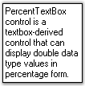{border="0"}

[]{style="COLOR: black"} 

Figure 488: Multiline Text

[]{style="COLOR: black"} 

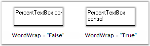{border="0"}

[]{style="COLOR: black"} 

Figure 489: WordWrap property Set

[]{style="COLOR: black"} 

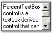{border="0"}

 

Figure 490: ScrollBars set for PercentTextBox Control

[]{style="COLOR: black"} 

Clip Mode[]{style="COLOR: black"}

[]{style="COLOR: black"} 

The formatting for the text can be enabled or disabled using the property given below.[]{style="COLOR: black"}

[]{style="COLOR: black"} 

::: {align="center"}
+-------------------------------------------------+--------------------------------------------------------------------------------------------------------------------------------------+
| PercentTextBox Property[]{style="COLOR: black"} | Description[]{style="COLOR: black"}                                                                                                  |
+-------------------------------------------------+--------------------------------------------------------------------------------------------------------------------------------------+
| ClipMode[]{style="COLOR: black"}                | Determines whether to include or exclude the literal characters in the input mask when doing a copy command.[]{style="COLOR: black"} |
|                                                 |                                                                                                                                      |
|                                                 | []{style="COLOR: black"}                                                                                                             |
|                                                 |                                                                                                                                      |
|                                                 | It includes the below given options.[]{style="COLOR: black"}                                                                         |
|                                                 |                                                                                                                                      |
|                                                 | []{style="COLOR: black"}                                                                                                             |
|                                                 |                                                                                                                                      |
|                                                 | *IncludeFormatting and*[]{style="COLOR: black"}                                                                                      |
|                                                 |                                                                                                                                      |
|                                                 | *ExcludeFormatting.*[]{style="COLOR: black"}                                                                                         |
+-------------------------------------------------+--------------------------------------------------------------------------------------------------------------------------------------+
:::

[]{style="COLOR: black"} 

+-------------------------------------------------------------------------------------------------------------------------------------------------------------------------------------------------------------------------------------------------------------------------------------------------------------------------------------------+
| **[\[C#\]]{style="FONT-FAMILY: 'Courier New'; COLOR: black"}**[]{style="COLOR: black"}                                                                                                                                                                                                                                                    |
|                                                                                                                                                                                                                                                                                                                                           |
| []{style="COLOR: black"}                                                                                                                                                                                                                                                                                                                  |
|                                                                                                                                                                                                                                                                                                                                           |
| [this]{style="FONT-FAMILY: 'Courier New'; COLOR: blue"}[.percentTextBox1.ClipMode = Syncfusion.Windows.Forms.Tools.]{style="FONT-FAMILY: 'Courier New'; COLOR: black"}[CurrencyClipModes]{style="FONT-FAMILY: 'Courier New'; COLOR: teal"}[.IncludeFormatting;]{style="FONT-FAMILY: 'Courier New'; COLOR: black"}[]{style="COLOR: black"} |
+-------------------------------------------------------------------------------------------------------------------------------------------------------------------------------------------------------------------------------------------------------------------------------------------------------------------------------------------+

[]{style="COLOR: black"} 

+---------------------------------------------------------------------------------------------------------------------------------------------------------------------------------------------------------------------------------+
| **[\[VB.NET\]]{style="FONT-FAMILY: 'Courier New'; COLOR: black"}**[]{style="COLOR: black"}                                                                                                                                      |
|                                                                                                                                                                                                                                 |
| []{style="COLOR: black"}                                                                                                                                                                                                        |
|                                                                                                                                                                                                                                 |
| [Me]{style="FONT-FAMILY: 'Courier New'; COLOR: blue"}[.percentTextBox1.ClipMode = Syncfusion.Windows.Forms.Tools.CurrencyClipModes.IncludeFormatting]{style="FONT-FAMILY: 'Courier New'; COLOR: black"}[]{style="COLOR: black"} |
+---------------------------------------------------------------------------------------------------------------------------------------------------------------------------------------------------------------------------------+

[]{style="COLOR: black"} 

Formatted Text[]{style="COLOR: black"}

[]{style="COLOR: black"} 

Formatted text can be displayed using the below given property.[]{style="COLOR: black"}

[]{style="COLOR: black"} 

::: {align="center"}
  ------------------------------------------------- -------------------------------------------------------------------------
  PercentTextBox Property[]{style="COLOR: black"}   Description[]{style="COLOR: black"}
  FormattedText[]{style="COLOR: black"}             Returns the formatted text with the formatting.[]{style="COLOR: black"}
  ------------------------------------------------- -------------------------------------------------------------------------
:::

[]{style="COLOR: black"} 

+-----------------------------------------------------------------------------------------------------------------------------------------------------------------------------------------------------------------------------------------------------------------------------------------+
| **[\[C#\]]{style="FONT-FAMILY: 'Courier New'; COLOR: black"}**[]{style="COLOR: black"}                                                                                                                                                                                                  |
|                                                                                                                                                                                                                                                                                         |
| []{style="COLOR: black"}                                                                                                                                                                                                                                                                |
|                                                                                                                                                                                                                                                                                         |
| [this]{style="FONT-FAMILY: 'Courier New'; COLOR: blue"}[.percentTextBox1.FormattedText = ]{style="FONT-FAMILY: 'Courier New'; COLOR: black"}[\"Hello\"]{style="FONT-FAMILY: 'Courier New'; COLOR: maroon"}[;]{style="FONT-FAMILY: 'Courier New'; COLOR: black"}[]{style="COLOR: black"} |
+-----------------------------------------------------------------------------------------------------------------------------------------------------------------------------------------------------------------------------------------------------------------------------------------+

[]{style="COLOR: black"} 

+----------------------------------------------------------------------------------------------------------------------------------------------------------------------------------------------------------------------------------+
| **[\[VB.NET\]]{style="FONT-FAMILY: 'Courier New'; COLOR: black"}**[]{style="COLOR: black"}                                                                                                                                       |
|                                                                                                                                                                                                                                  |
| []{style="COLOR: black"}                                                                                                                                                                                                         |
|                                                                                                                                                                                                                                  |
| [Me]{style="FONT-FAMILY: 'Courier New'; COLOR: blue"}[.percentTextBox1.FormattedText = ]{style="FONT-FAMILY: 'Courier New'; COLOR: black"}[\"Hello\"]{style="FONT-FAMILY: 'Courier New'; COLOR: maroon"}[]{style="COLOR: black"} |
+----------------------------------------------------------------------------------------------------------------------------------------------------------------------------------------------------------------------------------+

[]{style="COLOR: black"} 

RightToLeft[]{style="COLOR: black"}

[]{style="COLOR: black"} 

The text can be displayed from right to left for RTL languages using this property.[]{style="COLOR: black"}

[]{style="COLOR: black"} 

::: {align="center"}
  ------------------------------------------------- ---------------------------------------------------------------------------------------------------------------------------------------------
  PercentTextBox Property[]{style="COLOR: black"}   Description[]{style="COLOR: black"}
  RightToLeft[]{style="COLOR: black"}               Indicates whether the component should draw right-to-left for RTL languages. The default value is set to \'False\'.[]{style="COLOR: black"}
  ------------------------------------------------- ---------------------------------------------------------------------------------------------------------------------------------------------
:::

[]{style="COLOR: black"} 

::: {style="BORDER-BOTTOM: windowtext 1pt solid; BORDER-LEFT: medium none; PADDING-BOTTOM: 1pt; MARGIN-TOP: 9pt; PADDING-LEFT: 0pt; PADDING-RIGHT: 0pt; MARGIN-BOTTOM: 9pt; BORDER-TOP: windowtext 1pt solid; BORDER-RIGHT: medium none; PADDING-TOP: 1pt"}
[{border="0"}]{style="COLOR: black"} Note:[ ]{style="COLOR: black; FONT-SIZE: 8pt"}The RightToLeft property will be automatically set to \'True\' for RTL languages.[]{style="COLOR: black"}
:::

[]{style="COLOR: black"} 

+----------------------------------------------------------------------------------------------------------------------------------------------------------------------------------------------------------------------------------------------------------------------------------------------------------------+
| **[\[C#\]]{style="FONT-FAMILY: 'Courier New'; COLOR: black"}**[]{style="COLOR: black"}                                                                                                                                                                                                                         |
|                                                                                                                                                                                                                                                                                                                |
| []{style="COLOR: black"}                                                                                                                                                                                                                                                                                       |
|                                                                                                                                                                                                                                                                                                                |
| [this]{style="FONT-FAMILY: 'Courier New'; COLOR: blue"}[.percentTextBox1.RightToLeft = System.Windows.Forms.]{style="FONT-FAMILY: 'Courier New'; COLOR: black"}[RightToLeft]{style="FONT-FAMILY: 'Courier New'; COLOR: teal"}[.Yes;]{style="FONT-FAMILY: 'Courier New'; COLOR: black"}[]{style="COLOR: black"} |
+----------------------------------------------------------------------------------------------------------------------------------------------------------------------------------------------------------------------------------------------------------------------------------------------------------------+

[]{style="COLOR: black"} 

+------------------------------------------------------------------------------------------------------------------------------------------------------------------------------------------------------+
| **[\[VB.NET\]]{style="FONT-FAMILY: 'Courier New'; COLOR: black"}**[]{style="COLOR: black"}                                                                                                           |
|                                                                                                                                                                                                      |
| []{style="COLOR: black"}                                                                                                                                                                             |
|                                                                                                                                                                                                      |
| [Me]{style="FONT-FAMILY: 'Courier New'; COLOR: blue"}[.percentTextBox1.RightToLeft = System.Windows.Forms.RightToLeft.Yes]{style="FONT-FAMILY: 'Courier New'; COLOR: black"}[]{style="COLOR: black"} |
+------------------------------------------------------------------------------------------------------------------------------------------------------------------------------------------------------+

[]{style="COLOR: black"} 

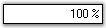{border="0"}

[]{style="COLOR: black"} 

Figure 491: Text displayed from Right To Left

[]{style="COLOR: black"} 

::: {style="BORDER-BOTTOM: windowtext 1pt solid; BORDER-LEFT: medium none; PADDING-BOTTOM: 1pt; MARGIN-TOP: 9pt; PADDING-LEFT: 0pt; PADDING-RIGHT: 0pt; MARGIN-BOTTOM: 9pt; BORDER-TOP: windowtext 1pt solid; BORDER-RIGHT: medium none; PADDING-TOP: 1pt"}
[{border="0"}]{style="COLOR: black"} Note:[ ]{style="COLOR: black; FONT-SIZE: 8pt"}The ResetRightToLeft() method can be used to reset the RightToLeft property to it\'s default value.[]{style="COLOR: black"}
:::

[]{style="COLOR: black"} 

OverflowIndicatorToolTipText[]{style="COLOR: black"}

[]{style="COLOR: black"} 

The tooltip that should be displayed when an overflow of text occurs can be set using the below given properties.[]{style="COLOR: black"}

 

::: {align="center"}
  ------------------------------------------------------ -----------------------------------------------------------------------------------
  [PercentTextBox Properties]{style="COLOR: #15428b"}    [Description]{style="COLOR: #15428b"}
  OverflowIndicatorToolTipText[]{style="COLOR: black"}   Specifies the overflow indicator tooltip text.[]{style="COLOR: black"}
  ShowOverflowIndicator[]{style="COLOR: black"}          Gets / sets overflow indicator visibility.[]{style="COLOR: black"}
  ShowOverflowIndicatorToolTip[]{style="COLOR: black"}   Indicates whether to show the overflow indicator tooltip.[]{style="COLOR: black"}
  ------------------------------------------------------ -----------------------------------------------------------------------------------
:::

[]{style="COLOR: black"} 

+-----------------------------------------------------------------------------------------------------------------------------------------------------------------------------------------------------------------------------------------------------------------------------------------------------------+
| **[\[C#\]]{style="FONT-FAMILY: 'Courier New'; COLOR: black"}**[]{style="COLOR: black"}                                                                                                                                                                                                                    |
|                                                                                                                                                                                                                                                                                                           |
| []{style="COLOR: black"}                                                                                                                                                                                                                                                                                  |
|                                                                                                                                                                                                                                                                                                           |
| [this]{style="FONT-FAMILY: 'Courier New'; COLOR: blue"}[.percentTextBox1.OverflowIndicatorToolTipText = ]{style="FONT-FAMILY: 'Courier New'; COLOR: black"}[\"Overflow\"]{style="FONT-FAMILY: 'Courier New'; COLOR: maroon"}[;]{style="FONT-FAMILY: 'Courier New'; COLOR: black"}[]{style="COLOR: black"} |
|                                                                                                                                                                                                                                                                                                           |
| [this]{style="FONT-FAMILY: 'Courier New'; COLOR: blue"}[.percentTextBox1.ShowOverflowIndicator = ]{style="FONT-FAMILY: 'Courier New'; COLOR: black"}[true]{style="FONT-FAMILY: 'Courier New'; COLOR: blue"}[;]{style="FONT-FAMILY: 'Courier New'; COLOR: black"}[]{style="COLOR: black"}                  |
|                                                                                                                                                                                                                                                                                                           |
| [this]{style="FONT-FAMILY: 'Courier New'; COLOR: blue"}[.percentTextBox1.ShowOverflowIndicatorToolTip = ]{style="FONT-FAMILY: 'Courier New'; COLOR: black"}[true]{style="FONT-FAMILY: 'Courier New'; COLOR: blue"}[;]{style="FONT-FAMILY: 'Courier New'; COLOR: black"}[]{style="COLOR: black"}           |
+-----------------------------------------------------------------------------------------------------------------------------------------------------------------------------------------------------------------------------------------------------------------------------------------------------------+

[]{style="COLOR: black"} 

+----------------------------------------------------------------------------------------------------------------------------------------------------------------------------------------------------------------------------------------------------+
| **[\[VB.NET\]]{style="FONT-FAMILY: 'Courier New'; COLOR: black"}**[]{style="COLOR: black"}                                                                                                                                                         |
|                                                                                                                                                                                                                                                    |
| []{style="COLOR: black"}                                                                                                                                                                                                                           |
|                                                                                                                                                                                                                                                    |
| [Me]{style="FONT-FAMILY: 'Courier New'; COLOR: blue"}[.percentTextBox1.OverflowIndicatorToolTipText = ]{style="FONT-FAMILY: 'Courier New'; COLOR: black"}[\"Overflow\"]{style="FONT-FAMILY: 'Courier New'; COLOR: maroon"}[]{style="COLOR: black"} |
|                                                                                                                                                                                                                                                    |
| [Me]{style="FONT-FAMILY: 'Courier New'; COLOR: blue"}[.percentTextBox1.ShowOverflowIndicator = ]{style="FONT-FAMILY: 'Courier New'; COLOR: black"}[True]{style="FONT-FAMILY: 'Courier New'; COLOR: blue"}[]{style="COLOR: black"}                  |
|                                                                                                                                                                                                                                                    |
| [Me]{style="FONT-FAMILY: 'Courier New'; COLOR: blue"}[.percentTextBox1.ShowOverflowIndicatorToolTip = ]{style="FONT-FAMILY: 'Courier New'; COLOR: black"}[True]{style="FONT-FAMILY: 'Courier New'; COLOR: blue"}[]{style="COLOR: black"}           |
+----------------------------------------------------------------------------------------------------------------------------------------------------------------------------------------------------------------------------------------------------+

[]{style="COLOR: black"} 

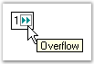{border="0"}

[]{style="COLOR: black"} 

Figure 492: Overflow Indicator ToolTip Text Set

[]{style="COLOR: black"} 

Banner Text Support[]{style="COLOR: black"}

[]{style="COLOR: black"} 

The PercentTextBox control can display banner text in the text field, at run time. A [[BannerTextProvider Component]{style="COLOR: blue"}[ ]{style="COLOR: blue; TEXT-DECORATION: none; text-underline: none"}](http://help.syncfusion.com/ug_82/WindowsFormsUI_Tools/BannerText.html)should be available for this purpose. Also, We need to set AllowNull, NullString and Text properties as below to make this feature effective.[]{style="COLOR: black"}

[]{style="COLOR: black"} 

+------------------------------------------------------------------------------------------------------------------------------------------------------------------------------------------------------------------------------------------------------------------------------+
| **[\[C#\]]{style="FONT-FAMILY: 'Courier New'; COLOR: black"}**[]{style="COLOR: black"}                                                                                                                                                                                       |
|                                                                                                                                                                                                                                                                              |
| []{style="COLOR: black"}                                                                                                                                                                                                                                                     |
|                                                                                                                                                                                                                                                                              |
| [this]{style="FONT-FAMILY: 'Courier New'; COLOR: blue"}[.percentTextBox1.AllowNull = ]{style="FONT-FAMILY: 'Courier New'; COLOR: black"}[true]{style="FONT-FAMILY: 'Courier New'; COLOR: blue"}[;]{style="FONT-FAMILY: 'Courier New'; COLOR: black"}[]{style="COLOR: black"} |
|                                                                                                                                                                                                                                                                              |
| [this]{style="FONT-FAMILY: 'Courier New'; COLOR: blue"}[.percentTextBox1.NullString = \"\";]{style="FONT-FAMILY: 'Courier New'; COLOR: black"}[]{style="COLOR: black"}                                                                                                       |
|                                                                                                                                                                                                                                                                              |
| [this]{style="FONT-FAMILY: 'Courier New'; COLOR: blue"}[.percentTextBox1.Text = \"\";]{style="FONT-FAMILY: 'Courier New'; COLOR: black"}[]{style="COLOR: black"}                                                                                                             |
+------------------------------------------------------------------------------------------------------------------------------------------------------------------------------------------------------------------------------------------------------------------------------+

[]{style="COLOR: black"} 

+-----------------------------------------------------------------------------------------------------------------------------------------------------------------------------------------------------------------------+
| **[\[VB.NET\]]{style="FONT-FAMILY: 'Courier New'; COLOR: black"}**[]{style="COLOR: black"}                                                                                                                            |
|                                                                                                                                                                                                                       |
| []{style="COLOR: black"}                                                                                                                                                                                              |
|                                                                                                                                                                                                                       |
| [Me]{style="FONT-FAMILY: 'Courier New'; COLOR: blue"}[.percentTextBox1.AllowNull = ]{style="FONT-FAMILY: 'Courier New'; COLOR: black"}[True]{style="FONT-FAMILY: 'Courier New'; COLOR: blue"}[]{style="COLOR: black"} |
|                                                                                                                                                                                                                       |
| [Me]{style="FONT-FAMILY: 'Courier New'; COLOR: blue"}[.percentTextBox1.NullString = \"\"]{style="FONT-FAMILY: 'Courier New'; COLOR: black"}[]{style="COLOR: black"}                                                   |
|                                                                                                                                                                                                                       |
| [Me]{style="FONT-FAMILY: 'Courier New'; COLOR: blue"}[.percentTextBox1.Text = \"\"]{style="FONT-FAMILY: 'Courier New'; COLOR: black"}[]{style="COLOR: black"}                                                         |
+-----------------------------------------------------------------------------------------------------------------------------------------------------------------------------------------------------------------------+

[]{style="COLOR: black"} 

A sample which demonstrates the Text, Text Align and Overflow Indicator features of the PercentTextBox control is available in the below sample installation path.[]{style="COLOR: black"}

[]{style="COLOR: black"} 

..My Documents\\Syncfusion\\EssentialStudio\\***Version Number***\\Windows\\Tools.Windows\\Samples\\2.0\\Editors Package\\EditorControls[]{style="COLOR: black"}

 

###### 3.3.8.5.3.5 [[Appearance Settings]{style="COLOR: windowtext; TEXT-DECORATION: none; text-underline: none"}](http://help.syncfusion.com/ug_82/WindowsFormsUI_Tools/AppearanceSettings22.html) {#appearance-settings style="tab-stops: 0pt"}

3.3.8.5.3.5.1      [[Background Settings]{style="COLOR: windowtext; TEXT-DECORATION: none; text-underline: none"}](http://help.syncfusion.com/ug_82/WindowsFormsUI_Tools/BackgroundSettings13.html)

The Background settings of the PercentTextBox control are discussed below.[]{style="COLOR: black"}

[]{style="COLOR: black"} 

Background Color[]{style="COLOR: black"}

[]{style="COLOR: black"} 

The background color of the control can be set using the properties given below.[]{style="COLOR: black"}

[]{style="COLOR: black"} 

::: {align="center"}
  --------------------------------------------------- ------------------------------------------------------------------------------------------------------
  PercentTextBox Properties[]{style="COLOR: black"}   Description[]{style="COLOR: black"}
  BackColor[]{style="COLOR: black"}                   Specifies the background color of the component.[]{style="COLOR: black"}
  ReadOnlyBackColor[]{style="COLOR: black"}           Specifies the backcolor to be used when the control is in the ReadOnly mode.[]{style="COLOR: black"}
  --------------------------------------------------- ------------------------------------------------------------------------------------------------------
:::

[]{style="COLOR: black"} 

+-----------------------------------------------------------------------------------------------------------------------------------------------------------------------------------------------------------------------------------------------------------------------------------------------------------+
| **[\[C#\]]{style="FONT-FAMILY: 'Courier New'; COLOR: black"}**[]{style="COLOR: black"}                                                                                                                                                                                                                    |
|                                                                                                                                                                                                                                                                                                           |
| []{style="COLOR: black"}                                                                                                                                                                                                                                                                                  |
|                                                                                                                                                                                                                                                                                                           |
| [this]{style="FONT-FAMILY: 'Courier New'; COLOR: blue"}[.percentTextBox1.BackColor = System.Drawing.]{style="FONT-FAMILY: 'Courier New'; COLOR: black"}[Color]{style="FONT-FAMILY: 'Courier New'; COLOR: teal"}[.LightCyan;]{style="FONT-FAMILY: 'Courier New'; COLOR: black"}[]{style="COLOR: black"}    |
|                                                                                                                                                                                                                                                                                                           |
| []{style="COLOR: black"}                                                                                                                                                                                                                                                                                  |
|                                                                                                                                                                                                                                                                                                           |
| [this]{style="FONT-FAMILY: 'Courier New'; COLOR: blue"}[.percentTextBox1.ReadOnly = ]{style="FONT-FAMILY: 'Courier New'; COLOR: black"}[true]{style="FONT-FAMILY: 'Courier New'; COLOR: blue"}[;]{style="FONT-FAMILY: 'Courier New'; COLOR: black"}[]{style="COLOR: black"}                               |
|                                                                                                                                                                                                                                                                                                           |
| [this]{style="FONT-FAMILY: 'Courier New'; COLOR: blue"}[.percentTextBox1.ReadOnlyBackColor = System.Drawing.]{style="FONT-FAMILY: 'Courier New'; COLOR: black"}[Color]{style="FONT-FAMILY: 'Courier New'; COLOR: teal"}[.Pink;]{style="FONT-FAMILY: 'Courier New'; COLOR: black"}[]{style="COLOR: black"} |
+-----------------------------------------------------------------------------------------------------------------------------------------------------------------------------------------------------------------------------------------------------------------------------------------------------------+

[]{style="COLOR: black"} 

+--------------------------------------------------------------------------------------------------------------------------------------------------------------------------------------------------------------------------+
| **[\[VB.NET\]]{style="FONT-FAMILY: 'Courier New'; COLOR: black"}**[]{style="COLOR: black"}                                                                                                                               |
|                                                                                                                                                                                                                          |
| []{style="COLOR: black"}                                                                                                                                                                                                 |
|                                                                                                                                                                                                                          |
| [Me]{style="FONT-FAMILY: 'Courier New'; COLOR: blue"}[.percentTextBox1.BackColor = System.Drawing.Color.LightCyan]{style="FONT-FAMILY: 'Courier New'; COLOR: black"}[]{style="COLOR: black"}                             |
|                                                                                                                                                                                                                          |
| []{style="COLOR: black"}                                                                                                                                                                                                 |
|                                                                                                                                                                                                                          |
| [Me]{style="FONT-FAMILY: 'Courier New'; COLOR: blue"}[.percentTextBox1.\[ReadOnly\] = ]{style="FONT-FAMILY: 'Courier New'; COLOR: black"}[True]{style="FONT-FAMILY: 'Courier New'; COLOR: blue"}[]{style="COLOR: black"} |
|                                                                                                                                                                                                                          |
| [Me]{style="FONT-FAMILY: 'Courier New'; COLOR: blue"}[.percentTextBox1.ReadOnlyBackColor = System.Drawing.Color.Pink]{style="FONT-FAMILY: 'Courier New'; COLOR: black"}[]{style="COLOR: black"}                          |
+--------------------------------------------------------------------------------------------------------------------------------------------------------------------------------------------------------------------------+

[]{style="COLOR: black"} 

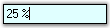{border="0"}

[]{style="COLOR: black"} 

Figure 493: PercentTextBox with Background Color Set[]{style="COLOR: black"}

[]{style="COLOR: black"} 

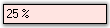{border="0"}

[]{style="COLOR: black"} 

Figure 494: \"ReadOnlyBackColor\" property Set

[]{style="COLOR: black"} 

::: {style="BORDER-BOTTOM: windowtext 1pt solid; BORDER-LEFT: medium none; PADDING-BOTTOM: 1pt; MARGIN-TOP: 9pt; PADDING-LEFT: 0pt; PADDING-RIGHT: 0pt; MARGIN-BOTTOM: 9pt; BORDER-TOP: windowtext 1pt solid; BORDER-RIGHT: medium none; PADDING-TOP: 1pt"}
[{border="0"}]{style="COLOR: black"} Note:[ ]{style="COLOR: black; FONT-SIZE: 8pt"}The ReadOnly property must be set to \'True\' for the above setting to take effect.[]{style="COLOR: black"}
:::

[]{style="COLOR: black"} 

The methods associated with the above properties are given below.[]{style="COLOR: black"}

[]{style="COLOR: black"} 

::: {align="center"}
  ------------------------------------------------ ---------------------------------------------------------------------------------------
  Methods[]{style="COLOR: black"}                  Description[]{style="COLOR: black"}
  ResetBackColor[]{style="COLOR: black"}           Resets the BackColor property to it\'s default value.[]{style="COLOR: black"}
  ResetReadOnlyBackColor[]{style="COLOR: black"}   Resets the ReadOnlyBackColor property to it\'s default value.[]{style="COLOR: black"}
  ------------------------------------------------ ---------------------------------------------------------------------------------------
:::

 

3.3.8.5.3.5.2      [[Foreground Settings]{style="COLOR: windowtext; TEXT-DECORATION: none; text-underline: none"}](http://help.syncfusion.com/ug_82/WindowsFormsUI_Tools/ForegroundSettings12.html)

The Foreground settings of the PercentTextBox control are discussed below.[]{style="COLOR: black"}

[]{style="COLOR: black"} 

Foreground Color[]{style="COLOR: black"}

[]{style="COLOR: black"} 

The foreground color of the control can be set using the properties given below.[]{style="COLOR: black"}

[]{style="COLOR: black"} 

::: {align="center"}
  --------------------------------------------------- ----------------------------------------------------------------------------------------------------------------------------
  PercentTextBox Properties[]{style="COLOR: black"}   Description[]{style="COLOR: black"}
  PositiveColor[]{style="COLOR: black"}               Gets / sets the forecolor when the current value is positive.[]{style="COLOR: black"}
  NegativeColor[]{style="COLOR: black"}               Gets / sets the forecolor when the current value is negative. The default value is set to \'Red\'.[]{style="COLOR: black"}
  ZeroColor[]{style="COLOR: black"}                   Gets / sets the forecolor when the current value is zero.[]{style="COLOR: black"}
  --------------------------------------------------- ----------------------------------------------------------------------------------------------------------------------------
:::

[]{style="COLOR: black"} 

+--------------------------------------------------------------------------------------------------------------------------------------------------------------------------------------------------------------------------------------------------------------------------------------------------------------+
| **[\[C#\]]{style="FONT-FAMILY: 'Courier New'; COLOR: black"}**[]{style="COLOR: black"}                                                                                                                                                                                                                       |
|                                                                                                                                                                                                                                                                                                              |
| []{style="COLOR: black"}                                                                                                                                                                                                                                                                                     |
|                                                                                                                                                                                                                                                                                                              |
| [this]{style="FONT-FAMILY: 'Courier New'; COLOR: blue"}[.percentTextBox1.PositiveColor = System.Drawing.]{style="FONT-FAMILY: 'Courier New'; COLOR: black"}[Color]{style="FONT-FAMILY: 'Courier New'; COLOR: teal"}[.ForestGreen;]{style="FONT-FAMILY: 'Courier New'; COLOR: black"}[]{style="COLOR: black"} |
|                                                                                                                                                                                                                                                                                                              |
| [this]{style="FONT-FAMILY: 'Courier New'; COLOR: blue"}[.percentTextBox1.NegativeColor = System.Drawing.]{style="FONT-FAMILY: 'Courier New'; COLOR: black"}[Color]{style="FONT-FAMILY: 'Courier New'; COLOR: teal"}[.Orange;]{style="FONT-FAMILY: 'Courier New'; COLOR: black"}[]{style="COLOR: black"}      |
|                                                                                                                                                                                                                                                                                                              |
| [this]{style="FONT-FAMILY: 'Courier New'; COLOR: blue"}[.percentTextBox1.ZeroColor = System.Drawing.]{style="FONT-FAMILY: 'Courier New'; COLOR: black"}[Color]{style="FONT-FAMILY: 'Courier New'; COLOR: teal"}[.Orchid;]{style="FONT-FAMILY: 'Courier New'; COLOR: black"}[]{style="COLOR: black"}          |
+--------------------------------------------------------------------------------------------------------------------------------------------------------------------------------------------------------------------------------------------------------------------------------------------------------------+

[]{style="COLOR: black"} 

+----------------------------------------------------------------------------------------------------------------------------------------------------------------------------------------------------+
| **[\[VB.NET\]]{style="FONT-FAMILY: 'Courier New'; COLOR: black"}**[]{style="COLOR: black"}                                                                                                         |
|                                                                                                                                                                                                    |
| []{style="COLOR: black"}                                                                                                                                                                           |
|                                                                                                                                                                                                    |
| [Me]{style="FONT-FAMILY: 'Courier New'; COLOR: blue"}[.percentTextBox1.PositiveColor = System.Drawing.Color.ForestGreen]{style="FONT-FAMILY: 'Courier New'; COLOR: black"}[]{style="COLOR: black"} |
|                                                                                                                                                                                                    |
| [Me]{style="FONT-FAMILY: 'Courier New'; COLOR: blue"}[.percentTextBox1.NegativeColor = System.Drawing.Color.Orange]{style="FONT-FAMILY: 'Courier New'; COLOR: black"}[]{style="COLOR: black"}      |
|                                                                                                                                                                                                    |
| [Me]{style="FONT-FAMILY: 'Courier New'; COLOR: blue"}[.percentTextBox1.ZeroColor = System.Drawing.Color.Orchid]{style="FONT-FAMILY: 'Courier New'; COLOR: black"}[]{style="COLOR: black"}          |
+----------------------------------------------------------------------------------------------------------------------------------------------------------------------------------------------------+

[]{style="COLOR: black"} 

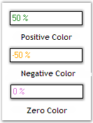{border="0"}

[]{style="COLOR: black"} 

Figure 495: Foreground Settings of PercentTextBox[]{style="COLOR: black"}

[]{style="COLOR: black"} 

The methods associated with the above properties are given below.[]{style="COLOR: black"}

[]{style="COLOR: black"} 

::: {align="center"}
  ------------------------------------------------------ ---------------------------------------------------------------------------------------------------------------
  Methods[]{style="COLOR: black"}                        Description[]{style="COLOR: black"}
  ResetForeColor[]{style="COLOR: black"}                 Resets the forecolor of the control to it\'s default value.[]{style="COLOR: black"}
  ResetPositiveColor[]{style="COLOR: black"}             Resets the PositiveColor property to it\'s default value.[]{style="COLOR: black"}
  ResetNegativeColor[]{style="COLOR: black"}             Resets the NegativeColor property to it\'s default value.[]{style="COLOR: black"}
  ResetZeroColor[]{style="COLOR: black"}                 Resets the ZeroColor property to it\'s default value.[]{style="COLOR: black"}
  SetControlColor[]{style="COLOR: black"}                Sets the forecolor of the control depending on whether the current value is negative.[]{style="COLOR: black"}
  ShouldSerializePositiveColor[]{style="COLOR: black"}   Serializes the PositiveColor property.[]{style="COLOR: black"}
  ShouldSerializeNegativeColor[]{style="COLOR: black"}   Serializes the NegativeColor property.[]{style="COLOR: black"}
  ShouldSerializeZeroColor[]{style="COLOR: black"}       Serializes the ZeroColor property.[]{style="COLOR: black"}
  ------------------------------------------------------ ---------------------------------------------------------------------------------------------------------------
:::

[]{style="COLOR: black"} 

A sample which demonstrates the Foreground Settings of PercentTextBox control is available in the below sample installation path.[]{style="COLOR: black"}

[]{style="COLOR: black"} 

..My Documents\\Syncfusion\\EssentialStudio\\Version Number\\Windows\\Tools.Windows\\Samples\\2.0\\Editors Package\\EditorControls[]{style="COLOR: black"}

 

###### 3.3.8.5.3.6 [[Behavior Settings]{style="COLOR: windowtext; TEXT-DECORATION: none; text-underline: none"}](http://help.syncfusion.com/ug_82/WindowsFormsUI_Tools/BehaviorSettings12.html) {#behavior-settings style="tab-stops: 0pt"}

The Behavior settings of the PercentTextBox control are discussed below.[]{style="COLOR: black"}

[]{style="COLOR: black"} 

NegativeInputPendingOnSelectAll[]{style="COLOR: black"}

[]{style="COLOR: black"} 

The percent value of the PercentTextBox can be changed to a negative value using the properties given below.[]{style="COLOR: black"}

[]{style="COLOR: black"} 

::: {align="center"}
+---------------------------------------------------------+------------------------------------------------------------------------------------------------------------------------------------------------------------------------------------------------------------------------------------------------------------+
| PercentTextBox Property[]{style="COLOR: black"}         | Description[]{style="COLOR: black"}                                                                                                                                                                                                                        |
+---------------------------------------------------------+------------------------------------------------------------------------------------------------------------------------------------------------------------------------------------------------------------------------------------------------------------+
| NegativeInputPendingOnSelectAll[]{style="COLOR: black"} | This property defines the behavior when the contents of the IntegerTextBox is fully selected and the negative key is pressed by the user.[]{style="COLOR: black"}                                                                                          |
|                                                         |                                                                                                                                                                                                                                                            |
|                                                         | []{style="COLOR: black"}                                                                                                                                                                                                                                   |
|                                                         |                                                                                                                                                                                                                                                            |
|                                                         | When set to \'True\', the current value is not changed at all. The next key stroke is taken to be a new value and the entire contents of the PercentTextBox is replaced by the negative value of the key stroke character entered.[]{style="COLOR: black"} |
|                                                         |                                                                                                                                                                                                                                                            |
|                                                         | []{style="COLOR: black"}                                                                                                                                                                                                                                   |
|                                                         |                                                                                                                                                                                                                                                            |
|                                                         | When set to \'False\', the current value is changed to the negative value immediately.[]{style="COLOR: black"}                                                                                                                                             |
+---------------------------------------------------------+------------------------------------------------------------------------------------------------------------------------------------------------------------------------------------------------------------------------------------------------------------+
:::

[]{style="COLOR: black"} 

+----------------------------------------------------------------------------------------------------------------------------------------------------------------------------------------------------------------------------------------------------------------------------------------------------+
| **[\[C#\]]{style="FONT-FAMILY: 'Courier New'; COLOR: black"}**[]{style="COLOR: black"}                                                                                                                                                                                                             |
|                                                                                                                                                                                                                                                                                                    |
| []{style="COLOR: black"}                                                                                                                                                                                                                                                                           |
|                                                                                                                                                                                                                                                                                                    |
| [this]{style="FONT-FAMILY: 'Courier New'; COLOR: blue"}[.percentTextBox1.NegativeInputPendingOnSelectAll = ]{style="FONT-FAMILY: 'Courier New'; COLOR: black"}[true]{style="FONT-FAMILY: 'Courier New'; COLOR: blue"}[;]{style="FONT-FAMILY: 'Courier New'; COLOR: black"}[]{style="COLOR: black"} |
+----------------------------------------------------------------------------------------------------------------------------------------------------------------------------------------------------------------------------------------------------------------------------------------------------+

[]{style="COLOR: black"} 

+---------------------------------------------------------------------------------------------------------------------------------------------------------------------------------------------------------------------------------------------+
| **[\[VB.NET\]]{style="FONT-FAMILY: 'Courier New'; COLOR: black"}**[]{style="COLOR: black"}                                                                                                                                                  |
|                                                                                                                                                                                                                                             |
| []{style="COLOR: black"}                                                                                                                                                                                                                    |
|                                                                                                                                                                                                                                             |
| [Me]{style="FONT-FAMILY: 'Courier New'; COLOR: blue"}[.percentTextBox1.NegativeInputPendingOnSelectAll = ]{style="FONT-FAMILY: 'Courier New'; COLOR: black"}[True]{style="FONT-FAMILY: 'Courier New'; COLOR: blue"}[]{style="COLOR: black"} |
+---------------------------------------------------------------------------------------------------------------------------------------------------------------------------------------------------------------------------------------------+

 

###### 3.3.8.5.3.7 [[Border Settings]{style="COLOR: windowtext; TEXT-DECORATION: none; text-underline: none"}](http://help.syncfusion.com/ug_82/WindowsFormsUI_Tools/BorderSettings13.html) {#border-settings style="tab-stops: 0pt"}

Color and Styles can be applied to the Border of the PercentTextBox control as discussed below.[]{style="COLOR: black"}

[]{style="COLOR: black"} 

::: {align="center"}
+---------------------------------------------------+------------------------------------------------------------------------------------------------------------------------+
| PercentTextBox Properties[]{style="COLOR: black"} | Description[]{style="COLOR: black"}                                                                                    |
+---------------------------------------------------+------------------------------------------------------------------------------------------------------------------------+
| Border3DStyle[]{style="COLOR: black"}             | Indicates the style of the 3D border. The options included are as follows:[]{style="COLOR: black"}                     |
|                                                   |                                                                                                                        |
|                                                   | []{style="COLOR: black"}                                                                                               |
|                                                   |                                                                                                                        |
|                                                   | *RaisedOuter,*[]{style="COLOR: black"}                                                                                 |
|                                                   |                                                                                                                        |
|                                                   | *SunkenOuter,*[]{style="COLOR: black"}                                                                                 |
|                                                   |                                                                                                                        |
|                                                   | *RaisedInner,*[]{style="COLOR: black"}                                                                                 |
|                                                   |                                                                                                                        |
|                                                   | *SunkenInner,*[]{style="COLOR: black"}                                                                                 |
|                                                   |                                                                                                                        |
|                                                   | *Raised,*[]{style="COLOR: black"}                                                                                      |
|                                                   |                                                                                                                        |
|                                                   | *Etched,*[]{style="COLOR: black"}                                                                                      |
|                                                   |                                                                                                                        |
|                                                   | *Bump,*[]{style="COLOR: black"}                                                                                        |
|                                                   |                                                                                                                        |
|                                                   | *Sunken,*[]{style="COLOR: black"}                                                                                      |
|                                                   |                                                                                                                        |
|                                                   | *Adjust and*[]{style="COLOR: black"}                                                                                   |
|                                                   |                                                                                                                        |
|                                                   | *Flat.*[]{style="COLOR: black"}                                                                                        |
|                                                   |                                                                                                                        |
|                                                   | []{style="COLOR: black"}                                                                                               |
|                                                   |                                                                                                                        |
|                                                   | The default value is set to \'Sunken\'.[]{style="COLOR: black"}                                                        |
+---------------------------------------------------+------------------------------------------------------------------------------------------------------------------------+
| BorderColor[]{style="COLOR: black"}               | Specifies the color of the 2D border.[]{style="COLOR: black"}                                                          |
+---------------------------------------------------+------------------------------------------------------------------------------------------------------------------------+
| BorderSides[]{style="COLOR: black"}               | Indicates the border sides of the panel. The options included are as follows:[]{style="COLOR: black"}                  |
|                                                   |                                                                                                                        |
|                                                   | []{style="COLOR: black"}                                                                                               |
|                                                   |                                                                                                                        |
|                                                   | *Left,*[]{style="COLOR: black"}                                                                                        |
|                                                   |                                                                                                                        |
|                                                   | *Top,*[]{style="COLOR: black"}                                                                                         |
|                                                   |                                                                                                                        |
|                                                   | *Right,*[]{style="COLOR: black"}                                                                                       |
|                                                   |                                                                                                                        |
|                                                   | *Bottom,*[]{style="COLOR: black"}                                                                                      |
|                                                   |                                                                                                                        |
|                                                   | *Middle and*[]{style="COLOR: black"}                                                                                   |
|                                                   |                                                                                                                        |
|                                                   | *All.*[]{style="COLOR: black"}                                                                                         |
+---------------------------------------------------+------------------------------------------------------------------------------------------------------------------------+
| BorderStyle[]{style="COLOR: black"}               | Indicates whether the edit control should have a border. The options included are given below.[]{style="COLOR: black"} |
|                                                   |                                                                                                                        |
|                                                   | []{style="COLOR: black"}                                                                                               |
|                                                   |                                                                                                                        |
|                                                   | *FixedSingle,*[]{style="COLOR: black"}                                                                                 |
|                                                   |                                                                                                                        |
|                                                   | *Fixed3D and*[]{style="COLOR: black"}                                                                                  |
|                                                   |                                                                                                                        |
|                                                   | *None.*[]{style="COLOR: black"}                                                                                        |
+---------------------------------------------------+------------------------------------------------------------------------------------------------------------------------+
:::

[]{style="COLOR: black"} 

+------------------------------------------------------------------------------------------------------------------------------------------------------------------------------------------------------------------------------------------------------------------------------------------------------------------------+
| **[\[C#\]]{style="FONT-FAMILY: 'Courier New'; COLOR: black"}**[]{style="COLOR: black"}                                                                                                                                                                                                                                 |
|                                                                                                                                                                                                                                                                                                                        |
| []{style="COLOR: black"}                                                                                                                                                                                                                                                                                               |
|                                                                                                                                                                                                                                                                                                                        |
| [this]{style="FONT-FAMILY: 'Courier New'; COLOR: blue"}[.percentTextBox1.Border3DStyle = System.Windows.Forms.]{style="FONT-FAMILY: 'Courier New'; COLOR: black"}[Border3DStyle]{style="FONT-FAMILY: 'Courier New'; COLOR: teal"}[.Etched;]{style="FONT-FAMILY: 'Courier New'; COLOR: black"}[]{style="COLOR: black"}  |
|                                                                                                                                                                                                                                                                                                                        |
| [this]{style="FONT-FAMILY: 'Courier New'; COLOR: blue"}[.percentTextBox1.BorderColor = System.Drawing.]{style="FONT-FAMILY: 'Courier New'; COLOR: black"}[Color]{style="FONT-FAMILY: 'Courier New'; COLOR: teal"}[.Orange;]{style="FONT-FAMILY: 'Courier New'; COLOR: black"}[]{style="COLOR: black"}                  |
|                                                                                                                                                                                                                                                                                                                        |
| [this]{style="FONT-FAMILY: 'Courier New'; COLOR: blue"}[.percentTextBox1.BorderSides = System.Windows.Forms.]{style="FONT-FAMILY: 'Courier New'; COLOR: black"}[Border3DSide]{style="FONT-FAMILY: 'Courier New'; COLOR: teal"}[.All;]{style="FONT-FAMILY: 'Courier New'; COLOR: black"}[]{style="COLOR: black"}        |
|                                                                                                                                                                                                                                                                                                                        |
| [this]{style="FONT-FAMILY: 'Courier New'; COLOR: blue"}[.percentTextBox1.BorderStyle = System.Windows.Forms.]{style="FONT-FAMILY: 'Courier New'; COLOR: black"}[BorderStyle]{style="FONT-FAMILY: 'Courier New'; COLOR: teal"}[.FixedSingle;]{style="FONT-FAMILY: 'Courier New'; COLOR: black"}[]{style="COLOR: black"} |
+------------------------------------------------------------------------------------------------------------------------------------------------------------------------------------------------------------------------------------------------------------------------------------------------------------------------+

[]{style="COLOR: black"} 

+--------------------------------------------------------------------------------------------------------------------------------------------------------------------------------------------------------------+
| **[\[VB.NET\]]{style="FONT-FAMILY: 'Courier New'; COLOR: black"}**[]{style="COLOR: black"}                                                                                                                   |
|                                                                                                                                                                                                              |
| []{style="COLOR: black"}                                                                                                                                                                                     |
|                                                                                                                                                                                                              |
| [Me]{style="FONT-FAMILY: 'Courier New'; COLOR: blue"}[.percentTextBox1.Border3DStyle = System.Windows.Forms.Border3DStyle.Etched]{style="FONT-FAMILY: 'Courier New'; COLOR: black"}[]{style="COLOR: black"}  |
|                                                                                                                                                                                                              |
| [Me]{style="FONT-FAMILY: 'Courier New'; COLOR: blue"}[.percentTextBox1.BorderColor = System.Drawing.Color.Orange]{style="FONT-FAMILY: 'Courier New'; COLOR: black"}[]{style="COLOR: black"}                  |
|                                                                                                                                                                                                              |
| [Me]{style="FONT-FAMILY: 'Courier New'; COLOR: blue"}[.percentTextBox1.BorderSides = System.Windows.Forms.Border3DSide.All]{style="FONT-FAMILY: 'Courier New'; COLOR: black"}[]{style="COLOR: black"}        |
|                                                                                                                                                                                                              |
| [Me]{style="FONT-FAMILY: 'Courier New'; COLOR: blue"}[.percentTextBox1.BorderStyle = System.Windows.Forms.BorderStyle.FixedSingle]{style="FONT-FAMILY: 'Courier New'; COLOR: black"}[]{style="COLOR: black"} |
+--------------------------------------------------------------------------------------------------------------------------------------------------------------------------------------------------------------+

[]{style="COLOR: black"} 

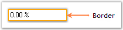{border="0"}

[]{style="COLOR: black"} 

Figure 496: PercentTextBox with Border Set

[]{style="COLOR: black"} 

A Sample which demonstrates the Border Settings of PercentTextBox control is available in the below sample installation path.[]{style="COLOR: black"}

[]{style="COLOR: black"} 

..My Documents\\Syncfusion\\EssentialStudio\\***Version Number***\\Windows\\Tools.Windows\\Samples\\2.0\\Editors Package\\EditorControls[]{style="COLOR: black"}

 

###### 3.3.8.5.3.8 [[Size Settings]{style="COLOR: windowtext; TEXT-DECORATION: none; text-underline: none"}](http://help.syncfusion.com/ug_82/WindowsFormsUI_Tools/SizeSettings.html) {#size-settings style="tab-stops: 0pt"}

The size of the PercentTextBox control can be set according to the needs of the user using the properties discussed below.[]{style="COLOR: black"}

[]{style="COLOR: black"} 

::: {align="center"}
  --------------------------------------------------- -----------------------------------------------------------------------
  PercentTextBox Properties[]{style="COLOR: black"}   Description[]{style="COLOR: black"}
  MaximumSize[]{style="COLOR: black"}                 Gets / sets the maximum size for the control.[]{style="COLOR: black"}
  MinimumSize[]{style="COLOR: black"}                 Gets / sets the minimum size for the control.[]{style="COLOR: black"}
  --------------------------------------------------- -----------------------------------------------------------------------
:::

[]{style="COLOR: black"} 

+-------------------------------------------------------------------------------------------------------------------------------------------------------------------------------------------------------------------------------------------------------------------------------------------------------------------------------------------------------------------------------------------------------------------+
| **[\[C#\]]{style="FONT-FAMILY: 'Courier New'; COLOR: black"}**[]{style="COLOR: black"}                                                                                                                                                                                                                                                                                                                            |
|                                                                                                                                                                                                                                                                                                                                                                                                                   |
| []{style="COLOR: black"}                                                                                                                                                                                                                                                                                                                                                                                          |
|                                                                                                                                                                                                                                                                                                                                                                                                                   |
| [this]{style="FONT-FAMILY: 'Courier New'; COLOR: blue"}[.percentTextBox1.MaximumSize = ]{style="FONT-FAMILY: 'Courier New'; COLOR: black"}[new]{style="FONT-FAMILY: 'Courier New'; COLOR: blue"}[ System.Drawing.]{style="FONT-FAMILY: 'Courier New'; COLOR: black"}[Size]{style="FONT-FAMILY: 'Courier New'; COLOR: teal"}[(100, 25);]{style="FONT-FAMILY: 'Courier New'; COLOR: black"}[]{style="COLOR: black"} |
|                                                                                                                                                                                                                                                                                                                                                                                                                   |
| [this]{style="FONT-FAMILY: 'Courier New'; COLOR: blue"}[.percentTextBox1.MinimumSize = ]{style="FONT-FAMILY: 'Courier New'; COLOR: black"}[new]{style="FONT-FAMILY: 'Courier New'; COLOR: blue"}[ System.Drawing.]{style="FONT-FAMILY: 'Courier New'; COLOR: black"}[Size]{style="FONT-FAMILY: 'Courier New'; COLOR: teal"}[(100, 25);]{style="FONT-FAMILY: 'Courier New'; COLOR: black"}[]{style="COLOR: black"} |
+-------------------------------------------------------------------------------------------------------------------------------------------------------------------------------------------------------------------------------------------------------------------------------------------------------------------------------------------------------------------------------------------------------------------+

[]{style="COLOR: black"} 

+---------------------------------------------------------------------------------------------------------------------------------------------------------------------------------------------------------------------------------------------------------------------------------------------------------+
| **[\[VB.NET\]]{style="FONT-FAMILY: 'Courier New'; COLOR: black"}**[]{style="COLOR: black"}                                                                                                                                                                                                              |
|                                                                                                                                                                                                                                                                                                         |
| []{style="COLOR: black"}                                                                                                                                                                                                                                                                                |
|                                                                                                                                                                                                                                                                                                         |
| [Me]{style="FONT-FAMILY: 'Courier New'; COLOR: blue"}[.percentTextBox1.MaximumSize = ]{style="FONT-FAMILY: 'Courier New'; COLOR: black"}[New]{style="FONT-FAMILY: 'Courier New'; COLOR: blue"}[ System.Drawing.Size(100, 25)]{style="FONT-FAMILY: 'Courier New'; COLOR: black"}[]{style="COLOR: black"} |
|                                                                                                                                                                                                                                                                                                         |
| [Me]{style="FONT-FAMILY: 'Courier New'; COLOR: blue"}[.percentTextBox1.MinimumSize = ]{style="FONT-FAMILY: 'Courier New'; COLOR: black"}[New]{style="FONT-FAMILY: 'Courier New'; COLOR: blue"}[ System.Drawing.Size(100, 25)]{style="FONT-FAMILY: 'Courier New'; COLOR: black"}[]{style="COLOR: black"} |
+---------------------------------------------------------------------------------------------------------------------------------------------------------------------------------------------------------------------------------------------------------------------------------------------------------+

[]{style="COLOR: black"} 

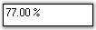{border="0"}

[]{style="COLOR: black"} 

Figure 497: Size of the PercentTextBox control Set[]{style="COLOR: black"}

 

###### 3.3.8.5.3.9 [[Key Settings]{style="COLOR: windowtext; TEXT-DECORATION: none; text-underline: none"}](http://help.syncfusion.com/ug_82/WindowsFormsUI_Tools/KeySettings1.html) {#key-settings style="tab-stops: 0pt"}

Sometimes there may occur some situations for entering large values, like in Mega, Kilo etc. In such situations if we add some sort of keyboard support, it will be very much useful for the users.[]{style="COLOR: black"}

[]{style="COLOR: black"} 

For example if the user wants to enter 32000, he just needs to enter 32 and then press the \'K\'. The value will change to 32000 automatically. This is illustrated in the code snippet given below.[]{style="COLOR: black"}

[]{style="COLOR: black"} 

+-----------------------------------------------------------------------------------------------------------------------------------------------------------------------------------------------------------------------------------------------------------------------------------------------------------+
| **[\[C#\]]{style="FONT-FAMILY: 'Courier New'; COLOR: black"}**[]{style="COLOR: black"}                                                                                                                                                                                                                    |
|                                                                                                                                                                                                                                                                                                           |
| []{style="COLOR: black"}                                                                                                                                                                                                                                                                                  |
|                                                                                                                                                                                                                                                                                                           |
| [private void]{style="FONT-FAMILY: 'Courier New'; COLOR: blue"}[ percentTextBox1_KeyDown(]{style="FONT-FAMILY: 'Courier New'; COLOR: black"}[object]{style="FONT-FAMILY: 'Courier New'; COLOR: blue"}[ sender, KeyEventArgs e)]{style="FONT-FAMILY: 'Courier New'; COLOR: black"}[]{style="COLOR: black"} |
|                                                                                                                                                                                                                                                                                                           |
| [{]{style="FONT-FAMILY: 'Courier New'; COLOR: black"}[]{style="COLOR: black"}                                                                                                                                                                                                                             |
|                                                                                                                                                                                                                                                                                                           |
| [double]{style="FONT-FAMILY: 'Courier New'; COLOR: blue"}[ v = percentTextBox1.PercentValue;]{style="FONT-FAMILY: 'Courier New'; COLOR: black"}[]{style="COLOR: black"}                                                                                                                                   |
|                                                                                                                                                                                                                                                                                                           |
| [switch]{style="FONT-FAMILY: 'Courier New'; COLOR: blue"}[(e.KeyCode)]{style="FONT-FAMILY: 'Courier New'; COLOR: black"}[]{style="COLOR: black"}                                                                                                                                                          |
|                                                                                                                                                                                                                                                                                                           |
| [{]{style="FONT-FAMILY: 'Courier New'; COLOR: black"}[]{style="COLOR: black"}                                                                                                                                                                                                                             |
|                                                                                                                                                                                                                                                                                                           |
| [// Enter the value as multiples of thousand.]{style="FONT-FAMILY: 'Courier New'; COLOR: green"}[]{style="COLOR: black"}                                                                                                                                                                                  |
|                                                                                                                                                                                                                                                                                                           |
| [case]{style="FONT-FAMILY: 'Courier New'; COLOR: blue"}[ Keys.G : v = v \* 1000000000;]{style="FONT-FAMILY: 'Courier New'; COLOR: black"}[]{style="COLOR: black"}                                                                                                                                         |
|                                                                                                                                                                                                                                                                                                           |
| [break]{style="FONT-FAMILY: 'Courier New'; COLOR: blue"}[;]{style="FONT-FAMILY: 'Courier New'; COLOR: black"}[]{style="COLOR: black"}                                                                                                                                                                     |
|                                                                                                                                                                                                                                                                                                           |
| [case]{style="FONT-FAMILY: 'Courier New'; COLOR: blue"}[ Keys.M : v = v \* 1000000;]{style="FONT-FAMILY: 'Courier New'; COLOR: black"}[]{style="COLOR: black"}                                                                                                                                            |
|                                                                                                                                                                                                                                                                                                           |
| [break]{style="FONT-FAMILY: 'Courier New'; COLOR: blue"}[;]{style="FONT-FAMILY: 'Courier New'; COLOR: black"}[]{style="COLOR: black"}                                                                                                                                                                     |
|                                                                                                                                                                                                                                                                                                           |
| [case]{style="FONT-FAMILY: 'Courier New'; COLOR: blue"}[ Keys.K : v = v \* 1000;]{style="FONT-FAMILY: 'Courier New'; COLOR: black"}[]{style="COLOR: black"}                                                                                                                                               |
|                                                                                                                                                                                                                                                                                                           |
| [break]{style="FONT-FAMILY: 'Courier New'; COLOR: blue"}[;]{style="FONT-FAMILY: 'Courier New'; COLOR: black"}[]{style="COLOR: black"}                                                                                                                                                                     |
|                                                                                                                                                                                                                                                                                                           |
| [}]{style="FONT-FAMILY: 'Courier New'; COLOR: black"}[]{style="COLOR: black"}                                                                                                                                                                                                                             |
|                                                                                                                                                                                                                                                                                                           |
| [percentTextBox.PercentValue = v;]{style="FONT-FAMILY: 'Courier New'; COLOR: black"}[]{style="COLOR: black"}                                                                                                                                                                                              |
|                                                                                                                                                                                                                                                                                                           |
| [}]{style="FONT-FAMILY: 'Courier New'; COLOR: black"}[]{style="COLOR: black"}                                                                                                                                                                                                                             |
+-----------------------------------------------------------------------------------------------------------------------------------------------------------------------------------------------------------------------------------------------------------------------------------------------------------+

[]{style="COLOR: black"} 

+-------------------------------------------------------------------------------------------------------------------------------------------------------------------------------------------------------------------------------------------------------------------------------------------------------------------------------------------------------------------------------------------------------------------------------------------------------------------------------------------------------------------------------------------------------------------------------------------------------------------------------------------------+
| **[\[VB.NET\]]{style="FONT-FAMILY: 'Courier New'; COLOR: black"}**[]{style="COLOR: black"}                                                                                                                                                                                                                                                                                                                                                                                                                                                                                                                                                      |
|                                                                                                                                                                                                                                                                                                                                                                                                                                                                                                                                                                                                                                                 |
| []{style="COLOR: black"}                                                                                                                                                                                                                                                                                                                                                                                                                                                                                                                                                                                                                        |
|                                                                                                                                                                                                                                                                                                                                                                                                                                                                                                                                                                                                                                                 |
| [Private Sub]{style="FONT-FAMILY: 'Courier New'; COLOR: blue"}[ percentTextBox1_KeyDown(]{style="FONT-FAMILY: 'Courier New'; COLOR: black"}[ByVal]{style="FONT-FAMILY: 'Courier New'; COLOR: blue"}[ sender ]{style="FONT-FAMILY: 'Courier New'; COLOR: black"}[As Object]{style="FONT-FAMILY: 'Courier New'; COLOR: blue"}[, ]{style="FONT-FAMILY: 'Courier New'; COLOR: black"}[ByVal]{style="FONT-FAMILY: 'Courier New'; COLOR: blue"}[ e ]{style="FONT-FAMILY: 'Courier New'; COLOR: black"}[As]{style="FONT-FAMILY: 'Courier New'; COLOR: blue"}[ KeyEventArgs)]{style="FONT-FAMILY: 'Courier New'; COLOR: black"}[]{style="COLOR: black"} |
|                                                                                                                                                                                                                                                                                                                                                                                                                                                                                                                                                                                                                                                 |
| [Dim]{style="FONT-FAMILY: 'Courier New'; COLOR: blue"}[ v ]{style="FONT-FAMILY: 'Courier New'; COLOR: black"}[As Double]{style="FONT-FAMILY: 'Courier New'; COLOR: blue"}[ = percentTextBox1.PercentValue]{style="FONT-FAMILY: 'Courier New'; COLOR: black"}[]{style="COLOR: black"}                                                                                                                                                                                                                                                                                                                                                            |
|                                                                                                                                                                                                                                                                                                                                                                                                                                                                                                                                                                                                                                                 |
| [Select]{style="FONT-FAMILY: 'Courier New'; COLOR: blue"}[ e.KeyCode]{style="FONT-FAMILY: 'Courier New'; COLOR: black"}[]{style="COLOR: black"}                                                                                                                                                                                                                                                                                                                                                                                                                                                                                                 |
|                                                                                                                                                                                                                                                                                                                                                                                                                                                                                                                                                                                                                                                 |
| [\' Enter the value as multiples of thousand.]{style="FONT-FAMILY: 'Courier New'; COLOR: green"}[]{style="COLOR: black"}                                                                                                                                                                                                                                                                                                                                                                                                                                                                                                                        |
|                                                                                                                                                                                                                                                                                                                                                                                                                                                                                                                                                                                                                                                 |
| [Case]{style="FONT-FAMILY: 'Courier New'; COLOR: blue"}[ Keys.G]{style="FONT-FAMILY: 'Courier New'; COLOR: black"}[]{style="COLOR: black"}                                                                                                                                                                                                                                                                                                                                                                                                                                                                                                      |
|                                                                                                                                                                                                                                                                                                                                                                                                                                                                                                                                                                                                                                                 |
| [v = v \* 1000000000]{style="FONT-FAMILY: 'Courier New'; COLOR: black"}[]{style="COLOR: black"}                                                                                                                                                                                                                                                                                                                                                                                                                                                                                                                                                 |
|                                                                                                                                                                                                                                                                                                                                                                                                                                                                                                                                                                                                                                                 |
| [Case]{style="FONT-FAMILY: 'Courier New'; COLOR: blue"}[ Keys.M]{style="FONT-FAMILY: 'Courier New'; COLOR: black"}[]{style="COLOR: black"}                                                                                                                                                                                                                                                                                                                                                                                                                                                                                                      |
|                                                                                                                                                                                                                                                                                                                                                                                                                                                                                                                                                                                                                                                 |
| [v = v \* 1000000]{style="FONT-FAMILY: 'Courier New'; COLOR: black"}[]{style="COLOR: black"}                                                                                                                                                                                                                                                                                                                                                                                                                                                                                                                                                    |
|                                                                                                                                                                                                                                                                                                                                                                                                                                                                                                                                                                                                                                                 |
| [Case]{style="FONT-FAMILY: 'Courier New'; COLOR: blue"}[ Keys.K]{style="FONT-FAMILY: 'Courier New'; COLOR: black"}[]{style="COLOR: black"}                                                                                                                                                                                                                                                                                                                                                                                                                                                                                                      |
|                                                                                                                                                                                                                                                                                                                                                                                                                                                                                                                                                                                                                                                 |
| [v = v \* 1000]{style="FONT-FAMILY: 'Courier New'; COLOR: black"}[]{style="COLOR: black"}                                                                                                                                                                                                                                                                                                                                                                                                                                                                                                                                                       |
|                                                                                                                                                                                                                                                                                                                                                                                                                                                                                                                                                                                                                                                 |
| [End Select]{style="FONT-FAMILY: 'Courier New'; COLOR: blue"}[]{style="COLOR: black"}                                                                                                                                                                                                                                                                                                                                                                                                                                                                                                                                                           |
|                                                                                                                                                                                                                                                                                                                                                                                                                                                                                                                                                                                                                                                 |
| [percentTextBox.PercentValue = v]{style="FONT-FAMILY: 'Courier New'; COLOR: black"}[]{style="COLOR: black"}                                                                                                                                                                                                                                                                                                                                                                                                                                                                                                                                     |
|                                                                                                                                                                                                                                                                                                                                                                                                                                                                                                                                                                                                                                                 |
| [End Sub]{style="FONT-FAMILY: 'Courier New'; COLOR: blue"}[]{style="COLOR: black"}                                                                                                                                                                                                                                                                                                                                                                                                                                                                                                                                                              |
+-------------------------------------------------------------------------------------------------------------------------------------------------------------------------------------------------------------------------------------------------------------------------------------------------------------------------------------------------------------------------------------------------------------------------------------------------------------------------------------------------------------------------------------------------------------------------------------------------------------------------------------------------+

 

3.3.8.5.3.9.1      [[Shortcut Keys]{style="COLOR: windowtext; TEXT-DECORATION: none; text-underline: none"}](http://help.syncfusion.com/ug_82/WindowsFormsUI_Tools/ShortcutKeys1.html)

Sometimes there may occur some situations for incrementing or decrementing the value in the PercentTextBox. In such situations it is better to use shortcut keys.[]{style="COLOR: black"}

[]{style="COLOR: black"} 

The following implementation will illustrate how this can be achieved. Here we are using **Up** and **Down** keys for incrementing and decrementing respectively. We cannot use the \'-\' key because it is already reserved to enter the minus sign.[]{style="COLOR: black"}

[]{style="COLOR: black"} 

+-----------------------------------------------------------------------------------------------------------------------------------------------------------------------------------------------------------------------------------------------------------------------------------------------------------+
| **[\[C#\]]{style="FONT-FAMILY: 'Courier New'; COLOR: black"}**[]{style="COLOR: black"}                                                                                                                                                                                                                    |
|                                                                                                                                                                                                                                                                                                           |
| []{style="COLOR: black"}                                                                                                                                                                                                                                                                                  |
|                                                                                                                                                                                                                                                                                                           |
| [private void]{style="FONT-FAMILY: 'Courier New'; COLOR: blue"}[ percentTextBox1_KeyDown(]{style="FONT-FAMILY: 'Courier New'; COLOR: black"}[object]{style="FONT-FAMILY: 'Courier New'; COLOR: blue"}[ sender, KeyEventArgs e)]{style="FONT-FAMILY: 'Courier New'; COLOR: black"}[]{style="COLOR: black"} |
|                                                                                                                                                                                                                                                                                                           |
| [{]{style="FONT-FAMILY: 'Courier New'; COLOR: black"}[]{style="COLOR: black"}                                                                                                                                                                                                                             |
|                                                                                                                                                                                                                                                                                                           |
| [// Increments the PercentTextBoxValue.]{style="FONT-FAMILY: 'Courier New'; COLOR: green"}[]{style="COLOR: black"}                                                                                                                                                                                        |
|                                                                                                                                                                                                                                                                                                           |
| [double]{style="FONT-FAMILY: 'Courier New'; COLOR: blue"}[ v = percentTextBox1.PercentValue;]{style="FONT-FAMILY: 'Courier New'; COLOR: black"}[]{style="COLOR: black"}                                                                                                                                   |
|                                                                                                                                                                                                                                                                                                           |
| [switch]{style="FONT-FAMILY: 'Courier New'; COLOR: blue"}[(e.KeyCode)]{style="FONT-FAMILY: 'Courier New'; COLOR: black"}[]{style="COLOR: black"}                                                                                                                                                          |
|                                                                                                                                                                                                                                                                                                           |
| [{]{style="FONT-FAMILY: 'Courier New'; COLOR: black"}[]{style="COLOR: black"}                                                                                                                                                                                                                             |
|                                                                                                                                                                                                                                                                                                           |
| [case]{style="FONT-FAMILY: 'Courier New'; COLOR: blue"}[ Keys.Up : v++;]{style="FONT-FAMILY: 'Courier New'; COLOR: black"}[]{style="COLOR: black"}                                                                                                                                                        |
|                                                                                                                                                                                                                                                                                                           |
| [break]{style="FONT-FAMILY: 'Courier New'; COLOR: blue"}[;]{style="FONT-FAMILY: 'Courier New'; COLOR: black"}[//you can change by a step like v+=10;]{style="FONT-FAMILY: 'Courier New'; COLOR: green"}[]{style="COLOR: black"}                                                                           |
|                                                                                                                                                                                                                                                                                                           |
| [case]{style="FONT-FAMILY: 'Courier New'; COLOR: blue"}[ Keys.Down : v\--;]{style="FONT-FAMILY: 'Courier New'; COLOR: black"}[]{style="COLOR: black"}                                                                                                                                                     |
|                                                                                                                                                                                                                                                                                                           |
| [break]{style="FONT-FAMILY: 'Courier New'; COLOR: blue"}[;]{style="FONT-FAMILY: 'Courier New'; COLOR: black"}[]{style="COLOR: black"}                                                                                                                                                                     |
|                                                                                                                                                                                                                                                                                                           |
| [}]{style="FONT-FAMILY: 'Courier New'; COLOR: black"}[]{style="COLOR: black"}                                                                                                                                                                                                                             |
|                                                                                                                                                                                                                                                                                                           |
| [percentTextBox1.PercentValue = v;]{style="FONT-FAMILY: 'Courier New'; COLOR: black"}[]{style="COLOR: black"}                                                                                                                                                                                             |
|                                                                                                                                                                                                                                                                                                           |
| [}]{style="FONT-FAMILY: 'Courier New'; COLOR: black"}[]{style="COLOR: black"}                                                                                                                                                                                                                             |
+-----------------------------------------------------------------------------------------------------------------------------------------------------------------------------------------------------------------------------------------------------------------------------------------------------------+

[]{style="COLOR: black"} 

+-------------------------------------------------------------------------------------------------------------------------------------------------------------------------------------------------------------------------------------------------------------------------------------------------------------------------------------------------------------------------------------------------------------------------------------------------------------------------------------------------------------------------------------------------------------------------------------------------------------------------------------------------+
| **[\[VB.NET\]]{style="FONT-FAMILY: 'Courier New'; COLOR: black"}**[]{style="COLOR: black"}                                                                                                                                                                                                                                                                                                                                                                                                                                                                                                                                                      |
|                                                                                                                                                                                                                                                                                                                                                                                                                                                                                                                                                                                                                                                 |
| []{style="COLOR: black"}                                                                                                                                                                                                                                                                                                                                                                                                                                                                                                                                                                                                                        |
|                                                                                                                                                                                                                                                                                                                                                                                                                                                                                                                                                                                                                                                 |
| [Private Sub]{style="FONT-FAMILY: 'Courier New'; COLOR: blue"}[ percentTextBox1_KeyDown(]{style="FONT-FAMILY: 'Courier New'; COLOR: black"}[ByVal]{style="FONT-FAMILY: 'Courier New'; COLOR: blue"}[ sender ]{style="FONT-FAMILY: 'Courier New'; COLOR: black"}[As Object]{style="FONT-FAMILY: 'Courier New'; COLOR: blue"}[, ]{style="FONT-FAMILY: 'Courier New'; COLOR: black"}[ByVal]{style="FONT-FAMILY: 'Courier New'; COLOR: blue"}[ e ]{style="FONT-FAMILY: 'Courier New'; COLOR: black"}[As]{style="FONT-FAMILY: 'Courier New'; COLOR: blue"}[ KeyEventArgs)]{style="FONT-FAMILY: 'Courier New'; COLOR: black"}[]{style="COLOR: black"} |
|                                                                                                                                                                                                                                                                                                                                                                                                                                                                                                                                                                                                                                                 |
| [\' Increments the PercentTextBoxValue.]{style="FONT-FAMILY: 'Courier New'; COLOR: green"}[]{style="COLOR: black"}                                                                                                                                                                                                                                                                                                                                                                                                                                                                                                                              |
|                                                                                                                                                                                                                                                                                                                                                                                                                                                                                                                                                                                                                                                 |
| [Dim]{style="FONT-FAMILY: 'Courier New'; COLOR: blue"}[ v ]{style="FONT-FAMILY: 'Courier New'; COLOR: black"}[As Double]{style="FONT-FAMILY: 'Courier New'; COLOR: blue"}[ = percentTextBox1.PercentValue]{style="FONT-FAMILY: 'Courier New'; COLOR: black"}[]{style="COLOR: black"}                                                                                                                                                                                                                                                                                                                                                            |
|                                                                                                                                                                                                                                                                                                                                                                                                                                                                                                                                                                                                                                                 |
| [Select]{style="FONT-FAMILY: 'Courier New'; COLOR: blue"}[ e.KeyCode]{style="FONT-FAMILY: 'Courier New'; COLOR: black"}[]{style="COLOR: black"}                                                                                                                                                                                                                                                                                                                                                                                                                                                                                                 |
|                                                                                                                                                                                                                                                                                                                                                                                                                                                                                                                                                                                                                                                 |
| [Case]{style="FONT-FAMILY: 'Courier New'; COLOR: blue"}[ Keys.Up]{style="FONT-FAMILY: 'Courier New'; COLOR: black"}[]{style="COLOR: black"}                                                                                                                                                                                                                                                                                                                                                                                                                                                                                                     |
|                                                                                                                                                                                                                                                                                                                                                                                                                                                                                                                                                                                                                                                 |
| [v = v+1]{style="FONT-FAMILY: 'Courier New'; COLOR: black"}[]{style="COLOR: black"}                                                                                                                                                                                                                                                                                                                                                                                                                                                                                                                                                             |
|                                                                                                                                                                                                                                                                                                                                                                                                                                                                                                                                                                                                                                                 |
| [Case]{style="FONT-FAMILY: 'Courier New'; COLOR: blue"}[ Keys.Down]{style="FONT-FAMILY: 'Courier New'; COLOR: black"}[]{style="COLOR: black"}                                                                                                                                                                                                                                                                                                                                                                                                                                                                                                   |
|                                                                                                                                                                                                                                                                                                                                                                                                                                                                                                                                                                                                                                                 |
| [v = v-1]{style="FONT-FAMILY: 'Courier New'; COLOR: black"}[]{style="COLOR: black"}                                                                                                                                                                                                                                                                                                                                                                                                                                                                                                                                                             |
|                                                                                                                                                                                                                                                                                                                                                                                                                                                                                                                                                                                                                                                 |
| [End Select]{style="FONT-FAMILY: 'Courier New'; COLOR: blue"}[]{style="COLOR: black"}                                                                                                                                                                                                                                                                                                                                                                                                                                                                                                                                                           |
|                                                                                                                                                                                                                                                                                                                                                                                                                                                                                                                                                                                                                                                 |
| [percentTextBox1.PercentValue = v]{style="FONT-FAMILY: 'Courier New'; COLOR: black"}[]{style="COLOR: black"}                                                                                                                                                                                                                                                                                                                                                                                                                                                                                                                                    |
|                                                                                                                                                                                                                                                                                                                                                                                                                                                                                                                                                                                                                                                 |
| [End Sub]{style="FONT-FAMILY: 'Courier New'; COLOR: blue"}[]{style="COLOR: black"}                                                                                                                                                                                                                                                                                                                                                                                                                                                                                                                                                              |
+-------------------------------------------------------------------------------------------------------------------------------------------------------------------------------------------------------------------------------------------------------------------------------------------------------------------------------------------------------------------------------------------------------------------------------------------------------------------------------------------------------------------------------------------------------------------------------------------------------------------------------------------------+

 

###### 3.3.8.5.3.10        [[Applying Themes]{style="COLOR: windowtext; TEXT-DECORATION: none; text-underline: none"}](http://help.syncfusion.com/ug_82/WindowsFormsUI_Tools/ApplyingThemes4.html) {#applying-themes style="tab-stops: 0pt"}

Themes can be applied to the PercentTextBox control using the property given below.[]{style="COLOR: black"}

[]{style="COLOR: black"} 

::: {align="center"}
  ------------------------------------------------- ---------------------------------------------------------------------------------------------------------------------
  PercentTextBox Property[]{style="COLOR: black"}   Description[]{style="COLOR: black"}
  ThemesEnabled[]{style="COLOR: black"}             Specifies whether or not to use XP themes when BorderStyle  property is set to \'Fixed3D\'.[]{style="COLOR: black"}
  ------------------------------------------------- ---------------------------------------------------------------------------------------------------------------------
:::

[]{style="COLOR: black"} 

::: {style="BORDER-BOTTOM: windowtext 1pt solid; BORDER-LEFT: medium none; PADDING-BOTTOM: 1pt; MARGIN-TOP: 9pt; PADDING-LEFT: 0pt; PADDING-RIGHT: 0pt; MARGIN-BOTTOM: 9pt; BORDER-TOP: windowtext 1pt solid; BORDER-RIGHT: medium none; PADDING-TOP: 1pt"}
[{border="0"}]{style="COLOR: black"}[ ]{style="COLOR: #15428b"}Note: Refer [[Border Settings]{.UGHyperlink}](http://help.syncfusion.com/ug_82/WindowsFormsUI_Tools/BorderSettings13.html) topic to know about the BorderStyle property.
:::

[]{style="COLOR: black"} 

+----------------------------------------------------------------------------------------------------------------------------------------------------------------------------------------------------------------------------------------------------------------------------------+
| **[\[C#\]]{style="FONT-FAMILY: 'Courier New'; COLOR: black"}**[]{style="COLOR: black"}                                                                                                                                                                                           |
|                                                                                                                                                                                                                                                                                  |
| []{style="COLOR: black"}                                                                                                                                                                                                                                                         |
|                                                                                                                                                                                                                                                                                  |
| [this]{style="FONT-FAMILY: 'Courier New'; COLOR: blue"}[.percentTextBox1.ThemesEnabled = ]{style="FONT-FAMILY: 'Courier New'; COLOR: black"}[true]{style="FONT-FAMILY: 'Courier New'; COLOR: blue"}[;]{style="FONT-FAMILY: 'Courier New'; COLOR: black"}[]{style="COLOR: black"} |
+----------------------------------------------------------------------------------------------------------------------------------------------------------------------------------------------------------------------------------------------------------------------------------+

[]{style="COLOR: black"} 

+---------------------------------------------------------------------------------------------------------------------------------------------------------------------------------------------------------------------------+
| **[\[VB.NET\]]{style="FONT-FAMILY: 'Courier New'; COLOR: black"}**[]{style="COLOR: black"}                                                                                                                                |
|                                                                                                                                                                                                                           |
| []{style="COLOR: black"}                                                                                                                                                                                                  |
|                                                                                                                                                                                                                           |
| [Me]{style="FONT-FAMILY: 'Courier New'; COLOR: blue"}[.percentTextBox1.ThemesEnabled = ]{style="FONT-FAMILY: 'Courier New'; COLOR: black"}[true]{style="FONT-FAMILY: 'Courier New'; COLOR: blue"}[]{style="COLOR: black"} |
+---------------------------------------------------------------------------------------------------------------------------------------------------------------------------------------------------------------------------+

[]{style="COLOR: black"} 

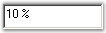{border="0"}

[]{style="COLOR: black"} 

Figure 498: Themes Applied to PercentTextBox Control[]{style="COLOR: black"}

[]{style="COLOR: black"} 

A Sample which demonstrates the ThemesEnabled property of the PercentTextBox control is available in the below sample installation path.[]{style="COLOR: black"}

[]{style="COLOR: black"} 

..My Documents\\Syncfusion\\EssentialStudio\\***Version Number***\\Windows\\Tools.Windows\\Samples\\2.0\\Editors Package\\EditorControls[]{style="COLOR: black"}

 

 

[]{#related-topics}
:::::::::::::::::::::::::::::
