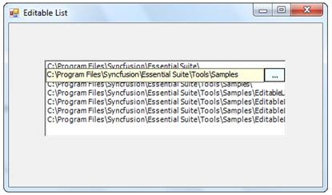
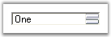
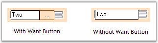
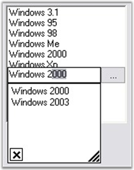

::: {style="DISPLAY: none"}
{#d2h_url_template}{#d2h_package_url style="WIDTH: 0px; DISPLAY: none; HEIGHT: 0px"}
:::

::::::: {.d2h_secondary_topic style="PADDING-BOTTOM: 10pt; MARGIN: 0pt; PADDING-LEFT: 0pt; PADDING-RIGHT: 0pt; PADDING-TOP: 0pt"}
##### Concepts and Features {#concepts-and-features style="tab-stops: 0pt"}

###### 3.3.8.7.3.1 [[Populating and Editing the List]{style="COLOR: windowtext; TEXT-DECORATION: none; text-underline: none"}](http://help.syncfusion.com/ug_82/WindowsFormsUI_Tools/PopulatingAndEditingTheList.html) {#populating-and-editing-the-list style="tab-stops: 0pt"}

Populate the list[]{style="COLOR: black"}

[]{style="COLOR: black"} 

The List can be populated in 2 ways. One is to specify the DataSource and another is to edit the list manually in the property editor.[]{style="COLOR: black"}

[]{style="COLOR: black"} 

To populate through DataSource.[]{style="COLOR: black"}

[]{style="COLOR: black"} 

+------------------------------------------------------------------------------------------------------------------------------+
| **[\[C#\]]{style="FONT-FAMILY: 'Courier New'; COLOR: black"}**[]{style="COLOR: black"}                                       |
|                                                                                                                              |
| []{style="COLOR: black"}                                                                                                     |
|                                                                                                                              |
| [// Specifies the DataSource.]{style="FONT-FAMILY: 'Courier New'; COLOR: green"}[]{style="COLOR: black"}                     |
|                                                                                                                              |
| [editableList1.ListBox.DataSource=\<DataSource\>;]{style="FONT-FAMILY: 'Courier New'; COLOR: black"}[]{style="COLOR: black"} |
+------------------------------------------------------------------------------------------------------------------------------+

[]{style="COLOR: black"} 

+-----------------------------------------------------------------------------------------------------------------------------+
| **[\[VB.NET\]]{style="FONT-FAMILY: 'Courier New'; COLOR: black"}**[]{style="COLOR: black"}                                  |
|                                                                                                                             |
| []{style="COLOR: black"}                                                                                                    |
|                                                                                                                             |
| [\' Specifies the DataSource.]{style="FONT-FAMILY: 'Courier New'; COLOR: green"}[]{style="COLOR: black"}                    |
|                                                                                                                             |
| [editableList1.ListBox.DataSource=\<DataSource\>]{style="FONT-FAMILY: 'Courier New'; COLOR: black"}[]{style="COLOR: black"} |
+-----------------------------------------------------------------------------------------------------------------------------+

[]{style="COLOR: black"} 

Otherwise go to the property editor, expand the **ListBox** property of the EditableList and then select **Items**. This Items property is editable like any other Items property.[]{style="COLOR: black"}

[]{style="COLOR: black"} 

Editing the list[]{style="COLOR: black"}

[]{style="COLOR: black"} 

The List can be edited in the following way during runtime:[]{style="COLOR: black"}

[]{style="COLOR: black"} 

1.   Select the Item you want to edit by clicking or by using keyboard.[]{style="COLOR: black"}

[]{style="COLOR: black"} 

2.   Click again. There appears a TextBox. Now edit the text.[]{style="COLOR: black"}

[]{style="COLOR: black"} 

3.   After editing change the focus, the list will get updated.[]{style="COLOR: black"}

[]{style="COLOR: black"} 

{border="0"}[]{style="COLOR: black"}

 

Figure 523: Editing the List

 

###### 3.3.8.7.3.2 [[Appearance and Behavior Settings]{style="COLOR: windowtext; TEXT-DECORATION: none; text-underline: none"}](http://help.syncfusion.com/ug_82/WindowsFormsUI_Tools/AppearanceAndBehaviorSettings16.html) {#appearance-and-behavior-settings style="tab-stops: 0pt"}

This section discusses the complete Appearance and behavior settings of EditableList control.[]{style="COLOR: black"}

[]{style="COLOR: black"} 

Embedded controls[]{style="COLOR: black"}

[]{style="COLOR: black"} 

EditableList control contains embedded controls such as Button, TextBox and ListBox.[]{style="COLOR: black"}

[]{style="COLOR: black"} 

::: {align="center"}
  --------------------------------------------------------- -------------------------------------------------------------------------------------------------------------------------------------------------------------------
  EditableList  Embedded controls[]{style="COLOR: black"}   Description[]{style="COLOR: black"}
  Button[]{style="COLOR: black"}                            It includes the properties and events present in the windows Button.[]{style="COLOR: black"}
  TextBox[]{style="COLOR: black"}                           It includes the properties and events present in the windows TextBox.[]{style="COLOR: black"}
  ListBox[]{style="COLOR: black"}                           The listbox property of editable list, expands and allows the user to set various appearance and behavior properties of the EditableList.[]{style="COLOR: black"}
  --------------------------------------------------------- -------------------------------------------------------------------------------------------------------------------------------------------------------------------
:::

[]{style="COLOR: black"} 

Auto Scrolling[]{style="COLOR: black"}

[]{style="COLOR: black"} 

You can enable scrollbars automatically for the EditableList control when its items are shown beyond its size by setting **AutoScroll** to true. When AutoScroll is enabled for the control, you can set the margin and logical size for the autoscroll region by **AutoScrollMargin** and **AutoScrollMinSize **properties.[]{style="COLOR: black"}

[]{style="COLOR: black"} 

::: {align="center"}
  -------------------------------------------------- -------------------------------------------------------------------------------------------------------------------------------------------
  EditableList  Properties[]{style="COLOR: black"}   Description[]{style="COLOR: black"}
  AutoScroll[]{style="COLOR: black"}                 It indicates whether Scrollbars will automatically appear if controls are placed outside the form\'s client area.[]{style="COLOR: black"}
  AutoScrollMargin[]{style="COLOR: black"}           It sets margin around the controls during AutoScroll.[]{style="COLOR: black"}
  AutoScrollMinSize[]{style="COLOR: black"}          It sets the minimum logical size for the AutoScroll region.[]{style="COLOR: black"}
  -------------------------------------------------- -------------------------------------------------------------------------------------------------------------------------------------------
:::

[]{style="COLOR: black"} 

+-------------------------------------------------------------------------------------------------------------------------------------------------------------------------------------------------------------------------------------------------------------------------------------------------------------+
| **[\[C#\]]{style="FONT-FAMILY: 'Courier New'; COLOR: black"}**[]{style="COLOR: black"}                                                                                                                                                                                                                      |
|                                                                                                                                                                                                                                                                                                             |
| []{style="COLOR: black"}                                                                                                                                                                                                                                                                                    |
|                                                                                                                                                                                                                                                                                                             |
| [this]{style="FONT-FAMILY: 'Courier New'; COLOR: blue"}[.editableList1.AutoScroll = ]{style="FONT-FAMILY: 'Courier New'; COLOR: black"}[true]{style="FONT-FAMILY: 'Courier New'; COLOR: blue"}[;]{style="FONT-FAMILY: 'Courier New'; COLOR: black"}[]{style="COLOR: black"}                                 |
|                                                                                                                                                                                                                                                                                                             |
| [this]{style="FONT-FAMILY: 'Courier New'; COLOR: blue"}[.editableList1.AutoScrollMargin = ]{style="FONT-FAMILY: 'Courier New'; COLOR: black"}[new]{style="FONT-FAMILY: 'Courier New'; COLOR: blue"}[ System.Drawing.Size(2, 2);]{style="FONT-FAMILY: 'Courier New'; COLOR: black"}[]{style="COLOR: black"}  |
|                                                                                                                                                                                                                                                                                                             |
| [this]{style="FONT-FAMILY: 'Courier New'; COLOR: blue"}[.editableList1.AutoScrollMinSize = ]{style="FONT-FAMILY: 'Courier New'; COLOR: black"}[new]{style="FONT-FAMILY: 'Courier New'; COLOR: blue"}[ System.Drawing.Size(3, 3);]{style="FONT-FAMILY: 'Courier New'; COLOR: black"}[]{style="COLOR: black"} |
+-------------------------------------------------------------------------------------------------------------------------------------------------------------------------------------------------------------------------------------------------------------------------------------------------------------+

[]{style="COLOR: black"} 

+----------------------------------------------------------------------------------------------------------------------------------------------------------------------------------------------------------------------------------------------------------------------------------------------------------+
| **[\[VB.NET\]]{style="FONT-FAMILY: 'Courier New'; COLOR: black"}**[]{style="COLOR: black"}                                                                                                                                                                                                               |
|                                                                                                                                                                                                                                                                                                          |
| []{style="COLOR: black"}                                                                                                                                                                                                                                                                                 |
|                                                                                                                                                                                                                                                                                                          |
| [Me]{style="FONT-FAMILY: 'Courier New'; COLOR: blue"}[.editableList1.AutoScroll = ]{style="FONT-FAMILY: 'Courier New'; COLOR: black"}[True]{style="FONT-FAMILY: 'Courier New'; COLOR: blue"}[]{style="COLOR: black"}                                                                                     |
|                                                                                                                                                                                                                                                                                                          |
| [Me]{style="FONT-FAMILY: 'Courier New'; COLOR: blue"}[.editableList1.AutoScrollMargin = ]{style="FONT-FAMILY: 'Courier New'; COLOR: black"}[New]{style="FONT-FAMILY: 'Courier New'; COLOR: blue"}[ System.Drawing.Size(2, 2)]{style="FONT-FAMILY: 'Courier New'; COLOR: black"}[]{style="COLOR: black"}  |
|                                                                                                                                                                                                                                                                                                          |
| [Me]{style="FONT-FAMILY: 'Courier New'; COLOR: blue"}[.editableList1.AutoScrollMinSize = ]{style="FONT-FAMILY: 'Courier New'; COLOR: black"}[New]{style="FONT-FAMILY: 'Courier New'; COLOR: blue"}[ System.Drawing.Size(3, 3)]{style="FONT-FAMILY: 'Courier New'; COLOR: black"}[]{style="COLOR: black"} |
+----------------------------------------------------------------------------------------------------------------------------------------------------------------------------------------------------------------------------------------------------------------------------------------------------------+

[]{style="COLOR: black"} 

Dock padding[]{style="COLOR: black"}

[]{style="COLOR: black"} 

Dock padding determines the size of the border for the docked controls.[]{style="COLOR: black"}

[]{style="COLOR: black"} 

::: {align="center"}
  ------------------------------------------------ -----------------------------------------------------------------------------
  EditableList  Property[]{style="COLOR: black"}   Description[]{style="COLOR: black"}
  DockPadding[]{style="COLOR: black"}              Gets the dock padding for all edges of the control.[]{style="COLOR: black"}
  ------------------------------------------------ -----------------------------------------------------------------------------
:::

[]{style="COLOR: black"} 

The following image displays the EditableList control with the dock padding for all the edges set to 5.[]{style="COLOR: black"}

[]{style="COLOR: black"} 

{border="0"}

[]{style="COLOR: black"} 

Figure 524: DockPadding.All set to 5

[]{style="COLOR: black"} 

+------------------------------------------------------------------------------------------------------------------------------------------------------------------------+
| **[\[C#\]]{style="FONT-FAMILY: 'Courier New'; COLOR: black"}**[]{style="COLOR: black"}                                                                                 |
|                                                                                                                                                                        |
| []{style="COLOR: black"}                                                                                                                                               |
|                                                                                                                                                                        |
| [this]{style="FONT-FAMILY: 'Courier New'; COLOR: blue"}[.editableList1.DockPadding.All = 5;]{style="FONT-FAMILY: 'Courier New'; COLOR: black"}[]{style="COLOR: black"} |
+------------------------------------------------------------------------------------------------------------------------------------------------------------------------+

[]{style="COLOR: black"} 

+---------------------------------------------------------------------------------------------------------------------------------------------------------------------+
| **[\[VB.NET\]]{style="FONT-FAMILY: 'Courier New'; COLOR: black"}**[]{style="COLOR: black"}                                                                          |
|                                                                                                                                                                     |
| []{style="COLOR: black"}                                                                                                                                            |
|                                                                                                                                                                     |
| [Me]{style="FONT-FAMILY: 'Courier New'; COLOR: blue"}[.editableList1.DockPadding.All = 5]{style="FONT-FAMILY: 'Courier New'; COLOR: black"}[]{style="COLOR: black"} |
+---------------------------------------------------------------------------------------------------------------------------------------------------------------------+

[]{style="COLOR: black"} 

Want Button[]{style="COLOR: black"}

[]{style="COLOR: black"} 

You can display the button to the right while editing the items in the EditableList control by setting **WantButton** to true.[]{style="COLOR: black"}

[]{style="COLOR: black"} 

::: {align="center"}
  ------------------------------------------------ --------------------------------------------------------------------------------------
  EditableList  Property[]{style="COLOR: black"}   Description[]{style="COLOR: black"}
  WantButton[]{style="COLOR: black"}               Specifies whether to show button to the right while editing.[]{style="COLOR: black"}
  ------------------------------------------------ --------------------------------------------------------------------------------------
:::

[]{style="COLOR: black"} 

{border="0"}

Figure 525: Want Button

[]{style="COLOR: black"} 

+-----------------------------------------------------------------------------------------------------------------------------------------------------------------------------------------------------------------------------------------------------------------------------+
| **[\[C#\]]{style="FONT-FAMILY: 'Courier New'; COLOR: black"}**[]{style="COLOR: black"}                                                                                                                                                                                      |
|                                                                                                                                                                                                                                                                             |
| []{style="COLOR: black"}                                                                                                                                                                                                                                                    |
|                                                                                                                                                                                                                                                                             |
| [this]{style="FONT-FAMILY: 'Courier New'; COLOR: blue"}[.editableList1.WantButton = ]{style="FONT-FAMILY: 'Courier New'; COLOR: black"}[true]{style="FONT-FAMILY: 'Courier New'; COLOR: blue"}[;]{style="FONT-FAMILY: 'Courier New'; COLOR: black"}[]{style="COLOR: black"} |
+-----------------------------------------------------------------------------------------------------------------------------------------------------------------------------------------------------------------------------------------------------------------------------+

[]{style="COLOR: black"} 

+-----------------------------------------------------------------------------------------------------------------------------------------------------------------------------------------------------------------------+
| **[\[VB.NET\]]{style="FONT-FAMILY: 'Courier New'; COLOR: black"}**[]{style="COLOR: black"}                                                                                                                            |
|                                                                                                                                                                                                                       |
| []{style="COLOR: black"}                                                                                                                                                                                              |
|                                                                                                                                                                                                                       |
| [Me]{style="FONT-FAMILY: 'Courier New'; COLOR: blue"}[.editableList1..WantButton = ]{style="FONT-FAMILY: 'Courier New'; COLOR: black"}[True]{style="FONT-FAMILY: 'Courier New'; COLOR: blue"}[]{style="COLOR: black"} |
+-----------------------------------------------------------------------------------------------------------------------------------------------------------------------------------------------------------------------+

 

###### 3.3.8.7.3.3 [[Enabling AutoComplete in TextBoxArea]{style="COLOR: windowtext; TEXT-DECORATION: none; text-underline: none"}](http://help.syncfusion.com/ug_82/WindowsFormsUI_Tools/EnablingAutoCompleteInTextBoxArea.html) {#enabling-autocomplete-in-textboxarea style="tab-stops: 0pt"}

We can associate an AutoComplete with the editing TextBox of the EditableList. The following steps help to achieve this.[]{style="COLOR: black"}

[]{style="COLOR: black"} 

1.   Create an instance of the AutoComplete.[]{style="COLOR: black"}

[]{style="COLOR: black"} 

2.   In the Form load event, place this code.[]{style="COLOR: black"}

[]{style="COLOR: black"} 

+------------------------------------------------------------------------------------------------------------------------------------------------------------------------------------------------------------------------------------------------------------------------------------------+
| **[\[C#\]]{style="FONT-FAMILY: 'Courier New'; COLOR: black"}**[]{style="COLOR: black"}                                                                                                                                                                                                   |
|                                                                                                                                                                                                                                                                                          |
| []{style="COLOR: black"}                                                                                                                                                                                                                                                                 |
|                                                                                                                                                                                                                                                                                          |
| [private void]{style="FONT-FAMILY: 'Courier New'; COLOR: blue"}[ form1_Load(]{style="FONT-FAMILY: 'Courier New'; COLOR: black"}[object]{style="FONT-FAMILY: 'Courier New'; COLOR: blue"}[ sender,EventArgs e)]{style="FONT-FAMILY: 'Courier New'; COLOR: black"}[]{style="COLOR: black"} |
|                                                                                                                                                                                                                                                                                          |
| [{]{style="FONT-FAMILY: 'Courier New'; COLOR: black"}[]{style="COLOR: black"}                                                                                                                                                                                                            |
|                                                                                                                                                                                                                                                                                          |
| [  ]{style="FONT-FAMILY: 'Courier New'; COLOR: black"}[// Sets the AutoComplete.]{style="FONT-FAMILY: 'Courier New'; COLOR: green"}[]{style="COLOR: black"}                                                                                                                              |
|                                                                                                                                                                                                                                                                                          |
| [autoComplete1.DataSource=editableList1.ListBox.Items;]{style="FONT-FAMILY: 'Courier New'; COLOR: black"}[]{style="COLOR: black"}                                                                                                                                                        |
|                                                                                                                                                                                                                                                                                          |
| [autoComplete1.SetAutoComplete(editableList1.TextBox,AutoCompleteModes.Both);]{style="FONT-FAMILY: 'Courier New'; COLOR: black"}[]{style="COLOR: black"}                                                                                                                                 |
|                                                                                                                                                                                                                                                                                          |
| [}]{style="FONT-FAMILY: 'Courier New'; COLOR: black"}[]{style="COLOR: black"}                                                                                                                                                                                                            |
+------------------------------------------------------------------------------------------------------------------------------------------------------------------------------------------------------------------------------------------------------------------------------------------+

[]{style="COLOR: black"} 

+----------------------------------------------------------------------------------------------------------------------------------------------------------------------------------------------------------------------------------------------------------------------------------------------------------------------------------------------------------------------------------------------------------------------------------------------------------------------------------------------------------------------------------------------------------------------------------------------------------------------------------+
| **[\[VB.NET\]]{style="FONT-FAMILY: 'Courier New'; COLOR: black"}**[]{style="COLOR: black"}                                                                                                                                                                                                                                                                                                                                                                                                                                                                                                                                       |
|                                                                                                                                                                                                                                                                                                                                                                                                                                                                                                                                                                                                                                  |
| []{style="COLOR: black"}                                                                                                                                                                                                                                                                                                                                                                                                                                                                                                                                                                                                         |
|                                                                                                                                                                                                                                                                                                                                                                                                                                                                                                                                                                                                                                  |
| [Private  Sub]{style="FONT-FAMILY: 'Courier New'; COLOR: blue"}[ form1_Load(]{style="FONT-FAMILY: 'Courier New'; COLOR: black"}[ByVal]{style="FONT-FAMILY: 'Courier New'; COLOR: blue"}[ sender ]{style="FONT-FAMILY: 'Courier New'; COLOR: black"}[As Object]{style="FONT-FAMILY: 'Courier New'; COLOR: blue"}[, ]{style="FONT-FAMILY: 'Courier New'; COLOR: black"}[ByVal]{style="FONT-FAMILY: 'Courier New'; COLOR: blue"}[ e ]{style="FONT-FAMILY: 'Courier New'; COLOR: black"}[As]{style="FONT-FAMILY: 'Courier New'; COLOR: blue"}[ EventArgs)]{style="FONT-FAMILY: 'Courier New'; COLOR: black"}[]{style="COLOR: black"} |
|                                                                                                                                                                                                                                                                                                                                                                                                                                                                                                                                                                                                                                  |
| [  \' Sets the AutoComplete.]{style="FONT-FAMILY: 'Courier New'; COLOR: green"}[]{style="COLOR: black"}                                                                                                                                                                                                                                                                                                                                                                                                                                                                                                                          |
|                                                                                                                                                                                                                                                                                                                                                                                                                                                                                                                                                                                                                                  |
| [autoComplete1.DataDource=editableList1.ListBox.Items]{style="FONT-FAMILY: 'Courier New'; COLOR: black"}[]{style="COLOR: black"}                                                                                                                                                                                                                                                                                                                                                                                                                                                                                                 |
|                                                                                                                                                                                                                                                                                                                                                                                                                                                                                                                                                                                                                                  |
| [autoComplete1.SetAutoComplete(editableList1.TextBox,AutoCompleteModes.Both)]{style="FONT-FAMILY: 'Courier New'; COLOR: black"}[]{style="COLOR: black"}                                                                                                                                                                                                                                                                                                                                                                                                                                                                          |
|                                                                                                                                                                                                                                                                                                                                                                                                                                                                                                                                                                                                                                  |
| [End Sub]{style="FONT-FAMILY: 'Courier New'; COLOR: blue"}[]{style="COLOR: black"}                                                                                                                                                                                                                                                                                                                                                                                                                                                                                                                                               |
+----------------------------------------------------------------------------------------------------------------------------------------------------------------------------------------------------------------------------------------------------------------------------------------------------------------------------------------------------------------------------------------------------------------------------------------------------------------------------------------------------------------------------------------------------------------------------------------------------------------------------------+

[]{style="COLOR: black"} 

The data source may vary according to your choice.[]{style="COLOR: black"}

[]{style="COLOR: black"} 

{border="0"}

[]{style="COLOR: black"} 

Figure 526: EditableList With AutoCompletion Capability[]{style="COLOR: black"}

 

[]{#related-topics}
:::::::
