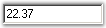
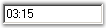
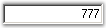
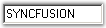
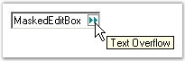
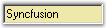
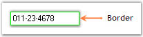
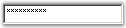
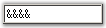

::: {style="DISPLAY: none"}
{#d2h_url_template}{#d2h_package_url style="WIDTH: 0px; DISPLAY: none; HEIGHT: 0px"}
:::

::::::::::::::::::::::::::: {.d2h_secondary_topic style="PADDING-BOTTOM: 10pt; MARGIN: 0pt; PADDING-LEFT: 0pt; PADDING-RIGHT: 0pt; PADDING-TOP: 0pt"}
##### Concepts and Features {#concepts-and-features style="tab-stops: 0pt"}

###### 3.3.8.8.3.1 [[Mask Settings]{style="COLOR: windowtext; TEXT-DECORATION: none; text-underline: none"}](http://help.syncfusion.com/ug_82/WindowsFormsUI_Tools/AppearanceAndBehaviorSettings17.html) {#mask-settings style="tab-stops: 0pt"}

This section deals with the mask settings of MaskedEditBox control.[]{style="COLOR: black"}

[]{style="COLOR: black"} 

The format / behavior for the MaskedEditBox control is defined through the property given below.[]{style="COLOR: black"}

[]{style="COLOR: black"} 

::: {align="center"}
  ------------------------------------------------ ----------------------------------------------------------------------------------
  MaskedEditBox Property[]{style="COLOR: black"}   Description[]{style="COLOR: black"}
  Mask[]{style="COLOR: black"}                     Specifies the mask string for the MaskedEditBox control.[]{style="COLOR: black"}
  ------------------------------------------------ ----------------------------------------------------------------------------------
:::

[]{style="COLOR: black"} 

The Mask is a string that is composed of literal characters and mask characters.[]{style="COLOR: black"}

[]{style="COLOR: black"} 

Literal characters give visual cues about the type of data being used. Mask characters are the placeholders for the data input. For example, a US telephone number can be represented by the following mask.[]{style="COLOR: black"}

[]{style="COLOR: black"} 

(###) - \### \#### Extn \####[]{style="COLOR: black"}

[]{style="COLOR: black"} 

In the above Mask, all the non \# characters are Literal characters and the #'s are Mask characters.[]{style="COLOR: black"}

[]{style="COLOR: black"} 

The MaskedEditBox control supports the following masks.[]{style="COLOR: black"}

[]{style="COLOR: black"} 

::: {align="center"}
  ----------------------------------------- --------------------------------------------------------------------------------------------------------------------------------------------------------------------------------------------------------------------------------------
  Mask Characters[]{style="COLOR: black"}   Description[]{style="COLOR: black"}
  \#[]{style="COLOR: black"}                Digit placeholder.[]{style="COLOR: black"}
  .[]{style="COLOR: black"}                 Decimal placeholder. The actual character used is the one specified as the decimal placeholder in your international settings. This character is treated as a literal for masking purposes.[]{style="COLOR: black"}
  ,[]{style="COLOR: black"}                 Thousands separator. The actual character used is the one specified as the thousands separator in your international settings. This character is treated as a literal for masking purposes.[]{style="COLOR: black"}
  :[]{style="COLOR: black"}                 Time separator. The actual character used is the one specified as the time separator in your international settings. This character is treated as a literal for masking purposes.[]{style="COLOR: black"}
  /[]{style="COLOR: black"}                 Date separator. The actual character used is the one specified as the date separator in your international settings. This character is treated as a literal for masking purposes.[]{style="COLOR: black"}
  \\[]{style="COLOR: black"}                Treat the next character in the mask string as a literal. This allows you to include the \"#\", \"&\", \"A\", and \"?\" characters in the mask. This character is treated as a literal for masking purposes.[]{style="COLOR: black"}
  ;[]{style="COLOR: black"}                 Character placeholder. Valid values for this placeholder are ANSI characters in the following ranges: 32-126 and 128-255.[]{style="COLOR: black"}
  \>[ ]{style="COLOR: black"}               Convert all the characters that follow to uppercase.[]{style="COLOR: black"}
  \<[ ]{style="COLOR: black"}               Convert all the characters that follow to lowercase.[]{style="COLOR: black"}
  A[]{style="COLOR: black"}                 Alphanumeric character placeholder (entry required). For example: a - z, A - Z, or 0 - 9.[]{style="COLOR: black"}
  a[]{style="COLOR: black"}                 Alphanumeric character placeholder (entry optional).[]{style="COLOR: black"}
  9[]{style="COLOR: black"}                 Digit placeholder (entry optional). For example: 0 - 9.[]{style="COLOR: black"}
  C[]{style="COLOR: black"}                 Character or space placeholder (entry optional). This operates exactly like the \"&\" placeholder and ensures compatibility with Microsoft Access.[]{style="COLOR: black"}
  ?[]{style="COLOR: black"}                 Letter placeholder. For example: a - z or A - Z.[]{style="COLOR: black"}
  Literal[]{style="COLOR: black"}           All other symbols are displayed as literals; that is, as themselves.[]{style="COLOR: black"}
  ----------------------------------------- --------------------------------------------------------------------------------------------------------------------------------------------------------------------------------------------------------------------------------------
:::

[]{style="COLOR: black"} 

+------------------------------------------------------------------------------------------------------------------------------------------------------------------------------------------------------------------------------------------------------------------------------------+
| **[\[C#\]]{style="FONT-FAMILY: 'Courier New'; COLOR: black"}**[]{style="COLOR: black"}                                                                                                                                                                                             |
|                                                                                                                                                                                                                                                                                    |
| []{style="COLOR: black"}                                                                                                                                                                                                                                                           |
|                                                                                                                                                                                                                                                                                    |
| [this]{style="FONT-FAMILY: 'Courier New'; COLOR: blue"}[.maskedEditBox1.Mask = ]{style="FONT-FAMILY: 'Courier New'; COLOR: black"}[\"##-##-####\"]{style="FONT-FAMILY: 'Courier New'; COLOR: maroon"}[;]{style="FONT-FAMILY: 'Courier New'; COLOR: black"}[]{style="COLOR: black"} |
+------------------------------------------------------------------------------------------------------------------------------------------------------------------------------------------------------------------------------------------------------------------------------------+

[]{style="COLOR: black"} 

+-----------------------------------------------------------------------------------------------------------------------------------------------------------------------------------------------------------------------------+
| **[\[VB.NET\]]{style="FONT-FAMILY: 'Courier New'; COLOR: black"}**[]{style="COLOR: black"}                                                                                                                                  |
|                                                                                                                                                                                                                             |
| []{style="COLOR: black"}                                                                                                                                                                                                    |
|                                                                                                                                                                                                                             |
| [Me]{style="FONT-FAMILY: 'Courier New'; COLOR: blue"}[.maskedEditBox1.Mask = ]{style="FONT-FAMILY: 'Courier New'; COLOR: black"}[\"##-##-####\"]{style="FONT-FAMILY: 'Courier New'; COLOR: maroon"}[]{style="COLOR: black"} |
+-----------------------------------------------------------------------------------------------------------------------------------------------------------------------------------------------------------------------------+

[]{style="COLOR: black"} 

{border="0"}

[]{style="COLOR: black"} 

Figure 531: Mask property Set

[]{style="COLOR: black"} 

A Sample which demonstrates the Mask Settings of MaskedEditBox control is available in the below sample installation path.[]{style="COLOR: black"}

[]{style="COLOR: black"} 

..My Documents\\Syncfusion\\EssentialStudio***\\Version Number***\\Windows\\Tools.Windows\\Samples\\2.0\\Editors Package\\EditorControls[]{style="COLOR: black"}

 

###### 3.3.8.8.3.2 [[Mode Settings]{style="COLOR: windowtext; TEXT-DECORATION: none; text-underline: none"}](http://help.syncfusion.com/ug_82/WindowsFormsUI_Tools/ModeSettings.html) {#mode-settings style="tab-stops: 0pt"}

This section discusses the mode settings of the MaskedEditBox control.[]{style="COLOR: black"}

[]{style="COLOR: black"} 

MaskedEditBox control uses the following modes.[]{style="COLOR: black"}

[]{style="COLOR: black"} 

::: {align="center"}
+--------------------------------------------------+------------------------------------------------------------------------------------------------------------------------------------------------+
| MaskedEditBox Properties[]{style="COLOR: black"} | Description[]{style="COLOR: black"}                                                                                                            |
+--------------------------------------------------+------------------------------------------------------------------------------------------------------------------------------------------------+
| ClipMode[]{style="COLOR: black"}                 | Specifies the format of the text that will be returned by the MaskedEdit control. The options included are as follows.[]{style="COLOR: black"} |
|                                                  |                                                                                                                                                |
|                                                  | []{style="COLOR: black"}                                                                                                                       |
|                                                  |                                                                                                                                                |
|                                                  | *IncludeLiterals and*[]{style="COLOR: black"}                                                                                                  |
|                                                  |                                                                                                                                                |
|                                                  | *ExcludeLiterals.*[]{style="COLOR: black"}                                                                                                     |
|                                                  |                                                                                                                                                |
|                                                  | []{style="COLOR: black"}                                                                                                                       |
|                                                  |                                                                                                                                                |
|                                                  | The default value is \'IncludeLiterals\'.[]{style="COLOR: black"}                                                                              |
+--------------------------------------------------+------------------------------------------------------------------------------------------------------------------------------------------------+
| InputMode[]{style="COLOR: black"}                | Specifies the input mode for the MaskedEditBox control. The options included are as follows.[]{style="COLOR: black"}                           |
|                                                  |                                                                                                                                                |
|                                                  | []{style="COLOR: black"}                                                                                                                       |
|                                                  |                                                                                                                                                |
|                                                  | *OvertypeOnly and*[]{style="COLOR: black"}                                                                                                     |
|                                                  |                                                                                                                                                |
|                                                  | *Normal.*[]{style="COLOR: black"}                                                                                                              |
|                                                  |                                                                                                                                                |
|                                                  | []{style="COLOR: black"}                                                                                                                       |
|                                                  |                                                                                                                                                |
|                                                  | The default value is \'OvertypeOnly\'.[]{style="COLOR: black"}                                                                                 |
+--------------------------------------------------+------------------------------------------------------------------------------------------------------------------------------------------------+
| UsageMode[]{style="COLOR: black"}                | Specifies if the MaskedEditBox control is to behave as a numeric control.[]{style="COLOR: black"}                                              |
+--------------------------------------------------+------------------------------------------------------------------------------------------------------------------------------------------------+
:::

[]{style="COLOR: black"} 

Clip mode[]{style="COLOR: black"}

[]{style="COLOR: black"} 

At runtime, we can copy / paste the entries of MaskedEditBox. The entries that are copied can be specified whether to include literals using the **ClipMode** property.[]{style="COLOR: black"}

[]{style="COLOR: black"} 

Setting the **ClipMode** property of the MaskedEditBox to \'ExcludeLiterals\', will get rid of the literals from the text that is returned by the control. The default value is set to \'IncludeLiterals\'.[]{style="COLOR: black"}

[]{style="COLOR: black"} 

InputMode[]{style="COLOR: black"}

[]{style="COLOR: black"} 

The different modes of the input can be determined by the** InputMode** property.[]{style="COLOR: black"}

[]{style="COLOR: black"} 

Setting the InputMode to \'Normal\', allows the user to work in insert mode and the INSERT key is not allowed. In OvertypeOnly mode, the INSERT key will not have any effect.[]{style="COLOR: black"}

[]{style="COLOR: black"} 

UsageMode[]{style="COLOR: black"}

[]{style="COLOR: black"} 

The **UsageMode** property modifies the behavior of the MaskedEditBox as detailed below.[]{style="COLOR: black"}

[]{style="COLOR: black"} 

Normal mode[]{style="COLOR: black"}

[]{style="COLOR: black"} 

When the UsageMode is set to \'Normal\', there is no change in the behavior. This is the default mode for a MaskedEditBox control.[]{style="COLOR: black"}

[]{style="COLOR: black"} 

Numeric Mode[]{style="COLOR: black"}

[]{style="COLOR: black"} 

When the UsageMode is set to \'Numeric\', the control creates internally two data groups and one decimal separator character in the mask. These groups are created such that the first group holds the mask value before the decimal separator and the second group holds the mask value after the decimal separator. For example, let us specify the mask as follows:[]{style="COLOR: black"}

[]{style="COLOR: black"} 

###.####[]{style="COLOR: black"}

[]{style="COLOR: black"} 

The first group will contain the value for the first 3 \### characters of the mask (the number group) and the second group (the decimal group) will contain the 5 characters (.####). The default group alignment for the number group will be right and the alignment for the decimal group will be left. Refer to the information on [[DataGroups]{style="COLOR: blue; FONT-SIZE: 8pt"}](http://help.syncfusion.com/ug_82/WindowsFormsUI_Tools/DisplaySettings2.html) for more information on how this works.[]{style="COLOR: black"}

[]{style="COLOR: black"} 

The **MaxValue** and **MinValue** properties are enforced only when the UsageMode is set to \'Numeric\'.[]{style="COLOR: black"}

[]{style="COLOR: black"} 

+--------------------------------------------------------------------------------------------------------------------------------------------------------------------------------------------------------------------------------------------------------------------------------------------------------------------------------+
| **[\[C#\]]{style="FONT-FAMILY: 'Courier New'; COLOR: black"}**[]{style="COLOR: black"}                                                                                                                                                                                                                                         |
|                                                                                                                                                                                                                                                                                                                                |
| []{style="COLOR: black"}                                                                                                                                                                                                                                                                                                       |
|                                                                                                                                                                                                                                                                                                                                |
| [this]{style="FONT-FAMILY: 'Courier New'; COLOR: blue"}[.maskedEditBox1.ClipMode = Syncfusion.Windows.Forms.Tools.]{style="FONT-FAMILY: 'Courier New'; COLOR: black"}[ClipModes]{style="FONT-FAMILY: 'Courier New'; COLOR: teal"}[.ExcludeLiterals;]{style="FONT-FAMILY: 'Courier New'; COLOR: black"}[]{style="COLOR: black"} |
|                                                                                                                                                                                                                                                                                                                                |
| [this]{style="FONT-FAMILY: 'Courier New'; COLOR: blue"}[.maskedEditBox1.InputMode = Syncfusion.Windows.Forms.Tools.]{style="FONT-FAMILY: 'Courier New'; COLOR: black"}[MaskInputMode]{style="FONT-FAMILY: 'Courier New'; COLOR: teal"}[.Normal;]{style="FONT-FAMILY: 'Courier New'; COLOR: black"}[]{style="COLOR: black"}     |
|                                                                                                                                                                                                                                                                                                                                |
| [this]{style="FONT-FAMILY: 'Courier New'; COLOR: blue"}[.maskedEditBox1.UsageMode = Syncfusion.Windows.Forms.Tools.]{style="FONT-FAMILY: 'Courier New'; COLOR: black"}[MaskedUsageMode]{style="FONT-FAMILY: 'Courier New'; COLOR: teal"}[.Numeric;]{style="FONT-FAMILY: 'Courier New'; COLOR: black"}[]{style="COLOR: black"}  |
+--------------------------------------------------------------------------------------------------------------------------------------------------------------------------------------------------------------------------------------------------------------------------------------------------------------------------------+

[]{style="COLOR: black"} 

+----------------------------------------------------------------------------------------------------------------------------------------------------------------------------------------------------------------------+
| **[\[VB.NET\]]{style="FONT-FAMILY: 'Courier New'; COLOR: black"}**[]{style="COLOR: black"}                                                                                                                           |
|                                                                                                                                                                                                                      |
| []{style="COLOR: black"}                                                                                                                                                                                             |
|                                                                                                                                                                                                                      |
| [Me]{style="FONT-FAMILY: 'Courier New'; COLOR: blue"}[.maskedEditBox1.ClipMode = Syncfusion.Windows.Forms.Tools.ClipModes.ExcludeLiterals]{style="FONT-FAMILY: 'Courier New'; COLOR: black"}[]{style="COLOR: black"} |
|                                                                                                                                                                                                                      |
| [Me]{style="FONT-FAMILY: 'Courier New'; COLOR: blue"}[.maskedEditBox1.InputMode = Syncfusion.Windows.Forms.Tools.MaskInputMode.Normal]{style="FONT-FAMILY: 'Courier New'; COLOR: black"}[]{style="COLOR: black"}     |
|                                                                                                                                                                                                                      |
| [Me]{style="FONT-FAMILY: 'Courier New'; COLOR: blue"}[.maskedEditBox1.UsageMode = Syncfusion.Windows.Forms.Tools.MaskedUsageMode.Numeric]{style="FONT-FAMILY: 'Courier New'; COLOR: black"}[]{style="COLOR: black"}  |
+----------------------------------------------------------------------------------------------------------------------------------------------------------------------------------------------------------------------+

 

###### 3.3.8.8.3.3 [[Display Settings]{style="COLOR: windowtext; TEXT-DECORATION: none; text-underline: none"}](http://help.syncfusion.com/ug_82/WindowsFormsUI_Tools/DisplaySettings2.html) {#display-settings style="tab-stops: 0pt"}

This section discusses the display settings of the MaskedEditBox control.[]{style="COLOR: black"}

[]{style="COLOR: black"} 

Separators[]{style="COLOR: black"}

[]{style="COLOR: black"} 

The user data can be displayed along with separators at run time for specifying date, time, decimals and thousands. It is not required to type separators at run time. Separators can be specified in the mask character itself.[]{style="COLOR: black"}

[]{style="COLOR: black"} 

::: {align="center"}
+--------------------------------------------------+----------------------------------------------------------------------------------------------------------+
| MaskedEditBox Properties[]{style="COLOR: black"} | Description[]{style="COLOR: black"}                                                                      |
+--------------------------------------------------+----------------------------------------------------------------------------------------------------------+
| DateSeparator[]{style="COLOR: black"}            | Specifies the character to use when a date separator position is specified.[]{style="COLOR: black"}      |
|                                                  |                                                                                                          |
|                                                  | []{style="COLOR: black"}                                                                                 |
|                                                  |                                                                                                          |
|                                                  | The default separator is \'/\'.[]{style="COLOR: black"}                                                  |
+--------------------------------------------------+----------------------------------------------------------------------------------------------------------+
| DecimalSeparator[]{style="COLOR: black"}         | Specifies the character to use when a decimal separator position is specified.[]{style="COLOR: black"}   |
|                                                  |                                                                                                          |
|                                                  | []{style="COLOR: black"}                                                                                 |
|                                                  |                                                                                                          |
|                                                  | The default separator is \'.\'.[]{style="COLOR: black"}                                                  |
+--------------------------------------------------+----------------------------------------------------------------------------------------------------------+
| ThousandSeparator[]{style="COLOR: black"}        | Specifies the character to use when a thousands separator position is specified.[]{style="COLOR: black"} |
|                                                  |                                                                                                          |
|                                                  | []{style="COLOR: black"}                                                                                 |
|                                                  |                                                                                                          |
|                                                  | The default separator is \',\'.[]{style="COLOR: black"}                                                  |
+--------------------------------------------------+----------------------------------------------------------------------------------------------------------+
| TimeSeparator[]{style="COLOR: black"}            | Specifies the character to use when a time separator position is specified.[]{style="COLOR: black"}      |
|                                                  |                                                                                                          |
|                                                  | []{style="COLOR: black"}                                                                                 |
|                                                  |                                                                                                          |
|                                                  | The default separator is \':\'.[]{style="COLOR: black"}                                                  |
+--------------------------------------------------+----------------------------------------------------------------------------------------------------------+
:::

[]{style="COLOR: black"} 

For example, if you want to display the user data in date time format say mm/dd/yy, the mask character should be \'##/##/##\'.[]{style="COLOR: black"}

[]{style="COLOR: black"} 

We can change the default separators used. If you want to display the date time as \'mm-dd-yy\', change the **DateSeparator**property from \'/\' to \'-\'.[]{style="COLOR: black"}

[]{style="COLOR: black"} 

Similarly other separators can be used.[]{style="COLOR: black"}

[]{style="COLOR: black"} 

+----------------------------------------------------------------------------------------------------------------------------------------------------------------------------------------------------------------------------------------------------------------------------------------+
| **[\[C#\]]{style="FONT-FAMILY: 'Courier New'; COLOR: black"}**[]{style="COLOR: black"}                                                                                                                                                                                                 |
|                                                                                                                                                                                                                                                                                        |
| []{style="COLOR: black"}                                                                                                                                                                                                                                                               |
|                                                                                                                                                                                                                                                                                        |
| [this]{style="FONT-FAMILY: 'Courier New'; COLOR: blue"}[.maskedEditBox1.DateSeparator = ]{style="FONT-FAMILY: 'Courier New'; COLOR: black"}[\'-\']{style="FONT-FAMILY: 'Courier New'; COLOR: maroon"}[;]{style="FONT-FAMILY: 'Courier New'; COLOR: black"}[]{style="COLOR: black"}     |
|                                                                                                                                                                                                                                                                                        |
| [this]{style="FONT-FAMILY: 'Courier New'; COLOR: blue"}[.maskedEditBox1.DecimalSeparator = ]{style="FONT-FAMILY: 'Courier New'; COLOR: black"}[\'.\']{style="FONT-FAMILY: 'Courier New'; COLOR: maroon"}[;]{style="FONT-FAMILY: 'Courier New'; COLOR: black"}[]{style="COLOR: black"}  |
|                                                                                                                                                                                                                                                                                        |
| [this]{style="FONT-FAMILY: 'Courier New'; COLOR: blue"}[.maskedEditBox1.ThousandSeparator = ]{style="FONT-FAMILY: 'Courier New'; COLOR: black"}[\',\']{style="FONT-FAMILY: 'Courier New'; COLOR: maroon"}[;]{style="FONT-FAMILY: 'Courier New'; COLOR: black"}[]{style="COLOR: black"} |
|                                                                                                                                                                                                                                                                                        |
| [this]{style="FONT-FAMILY: 'Courier New'; COLOR: blue"}[.maskedEditBox1.TimeSeparator = ]{style="FONT-FAMILY: 'Courier New'; COLOR: black"}[\':\']{style="FONT-FAMILY: 'Courier New'; COLOR: maroon"}[;]{style="FONT-FAMILY: 'Courier New'; COLOR: black"}[]{style="COLOR: black"}     |
+----------------------------------------------------------------------------------------------------------------------------------------------------------------------------------------------------------------------------------------------------------------------------------------+

[]{style="COLOR: black"} 

+-----------------------------------------------------------------------------------------------------------------------------------------------------------------------------+
| **[\[VB.NET\]]{style="FONT-FAMILY: 'Courier New'; COLOR: black"}**[]{style="COLOR: black"}                                                                                  |
|                                                                                                                                                                             |
| []{style="COLOR: black"}                                                                                                                                                    |
|                                                                                                                                                                             |
| [Me]{style="FONT-FAMILY: 'Courier New'; COLOR: blue"}[.maskedEditBox1.DateSeparator = \"-\"C]{style="FONT-FAMILY: 'Courier New'; COLOR: black"}[]{style="COLOR: black"}     |
|                                                                                                                                                                             |
| [Me]{style="FONT-FAMILY: 'Courier New'; COLOR: blue"}[.maskedEditBox1.DecimalSeparator = \".\"C]{style="FONT-FAMILY: 'Courier New'; COLOR: black"}[]{style="COLOR: black"}  |
|                                                                                                                                                                             |
| [Me]{style="FONT-FAMILY: 'Courier New'; COLOR: blue"}[.maskedEditBox1.ThousandSeparator = \",\"C]{style="FONT-FAMILY: 'Courier New'; COLOR: black"}[]{style="COLOR: black"} |
|                                                                                                                                                                             |
| [Me]{style="FONT-FAMILY: 'Courier New'; COLOR: blue"}[.maskedEditBox1.TimeSeparator = \":\"C]{style="FONT-FAMILY: 'Courier New'; COLOR: black"}[]{style="COLOR: black"}     |
+-----------------------------------------------------------------------------------------------------------------------------------------------------------------------------+

[]{style="COLOR: black"} 

{border="0"}

 

Figure 532: Date Separator Set

[]{style="COLOR: black"} 

{border="0"}

[]{style="COLOR: black"} 

Figure 533: Decimal Separator Set

[]{style="COLOR: black"} 

{border="0"}

[]{style="COLOR: black"} 

Figure 534: Thousand Separator Set

[]{style="COLOR: black"} 

{border="0"}

Figure 535: Time Separator Set

[]{style="COLOR: black"} 

Cursor Position[]{style="COLOR: black"}

[]{style="COLOR: black"} 

The cursor position of the MaskedEditBox control can be specified using the options provided by the following properties.[]{style="COLOR: black"}

[]{style="COLOR: black"} 

::: {align="center"}
+--------------------------------------------------+---------------------------------------------------------------------------------------------------------------------------------------------+
| MaskedEditBox Properties[]{style="COLOR: black"} | Description[]{style="COLOR: black"}                                                                                                         |
+--------------------------------------------------+---------------------------------------------------------------------------------------------------------------------------------------------+
| PositionAt[]{style="COLOR: black"}               | Defines the control\'s cursor position behavior on getting the focus. The options included are as follows:[]{style="COLOR: black"}          |
|                                                  |                                                                                                                                             |
|                                                  | []{style="COLOR: black"}                                                                                                                    |
|                                                  |                                                                                                                                             |
|                                                  | *Decimal*[]{style="COLOR: black"}                                                                                                           |
|                                                  |                                                                                                                                             |
|                                                  | *FirstPosition and*[]{style="COLOR: black"}                                                                                                 |
|                                                  |                                                                                                                                             |
|                                                  | *FirstMaskPosition.*[]{style="COLOR: black"}                                                                                                |
|                                                  |                                                                                                                                             |
|                                                  | []{style="COLOR: black"}                                                                                                                    |
|                                                  |                                                                                                                                             |
|                                                  | The default value is \'FirstPosition\'.[]{style="COLOR: black"}                                                                             |
+--------------------------------------------------+---------------------------------------------------------------------------------------------------------------------------------------------+
| PositionAtDecimal[]{style="COLOR: black"}        | Indicates whether the cursor is to be positioned at the decimal separator (if any) when the control receives focus.[]{style="COLOR: black"} |
+--------------------------------------------------+---------------------------------------------------------------------------------------------------------------------------------------------+
:::

[]{style="COLOR: black"} 

+--------------------------------------------------------------------------------------------------------------------------------------------------------------------------------------------------------------------------------------------------------------------------------------------------------------------------------------+
| **[\[C#\]]{style="FONT-FAMILY: 'Courier New'; COLOR: black"}**[]{style="COLOR: black"}                                                                                                                                                                                                                                               |
|                                                                                                                                                                                                                                                                                                                                      |
| []{style="COLOR: black"}                                                                                                                                                                                                                                                                                                             |
|                                                                                                                                                                                                                                                                                                                                      |
| [this]{style="FONT-FAMILY: 'Courier New'; COLOR: blue"}[.maskedEditBox1.PositionAt = Syncfusion.Windows.Forms.Tools.]{style="FONT-FAMILY: 'Courier New'; COLOR: black"}[SpecialCursorPosition]{style="FONT-FAMILY: 'Courier New'; COLOR: teal"}[.Decimal;]{style="FONT-FAMILY: 'Courier New'; COLOR: black"}[]{style="COLOR: black"} |
|                                                                                                                                                                                                                                                                                                                                      |
| [this]{style="FONT-FAMILY: 'Courier New'; COLOR: blue"}[.maskedEditBox1.PositionAtDecimal = ]{style="FONT-FAMILY: 'Courier New'; COLOR: black"}[true]{style="FONT-FAMILY: 'Courier New'; COLOR: blue"}[;]{style="FONT-FAMILY: 'Courier New'; COLOR: black"}[]{style="COLOR: black"}                                                  |
+--------------------------------------------------------------------------------------------------------------------------------------------------------------------------------------------------------------------------------------------------------------------------------------------------------------------------------------+

[]{style="COLOR: black"} 

+-----------------------------------------------------------------------------------------------------------------------------------------------------------------------------------------------------------------------------------------------------------------------------------+
| **[\[VB.NET\]]{style="FONT-FAMILY: 'Courier New'; COLOR: black"}**[]{style="COLOR: black"}                                                                                                                                                                                        |
|                                                                                                                                                                                                                                                                                   |
| []{style="COLOR: black"}                                                                                                                                                                                                                                                          |
|                                                                                                                                                                                                                                                                                   |
| [Me]{style="FONT-FAMILY: 'Courier New'; COLOR: blue"}[.maskedEditBox1.PositionAt = Syncfusion.Windows.Forms.Tools.SpecialCursorPosition.Decimal]{style="FONT-FAMILY: 'Courier New'; COLOR: black"}[]{style="COLOR: black"}                                                        |
|                                                                                                                                                                                                                                                                                   |
| [Me]{style="FONT-FAMILY: 'Courier New'; COLOR: blue"}[.maskedEditBox1.PositionAtDecimal = ]{style="FONT-FAMILY: 'Courier New'; COLOR: black"}[true]{style="FONT-FAMILY: 'Courier New'; COLOR: blue"}[;]{style="FONT-FAMILY: 'Courier New'; COLOR: black"}[]{style="COLOR: black"} |
+-----------------------------------------------------------------------------------------------------------------------------------------------------------------------------------------------------------------------------------------------------------------------------------+

[]{style="COLOR: black"} 

DataGroups[]{style="COLOR: black"}

[]{style="COLOR: black"} 

Text can be split up and aligned using the options provided by the below given property.[]{style="COLOR: black"}

[]{style="COLOR: black"} 

::: {align="center"}
  ------------------------------------------------ -----------------------------------------------------------------------------------------------
  MaskedEditBox Property[]{style="COLOR: black"}   Description[]{style="COLOR: black"}
  DataGroups[]{style="COLOR: black"}               Specifies the data groups that can be used for splitting up the text.[]{style="COLOR: black"}
  ------------------------------------------------ -----------------------------------------------------------------------------------------------
:::

[]{style="COLOR: black"} 

The **DataGroups** property of the MaskedEditBox defines a virtual grouping of the mask value. Each group is defined by a**MaskedEditDataGroupInfo** object (the DataGroups property is a collection of these objects).[]{style="COLOR: black"}

[]{style="COLOR: black"} 

A data group is defined by its **GroupLength **property. For example, if the mask is given as follows,[]{style="COLOR: black"}

[]{style="COLOR: black"} 

###.###.###.###[]{style="COLOR: black"}

[]{style="COLOR: black"} 

and there are 4 groups specified with group lengths of 4, 4, 4, 3 respectively, the groups will be defined as:[]{style="COLOR: black"}

[]{style="COLOR: black"} 

Group1 ###.[]{style="COLOR: black"}

Group2 ###.[]{style="COLOR: black"}

Group3 ###.[]{style="COLOR: black"}

Group4 \###[]{style="COLOR: black"}

[]{style="COLOR: black"} 

The **DataAlignment** property of the MaskedEditDataGroupInfo object specifies the type of alignment to be used for the group. The data alignment behavior will be defined as given below:[]{style="COLOR: black"}

[]{style="COLOR: black"} 

[·      ]{style="FONT-FAMILY: Symbol; COLOR: black"}**Left :** All the filled-in mask fields in the group will be grouped to the left-most positions.[]{style="COLOR: black"}

[·      ]{style="FONT-FAMILY: Symbol; COLOR: black"}**Right :** All the filled-in mask fields in the group will be grouped to the right-most positions.[]{style="COLOR: black"}

[·      ]{style="FONT-FAMILY: Symbol; COLOR: black"}**Center :** All the filled-in mask fields in the group will be grouped to the center-most positions.[]{style="COLOR: black"}

[]{style="COLOR: black"} 

The group alignments will only be enforced after the control has lost focus.[]{style="COLOR: black"}

[]{style="COLOR: black"} 

The **MaskedEditDataGroupInfo.Value** property can be used to get the value of a group without any parsing. For example, if the mask is given as follows,[]{style="COLOR: black"}

[]{style="COLOR: black"} 

(###) - \### \#### Extn \####[]{style="COLOR: black"}

[]{style="COLOR: black"} 

3 groups can be defined as follows:[]{style="COLOR: black"}

[]{style="COLOR: black"} 

Group1 - (###)[]{style="COLOR: black"}

Group2 - \### \####[]{style="COLOR: black"}

Group3 Extn - \####[]{style="COLOR: black"}

[]{style="COLOR: black"} 

The value of Group 1 will be the area code, Group 2 will be the phone number, and Group 3 will be the extension.[]{style="COLOR: black"}

[]{style="COLOR: black"} 

The following code snippet uses two groups.[]{style="COLOR: black"}

[]{style="COLOR: black"} 

+--------------------------------------------------------------------------------------------------------------------------------------------------------------------------------------------------------------------------------------------------------------------------------------------------------------------------------------------------+
| **[\[C#\]]{style="FONT-FAMILY: 'Courier New'; COLOR: black"}**[]{style="COLOR: black"}                                                                                                                                                                                                                                                           |
|                                                                                                                                                                                                                                                                                                                                                  |
| []{style="COLOR: black"}                                                                                                                                                                                                                                                                                                                         |
|                                                                                                                                                                                                                                                                                                                                                  |
| [// Adding DataGroups.]{style="FONT-FAMILY: 'Courier New'; COLOR: green"}[]{style="COLOR: black"}                                                                                                                                                                                                                                                |
|                                                                                                                                                                                                                                                                                                                                                  |
| [this]{style="FONT-FAMILY: 'Courier New'; COLOR: blue"}[.maskedEditBox1.DataGroups.Add(]{style="FONT-FAMILY: 'Courier New'; COLOR: black"}[this]{style="FONT-FAMILY: 'Courier New'; COLOR: blue"}[.maskedEditDataGroupInfo1);]{style="FONT-FAMILY: 'Courier New'; COLOR: black"}[]{style="COLOR: black"}                                         |
|                                                                                                                                                                                                                                                                                                                                                  |
| [this]{style="FONT-FAMILY: 'Courier New'; COLOR: blue"}[.maskedEditBox1.DataGroups.Add(]{style="FONT-FAMILY: 'Courier New'; COLOR: black"}[this]{style="FONT-FAMILY: 'Courier New'; COLOR: blue"}[.maskedEditDataGroupInfo2);]{style="FONT-FAMILY: 'Courier New'; COLOR: black"}[]{style="COLOR: black"}                                         |
|                                                                                                                                                                                                                                                                                                                                                  |
| []{style="COLOR: black"}                                                                                                                                                                                                                                                                                                                         |
|                                                                                                                                                                                                                                                                                                                                                  |
| [// Defining maskedEditDataGroupInfo1.]{style="FONT-FAMILY: 'Courier New'; COLOR: green"}[]{style="COLOR: black"}                                                                                                                                                                                                                                |
|                                                                                                                                                                                                                                                                                                                                                  |
| [this]{style="FONT-FAMILY: 'Courier New'; COLOR: blue"}[.maskedEditDataGroupInfo1.DataGroupAlignment = Syncfusion.Windows.Forms.Tools.]{style="FONT-FAMILY: 'Courier New'; COLOR: black"}[MaskGroupAlignment]{style="FONT-FAMILY: 'Courier New'; COLOR: teal"}[.Left;]{style="FONT-FAMILY: 'Courier New'; COLOR: black"}[]{style="COLOR: black"} |
|                                                                                                                                                                                                                                                                                                                                                  |
| [this]{style="FONT-FAMILY: 'Courier New'; COLOR: blue"}[.maskedEditDataGroupInfo1.DataGroupName = ]{style="FONT-FAMILY: 'Courier New'; COLOR: black"}[\"One\"]{style="FONT-FAMILY: 'Courier New'; COLOR: maroon"}[;]{style="FONT-FAMILY: 'Courier New'; COLOR: black"}[]{style="COLOR: black"}                                                   |
|                                                                                                                                                                                                                                                                                                                                                  |
| [this]{style="FONT-FAMILY: 'Courier New'; COLOR: blue"}[.maskedEditDataGroupInfo1.DataGroupSize = 3;]{style="FONT-FAMILY: 'Courier New'; COLOR: black"}[]{style="COLOR: black"}                                                                                                                                                                  |
|                                                                                                                                                                                                                                                                                                                                                  |
| []{style="COLOR: black"}                                                                                                                                                                                                                                                                                                                         |
|                                                                                                                                                                                                                                                                                                                                                  |
| [// Defining maskedEditDataGroupInfo2.]{style="FONT-FAMILY: 'Courier New'; COLOR: green"}[]{style="COLOR: black"}                                                                                                                                                                                                                                |
|                                                                                                                                                                                                                                                                                                                                                  |
| [this]{style="FONT-FAMILY: 'Courier New'; COLOR: blue"}[.maskedEditDataGroupInfo2.DataGroupAlignment = Syncfusion.Windows.Forms.Tools.]{style="FONT-FAMILY: 'Courier New'; COLOR: black"}[MaskGroupAlignment]{style="FONT-FAMILY: 'Courier New'; COLOR: teal"}[.None;]{style="FONT-FAMILY: 'Courier New'; COLOR: black"}[]{style="COLOR: black"} |
|                                                                                                                                                                                                                                                                                                                                                  |
| [this]{style="FONT-FAMILY: 'Courier New'; COLOR: blue"}[.maskedEditDataGroupInfo2.DataGroupName = ]{style="FONT-FAMILY: 'Courier New'; COLOR: black"}[\"Two\"]{style="FONT-FAMILY: 'Courier New'; COLOR: maroon"}[;]{style="FONT-FAMILY: 'Courier New'; COLOR: black"}[]{style="COLOR: black"}                                                   |
|                                                                                                                                                                                                                                                                                                                                                  |
| [this]{style="FONT-FAMILY: 'Courier New'; COLOR: blue"}[.maskedEditDataGroupInfo2.DataGroupSize = 4;]{style="FONT-FAMILY: 'Courier New'; COLOR: black"}[]{style="COLOR: black"}                                                                                                                                                                  |
+--------------------------------------------------------------------------------------------------------------------------------------------------------------------------------------------------------------------------------------------------------------------------------------------------------------------------------------------------+

[]{style="COLOR: black"} 

+-----------------------------------------------------------------------------------------------------------------------------------------------------------------------------------------------------------------------------------------------------------------------------------------------------+
| **[\[VB.NET\]]{style="FONT-FAMILY: 'Courier New'; COLOR: black"}**[]{style="COLOR: black"}                                                                                                                                                                                                          |
|                                                                                                                                                                                                                                                                                                     |
| []{style="COLOR: black"}                                                                                                                                                                                                                                                                            |
|                                                                                                                                                                                                                                                                                                     |
| [\' Adding DataGroups.]{style="FONT-FAMILY: 'Courier New'; COLOR: green"}[]{style="COLOR: black"}                                                                                                                                                                                                   |
|                                                                                                                                                                                                                                                                                                     |
| [Me]{style="FONT-FAMILY: 'Courier New'; COLOR: blue"}[.maskedEditBox1.DataGroups.Add(]{style="FONT-FAMILY: 'Courier New'; COLOR: black"}[Me]{style="FONT-FAMILY: 'Courier New'; COLOR: blue"}[.maskedEditDataGroupInfo1)]{style="FONT-FAMILY: 'Courier New'; COLOR: black"}[]{style="COLOR: black"} |
|                                                                                                                                                                                                                                                                                                     |
| [Me]{style="FONT-FAMILY: 'Courier New'; COLOR: blue"}[.maskedEditBox1.DataGroups.Add(]{style="FONT-FAMILY: 'Courier New'; COLOR: black"}[Me]{style="FONT-FAMILY: 'Courier New'; COLOR: blue"}[.maskedEditDataGroupInfo2)]{style="FONT-FAMILY: 'Courier New'; COLOR: black"}[]{style="COLOR: black"} |
|                                                                                                                                                                                                                                                                                                     |
| []{style="COLOR: black"}                                                                                                                                                                                                                                                                            |
|                                                                                                                                                                                                                                                                                                     |
| [\' Defining maskedEditDataGroupInfo1.]{style="FONT-FAMILY: 'Courier New'; COLOR: green"}[]{style="COLOR: black"}                                                                                                                                                                                   |
|                                                                                                                                                                                                                                                                                                     |
| [Me]{style="FONT-FAMILY: 'Courier New'; COLOR: blue"}[.maskedEditDataGroupInfo1.DataGroupAlignment = Syncfusion.Windows.Forms.Tools.MaskGroupAlignment.Left]{style="FONT-FAMILY: 'Courier New'; COLOR: black"}[]{style="COLOR: black"}                                                              |
|                                                                                                                                                                                                                                                                                                     |
| [Me]{style="FONT-FAMILY: 'Courier New'; COLOR: blue"}[.maskedEditDataGroupInfo1.DataGroupName = ]{style="FONT-FAMILY: 'Courier New'; COLOR: black"}[\"One\"]{style="FONT-FAMILY: 'Courier New'; COLOR: maroon"}[]{style="COLOR: black"}                                                             |
|                                                                                                                                                                                                                                                                                                     |
| [Me]{style="FONT-FAMILY: 'Courier New'; COLOR: blue"}[.maskedEditDataGroupInfo1.DataGroupSize = 3]{style="FONT-FAMILY: 'Courier New'; COLOR: black"}[]{style="COLOR: black"}                                                                                                                        |
|                                                                                                                                                                                                                                                                                                     |
| []{style="COLOR: black"}                                                                                                                                                                                                                                                                            |
|                                                                                                                                                                                                                                                                                                     |
| [\' Defining maskedEditDataGroupInfo2.]{style="FONT-FAMILY: 'Courier New'; COLOR: green"}[]{style="COLOR: black"}                                                                                                                                                                                   |
|                                                                                                                                                                                                                                                                                                     |
| [Me]{style="FONT-FAMILY: 'Courier New'; COLOR: blue"}[.maskedEditDataGroupInfo2.DataGroupAlignment = Syncfusion.Windows.Forms.Tools.MaskGroupAlignment.None]{style="FONT-FAMILY: 'Courier New'; COLOR: black"}[]{style="COLOR: black"}                                                              |
|                                                                                                                                                                                                                                                                                                     |
| [Me]{style="FONT-FAMILY: 'Courier New'; COLOR: blue"}[.maskedEditDataGroupInfo2.DataGroupName = ]{style="FONT-FAMILY: 'Courier New'; COLOR: black"}[\"Two\"]{style="FONT-FAMILY: 'Courier New'; COLOR: maroon"}[]{style="COLOR: black"}                                                             |
|                                                                                                                                                                                                                                                                                                     |
| [Me]{style="FONT-FAMILY: 'Courier New'; COLOR: blue"}[.maskedEditDataGroupInfo2.DataGroupSize = 4]{style="FONT-FAMILY: 'Courier New'; COLOR: black"}[]{style="COLOR: black"}                                                                                                                        |
+-----------------------------------------------------------------------------------------------------------------------------------------------------------------------------------------------------------------------------------------------------------------------------------------------------+

 

3.3.8.8.3.3.1      Displaying Characters as Substitutes for User Input

We can display different characters as substitutes for the user input. This can be done using the below given properties.[]{style="COLOR: black"}

[]{style="COLOR: black"} 

::: {align="center"}
  -------------------------------------------------- --------------------------------------------------------------------------------------------------------------
  MaskedEditBox Properties[]{style="COLOR: black"}   Description[]{style="COLOR: black"}
  Sequentially[]{style="COLOR: black"}               Indicates whether the control can sequentially display mask characters.[]{style="COLOR: black"}
  PasswordChar[]{style="COLOR: black"}               Indicates the character to display for password input for single-line edit controls.[]{style="COLOR: black"}
  -------------------------------------------------- --------------------------------------------------------------------------------------------------------------
:::

[]{style="COLOR: black"} 

The **MaskedEditBox.Sequentially** property indicates whether the control can sequentially display mask characters. After setting the Sequentially property to \'True\', you can use the **PasswordChar** property in order to set the character, that is to be displayed as a substitute for the user input.[]{style="COLOR: black"}

[]{style="COLOR: black"} 

+----------------------------------------------------------------------------------------------------------------------------------------------------------------------------------------------------------------------------------------------------------------------------------------------------------------------------------------------------------------------------------------------------------------------------------------------------------------------------------------------------------------+
| **[\[C#\]]{style="FONT-FAMILY: 'Courier New'; COLOR: black"}**[]{style="COLOR: black"}                                                                                                                                                                                                                                                                                                                                                                                                                         |
|                                                                                                                                                                                                                                                                                                                                                                                                                                                                                                                |
| []{style="COLOR: black"}                                                                                                                                                                                                                                                                                                                                                                                                                                                                                       |
|                                                                                                                                                                                                                                                                                                                                                                                                                                                                                                                |
| [private]{style="FONT-FAMILY: 'Courier New'; COLOR: blue"}[ ]{style="FONT-FAMILY: 'Courier New'; COLOR: black"}[void]{style="FONT-FAMILY: 'Courier New'; COLOR: blue"}[ Form1_Load(]{style="FONT-FAMILY: 'Courier New'; COLOR: black"}[object]{style="FONT-FAMILY: 'Courier New'; COLOR: blue"}[ sender, System.]{style="FONT-FAMILY: 'Courier New'; COLOR: black"}[EventArgs]{style="FONT-FAMILY: 'Courier New'; COLOR: teal"}[ e)]{style="FONT-FAMILY: 'Courier New'; COLOR: black"}[]{style="COLOR: black"} |
|                                                                                                                                                                                                                                                                                                                                                                                                                                                                                                                |
| [{]{style="FONT-FAMILY: 'Courier New'; COLOR: black"}[]{style="COLOR: black"}                                                                                                                                                                                                                                                                                                                                                                                                                                  |
|                                                                                                                                                                                                                                                                                                                                                                                                                                                                                                                |
| [this]{style="FONT-FAMILY: 'Courier New'; COLOR: blue"}[.maskedEditBox1.Sequentially = ]{style="FONT-FAMILY: 'Courier New'; COLOR: black"}[true]{style="FONT-FAMILY: 'Courier New'; COLOR: blue"}[;]{style="FONT-FAMILY: 'Courier New'; COLOR: black"}[]{style="COLOR: black"}                                                                                                                                                                                                                                 |
|                                                                                                                                                                                                                                                                                                                                                                                                                                                                                                                |
| [this]{style="FONT-FAMILY: 'Courier New'; COLOR: blue"}[.maskedEditBox1.PasswordChar = ]{style="FONT-FAMILY: 'Courier New'; COLOR: black"}[\'\$\']{style="FONT-FAMILY: 'Courier New'; COLOR: maroon"}[;]{style="FONT-FAMILY: 'Courier New'; COLOR: black"}[]{style="COLOR: black"}                                                                                                                                                                                                                             |
|                                                                                                                                                                                                                                                                                                                                                                                                                                                                                                                |
| [}]{style="FONT-FAMILY: 'Courier New'; COLOR: black"}[]{style="COLOR: black"}                                                                                                                                                                                                                                                                                                                                                                                                                                  |
+----------------------------------------------------------------------------------------------------------------------------------------------------------------------------------------------------------------------------------------------------------------------------------------------------------------------------------------------------------------------------------------------------------------------------------------------------------------------------------------------------------------+

[]{style="COLOR: black"} 

+---------------------------------------------------------------------------------------------------------------------------------------------------------------------------------------------------------------------------------------------------------------------------------------------------------------------------------------------------------------------------------------------------------------------------------------------------------------------------------------------------------------------------------+
| **[\[VB.NET\]]{style="FONT-FAMILY: 'Courier New'; COLOR: black"}**[]{style="COLOR: black"}                                                                                                                                                                                                                                                                                                                                                                                                                                      |
|                                                                                                                                                                                                                                                                                                                                                                                                                                                                                                                                 |
| []{style="COLOR: black"}                                                                                                                                                                                                                                                                                                                                                                                                                                                                                                        |
|                                                                                                                                                                                                                                                                                                                                                                                                                                                                                                                                 |
| [Private Sub]{style="FONT-FAMILY: 'Courier New'; COLOR: blue"}[ Form1_Load(ByVal sender ]{style="FONT-FAMILY: 'Courier New'; COLOR: black"}[As Object]{style="FONT-FAMILY: 'Courier New'; COLOR: blue"}[, ]{style="FONT-FAMILY: 'Courier New'; COLOR: black"}[ByVal]{style="FONT-FAMILY: 'Courier New'; COLOR: blue"}[ e ]{style="FONT-FAMILY: 'Courier New'; COLOR: black"}[As]{style="FONT-FAMILY: 'Courier New'; COLOR: blue"}[ System.EventArgs)]{style="FONT-FAMILY: 'Courier New'; COLOR: black"}[]{style="COLOR: black"} |
|                                                                                                                                                                                                                                                                                                                                                                                                                                                                                                                                 |
| [Me]{style="FONT-FAMILY: 'Courier New'; COLOR: blue"}[.maskedEditBox1.Sequentially = ]{style="FONT-FAMILY: 'Courier New'; COLOR: black"}[True]{style="FONT-FAMILY: 'Courier New'; COLOR: blue"}[]{style="COLOR: black"}                                                                                                                                                                                                                                                                                                         |
|                                                                                                                                                                                                                                                                                                                                                                                                                                                                                                                                 |
| [Me]{style="FONT-FAMILY: 'Courier New'; COLOR: blue"}[.maskedEditBox1.PasswordChar = \"\$\"c]{style="FONT-FAMILY: 'Courier New'; COLOR: black"}[]{style="COLOR: black"}                                                                                                                                                                                                                                                                                                                                                         |
|                                                                                                                                                                                                                                                                                                                                                                                                                                                                                                                                 |
| [End Sub]{style="FONT-FAMILY: 'Courier New'; COLOR: blue"}[]{style="COLOR: black"}                                                                                                                                                                                                                                                                                                                                                                                                                                              |
+---------------------------------------------------------------------------------------------------------------------------------------------------------------------------------------------------------------------------------------------------------------------------------------------------------------------------------------------------------------------------------------------------------------------------------------------------------------------------------------------------------------------------------+

[]{style="COLOR: black"} 

{border="0"}

[]{style="COLOR: black"} 

Figure 536: \'\$\' Character displayed Sequentially

[]{style="COLOR: black"} 

A Sample which demonstrates the PasswordChar property of MaskedEditBox control is available in the below sample installation path.[]{style="COLOR: black"}

[]{style="COLOR: black"} 

..My Documents\\Syncfusion\\EssentialStudio***\\Version Number***\\Windows\\Tools.Windows\\Samples\\2.0\\Editors Package\\EditorControls[]{style="COLOR: black"}

 

###### 3.3.8.8.3.4 [[Culture Settings]{style="COLOR: windowtext; TEXT-DECORATION: none; text-underline: none"}](http://help.syncfusion.com/ug_82/WindowsFormsUI_Tools/CultureSettings2.html) {#culture-settings style="tab-stops: 0pt"}

This section discusses the culture settings of the MaskedEditBox control.[]{style="COLOR: black"}

[]{style="COLOR: black"} 

::: {align="center"}
+--------------------------------------------------+------------------------------------------------------------------------------------------------------------------------------------------------------------------+
| MaskedEditBox Properties[]{style="COLOR: black"} | Description[]{style="COLOR: black"}                                                                                                                              |
+--------------------------------------------------+------------------------------------------------------------------------------------------------------------------------------------------------------------------+
| Culture[]{style="COLOR: black"}                  | Gets / sets the culture that is to be used for formatting the numeric display.[]{style="COLOR: black"}                                                           |
+--------------------------------------------------+------------------------------------------------------------------------------------------------------------------------------------------------------------------+
| SpecialCultureValue[]{style="COLOR: black"}      | Gets / sets the mode for the cultures.[]{style="COLOR: black"}                                                                                                   |
|                                                  |                                                                                                                                                                  |
|                                                  | []{style="COLOR: black"}                                                                                                                                         |
|                                                  |                                                                                                                                                                  |
|                                                  | It includes the below given options:[]{style="COLOR: black"}                                                                                                     |
|                                                  |                                                                                                                                                                  |
|                                                  | []{style="COLOR: black"}                                                                                                                                         |
|                                                  |                                                                                                                                                                  |
|                                                  | *None,*[]{style="COLOR: black"}                                                                                                                                  |
|                                                  |                                                                                                                                                                  |
|                                                  | *CurrentCulture,*[]{style="COLOR: black"}                                                                                                                        |
|                                                  |                                                                                                                                                                  |
|                                                  | *UICulture and*[]{style="COLOR: black"}                                                                                                                          |
|                                                  |                                                                                                                                                                  |
|                                                  | *InstalledCulture.*[]{style="COLOR: black"}                                                                                                                      |
+--------------------------------------------------+------------------------------------------------------------------------------------------------------------------------------------------------------------------+
| UseUserOverride[]{style="COLOR: black"}          | Specifies if the NumberFormatInfo used for formatting will use the User Overrides for the culture. The default value is set to \'True\'.[]{style="COLOR: black"} |
+--------------------------------------------------+------------------------------------------------------------------------------------------------------------------------------------------------------------------+
:::

[]{style="COLOR: black"} 

+--------------------------------------------------------------------------------------------------------------------------------------------------------------------------------------------------------------------------------------------------------------------------------------------------------------------------------------------------------------------------------------------------------------------------------------------------------------------------------------------------------------------------------------+
| **[\[C#\]]{style="FONT-FAMILY: 'Courier New'; COLOR: black"}**[]{style="COLOR: black"}                                                                                                                                                                                                                                                                                                                                                                                                                                               |
|                                                                                                                                                                                                                                                                                                                                                                                                                                                                                                                                      |
| []{style="COLOR: black"}                                                                                                                                                                                                                                                                                                                                                                                                                                                                                                             |
|                                                                                                                                                                                                                                                                                                                                                                                                                                                                                                                                      |
| [this]{style="FONT-FAMILY: 'Courier New'; COLOR: blue"}[.maskedEditBox1.Culture = ]{style="FONT-FAMILY: 'Courier New'; COLOR: black"}[new]{style="FONT-FAMILY: 'Courier New'; COLOR: blue"}[ System.Globalization.]{style="FONT-FAMILY: 'Courier New'; COLOR: black"}[CultureInfo]{style="FONT-FAMILY: 'Courier New'; COLOR: teal"}[(]{style="FONT-FAMILY: 'Courier New'; COLOR: black"}[\"ar-SA\"]{style="FONT-FAMILY: 'Courier New'; COLOR: maroon"}[);]{style="FONT-FAMILY: 'Courier New'; COLOR: black"}[]{style="COLOR: black"} |
|                                                                                                                                                                                                                                                                                                                                                                                                                                                                                                                                      |
| [this]{style="FONT-FAMILY: 'Courier New'; COLOR: blue"}[.maskedEditBox1.SpecialCultureValue = Syncfusion.Windows.Forms.Tools.]{style="FONT-FAMILY: 'Courier New'; COLOR: black"}[SpecialCultureValues]{style="FONT-FAMILY: 'Courier New'; COLOR: teal"}[.None;]{style="FONT-FAMILY: 'Courier New'; COLOR: black"}[]{style="COLOR: black"}                                                                                                                                                                                            |
|                                                                                                                                                                                                                                                                                                                                                                                                                                                                                                                                      |
| [this]{style="FONT-FAMILY: 'Courier New'; COLOR: blue"}[.maskedEditBox1.UseUserOverride = ]{style="FONT-FAMILY: 'Courier New'; COLOR: black"}[true]{style="FONT-FAMILY: 'Courier New'; COLOR: blue"}[;]{style="FONT-FAMILY: 'Courier New'; COLOR: black"}[]{style="COLOR: black"}                                                                                                                                                                                                                                                    |
+--------------------------------------------------------------------------------------------------------------------------------------------------------------------------------------------------------------------------------------------------------------------------------------------------------------------------------------------------------------------------------------------------------------------------------------------------------------------------------------------------------------------------------------+

[]{style="COLOR: black"} 

+----------------------------------------------------------------------------------------------------------------------------------------------------------------------------------------------------------------------------------------------------------------------------------------------------------------------------------------------------------------------------------------------------------------------------+
| **[\[VB.NET\]]{style="FONT-FAMILY: 'Courier New'; COLOR: black"}**[]{style="COLOR: black"}                                                                                                                                                                                                                                                                                                                                 |
|                                                                                                                                                                                                                                                                                                                                                                                                                            |
| []{style="COLOR: black"}                                                                                                                                                                                                                                                                                                                                                                                                   |
|                                                                                                                                                                                                                                                                                                                                                                                                                            |
| [Me]{style="FONT-FAMILY: 'Courier New'; COLOR: blue"}[.maskedEditBox1.Culture = ]{style="FONT-FAMILY: 'Courier New'; COLOR: black"}[New]{style="FONT-FAMILY: 'Courier New'; COLOR: blue"}[ System.Globalization.CultureInfo(]{style="FONT-FAMILY: 'Courier New'; COLOR: black"}[\"ar-SA\"]{style="FONT-FAMILY: 'Courier New'; COLOR: maroon"}[)]{style="FONT-FAMILY: 'Courier New'; COLOR: black"}[]{style="COLOR: black"} |
|                                                                                                                                                                                                                                                                                                                                                                                                                            |
| [Me]{style="FONT-FAMILY: 'Courier New'; COLOR: blue"}[.maskedEditBox1.SpecialCultureValue = Syncfusion.Windows.Forms.Tools.SpecialCultureValues.None]{style="FONT-FAMILY: 'Courier New'; COLOR: black"}[]{style="COLOR: black"}                                                                                                                                                                                            |
|                                                                                                                                                                                                                                                                                                                                                                                                                            |
| [Me]{style="FONT-FAMILY: 'Courier New'; COLOR: blue"}[.maskedEditBox1.UseUserOverride = ]{style="FONT-FAMILY: 'Courier New'; COLOR: black"}[True]{style="FONT-FAMILY: 'Courier New'; COLOR: blue"}[]{style="COLOR: black"}                                                                                                                                                                                                 |
+----------------------------------------------------------------------------------------------------------------------------------------------------------------------------------------------------------------------------------------------------------------------------------------------------------------------------------------------------------------------------------------------------------------------------+

[]{style="COLOR: black"} 

{border="0"}

Figure 537: Culture Set for the MaskedEditBox Control[]{style="COLOR: black"}

 

###### 3.3.8.8.3.5 [[Text Settings]{style="COLOR: windowtext; TEXT-DECORATION: none; text-underline: none"}](http://help.syncfusion.com/ug_82/WindowsFormsUI_Tools/TextSettings31.html) {#text-settings style="tab-stops: 0pt"}

This section discusses the text settings of the MaskedEditBox control.[]{style="COLOR: black"}

[]{style="COLOR: black"} 

The text associated with the MaskedEditBox control can be set and customized using the below given settings.[]{style="COLOR: black"}

[]{style="COLOR: black"} 

::: {align="center"}
+--------------------------------------------------+----------------------------------------------------------------------------------------------------------+
| MaskedEditBox Properties[]{style="COLOR: black"} | Description[]{style="COLOR: black"}                                                                      |
+--------------------------------------------------+----------------------------------------------------------------------------------------------------------+
| CharacterCasing[]{style="COLOR: black"}          | Gets / sets the case of character as they are typed.[]{style="COLOR: black"}                             |
|                                                  |                                                                                                          |
|                                                  | []{style="COLOR: black"}                                                                                 |
|                                                  |                                                                                                          |
|                                                  | It includes the below given options:[]{style="COLOR: black"}                                             |
|                                                  |                                                                                                          |
|                                                  | []{style="COLOR: black"}                                                                                 |
|                                                  |                                                                                                          |
|                                                  | *Normal,*[]{style="COLOR: black"}                                                                        |
|                                                  |                                                                                                          |
|                                                  | *Upper and*[]{style="COLOR: black"}                                                                      |
|                                                  |                                                                                                          |
|                                                  | *Lower.*[]{style="COLOR: black"}                                                                         |
+--------------------------------------------------+----------------------------------------------------------------------------------------------------------+
| TextAlign[]{style="COLOR: black"}                | Indicates how the text should be aligned for edit controls.[]{style="COLOR: black"}                      |
+--------------------------------------------------+----------------------------------------------------------------------------------------------------------+
| SelectedText[]{style="COLOR: black"}             | Gets / sets the selected text in the MaskedEditBox.[]{style="COLOR: black"}                              |
+--------------------------------------------------+----------------------------------------------------------------------------------------------------------+
| HideSelection[]{style="COLOR: black"}            | Indicates that the selection should be hidden when the edit control loses focus.[]{style="COLOR: black"} |
+--------------------------------------------------+----------------------------------------------------------------------------------------------------------+
| ClipText[]{style="COLOR: black"}                 | Returns the clipped text without the formatting.[]{style="COLOR: black"}                                 |
+--------------------------------------------------+----------------------------------------------------------------------------------------------------------+
| DrawActiveWhenDisabled[]{style="COLOR: black"}   | Specifies if the text should be drawn active, even when disabled.[]{style="COLOR: black"}                |
+--------------------------------------------------+----------------------------------------------------------------------------------------------------------+
:::

[]{style="COLOR: black"} 

+-------------------------------------------------------------------------------------------------------------------------------------------------------------------------------------------------------------------------------------------------------------------------------------------------------------------------+
| **[\[C#\]]{style="FONT-FAMILY: 'Courier New'; COLOR: black"}**[]{style="COLOR: black"}                                                                                                                                                                                                                                  |
|                                                                                                                                                                                                                                                                                                                         |
| []{style="COLOR: black"}                                                                                                                                                                                                                                                                                                |
|                                                                                                                                                                                                                                                                                                                         |
| [this]{style="FONT-FAMILY: 'Courier New'; COLOR: blue"}[.maskedEditBox1.CharacterCasing = System.Windows.Forms.]{style="FONT-FAMILY: 'Courier New'; COLOR: black"}[CharacterCasing]{style="FONT-FAMILY: 'Courier New'; COLOR: teal"}[.Upper;]{style="FONT-FAMILY: 'Courier New'; COLOR: black"}[]{style="COLOR: black"} |
|                                                                                                                                                                                                                                                                                                                         |
| [this]{style="FONT-FAMILY: 'Courier New'; COLOR: blue"}[.maskedEditBox1.TextAlign = System.Windows.Forms.]{style="FONT-FAMILY: 'Courier New'; COLOR: black"}[HorizontalAlignment]{style="FONT-FAMILY: 'Courier New'; COLOR: teal"}[.Center;]{style="FONT-FAMILY: 'Courier New'; COLOR: black"}[]{style="COLOR: black"}  |
|                                                                                                                                                                                                                                                                                                                         |
| [this]{style="FONT-FAMILY: 'Courier New'; COLOR: blue"}[.maskedEditBox1.SelectedText = ]{style="FONT-FAMILY: 'Courier New'; COLOR: black"}[\"34\"]{style="FONT-FAMILY: 'Courier New'; COLOR: maroon"}[;]{style="FONT-FAMILY: 'Courier New'; COLOR: black"}[]{style="COLOR: black"}                                      |
|                                                                                                                                                                                                                                                                                                                         |
| [this]{style="FONT-FAMILY: 'Courier New'; COLOR: blue"}[.maskedEditBox1.HideSelection = ]{style="FONT-FAMILY: 'Courier New'; COLOR: black"}[true]{style="FONT-FAMILY: 'Courier New'; COLOR: blue"}[;]{style="FONT-FAMILY: 'Courier New'; COLOR: black"}[]{style="COLOR: black"}                                         |
|                                                                                                                                                                                                                                                                                                                         |
| [this]{style="FONT-FAMILY: 'Courier New'; COLOR: blue"}[.maskedEditBox1.ClipText = ]{style="FONT-FAMILY: 'Courier New'; COLOR: black"}[\"34\"]{style="FONT-FAMILY: 'Courier New'; COLOR: maroon"}[;]{style="FONT-FAMILY: 'Courier New'; COLOR: black"}[]{style="COLOR: black"}                                          |
|                                                                                                                                                                                                                                                                                                                         |
| [this]{style="FONT-FAMILY: 'Courier New'; COLOR: blue"}[.maskedEditBox1.DrawActiveWhenDisabled = ]{style="FONT-FAMILY: 'Courier New'; COLOR: black"}[true]{style="FONT-FAMILY: 'Courier New'; COLOR: blue"}[;]{style="FONT-FAMILY: 'Courier New'; COLOR: black"}[]{style="COLOR: black"}                                |
+-------------------------------------------------------------------------------------------------------------------------------------------------------------------------------------------------------------------------------------------------------------------------------------------------------------------------+

[]{style="COLOR: black"} 

+-----------------------------------------------------------------------------------------------------------------------------------------------------------------------------------------------------------------------------------+
| **[\[VB.NET\]]{style="FONT-FAMILY: 'Courier New'; COLOR: black"}**[]{style="COLOR: black"}                                                                                                                                        |
|                                                                                                                                                                                                                                   |
| []{style="COLOR: black"}                                                                                                                                                                                                          |
|                                                                                                                                                                                                                                   |
| [Me]{style="FONT-FAMILY: 'Courier New'; COLOR: blue"}[.maskedEditBox1.CharacterCasing = System.Windows.Forms.CharacterCasing.Upper]{style="FONT-FAMILY: 'Courier New'; COLOR: black"}[]{style="COLOR: black"}                     |
|                                                                                                                                                                                                                                   |
| [Me]{style="FONT-FAMILY: 'Courier New'; COLOR: blue"}[.maskedEditBox1.TextAlign = System.Windows.Forms.HorizontalAlignment.Center]{style="FONT-FAMILY: 'Courier New'; COLOR: black"}[]{style="COLOR: black"}                      |
|                                                                                                                                                                                                                                   |
| [Me]{style="FONT-FAMILY: 'Courier New'; COLOR: blue"}[.maskedEditBox1.SelectedText = ]{style="FONT-FAMILY: 'Courier New'; COLOR: black"}[\"34\"]{style="FONT-FAMILY: 'Courier New'; COLOR: maroon"}[]{style="COLOR: black"}       |
|                                                                                                                                                                                                                                   |
| [Me]{style="FONT-FAMILY: 'Courier New'; COLOR: blue"}[.maskedEditBox1.HideSelection = ]{style="FONT-FAMILY: 'Courier New'; COLOR: black"}[True]{style="FONT-FAMILY: 'Courier New'; COLOR: blue"}[]{style="COLOR: black"}          |
|                                                                                                                                                                                                                                   |
| [Me]{style="FONT-FAMILY: 'Courier New'; COLOR: blue"}[.maskedEditBox1.ClipText = ]{style="FONT-FAMILY: 'Courier New'; COLOR: black"}[\"34\"]{style="FONT-FAMILY: 'Courier New'; COLOR: maroon"}[]{style="COLOR: black"}           |
|                                                                                                                                                                                                                                   |
| [Me]{style="FONT-FAMILY: 'Courier New'; COLOR: blue"}[.maskedEditBox1.DrawActiveWhenDisabled = ]{style="FONT-FAMILY: 'Courier New'; COLOR: black"}[True]{style="FONT-FAMILY: 'Courier New'; COLOR: blue"}[]{style="COLOR: black"} |
+-----------------------------------------------------------------------------------------------------------------------------------------------------------------------------------------------------------------------------------+

[]{style="COLOR: black"} 

{border="0"}

[]{style="COLOR: black"} 

Figure 538: Character Case set to \"Upper\"

[]{style="COLOR: black"} 

{border="0"}

[]{style="COLOR: black"} 

Figure 539: Text Aligned to the \"Center\"

[]{style="COLOR: black"} 

The methods associated with the above properties are given below.[]{style="COLOR: black"}

[]{style="COLOR: black"} 

::: {align="center"}
  -------------------------------------------------- ------------------------------------------------------------------------------------------------------------------------------------
  Methods[]{style="COLOR: black"}                    Description[]{style="COLOR: black"}
  AppendText[]{style="COLOR: black"}                 Appends the text to the current text of a textbox.[]{style="COLOR: black"}
  OnCharacterCasingChanged[]{style="COLOR: black"}   Raises the CharacterCasingChanged event.[]{style="COLOR: black"}
  Cut[]{style="COLOR: black"}                        Cuts the selected data to the clipboard.[]{style="COLOR: black"}
  Copy[]{style="COLOR: black"}                       Copies the content of the NumberTextBox to the clipboard. The ClipMode property dictates what gets copied.[]{style="COLOR: black"}
  Paste[]{style="COLOR: black"}                      Pastes the data in the clipboard into the NumberTextBox control.[]{style="COLOR: black"}
  Select[]{style="COLOR: black"}                     Selects a range of text in the TextBox.[]{style="COLOR: black"}
  -------------------------------------------------- ------------------------------------------------------------------------------------------------------------------------------------
:::

[]{style="COLOR: black"} 

Clip Mode[]{style="COLOR: black"}

[]{style="COLOR: black"} 

The formatting for the text can be enabled or disabled using the property given below.[]{style="COLOR: black"}

[]{style="COLOR: black"} 

::: {align="center"}
+------------------------------------------------+--------------------------------------------------------------------------------------------------------------+
| MaskedEditBox Property[]{style="COLOR: black"} | Description[]{style="COLOR: black"}                                                                          |
+------------------------------------------------+--------------------------------------------------------------------------------------------------------------+
| ClipMode[]{style="COLOR: black"}               | Specifies the format of the text that will be returned by the MaskedEditBox control.[]{style="COLOR: black"} |
|                                                |                                                                                                              |
|                                                | []{style="COLOR: black"}                                                                                     |
|                                                |                                                                                                              |
|                                                | It includes the below given options:[]{style="COLOR: black"}                                                 |
|                                                |                                                                                                              |
|                                                | []{style="COLOR: black"}                                                                                     |
|                                                |                                                                                                              |
|                                                | *IncludeLiterals and*[]{style="COLOR: black"}                                                                |
|                                                |                                                                                                              |
|                                                | *ExcludeLiterals.*[]{style="COLOR: black"}                                                                   |
+------------------------------------------------+--------------------------------------------------------------------------------------------------------------+
:::

[]{style="COLOR: black"} 

+--------------------------------------------------------------------------------------------------------------------------------------------------------------------------------------------------------------------------------------------------------------------------------------------------------------------------------+
| **[\[C#\]]{style="FONT-FAMILY: 'Courier New'; COLOR: black"}**[]{style="COLOR: black"}                                                                                                                                                                                                                                         |
|                                                                                                                                                                                                                                                                                                                                |
| []{style="COLOR: black"}                                                                                                                                                                                                                                                                                                       |
|                                                                                                                                                                                                                                                                                                                                |
| [this]{style="FONT-FAMILY: 'Courier New'; COLOR: blue"}[.maskedEditBox1.ClipMode = Syncfusion.Windows.Forms.Tools.]{style="FONT-FAMILY: 'Courier New'; COLOR: black"}[ClipModes]{style="FONT-FAMILY: 'Courier New'; COLOR: teal"}[.IncludeLiterals;]{style="FONT-FAMILY: 'Courier New'; COLOR: black"}[]{style="COLOR: black"} |
+--------------------------------------------------------------------------------------------------------------------------------------------------------------------------------------------------------------------------------------------------------------------------------------------------------------------------------+

[]{style="COLOR: black"} 

+----------------------------------------------------------------------------------------------------------------------------------------------------------------------------------------------------------------------+
| **[\[VB.NET\]]{style="FONT-FAMILY: 'Courier New'; COLOR: black"}**[]{style="COLOR: black"}                                                                                                                           |
|                                                                                                                                                                                                                      |
| []{style="COLOR: black"}                                                                                                                                                                                             |
|                                                                                                                                                                                                                      |
| [Me]{style="FONT-FAMILY: 'Courier New'; COLOR: blue"}[.maskedEditBox1.ClipMode = Syncfusion.Windows.Forms.Tools.ClipModes.IncludeLiterals]{style="FONT-FAMILY: 'Courier New'; COLOR: black"}[]{style="COLOR: black"} |
+----------------------------------------------------------------------------------------------------------------------------------------------------------------------------------------------------------------------+

[]{style="COLOR: black"} 

OverflowIndicatorToolTipText[]{style="COLOR: black"}

[]{style="COLOR: black"} 

The tooltip that should be displayed when an overflow of text occurs can be set using the below given properties.[]{style="COLOR: black"}

[]{style="COLOR: black"} 

::: {align="center"}
  ------------------------------------------------------ --------------------------------------------------------------------------
  MaskedEditBox Properties[]{style="COLOR: black"}       Description[]{style="COLOR: black"}
  OverflowIndicatorToolTipText[]{style="COLOR: black"}   Specifies the overflow indicator tooltip text.[]{style="COLOR: black"}
  ShowOverflowIndicator[]{style="COLOR: black"}          Gets / sets overflow indicator visibility.[]{style="COLOR: black"}
  ShowOverflowIndicatorToolTip[]{style="COLOR: black"}   Gets / sets can show overflow indicator tooltip.[]{style="COLOR: black"}
  ------------------------------------------------------ --------------------------------------------------------------------------
:::

[]{style="COLOR: black"} 

+---------------------------------------------------------------------------------------------------------------------------------------------------------------------------------------------------------------------------------------------------------------------------------------------------------------+
| **[\[C#\]]{style="FONT-FAMILY: 'Courier New'; COLOR: black"}**[]{style="COLOR: black"}                                                                                                                                                                                                                        |
|                                                                                                                                                                                                                                                                                                               |
| []{style="COLOR: black"}                                                                                                                                                                                                                                                                                      |
|                                                                                                                                                                                                                                                                                                               |
| [this]{style="FONT-FAMILY: 'Courier New'; COLOR: blue"}[.maskedEditBox1.OverflowIndicatorToolTipText = ]{style="FONT-FAMILY: 'Courier New'; COLOR: black"}[\"Text Overflow\"]{style="FONT-FAMILY: 'Courier New'; COLOR: maroon"}[;]{style="FONT-FAMILY: 'Courier New'; COLOR: black"}[]{style="COLOR: black"} |
|                                                                                                                                                                                                                                                                                                               |
| [this]{style="FONT-FAMILY: 'Courier New'; COLOR: blue"}[.maskedEditBox1.ShowOverflowIndicator = ]{style="FONT-FAMILY: 'Courier New'; COLOR: black"}[true]{style="FONT-FAMILY: 'Courier New'; COLOR: blue"}[;]{style="FONT-FAMILY: 'Courier New'; COLOR: black"}[]{style="COLOR: black"}                       |
|                                                                                                                                                                                                                                                                                                               |
| [this]{style="FONT-FAMILY: 'Courier New'; COLOR: blue"}[.maskedEditBox1.ShowOverflowIndicatorToolTip = ]{style="FONT-FAMILY: 'Courier New'; COLOR: black"}[true]{style="FONT-FAMILY: 'Courier New'; COLOR: blue"}[;]{style="FONT-FAMILY: 'Courier New'; COLOR: black"}[]{style="COLOR: black"}                |
+---------------------------------------------------------------------------------------------------------------------------------------------------------------------------------------------------------------------------------------------------------------------------------------------------------------+

[]{style="COLOR: black"} 

+---------------------------------------------------------------------------------------------------------------------------------------------------------------------------------------------------------------------------------------------------------+
| **[\[VB.NET\]]{style="FONT-FAMILY: 'Courier New'; COLOR: black"}**[]{style="COLOR: black"}                                                                                                                                                              |
|                                                                                                                                                                                                                                                         |
| []{style="COLOR: black"}                                                                                                                                                                                                                                |
|                                                                                                                                                                                                                                                         |
| [Me]{style="FONT-FAMILY: 'Courier New'; COLOR: blue"}[.maskedEditBox1.OverflowIndicatorToolTipText = ]{style="FONT-FAMILY: 'Courier New'; COLOR: black"}[\" Text Overflow\"]{style="FONT-FAMILY: 'Courier New'; COLOR: maroon"}[]{style="COLOR: black"} |
|                                                                                                                                                                                                                                                         |
| [Me]{style="FONT-FAMILY: 'Courier New'; COLOR: blue"}[.maskedEditBox1.ShowOverflowIndicator = ]{style="FONT-FAMILY: 'Courier New'; COLOR: black"}[True]{style="FONT-FAMILY: 'Courier New'; COLOR: blue"}[]{style="COLOR: black"}                        |
|                                                                                                                                                                                                                                                         |
| [Me]{style="FONT-FAMILY: 'Courier New'; COLOR: blue"}[.maskedEditBox1.ShowOverflowIndicatorToolTip = ]{style="FONT-FAMILY: 'Courier New'; COLOR: black"}[True]{style="FONT-FAMILY: 'Courier New'; COLOR: blue"}[]{style="COLOR: black"}                 |
+---------------------------------------------------------------------------------------------------------------------------------------------------------------------------------------------------------------------------------------------------------+

[]{style="COLOR: black"} 

{border="0"}

Figure 540: Overflow Indicator ToolTip Text Set

[]{style="COLOR: black"} 

A Sample which demonstrates the Text Align and Character Casing features of MaskedEditBox control is available in the below sample installation path.[]{style="COLOR: black"}

[]{style="COLOR: black"} 

..My Documents\\Syncfusion\\EssentialStudio***\\Version Number***\\Windows\\Tools.Windows\\Samples\\2.0\\Editors Package\\EditorControls[]{style="COLOR: black"}

 

###### 3.3.8.8.3.6 [[Value Settings]{style="COLOR: windowtext; TEXT-DECORATION: none; text-underline: none"}](http://help.syncfusion.com/ug_82/WindowsFormsUI_Tools/ValueSettings2.html) {#value-settings style="tab-stops: 0pt"}

The value settings of the MaskedEditBox control are discussed below.[]{style="COLOR: black"}

[]{style="COLOR: black"} 

MinValue and MaxValue[]{style="COLOR: black"}

[]{style="COLOR: black"} 

The minimum and maximum values of the MaskedEditBox control can be set using the below given properties.

 

::: {align="center"}
+--------------------------------------------------+-----------------------------------------------------------------------------------------------------------------------------------+
| MaskedEditBox Properties[]{style="COLOR: black"} | Description[]{style="COLOR: black"}                                                                                               |
+--------------------------------------------------+-----------------------------------------------------------------------------------------------------------------------------------+
| MinValue[]{style="COLOR: black"}                 | Specifies the minimum value that can be set through the MaskedEditBox. The default value is set to \'0\'.[]{style="COLOR: black"} |
+--------------------------------------------------+-----------------------------------------------------------------------------------------------------------------------------------+
| MaxValue[]{style="COLOR: black"}                 | Specifies the maximum value that can be set through the MaskedEditBox.[]{style="COLOR: black"}                                    |
|                                                  |                                                                                                                                   |
|                                                  | []{style="COLOR: black"}                                                                                                          |
|                                                  |                                                                                                                                   |
|                                                  | The default value is set to \'79228162514264337593543950335\'.[]{style="COLOR: black"}                                            |
+--------------------------------------------------+-----------------------------------------------------------------------------------------------------------------------------------+
:::

[]{style="COLOR: black"} 

+------------------------------------------------------------------------------------------------------------------------------------------------------------------------------------------------------------------------------------------------------------------------------------------------------------------------------------------------------------------------------------------------------------------------------------------------------------------------------------------------------------------------------------------------------------------------------------------------------------------------------------+
| **[\[C#\]]{style="FONT-FAMILY: 'Courier New'; COLOR: black"}**[]{style="COLOR: black"}                                                                                                                                                                                                                                                                                                                                                                                                                                                                                                                                             |
|                                                                                                                                                                                                                                                                                                                                                                                                                                                                                                                                                                                                                                    |
| []{style="COLOR: black"}                                                                                                                                                                                                                                                                                                                                                                                                                                                                                                                                                                                                           |
|                                                                                                                                                                                                                                                                                                                                                                                                                                                                                                                                                                                                                                    |
| [this]{style="FONT-FAMILY: 'Courier New'; COLOR: blue"}[.maskedEditBox1.MinValue = ]{style="FONT-FAMILY: 'Courier New'; COLOR: black"}[new]{style="FONT-FAMILY: 'Courier New'; COLOR: blue"}[ ]{style="FONT-FAMILY: 'Courier New'; COLOR: black"}[decimal]{style="FONT-FAMILY: 'Courier New'; COLOR: blue"}[(]{style="FONT-FAMILY: 'Courier New'; COLOR: black"}[new]{style="FONT-FAMILY: 'Courier New'; COLOR: blue"}[ ]{style="FONT-FAMILY: 'Courier New'; COLOR: black"}[int]{style="FONT-FAMILY: 'Courier New'; COLOR: blue"}[\[\] {50, 0, 0, 0});]{style="FONT-FAMILY: 'Courier New'; COLOR: black"}[]{style="COLOR: black"}  |
|                                                                                                                                                                                                                                                                                                                                                                                                                                                                                                                                                                                                                                    |
| [this]{style="FONT-FAMILY: 'Courier New'; COLOR: blue"}[.maskedEditBox1.MaxValue = ]{style="FONT-FAMILY: 'Courier New'; COLOR: black"}[new]{style="FONT-FAMILY: 'Courier New'; COLOR: blue"}[ ]{style="FONT-FAMILY: 'Courier New'; COLOR: black"}[decimal]{style="FONT-FAMILY: 'Courier New'; COLOR: blue"}[(]{style="FONT-FAMILY: 'Courier New'; COLOR: black"}[new]{style="FONT-FAMILY: 'Courier New'; COLOR: blue"}[ ]{style="FONT-FAMILY: 'Courier New'; COLOR: black"}[int]{style="FONT-FAMILY: 'Courier New'; COLOR: blue"}[\[\] {100, 0, 0, 0});]{style="FONT-FAMILY: 'Courier New'; COLOR: black"}[]{style="COLOR: black"} |
+------------------------------------------------------------------------------------------------------------------------------------------------------------------------------------------------------------------------------------------------------------------------------------------------------------------------------------------------------------------------------------------------------------------------------------------------------------------------------------------------------------------------------------------------------------------------------------------------------------------------------------+

[]{style="COLOR: black"} 

+-----------------------------------------------------------------------------------------------------------------------------------------------------------------------------------------------------------------------------------------------------------------------------------------------------------------------------------------------------------------------------------------------------------------------------------------------------------------------------------------------------------------------------------------------------------------------------------------------------------------------------------+
| **[\[VB.NET\]]{style="FONT-FAMILY: 'Courier New'; COLOR: black"}**[]{style="COLOR: black"}                                                                                                                                                                                                                                                                                                                                                                                                                                                                                                                                        |
|                                                                                                                                                                                                                                                                                                                                                                                                                                                                                                                                                                                                                                   |
| []{style="COLOR: black"}                                                                                                                                                                                                                                                                                                                                                                                                                                                                                                                                                                                                          |
|                                                                                                                                                                                                                                                                                                                                                                                                                                                                                                                                                                                                                                   |
| [Me]{style="FONT-FAMILY: 'Courier New'; COLOR: blue"}[.maskedEditBox1.MinValue = ]{style="FONT-FAMILY: 'Courier New'; COLOR: black"}[New]{style="FONT-FAMILY: 'Courier New'; COLOR: blue"}[ ]{style="FONT-FAMILY: 'Courier New'; COLOR: black"}[Decimal]{style="FONT-FAMILY: 'Courier New'; COLOR: blue"}[(]{style="FONT-FAMILY: 'Courier New'; COLOR: black"}[New]{style="FONT-FAMILY: 'Courier New'; COLOR: blue"}[ ]{style="FONT-FAMILY: 'Courier New'; COLOR: black"}[Integer]{style="FONT-FAMILY: 'Courier New'; COLOR: blue"}[() {50, 0, 0, 0})]{style="FONT-FAMILY: 'Courier New'; COLOR: black"}[]{style="COLOR: black"}  |
|                                                                                                                                                                                                                                                                                                                                                                                                                                                                                                                                                                                                                                   |
| [Me]{style="FONT-FAMILY: 'Courier New'; COLOR: blue"}[.maskedEditBox1.MaxValue = ]{style="FONT-FAMILY: 'Courier New'; COLOR: black"}[New]{style="FONT-FAMILY: 'Courier New'; COLOR: blue"}[ ]{style="FONT-FAMILY: 'Courier New'; COLOR: black"}[Decimal]{style="FONT-FAMILY: 'Courier New'; COLOR: blue"}[(]{style="FONT-FAMILY: 'Courier New'; COLOR: black"}[New]{style="FONT-FAMILY: 'Courier New'; COLOR: blue"}[ ]{style="FONT-FAMILY: 'Courier New'; COLOR: black"}[Integer]{style="FONT-FAMILY: 'Courier New'; COLOR: blue"}[() {100, 0, 0, 0})]{style="FONT-FAMILY: 'Courier New'; COLOR: black"}[]{style="COLOR: black"} |
+-----------------------------------------------------------------------------------------------------------------------------------------------------------------------------------------------------------------------------------------------------------------------------------------------------------------------------------------------------------------------------------------------------------------------------------------------------------------------------------------------------------------------------------------------------------------------------------------------------------------------------------+

 

###### 3.3.8.8.3.7 [[Appearance Settings]{style="COLOR: windowtext; TEXT-DECORATION: none; text-underline: none"}](http://help.syncfusion.com/ug_82/WindowsFormsUI_Tools/AppearanceSettings51.html) {#appearance-settings style="tab-stops: 0pt"}

3.3.8.8.3.7.1      Background Settings

The background settings of the MaskedEditBox control are discussed below.[]{style="COLOR: black"}

[]{style="COLOR: black"} 

Background Color[]{style="COLOR: black"}

[]{style="COLOR: black"} 

The background color of the control can be set using the properties given below.[]{style="COLOR: black"}

[]{style="COLOR: black"} 

::: {align="center"}
  ------------------------------------------------ --------------------------------------------------------------------------
  MaskedEditBox Property[]{style="COLOR: black"}   Description[]{style="COLOR: black"}
  BackColor[]{style="COLOR: black"}                Specifies the background color of the component.[]{style="COLOR: black"}
  ------------------------------------------------ --------------------------------------------------------------------------
:::

[]{style="COLOR: black"} 

+-----------------------------------------------------------------------------------------------------------------------------------------------------------------------------------------------------------------------------------------------------------------------------------------------------------+
| **[\[C#\]]{style="FONT-FAMILY: 'Courier New'; COLOR: black"}**[]{style="COLOR: black"}                                                                                                                                                                                                                    |
|                                                                                                                                                                                                                                                                                                           |
| []{style="COLOR: black"}                                                                                                                                                                                                                                                                                  |
|                                                                                                                                                                                                                                                                                                           |
| [this]{style="FONT-FAMILY: 'Courier New'; COLOR: blue"}[.maskedEditBox1.BackColor = System.Drawing.]{style="FONT-FAMILY: 'Courier New'; COLOR: black"}[Color]{style="FONT-FAMILY: 'Courier New'; COLOR: teal"}[.PaleGoldenrod;]{style="FONT-FAMILY: 'Courier New'; COLOR: black"}[]{style="COLOR: black"} |
+-----------------------------------------------------------------------------------------------------------------------------------------------------------------------------------------------------------------------------------------------------------------------------------------------------------+

[]{style="COLOR: black"} 

+-------------------------------------------------------------------------------------------------------------------------------------------------------------------------------------------------+
| **[\[VB.NET\]]{style="FONT-FAMILY: 'Courier New'; COLOR: black"}**[]{style="COLOR: black"}                                                                                                      |
|                                                                                                                                                                                                 |
| []{style="COLOR: black"}                                                                                                                                                                        |
|                                                                                                                                                                                                 |
| [Me]{style="FONT-FAMILY: 'Courier New'; COLOR: blue"}[.maskedEditBox1.BackColor = System.Drawing.Color.PaleGoldenrod]{style="FONT-FAMILY: 'Courier New'; COLOR: black"}[]{style="COLOR: black"} |
+-------------------------------------------------------------------------------------------------------------------------------------------------------------------------------------------------+

[]{style="COLOR: black"} 

{border="0"}

 

Figure 541: Background Color set for MaskedEditBox

[]{style="COLOR: black"} 

The method associated with the above property is given below.[]{style="COLOR: black"}

[]{style="COLOR: black"} 

::: {align="center"}
  ---------------------------------------- ---------------------------------------------------------------------------------
  Method[]{style="COLOR: black"}           Description[]{style="COLOR: black"}
  ResetBackColor[]{style="COLOR: black"}   Resets the **BackColor** property to its default value.[]{style="COLOR: black"}
  ---------------------------------------- ---------------------------------------------------------------------------------
:::

[]{style="COLOR: black"} 

A sample which demonstrates the Background Settings of MaskedEditBox control is available in the below sample installation path.[]{style="COLOR: black"}

[]{style="COLOR: black"} 

..My Documents\\Syncfusion\\EssentialStudio\\***Version Number***\\Windows\\Tools.Windows\\Samples\\2.0\\Editors Package\\EditorControls[]{style="COLOR: black"}

3.3.8.8.3.7.2       Foreground Settings

The foreground settings of the MaskedEditBox control are discussed below.[]{style="COLOR: black"}

[]{style="COLOR: black"} 

Foreground Color[]{style="COLOR: black"}

[]{style="COLOR: black"} 

The foreground color of the control can be set using the properties given below.[]{style="COLOR: black"}

[]{style="COLOR: black"} 

::: {align="center"}
  ------------------------------------------------ ----------------------------------------------------------------------------------------------------------
  MaskedEditBox Property[]{style="COLOR: black"}   Description[]{style="COLOR: black"}
  ForeColor[]{style="COLOR: black"}                Specifies the foreground color of this component, which is used to display text.[]{style="COLOR: black"}
  ------------------------------------------------ ----------------------------------------------------------------------------------------------------------
:::

[]{style="COLOR: black"} 

+---------------------------------------------------------------------------------------------------------------------------------------------------------------------------------------------------------------------------------------------------------------------------------------------------------+
| **[\[C#\]]{style="FONT-FAMILY: 'Courier New'; COLOR: black"}**[]{style="COLOR: black"}                                                                                                                                                                                                                  |
|                                                                                                                                                                                                                                                                                                         |
| []{style="COLOR: black"}                                                                                                                                                                                                                                                                                |
|                                                                                                                                                                                                                                                                                                         |
| [this]{style="FONT-FAMILY: 'Courier New'; COLOR: blue"}[.maskedEditBox1.ForeColor = System.Drawing.]{style="FONT-FAMILY: 'Courier New'; COLOR: black"}[Color]{style="FONT-FAMILY: 'Courier New'; COLOR: teal"}[.DarkMagenta;]{style="FONT-FAMILY: 'Courier New'; COLOR: black"}[]{style="COLOR: black"} |
+---------------------------------------------------------------------------------------------------------------------------------------------------------------------------------------------------------------------------------------------------------------------------------------------------------+

[]{style="COLOR: black"} 

+-----------------------------------------------------------------------------------------------------------------------------------------------------------------------------------------------+
| **[\[VB.NET\]]{style="FONT-FAMILY: 'Courier New'; COLOR: black"}**[]{style="COLOR: black"}                                                                                                    |
|                                                                                                                                                                                               |
| []{style="COLOR: black"}                                                                                                                                                                      |
|                                                                                                                                                                                               |
| [Me]{style="FONT-FAMILY: 'Courier New'; COLOR: blue"}[.maskedEditBox1.ForeColor = System.Drawing.Color.DarkMagenta]{style="FONT-FAMILY: 'Courier New'; COLOR: black"}[]{style="COLOR: black"} |
+-----------------------------------------------------------------------------------------------------------------------------------------------------------------------------------------------+

[]{style="COLOR: black"} 

{border="0"}

[]{style="COLOR: black"} 

Figure 542: Foreground Color set for MaskedEditBox[]{style="COLOR: black"}

[]{style="COLOR: black"} 

A Sample which demonstrates the Foreground Settings of MaskedEditBox control is available in the below sample installation path.[]{style="COLOR: black"}

[]{style="COLOR: black"} 

..My Documents\\Syncfusion\\EssentialStudio\\***Version Number***\\Windows\\Tools.Windows\\Samples\\2.0\\Editors Package\\EditorControls[]{style="COLOR: black"}

 

###### 3.3.8.8.3.8 [[Behavior Settings]{style="COLOR: windowtext; TEXT-DECORATION: none; text-underline: none"}](http://help.syncfusion.com/ug_82/WindowsFormsUI_Tools/BehaviorSettings41.html) {#behavior-settings style="tab-stops: 0pt"}

The behavior settings of the MaskedEditBox control are discussed below.[]{style="COLOR: black"}

[]{style="COLOR: black"} 

Prompt and Padding Character Settings[]{style="COLOR: black"}

[]{style="COLOR: black"} 

MaskedEditBox control allows  you to add prompt characters in the input.[]{style="COLOR: black"}

[]{style="COLOR: black"} 

::: {align="center"}
  --------------------------------------------------- -------------------------------------------------------------------------------------------------------------------------------------------------------------------------------------------
  MaskedEditBox Properties[]{style="COLOR: black"}    Description[]{style="COLOR: black"}
  AllowPrompt[]{style="COLOR: black"}                 Specifies if the prompt character can be allowed to be entered as an input character.[]{style="COLOR: black"}
  PaddingCharacter[]{style="COLOR: black"}            Specifies the character that will be used instead of mask characters when the mask position has not been filled when the text property is used.[]{style="COLOR: black"}
  PaddingCharacterInt[]{style="COLOR: black"}         Gets / sets the integer version of the padding character.[]{style="COLOR: black"}
  Prompt Character[]{style="COLOR: black"}            Gets / sets the character that will be used instead of the mask characters when the mask position has not been filled.[]{style="COLOR: black"}
  PrompCharacterInt[]{style="COLOR: black"}           Gets / sets the integer version of the PromptCharacter.[]{style="COLOR: black"}
  PassivePromptCharacter[]{style="COLOR: black"}      Gets / sets the character that will be used instead of the mask characters when the mask position has not been filled (when the control does not have the focus).[]{style="COLOR: black"}
  PassivePromptCharacterInt[]{style="COLOR: black"}   Gets / sets the integer version of the PassivePromptCharacter.[]{style="COLOR: black"}
  --------------------------------------------------- -------------------------------------------------------------------------------------------------------------------------------------------------------------------------------------------
:::

[]{style="COLOR: black"} 

+-------------------------------------------------------------------------------------------------------------------------------------------------------------------------------------------------------------------------------------------------------------------------------+
| **[\[C#\]]{style="FONT-FAMILY: 'Courier New'; COLOR: black"}**[]{style="COLOR: black"}                                                                                                                                                                                        |
|                                                                                                                                                                                                                                                                               |
| []{style="COLOR: black"}                                                                                                                                                                                                                                                      |
|                                                                                                                                                                                                                                                                               |
| [this]{style="FONT-FAMILY: 'Courier New'; COLOR: blue"}[.maskedEditBox1.AllowPrompt = ]{style="FONT-FAMILY: 'Courier New'; COLOR: black"}[true]{style="FONT-FAMILY: 'Courier New'; COLOR: blue"}[;]{style="FONT-FAMILY: 'Courier New'; COLOR: black"}[]{style="COLOR: black"} |
|                                                                                                                                                                                                                                                                               |
| [this]{style="FONT-FAMILY: 'Courier New'; COLOR: blue"}[.maskedEditBox.PaddingCharacterInt = 0;]{style="FONT-FAMILY: 'Courier New'; COLOR: black"}[]{style="COLOR: black"}                                                                                                    |
|                                                                                                                                                                                                                                                                               |
| [this]{style="FONT-FAMILY: 'Courier New'; COLOR: blue"}[.maskedEditBox1.PromptCharacterInt = 37;]{style="FONT-FAMILY: 'Courier New'; COLOR: black"}[]{style="COLOR: black"}                                                                                                   |
|                                                                                                                                                                                                                                                                               |
| [this]{style="FONT-FAMILY: 'Courier New'; COLOR: blue"}[.maskedEditBox1.PassivePromptCharacterInt = 47;]{style="FONT-FAMILY: 'Courier New'; COLOR: black"}[]{style="COLOR: black"}                                                                                            |
+-------------------------------------------------------------------------------------------------------------------------------------------------------------------------------------------------------------------------------------------------------------------------------+

[]{style="COLOR: black"} 

+------------------------------------------------------------------------------------------------------------------------------------------------------------------------------------------------------------------------+
| **[\[VB.NET\]]{style="FONT-FAMILY: 'Courier New'; COLOR: black"}**[]{style="COLOR: black"}                                                                                                                             |
|                                                                                                                                                                                                                        |
| []{style="COLOR: black"}                                                                                                                                                                                               |
|                                                                                                                                                                                                                        |
| [Me]{style="FONT-FAMILY: 'Courier New'; COLOR: blue"}[.maskedEditBox1.AllowPrompt = ]{style="FONT-FAMILY: 'Courier New'; COLOR: black"}[True]{style="FONT-FAMILY: 'Courier New'; COLOR: blue"}[]{style="COLOR: black"} |
|                                                                                                                                                                                                                        |
| [Me]{style="FONT-FAMILY: 'Courier New'; COLOR: blue"}[.maskedEditBox.PaddingCharacterInt = 0]{style="FONT-FAMILY: 'Courier New'; COLOR: black"}[]{style="COLOR: black"}                                                |
|                                                                                                                                                                                                                        |
| [Me]{style="FONT-FAMILY: 'Courier New'; COLOR: blue"}[.maskedEditBox1.PromptCharacterInt = 37]{style="FONT-FAMILY: 'Courier New'; COLOR: black"}[]{style="COLOR: black"}                                               |
|                                                                                                                                                                                                                        |
| [Me]{style="FONT-FAMILY: 'Courier New'; COLOR: blue"}[.maskedEditBox1.PassivePromptCharacterInt = 47]{style="FONT-FAMILY: 'Courier New'; COLOR: black"}[]{style="COLOR: black"}                                        |
+------------------------------------------------------------------------------------------------------------------------------------------------------------------------------------------------------------------------+

[]{style="COLOR: black"} 

::: {style="BORDER-BOTTOM: windowtext 1pt solid; BORDER-LEFT: medium none; PADDING-BOTTOM: 1pt; MARGIN-TOP: 9pt; PADDING-LEFT: 0pt; PADDING-RIGHT: 0pt; MARGIN-BOTTOM: 9pt; BORDER-TOP: windowtext 1pt solid; BORDER-RIGHT: medium none; PADDING-TOP: 1pt"}
[{border="0"}]{style="COLOR: black"} Note: We can trim the additional spaces present in the mask by setting the PaddingCharacterInt property to \'0\'.[]{style="COLOR: black"}
:::

[]{style="COLOR: black"} 

MaxLength[]{style="COLOR: black"}

[]{style="COLOR: black"} 

The maximum length of the text can be set using the property given below.[]{style="COLOR: black"}

[]{style="COLOR: black"} 

::: {align="center"}
  ------------------------------------------------ ------------------------------------------------------------------------------------------------------------------------------------------------------
  MaskedEditBox Property[]{style="COLOR: black"}   Description[]{style="COLOR: black"}
  MaxLength[]{style="COLOR: black"}                Specifies the maximum number of characters that can be entered into the edit control. The default value is set to \'32767\'.[]{style="COLOR: black"}
  ------------------------------------------------ ------------------------------------------------------------------------------------------------------------------------------------------------------
:::

[]{style="COLOR: black"} 

+------------------------------------------------------------------------------------------------------------------------------------------------------------------------------------------------------------------------------------------+
| **[\[C#\]]{style="FONT-FAMILY: 'Courier New'; COLOR: black"}**[]{style="COLOR: black"}                                                                                                                                                   |
|                                                                                                                                                                                                                                          |
| []{style="COLOR: black"}                                                                                                                                                                                                                 |
|                                                                                                                                                                                                                                          |
| [this]{style="FONT-FAMILY: 'Courier New'; COLOR: blue"}[.maskedEditBox1.MaxLength = 32800; ]{style="FONT-FAMILY: 'Courier New'; COLOR: black"}[              ]{style="FONT-FAMILY: 'Courier New'; COLOR: black"}[]{style="COLOR: black"} |
+------------------------------------------------------------------------------------------------------------------------------------------------------------------------------------------------------------------------------------------+

[]{style="COLOR: black"} 

+--------------------------------------------------------------------------------------------------------------------------------------------------------------------+
| **[\[VB\]]{style="FONT-FAMILY: 'Courier New'; COLOR: black"}**[]{style="COLOR: black"}                                                                             |
|                                                                                                                                                                    |
| []{style="COLOR: black"}                                                                                                                                           |
|                                                                                                                                                                    |
| [Me]{style="FONT-FAMILY: 'Courier New'; COLOR: blue"}[.maskedEditBox1.MaxLength = 32800]{style="FONT-FAMILY: 'Courier New'; COLOR: black"}[]{style="COLOR: black"} |
+--------------------------------------------------------------------------------------------------------------------------------------------------------------------+

[]{style="COLOR: black"} 

ReadOnly[]{style="COLOR: black"}

[]{style="COLOR: black"} 

The ReadOnly mode can be enabled for the MaskedEditBox control using the below given property.[]{style="COLOR: black"}

[]{style="COLOR: black"} 

::: {align="center"}
  ------------------------------------------------ -----------------------------------------------------------------------------------------------
  MaskedEditBox Property[]{style="COLOR: black"}   Description[]{style="COLOR: black"}
  ReadOnly[]{style="COLOR: black"}                 Specifies whether the text in the edit control can be changed or not.[]{style="COLOR: black"}
  ------------------------------------------------ -----------------------------------------------------------------------------------------------
:::

[]{style="COLOR: black"} 

+----------------------------------------------------------------------------------------------------------------------------------------------------------------------------------------------------------------------------------------------------------------------------+
| **[\[C#\]]{style="FONT-FAMILY: 'Courier New'; COLOR: black"}**[]{style="COLOR: black"}                                                                                                                                                                                     |
|                                                                                                                                                                                                                                                                            |
| []{style="COLOR: black"}                                                                                                                                                                                                                                                   |
|                                                                                                                                                                                                                                                                            |
| [this]{style="FONT-FAMILY: 'Courier New'; COLOR: blue"}[.maskedEditBox1.ReadOnly = ]{style="FONT-FAMILY: 'Courier New'; COLOR: black"}[true]{style="FONT-FAMILY: 'Courier New'; COLOR: blue"}[;]{style="FONT-FAMILY: 'Courier New'; COLOR: black"}[]{style="COLOR: black"} |
+----------------------------------------------------------------------------------------------------------------------------------------------------------------------------------------------------------------------------------------------------------------------------+

[]{style="COLOR: black"} 

+---------------------------------------------------------------------------------------------------------------------------------------------------------------------------------------------------------------------+
| **[\[VB\]]{style="FONT-FAMILY: 'Courier New'; COLOR: black"}**[]{style="COLOR: black"}                                                                                                                              |
|                                                                                                                                                                                                                     |
| []{style="COLOR: black"}                                                                                                                                                                                            |
|                                                                                                                                                                                                                     |
| [Me]{style="FONT-FAMILY: 'Courier New'; COLOR: blue"}[.maskedEditBox1.ReadOnly = ]{style="FONT-FAMILY: 'Courier New'; COLOR: black"}[True]{style="FONT-FAMILY: 'Courier New'; COLOR: blue"}[]{style="COLOR: black"} |
+---------------------------------------------------------------------------------------------------------------------------------------------------------------------------------------------------------------------+

 

###### 3.3.8.8.3.9 [[Border Settings]{style="COLOR: windowtext; TEXT-DECORATION: none; text-underline: none"}](http://help.syncfusion.com/ug_82/WindowsFormsUI_Tools/BorderStyles5.html) {#border-settings style="tab-stops: 0pt"}

The border settings of the MaskedEditBox control are discussed in this section.[]{style="COLOR: black"}

[]{style="COLOR: black"} 

The wide variety of border options that are available for the MaskedEditBox control are given below.[]{style="COLOR: black"}

[]{style="COLOR: black"} 

::: {align="center"}
+--------------------------------------------------+------------------------------------------------------------------------------------------------------------------------+
| MaskedEditBox Properties[]{style="COLOR: black"} | Description[]{style="COLOR: black"}                                                                                    |
+--------------------------------------------------+------------------------------------------------------------------------------------------------------------------------+
| Border3DStyle[]{style="COLOR: black"}            | Indicates the style of the 3D border. The options included are as follows:[]{style="COLOR: black"}                     |
|                                                  |                                                                                                                        |
|                                                  | []{style="COLOR: black"}                                                                                               |
|                                                  |                                                                                                                        |
|                                                  | *RaisedOuter,*[]{style="COLOR: black"}                                                                                 |
|                                                  |                                                                                                                        |
|                                                  | *SunkenOuter,*[]{style="COLOR: black"}                                                                                 |
|                                                  |                                                                                                                        |
|                                                  | *RaisedInner,*[]{style="COLOR: black"}                                                                                 |
|                                                  |                                                                                                                        |
|                                                  | *SunkenInner,*[]{style="COLOR: black"}                                                                                 |
|                                                  |                                                                                                                        |
|                                                  | *Raised,*[]{style="COLOR: black"}                                                                                      |
|                                                  |                                                                                                                        |
|                                                  | *Etched,*[]{style="COLOR: black"}                                                                                      |
|                                                  |                                                                                                                        |
|                                                  | *Bump,*[]{style="COLOR: black"}                                                                                        |
|                                                  |                                                                                                                        |
|                                                  | *Sunken,*[]{style="COLOR: black"}                                                                                      |
|                                                  |                                                                                                                        |
|                                                  | *Adjust and*[]{style="COLOR: black"}                                                                                   |
|                                                  |                                                                                                                        |
|                                                  | *Flat.*[]{style="COLOR: black"}                                                                                        |
|                                                  |                                                                                                                        |
|                                                  | []{style="COLOR: black"}                                                                                               |
|                                                  |                                                                                                                        |
|                                                  | The default value is set to \'Sunken\'.[]{style="COLOR: black"}                                                        |
+--------------------------------------------------+------------------------------------------------------------------------------------------------------------------------+
| BorderColor[]{style="COLOR: black"}              | Specifies the color of the 2D border.[]{style="COLOR: black"}                                                          |
+--------------------------------------------------+------------------------------------------------------------------------------------------------------------------------+
| BorderSides[]{style="COLOR: black"}              | Indicates the border sides of the panel. The options included are as follows:[]{style="COLOR: black"}                  |
|                                                  |                                                                                                                        |
|                                                  | []{style="COLOR: black"}                                                                                               |
|                                                  |                                                                                                                        |
|                                                  | *Left,*[]{style="COLOR: black"}                                                                                        |
|                                                  |                                                                                                                        |
|                                                  | *Top,*[]{style="COLOR: black"}                                                                                         |
|                                                  |                                                                                                                        |
|                                                  | *Right,*[]{style="COLOR: black"}                                                                                       |
|                                                  |                                                                                                                        |
|                                                  | *Bottom,*[]{style="COLOR: black"}                                                                                      |
|                                                  |                                                                                                                        |
|                                                  | *Middle and*[]{style="COLOR: black"}                                                                                   |
|                                                  |                                                                                                                        |
|                                                  | *All.*[]{style="COLOR: black"}                                                                                         |
+--------------------------------------------------+------------------------------------------------------------------------------------------------------------------------+
| BorderStyle[]{style="COLOR: black"}              | Indicates whether the edit control should have a border. The options included are given below:[]{style="COLOR: black"} |
|                                                  |                                                                                                                        |
|                                                  | []{style="COLOR: black"}                                                                                               |
|                                                  |                                                                                                                        |
|                                                  | *FixedSingle,*[]{style="COLOR: black"}                                                                                 |
|                                                  |                                                                                                                        |
|                                                  | *Fixed3D and*[]{style="COLOR: black"}                                                                                  |
|                                                  |                                                                                                                        |
|                                                  | *None.*[]{style="COLOR: black"}                                                                                        |
+--------------------------------------------------+------------------------------------------------------------------------------------------------------------------------+
:::

[]{style="COLOR: black"} 

+-----------------------------------------------------------------------------------------------------------------------------------------------------------------------------------------------------------------------------------------------------------------------------------------------------------------------+
| **[\[C#\]]{style="FONT-FAMILY: 'Courier New'; COLOR: black"}**[]{style="COLOR: black"}                                                                                                                                                                                                                                |
|                                                                                                                                                                                                                                                                                                                       |
| []{style="COLOR: black"}                                                                                                                                                                                                                                                                                              |
|                                                                                                                                                                                                                                                                                                                       |
| [this]{style="FONT-FAMILY: 'Courier New'; COLOR: blue"}[.maskedEditBox1.Border3DStyle = System.Windows.Forms.]{style="FONT-FAMILY: 'Courier New'; COLOR: black"}[Border3DStyle]{style="FONT-FAMILY: 'Courier New'; COLOR: teal"}[.Bump;]{style="FONT-FAMILY: 'Courier New'; COLOR: black"}[]{style="COLOR: black"}    |
|                                                                                                                                                                                                                                                                                                                       |
| [this]{style="FONT-FAMILY: 'Courier New'; COLOR: blue"}[.maskedEditBox1.BorderColor = System.Drawing.]{style="FONT-FAMILY: 'Courier New'; COLOR: black"}[Color]{style="FONT-FAMILY: 'Courier New'; COLOR: teal"}[.Lime;]{style="FONT-FAMILY: 'Courier New'; COLOR: black"}[]{style="COLOR: black"}                    |
|                                                                                                                                                                                                                                                                                                                       |
| [this]{style="FONT-FAMILY: 'Courier New'; COLOR: blue"}[.maskedEditBox1.BorderSides = System.Windows.Forms.]{style="FONT-FAMILY: 'Courier New'; COLOR: black"}[Border3DSide]{style="FONT-FAMILY: 'Courier New'; COLOR: teal"}[.All;]{style="FONT-FAMILY: 'Courier New'; COLOR: black"}[]{style="COLOR: black"}        |
|                                                                                                                                                                                                                                                                                                                       |
| [this]{style="FONT-FAMILY: 'Courier New'; COLOR: blue"}[.maskedEditBox1.BorderStyle = System.Windows.Forms.]{style="FONT-FAMILY: 'Courier New'; COLOR: black"}[BorderStyle]{style="FONT-FAMILY: 'Courier New'; COLOR: teal"}[.FixedSingle;]{style="FONT-FAMILY: 'Courier New'; COLOR: black"}[]{style="COLOR: black"} |
+-----------------------------------------------------------------------------------------------------------------------------------------------------------------------------------------------------------------------------------------------------------------------------------------------------------------------+

[]{style="COLOR: black"} 

+-------------------------------------------------------------------------------------------------------------------------------------------------------------------------------------------------------------+
| **[\[VB.NET\]]{style="FONT-FAMILY: 'Courier New'; COLOR: black"}**[]{style="COLOR: black"}                                                                                                                  |
|                                                                                                                                                                                                             |
| []{style="COLOR: black"}                                                                                                                                                                                    |
|                                                                                                                                                                                                             |
| [Me]{style="FONT-FAMILY: 'Courier New'; COLOR: blue"}[.maskedEditBox1.Border3DStyle = System.Windows.Forms.Border3DStyle.Bump]{style="FONT-FAMILY: 'Courier New'; COLOR: black"}[]{style="COLOR: black"}    |
|                                                                                                                                                                                                             |
| [Me]{style="FONT-FAMILY: 'Courier New'; COLOR: blue"}[.maskedEditBox1.BorderColor = System.Drawing.Color.Magenta]{style="FONT-FAMILY: 'Courier New'; COLOR: black"}[]{style="COLOR: black"}                 |
|                                                                                                                                                                                                             |
| [Me]{style="FONT-FAMILY: 'Courier New'; COLOR: blue"}[.maskedEditBox1.BorderSides = System.Windows.Forms.Border3DSide.All]{style="FONT-FAMILY: 'Courier New'; COLOR: black"}[]{style="COLOR: black"}        |
|                                                                                                                                                                                                             |
| [Me]{style="FONT-FAMILY: 'Courier New'; COLOR: blue"}[.maskedEditBox1.BorderStyle = System.Windows.Forms.BorderStyle.FixedSingle]{style="FONT-FAMILY: 'Courier New'; COLOR: black"}[]{style="COLOR: black"} |
+-------------------------------------------------------------------------------------------------------------------------------------------------------------------------------------------------------------+

[]{style="COLOR: black"} 

{border="0"}

[]{style="COLOR: black"} 

Figure 543: MaskedEditBox with Border Set

[]{style="COLOR: black"} 

A Sample which demonstrates the Border Settings of MaskedEditBox control is available in the below sample installation path.[]{style="COLOR: black"}

[]{style="COLOR: black"} 

..My Documents\\Syncfusion\\EssentialStudio\\***Version Number***\\Windows\\Tools.Windows\\Samples\\2.0\\Editors Package\\EditorControls[]{style="COLOR: black"}

 

###### 3.3.8.8.3.10        [[Layout Settings]{style="COLOR: windowtext; TEXT-DECORATION: none; text-underline: none"}](http://help.syncfusion.com/ug_82/WindowsFormsUI_Tools/LayoutSettings2.html) {#layout-settings style="tab-stops: 0pt"}

The layout settings of the MaskedEditBox control are discussed in this section.[]{style="COLOR: black"}

[]{style="COLOR: black"} 

The size of the MaskedEditBox control can be set according to the needs of the user using the properties discussed below.[]{style="COLOR: black"}

[]{style="COLOR: black"} 

::: {align="center"}
  -------------------------------------------------- -----------------------------------------------------------------------
  MaskedEditBox Properties[]{style="COLOR: black"}   Description[]{style="COLOR: black"}
  MaximumSize[]{style="COLOR: black"}                Gets / sets the maximum size for the control.[]{style="COLOR: black"}
  MinimumSize[]{style="COLOR: black"}                Gets / sets the minimum size for the control.[]{style="COLOR: black"}
  -------------------------------------------------- -----------------------------------------------------------------------
:::

[]{style="COLOR: black"} 

+------------------------------------------------------------------------------------------------------------------------------------------------------------------------------------------------------------------------------------------------------------------------------------------------------------------------------------------------------------------------------------------------------------------+
| **[\[C#\]]{style="FONT-FAMILY: 'Courier New'; COLOR: black"}**[]{style="COLOR: black"}                                                                                                                                                                                                                                                                                                                           |
|                                                                                                                                                                                                                                                                                                                                                                                                                  |
| []{style="COLOR: black"}                                                                                                                                                                                                                                                                                                                                                                                         |
|                                                                                                                                                                                                                                                                                                                                                                                                                  |
| [this]{style="FONT-FAMILY: 'Courier New'; COLOR: blue"}[.maskedEditBox1.MaximumSize = ]{style="FONT-FAMILY: 'Courier New'; COLOR: black"}[new]{style="FONT-FAMILY: 'Courier New'; COLOR: blue"}[ System.Drawing.]{style="FONT-FAMILY: 'Courier New'; COLOR: black"}[Size]{style="FONT-FAMILY: 'Courier New'; COLOR: teal"}[(150, 20);]{style="FONT-FAMILY: 'Courier New'; COLOR: black"}[]{style="COLOR: black"} |
|                                                                                                                                                                                                                                                                                                                                                                                                                  |
| [this]{style="FONT-FAMILY: 'Courier New'; COLOR: blue"}[.maskedEditBox1.MinimumSize = ]{style="FONT-FAMILY: 'Courier New'; COLOR: black"}[new]{style="FONT-FAMILY: 'Courier New'; COLOR: blue"}[ System.Drawing.]{style="FONT-FAMILY: 'Courier New'; COLOR: black"}[Size]{style="FONT-FAMILY: 'Courier New'; COLOR: teal"}[(150, 20);]{style="FONT-FAMILY: 'Courier New'; COLOR: black"}[]{style="COLOR: black"} |
+------------------------------------------------------------------------------------------------------------------------------------------------------------------------------------------------------------------------------------------------------------------------------------------------------------------------------------------------------------------------------------------------------------------+

[]{style="COLOR: black"} 

+--------------------------------------------------------------------------------------------------------------------------------------------------------------------------------------------------------------------------------------------------------------------------------------------------------+
| **[\[VB.NET\]]{style="FONT-FAMILY: 'Courier New'; COLOR: black"}**[]{style="COLOR: black"}                                                                                                                                                                                                             |
|                                                                                                                                                                                                                                                                                                        |
| []{style="COLOR: black"}                                                                                                                                                                                                                                                                               |
|                                                                                                                                                                                                                                                                                                        |
| [Me]{style="FONT-FAMILY: 'Courier New'; COLOR: blue"}[.maskedEditBox1.MaximumSize = ]{style="FONT-FAMILY: 'Courier New'; COLOR: black"}[New]{style="FONT-FAMILY: 'Courier New'; COLOR: blue"}[ System.Drawing.Size(150, 20)]{style="FONT-FAMILY: 'Courier New'; COLOR: black"}[]{style="COLOR: black"} |
|                                                                                                                                                                                                                                                                                                        |
| [Me]{style="FONT-FAMILY: 'Courier New'; COLOR: blue"}[.maskedEditBox1.MinimumSize = ]{style="FONT-FAMILY: 'Courier New'; COLOR: black"}[New]{style="FONT-FAMILY: 'Courier New'; COLOR: blue"}[ System.Drawing.Size(150, 20)]{style="FONT-FAMILY: 'Courier New'; COLOR: black"}[]{style="COLOR: black"} |
+--------------------------------------------------------------------------------------------------------------------------------------------------------------------------------------------------------------------------------------------------------------------------------------------------------+

[]{style="COLOR: black"} 

{border="0"}

[]{style="COLOR: black"} 

Figure 544: Size of the MaskedEditBox control Set

 

###### 3.3.8.8.3.11        [[Applying Themes]{style="COLOR: windowtext; TEXT-DECORATION: none; text-underline: none"}](http://help.syncfusion.com/ug_82/WindowsFormsUI_Tools/ApplyingThemes12.html) {#applying-themes style="tab-stops: 0pt"}

Themes can be applied to the MaskedEditBox control using the property given below.[]{style="COLOR: black"}

[]{style="COLOR: black"} 

::: {align="center"}
  ------------------------------------------------ --------------------------------------------------------------------------------------------------------------------
  MaskedEditBox Property[]{style="COLOR: black"}   Description[]{style="COLOR: black"}
  ThemesEnabled[]{style="COLOR: black"}            Specifies whether or not to use XP themes when BorderStyle property is set to \'Fixed3D\'.[]{style="COLOR: black"}
  ------------------------------------------------ --------------------------------------------------------------------------------------------------------------------
:::

[]{style="COLOR: black"} 

::: {style="BORDER-BOTTOM: windowtext 1pt solid; BORDER-LEFT: medium none; PADDING-BOTTOM: 1pt; MARGIN-TOP: 9pt; PADDING-LEFT: 0pt; PADDING-RIGHT: 0pt; MARGIN-BOTTOM: 9pt; BORDER-TOP: windowtext 1pt solid; BORDER-RIGHT: medium none; PADDING-TOP: 1pt"}
[{border="0"}]{style="COLOR: black"}[ Note:]{style="COLOR: #15428b"}[ ]{style="COLOR: black"}[Refer ]{style="COLOR: #15428b"}[[Border Settings]{style="COLOR: blue"}](http://help.syncfusion.com/ug_82/WindowsFormsUI_Tools/BorderStyles5.html)[ topic to know about the BorderStyle property.]{style="COLOR: #15428b"}[]{style="COLOR: black"}
:::

[]{style="COLOR: black"} 

+---------------------------------------------------------------------------------------------------------------------------------------------------------------------------------------------------------------------------------------------------------------------------------+
| **[\[C#\]]{style="FONT-FAMILY: 'Courier New'; COLOR: black"}**[]{style="COLOR: black"}                                                                                                                                                                                          |
|                                                                                                                                                                                                                                                                                 |
| []{style="COLOR: black"}                                                                                                                                                                                                                                                        |
|                                                                                                                                                                                                                                                                                 |
| [this]{style="FONT-FAMILY: 'Courier New'; COLOR: blue"}[.maskedEditBox1.ThemesEnabled = ]{style="FONT-FAMILY: 'Courier New'; COLOR: black"}[true]{style="FONT-FAMILY: 'Courier New'; COLOR: blue"}[;]{style="FONT-FAMILY: 'Courier New'; COLOR: black"}[]{style="COLOR: black"} |
+---------------------------------------------------------------------------------------------------------------------------------------------------------------------------------------------------------------------------------------------------------------------------------+

[]{style="COLOR: black"} 

+--------------------------------------------------------------------------------------------------------------------------------------------------------------------------------------------------------------------------+
| **[\[VB.NET\]]{style="FONT-FAMILY: 'Courier New'; COLOR: black"}**[]{style="COLOR: black"}                                                                                                                               |
|                                                                                                                                                                                                                          |
| []{style="COLOR: black"}                                                                                                                                                                                                 |
|                                                                                                                                                                                                                          |
| [Me]{style="FONT-FAMILY: 'Courier New'; COLOR: blue"}[.maskedEditBox1.ThemesEnabled = ]{style="FONT-FAMILY: 'Courier New'; COLOR: black"}[true]{style="FONT-FAMILY: 'Courier New'; COLOR: blue"}[]{style="COLOR: black"} |
+--------------------------------------------------------------------------------------------------------------------------------------------------------------------------------------------------------------------------+

[]{style="COLOR: black"} 

{border="0"}

[]{style="COLOR: black"} 

Figure 545: Themes Applied to MaskedEditBox Control[]{style="COLOR: black"}

 

 

[]{#related-topics}
:::::::::::::::::::::::::::
