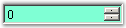
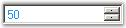
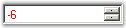
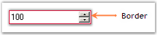
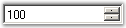
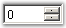
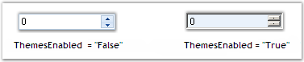
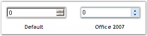
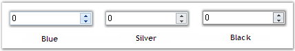

::: {style="DISPLAY: none"}
{#d2h_url_template}{#d2h_package_url style="WIDTH: 0px; DISPLAY: none; HEIGHT: 0px"}
:::

:::::::::::::::::::: {.d2h_secondary_topic style="PADDING-BOTTOM: 10pt; MARGIN: 0pt; PADDING-LEFT: 0pt; PADDING-RIGHT: 0pt; PADDING-TOP: 0pt"}
##### Concepts and Features {#concepts-and-features style="tab-stops: 0pt"}

###### 3.3.8.9.3.1 [[Value Settings]{style="COLOR: windowtext; TEXT-DECORATION: none; text-underline: none"}](http://help.syncfusion.com/ug_82/WindowsFormsUI_Tools/ValueSettings1.html) {#value-settings style="tab-stops: 0pt"}

The various Values of the NumericUpDownExt control and their settings are given below.[]{style="COLOR: black"}

[]{style="COLOR: black"} 

::: {align="center"}
  ----------------------------------------------------- -----------------------------------------------------------------------------------------------------------------------------------------------------------------------------------------------------
  NumericUpDownExt Properties[]{style="COLOR: black"}   Description[]{style="COLOR: black"}
  Value[]{style="COLOR: black"}                         Gets / sets the value assigned to the spin box (also known as an up-down control).[]{style="COLOR: black"}
  Hexadecimal[]{style="COLOR: black"}                   Gets / sets the value indicating whether the spin box (also known as an up-down control) should display the value it contains in hexadecimal format.[]{style="COLOR: black"}
  HexValue[]{style="COLOR: black"}                      Gets the value in hexadecimal numeration.[]{style="COLOR: black"}
  Minimum[]{style="COLOR: black"}                       Gets / sets the minimum allowed value for the spin box (also known as an up-down control).[]{style="COLOR: black"}
  Increment[]{style="COLOR: black"}                     Gets / sets the value to increment or decrement the spin box (also known as an up-down control) when the up or down buttons are clicked. The default value is set to \'1\'.[]{style="COLOR: black"}
  ----------------------------------------------------- -----------------------------------------------------------------------------------------------------------------------------------------------------------------------------------------------------
:::

[]{style="COLOR: black"} 

+--------------------------------------------------------------------------------------------------------------------------------------------------------------------------------------------------------------------------------------------------------------------------------------------------------------------------------------------------------------------------------------------------------------------------------------------------------------------------------------------------------------------------------------------------------------------------------------------------------------------------------------+
| **[\[C#\]]{style="FONT-FAMILY: 'Courier New'; COLOR: black"}**[]{style="COLOR: black"}                                                                                                                                                                                                                                                                                                                                                                                                                                                                                                                                               |
|                                                                                                                                                                                                                                                                                                                                                                                                                                                                                                                                                                                                                                      |
| []{style="COLOR: black"}                                                                                                                                                                                                                                                                                                                                                                                                                                                                                                                                                                                                             |
|                                                                                                                                                                                                                                                                                                                                                                                                                                                                                                                                                                                                                                      |
| [this]{style="FONT-FAMILY: 'Courier New'; COLOR: blue"}[.numericUpDownExt1.Value = ]{style="FONT-FAMILY: 'Courier New'; COLOR: black"}[new]{style="FONT-FAMILY: 'Courier New'; COLOR: blue"}[ ]{style="FONT-FAMILY: 'Courier New'; COLOR: black"}[decimal]{style="FONT-FAMILY: 'Courier New'; COLOR: blue"}[(]{style="FONT-FAMILY: 'Courier New'; COLOR: black"}[new]{style="FONT-FAMILY: 'Courier New'; COLOR: blue"}[ ]{style="FONT-FAMILY: 'Courier New'; COLOR: black"}[int]{style="FONT-FAMILY: 'Courier New'; COLOR: blue"}[\[\] {25, 0, 0, 0});]{style="FONT-FAMILY: 'Courier New'; COLOR: black"}[]{style="COLOR: black"}    |
|                                                                                                                                                                                                                                                                                                                                                                                                                                                                                                                                                                                                                                      |
| [this]{style="FONT-FAMILY: 'Courier New'; COLOR: blue"}[.numericUpDownExt1.Hexadecimal = ]{style="FONT-FAMILY: 'Courier New'; COLOR: black"}[true]{style="FONT-FAMILY: 'Courier New'; COLOR: blue"}[;]{style="FONT-FAMILY: 'Courier New'; COLOR: black"}[]{style="COLOR: black"}                                                                                                                                                                                                                                                                                                                                                     |
|                                                                                                                                                                                                                                                                                                                                                                                                                                                                                                                                                                                                                                      |
| [this]{style="FONT-FAMILY: 'Courier New'; COLOR: blue"}[.numericUpDownExt1.Minimum = ]{style="FONT-FAMILY: 'Courier New'; COLOR: black"}[new]{style="FONT-FAMILY: 'Courier New'; COLOR: blue"}[ ]{style="FONT-FAMILY: 'Courier New'; COLOR: black"}[decimal]{style="FONT-FAMILY: 'Courier New'; COLOR: blue"}[(]{style="FONT-FAMILY: 'Courier New'; COLOR: black"}[new]{style="FONT-FAMILY: 'Courier New'; COLOR: blue"}[ ]{style="FONT-FAMILY: 'Courier New'; COLOR: black"}[int]{style="FONT-FAMILY: 'Courier New'; COLOR: blue"}[\[\] {50, 0, 0, 0});]{style="FONT-FAMILY: 'Courier New'; COLOR: black"}[]{style="COLOR: black"}  |
|                                                                                                                                                                                                                                                                                                                                                                                                                                                                                                                                                                                                                                      |
| [this]{style="FONT-FAMILY: 'Courier New'; COLOR: blue"}[.numericUpDownExt1.Increment = ]{style="FONT-FAMILY: 'Courier New'; COLOR: black"}[new]{style="FONT-FAMILY: 'Courier New'; COLOR: blue"}[ ]{style="FONT-FAMILY: 'Courier New'; COLOR: black"}[decimal]{style="FONT-FAMILY: 'Courier New'; COLOR: blue"}[(]{style="FONT-FAMILY: 'Courier New'; COLOR: black"}[new]{style="FONT-FAMILY: 'Courier New'; COLOR: blue"}[ ]{style="FONT-FAMILY: 'Courier New'; COLOR: black"}[int]{style="FONT-FAMILY: 'Courier New'; COLOR: blue"}[\[\] {5, 0, 0, 0});]{style="FONT-FAMILY: 'Courier New'; COLOR: black"}[]{style="COLOR: black"} |
+--------------------------------------------------------------------------------------------------------------------------------------------------------------------------------------------------------------------------------------------------------------------------------------------------------------------------------------------------------------------------------------------------------------------------------------------------------------------------------------------------------------------------------------------------------------------------------------------------------------------------------------+

[]{style="COLOR: black"} 

+-------------------------------------------------------------------------------------------------------------------------------------------------------------------------------------------------------------------------------------------------------------------------------------------------------------------------------------------------------------------------------------------------------------------------------------------------------------------------------------------------------------------------------------------------------------------------------------------------------------------------------------+
| **[\[VB.NET\]]{style="FONT-FAMILY: 'Courier New'; COLOR: black"}**[]{style="COLOR: black"}                                                                                                                                                                                                                                                                                                                                                                                                                                                                                                                                          |
|                                                                                                                                                                                                                                                                                                                                                                                                                                                                                                                                                                                                                                     |
| []{style="COLOR: black"}                                                                                                                                                                                                                                                                                                                                                                                                                                                                                                                                                                                                            |
|                                                                                                                                                                                                                                                                                                                                                                                                                                                                                                                                                                                                                                     |
| [Me]{style="FONT-FAMILY: 'Courier New'; COLOR: blue"}[.numericUpDownExt1.Value = ]{style="FONT-FAMILY: 'Courier New'; COLOR: black"}[New]{style="FONT-FAMILY: 'Courier New'; COLOR: blue"}[ ]{style="FONT-FAMILY: 'Courier New'; COLOR: black"}[Decimal]{style="FONT-FAMILY: 'Courier New'; COLOR: blue"}[(]{style="FONT-FAMILY: 'Courier New'; COLOR: black"}[New]{style="FONT-FAMILY: 'Courier New'; COLOR: blue"}[ ]{style="FONT-FAMILY: 'Courier New'; COLOR: black"}[Integer]{style="FONT-FAMILY: 'Courier New'; COLOR: blue"}[() {25, 0, 0, 0})]{style="FONT-FAMILY: 'Courier New'; COLOR: black"}[]{style="COLOR: black"}    |
|                                                                                                                                                                                                                                                                                                                                                                                                                                                                                                                                                                                                                                     |
| [Me]{style="FONT-FAMILY: 'Courier New'; COLOR: blue"}[.numericUpDownExt1.Hexadecimal = ]{style="FONT-FAMILY: 'Courier New'; COLOR: black"}[True]{style="FONT-FAMILY: 'Courier New'; COLOR: blue"}[]{style="COLOR: black"}                                                                                                                                                                                                                                                                                                                                                                                                           |
|                                                                                                                                                                                                                                                                                                                                                                                                                                                                                                                                                                                                                                     |
| [Me]{style="FONT-FAMILY: 'Courier New'; COLOR: blue"}[.numericUpDownExt1.Minimum = ]{style="FONT-FAMILY: 'Courier New'; COLOR: black"}[New]{style="FONT-FAMILY: 'Courier New'; COLOR: blue"}[ ]{style="FONT-FAMILY: 'Courier New'; COLOR: black"}[Decimal]{style="FONT-FAMILY: 'Courier New'; COLOR: blue"}[(]{style="FONT-FAMILY: 'Courier New'; COLOR: black"}[New]{style="FONT-FAMILY: 'Courier New'; COLOR: blue"}[ ]{style="FONT-FAMILY: 'Courier New'; COLOR: black"}[Integer]{style="FONT-FAMILY: 'Courier New'; COLOR: blue"}[() {50, 0, 0, 0})]{style="FONT-FAMILY: 'Courier New'; COLOR: black"}[]{style="COLOR: black"}  |
|                                                                                                                                                                                                                                                                                                                                                                                                                                                                                                                                                                                                                                     |
| [Me]{style="FONT-FAMILY: 'Courier New'; COLOR: blue"}[.numericUpDownExt1.Increment = ]{style="FONT-FAMILY: 'Courier New'; COLOR: black"}[New]{style="FONT-FAMILY: 'Courier New'; COLOR: blue"}[ ]{style="FONT-FAMILY: 'Courier New'; COLOR: black"}[Decimal]{style="FONT-FAMILY: 'Courier New'; COLOR: blue"}[(]{style="FONT-FAMILY: 'Courier New'; COLOR: black"}[New]{style="FONT-FAMILY: 'Courier New'; COLOR: blue"}[ ]{style="FONT-FAMILY: 'Courier New'; COLOR: black"}[Integer]{style="FONT-FAMILY: 'Courier New'; COLOR: blue"}[() {5, 0, 0, 0})]{style="FONT-FAMILY: 'Courier New'; COLOR: black"}[]{style="COLOR: black"} |
+-------------------------------------------------------------------------------------------------------------------------------------------------------------------------------------------------------------------------------------------------------------------------------------------------------------------------------------------------------------------------------------------------------------------------------------------------------------------------------------------------------------------------------------------------------------------------------------------------------------------------------------+

[]{style="COLOR: black"} 

The methods associated with the above properties are given below.[]{style="COLOR: black"}

[]{style="COLOR: black"} 

::: {align="center"}
  ------------------------------------ --------------------------------------------------------------------------------------------------
  Methods[]{style="COLOR: black"}      Description[]{style="COLOR: black"}
  DownButton[]{style="COLOR: black"}   Decrements the value of the spin box (also known as an up-down control).[]{style="COLOR: black"}
  UpButton[]{style="COLOR: black"}     Increments the value of the spin box (also known as an up-down control).[]{style="COLOR: black"}
  ------------------------------------ --------------------------------------------------------------------------------------------------
:::

 

###### 3.3.8.9.3.2 [[Display Settings]{style="COLOR: windowtext; TEXT-DECORATION: none; text-underline: none"}](http://help.syncfusion.com/ug_82/WindowsFormsUI_Tools/DisplaySettings1.html) {#display-settings style="tab-stops: 0pt"}

This section discusses the Display settings of the NumericUpDownExt control.[]{style="COLOR: black"}

[]{style="COLOR: black"} 

The NumericUpDownExt provides the following properties to set the display characteristics associated with the integer value.[]{style="COLOR: black"}

[]{style="COLOR: black"} 

::: {align="center"}
  ----------------------------------------------------- -----------------------------------------------------------------------------------------------------------------------------------------------------------------------
  NumericUpDownExt Properties[]{style="COLOR: black"}   Description[]{style="COLOR: black"}
  DecimalPlaces[]{style="COLOR: black"}                 Gets / sets the number of decimal places to display in the spin box (also known as an up-down control).[]{style="COLOR: black"}
  ThousandsSeparator[]{style="COLOR: black"}            Gets / sets a value indicating whether a thousand separator is displayed in the spin box (also known as an up-down control) when appropriate.[]{style="COLOR: black"}
  ----------------------------------------------------- -----------------------------------------------------------------------------------------------------------------------------------------------------------------------
:::

[]{style="COLOR: black"} 

+-----------------------------------------------------------------------------------------------------------------------------------------------------------------------------------------------------------------------------------------------------------------------------------------+
| **[\[C#\]]{style="FONT-FAMILY: 'Courier New'; COLOR: black"}**[]{style="COLOR: black"}                                                                                                                                                                                                  |
|                                                                                                                                                                                                                                                                                         |
| []{style="COLOR: black"}                                                                                                                                                                                                                                                                |
|                                                                                                                                                                                                                                                                                         |
| [this]{style="FONT-FAMILY: 'Courier New'; COLOR: blue"}[.numericUpDownExt1.DecimalPlaces = 2;]{style="FONT-FAMILY: 'Courier New'; COLOR: black"}[]{style="COLOR: black"}                                                                                                                |
|                                                                                                                                                                                                                                                                                         |
| [this]{style="FONT-FAMILY: 'Courier New'; COLOR: blue"}[.numericUpDownExt1.ThousandsSeparator = ]{style="FONT-FAMILY: 'Courier New'; COLOR: black"}[true]{style="FONT-FAMILY: 'Courier New'; COLOR: blue"}[;]{style="FONT-FAMILY: 'Courier New'; COLOR: black"}[]{style="COLOR: black"} |
+-----------------------------------------------------------------------------------------------------------------------------------------------------------------------------------------------------------------------------------------------------------------------------------------+

[]{style="COLOR: black"} 

+----------------------------------------------------------------------------------------------------------------------------------------------------------------------------------------------------------------------------------+
| **[\[VB.NET\]]{style="FONT-FAMILY: 'Courier New'; COLOR: black"}**[]{style="COLOR: black"}                                                                                                                                       |
|                                                                                                                                                                                                                                  |
| []{style="COLOR: black"}                                                                                                                                                                                                         |
|                                                                                                                                                                                                                                  |
| [Me]{style="FONT-FAMILY: 'Courier New'; COLOR: blue"}[.numericUpDownExt1.DecimalPlaces = 2]{style="FONT-FAMILY: 'Courier New'; COLOR: black"}[]{style="COLOR: black"}                                                            |
|                                                                                                                                                                                                                                  |
| [Me]{style="FONT-FAMILY: 'Courier New'; COLOR: blue"}[.numericUpDownExt1.ThousandsSeparator = ]{style="FONT-FAMILY: 'Courier New'; COLOR: black"}[True]{style="FONT-FAMILY: 'Courier New'; COLOR: blue"}[]{style="COLOR: black"} |
+----------------------------------------------------------------------------------------------------------------------------------------------------------------------------------------------------------------------------------+

[]{style="COLOR: black"} 

{border="0"}

[]{style="COLOR: black"} 

Figure 550: Decimal Places set for NumericUpDownExt Value[]{style="COLOR: black"}

 

###### 3.3.8.9.3.3 [[Appearance Settings]{style="COLOR: windowtext; TEXT-DECORATION: none; text-underline: none"}](http://help.syncfusion.com/ug_82/WindowsFormsUI_Tools/AppearanceSettings31.html) {#appearance-settings style="tab-stops: 0pt"}

3.3.8.9.3.3.1      [[Background Settings]{style="COLOR: windowtext; TEXT-DECORATION: none; text-underline: none"}](http://help.syncfusion.com/ug_82/WindowsFormsUI_Tools/BackgroundSettings22.html)

The Background settings of the NumericUpDownExt control are discussed below.[]{style="COLOR: black"}

[]{style="COLOR: black"} 

Background Color[]{style="COLOR: black"}

[]{style="COLOR: black"} 

The background color of the control can be set using the properties given below.[]{style="COLOR: black"}

[]{style="COLOR: black"} 

::: {align="center"}
  --------------------------------------------------- --------------------------------------------------------------------------
  NumericUpDownExt Property[]{style="COLOR: black"}   Description[]{style="COLOR: black"}
  BackColor[]{style="COLOR: black"}                   Specifies the background color of the component.[]{style="COLOR: black"}
  --------------------------------------------------- --------------------------------------------------------------------------
:::

[]{style="COLOR: black"} 

+-----------------------------------------------------------------------------------------------------------------------------------------------------------------------------------------------------------------------------------------------------------------------------------------------------------+
| **[\[C#\]]{style="FONT-FAMILY: 'Courier New'; COLOR: black"}**[]{style="COLOR: black"}                                                                                                                                                                                                                    |
|                                                                                                                                                                                                                                                                                                           |
| []{style="COLOR: black"}                                                                                                                                                                                                                                                                                  |
|                                                                                                                                                                                                                                                                                                           |
| [this]{style="FONT-FAMILY: 'Courier New'; COLOR: blue"}[.numericUpDownExt1.BackColor = System.Drawing.]{style="FONT-FAMILY: 'Courier New'; COLOR: black"}[Color]{style="FONT-FAMILY: 'Courier New'; COLOR: teal"}[.Aquamarine;]{style="FONT-FAMILY: 'Courier New'; COLOR: black"}[]{style="COLOR: black"} |
+-----------------------------------------------------------------------------------------------------------------------------------------------------------------------------------------------------------------------------------------------------------------------------------------------------------+

[]{style="COLOR: black"} 

+-------------------------------------------------------------------------------------------------------------------------------------------------------------------------------------------------+
| **[\[VB.NET\]]{style="FONT-FAMILY: 'Courier New'; COLOR: black"}**[]{style="COLOR: black"}                                                                                                      |
|                                                                                                                                                                                                 |
| []{style="COLOR: black"}                                                                                                                                                                        |
|                                                                                                                                                                                                 |
| [Me]{style="FONT-FAMILY: 'Courier New'; COLOR: blue"}[.numericUpDownExt1.BackColor = System.Drawing.Color.Aquamarine]{style="FONT-FAMILY: 'Courier New'; COLOR: black"}[]{style="COLOR: black"} |
+-------------------------------------------------------------------------------------------------------------------------------------------------------------------------------------------------+

[]{style="COLOR: black"} 

{border="0"}

[]{style="COLOR: black"} 

Figure 551: Background Color set for the NumericUpDownExt Control[]{style="COLOR: black"}

 

3.3.8.9.3.3.2      [[Foreground Settings]{style="COLOR: windowtext; TEXT-DECORATION: none; text-underline: none"}](http://help.syncfusion.com/ug_82/WindowsFormsUI_Tools/ForegroundSettings31.html)

The foreground settings of the NumericUpDownExt control are discussed below.[]{style="COLOR: black"}

[]{style="COLOR: black"} 

Foreground Color[]{style="COLOR: black"}

[]{style="COLOR: black"} 

The foreground color of the control can be set using the properties given below.[]{style="COLOR: black"}

[]{style="COLOR: black"} 

::: {align="center"}
  --------------------------------------------------- --------------------------------------------------------------------------------------------------------------
  NumericUpDownExt Property[]{style="COLOR: black"}   Description[]{style="COLOR: black"}
  ForeColor[]{style="COLOR: black"}                   Gets / sets the foreground color of the spin box (also known as an up-down control).[]{style="COLOR: black"}
  --------------------------------------------------- --------------------------------------------------------------------------------------------------------------
:::

[]{style="COLOR: black"} 

+-----------------------------------------------------------------------------------------------------------------------------------------------------------------------------------------------------------------------------------------------------------------------------------------------------------+
| **[\[C#\]]{style="FONT-FAMILY: 'Courier New'; COLOR: black"}**[]{style="COLOR: black"}                                                                                                                                                                                                                    |
|                                                                                                                                                                                                                                                                                                           |
| []{style="COLOR: black"}                                                                                                                                                                                                                                                                                  |
|                                                                                                                                                                                                                                                                                                           |
| [this]{style="FONT-FAMILY: 'Courier New'; COLOR: blue"}[.numericUpDownExt1.ForeColor = System.Drawing.]{style="FONT-FAMILY: 'Courier New'; COLOR: black"}[Color]{style="FONT-FAMILY: 'Courier New'; COLOR: teal"}[.DodgerBlue;]{style="FONT-FAMILY: 'Courier New'; COLOR: black"}[]{style="COLOR: black"} |
+-----------------------------------------------------------------------------------------------------------------------------------------------------------------------------------------------------------------------------------------------------------------------------------------------------------+

[]{style="COLOR: black"} 

+-------------------------------------------------------------------------------------------------------------------------------------------------------------------------------------------------+
| **[\[VB.NET\]]{style="FONT-FAMILY: 'Courier New'; COLOR: black"}**[]{style="COLOR: black"}                                                                                                      |
|                                                                                                                                                                                                 |
| []{style="COLOR: black"}                                                                                                                                                                        |
|                                                                                                                                                                                                 |
| [Me]{style="FONT-FAMILY: 'Courier New'; COLOR: blue"}[.numericUpDownExt1.ForeColor = System.Drawing.Color.DodgerBlue]{style="FONT-FAMILY: 'Courier New'; COLOR: black"}[]{style="COLOR: black"} |
+-------------------------------------------------------------------------------------------------------------------------------------------------------------------------------------------------+

[]{style="COLOR: black"} 

{border="0"}

[]{style="COLOR: black"} 

Figure 552: Foreground Color set for the NumericUpDownExt Control[]{style="COLOR: black"}

 

3.3.8.9.3.3.2.1    [[Applying Foreground Color to Negative Values]{style="COLOR: windowtext; TEXT-DECORATION: none; text-underline: none"}](http://help.syncfusion.com/ug_82/WindowsFormsUI_Tools/ColorOptionsForNegativeValues.html)

It is a good behavior in a NumericUpDownExt control to indicate negative values using a separate color. The IntegerTextBox and DoubleTextBox controls also exhibit the same behavior.[]{style="COLOR: black"}

[]{style="COLOR: black"} 

{border="0"}

[]{style="COLOR: black"} 

Figure 553: Derived NumericUpdownExt showing Negative Values in Different Color[]{style="COLOR: black"}

[]{style="COLOR: black"} 

To add this feature to the NumericUpdown control, we need to derive the control. For this, we need to include the below given code snippet in the derived class.[]{style="COLOR: black"}

[]{style="COLOR: black"} 

+-------------------------------------------------------------------------------------------------------------------------------------------------------------------------------------------------------------------------------------------------------------------------------------------------------------------------------------------------------------------------------------------------------------------------------------------------------------------------------------------------------------+
| **[\[C#\]]{style="FONT-FAMILY: 'Courier New'; COLOR: black"}**[]{style="COLOR: black"}                                                                                                                                                                                                                                                                                                                                                                                                                      |
|                                                                                                                                                                                                                                                                                                                                                                                                                                                                                                             |
| []{style="COLOR: black"}                                                                                                                                                                                                                                                                                                                                                                                                                                                                                    |
|                                                                                                                                                                                                                                                                                                                                                                                                                                                                                                             |
| [class]{style="FONT-FAMILY: 'Courier New'; COLOR: blue"}[ ]{style="FONT-FAMILY: 'Courier New'; COLOR: black"}[NumericupdownextDerived]{style="FONT-FAMILY: 'Courier New'; COLOR: teal"}[ : NumericUpDownExt]{style="FONT-FAMILY: 'Courier New'; COLOR: black"}[]{style="COLOR: black"}                                                                                                                                                                                                                      |
|                                                                                                                                                                                                                                                                                                                                                                                                                                                                                                             |
| [{]{style="FONT-FAMILY: 'Courier New'; COLOR: black"}[]{style="COLOR: black"}                                                                                                                                                                                                                                                                                                                                                                                                                               |
|                                                                                                                                                                                                                                                                                                                                                                                                                                                                                                             |
| [private]{style="FONT-FAMILY: 'Courier New'; COLOR: blue"}[ IntegerTextBox itb = ]{style="FONT-FAMILY: 'Courier New'; COLOR: black"}[new]{style="FONT-FAMILY: 'Courier New'; COLOR: blue"}[ IntegerTextBox();]{style="FONT-FAMILY: 'Courier New'; COLOR: black"}[]{style="COLOR: black"}                                                                                                                                                                                                                    |
|                                                                                                                                                                                                                                                                                                                                                                                                                                                                                                             |
| [public]{style="FONT-FAMILY: 'Courier New'; COLOR: blue"}[ integerupdown()]{style="FONT-FAMILY: 'Courier New'; COLOR: black"}[]{style="COLOR: black"}                                                                                                                                                                                                                                                                                                                                                       |
|                                                                                                                                                                                                                                                                                                                                                                                                                                                                                                             |
| [{]{style="FONT-FAMILY: 'Courier New'; COLOR: black"}[]{style="COLOR: black"}                                                                                                                                                                                                                                                                                                                                                                                                                               |
|                                                                                                                                                                                                                                                                                                                                                                                                                                                                                                             |
| [// Constructor of the new class.]{style="FONT-FAMILY: 'Courier New'; COLOR: green"}[]{style="COLOR: black"}                                                                                                                                                                                                                                                                                                                                                                                                |
|                                                                                                                                                                                                                                                                                                                                                                                                                                                                                                             |
| [foreach]{style="FONT-FAMILY: 'Courier New'; COLOR: blue"}[(]{style="FONT-FAMILY: 'Courier New'; COLOR: black"}[Control]{style="FONT-FAMILY: 'Courier New'; COLOR: teal"}[ c ]{style="FONT-FAMILY: 'Courier New'; COLOR: black"}[in]{style="FONT-FAMILY: 'Courier New'; COLOR: blue"}[ Controls)]{style="FONT-FAMILY: 'Courier New'; COLOR: black"}[]{style="COLOR: black"}                                                                                                                                 |
|                                                                                                                                                                                                                                                                                                                                                                                                                                                                                                             |
| [{]{style="FONT-FAMILY: 'Courier New'; COLOR: black"}[]{style="COLOR: black"}                                                                                                                                                                                                                                                                                                                                                                                                                               |
|                                                                                                                                                                                                                                                                                                                                                                                                                                                                                                             |
| [if]{style="FONT-FAMILY: 'Courier New'; COLOR: blue"}[(c ]{style="FONT-FAMILY: 'Courier New'; COLOR: black"}[is]{style="FONT-FAMILY: 'Courier New'; COLOR: blue"}[ ]{style="FONT-FAMILY: 'Courier New'; COLOR: black"}[TextBox]{style="FONT-FAMILY: 'Courier New'; COLOR: teal"}[ )]{style="FONT-FAMILY: 'Courier New'; COLOR: black"}[]{style="COLOR: black"}                                                                                                                                              |
|                                                                                                                                                                                                                                                                                                                                                                                                                                                                                                             |
| [{]{style="FONT-FAMILY: 'Courier New'; COLOR: black"}[]{style="COLOR: black"}                                                                                                                                                                                                                                                                                                                                                                                                                               |
|                                                                                                                                                                                                                                                                                                                                                                                                                                                                                                             |
| [itb.Location=c.Location;]{style="FONT-FAMILY: 'Courier New'; COLOR: black"}[]{style="COLOR: black"}                                                                                                                                                                                                                                                                                                                                                                                                        |
|                                                                                                                                                                                                                                                                                                                                                                                                                                                                                                             |
| [itb.Size = c.Size;]{style="FONT-FAMILY: 'Courier New'; COLOR: black"}[]{style="COLOR: black"}                                                                                                                                                                                                                                                                                                                                                                                                              |
|                                                                                                                                                                                                                                                                                                                                                                                                                                                                                                             |
| [itb.Dock = c.Dock;]{style="FONT-FAMILY: 'Courier New'; COLOR: black"}[]{style="COLOR: black"}                                                                                                                                                                                                                                                                                                                                                                                                              |
|                                                                                                                                                                                                                                                                                                                                                                                                                                                                                                             |
| [itb.Anchor = c.Anchor;]{style="FONT-FAMILY: 'Courier New'; COLOR: black"}[]{style="COLOR: black"}                                                                                                                                                                                                                                                                                                                                                                                                          |
|                                                                                                                                                                                                                                                                                                                                                                                                                                                                                                             |
| [Controls.Add(itb);]{style="FONT-FAMILY: 'Courier New'; COLOR: black"}[]{style="COLOR: black"}                                                                                                                                                                                                                                                                                                                                                                                                              |
|                                                                                                                                                                                                                                                                                                                                                                                                                                                                                                             |
| [itb.BringToFront();]{style="FONT-FAMILY: 'Courier New'; COLOR: black"}[]{style="COLOR: black"}                                                                                                                                                                                                                                                                                                                                                                                                             |
|                                                                                                                                                                                                                                                                                                                                                                                                                                                                                                             |
| [itb.TextChanged += ]{style="FONT-FAMILY: 'Courier New'; COLOR: black"}[new]{style="FONT-FAMILY: 'Courier New'; COLOR: blue"}[ ]{style="FONT-FAMILY: 'Courier New'; COLOR: black"}[EventHandler]{style="FONT-FAMILY: 'Courier New'; COLOR: teal"}[(itb_TextChanged);]{style="FONT-FAMILY: 'Courier New'; COLOR: black"}[]{style="COLOR: black"}                                                                                                                                                             |
|                                                                                                                                                                                                                                                                                                                                                                                                                                                                                                             |
| [}]{style="FONT-FAMILY: 'Courier New'; COLOR: black"}[]{style="COLOR: black"}                                                                                                                                                                                                                                                                                                                                                                                                                               |
|                                                                                                                                                                                                                                                                                                                                                                                                                                                                                                             |
| [}]{style="FONT-FAMILY: 'Courier New'; COLOR: black"}[]{style="COLOR: black"}                                                                                                                                                                                                                                                                                                                                                                                                                               |
|                                                                                                                                                                                                                                                                                                                                                                                                                                                                                                             |
| [}]{style="FONT-FAMILY: 'Courier New'; COLOR: black"}[]{style="COLOR: black"}                                                                                                                                                                                                                                                                                                                                                                                                                               |
|                                                                                                                                                                                                                                                                                                                                                                                                                                                                                                             |
| []{style="COLOR: black"}                                                                                                                                                                                                                                                                                                                                                                                                                                                                                    |
|                                                                                                                                                                                                                                                                                                                                                                                                                                                                                                             |
| [private]{style="FONT-FAMILY: 'Courier New'; COLOR: blue"}[ ]{style="FONT-FAMILY: 'Courier New'; COLOR: black"}[void]{style="FONT-FAMILY: 'Courier New'; COLOR: blue"}[ itb_TextChanged(]{style="FONT-FAMILY: 'Courier New'; COLOR: black"}[object]{style="FONT-FAMILY: 'Courier New'; COLOR: blue"}[ sender,]{style="FONT-FAMILY: 'Courier New'; COLOR: black"}[EventArgs]{style="FONT-FAMILY: 'Courier New'; COLOR: teal"}[ e)]{style="FONT-FAMILY: 'Courier New'; COLOR: black"}[]{style="COLOR: black"} |
|                                                                                                                                                                                                                                                                                                                                                                                                                                                                                                             |
| [{]{style="FONT-FAMILY: 'Courier New'; COLOR: black"}[]{style="COLOR: black"}                                                                                                                                                                                                                                                                                                                                                                                                                               |
|                                                                                                                                                                                                                                                                                                                                                                                                                                                                                                             |
| [// Assigns the IntegerValue.]{style="FONT-FAMILY: 'Courier New'; COLOR: green"}[]{style="COLOR: black"}                                                                                                                                                                                                                                                                                                                                                                                                    |
|                                                                                                                                                                                                                                                                                                                                                                                                                                                                                                             |
| [Value = itb.IntegerValue;]{style="FONT-FAMILY: 'Courier New'; COLOR: black"}[]{style="COLOR: black"}                                                                                                                                                                                                                                                                                                                                                                                                       |
|                                                                                                                                                                                                                                                                                                                                                                                                                                                                                                             |
| [}]{style="FONT-FAMILY: 'Courier New'; COLOR: black"}[]{style="COLOR: black"}                                                                                                                                                                                                                                                                                                                                                                                                                               |
|                                                                                                                                                                                                                                                                                                                                                                                                                                                                                                             |
| []{style="COLOR: black"}                                                                                                                                                                                                                                                                                                                                                                                                                                                                                    |
|                                                                                                                                                                                                                                                                                                                                                                                                                                                                                                             |
| [public]{style="FONT-FAMILY: 'Courier New'; COLOR: blue"}[ System.Drawing.]{style="FONT-FAMILY: 'Courier New'; COLOR: black"}[Color]{style="FONT-FAMILY: 'Courier New'; COLOR: teal"}[ NegativeColor]{style="FONT-FAMILY: 'Courier New'; COLOR: black"}[]{style="COLOR: black"}                                                                                                                                                                                                                             |
|                                                                                                                                                                                                                                                                                                                                                                                                                                                                                                             |
| [{]{style="FONT-FAMILY: 'Courier New'; COLOR: black"}[]{style="COLOR: black"}                                                                                                                                                                                                                                                                                                                                                                                                                               |
|                                                                                                                                                                                                                                                                                                                                                                                                                                                                                                             |
| [get]{style="FONT-FAMILY: 'Courier New'; COLOR: blue"}[]{style="COLOR: black"}                                                                                                                                                                                                                                                                                                                                                                                                                              |
|                                                                                                                                                                                                                                                                                                                                                                                                                                                                                                             |
| [{]{style="FONT-FAMILY: 'Courier New'; COLOR: black"}[]{style="COLOR: black"}                                                                                                                                                                                                                                                                                                                                                                                                                               |
|                                                                                                                                                                                                                                                                                                                                                                                                                                                                                                             |
| [return]{style="FONT-FAMILY: 'Courier New'; COLOR: blue"}[ itb.NegativeColor;]{style="FONT-FAMILY: 'Courier New'; COLOR: black"}[]{style="COLOR: black"}                                                                                                                                                                                                                                                                                                                                                    |
|                                                                                                                                                                                                                                                                                                                                                                                                                                                                                                             |
| [}]{style="FONT-FAMILY: 'Courier New'; COLOR: black"}[]{style="COLOR: black"}                                                                                                                                                                                                                                                                                                                                                                                                                               |
|                                                                                                                                                                                                                                                                                                                                                                                                                                                                                                             |
| [set]{style="FONT-FAMILY: 'Courier New'; COLOR: blue"}[]{style="COLOR: black"}                                                                                                                                                                                                                                                                                                                                                                                                                              |
|                                                                                                                                                                                                                                                                                                                                                                                                                                                                                                             |
| [{]{style="FONT-FAMILY: 'Courier New'; COLOR: black"}[]{style="COLOR: black"}                                                                                                                                                                                                                                                                                                                                                                                                                               |
|                                                                                                                                                                                                                                                                                                                                                                                                                                                                                                             |
| [itb.NegativeColor = ]{style="FONT-FAMILY: 'Courier New'; COLOR: black"}[value]{style="FONT-FAMILY: 'Courier New'; COLOR: blue"}[;]{style="FONT-FAMILY: 'Courier New'; COLOR: black"}[]{style="COLOR: black"}                                                                                                                                                                                                                                                                                               |
|                                                                                                                                                                                                                                                                                                                                                                                                                                                                                                             |
| [}]{style="FONT-FAMILY: 'Courier New'; COLOR: black"}[]{style="COLOR: black"}                                                                                                                                                                                                                                                                                                                                                                                                                               |
|                                                                                                                                                                                                                                                                                                                                                                                                                                                                                                             |
| [}]{style="FONT-FAMILY: 'Courier New'; COLOR: black"}[]{style="COLOR: black"}                                                                                                                                                                                                                                                                                                                                                                                                                               |
|                                                                                                                                                                                                                                                                                                                                                                                                                                                                                                             |
| []{style="COLOR: black"}                                                                                                                                                                                                                                                                                                                                                                                                                                                                                    |
|                                                                                                                                                                                                                                                                                                                                                                                                                                                                                                             |
| [protected]{style="FONT-FAMILY: 'Courier New'; COLOR: blue"}[ ]{style="FONT-FAMILY: 'Courier New'; COLOR: black"}[override]{style="FONT-FAMILY: 'Courier New'; COLOR: blue"}[ ]{style="FONT-FAMILY: 'Courier New'; COLOR: black"}[void]{style="FONT-FAMILY: 'Courier New'; COLOR: blue"}[ OnValueChanged(]{style="FONT-FAMILY: 'Courier New'; COLOR: black"}[EventArgs]{style="FONT-FAMILY: 'Courier New'; COLOR: teal"}[ e)]{style="FONT-FAMILY: 'Courier New'; COLOR: black"}[]{style="COLOR: black"}     |
|                                                                                                                                                                                                                                                                                                                                                                                                                                                                                                             |
| [{]{style="FONT-FAMILY: 'Courier New'; COLOR: black"}[]{style="COLOR: black"}                                                                                                                                                                                                                                                                                                                                                                                                                               |
|                                                                                                                                                                                                                                                                                                                                                                                                                                                                                                             |
| [itb.Text = Value.ToString();]{style="FONT-FAMILY: 'Courier New'; COLOR: black"}[]{style="COLOR: black"}                                                                                                                                                                                                                                                                                                                                                                                                    |
|                                                                                                                                                                                                                                                                                                                                                                                                                                                                                                             |
| [}]{style="FONT-FAMILY: 'Courier New'; COLOR: black"}[]{style="COLOR: black"}                                                                                                                                                                                                                                                                                                                                                                                                                               |
|                                                                                                                                                                                                                                                                                                                                                                                                                                                                                                             |
| [}]{style="FONT-FAMILY: 'Courier New'; COLOR: black"}[]{style="COLOR: black"}                                                                                                                                                                                                                                                                                                                                                                                                                               |
+-------------------------------------------------------------------------------------------------------------------------------------------------------------------------------------------------------------------------------------------------------------------------------------------------------------------------------------------------------------------------------------------------------------------------------------------------------------------------------------------------------------+

[]{style="COLOR: black"} 

+--------------------------------------------------------------------------------------------------------------------------------------------------------------------------------------------------------------------------------------------------------------------------------------------------------------------------------------------------------------------------------------------------------------------------------------------------------------------------------------------------------------------------------------------------------------------------------------------------------------------------------------+
| **[\[VB.NET\]]{style="FONT-FAMILY: 'Courier New'; COLOR: black"}**[]{style="COLOR: black"}                                                                                                                                                                                                                                                                                                                                                                                                                                                                                                                                           |
|                                                                                                                                                                                                                                                                                                                                                                                                                                                                                                                                                                                                                                      |
| []{style="COLOR: black"}                                                                                                                                                                                                                                                                                                                                                                                                                                                                                                                                                                                                             |
|                                                                                                                                                                                                                                                                                                                                                                                                                                                                                                                                                                                                                                      |
| [Class]{style="FONT-FAMILY: 'Courier New'; COLOR: blue"}[ NumericupdownextDerived ]{style="FONT-FAMILY: 'Courier New'; COLOR: black"}[Inherits]{style="FONT-FAMILY: 'Courier New'; COLOR: blue"}[ NumericUpDownExt]{style="FONT-FAMILY: 'Courier New'; COLOR: black"}[]{style="COLOR: black"}                                                                                                                                                                                                                                                                                                                                        |
|                                                                                                                                                                                                                                                                                                                                                                                                                                                                                                                                                                                                                                      |
| [Private]{style="FONT-FAMILY: 'Courier New'; COLOR: blue"}[ itb ]{style="FONT-FAMILY: 'Courier New'; COLOR: black"}[As]{style="FONT-FAMILY: 'Courier New'; COLOR: blue"}[ IntegerTextBox = ]{style="FONT-FAMILY: 'Courier New'; COLOR: black"}[New]{style="FONT-FAMILY: 'Courier New'; COLOR: blue"}[ IntegerTextBox]{style="FONT-FAMILY: 'Courier New'; COLOR: black"}[]{style="COLOR: black"}                                                                                                                                                                                                                                      |
|                                                                                                                                                                                                                                                                                                                                                                                                                                                                                                                                                                                                                                      |
| []{style="COLOR: black"}                                                                                                                                                                                                                                                                                                                                                                                                                                                                                                                                                                                                             |
|                                                                                                                                                                                                                                                                                                                                                                                                                                                                                                                                                                                                                                      |
| [Public Sub]{style="FONT-FAMILY: 'Courier New'; COLOR: blue"}[ New()]{style="FONT-FAMILY: 'Courier New'; COLOR: black"}[]{style="COLOR: black"}                                                                                                                                                                                                                                                                                                                                                                                                                                                                                      |
|                                                                                                                                                                                                                                                                                                                                                                                                                                                                                                                                                                                                                                      |
| [For Each]{style="FONT-FAMILY: 'Courier New'; COLOR: blue"}[ c ]{style="FONT-FAMILY: 'Courier New'; COLOR: black"}[As]{style="FONT-FAMILY: 'Courier New'; COLOR: blue"}[ Control ]{style="FONT-FAMILY: 'Courier New'; COLOR: black"}[In]{style="FONT-FAMILY: 'Courier New'; COLOR: blue"}[ Controls]{style="FONT-FAMILY: 'Courier New'; COLOR: black"}[]{style="COLOR: black"}                                                                                                                                                                                                                                                       |
|                                                                                                                                                                                                                                                                                                                                                                                                                                                                                                                                                                                                                                      |
| [If TypeOf]{style="FONT-FAMILY: 'Courier New'; COLOR: blue"}[ c ]{style="FONT-FAMILY: 'Courier New'; COLOR: black"}[Is]{style="FONT-FAMILY: 'Courier New'; COLOR: blue"}[ TextBox ]{style="FONT-FAMILY: 'Courier New'; COLOR: black"}[Then]{style="FONT-FAMILY: 'Courier New'; COLOR: blue"}[]{style="COLOR: black"}                                                                                                                                                                                                                                                                                                                 |
|                                                                                                                                                                                                                                                                                                                                                                                                                                                                                                                                                                                                                                      |
| [itb.Location = c.Location]{style="FONT-FAMILY: 'Courier New'; COLOR: black"}[]{style="COLOR: black"}                                                                                                                                                                                                                                                                                                                                                                                                                                                                                                                                |
|                                                                                                                                                                                                                                                                                                                                                                                                                                                                                                                                                                                                                                      |
| [itb.Size = c.Size]{style="FONT-FAMILY: 'Courier New'; COLOR: black"}[]{style="COLOR: black"}                                                                                                                                                                                                                                                                                                                                                                                                                                                                                                                                        |
|                                                                                                                                                                                                                                                                                                                                                                                                                                                                                                                                                                                                                                      |
| [itb.Dock = c.Dock]{style="FONT-FAMILY: 'Courier New'; COLOR: black"}[]{style="COLOR: black"}                                                                                                                                                                                                                                                                                                                                                                                                                                                                                                                                        |
|                                                                                                                                                                                                                                                                                                                                                                                                                                                                                                                                                                                                                                      |
| [itb.Anchor = c.Anchor]{style="FONT-FAMILY: 'Courier New'; COLOR: black"}[]{style="COLOR: black"}                                                                                                                                                                                                                                                                                                                                                                                                                                                                                                                                    |
|                                                                                                                                                                                                                                                                                                                                                                                                                                                                                                                                                                                                                                      |
| [Controls.Add(itb)]{style="FONT-FAMILY: 'Courier New'; COLOR: black"}[]{style="COLOR: black"}                                                                                                                                                                                                                                                                                                                                                                                                                                                                                                                                        |
|                                                                                                                                                                                                                                                                                                                                                                                                                                                                                                                                                                                                                                      |
| [itb.BringToFront]{style="FONT-FAMILY: 'Courier New'; COLOR: black"}[]{style="COLOR: black"}                                                                                                                                                                                                                                                                                                                                                                                                                                                                                                                                         |
|                                                                                                                                                                                                                                                                                                                                                                                                                                                                                                                                                                                                                                      |
| [AddHandler]{style="FONT-FAMILY: 'Courier New'; COLOR: blue"}[ itb.TextChanged, ]{style="FONT-FAMILY: 'Courier New'; COLOR: black"}[AddressOf]{style="FONT-FAMILY: 'Courier New'; COLOR: blue"}[ itb_TextChanged]{style="FONT-FAMILY: 'Courier New'; COLOR: black"}[]{style="COLOR: black"}                                                                                                                                                                                                                                                                                                                                          |
|                                                                                                                                                                                                                                                                                                                                                                                                                                                                                                                                                                                                                                      |
| [End If]{style="FONT-FAMILY: 'Courier New'; COLOR: blue"}[]{style="COLOR: black"}                                                                                                                                                                                                                                                                                                                                                                                                                                                                                                                                                    |
|                                                                                                                                                                                                                                                                                                                                                                                                                                                                                                                                                                                                                                      |
| [Next]{style="FONT-FAMILY: 'Courier New'; COLOR: blue"}[]{style="COLOR: black"}                                                                                                                                                                                                                                                                                                                                                                                                                                                                                                                                                      |
|                                                                                                                                                                                                                                                                                                                                                                                                                                                                                                                                                                                                                                      |
| [End Sub]{style="FONT-FAMILY: 'Courier New'; COLOR: blue"}[]{style="COLOR: black"}                                                                                                                                                                                                                                                                                                                                                                                                                                                                                                                                                   |
|                                                                                                                                                                                                                                                                                                                                                                                                                                                                                                                                                                                                                                      |
| []{style="COLOR: black"}                                                                                                                                                                                                                                                                                                                                                                                                                                                                                                                                                                                                             |
|                                                                                                                                                                                                                                                                                                                                                                                                                                                                                                                                                                                                                                      |
| [Private Sub]{style="FONT-FAMILY: 'Courier New'; COLOR: blue"}[ itb_TextChanged(]{style="FONT-FAMILY: 'Courier New'; COLOR: black"}[ByVal]{style="FONT-FAMILY: 'Courier New'; COLOR: blue"}[ sender ]{style="FONT-FAMILY: 'Courier New'; COLOR: black"}[As Object]{style="FONT-FAMILY: 'Courier New'; COLOR: blue"}[, ]{style="FONT-FAMILY: 'Courier New'; COLOR: black"}[ByVal]{style="FONT-FAMILY: 'Courier New'; COLOR: blue"}[ e ]{style="FONT-FAMILY: 'Courier New'; COLOR: black"}[As]{style="FONT-FAMILY: 'Courier New'; COLOR: blue"}[ EventArgs)]{style="FONT-FAMILY: 'Courier New'; COLOR: black"}[]{style="COLOR: black"} |
|                                                                                                                                                                                                                                                                                                                                                                                                                                                                                                                                                                                                                                      |
| [\' Assigns the IntegerValue.]{style="FONT-FAMILY: 'Courier New'; COLOR: green"}[]{style="COLOR: black"}                                                                                                                                                                                                                                                                                                                                                                                                                                                                                                                             |
|                                                                                                                                                                                                                                                                                                                                                                                                                                                                                                                                                                                                                                      |
| [Value = itb.IntegerValue]{style="FONT-FAMILY: 'Courier New'; COLOR: black"}[]{style="COLOR: black"}                                                                                                                                                                                                                                                                                                                                                                                                                                                                                                                                 |
|                                                                                                                                                                                                                                                                                                                                                                                                                                                                                                                                                                                                                                      |
| [End Sub]{style="FONT-FAMILY: 'Courier New'; COLOR: blue"}[]{style="COLOR: black"}                                                                                                                                                                                                                                                                                                                                                                                                                                                                                                                                                   |
|                                                                                                                                                                                                                                                                                                                                                                                                                                                                                                                                                                                                                                      |
| []{style="COLOR: black"}                                                                                                                                                                                                                                                                                                                                                                                                                                                                                                                                                                                                             |
|                                                                                                                                                                                                                                                                                                                                                                                                                                                                                                                                                                                                                                      |
| [Public Property]{style="FONT-FAMILY: 'Courier New'; COLOR: blue"}[ NegativeColor() ]{style="FONT-FAMILY: 'Courier New'; COLOR: black"}[As]{style="FONT-FAMILY: 'Courier New'; COLOR: blue"}[ System.Drawing.Color]{style="FONT-FAMILY: 'Courier New'; COLOR: black"}[]{style="COLOR: black"}                                                                                                                                                                                                                                                                                                                                        |
|                                                                                                                                                                                                                                                                                                                                                                                                                                                                                                                                                                                                                                      |
| [Get]{style="FONT-FAMILY: 'Courier New'; COLOR: blue"}[]{style="COLOR: black"}                                                                                                                                                                                                                                                                                                                                                                                                                                                                                                                                                       |
|                                                                                                                                                                                                                                                                                                                                                                                                                                                                                                                                                                                                                                      |
| [Return]{style="FONT-FAMILY: 'Courier New'; COLOR: blue"}[ itb.NegativeColor]{style="FONT-FAMILY: 'Courier New'; COLOR: black"}[]{style="COLOR: black"}                                                                                                                                                                                                                                                                                                                                                                                                                                                                              |
|                                                                                                                                                                                                                                                                                                                                                                                                                                                                                                                                                                                                                                      |
| [End Get]{style="FONT-FAMILY: 'Courier New'; COLOR: blue"}[]{style="COLOR: black"}                                                                                                                                                                                                                                                                                                                                                                                                                                                                                                                                                   |
|                                                                                                                                                                                                                                                                                                                                                                                                                                                                                                                                                                                                                                      |
| [Set]{style="FONT-FAMILY: 'Courier New'; COLOR: blue"}[]{style="COLOR: black"}                                                                                                                                                                                                                                                                                                                                                                                                                                                                                                                                                       |
|                                                                                                                                                                                                                                                                                                                                                                                                                                                                                                                                                                                                                                      |
| [itb.NegativeColor = value]{style="FONT-FAMILY: 'Courier New'; COLOR: black"}[]{style="COLOR: black"}                                                                                                                                                                                                                                                                                                                                                                                                                                                                                                                                |
|                                                                                                                                                                                                                                                                                                                                                                                                                                                                                                                                                                                                                                      |
| [End Set]{style="FONT-FAMILY: 'Courier New'; COLOR: blue"}[]{style="COLOR: black"}                                                                                                                                                                                                                                                                                                                                                                                                                                                                                                                                                   |
|                                                                                                                                                                                                                                                                                                                                                                                                                                                                                                                                                                                                                                      |
| [End Property]{style="FONT-FAMILY: 'Courier New'; COLOR: blue"}[]{style="COLOR: black"}                                                                                                                                                                                                                                                                                                                                                                                                                                                                                                                                              |
|                                                                                                                                                                                                                                                                                                                                                                                                                                                                                                                                                                                                                                      |
| []{style="COLOR: black"}                                                                                                                                                                                                                                                                                                                                                                                                                                                                                                                                                                                                             |
|                                                                                                                                                                                                                                                                                                                                                                                                                                                                                                                                                                                                                                      |
| [Protected Overloads Overrides Sub]{style="FONT-FAMILY: 'Courier New'; COLOR: blue"}[ OnValueChanged(]{style="FONT-FAMILY: 'Courier New'; COLOR: black"}[ByVal]{style="FONT-FAMILY: 'Courier New'; COLOR: blue"}[ e ]{style="FONT-FAMILY: 'Courier New'; COLOR: black"}[As]{style="FONT-FAMILY: 'Courier New'; COLOR: blue"}[ EventArgs)]{style="FONT-FAMILY: 'Courier New'; COLOR: black"}[]{style="COLOR: black"}                                                                                                                                                                                                                  |
|                                                                                                                                                                                                                                                                                                                                                                                                                                                                                                                                                                                                                                      |
| [itb.Text = Value.ToString]{style="FONT-FAMILY: 'Courier New'; COLOR: black"}[]{style="COLOR: black"}                                                                                                                                                                                                                                                                                                                                                                                                                                                                                                                                |
|                                                                                                                                                                                                                                                                                                                                                                                                                                                                                                                                                                                                                                      |
| [End Sub]{style="FONT-FAMILY: 'Courier New'; COLOR: blue"}[]{style="COLOR: black"}                                                                                                                                                                                                                                                                                                                                                                                                                                                                                                                                                   |
|                                                                                                                                                                                                                                                                                                                                                                                                                                                                                                                                                                                                                                      |
| [End Class]{style="FONT-FAMILY: 'Courier New'; COLOR: blue"}[]{style="COLOR: black"}                                                                                                                                                                                                                                                                                                                                                                                                                                                                                                                                                 |
+--------------------------------------------------------------------------------------------------------------------------------------------------------------------------------------------------------------------------------------------------------------------------------------------------------------------------------------------------------------------------------------------------------------------------------------------------------------------------------------------------------------------------------------------------------------------------------------------------------------------------------------+

[]{style="COLOR: black"} 

After deriving the new class, create an object for that class and set the required properties.[]{style="COLOR: black"}

[]{style="COLOR: black"} 

+------------------------------------------------------------------------------------------------------------------------------------------------------------------------------------------------------------------------------------------------------------------------------------------------------------------------------+
| **[\[C#\]]{style="FONT-FAMILY: 'Courier New'; COLOR: black"}**[]{style="COLOR: black"}                                                                                                                                                                                                                                       |
|                                                                                                                                                                                                                                                                                                                              |
| []{style="COLOR: black"}                                                                                                                                                                                                                                                                                                     |
|                                                                                                                                                                                                                                                                                                                              |
| [NumericupdownextDerived ud = ]{style="FONT-FAMILY: 'Courier New'; COLOR: black"}[new]{style="FONT-FAMILY: 'Courier New'; COLOR: blue"}[ NumericupdownextDerived();]{style="FONT-FAMILY: 'Courier New'; COLOR: black"}[]{style="COLOR: black"}                                                                               |
|                                                                                                                                                                                                                                                                                                                              |
| [ud.Location = ]{style="FONT-FAMILY: 'Courier New'; COLOR: black"}[new]{style="FONT-FAMILY: 'Courier New'; COLOR: blue"}[ ]{style="FONT-FAMILY: 'Courier New'; COLOR: black"}[Point]{style="FONT-FAMILY: 'Courier New'; COLOR: teal"}[(200, 200);]{style="FONT-FAMILY: 'Courier New'; COLOR: black"}[]{style="COLOR: black"} |
|                                                                                                                                                                                                                                                                                                                              |
| [ud.Minimum = -100;]{style="FONT-FAMILY: 'Courier New'; COLOR: black"}[]{style="COLOR: black"}                                                                                                                                                                                                                               |
|                                                                                                                                                                                                                                                                                                                              |
| [ud.NegativeColor = ]{style="FONT-FAMILY: 'Courier New'; COLOR: black"}[Color]{style="FONT-FAMILY: 'Courier New'; COLOR: teal"}[.Red;]{style="FONT-FAMILY: 'Courier New'; COLOR: black"}[]{style="COLOR: black"}                                                                                                             |
|                                                                                                                                                                                                                                                                                                                              |
| [Controls.Add(ud);]{style="FONT-FAMILY: 'Courier New'; COLOR: black"}[]{style="COLOR: black"}                                                                                                                                                                                                                                |
+------------------------------------------------------------------------------------------------------------------------------------------------------------------------------------------------------------------------------------------------------------------------------------------------------------------------------+

[]{style="COLOR: black"} 

+--------------------------------------------------------------------------------------------------------------------------------------------------------------------------------------------------------------------------------------------------------------------------------------------------------------------------------------------------------------------------------------------------------------+
| **[\[VB.NET\]]{style="FONT-FAMILY: 'Courier New'; COLOR: black"}**[]{style="COLOR: black"}                                                                                                                                                                                                                                                                                                                   |
|                                                                                                                                                                                                                                                                                                                                                                                                              |
| []{style="COLOR: black"}                                                                                                                                                                                                                                                                                                                                                                                     |
|                                                                                                                                                                                                                                                                                                                                                                                                              |
| [Dim]{style="FONT-FAMILY: 'Courier New'; COLOR: blue"}[ ud ]{style="FONT-FAMILY: 'Courier New'; COLOR: black"}[As]{style="FONT-FAMILY: 'Courier New'; COLOR: blue"}[ NumericupdownextDerived =]{style="FONT-FAMILY: 'Courier New'; COLOR: black"}[ New]{style="FONT-FAMILY: 'Courier New'; COLOR: blue"}[ NumericupdownextDerived]{style="FONT-FAMILY: 'Courier New'; COLOR: black"}[]{style="COLOR: black"} |
|                                                                                                                                                                                                                                                                                                                                                                                                              |
| [ud.Location = ]{style="FONT-FAMILY: 'Courier New'; COLOR: black"}[New]{style="FONT-FAMILY: 'Courier New'; COLOR: blue"}[ Point(200, 200)]{style="FONT-FAMILY: 'Courier New'; COLOR: black"}[]{style="COLOR: black"}                                                                                                                                                                                         |
|                                                                                                                                                                                                                                                                                                                                                                                                              |
| [ud.Minimum = -100]{style="FONT-FAMILY: 'Courier New'; COLOR: black"}[]{style="COLOR: black"}                                                                                                                                                                                                                                                                                                                |
|                                                                                                                                                                                                                                                                                                                                                                                                              |
| [ud.NegativeColor = Color.Red]{style="FONT-FAMILY: 'Courier New'; COLOR: black"}[]{style="COLOR: black"}                                                                                                                                                                                                                                                                                                     |
|                                                                                                                                                                                                                                                                                                                                                                                                              |
| [Controls.Add(ud)]{style="FONT-FAMILY: 'Courier New'; COLOR: black"}[]{style="COLOR: black"}                                                                                                                                                                                                                                                                                                                 |
+--------------------------------------------------------------------------------------------------------------------------------------------------------------------------------------------------------------------------------------------------------------------------------------------------------------------------------------------------------------------------------------------------------------+

 

###### 3.3.8.9.3.4 [[Behavior Settings]{style="COLOR: windowtext; TEXT-DECORATION: none; text-underline: none"}](http://help.syncfusion.com/ug_82/WindowsFormsUI_Tools/BehaviorSettings21.html) {#behavior-settings style="tab-stops: 0pt"}

The behavior settings of the NumericUpDownExt control are discussed below.[]{style="COLOR: black"}

[]{style="COLOR: black"} 

Intercept Arrow Keys[]{style="COLOR: black"}

[]{style="COLOR: black"} 

The arrow keys can be used to select values using the below given property.[]{style="COLOR: black"}

[]{style="COLOR: black"} 

::: {align="center"}
  --------------------------------------------------- ------------------------------------------------------------------------------------------------------------------------------
  NumericUpDownExt Property[]{style="COLOR: black"}   Description[]{style="COLOR: black"}
  InterceptArrowKeys[]{style="COLOR: black"}          Gets / sets a value indicating whether the user can use the UP and DOWN ARROW keys to select values.[]{style="COLOR: black"}
  --------------------------------------------------- ------------------------------------------------------------------------------------------------------------------------------
:::

[]{style="COLOR: black"} 

+------------------------------------------------------------------------------------------------------------------------------------------------------------------------------------------------------------------------------------------------------------------------------------------------------------------------------------------------------------------+
| **[\[C#\]]{style="FONT-FAMILY: 'Courier New'; COLOR: black"}**[]{style="COLOR: black"}                                                                                                                                                                                                                                                                           |
|                                                                                                                                                                                                                                                                                                                                                                  |
| []{style="COLOR: black"}                                                                                                                                                                                                                                                                                                                                         |
|                                                                                                                                                                                                                                                                                                                                                                  |
| [this]{style="FONT-FAMILY: 'Courier New'; COLOR: blue"}[.numericUpDownExt1.InterceptArrowKeys = ]{style="FONT-FAMILY: 'Courier New'; COLOR: black"}[true]{style="FONT-FAMILY: 'Courier New'; COLOR: blue"}[;]{style="FONT-FAMILY: 'Courier New'; COLOR: black"}[                     ]{style="FONT-FAMILY: 'Courier New'; COLOR: black"}[]{style="COLOR: black"} |
+------------------------------------------------------------------------------------------------------------------------------------------------------------------------------------------------------------------------------------------------------------------------------------------------------------------------------------------------------------------+

[]{style="COLOR: black"} 

+----------------------------------------------------------------------------------------------------------------------------------------------------------------------------------------------------------------------------------+
| **[\[VB\]]{style="FONT-FAMILY: 'Courier New'; COLOR: black"}**[]{style="COLOR: black"}                                                                                                                                           |
|                                                                                                                                                                                                                                  |
| []{style="COLOR: black"}                                                                                                                                                                                                         |
|                                                                                                                                                                                                                                  |
| [Me]{style="FONT-FAMILY: 'Courier New'; COLOR: blue"}[.numericUpDownExt1.InterceptArrowKeys = ]{style="FONT-FAMILY: 'Courier New'; COLOR: black"}[True]{style="FONT-FAMILY: 'Courier New'; COLOR: blue"}[]{style="COLOR: black"} |
+----------------------------------------------------------------------------------------------------------------------------------------------------------------------------------------------------------------------------------+

[]{style="COLOR: black"} 

MaxLength[]{style="COLOR: black"}

[]{style="COLOR: black"} 

The maximum length of the text can be set using the property given below.[]{style="COLOR: black"}

[]{style="COLOR: black"} 

::: {align="center"}
  --------------------------------------------------- -------------------------------------------------------------------------------------------------------------------------------------------------------------------------
  NumericUpDownExt Property[]{style="COLOR: black"}   Description[]{style="COLOR: black"}
  MaxLength[]{style="COLOR: black"}                   Gets / sets the maximum length of the text that can be entered into the editable portion of the control. The default value is set to \'32767\'.[]{style="COLOR: black"}
  --------------------------------------------------- -------------------------------------------------------------------------------------------------------------------------------------------------------------------------
:::

[]{style="COLOR: black"} 

+---------------------------------------------------------------------------------------------------------------------------------------------------------------------------------------------------------------------------------------------+
| **[\[C#\]]{style="FONT-FAMILY: 'Courier New'; COLOR: black"}**[]{style="COLOR: black"}                                                                                                                                                      |
|                                                                                                                                                                                                                                             |
| []{style="COLOR: black"}                                                                                                                                                                                                                    |
|                                                                                                                                                                                                                                             |
| [this]{style="FONT-FAMILY: 'Courier New'; COLOR: blue"}[.numericUpDownExt1.MaxLength = 32800; ]{style="FONT-FAMILY: 'Courier New'; COLOR: black"}[              ]{style="FONT-FAMILY: 'Courier New'; COLOR: black"}[]{style="COLOR: black"} |
+---------------------------------------------------------------------------------------------------------------------------------------------------------------------------------------------------------------------------------------------+

[]{style="COLOR: black"} 

+-----------------------------------------------------------------------------------------------------------------------------------------------------------------------+
| **[\[VB\]]{style="FONT-FAMILY: 'Courier New'; COLOR: black"}**[]{style="COLOR: black"}                                                                                |
|                                                                                                                                                                       |
| []{style="COLOR: black"}                                                                                                                                              |
|                                                                                                                                                                       |
| [Me]{style="FONT-FAMILY: 'Courier New'; COLOR: blue"}[.numericUpDownExt1.MaxLength = 32800]{style="FONT-FAMILY: 'Courier New'; COLOR: black"}[]{style="COLOR: black"} |
+-----------------------------------------------------------------------------------------------------------------------------------------------------------------------+

[]{style="COLOR: black"} 

ReadOnly[]{style="COLOR: black"}

[]{style="COLOR: black"} 

The ReadOnly mode can be enabled for the NumericUpDownExt control using the below given property.[]{style="COLOR: black"}

[]{style="COLOR: black"} 

::: {align="center"}
  --------------------------------------------------- -----------------------------------------------------------------------------------------------------------------------------------
  NumericUpDownExt Property[]{style="COLOR: black"}   Description[]{style="COLOR: black"}
  ReadOnly[]{style="COLOR: black"}                    Gets / sets a value indicating whether the text can be changed by the use of the up or down buttons only.[]{style="COLOR: black"}
  --------------------------------------------------- -----------------------------------------------------------------------------------------------------------------------------------
:::

[]{style="COLOR: black"} 

+-------------------------------------------------------------------------------------------------------------------------------------------------------------------------------------------------------------------------------------------------------------------------------+
| **[\[C#\]]{style="FONT-FAMILY: 'Courier New'; COLOR: black"}**[]{style="COLOR: black"}                                                                                                                                                                                        |
|                                                                                                                                                                                                                                                                               |
| []{style="COLOR: black"}                                                                                                                                                                                                                                                      |
|                                                                                                                                                                                                                                                                               |
| [this]{style="FONT-FAMILY: 'Courier New'; COLOR: blue"}[.numericUpDownExt1.ReadOnly = ]{style="FONT-FAMILY: 'Courier New'; COLOR: black"}[true]{style="FONT-FAMILY: 'Courier New'; COLOR: blue"}[;]{style="FONT-FAMILY: 'Courier New'; COLOR: black"}[]{style="COLOR: black"} |
+-------------------------------------------------------------------------------------------------------------------------------------------------------------------------------------------------------------------------------------------------------------------------------+

[]{style="COLOR: black"} 

+------------------------------------------------------------------------------------------------------------------------------------------------------------------------------------------------------------------------+
| **[\[VB\]]{style="FONT-FAMILY: 'Courier New'; COLOR: black"}**[]{style="COLOR: black"}                                                                                                                                 |
|                                                                                                                                                                                                                        |
| []{style="COLOR: black"}                                                                                                                                                                                               |
|                                                                                                                                                                                                                        |
| [Me]{style="FONT-FAMILY: 'Courier New'; COLOR: blue"}[.numericUpDownExt1.ReadOnly = ]{style="FONT-FAMILY: 'Courier New'; COLOR: black"}[True]{style="FONT-FAMILY: 'Courier New'; COLOR: blue"}[]{style="COLOR: black"} |
+------------------------------------------------------------------------------------------------------------------------------------------------------------------------------------------------------------------------+

 

###### 3.3.8.9.3.5 [[Alignment Settings]{style="COLOR: windowtext; TEXT-DECORATION: none; text-underline: none"}](http://help.syncfusion.com/ug_82/WindowsFormsUI_Tools/AlignmentSettings4.html) {#alignment-settings style="tab-stops: 0pt"}

This section discusses the Alignment settings of the NumericUpDownExt control.[]{style="COLOR: black"}

[]{style="COLOR: black"} 

Text Alignment[]{style="COLOR: black"}

[]{style="COLOR: black"} 

The text of the NumericUpDownExt control can be aligned using the below given property.[]{style="COLOR: black"}

[]{style="COLOR: black"} 

::: {align="center"}
+---------------------------------------------------+-------------------------------------------------------------------------------------------------------------------+
| NumericUpDownExt Property[]{style="COLOR: black"} | Description[]{style="COLOR: black"}                                                                               |
+---------------------------------------------------+-------------------------------------------------------------------------------------------------------------------+
| TextAlign[]{style="COLOR: black"}                 | Gets / sets the alignment of the text in the spin box (also known as an up-down control).[]{style="COLOR: black"} |
|                                                   |                                                                                                                   |
|                                                   | []{style="COLOR: black"}                                                                                          |
|                                                   |                                                                                                                   |
|                                                   | It includes the below given options:[]{style="COLOR: black"}                                                      |
|                                                   |                                                                                                                   |
|                                                   | []{style="COLOR: black"}                                                                                          |
|                                                   |                                                                                                                   |
|                                                   | Left[]{style="COLOR: black"}                                                                                      |
|                                                   |                                                                                                                   |
|                                                   | Right and[]{style="COLOR: black"}                                                                                 |
|                                                   |                                                                                                                   |
|                                                   | Center.[]{style="COLOR: black"}                                                                                   |
+---------------------------------------------------+-------------------------------------------------------------------------------------------------------------------+
:::

[]{style="COLOR: black"} 

+---------------------------------------------------------------------------------------------------------------------------------------------------------------------------------------------------------------------------------------------------------------------------------------------------------------------------+
| **[\[C#\]]{style="FONT-FAMILY: 'Courier New'; COLOR: black"}**[]{style="COLOR: black"}                                                                                                                                                                                                                                    |
|                                                                                                                                                                                                                                                                                                                           |
| []{style="COLOR: black"}                                                                                                                                                                                                                                                                                                  |
|                                                                                                                                                                                                                                                                                                                           |
| [this]{style="FONT-FAMILY: 'Courier New'; COLOR: blue"}[.numericUpDownExt1.TextAlign = System.Windows.Forms.]{style="FONT-FAMILY: 'Courier New'; COLOR: black"}[HorizontalAlignment]{style="FONT-FAMILY: 'Courier New'; COLOR: teal"}[.Center;]{style="FONT-FAMILY: 'Courier New'; COLOR: black"}[]{style="COLOR: black"} |
+---------------------------------------------------------------------------------------------------------------------------------------------------------------------------------------------------------------------------------------------------------------------------------------------------------------------------+

[]{style="COLOR: black"} 

+-----------------------------------------------------------------------------------------------------------------------------------------------------------------------------------------------------------------+
| **[\[VB\]]{style="FONT-FAMILY: 'Courier New'; COLOR: black"}**[]{style="COLOR: black"}                                                                                                                          |
|                                                                                                                                                                                                                 |
| []{style="COLOR: black"}                                                                                                                                                                                        |
|                                                                                                                                                                                                                 |
| [Me]{style="FONT-FAMILY: 'Courier New'; COLOR: blue"}[.numericUpDownExt1.TextAlign = System.Windows.Forms.HorizontalAlignment.Center]{style="FONT-FAMILY: 'Courier New'; COLOR: black"}[]{style="COLOR: black"} |
+-----------------------------------------------------------------------------------------------------------------------------------------------------------------------------------------------------------------+

[]{style="COLOR: black"} 

{border="0"}

[]{style="COLOR: black"} 

Figure 554: Text Aligned to the \"Center\"

[]{style="COLOR: black"} 

UpDownAlign[]{style="COLOR: black"}

[]{style="COLOR: black"} 

The alignment of the up and down buttons can be set using the property given below.[]{style="COLOR: black"}

[]{style="COLOR: black"} 

::: {align="center"}
+---------------------------------------------------+----------------------------------------------------------------------------------------------------------------------+
| NumericUpDownExt Property[]{style="COLOR: black"} | Description[]{style="COLOR: black"}                                                                                  |
+---------------------------------------------------+----------------------------------------------------------------------------------------------------------------------+
| UpDownAlign[]{style="COLOR: black"}               | Gets / sets the alignment of the up and down buttons. The default value is set to \'Right\'.[]{style="COLOR: black"} |
|                                                   |                                                                                                                      |
|                                                   | []{style="COLOR: black"}                                                                                             |
|                                                   |                                                                                                                      |
|                                                   | It includes the below given options.[]{style="COLOR: black"}                                                         |
|                                                   |                                                                                                                      |
|                                                   | []{style="COLOR: black"}                                                                                             |
|                                                   |                                                                                                                      |
|                                                   | *Left and*[]{style="COLOR: black"}                                                                                   |
|                                                   |                                                                                                                      |
|                                                   | *Right.*[]{style="COLOR: black"}                                                                                     |
+---------------------------------------------------+----------------------------------------------------------------------------------------------------------------------+
:::

[]{style="COLOR: black"} 

+--------------------------------------------------------------------------------------------------------------------------------------------------------------------------------------------------------------------------------------------------------------------------------------------------------------------------+
| **[\[C#\]]{style="FONT-FAMILY: 'Courier New'; COLOR: black"}**[]{style="COLOR: black"}                                                                                                                                                                                                                                   |
|                                                                                                                                                                                                                                                                                                                          |
| []{style="COLOR: black"}                                                                                                                                                                                                                                                                                                 |
|                                                                                                                                                                                                                                                                                                                          |
| [this]{style="FONT-FAMILY: 'Courier New'; COLOR: blue"}[.numericUpDownExt1.UpDownAlign = System.Windows.Forms.]{style="FONT-FAMILY: 'Courier New'; COLOR: black"}[LeftRightAlignment]{style="FONT-FAMILY: 'Courier New'; COLOR: teal"}[.Left;]{style="FONT-FAMILY: 'Courier New'; COLOR: black"}[]{style="COLOR: black"} |
+--------------------------------------------------------------------------------------------------------------------------------------------------------------------------------------------------------------------------------------------------------------------------------------------------------------------------+

[]{style="COLOR: black"} 

+----------------------------------------------------------------------------------------------------------------------------------------------------------------------------------------------------------------+
| **[\[VB\]]{style="FONT-FAMILY: 'Courier New'; COLOR: black"}**[]{style="COLOR: black"}                                                                                                                         |
|                                                                                                                                                                                                                |
| []{style="COLOR: black"}                                                                                                                                                                                       |
|                                                                                                                                                                                                                |
| [Me]{style="FONT-FAMILY: 'Courier New'; COLOR: blue"}[.numericUpDownExt1.UpDownAlign = System.Windows.Forms.LeftRightAlignment.Left]{style="FONT-FAMILY: 'Courier New'; COLOR: black"}[]{style="COLOR: black"} |
+----------------------------------------------------------------------------------------------------------------------------------------------------------------------------------------------------------------+

 

###### 3.3.8.9.3.6 [[Border Settings]{style="COLOR: windowtext; TEXT-DECORATION: none; text-underline: none"}](http://help.syncfusion.com/ug_82/WindowsFormsUI_Tools/BorderStyles6.html) {#border-settings style="tab-stops: 0pt"}

This section discusses the Border Settings of the NumericUpDownExt control.[]{style="COLOR: black"}

[]{style="COLOR: black"} 

Color and Styles can be applied to the border of the NumericUpDownExt control as discussed below.[]{style="COLOR: black"}

[]{style="COLOR: black"} 

::: {align="center"}
+-----------------------------------------------------+------------------------------------------------------------------------------------------------------------------------+
| NumericUpDownExt Properties[]{style="COLOR: black"} | Description[]{style="COLOR: black"}                                                                                    |
+-----------------------------------------------------+------------------------------------------------------------------------------------------------------------------------+
| Border3DStyle[]{style="COLOR: black"}               | Indicates the style of the 3D border. The options included are as follows:[]{style="COLOR: black"}                     |
|                                                     |                                                                                                                        |
|                                                     | []{style="COLOR: black"}                                                                                               |
|                                                     |                                                                                                                        |
|                                                     | *RaisedOuter,*[]{style="COLOR: black"}                                                                                 |
|                                                     |                                                                                                                        |
|                                                     | *SunkenOuter,*[]{style="COLOR: black"}                                                                                 |
|                                                     |                                                                                                                        |
|                                                     | *RaisedInner,*[]{style="COLOR: black"}                                                                                 |
|                                                     |                                                                                                                        |
|                                                     | *SunkenInner,*[]{style="COLOR: black"}                                                                                 |
|                                                     |                                                                                                                        |
|                                                     | *Raised,*[]{style="COLOR: black"}                                                                                      |
|                                                     |                                                                                                                        |
|                                                     | *Etched,*[]{style="COLOR: black"}                                                                                      |
|                                                     |                                                                                                                        |
|                                                     | *Bump,*[]{style="COLOR: black"}                                                                                        |
|                                                     |                                                                                                                        |
|                                                     | *Sunken,*[]{style="COLOR: black"}                                                                                      |
|                                                     |                                                                                                                        |
|                                                     | *Adjust and*[]{style="COLOR: black"}                                                                                   |
|                                                     |                                                                                                                        |
|                                                     | *Flat.*[]{style="COLOR: black"}                                                                                        |
|                                                     |                                                                                                                        |
|                                                     | []{style="COLOR: black"}                                                                                               |
|                                                     |                                                                                                                        |
|                                                     | The default value is set to \'Sunken\'.[]{style="COLOR: black"}                                                        |
+-----------------------------------------------------+------------------------------------------------------------------------------------------------------------------------+
| BorderColor[]{style="COLOR: black"}                 | Specifies the color of the 2D border.[]{style="COLOR: black"}                                                          |
+-----------------------------------------------------+------------------------------------------------------------------------------------------------------------------------+
| BorderSides[]{style="COLOR: black"}                 | Indicates the border sides of the panel. The options included are as follows:[]{style="COLOR: black"}                  |
|                                                     |                                                                                                                        |
|                                                     | []{style="COLOR: black"}                                                                                               |
|                                                     |                                                                                                                        |
|                                                     | *Left,*[]{style="COLOR: black"}                                                                                        |
|                                                     |                                                                                                                        |
|                                                     | *Top,*[]{style="COLOR: black"}                                                                                         |
|                                                     |                                                                                                                        |
|                                                     | *Right,*[]{style="COLOR: black"}                                                                                       |
|                                                     |                                                                                                                        |
|                                                     | *Bottom,*[]{style="COLOR: black"}                                                                                      |
|                                                     |                                                                                                                        |
|                                                     | *Middle and*[]{style="COLOR: black"}                                                                                   |
|                                                     |                                                                                                                        |
|                                                     | *All.*[]{style="COLOR: black"}                                                                                         |
+-----------------------------------------------------+------------------------------------------------------------------------------------------------------------------------+
| BorderStyle[]{style="COLOR: black"}                 | Indicates whether the edit control should have a border. The options included are given below:[]{style="COLOR: black"} |
|                                                     |                                                                                                                        |
|                                                     | []{style="COLOR: black"}                                                                                               |
|                                                     |                                                                                                                        |
|                                                     | *FixedSingle,*[]{style="COLOR: black"}                                                                                 |
|                                                     |                                                                                                                        |
|                                                     | *Fixed3D and*[]{style="COLOR: black"}                                                                                  |
|                                                     |                                                                                                                        |
|                                                     | *None.*[]{style="COLOR: black"}                                                                                        |
+-----------------------------------------------------+------------------------------------------------------------------------------------------------------------------------+
:::

[]{style="COLOR: black"} 

+--------------------------------------------------------------------------------------------------------------------------------------------------------------------------------------------------------------------------------------------------------------------------------------------------------------------------+
| **[\[C#\]]{style="FONT-FAMILY: 'Courier New'; COLOR: black"}**[]{style="COLOR: black"}                                                                                                                                                                                                                                   |
|                                                                                                                                                                                                                                                                                                                          |
| []{style="COLOR: black"}                                                                                                                                                                                                                                                                                                 |
|                                                                                                                                                                                                                                                                                                                          |
| [this]{style="FONT-FAMILY: 'Courier New'; COLOR: blue"}[.numericUpDownExt1.Border3DStyle = System.Windows.Forms.]{style="FONT-FAMILY: 'Courier New'; COLOR: black"}[Border3DStyle]{style="FONT-FAMILY: 'Courier New'; COLOR: teal"}[.Etched;]{style="FONT-FAMILY: 'Courier New'; COLOR: black"}[]{style="COLOR: black"}  |
|                                                                                                                                                                                                                                                                                                                          |
| [this]{style="FONT-FAMILY: 'Courier New'; COLOR: blue"}[.numericUpDownExt1.BorderColor = System.Drawing.]{style="FONT-FAMILY: 'Courier New'; COLOR: black"}[Color]{style="FONT-FAMILY: 'Courier New'; COLOR: teal"}[.Crimson;]{style="FONT-FAMILY: 'Courier New'; COLOR: black"}[]{style="COLOR: black"}                 |
|                                                                                                                                                                                                                                                                                                                          |
| [this]{style="FONT-FAMILY: 'Courier New'; COLOR: blue"}[.numericUpDownExt1.BorderSides = System.Windows.Forms.]{style="FONT-FAMILY: 'Courier New'; COLOR: black"}[Border3DSide]{style="FONT-FAMILY: 'Courier New'; COLOR: teal"}[.All;]{style="FONT-FAMILY: 'Courier New'; COLOR: black"}[]{style="COLOR: black"}        |
|                                                                                                                                                                                                                                                                                                                          |
| [this]{style="FONT-FAMILY: 'Courier New'; COLOR: blue"}[.numericUpDownExt1.BorderStyle = System.Windows.Forms.]{style="FONT-FAMILY: 'Courier New'; COLOR: black"}[BorderStyle]{style="FONT-FAMILY: 'Courier New'; COLOR: teal"}[.FixedSingle;]{style="FONT-FAMILY: 'Courier New'; COLOR: black"}[]{style="COLOR: black"} |
+--------------------------------------------------------------------------------------------------------------------------------------------------------------------------------------------------------------------------------------------------------------------------------------------------------------------------+

[]{style="COLOR: black"} 

+----------------------------------------------------------------------------------------------------------------------------------------------------------------------------------------------------------------+
| **[\[VB.NET\]]{style="FONT-FAMILY: 'Courier New'; COLOR: black"}**[]{style="COLOR: black"}                                                                                                                     |
|                                                                                                                                                                                                                |
| []{style="COLOR: black"}                                                                                                                                                                                       |
|                                                                                                                                                                                                                |
| [Me]{style="FONT-FAMILY: 'Courier New'; COLOR: blue"}[.numericUpDownExt1.Border3DStyle = System.Windows.Forms.Border3DStyle.Etched]{style="FONT-FAMILY: 'Courier New'; COLOR: black"}[]{style="COLOR: black"}  |
|                                                                                                                                                                                                                |
| [Me]{style="FONT-FAMILY: 'Courier New'; COLOR: blue"}[.numericUpDownExt1.BorderColor = System.Drawing.Color.Crimson]{style="FONT-FAMILY: 'Courier New'; COLOR: black"}[]{style="COLOR: black"}                 |
|                                                                                                                                                                                                                |
| [Me]{style="FONT-FAMILY: 'Courier New'; COLOR: blue"}[.numericUpDownExt1.BorderSides = System.Windows.Forms.Border3DSide.All]{style="FONT-FAMILY: 'Courier New'; COLOR: black"}[]{style="COLOR: black"}        |
|                                                                                                                                                                                                                |
| [Me]{style="FONT-FAMILY: 'Courier New'; COLOR: blue"}[.numericUpDownExt1.BorderStyle = System.Windows.Forms.BorderStyle.FixedSingle]{style="FONT-FAMILY: 'Courier New'; COLOR: black"}[]{style="COLOR: black"} |
+----------------------------------------------------------------------------------------------------------------------------------------------------------------------------------------------------------------+

[]{style="COLOR: black"} 

{border="0"}

[]{style="COLOR: black"} 

Figure 555: PercentTextBox with Border Set

[]{style="COLOR: black"} 

We can display a themed border around the NumericUpDownExt control. This can be done using the property given below.[]{style="COLOR: black"}

[]{style="COLOR: black"} 

::: {align="center"}
+---------------------------------------------------+---------------------------------------------------------------------------------------------------------------------+
| NumericUpDownExt Property[]{style="COLOR: black"} | Description[]{style="COLOR: black"}                                                                                 |
+---------------------------------------------------+---------------------------------------------------------------------------------------------------------------------+
| ThemedBorder[]{style="COLOR: black"}              | Specifies whether or not you want themed border around the control when themes are enabled.[]{style="COLOR: black"} |
|                                                   |                                                                                                                     |
|                                                   | []{style="COLOR: black"}                                                                                            |
|                                                   |                                                                                                                     |
|                                                   | The ThemesEnabled property must be set to \'True\'.[]{style="COLOR: black"}                                         |
+---------------------------------------------------+---------------------------------------------------------------------------------------------------------------------+
:::

[]{style="COLOR: black"} 

::: {style="BORDER-BOTTOM: windowtext 1pt solid; BORDER-LEFT: medium none; PADDING-BOTTOM: 1pt; MARGIN-TOP: 9pt; PADDING-LEFT: 0pt; PADDING-RIGHT: 0pt; MARGIN-BOTTOM: 9pt; BORDER-TOP: windowtext 1pt solid; BORDER-RIGHT: medium none; PADDING-TOP: 1pt"}
[{border="0"}]{style="COLOR: black"}[ ]{style="COLOR: #15428b"}Note[:]{style="COLOR: #15428b"}[ ]{style="COLOR: #15428b"}Refer [[Themes and Visual Styles]{style="COLOR: windowtext; TEXT-DECORATION: none; text-underline: none"}](http://help.syncfusion.com/ug_82/WindowsFormsUI_Tools/VisualStyles5.html) topic to know about the ThemesEnabled property.
:::

[]{style="COLOR: black"} 

+------------------------------------------------------------------------------------------------------------------------------------------------------------------------------------------------------------------------------------------------------------------------------------+
| **[\[C#\]]{style="FONT-FAMILY: 'Courier New'; COLOR: black"}**[]{style="COLOR: black"}                                                                                                                                                                                             |
|                                                                                                                                                                                                                                                                                    |
| []{style="COLOR: black"}                                                                                                                                                                                                                                                           |
|                                                                                                                                                                                                                                                                                    |
| [this]{style="FONT-FAMILY: 'Courier New'; COLOR: blue"}[.numericUpDownExt1.ThemedBorder = ]{style="FONT-FAMILY: 'Courier New'; COLOR: black"}[true]{style="FONT-FAMILY: 'Courier New'; COLOR: blue"}[;]{style="FONT-FAMILY: 'Courier New'; COLOR: black"}[]{style="COLOR: black"}  |
|                                                                                                                                                                                                                                                                                    |
| [this]{style="FONT-FAMILY: 'Courier New'; COLOR: blue"}[.numericUpDownExt1.ThemesEnabled = ]{style="FONT-FAMILY: 'Courier New'; COLOR: black"}[true]{style="FONT-FAMILY: 'Courier New'; COLOR: blue"}[;]{style="FONT-FAMILY: 'Courier New'; COLOR: black"}[]{style="COLOR: black"} |
+------------------------------------------------------------------------------------------------------------------------------------------------------------------------------------------------------------------------------------------------------------------------------------+

[]{style="COLOR: black"} 

+-----------------------------------------------------------------------------------------------------------------------------------------------------------------------------------------------------------------------------+
| **[\[VB.NET\]]{style="FONT-FAMILY: 'Courier New'; COLOR: black"}**[]{style="COLOR: black"}                                                                                                                                  |
|                                                                                                                                                                                                                             |
| []{style="COLOR: black"}                                                                                                                                                                                                    |
|                                                                                                                                                                                                                             |
| [Me]{style="FONT-FAMILY: 'Courier New'; COLOR: blue"}[.numericUpDownExt1.ThemedBorder = ]{style="FONT-FAMILY: 'Courier New'; COLOR: black"}[True]{style="FONT-FAMILY: 'Courier New'; COLOR: blue"}[]{style="COLOR: black"}  |
|                                                                                                                                                                                                                             |
| [Me]{style="FONT-FAMILY: 'Courier New'; COLOR: blue"}[.numericUpDownExt1.ThemesEnabled = ]{style="FONT-FAMILY: 'Courier New'; COLOR: black"}[True]{style="FONT-FAMILY: 'Courier New'; COLOR: blue"}[]{style="COLOR: black"} |
+-----------------------------------------------------------------------------------------------------------------------------------------------------------------------------------------------------------------------------+

[]{style="COLOR: black"} 

{border="0"}

[]{style="COLOR: black"} 

Figure 556: Themed Border of NumericUpDownExt Control[]{style="COLOR: black"}

[]{style="COLOR: black"} 

A sample which demonstrates the Border Settings of NumericUpDownExt control is available in the below sample installation path.[]{style="COLOR: black"}

[]{style="COLOR: black"} 

..My Documents\\Syncfusion\\EssentialStudio\\***Version Number***\\Windows\\Tools.Windows\\Samples\\2.0\\Editors Package\\EditorControls[]{style="COLOR: black"}

 

###### 3.3.8.9.3.7 [[Layout Settings]{style="COLOR: windowtext; TEXT-DECORATION: none; text-underline: none"}](http://help.syncfusion.com/ug_82/WindowsFormsUI_Tools/LayoutSettings.html) {#layout-settings style="tab-stops: 0pt"}

The layout settings of the NumericUpDownExt control are discussed in this section.[]{style="COLOR: black"}

[]{style="COLOR: black"} 

The size of the NumericUpDownExt control can be set according to the needs of the user using the properties discussed below.[]{style="COLOR: black"}

[]{style="COLOR: black"} 

::: {align="center"}
  ----------------------------------------------------- -----------------------------------------------------------------------
  NumericUpDownExt Properties[]{style="COLOR: black"}   Description[]{style="COLOR: black"}
  MaximumSize[]{style="COLOR: black"}                   Gets / sets the maximum size for the control.[]{style="COLOR: black"}
  MinimumSize[]{style="COLOR: black"}                   Gets / sets the minimum size for the control.[]{style="COLOR: black"}
  ----------------------------------------------------- -----------------------------------------------------------------------
:::

[]{style="COLOR: black"} 

+--------------------------------------------------------------------------------------------------------------------------------------------------------------------------------------------------------------------------------------------------------------------------------------------------------------------------------------------------------------------------------------------------------------------+
| **[\[C#\]]{style="FONT-FAMILY: 'Courier New'; COLOR: black"}**[]{style="COLOR: black"}                                                                                                                                                                                                                                                                                                                             |
|                                                                                                                                                                                                                                                                                                                                                                                                                    |
| []{style="COLOR: black"}                                                                                                                                                                                                                                                                                                                                                                                           |
|                                                                                                                                                                                                                                                                                                                                                                                                                    |
| [this]{style="FONT-FAMILY: 'Courier New'; COLOR: blue"}[.numericUpDownExt1.MaximumSize = ]{style="FONT-FAMILY: 'Courier New'; COLOR: black"}[new]{style="FONT-FAMILY: 'Courier New'; COLOR: blue"}[ System.Drawing.]{style="FONT-FAMILY: 'Courier New'; COLOR: black"}[Size]{style="FONT-FAMILY: 'Courier New'; COLOR: teal"}[(60, 50);]{style="FONT-FAMILY: 'Courier New'; COLOR: black"}[]{style="COLOR: black"} |
|                                                                                                                                                                                                                                                                                                                                                                                                                    |
| [this]{style="FONT-FAMILY: 'Courier New'; COLOR: blue"}[.numericUpDownExt1.MinimumSize = ]{style="FONT-FAMILY: 'Courier New'; COLOR: black"}[new]{style="FONT-FAMILY: 'Courier New'; COLOR: blue"}[ System.Drawing.]{style="FONT-FAMILY: 'Courier New'; COLOR: black"}[Size]{style="FONT-FAMILY: 'Courier New'; COLOR: teal"}[(60, 50);]{style="FONT-FAMILY: 'Courier New'; COLOR: black"}[]{style="COLOR: black"} |
+--------------------------------------------------------------------------------------------------------------------------------------------------------------------------------------------------------------------------------------------------------------------------------------------------------------------------------------------------------------------------------------------------------------------+

[]{style="COLOR: black"} 

+----------------------------------------------------------------------------------------------------------------------------------------------------------------------------------------------------------------------------------------------------------------------------------------------------------+
| **[\[VB.NET\]]{style="FONT-FAMILY: 'Courier New'; COLOR: black"}**[]{style="COLOR: black"}                                                                                                                                                                                                               |
|                                                                                                                                                                                                                                                                                                          |
| []{style="COLOR: black"}                                                                                                                                                                                                                                                                                 |
|                                                                                                                                                                                                                                                                                                          |
| [Me]{style="FONT-FAMILY: 'Courier New'; COLOR: blue"}[.numericUpDownExt1.MaximumSize = ]{style="FONT-FAMILY: 'Courier New'; COLOR: black"}[New]{style="FONT-FAMILY: 'Courier New'; COLOR: blue"}[ System.Drawing.Size(60, 50)]{style="FONT-FAMILY: 'Courier New'; COLOR: black"}[]{style="COLOR: black"} |
|                                                                                                                                                                                                                                                                                                          |
| [Me]{style="FONT-FAMILY: 'Courier New'; COLOR: blue"}[.numericUpDownExt1.MinimumSize = ]{style="FONT-FAMILY: 'Courier New'; COLOR: black"}[New]{style="FONT-FAMILY: 'Courier New'; COLOR: blue"}[ System.Drawing.Size(60, 50)]{style="FONT-FAMILY: 'Courier New'; COLOR: black"}[]{style="COLOR: black"} |
+----------------------------------------------------------------------------------------------------------------------------------------------------------------------------------------------------------------------------------------------------------------------------------------------------------+

[]{style="COLOR: black"} 

{border="0"}

[]{style="COLOR: black"} 

Figure 557: Size of the NumericUpDownExt control Set[]{style="COLOR: black"}

 

###### 3.3.8.9.3.8 [[Key Support]{style="COLOR: windowtext; TEXT-DECORATION: none; text-underline: none"}](http://help.syncfusion.com/ug_82/WindowsFormsUI_Tools/KeySupport1.html) {#key-support style="tab-stops: 0pt"}

Sometimes there may occur some situations for entering large values, like in Mega, Kilo etc. In such situations if you add some sort of keyboard support, it will be very much useful for the you.[]{style="COLOR: black"}

[]{style="COLOR: black"} 

For example if the you want to enter 22000, you just need to enter 22 and then press \'K\'. The value will change to 22000 automatically. This is illustrated in the code snippet given below.[]{style="COLOR: black"}

[]{style="COLOR: black"} 

+-------------------------------------------------------------------------------------------------------------------------------------------------------------------------------------------------------------------------------------------------------------------------------------------------------------+
| **[\[C#\]]{style="FONT-FAMILY: 'Courier New'; COLOR: black"}**[]{style="COLOR: black"}                                                                                                                                                                                                                      |
|                                                                                                                                                                                                                                                                                                             |
| []{style="COLOR: black"}                                                                                                                                                                                                                                                                                    |
|                                                                                                                                                                                                                                                                                                             |
| [private void]{style="FONT-FAMILY: 'Courier New'; COLOR: blue"}[ numericUpDownExt1_KeyDown(]{style="FONT-FAMILY: 'Courier New'; COLOR: black"}[object]{style="FONT-FAMILY: 'Courier New'; COLOR: blue"}[ sender, KeyEventArgs e)]{style="FONT-FAMILY: 'Courier New'; COLOR: black"}[]{style="COLOR: black"} |
|                                                                                                                                                                                                                                                                                                             |
| [{]{style="FONT-FAMILY: 'Courier New'; COLOR: black"}[]{style="COLOR: black"}                                                                                                                                                                                                                               |
|                                                                                                                                                                                                                                                                                                             |
| [decimal v = integerTextBox1.Value;]{style="FONT-FAMILY: 'Courier New'; COLOR: black"}[]{style="COLOR: black"}                                                                                                                                                                                              |
|                                                                                                                                                                                                                                                                                                             |
| [switch]{style="FONT-FAMILY: 'Courier New'; COLOR: blue"}[(e.KeyCode)]{style="FONT-FAMILY: 'Courier New'; COLOR: black"}[]{style="COLOR: black"}                                                                                                                                                            |
|                                                                                                                                                                                                                                                                                                             |
| [{]{style="FONT-FAMILY: 'Courier New'; COLOR: black"}[]{style="COLOR: black"}                                                                                                                                                                                                                               |
|                                                                                                                                                                                                                                                                                                             |
| [// Entering the value as multiples of thousand.]{style="FONT-FAMILY: 'Courier New'; COLOR: green"}[]{style="COLOR: black"}                                                                                                                                                                                 |
|                                                                                                                                                                                                                                                                                                             |
| [case]{style="FONT-FAMILY: 'Courier New'; COLOR: blue"}[ Keys.G : v = v \* 1000000000;]{style="FONT-FAMILY: 'Courier New'; COLOR: black"}[]{style="COLOR: black"}                                                                                                                                           |
|                                                                                                                                                                                                                                                                                                             |
| [break]{style="FONT-FAMILY: 'Courier New'; COLOR: blue"}[;]{style="FONT-FAMILY: 'Courier New'; COLOR: black"}[]{style="COLOR: black"}                                                                                                                                                                       |
|                                                                                                                                                                                                                                                                                                             |
| [case]{style="FONT-FAMILY: 'Courier New'; COLOR: blue"}[ Keys.M : v = v \* 1000000;]{style="FONT-FAMILY: 'Courier New'; COLOR: black"}[]{style="COLOR: black"}                                                                                                                                              |
|                                                                                                                                                                                                                                                                                                             |
| [break]{style="FONT-FAMILY: 'Courier New'; COLOR: blue"}[;]{style="FONT-FAMILY: 'Courier New'; COLOR: black"}[]{style="COLOR: black"}                                                                                                                                                                       |
|                                                                                                                                                                                                                                                                                                             |
| [case]{style="FONT-FAMILY: 'Courier New'; COLOR: blue"}[ Keys.K : v = v \* 1000;]{style="FONT-FAMILY: 'Courier New'; COLOR: black"}[]{style="COLOR: black"}                                                                                                                                                 |
|                                                                                                                                                                                                                                                                                                             |
| [break]{style="FONT-FAMILY: 'Courier New'; COLOR: blue"}[;]{style="FONT-FAMILY: 'Courier New'; COLOR: black"}[]{style="COLOR: black"}                                                                                                                                                                       |
|                                                                                                                                                                                                                                                                                                             |
| [}]{style="FONT-FAMILY: 'Courier New'; COLOR: black"}[]{style="COLOR: black"}                                                                                                                                                                                                                               |
|                                                                                                                                                                                                                                                                                                             |
| [integerTextBox.Value = v;]{style="FONT-FAMILY: 'Courier New'; COLOR: black"}[]{style="COLOR: black"}                                                                                                                                                                                                       |
|                                                                                                                                                                                                                                                                                                             |
| [}]{style="FONT-FAMILY: 'Courier New'; COLOR: black"}[]{style="COLOR: black"}                                                                                                                                                                                                                               |
+-------------------------------------------------------------------------------------------------------------------------------------------------------------------------------------------------------------------------------------------------------------------------------------------------------------+

[]{style="COLOR: black"} 

+---------------------------------------------------------------------------------------------------------------------------------------------------------------------------------------------------------------------------------------------------------------------------------------------------------------------------------------------------------------------------------------------------------------------------------------------------------------------------------------------------------------------------------------------------------------------------------------------------------------------------------------------------+
| **[\[VB.NET\]]{style="FONT-FAMILY: 'Courier New'; COLOR: black"}**[]{style="COLOR: black"}                                                                                                                                                                                                                                                                                                                                                                                                                                                                                                                                                        |
|                                                                                                                                                                                                                                                                                                                                                                                                                                                                                                                                                                                                                                                   |
| []{style="COLOR: black"}                                                                                                                                                                                                                                                                                                                                                                                                                                                                                                                                                                                                                          |
|                                                                                                                                                                                                                                                                                                                                                                                                                                                                                                                                                                                                                                                   |
| [Private Sub]{style="FONT-FAMILY: 'Courier New'; COLOR: blue"}[ numericUpDownExt1_KeyDown(]{style="FONT-FAMILY: 'Courier New'; COLOR: black"}[ByVal]{style="FONT-FAMILY: 'Courier New'; COLOR: blue"}[ sender ]{style="FONT-FAMILY: 'Courier New'; COLOR: black"}[As Object]{style="FONT-FAMILY: 'Courier New'; COLOR: blue"}[,]{style="FONT-FAMILY: 'Courier New'; COLOR: black"}[ ByVal]{style="FONT-FAMILY: 'Courier New'; COLOR: blue"}[ e ]{style="FONT-FAMILY: 'Courier New'; COLOR: black"}[As]{style="FONT-FAMILY: 'Courier New'; COLOR: blue"}[ KeyEventArgs)]{style="FONT-FAMILY: 'Courier New'; COLOR: black"}[]{style="COLOR: black"} |
|                                                                                                                                                                                                                                                                                                                                                                                                                                                                                                                                                                                                                                                   |
| [Dim]{style="FONT-FAMILY: 'Courier New'; COLOR: blue"}[ v ]{style="FONT-FAMILY: 'Courier New'; COLOR: black"}[As]{style="FONT-FAMILY: 'Courier New'; COLOR: blue"}[ Decimal = numericUpDownExt1.Value]{style="FONT-FAMILY: 'Courier New'; COLOR: black"}[]{style="COLOR: black"}                                                                                                                                                                                                                                                                                                                                                                  |
|                                                                                                                                                                                                                                                                                                                                                                                                                                                                                                                                                                                                                                                   |
| [Select]{style="FONT-FAMILY: 'Courier New'; COLOR: blue"}[ e.KeyCode]{style="FONT-FAMILY: 'Courier New'; COLOR: black"}[]{style="COLOR: black"}                                                                                                                                                                                                                                                                                                                                                                                                                                                                                                   |
|                                                                                                                                                                                                                                                                                                                                                                                                                                                                                                                                                                                                                                                   |
| [\' Entering the value as multiples of thousand.]{style="FONT-FAMILY: 'Courier New'; COLOR: green"}[]{style="COLOR: black"}                                                                                                                                                                                                                                                                                                                                                                                                                                                                                                                       |
|                                                                                                                                                                                                                                                                                                                                                                                                                                                                                                                                                                                                                                                   |
| [Case]{style="FONT-FAMILY: 'Courier New'; COLOR: blue"}[ Keys.G]{style="FONT-FAMILY: 'Courier New'; COLOR: black"}[]{style="COLOR: black"}                                                                                                                                                                                                                                                                                                                                                                                                                                                                                                        |
|                                                                                                                                                                                                                                                                                                                                                                                                                                                                                                                                                                                                                                                   |
| [v = v \* 1000000000]{style="FONT-FAMILY: 'Courier New'; COLOR: black"}[]{style="COLOR: black"}                                                                                                                                                                                                                                                                                                                                                                                                                                                                                                                                                   |
|                                                                                                                                                                                                                                                                                                                                                                                                                                                                                                                                                                                                                                                   |
| [Case]{style="FONT-FAMILY: 'Courier New'; COLOR: blue"}[ Keys.M]{style="FONT-FAMILY: 'Courier New'; COLOR: black"}[]{style="COLOR: black"}                                                                                                                                                                                                                                                                                                                                                                                                                                                                                                        |
|                                                                                                                                                                                                                                                                                                                                                                                                                                                                                                                                                                                                                                                   |
| [v = v \* 1000000]{style="FONT-FAMILY: 'Courier New'; COLOR: black"}[]{style="COLOR: black"}                                                                                                                                                                                                                                                                                                                                                                                                                                                                                                                                                      |
|                                                                                                                                                                                                                                                                                                                                                                                                                                                                                                                                                                                                                                                   |
| [Case]{style="FONT-FAMILY: 'Courier New'; COLOR: blue"}[ Keys.K]{style="FONT-FAMILY: 'Courier New'; COLOR: black"}[]{style="COLOR: black"}                                                                                                                                                                                                                                                                                                                                                                                                                                                                                                        |
|                                                                                                                                                                                                                                                                                                                                                                                                                                                                                                                                                                                                                                                   |
| [v = v \* 1000]{style="FONT-FAMILY: 'Courier New'; COLOR: black"}[]{style="COLOR: black"}                                                                                                                                                                                                                                                                                                                                                                                                                                                                                                                                                         |
|                                                                                                                                                                                                                                                                                                                                                                                                                                                                                                                                                                                                                                                   |
| [End Select]{style="FONT-FAMILY: 'Courier New'; COLOR: blue"}[]{style="COLOR: black"}                                                                                                                                                                                                                                                                                                                                                                                                                                                                                                                                                             |
|                                                                                                                                                                                                                                                                                                                                                                                                                                                                                                                                                                                                                                                   |
| [numericUpDownExt1.Value = v]{style="FONT-FAMILY: 'Courier New'; COLOR: black"}[]{style="COLOR: black"}                                                                                                                                                                                                                                                                                                                                                                                                                                                                                                                                           |
|                                                                                                                                                                                                                                                                                                                                                                                                                                                                                                                                                                                                                                                   |
| [End Sub]{style="FONT-FAMILY: 'Courier New'; COLOR: blue"}[]{style="COLOR: black"}                                                                                                                                                                                                                                                                                                                                                                                                                                                                                                                                                                |
+---------------------------------------------------------------------------------------------------------------------------------------------------------------------------------------------------------------------------------------------------------------------------------------------------------------------------------------------------------------------------------------------------------------------------------------------------------------------------------------------------------------------------------------------------------------------------------------------------------------------------------------------------+

 

###### 3.3.8.9.3.9 [[Themes and Visual Styles]{style="COLOR: windowtext; TEXT-DECORATION: none; text-underline: none"}](http://help.syncfusion.com/ug_82/WindowsFormsUI_Tools/VisualStyles5.html) {#themes-and-visual-styles style="tab-stops: 0pt"}

This section discusses themes and visual styles settings of the NumericUpDownExt control.[]{style="COLOR: black"}

[]{style="COLOR: black"} 

Themes[]{style="COLOR: black"}

[]{style="COLOR: black"} 

Themes define the look and feel of the NumericUpDownExt control. They can be set using the property given below.[]{style="COLOR: black"}

[]{style="COLOR: black"} 

::: {align="center"}
  --------------------------------------------------- ---------------------------------------------------------------------------------------------------------------------
  NumericUpDownExt Property[]{style="COLOR: black"}   Description[]{style="COLOR: black"}
  ThemesEnabled[]{style="COLOR: black"}               Specifies whether XP Themes (visual styles) should be used for this control when available.[]{style="COLOR: black"}
  --------------------------------------------------- ---------------------------------------------------------------------------------------------------------------------
:::

[]{style="COLOR: black"} 

+------------------------------------------------------------------------------------------------------------------------------------------------------------------------------------------------------------------------------------------------------------------------------------------------------------------------------------------------------------------+
| **[\[C#\]]{style="FONT-FAMILY: 'Courier New'; COLOR: black"}**[]{style="COLOR: black"}                                                                                                                                                                                                                                                                           |
|                                                                                                                                                                                                                                                                                                                                                                  |
| []{style="COLOR: black"}                                                                                                                                                                                                                                                                                                                                         |
|                                                                                                                                                                                                                                                                                                                                                                  |
| [this]{style="FONT-FAMILY: 'Courier New'; COLOR: blue"}[.numericUpDownExt1.ThemesEnabled = ]{style="FONT-FAMILY: 'Courier New'; COLOR: black"}[true]{style="FONT-FAMILY: 'Courier New'; COLOR: blue"}[;   ]{style="FONT-FAMILY: 'Courier New'; COLOR: black"}[                       ]{style="FONT-FAMILY: 'Courier New'; COLOR: black"}[]{style="COLOR: black"} |
+------------------------------------------------------------------------------------------------------------------------------------------------------------------------------------------------------------------------------------------------------------------------------------------------------------------------------------------------------------------+

[]{style="COLOR: black"} 

+-----------------------------------------------------------------------------------------------------------------------------------------------------------------------------------------------------------------------------+
| **[\[VB\]]{style="FONT-FAMILY: 'Courier New'; COLOR: black"}**[]{style="COLOR: black"}                                                                                                                                      |
|                                                                                                                                                                                                                             |
| []{style="COLOR: black"}                                                                                                                                                                                                    |
|                                                                                                                                                                                                                             |
| [Me]{style="FONT-FAMILY: 'Courier New'; COLOR: blue"}[.numericUpDownExt1.ThemesEnabled = ]{style="FONT-FAMILY: 'Courier New'; COLOR: black"}[True]{style="FONT-FAMILY: 'Courier New'; COLOR: blue"}[]{style="COLOR: black"} |
+-----------------------------------------------------------------------------------------------------------------------------------------------------------------------------------------------------------------------------+

[]{style="COLOR: black"} 

{border="0"}

[]{style="COLOR: black"} 

Figure 558: Themes set for Office 2007 (Blue) Visual Style[]{style="COLOR: black"}

[]{style="COLOR: black"} 

Visual Styles[]{style="COLOR: black"}

[]{style="COLOR: black"} 

Visual Styles enhance the appearance of the NumericUpDownExt control and can be set using the property given below.[]{style="COLOR: black"}

[]{style="COLOR: black"} 

::: {align="center"}
+-----------------------------------------------------+--------------------------------------------------------------------------------------------------------------------------+
| NumericUpDownExt Properties[]{style="COLOR: black"} | Description[]{style="COLOR: black"}                                                                                      |
+-----------------------------------------------------+--------------------------------------------------------------------------------------------------------------------------+
| VisualStyle[]{style="COLOR: black"}                 | Specifies the visual style of the NumericUpDownExt control. It includes the options given below.[]{style="COLOR: black"} |
|                                                     |                                                                                                                          |
|                                                     | []{style="COLOR: black"}                                                                                                 |
|                                                     |                                                                                                                          |
|                                                     | Default and[]{style="COLOR: black"}                                                                                      |
|                                                     |                                                                                                                          |
|                                                     | Office2007.[]{style="COLOR: black"}                                                                                      |
+-----------------------------------------------------+--------------------------------------------------------------------------------------------------------------------------+
| ColorScheme[]{style="COLOR: black"}                 | Gets / sets Office2007Theme for Office2007 style.[]{style="COLOR: black"}                                                |
+-----------------------------------------------------+--------------------------------------------------------------------------------------------------------------------------+
:::

[]{style="COLOR: black"} 

+-----------------------------------------------------------------------------------------------------------------------------------------------------------------------------------------------------------------------------------------------------------------------------------------------------------------------------------------------------------------------------------+
| **[\[C#\]]{style="FONT-FAMILY: 'Courier New'; COLOR: black"}**[]{style="COLOR: black"}                                                                                                                                                                                                                                                                                            |
|                                                                                                                                                                                                                                                                                                                                                                                   |
| []{style="COLOR: black"}                                                                                                                                                                                                                                                                                                                                                          |
|                                                                                                                                                                                                                                                                                                                                                                                   |
| [this]{style="FONT-FAMILY: 'Courier New'; COLOR: blue"}[.numericUpDownExt1.VisualStyle = Syncfusion.Windows.Forms.]{style="FONT-FAMILY: 'Courier New'; COLOR: black"}[VisualStyle]{style="FONT-FAMILY: 'Courier New'; COLOR: teal"}[.Office2007;]{style="FONT-FAMILY: 'Courier New'; COLOR: black"}[]{style="COLOR: black"}                                                       |
|                                                                                                                                                                                                                                                                                                                                                                                   |
| [this]{style="FONT-FAMILY: 'Courier New'; COLOR: blue"}[.numericUpDownExt1.ColorScheme = Syncfusion.Windows.Forms.]{style="FONT-FAMILY: 'Courier New'; COLOR: black"}[Office2007Theme]{style="FONT-FAMILY: 'Courier New'; COLOR: teal"}[.Blue;]{style="FONT-FAMILY: 'Courier New'; COLOR: black"}[    ]{style="FONT-FAMILY: 'Courier New'; COLOR: black"}[]{style="COLOR: black"} |
+-----------------------------------------------------------------------------------------------------------------------------------------------------------------------------------------------------------------------------------------------------------------------------------------------------------------------------------------------------------------------------------+

[]{style="COLOR: black"} 

+-------------------------------------------------------------------------------------------------------------------------------------------------------------------------------------------------------------------+
| **[\[VB\]]{style="FONT-FAMILY: 'Courier New'; COLOR: black"}**[]{style="COLOR: black"}                                                                                                                            |
|                                                                                                                                                                                                                   |
| []{style="COLOR: black"}                                                                                                                                                                                          |
|                                                                                                                                                                                                                   |
| [Me]{style="FONT-FAMILY: 'Courier New'; COLOR: blue"}[.numericUpDownExt1.VisualStyle = Syncfusion.Windows.Forms.VisualStyle.Office2007]{style="FONT-FAMILY: 'Courier New'; COLOR: black"}[]{style="COLOR: black"} |
|                                                                                                                                                                                                                   |
| [Me]{style="FONT-FAMILY: 'Courier New'; COLOR: blue"}[.numericUpDownExt1.ColorScheme = Syncfusion.Windows.Forms.Office2007Theme.Blue]{style="FONT-FAMILY: 'Courier New'; COLOR: black"}[]{style="COLOR: black"}   |
+-------------------------------------------------------------------------------------------------------------------------------------------------------------------------------------------------------------------+

[]{style="COLOR: black"} 

{border="0"}

[]{style="COLOR: black"} 

Figure 559: Visual Styles

[]{style="COLOR: black"} 

{border="0"}

[]{style="COLOR: black"} 

Figure 560: Office 2007 Visual Styles

[]{style="COLOR: black"} 

When the **ColorScheme** property is set to \'Managed\', the NumericUpDownExt control can be displayed using custom colors supported by the control.[]{style="COLOR: black"}

[]{style="COLOR: black"} 

This can be done programmatically as follows.[]{style="COLOR: black"}

[]{style="COLOR: black"} 

+-------------------------------------------------------------------------------------------------------------------------------------------------------------------------------------------------------------------------------------------------------------------------------------------------------------------------------------------------------------------------------------------------------+
| **[\[C#\]]{style="FONT-FAMILY: 'Courier New'; COLOR: black"}**[]{style="COLOR: black"}                                                                                                                                                                                                                                                                                                                |
|                                                                                                                                                                                                                                                                                                                                                                                                       |
| []{style="COLOR: black"}                                                                                                                                                                                                                                                                                                                                                                              |
|                                                                                                                                                                                                                                                                                                                                                                                                       |
| [this]{style="FONT-FAMILY: 'Courier New'; COLOR: blue"}[.numericUpDownExt1.VisualStyle = Syncfusion.Windows.Forms.]{style="FONT-FAMILY: 'Courier New'; COLOR: black"}[VisualStyle]{style="FONT-FAMILY: 'Courier New'; COLOR: teal"}[.Office2007;]{style="FONT-FAMILY: 'Courier New'; COLOR: black"}[]{style="COLOR: black"}                                                                           |
|                                                                                                                                                                                                                                                                                                                                                                                                       |
| [this]{style="FONT-FAMILY: 'Courier New'; COLOR: blue"}[.numericUpDownExt1.ColorScheme = Syncfusion.Windows.Forms.]{style="FONT-FAMILY: 'Courier New'; COLOR: black"}[Office2007Theme]{style="FONT-FAMILY: 'Courier New'; COLOR: teal"}[.Managed;]{style="FONT-FAMILY: 'Courier New'; COLOR: black"}[]{style="COLOR: black"}                                                                          |
|                                                                                                                                                                                                                                                                                                                                                                                                       |
| [Office2007Colors]{style="FONT-FAMILY: 'Courier New'; COLOR: teal"}[.ApplyManagedColors(]{style="FONT-FAMILY: 'Courier New'; COLOR: black"}[this]{style="FONT-FAMILY: 'Courier New'; COLOR: blue"}[, ]{style="FONT-FAMILY: 'Courier New'; COLOR: black"}[Color]{style="FONT-FAMILY: 'Courier New'; COLOR: teal"}[.Orange);]{style="FONT-FAMILY: 'Courier New'; COLOR: black"}[]{style="COLOR: black"} |
+-------------------------------------------------------------------------------------------------------------------------------------------------------------------------------------------------------------------------------------------------------------------------------------------------------------------------------------------------------------------------------------------------------+

[]{style="COLOR: black"} 

+------------------------------------------------------------------------------------------------------------------------------------------------------------------------------------------------------------------------------------------+
| **[\[VB.NET\]]{style="FONT-FAMILY: 'Courier New'; COLOR: black"}**[]{style="COLOR: black"}                                                                                                                                               |
|                                                                                                                                                                                                                                          |
| []{style="COLOR: black"}                                                                                                                                                                                                                 |
|                                                                                                                                                                                                                                          |
| [Me]{style="FONT-FAMILY: 'Courier New'; COLOR: blue"}[.numericUpDownExt1.VisualStyle = Syncfusion.Windows.Forms.VisualStyle.Office2007]{style="FONT-FAMILY: 'Courier New'; COLOR: black"}[]{style="COLOR: black"}                        |
|                                                                                                                                                                                                                                          |
| [Me]{style="FONT-FAMILY: 'Courier New'; COLOR: blue"}[.numericUpDownExt1.ColorScheme = Syncfusion.Windows.Forms.Office2007Theme.Managed;]{style="FONT-FAMILY: 'Courier New'; COLOR: black"}[]{style="COLOR: black"}                      |
|                                                                                                                                                                                                                                          |
| [Office2007Colors.ApplyManagedColors(]{style="FONT-FAMILY: 'Courier New'; COLOR: black"}[Me]{style="FONT-FAMILY: 'Courier New'; COLOR: blue"}[, Color.Orange)]{style="FONT-FAMILY: 'Courier New'; COLOR: black"}[]{style="COLOR: black"} |
+------------------------------------------------------------------------------------------------------------------------------------------------------------------------------------------------------------------------------------------+

[]{style="COLOR: black"} 

{border="0"}

[]{style="COLOR: black"} 

Figure 561: NumericUpDownExt displayed in \"Orange\"[]{style="COLOR: black"}

[]{style="COLOR: black"} 

::: {style="BORDER-BOTTOM: windowtext 1pt solid; BORDER-LEFT: medium none; PADDING-BOTTOM: 1pt; MARGIN-TOP: 9pt; PADDING-LEFT: 0pt; PADDING-RIGHT: 0pt; MARGIN-BOTTOM: 9pt; BORDER-TOP: windowtext 1pt solid; BORDER-RIGHT: medium none; PADDING-TOP: 1pt"}
[{border="0"}]{style="COLOR: black"} Note: The ThemesEnabled property should be set to \'True\' for the above settings to take effect.[]{style="COLOR: black"}
:::

[]{style="COLOR: black"} 

A sample which demonstrates the ThemesEnabled property and Office 2007 Visual Styles of TextBoxExt control is available in the below sample installation path.[]{style="COLOR: black"}

[]{style="COLOR: black"} 

..My Documents\\Syncfusion\\EssentialStudio\\***Version Number***\\Windows\\Tools.Windows\\Samples\\2.0\\Editors Package\\EditorControls[]{style="COLOR: black"}

 

 

[]{#related-topics}
::::::::::::::::::::
