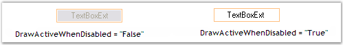
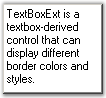
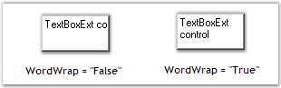
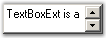
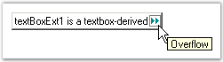
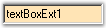
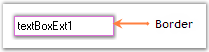
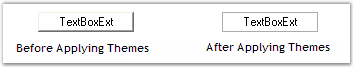

::: {style="DISPLAY: none"}
{#d2h_url_template}{#d2h_package_url style="WIDTH: 0px; DISPLAY: none; HEIGHT: 0px"}
:::

:::::::::::::::: {.d2h_secondary_topic style="PADDING-BOTTOM: 10pt; MARGIN: 0pt; PADDING-LEFT: 0pt; PADDING-RIGHT: 0pt; PADDING-TOP: 0pt"}
##### Concepts and Features {#concepts-and-features style="tab-stops: 0pt"}

###### 3.3.8.10.3.1        [[Text Settings]{style="COLOR: windowtext; TEXT-DECORATION: none; text-underline: none"}](http://help.syncfusion.com/ug_82/WindowsFormsUI_Tools/TextSettings21.html) {#text-settings style="tab-stops: 0pt"}

This section discusses the text settings of the TextBoxExt control.[]{style="COLOR: black"}

[]{style="COLOR: black"} 

The text associated with the TextBoxExt control can be set and customized using the below given settings.[]{style="COLOR: black"}

[]{style="COLOR: black"} 

::: {align="center"}
+------------------------------------------------+-----------------------------------------------------------------------------------------------------------+
| TextBoxExt Properties[]{style="COLOR: black"}  | Description[]{style="COLOR: black"}                                                                       |
+------------------------------------------------+-----------------------------------------------------------------------------------------------------------+
| Text[]{style="COLOR: black"}                   | Specifies the text associated with the control.[]{style="COLOR: black"}                                   |
+------------------------------------------------+-----------------------------------------------------------------------------------------------------------+
| CharacterCasing[]{style="COLOR: black"}        | Gets / sets the case of character as they are typed.[]{style="COLOR: black"}                              |
|                                                |                                                                                                           |
|                                                | []{style="COLOR: black"}                                                                                  |
|                                                |                                                                                                           |
|                                                | It includes the below given options:[]{style="COLOR: black"}                                              |
|                                                |                                                                                                           |
|                                                | []{style="COLOR: black"}                                                                                  |
|                                                |                                                                                                           |
|                                                | Normal,[]{style="COLOR: black"}                                                                           |
|                                                |                                                                                                           |
|                                                | Upper and[]{style="COLOR: black"}                                                                         |
|                                                |                                                                                                           |
|                                                | Lower.[]{style="COLOR: black"}                                                                            |
+------------------------------------------------+-----------------------------------------------------------------------------------------------------------+
| TextAlign[]{style="COLOR: black"}              | Indicates how the text should be aligned for edit controls.[]{style="COLOR: black"}                       |
+------------------------------------------------+-----------------------------------------------------------------------------------------------------------+
| RightToLeft[]{style="COLOR: black"}            | Indicates whether the component should draw right to left for RTL languages.[]{style="COLOR: black"}      |
+------------------------------------------------+-----------------------------------------------------------------------------------------------------------+
| SelectedText[]{style="COLOR: black"}           | Gets / sets a value indicating the currently selected text in the control.[]{style="COLOR: black"}        |
+------------------------------------------------+-----------------------------------------------------------------------------------------------------------+
| HideSelection[]{style="COLOR: black"}          | Indicates that the selection should be hidden, when the edit control loses focus.[]{style="COLOR: black"} |
+------------------------------------------------+-----------------------------------------------------------------------------------------------------------+
| DrawActiveWhenDisabled[]{style="COLOR: black"} | Specifies if the text should be drawn active, even when disabled.[]{style="COLOR: black"}                 |
+------------------------------------------------+-----------------------------------------------------------------------------------------------------------+
:::

[]{style="COLOR: black"} 

+----------------------------------------------------------------------------------------------------------------------------------------------------------------------------------------------------------------------------------------------------------------------------------------------------------------------+
| **[\[C#\]]{style="FONT-FAMILY: 'Courier New'; COLOR: black"}**[]{style="COLOR: black"}                                                                                                                                                                                                                               |
|                                                                                                                                                                                                                                                                                                                      |
| []{style="COLOR: black"}                                                                                                                                                                                                                                                                                             |
|                                                                                                                                                                                                                                                                                                                      |
| [this]{style="FONT-FAMILY: 'Courier New'; COLOR: blue"}[.textBoxExt1.CharacterCasing = System.Windows.Forms.]{style="FONT-FAMILY: 'Courier New'; COLOR: black"}[CharacterCasing]{style="FONT-FAMILY: 'Courier New'; COLOR: teal"}[.Lower;]{style="FONT-FAMILY: 'Courier New'; COLOR: black"}[]{style="COLOR: black"} |
|                                                                                                                                                                                                                                                                                                                      |
| [this]{style="FONT-FAMILY: 'Courier New'; COLOR: blue"}[.textBoxExt1.TextAlign = System.Windows.Forms.]{style="FONT-FAMILY: 'Courier New'; COLOR: black"}[HorizontalAlignment]{style="FONT-FAMILY: 'Courier New'; COLOR: teal"}[.Center;]{style="FONT-FAMILY: 'Courier New'; COLOR: black"}[]{style="COLOR: black"}  |
|                                                                                                                                                                                                                                                                                                                      |
| [this]{style="FONT-FAMILY: 'Courier New'; COLOR: blue"}[.textBoxExt1.RightToLeft = System.Windows.Forms.]{style="FONT-FAMILY: 'Courier New'; COLOR: black"}[RightToLeft]{style="FONT-FAMILY: 'Courier New'; COLOR: teal"}[.Yes;]{style="FONT-FAMILY: 'Courier New'; COLOR: black"}[]{style="COLOR: black"}           |
|                                                                                                                                                                                                                                                                                                                      |
| [this]{style="FONT-FAMILY: 'Courier New'; COLOR: blue"}[.textBoxExt1.SelectedText = ]{style="FONT-FAMILY: 'Courier New'; COLOR: black"}[\"TextBoxExt\"]{style="FONT-FAMILY: 'Courier New'; COLOR: maroon"}[;]{style="FONT-FAMILY: 'Courier New'; COLOR: black"}[]{style="COLOR: black"}                              |
|                                                                                                                                                                                                                                                                                                                      |
| [this]{style="FONT-FAMILY: 'Courier New'; COLOR: blue"}[.textBoxExt1.HideSelection = ]{style="FONT-FAMILY: 'Courier New'; COLOR: black"}[true]{style="FONT-FAMILY: 'Courier New'; COLOR: blue"}[;]{style="FONT-FAMILY: 'Courier New'; COLOR: black"}[]{style="COLOR: black"}                                         |
|                                                                                                                                                                                                                                                                                                                      |
| [this]{style="FONT-FAMILY: 'Courier New'; COLOR: blue"}[.textBoxExt1.DrawActiveWhenDisabled = ]{style="FONT-FAMILY: 'Courier New'; COLOR: black"}[true]{style="FONT-FAMILY: 'Courier New'; COLOR: blue"}[;]{style="FONT-FAMILY: 'Courier New'; COLOR: black"}[]{style="COLOR: black"}                                |
+----------------------------------------------------------------------------------------------------------------------------------------------------------------------------------------------------------------------------------------------------------------------------------------------------------------------+

[]{style="COLOR: black"} 

+----------------------------------------------------------------------------------------------------------------------------------------------------------------------------------------------------------------------------------+
| **[\[VB.NET\]]{style="FONT-FAMILY: 'Courier New'; COLOR: black"}**[]{style="COLOR: black"}                                                                                                                                       |
|                                                                                                                                                                                                                                  |
| []{style="COLOR: black"}                                                                                                                                                                                                         |
|                                                                                                                                                                                                                                  |
| [Me]{style="FONT-FAMILY: 'Courier New'; COLOR: blue"}[.textBoxExt1.CharacterCasing = System.Windows.Forms.CharacterCasing.Lower]{style="FONT-FAMILY: 'Courier New'; COLOR: black"}[]{style="COLOR: black"}                       |
|                                                                                                                                                                                                                                  |
| [Me]{style="FONT-FAMILY: 'Courier New'; COLOR: blue"}[.textBoxExt1.TextAlign = System.Windows.Forms.HorizontalAlignment.Center]{style="FONT-FAMILY: 'Courier New'; COLOR: black"}[]{style="COLOR: black"}                        |
|                                                                                                                                                                                                                                  |
| [Me]{style="FONT-FAMILY: 'Courier New'; COLOR: blue"}[.textBoxExt1.RightToLeft = System.Windows.Forms.RightToLeft.Yes]{style="FONT-FAMILY: 'Courier New'; COLOR: black"}[]{style="COLOR: black"}                                 |
|                                                                                                                                                                                                                                  |
| [Me]{style="FONT-FAMILY: 'Courier New'; COLOR: blue"}[.textBoxExt1.SelectedText = ]{style="FONT-FAMILY: 'Courier New'; COLOR: black"}[\"TextBoxExt\"]{style="FONT-FAMILY: 'Courier New'; COLOR: maroon"}[]{style="COLOR: black"} |
|                                                                                                                                                                                                                                  |
| [Me]{style="FONT-FAMILY: 'Courier New'; COLOR: blue"}[.textBoxExt1.HideSelection = ]{style="FONT-FAMILY: 'Courier New'; COLOR: black"}[True]{style="FONT-FAMILY: 'Courier New'; COLOR: blue"}[]{style="COLOR: black"}            |
|                                                                                                                                                                                                                                  |
| [Me]{style="FONT-FAMILY: 'Courier New'; COLOR: blue"}[.textBoxExt1.DrawActiveWhenDisabled = ]{style="FONT-FAMILY: 'Courier New'; COLOR: black"}[True]{style="FONT-FAMILY: 'Courier New'; COLOR: blue"}[]{style="COLOR: black"}   |
+----------------------------------------------------------------------------------------------------------------------------------------------------------------------------------------------------------------------------------+

[]{style="COLOR: black"} 

{border="0"}

[]{style="COLOR: black"} 

Figure 566: Character Case set to \"Lower\"

[]{style="COLOR: black"} 

{border="0"}

[]{style="COLOR: black"} 

Figure 567: Text Aligned to the \"Center\"

[]{style="COLOR: black"} 

{border="0"}

[]{style="COLOR: black"} 

Figure 568: RightToLeft property set to \"True\"

[]{style="COLOR: black"} 

{border="0"}

 

Figure 569: DrawActiveWhenDisabled property Set

[]{style="COLOR: black"} 

The methods associated with the above properties are given below.[]{style="COLOR: black"}

[]{style="COLOR: black"} 

::: {align="center"}
  -------------------------------------------------- ------------------------------------------------------------------------------------------------------------------------------------
  Methods[]{style="COLOR: black"}                    Description[]{style="COLOR: black"}
  AppendText[]{style="COLOR: black"}                 Appends text to the current text of a textbox.[]{style="COLOR: black"}
  OnCharacterCasingChanged[]{style="COLOR: black"}   Raises the CharacterCasingChanged event.[]{style="COLOR: black"}
  GetClipText[]{style="COLOR: black"}                Gets / sets the clipped text without the formatting.[]{style="COLOR: black"}
  Cut[]{style="COLOR: black"}                        Cuts the selected data to the clipboard.[]{style="COLOR: black"}
  Copy[]{style="COLOR: black"}                       Copies the content of the NumberTextBox to the clipboard. The ClipMode property dictates what gets copied.[]{style="COLOR: black"}
  Delete[]{style="COLOR: black"}                     Deletes the current selection of the TextBox.[]{style="COLOR: black"}
  Paste[]{style="COLOR: black"}                      Pastes the data in the clipboard into the NumberTextBox control.[]{style="COLOR: black"}
  Select[]{style="COLOR: black"}                     Selects a range of text in the TextBox.[]{style="COLOR: black"}
  SelectAll[]{style="COLOR: black"}                  Selects all text in the TextBox.[]{style="COLOR: black"}
  -------------------------------------------------- ------------------------------------------------------------------------------------------------------------------------------------
:::

[]{style="COLOR: black"} 

Multiline Text Settings[]{style="COLOR: black"}

[]{style="COLOR: black"} 

The text settings of the TextBoxExt control can be customized to display multiline text using the below given properties.[]{style="COLOR: black"}

[]{style="COLOR: black"} 

::: {align="center"}
+-----------------------------------------------+-----------------------------------------------------------------------------------------------------------------+
| TextBoxExt Properties[]{style="COLOR: black"} | Description[]{style="COLOR: black"}                                                                             |
+-----------------------------------------------+-----------------------------------------------------------------------------------------------------------------+
| Multiline[]{style="COLOR: black"}             | Controls whether the text of the edit control can span more than one line.[]{style="COLOR: black"}              |
+-----------------------------------------------+-----------------------------------------------------------------------------------------------------------------+
| Lines[]{style="COLOR: black"}                 | The lines of text in a multiline edit, as an array of string values.[]{style="COLOR: black"}                    |
+-----------------------------------------------+-----------------------------------------------------------------------------------------------------------------+
| WordWrap[]{style="COLOR: black"}              | Indicates if lines are automatically word-wrapped for multiline edit controls.[]{style="COLOR: black"}          |
+-----------------------------------------------+-----------------------------------------------------------------------------------------------------------------+
| ScrollBars[]{style="COLOR: black"}            | Indicates for multiline edit controls, which scrollbars will be shown for this control.[]{style="COLOR: black"} |
|                                               |                                                                                                                 |
|                                               | []{style="COLOR: black"}                                                                                        |
|                                               |                                                                                                                 |
|                                               | It includes the below given options.[]{style="COLOR: black"}                                                    |
|                                               |                                                                                                                 |
|                                               | []{style="COLOR: black"}                                                                                        |
|                                               |                                                                                                                 |
|                                               | *None,*[]{style="COLOR: black"}                                                                                 |
|                                               |                                                                                                                 |
|                                               | *Horizontal,*[]{style="COLOR: black"}                                                                           |
|                                               |                                                                                                                 |
|                                               | *Vertical and*[]{style="COLOR: black"}                                                                          |
|                                               |                                                                                                                 |
|                                               | *Both.*[]{style="COLOR: black"}                                                                                 |
+-----------------------------------------------+-----------------------------------------------------------------------------------------------------------------+
:::

[]{style="COLOR: black"} 

+---------------------------------------------------------------------------------------------------------------------------------------------------------------------------------------------------------------------------------------------------------------------------------------------------------------+
| **[\[C#\]]{style="FONT-FAMILY: 'Courier New'; COLOR: black"}**[]{style="COLOR: black"}                                                                                                                                                                                                                        |
|                                                                                                                                                                                                                                                                                                               |
| []{style="COLOR: black"}                                                                                                                                                                                                                                                                                      |
|                                                                                                                                                                                                                                                                                                               |
| [this]{style="FONT-FAMILY: 'Courier New'; COLOR: blue"}[.textBoxExt1.Multiline = ]{style="FONT-FAMILY: 'Courier New'; COLOR: black"}[true]{style="FONT-FAMILY: 'Courier New'; COLOR: blue"}[;]{style="FONT-FAMILY: 'Courier New'; COLOR: black"}[]{style="COLOR: black"}                                      |
|                                                                                                                                                                                                                                                                                                               |
| [this]{style="FONT-FAMILY: 'Courier New'; COLOR: blue"}[.textBoxExt1.WordWrap = ]{style="FONT-FAMILY: 'Courier New'; COLOR: black"}[true]{style="FONT-FAMILY: 'Courier New'; COLOR: blue"}[;]{style="FONT-FAMILY: 'Courier New'; COLOR: black"}[]{style="COLOR: black"}                                       |
|                                                                                                                                                                                                                                                                                                               |
| [this]{style="FONT-FAMILY: 'Courier New'; COLOR: blue"}[.textBoxExt1.ScrollBars = System.Windows.Forms.]{style="FONT-FAMILY: 'Courier New'; COLOR: black"}[ScrollBars]{style="FONT-FAMILY: 'Courier New'; COLOR: teal"}[.Vertical;]{style="FONT-FAMILY: 'Courier New'; COLOR: black"}[]{style="COLOR: black"} |
+---------------------------------------------------------------------------------------------------------------------------------------------------------------------------------------------------------------------------------------------------------------------------------------------------------------+

[]{style="COLOR: black"} 

+-------------------------------------------------------------------------------------------------------------------------------------------------------------------------------------------------------------------+
| **[\[VB.NET\]]{style="FONT-FAMILY: 'Courier New'; COLOR: black"}**[]{style="COLOR: black"}                                                                                                                        |
|                                                                                                                                                                                                                   |
| []{style="COLOR: black"}                                                                                                                                                                                          |
|                                                                                                                                                                                                                   |
| [Me]{style="FONT-FAMILY: 'Courier New'; COLOR: blue"}[.textBoxExt1.Multiline = ]{style="FONT-FAMILY: 'Courier New'; COLOR: black"}[True]{style="FONT-FAMILY: 'Courier New'; COLOR: blue"}[]{style="COLOR: black"} |
|                                                                                                                                                                                                                   |
| [Me]{style="FONT-FAMILY: 'Courier New'; COLOR: blue"}[.textBoxExt1.WordWrap = ]{style="FONT-FAMILY: 'Courier New'; COLOR: black"}[True]{style="FONT-FAMILY: 'Courier New'; COLOR: blue"}[]{style="COLOR: black"}  |
|                                                                                                                                                                                                                   |
| [Me]{style="FONT-FAMILY: 'Courier New'; COLOR: blue"}[.textBoxExt1.ScrollBars = System.Windows.Forms.ScrollBars.Vertical]{style="FONT-FAMILY: 'Courier New'; COLOR: black"}[]{style="COLOR: black"}               |
+-------------------------------------------------------------------------------------------------------------------------------------------------------------------------------------------------------------------+

[]{style="COLOR: black"} 

{border="0"}

[]{style="COLOR: black"} 

Figure 570: Multiline Text

[]{style="COLOR: black"} 

{border="0"}

[]{style="COLOR: black"} 

Figure 571: WordWrap property Set

[]{style="COLOR: black"} 

[{border="0"}]{style="COLOR: black"}[]{style="COLOR: black"}

[]{style="COLOR: black"} 

Figure 572: ScrollBars set for TextBoxExt Control

 

::: {style="BORDER-BOTTOM: windowtext 1pt solid; BORDER-LEFT: medium none; PADDING-BOTTOM: 1pt; MARGIN-TOP: 9pt; PADDING-LEFT: 0pt; PADDING-RIGHT: 0pt; MARGIN-BOTTOM: 9pt; BORDER-TOP: windowtext 1pt solid; BORDER-RIGHT: medium none; PADDING-TOP: 1pt"}
[{border="0"}]{style="COLOR: black"} Note: The ScrollToCaret() method can be used to scroll the contents of the control to the current caret position.[]{style="COLOR: black"}
:::

[]{style="COLOR: black"} 

OverflowIndicatorToolTipText[]{style="COLOR: black"}

[]{style="COLOR: black"} 

The tooltip that should be displayed when an overflow of text occurs can be set using the below given properties.[]{style="COLOR: black"}

[]{style="COLOR: black"} 

::: {align="center"}
  ------------------------------------------------------ -----------------------------------------------------------------------------------
  TextBoxExt Properties[]{style="COLOR: black"}          Description[]{style="COLOR: black"}
  OverflowIndicatorToolTipText[]{style="COLOR: black"}   Specifies the overflow indicator tooltip text.[]{style="COLOR: black"}
  ShowOverflowIndicator[]{style="COLOR: black"}          Gets / sets overflow indicator visibility.[]{style="COLOR: black"}
  ShowOverflowIndicatorToolTip[]{style="COLOR: black"}   Indicates whether to show the overflow indicator tooltip.[]{style="COLOR: black"}
  ------------------------------------------------------ -----------------------------------------------------------------------------------
:::

[]{style="COLOR: black"} 

+-------------------------------------------------------------------------------------------------------------------------------------------------------------------------------------------------------------------------------------------------------------------------------------------------------+
| **[\[C#\]]{style="FONT-FAMILY: 'Courier New'; COLOR: black"}**[]{style="COLOR: black"}                                                                                                                                                                                                                |
|                                                                                                                                                                                                                                                                                                       |
| []{style="COLOR: black"}                                                                                                                                                                                                                                                                              |
|                                                                                                                                                                                                                                                                                                       |
| [this]{style="FONT-FAMILY: 'Courier New'; COLOR: blue"}[.textBoxExt1.ShowOverflowIndicator = ]{style="FONT-FAMILY: 'Courier New'; COLOR: black"}[true]{style="FONT-FAMILY: 'Courier New'; COLOR: blue"}[;]{style="FONT-FAMILY: 'Courier New'; COLOR: black"}[]{style="COLOR: black"}                  |
|                                                                                                                                                                                                                                                                                                       |
| [this]{style="FONT-FAMILY: 'Courier New'; COLOR: blue"}[.textBoxExt1.ShowOverflowIndicatorToolTip = ]{style="FONT-FAMILY: 'Courier New'; COLOR: black"}[true]{style="FONT-FAMILY: 'Courier New'; COLOR: blue"}[;]{style="FONT-FAMILY: 'Courier New'; COLOR: black"}[]{style="COLOR: black"}           |
|                                                                                                                                                                                                                                                                                                       |
| [this]{style="FONT-FAMILY: 'Courier New'; COLOR: blue"}[.textBoxExt1.OverflowIndicatorToolTipText = ]{style="FONT-FAMILY: 'Courier New'; COLOR: black"}[\"Overflow\"]{style="FONT-FAMILY: 'Courier New'; COLOR: maroon"}[;]{style="FONT-FAMILY: 'Courier New'; COLOR: black"}[]{style="COLOR: black"} |
+-------------------------------------------------------------------------------------------------------------------------------------------------------------------------------------------------------------------------------------------------------------------------------------------------------+

[]{style="COLOR: black"} 

+------------------------------------------------------------------------------------------------------------------------------------------------------------------------------------------------------------------------------------------------+
| **[\[VB.NET\]]{style="FONT-FAMILY: 'Courier New'; COLOR: black"}**[]{style="COLOR: black"}                                                                                                                                                     |
|                                                                                                                                                                                                                                                |
| []{style="COLOR: black"}                                                                                                                                                                                                                       |
|                                                                                                                                                                                                                                                |
| [Me]{style="FONT-FAMILY: 'Courier New'; COLOR: blue"}[.textBoxExt1.ShowOverflowIndicator = ]{style="FONT-FAMILY: 'Courier New'; COLOR: black"}[True]{style="FONT-FAMILY: 'Courier New'; COLOR: blue"}[]{style="COLOR: black"}                  |
|                                                                                                                                                                                                                                                |
| [Me]{style="FONT-FAMILY: 'Courier New'; COLOR: blue"}[.textBoxExt1.ShowOverflowIndicatorToolTip = ]{style="FONT-FAMILY: 'Courier New'; COLOR: black"}[True]{style="FONT-FAMILY: 'Courier New'; COLOR: blue"}[]{style="COLOR: black"}           |
|                                                                                                                                                                                                                                                |
| [Me]{style="FONT-FAMILY: 'Courier New'; COLOR: blue"}[.textBoxExt1.OverflowIndicatorToolTipText = ]{style="FONT-FAMILY: 'Courier New'; COLOR: black"}[\"Overflow\"]{style="FONT-FAMILY: 'Courier New'; COLOR: maroon"}[]{style="COLOR: black"} |
+------------------------------------------------------------------------------------------------------------------------------------------------------------------------------------------------------------------------------------------------+

[]{style="COLOR: black"} 

{border="0"}

[]{style="COLOR: black"} 

Figure 573: Overflow Indicator ToolTip Text Set

[]{style="COLOR: black"} 

::: {style="BORDER-BOTTOM: windowtext 1pt solid; BORDER-LEFT: medium none; PADDING-BOTTOM: 1pt; MARGIN-TOP: 9pt; PADDING-LEFT: 0pt; PADDING-RIGHT: 0pt; MARGIN-BOTTOM: 9pt; BORDER-TOP: windowtext 1pt solid; BORDER-RIGHT: medium none; PADDING-TOP: 1pt"}
[{border="0"}]{style="COLOR: black"} Note: If there is no value set for the OverflowIndicatorToolTipText property, then the value set for the Text property of the TextBoxExt will be displayed as the tooltip.[]{style="COLOR: black"}
:::

[]{style="COLOR: black"} 

A sample which demonstrates the Text, Text Align, Character Casing, RightToLeft, Multiline, Word Wrap, ScrollBars and Overflow Indicator ToolTip features of TextBoxExt control is available in the below sample installation path.[]{style="COLOR: black"}

[]{style="COLOR: black"} 

..My Documents\\Syncfusion\\EssentialStudio\\***Version Number***\\Windows\\Tools.Windows\\Samples\\2.0\\Editors Package\\EditorControls[]{style="COLOR: black"}

 

###### 3.3.8.10.3.2        [[Appearance Settings]{style="COLOR: windowtext; TEXT-DECORATION: none; text-underline: none"}](http://help.syncfusion.com/ug_82/WindowsFormsUI_Tools/AppearanceSettings41.html) {#appearance-settings style="tab-stops: 0pt"}

3.3.8.10.3.2.1     [[Background Settings]{style="COLOR: windowtext; TEXT-DECORATION: none; text-underline: none"}](http://help.syncfusion.com/ug_82/WindowsFormsUI_Tools/BackgroundSettings31.html)

\
The background settings of the TextBoxExt control are discussed below.[]{style="COLOR: black"}

[]{style="COLOR: black"} 

Background Color[]{style="COLOR: black"}

[]{style="COLOR: black"} 

The background color of the control can be set using the property given below.[]{style="COLOR: black"}

[]{style="COLOR: black"} 

::: {align="center"}
  --------------------------------------------- --------------------------------------------------------------------------
  TextBoxExt Property[]{style="COLOR: black"}   Description[]{style="COLOR: black"}
  BackColor[]{style="COLOR: black"}             Specifies the background color of the component.[]{style="COLOR: black"}
  --------------------------------------------- --------------------------------------------------------------------------
:::

[]{style="COLOR: black"} 

+---------------------------------------------------------------------------------------------------------------------------------------------------------------------------------------------------------------------------------------------------------------------------------------------------+
| **[\[C#\]]{style="FONT-FAMILY: 'Courier New'; COLOR: black"}**[]{style="COLOR: black"}                                                                                                                                                                                                            |
|                                                                                                                                                                                                                                                                                                   |
| []{style="COLOR: black"}                                                                                                                                                                                                                                                                          |
|                                                                                                                                                                                                                                                                                                   |
| [this]{style="FONT-FAMILY: 'Courier New'; COLOR: blue"}[.textBoxExt1.BackColor = System.Drawing.]{style="FONT-FAMILY: 'Courier New'; COLOR: black"}[Color]{style="FONT-FAMILY: 'Courier New'; COLOR: teal"}[.Moccasin;]{style="FONT-FAMILY: 'Courier New'; COLOR: black"}[]{style="COLOR: black"} |
+---------------------------------------------------------------------------------------------------------------------------------------------------------------------------------------------------------------------------------------------------------------------------------------------------+

[]{style="COLOR: black"} 

+-----------------------------------------------------------------------------------------------------------------------------------------------------------------------------------------+
| **[\[VB.NET\]]{style="FONT-FAMILY: 'Courier New'; COLOR: black"}**[]{style="COLOR: black"}                                                                                              |
|                                                                                                                                                                                         |
| []{style="COLOR: black"}                                                                                                                                                                |
|                                                                                                                                                                                         |
| [Me]{style="FONT-FAMILY: 'Courier New'; COLOR: blue"}[.textBoxExt1.BackColor = System.Drawing.Color.Moccasin]{style="FONT-FAMILY: 'Courier New'; COLOR: black"}[]{style="COLOR: black"} |
+-----------------------------------------------------------------------------------------------------------------------------------------------------------------------------------------+

[]{style="COLOR: black"} 

{border="0"}

[]{style="COLOR: black"} 

Figure 574: Background Color set for TextBoxExt[]{style="COLOR: black"}

 

3.3.8.10.3.2.2     [[Foreground Settings]{style="COLOR: windowtext; TEXT-DECORATION: none; text-underline: none"}](http://help.syncfusion.com/ug_82/WindowsFormsUI_Tools/ForegroundSettings21.html)

The foreground settings of the TextBoxExt control are discussed below.[]{style="COLOR: black"}

[]{style="COLOR: black"} 

Foreground Color[]{style="COLOR: black"}

[]{style="COLOR: black"} 

The foreground color of the control can be set using the property given below.[]{style="COLOR: black"}

[]{style="COLOR: black"} 

::: {align="center"}
  --------------------------------------------- --------------------------------------------------------------------------------------------------------------
  TextBoxExt Property[]{style="COLOR: black"}   Description[]{style="COLOR: black"}
  ForeColor[]{style="COLOR: black"}             Gets / sets the foreground color of the spin box (also known as an up-down control).[]{style="COLOR: black"}
  --------------------------------------------- --------------------------------------------------------------------------------------------------------------
:::

[]{style="COLOR: black"} 

+--------------------------------------------------------------------------------------------------------------------------------------------------------------------------------------------------------------------------------------------------------------------------------------------------------+
| **[\[C#\]]{style="FONT-FAMILY: 'Courier New'; COLOR: black"}**[]{style="COLOR: black"}                                                                                                                                                                                                                 |
|                                                                                                                                                                                                                                                                                                        |
| []{style="COLOR: black"}                                                                                                                                                                                                                                                                               |
|                                                                                                                                                                                                                                                                                                        |
| [this]{style="FONT-FAMILY: 'Courier New'; COLOR: blue"}[.textBoxExt1.ForeColor = System.Drawing.]{style="FONT-FAMILY: 'Courier New'; COLOR: black"}[Color]{style="FONT-FAMILY: 'Courier New'; COLOR: teal"}[.LightSeaGreen;]{style="FONT-FAMILY: 'Courier New'; COLOR: black"}[]{style="COLOR: black"} |
+--------------------------------------------------------------------------------------------------------------------------------------------------------------------------------------------------------------------------------------------------------------------------------------------------------+

[]{style="COLOR: black"} 

+----------------------------------------------------------------------------------------------------------------------------------------------------------------------------------------------+
| **[\[VB.NET\]]{style="FONT-FAMILY: 'Courier New'; COLOR: black"}**[]{style="COLOR: black"}                                                                                                   |
|                                                                                                                                                                                              |
| []{style="COLOR: black"}                                                                                                                                                                     |
|                                                                                                                                                                                              |
| [Me]{style="FONT-FAMILY: 'Courier New'; COLOR: blue"}[.textBoxExt1.ForeColor = System.Drawing.Color.LightSeaGreen]{style="FONT-FAMILY: 'Courier New'; COLOR: black"}[]{style="COLOR: black"} |
+----------------------------------------------------------------------------------------------------------------------------------------------------------------------------------------------+

[]{style="COLOR: black"} 

{border="0"}

[]{style="COLOR: black"} 

Figure 575: Foreground Color set for TextBoxExt[]{style="COLOR: black"}

 

###### 3.3.8.10.3.3        [[Behavior Settings]{style="COLOR: windowtext; TEXT-DECORATION: none; text-underline: none"}](http://help.syncfusion.com/ug_82/WindowsFormsUI_Tools/BehaviorSettings31.html) {#behavior-settings style="tab-stops: 0pt"}

The behavior settings of the TextBoxExt control are discussed below.[]{style="COLOR: black"}

[]{style="COLOR: black"} 

MaxLength[]{style="COLOR: black"}

[]{style="COLOR: black"} 

The maximum length of the text can be set using the property given below.[]{style="COLOR: black"}

[]{style="COLOR: black"} 

::: {align="center"}
  --------------------------------------------- ------------------------------------------------------------------------------------------------------------------------------------------------------
  TextBoxExt Property[]{style="COLOR: black"}   Description[]{style="COLOR: black"}
  MaxLength[]{style="COLOR: black"}             Specifies the maximum number of characters that can be entered into the edit control. The default value is set to \'32767\'.[]{style="COLOR: black"}
  --------------------------------------------- ------------------------------------------------------------------------------------------------------------------------------------------------------
:::

[]{style="COLOR: black"} 

+---------------------------------------------------------------------------------------------------------------------------------------------------------------------------------------------------------------------------------------+
| **[\[C#\]]{style="FONT-FAMILY: 'Courier New'; COLOR: black"}**[]{style="COLOR: black"}                                                                                                                                                |
|                                                                                                                                                                                                                                       |
| []{style="COLOR: black"}                                                                                                                                                                                                              |
|                                                                                                                                                                                                                                       |
| [this]{style="FONT-FAMILY: 'Courier New'; COLOR: blue"}[.textBoxExt1.MaxLength = 32800; ]{style="FONT-FAMILY: 'Courier New'; COLOR: black"}[              ]{style="FONT-FAMILY: 'Courier New'; COLOR: black"}[]{style="COLOR: black"} |
+---------------------------------------------------------------------------------------------------------------------------------------------------------------------------------------------------------------------------------------+

[]{style="COLOR: black"} 

+-----------------------------------------------------------------------------------------------------------------------------------------------------------------+
| **[\[VB\]]{style="FONT-FAMILY: 'Courier New'; COLOR: black"}**[]{style="COLOR: black"}                                                                          |
|                                                                                                                                                                 |
| []{style="COLOR: black"}                                                                                                                                        |
|                                                                                                                                                                 |
| [Me]{style="FONT-FAMILY: 'Courier New'; COLOR: blue"}[.textBoxExt1.MaxLength = 32800]{style="FONT-FAMILY: 'Courier New'; COLOR: black"}[]{style="COLOR: black"} |
+-----------------------------------------------------------------------------------------------------------------------------------------------------------------+

[]{style="COLOR: black"} 

ReadOnly[]{style="COLOR: black"}

[]{style="COLOR: black"} 

The ReadOnly mode can be enabled for the TextBoxExt control using the below given property.[]{style="COLOR: black"}

[]{style="COLOR: black"} 

::: {align="center"}
  --------------------------------------------- -----------------------------------------------------------------------------------------------
  TextBoxExt Property[]{style="COLOR: black"}   Description[]{style="COLOR: black"}
  ReadOnly[]{style="COLOR: black"}              Specifies whether the text in the edit control can be changed or not.[]{style="COLOR: black"}
  --------------------------------------------- -----------------------------------------------------------------------------------------------
:::

[]{style="COLOR: black"} 

+-------------------------------------------------------------------------------------------------------------------------------------------------------------------------------------------------------------------------------------------------------------------------+
| **[\[C#\]]{style="FONT-FAMILY: 'Courier New'; COLOR: black"}**[]{style="COLOR: black"}                                                                                                                                                                                  |
|                                                                                                                                                                                                                                                                         |
| []{style="COLOR: black"}                                                                                                                                                                                                                                                |
|                                                                                                                                                                                                                                                                         |
| [this]{style="FONT-FAMILY: 'Courier New'; COLOR: blue"}[.textBoxExt1.ReadOnly = ]{style="FONT-FAMILY: 'Courier New'; COLOR: black"}[true]{style="FONT-FAMILY: 'Courier New'; COLOR: blue"}[;]{style="FONT-FAMILY: 'Courier New'; COLOR: black"}[]{style="COLOR: black"} |
+-------------------------------------------------------------------------------------------------------------------------------------------------------------------------------------------------------------------------------------------------------------------------+

[]{style="COLOR: black"} 

+------------------------------------------------------------------------------------------------------------------------------------------------------------------------------------------------------------------+
| **[\[VB\]]{style="FONT-FAMILY: 'Courier New'; COLOR: black"}**[]{style="COLOR: black"}                                                                                                                           |
|                                                                                                                                                                                                                  |
| []{style="COLOR: black"}                                                                                                                                                                                         |
|                                                                                                                                                                                                                  |
| [Me]{style="FONT-FAMILY: 'Courier New'; COLOR: blue"}[.textBoxExt1.ReadOnly = ]{style="FONT-FAMILY: 'Courier New'; COLOR: black"}[True]{style="FONT-FAMILY: 'Courier New'; COLOR: blue"}[]{style="COLOR: black"} |
+------------------------------------------------------------------------------------------------------------------------------------------------------------------------------------------------------------------+

[]{style="COLOR: black"} 

A sample which demonstrates the ReadOnly mode of TextBoxExt control is available in the below sample installation path.[]{style="COLOR: black"}

[]{style="COLOR: black"} 

..My Documents\\Syncfusion\\EssentialStudio***\\Version Number***\\Windows\\Tools.Windows\\Samples\\2.0\\Editors Package\\EditorControls[]{style="COLOR: black"}

 

###### 3.3.8.10.3.4        [[Border Settings]{style="COLOR: windowtext; TEXT-DECORATION: none; text-underline: none"}](http://help.syncfusion.com/ug_82/WindowsFormsUI_Tools/BorderStyles7.html) {#border-settings style="tab-stops: 0pt"}

The border settings of the TextBoxExt control are discussed in this section.[]{style="COLOR: black"}

[]{style="COLOR: black"} 

Color and Styles can be applied to the border of the TextBoxExt control as discussed below.[]{style="COLOR: black"}

[]{style="COLOR: black"} 

::: {align="center"}
+-----------------------------------------------+------------------------------------------------------------------------------------------------------------------------+
| TextBoxExt Properties[]{style="COLOR: black"} | Description[]{style="COLOR: black"}                                                                                    |
+-----------------------------------------------+------------------------------------------------------------------------------------------------------------------------+
| Border3DStyle[]{style="COLOR: black"}         | Indicates the style of the 3D border. The options included are as follows:[]{style="COLOR: black"}                     |
|                                               |                                                                                                                        |
|                                               | []{style="COLOR: black"}                                                                                               |
|                                               |                                                                                                                        |
|                                               | *RaisedOuter,*[]{style="COLOR: black"}                                                                                 |
|                                               |                                                                                                                        |
|                                               | *SunkenOuter,*[]{style="COLOR: black"}                                                                                 |
|                                               |                                                                                                                        |
|                                               | *RaisedInner,*[]{style="COLOR: black"}                                                                                 |
|                                               |                                                                                                                        |
|                                               | *SunkenInner,*[]{style="COLOR: black"}                                                                                 |
|                                               |                                                                                                                        |
|                                               | *Raised,*[]{style="COLOR: black"}                                                                                      |
|                                               |                                                                                                                        |
|                                               | *Etched,*[]{style="COLOR: black"}                                                                                      |
|                                               |                                                                                                                        |
|                                               | *Bump,*[]{style="COLOR: black"}                                                                                        |
|                                               |                                                                                                                        |
|                                               | *Sunken,*[]{style="COLOR: black"}                                                                                      |
|                                               |                                                                                                                        |
|                                               | *Adjust and*[]{style="COLOR: black"}                                                                                   |
|                                               |                                                                                                                        |
|                                               | *Flat.*[]{style="COLOR: black"}                                                                                        |
|                                               |                                                                                                                        |
|                                               | []{style="COLOR: black"}                                                                                               |
|                                               |                                                                                                                        |
|                                               | The default value is set to \'Sunken\'.[]{style="COLOR: black"}                                                        |
+-----------------------------------------------+------------------------------------------------------------------------------------------------------------------------+
| BorderColor[]{style="COLOR: black"}           | Specifies the color of the 2D border.[]{style="COLOR: black"}                                                          |
+-----------------------------------------------+------------------------------------------------------------------------------------------------------------------------+
| BorderSides[]{style="COLOR: black"}           | Indicates the border sides of the panel. The options included are as follows:[]{style="COLOR: black"}                  |
|                                               |                                                                                                                        |
|                                               | []{style="COLOR: black"}                                                                                               |
|                                               |                                                                                                                        |
|                                               | *Left,*[]{style="COLOR: black"}                                                                                        |
|                                               |                                                                                                                        |
|                                               | *Top,*[]{style="COLOR: black"}                                                                                         |
|                                               |                                                                                                                        |
|                                               | *Right,*[]{style="COLOR: black"}                                                                                       |
|                                               |                                                                                                                        |
|                                               | *Bottom,*[]{style="COLOR: black"}                                                                                      |
|                                               |                                                                                                                        |
|                                               | *Middle and*[]{style="COLOR: black"}                                                                                   |
|                                               |                                                                                                                        |
|                                               | *All.*[]{style="COLOR: black"}                                                                                         |
+-----------------------------------------------+------------------------------------------------------------------------------------------------------------------------+
| BorderStyle[]{style="COLOR: black"}           | Indicates whether the edit control should have a border. The options included are given below:[]{style="COLOR: black"} |
|                                               |                                                                                                                        |
|                                               | []{style="COLOR: black"}                                                                                               |
|                                               |                                                                                                                        |
|                                               | *FixedSingle,*[]{style="COLOR: black"}                                                                                 |
|                                               |                                                                                                                        |
|                                               | *Fixed3D and*[]{style="COLOR: black"}                                                                                  |
|                                               |                                                                                                                        |
|                                               | *None.*[]{style="COLOR: black"}                                                                                        |
+-----------------------------------------------+------------------------------------------------------------------------------------------------------------------------+
:::

[]{style="COLOR: black"} 

+--------------------------------------------------------------------------------------------------------------------------------------------------------------------------------------------------------------------------------------------------------------------------------------------------------------------+
| **[\[C#\]]{style="FONT-FAMILY: 'Courier New'; COLOR: black"}**[]{style="COLOR: black"}                                                                                                                                                                                                                             |
|                                                                                                                                                                                                                                                                                                                    |
| []{style="COLOR: black"}                                                                                                                                                                                                                                                                                           |
|                                                                                                                                                                                                                                                                                                                    |
| [this]{style="FONT-FAMILY: 'Courier New'; COLOR: blue"}[.textBoxExt1.Border3DStyle = System.Windows.Forms.]{style="FONT-FAMILY: 'Courier New'; COLOR: black"}[Border3DStyle]{style="FONT-FAMILY: 'Courier New'; COLOR: teal"}[.Raised;]{style="FONT-FAMILY: 'Courier New'; COLOR: black"}[]{style="COLOR: black"}  |
|                                                                                                                                                                                                                                                                                                                    |
| [this]{style="FONT-FAMILY: 'Courier New'; COLOR: blue"}[.textBoxExt1.BorderColor = System.Drawing.]{style="FONT-FAMILY: 'Courier New'; COLOR: black"}[Color]{style="FONT-FAMILY: 'Courier New'; COLOR: teal"}[.Orchid]{style="FONT-FAMILY: 'Courier New'; COLOR: black"}[]{style="COLOR: black"}                   |
|                                                                                                                                                                                                                                                                                                                    |
| [this]{style="FONT-FAMILY: 'Courier New'; COLOR: blue"}[.textBoxExt1.BorderSides = System.Windows.Forms.]{style="FONT-FAMILY: 'Courier New'; COLOR: black"}[Border3DSide]{style="FONT-FAMILY: 'Courier New'; COLOR: teal"}[.All;]{style="FONT-FAMILY: 'Courier New'; COLOR: black"}[]{style="COLOR: black"}        |
|                                                                                                                                                                                                                                                                                                                    |
| [this]{style="FONT-FAMILY: 'Courier New'; COLOR: blue"}[.textBoxExt1.BorderStyle = System.Windows.Forms.]{style="FONT-FAMILY: 'Courier New'; COLOR: black"}[BorderStyle]{style="FONT-FAMILY: 'Courier New'; COLOR: teal"}[.FixedSingle;]{style="FONT-FAMILY: 'Courier New'; COLOR: black"}[]{style="COLOR: black"} |
+--------------------------------------------------------------------------------------------------------------------------------------------------------------------------------------------------------------------------------------------------------------------------------------------------------------------+

[]{style="COLOR: black"} 

+----------------------------------------------------------------------------------------------------------------------------------------------------------------------------------------------------------+
| **[\[VB.NET\]]{style="FONT-FAMILY: 'Courier New'; COLOR: black"}**[]{style="COLOR: black"}                                                                                                               |
|                                                                                                                                                                                                          |
| []{style="COLOR: black"}                                                                                                                                                                                 |
|                                                                                                                                                                                                          |
| [Me]{style="FONT-FAMILY: 'Courier New'; COLOR: blue"}[.textBoxExt1.Border3DStyle = System.Windows.Forms.Border3DStyle.Raised]{style="FONT-FAMILY: 'Courier New'; COLOR: black"}[]{style="COLOR: black"}  |
|                                                                                                                                                                                                          |
| [Me]{style="FONT-FAMILY: 'Courier New'; COLOR: blue"}[.textBoxExt1.BorderColor = System.Drawing.Color.Orchid]{style="FONT-FAMILY: 'Courier New'; COLOR: black"}[]{style="COLOR: black"}                  |
|                                                                                                                                                                                                          |
| [Me]{style="FONT-FAMILY: 'Courier New'; COLOR: blue"}[.textBoxExt1.BorderSides = System.Windows.Forms.Border3DSide.All]{style="FONT-FAMILY: 'Courier New'; COLOR: black"}[]{style="COLOR: black"}        |
|                                                                                                                                                                                                          |
| [Me]{style="FONT-FAMILY: 'Courier New'; COLOR: blue"}[.textBoxExt1.BorderStyle = System.Windows.Forms.BorderStyle.FixedSingle]{style="FONT-FAMILY: 'Courier New'; COLOR: black"}[]{style="COLOR: black"} |
+----------------------------------------------------------------------------------------------------------------------------------------------------------------------------------------------------------+

[]{style="COLOR: black"} 

{border="0"}

[]{style="COLOR: black"} 

Figure 576: TextBoxExt with Border Set

[]{style="COLOR: black"} 

A sample which demonstrates the Border Settings of TextBoxExt control is available in the below sample installation path.[]{style="COLOR: black"}

[]{style="COLOR: black"} 

..My Documents\\Syncfusion\\EssentialStudio\\***Version Number***\\Windows\\Tools.Windows\\Samples\\2.0\\Editors Package\\EditorControls[]{style="COLOR: black"}

 

###### 3.3.8.10.3.5        [[Layout Settings]{style="COLOR: windowtext; TEXT-DECORATION: none; text-underline: none"}](http://help.syncfusion.com/ug_82/WindowsFormsUI_Tools/LayoutSettings1.html) {#layout-settings style="tab-stops: 0pt"}

The layout settings of the TextBoxExt control are discussed in this section.[]{style="COLOR: black"}

[]{style="COLOR: black"} 

The size of the TextBoxExt control can be set according to the needs of the user using the properties discussed below.[]{style="COLOR: black"}

[]{style="COLOR: black"} 

::: {align="center"}
  ----------------------------------------------- -----------------------------------------------------------------------
  TextBoxExt Properties[]{style="COLOR: black"}   Description[]{style="COLOR: black"}
  MaximumSize[]{style="COLOR: black"}             Gets / sets the maximum size for the control.[]{style="COLOR: black"}
  MinimumSize[]{style="COLOR: black"}             Gets / sets the minimum size for the control.[]{style="COLOR: black"}
  ----------------------------------------------- -----------------------------------------------------------------------
:::

[]{style="COLOR: black"} 

+---------------------------------------------------------------------------------------------------------------------------------------------------------------------------------------------------------------------------------------------------------------------------------------------------------------------------------------------------------------------------------------------------------------+
| **[\[C#\]]{style="FONT-FAMILY: 'Courier New'; COLOR: black"}**[]{style="COLOR: black"}                                                                                                                                                                                                                                                                                                                        |
|                                                                                                                                                                                                                                                                                                                                                                                                               |
| []{style="COLOR: black"}                                                                                                                                                                                                                                                                                                                                                                                      |
|                                                                                                                                                                                                                                                                                                                                                                                                               |
| [this]{style="FONT-FAMILY: 'Courier New'; COLOR: blue"}[.textBoxExt1.MaximumSize = ]{style="FONT-FAMILY: 'Courier New'; COLOR: black"}[new]{style="FONT-FAMILY: 'Courier New'; COLOR: blue"}[ System.Drawing.]{style="FONT-FAMILY: 'Courier New'; COLOR: black"}[Size]{style="FONT-FAMILY: 'Courier New'; COLOR: teal"}[(150, 20);]{style="FONT-FAMILY: 'Courier New'; COLOR: black"}[]{style="COLOR: black"} |
|                                                                                                                                                                                                                                                                                                                                                                                                               |
| [this]{style="FONT-FAMILY: 'Courier New'; COLOR: blue"}[.textBoxExt1.MinimumSize = ]{style="FONT-FAMILY: 'Courier New'; COLOR: black"}[new]{style="FONT-FAMILY: 'Courier New'; COLOR: blue"}[ System.Drawing.]{style="FONT-FAMILY: 'Courier New'; COLOR: black"}[Size]{style="FONT-FAMILY: 'Courier New'; COLOR: teal"}[(150, 20);]{style="FONT-FAMILY: 'Courier New'; COLOR: black"}[]{style="COLOR: black"} |
+---------------------------------------------------------------------------------------------------------------------------------------------------------------------------------------------------------------------------------------------------------------------------------------------------------------------------------------------------------------------------------------------------------------+

[]{style="COLOR: black"} 

+-----------------------------------------------------------------------------------------------------------------------------------------------------------------------------------------------------------------------------------------------------------------------------------------------------+
| **[\[VB.NET\]]{style="FONT-FAMILY: 'Courier New'; COLOR: black"}**[]{style="COLOR: black"}                                                                                                                                                                                                          |
|                                                                                                                                                                                                                                                                                                     |
| []{style="COLOR: black"}                                                                                                                                                                                                                                                                            |
|                                                                                                                                                                                                                                                                                                     |
| [Me]{style="FONT-FAMILY: 'Courier New'; COLOR: blue"}[.textBoxExt1.MaximumSize = ]{style="FONT-FAMILY: 'Courier New'; COLOR: black"}[New]{style="FONT-FAMILY: 'Courier New'; COLOR: blue"}[ System.Drawing.Size(150, 20)]{style="FONT-FAMILY: 'Courier New'; COLOR: black"}[]{style="COLOR: black"} |
|                                                                                                                                                                                                                                                                                                     |
| [Me]{style="FONT-FAMILY: 'Courier New'; COLOR: blue"}[.textBoxExt1.MinimumSize = ]{style="FONT-FAMILY: 'Courier New'; COLOR: black"}[New]{style="FONT-FAMILY: 'Courier New'; COLOR: blue"}[ System.Drawing.Size(150, 20)]{style="FONT-FAMILY: 'Courier New'; COLOR: black"}[]{style="COLOR: black"} |
+-----------------------------------------------------------------------------------------------------------------------------------------------------------------------------------------------------------------------------------------------------------------------------------------------------+

[]{style="COLOR: black"} 

{border="0"}

[]{style="COLOR: black"} 

Figure 577: Size of the TextBoxExt control Set

 

###### 3.3.8.10.3.6        [[Applying Themes]{style="COLOR: windowtext; TEXT-DECORATION: none; text-underline: none"}](http://help.syncfusion.com/ug_82/WindowsFormsUI_Tools/VisualStyles1.html) {#applying-themes style="tab-stops: 0pt"}

Themes defines the look and feel of the control. This can be enabled using the below given property.[]{style="COLOR: black"}

[]{style="COLOR: black"} 

::: {align="center"}
  --------------------------------------------- ------------------------------------------------------------------------------------------------------------
  TextBoxExt Property[]{style="COLOR: black"}   Description[]{style="COLOR: black"}
  ThemesEnabled[]{style="COLOR: black"}         Specifies whether or not to use XP themes, when BorderStyle is set to \'Fixed3D\'.[]{style="COLOR: black"}
  --------------------------------------------- ------------------------------------------------------------------------------------------------------------
:::

[]{style="COLOR: black"} 

+------------------------------------------------------------------------------------------------------------------------------------------------------------------------------------------------------------------------------------------------------------------------------------------------------------------------------------------------------------+
| **[\[C#\]]{style="FONT-FAMILY: 'Courier New'; COLOR: black"}**[]{style="COLOR: black"}                                                                                                                                                                                                                                                                     |
|                                                                                                                                                                                                                                                                                                                                                            |
| []{style="COLOR: black"}                                                                                                                                                                                                                                                                                                                                   |
|                                                                                                                                                                                                                                                                                                                                                            |
| [this]{style="FONT-FAMILY: 'Courier New'; COLOR: blue"}[.textBoxExt1.ThemesEnabled = ]{style="FONT-FAMILY: 'Courier New'; COLOR: black"}[true]{style="FONT-FAMILY: 'Courier New'; COLOR: blue"}[;   ]{style="FONT-FAMILY: 'Courier New'; COLOR: black"}[                       ]{style="FONT-FAMILY: 'Courier New'; COLOR: black"}[]{style="COLOR: black"} |
+------------------------------------------------------------------------------------------------------------------------------------------------------------------------------------------------------------------------------------------------------------------------------------------------------------------------------------------------------------+

[]{style="COLOR: black"} 

+-----------------------------------------------------------------------------------------------------------------------------------------------------------------------------------------------------------------------+
| **[\[VB\]]{style="FONT-FAMILY: 'Courier New'; COLOR: black"}**[]{style="COLOR: black"}                                                                                                                                |
|                                                                                                                                                                                                                       |
| []{style="COLOR: black"}                                                                                                                                                                                              |
|                                                                                                                                                                                                                       |
| [Me]{style="FONT-FAMILY: 'Courier New'; COLOR: blue"}[.textBoxExt1.ThemesEnabled = ]{style="FONT-FAMILY: 'Courier New'; COLOR: black"}[True]{style="FONT-FAMILY: 'Courier New'; COLOR: blue"}[]{style="COLOR: black"} |
+-----------------------------------------------------------------------------------------------------------------------------------------------------------------------------------------------------------------------+

[]{style="COLOR: black"} 

{border="0"}

[]{style="COLOR: black"} 

Figure 578: ThemesEnabled property Set

 

 

[]{#related-topics}
::::::::::::::::
