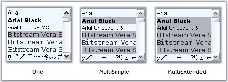
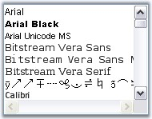
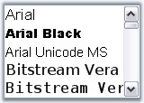

::: {style="DISPLAY: none"}
{#d2h_url_template}{#d2h_package_url style="WIDTH: 0px; DISPLAY: none; HEIGHT: 0px"}
:::

:::: {.d2h_secondary_topic style="PADDING-BOTTOM: 10pt; MARGIN: 0pt; PADDING-LEFT: 0pt; PADDING-RIGHT: 0pt; PADDING-TOP: 0pt"}
##### Concepts and Features {#concepts-and-features style="tab-stops: 0pt"}

[]{style="COLOR: #15428b"} 

This section will discuss the concepts and features of the FontListBox control in the below topics.

[]{style="COLOR: #15428b"} 

###### []{#p724}[]{#_Selection_Mode}3.3.9.1.3.1 Selection Mode {#selection-mode style="tab-stops: 0pt"}

[]{style="COLOR: #15428b"} 

At run time, the items in the FontListBox can be selected, based on the selection mode specified in **SelectionMode** property. Selection can be made using mouse as well as using keyboard.

 

The options are,

 

[·      ]{style="FONT-FAMILY: Symbol"}one,

[·      ]{style="FONT-FAMILY: Symbol"}MultiSimple, and

[·      ]{style="FONT-FAMILY: Symbol"}MultiExtended.

*[]{style="COLOR: black; FONT-SIZE: 8pt"}* 

+-----------------------------------------------------------------------------------------------------------------------------------------------------------------------------------------------------+
| **[\[C#\]]{style="FONT-FAMILY: 'Courier New'; COLOR: black"}**                                                                                                                                      |
|                                                                                                                                                                                                     |
| []{style="COLOR: black"}                                                                                                                                                                            |
|                                                                                                                                                                                                     |
| [this]{style="FONT-FAMILY: 'Courier New'; COLOR: blue"}[.fontListBox1.SelectionMode = System.Windows.Forms.[SelectionMode]{style="COLOR: teal"}.MultiExtended;]{style="FONT-FAMILY: 'Courier New'"} |
+-----------------------------------------------------------------------------------------------------------------------------------------------------------------------------------------------------+

[]{style="COLOR: #15428b"} 

+---------------------------------------------------------------------------------------------------------------------------------------------------------------------------------------------------+
| **[\[VB.NET\]]{style="FONT-FAMILY: 'Courier New'; COLOR: black"}**                                                                                                                                |
|                                                                                                                                                                                                   |
| []{style="COLOR: black"}                                                                                                                                                                          |
|                                                                                                                                                                                                   |
| [Me]{style="FONT-FAMILY: 'Courier New'; COLOR: blue"}[.fontListBox1.SelectionMode = System.Windows.Forms.[SelectionMode]{style="COLOR: black"}.MultiExtended]{style="FONT-FAMILY: 'Courier New'"} |
+---------------------------------------------------------------------------------------------------------------------------------------------------------------------------------------------------+

*[]{style="COLOR: black; FONT-SIZE: 8pt"}* 

{border="0"}

**[]{style="COLOR: #15428b"}** 

Figure 582: Selection Modes of FontListBox

###### []{#p725}3.3.9.1.3.2 ScrollBar Settings {#scrollbar-settings style="tab-stops: 0pt"}

[]{style="COLOR: #15428b"} 

FontListBox control by default has a vertical scrollbar. It can also have a horizontal scrollbar. This section will discuss the properties which sets the scrollbar for the control.

[]{style="COLOR: #15428b"} 

Horizontal Scrollbar

[]{style="COLOR: #15428b"} 

Horizontal scrollbar can be displayed if the items are beyond the right edge of the FontListBox. The below properties lets you do that.

[]{style="COLOR: #15428b"} 

::: {align="center"}
  --------------------- ---------------------------------------------------------------------------------------------------------------------
  Properties            Description
  HorizontalScrollbar   Sets the horizontal scrollbar for the control if the item exceeds beyond the right edge of the FontListBox control.
  HorizontalExtent      Specifies the width of the control, when HorizontalScrollBar property is set to true.
  --------------------- ---------------------------------------------------------------------------------------------------------------------
:::

[]{style="COLOR: #15428b"} 

+---------------------------------------------------------------------------------------------------------------------------------------------------------------+
| **[\[C#\]]{style="FONT-FAMILY: 'Courier New'; COLOR: black"}**                                                                                                |
|                                                                                                                                                               |
| []{style="COLOR: black"}                                                                                                                                      |
|                                                                                                                                                               |
| [this]{style="FONT-FAMILY: 'Courier New'; COLOR: blue"}[.fontListBox1.HorizontalExtent = 150;]{style="FONT-FAMILY: 'Courier New'"}                            |
|                                                                                                                                                               |
| [this]{style="FONT-FAMILY: 'Courier New'; COLOR: blue"}[.fontListBox1.HorizontalScrollbar = [true]{style="COLOR: blue"};]{style="FONT-FAMILY: 'Courier New'"} |
+---------------------------------------------------------------------------------------------------------------------------------------------------------------+

[]{style="COLOR: #15428b"} 

+------------------------------------------------------------------------------------------------------------------------------------------------------------+
| **[\[VB.NET\]]{style="FONT-FAMILY: 'Courier New'; COLOR: black"}**                                                                                         |
|                                                                                                                                                            |
| []{style="COLOR: black"}                                                                                                                                   |
|                                                                                                                                                            |
| [Me]{style="FONT-FAMILY: 'Courier New'; COLOR: blue"}[.fontListBox1.HorizontalExtent = 150]{style="FONT-FAMILY: 'Courier New'"}                            |
|                                                                                                                                                            |
| [Me]{style="FONT-FAMILY: 'Courier New'; COLOR: blue"}[.fontListBox1.HorizontalScrollbar = [True]{style="COLOR: blue"}]{style="FONT-FAMILY: 'Courier New'"} |
+------------------------------------------------------------------------------------------------------------------------------------------------------------+

*[]{style="COLOR: black; FONT-SIZE: 8pt"}* 

{border="0"}

**[]{style="COLOR: #15428b"}** 

Figure 583: HorizontalScrollBar = \"True\"; HorizontalExtent = \"150\"

**[]{style="COLOR: #15428b"}** 

See Also

[]{style="COLOR: #15428b"} 

[How to display the scrollbars always, irrespective of the number of items?]{.UGHyperlink}[]{.UGHyperlink}

3.3.9.1.3.2.1      FontListBox Items

[]{#p726} 

Height of the FontList Items

[]{style="COLOR: #15428b"} 

We can set the height of the item inside the listbox through **ItemHeight** property. Default value is 15.

[]{style="COLOR: #15428b"} 

+-----------------------------------------------------------------------------------------------------------------------------+
| **[\[C#\]]{style="FONT-FAMILY: 'Courier New'; COLOR: black"}**                                                              |
|                                                                                                                             |
| []{style="COLOR: black"}                                                                                                    |
|                                                                                                                             |
| [this]{style="FONT-FAMILY: 'Courier New'; COLOR: blue"}[.fontListBox1.ItemHeight = 20;]{style="FONT-FAMILY: 'Courier New'"} |
+-----------------------------------------------------------------------------------------------------------------------------+

[]{style="COLOR: #15428b"} 

+--------------------------------------------------------------------------------------------------------------------------+
| **[\[VB.NET\]]{style="FONT-FAMILY: 'Courier New'; COLOR: black"}**                                                       |
|                                                                                                                          |
| []{style="COLOR: black"}                                                                                                 |
|                                                                                                                          |
| [Me]{style="FONT-FAMILY: 'Courier New'; COLOR: blue"}[.fontListBox1.ItemHeight = 20]{style="FONT-FAMILY: 'Courier New'"} |
+--------------------------------------------------------------------------------------------------------------------------+

[]{style="COLOR: #15428b"} 

{border="0"}

[]{style="COLOR: #15428b"} 

Figure 584: ItemHeight = \"20\"

**[]{style="COLOR: #15428b"}** 

Sorting the Items

[]{style="COLOR: #15428b"} 

Sorting of the items can be enabled using **Sorted** property. By default it is false.

[]{style="COLOR: #15428b"} 

+--------------------------------------------------------------------------------------------------------------------------------------------------+
| **[\[C#\]]{style="FONT-FAMILY: 'Courier New'; COLOR: black"}**                                                                                   |
|                                                                                                                                                  |
| []{style="COLOR: black"}                                                                                                                         |
|                                                                                                                                                  |
| [this]{style="FONT-FAMILY: 'Courier New'; COLOR: blue"}[.fontListBox1.Sorted = [true]{style="COLOR: blue"};]{style="FONT-FAMILY: 'Courier New'"} |
+--------------------------------------------------------------------------------------------------------------------------------------------------+

[]{style="COLOR: #15428b"} 

+-----------------------------------------------------------------------------------------------------------------------------------------------+
| **[\[VB.NET\]]{style="FONT-FAMILY: 'Courier New'; COLOR: black"}**                                                                            |
|                                                                                                                                               |
| []{style="COLOR: black"}                                                                                                                      |
|                                                                                                                                               |
| [Me]{style="FONT-FAMILY: 'Courier New'; COLOR: blue"}[.fontListBox1.Sorted = [True]{style="COLOR: blue"}]{style="FONT-FAMILY: 'Courier New'"} |
+-----------------------------------------------------------------------------------------------------------------------------------------------+

**[]{style="COLOR: #15428b"}** 

AutoCompleting the Items

[]{style="COLOR: #15428b"} 

FontListBox control has the ability to auto complete the items as we type in the listbox. This feature is enabled using **UseAutoComplete** property to true.

[]{style="COLOR: #15428b"} 

+-----------------------------------------------------------------------------------------------------------------------------------------------------------+
| **[\[C#\]]{style="FONT-FAMILY: 'Courier New'; COLOR: black"}**                                                                                            |
|                                                                                                                                                           |
| []{style="COLOR: black"}                                                                                                                                  |
|                                                                                                                                                           |
| [this]{style="FONT-FAMILY: 'Courier New'; COLOR: blue"}[.fontListBox1.UseAutoComplete = [true]{style="COLOR: blue"};]{style="FONT-FAMILY: 'Courier New'"} |
+-----------------------------------------------------------------------------------------------------------------------------------------------------------+

[]{style="COLOR: #15428b"} 

+--------------------------------------------------------------------------------------------------------------------------------------------------------+
| **[\[VB.NET\]]{style="FONT-FAMILY: 'Courier New'; COLOR: black"}**                                                                                     |
|                                                                                                                                                        |
| []{style="COLOR: black"}                                                                                                                               |
|                                                                                                                                                        |
| [Me]{style="FONT-FAMILY: 'Courier New'; COLOR: blue"}[.fontListBox1.UseAutoComplete = [True]{style="COLOR: blue"}]{style="FONT-FAMILY: 'Courier New'"} |
+--------------------------------------------------------------------------------------------------------------------------------------------------------+

[]{#related-topics}
::::
