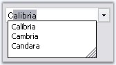
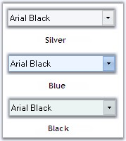

::: {style="DISPLAY: none"}
{#d2h_url_template}{#d2h_package_url style="WIDTH: 0px; DISPLAY: none; HEIGHT: 0px"}
:::

:::::: {.d2h_secondary_topic style="PADDING-BOTTOM: 10pt; MARGIN: 0pt; PADDING-LEFT: 0pt; PADDING-RIGHT: 0pt; PADDING-TOP: 0pt"}
##### Concepts and Features {#concepts-and-features style="tab-stops: 0pt"}

[]{style="COLOR: #15428b"} 

The below topics are discussed in this section.

[]{style="COLOR: #15428b"} 

###### []{#p734}3.3.9.2.3.1 AutoComplete {#autocomplete style="tab-stops: 0pt"}

[]{style="COLOR: #15428b"} 

The AutoComplete feature of the FontComboBox can be turned on\\off depending upon the type of behavior, that is required for the FontComboBox control. The below properties enables the auto complete feature.

[]{style="COLOR: #15428b"} 

::: {align="center"}
  -------------------------- -------------------------------------------------------------------------------------------------------------------------------------------------------------
  Properties                 Description
  UseAutoComplete            Specifies whether auto complete feature is implemented in the control.
  AutoCompleteSource         Specifies the source of the complete strings used for auto completion. DropDownStyle property should be set to \"DropDown\" to make this setting effective.
  AutoCompleteCustomSource   Represents the collection of string for the custom source, when AutoCompleteSource is set to CustomSource.
  -------------------------- -------------------------------------------------------------------------------------------------------------------------------------------------------------
:::

[]{style="COLOR: #15428b"} 

+-----------------------------------------------------------------------------------------------------------------------------------------------------------------------------------------------------------------------------------------------------------------------------------------------------------------------------------+
| **[\[C#\]]{style="FONT-FAMILY: 'Courier New'; COLOR: black"}**                                                                                                                                                                                                                                                                    |
|                                                                                                                                                                                                                                                                                                                                   |
| []{style="COLOR: #15428b"}                                                                                                                                                                                                                                                                                                        |
|                                                                                                                                                                                                                                                                                                                                   |
| [// Enables AutoComplete feature.]{style="FONT-FAMILY: 'Courier New'; COLOR: green"}                                                                                                                                                                                                                                              |
|                                                                                                                                                                                                                                                                                                                                   |
| [this]{style="FONT-FAMILY: 'Courier New'; COLOR: blue"}[.fontComboBox1.UseAutoComplete =]{style="FONT-FAMILY: 'Courier New'; COLOR: black"}[true]{style="FONT-FAMILY: 'Courier New'; COLOR: blue"}[;]{style="FONT-FAMILY: 'Courier New'; COLOR: black"}                                                                           |
|                                                                                                                                                                                                                                                                                                                                   |
| [this]{style="FONT-FAMILY: 'Courier New'; COLOR: blue"}[.fontComboBox2.AutoCompleteCustomSource.AddRange([new]{style="COLOR: blue"} [string]{style="COLOR: blue"}\[\] { [\"Calibria\"]{style="COLOR: maroon"}, [\"Cambria\"]{style="COLOR: maroon"}, [\"Candara\"]{style="COLOR: maroon"}});]{style="FONT-FAMILY: 'Courier New'"} |
|                                                                                                                                                                                                                                                                                                                                   |
| [this]{style="FONT-FAMILY: 'Courier New'; COLOR: blue"}[.fontComboBox2.AutoCompleteMode = System.Windows.Forms.[AutoCompleteMode]{style="COLOR: teal"}.SuggestAppend;]{style="FONT-FAMILY: 'Courier New'"}                                                                                                                        |
|                                                                                                                                                                                                                                                                                                                                   |
| [this]{style="FONT-FAMILY: 'Courier New'; COLOR: blue"}[.fontComboBox2.AutoCompleteSource = System.Windows.Forms.[AutoCompleteSource]{style="COLOR: teal"}.CustomSource;]{style="FONT-FAMILY: 'Courier New'"}                                                                                                                     |
+-----------------------------------------------------------------------------------------------------------------------------------------------------------------------------------------------------------------------------------------------------------------------------------------------------------------------------------+

[]{style="COLOR: #15428b"} 

+------------------------------------------------------------------------------------------------------------------------------------------------------------------------------------------------------------------------------------------------------------------------------------------------------------------------------+
| **[\[VB.NET\]]{style="FONT-FAMILY: 'Courier New'; COLOR: black"}**                                                                                                                                                                                                                                                           |
|                                                                                                                                                                                                                                                                                                                              |
| []{style="COLOR: #15428b"}                                                                                                                                                                                                                                                                                                   |
|                                                                                                                                                                                                                                                                                                                              |
| [\' Enables AutoComplete feature.]{style="FONT-FAMILY: 'Courier New'; COLOR: green"}                                                                                                                                                                                                                                         |
|                                                                                                                                                                                                                                                                                                                              |
| [Me]{style="FONT-FAMILY: 'Courier New'; COLOR: blue"}[.fontComboBox1.UseAutoComplete = ]{style="FONT-FAMILY: 'Courier New'; COLOR: black"}[True]{style="FONT-FAMILY: 'Courier New'; COLOR: blue"}                                                                                                                            |
|                                                                                                                                                                                                                                                                                                                              |
| [Me]{style="FONT-FAMILY: 'Courier New'; COLOR: blue"}[.fontComboBox2.AutoCompleteCustomSource.AddRange([New]{style="COLOR: blue"} [String]{style="COLOR: blue"}() {[\"Calibria\"]{style="COLOR: maroon"}, [\"Cambria\"]{style="COLOR: maroon"}, [\"Candara\"]{style="COLOR: maroon"}}) ]{style="FONT-FAMILY: 'Courier New'"} |
|                                                                                                                                                                                                                                                                                                                              |
| [Me]{style="FONT-FAMILY: 'Courier New'; COLOR: blue"}[.fontComboBox2.AutoCompleteMode = System.Windows.Forms.[AutoCompleteMode]{style="COLOR: black"}.SuggestAppend]{style="FONT-FAMILY: 'Courier New'"}                                                                                                                     |
|                                                                                                                                                                                                                                                                                                                              |
| [Me]{style="FONT-FAMILY: 'Courier New'; COLOR: blue"}[.fontComboBox2.AutoCompleteSource = System.Windows.Forms.[AutoCompleteSource.CustomSource]{style="COLOR: black"}]{style="FONT-FAMILY: 'Courier New'"}                                                                                                                  |
+------------------------------------------------------------------------------------------------------------------------------------------------------------------------------------------------------------------------------------------------------------------------------------------------------------------------------+

[]{style="COLOR: #15428b"} 

{border="0"}

[]{style="COLOR: #15428b"} 

Figure 588: AutoCompleteMode = \"SuggestAppend\"; AutoCompleteSource = \"CustomSource\"

**[]{style="COLOR: #15428b"}** 

See Also

[]{style="COLOR: #15428b"} 

[DropDown Settings]{.UGHyperlink}[]{.UGHyperlink}

###### []{#p735}3.3.9.2.3.2 DropDown Settings {#dropdown-settings style="tab-stops: 0pt"}

[]{style="COLOR: #15428b"} 

FontComboBox has properties to control the appearance and behavior of the dropdown.

[]{style="COLOR: #15428b"} 

::: {align="center"}
+-----------------------------------+---------------------------------------------------------------------------------------------------------------------------------------+
| Properties                        | Description                                                                                                                           |
+-----------------------------------+---------------------------------------------------------------------------------------------------------------------------------------+
| DropDownStyle                     | Specifies the style of the dropdown. The options are,                                                                                 |
|                                   |                                                                                                                                       |
|                                   |                                                                                                                                       |
|                                   |                                                                                                                                       |
|                                   | *DropDownList* - The user cannot directly edit the text portion. The user must click the arrow button to display the list portion,    |
|                                   |                                                                                                                                       |
|                                   | *DropDown (default)* - The user can directly edit the text portion. The user must click the arrow button to display the list portion, |
|                                   |                                                                                                                                       |
|                                   | *Simple* - The text portion is editable. The list portion is always visible.                                                          |
+-----------------------------------+---------------------------------------------------------------------------------------------------------------------------------------+
| DropDownHeight                    | Specifies the height of the dropdown combo box in pixels.                                                                             |
+-----------------------------------+---------------------------------------------------------------------------------------------------------------------------------------+
| DropDownWidth                     | Specifies the width of the dropdown combo box in pixels.                                                                              |
+-----------------------------------+---------------------------------------------------------------------------------------------------------------------------------------+
| MaxDropDownItems                  | Indicates the maximum number of entries to display in the drop down list.                                                             |
+-----------------------------------+---------------------------------------------------------------------------------------------------------------------------------------+
:::

[]{style="COLOR: #15428b"} 

+-----------------------------------------------------------------------------------------------------------------------------------------------------------------------------------------------------+
| **[\[C#\]]{style="FONT-FAMILY: 'Courier New'; COLOR: black"}**                                                                                                                                      |
|                                                                                                                                                                                                     |
| []{style="COLOR: #15428b"}                                                                                                                                                                          |
|                                                                                                                                                                                                     |
| [this]{style="FONT-FAMILY: 'Courier New'; COLOR: blue"}[.fontComboBox2.DropDownHeight = 107;]{style="FONT-FAMILY: 'Courier New'"}                                                                   |
|                                                                                                                                                                                                     |
| [this]{style="FONT-FAMILY: 'Courier New'; COLOR: blue"}[.fontComboBox2.DropDownStyle = System.Windows.Forms.[ComboBoxStyle]{style="COLOR: teal"}.DropDownList;]{style="FONT-FAMILY: 'Courier New'"} |
|                                                                                                                                                                                                     |
| [this]{style="FONT-FAMILY: 'Courier New'; COLOR: blue"}[.fontComboBox2.DropDownWidth = 154;]{style="FONT-FAMILY: 'Courier New'"}                                                                    |
|                                                                                                                                                                                                     |
| [this]{style="FONT-FAMILY: 'Courier New'; COLOR: blue"}[.fontComboBox2.MaxDropDownItems = 10;]{style="FONT-FAMILY: 'Courier New'"}                                                                  |
+-----------------------------------------------------------------------------------------------------------------------------------------------------------------------------------------------------+

[]{style="COLOR: #15428b"} 

+--------------------------------------------------------------------------------------------------------------------------------------------------------------------------------------------------+
| **[\[VB.NET\]]{style="FONT-FAMILY: 'Courier New'; COLOR: black"}**                                                                                                                               |
|                                                                                                                                                                                                  |
| []{style="COLOR: #15428b"}                                                                                                                                                                       |
|                                                                                                                                                                                                  |
| [Me]{style="FONT-FAMILY: 'Courier New'; COLOR: blue"}[.fontComboBox2.DropDownHeight = 107]{style="FONT-FAMILY: 'Courier New'"}                                                                   |
|                                                                                                                                                                                                  |
| [Me]{style="FONT-FAMILY: 'Courier New'; COLOR: blue"}[.fontComboBox2.DropDownStyle = System.Windows.Forms.[ComboBoxStyle]{style="COLOR: teal"}.DropDownList]{style="FONT-FAMILY: 'Courier New'"} |
|                                                                                                                                                                                                  |
| [Me]{style="FONT-FAMILY: 'Courier New'; COLOR: blue"}[.fontComboBox2.DropDownWidth = 154]{style="FONT-FAMILY: 'Courier New'"}                                                                    |
|                                                                                                                                                                                                  |
| [Me]{style="FONT-FAMILY: 'Courier New'; COLOR: blue"}[.fontComboBox2.MaxDropDownItems = 10]{style="FONT-FAMILY: 'Courier New'"}                                                                  |
+--------------------------------------------------------------------------------------------------------------------------------------------------------------------------------------------------+

[]{style="COLOR: #15428b"} 

Customizing DropDown Items

[]{style="COLOR: #15428b"} 

The height of the FontComboBox items is specified in **ItemHeight** property and sorting of the items is enabled through **Sorted** property.

[]{style="COLOR: #15428b"} 

+---------------------------------------------------------------------------------------------------------------------------------------------------+
| **[\[C#\]]{style="FONT-FAMILY: 'Courier New'; COLOR: black"}**                                                                                    |
|                                                                                                                                                   |
| []{style="COLOR: #15428b"}                                                                                                                        |
|                                                                                                                                                   |
| [this]{style="FONT-FAMILY: 'Courier New'; COLOR: blue"}[.fontComboBox2.ItemHeight = 17;]{style="FONT-FAMILY: 'Courier New'"}                      |
|                                                                                                                                                   |
| [this]{style="FONT-FAMILY: 'Courier New'; COLOR: blue"}[.fontComboBox2.Sorted = [true]{style="COLOR: blue"};]{style="FONT-FAMILY: 'Courier New'"} |
+---------------------------------------------------------------------------------------------------------------------------------------------------+

[]{style="COLOR: #15428b"} 

+------------------------------------------------------------------------------------------------------------------------------------------------+
| **[\[VB.NET\]]{style="FONT-FAMILY: 'Courier New'; COLOR: black"}**                                                                             |
|                                                                                                                                                |
| []{style="COLOR: #15428b"}                                                                                                                     |
|                                                                                                                                                |
| [Me]{style="FONT-FAMILY: 'Courier New'; COLOR: blue"}[.fontComboBox2.ItemHeight = 17]{style="FONT-FAMILY: 'Courier New'"}                      |
|                                                                                                                                                |
| [Me]{style="FONT-FAMILY: 'Courier New'; COLOR: blue"}[.fontComboBox2.Sorted = [True]{style="COLOR: blue"}]{style="FONT-FAMILY: 'Courier New'"} |
+------------------------------------------------------------------------------------------------------------------------------------------------+

###### []{#p736}3.3.9.2.3.3 Visual Styles {#visual-styles style="tab-stops: 0pt"}

[]{style="COLOR: #15428b"} 

The Office2007 visual style for the FontComboBox control can be enabled through below properties.

[]{style="COLOR: #15428b"} 

::: {align="center"}
+-----------------------------------+------------------------------------------------------------+
| Properties                        | Description                                                |
+-----------------------------------+------------------------------------------------------------+
| VisualStyle                       | Sets the visual style for the control. The options are,    |
|                                   |                                                            |
|                                   |                                                            |
|                                   |                                                            |
|                                   | Default (default value) and                                |
|                                   |                                                            |
|                                   | Office2007.                                                |
+-----------------------------------+------------------------------------------------------------+
| Office2007ColorScheme             | Specifies the office color schemes. The color schemes are, |
|                                   |                                                            |
|                                   |                                                            |
|                                   |                                                            |
|                                   | Blue,                                                      |
|                                   |                                                            |
|                                   | Silver and                                                 |
|                                   |                                                            |
|                                   | Black.                                                     |
+-----------------------------------+------------------------------------------------------------+
:::

[]{style="COLOR: #15428b"} 

+------------------------------------------------------------------------------------------------------------------------------------------------------------------------------------------------------------------+
| **[\[C#\]]{style="FONT-FAMILY: 'Courier New'; COLOR: black"}**                                                                                                                                                   |
|                                                                                                                                                                                                                  |
| []{style="COLOR: #15428b"}                                                                                                                                                                                       |
|                                                                                                                                                                                                                  |
| [this]{style="FONT-FAMILY: 'Courier New'; COLOR: blue"}[.fontComboBox2.VisualStyle = Syncfusion.Windows.Forms.Tools.[ThemedComboBoxStyles]{style="COLOR: teal"}.Office2007;]{style="FONT-FAMILY: 'Courier New'"} |
|                                                                                                                                                                                                                  |
| [this]{style="FONT-FAMILY: 'Courier New'; COLOR: blue"}[.fontComboBox2.Office2007ColorTheme = Syncfusion.Windows.Forms.[Office2007Theme]{style="COLOR: teal"}.Silver;]{style="FONT-FAMILY: 'Courier New'"}       |
+------------------------------------------------------------------------------------------------------------------------------------------------------------------------------------------------------------------+

[]{style="COLOR: #15428b"} 

+----------------------------------------------------------------------------------------------------------------------------------------------------------------------------------------------------------------+
| **[\[VB.NET\]]{style="FONT-FAMILY: 'Courier New'; COLOR: black"}**                                                                                                                                             |
|                                                                                                                                                                                                                |
| []{style="COLOR: #15428b"}                                                                                                                                                                                     |
|                                                                                                                                                                                                                |
| [Me]{style="FONT-FAMILY: 'Courier New'; COLOR: blue"}[.fontComboBox2.VisualStyle = Syncfusion.Windows.Forms.Tools.[ThemedComboBoxStyles.]{style="COLOR: black"}Office2007]{style="FONT-FAMILY: 'Courier New'"} |
|                                                                                                                                                                                                                |
| [Me]{style="FONT-FAMILY: 'Courier New'; COLOR: blue"}[.fontComboBox2.Office2007ColorTheme = Syncfusion.Windows.Forms.[Office2007Theme]{style="COLOR: black"}.Silver]{style="FONT-FAMILY: 'Courier New'"}       |
+----------------------------------------------------------------------------------------------------------------------------------------------------------------------------------------------------------------+

[]{style="COLOR: #15428b"} 

{border="0"}

[]{style="COLOR: #15428b"} 

Figure 589: Office2007 Color Schemes for the FontComboBox Control

**[]{style="COLOR: #15428b"}** 

Custom Colors

[]{style="COLOR: #15428b"} 

We can also apply custom colors to the FontComboBox control by setting Office2007ColorTheme to \"Managed\" and specifying the custom color through the **ApplyManagedColors** method as follows.

[]{style="COLOR: #15428b"} 

+-------------------------------------------------------------------------------------------------------------------------------------------------------------------------------------------------------------+
| **[\[C#\]]{style="FONT-FAMILY: 'Courier New'; COLOR: black"}**                                                                                                                                              |
|                                                                                                                                                                                                             |
| []{style="COLOR: #15428b"}                                                                                                                                                                                  |
|                                                                                                                                                                                                             |
| [this]{style="FONT-FAMILY: 'Courier New'; COLOR: blue"}[.fontComboBox2.Office2007ColorTheme = Syncfusion.Windows.Forms.[Office2007Theme]{style="COLOR: teal"}.Managed;]{style="FONT-FAMILY: 'Courier New'"} |
|                                                                                                                                                                                                             |
| [Office2007Colors]{style="FONT-FAMILY: 'Courier New'; COLOR: teal"}[.ApplyManagedColors([this]{style="COLOR: blue"}, [Color]{style="COLOR: teal"}.Orchid);]{style="FONT-FAMILY: 'Courier New'"}             |
+-------------------------------------------------------------------------------------------------------------------------------------------------------------------------------------------------------------+

[]{style="COLOR: #15428b"} 

+------------------------------------------------------------------------------------------------------------------------------------------------------------------------------------------------------------+
| **[\[VB.NET\]]{style="FONT-FAMILY: 'Courier New'; COLOR: black"}**                                                                                                                                         |
|                                                                                                                                                                                                            |
| []{style="COLOR: #15428b"}                                                                                                                                                                                 |
|                                                                                                                                                                                                            |
| [Me]{style="FONT-FAMILY: 'Courier New'; COLOR: blue"}[.fontComboBox2.Office2007ColorTheme = Syncfusion.Windows.Forms.[Office2007Theme]{style="COLOR: black"}.Managed;]{style="FONT-FAMILY: 'Courier New'"} |
|                                                                                                                                                                                                            |
| [Office2007Colors.]{style="FONT-FAMILY: 'Courier New'; COLOR: black"}[ApplyManagedColors([Me]{style="COLOR: blue"}, [Color]{style="COLOR: black"}.Orchid)]{style="FONT-FAMILY: 'Courier New'"}             |
+------------------------------------------------------------------------------------------------------------------------------------------------------------------------------------------------------------+

[]{style="COLOR: #15428b"} 

{border="0"}

[]{style="COLOR: #15428b"} 

Figure 590: Custom Color = \"Orchid\"

[]{#related-topics}
::::::
