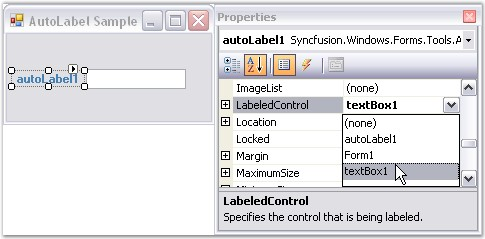
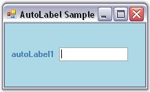
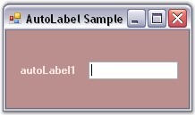
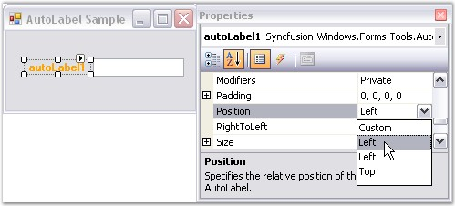
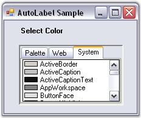

::: {style="DISPLAY: none"}
{#d2h_url_template}{#d2h_package_url style="WIDTH: 0px; DISPLAY: none; HEIGHT: 0px"}
:::

::::::: {.d2h_secondary_topic style="PADDING-BOTTOM: 10pt; MARGIN: 0pt; PADDING-LEFT: 0pt; PADDING-RIGHT: 0pt; PADDING-TOP: 0pt"}
##### Concepts and Features {#concepts-and-features style="tab-stops: 0pt"}

[]{style="COLOR: #15428b"} 

This section explains the concepts and features of the AutoLabel control which will help to understand the control better. The following are the features discussed.

[]{style="COLOR: #15428b"} 

###### []{#p747}[]{#_Labeling_a_Control}3.3.10.1.3.1        Labeling a Control {#labeling-a-control style="tab-stops: 0pt"}

[]{style="COLOR: #15428b"} 

The following steps allows you to label a control.

[]{style="COLOR: #15428b"} 

[·      ]{style="FONT-FAMILY: Symbol"}Create or open a Windows forms project.

[·      ]{style="FONT-FAMILY: Symbol"}Add an AutoLabel Control from the toolbox onto the form by dragging and dropping it on the form or double clicking the control.

[·      ]{style="FONT-FAMILY: Symbol"}Add the control (TextBox) that has to be labeled to the form.

[·      ]{style="FONT-FAMILY: Symbol"}Go to the Property grid and select the **LabeledControl** property.

[·      ]{style="FONT-FAMILY: Symbol"}Select the control to be labeled (TextBox) from the dropdown box as shown below.

[]{style="COLOR: #15428b"} 

{border="0"}

[]{style="COLOR: #15428b"} 

Figure 595: \"LabeledControl\" property in the Properties Grid

[]{style="COLOR: #15428b"} 

+-------------------------------------------------------------------------------------------------------------------------------------------------------------------------------------------------------------+
| **[\[C#\]]{style="FONT-FAMILY: 'Courier New'; COLOR: black"}**                                                                                                                                              |
|                                                                                                                                                                                                             |
| []{style="FONT-FAMILY: 'Courier New'; COLOR: black"}                                                                                                                                                        |
|                                                                                                                                                                                                             |
| [private]{style="FONT-FAMILY: 'Courier New'; COLOR: blue"}[ Syncfusion.Windows.Forms.Tools.[AutoLabel]{style="COLOR: #2b91af"} autoLabel1;]{style="FONT-FAMILY: 'Courier New'"}                             |
|                                                                                                                                                                                                             |
| [this]{style="FONT-FAMILY: 'Courier New'; COLOR: blue"}[.autoLabel1 = [new]{style="COLOR: blue"} Syncfusion.Windows.Forms.Tools.[AutoLabel]{style="COLOR: #2b91af"}();]{style="FONT-FAMILY: 'Courier New'"} |
|                                                                                                                                                                                                             |
| [this]{style="FONT-FAMILY: 'Courier New'; COLOR: blue"}[.autoLabel1.LabeledControl = [this]{style="COLOR: blue"}.textBox1;]{style="FONT-FAMILY: 'Courier New'"}                                             |
|                                                                                                                                                                                                             |
| []{style="FONT-FAMILY: 'Courier New'"}                                                                                                                                                                      |
|                                                                                                                                                                                                             |
| [this]{style="FONT-FAMILY: 'Courier New'; COLOR: blue"}[.Controls.Add([this]{style="COLOR: blue"}.autoLabel1);]{style="FONT-FAMILY: 'Courier New'"}                                                         |
+-------------------------------------------------------------------------------------------------------------------------------------------------------------------------------------------------------------+

[]{style="COLOR: #15428b"} 

+--------------------------------------------------------------------------------------------------------------------------------------------------------------------------------+
| **[\[VB.NET\]]{style="FONT-FAMILY: 'Courier New'; COLOR: black"}**                                                                                                             |
|                                                                                                                                                                                |
| []{style="FONT-FAMILY: 'Courier New'; COLOR: black"}                                                                                                                           |
|                                                                                                                                                                                |
| [Private]{style="FONT-FAMILY: 'Courier New'; COLOR: blue"}[ autoLabel1 [As]{style="COLOR: blue"} Syncfusion.Windows.Forms.Tools.AutoLabel]{style="FONT-FAMILY: 'Courier New'"} |
|                                                                                                                                                                                |
| [Me]{style="FONT-FAMILY: 'Courier New'; COLOR: blue"}[.autoLabel1 = [New]{style="COLOR: blue"} Syncfusion.Windows.Forms.Tools.AutoLabel()]{style="FONT-FAMILY: 'Courier New'"} |
|                                                                                                                                                                                |
| [Me]{style="FONT-FAMILY: 'Courier New'; COLOR: blue"}[.autoLabel1.LabeledControl = [Me]{style="COLOR: blue"}.textBox1]{style="FONT-FAMILY: 'Courier New'"}                     |
|                                                                                                                                                                                |
| []{style="FONT-FAMILY: 'Courier New'"}                                                                                                                                         |
|                                                                                                                                                                                |
| [Me]{style="FONT-FAMILY: 'Courier New'; COLOR: blue"}[.Controls.Add([Me]{style="COLOR: blue"}.autoLabel1)]{style="FONT-FAMILY: 'Courier New'"}                                 |
+--------------------------------------------------------------------------------------------------------------------------------------------------------------------------------+

[]{style="COLOR: #15428b"} 

[·      ]{style="FONT-FAMILY: Symbol"}Run the application.

[]{style="COLOR: #15428b"} 

{border="0"}

[]{style="COLOR: #15428b"} 

Figure 596: TextBox labeled using AutoLabel

###### []{#_Spacing}3.3.10.1.3.2        Spacing {#spacing style="tab-stops: 0pt"}

[]{#p748}[]{style="COLOR: #15428b"} 

The space between the AutoLabel control and the labeled control can be customized using the properties given below. When using relative positioning, you can also specify the gap between the label and the control.

[]{style="COLOR: #15428b"} 

::: {align="center"}
  ---------------------- ----------------------------------------------------------------------------------------------
  AutoLabel Properties   Description
  DX                     The effective horizontal distance between the left of the AutoLabel and its labeled control.
  DY                     The effective vertical distance between the top of the AutoLabel and its labeled control.
  Gap                    Specifies the horizontal and vertical gap to use when computing the relative position.
  ---------------------- ----------------------------------------------------------------------------------------------
:::

[]{style="COLOR: #15428b"} 

+--------------------------------------------------------------------------------------------------------------------+
| **[\[C#\]]{style="FONT-FAMILY: 'Courier New'; COLOR: black"}**                                                     |
|                                                                                                                    |
| []{style="FONT-FAMILY: 'Courier New'; COLOR: black"}                                                               |
|                                                                                                                    |
| [this]{style="FONT-FAMILY: 'Courier New'; COLOR: blue"}[.autoLabel1.DX = -80;]{style="FONT-FAMILY: 'Courier New'"} |
|                                                                                                                    |
| [this]{style="FONT-FAMILY: 'Courier New'; COLOR: blue"}[.autoLabel1.DY = 3;]{style="FONT-FAMILY: 'Courier New'"}   |
|                                                                                                                    |
| [this]{style="FONT-FAMILY: 'Courier New'; COLOR: blue"}[.autoLabel1.Gap = 10;]{style="FONT-FAMILY: 'Courier New'"} |
+--------------------------------------------------------------------------------------------------------------------+

[]{style="COLOR: #15428b"} 

+-----------------------------------------------------------------------------------------------------------------+
| **[\[VB.NET\]]{style="FONT-FAMILY: 'Courier New'; COLOR: black"}**                                              |
|                                                                                                                 |
| []{style="FONT-FAMILY: 'Courier New'; COLOR: black"}                                                            |
|                                                                                                                 |
| [Me]{style="FONT-FAMILY: 'Courier New'; COLOR: blue"}[.autoLabel1.DX = -80]{style="FONT-FAMILY: 'Courier New'"} |
|                                                                                                                 |
| [Me]{style="FONT-FAMILY: 'Courier New'; COLOR: blue"}[.autoLabel1.DY = 3]{style="FONT-FAMILY: 'Courier New'"}   |
|                                                                                                                 |
| [Me]{style="FONT-FAMILY: 'Courier New'; COLOR: blue"}[.autoLabel1.Gap = 10]{style="FONT-FAMILY: 'Courier New'"} |
+-----------------------------------------------------------------------------------------------------------------+

[]{style="COLOR: #15428b"} 

{border="0"}

[]{style="COLOR: #15428b"} 

Figure 597: Space Settings of AutoLabel

###### []{#p749}3.3.10.1.3.3        Position {#position style="tab-stops: 0pt"}

[]{style="COLOR: #15428b"} 

The AutoLabel control can be positioned relative to the top, left, bottom or right of the labeled control. You can do this using the below given property.

[]{style="COLOR: #15428b"} 

::: {align="center"}
+-----------------------------------+-------------------------------------------------------------------+
| AutoLabel Property                | Description                                                       |
+-----------------------------------+-------------------------------------------------------------------+
| Position                          | Specifies the relative position of the control and the AutoLabel. |
|                                   |                                                                   |
|                                   |                                                                   |
|                                   |                                                                   |
|                                   | The options included are as follows.                              |
|                                   |                                                                   |
|                                   |                                                                   |
|                                   |                                                                   |
|                                   | *Custom,*                                                         |
|                                   |                                                                   |
|                                   | *Left,*                                                           |
|                                   |                                                                   |
|                                   | *Left and*                                                        |
|                                   |                                                                   |
|                                   | *Top.*                                                            |
+-----------------------------------+-------------------------------------------------------------------+
:::

[]{style="COLOR: #15428b"} 

When the **Position** property is set to \'Custom\', you can drag the label to the required position using the mouse.

[]{style="COLOR: #15428b"} 

+-----------------------------------------------------------------------------------------------------------------------------------------------------------------------------------------------------+
| **[\[C#\]]{style="FONT-FAMILY: 'Courier New'; COLOR: black"}**                                                                                                                                      |
|                                                                                                                                                                                                     |
| []{style="FONT-FAMILY: 'Courier New'; COLOR: black"}                                                                                                                                                |
|                                                                                                                                                                                                     |
| [this]{style="FONT-FAMILY: 'Courier New'; COLOR: blue"}[.autoLabel1.Position = Syncfusion.Windows.Forms.Tools.[AutoLabelPosition]{style="COLOR: #2b91af"}.Top;]{style="FONT-FAMILY: 'Courier New'"} |
+-----------------------------------------------------------------------------------------------------------------------------------------------------------------------------------------------------+

[]{style="COLOR: #15428b"} 

+------------------------------------------------------------------------------------------------------------------------------------------------------------------------+
| **[\[VB.NET\]]{style="FONT-FAMILY: 'Courier New'; COLOR: black"}**                                                                                                     |
|                                                                                                                                                                        |
| []{style="FONT-FAMILY: 'Courier New'; COLOR: black"}                                                                                                                   |
|                                                                                                                                                                        |
| [Me]{style="FONT-FAMILY: 'Courier New'; COLOR: blue"}[.autoLabel1.Position = Syncfusion.Windows.Forms.Tools.AutoLabelPosition.Top]{style="FONT-FAMILY: 'Courier New'"} |
+------------------------------------------------------------------------------------------------------------------------------------------------------------------------+

[]{style="COLOR: #15428b"} 

{border="0"}

[]{style="COLOR: #15428b"} 

Figure 598: \"Position\" property in the Properties Grid

 

{border="0"}

[]{style="COLOR: #15428b"} 

Figure 599: AutoLabel of the ColorUIControl positioned to \"Top\"

###### []{#_Size}3.3.10.1.3.4        Size[]{#p750} {#size style="tab-stops: 0pt"}

[]{style="COLOR: #15428b"} 

This section illustrates the size settings of the AutoLabel control.

 

The AutoLabel control can be resized using the below given property.

[]{style="COLOR: #4a5c8c; FONT-SIZE: 8pt"} 

::: {align="center"}
  -------------------- ------------------------------------------------
  AutoLabel Property   Description
  AutoSize             Enables automatic resizing based on font size.
  -------------------- ------------------------------------------------
:::

[]{style="COLOR: #15428b"} 

::: {style="BORDER-BOTTOM: windowtext 1pt solid; BORDER-LEFT: medium none; PADDING-BOTTOM: 1pt; MARGIN-TOP: 9pt; PADDING-LEFT: 0pt; PADDING-RIGHT: 0pt; MARGIN-BOTTOM: 9pt; BORDER-TOP: windowtext 1pt solid; BORDER-RIGHT: medium none; PADDING-TOP: 1pt"}
{border="0"} Note: This is valid only for label controls that do not wrap text.
:::

[]{style="COLOR: #15428b"} 

+--------------------------------------------------------------------------------------------------------------------------------------------------+
| **[\[C#\]]{style="FONT-FAMILY: 'Courier New'; COLOR: black"}**                                                                                   |
|                                                                                                                                                  |
| []{style="FONT-FAMILY: 'Courier New'; COLOR: black"}                                                                                             |
|                                                                                                                                                  |
| [this]{style="FONT-FAMILY: 'Courier New'; COLOR: blue"}[.autoLabel1.AutoSize = [true]{style="COLOR: blue"};]{style="FONT-FAMILY: 'Courier New'"} |
+--------------------------------------------------------------------------------------------------------------------------------------------------+

[]{style="COLOR: #15428b"} 

+-----------------------------------------------------------------------------------------------------------------------------------------------+
| **[\[VB.NET\]]{style="FONT-FAMILY: 'Courier New'; COLOR: black"}**                                                                            |
|                                                                                                                                               |
| []{style="FONT-FAMILY: 'Courier New'; COLOR: black"}                                                                                          |
|                                                                                                                                               |
| [Me]{style="FONT-FAMILY: 'Courier New'; COLOR: blue"}[.autoLabel1.AutoSize = [True]{style="COLOR: blue"}]{style="FONT-FAMILY: 'Courier New'"} |
+-----------------------------------------------------------------------------------------------------------------------------------------------+

[]{#related-topics}
:::::::
