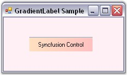
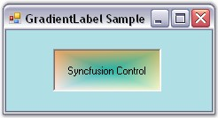
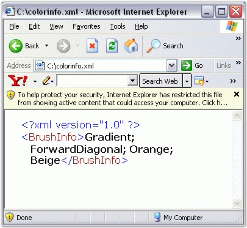

::: {style="DISPLAY: none"}
{#d2h_url_template}{#d2h_package_url style="WIDTH: 0px; DISPLAY: none; HEIGHT: 0px"}
:::

:::::: {.d2h_secondary_topic style="PADDING-BOTTOM: 10pt; MARGIN: 0pt; PADDING-LEFT: 0pt; PADDING-RIGHT: 0pt; PADDING-TOP: 0pt"}
##### Concepts and Features {#concepts-and-features style="tab-stops: 0pt"}

[]{style="COLOR: #15428b"} 

The following topics will help you become more familiar in using the GradientLabel control.

[]{style="COLOR: #15428b"} 

###### []{#p759}3.3.10.2.3.1        Border Settings {#border-settings style="tab-stops: 0pt"}

[]{style="COLOR: #15428b"} 

This section discusses the border settings of the GradientLabel control.

 

The border style and sides of the GradientLabel can be customized using the properties given below.

[]{style="COLOR: #15428b"} 

::: {align="center"}
+-----------------------------------+-------------------------------------------------------------------------------------------------------------------------------+
| GradientLabel Properties          | Description                                                                                                                   |
+-----------------------------------+-------------------------------------------------------------------------------------------------------------------------------+
| BorderSides                       | Specifies the sides of the GradientLabel that will have a border.                                                             |
|                                   |                                                                                                                               |
|                                   |                                                                                                                               |
|                                   |                                                                                                                               |
|                                   | The options included are as follows.                                                                                          |
|                                   |                                                                                                                               |
|                                   |                                                                                                                               |
|                                   |                                                                                                                               |
|                                   | *Left,*                                                                                                                       |
|                                   |                                                                                                                               |
|                                   | *Top,*                                                                                                                        |
|                                   |                                                                                                                               |
|                                   | *Right,*                                                                                                                      |
|                                   |                                                                                                                               |
|                                   | *Bottom,*                                                                                                                     |
|                                   |                                                                                                                               |
|                                   | *Middle and*                                                                                                                  |
|                                   |                                                                                                                               |
|                                   | *All.*                                                                                                                        |
|                                   |                                                                                                                               |
|                                   |                                                                                                                               |
|                                   |                                                                                                                               |
|                                   | The default value is set to \'All\'.                                                                                          |
+-----------------------------------+-------------------------------------------------------------------------------------------------------------------------------+
| BorderStyle                       | Specifies the 3D border style for the GradientLabel.                                                                          |
|                                   |                                                                                                                               |
|                                   |                                                                                                                               |
|                                   |                                                                                                                               |
|                                   | The options included are as follows.                                                                                          |
|                                   |                                                                                                                               |
|                                   |                                                                                                                               |
|                                   |                                                                                                                               |
|                                   | *Raised,*                                                                                                                     |
|                                   |                                                                                                                               |
|                                   | *RaisedOuter,*                                                                                                                |
|                                   |                                                                                                                               |
|                                   | *RaisedInner,*                                                                                                                |
|                                   |                                                                                                                               |
|                                   | *Sunken,*                                                                                                                     |
|                                   |                                                                                                                               |
|                                   | *SunkenOuter,*                                                                                                                |
|                                   |                                                                                                                               |
|                                   | *SunkenInner,*                                                                                                                |
|                                   |                                                                                                                               |
|                                   | *Etched,*                                                                                                                     |
|                                   |                                                                                                                               |
|                                   | *Bump,*                                                                                                                       |
|                                   |                                                                                                                               |
|                                   | *Adjust and*                                                                                                                  |
|                                   |                                                                                                                               |
|                                   | *Flat.*                                                                                                                       |
|                                   |                                                                                                                               |
|                                   |                                                                                                                               |
|                                   |                                                                                                                               |
|                                   | The default value is set to \'Sunken\'.                                                                                       |
+-----------------------------------+-------------------------------------------------------------------------------------------------------------------------------+
| BorderColor                       | Sets the color for the 2D border. The BorderColor will be effective only when the BorderStyle property is set to FixedSingle. |
+-----------------------------------+-------------------------------------------------------------------------------------------------------------------------------+
:::

[]{style="COLOR: #15428b"} 

We can set the border sides for the GradientLabel using the **BorderSides** property. If BorderSides is set to \'Left\', only the left border of GradientLabel will be shown.

 

The GradientLabel replaces the default border style provided for Label classes with the **Border3DStyle** type in this property. This property uses the **Border3DStyle** enumeration.

 

In 3D mode, the border styles can be Raised, Sunken, Flat and so on. Setting the value to \'Adjust\' shows no border.

[]{style="COLOR: #15428b"} 

+-----------------------------------------------------------------------------------------------------------------------------------------------------------------------------------------------+
| **[\[C#\]]{style="FONT-FAMILY: 'Courier New'; COLOR: black"}**                                                                                                                                |
|                                                                                                                                                                                               |
| []{style="FONT-FAMILY: 'Courier New'; COLOR: black"}                                                                                                                                          |
|                                                                                                                                                                                               |
| [this]{style="FONT-FAMILY: 'Courier New'; COLOR: blue"}[.gradientLabel1.BorderSides = System.Windows.Forms.[Border3DSide]{style="COLOR: #2b91af"}.Top;]{style="FONT-FAMILY: 'Courier New'"}   |
|                                                                                                                                                                                               |
| [this]{style="FONT-FAMILY: 'Courier New'; COLOR: blue"}[.gradientLabel1.BorderStyle = System.Windows.Forms.[Border3DStyle]{style="COLOR: #2b91af"}.Flat;]{style="FONT-FAMILY: 'Courier New'"} |
|                                                                                                                                                                                               |
| [this]{style="FONT-FAMILY: 'Courier New'; COLOR: blue"}[.gradientLabel1.BorderColor = [Color]{style="COLOR: teal"}.Red;]{style="FONT-FAMILY: 'Courier New'"}                                  |
+-----------------------------------------------------------------------------------------------------------------------------------------------------------------------------------------------+

[]{style="COLOR: #15428b"} 

+------------------------------------------------------------------------------------------------------------------------------------------------------------------+
| **[\[VB.NET\]]{style="FONT-FAMILY: 'Courier New'; COLOR: black"}**                                                                                               |
|                                                                                                                                                                  |
| []{style="FONT-FAMILY: 'Courier New'; COLOR: black"}                                                                                                             |
|                                                                                                                                                                  |
| [Me]{style="FONT-FAMILY: 'Courier New'; COLOR: blue"}[.gradientLabel1.BorderSides = System.Windows.Forms.Border3DSide.Top]{style="FONT-FAMILY: 'Courier New'"}   |
|                                                                                                                                                                  |
| [Me]{style="FONT-FAMILY: 'Courier New'; COLOR: blue"}[.gradientLabel1.BorderStyle = System.Windows.Forms.Border3DStyle.Flat]{style="FONT-FAMILY: 'Courier New'"} |
|                                                                                                                                                                  |
| [Me]{style="FONT-FAMILY: 'Courier New'; COLOR: blue"}[.gradientLabel1.BorderColor = [Color.Red]{style="COLOR: black"}]{style="FONT-FAMILY: 'Courier New'"}       |
+------------------------------------------------------------------------------------------------------------------------------------------------------------------+

[]{style="COLOR: #15428b"} 

{border="0"}

[]{style="COLOR: #15428b"} 

Figure 604: Border Settings of GradientLabel

###### []{#p760}3.3.10.2.3.2        Foreground Settings {#foreground-settings style="tab-stops: 0pt"}

[]{style="COLOR: #15428b"} 

This section illustrates the foreground settings of the GradientLabel control.

[]{style="COLOR: #15428b"} 

DrawActiveWhenDisabled

**[]{style="COLOR: #15428b"}** 

Disabled text can be drawn active using the below given property.

[]{style="COLOR: #15428b"} 

::: {align="center"}
  ------------------------ ---------------------------------------------------------------------------------------------------------------------------------------------
  GradientLabel Property   Description
  DrawActiveWhenDisabled   Gets / sets a value indicating whether the text should be drawn active when the control is disabled. The default value is set to \'False\'.
  ------------------------ ---------------------------------------------------------------------------------------------------------------------------------------------
:::

[]{style="COLOR: #15428b"} 

+--------------------------------------------------------------------------------------------------------------------------------------------------------------------+
| **[\[C#\]]{style="FONT-FAMILY: 'Courier New'; COLOR: black"}**                                                                                                     |
|                                                                                                                                                                    |
| []{style="FONT-FAMILY: 'Courier New'; COLOR: black"}                                                                                                               |
|                                                                                                                                                                    |
| [this]{style="FONT-FAMILY: 'Courier New'; COLOR: blue"}[.gradientLabel1.DrawActiveWhenDisabled = [true]{style="COLOR: blue"};]{style="FONT-FAMILY: 'Courier New'"} |
+--------------------------------------------------------------------------------------------------------------------------------------------------------------------+

[]{style="COLOR: #15428b"} 

+-----------------------------------------------------------------------------------------------------------------------------------------------------------------+
| **[\[VB.NET\]]{style="FONT-FAMILY: 'Courier New'; COLOR: black"}**                                                                                              |
|                                                                                                                                                                 |
| []{style="FONT-FAMILY: 'Courier New'; COLOR: black"}                                                                                                            |
|                                                                                                                                                                 |
| [Me]{style="FONT-FAMILY: 'Courier New'; COLOR: blue"}[.gradientLabel1.DrawActiveWhenDisabled = [True]{style="COLOR: blue"}]{style="FONT-FAMILY: 'Courier New'"} |
+-----------------------------------------------------------------------------------------------------------------------------------------------------------------+

###### []{#p761}3.3.10.2.3.3        Background Settings {#background-settings style="tab-stops: 0pt"}

[]{style="COLOR: #15428b"} 

This section illustrates the background settings of the GradientLabel control.

 

The GradientLabel control\'s background can be customized using the various options provided by the **BackgroundColor** property given below.

 

::: {align="center"}
+-----------------------------------+-------------------------------------------------------------------------------------------------------------------------------------+
| GradientLabel Properties          | Description                                                                                                                         |
+-----------------------------------+-------------------------------------------------------------------------------------------------------------------------------------+
| BackgroundColor                   | Gets / sets the background color and other styles.                                                                                  |
+-----------------------------------+-------------------------------------------------------------------------------------------------------------------------------------+
| Style                             | Specifies the brush style.                                                                                                          |
|                                   |                                                                                                                                     |
|                                   |                                                                                                                                     |
|                                   |                                                                                                                                     |
|                                   | *Solid,*                                                                                                                            |
|                                   |                                                                                                                                     |
|                                   | *Pattern and*                                                                                                                       |
|                                   |                                                                                                                                     |
|                                   | *Gradient.*                                                                                                                         |
|                                   |                                                                                                                                     |
|                                   |                                                                                                                                     |
|                                   |                                                                                                                                     |
|                                   | The default value is set to \'Gradient\'.                                                                                           |
+-----------------------------------+-------------------------------------------------------------------------------------------------------------------------------------+
| BackColor                         | Specifies the backcolor of the control.                                                                                             |
+-----------------------------------+-------------------------------------------------------------------------------------------------------------------------------------+
| ForeColor                         | Specifies the forecolor for any text or graphics in the control.                                                                    |
+-----------------------------------+-------------------------------------------------------------------------------------------------------------------------------------+
| PatternStyle                      | Specifies the pattern style of the control.                                                                                         |
+-----------------------------------+-------------------------------------------------------------------------------------------------------------------------------------+
| GradientStyle                     | Specifies the gradient style of the background.                                                                                     |
|                                   |                                                                                                                                     |
|                                   |                                                                                                                                     |
|                                   |                                                                                                                                     |
|                                   | *ForwardDiagonal,*                                                                                                                  |
|                                   |                                                                                                                                     |
|                                   | *BackwardDiagonal,*                                                                                                                 |
|                                   |                                                                                                                                     |
|                                   | *Horizontal,*                                                                                                                       |
|                                   |                                                                                                                                     |
|                                   | *Vertical,*                                                                                                                         |
|                                   |                                                                                                                                     |
|                                   | *PathRectangle and*                                                                                                                 |
|                                   |                                                                                                                                     |
|                                   | *PathEllipse.*                                                                                                                      |
|                                   |                                                                                                                                     |
|                                   |                                                                                                                                     |
|                                   |                                                                                                                                     |
|                                   | The default value is set to \'Vertical\'.                                                                                           |
+-----------------------------------+-------------------------------------------------------------------------------------------------------------------------------------+
| GradientColors                    | Specifies the gradient colors.                                                                                                      |
|                                   |                                                                                                                                     |
|                                   |                                                                                                                                     |
|                                   |                                                                                                                                     |
|                                   | The first entry in this list will be the same as the BackColor property, the last entry will be the same as the ForeColor property. |
+-----------------------------------+-------------------------------------------------------------------------------------------------------------------------------------+
:::

**[]{style="COLOR: #15428b"}** 

+-------------------------------------------------------------------------------------------------------------------------------------------------------------------------------------------------------------------------------------------------------------------------------------------------------------------------------------------------------------------------------------------------------------------------------------------------------------------------------------------------------------------------------------------------------------------------------------------------------------------------------------------------------------------------------------------+
| **[\[C#\]]{style="FONT-FAMILY: 'Courier New'; COLOR: black"}**                                                                                                                                                                                                                                                                                                                                                                                                                                                                                                                                                                                                                            |
|                                                                                                                                                                                                                                                                                                                                                                                                                                                                                                                                                                                                                                                                                           |
| []{style="FONT-FAMILY: 'Courier New'; COLOR: black"}                                                                                                                                                                                                                                                                                                                                                                                                                                                                                                                                                                                                                                      |
|                                                                                                                                                                                                                                                                                                                                                                                                                                                                                                                                                                                                                                                                                           |
| [this]{style="FONT-FAMILY: 'Courier New'; COLOR: blue"}[.gradientLabel1.BackgroundColor = [new]{style="COLOR: blue"} Syncfusion.Drawing.[BrushInfo]{style="COLOR: #2b91af"}(Syncfusion.Drawing.[GradientStyle]{style="COLOR: #2b91af"}.PathRectangle, [new]{style="COLOR: blue"} System.Drawing.[Color]{style="COLOR: #2b91af"}\[\] {System.Drawing.[Color]{style="COLOR: #2b91af"}.LavenderBlush, System.Drawing.[Color]{style="COLOR: #2b91af"}.LemonChiffon, System.Drawing.[Color]{style="COLOR: #2b91af"}.DarkKhaki, System.Drawing.[Color]{style="COLOR: #2b91af"}.SandyBrown, System.Drawing.[Color]{style="COLOR: #2b91af"}.LightSeaGreen});]{style="FONT-FAMILY: 'Courier New'"} |
+-------------------------------------------------------------------------------------------------------------------------------------------------------------------------------------------------------------------------------------------------------------------------------------------------------------------------------------------------------------------------------------------------------------------------------------------------------------------------------------------------------------------------------------------------------------------------------------------------------------------------------------------------------------------------------------------+

[]{style="COLOR: #15428b"} 

+----------------------------------------------------------------------------------------------------------------------------------------------------------------------------------------------------------------------------------------------------------------------------------------------------------------------------------------------------------------------------------------------------------------------------------------------------------------------+
| **[\[VB.NET\]]{style="FONT-FAMILY: 'Courier New'; COLOR: black"}**                                                                                                                                                                                                                                                                                                                                                                                                   |
|                                                                                                                                                                                                                                                                                                                                                                                                                                                                      |
| []{style="FONT-FAMILY: 'Courier New'; COLOR: black"}                                                                                                                                                                                                                                                                                                                                                                                                                 |
|                                                                                                                                                                                                                                                                                                                                                                                                                                                                      |
| [Me]{style="FONT-FAMILY: 'Courier New'; COLOR: blue"}[.gradientLabel1.BackgroundColor = [New]{style="COLOR: blue"} Syncfusion.Drawing.BrushInfo(Syncfusion.Drawing.GradientStyle.PathRectangle, [New]{style="COLOR: blue"} System.Drawing.Color() {System.Drawing.Color.LavenderBlush, System.Drawing.Color.LemonChiffon, System.Drawing.Color.DarkKhaki, System.Drawing.Color.SandyBrown, System.Drawing.Color.LightSeaGreen})]{style="FONT-FAMILY: 'Courier New'"} |
+----------------------------------------------------------------------------------------------------------------------------------------------------------------------------------------------------------------------------------------------------------------------------------------------------------------------------------------------------------------------------------------------------------------------------------------------------------------------+

**[]{style="COLOR: #15428b"}** 

{border="0"}

[]{style="COLOR: #15428b"} 

Figure 605: Background Color Set for GradientLabel

###### []{#p762}3.3.10.2.3.4        Serialization {#serialization style="tab-stops: 0pt"}

**[]{style="COLOR: black"}** 

We can save and load the background color information in an XML file to persist the color state of a GradientLabel. The **XmlSerializer** Class can be used for providing serialization support.

[]{style="COLOR: #15428b"} 

[·      ]{style="FONT-FAMILY: Symbol"}First include the required namespaces.

[]{style="COLOR: #15428b"} 

+--------------------------------------------------------------------------------------------------------------------------+
| **[\[C#\]]{style="FONT-FAMILY: 'Courier New'; COLOR: black"}**                                                           |
|                                                                                                                          |
| []{style="FONT-FAMILY: 'Courier New'; COLOR: black"}                                                                     |
|                                                                                                                          |
| [using]{style="FONT-FAMILY: 'Courier New'; COLOR: blue"}[ System.Drawing;]{style="FONT-FAMILY: 'Courier New'"}           |
|                                                                                                                          |
| [using]{style="FONT-FAMILY: 'Courier New'; COLOR: blue"}[ Syncfusion.Drawing;]{style="FONT-FAMILY: 'Courier New'"}       |
|                                                                                                                          |
| [using]{style="FONT-FAMILY: 'Courier New'; COLOR: blue"}[ System.Xml.Serialization;]{style="FONT-FAMILY: 'Courier New'"} |
|                                                                                                                          |
| [using]{style="FONT-FAMILY: 'Courier New'; COLOR: blue"}[ System.IO;]{style="FONT-FAMILY: 'Courier New'"}                |
+--------------------------------------------------------------------------------------------------------------------------+

[]{style="COLOR: #15428b"} 

+---------------------------------------------------------------------------------------------------------------------------+
| **[\[VB.NET\]]{style="FONT-FAMILY: 'Courier New'; COLOR: black"}**                                                        |
|                                                                                                                           |
| []{style="FONT-FAMILY: 'Courier New'; COLOR: black"}                                                                      |
|                                                                                                                           |
| [Imports]{style="FONT-FAMILY: 'Courier New'; COLOR: blue"}[ System.Drawing]{style="FONT-FAMILY: 'Courier New'"}           |
|                                                                                                                           |
| [Imports]{style="FONT-FAMILY: 'Courier New'; COLOR: blue"}[ Syncfusion.Drawing]{style="FONT-FAMILY: 'Courier New'"}       |
|                                                                                                                           |
| [Imports]{style="FONT-FAMILY: 'Courier New'; COLOR: blue"}[ System.Xml.Serialization]{style="FONT-FAMILY: 'Courier New'"} |
|                                                                                                                           |
| [Imports]{style="FONT-FAMILY: 'Courier New'; COLOR: blue"}[ System.IO]{style="FONT-FAMILY: 'Courier New'"}                |
+---------------------------------------------------------------------------------------------------------------------------+

[]{style="COLOR: #15428b"} 

[·      ]{style="FONT-FAMILY: Symbol"}The below code snippet saves the information in a file called the **colorinfo.xml**.

[]{style="COLOR: #15428b"} 

+---------------------------------------------------------------------------------------------------------------------------------------------------------------------------------------------------------------------------------------------------------------------------------------+
| **[\[C#\]]{style="FONT-FAMILY: 'Courier New'; COLOR: black"}**                                                                                                                                                                                                                        |
|                                                                                                                                                                                                                                                                                       |
| []{style="FONT-FAMILY: 'Courier New'; COLOR: blue"}                                                                                                                                                                                                                                   |
|                                                                                                                                                                                                                                                                                       |
| [private]{style="FONT-FAMILY: 'Courier New'; COLOR: blue"}[ [void]{style="COLOR: blue"} button1_Click([object]{style="COLOR: blue"} sender, System.[EventArgs]{style="COLOR: #2b91af"} e)]{style="FONT-FAMILY: 'Courier New'"}                                                        |
|                                                                                                                                                                                                                                                                                       |
| [{]{style="FONT-FAMILY: 'Courier New'"}                                                                                                                                                                                                                                               |
|                                                                                                                                                                                                                                                                                       |
| [this]{style="FONT-FAMILY: 'Courier New'; COLOR: blue"}[.gradientLabel1.BackgroundColor = [new]{style="COLOR: blue"} BrushInfo(GradientStyle.Gradient, [Color]{style="COLOR: #2b91af"}.ForwardDiagonal , [Color]{style="COLOR: #2b91af"}.Biege);]{style="FONT-FAMILY: 'Courier New'"} |
|                                                                                                                                                                                                                                                                                       |
| [string]{style="FONT-FAMILY: 'Courier New'; COLOR: blue"}[ xmlFilename = [\"C:\\\\colorinfo.xml\"]{style="COLOR: #a31515"};]{style="FONT-FAMILY: 'Courier New'"}                                                                                                                      |
|                                                                                                                                                                                                                                                                                       |
| [XmlSerializer serializer = [new]{style="COLOR: blue"} XmlSerializer([typeof]{style="COLOR: blue"}(Syncfusion.Drawing.[BrushInfo]{style="COLOR: #2b91af"}));]{style="FONT-FAMILY: 'Courier New'"}                                                                                     |
|                                                                                                                                                                                                                                                                                       |
| [FileStream fs= [new]{style="COLOR: blue"} FileStream(xmlFilename, FileMode.Create);]{style="FONT-FAMILY: 'Courier New'"}                                                                                                                                                             |
|                                                                                                                                                                                                                                                                                       |
| [System.Xml.[XmlTextWriter]{style="COLOR: #2b91af"} writer = [new]{style="COLOR: blue"} System.Xml.[XmlTextWriter]{style="COLOR: #2b91af"}(fs, System.Text.[Encoding]{style="COLOR: #2b91af"}.Default);]{style="FONT-FAMILY: 'Courier New'"}                                          |
|                                                                                                                                                                                                                                                                                       |
| [serializer.Serialize(fs,[this]{style="COLOR: blue"}.gradientLabel1.BackgroundColor);]{style="FONT-FAMILY: 'Courier New'"}                                                                                                                                                            |
|                                                                                                                                                                                                                                                                                       |
| [writer.Close();]{style="FONT-FAMILY: 'Courier New'"}                                                                                                                                                                                                                                 |
|                                                                                                                                                                                                                                                                                       |
| [}]{style="FONT-FAMILY: 'Courier New'"}                                                                                                                                                                                                                                               |
+---------------------------------------------------------------------------------------------------------------------------------------------------------------------------------------------------------------------------------------------------------------------------------------+

[]{style="COLOR: #15428b"} 

+-------------------------------------------------------------------------------------------------------------------------------------------------------------------------------------------------------------------------------------------------------------------------------------------------------------------------------------------------------------------------------------------------------------------------------------------------------------------------------------------------------------------------------------------------------------------------------------------------------------------+
| **[\[VB.NET\]]{style="FONT-FAMILY: 'Courier New'; COLOR: black"}**                                                                                                                                                                                                                                                                                                                                                                                                                                                                                                                                                |
|                                                                                                                                                                                                                                                                                                                                                                                                                                                                                                                                                                                                                   |
| []{style="FONT-FAMILY: 'Courier New'; COLOR: black"}                                                                                                                                                                                                                                                                                                                                                                                                                                                                                                                                                              |
|                                                                                                                                                                                                                                                                                                                                                                                                                                                                                                                                                                                                                   |
| [Private Sub]{style="FONT-FAMILY: 'Courier New'; COLOR: blue"}[ button1_Click(]{style="FONT-FAMILY: 'Courier New'; COLOR: black"}[ByVal]{style="FONT-FAMILY: 'Courier New'; COLOR: blue"}[ sender ]{style="FONT-FAMILY: 'Courier New'; COLOR: black"}[As Object]{style="FONT-FAMILY: 'Courier New'; COLOR: blue"}[, ]{style="FONT-FAMILY: 'Courier New'; COLOR: black"}[ByVal]{style="FONT-FAMILY: 'Courier New'; COLOR: blue"}[ e ]{style="FONT-FAMILY: 'Courier New'; COLOR: black"}[As]{style="FONT-FAMILY: 'Courier New'; COLOR: blue"}[ System.EventArgs)]{style="FONT-FAMILY: 'Courier New'; COLOR: black"} |
|                                                                                                                                                                                                                                                                                                                                                                                                                                                                                                                                                                                                                   |
| [Me]{style="FONT-FAMILY: 'Courier New'; COLOR: blue"}[.gradientLabel1.BackgroundColor = [New]{style="COLOR: blue"} BrushInfo(GradientStyle.Gradient, Color.ForwardDiagonal, Color.Biege)]{style="FONT-FAMILY: 'Courier New'"}                                                                                                                                                                                                                                                                                                                                                                                     |
|                                                                                                                                                                                                                                                                                                                                                                                                                                                                                                                                                                                                                   |
| [Private]{style="FONT-FAMILY: 'Courier New'; COLOR: blue"}[ xmlFilename [As]{style="COLOR: blue"} [String]{style="COLOR: blue"} = [\"C:\\colorinfo.xml\"]{style="COLOR: maroon"}]{style="FONT-FAMILY: 'Courier New'"}                                                                                                                                                                                                                                                                                                                                                                                             |
|                                                                                                                                                                                                                                                                                                                                                                                                                                                                                                                                                                                                                   |
| [Private]{style="FONT-FAMILY: 'Courier New'; COLOR: blue"}[ serializer [As]{style="COLOR: blue"} XmlSerializer = [New]{style="COLOR: blue"} XmlSerializer([GetType]{style="COLOR: blue"}(Syncfusion.Drawing.BrushInfo))]{style="FONT-FAMILY: 'Courier New'"}                                                                                                                                                                                                                                                                                                                                                      |
|                                                                                                                                                                                                                                                                                                                                                                                                                                                                                                                                                                                                                   |
| [Private]{style="FONT-FAMILY: 'Courier New'; COLOR: blue"}[ fs [As]{style="COLOR: blue"} FileStream = [New]{style="COLOR: blue"} FileStream(xmlFilename, FileMode.Create)]{style="FONT-FAMILY: 'Courier New'"}                                                                                                                                                                                                                                                                                                                                                                                                    |
|                                                                                                                                                                                                                                                                                                                                                                                                                                                                                                                                                                                                                   |
| [Private]{style="FONT-FAMILY: 'Courier New'; COLOR: blue"}[ writer [As]{style="COLOR: blue"} System.Xml.XmlTextWriter = [New]{style="COLOR: blue"} System.Xml.XmlTextWriter(fs, System.Text.Encoding.Default)]{style="FONT-FAMILY: 'Courier New'"}                                                                                                                                                                                                                                                                                                                                                                |
|                                                                                                                                                                                                                                                                                                                                                                                                                                                                                                                                                                                                                   |
| [serializer.Serialize(fs,[Me]{style="COLOR: blue"}.gradientLabel1.BackgroundColor)]{style="FONT-FAMILY: 'Courier New'"}                                                                                                                                                                                                                                                                                                                                                                                                                                                                                           |
|                                                                                                                                                                                                                                                                                                                                                                                                                                                                                                                                                                                                                   |
| [writer.Close]{style="FONT-FAMILY: 'Courier New'"}[()]{style="FONT-FAMILY: 'Courier New'"}                                                                                                                                                                                                                                                                                                                                                                                                                                                                                                                        |
|                                                                                                                                                                                                                                                                                                                                                                                                                                                                                                                                                                                                                   |
| [End Sub]{style="FONT-FAMILY: 'Courier New'; COLOR: blue"}                                                                                                                                                                                                                                                                                                                                                                                                                                                                                                                                                        |
+-------------------------------------------------------------------------------------------------------------------------------------------------------------------------------------------------------------------------------------------------------------------------------------------------------------------------------------------------------------------------------------------------------------------------------------------------------------------------------------------------------------------------------------------------------------------------------------------------------------------+

[]{style="COLOR: blue; FONT-SIZE: 8pt"} 

{border="0"}

[]{style="COLOR: #15428b"} 

Figure 606: Information saved in colorinfo.xml File

[]{#related-topics}
::::::
