::: {style="DISPLAY: none"}
{#d2h_url_template}{#d2h_package_url style="WIDTH: 0px; DISPLAY: none; HEIGHT: 0px"}
:::

:::::::::::::::::: {.d2h_secondary_topic style="PADDING-BOTTOM: 10pt; MARGIN: 0pt; PADDING-LEFT: 0pt; PADDING-RIGHT: 0pt; PADDING-TOP: 0pt"}
##### [      ]{style="COLOR: windowtext; TEXT-DECORATION: none; text-underline: none"}Concepts and Features {#concepts-and-features style="tab-stops: 0pt"}

[]{style="COLOR: #15428b"} 

The following topics will help you become more familiar in using the CheckBoxAdv control.

[]{style="COLOR: #15428b"} 

###### []{#p770}[]{#_CheckBoxAdv_Settings}3.3.11.1.3.1        CheckBoxAdv Settings {#checkboxadv-settings style="tab-stops: 0pt"}

[]{style="COLOR: #15428b"} 

This section discusses the various states of the CheckBoxAdv control and the method of associating values with the states.

 

It includes the below given topics.

 

[]{#p771}[]{#_CheckBoxAdv_States}3.3.11.1.3.1.1     CheckBoxAdv States

[]{style="COLOR: #15428b"} 

The CheckBoxAdv can be displayed in three different states which have been described below.

[]{style="COLOR: #15428b"} 

::: {align="center"}
+-----------------------------------+------------------------------------------------+
| CheckBoxAdv Property              | Description                                    |
+-----------------------------------+------------------------------------------------+
| CheckState                        | Gets / sets the check state of the CheckBox.   |
|                                   |                                                |
|                                   |                                                |
|                                   |                                                |
|                                   | It includes the below given options.           |
|                                   |                                                |
|                                   |                                                |
|                                   |                                                |
|                                   | *Unchecked,*                                   |
|                                   |                                                |
|                                   | *Checked and*                                  |
|                                   |                                                |
|                                   | *Indeterminate.*                               |
+-----------------------------------+------------------------------------------------+
| Checked                           | Gets / sets the checked state of the CheckBox. |
+-----------------------------------+------------------------------------------------+
:::

[]{style="COLOR: #15428b"} 

+--------------------------------------------------------------------------------------------------------------------------------------------------------------------------------------------+
| **[\[C#\]]{style="FONT-FAMILY: 'Courier New'; COLOR: black"}**                                                                                                                             |
|                                                                                                                                                                                            |
| []{style="FONT-FAMILY: 'Courier New'; COLOR: black"}                                                                                                                                       |
|                                                                                                                                                                                            |
| [this]{style="FONT-FAMILY: 'Courier New'; COLOR: blue"}[.checkBoxAdv1.CheckState = System.Windows.Forms.[CheckState]{style="COLOR: #2b91af"}.Checked;]{style="FONT-FAMILY: 'Courier New'"} |
|                                                                                                                                                                                            |
| [this]{style="FONT-FAMILY: 'Courier New'; COLOR: blue"}[.checkBoxAdv1.Checked = [true]{style="COLOR: blue"};]{style="FONT-FAMILY: 'Courier New'"}                                          |
+--------------------------------------------------------------------------------------------------------------------------------------------------------------------------------------------+

[]{style="COLOR: #15428b"} 

+---------------------------------------------------------------------------------------------------------------------------------------------------------------+
| **[\[VB.NET\]]{style="FONT-FAMILY: 'Courier New'; COLOR: black"}**                                                                                            |
|                                                                                                                                                               |
| []{style="FONT-FAMILY: 'Courier New'; COLOR: black"}                                                                                                          |
|                                                                                                                                                               |
| [Me]{style="FONT-FAMILY: 'Courier New'; COLOR: blue"}[.checkBoxAdv1.CheckState = System.Windows.Forms.CheckState.Checked]{style="FONT-FAMILY: 'Courier New'"} |
|                                                                                                                                                               |
| [Me]{style="FONT-FAMILY: 'Courier New'; COLOR: blue"}[.checkBoxAdv1.Checked = [True]{style="COLOR: blue"}]{style="FONT-FAMILY: 'Courier New'"}                |
+---------------------------------------------------------------------------------------------------------------------------------------------------------------+

[]{style="COLOR: #15428b"} 

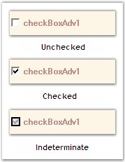{border="0"}

[]{style="COLOR: #15428b"} 

Figure 611: CheckBoxAdv States

**[]{style="COLOR: #15428b"}** 

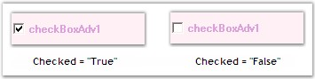{border="0"}

[]{style="COLOR: #15428b"} 

Figure 612: \"Checked\" property displaying the Checked States

[]{style="COLOR: #15428b"} 

See Also

[]{style="COLOR: #15428b"} 

[CheckBoxAdv Values]{.UGHyperlink}[, ]{.UGHyperlink}[Image Settings]{.UGHyperlink}[]{.UGHyperlink}

[]{#_CheckBoxAdv_Values}3.3.11.1.3.1.2     CheckBoxAdv Values

[]{#p772} 

This section discusses how values can be associated with the various check states.

 

Both integer and string values can be associated with the check states as follows.

[]{style="COLOR: #15428b"} 

::: {align="center"}
  ------------------------ --------------------------------------------------------------------------------------------------------------------------------------------------------
  CheckBoxAdv Properties   Description
  CheckedInt               Specifies the integer value when checked.
  CheckedString            Specifies the string value when checked.
  IndeterminateInt         Specifies the integer value when indeterminate.
  IndeterminateString      Specifies the string value when indeterminate.
  UncheckedInt             Specifies the integer value when Unchecked.
  UncheckedString          Specifies the string value when Unchecked.
  StringValue              Gets or sets the string value.
  BoolValue                Gets / sets a value indicating the check state. This property can be set to use bool values for databinding. Refer Frequently Asked Questions section.
  IntValue                 Gets / sets the int value. Refer Frequently Asked Questions section.
  ------------------------ --------------------------------------------------------------------------------------------------------------------------------------------------------
:::

[]{style="COLOR: #15428b"} 

+----------------------------------------------------------------------------------------------------------------------------------------------------------------------------------------------+
| **[\[C#\]]{style="FONT-FAMILY: 'Courier New'; COLOR: black"}**                                                                                                                               |
|                                                                                                                                                                                              |
| []{style="FONT-FAMILY: 'Courier New'; COLOR: black"}                                                                                                                                         |
|                                                                                                                                                                                              |
| [this]{style="FONT-FAMILY: 'Courier New'; COLOR: blue"}[.checkBoxAdv1.CheckedInt = 3;]{style="FONT-FAMILY: 'Courier New'"}                                                                   |
|                                                                                                                                                                                              |
| [this]{style="FONT-FAMILY: 'Courier New'; COLOR: blue"}[.checkBoxAdv1.CheckedString = [\"CheckBoxAdv is Checked\"]{style="COLOR: #a31515"};]{style="FONT-FAMILY: 'Courier New'"}             |
|                                                                                                                                                                                              |
| [this]{style="FONT-FAMILY: 'Courier New'; COLOR: blue"}[.checkBoxAdv1.IndeterminateInt = 5;]{style="FONT-FAMILY: 'Courier New'"}                                                             |
|                                                                                                                                                                                              |
| [this]{style="FONT-FAMILY: 'Courier New'; COLOR: blue"}[.checkBoxAdv1.IndeterminateString = [\"CheckBoxAdv is Indeterminate\"]{style="COLOR: #a31515"};]{style="FONT-FAMILY: 'Courier New'"} |
|                                                                                                                                                                                              |
| [this]{style="FONT-FAMILY: 'Courier New'; COLOR: blue"}[.checkBoxAdv1.UncheckedInt = 3;]{style="FONT-FAMILY: 'Courier New'"}                                                                 |
|                                                                                                                                                                                              |
| [this]{style="FONT-FAMILY: 'Courier New'; COLOR: blue"}[.checkBoxAdv1.UncheckedString = [\"CheckBoxAdv is Unchecked\"]{style="COLOR: #a31515"};]{style="FONT-FAMILY: 'Courier New'"}         |
|                                                                                                                                                                                              |
| [this]{style="FONT-FAMILY: 'Courier New'; COLOR: blue"}[.checkBoxAdv1.StringValue = [\"String\"]{style="COLOR: #a31515"};]{style="FONT-FAMILY: 'Courier New'"}                               |
|                                                                                                                                                                                              |
| [this]{style="FONT-FAMILY: 'Courier New'; COLOR: blue"}[.checkBoxAdv1.IntValue = 5;]{style="FONT-FAMILY: 'Courier New'"}                                                                     |
|                                                                                                                                                                                              |
| [this]{style="FONT-FAMILY: 'Courier New'; COLOR: blue"}[.checkBoxAdv1.BoolValue = [true]{style="COLOR: blue"};]{style="FONT-FAMILY: 'Courier New'"}                                          |
+----------------------------------------------------------------------------------------------------------------------------------------------------------------------------------------------+

[]{style="COLOR: #15428b"} 

+-------------------------------------------------------------------------------------------------------------------------------------------------------------------------------------------+
| **[\[VB.NET\]]{style="FONT-FAMILY: 'Courier New'; COLOR: black"}**                                                                                                                        |
|                                                                                                                                                                                           |
| []{style="FONT-FAMILY: 'Courier New'; COLOR: black"}                                                                                                                                      |
|                                                                                                                                                                                           |
| [Me]{style="FONT-FAMILY: 'Courier New'; COLOR: blue"}[.checkBoxAdv1.CheckedInt = 3]{style="FONT-FAMILY: 'Courier New'"}                                                                   |
|                                                                                                                                                                                           |
| [Me]{style="FONT-FAMILY: 'Courier New'; COLOR: blue"}[.checkBoxAdv1.CheckedString = [\"CheckBoxAdv is Checked\"]{style="COLOR: #a31515"}]{style="FONT-FAMILY: 'Courier New'"}             |
|                                                                                                                                                                                           |
| [Me]{style="FONT-FAMILY: 'Courier New'; COLOR: blue"}[.checkBoxAdv1.IndeterminateInt = 5]{style="FONT-FAMILY: 'Courier New'"}                                                             |
|                                                                                                                                                                                           |
| [Me]{style="FONT-FAMILY: 'Courier New'; COLOR: blue"}[.checkBoxAdv1.IndeterminateString = [\"CheckBoxAdv is Indeterminate\"]{style="COLOR: #a31515"}]{style="FONT-FAMILY: 'Courier New'"} |
|                                                                                                                                                                                           |
| [Me]{style="FONT-FAMILY: 'Courier New'; COLOR: blue"}[.checkBoxAdv1.UncheckedInt = 3]{style="FONT-FAMILY: 'Courier New'"}                                                                 |
|                                                                                                                                                                                           |
| [Me]{style="FONT-FAMILY: 'Courier New'; COLOR: blue"}[.checkBoxAdv1.UncheckedString = [\"CheckBoxAdv is Unchecked\"]{style="COLOR: #a31515"}]{style="FONT-FAMILY: 'Courier New'"}         |
|                                                                                                                                                                                           |
| [Me]{style="FONT-FAMILY: 'Courier New'; COLOR: blue"}[.checkBoxAdv1.StringValue = [\"String\"]{style="COLOR: #a31515"}]{style="FONT-FAMILY: 'Courier New'"}                               |
|                                                                                                                                                                                           |
| [Me]{style="FONT-FAMILY: 'Courier New'; COLOR: blue"}[.checkBoxAdv1.IntValue = 5]{style="FONT-FAMILY: 'Courier New'"}                                                                     |
|                                                                                                                                                                                           |
| [Me]{style="FONT-FAMILY: 'Courier New'; COLOR: blue"}[.checkBoxAdv1.BoolValue = [True]{style="COLOR: blue"}]{style="FONT-FAMILY: 'Courier New'"}                                          |
+-------------------------------------------------------------------------------------------------------------------------------------------------------------------------------------------+

[]{style="COLOR: #15428b"} 

See Also

[]{style="COLOR: black"} 

[CheckBoxAdv States]{.UGHyperlink}[, ]{.UGHyperlink}[Image Settings]{.UGHyperlink}[]{.UGHyperlink}

###### []{#p773}3.3.11.1.3.2        Text Settings {#text-settings style="tab-stops: 0pt"}

[]{style="COLOR: #15428b"} 

This section discusses the text settings of the CheckBoxAdv.

 

Text in the CheckBoxAdv can be shadowed and wrapped as illustrated below.

 

::: {align="center"}
  ------------------------ -------------------------------------------------------
  CheckBoxAdv Properties   Description
  TextShadow               Determines if the text shadow is visible.
  ShadowColor              The color of the text shadow.
  ShadowOffset             The offset of the text shadow.
  WrapText                 Determines if the text in the CheckBoxAdv is wrapped.
  ------------------------ -------------------------------------------------------
:::

[]{style="COLOR: #15428b"} 

+------------------------------------------------------------------------------------------------------------------------------------------------------------------------------------------------------------+
| **[\[C#\]]{style="FONT-FAMILY: 'Courier New'; COLOR: black"}**                                                                                                                                             |
|                                                                                                                                                                                                            |
| []{style="FONT-FAMILY: 'Courier New'; COLOR: black"}                                                                                                                                                       |
|                                                                                                                                                                                                            |
| [this]{style="FONT-FAMILY: 'Courier New'; COLOR: blue"}[.checkBoxAdv1.TextShadow = [true]{style="COLOR: blue"};]{style="FONT-FAMILY: 'Courier New'"}                                                       |
|                                                                                                                                                                                                            |
| [this]{style="FONT-FAMILY: 'Courier New'; COLOR: blue"}[.checkBoxAdv1.ShadowColor = System.Drawing.[Color]{style="COLOR: #2b91af"}.BurlyWood;]{style="FONT-FAMILY: 'Courier New'"}                         |
|                                                                                                                                                                                                            |
| [this]{style="FONT-FAMILY: 'Courier New'; COLOR: blue"}[.checkBoxAdv1.ShadowOffset = [new]{style="COLOR: blue"} System.Drawing.[Point]{style="COLOR: #2b91af"}(8, 8);]{style="FONT-FAMILY: 'Courier New'"} |
|                                                                                                                                                                                                            |
| [this]{style="FONT-FAMILY: 'Courier New'; COLOR: blue"}[.checkBoxAdv1.WrapText = [true]{style="COLOR: blue"};]{style="FONT-FAMILY: 'Courier New'"}                                                         |
+------------------------------------------------------------------------------------------------------------------------------------------------------------------------------------------------------------+

[]{style="COLOR: #15428b"} 

+-------------------------------------------------------------------------------------------------------------------------------------------------------------------------------+
| **[\[VB.NET\]]{style="FONT-FAMILY: 'Courier New'; COLOR: black"}**                                                                                                            |
|                                                                                                                                                                               |
| []{style="FONT-FAMILY: 'Courier New'; COLOR: black"}                                                                                                                          |
|                                                                                                                                                                               |
| [Me]{style="FONT-FAMILY: 'Courier New'; COLOR: blue"}[.checkBoxAdv1.TextShadow = [True]{style="COLOR: blue"}]{style="FONT-FAMILY: 'Courier New'"}                             |
|                                                                                                                                                                               |
| [Me]{style="FONT-FAMILY: 'Courier New'; COLOR: blue"}[.checkBoxAdv1.ShadowColor = System.Drawing.Color.BurlyWood]{style="FONT-FAMILY: 'Courier New'"}                         |
|                                                                                                                                                                               |
| [Me]{style="FONT-FAMILY: 'Courier New'; COLOR: blue"}[.checkBoxAdv1.ShadowOffset = [New]{style="COLOR: blue"} System.Drawing.Point(8, 8)]{style="FONT-FAMILY: 'Courier New'"} |
|                                                                                                                                                                               |
| [Me]{style="FONT-FAMILY: 'Courier New'; COLOR: blue"}[.checkBoxAdv1.WrapText = [True]{style="COLOR: blue"}]{style="FONT-FAMILY: 'Courier New'"}                               |
+-------------------------------------------------------------------------------------------------------------------------------------------------------------------------------+

[]{style="COLOR: #15428b"} 

{border="0"}

 

Figure 613: Text Shadow Settings

**[]{style="COLOR: #15428b"}** 

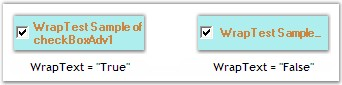{border="0"}

[]{style="COLOR: #15428b"} 

Figure 614: WrapText property Set

[]{style="COLOR: #15428b"} 

A sample which demonstrates the TextShadow property of CheckBoxAdv is available in the below sample installation path.

 

..My Documents\\Syncfusion\\EssentialStudio***\\Version Number***\\Windows\\Tools.Windows\\Samples\\2.0\\Editors Package\\OptionControls

[]{style="COLOR: #15428b"} 

See Also

[]{style="COLOR: black"} 

[Alignment Settings]{.UGHyperlink}[]{.UGHyperlink}

###### []{#p774}3.3.11.1.3.3        Appearance and Behavior Settings {#appearance-and-behavior-settings style="tab-stops: 0pt"}

[]{style="COLOR: #15428b"} 

This section discusses the appearance and behavior settings of the CheckBoxAdv control.

[]{style="COLOR: #15428b"} 

Appearance Settings

[]{style="COLOR: #15428b"} 

DrawFocusRectangle

[]{style="COLOR: #4a5c8c; FONT-SIZE: 8pt"} 

The focus rectangle can be hidden or made visible using the below given property.

[]{style="COLOR: #15428b"} 

::: {align="center"}
  ---------------------- ------------------------------------------------------------------------------------------------------------
  CheckBoxAdv Property   Description
  DrawFocusRectangle     Determines if the focus rectangle is visible when it gets the focus. The default value is set to \'True\'.
  ---------------------- ------------------------------------------------------------------------------------------------------------
:::

[]{style="COLOR: #15428b"} 

+--------------------------------------------------------------------------------------------------------------------------------------------------------------+
| **[\[C#\]]{style="FONT-FAMILY: 'Courier New'; COLOR: black"}**                                                                                               |
|                                                                                                                                                              |
| []{style="FONT-FAMILY: 'Courier New'; COLOR: black"}                                                                                                         |
|                                                                                                                                                              |
| [this]{style="FONT-FAMILY: 'Courier New'; COLOR: blue"}[.checkBoxAdv1.DrawFocusRectangle = [true]{style="COLOR: blue"};]{style="FONT-FAMILY: 'Courier New'"} |
+--------------------------------------------------------------------------------------------------------------------------------------------------------------+

[]{style="COLOR: #15428b"} 

+-----------------------------------------------------------------------------------------------------------------------------------------------------------+
| **[\[VB.NET\]]{style="FONT-FAMILY: 'Courier New'; COLOR: black"}**                                                                                        |
|                                                                                                                                                           |
| []{style="FONT-FAMILY: 'Courier New'; COLOR: black"}                                                                                                      |
|                                                                                                                                                           |
| [Me]{style="FONT-FAMILY: 'Courier New'; COLOR: blue"}[.checkBoxAdv1.DrawFocusRectangle = [True]{style="COLOR: blue"}]{style="FONT-FAMILY: 'Courier New'"} |
+-----------------------------------------------------------------------------------------------------------------------------------------------------------+

[]{style="COLOR: #15428b"} 

Behavior Settings

[]{style="COLOR: #15428b"} 

The behavior settings of the CheckBoxAdv can be customized using the properties given below.

[]{style="COLOR: #15428b"} 

::: {align="center"}
  ------------------------ -----------------------------------------------------------------------------
  CheckBoxAdv Properties   Description
  AutoHeight               Determines if the CheckBoxAdv will automatically calculate its height.
  ReadOnlyMode             Specifies the Read Only Mode of the CheckBoxAdv.
  Tristate                 Specifies whether the indeterminate state can be accessed through clicking.
  ------------------------ -----------------------------------------------------------------------------
:::

[]{style="COLOR: #15428b"} 

+--------------------------------------------------------------------------------------------------------------------------------------------------------+
| **[\[C#\]]{style="FONT-FAMILY: 'Courier New'; COLOR: black"}**                                                                                         |
|                                                                                                                                                        |
| []{style="FONT-FAMILY: 'Courier New'; COLOR: black"}                                                                                                   |
|                                                                                                                                                        |
| [this]{style="FONT-FAMILY: 'Courier New'; COLOR: blue"}[.checkBoxAdv1.AutoHeight = [true]{style="COLOR: blue"};]{style="FONT-FAMILY: 'Courier New'"}   |
|                                                                                                                                                        |
| [this]{style="FONT-FAMILY: 'Courier New'; COLOR: blue"}[.checkBoxAdv1.ReadOnlyMode = [true]{style="COLOR: blue"};]{style="FONT-FAMILY: 'Courier New'"} |
|                                                                                                                                                        |
| [this]{style="FONT-FAMILY: 'Courier New'; COLOR: blue"}[.checkBoxAdv1.Tristate= [false]{style="COLOR: blue"};]{style="FONT-FAMILY: 'Courier New'"}     |
+--------------------------------------------------------------------------------------------------------------------------------------------------------+

[]{style="COLOR: #15428b"} 

+-----------------------------------------------------------------------------------------------------------------------------------------------------+
| **[\[VB.NET\]]{style="FONT-FAMILY: 'Courier New'; COLOR: black"}**                                                                                  |
|                                                                                                                                                     |
| []{style="FONT-FAMILY: 'Courier New'; COLOR: black"}                                                                                                |
|                                                                                                                                                     |
| [Me]{style="FONT-FAMILY: 'Courier New'; COLOR: blue"}[.checkBoxAdv1.AutoHeight = [True]{style="COLOR: blue"}]{style="FONT-FAMILY: 'Courier New'"}   |
|                                                                                                                                                     |
| [Me]{style="FONT-FAMILY: 'Courier New'; COLOR: blue"}[.checkBoxAdv1.ReadOnlyMode = [True]{style="COLOR: blue"}]{style="FONT-FAMILY: 'Courier New'"} |
|                                                                                                                                                     |
| [Me]{style="FONT-FAMILY: 'Courier New'; COLOR: blue"}[.checkBoxAdv1.Tristate= [False]{style="COLOR: blue"}]{style="FONT-FAMILY: 'Courier New'"}     |
+-----------------------------------------------------------------------------------------------------------------------------------------------------+

[]{style="COLOR: #15428b"} 

A sample which demonstrates the ReadOnlyMode and Tristate properties of CheckBoxAdv is available in the below sample installation path.

 

..My Documents\\Syncfusion\\EssentialStudio\\***Version Number***\\Windows\\Tools.Windows\\Samples\\2.0\\Editors Package\\OptionControls

###### []{#_Alignment_Settings_1}3.3.11.1.3.4        Alignment Settings[]{#p775} {#alignment-settings style="tab-stops: 0pt"}

[]{style="COLOR: #15428b"} 

This section discusses the alignment settings of the CheckBoxAdv.

[]{style="COLOR: #15428b"} 

Text Alignment

[]{style="COLOR: #15428b"} 

Text in the CheckBoxAdv can be aligned to the desired location as given below.

[]{style="COLOR: #15428b"} 

::: {align="center"}
+-----------------------------------+-------------------------------------------------------------------------------------------------------------------+
| CheckBoxAdv Properties            | Description                                                                                                       |
+-----------------------------------+-------------------------------------------------------------------------------------------------------------------+
| TextContentAlignment              | Indicates the alignment of the text. The default value is set to \'MiddleLeft\'.                                  |
|                                   |                                                                                                                   |
|                                   |                                                                                                                   |
|                                   |                                                                                                                   |
|                                   | The options included are as follows.                                                                              |
|                                   |                                                                                                                   |
|                                   |                                                                                                                   |
|                                   |                                                                                                                   |
|                                   | *TopLeft,*                                                                                                        |
|                                   |                                                                                                                   |
|                                   | *TopCenter,*                                                                                                      |
|                                   |                                                                                                                   |
|                                   | *TopRight,*                                                                                                       |
|                                   |                                                                                                                   |
|                                   | *MiddleLeft,*                                                                                                     |
|                                   |                                                                                                                   |
|                                   | *MiddleCenter,*                                                                                                   |
|                                   |                                                                                                                   |
|                                   | *MiddleRight,*                                                                                                    |
|                                   |                                                                                                                   |
|                                   | *BottomLeft,*                                                                                                     |
|                                   |                                                                                                                   |
|                                   | *BottomCenter and*                                                                                                |
|                                   |                                                                                                                   |
|                                   | *BottomRight.*                                                                                                    |
|                                   |                                                                                                                   |
|                                   |                                                                                                                   |
|                                   |                                                                                                                   |
|                                   | WrapText property must be set to \'False\'. Refer[ [Text Settings]{style="COLOR: black"}]{style="FONT-SIZE: 8pt"} |
+-----------------------------------+-------------------------------------------------------------------------------------------------------------------+
:::

[]{style="COLOR: #15428b"} 

+-----------------------------------------------------------------------------------------------------------------------------------------------------------------------------------------------------------+
| **[\[C#\]]{style="FONT-FAMILY: 'Courier New'; COLOR: black"}**                                                                                                                                            |
|                                                                                                                                                                                                           |
| []{style="FONT-FAMILY: 'Courier New'; COLOR: black"}                                                                                                                                                      |
|                                                                                                                                                                                                           |
| [this]{style="FONT-FAMILY: 'Courier New'; COLOR: blue"}[.checkBoxAdv1.TextContentAlignment = System.Drawing.[ContentAlignment]{style="COLOR: #2b91af"}.MiddleCenter;]{style="FONT-FAMILY: 'Courier New'"} |
+-----------------------------------------------------------------------------------------------------------------------------------------------------------------------------------------------------------+

[]{style="COLOR: #15428b"} 

+------------------------------------------------------------------------------------------------------------------------------------------------------------------------------+
| **[\[VB.NET\]]{style="FONT-FAMILY: 'Courier New'; COLOR: black"}**                                                                                                           |
|                                                                                                                                                                              |
| []{style="FONT-FAMILY: 'Courier New'; COLOR: black"}                                                                                                                         |
|                                                                                                                                                                              |
| [Me]{style="FONT-FAMILY: 'Courier New'; COLOR: blue"}[.checkBoxAdv1.TextContentAlignment = System.Drawing.ContentAlignment.MiddleCenter]{style="FONT-FAMILY: 'Courier New'"} |
+------------------------------------------------------------------------------------------------------------------------------------------------------------------------------+

**[]{style="COLOR: #15428b"}** 

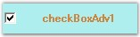{border="0"}

[]{style="COLOR: #15428b"} 

Figure 615: Text aligned to \"MiddleCenter\"

[]{style="COLOR: #15428b"} 

CheckBox Alignment

[]{style="COLOR: #15428b"} 

The CheckBox itself can be aligned to any desired location that can be chosen from the options given in the following property.

[]{style="COLOR: #15428b"} 

::: {align="center"}
+-----------------------------------+--------------------------------------------------------------------------------------+
| CheckBoxAdv Properties            | Description                                                                          |
+-----------------------------------+--------------------------------------------------------------------------------------+
| CheckAlign                        | Indicates the alignment of the CheckBox. The default value is set to \'MiddleLeft\'. |
|                                   |                                                                                      |
|                                   |                                                                                      |
|                                   |                                                                                      |
|                                   | The options included are as follows.                                                 |
|                                   |                                                                                      |
|                                   |                                                                                      |
|                                   |                                                                                      |
|                                   | *TopLeft,*                                                                           |
|                                   |                                                                                      |
|                                   | *TopCenter,*                                                                         |
|                                   |                                                                                      |
|                                   | *TopRight,*                                                                          |
|                                   |                                                                                      |
|                                   | *MiddleLeft,*                                                                        |
|                                   |                                                                                      |
|                                   | *MiddleCenter,*                                                                      |
|                                   |                                                                                      |
|                                   | *MiddleRight,*                                                                       |
|                                   |                                                                                      |
|                                   | *BottomLeft,*                                                                        |
|                                   |                                                                                      |
|                                   | *BottomCenter and*                                                                   |
|                                   |                                                                                      |
|                                   | *BottomRight.*                                                                       |
+-----------------------------------+--------------------------------------------------------------------------------------+
:::

[]{style="COLOR: #15428b"} 

+------------------------------------------------------------------------------------------------------------------------------------------------------------------------------------------------+
| **[\[C#\]]{style="FONT-FAMILY: 'Courier New'; COLOR: black"}**                                                                                                                                 |
|                                                                                                                                                                                                |
| []{style="FONT-FAMILY: 'Courier New'; COLOR: black"}                                                                                                                                           |
|                                                                                                                                                                                                |
| [this]{style="FONT-FAMILY: 'Courier New'; COLOR: blue"}[.checkBoxAdv1.CheckAlign = System.Drawing.[ContentAlignment]{style="COLOR: #2b91af"}.MiddleRight;]{style="FONT-FAMILY: 'Courier New'"} |
+------------------------------------------------------------------------------------------------------------------------------------------------------------------------------------------------+

[]{style="COLOR: #15428b"} 

+-------------------------------------------------------------------------------------------------------------------------------------------------------------------+
| **[\[VB.NET\]]{style="FONT-FAMILY: 'Courier New'; COLOR: black"}**                                                                                                |
|                                                                                                                                                                   |
| []{style="FONT-FAMILY: 'Courier New'; COLOR: black"}                                                                                                              |
|                                                                                                                                                                   |
| [Me]{style="FONT-FAMILY: 'Courier New'; COLOR: blue"}[.checkBoxAdv1.CheckAlign = System.Drawing.ContentAlignment.MiddleRight]{style="FONT-FAMILY: 'Courier New'"} |
+-------------------------------------------------------------------------------------------------------------------------------------------------------------------+

[]{style="COLOR: #4a5c8c; FONT-SIZE: 8pt"} 

{border="0"}

[]{style="COLOR: #15428b"} 

Figure 616: CheckBox aligned to \"MiddleRight\"

[]{style="COLOR: #15428b"} 

A sample which demonstrates the Text and CheckBox Alignment features of CheckBoxAdv is available in the below sample installation path.

 

..My Documents\\Syncfusion\\EssentialStudio\\***Version Number***\\Windows\\Tools.Windows\\Samples\\2.0\\Editors Package\\OptionControls

[]{style="COLOR: #15428b"} 

See Also

[]{style="COLOR: #15428b"} 

[Text Settings]{.UGHyperlink}[, ]{.UGHyperlink}[[CheckBoxAdv Settings]{.UGHyperlink}]()[]{.UGHyperlink}

###### []{#_Background_Settings_5}3.3.11.1.3.5        Background Settings {#background-settings style="tab-stops: 0pt"}

[]{#p776} 

The background settings of the CheckBoxAdv are discussed below.

 

The CheckBoxAdv can be provided with a gradient background using the properties given below.

[]{style="COLOR: #15428b"} 

::: {align="center"}
+-----------------------------------+----------------------------------------------------------------------------+
| CheckBoxAdv Properties            | Description                                                                |
+-----------------------------------+----------------------------------------------------------------------------+
| BackgroundStyle                   | Sets the background style of the CheckBoxAdv.                              |
|                                   |                                                                            |
|                                   |                                                                            |
|                                   |                                                                            |
|                                   | The options included are as follows.                                       |
|                                   |                                                                            |
|                                   |                                                                            |
|                                   |                                                                            |
|                                   | *HorizontalGradient,*                                                      |
|                                   |                                                                            |
|                                   | *VerticalGradient and*                                                     |
|                                   |                                                                            |
|                                   | *Default.*                                                                 |
+-----------------------------------+----------------------------------------------------------------------------+
| GradientStart                     | Sets the start color of the gradient of the background of the CheckboxAdv. |
+-----------------------------------+----------------------------------------------------------------------------+
| GradientEnd                       | Sets the end color of the gradient of the background of the CheckboxAdv.   |
+-----------------------------------+----------------------------------------------------------------------------+
:::

[]{style="COLOR: #15428b"} 

+------------------------------------------------------------------------------------------------------------------------------------------------------------------------------------------------------+
| **[\[C#\]]{style="FONT-FAMILY: 'Courier New'; COLOR: black"}**                                                                                                                                       |
|                                                                                                                                                                                                      |
| []{style="FONT-FAMILY: 'Courier New'; COLOR: black"}                                                                                                                                                 |
|                                                                                                                                                                                                      |
| [this]{style="FONT-FAMILY: 'Courier New'; COLOR: blue"}[.checkBoxAdv1.BackgroundStyle = Syncfusion.Windows.Forms.Tools.CheckBoxAdvBackStyle.HorizontalGradient;]{style="FONT-FAMILY: 'Courier New'"} |
|                                                                                                                                                                                                      |
| [this]{style="FONT-FAMILY: 'Courier New'; COLOR: blue"}[.checkBoxAdv1.GradientStart = System.Drawing.Color.Aqua;]{style="FONT-FAMILY: 'Courier New'"}                                                |
|                                                                                                                                                                                                      |
| [this]{style="FONT-FAMILY: 'Courier New'; COLOR: blue"}[.checkBoxAdv1.GradientEnd = System.Drawing.Color.Magenta;]{style="FONT-FAMILY: 'Courier New'"}                                               |
+------------------------------------------------------------------------------------------------------------------------------------------------------------------------------------------------------+

[]{style="COLOR: #15428b"} 

+---------------------------------------------------------------------------------------------------------------------------------------------------------------------------------------------------+
| **[\[VB.NET\]]{style="FONT-FAMILY: 'Courier New'; COLOR: black"}**                                                                                                                                |
|                                                                                                                                                                                                   |
| []{style="FONT-FAMILY: 'Courier New'; COLOR: black"}                                                                                                                                              |
|                                                                                                                                                                                                   |
| [Me]{style="FONT-FAMILY: 'Courier New'; COLOR: blue"}[.checkBoxAdv1.BackgroundStyle = Syncfusion.Windows.Forms.Tools.CheckBoxAdvBackStyle.HorizontalGradient]{style="FONT-FAMILY: 'Courier New'"} |
|                                                                                                                                                                                                   |
| [Me]{style="FONT-FAMILY: 'Courier New'; COLOR: blue"}[.checkBoxAdv1.GradientStart = System.Drawing.Color.Aqua]{style="FONT-FAMILY: 'Courier New'"}                                                |
|                                                                                                                                                                                                   |
| [Me]{style="FONT-FAMILY: 'Courier New'; COLOR: blue"}[.checkBoxAdv1.GradientEnd = System.Drawing.Color.Magenta]{style="FONT-FAMILY: 'Courier New'"}                                               |
+---------------------------------------------------------------------------------------------------------------------------------------------------------------------------------------------------+

[]{style="COLOR: #15428b"} 

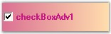{border="0"}

[]{style="COLOR: #15428b"} 

Figure 617: Gradient Background Displayed

[]{style="COLOR: #15428b"} 

::: {style="BORDER-BOTTOM: windowtext 1pt solid; BORDER-LEFT: medium none; PADDING-BOTTOM: 1pt; MARGIN-TOP: 9pt; PADDING-LEFT: 0pt; PADDING-RIGHT: 0pt; MARGIN-BOTTOM: 9pt; BORDER-TOP: windowtext 1pt solid; BORDER-RIGHT: medium none; PADDING-TOP: 1pt"}
{border="0"} Note: Gradient background cannot be applied to the CheckBoxAdv when its BackgroundStyle property is set to \'Default\'. Also, the background image cannot be displayed with gradient settings.
:::

[]{style="COLOR: #15428b"} 

A sample which demonstrates the Background Settings of CheckBoxAdv is available in the below sample installation path.

[]{style="COLOR: #15428b"} 

..My Documents\\Syncfusion\\EssentialStudio\\***Version Number***\\Windows\\Tools.Windows\\Samples\\2.0\\Editors Package\\OptionControls

###### []{#p777}3.3.11.1.3.6        Border Settings {#border-settings style="tab-stops: 0pt"}

[]{style="COLOR: #15428b"} 

Color and Styles can be applied to the border of the CheckBoxAdv as discussed below.

[]{style="COLOR: #15428b"} 

::: {align="center"}
+-----------------------------------+-----------------------------------------------------------------------------------------+
| CheckBoxAdv Properties            | Description                                                                             |
+-----------------------------------+-----------------------------------------------------------------------------------------+
| Border3DStyle                     | Indicates the style of the 3D border. The options included are as follows.              |
|                                   |                                                                                         |
|                                   |                                                                                         |
|                                   |                                                                                         |
|                                   | *RaisedOuter,*                                                                          |
|                                   |                                                                                         |
|                                   | *SunkenOuter,*                                                                          |
|                                   |                                                                                         |
|                                   | *RaisedInner,*                                                                          |
|                                   |                                                                                         |
|                                   | *SunkenInner,*                                                                          |
|                                   |                                                                                         |
|                                   | *Raised,*                                                                               |
|                                   |                                                                                         |
|                                   | *Etched,*                                                                               |
|                                   |                                                                                         |
|                                   | *Bump,*                                                                                 |
|                                   |                                                                                         |
|                                   | *Sunken,*                                                                               |
|                                   |                                                                                         |
|                                   | *Adjust and*                                                                            |
|                                   |                                                                                         |
|                                   | *Flat*.                                                                                 |
|                                   |                                                                                         |
|                                   |                                                                                         |
|                                   |                                                                                         |
|                                   | The default value is set to \'Sunken\'.                                                 |
+-----------------------------------+-----------------------------------------------------------------------------------------+
| BorderColor                       | Specifies the color of the 2D border.                                                   |
+-----------------------------------+-----------------------------------------------------------------------------------------+
| BorderSingle                      | Indicates the 2D border style. The options included are as follows.                     |
|                                   |                                                                                         |
|                                   |                                                                                         |
|                                   |                                                                                         |
|                                   | *Dotted,*                                                                               |
|                                   |                                                                                         |
|                                   | *Dashed,*                                                                               |
|                                   |                                                                                         |
|                                   | *Solid,*                                                                                |
|                                   |                                                                                         |
|                                   | *Inset,*                                                                                |
|                                   |                                                                                         |
|                                   | *Outset and*                                                                            |
|                                   |                                                                                         |
|                                   | *None.*                                                                                 |
|                                   |                                                                                         |
|                                   |                                                                                         |
|                                   |                                                                                         |
|                                   | The BorderStyle property should be set to \'FixedSingle\'.                              |
+-----------------------------------+-----------------------------------------------------------------------------------------+
| BorderStyle                       | Indicates whether the panel should have a border. The options included are given below. |
|                                   |                                                                                         |
|                                   |                                                                                         |
|                                   |                                                                                         |
|                                   | *FixedSingle,*                                                                          |
|                                   |                                                                                         |
|                                   | *Fixed3D and*                                                                           |
|                                   |                                                                                         |
|                                   | *None.*                                                                                 |
+-----------------------------------+-----------------------------------------------------------------------------------------+
| HotBorderColor                    | Specifies the color of the FixedSingle border when MouseOver.                           |
+-----------------------------------+-----------------------------------------------------------------------------------------+
:::

 

+----------------------------------------------------------------------------------------------------------------------------------------------------------------------------------------------------+
| **[\[C#\]]{style="FONT-FAMILY: 'Courier New'; COLOR: black"}**                                                                                                                                     |
|                                                                                                                                                                                                    |
| []{style="FONT-FAMILY: 'Courier New'; COLOR: black"}                                                                                                                                               |
|                                                                                                                                                                                                    |
| [this]{style="FONT-FAMILY: 'Courier New'; COLOR: blue"}[.checkBoxAdv1.Border3DStyle = System.Windows.Forms.[Border3DStyle]{style="COLOR: #2b91af"}.Bump;]{style="FONT-FAMILY: 'Courier New'"}      |
|                                                                                                                                                                                                    |
| [this]{style="FONT-FAMILY: 'Courier New'; COLOR: blue"}[.checkBoxAdv1.BorderColor = System.Drawing.[Color]{style="COLOR: #2b91af"}.Red;]{style="FONT-FAMILY: 'Courier New'"}                       |
|                                                                                                                                                                                                    |
| [this]{style="FONT-FAMILY: 'Courier New'; COLOR: blue"}[.checkBoxAdv1.BorderSingle = System.Windows.Forms.[ButtonBorderStyle]{style="COLOR: #2b91af"}.Dotted;]{style="FONT-FAMILY: 'Courier New'"} |
|                                                                                                                                                                                                    |
| [this]{style="FONT-FAMILY: 'Courier New'; COLOR: blue"}[.checkBoxAdv1.BorderStyle = System.Windows.Forms.[BorderStyle]{style="COLOR: #2b91af"}.FixedSingle;]{style="FONT-FAMILY: 'Courier New'"}   |
|                                                                                                                                                                                                    |
| []{style="FONT-FAMILY: 'Courier New'"}                                                                                                                                                             |
|                                                                                                                                                                                                    |
| [// BorderStyle must be set to \'FixedSingle\'.]{style="FONT-FAMILY: 'Courier New'; COLOR: green"}                                                                                                 |
|                                                                                                                                                                                                    |
| [this]{style="FONT-FAMILY: 'Courier New'; COLOR: blue"}[.checkBoxAdv1.HotBorderColor = System.Drawing.[Color]{style="COLOR: #2b91af"}.Blue;]{style="FONT-FAMILY: 'Courier New'"}                   |
+----------------------------------------------------------------------------------------------------------------------------------------------------------------------------------------------------+

[]{style="COLOR: #15428b"} 

+-----------------------------------------------------------------------------------------------------------------------------------------------------------------------+
| **[\[VB.NET\]]{style="FONT-FAMILY: 'Courier New'; COLOR: black"}**                                                                                                    |
|                                                                                                                                                                       |
| []{style="FONT-FAMILY: 'Courier New'; COLOR: black"}                                                                                                                  |
|                                                                                                                                                                       |
| [Me]{style="FONT-FAMILY: 'Courier New'; COLOR: blue"}[.checkBoxAdv1.Border3DStyle = System.Windows.Forms.Border3DStyle.Bump]{style="FONT-FAMILY: 'Courier New'"}      |
|                                                                                                                                                                       |
| [Me]{style="FONT-FAMILY: 'Courier New'; COLOR: blue"}[.checkBoxAdv1.BorderColor = System.Drawing.Color.Red]{style="FONT-FAMILY: 'Courier New'"}                       |
|                                                                                                                                                                       |
| [Me]{style="FONT-FAMILY: 'Courier New'; COLOR: blue"}[.checkBoxAdv1.BorderSingle = System.Windows.Forms.ButtonBorderStyle.Dotted]{style="FONT-FAMILY: 'Courier New'"} |
|                                                                                                                                                                       |
| [Me]{style="FONT-FAMILY: 'Courier New'; COLOR: blue"}[.checkBoxAdv1.BorderStyle = System.Windows.Forms.BorderStyle.FixedSingle]{style="FONT-FAMILY: 'Courier New'"}   |
|                                                                                                                                                                       |
| []{style="FONT-FAMILY: 'Courier New'"}                                                                                                                                |
|                                                                                                                                                                       |
| [\' BorderStyle must be set to \'FixedSingle\'.]{style="FONT-FAMILY: 'Courier New'; COLOR: green"}                                                                    |
|                                                                                                                                                                       |
| [Me]{style="FONT-FAMILY: 'Courier New'; COLOR: blue"}[.checkBoxAdv1.HotBorderColor = System.Drawing.Color.Blue]{style="FONT-FAMILY: 'Courier New'"}                   |
+-----------------------------------------------------------------------------------------------------------------------------------------------------------------------+

[]{style="COLOR: #15428b"} 

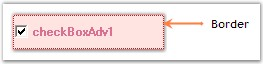{border="0"}

[]{style="COLOR: #15428b"} 

Figure 618: Border Set for CheckBoxAdv

[]{style="COLOR: #15428b"} 

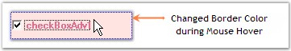{border="0"}

[]{style="COLOR: #15428b"} 

Figure 619: \"HotBorderColor\" property Set

**[]{style="COLOR: #15428b"}** 

A Sample which demonstrates the Border Settings of CheckBoxAdv is available in the below sample installation path.

 

..My Documents\\Syncfusion\\EssentialStudio\\***Version Number***\\Windows\\Tools.Windows\\Samples\\2.0\\Editors Package\\OptionControls

###### []{#_Image_Settings_3}3.3.11.1.3.7        Image Settings {#image-settings style="tab-stops: 0pt"}

[]{#p778}[]{style="COLOR: #15428b"} 

The image settings of the CheckBoxAdv control has been discussed in this section.

 

Images can be set to the CheckBoxAdv when it is in the Checked, Unchecked or Indeterminate state. The CheckBoxAdv allows us to set the following properties in order to display images.

 

::: {align="center"}
+-----------------------------------+------------------------------------------------------------------------------------+
| CheckBoxAdv Properties            | Description                                                                        |
+-----------------------------------+------------------------------------------------------------------------------------+
| ImageCheckBox                     | Indicates whether the CheckBox will be drawn using the images provided.            |
+-----------------------------------+------------------------------------------------------------------------------------+
| ImageCheckBoxSize                 | Gets / sets the size of the ImageCheckBox.                                         |
|                                   |                                                                                    |
|                                   |                                                                                    |
|                                   |                                                                                    |
|                                   | ImageCheckbox property must be set to \'True\'.                                    |
+-----------------------------------+------------------------------------------------------------------------------------+
| CheckedImage                      | Gets / sets the image used to draw the CheckBox when checked and mouse not over.   |
+-----------------------------------+------------------------------------------------------------------------------------+
| UncheckedImage                    | Gets / sets the image used to draw the CheckBox when unchecked and mouse not over. |
+-----------------------------------+------------------------------------------------------------------------------------+
| IndeterminateImage                | The image used to draw the CheckBox when indeterminate and mouse not over.         |
|                                   |                                                                                    |
|                                   |                                                                                    |
+-----------------------------------+------------------------------------------------------------------------------------+
| DisabledImage                     | Gets / sets the image used to draw the CheckBox when disabled.                     |
+-----------------------------------+------------------------------------------------------------------------------------+
| StretchImage                      | Indicates whether the state images of the CheckBox are stretched.                  |
+-----------------------------------+------------------------------------------------------------------------------------+
:::

[]{style="COLOR: #15428b"} 

::: {style="BORDER-BOTTOM: windowtext 1pt solid; BORDER-LEFT: medium none; PADDING-BOTTOM: 1pt; MARGIN-TOP: 9pt; PADDING-LEFT: 0pt; PADDING-RIGHT: 0pt; MARGIN-BOTTOM: 9pt; BORDER-TOP: windowtext 1pt solid; BORDER-RIGHT: medium none; PADDING-TOP: 1pt"}
{border="0"} Note: Before setting the images, make sure the ImageCheckBox property is set to \'True\'.
:::

[]{style="COLOR: #15428b"} 

+-------------------------------------------------------------------------------------------------------------------------------------------------------------------------------------------------------------------------------------------------------------------------+
| **[\[C#\]]{style="FONT-FAMILY: 'Courier New'; COLOR: black"}**                                                                                                                                                                                                          |
|                                                                                                                                                                                                                                                                         |
| []{style="FONT-FAMILY: 'Courier New'; COLOR: black"}                                                                                                                                                                                                                    |
|                                                                                                                                                                                                                                                                         |
| [this]{style="FONT-FAMILY: 'Courier New'; COLOR: blue"}[.checkBoxAdv1.ImageCheckBox = [true]{style="COLOR: blue"};]{style="FONT-FAMILY: 'Courier New'"}                                                                                                                 |
|                                                                                                                                                                                                                                                                         |
| [this]{style="FONT-FAMILY: 'Courier New'; COLOR: blue"}[.checkBoxAdv1.ImageCheckBoxSize = [new]{style="COLOR: blue"} System.Drawing.[Size]{style="COLOR: #2b91af"}(15, 15);]{style="FONT-FAMILY: 'Courier New'"}                                                        |
|                                                                                                                                                                                                                                                                         |
| [this]{style="FONT-FAMILY: 'Courier New'; COLOR: blue"}[.checkBoxAdv1.CheckedImage = ((System.Drawing.[Image]{style="COLOR: #2b91af"})(resources.GetObject([\"checkBoxAdv1.CheckedImage\"]{style="COLOR: #a31515"})));]{style="FONT-FAMILY: 'Courier New'"}             |
|                                                                                                                                                                                                                                                                         |
| [this]{style="FONT-FAMILY: 'Courier New'; COLOR: blue"}[.checkBoxAdv1.UncheckedImage = ((System.Drawing.[Image]{style="COLOR: #2b91af"})(resources.GetObject([\"checkBoxAdv1.UncheckedImage\"]{style="COLOR: #a31515"})));]{style="FONT-FAMILY: 'Courier New'"}         |
|                                                                                                                                                                                                                                                                         |
| [this]{style="FONT-FAMILY: 'Courier New'; COLOR: blue"}[.checkBoxAdv1.IndeterminateImage = ((System.Drawing.[Image]{style="COLOR: #2b91af"})(resources.GetObject([\"checkBoxAdv1.IndeterminateImage\"]{style="COLOR: #a31515"})));]{style="FONT-FAMILY: 'Courier New'"} |
|                                                                                                                                                                                                                                                                         |
| [this]{style="FONT-FAMILY: 'Courier New'; COLOR: blue"}[.checkBoxAdv1.DisabledImage = ((System.Drawing.[Image]{style="COLOR: #2b91af"})(resources.GetObject([\"checkBoxAdv1.DisabledImage\"]{style="COLOR: #a31515"})));]{style="FONT-FAMILY: 'Courier New'"}           |
|                                                                                                                                                                                                                                                                         |
| [this]{style="FONT-FAMILY: 'Courier New'; COLOR: blue"}[.checkBoxAdv1.StretchImage = [false]{style="COLOR: blue"};]{style="FONT-FAMILY: 'Courier New'"}                                                                                                                 |
+-------------------------------------------------------------------------------------------------------------------------------------------------------------------------------------------------------------------------------------------------------------------------+

[]{style="COLOR: #15428b"} 

+------------------------------------------------------------------------------------------------------------------------------------------------------------------------------------------------------------------------------------------------------------------------+
| **[\[VB.NET\]]{style="FONT-FAMILY: 'Courier New'; COLOR: black"}**                                                                                                                                                                                                     |
|                                                                                                                                                                                                                                                                        |
| []{style="FONT-FAMILY: 'Courier New'; COLOR: black"}                                                                                                                                                                                                                   |
|                                                                                                                                                                                                                                                                        |
| [Me]{style="FONT-FAMILY: 'Courier New'; COLOR: blue"}[.checkBoxAdv1.ImageCheckBox = [True]{style="COLOR: blue"}]{style="FONT-FAMILY: 'Courier New'"}                                                                                                                   |
|                                                                                                                                                                                                                                                                        |
| [Me]{style="FONT-FAMILY: 'Courier New'; COLOR: blue"}[.checkBoxAdv1.ImageCheckBoxSize = [New]{style="COLOR: blue"} System.Drawing.Size(15, 15)]{style="FONT-FAMILY: 'Courier New'"}                                                                                    |
|                                                                                                                                                                                                                                                                        |
| [Me]{style="FONT-FAMILY: 'Courier New'; COLOR: blue"}[.checkBoxAdv1.CheckedImage = ([CType]{style="COLOR: blue"}(Resources.GetObject([\"checkBoxAdv1.CheckedImage\"]{style="COLOR: #a31515"}), System.Drawing.Image))]{style="FONT-FAMILY: 'Courier New'"}             |
|                                                                                                                                                                                                                                                                        |
| [Me]{style="FONT-FAMILY: 'Courier New'; COLOR: blue"}[.checkBoxAdv1.UncheckedImage = ([CType]{style="COLOR: blue"}(Resources.GetObject([\"checkBoxAdv1.UncheckedImage\"]{style="COLOR: #a31515"}), System.Drawing.Image))]{style="FONT-FAMILY: 'Courier New'"}         |
|                                                                                                                                                                                                                                                                        |
| [Me]{style="FONT-FAMILY: 'Courier New'; COLOR: blue"}[.checkBoxAdv1.IndeterminateImage = ([CType]{style="COLOR: blue"}(Resources.GetObject([\"checkBoxAdv1.IndeterminateImage\"]{style="COLOR: #a31515"}), System.Drawing.Image))]{style="FONT-FAMILY: 'Courier New'"} |
|                                                                                                                                                                                                                                                                        |
| [Me]{style="FONT-FAMILY: 'Courier New'; COLOR: blue"}[.checkBoxAdv1.DisabledImage = ([CType]{style="COLOR: blue"}(Resources.GetObject([\"checkBoxAdv1.DisabledImage\"]{style="COLOR: #a31515"}), System.Drawing.Image))]{style="FONT-FAMILY: 'Courier New'"}           |
|                                                                                                                                                                                                                                                                        |
| [Me]{style="FONT-FAMILY: 'Courier New'; COLOR: blue"}[.checkBoxAdv1.StretchImage = [False]{style="COLOR: blue"}]{style="FONT-FAMILY: 'Courier New'"}                                                                                                                   |
+------------------------------------------------------------------------------------------------------------------------------------------------------------------------------------------------------------------------------------------------------------------------+

[]{style="COLOR: #15428b"} 

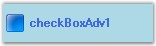{border="0"}

[]{style="COLOR: #15428b"} 

Figure 620: Image displayed for Checked State

of CheckBoxAdv

[]{style="COLOR: #4a5c8c; FONT-SIZE: 8pt"} 

Images displayed during Mouse Hover

[]{style="COLOR: #15428b"} 

Images can also be set when the mouse is hovered over the CheckBoxAdv control.

[]{style="COLOR: #15428b"} 

::: {align="center"}
  ------------------------- ------------------------------------------------------------------------------------
  CheckBoxAdv Properties    Description
  MouseOverCheckedImage     Gets / sets the image used to draw the CheckBox when checked and mouse over.
  MouseOverDisabledImage    Gets / sets the image used to draw the CheckBox when indeterminate and mouse over.
  MouseOverUncheckedImage   Gets / sets the image used to draw the CheckBox when unchecked and mouse over.
  ------------------------- ------------------------------------------------------------------------------------
:::

[]{style="COLOR: #15428b"} 

+-----------------------------------------------------------------------------------------------------------------------------------------------------------------------------------------------------------------------------------------------------------------------------------+
| **[\[C#\]]{style="FONT-FAMILY: 'Courier New'; COLOR: black"}**                                                                                                                                                                                                                    |
|                                                                                                                                                                                                                                                                                   |
| []{style="FONT-FAMILY: 'Courier New'; COLOR: black"}                                                                                                                                                                                                                              |
|                                                                                                                                                                                                                                                                                   |
| [this]{style="FONT-FAMILY: 'Courier New'; COLOR: blue"}[.checkBoxAdv1.MouseOverCheckedImage = ((System.Drawing.[Image]{style="COLOR: #2b91af"})(resources.GetObject([\"checkBoxAdv1.MouseOverCheckedImage\"]{style="COLOR: #a31515"})));]{style="FONT-FAMILY: 'Courier New'"}     |
|                                                                                                                                                                                                                                                                                   |
| [this]{style="FONT-FAMILY: 'Courier New'; COLOR: blue"}[.checkBoxAdv1.MouseOverIndetermImage = ((System.Drawing.[Image]{style="COLOR: #2b91af"})(resources.GetObject([\"checkBoxAdv1.MouseOverIndetermImage\"]{style="COLOR: #a31515"})));]{style="FONT-FAMILY: 'Courier New'"}   |
|                                                                                                                                                                                                                                                                                   |
| [this]{style="FONT-FAMILY: 'Courier New'; COLOR: blue"}[.checkBoxAdv1.MouseOverUncheckedImage = ((System.Drawing.[Image]{style="COLOR: #2b91af"})(resources.GetObject([\"checkBoxAdv1.MouseOverUncheckedImage\"]{style="COLOR: #a31515"})));]{style="FONT-FAMILY: 'Courier New'"} |
+-----------------------------------------------------------------------------------------------------------------------------------------------------------------------------------------------------------------------------------------------------------------------------------+

[]{style="COLOR: #15428b"} 

+----------------------------------------------------------------------------------------------------------------------------------------------------------------------------------------------------------------------------------------------------------------------------------+
| **[\[VB.NET\]]{style="FONT-FAMILY: 'Courier New'; COLOR: black"}**                                                                                                                                                                                                               |
|                                                                                                                                                                                                                                                                                  |
| []{style="FONT-FAMILY: 'Courier New'; COLOR: black"}                                                                                                                                                                                                                             |
|                                                                                                                                                                                                                                                                                  |
| [Me]{style="FONT-FAMILY: 'Courier New'; COLOR: blue"}[.checkBoxAdv1.MouseOverCheckedImage = ([CType]{style="COLOR: blue"}(Resources.GetObject([\"checkBoxAdv1.MouseOverCheckedImage\"]{style="COLOR: #a31515"}), System.Drawing.Image))]{style="FONT-FAMILY: 'Courier New'"}     |
|                                                                                                                                                                                                                                                                                  |
| [Me]{style="FONT-FAMILY: 'Courier New'; COLOR: blue"}[.checkBoxAdv1.MouseOverIndetermImage = ([CType]{style="COLOR: blue"}(Resources.GetObject([\"checkBoxAdv1.MouseOverIndetermImage\"]{style="COLOR: #a31515"}), System.Drawing.Image))]{style="FONT-FAMILY: 'Courier New'"}   |
|                                                                                                                                                                                                                                                                                  |
| [Me]{style="FONT-FAMILY: 'Courier New'; COLOR: blue"}[.checkBoxAdv1.MouseOverUncheckedImage = ([CType]{style="COLOR: blue"}(Resources.GetObject([\"checkBoxAdv1.MouseOverUncheckedImage\"]{style="COLOR: #a31515"}), System.Drawing.Image))]{style="FONT-FAMILY: 'Courier New'"} |
+----------------------------------------------------------------------------------------------------------------------------------------------------------------------------------------------------------------------------------------------------------------------------------+

[]{style="COLOR: #15428b"} 

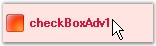{border="0"}

[]{style="COLOR: #15428b"} 

Figure 621: Image displayed for Unchecked State

of CheckBoxAdv during Mouse Hover

**[]{style="COLOR: #15428b"}** 

A Sample which demonstrates the ImageCheckBox property of CheckBoxAdv is available in the below sample installation path.

 

..My Documents\\Syncfusion\\EssentialStudio\\***Version Number***\\Windows\\Tools.Windows\\Samples\\2.0\\Editors Package\\OptionControls

###### []{#p779}3.3.11.1.3.8        Themes and Visual Styles {#themes-and-visual-styles style="tab-stops: 0pt"}

[]{style="COLOR: #15428b"} 

This section discusses the themes and visual style settings that are supported by the CheckBoxAdv control.

[]{style="COLOR: #15428b"} 

Themes

[]{style="COLOR: #4a5c8c; FONT-SIZE: 8pt"} 

The CheckBoxAdv can be provided with a themed appearance using the below given property.

[]{style="COLOR: #4a5c8c; FONT-SIZE: 8pt"} 

::: {align="center"}
  ---------------------- -------------------------------------------------------
  CheckBoxAdv Property   Description
  ThemesEnabled          Specifies whether themes are enabled for CheckBoxAdv.
  ---------------------- -------------------------------------------------------
:::

[]{style="COLOR: #15428b"} 

+---------------------------------------------------------------------------------------------------------------------------------------------------------+
| **[\[C#\]]{style="FONT-FAMILY: 'Courier New'; COLOR: black"}**                                                                                          |
|                                                                                                                                                         |
| []{style="FONT-FAMILY: 'Courier New'; COLOR: black"}                                                                                                    |
|                                                                                                                                                         |
| [this]{style="FONT-FAMILY: 'Courier New'; COLOR: blue"}[.checkBoxAdv1.ThemesEnabled = [true]{style="COLOR: blue"};]{style="FONT-FAMILY: 'Courier New'"} |
+---------------------------------------------------------------------------------------------------------------------------------------------------------+

[]{style="COLOR: #15428b"} 

+------------------------------------------------------------------------------------------------------------------------------------------------------+
| **[\[VB\]]{style="FONT-FAMILY: 'Courier New'; COLOR: black"}**                                                                                       |
|                                                                                                                                                      |
| []{style="FONT-FAMILY: 'Courier New'; COLOR: black"}                                                                                                 |
|                                                                                                                                                      |
| [Me]{style="FONT-FAMILY: 'Courier New'; COLOR: blue"}[.checkBoxAdv1.ThemesEnabled = [True]{style="COLOR: blue"}]{style="FONT-FAMILY: 'Courier New'"} |
+------------------------------------------------------------------------------------------------------------------------------------------------------+

[]{style="COLOR: #15428b"} 

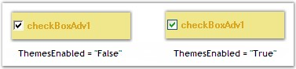{border="0"}

[]{style="COLOR: #15428b"} 

Figure 622: ThemesEnabled property Set

[]{style="COLOR: #15428b"} 

Visual Styles

[]{style="COLOR: #15428b"} 

The appearance of the CheckBoxAdv control can be customized using the various options provided by the following properties.

[]{style="COLOR: #15428b"} 

::: {align="center"}
+-----------------------------------+---------------------------------------------------------+
| CheckBoxAdv Properties            | Description                                             |
+-----------------------------------+---------------------------------------------------------+
| Style                             | Gets / sets an advanced appearance for the CheckBoxAdv. |
|                                   |                                                         |
|                                   |                                                         |
|                                   |                                                         |
|                                   | The options included are as follows.                    |
|                                   |                                                         |
|                                   |                                                         |
|                                   |                                                         |
|                                   | *Default and*                                           |
|                                   |                                                         |
|                                   | *Office2007.*                                           |
+-----------------------------------+---------------------------------------------------------+
| Office2007ColorScheme             | Gets / sets Office 2007 color scheme.                   |
|                                   |                                                         |
|                                   |                                                         |
|                                   |                                                         |
|                                   | The options included are as follows.                    |
|                                   |                                                         |
|                                   |                                                         |
|                                   |                                                         |
|                                   | *Managed,*                                              |
|                                   |                                                         |
|                                   | *Blue,*                                                 |
|                                   |                                                         |
|                                   | *Silver and*                                            |
|                                   |                                                         |
|                                   | *Black.*                                                |
|                                   |                                                         |
|                                   |                                                         |
|                                   |                                                         |
|                                   | The Style property should be set to \"Office2007\".     |
+-----------------------------------+---------------------------------------------------------+
:::

[]{style="COLOR: #15428b"} 

+-------------------------------------------------------------------------------------------------------------------------------------------------------------------------------------------------------------+
| **[\[C#\]]{style="FONT-FAMILY: 'Courier New'; COLOR: black"}**                                                                                                                                              |
|                                                                                                                                                                                                             |
| []{style="FONT-FAMILY: 'Courier New'; COLOR: black"}                                                                                                                                                        |
|                                                                                                                                                                                                             |
| [this]{style="FONT-FAMILY: 'Courier New'; COLOR: blue"}[.checkBoxAdv1.Style = Syncfusion.Windows.Forms.Tools.[CheckBoxAdvStyle]{style="COLOR: #2b91af"}.Office2007;]{style="FONT-FAMILY: 'Courier New'"}    |
|                                                                                                                                                                                                             |
| [this]{style="FONT-FAMILY: 'Courier New'; COLOR: blue"}[.checkBoxAdv1.Office2007ColorScheme = Syncfusion.Windows.Forms.[Office2007Theme]{style="COLOR: #2b91af"}.Blue;]{style="FONT-FAMILY: 'Courier New'"} |
+-------------------------------------------------------------------------------------------------------------------------------------------------------------------------------------------------------------+

[]{style="COLOR: #15428b"} 

+--------------------------------------------------------------------------------------------------------------------------------------------------------------------------------+
| **[\[VB\]]{style="FONT-FAMILY: 'Courier New'; COLOR: black"}**                                                                                                                 |
|                                                                                                                                                                                |
| []{style="FONT-FAMILY: 'Courier New'; COLOR: black"}                                                                                                                           |
|                                                                                                                                                                                |
| [Me]{style="FONT-FAMILY: 'Courier New'; COLOR: blue"}[.checkBoxAdv1.Style = Syncfusion.Windows.Forms.Tools.CheckBoxAdvStyle.Office2007]{style="FONT-FAMILY: 'Courier New'"}    |
|                                                                                                                                                                                |
| [Me]{style="FONT-FAMILY: 'Courier New'; COLOR: blue"}[.checkBoxAdv1.Office2007ColorScheme = Syncfusion.Windows.Forms.Office2007Theme.Blue]{style="FONT-FAMILY: 'Courier New'"} |
+--------------------------------------------------------------------------------------------------------------------------------------------------------------------------------+

[]{style="COLOR: #15428b"} 

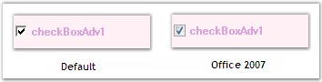{border="0"}

[]{style="COLOR: #15428b"} 

Figure 623: CheckBoxAdv Styles

[]{style="COLOR: #15428b"} 

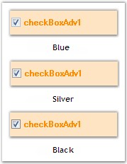{border="0"}

[]{style="COLOR: #15428b"} 

Figure 624: Office 2007 Color Schemes

[]{style="COLOR: #15428b"} 

When the **Office2007ColorScheme** property is set to \'Managed\', the CheckBox in the CheckBoxAdv can be displayed using custom colors supported by the control.

 

This can be done programmatically as follows.

[]{style="COLOR: #15428b"} 

+----------------------------------------------------------------------------------------------------------------------------------------------------------------------------------------------------------------+
| **[\[C#\]]{style="FONT-FAMILY: 'Courier New'; COLOR: black"}**                                                                                                                                                 |
|                                                                                                                                                                                                                |
| []{style="FONT-FAMILY: 'Courier New'; COLOR: black"}                                                                                                                                                           |
|                                                                                                                                                                                                                |
| [this]{style="FONT-FAMILY: 'Courier New'; COLOR: blue"}[.checkBoxAdv1.Style = Syncfusion.Windows.Forms.Tools.[CheckBoxAdvStyle]{style="COLOR: #2b91af"}.Office2007;]{style="FONT-FAMILY: 'Courier New'"}       |
|                                                                                                                                                                                                                |
| [this]{style="FONT-FAMILY: 'Courier New'; COLOR: blue"}[.checkBoxAdv1.Office2007ColorScheme = Syncfusion.Windows.Forms.[Office2007Theme]{style="COLOR: #2b91af"}.Managed;]{style="FONT-FAMILY: 'Courier New'"} |
|                                                                                                                                                                                                                |
| [Office2007Colors]{style="FONT-FAMILY: 'Courier New'; COLOR: #2b91af"}[.ApplyManagedColors([this]{style="COLOR: blue"}, [Color]{style="COLOR: #2b91af"}.Pink);]{style="FONT-FAMILY: 'Courier New'"}            |
+----------------------------------------------------------------------------------------------------------------------------------------------------------------------------------------------------------------+

[]{style="COLOR: #15428b"} 

+-----------------------------------------------------------------------------------------------------------------------------------------------------------------------------------+
| **[\[VB\]]{style="FONT-FAMILY: 'Courier New'; COLOR: black"}**                                                                                                                    |
|                                                                                                                                                                                   |
| []{style="FONT-FAMILY: 'Courier New'; COLOR: black"}                                                                                                                              |
|                                                                                                                                                                                   |
| [Me]{style="FONT-FAMILY: 'Courier New'; COLOR: blue"}[.checkBoxAdv1.Style = Syncfusion.Windows.Forms.Tools.CheckBoxAdvStyle.Office2007]{style="FONT-FAMILY: 'Courier New'"}       |
|                                                                                                                                                                                   |
| [Me]{style="FONT-FAMILY: 'Courier New'; COLOR: blue"}[.checkBoxAdv1.Office2007ColorScheme = Syncfusion.Windows.Forms.Office2007Theme.Managed]{style="FONT-FAMILY: 'Courier New'"} |
|                                                                                                                                                                                   |
| [Office2007Colors.ApplyManagedColors([Me]{style="COLOR: blue"}, Color.Pink)]{style="FONT-FAMILY: 'Courier New'"}                                                                  |
+-----------------------------------------------------------------------------------------------------------------------------------------------------------------------------------+

[]{style="COLOR: #15428b"} 

{border="0"}

[]{style="COLOR: #15428b"} 

Figure 625: CheckBox displayed in \"Pink\"

[]{style="COLOR: #15428b"} 

A sample which demonstrates the Themes and Visual Styles of CheckBoxAdv is available in the below sample installation path.

[]{style="COLOR: #15428b"} 

..My Documents\\Syncfusion\\EssentialStudio\\***Version Number***\\Windows\\Tools.Windows\\Samples\\2.0\\Editors Package\\OptionControls

[]{#related-topics}
::::::::::::::::::
