::: {style="DISPLAY: none"}
{#d2h_url_template}{#d2h_package_url style="WIDTH: 0px; DISPLAY: none; HEIGHT: 0px"}
:::

::::::::::::::::::: {.d2h_secondary_topic style="PADDING-BOTTOM: 10pt; MARGIN: 0pt; PADDING-LEFT: 0pt; PADDING-RIGHT: 0pt; PADDING-TOP: 0pt"}
##### Concepts and Features {#concepts-and-features style="tab-stops: 0pt"}

[]{style="COLOR: #15428b"} 

The following topics will help you become more familiar in using the RadioButtonAdv control.

[]{style="COLOR: #15428b"} 

###### []{#_RadioButtonAdv_Settings}3.3.11.2.3.1        RadioButtonAdv Settings {#radiobuttonadv-settings style="tab-stops: 0pt"}

[]{style="COLOR: #15428b"} 

This section discusses the various states of the RadioButtonAdv control and the method of associating values with the states.

 

It includes the below given topics.

[]{#_RadioButtonAdv_States}3.3.11.2.3.1.1     RadioButtonAdv States[]{#p793}

[]{style="COLOR: #15428b"} 

The RadioButtonAdv can be displayed in two different states which have been described below.

[]{style="COLOR: #15428b"} 

::: {align="center"}
  ------------------------- -------------------------------------------------
  RadioButtonAdv Property   Description
  Checked                   Gets / sets the check state of the RadioButton.
  ------------------------- -------------------------------------------------
:::

[]{style="COLOR: #15428b"} 

+------------------------------------------------------------------------------------------------------------------------------------------------------+
| **[\[C#\]]{style="FONT-FAMILY: 'Courier New'; COLOR: black"}**                                                                                       |
|                                                                                                                                                      |
| []{style="FONT-FAMILY: 'Courier New'; COLOR: black"}                                                                                                 |
|                                                                                                                                                      |
| [this]{style="FONT-FAMILY: 'Courier New'; COLOR: blue"}[.radioButtonAdv1.Checked = [true]{style="COLOR: blue"};]{style="FONT-FAMILY: 'Courier New'"} |
+------------------------------------------------------------------------------------------------------------------------------------------------------+

[]{style="COLOR: #15428b"} 

+---------------------------------------------------------------------------------------------------------------------------------------------------+
| **[\[VB.NET\]]{style="FONT-FAMILY: 'Courier New'; COLOR: black"}**                                                                                |
|                                                                                                                                                   |
| []{style="FONT-FAMILY: 'Courier New'; COLOR: black"}                                                                                              |
|                                                                                                                                                   |
| [Me]{style="FONT-FAMILY: 'Courier New'; COLOR: blue"}[.radioButtonAdv1.Checked = [True]{style="COLOR: blue"}]{style="FONT-FAMILY: 'Courier New'"} |
+---------------------------------------------------------------------------------------------------------------------------------------------------+

[]{style="COLOR: #15428b"} 

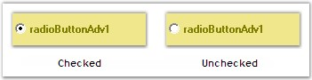{border="0"}

[]{style="COLOR: #15428b"} 

Figure 631: Check States

[]{style="COLOR: #15428b"} 

See Also

[]{style="COLOR: #15428b"} 

[RadioButtonAdv Values]{.UGHyperlink}[, ]{.UGHyperlink}[Image Settings]{.UGHyperlink}[, ]{.UGHyperlink}[RadioButtonAdv Events]{.UGHyperlink}[]{.UGHyperlink}

[]{#p794}[]{#_RadioButtonAdv_Values}3.3.11.2.3.1.2     RadioButtonAdv Values

[]{style="COLOR: #15428b"} 

This section discusses how values can be associated with the various check states.

 

Both integer and string values can be associated with the check states as follows.

[]{style="COLOR: #15428b"} 

::: {align="center"}
  --------------------------- ------------------------------------------------------------------------------------
  RadioButtonAdv Properties   Description
  CheckedInt                  Specifies the integer value when checked.
  CheckedString               Specifies the string value when checked.
  UncheckedInt                Specifies the integer value when Unchecked.
  UncheckedString             Specifies the string value when Unchecked.
  IntValue                    Gets / sets checked RadioButtonAdv in current container according to the TabIndex.
  --------------------------- ------------------------------------------------------------------------------------
:::

[]{style="COLOR: #15428b"} 

+--------------------------------------------------------------------------------------------------------------------------------------------------------------------------------------------+
| **[\[C#\]]{style="FONT-FAMILY: 'Courier New'; COLOR: black"}**                                                                                                                             |
|                                                                                                                                                                                            |
| []{style="FONT-FAMILY: 'Courier New'; COLOR: black"}                                                                                                                                       |
|                                                                                                                                                                                            |
| [this]{style="FONT-FAMILY: 'Courier New'; COLOR: blue"}[.radioButtonAdv1.CheckedInt = 3;]{style="FONT-FAMILY: 'Courier New'"}                                                              |
|                                                                                                                                                                                            |
| [this]{style="FONT-FAMILY: 'Courier New'; COLOR: blue"}[.radioButtonAdv1.CheckedString = [\"RadioButtonAdv is Checked\"]{style="COLOR: #a31515"};]{style="FONT-FAMILY: 'Courier New'"}     |
|                                                                                                                                                                                            |
| [this]{style="FONT-FAMILY: 'Courier New'; COLOR: blue"}[.radioButtonAdv1.UncheckedInt = 3;]{style="FONT-FAMILY: 'Courier New'"}                                                            |
|                                                                                                                                                                                            |
| [this]{style="FONT-FAMILY: 'Courier New'; COLOR: blue"}[.radioButtonAdv1.UncheckedString = [\"RadioButtonAdv is Unchecked\"]{style="COLOR: #a31515"};]{style="FONT-FAMILY: 'Courier New'"} |
|                                                                                                                                                                                            |
| [this]{style="FONT-FAMILY: 'Courier New'; COLOR: blue"}[.radioButtonAdv1.IntValue = 5;]{style="FONT-FAMILY: 'Courier New'"}                                                                |
+--------------------------------------------------------------------------------------------------------------------------------------------------------------------------------------------+

[]{style="COLOR: #15428b"} 

+-----------------------------------------------------------------------------------------------------------------------------------------------------------------------------------------+
| **[\[VB.NET\]]{style="FONT-FAMILY: 'Courier New'; COLOR: black"}**                                                                                                                      |
|                                                                                                                                                                                         |
| []{style="FONT-FAMILY: 'Courier New'; COLOR: black"}                                                                                                                                    |
|                                                                                                                                                                                         |
| [Me]{style="FONT-FAMILY: 'Courier New'; COLOR: blue"}[.radioButtonAdv1.CheckedInt = 3]{style="FONT-FAMILY: 'Courier New'"}                                                              |
|                                                                                                                                                                                         |
| [Me]{style="FONT-FAMILY: 'Courier New'; COLOR: blue"}[.radioButtonAdv1.CheckedString = [\"RadioButtonAdv is Checked\"]{style="COLOR: #a31515"}]{style="FONT-FAMILY: 'Courier New'"}     |
|                                                                                                                                                                                         |
| [Me]{style="FONT-FAMILY: 'Courier New'; COLOR: blue"}[.radioButtonAdv1.UncheckedInt = 3]{style="FONT-FAMILY: 'Courier New'"}                                                            |
|                                                                                                                                                                                         |
| [Me]{style="FONT-FAMILY: 'Courier New'; COLOR: blue"}[.radioButtonAdv1.UncheckedString = [\"RadioButtonAdv is Unchecked\"]{style="COLOR: #a31515"}]{style="FONT-FAMILY: 'Courier New'"} |
|                                                                                                                                                                                         |
| [Me]{style="FONT-FAMILY: 'Courier New'; COLOR: blue"}[.radioButtonAdv1.IntValue = 5]{style="FONT-FAMILY: 'Courier New'"}                                                                |
+-----------------------------------------------------------------------------------------------------------------------------------------------------------------------------------------+

[]{style="COLOR: #15428b"} 

See Also

[]{style="COLOR: black"} 

[[RadioButtonAdv States]{.UGHyperlink}]()[, ]{.UGHyperlink}[Image Settings]{.UGHyperlink}[]{.UGHyperlink}

###### []{#p795}3.3.11.2.3.2        Text Settings {#text-settings style="tab-stops: 0pt"}

[]{style="COLOR: #15428b"} 

This section discusses the text settings of the RadioButtonAdv.

 

Text in the RadioButtonAdv can be shadowed and wrapped as illustrated below.

[]{style="COLOR: #15428b"} 

::: {align="center"}
  --------------------------- -------------------------------------------------------
  RadioButtonAdv Properties   Description
  TextShadow                  Determines if the text shadow is visible.
  ShadowColor                 Specifies the color of the text shadow.
  ShadowOffset                Specifies the offset of the text shadow.
  WrapText                    Determines if the text in the CheckBoxAdv is wrapped.
  --------------------------- -------------------------------------------------------
:::

[]{style="COLOR: #15428b"} 

+---------------------------------------------------------------------------------------------------------------------------------------------------------------------------------------------------------------------+
| **[\[C#\]]{style="FONT-FAMILY: 'Courier New'; COLOR: black"}**                                                                                                                                                      |
|                                                                                                                                                                                                                     |
| []{style="FONT-FAMILY: 'Courier New'"}                                                                                                                                                                              |
|                                                                                                                                                                                                                     |
| [this]{style="FONT-FAMILY: 'Courier New'; COLOR: blue"}[.radioButtonAdv1.TextShadow = [true]{style="COLOR: blue"};]{style="FONT-FAMILY: 'Courier New'"}                                                             |
|                                                                                                                                                                                                                     |
| [this]{style="FONT-FAMILY: 'Courier New'; COLOR: blue"}[.radioButtonAdv1.ShadowColor = System.Drawing.[Color]{style="COLOR: teal"}.]{style="FONT-FAMILY: 'Courier New'"}[Gold;]{style="FONT-FAMILY: 'Courier New'"} |
|                                                                                                                                                                                                                     |
| [this]{style="FONT-FAMILY: 'Courier New'; COLOR: blue"}[.radioButtonAdv1.ShadowOffset = [new]{style="COLOR: blue"} System.Drawing.[Point]{style="COLOR: teal"}(8, 8);]{style="FONT-FAMILY: 'Courier New'"}          |
+---------------------------------------------------------------------------------------------------------------------------------------------------------------------------------------------------------------------+

[]{style="COLOR: #15428b"} 

+-------------------------------------------------------------------------------------------------------------------------------------------------------------------------------------------+
| **[\[VB.NET\]]{style="FONT-FAMILY: 'Courier New'; COLOR: black"}**                                                                                                                        |
|                                                                                                                                                                                           |
| []{style="FONT-FAMILY: 'Courier New'; COLOR: teal"}                                                                                                                                       |
|                                                                                                                                                                                           |
| [Me]{style="FONT-FAMILY: 'Courier New'; COLOR: blue"}[.radioButtonAdv1.TextShadow = [True]{style="COLOR: blue"}]{style="FONT-FAMILY: 'Courier New'"}                                      |
|                                                                                                                                                                                           |
| [Me]{style="FONT-FAMILY: 'Courier New'; COLOR: blue"}[.radioButtonAdv1.ShadowColor = System.Drawing.Color.]{style="FONT-FAMILY: 'Courier New'"}[Gold]{style="FONT-FAMILY: 'Courier New'"} |
|                                                                                                                                                                                           |
| [Me]{style="FONT-FAMILY: 'Courier New'; COLOR: blue"}[.radioButtonAdv1.ShadowOffset = [New]{style="COLOR: blue"} System.Drawing.Point(8, 8)]{style="FONT-FAMILY: 'Courier New'"}          |
+-------------------------------------------------------------------------------------------------------------------------------------------------------------------------------------------+

[]{style="COLOR: #15428b"} 

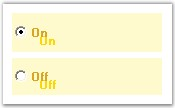{border="0"}

[]{style="COLOR: #15428b"} 

Figure 632: RadioButtonAdv with Shadow Text

[]{style="COLOR: #15428b"} 

A sample which demonstrates the TextShadow property of RadioButtonAdv is available in the below sample installation path.

 

..My Documents\\Syncfusion\\EssentialStudio\\Version Number\\Windows\\Tools.Windows\\Samples\\2.0\\Editors Package\\OptionControls

[]{style="COLOR: #15428b"} 

See Also

[]{style="COLOR: #15428b"} 

[Alignment Settings]{.UGHyperlink}[]{.UGHyperlink}

###### []{#p796}3.3.11.2.3.3        Appearance and Behavior Settings {#appearance-and-behavior-settings style="tab-stops: 0pt"}

[]{style="COLOR: #15428b"} 

This section discusses the appearance and behavior settings of the RadioButtonAdv control.

[]{style="COLOR: #15428b"} 

Appearance Settings

 

DrawFocusRectangle

[]{style="COLOR: #4a5c8c; FONT-SIZE: 8pt"} 

The focus rectangle can be hidden or made visible using the below given property.

[]{style="COLOR: #15428b"} 

::: {align="center"}
  ------------------------- ------------------------------------------------------------------------------------------------------------
  RadioButtonAdv Property   Description
  DrawFocusRectangle        Determines if the focus rectangle is visible when it gets the focus. The default value is set to \'True\'.
  ------------------------- ------------------------------------------------------------------------------------------------------------
:::

[]{style="COLOR: #15428b"} 

+-----------------------------------------------------------------------------------------------------------------------------------------------------------------+
| **[\[C#\]]{style="FONT-FAMILY: 'Courier New'; COLOR: black"}**                                                                                                  |
|                                                                                                                                                                 |
| []{style="FONT-FAMILY: 'Courier New'; COLOR: black"}                                                                                                            |
|                                                                                                                                                                 |
| [this]{style="FONT-FAMILY: 'Courier New'; COLOR: blue"}[.radioButtonAdv1.DrawFocusRectangle = [true]{style="COLOR: blue"};]{style="FONT-FAMILY: 'Courier New'"} |
+-----------------------------------------------------------------------------------------------------------------------------------------------------------------+

[]{style="COLOR: #15428b"} 

+--------------------------------------------------------------------------------------------------------------------------------------------------------------+
| **[\[VB.NET\]]{style="FONT-FAMILY: 'Courier New'; COLOR: black"}**                                                                                           |
|                                                                                                                                                              |
| []{style="FONT-FAMILY: 'Courier New'; COLOR: black"}                                                                                                         |
|                                                                                                                                                              |
| [Me]{style="FONT-FAMILY: 'Courier New'; COLOR: blue"}[.radioButtonAdv1.DrawFocusRectangle = [True]{style="COLOR: blue"}]{style="FONT-FAMILY: 'Courier New'"} |
+--------------------------------------------------------------------------------------------------------------------------------------------------------------+

[]{style="COLOR: #15428b"} 

Behavior Settings

[]{style="COLOR: #4a5c8c; FONT-SIZE: 8pt"} 

AutoHeight

[]{style="COLOR: #4a5c8c; FONT-SIZE: 8pt"} 

The height of the RadioButtonAdv can be automatically set using the property given below.

 

::: {align="center"}
  ------------------------- ------------------------------------------------------------------------
  RadioButtonAdv Property   Description
  AutoHeight                Determines if the RadioButton will automatically calculate its height.
  ------------------------- ------------------------------------------------------------------------
:::

[]{style="COLOR: #15428b"} 

+---------------------------------------------------------------------------------------------------------------------------------------------------------+
| **[\[C#\]]{style="FONT-FAMILY: 'Courier New'; COLOR: black"}**                                                                                          |
|                                                                                                                                                         |
| []{style="FONT-FAMILY: 'Courier New'; COLOR: black"}                                                                                                    |
|                                                                                                                                                         |
| [this]{style="FONT-FAMILY: 'Courier New'; COLOR: blue"}[.radioButtonAdv1.AutoHeight = [true]{style="COLOR: blue"};]{style="FONT-FAMILY: 'Courier New'"} |
+---------------------------------------------------------------------------------------------------------------------------------------------------------+

[]{style="COLOR: #15428b"} 

+------------------------------------------------------------------------------------------------------------------------------------------------------+
| **[\[VB.NET\]]{style="FONT-FAMILY: 'Courier New'; COLOR: black"}**                                                                                   |
|                                                                                                                                                      |
| []{style="FONT-FAMILY: 'Courier New'; COLOR: black"}                                                                                                 |
|                                                                                                                                                      |
| [Me]{style="FONT-FAMILY: 'Courier New'; COLOR: blue"}[.radioButtonAdv1.AutoHeight = [True]{style="COLOR: blue"}]{style="FONT-FAMILY: 'Courier New'"} |
+------------------------------------------------------------------------------------------------------------------------------------------------------+

[]{style="COLOR: #15428b"} 

RaiseEventOnClick

[]{style="COLOR: #4a5c8c; FONT-SIZE: 8pt"} 

The below given property can be used to fire the **OnClick** event of the RadioButtonAdv.

[]{style="COLOR: #15428b"} 

::: {align="center"}
  ------------------------- --------------------------------------------------------------------------------------------
  RadioButtonAdv Property   Description
  RaiseEventOnClick         Specifies whether the OnClick event should be fired. The default value is set to \'True\'.
  ------------------------- --------------------------------------------------------------------------------------------
:::

[]{style="COLOR: #15428b"} 

+----------------------------------------------------------------------------------------------------------------------------------------------------------------+
| **[\[C#\]]{style="FONT-FAMILY: 'Courier New'; COLOR: black"}**                                                                                                 |
|                                                                                                                                                                |
| []{style="FONT-FAMILY: 'Courier New'; COLOR: black"}                                                                                                           |
|                                                                                                                                                                |
| [this]{style="FONT-FAMILY: 'Courier New'; COLOR: blue"}[.radioButtonAdv1.RaiseEventOnClick = [true]{style="COLOR: blue"};]{style="FONT-FAMILY: 'Courier New'"} |
+----------------------------------------------------------------------------------------------------------------------------------------------------------------+

[]{style="COLOR: #15428b"} 

+-------------------------------------------------------------------------------------------------------------------------------------------------------------+
| **[\[VB.NET\]]{style="FONT-FAMILY: 'Courier New'; COLOR: black"}**                                                                                          |
|                                                                                                                                                             |
| []{style="FONT-FAMILY: 'Courier New'; COLOR: black"}                                                                                                        |
|                                                                                                                                                             |
| [Me]{style="FONT-FAMILY: 'Courier New'; COLOR: blue"}[.radioButtonAdv1.RaiseEventOnClick = [True]{style="COLOR: blue"}]{style="FONT-FAMILY: 'Courier New'"} |
+-------------------------------------------------------------------------------------------------------------------------------------------------------------+

###### []{#p797}3.3.11.2.3.4        Alignment Settings {#alignment-settings style="tab-stops: 0pt"}

[]{style="COLOR: #15428b"} 

This section discusses the alignment settings of the RadioButtonAdv.

[]{style="COLOR: #15428b"} 

Text Alignment

[]{style="COLOR: #15428b"} 

Text in the[ ]{style="FONT-FAMILY: 'Verdana','sans-serif'; FONT-SIZE: 8pt"}RadioButtonAdv[ can be ]{style="FONT-FAMILY: 'Verdana','sans-serif'; FONT-SIZE: 8pt"}aligned to the desired location as given below.

[]{style="COLOR: #15428b"} 

::: {align="center"}
+-----------------------------------+------------------------------------------------------------------------------------------+
| RadioButtonAdv Properties         | Description                                                                              |
+-----------------------------------+------------------------------------------------------------------------------------------+
| TextContentAlignment              | Indicates the alignment of the text. The default value is set to \'MiddleLeft\'.         |
|                                   |                                                                                          |
|                                   |                                                                                          |
|                                   |                                                                                          |
|                                   | The options included are as follows.                                                     |
|                                   |                                                                                          |
|                                   |                                                                                          |
|                                   |                                                                                          |
|                                   | *TopLeft,*                                                                               |
|                                   |                                                                                          |
|                                   | *TopCenter,*                                                                             |
|                                   |                                                                                          |
|                                   | *TopRight,*                                                                              |
|                                   |                                                                                          |
|                                   | *MiddleLeft,*                                                                            |
|                                   |                                                                                          |
|                                   | *MiddleCenter,*                                                                          |
|                                   |                                                                                          |
|                                   | *MiddleRight,*                                                                           |
|                                   |                                                                                          |
|                                   | *BottomLeft,*                                                                            |
|                                   |                                                                                          |
|                                   | *BottomCenter and*                                                                       |
|                                   |                                                                                          |
|                                   | *BottomRight.*                                                                           |
|                                   |                                                                                          |
|                                   |                                                                                          |
|                                   |                                                                                          |
|                                   | WrapText property must be set to \'False\'. Refer [Text Settings.]{style="COLOR: black"} |
+-----------------------------------+------------------------------------------------------------------------------------------+
:::

[]{style="COLOR: #15428b"} 

+--------------------------------------------------------------------------------------------------------------------------------------------------------------------------------------------------------------+
| **[\[C#\]]{style="FONT-FAMILY: 'Courier New'; COLOR: black"}**                                                                                                                                               |
|                                                                                                                                                                                                              |
| []{style="FONT-FAMILY: 'Courier New'; COLOR: black"}                                                                                                                                                         |
|                                                                                                                                                                                                              |
| [this]{style="FONT-FAMILY: 'Courier New'; COLOR: blue"}[.radioButtonAdv1.TextContentAlignment = System.Drawing.[ContentAlignment]{style="COLOR: #2b91af"}.MiddleCenter;]{style="FONT-FAMILY: 'Courier New'"} |
+--------------------------------------------------------------------------------------------------------------------------------------------------------------------------------------------------------------+

[]{style="COLOR: #15428b"} 

+---------------------------------------------------------------------------------------------------------------------------------------------------------------------------------+
| **[\[VB.NET\]]{style="FONT-FAMILY: 'Courier New'; COLOR: black"}**                                                                                                              |
|                                                                                                                                                                                 |
| []{style="FONT-FAMILY: 'Courier New'; COLOR: black"}                                                                                                                            |
|                                                                                                                                                                                 |
| [Me]{style="FONT-FAMILY: 'Courier New'; COLOR: blue"}[.radioButtonAdv1.TextContentAlignment = System.Drawing.ContentAlignment.MiddleCenter]{style="FONT-FAMILY: 'Courier New'"} |
+---------------------------------------------------------------------------------------------------------------------------------------------------------------------------------+

[]{style="COLOR: #15428b"} 

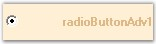{border="0"}

[]{style="COLOR: #15428b"} 

Figure 633: Text aligned to \"MiddleRight\"

[]{style="COLOR: #15428b"} 

RadioButton Alignment

[]{style="COLOR: #4a5c8c; FONT-SIZE: 8pt"} 

The[ ]{style="FONT-FAMILY: 'Verdana','sans-serif'; FONT-SIZE: 8pt"}RadioButton[ itself can be ]{style="FONT-FAMILY: 'Verdana','sans-serif'; FONT-SIZE: 8pt"}aligned to any desired location that can be chosen from the options given in the following property.

[]{style="COLOR: #4a5c8c; FONT-SIZE: 8pt"} 

::: {align="center"}
+-----------------------------------+-----------------------------------------------------------------------------------------+
| RadioButtonAdv Properties         | Description                                                                             |
+-----------------------------------+-----------------------------------------------------------------------------------------+
| CheckAlign                        | Indicates the alignment of the RadioButton. The default value is set to \'MiddleLeft\'. |
|                                   |                                                                                         |
|                                   |                                                                                         |
|                                   |                                                                                         |
|                                   | The options included are as follows.                                                    |
|                                   |                                                                                         |
|                                   |                                                                                         |
|                                   |                                                                                         |
|                                   | *TopLeft,*                                                                              |
|                                   |                                                                                         |
|                                   | *TopCenter,*                                                                            |
|                                   |                                                                                         |
|                                   | *TopRight,*                                                                             |
|                                   |                                                                                         |
|                                   | *MiddleLeft,*                                                                           |
|                                   |                                                                                         |
|                                   | *MiddleCenter,*                                                                         |
|                                   |                                                                                         |
|                                   | *MiddleRight,*                                                                          |
|                                   |                                                                                         |
|                                   | *BottomLeft,*                                                                           |
|                                   |                                                                                         |
|                                   | *BottomCenter and*                                                                      |
|                                   |                                                                                         |
|                                   | *BottomRight.*                                                                          |
+-----------------------------------+-----------------------------------------------------------------------------------------+
:::

[]{style="COLOR: #15428b"} 

+---------------------------------------------------------------------------------------------------------------------------------------------------------------------------------------------------+
| **[\[C#\]]{style="FONT-FAMILY: 'Courier New'; COLOR: black"}**                                                                                                                                    |
|                                                                                                                                                                                                   |
| []{style="FONT-FAMILY: 'Courier New'; COLOR: black"}                                                                                                                                              |
|                                                                                                                                                                                                   |
| [this]{style="FONT-FAMILY: 'Courier New'; COLOR: blue"}[.radioButtonAdv1.CheckAlign = System.Drawing.[ContentAlignment]{style="COLOR: #2b91af"}.MiddleRight;]{style="FONT-FAMILY: 'Courier New'"} |
+---------------------------------------------------------------------------------------------------------------------------------------------------------------------------------------------------+

[]{style="COLOR: #15428b"} 

+----------------------------------------------------------------------------------------------------------------------------------------------------------------------+
| **[\[VB.NET\]]{style="FONT-FAMILY: 'Courier New'; COLOR: black"}**                                                                                                   |
|                                                                                                                                                                      |
| []{style="FONT-FAMILY: 'Courier New'; COLOR: black"}                                                                                                                 |
|                                                                                                                                                                      |
| [Me]{style="FONT-FAMILY: 'Courier New'; COLOR: blue"}[.radioButtonAdv1.CheckAlign = System.Drawing.ContentAlignment.MiddleRight]{style="FONT-FAMILY: 'Courier New'"} |
+----------------------------------------------------------------------------------------------------------------------------------------------------------------------+

[]{style="COLOR: #15428b"} 

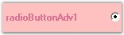{border="0"}

[]{style="COLOR: #15428b"} 

Figure 634: RadioButton aligned to \"MiddleRight\"

[]{style="COLOR: #15428b"} 

A Sample which demonstrates the Text and RadioButton Alignment features of CheckBoxAdv is available in the below sample installation path.

 

..My Documents\\Syncfusion\\EssentialStudio\\***Version Number***\\Windows\\Tools.Windows\\Samples\\2.0\\Editors Package\\OptionControls

**[]{style="COLOR: #15428b"}** 

See Also

[]{style="COLOR: #15428b"} 

[Text Settings]{.UGHyperlink}[, ]{.UGHyperlink}[[RadioButtonAdv Settings]{.UGHyperlink}]()[]{.UGHyperlink}

###### []{#p798}3.3.11.2.3.5        Background Settings {#background-settings style="tab-stops: 0pt"}

[]{style="COLOR: #4a5c8c; FONT-SIZE: 8pt"} 

The background settings of the RadioButtonAdv are discussed below.

 

The RadioButtonAdv can be provided with a gradient background using the properties given below.

[]{style="COLOR: #15428b"} 

::: {align="center"}
+-----------------------------------+-------------------------------------------------------------------------------+
| RadioButtonAdv Properties         | Description                                                                   |
+-----------------------------------+-------------------------------------------------------------------------------+
| BackgroundStyle                   | Sets the background style of the RadioButtonAdv.                              |
|                                   |                                                                               |
|                                   |                                                                               |
|                                   |                                                                               |
|                                   | The options included are as follows.                                          |
|                                   |                                                                               |
|                                   |                                                                               |
|                                   |                                                                               |
|                                   | *HorizontalGradient,*                                                         |
|                                   |                                                                               |
|                                   | *VerticalGradient and*                                                        |
|                                   |                                                                               |
|                                   | *Default.*                                                                    |
+-----------------------------------+-------------------------------------------------------------------------------+
| GradientStart                     | Sets the start color of the gradient of the background of the RadioButtonAdv. |
+-----------------------------------+-------------------------------------------------------------------------------+
| GradientEnd                       | Sets the end color of the gradient of the background of the RadioButtonAdv.   |
+-----------------------------------+-------------------------------------------------------------------------------+
:::

[]{style="COLOR: #15428b"} 

+-----------------------------------------------------------------------------------------------------------------------------------------------------------------------------------------------------------------------------------+
| **[\[C#\]]{style="FONT-FAMILY: 'Courier New'; COLOR: black"}**                                                                                                                                                                    |
|                                                                                                                                                                                                                                   |
| []{style="FONT-FAMILY: 'Courier New'; COLOR: black"}                                                                                                                                                                              |
|                                                                                                                                                                                                                                   |
| [this]{style="FONT-FAMILY: 'Courier New'; COLOR: blue"}[.radioButtonAdv1.BackgroundStyle = Syncfusion.Windows.Forms.Tools.[CheckBoxAdvBackStyle]{style="COLOR: #2b91af"}.HorizontalGradient;]{style="FONT-FAMILY: 'Courier New'"} |
|                                                                                                                                                                                                                                   |
| [this]{style="FONT-FAMILY: 'Courier New'; COLOR: blue"}[.radioButtonAdv1.GradientStart = System.Drawing.[Color]{style="COLOR: #2b91af"}.LightBlue;]{style="FONT-FAMILY: 'Courier New'"}                                           |
|                                                                                                                                                                                                                                   |
| [this]{style="FONT-FAMILY: 'Courier New'; COLOR: blue"}[.radioButtonAdv1.GradientEnd = System.Drawing.[Color]{style="COLOR: #2b91af"}.DarkSalmon;]{style="FONT-FAMILY: 'Courier New'"}                                            |
+-----------------------------------------------------------------------------------------------------------------------------------------------------------------------------------------------------------------------------------+

[]{style="COLOR: #15428b"} 

+------------------------------------------------------------------------------------------------------------------------------------------------------------------------------------------------------+
| **[\[VB.NET\]]{style="FONT-FAMILY: 'Courier New'; COLOR: black"}**                                                                                                                                   |
|                                                                                                                                                                                                      |
| []{style="FONT-FAMILY: 'Courier New'; COLOR: black"}                                                                                                                                                 |
|                                                                                                                                                                                                      |
| [Me]{style="FONT-FAMILY: 'Courier New'; COLOR: blue"}[.radioButtonAdv1.BackgroundStyle = Syncfusion.Windows.Forms.Tools.CheckBoxAdvBackStyle.HorizontalGradient]{style="FONT-FAMILY: 'Courier New'"} |
|                                                                                                                                                                                                      |
| [Me]{style="FONT-FAMILY: 'Courier New'; COLOR: blue"}[.radioButtonAdv1.GradientStart = System.Drawing.Color.LightBlue]{style="FONT-FAMILY: 'Courier New'"}                                           |
|                                                                                                                                                                                                      |
| [Me]{style="FONT-FAMILY: 'Courier New'; COLOR: blue"}[.radioButtonAdv1.GradientEnd = System.Drawing.Color.DarkSalmon]{style="FONT-FAMILY: 'Courier New'"}                                            |
+------------------------------------------------------------------------------------------------------------------------------------------------------------------------------------------------------+

[]{style="COLOR: #15428b"} 

{border="0"}

[]{style="COLOR: #15428b"} 

Figure 635: Gradient Background Displayed

[]{style="COLOR: #15428b"} 

::: {style="BORDER-BOTTOM: windowtext 1pt solid; BORDER-LEFT: medium none; PADDING-BOTTOM: 1pt; MARGIN-TOP: 9pt; PADDING-LEFT: 0pt; PADDING-RIGHT: 0pt; MARGIN-BOTTOM: 9pt; BORDER-TOP: windowtext 1pt solid; BORDER-RIGHT: medium none; PADDING-TOP: 1pt"}
{border="0"} Note: Gradient background cannot be applied to the RadioButtonAdv when its BackgroundStyle property is set to \'Default\'. Also, the background image cannot be displayed with gradient settings.
:::

[]{style="COLOR: #15428b"} 

A sample which demonstrates the Background Settings of RadioButtonAdv is available in the below sample installation path.

 

..My Documents\\Syncfusion\\EssentialStudio***\\Version Number***\\Windows\\Tools.Windows\\Samples\\2.0\\Editors Package\\OptionControls

###### []{#_Border_Settings_2}3.3.11.2.3.6        Border Settings {#border-settings style="tab-stops: 0pt"}

[]{#p799} 

** **Color and Styles can be applied to the border of the RadioButtonAdv as discussed below.

[]{style="COLOR: #15428b"} 

::: {align="center"}
+-----------------------------------+-----------------------------------------------------------------------------------------+
| RadioButtonAdv Properties         | Description                                                                             |
+-----------------------------------+-----------------------------------------------------------------------------------------+
| Border3DStyle                     | Indicates the style of the 3D border. The options included are as follows.              |
|                                   |                                                                                         |
|                                   |                                                                                         |
|                                   |                                                                                         |
|                                   | *RaisedOuter,*                                                                          |
|                                   |                                                                                         |
|                                   | *SunkenOuter,*                                                                          |
|                                   |                                                                                         |
|                                   | *RaisedInner,*                                                                          |
|                                   |                                                                                         |
|                                   | *SunkenInner,*                                                                          |
|                                   |                                                                                         |
|                                   | *Raised,*                                                                               |
|                                   |                                                                                         |
|                                   | *Etched,*                                                                               |
|                                   |                                                                                         |
|                                   | *Bump,*                                                                                 |
|                                   |                                                                                         |
|                                   | *Sunken,*                                                                               |
|                                   |                                                                                         |
|                                   | *Adjust and*                                                                            |
|                                   |                                                                                         |
|                                   | *Flat.*                                                                                 |
|                                   |                                                                                         |
|                                   |                                                                                         |
|                                   |                                                                                         |
|                                   | The default value is set to \'Sunken\'.                                                 |
+-----------------------------------+-----------------------------------------------------------------------------------------+
| BorderColor                       | Specifies the color of the 2D border.                                                   |
+-----------------------------------+-----------------------------------------------------------------------------------------+
| BorderSingle                      | Indicates the 2D border style. The options included are as follows.                     |
|                                   |                                                                                         |
|                                   |                                                                                         |
|                                   |                                                                                         |
|                                   | *Dotted,*                                                                               |
|                                   |                                                                                         |
|                                   | *Dashed,*                                                                               |
|                                   |                                                                                         |
|                                   | *Solid,*                                                                                |
|                                   |                                                                                         |
|                                   | *Inset,*                                                                                |
|                                   |                                                                                         |
|                                   | *Outset and*                                                                            |
|                                   |                                                                                         |
|                                   | *None.*                                                                                 |
|                                   |                                                                                         |
|                                   |                                                                                         |
|                                   |                                                                                         |
|                                   | The BorderStyle property should be set to \'FixedSingle\'.                              |
+-----------------------------------+-----------------------------------------------------------------------------------------+
| BorderStyle                       | Indicates whether the panel should have a border. The options included are given below. |
|                                   |                                                                                         |
|                                   |                                                                                         |
|                                   |                                                                                         |
|                                   | *FixedSingle,*                                                                          |
|                                   |                                                                                         |
|                                   | *Fixed3D and*                                                                           |
|                                   |                                                                                         |
|                                   | *None.*                                                                                 |
+-----------------------------------+-----------------------------------------------------------------------------------------+
| HotBorderColor                    | Specifies the color of the FixedSingle border when MouseOver.                           |
+-----------------------------------+-----------------------------------------------------------------------------------------+
:::

**[]{style="COLOR: #15428b"}** 

+---------------------------------------------------------------------------------------------------------------------------------------------------------------------------------------------------------+
| **[\[C#\]]{style="FONT-FAMILY: 'Courier New'; COLOR: black"}**                                                                                                                                          |
|                                                                                                                                                                                                         |
| []{style="FONT-FAMILY: 'Courier New'"}                                                                                                                                                                  |
|                                                                                                                                                                                                         |
| [this]{style="FONT-FAMILY: 'Courier New'; COLOR: blue"}[.radioButtonAdv1.BorderColor = System.Drawing.[Color]{style="COLOR: #2b91af"}.Fuchsia;]{style="FONT-FAMILY: 'Courier New'"}                     |
|                                                                                                                                                                                                         |
| [this]{style="FONT-FAMILY: 'Courier New'; COLOR: blue"}[.radioButtonAdv1.BorderStyle = System.Windows.Forms.[BorderStyle]{style="COLOR: #2b91af"}.FixedSingle;]{style="FONT-FAMILY: 'Courier New'"}     |
|                                                                                                                                                                                                         |
| [this]{style="FONT-FAMILY: 'Courier New'; COLOR: blue"}[.radioButtonAdv1.BorderSingle = System.Windows.Forms.[ButtonBorderStyle]{style="COLOR: #2b91af"}.Dotted;]{style="FONT-FAMILY: 'Courier New'"}   |
|                                                                                                                                                                                                         |
| [this]{style="FONT-FAMILY: 'Courier New'; COLOR: blue"}[.radioButtonAdv1.Border3DStyle = System.Windows.Forms.[Border3DStyle]{style="COLOR: #2b91af"}.RaisedInner;]{style="FONT-FAMILY: 'Courier New'"} |
|                                                                                                                                                                                                         |
| []{style="FONT-FAMILY: 'Courier New'"}                                                                                                                                                                  |
|                                                                                                                                                                                                         |
| [// BorderStyle must be set to \'FixedSingle\'.]{style="FONT-FAMILY: 'Courier New'; COLOR: green"}                                                                                                      |
|                                                                                                                                                                                                         |
| [this]{style="FONT-FAMILY: 'Courier New'; COLOR: blue"}[.radioButtonAdv1.HotBorderColor = System.Drawing.[Color]{style="COLOR: #2b91af"}.DarkOrange; ]{style="FONT-FAMILY: 'Courier New'"}              |
+---------------------------------------------------------------------------------------------------------------------------------------------------------------------------------------------------------+

[]{style="COLOR: #15428b"} 

+----------------------------------------------------------------------------------------------------------------------------------------------------------------------------+
| **[\[VB.NET\]]{style="FONT-FAMILY: 'Courier New'; COLOR: black"}**                                                                                                         |
|                                                                                                                                                                            |
| **[]{style="FONT-FAMILY: 'Courier New'; COLOR: black"}**                                                                                                                   |
|                                                                                                                                                                            |
| [Me]{style="FONT-FAMILY: 'Courier New'; COLOR: blue"}[.radioButtonAdv1.BorderColor = System.Drawing.Color.Fuchsia]{style="FONT-FAMILY: 'Courier New'"}                     |
|                                                                                                                                                                            |
| [Me]{style="FONT-FAMILY: 'Courier New'; COLOR: blue"}[.radioButtonAdv1.BorderStyle = System.Windows.Forms.BorderStyle.FixedSingle]{style="FONT-FAMILY: 'Courier New'"}     |
|                                                                                                                                                                            |
| [Me]{style="FONT-FAMILY: 'Courier New'; COLOR: blue"}[.radioButtonAdv1.BorderSingle = System.Windows.Forms.ButtonBorderStyle.Dotted]{style="FONT-FAMILY: 'Courier New'"}   |
|                                                                                                                                                                            |
| [Me]{style="FONT-FAMILY: 'Courier New'; COLOR: blue"}[.radioButtonAdv1.Border3DStyle = System.Windows.Forms.Border3DStyle.RaisedInner]{style="FONT-FAMILY: 'Courier New'"} |
|                                                                                                                                                                            |
| []{style="FONT-FAMILY: 'Courier New'"}                                                                                                                                     |
|                                                                                                                                                                            |
| [\' BorderStyle must be set to \'FixedSingle\'.]{style="FONT-FAMILY: 'Courier New'; COLOR: green"}                                                                         |
|                                                                                                                                                                            |
| [Me]{style="FONT-FAMILY: 'Courier New'; COLOR: blue"}[.radioButtonAdv1.HotBorderColor = System.Drawing.Color.DarkOrange]{style="FONT-FAMILY: 'Courier New'"}               |
+----------------------------------------------------------------------------------------------------------------------------------------------------------------------------+

[]{style="COLOR: #15428b"} 

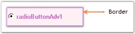{border="0"}

[]{style="COLOR: #15428b"} 

Figure 636: Border Set for RadioButtonAdv

[]{style="COLOR: #15428b"} 

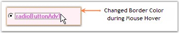{border="0"}

[]{style="COLOR: #15428b"} 

Figure 637: \"HotBorderColor\" property Set

[]{style="COLOR: #15428b"} 

A sample which demonstrates the Border Settings of RadioButtonAdv is available in the below sample installation path.

 

..My Documents\\Syncfusion\\EssentialStudio\\***Version Number***\\Windows\\Tools.Windows\\Samples\\2.0\\Editors Package\\OptionControls

###### []{#_Image_Settings_2}3.3.11.2.3.7        Image Settings[]{#p800} {#image-settings style="tab-stops: 0pt"}

[]{style="COLOR: #15428b"} 

The image settings of the RadioButtonAdv control have been discussed in this section.

 

Images can be set to the RadioButtonAdv when it is in the Checked, Unchecked or Indeterminate state. The RadioButtonAdv allows us to set the following properties in order to display images.

[]{style="COLOR: #15428b"} 

::: {align="center"}
+-----------------------------------+---------------------------------------------------------------------------------------+
| RadioButtonAdv Properties         | Description                                                                           |
+-----------------------------------+---------------------------------------------------------------------------------------+
| ImageCheckBox                     | Indicates whether the RadioButton will be drawn using the images provided.            |
+-----------------------------------+---------------------------------------------------------------------------------------+
| ImageCheckBoxSize                 | Gets / sets the size of the ImageCheckBox.                                            |
|                                   |                                                                                       |
|                                   |                                                                                       |
|                                   |                                                                                       |
|                                   | ImageCheckbox property must be set to \'True\'.                                       |
+-----------------------------------+---------------------------------------------------------------------------------------+
| CheckedImage                      | Gets / sets the image used to draw the RadioButton when checked and mouse not over.   |
+-----------------------------------+---------------------------------------------------------------------------------------+
| UncheckedImage                    | Gets / sets the image used to draw the RadioButton when unchecked and mouse not over. |
+-----------------------------------+---------------------------------------------------------------------------------------+
| DisabledImage                     | Gets / sets the image used to draw the RadioButton when disabled.                     |
+-----------------------------------+---------------------------------------------------------------------------------------+
| StretchImage                      | Indicates whether the state images of the RadioButton are stretched.                  |
+-----------------------------------+---------------------------------------------------------------------------------------+
:::

[]{style="COLOR: #15428b"} 

::: {style="BORDER-BOTTOM: windowtext 1pt solid; BORDER-LEFT: medium none; PADDING-BOTTOM: 1pt; MARGIN-TOP: 9pt; PADDING-LEFT: 0pt; PADDING-RIGHT: 0pt; MARGIN-BOTTOM: 9pt; BORDER-TOP: windowtext 1pt solid; BORDER-RIGHT: medium none; PADDING-TOP: 1pt"}
{border="0"} Note:[ ]{style="COLOR: black; FONT-SIZE: 8pt"}Before setting the images, make sure the ImageCheckBox property is set to \'True\'.
:::

[]{style="COLOR: #15428b"} 

+--------------------------------------------------------------------------------------------------------------------------------------------------------------------------------------------------------------------------------------------------------------------+
| **[\[C#\]]{style="FONT-FAMILY: 'Courier New'; COLOR: black"}**                                                                                                                                                                                                     |
|                                                                                                                                                                                                                                                                    |
| []{style="FONT-FAMILY: 'Courier New'; COLOR: black"}                                                                                                                                                                                                               |
|                                                                                                                                                                                                                                                                    |
| [this]{style="FONT-FAMILY: 'Courier New'; COLOR: blue"}[.radioButtonAdv1.ImageCheckBox = [true]{style="COLOR: blue"};]{style="FONT-FAMILY: 'Courier New'"}                                                                                                         |
|                                                                                                                                                                                                                                                                    |
| [this]{style="FONT-FAMILY: 'Courier New'; COLOR: blue"}[.radioButtonAdv1.ImageCheckBoxSize = [new]{style="COLOR: blue"} System.Drawing.[Size]{style="COLOR: #2b91af"}(15, 15);]{style="FONT-FAMILY: 'Courier New'"}                                                |
|                                                                                                                                                                                                                                                                    |
| [this]{style="FONT-FAMILY: 'Courier New'; COLOR: blue"}[.radioButtonAdv1.CheckedImage = ((System.Drawing.[Image]{style="COLOR: #2b91af"})(resources.GetObject([\"checkBoxAdv1.CheckedImage\"]{style="COLOR: #a31515"})));]{style="FONT-FAMILY: 'Courier New'"}     |
|                                                                                                                                                                                                                                                                    |
| [this]{style="FONT-FAMILY: 'Courier New'; COLOR: blue"}[.radioButtonAdv1.UncheckedImage = ((System.Drawing.[Image]{style="COLOR: #2b91af"})(resources.GetObject([\"checkBoxAdv1.UncheckedImage\"]{style="COLOR: #a31515"})));]{style="FONT-FAMILY: 'Courier New'"} |
|                                                                                                                                                                                                                                                                    |
| [this]{style="FONT-FAMILY: 'Courier New'; COLOR: blue"}[.radioButtonAdv1.DisabledImage = ((System.Drawing.[Image]{style="COLOR: #2b91af"})(resources.GetObject([\"checkBoxAdv1.DisabledImage\"]{style="COLOR: #a31515"})));]{style="FONT-FAMILY: 'Courier New'"}   |
|                                                                                                                                                                                                                                                                    |
| [this]{style="FONT-FAMILY: 'Courier New'; COLOR: blue"}[.radioButtonAdv1.StretchImage = [false]{style="COLOR: blue"};]{style="FONT-FAMILY: 'Courier New'"}                                                                                                         |
+--------------------------------------------------------------------------------------------------------------------------------------------------------------------------------------------------------------------------------------------------------------------+

[]{style="COLOR: #15428b"} 

+-------------------------------------------------------------------------------------------------------------------------------------------------------------------------------------------------------------------------------------------------------------------+
| **[\[VB.NET\]]{style="FONT-FAMILY: 'Courier New'; COLOR: black"}**                                                                                                                                                                                                |
|                                                                                                                                                                                                                                                                   |
| []{style="FONT-FAMILY: 'Courier New'; COLOR: black"}                                                                                                                                                                                                              |
|                                                                                                                                                                                                                                                                   |
| [Me]{style="FONT-FAMILY: 'Courier New'; COLOR: blue"}[.radioButtonAdv1.ImageCheckBox = [True]{style="COLOR: blue"}]{style="FONT-FAMILY: 'Courier New'"}                                                                                                           |
|                                                                                                                                                                                                                                                                   |
| [Me]{style="FONT-FAMILY: 'Courier New'; COLOR: blue"}[.radioButtonAdv1.ImageCheckBoxSize = [New]{style="COLOR: blue"} System.Drawing.Size(15, 15)]{style="FONT-FAMILY: 'Courier New'"}                                                                            |
|                                                                                                                                                                                                                                                                   |
| [Me]{style="FONT-FAMILY: 'Courier New'; COLOR: blue"}[.radioButtonAdv1.CheckedImage = ([CType]{style="COLOR: blue"}(Resources.GetObject([\"checkBoxAdv1.CheckedImage\"]{style="COLOR: #a31515"}), System.Drawing.Image))]{style="FONT-FAMILY: 'Courier New'"}     |
|                                                                                                                                                                                                                                                                   |
| [Me]{style="FONT-FAMILY: 'Courier New'; COLOR: blue"}[.radioButtonAdv1.UncheckedImage = ([CType]{style="COLOR: blue"}(Resources.GetObject([\"checkBoxAdv1.UncheckedImage\"]{style="COLOR: #a31515"}), System.Drawing.Image))]{style="FONT-FAMILY: 'Courier New'"} |
|                                                                                                                                                                                                                                                                   |
| [Me]{style="FONT-FAMILY: 'Courier New'; COLOR: blue"}[.radioButtonAdv1.DisabledImage = ([CType]{style="COLOR: blue"}(Resources.GetObject([\"checkBoxAdv1.DisabledImage\"]{style="COLOR: #a31515"}), System.Drawing.Image))]{style="FONT-FAMILY: 'Courier New'"}   |
|                                                                                                                                                                                                                                                                   |
| [Me]{style="FONT-FAMILY: 'Courier New'; COLOR: blue"}[.radioButtonAdv1.StretchImage = [False]{style="COLOR: blue"}]{style="FONT-FAMILY: 'Courier New'"}                                                                                                           |
+-------------------------------------------------------------------------------------------------------------------------------------------------------------------------------------------------------------------------------------------------------------------+

[]{style="COLOR: #15428b"} 

{border="0"}

[]{style="COLOR: #15428b"} 

Figure 638: Image displayed for Checked State

of RadioButtonAdv

[]{style="COLOR: #4a5c8c; FONT-SIZE: 8pt"} 

Images displayed during Mouse Hover

[]{style="COLOR: #15428b"} 

Images can also be set when the mouse is hovered over the RadioButtonAdv control.

[]{style="COLOR: #15428b"} 

::: {align="center"}
  --------------------------- -----------------------------------------------------------------------------------
  RadioButtonAdv Properties   Description
  MouseOverCheckedImage       Gets / sets the image used to draw the RadioButton when checked and mouse over.
  MouseOverUncheckedImage     Gets / sets the image used to draw the RadioButton when unchecked and mouse over.
  --------------------------- -----------------------------------------------------------------------------------
:::

[]{style="COLOR: #15428b"} 

+--------------------------------------------------------------------------------------------------------------------------------------------------------------------------------------------------------------------------------------------------------------------------------------+
| **[\[C#\]]{style="FONT-FAMILY: 'Courier New'; COLOR: black"}**                                                                                                                                                                                                                       |
|                                                                                                                                                                                                                                                                                      |
| []{style="FONT-FAMILY: 'Courier New'; COLOR: black"}                                                                                                                                                                                                                                 |
|                                                                                                                                                                                                                                                                                      |
| [this]{style="FONT-FAMILY: 'Courier New'; COLOR: blue"}[.radioButtonAdv1.MouseOverCheckedImage = ((System.Drawing.[Image]{style="COLOR: #2b91af"})(resources.GetObject([\"checkBoxAdv1.MouseOverCheckedImage\"]{style="COLOR: #a31515"})));]{style="FONT-FAMILY: 'Courier New'"}     |
|                                                                                                                                                                                                                                                                                      |
| [this]{style="FONT-FAMILY: 'Courier New'; COLOR: blue"}[.radioButtonAdv1.MouseOverUncheckedImage = ((System.Drawing.[Image]{style="COLOR: #2b91af"})(resources.GetObject([\"checkBoxAdv1.MouseOverUncheckedImage\"]{style="COLOR: #a31515"})));]{style="FONT-FAMILY: 'Courier New'"} |
+--------------------------------------------------------------------------------------------------------------------------------------------------------------------------------------------------------------------------------------------------------------------------------------+

[]{style="COLOR: #15428b"} 

+----------------------------------------------------------------------------------------------------------------------------------------------------------------------------------------------------------------------------------------------------------------------------------+
| **[\[VB.NET\]]{style="FONT-FAMILY: 'Courier New'; COLOR: black"}**                                                                                                                                                                                                               |
|                                                                                                                                                                                                                                                                                  |
| []{style="FONT-FAMILY: 'Courier New'; COLOR: black"}                                                                                                                                                                                                                             |
|                                                                                                                                                                                                                                                                                  |
| [Me]{style="FONT-FAMILY: 'Courier New'; COLOR: blue"}[.checkBoxAdv1.MouseOverCheckedImage = ([CType]{style="COLOR: blue"}(Resources.GetObject([\"checkBoxAdv1.MouseOverCheckedImage\"]{style="COLOR: #a31515"}), System.Drawing.Image))]{style="FONT-FAMILY: 'Courier New'"}     |
|                                                                                                                                                                                                                                                                                  |
| [Me]{style="FONT-FAMILY: 'Courier New'; COLOR: blue"}[.checkBoxAdv1.MouseOverUncheckedImage = ([CType]{style="COLOR: blue"}(Resources.GetObject([\"checkBoxAdv1.MouseOverUncheckedImage\"]{style="COLOR: #a31515"}), System.Drawing.Image))]{style="FONT-FAMILY: 'Courier New'"} |
+----------------------------------------------------------------------------------------------------------------------------------------------------------------------------------------------------------------------------------------------------------------------------------+

[]{style="COLOR: #15428b"} 

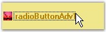{border="0"}

[]{style="COLOR: #15428b"} 

Figure 639: Image displayed for Unchecked State

of RadioButtonAdv during Mouse Hover

[]{style="COLOR: #15428b"} 

A Sample which demonstrates the ImageCheckBox property of RadioButtonAdv is available in the below sample installation path.

 

..My Documents\\Syncfusion\\EssentialStudio\\***Version Number***\\Windows\\Tools.Windows\\Samples\\2.0\\Editors Package\\OptionControls

###### []{#_Themes_and_Visual_1}3.3.11.2.3.8        Themes and Visual Styles of RadioButtonAdv[]{#p801} {#themes-and-visual-styles-of-radiobuttonadv style="tab-stops: 0pt"}

[]{style="COLOR: #4a5c8c; FONT-SIZE: 8pt"} 

This section discusses the themes and visual style settings that are supported by the RadioButtonAdv control.

[]{style="COLOR: #15428b"} 

Themes

[]{style="COLOR: #4a5c8c; FONT-SIZE: 8pt"} 

The RadioButtonAdv can be provided with a themed appearance using the below given property.

[]{style="COLOR: #4a5c8c; FONT-SIZE: 8pt"} 

::: {align="center"}
  ------------------------- ----------------------------------------------------------
  RadioButtonAdv Property   Description
  ThemesEnabled             Specifies whether themes are enabled for RadioButtonAdv.
  ------------------------- ----------------------------------------------------------
:::

[]{style="COLOR: #15428b"} 

+------------------------------------------------------------------------------------------------------------------------------------------------------------+
| **[\[C#\]]{style="FONT-FAMILY: 'Courier New'; COLOR: black"}**                                                                                             |
|                                                                                                                                                            |
| []{style="FONT-FAMILY: 'Courier New'; COLOR: black"}                                                                                                       |
|                                                                                                                                                            |
| [this]{style="FONT-FAMILY: 'Courier New'; COLOR: blue"}[.radioButtonAdv1.ThemesEnabled = [true]{style="COLOR: blue"};]{style="FONT-FAMILY: 'Courier New'"} |
+------------------------------------------------------------------------------------------------------------------------------------------------------------+

[]{style="COLOR: #15428b"} 

+---------------------------------------------------------------------------------------------------------------------------------------------------------+
| **[\[VB\]]{style="FONT-FAMILY: 'Courier New'; COLOR: black"}**                                                                                          |
|                                                                                                                                                         |
| []{style="FONT-FAMILY: 'Courier New'; COLOR: black"}                                                                                                    |
|                                                                                                                                                         |
| [Me]{style="FONT-FAMILY: 'Courier New'; COLOR: blue"}[.radioButtonAdv1.ThemesEnabled = [True]{style="COLOR: blue"}]{style="FONT-FAMILY: 'Courier New'"} |
+---------------------------------------------------------------------------------------------------------------------------------------------------------+

[]{style="COLOR: #15428b"} 

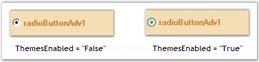{border="0"}

[]{style="COLOR: #15428b"} 

Figure 640: ThemesEnabled property Set

[]{style="COLOR: #15428b"} 

Visual Styles

[]{style="COLOR: #15428b"} 

The appearance of the CheckBoxAdv control can be customized using the various options provided by the following properties.

[]{style="COLOR: #15428b"} 

::: {align="center"}
+-----------------------------------+------------------------------------------------------------+
| RadioButtonAdv Properties         | Description                                                |
+-----------------------------------+------------------------------------------------------------+
| Style                             | Gets / sets an advanced appearance for the RadioButtonAdv. |
|                                   |                                                            |
|                                   |                                                            |
|                                   |                                                            |
|                                   | The options included are as follows.                       |
|                                   |                                                            |
|                                   |                                                            |
|                                   |                                                            |
|                                   | *Default and*                                              |
|                                   |                                                            |
|                                   | *Office2007.*                                              |
+-----------------------------------+------------------------------------------------------------+
| Office2007ColorScheme             | Gets / sets Office 2007 color scheme.                      |
|                                   |                                                            |
|                                   |                                                            |
|                                   |                                                            |
|                                   | The options included are as follows.                       |
|                                   |                                                            |
|                                   |                                                            |
|                                   |                                                            |
|                                   | *Managed,*                                                 |
|                                   |                                                            |
|                                   | *Blue,*                                                    |
|                                   |                                                            |
|                                   | *Silver and*                                               |
|                                   |                                                            |
|                                   | *Black.*                                                   |
|                                   |                                                            |
|                                   |                                                            |
|                                   |                                                            |
|                                   | The Style property should be set to \"Office2007\".        |
+-----------------------------------+------------------------------------------------------------+
:::

[]{style="COLOR: #15428b"} 

+----------------------------------------------------------------------------------------------------------------------------------------------------------------------------------------------------------------+
| **[\[C#\]]{style="FONT-FAMILY: 'Courier New'; COLOR: black"}**                                                                                                                                                 |
|                                                                                                                                                                                                                |
| []{style="FONT-FAMILY: 'Courier New'; COLOR: black"}                                                                                                                                                           |
|                                                                                                                                                                                                                |
| [this]{style="FONT-FAMILY: 'Courier New'; COLOR: blue"}[.radioButtonAdv1.Style = Syncfusion.Windows.Forms.Tools.[RadioButtonAdvStyle]{style="COLOR: #2b91af"}.Office2007;]{style="FONT-FAMILY: 'Courier New'"} |
|                                                                                                                                                                                                                |
| [this]{style="FONT-FAMILY: 'Courier New'; COLOR: blue"}[.radioButtonAdv1.Office2007ColorScheme = Syncfusion.Windows.Forms.[Office2007Theme]{style="COLOR: #2b91af"}.Blue;]{style="FONT-FAMILY: 'Courier New'"} |
+----------------------------------------------------------------------------------------------------------------------------------------------------------------------------------------------------------------+

[]{style="COLOR: #15428b"} 

+-----------------------------------------------------------------------------------------------------------------------------------------------------------------------------------+
| **[\[VB\]]{style="FONT-FAMILY: 'Courier New'; COLOR: black"}**                                                                                                                    |
|                                                                                                                                                                                   |
| []{style="FONT-FAMILY: 'Courier New'; COLOR: black"}                                                                                                                              |
|                                                                                                                                                                                   |
| [Me]{style="FONT-FAMILY: 'Courier New'; COLOR: blue"}[.radioButtonAdv1.Style = Syncfusion.Windows.Forms.Tools.RadioButtonAdvStyle.Office2007]{style="FONT-FAMILY: 'Courier New'"} |
|                                                                                                                                                                                   |
| [Me]{style="FONT-FAMILY: 'Courier New'; COLOR: blue"}[.radioButtonAdv1.Office2007ColorScheme = Syncfusion.Windows.Forms.Office2007Theme.Blue]{style="FONT-FAMILY: 'Courier New'"} |
+-----------------------------------------------------------------------------------------------------------------------------------------------------------------------------------+

[]{style="COLOR: #15428b"} 

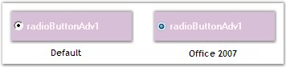{border="0"}

[]{style="COLOR: #15428b"} 

Figure 641: CheckBoxAdv Styles

[]{style="COLOR: #15428b"} 

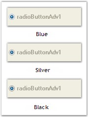{border="0"}

[]{style="COLOR: #15428b"} 

Figure 642: Office 2007 Color Schemes

[]{style="COLOR: #15428b"} 

When the **Office2007ColorScheme** property is set to \'Managed\', the RadioButton in the RadioButtonAdv can be displayed using custom colors supported by the control.

 

This can be done programmatically as follows.

[]{style="COLOR: #15428b"} 

+-------------------------------------------------------------------------------------------------------------------------------------------------------------------------------------------------------------------+
| **[\[C#\]]{style="FONT-FAMILY: 'Courier New'; COLOR: black"}**                                                                                                                                                    |
|                                                                                                                                                                                                                   |
| []{style="FONT-FAMILY: 'Courier New'; COLOR: black"}                                                                                                                                                              |
|                                                                                                                                                                                                                   |
| [this]{style="FONT-FAMILY: 'Courier New'; COLOR: blue"}[.radioButtonAdv1.Style = Syncfusion.Windows.Forms.Tools.[RadioButtonAdvStyle]{style="COLOR: #2b91af"}.Office2007;]{style="FONT-FAMILY: 'Courier New'"}    |
|                                                                                                                                                                                                                   |
| [this]{style="FONT-FAMILY: 'Courier New'; COLOR: blue"}[.radioButtonAdv1.Office2007ColorScheme = Syncfusion.Windows.Forms.[Office2007Theme]{style="COLOR: #2b91af"}.Managed;]{style="FONT-FAMILY: 'Courier New'"} |
|                                                                                                                                                                                                                   |
| [Office2007Colors]{style="FONT-FAMILY: 'Courier New'; COLOR: #2b91af"}[.ApplyManagedColors([this]{style="COLOR: blue"}, [Color]{style="COLOR: #2b91af"}.Red);]{style="FONT-FAMILY: 'Courier New'"}                |
+-------------------------------------------------------------------------------------------------------------------------------------------------------------------------------------------------------------------+

[]{style="COLOR: #15428b"} 

+--------------------------------------------------------------------------------------------------------------------------------------------------------------------------------------+
| **[\[VB\]]{style="FONT-FAMILY: 'Courier New'; COLOR: black"}**                                                                                                                       |
|                                                                                                                                                                                      |
| []{style="FONT-FAMILY: 'Courier New'; COLOR: black"}                                                                                                                                 |
|                                                                                                                                                                                      |
| [Me]{style="FONT-FAMILY: 'Courier New'; COLOR: blue"}[.radioButtonAdv1.Style = Syncfusion.Windows.Forms.Tools.RadioButtonAdvStyle.Office2007]{style="FONT-FAMILY: 'Courier New'"}    |
|                                                                                                                                                                                      |
| [Me]{style="FONT-FAMILY: 'Courier New'; COLOR: blue"}[.radioButtonAdv1.Office2007ColorScheme = Syncfusion.Windows.Forms.Office2007Theme.Managed]{style="FONT-FAMILY: 'Courier New'"} |
|                                                                                                                                                                                      |
| [Office2007Colors.ApplyManagedColors([Me]{style="COLOR: blue"}, Color.Red)]{style="FONT-FAMILY: 'Courier New'"}                                                                      |
+--------------------------------------------------------------------------------------------------------------------------------------------------------------------------------------+

[]{style="COLOR: #15428b"} 

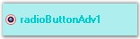{border="0"}

[]{style="COLOR: #15428b"} 

Figure 643: RadioButton displayed in \"Red\"

[]{style="COLOR: #15428b"} 

A sample which demonstrates the Themes and Visual Styles of RadioButtonAdv is available in the below sample installation path.

 

..My Documents\\Syncfusion\\EssentialStudio\\***Version Number***\\Windows\\Tools.Windows\\Samples\\2.0\\Editors Package\\OptionControls

[]{#related-topics}
:::::::::::::::::::
