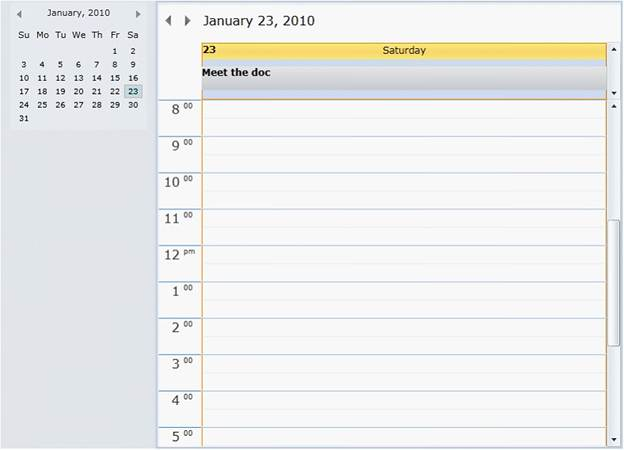
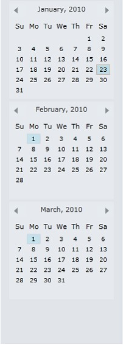
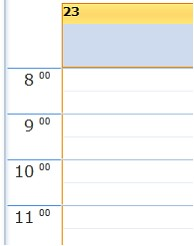

::: {style="DISPLAY: none"}
{#d2h_url_template}{#d2h_package_url style="WIDTH: 0px; DISPLAY: none; HEIGHT: 0px"}
:::

::::: {#nsbanner .d2h_main_nsbanner style="BORDER-BOTTOM: #999999 1px solid; POSITION: relative; PADDING-BOTTOM: 0px; BACKGROUND-COLOR: transparent; PADDING-LEFT: 0px; PADDING-RIGHT: 0px; DISPLAY: none; BORDER-TOP: #999999 1px solid; PADDING-TOP: 0px; LEFT: 0px"}
:::: {#TitleRow .d2h_main_titlerow style="PADDING-BOTTOM: 4px; BACKGROUND-COLOR: transparent; PADDING-LEFT: 22px; WIDTH: 100%; PADDING-RIGHT: 10px; DISPLAY: none; PADDING-TOP: 4px"}
::: {#ienav .d2h_main_ienav style="DISPLAY: none"}
{#D2HPrevious .D2HPreviousEnabled}  {#D2HNext .D2HNextEnabled}
:::
::::
:::::

:::: {#nstext .d2h_main_nstext style="PADDING-BOTTOM: 10px; BACKGROUND-COLOR: transparent; PADDING-LEFT: 22px; PADDING-RIGHT: 10px; HEIGHT: 100%; OVERFLOW: auto; PADDING-TOP: 5px" hasuserbackground="true" valign="bottom"}
::: {#d2h_breadcrumbs .d2h_breadcrumbs}
[Essential Studio User Guide Documentation](ms-xhelp:///?Id=12457748-09e3-4d74-a240-8e049cedf030){.d2h_breadcrumbsNormal}[ \> ]{.d2h_breadcrumbsLinkSeparator}[User Interface Edition](ms-xhelp:///?Id=c29296b7-531c-413b-a0ec-488ca1f7f669){.d2h_breadcrumbsNormal}[ \> ]{.d2h_breadcrumbsLinkSeparator}[Essential WPF](ms-xhelp:///?Id=7f4f82c5-151c-4262-94d0-75c4626c77bc){.d2h_breadcrumbsNormal}[ \> ]{.d2h_breadcrumbsLinkSeparator}[Essential Schedule]{.d2h_breadcrumbsContentsOnly}
:::

# Concepts and Features {#concepts-and-features style="tab-stops: 0pt"}

[]{#p10}Basic properties

The Schedule Control exposes the following public properties in the top level.

 

Option features      

[·      ]{style="FONT-FAMILY: Symbol"}**CalendarVisibility**---Sets the visibility of the Calendar view in the left-side of the Schedule.

[]{style="FONT-FAMILY: 'Trebuchet MS','sans-serif'; FONT-SIZE: 12pt"} 

{border="0"}

Figure 5: calendar Visibility

 

[·      ]{style="FONT-FAMILY: Symbol"}**CalendarItemsCount**---Sets the number of calendar items for visibility. Default value is 1.

{border="0"}

Figure 6: Calendar Items

 

[·      ]{style="FONT-FAMILY: Symbol"}**ScheduleType**---Sets different view modes for Schedule,

[o  ]{style="FONT-FAMILY: 'Courier New'"}Day

[o  ]{style="FONT-FAMILY: 'Courier New'"}Week

[o  ]{style="FONT-FAMILY: 'Courier New'"}WorkWeek

[o  ]{style="FONT-FAMILY: 'Courier New'"}Month

[·      ]{style="FONT-FAMILY: Symbol"}**StartWorkHour**---Set the start work hour for Schedule. Default value is 8.

{border="0"}

Figure 7: Start Work Hour

 

[·      ]{style="FONT-FAMILY: Symbol"}**EndWorkHour**---Set the end work hour for Schedule. Default value is 17 (or 5 PM).

[·      ]{style="FONT-FAMILY: Symbol"}**TimeInterval**---Set the TimeInterval for each time slot in appointments. The following options available are:

[o  ]{style="FONT-FAMILY: 'Courier New'"}FiveMin

[o  ]{style="FONT-FAMILY: 'Courier New'"}SixMin

[o  ]{style="FONT-FAMILY: 'Courier New'"}TenMin

[o  ]{style="FONT-FAMILY: 'Courier New'"}FifteenMin

[o  ]{style="FONT-FAMILY: 'Courier New'"}TwentyMin

[o  ]{style="FONT-FAMILY: 'Courier New'"}ThirtyMin

[o  ]{style="FONT-FAMILY: 'Courier New'"}OneHour

 

[·      ]{style="FONT-FAMILY: Symbol"}**TitleBarVisibility**---Gets / Sets the TitleBar visibility

[]{style="FONT-FAMILY: 'Trebuchet MS','sans-serif'; COLOR: #15428b; FONT-SIZE: 9pt"} 

[]{style="FONT-FAMILY: 'Trebuchet MS','sans-serif'; COLOR: #15428b; FONT-SIZE: 9pt"} 

[]{style="FONT-FAMILY: 'Trebuchet MS','sans-serif'; COLOR: #15428b; FONT-SIZE: 9pt"} 

[]{style="FONT-FAMILY: 'Calibri','sans-serif'"} 

[,]{style="FONT-FAMILY: 'Calibri','sans-serif'"}{border="0"}

Figure 8:TitleBarVisibility[]{style="FONT-FAMILY: 'Calibri','sans-serif'"}

***[]{style="FONT-FAMILY: 'Trebuchet MS','sans-serif'; COLOR: #15428b; FONT-SIZE: 9pt"}*** 

[·      ]{style="FONT-FAMILY: Symbol"}**IsAmPmMode**---Sets the AM/PM Mode in the Time slots.

[·      ]{style="FONT-FAMILY: Symbol"}**IntervalHeight**---Sets the height of each interval in the Time slot. Default value is 24.

[·      ]{style="FONT-FAMILY: Symbol"}**AllowEdit**---Specifies this property to allow editing the appointments in Schedule. Default value is true.

[·      ]{style="FONT-FAMILY: Symbol"}**AllowAddNew**---Specifies this property to allow adding new appointments. Default value is true.

[·      ]{style="FONT-FAMILY: Symbol"}**AllowDelete**---Specifies this property to allow deleting appointments in the appointment editor. Default value is true.

More:

[ ]{#related-topics}

[{border="0" align="absMiddle"}Adding Appointment](ms-xhelp:///?Id=bbb9b3e7-6f10-4fcf-8100-ce43d193316a){style="TEXT-DECORATION: none"}

[{border="0" align="absMiddle"}Themes for Schedule WPF](ms-xhelp:///?Id=de379235-fab0-400f-81ec-7bcbc5192712){style="TEXT-DECORATION: none"}

[{border="0" align="absMiddle"}Basic Features](ms-xhelp:///?Id=ea68be89-135e-489c-9ec3-16f72298a52d){style="TEXT-DECORATION: none"}

[{border="0" align="absMiddle"}Advanced Features](ms-xhelp:///?Id=090a8908-6461-4b90-8c67-12347fdd673c){style="TEXT-DECORATION: none"}
::::
