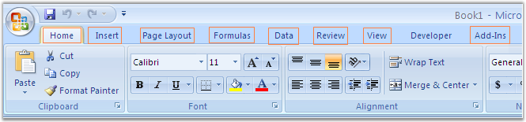

::: {style="DISPLAY: none"}
{#d2h_url_template}{#d2h_package_url style="WIDTH: 0px; DISPLAY: none; HEIGHT: 0px"}
:::

::::: {#nsbanner .d2h_main_nsbanner style="BORDER-BOTTOM: #999999 1px solid; POSITION: relative; PADDING-BOTTOM: 0px; BACKGROUND-COLOR: transparent; PADDING-LEFT: 0px; PADDING-RIGHT: 0px; DISPLAY: none; BORDER-TOP: #999999 1px solid; PADDING-TOP: 0px; LEFT: 0px"}
:::: {#TitleRow .d2h_main_titlerow style="PADDING-BOTTOM: 4px; BACKGROUND-COLOR: transparent; PADDING-LEFT: 22px; WIDTH: 100%; PADDING-RIGHT: 10px; DISPLAY: none; PADDING-TOP: 4px"}
::: {#ienav .d2h_main_ienav style="DISPLAY: none"}
{#D2HPrevious .D2HPreviousEnabled}  {#D2HNext .D2HNextEnabled}
:::
::::
:::::

:::: {#nstext .d2h_main_nstext style="PADDING-BOTTOM: 10px; BACKGROUND-COLOR: transparent; PADDING-LEFT: 22px; PADDING-RIGHT: 10px; HEIGHT: 100%; OVERFLOW: auto; PADDING-TOP: 5px" hasuserbackground="true" valign="bottom"}
::: {#d2h_breadcrumbs .d2h_breadcrumbs}
[Essential Studio User Guide Documentation](ms-xhelp:///?Id=12457748-09e3-4d74-a240-8e049cedf030){.d2h_breadcrumbsNormal}[ \> ]{.d2h_breadcrumbsLinkSeparator}[Reporting Edition](ms-xhelp:///?Id=027aa5b6-6676-4f93-ad23-c20e8c45792e){.d2h_breadcrumbsNormal}[ \> ]{.d2h_breadcrumbsLinkSeparator}[Essential XlsIO](ms-xhelp:///?Id=b01a1b50-1d7d-40c0-bc83-af67e57c9005){.d2h_breadcrumbsNormal}
:::

# Concepts and Features {#concepts-and-features style="tab-stops: 0pt"}

 

This section illustrates all the Microsoft Excel equivalent features of Essential XlsIO. The structure of this section is designed in such a way that the topics are arranged as per the Excel 2007 menu structure as shown in the following screen shot.

 

 

{border="0"}

Figure 33: Excel 2007 Menu Structure

 

More:

[ ]{#related-topics}

[{border="0" align="absMiddle"}Home](ms-xhelp:///?Id=f62182de-92ac-41e4-aff6-b20e6b06d98e){style="TEXT-DECORATION: none"}

[{border="0" align="absMiddle"}Insert](ms-xhelp:///?Id=3b5c8a38-7946-47f2-a4af-0711da3daaa8){style="TEXT-DECORATION: none"}

[{border="0" align="absMiddle"}Page Layout](ms-xhelp:///?Id=76112122-6424-48ca-9508-d0a4eea9af2e){style="TEXT-DECORATION: none"}

[{border="0" align="absMiddle"}Formulas](ms-xhelp:///?Id=c863333a-35ff-470d-abbc-279e765c84b1){style="TEXT-DECORATION: none"}

[{border="0" align="absMiddle"}Data](ms-xhelp:///?Id=09eb021a-c01a-47a5-bf60-fb7c3ed89c78){style="TEXT-DECORATION: none"}

[{border="0" align="absMiddle"}Review](ms-xhelp:///?Id=b4add9bb-1a7a-44e2-8122-b84f6a6c79a0){style="TEXT-DECORATION: none"}

[{border="0" align="absMiddle"}View](ms-xhelp:///?Id=c847cbb0-917f-4a11-8b06-27f0adc8e824){style="TEXT-DECORATION: none"}

[{border="0" align="absMiddle"}Prepare](ms-xhelp:///?Id=4e8e7026-9449-4e3b-907a-f10090d1e212){style="TEXT-DECORATION: none"}

[{border="0" align="absMiddle"}Add-Ins](ms-xhelp:///?Id=8a3372e1-f3ca-4bf3-83fd-d42e2d6a9d67){style="TEXT-DECORATION: none"}
::::
