::: {style="DISPLAY: none"}
{#d2h_url_template}{#d2h_package_url style="WIDTH: 0px; DISPLAY: none; HEIGHT: 0px"}
:::

::::: {.d2h_secondary_topic style="PADDING-BOTTOM: 10pt; MARGIN: 0pt; PADDING-LEFT: 0pt; PADDING-RIGHT: 0pt; PADDING-TOP: 0pt"}
##### Concepts and Features {#concepts-and-features style="tab-stops: 0pt"}

[]{style="COLOR: #15428b"} 

This section comprises the below topics:

 

###### 3.15.1.2.4.1        Appearance Settings {#appearance-settings style="tab-stops: 0pt"}

[]{style="COLOR: #15428b"} 

The appearance settings of the RibbonControlAdv are discussed under the below sections:

 

3.15.1.2.4.1.1     OfficeColorSchemes

 

The Ribbon Control Adv has come up with the same visual style of Office 2007. The users can choose between three colors Blue, Silver and Black which, can be set through the **OfficeColorScheme** property of the RibbonControlAdv class.[]{#p1161}

[]{style="COLOR: #15428b"} 

+--------------------------------------------------------------------------------------------------------------------------------------------------------------------------------------------------------------------------------------------------------------------+
| **[\[C#\]]{style="FONT-FAMILY: 'Courier New'; COLOR: black"}**                                                                                                                                                                                                     |
|                                                                                                                                                                                                                                                                    |
| []{style="COLOR: #15428b"}                                                                                                                                                                                                                                         |
|                                                                                                                                                                                                                                                                    |
| [this]{style="FONT-FAMILY: 'Courier New'; COLOR: blue"}[.ribbonControlAdv1.OfficeColorScheme = Syncfusion.Windows.Forms.Tools.ToolStripEx.ColorScheme.Blue;]{style="FONT-FAMILY: 'Courier New'; COLOR: black"}[]{style="FONT-FAMILY: 'Courier New'; COLOR: black"} |
+--------------------------------------------------------------------------------------------------------------------------------------------------------------------------------------------------------------------------------------------------------------------+

[]{#p1162}[]{style="COLOR: #15428b"} 

+-----------------------------------------------------------------------------------------------------------------------------------------------------------------------------------------------------------------------------------------------------------------+
| **[\[VB.NET\]]{style="FONT-FAMILY: 'Courier New'; COLOR: black"}**                                                                                                                                                                                              |
|                                                                                                                                                                                                                                                                 |
| []{style="COLOR: #15428b"}                                                                                                                                                                                                                                      |
|                                                                                                                                                                                                                                                                 |
| [Me]{style="FONT-FAMILY: 'Courier New'; COLOR: blue"}[.ribbonControlAdv1.OfficeColorScheme = Syncfusion.Windows.Forms.Tools.ToolStripEx.ColorScheme.Blue]{style="FONT-FAMILY: 'Courier New'; COLOR: black"}[]{style="FONT-FAMILY: 'Courier New'; COLOR: black"} |
+-----------------------------------------------------------------------------------------------------------------------------------------------------------------------------------------------------------------------------------------------------------------+

[]{style="COLOR: #15428b"} 

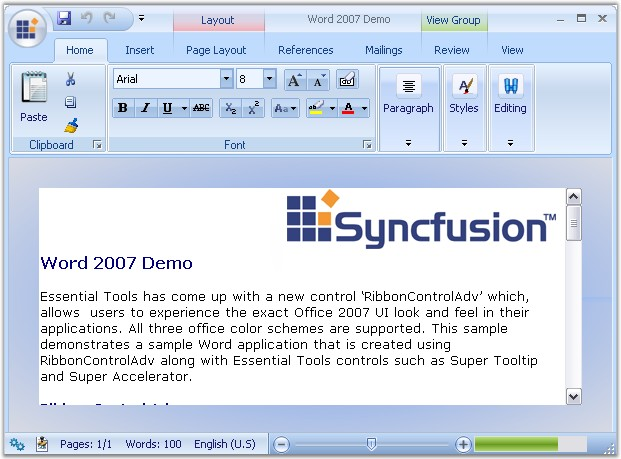{border="0"}

[]{style="COLOR: #15428b"} 

Figure 1380: Blue Color Scheme

[]{style="COLOR: #15428b"} 

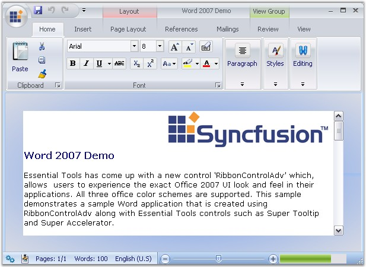{border="0"}

**[]{style="COLOR: #15428b"}** 

***[]{style="COLOR: #15428b"}*** 

Figure 1381: Silver Color Scheme

[]{style="COLOR: #15428b"} 

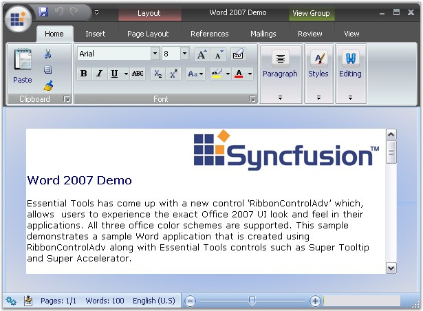{border="0"}

**[]{style="COLOR: #15428b"}** 

Figure 1382: Black Color Scheme

**[]{style="COLOR: #15428b"}** 

See Also

**[]{style="COLOR: #15428b"}** 

[[ColorSchemes]{.UGHyperlink}](../../../../../../../../Documents%20and%20Settings/sylviap/Desktop/Tools%20-%20Part%202.docx#_Appearance_Settings) for RibbonForm

 

 

3.15.1.2.4.1.2     Custom Color Scheme

[]{style="COLOR: #15428b"} 

[]{#p1163}To set custom colors, set the ColorScheme as Managed. Then set the desired color using the  Syncfusion.Windows.Forms.Tools.Office12ColorTable.ApplyManagedColors method.

[]{style="COLOR: #15428b"} 

+---------------------------------------------------------------------------------------------------------------------------------------------------------------------------------------------------------------------------------------------------------------------------------------+
| **[\[C#\]]{style="FONT-FAMILY: 'Courier New'; COLOR: black"}**                                                                                                                                                                                                                        |
|                                                                                                                                                                                                                                                                                       |
| []{style="COLOR: #15428b"}                                                                                                                                                                                                                                                            |
|                                                                                                                                                                                                                                                                                       |
| [//set the custom color to the form and RibbonControlAdv ]{style="FONT-FAMILY: 'Courier New'; COLOR: green"}                                                                                                                                                                          |
|                                                                                                                                                                                                                                                                                       |
| [this]{style="FONT-FAMILY: 'Courier New'; COLOR: blue"}[.ColorScheme = [ColorSchemeType]{style="COLOR: teal"}.Managed;]{style="FONT-FAMILY: 'Courier New'"}                                                                                                                           |
|                                                                                                                                                                                                                                                                                       |
| [this]{style="FONT-FAMILY: 'Courier New'; COLOR: blue"}[.ribbonControlAdv1.OfficeColorScheme = [ToolStripEx]{style="COLOR: teal"}.[ColorScheme]{style="COLOR: teal"}.Managed;]{style="FONT-FAMILY: 'Courier New'"}                                                                    |
|                                                                                                                                                                                                                                                                                       |
| [Office12ColorTable]{style="FONT-FAMILY: 'Courier New'; COLOR: teal"}[.ApplyManagedColors([this]{style="COLOR: blue"}, [Color]{style="COLOR: teal"}.Red);   ]{style="FONT-FAMILY: 'Courier New'"}[        ]{style="FONT-FAMILY: 'Courier New'"}[]{style="FONT-FAMILY: 'Courier New'"} |
+---------------------------------------------------------------------------------------------------------------------------------------------------------------------------------------------------------------------------------------------------------------------------------------+

[]{style="COLOR: #15428b"} 

+------------------------------------------------------------------------------------------------------------------------------------------------------------------------+
| **[\[]{style="FONT-FAMILY: 'Courier New'; COLOR: black"}[VB\]]{style="FONT-FAMILY: 'Courier New'; COLOR: black"}[]{style="FONT-FAMILY: 'Courier New'; COLOR: black"}** |
|                                                                                                                                                                        |
| []{style="COLOR: #15428b"}                                                                                                                                             |
|                                                                                                                                                                        |
| [\'set the custom color to the form and RibbonControlAdv ]{style="FONT-FAMILY: 'Courier New'; COLOR: green"}                                                           |
|                                                                                                                                                                        |
| [Me]{style="FONT-FAMILY: 'Courier New'; COLOR: blue"}[.ColorScheme = ColorSchemeType.Managed]{style="FONT-FAMILY: 'Courier New'"}                                      |
|                                                                                                                                                                        |
| [Me]{style="FONT-FAMILY: 'Courier New'; COLOR: blue"}[.ribbonControlAdv1.OfficeColorScheme = ToolStripEx.ColorScheme.Managed]{style="FONT-FAMILY: 'Courier New'"}      |
|                                                                                                                                                                        |
| [Office12ColorTable.ApplyManagedColors([Me]{style="COLOR: blue"}, Color.Red)]{style="FONT-FAMILY: 'Courier New'"}                                                      |
+------------------------------------------------------------------------------------------------------------------------------------------------------------------------+

[]{style="COLOR: #15428b"} 

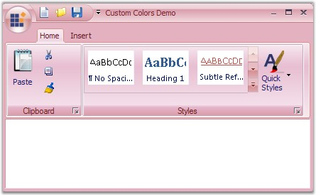{border="0"}

Figure 1383: Custom Color (Red) applied to the RibbonControlAdv

 

3.15.1.2.4.1.3     Caption ForeColor

Title color of the RibbonControlAdv can be set with the [TitleColor property.]{style="FONT-FAMILY: 'Courier New'"}

[]{style="FONT-FAMILY: 'Courier New'"} 

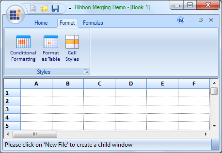{border="0"}

Figure 1384: RibbonControlAdv with TitleColor set to Green

**** 

+----------------------------------------------------------------------------------------+
| **[\[C#\]]{style="FONT-FAMILY: 'Courier New'"}**                                       |
|                                                                                        |
| [this.ribbonControlAdv1.TitleColor = Color.Green;]{style="FONT-FAMILY: 'Courier New'"} |
+----------------------------------------------------------------------------------------+

**** 

**** 

+----------------------------------------------------------------------------------------+
| **[\[VB\]]{style="FONT-FAMILY: 'Courier New'"}**                                       |
|                                                                                        |
| [  Me.ribbonControlAdv1.TitleColor = Color.Green;]{style="FONT-FAMILY: 'Courier New'"} |
+----------------------------------------------------------------------------------------+

 

 

 

 

###### []{#_Ribbon_Merging}3.15.1.2.4.2        Ribbon Merging {#ribbon-merging style="tab-stops: 0pt"}

[]{style="COLOR: #15428b"} 

RibbonControlAdv allows merging the RibbonPanel in a child form to the RibbonPanel in the parent form without a single line of code.

To merge the RibbonPanel in the ChildForm with the RibbonPanel in the parent form, follow the below given steps.

 

**Through Designer**

 

In a Ribbonform, add a RibbonControlAdv control and the required ToolStripTabItems and the ToolStripEx items.

 

From the ToolBox, add a RibbonPanelMergeContainer to the ChildForm. ToolStripEx can be added into this by right Clicking on it.

[]{style="COLOR: #15428b"} 

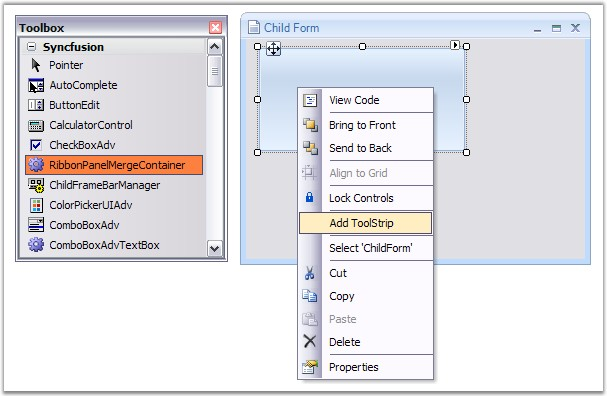{border="0"}

***[]{style="COLOR: #15428b"}*** 

***[]{style="COLOR: #15428b"}*** 

Figure 1385: ToolStrip added to the RibbonPanelMergeContainer in the Child Form

[]{style="COLOR: #15428b"} 

Now add this ChildForm to the RibbonForm that is the MDIParent of the ChildForm in the default manner.

[]{style="COLOR: #15428b"} 

+--------------------------------------------------------------------------------------------------------------------------------------------------------------------------+
| **[\[]{style="FONT-FAMILY: 'Courier New'; COLOR: black"}[C#\]]{style="FONT-FAMILY: 'Courier New'; COLOR: black"}[]{style="FONT-FAMILY: 'Courier New'; COLOR: black"}**   |
|                                                                                                                                                                          |
| []{style="COLOR: #15428b"}                                                                                                                                               |
|                                                                                                                                                                          |
| [ChildForm]{style="FONT-FAMILY: 'Courier New'; COLOR: teal"}[ frm = [new]{style="COLOR: blue"} [ChildForm]{style="COLOR: teal"}(); ]{style="FONT-FAMILY: 'Courier New'"} |
|                                                                                                                                                                          |
| [frm.MdiParent = [this]{style="COLOR: blue"}; ]{style="FONT-FAMILY: 'Courier New'"}                                                                                      |
|                                                                                                                                                                          |
| [frm.Show(); ]{style="FONT-FAMILY: 'Courier New'"}[           ]{style="FONT-FAMILY: 'Courier New'"}[]{style="FONT-FAMILY: 'Courier New'"}                                |
+--------------------------------------------------------------------------------------------------------------------------------------------------------------------------+

[]{style="COLOR: #15428b"} 

+-------------------------------------------------------------------------------------------------------------------------------------------------------------------------------+
| **[\[]{style="FONT-FAMILY: 'Courier New'; COLOR: black"}[VB\]]{style="FONT-FAMILY: 'Courier New'; COLOR: black"}[]{style="FONT-FAMILY: 'Courier New'; COLOR: black"}**        |
|                                                                                                                                                                               |
| []{style="COLOR: #15428b"}                                                                                                                                                    |
|                                                                                                                                                                               |
| [Dim]{style="FONT-FAMILY: 'Courier New'; COLOR: blue"}[ frm [As]{style="COLOR: blue"} ChildForm = [New]{style="COLOR: blue"} ChildForm()]{style="FONT-FAMILY: 'Courier New'"} |
|                                                                                                                                                                               |
| [frm.MdiParent = [Me]{style="COLOR: blue"}]{style="FONT-FAMILY: 'Courier New'"}                                                                                               |
|                                                                                                                                                                               |
| [frm.Show()]{style="FONT-FAMILY: 'Courier New'"}[]{style="FONT-FAMILY: 'Courier New'"}                                                                                        |
+-------------------------------------------------------------------------------------------------------------------------------------------------------------------------------+

[]{style="COLOR: #15428b"} 

::: {style="BORDER-BOTTOM: windowtext 1pt solid; BORDER-LEFT: medium none; PADDING-BOTTOM: 1pt; MARGIN: 9pt 0pt 9pt 18pt; PADDING-LEFT: 0pt; PADDING-RIGHT: 0pt; BORDER-TOP: windowtext 1pt solid; BORDER-RIGHT: medium none; PADDING-TOP: 1pt"}
{border="0"} Note:[ ]{style="COLOR: black; FONT-SIZE: 8pt"}The form\'s IsMDIContainer property must be set as true. Also the MDIParent Ribbonform should host a RibbonControlAdv to get the ChildForm\'s panels to be merged.
:::

[]{style="COLOR: #15428b"} 

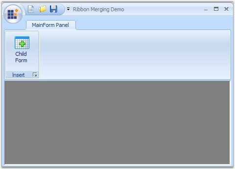{border="0"}

***[]{style="COLOR: #15428b"}*** 

***[]{style="COLOR: #15428b"}*** 

Figure 1386: Child Form added to Ribbon Form

 

Run the sample to view the ChildForm and the RibbonPanel merged with the RibbonControlAdv in the ParentForm.

[]{style="COLOR: #15428b"} 

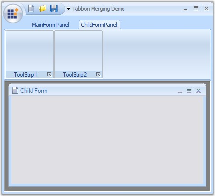{border="0"}

[]{style="COLOR: #15428b"} 

Figure 1387: ChildForm and RibbonPanel merged with the RibbonControlAdv

 

 

 

 

###### 3.15.1.2.4.3        Tab Groups {#tab-groups style="tab-stops: 0pt"}

[]{style="COLOR: #15428b"} 

RibbonControlAdv allows to create TabGroups using the **TabGroups** property available for the RibbonControlAdv.

[]{style="COLOR: #15428b"} 

Creating TabGroup

**[]{style="COLOR: #15428b"}** 

Through Designer

**[]{style="COLOR: #15428b"}** 

1.   Clicking the TabGroup property will pop up a window like the one below and using this, number of groups can be added and customized using the Color, Name and Visible properties provided to the right of the window.

[]{style="COLOR: #15428b"} 

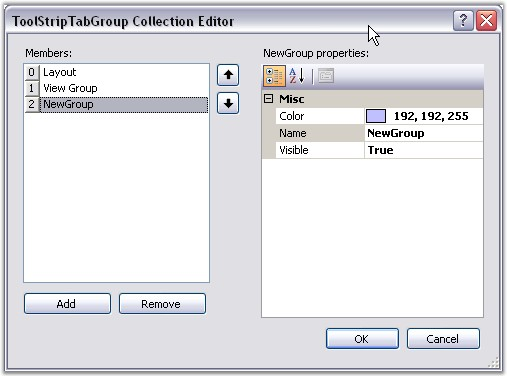{border="0"}

[]{style="COLOR: #15428b"} 

Figure 1388: TabGroup Collection Editor

[]{style="COLOR: #15428b"} 

2.   Now create a ToolStripTabItem using the smart tag of the Ribbon.

[]{style="COLOR: #15428b"} 

3.   Switch to the properties grid of the ToolStripTabItem, and select the tabgroup you have added through **TabGroup** property.

[]{style="COLOR: #15428b"} 

[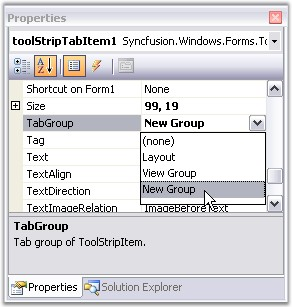{border="0"}]{style="COLOR: #15428b"}[]{style="COLOR: #15428b"}

***[]{style="COLOR: #15428b"}*** 

Figure 1389: Selecting the Tab Group

[]{style="COLOR: #15428b"} 

4.   This will display the tab items in the RibbonControlAdv as shown in the image below.

[]{style="COLOR: #15428b"} 

[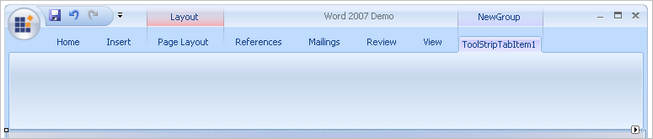{border="0"}]{style="COLOR: #15428b"}[]{style="COLOR: #15428b"}

***[]{style="COLOR: #15428b"}*** 

Figure 1390: RibbonControlAdv with Tab Group

[]{style="COLOR: #15428b"} 

Through Code

[]{style="COLOR: #15428b"} 

+------------------------------------------------------------------------------------------------------------------------------------------------------------------------------------------------------------------------------------------+
| **[\[C#\]]{style="FONT-FAMILY: 'Courier New'; COLOR: black"}**                                                                                                                                                                           |
|                                                                                                                                                                                                                                          |
| []{style="FONT-FAMILY: 'Courier New'; COLOR: black"}                                                                                                                                                                                     |
|                                                                                                                                                                                                                                          |
| [this]{style="FONT-FAMILY: 'Courier New'; COLOR: blue"}[.ribbonControlAdv1.TabGroups.Add(toolStripTabGroup3);]{style="FONT-FAMILY: 'Courier New'"}                                                                                       |
|                                                                                                                                                                                                                                          |
| [Syncfusion.Windows.Forms.Tools.[ToolStripTabGroup]{style="COLOR: teal"} toolStripTabGroup3 = [new]{style="COLOR: blue"} Syncfusion.Windows.Forms.Tools.[ToolStripTabGroup]{style="COLOR: teal"}();]{style="FONT-FAMILY: 'Courier New'"} |
|                                                                                                                                                                                                                                          |
| [this]{style="FONT-FAMILY: 'Courier New'; COLOR: blue"}[.ribbonControlAdv1.TabGroups.Add(toolStripTabGroup3);]{style="FONT-FAMILY: 'Courier New'"}                                                                                       |
|                                                                                                                                                                                                                                          |
| [this]{style="FONT-FAMILY: 'Courier New'; COLOR: blue"}[.ribbonControlAdv1.TabGroups.SetTabGroup(pageLayoutTabItem, toolStripTabGroup1);]{style="FONT-FAMILY: 'Courier New'"}                                                            |
+------------------------------------------------------------------------------------------------------------------------------------------------------------------------------------------------------------------------------------------+

[]{#p1164}[]{style="COLOR: #15428b"} 

+--------------------------------------------------------------------------------------------------------------------------------------------------------------------------------------------------------------------------------------------------------------------------+
| **[\[VB.NET\]]{style="FONT-FAMILY: 'Courier New'; COLOR: black"}**                                                                                                                                                                                                       |
|                                                                                                                                                                                                                                                                          |
| []{style="COLOR: black"}                                                                                                                                                                                                                                                 |
|                                                                                                                                                                                                                                                                          |
| [Me]{style="FONT-FAMILY: 'Courier New'; COLOR: blue"}[.ribbonControlAdv1.TabGroups.Add(toolStripTabGroup3)]{style="FONT-FAMILY: 'Courier New'"}                                                                                                                          |
|                                                                                                                                                                                                                                                                          |
| [Dim]{style="FONT-FAMILY: 'Courier New'; COLOR: blue"}[ toolStripTabGroup3 [As]{style="COLOR: blue"} Syncfusion.Windows.Forms.Tools.ToolStripTabGroup = [New]{style="COLOR: blue"} Syncfusion.Windows.Forms.Tools.ToolStripTabGroup]{style="FONT-FAMILY: 'Courier New'"} |
|                                                                                                                                                                                                                                                                          |
| [Me]{style="FONT-FAMILY: 'Courier New'; COLOR: blue"}[.ribbonControlAdv1.TabGroups.Add(toolStripTabGroup3)]{style="FONT-FAMILY: 'Courier New'"}                                                                                                                          |
|                                                                                                                                                                                                                                                                          |
| [Me]{style="FONT-FAMILY: 'Courier New'; COLOR: blue"}[.ribbonControlAdv1.TabGroups.SetTabGroup(pageLayoutTabItem, toolStripTabGroup1)]{style="FONT-FAMILY: 'Courier New'"}[]{style="FONT-FAMILY: 'Courier New'"}                                                         |
+--------------------------------------------------------------------------------------------------------------------------------------------------------------------------------------------------------------------------------------------------------------------------+

 

**Customization**

 

Using the **Color** property, the color for the tabs can be set. Text for the tabs can be specified through **Name** property and the tabs can be shown or hidden using **Visible** property.

 

Programmatically these properties can be set using the below code snippets.

[]{style="COLOR: #15428b"} 

+------------------------------------------------------------------------------------------------------------------------+
| **[\[C#\]]{style="FONT-FAMILY: 'Courier New'; COLOR: black"}**                                                         |
|                                                                                                                        |
| []{style="FONT-FAMILY: 'Courier New'; COLOR: black"}                                                                   |
|                                                                                                                        |
| [toolStripTabGroup3.Color = System.Drawing.[Color]{style="COLOR: teal"}.DarkBlue;]{style="FONT-FAMILY: 'Courier New'"} |
|                                                                                                                        |
| [toolStripTabGroup3.Name = [\"New Group\"]{style="COLOR: maroon"};]{style="FONT-FAMILY: 'Courier New'"}                |
|                                                                                                                        |
| [toolStripTabGroup3.Visible = [true]{style="COLOR: blue"};]{style="FONT-FAMILY: 'Courier New'"}                        |
+------------------------------------------------------------------------------------------------------------------------+

[]{style="COLOR: #15428b"} 

+---------------------------------------------------------------------------------------------------------------------------------------------------+
| **[\[VB.NET\]]{style="FONT-FAMILY: 'Courier New'; COLOR: black"}**                                                                                |
|                                                                                                                                                   |
| []{style="COLOR: black"}                                                                                                                          |
|                                                                                                                                                   |
| [toolStripTabGroup3.Color = System.Drawing.Color.DarkBlue]{style="FONT-FAMILY: 'Courier New'"}                                                    |
|                                                                                                                                                   |
| [toolStripTabGroup3.Name = [\"New Group\"]{style="COLOR: maroon"}]{style="FONT-FAMILY: 'Courier New'"}                                            |
|                                                                                                                                                   |
| [toolStripTabGroup3.Visible = [True]{style="COLOR: blue"}]{style="FONT-FAMILY: 'Courier New'"}[]{style="FONT-FAMILY: 'Courier New'; COLOR: blue"} |
+---------------------------------------------------------------------------------------------------------------------------------------------------+

 

###### 3.15.1.2.4.4        Title Settings {#title-settings style="tab-stops: 0pt"}

[]{style="COLOR: #15428b"} 

This section describes how to customize a normal windows form\'s title bar appearance using the RibbonControlAdv.

 

**Form Title Bar Settings**

 

When an application is created, it is usually displayed with the form title bar. The RibbonControlAdv provides option to replace this title bar with the built-in RibbonControlAdv system buttons and this can be enabled by setting the **IsFormManager** property to true.

[]{style="COLOR: #15428b"} 

+--------------------------------------------------------------------------------------------------------------------------------------------------------------+
| **[\[C#\]]{style="FONT-FAMILY: 'Courier New'; COLOR: black"}**                                                                                               |
|                                                                                                                                                              |
| []{style="FONT-FAMILY: 'Courier New'; COLOR: blue"}                                                                                                          |
|                                                                                                                                                              |
| [this]{style="FONT-FAMILY: 'Courier New'; COLOR: blue"}[.ribbonControlAdv1.IsFormManager = [true]{style="COLOR: blue"};]{style="FONT-FAMILY: 'Courier New'"} |
+--------------------------------------------------------------------------------------------------------------------------------------------------------------+

[]{style="COLOR: #15428b"} 

+-----------------------------------------------------------------------------------------------------------------------------------------------------------+
| **[\[VB.NET\]]{style="FONT-FAMILY: 'Courier New'; COLOR: black"}**                                                                                        |
|                                                                                                                                                           |
| []{style="FONT-FAMILY: 'Courier New'; COLOR: black"}                                                                                                      |
|                                                                                                                                                           |
| [Me]{style="FONT-FAMILY: 'Courier New'; COLOR: blue"}[.ribbonControlAdv1.IsFormManager = [True]{style="COLOR: blue"}]{style="FONT-FAMILY: 'Courier New'"} |
+-----------------------------------------------------------------------------------------------------------------------------------------------------------+

[]{style="COLOR: #15428b"} 

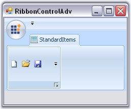{border="0"}

[]{style="COLOR: #15428b"} 

Figure 1391: IsFormManager = \"False\"

[]{style="COLOR: #15428b"} 

Title Settings

 

The below properties deals with Ribbon title settings.[]{#p1165}[]{style="FONT-FAMILY: 'Verdana','sans-serif'"}

 

::: {align="center"}
  ---------------- -----------------------------------
  Property         Description
  TitleAlignment   Sets the alignment of the Title.
  TitleFont        Sets the font style of the title.
  TitleColor       Sets the font color of the title.
  ---------------- -----------------------------------
:::

 

+-----------------------------------------------------------------------------------------------------------------------------------------------------------------------------------------------------------------------------------------------+
| **[\[C#\]]{style="FONT-FAMILY: 'Courier New'; COLOR: black"}**                                                                                                                                                                                |
|                                                                                                                                                                                                                                               |
|                                                                                                                                                                                                                                               |
|                                                                                                                                                                                                                                               |
| [this]{style="FONT-FAMILY: 'Courier New'; COLOR: blue"}[.ribbonControlAdv1.TitleAlignment = Syncfusion.Windows.Forms.Tools.[TextAlignment]{style="COLOR: teal"}.Center;]{style="FONT-FAMILY: 'Courier New'"}[]{style="FONT-SIZE: 11pt"}       |
|                                                                                                                                                                                                                                               |
| [this]{style="FONT-FAMILY: 'Courier New'; COLOR: blue"}[.ribbonControlAdv1.TitleFont = [new]{style="COLOR: blue"} System.Drawing.[Font]{style="COLOR: teal"}([\"Arial\"]{style="COLOR: maroon"}, 9.75F);]{style="FONT-FAMILY: 'Courier New'"} |
|                                                                                                                                                                                                                                               |
| [this]{style="FONT-FAMILY: 'Courier New'; COLOR: blue"}[.ribbonControlAdv1.TitleColor = [Color]{style="COLOR: #2b91af"}.GreenYellow;]{style="FONT-FAMILY: 'Courier New'"}[]{style="FONT-FAMILY: 'Courier New'"}                               |
+-----------------------------------------------------------------------------------------------------------------------------------------------------------------------------------------------------------------------------------------------+

 

+---------------------------------------------------------------------------------------------------------------------------------------------------------------------------------------------------------------------+
| **[\[VB.NET\]]{style="FONT-FAMILY: 'Courier New'; COLOR: black"}**                                                                                                                                                  |
|                                                                                                                                                                                                                     |
| []{style="FONT-SIZE: 11pt"}                                                                                                                                                                                         |
|                                                                                                                                                                                                                     |
| [Me]{style="FONT-FAMILY: 'Courier New'; COLOR: blue"}[.ribbonControlAdv1.TitleAlignment = Syncfusion.Windows.Forms.Tools.[TextAlignment]{style="COLOR: teal"}.Center]{style="FONT-FAMILY: 'Courier New'"}           |
|                                                                                                                                                                                                                     |
| [Me]{style="FONT-FAMILY: 'Courier New'; COLOR: blue"}[.ribbonControlAdv1.TitleFont = [New]{style="COLOR: blue"} System.Drawing.Font([\"Arial\"]{style="COLOR: maroon"}, 9.75F)]{style="FONT-FAMILY: 'Courier New'"} |
|                                                                                                                                                                                                                     |
| [Me]{style="FONT-FAMILY: 'Courier New'; COLOR: blue"}[.ribbonControlAdv1.TitleColor = [Color]{style="COLOR: #2b91af"}.GreenYellow]{style="FONT-FAMILY: 'Courier New'"}                                              |
+---------------------------------------------------------------------------------------------------------------------------------------------------------------------------------------------------------------------+

 

 

###### 3.15.1.2.4.5        Persistence Support {#persistence-support style="tab-stops: 0pt"}

[]{#p1166}[]{style="COLOR: #15428b"} 

RibbonControlAdv comes with persistence support. Using this we can restore the saved state of the ribbon control.

\
Persistence works for the following.

[]{style="COLOR: #15428b"} 

[·      ]{style="FONT-FAMILY: Symbol"}The items in the QuickAccessToolBar that are added through the \"Customize Quick Access ToolBar\" can be persisted.

[·      ]{style="FONT-FAMILY: Symbol"}Items added through the context menu that appears while clicking the dropdown arrow to the right of the QuickAccessToolBar can be persisted.

[·      ]{style="FONT-FAMILY: Symbol"}The collapsed / expanded / floating state of the RibbonPanel can be persisted.

[·      ]{style="FONT-FAMILY: Symbol"}The position of the QuickAccessToolBar, either below or above the ribbon panel can be persisted.

 

 

[]{#related-topics}
:::::
