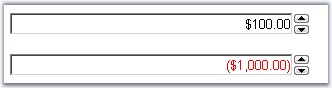
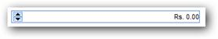
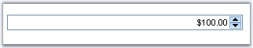

::: {style="DISPLAY: none"}
{#d2h_url_template}{#d2h_package_url style="WIDTH: 0px; DISPLAY: none; HEIGHT: 0px"}
:::

::::::::::::::: {.d2h_secondary_topic style="PADDING-BOTTOM: 10pt; MARGIN: 0pt; PADDING-LEFT: 0pt; PADDING-RIGHT: 0pt; PADDING-TOP: 0pt"}
##### Concepts and Features {#concepts-and-features style="tab-stops: 0pt"}

 

This section discusses the various features supported by the CurrencyTextBox control. It includes the following topics:

 

###### 5.1.2.1.2.1 Behavior Settings {#behavior-settings style="tab-stops: 0pt"}

[]{style="FONT-FAMILY: 'Trebuchet MS','sans-serif'; COLOR: #15428b; FONT-SIZE: 9pt"} 

Setting limits for the value

[]{style="FONT-FAMILY: 'Trebuchet MS','sans-serif'; COLOR: #15428b; FONT-SIZE: 9pt"} 

Limits can be set for the control, while entering data, by setting the minimum and maximum values, beyond which the control will not let you enter any values. To set the limits the **MinValue** and **MaxValue** properties can be used.

The values can be incremented in steps of a value when that value is set to the **IncrementStep** property.

[]{style="FONT-FAMILY: 'Trebuchet MS','sans-serif'; COLOR: #15428b; FONT-SIZE: 9pt"} 

::: {align="center"}
+-----------------------------------+-------------------------------------------------------------------------------------------+
|                                   |                                                                                           |
|                                   |                                                                                           |
| Property                          | Description                                                                               |
+-----------------------------------+-------------------------------------------------------------------------------------------+
| IncrementStep                     | Specifies the increment value. Default value is 1.                                        |
+-----------------------------------+-------------------------------------------------------------------------------------------+
| MaxValue                          | Specifies the maximum value, the control allows. Default value is 1.79769313486232E+308.  |
+-----------------------------------+-------------------------------------------------------------------------------------------+
| MinValue                          | Specifies the minimum value, the control allows. Default value is -1.79769313486232E+308. |
+-----------------------------------+-------------------------------------------------------------------------------------------+
:::

[]{style="FONT-FAMILY: 'Trebuchet MS','sans-serif'; COLOR: #15428b; FONT-SIZE: 9pt"} 

Programmatically the limit and increment properties can be set as follows.

[]{style="FONT-FAMILY: 'Trebuchet MS','sans-serif'; COLOR: #15428b; FONT-SIZE: 9pt"} 

+-------------------------------------------------------------------------------------------+
| **[\[C#\]]{style="FONT-FAMILY: 'Courier New'"}**                                          |
|                                                                                           |
| []{style="FONT-FAMILY: 'Courier New'; COLOR: blue; FONT-SIZE: 9pt"}                       |
|                                                                                           |
| [CurrencyTextBox1.IncrementStep = 1;]{style="FONT-FAMILY: 'Courier New'; FONT-SIZE: 9pt"} |
|                                                                                           |
| [CurrencyTextBox1.MaxValue = 100;]{style="FONT-FAMILY: 'Courier New'; FONT-SIZE: 9pt"}    |
|                                                                                           |
| [CurrencyTextBox1.MinValue = 20;]{style="FONT-FAMILY: 'Courier New'; FONT-SIZE: 9pt"}     |
+-------------------------------------------------------------------------------------------+

[]{style="FONT-FAMILY: 'Trebuchet MS','sans-serif'; COLOR: #15428b; FONT-SIZE: 9pt"} 

+---------------------------------------------------------------------------------------------------------------------------------------------------------------------+
| **[\[VB\]]{style="FONT-FAMILY: 'Courier New'"}**                                                                                                                    |
|                                                                                                                                                                     |
| []{style="FONT-FAMILY: 'Courier New'; COLOR: blue; FONT-SIZE: 9pt"}                                                                                                 |
|                                                                                                                                                                     |
| [Private]{style="FONT-FAMILY: 'Courier New'; COLOR: blue; FONT-SIZE: 9pt"}[ CurrencyTextBox1.IncrementStep = 1]{style="FONT-FAMILY: 'Courier New'; FONT-SIZE: 9pt"} |
|                                                                                                                                                                     |
| [Private]{style="FONT-FAMILY: 'Courier New'; COLOR: blue; FONT-SIZE: 9pt"}[ CurrencyTextBox1.MaxValue = 100]{style="FONT-FAMILY: 'Courier New'; FONT-SIZE: 9pt"}    |
|                                                                                                                                                                     |
| [Private]{style="FONT-FAMILY: 'Courier New'; COLOR: blue; FONT-SIZE: 9pt"}[ CurrencyTextBox1.MinValue = 20]{style="FONT-FAMILY: 'Courier New'; FONT-SIZE: 9pt"}     |
+---------------------------------------------------------------------------------------------------------------------------------------------------------------------+

[]{style="FONT-FAMILY: 'Trebuchet MS','sans-serif'; COLOR: #15428b; FONT-SIZE: 9pt"} 

{border="0"}

[]{style="FONT-FAMILY: 'Trebuchet MS','sans-serif'; COLOR: #15428b; FONT-SIZE: 9pt"} 

Figure 37: Positive and Negative color settings with Max and Min values set

[]{style="FONT-FAMILY: 'Trebuchet MS','sans-serif'; COLOR: #15428b; FONT-SIZE: 9pt"} 

Setting fore color for positive and negative values

[]{style="FONT-FAMILY: 'Trebuchet MS','sans-serif'; COLOR: #15428b; FONT-SIZE: 9pt"} 

Different colors can be set to indicate the positive and negative values by using the **NegativeColor** and **PositiveColor** properties.

[]{style="FONT-FAMILY: 'Trebuchet MS','sans-serif'; COLOR: #15428b; FONT-SIZE: 9pt"} 

::: {align="center"}
+-----------------------------------+----------------------------------------------------------+
|                                   |                                                          |
|                                   |                                                          |
| Property                          | Description                                              |
+-----------------------------------+----------------------------------------------------------+
| NegativeColor                     | Specifies the currency value color, when it is negative. |
+-----------------------------------+----------------------------------------------------------+
| PositiveColor                     | Specifies the currency value color, when it is positive. |
+-----------------------------------+----------------------------------------------------------+
:::

[]{style="FONT-FAMILY: 'Trebuchet MS','sans-serif'; COLOR: #15428b; FONT-SIZE: 9pt"} 

Programmatically the forecolor can be set as follows.

[]{style="FONT-FAMILY: 'Trebuchet MS','sans-serif'; COLOR: #15428b; FONT-SIZE: 9pt"} 

+--------------------------------------------------------------------------------------------------------------------------------------------------+
| **[\[C#\]]{style="FONT-FAMILY: 'Courier New'; FONT-SIZE: 9pt"}**                                                                                 |
|                                                                                                                                                  |
| []{style="FONT-FAMILY: 'Courier New'; COLOR: blue; FONT-SIZE: 9pt"}                                                                              |
|                                                                                                                                                  |
| [CurrencyTextBox1.NegativeColor = System.Drawing.[Color]{style="COLOR: teal"}.DarkSalmon;]{style="FONT-FAMILY: 'Courier New'; FONT-SIZE: 9pt"}   |
|                                                                                                                                                  |
| [CurrencyTextBox1.PositiveColor = System.Drawing.[Color]{style="COLOR: teal"}.DarkSeaGreen;]{style="FONT-FAMILY: 'Courier New'; FONT-SIZE: 9pt"} |
+--------------------------------------------------------------------------------------------------------------------------------------------------+

[]{style="FONT-FAMILY: 'Trebuchet MS','sans-serif'; COLOR: #15428b; FONT-SIZE: 9pt"} 

+-----------------------------------------------------------------------------------------------------------------------------------------------------------------------------------------------------+
| **[\[VB\]]{style="FONT-FAMILY: 'Courier New'; FONT-SIZE: 9pt"}**                                                                                                                                    |
|                                                                                                                                                                                                     |
| []{style="FONT-FAMILY: 'Courier New'; COLOR: blue; FONT-SIZE: 9pt"}                                                                                                                                 |
|                                                                                                                                                                                                     |
| [Private]{style="FONT-FAMILY: 'Courier New'; COLOR: blue; FONT-SIZE: 9pt"}[ CurrencyTextBox1.NegativeColor = System.Drawing.Color.DarkSalmon]{style="FONT-FAMILY: 'Courier New'; FONT-SIZE: 9pt"}   |
|                                                                                                                                                                                                     |
| [Private]{style="FONT-FAMILY: 'Courier New'; COLOR: blue; FONT-SIZE: 9pt"}[ CurrencyTextBox1.PositiveColor = System.Drawing.Color.DarkSeaGreen]{style="FONT-FAMILY: 'Courier New'; FONT-SIZE: 9pt"} |
+-----------------------------------------------------------------------------------------------------------------------------------------------------------------------------------------------------+

[]{style="FONT-FAMILY: 'Trebuchet MS','sans-serif'; COLOR: #15428b; FONT-SIZE: 9pt"} 

Value property

[]{style="FONT-FAMILY: 'Trebuchet MS','sans-serif'; COLOR: #15428b; FONT-SIZE: 9pt"} 

The **Value** property represents the data to be displayed in the control. This can be used to set the initial value for the control or to change the value anytime using this property.

[]{style="FONT-FAMILY: 'Trebuchet MS','sans-serif'; COLOR: #15428b; FONT-SIZE: 9pt"} 

::: {align="center"}
+-----------------------------------+-----------------------------------------------------+
|                                   |                                                     |
|                                   |                                                     |
| Property                          | Description                                         |
+-----------------------------------+-----------------------------------------------------+
| Value                             | Specifies the value to be displayed in the control. |
+-----------------------------------+-----------------------------------------------------+
:::

[]{style="FONT-FAMILY: 'Trebuchet MS','sans-serif'; COLOR: #15428b; FONT-SIZE: 9pt"} 

Programmatically the value can be set as follows.

[]{style="FONT-FAMILY: 'Trebuchet MS','sans-serif'; COLOR: #15428b; FONT-SIZE: 9pt"} 

+---------------------------------------------------------------------------------------------------------------------+
| **[\[C#\]]{style="FONT-FAMILY: 'Courier New'; FONT-SIZE: 9pt"}**                                                    |
|                                                                                                                     |
| []{style="FONT-FAMILY: 'Courier New'; COLOR: blue; FONT-SIZE: 9pt"}                                                 |
|                                                                                                                     |
| [CurrencyTextBox1.Value = [\"100.50\"]{style="COLOR: maroon"};]{style="FONT-FAMILY: 'Courier New'; FONT-SIZE: 9pt"} |
+---------------------------------------------------------------------------------------------------------------------+

[]{style="FONT-FAMILY: 'Trebuchet MS','sans-serif'; COLOR: #15428b; FONT-SIZE: 9pt"} 

+-----------------------------------------------------------------------------------------------------------------------------------------------------------------------------------------------+
| **[\[VB\]]{style="FONT-FAMILY: 'Courier New'; FONT-SIZE: 9pt"}**                                                                                                                              |
|                                                                                                                                                                                               |
| []{style="FONT-FAMILY: 'Courier New'; COLOR: blue; FONT-SIZE: 9pt"}                                                                                                                           |
|                                                                                                                                                                                               |
| [Private]{style="FONT-FAMILY: 'Courier New'; COLOR: blue; FONT-SIZE: 9pt"}[ CurrencyTextBox1.Value = [\"100.50\"]{style="COLOR: maroon"}]{style="FONT-FAMILY: 'Courier New'; FONT-SIZE: 9pt"} |
+-----------------------------------------------------------------------------------------------------------------------------------------------------------------------------------------------+

[]{style="FONT-FAMILY: 'Trebuchet MS','sans-serif'; COLOR: #15428b; FONT-SIZE: 9pt"} 

RightToLeft property

[]{style="FONT-FAMILY: 'Trebuchet MS','sans-serif'; COLOR: #15428b; FONT-SIZE: 9pt"} 

You can align the elements of the CurrencyTextBox using this property.

[]{style="FONT-FAMILY: 'Trebuchet MS','sans-serif'; COLOR: #15428b; FONT-SIZE: 9pt"} 

::: {align="center"}
+-----------------------------------+------------------------------------------------------------------------------------------------------------------------------+
|                                   |                                                                                                                              |
|                                   |                                                                                                                              |
| Property                          | Description                                                                                                                  |
+-----------------------------------+------------------------------------------------------------------------------------------------------------------------------+
| RightToLeft                       | Gets / sets a value indicating whether the elements of the control are aligned to support locales using right-to-left fonts. |
+-----------------------------------+------------------------------------------------------------------------------------------------------------------------------+
:::

[]{style="FONT-FAMILY: 'Trebuchet MS','sans-serif'; COLOR: #15428b; FONT-SIZE: 9pt"} 

+-------------------------------------------------------------------------------------------------------------------+
| **[\[C#\]]{style="FONT-FAMILY: 'Courier New'"}**                                                                  |
|                                                                                                                   |
| []{style="FONT-FAMILY: 'Courier New'; COLOR: blue; FONT-SIZE: 9pt"}                                               |
|                                                                                                                   |
| [CurrencyTextBox1.RightToLeft = [true]{style="COLOR: blue"};]{style="FONT-FAMILY: 'Courier New'; FONT-SIZE: 9pt"} |
+-------------------------------------------------------------------------------------------------------------------+

[]{style="FONT-FAMILY: 'Trebuchet MS','sans-serif'; COLOR: #15428b; FONT-SIZE: 9pt"} 

+---------------------------------------------------------------------------------------------------------------------------------------------------------------------------------------------+
| **[\[VB\]]{style="FONT-FAMILY: 'Courier New'"}**                                                                                                                                            |
|                                                                                                                                                                                             |
| []{style="FONT-FAMILY: 'Courier New'; COLOR: blue; FONT-SIZE: 9pt"}                                                                                                                         |
|                                                                                                                                                                                             |
| [Private]{style="FONT-FAMILY: 'Courier New'; COLOR: blue; FONT-SIZE: 9pt"}[ CurrencyTextBox1.RightToLeft = [True]{style="COLOR: blue"}]{style="FONT-FAMILY: 'Courier New'; FONT-SIZE: 9pt"} |
+---------------------------------------------------------------------------------------------------------------------------------------------------------------------------------------------+

 

 

{border="0"}

Figure 38: Elements of the CurrencyTextBox is Aligneg to Right.

###### 5.1.2.1.2.2 Culture Settings {#culture-settings style="tab-stops: 0pt"}

[]{style="FONT-FAMILY: 'Trebuchet MS','sans-serif'; COLOR: #15428b; FONT-SIZE: 9pt"} 

The culture information can be obtained either from the data posted by the browser (by setting the FromClient option) else from the web-server hosting page (by setting the FromServer option) or the user can define the culture settings.

 

The CurrencyTextBox allows you to override the default culture information (DecimalDigits, DecimalSeparator, GroupSeparator, GroupSizes, NegativeSign and CurrencySymbol properties) when the **CultureSource** property of CurrencyTextBox is set to **UserOverride**.

[]{style="FONT-FAMILY: 'Trebuchet MS','sans-serif'; COLOR: #15428b; FONT-SIZE: 9pt"} 

::: {align="center"}
+-----------------------------------+----------------------------------------------------------------------------------------------------------+
|                                   |                                                                                                          |
|                                   |                                                                                                          |
| Property                          | Description                                                                                              |
+-----------------------------------+----------------------------------------------------------------------------------------------------------+
| CultureSource                     | Specifies where the culture property settings should be obtained. The options included are as follows:   |
|                                   |                                                                                                          |
|                                   | []{style="FONT-FAMILY: 'Trebuchet MS','sans-serif'; COLOR: #15428b; FONT-SIZE: 9pt"}                     |
|                                   |                                                                                                          |
|                                   | [·      ]{style="FONT-FAMILY: Symbol"}*FromClient*: culture is obtained from the data posted by browser  |
|                                   |                                                                                                          |
|                                   | [·      ]{style="FONT-FAMILY: Symbol"}*FromServer*: culture is obtained from the web server hosting page |
|                                   |                                                                                                          |
|                                   | [·      ]{style="FONT-FAMILY: Symbol"}*UserOverride*: user-defined culture                               |
+-----------------------------------+----------------------------------------------------------------------------------------------------------+
:::

[]{style="FONT-FAMILY: 'Trebuchet MS','sans-serif'; COLOR: #15428b; FONT-SIZE: 9pt"} 

Globalization

[]{style="FONT-FAMILY: 'Trebuchet MS','sans-serif'; COLOR: #15428b; FONT-SIZE: 9pt"} 

**UserOvrrideCulture** allows you to set the required culture to represent the value to the specific requirement whose default value is **English(United States)**. When set, the CurrencySymbol will be automatically updated with that culture\'s currency type. If you still want to customize the currency symbol, you can customize it by setting the required symbol using **CurrencySymbol** property.

[]{style="FONT-FAMILY: 'Trebuchet MS','sans-serif'; COLOR: #15428b; FONT-SIZE: 9pt"} 

::: {align="center"}
+-----------------------------------+------------------------------------------------------------+
|                                   |                                                            |
|                                   |                                                            |
| Property                          | Description                                                |
+-----------------------------------+------------------------------------------------------------+
| CurrencySymbol                    | Specifies the currency symbol for CurrencyTextBox control. |
+-----------------------------------+------------------------------------------------------------+
| UserOverrideCulture               | Specifies the various cultures supported.                  |
+-----------------------------------+------------------------------------------------------------+
:::

[]{style="FONT-FAMILY: 'Trebuchet MS','sans-serif'; COLOR: #15428b; FONT-SIZE: 9pt"} 

Programmatically the culture settings can be coded as follows.

[]{style="FONT-FAMILY: 'Trebuchet MS','sans-serif'; COLOR: #15428b; FONT-SIZE: 9pt"} 

+-----------------------------------------------------------------------------------------------------------------------------------------------+
| **[\[C#\]]{style="FONT-FAMILY: 'Courier New'; FONT-SIZE: 9pt"}**                                                                              |
|                                                                                                                                               |
| []{style="FONT-FAMILY: 'Courier New'; COLOR: blue; FONT-SIZE: 9pt"}                                                                           |
|                                                                                                                                               |
| [CurrencyTextBox1.CultureSource = [CultureSourceType]{style="COLOR: teal"}.UserOverride;]{style="FONT-FAMILY: 'Courier New'; FONT-SIZE: 9pt"} |
|                                                                                                                                               |
| [CurrencyTextBox1.CurrencySymbol = [\"Dollar\"]{style="COLOR: maroon"};]{style="FONT-FAMILY: 'Courier New'; FONT-SIZE: 9pt"}                  |
+-----------------------------------------------------------------------------------------------------------------------------------------------+

[]{style="FONT-FAMILY: 'Trebuchet MS','sans-serif'; COLOR: #15428b; FONT-SIZE: 9pt"} 

+--------------------------------------------------------------------------------------------------------------------------------------------------------------------------------------------------------+
| **[\[VB\]]{style="FONT-FAMILY: 'Courier New'; FONT-SIZE: 9pt"}**                                                                                                                                       |
|                                                                                                                                                                                                        |
| []{style="FONT-FAMILY: 'Courier New'; COLOR: blue; FONT-SIZE: 9pt"}                                                                                                                                    |
|                                                                                                                                                                                                        |
| [Private]{style="FONT-FAMILY: 'Courier New'; COLOR: blue; FONT-SIZE: 9pt"}[ CurrencyTextBox1.CultureSource = CultureSourceType.UserOverride]{style="FONT-FAMILY: 'Courier New'; FONT-SIZE: 9pt"}       |
|                                                                                                                                                                                                        |
| [Private]{style="FONT-FAMILY: 'Courier New'; COLOR: blue; FONT-SIZE: 9pt"}[ CurrencyTextBox1.CurrencySymbol = [\"Dollar\"]{style="COLOR: maroon"}]{style="FONT-FAMILY: 'Courier New'; FONT-SIZE: 9pt"} |
+--------------------------------------------------------------------------------------------------------------------------------------------------------------------------------------------------------+

[]{style="FONT-FAMILY: 'Trebuchet MS','sans-serif'; COLOR: #15428b; FONT-SIZE: 9pt"} 

Setting the Culture properties

[]{style="FONT-FAMILY: 'Trebuchet MS','sans-serif'; COLOR: #15428b; FONT-SIZE: 9pt"} 

The group separator (thousand separator) can be set using the **GroupSeparator** property. The number of digits in the integer part (the numbers before the decimal digit), after which a group separator has to be used can be set through **GroupSize** property.

 

The decimal point to use can be set through **DecimalDigits** property and the number of decimal digits to appear in the fraction part (after the decimal point) can be specified using **DecimalSeparator** property.

[]{style="FONT-FAMILY: 'Trebuchet MS','sans-serif'; COLOR: #15428b; FONT-SIZE: 9pt"} 

::: {align="center"}
+-----------------------------------+-----------------------------------------------------------------------------------+
|                                   |                                                                                   |
|                                   |                                                                                   |
| Property                          | Description                                                                       |
+-----------------------------------+-----------------------------------------------------------------------------------+
| DecimalDigits                     | Specifies the number of decimal digits that will be allowed.                      |
+-----------------------------------+-----------------------------------------------------------------------------------+
| DecimalSeparator                  | Specifies the string to be used as decimal separator. The default value is \'.\'. |
+-----------------------------------+-----------------------------------------------------------------------------------+
| GroupSeparator                    | Specifies the string to be used when the GroupSeparator position is specified.    |
+-----------------------------------+-----------------------------------------------------------------------------------+
| GroupSizes                        | Specifies the number of digits in each group to left of the decimal.              |
+-----------------------------------+-----------------------------------------------------------------------------------+
:::

[]{style="FONT-FAMILY: 'Trebuchet MS','sans-serif'; COLOR: #15428b; FONT-SIZE: 9pt"} 

Programmatically the culture properties can be set as follows.

[]{style="FONT-FAMILY: 'Trebuchet MS','sans-serif'; COLOR: #15428b; FONT-SIZE: 9pt"} 

+---------------------------------------------------------------------------------------------------------------------------------------------------+
| **[\[C#\]]{style="FONT-FAMILY: 'Courier New'; FONT-SIZE: 9pt"}**                                                                                  |
|                                                                                                                                                   |
| []{style="FONT-FAMILY: 'Courier New'; COLOR: blue; FONT-SIZE: 9pt"}                                                                               |
|                                                                                                                                                   |
| [CurrencyTextBox2.GroupSeparator = [\",\"]{style="COLOR: maroon"};]{style="FONT-FAMILY: 'Courier New'; FONT-SIZE: 9pt"}                           |
|                                                                                                                                                   |
| [CurrencyTextBox2.GroupSizes = [new]{style="COLOR: blue"} [int]{style="COLOR: blue"}\[\]{3};]{style="FONT-FAMILY: 'Courier New'; FONT-SIZE: 9pt"} |
|                                                                                                                                                   |
| [CurrencyTextBox2.DecimalSeparator = [\".\"]{style="COLOR: maroon"};]{style="FONT-FAMILY: 'Courier New'; FONT-SIZE: 9pt"}                         |
|                                                                                                                                                   |
| [CurrencyTextBox2.DecimalDigits = 2;]{style="FONT-FAMILY: 'Courier New'; FONT-SIZE: 9pt"}                                                         |
+---------------------------------------------------------------------------------------------------------------------------------------------------+

[]{style="FONT-FAMILY: 'Trebuchet MS','sans-serif'; COLOR: #15428b; FONT-SIZE: 9pt"} 

+-------------------------------------------------------------------------------------------------------------------------------------------------------------------------------------------------------------------------------+
| **[\[VB\]]{style="FONT-FAMILY: 'Courier New'; FONT-SIZE: 9pt"}**                                                                                                                                                              |
|                                                                                                                                                                                                                               |
| []{style="FONT-FAMILY: 'Courier New'; COLOR: blue; FONT-SIZE: 9pt"}                                                                                                                                                           |
|                                                                                                                                                                                                                               |
| [Private]{style="FONT-FAMILY: 'Courier New'; COLOR: blue; FONT-SIZE: 9pt"}[ CurrencyTextBox2.GroupSeparator = [\",\"]{style="COLOR: maroon"}]{style="FONT-FAMILY: 'Courier New'; FONT-SIZE: 9pt"}                             |
|                                                                                                                                                                                                                               |
| [Private]{style="FONT-FAMILY: 'Courier New'; COLOR: blue; FONT-SIZE: 9pt"}[ CurrencyTextBox2.GroupSizes = [New]{style="COLOR: blue"} [Integer]{style="COLOR: blue"}(){3}]{style="FONT-FAMILY: 'Courier New'; FONT-SIZE: 9pt"} |
|                                                                                                                                                                                                                               |
| [Private]{style="FONT-FAMILY: 'Courier New'; COLOR: blue; FONT-SIZE: 9pt"}[ CurrencyTextBox2.DecimalSeparator = [\".\"]{style="COLOR: maroon"}]{style="FONT-FAMILY: 'Courier New'; FONT-SIZE: 9pt"}                           |
|                                                                                                                                                                                                                               |
| [Private]{style="FONT-FAMILY: 'Courier New'; COLOR: blue; FONT-SIZE: 9pt"}[ CurrencyTextBox2.DecimalDigits = 2]{style="FONT-FAMILY: 'Courier New'; FONT-SIZE: 9pt"}                                                           |
+-------------------------------------------------------------------------------------------------------------------------------------------------------------------------------------------------------------------------------+

[]{style="FONT-FAMILY: 'Trebuchet MS','sans-serif'; COLOR: #15428b; FONT-SIZE: 9pt"} 

Setting Positive and Negative patterns

[]{style="FONT-FAMILY: 'Trebuchet MS','sans-serif'; COLOR: #15428b; FONT-SIZE: 9pt"} 

The format in which the currency value should appear for positive numbers inside the textbox can be set to any of the pre-defined format (given in the table below), through the **PositivePattern** property.

**[]{style="COLOR: black; FONT-SIZE: 8pt"}** 

::: {align="center"}
+-----------------------------------+------------------------------------------------------------------------------------------------------------------------------------------------------------------------+
|                                   |                                                                                                                                                                        |
|                                   |                                                                                                                                                                        |
| Property                          | Description                                                                                                                                                            |
+-----------------------------------+------------------------------------------------------------------------------------------------------------------------------------------------------------------------+
| PositivePattern                   | Specifies the format pattern for positive currency values. This property can take one of the following values. (\'\$\' is the currency symbol and \'n\' is the number) |
|                                   |                                                                                                                                                                        |
|                                   | []{style="FONT-FAMILY: 'Trebuchet MS','sans-serif'; COLOR: #15428b; FONT-SIZE: 9pt"}                                                                                   |
|                                   |                                                                                                                                                                        |
|                                   | ::: {align="center"}                                                                                                                                                   |
|                                   |   ------- --------                                                                                                                                                     |
|                                   |   Value   Format                                                                                                                                                       |
|                                   |   0       \$n                                                                                                                                                          |
|                                   |   1       n\$                                                                                                                                                          |
|                                   |   2       \$ n                                                                                                                                                         |
|                                   |   3       n \$                                                                                                                                                         |
|                                   |   ------- --------                                                                                                                                                     |
|                                   | :::                                                                                                                                                                    |
|                                   |                                                                                                                                                                        |
|                                   | []{style="FONT-FAMILY: 'Trebuchet MS','sans-serif'; COLOR: #15428b; FONT-SIZE: 9pt"}                                                                                   |
+-----------------------------------+------------------------------------------------------------------------------------------------------------------------------------------------------------------------+
:::

[]{style="FONT-FAMILY: 'Trebuchet MS','sans-serif'; COLOR: #15428b; FONT-SIZE: 9pt"} 

The sign to be used for negative values can be specified using **NegativeSign** and the format in which the currency value for negative numbers should appear inside the textbox can be set to any of the pre-defined format (given in the table below), through the **NegativePattern** property.

[]{style="FONT-FAMILY: 'Trebuchet MS','sans-serif'; COLOR: #15428b; FONT-SIZE: 9pt"} 

::: {align="center"}
+-----------------------------------+-------------------------------------------------------------------------------------------------------------------------------------------------------------------------------------------------+
|                                   |                                                                                                                                                                                                 |
|                                   |                                                                                                                                                                                                 |
| Property                          | Description                                                                                                                                                                                     |
+-----------------------------------+-------------------------------------------------------------------------------------------------------------------------------------------------------------------------------------------------+
| NegativePattern                   | Specifies the format pattern for negative currency values. This property can take one of the following values. (\'\$\' is the currency symbol , \'-\' is negative sign and \'n\' is the number) |
|                                   |                                                                                                                                                                                                 |
|                                   | []{style="FONT-FAMILY: 'Trebuchet MS','sans-serif'; COLOR: #15428b; FONT-SIZE: 9pt"}                                                                                                            |
|                                   |                                                                                                                                                                                                 |
|                                   | ::: {align="center"}                                                                                                                                                                            |
|                                   |   ------- --------                                                                                                                                                                              |
|                                   |   Value   Format                                                                                                                                                                                |
|                                   |   0       (\$n)                                                                                                                                                                                 |
|                                   |   1       -\$n                                                                                                                                                                                  |
|                                   |   2       \$-n                                                                                                                                                                                  |
|                                   |   3       \$n-                                                                                                                                                                                  |
|                                   |   4       (n\$)                                                                                                                                                                                 |
|                                   |   5       -n\$                                                                                                                                                                                  |
|                                   |   6       n-\$                                                                                                                                                                                  |
|                                   |   7       n\$-                                                                                                                                                                                  |
|                                   |   8       -n \$                                                                                                                                                                                 |
|                                   |   9       -\$ n                                                                                                                                                                                 |
|                                   |   10      n \$-                                                                                                                                                                                 |
|                                   |   11      \$ n-                                                                                                                                                                                 |
|                                   |   12      \$ -n                                                                                                                                                                                 |
|                                   |   13      n- \$                                                                                                                                                                                 |
|                                   |   14      (\$ n)                                                                                                                                                                                |
|                                   |   15      (n \$)                                                                                                                                                                                |
|                                   |   ------- --------                                                                                                                                                                              |
|                                   | :::                                                                                                                                                                                             |
|                                   |                                                                                                                                                                                                 |
|                                   | []{style="FONT-FAMILY: 'Trebuchet MS','sans-serif'; COLOR: #15428b; FONT-SIZE: 9pt"}                                                                                                            |
+-----------------------------------+-------------------------------------------------------------------------------------------------------------------------------------------------------------------------------------------------+
| NegativeSign                      | Specifies the string that denotes the associated number is negative. The default value is \'-\'.                                                                                                |
+-----------------------------------+-------------------------------------------------------------------------------------------------------------------------------------------------------------------------------------------------+
:::

[]{style="FONT-FAMILY: 'Trebuchet MS','sans-serif'; COLOR: #15428b; FONT-SIZE: 9pt"} 

Programmatically the positive and negative pattern and sign can be set as follows.

[]{style="FONT-FAMILY: 'Trebuchet MS','sans-serif'; COLOR: #15428b; FONT-SIZE: 9pt"} 

+-----------------------------------------------------------------------------------------------------------------------+
| **[\[C#\]]{style="FONT-FAMILY: 'Courier New'; FONT-SIZE: 9pt"}**                                                      |
|                                                                                                                       |
| []{style="FONT-FAMILY: 'Courier New'; COLOR: blue; FONT-SIZE: 9pt"}                                                   |
|                                                                                                                       |
| [CurrencyTextBox2.PositivePattern = 3;]{style="FONT-FAMILY: 'Courier New'; FONT-SIZE: 9pt"}                           |
|                                                                                                                       |
| [CurrencyTextBox2.NegativePattern = 8;]{style="FONT-FAMILY: 'Courier New'; FONT-SIZE: 9pt"}                           |
|                                                                                                                       |
| [CurrencyTextBox2.NegativeSign = [\"-\"]{style="COLOR: maroon"};]{style="FONT-FAMILY: 'Courier New'; FONT-SIZE: 9pt"} |
+-----------------------------------------------------------------------------------------------------------------------+

[]{style="FONT-FAMILY: 'Trebuchet MS','sans-serif'; COLOR: #15428b; FONT-SIZE: 9pt"} 

+-----------------------------------------------------------------------------------------------------------------------------------------------------------------------+
| **[\[VB\]]{style="FONT-FAMILY: 'Courier New'; FONT-SIZE: 9pt"}**                                                                                                      |
|                                                                                                                                                                       |
| []{style="FONT-FAMILY: 'Courier New'; COLOR: blue; FONT-SIZE: 9pt"}                                                                                                   |
|                                                                                                                                                                       |
| [Private]{style="FONT-FAMILY: 'Courier New'; COLOR: blue; FONT-SIZE: 9pt"}[ CurrencyTextBox2.PositivePattern = 3]{style="FONT-FAMILY: 'Courier New'; FONT-SIZE: 9pt"} |
|                                                                                                                                                                       |
| [Private]{style="FONT-FAMILY: 'Courier New'; COLOR: blue; FONT-SIZE: 9pt"}[ CurrencyTextBox2.NegativePattern = 8]{style="FONT-FAMILY: 'Courier New'; FONT-SIZE: 9pt"} |
|                                                                                                                                                                       |
| [Private]{style="FONT-FAMILY: 'Courier New'; COLOR: blue; FONT-SIZE: 9pt"}[ CurrencyTextBox2.NegativeSign = -]{style="FONT-FAMILY: 'Courier New'; FONT-SIZE: 9pt"}    |
+-----------------------------------------------------------------------------------------------------------------------------------------------------------------------+

 

###### 5.1.2.1.2.3 ClientObjectID {#clientobjectid style="tab-stops: 0pt"}

[]{style="FONT-FAMILY: 'Trebuchet MS','sans-serif'; COLOR: #15428b; FONT-SIZE: 9pt"} 

The ClientObjectID can be used to access the control\'s object model on the client side.

 

ClientObjectID can be effectively used to refer the control\'s objects when used with MasterPages and UserControls. By default, a client object id is computed by concatenating \'\_sf\' and the control\'s **ID** property. However in the case of hosting the control in a MasterPage or UserControl, the computed client object id is very unintuitive. To make things simpler you can specify a custom value on this property and access the client side object model using that value.

[]{style="FONT-FAMILY: 'Trebuchet MS','sans-serif'; COLOR: #15428b; FONT-SIZE: 9pt"} 

::: {align="center"}
+-----------------------------------+------------------------------------------------------------------------+
|                                   |                                                                        |
|                                   |                                                                        |
| Property                          | Description                                                            |
+-----------------------------------+------------------------------------------------------------------------+
| ClientObjectID                    | Specifies the user-defined id for accessing the object on client side. |
+-----------------------------------+------------------------------------------------------------------------+
:::

[]{style="FONT-FAMILY: 'Trebuchet MS','sans-serif'; COLOR: #15428b; FONT-SIZE: 9pt"} 

Programmatically the ClientObjectID can be set as follows.

[]{style="FONT-FAMILY: 'Trebuchet MS','sans-serif'; COLOR: #15428b; FONT-SIZE: 9pt"} 

+---------------------------------------------------------------------------------------------------------------------------------+
| **[\[C#\]]{style="FONT-FAMILY: 'Courier New'; FONT-SIZE: 9pt"}**                                                                |
|                                                                                                                                 |
| []{style="FONT-FAMILY: 'Courier New'; COLOR: blue; FONT-SIZE: 9pt"}                                                             |
|                                                                                                                                 |
| [CurrencyTextBox1.ClientObjectID = [\"Custom ID\"]{style="COLOR: maroon"};]{style="FONT-FAMILY: 'Courier New'; FONT-SIZE: 9pt"} |
+---------------------------------------------------------------------------------------------------------------------------------+

[]{style="FONT-FAMILY: 'Trebuchet MS','sans-serif'; COLOR: #15428b; FONT-SIZE: 9pt"} 

+-----------------------------------------------------------------------------------------------------------------------------------------------------------------------------------------------------------+
| **[\[VB\]]{style="FONT-FAMILY: 'Courier New'; FONT-SIZE: 9pt"}**                                                                                                                                          |
|                                                                                                                                                                                                           |
| []{style="FONT-FAMILY: 'Courier New'; COLOR: blue; FONT-SIZE: 9pt"}                                                                                                                                       |
|                                                                                                                                                                                                           |
| [Private]{style="FONT-FAMILY: 'Courier New'; COLOR: blue; FONT-SIZE: 9pt"}[ CurrencyTextBox1.ClientObjectID = [\"Custom ID\"]{style="COLOR: maroon"}]{style="FONT-FAMILY: 'Courier New'; FONT-SIZE: 9pt"} |
+-----------------------------------------------------------------------------------------------------------------------------------------------------------------------------------------------------------+

 

###### 5.1.2.1.2.4 AutoFormat Style Options {#autoformat-style-options style="tab-stops: 0pt"}

[]{style="FONT-FAMILY: 'Trebuchet MS','sans-serif'; COLOR: #15428b; FONT-SIZE: 9pt"} 

The CurrencyTextBox control provides pre-defined set of styles that can be applied to your control just on a click of the button. You can set the desired look and feel for the control that includes some popular styles too.

Right-clicking the control and selecting the \'Auto Format\...\' option opens the following Auto Format dialog box.

[]{style="FONT-FAMILY: 'Trebuchet MS','sans-serif'; COLOR: #15428b; FONT-SIZE: 9pt"} 

{border="0"}

 

Figure 39

[]{style="FONT-FAMILY: 'Trebuchet MS','sans-serif'; COLOR: #15428b; FONT-SIZE: 9pt"} 

The left pane lists the various pre-defined style scheme that are available. The right pane shows the preview of the currently selected scheme. Select the required style, and click **OK** to apply the selected scheme to the control.

[]{style="FONT-FAMILY: 'Trebuchet MS','sans-serif'; COLOR: #15428b; FONT-SIZE: 9pt"} 

Example of a popular look and feel

[]{style="FONT-FAMILY: 'Trebuchet MS','sans-serif'; COLOR: #15428b; FONT-SIZE: 9pt"} 

The following image shows the CurrencyTextBox with **Classic Olive** style setting.

[]{style="FONT-FAMILY: 'Trebuchet MS','sans-serif'; COLOR: #15428b; FONT-SIZE: 9pt"} 

{border="0"}

Figure 40

 

###### 5.1.2.1.2.5 Client-Side Object Model {#client-side-object-model style="tab-stops: 0pt"}

[]{style="FONT-FAMILY: 'Trebuchet MS','sans-serif'; COLOR: #15428b; FONT-SIZE: 9pt"} 

The client side methods can be used to control the behavior of the CurrencyTextBox, that allows to interact with it. All the following methods are inherited from the NumericTextBox client side object.

[]{style="FONT-FAMILY: 'Trebuchet MS','sans-serif'; COLOR: #15428b; FONT-SIZE: 9pt"} 

::: {align="center"}
+-----------------+-----------------+-----------------+--------------------------------------------+
|                 |                 |                 |                                            |
|                 |                 |                 |                                            |
| Method          | Parameter       | Return Type     | Description                                |
+-----------------+-----------------+-----------------+--------------------------------------------+
| Validate        | string          | bool            | Verify whether value has valid expression. |
+-----------------+-----------------+-----------------+--------------------------------------------+
| GetText         | \-              | string          | Get text of TextBox.                       |
+-----------------+-----------------+-----------------+--------------------------------------------+
| SetText         | string          | \-              | Set text of TextBox.                       |
+-----------------+-----------------+-----------------+--------------------------------------------+
| GetValue        | \-              | int             | Get value of CurrencyTextBox.              |
+-----------------+-----------------+-----------------+--------------------------------------------+
| SetValue        | int             | \-              | Set value of CurrencyTextBox.              |
+-----------------+-----------------+-----------------+--------------------------------------------+
:::

[]{style="FONT-FAMILY: 'Trebuchet MS','sans-serif'; COLOR: #15428b; FONT-SIZE: 9pt"} 

The following code example demonstrates how to set CurrencyTextBox\'s value to **0**.

[]{style="FONT-FAMILY: 'Trebuchet MS','sans-serif'; COLOR: #15428b; FONT-SIZE: 9pt"} 

+----------------------------------------------------------------------------------------------------------------------------------------------------------------------------------------------------------------------------------------------------------------------------------------------------------------------------------------------------------------------------------------------------------------------------------------------------------------------------------------------------------------------------------------------------------------------------------------+
| [\<]{style="FONT-FAMILY: 'Courier New'; COLOR: blue; FONT-SIZE: 9pt"}[ssw]{style="FONT-FAMILY: 'Courier New'; COLOR: maroon; FONT-SIZE: 9pt"}[:]{style="FONT-FAMILY: 'Courier New'; COLOR: blue; FONT-SIZE: 9pt"}[CurrencyTextBox]{style="FONT-FAMILY: 'Courier New'; COLOR: maroon; FONT-SIZE: 9pt"}[ [ID]{style="COLOR: red"}[=\"CurrencyTextBox1\"]{style="COLOR: blue"} [ClientObjectId]{style="COLOR: red"}[=\"\_sfCurrencyTextBox1\"]{style="COLOR: blue"} [runat]{style="COLOR: red"}[=\"server\"/\>]{style="COLOR: blue"}]{style="FONT-FAMILY: 'Courier New'; FONT-SIZE: 9pt"} |
|                                                                                                                                                                                                                                                                                                                                                                                                                                                                                                                                                                                        |
| [\<]{style="FONT-FAMILY: 'Courier New'; COLOR: blue; FONT-SIZE: 9pt"}[input]{style="FONT-FAMILY: 'Courier New'; COLOR: maroon; FONT-SIZE: 9pt"}[ [type]{style="COLOR: red"}[=\"button\"]{style="COLOR: blue"} [value]{style="COLOR: red"}[=\"Reset\"]{style="COLOR: blue"} [onclick]{style="COLOR: red"}[=\"\_sfCurrencyTextBox1.SetValue(0)\"]{style="COLOR: blue"} [/\>]{style="COLOR: blue"}]{style="FONT-FAMILY: 'Courier New'; FONT-SIZE: 9pt"}                                                                                                                                   |
+----------------------------------------------------------------------------------------------------------------------------------------------------------------------------------------------------------------------------------------------------------------------------------------------------------------------------------------------------------------------------------------------------------------------------------------------------------------------------------------------------------------------------------------------------------------------------------------+

[]{style="FONT-FAMILY: 'Trebuchet MS','sans-serif'; COLOR: #15428b; FONT-SIZE: 9pt"} 

::: {align="center"}
+-----------------------+-----------------------+-----------------------------------------------------------------------------+
|                       |                       |                                                                             |
|                       |                       |                                                                             |
| Property              | Type                  | Description                                                                 |
+-----------------------+-----------------------+-----------------------------------------------------------------------------+
| ID                    | string                | Specifies the client side identifier.                                       |
+-----------------------+-----------------------+-----------------------------------------------------------------------------+
| Text                  | string                | Specifies the text of textbox.                                              |
+-----------------------+-----------------------+-----------------------------------------------------------------------------+
| Tooltip               | string                | Specifies the help message that showing when user moves mouse over control. |
+-----------------------+-----------------------+-----------------------------------------------------------------------------+
| Value                 | int                   | Specifies optional internal string value of this node.                      |
+-----------------------+-----------------------+-----------------------------------------------------------------------------+
| InstanceName          | string                | Specifies the client-side CurrencyTextBox object identifier.                |
+-----------------------+-----------------------+-----------------------------------------------------------------------------+
| Instance              | object                | Represents CurrencyTextBox client-side object.                              |
+-----------------------+-----------------------+-----------------------------------------------------------------------------+
| HtmlID                | string                | Specifies CurrencyTextBox HTML-element identifier.                          |
+-----------------------+-----------------------+-----------------------------------------------------------------------------+
| Element               | object                | Represents CurrencyTextBox HTML-element.                                    |
+-----------------------+-----------------------+-----------------------------------------------------------------------------+
| TextBox               | object                | Represents textbox HTML-element.                                            |
+-----------------------+-----------------------+-----------------------------------------------------------------------------+
| Event                 | object                | Represents event.                                                           |
+-----------------------+-----------------------+-----------------------------------------------------------------------------+
:::

[]{style="FONT-FAMILY: 'Trebuchet MS','sans-serif'; COLOR: #15428b; FONT-SIZE: 9pt"} 

See Also

[]{style="FONT-FAMILY: 'Trebuchet MS','sans-serif'; COLOR: #15428b; FONT-SIZE: 9pt"} 

[Client-Side Events]{.UGHyperlink}[]{.UGHyperlink}

 

[]{#related-topics}
:::::::::::::::
