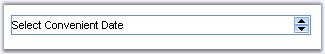
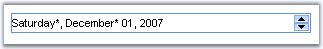
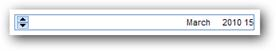
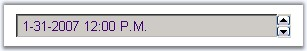
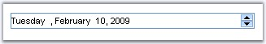

::: {style="DISPLAY: none"}
{#d2h_url_template}{#d2h_package_url style="WIDTH: 0px; DISPLAY: none; HEIGHT: 0px"}
:::

:::::::::::::::::::: {.d2h_secondary_topic style="PADDING-BOTTOM: 10pt; MARGIN: 0pt; PADDING-LEFT: 0pt; PADDING-RIGHT: 0pt; PADDING-TOP: 0pt"}
##### [[Concepts and Feature]{style="FONT-WEIGHT: normal"}]{.Heading5Char}s {#concepts-and-features style="tab-stops: 0pt"}

 

This section discusses the features of the DateTimeTextBox control. It includes the following topics:

 

###### 5.1.2.2.2.1 Behavior Settings {#behavior-settings style="tab-stops: 0pt"}

[]{style="FONT-FAMILY: 'Trebuchet MS','sans-serif'; COLOR: #15428b; FONT-SIZE: 9pt"} 

Null Date and Value Settings

[]{style="FONT-FAMILY: 'Trebuchet MS','sans-serif'; COLOR: #15428b; FONT-SIZE: 9pt"} 

The control can be enabled to accept null / empty values by setting the **EnableNullDate** property.

Assigning some text to the **NullString** property, displays that string, when no date is selected.

To display some text in the control by default, instead of displaying the current date, **IsNullDate** can be enabled and the text to be displayed has to be set to NullString property. If no text is set, then no value will be displayed, in the control, initially.

[]{style="FONT-FAMILY: 'Trebuchet MS','sans-serif'; COLOR: #15428b; FONT-SIZE: 9pt"} 

{border="0"}

[]{style="FONT-FAMILY: 'Trebuchet MS','sans-serif'; COLOR: #15428b; FONT-SIZE: 9pt"} 

Figure 44: IsNullDate set with NullString and without setting NullString

[]{style="FONT-FAMILY: 'Trebuchet MS','sans-serif'; COLOR: #15428b; FONT-SIZE: 9pt"} 

By setting **EnableNullKeys**, when BACKSPACE or DELETE key is pressed, null value or text string can be displayed, when the focus is on the control.

**[]{style="FONT-FAMILY: 'Trebuchet MS','sans-serif'; COLOR: #15428b; FONT-SIZE: 9pt"}** 

::: {align="center"}
  ---------------- ---------------------------------------------------------------------------------------------------------------------------------
  Property         Description
  EnableNullDate   Gets / sets the boolean value whether to enable null value. Default value is False.
  EnableNullKeys   Gets / sets the boolean value whether to reset the date to null when BACKSPACE or DELETE keys are used. Default value is False.
  IsNullDate       Gets / sets the boolean value to indicate if no date is selected. Default value is False.
  NullString       Specifies the text to display when no date is selected.
  ---------------- ---------------------------------------------------------------------------------------------------------------------------------
:::

[]{style="FONT-FAMILY: 'Trebuchet MS','sans-serif'; COLOR: #15428b; FONT-SIZE: 9pt"} 

[]{style="FONT-FAMILY: 'Trebuchet MS','sans-serif'; COLOR: #15428b; FONT-SIZE: 9pt"} 

Programmatically the null dates can be set as follows.

[]{style="FONT-FAMILY: 'Trebuchet MS','sans-serif'; COLOR: #15428b; FONT-SIZE: 9pt"} 

+------------------------------------------------------------------------------------------------------------------------------------------------+
| **[\[C#\]]{style="FONT-FAMILY: 'Courier New'; FONT-SIZE: 9pt"}**                                                                               |
|                                                                                                                                                |
| []{style="FONT-FAMILY: 'Courier New'; COLOR: blue; FONT-SIZE: 9pt"}                                                                            |
|                                                                                                                                                |
| [DateTimeTextBox1.EnableNullDate = [true]{style="COLOR: blue"};]{style="FONT-FAMILY: 'Courier New'; FONT-SIZE: 9pt"}                           |
|                                                                                                                                                |
| [DateTimeTextBox1.EnableNullKeys = [true]{style="COLOR: blue"};]{style="FONT-FAMILY: 'Courier New'; FONT-SIZE: 9pt"}                           |
|                                                                                                                                                |
| [DateTimeTextBox1.NullString = [\"Select a date - not optional\"]{style="COLOR: maroon"};]{style="FONT-FAMILY: 'Courier New'; FONT-SIZE: 9pt"} |
|                                                                                                                                                |
| [DateTimeTextBox1.IsNullDate = [true]{style="COLOR: blue"};]{style="FONT-FAMILY: 'Courier New'; FONT-SIZE: 9pt"}                               |
+------------------------------------------------------------------------------------------------------------------------------------------------+

[]{style="FONT-FAMILY: 'Trebuchet MS','sans-serif'; COLOR: #15428b; FONT-SIZE: 9pt"} 

+--------------------------------------------------------------------------------------------------------------------------------------------------------------------------------------------------------------------------+
| **[\[VB\]]{style="FONT-FAMILY: 'Courier New'; FONT-SIZE: 9pt"}**                                                                                                                                                         |
|                                                                                                                                                                                                                          |
| []{style="FONT-FAMILY: 'Courier New'; COLOR: blue; FONT-SIZE: 9pt"}                                                                                                                                                      |
|                                                                                                                                                                                                                          |
| [Private]{style="FONT-FAMILY: 'Courier New'; COLOR: blue; FONT-SIZE: 9pt"}[ DateTimeTextBox1.EnableNullDate = [True]{style="COLOR: blue"}]{style="FONT-FAMILY: 'Courier New'; FONT-SIZE: 9pt"}                           |
|                                                                                                                                                                                                                          |
| [Private]{style="FONT-FAMILY: 'Courier New'; COLOR: blue; FONT-SIZE: 9pt"}[ DateTimeTextBox1.EnableNullKeys = [True]{style="COLOR: blue"}]{style="FONT-FAMILY: 'Courier New'; FONT-SIZE: 9pt"}                           |
|                                                                                                                                                                                                                          |
| [Private]{style="FONT-FAMILY: 'Courier New'; COLOR: blue; FONT-SIZE: 9pt"}[ DateTimeTextBox1.NullString = [\"Select a date - not optional\"]{style="COLOR: maroon"}]{style="FONT-FAMILY: 'Courier New'; FONT-SIZE: 9pt"} |
|                                                                                                                                                                                                                          |
| [Private]{style="FONT-FAMILY: 'Courier New'; COLOR: blue; FONT-SIZE: 9pt"}[ DateTimeTextBox1.IsNullDate = [True]{style="COLOR: blue"}]{style="FONT-FAMILY: 'Courier New'; FONT-SIZE: 9pt"}                               |
+--------------------------------------------------------------------------------------------------------------------------------------------------------------------------------------------------------------------------+

[]{style="FONT-FAMILY: 'Trebuchet MS','sans-serif'; COLOR: #15428b; FONT-SIZE: 9pt"} 

Setting Start and End dates

[]{style="FONT-FAMILY: 'Trebuchet MS','sans-serif'; COLOR: #15428b; FONT-SIZE: 9pt"} 

The start and end dates can be specified, such that values can be selected only between those dates by setting the **MaxVaue** and the **MinValue** properties. The default MaxValue is **12/31/2099** and the default MinValue is **1/1/1900**.

[]{style="FONT-FAMILY: 'Trebuchet MS','sans-serif'; COLOR: #15428b; FONT-SIZE: 9pt"} 

::: {align="center"}
  ---------- -----------------------------------------------------
  Property   Description
  MaxValue   Specifies maximum value the DateTimeTextBox allows.
  MinValue   Specifies minimum value the DateTimeTextBox allows.
  ---------- -----------------------------------------------------
:::

[]{style="FONT-FAMILY: 'Trebuchet MS','sans-serif'; COLOR: #15428b; FONT-SIZE: 9pt"} 

Programmatically the min and max values can be set as follows.

[]{style="FONT-FAMILY: 'Trebuchet MS','sans-serif'; COLOR: #15428b; FONT-SIZE: 9pt"} 

+------------------------------------------------------------------------------------------------------------------------------------------------------------+
| **[\[C#\]]{style="FONT-FAMILY: 'Courier New'; FONT-SIZE: 9pt"}**                                                                                           |
|                                                                                                                                                            |
| []{style="FONT-FAMILY: 'Courier New'; COLOR: blue; FONT-SIZE: 9pt"}                                                                                        |
|                                                                                                                                                            |
| [DateTimeTextBox1.MaxValue = [new]{style="COLOR: blue"} [DateTime]{style="COLOR: teal"}(2007, 12, 1);]{style="FONT-FAMILY: 'Courier New'; FONT-SIZE: 9pt"} |
|                                                                                                                                                            |
| [DateTimeTextBox1.MinValue = [new]{style="COLOR: blue"} [DateTime]{style="COLOR: teal"}(2007, 1, 1);]{style="FONT-FAMILY: 'Courier New'; FONT-SIZE: 9pt"}  |
+------------------------------------------------------------------------------------------------------------------------------------------------------------+

[]{style="FONT-FAMILY: 'Trebuchet MS','sans-serif'; COLOR: #15428b; FONT-SIZE: 9pt"} 

+---------------------------------------------------------------------------------------------------------------------------------------------------------------------------------------------------------------+
| **[\[VB\]]{style="FONT-FAMILY: 'Courier New'; FONT-SIZE: 9pt"}**                                                                                                                                              |
|                                                                                                                                                                                                               |
| []{style="FONT-FAMILY: 'Courier New'; COLOR: blue; FONT-SIZE: 9pt"}                                                                                                                                           |
|                                                                                                                                                                                                               |
| [Private]{style="FONT-FAMILY: 'Courier New'; COLOR: blue; FONT-SIZE: 9pt"}[ DateTimeTextBox1.MaxValue = [New]{style="COLOR: blue"} DateTime(2007, 12, 1)]{style="FONT-FAMILY: 'Courier New'; FONT-SIZE: 9pt"} |
|                                                                                                                                                                                                               |
| [Private]{style="FONT-FAMILY: 'Courier New'; COLOR: blue; FONT-SIZE: 9pt"}[ DateTimeTextBox1.MinValue = [New]{style="COLOR: blue"} DateTime(2007, 1, 1)]{style="FONT-FAMILY: 'Courier New'; FONT-SIZE: 9pt"}  |
+---------------------------------------------------------------------------------------------------------------------------------------------------------------------------------------------------------------+

[]{style="FONT-FAMILY: 'Trebuchet MS','sans-serif'; COLOR: #15428b; FONT-SIZE: 9pt"} 

{border="0"}

[]{style="FONT-FAMILY: 'Trebuchet MS','sans-serif'; COLOR: #15428b; FONT-SIZE: 9pt"} 

Figure 45: Range set with Error fore and back color

[]{style="FONT-FAMILY: 'Trebuchet MS','sans-serif'; COLOR: #15428b; FONT-SIZE: 9pt"} 

Indicating error values

[]{style="FONT-FAMILY: 'Trebuchet MS','sans-serif'; COLOR: #15428b; FONT-SIZE: 9pt"} 

Back and fore colors can be applied to indicate the error values, i.e., values beyond the min and max values, by setting the **ErrorBackColor** and **ErrorForeColor** properties.

[]{style="FONT-FAMILY: 'Trebuchet MS','sans-serif'; COLOR: #15428b; FONT-SIZE: 9pt"} 

::: {align="center"}
  ---------------- ----------------------------------------------------------------------------
  Property         Description
  ErrorBackColor   Specifies the back color to use to indicate the date or time is not valid.
  ErrorForeColor   Specifies the fore color to use to indicate that the input is not valid.
  ---------------- ----------------------------------------------------------------------------
:::

[]{style="FONT-FAMILY: 'Trebuchet MS','sans-serif'; COLOR: #15428b; FONT-SIZE: 9pt"} 

Programmatically the error value colors can be set as follows.

[]{style="FONT-FAMILY: 'Trebuchet MS','sans-serif'; COLOR: #15428b; FONT-SIZE: 9pt"} 

+-----------------------------------------------------------------------------------------------------------------------------------------------------+
| **[\[C#\]]{style="FONT-FAMILY: 'Courier New'; FONT-SIZE: 9pt"}**                                                                                    |
|                                                                                                                                                     |
| []{style="FONT-FAMILY: 'Courier New'; COLOR: blue; FONT-SIZE: 9pt"}                                                                                 |
|                                                                                                                                                     |
| [DateTimeTextBox1.ErrorBackColor = System.Drawing.[Color]{style="COLOR: teal"}.BlanchedAlmond;]{style="FONT-FAMILY: 'Courier New'; FONT-SIZE: 9pt"} |
|                                                                                                                                                     |
| [DateTimeTextBox1.ErrorForeColor = System.Drawing.[Color]{style="COLOR: teal"}.CadetBlue;]{style="FONT-FAMILY: 'Courier New'; FONT-SIZE: 9pt"}      |
+-----------------------------------------------------------------------------------------------------------------------------------------------------+

[]{style="FONT-FAMILY: 'Trebuchet MS','sans-serif'; COLOR: #15428b; FONT-SIZE: 9pt"} 

+--------------------------------------------------------------------------------------------------------------------------------------------------------------------------------------------------------+
| **[\[VB\]]{style="FONT-FAMILY: 'Courier New'; FONT-SIZE: 9pt"}**                                                                                                                                       |
|                                                                                                                                                                                                        |
| []{style="FONT-FAMILY: 'Courier New'; COLOR: blue; FONT-SIZE: 9pt"}                                                                                                                                    |
|                                                                                                                                                                                                        |
| [Private]{style="FONT-FAMILY: 'Courier New'; COLOR: blue; FONT-SIZE: 9pt"}[ DateTimeTextBox1.ErrorBackColor = System.Drawing.Color.BlanchedAlmond]{style="FONT-FAMILY: 'Courier New'; FONT-SIZE: 9pt"} |
|                                                                                                                                                                                                        |
| [Private]{style="FONT-FAMILY: 'Courier New'; COLOR: blue; FONT-SIZE: 9pt"}[ DateTimeTextBox1.ErrorForeColor = System.Drawing.Color.CadetBlue]{style="FONT-FAMILY: 'Courier New'; FONT-SIZE: 9pt"}      |
+--------------------------------------------------------------------------------------------------------------------------------------------------------------------------------------------------------+

[]{style="FONT-FAMILY: 'Trebuchet MS','sans-serif'; COLOR: #15428b; FONT-SIZE: 9pt"} 

When **SpaceSymbol** is set, the unoccupied spaces for the date, day, month, year and time will be replaced with that symbol. By default, the value is a single white space.

[]{style="FONT-FAMILY: 'Trebuchet MS','sans-serif'; COLOR: #15428b; FONT-SIZE: 9pt"} 

{border="0"}

[]{style="FONT-FAMILY: 'Trebuchet MS','sans-serif'; COLOR: #15428b; FONT-SIZE: 9pt"} 

Figure 46: Date time values with different SpaceSymbol settings

[]{style="FONT-FAMILY: 'Trebuchet MS','sans-serif'; COLOR: #15428b; FONT-SIZE: 9pt"} 

::: {align="center"}
+-----------------------------------+------------------------------------------------------------------------------+
|                                   |                                                                              |
|                                   |                                                                              |
| Property                          | Description                                                                  |
+-----------------------------------+------------------------------------------------------------------------------+
| SpaceSymbol                       | Specifies the symbol to use for filling the extra spaces of date time value. |
+-----------------------------------+------------------------------------------------------------------------------+
:::

[]{style="FONT-FAMILY: 'Trebuchet MS','sans-serif'; COLOR: #15428b; FONT-SIZE: 9pt"} 

Programmatically the space symbol can be set as follows.

[]{style="FONT-FAMILY: 'Trebuchet MS','sans-serif'; COLOR: #15428b; FONT-SIZE: 9pt"} 

+-----------------------------------------------------------------------------------------------------------------------+
| **[\[C#\]]{style="FONT-FAMILY: 'Courier New'; FONT-SIZE: 9pt"}**                                                      |
|                                                                                                                       |
| []{style="FONT-FAMILY: 'Courier New'; COLOR: blue; FONT-SIZE: 9pt"}                                                   |
|                                                                                                                       |
| [DateTimeTextBox1.SpaceSymbol = [\'\*\']{style="COLOR: maroon"};]{style="FONT-FAMILY: 'Courier New'; FONT-SIZE: 9pt"} |
+-----------------------------------------------------------------------------------------------------------------------+

[]{style="FONT-FAMILY: 'Trebuchet MS','sans-serif'; COLOR: #15428b; FONT-SIZE: 9pt"} 

+--------------------------------------------------------------------------------------------------------------------------------------------------------------------------------------------------+
| **[\[VB\]]{style="FONT-FAMILY: 'Courier New'; FONT-SIZE: 9pt"}**                                                                                                                                 |
|                                                                                                                                                                                                  |
| []{style="FONT-FAMILY: 'Courier New'; COLOR: blue; FONT-SIZE: 9pt"}                                                                                                                              |
|                                                                                                                                                                                                  |
| [Private]{style="FONT-FAMILY: 'Courier New'; COLOR: blue; FONT-SIZE: 9pt"}[ DateTimeTextBox1.SpaceSymbol = [\"\*\"c]{style="COLOR: maroon"}]{style="FONT-FAMILY: 'Courier New'; FONT-SIZE: 9pt"} |
+--------------------------------------------------------------------------------------------------------------------------------------------------------------------------------------------------+

[]{style="FONT-FAMILY: 'Trebuchet MS','sans-serif'; COLOR: black; FONT-SIZE: 9pt"} 

RightToLeft property

[]{style="FONT-FAMILY: 'Trebuchet MS','sans-serif'; COLOR: #15428b; FONT-SIZE: 9pt"} 

You can align the elements of the DateTimeTextBox by using this property.

[]{style="FONT-FAMILY: 'Trebuchet MS','sans-serif'; COLOR: #15428b; FONT-SIZE: 9pt"} 

::: {align="center"}
  ------------- ------------------------------------------------------------------------------------------------------------------------------
  Property      Description
  RightToLeft   Gets / sets a value indicating whether the elements of the control are aligned to support locales using right-to-left fonts.
  ------------- ------------------------------------------------------------------------------------------------------------------------------
:::

[]{style="FONT-FAMILY: 'Trebuchet MS','sans-serif'; COLOR: #15428b; FONT-SIZE: 9pt"} 

+---------------------------------------------------------------------------------------------------------------+
| **[\[C#\]]{style="FONT-FAMILY: 'Courier New'"}**                                                              |
|                                                                                                               |
| []{style="FONT-FAMILY: 'Courier New'; COLOR: blue; FONT-SIZE: 9pt"}                                           |
|                                                                                                               |
| [DateTimeBox1.RightToLeft = [true]{style="COLOR: blue"};]{style="FONT-FAMILY: 'Courier New'; FONT-SIZE: 9pt"} |
+---------------------------------------------------------------------------------------------------------------+

[]{style="FONT-FAMILY: 'Trebuchet MS','sans-serif'; COLOR: #15428b; FONT-SIZE: 9pt"} 

+---------------------------------------------------------------------------------------------------------------------------------------------------------------------------------------------+
| **[\[VB\]]{style="FONT-FAMILY: 'Courier New'"}**                                                                                                                                            |
|                                                                                                                                                                                             |
| []{style="FONT-FAMILY: 'Courier New'; COLOR: blue; FONT-SIZE: 9pt"}                                                                                                                         |
|                                                                                                                                                                                             |
| [Private]{style="FONT-FAMILY: 'Courier New'; COLOR: blue; FONT-SIZE: 9pt"}[ DateTimeTextBox1.RightToLeft = [True]{style="COLOR: blue"}]{style="FONT-FAMILY: 'Courier New'; FONT-SIZE: 9pt"} |
+---------------------------------------------------------------------------------------------------------------------------------------------------------------------------------------------+

 

 

{border="0"}

 

Figure 47: Elements of the DateTimeTextBox is Aligned to Right

 

###### 5.1.2.2.2.2 Date and Time Format {#date-and-time-format style="tab-stops: 0pt"}

[]{style="FONT-FAMILY: 'Trebuchet MS','sans-serif'; COLOR: #15428b; FONT-SIZE: 9pt"} 

The control offers various pre-defined formats, in which the date-time values can be displayed, by setting the required option to the **Format** property.

[]{style="FONT-FAMILY: 'Trebuchet MS','sans-serif'; COLOR: #15428b; FONT-SIZE: 9pt"} 

::: {align="center"}
+-----------------------------------+--------------------------------------------------------------------------------------+
| Property                          | Description                                                                          |
+-----------------------------------+--------------------------------------------------------------------------------------+
| Format                            | Represents the date-time format of the control. The options included are as follows: |
|                                   |                                                                                      |
|                                   | [·      ]{style="FONT-FAMILY: Symbol"}Long                                           |
|                                   |                                                                                      |
|                                   | [·      ]{style="FONT-FAMILY: Symbol"}Short                                          |
|                                   |                                                                                      |
|                                   | [·      ]{style="FONT-FAMILY: Symbol"}Time                                           |
|                                   |                                                                                      |
|                                   | [·      ]{style="FONT-FAMILY: Symbol"}CustomChar                                     |
|                                   |                                                                                      |
|                                   | [·      ]{style="FONT-FAMILY: Symbol"}CustomString                                   |
+-----------------------------------+--------------------------------------------------------------------------------------+
:::

[]{style="FONT-FAMILY: 'Trebuchet MS','sans-serif'; COLOR: #15428b; FONT-SIZE: 9pt"} 

When Format property is set to **CustomChar**, the values set for the **CustomFormatChar** property will be inherited and the date-time will be displayed in that format.

[]{style="FONT-FAMILY: 'Trebuchet MS','sans-serif'; COLOR: #15428b; FONT-SIZE: 9pt"} 

::: {align="center"}
+-----------------------------------+---------------------------------------------------------------------------------------------------------+
|                                   |                                                                                                         |
|                                   |                                                                                                         |
| Property                          | Description                                                                                             |
+-----------------------------------+---------------------------------------------------------------------------------------------------------+
| CustomFormatChar                  | Specifies the date-time format type. The various values that can be set are \'D, F, G, M, R, S and Y\'. |
+-----------------------------------+---------------------------------------------------------------------------------------------------------+
:::

[]{style="FONT-FAMILY: 'Trebuchet MS','sans-serif'; COLOR: #15428b; FONT-SIZE: 9pt"} 

The various valid values for CustomFormatChar are listed in the below table.

[]{style="FONT-FAMILY: 'Trebuchet MS','sans-serif'; COLOR: #15428b; FONT-SIZE: 9pt"} 

::: {align="center"}
+-----------------------------------+-----------------------------------+
|                                   |                                   |
|                                   |                                   |
| CustomFormatChar Option           | Format                            |
+-----------------------------------+-----------------------------------+
| d                                 | 01/20/2007                        |
+-----------------------------------+-----------------------------------+
| D                                 | Monday, 01 January 2007           |
+-----------------------------------+-----------------------------------+
| g/G                               | 01/01/2007 00:00                  |
+-----------------------------------+-----------------------------------+
| f                                 | Monday, 01 January 2007 00:00     |
+-----------------------------------+-----------------------------------+
| F/U                               | Monday, 01 January 2007 00:00:00  |
+-----------------------------------+-----------------------------------+
| m/M                               | January 01                        |
+-----------------------------------+-----------------------------------+
| t                                 | 00.00                             |
+-----------------------------------+-----------------------------------+
| T                                 | 09:00:00                          |
+-----------------------------------+-----------------------------------+
| u                                 | 2007-01-01 09:00:00z              |
+-----------------------------------+-----------------------------------+
| y/Y                               | 2007 January                      |
+-----------------------------------+-----------------------------------+
| r/R                               | Mon, 01 Jan 2007 09:00:00 GMT     |
+-----------------------------------+-----------------------------------+
| s                                 | 2007-01-01 T09:00:00              |
+-----------------------------------+-----------------------------------+
:::

[]{style="FONT-FAMILY: 'Trebuchet MS','sans-serif'; COLOR: #15428b; FONT-SIZE: 9pt"} 

Programmatically the formats can be set as follows.

[]{style="FONT-FAMILY: 'Trebuchet MS','sans-serif'; COLOR: #15428b; FONT-SIZE: 9pt"} 

+---------------------------------------------------------------------------------------------------------------------------------------+
| **[\[C#\]]{style="FONT-FAMILY: 'Courier New'; FONT-SIZE: 9pt"}**                                                                      |
|                                                                                                                                       |
| []{style="FONT-FAMILY: 'Courier New'; COLOR: blue; FONT-SIZE: 9pt"}                                                                   |
|                                                                                                                                       |
| [DateTimeTextBox1.Format = [DateTimeFormatType]{style="COLOR: teal"}.CustomChar;]{style="FONT-FAMILY: 'Courier New'; FONT-SIZE: 9pt"} |
|                                                                                                                                       |
| [DateTimeTextBox1.CustomFormatChar = [\'M\']{style="COLOR: maroon"};]{style="FONT-FAMILY: 'Courier New'; FONT-SIZE: 9pt"}             |
+---------------------------------------------------------------------------------------------------------------------------------------+

[]{style="FONT-FAMILY: 'Trebuchet MS','sans-serif'; COLOR: #15428b; FONT-SIZE: 9pt"} 

+------------------------------------------------------------------------------------------------------------------------------------------------------------------------------------------------------+
| **[\[VB\]]{style="FONT-FAMILY: 'Courier New'; FONT-SIZE: 9pt"}**                                                                                                                                     |
|                                                                                                                                                                                                      |
| []{style="FONT-FAMILY: 'Courier New'; COLOR: blue; FONT-SIZE: 9pt"}                                                                                                                                  |
|                                                                                                                                                                                                      |
| [Private]{style="FONT-FAMILY: 'Courier New'; COLOR: blue; FONT-SIZE: 9pt"}[ DateTimeTextBox1.Format = DateTimeFormatType.CustomChar]{style="FONT-FAMILY: 'Courier New'; FONT-SIZE: 9pt"}             |
|                                                                                                                                                                                                      |
| [Private]{style="FONT-FAMILY: 'Courier New'; COLOR: blue; FONT-SIZE: 9pt"}[ DateTimeTextBox1.CustomFormatChar = [\"M\"]{style="COLOR: maroon"}c]{style="FONT-FAMILY: 'Courier New'; FONT-SIZE: 9pt"} |
+------------------------------------------------------------------------------------------------------------------------------------------------------------------------------------------------------+

[]{style="FONT-FAMILY: 'Trebuchet MS','sans-serif'; COLOR: #15428b; FONT-SIZE: 9pt"} 

When Format is set to **CustomString** option, the control displays the value in the format obtained from the **CustomFormat** property.

[]{style="FONT-FAMILY: 'Trebuchet MS','sans-serif'; COLOR: #15428b; FONT-SIZE: 9pt"} 

::: {align="center"}
+-----------------------------------+----------------------------------------------------------------------------------------------------------+
|                                   |                                                                                                          |
|                                   |                                                                                                          |
| Property                          | Description                                                                                              |
+-----------------------------------+----------------------------------------------------------------------------------------------------------+
| CustomFormat                      | Specifies the date format when Format property is set to CustomString. For example: dd/mm/yyyy hh:mm:ss. |
+-----------------------------------+----------------------------------------------------------------------------------------------------------+
:::

[]{style="FONT-FAMILY: 'Trebuchet MS','sans-serif'; COLOR: #15428b; FONT-SIZE: 9pt"} 

The combination of these values can be set to display the value in the required format. The various valid entries are listed in the below table.

[]{style="FONT-FAMILY: 'Trebuchet MS','sans-serif'; COLOR: #15428b; FONT-SIZE: 9pt"} 

::: {align="center"}
+-----------------------------------+--------------------------------------------------------------------------------------------------------------------------------------------------------------------------------------------------------------------------+
|                                   |                                                                                                                                                                                                                          |
|                                   |                                                                                                                                                                                                                          |
| CustomFormat  Option              | Description                                                                                                                                                                                                              |
+-----------------------------------+--------------------------------------------------------------------------------------------------------------------------------------------------------------------------------------------------------------------------+
| ffffff                            | The fraction of a second in six-digit precision. The remaining digits are truncated. The number of f\'s can be specified from 1 to 6, where those many digits will be displayed thereby truncating the remaining digits. |
+-----------------------------------+--------------------------------------------------------------------------------------------------------------------------------------------------------------------------------------------------------------------------+
| hh:mm:ss:ff                       | The hour in a 12-hour clock.                                                                                                                                                                                             |
|                                   |                                                                                                                                                                                                                          |
|                                   | Single-digit hours/min/sec/fraction of a second, will have a leading zero.                                                                                                                                               |
+-----------------------------------+--------------------------------------------------------------------------------------------------------------------------------------------------------------------------------------------------------------------------+
| HH:mm:ss:ff                       | The hour in a 24-hour clock.                                                                                                                                                                                             |
|                                   |                                                                                                                                                                                                                          |
|                                   | Single-digit hours/min/sec/fraction of a second, will have a leading zero.                                                                                                                                               |
+-----------------------------------+--------------------------------------------------------------------------------------------------------------------------------------------------------------------------------------------------------------------------+
| h(or)H:m:s:f                      | Single-digit hours (12-hour clock -or- 24-hour clock)/min/sec/fraction of a second will not have a leading zero.                                                                                                         |
+-----------------------------------+--------------------------------------------------------------------------------------------------------------------------------------------------------------------------------------------------------------------------+
| MMMM/dddd/yyyy                    | The full name of the month/day/year will be displayed.                                                                                                                                                                   |
+-----------------------------------+--------------------------------------------------------------------------------------------------------------------------------------------------------------------------------------------------------------------------+
| ddd/MMM                           | The abbreviated name of the day/month will be displayed.                                                                                                                                                                 |
+-----------------------------------+--------------------------------------------------------------------------------------------------------------------------------------------------------------------------------------------------------------------------+
| dd/yy/MM                          | The first two letters of the day and month will be displayed.                                                                                                                                                            |
|                                   |                                                                                                                                                                                                                          |
|                                   | Year will be displayed without the century. If the year without the century is less than 10, the year is displayed with a leading zero.                                                                                  |
+-----------------------------------+--------------------------------------------------------------------------------------------------------------------------------------------------------------------------------------------------------------------------+
| d/y/M                             | Single-digit months will not have a leading zero.                                                                                                                                                                        |
+-----------------------------------+--------------------------------------------------------------------------------------------------------------------------------------------------------------------------------------------------------------------------+
| tt (or) t                         | The AM/PM designator defined (or) first character in AMDesignator or PMDesignator, if any.                                                                                                                               |
+-----------------------------------+--------------------------------------------------------------------------------------------------------------------------------------------------------------------------------------------------------------------------+
:::

[]{style="FONT-FAMILY: 'Trebuchet MS','sans-serif'; COLOR: #15428b; FONT-SIZE: 9pt"} 

Programmatically the formats can be set as follows.

[]{style="FONT-FAMILY: 'Trebuchet MS','sans-serif'; COLOR: #15428b; FONT-SIZE: 9pt"} 

+---------------------------------------------------------------------------------------------------------------------------------------------------+
| **[\[C#\]]{style="FONT-FAMILY: 'Courier New'; FONT-SIZE: 9pt"}**                                                                                  |
|                                                                                                                                                   |
| []{style="FONT-FAMILY: 'Courier New'; COLOR: blue; FONT-SIZE: 9pt"}                                                                               |
|                                                                                                                                                   |
| [DateTimeTextBox1.Format = [DateTimeFormatType]{style="COLOR: teal"}.CustomString;]{style="FONT-FAMILY: 'Courier New'; FONT-SIZE: 9pt"}           |
|                                                                                                                                                   |
| [DateTimeTextBox1.CustomFormat = [\"MMMM/dddd/yyyy HH:mm:ss:ff tt\"]{style="COLOR: maroon"};]{style="FONT-FAMILY: 'Courier New'; FONT-SIZE: 9pt"} |
+---------------------------------------------------------------------------------------------------------------------------------------------------+

[]{style="FONT-FAMILY: 'Trebuchet MS','sans-serif'; COLOR: #15428b; FONT-SIZE: 9pt"} 

+-----------------------------------------------------------------------------------------------------------------------------------------------------------------------------------------------------------------------------+
| **[\[VB\]]{style="FONT-FAMILY: 'Courier New'; FONT-SIZE: 9pt"}**                                                                                                                                                            |
|                                                                                                                                                                                                                             |
| []{style="FONT-FAMILY: 'Courier New'; COLOR: blue; FONT-SIZE: 9pt"}                                                                                                                                                         |
|                                                                                                                                                                                                                             |
| [Private]{style="FONT-FAMILY: 'Courier New'; COLOR: blue; FONT-SIZE: 9pt"}[ DateTimeTextBox1.Format = DateTimeFormatType.CustomString]{style="FONT-FAMILY: 'Courier New'; FONT-SIZE: 9pt"}                                  |
|                                                                                                                                                                                                                             |
| [Private]{style="FONT-FAMILY: 'Courier New'; COLOR: blue; FONT-SIZE: 9pt"}[ DateTimeTextBox1.CustomFormat = [\"MMMM/dddd/yyyy HH:mm:ss:ff tt\"]{style="COLOR: maroon"}]{style="FONT-FAMILY: 'Courier New'; FONT-SIZE: 9pt"} |
+-----------------------------------------------------------------------------------------------------------------------------------------------------------------------------------------------------------------------------+

[]{#p55} 

###### 5.1.2.2.2.3 Culture Settings {#culture-settings style="tab-stops: 0pt"}

[]{style="FONT-FAMILY: 'Trebuchet MS','sans-serif'; COLOR: #15428b; FONT-SIZE: 9pt"} 

The culture information can be obtained either from the data posted by the browser (By setting the FromClient option) else from the web-server hosting page (By setting the FromServer option) or the user can define the culture settings.

 

The DateTimeTextBox allows you to override the default culture information (AM / PM Designator and Time / Date Separator properties) when the **CultureSource** property of DateTimeTextBox is set to **UserOverride**.

[]{style="FONT-FAMILY: 'Trebuchet MS','sans-serif'; COLOR: #15428b; FONT-SIZE: 9pt"} 

::: {align="center"}
+-----------------------------------+---------------------------------------------------------------------------------------------------------------------------------------------------+
| Property                          | Description                                                                                                                                       |
+-----------------------------------+---------------------------------------------------------------------------------------------------------------------------------------------------+
| CultureSource                     | Specifies the current culture for DateTimeTextBox control. The values included are as follows:                                                    |
|                                   |                                                                                                                                                   |
|                                   | [·      ]{style="FONT-FAMILY: Symbol"}*FromClient*:*[ ]{style="COLOR: black; FONT-SIZE: 8pt"}*culture is obtained from the data posted by browser |
|                                   |                                                                                                                                                   |
|                                   | [·      ]{style="FONT-FAMILY: Symbol"}*FromServer*: culture is obtained from web-server hosting page                                              |
|                                   |                                                                                                                                                   |
|                                   | [·      ]{style="FONT-FAMILY: Symbol"}*UserOverride*: user-defined culture                                                                        |
+-----------------------------------+---------------------------------------------------------------------------------------------------------------------------------------------------+
:::

[]{style="FONT-FAMILY: 'Trebuchet MS','sans-serif'; COLOR: #15428b; FONT-SIZE: 9pt"} 

Globalization

[]{style="FONT-FAMILY: 'Trebuchet MS','sans-serif'; COLOR: #15428b; FONT-SIZE: 9pt"} 

**UserOvrrideCulture** allows you to set the required culture to represent the value to the specific requirement whose default value is **English(United States)**.

[]{style="FONT-FAMILY: 'Trebuchet MS','sans-serif'; COLOR: #15428b; FONT-SIZE: 9pt"} 

::: {align="center"}
  --------------------- -------------------------------------------
  Property              Description
  UserOverrideCulture   Specifies the various cultures supported.
  --------------------- -------------------------------------------
:::

[]{style="FONT-FAMILY: 'Trebuchet MS','sans-serif'; COLOR: #15428b; FONT-SIZE: 9pt"} 

+-----------------------------------------------------------------------------------------------------------------------------------------------+
| **[\[C#\]]{style="FONT-FAMILY: 'Courier New'; FONT-SIZE: 9pt"}**                                                                              |
|                                                                                                                                               |
| []{style="FONT-FAMILY: 'Courier New'; COLOR: blue; FONT-SIZE: 9pt"}                                                                           |
|                                                                                                                                               |
| [DateTimeTextBox1.CultureSource = [CultureSourceType]{style="COLOR: teal"}.UserOverride;]{style="FONT-FAMILY: 'Courier New'; FONT-SIZE: 9pt"} |
+-----------------------------------------------------------------------------------------------------------------------------------------------+

[]{style="FONT-FAMILY: 'Trebuchet MS','sans-serif'; COLOR: #15428b; FONT-SIZE: 9pt"} 

+--------------------------------------------------------------------------------------------------------------------------------------------------------------------------------------------------+
| **[\[VB\]]{style="FONT-FAMILY: 'Courier New'; FONT-SIZE: 9pt"}**                                                                                                                                 |
|                                                                                                                                                                                                  |
| []{style="FONT-FAMILY: 'Courier New'; COLOR: blue; FONT-SIZE: 9pt"}                                                                                                                              |
|                                                                                                                                                                                                  |
| [Private]{style="FONT-FAMILY: 'Courier New'; COLOR: blue; FONT-SIZE: 9pt"}[ DateTimeTextBox1.CultureSource = CultureSourceType.UserOverride]{style="FONT-FAMILY: 'Courier New'; FONT-SIZE: 9pt"} |
+--------------------------------------------------------------------------------------------------------------------------------------------------------------------------------------------------+

[]{style="FONT-FAMILY: 'Trebuchet MS','sans-serif'; COLOR: #15428b; FONT-SIZE: 9pt"} 

Designators and Separators for time and date

[]{style="FONT-FAMILY: 'Trebuchet MS','sans-serif'; COLOR: #15428b; FONT-SIZE: 9pt"} 

The AM and PM designators can be used to set the time indicator.

[]{style="FONT-FAMILY: 'Trebuchet MS','sans-serif'; COLOR: #15428b; FONT-SIZE: 9pt"} 

::: {align="center"}
  -------------- ------------------------------------------------------------------------
  Property       Description
  AMDesignator   Specifies the culture specific AM designator. The default value is AM.
  PMDesignator   Specifies the culture specific PM designator. The default value is PM.
  -------------- ------------------------------------------------------------------------
:::

[]{style="FONT-FAMILY: 'Trebuchet MS','sans-serif'; COLOR: #15428b; FONT-SIZE: 9pt"} 

{border="0"}

[]{style="FONT-FAMILY: 'Trebuchet MS','sans-serif'; COLOR: #15428b; FONT-SIZE: 9pt"} 

Figure 48: Date with custom separator and time with custom designator

**[]{style="FONT-FAMILY: 'Trebuchet MS','sans-serif'; COLOR: #15428b; FONT-SIZE: 9pt"}** 

The separators for the date and time can be customized using the **DateSeparator** and **TimeSeparator** properties.

[]{style="FONT-FAMILY: 'Trebuchet MS','sans-serif'; COLOR: #15428b; FONT-SIZE: 9pt"} 

::: {align="center"}
  --------------- ------------------------------------------------------------------
  Property        Description
  DateSeparator   Specifies the separator to use for date. Default value is \'/\'.
  TimeSeparator   Specifies the separator to use for time. Default value is \':\'.
  --------------- ------------------------------------------------------------------
:::

[]{style="FONT-FAMILY: 'Trebuchet MS','sans-serif'; COLOR: #15428b; FONT-SIZE: 9pt"} 

+------------------------------------------------------------------------------------------------------------------------+
| **[\[C#\]]{style="FONT-FAMILY: 'Courier New'; FONT-SIZE: 9pt"}**                                                       |
|                                                                                                                        |
| []{style="FONT-FAMILY: 'Courier New'; COLOR: blue; FONT-SIZE: 9pt"}                                                    |
|                                                                                                                        |
| [DateTimeTextBox1.AMDesignator=[\"A.M.\"]{style="COLOR: maroon"};]{style="FONT-FAMILY: 'Courier New'; FONT-SIZE: 9pt"} |
|                                                                                                                        |
| [DateTimeTextBox1.PMDesignator=[\"P.M.\"]{style="COLOR: maroon"};]{style="FONT-FAMILY: 'Courier New'; FONT-SIZE: 9pt"} |
|                                                                                                                        |
| [DateTimeTextBox1.DateSeparator=[\"-\"]{style="COLOR: maroon"};]{style="FONT-FAMILY: 'Courier New'; FONT-SIZE: 9pt"}   |
|                                                                                                                        |
| [DateTimeTextBox1.TimeSeparator=[\":\"]{style="COLOR: maroon"};]{style="FONT-FAMILY: 'Courier New'; FONT-SIZE: 9pt"}   |
+------------------------------------------------------------------------------------------------------------------------+

[]{style="FONT-FAMILY: 'Trebuchet MS','sans-serif'; COLOR: #15428b; FONT-SIZE: 9pt"} 

+--------------------------------------------------------------------------------------------------------------------------------------------------------------------------------------------------+
| **[\[VB\]]{style="FONT-FAMILY: 'Courier New'; FONT-SIZE: 9pt"}**                                                                                                                                 |
|                                                                                                                                                                                                  |
| []{style="FONT-FAMILY: 'Courier New'; COLOR: blue; FONT-SIZE: 9pt"}                                                                                                                              |
|                                                                                                                                                                                                  |
| [Private]{style="FONT-FAMILY: 'Courier New'; COLOR: blue; FONT-SIZE: 9pt"}[ DateTimeTextBox1.AMDesignator=[\"A.M.\"]{style="COLOR: maroon"}]{style="FONT-FAMILY: 'Courier New'; FONT-SIZE: 9pt"} |
|                                                                                                                                                                                                  |
| [Private]{style="FONT-FAMILY: 'Courier New'; COLOR: blue; FONT-SIZE: 9pt"}[ DateTimeTextBox1.PMDesignator=[\"P.M.\"]{style="COLOR: maroon"}]{style="FONT-FAMILY: 'Courier New'; FONT-SIZE: 9pt"} |
|                                                                                                                                                                                                  |
| [Private]{style="FONT-FAMILY: 'Courier New'; COLOR: blue; FONT-SIZE: 9pt"}[ DateTimeTextBox1.DateSeparator=[\"-\"]{style="COLOR: maroon"}]{style="FONT-FAMILY: 'Courier New'; FONT-SIZE: 9pt"}   |
|                                                                                                                                                                                                  |
| [Private]{style="FONT-FAMILY: 'Courier New'; COLOR: blue; FONT-SIZE: 9pt"}[ DateTimeTextBox1.TimeSeparator=[\":\"]{style="COLOR: maroon"}]{style="FONT-FAMILY: 'Courier New'; FONT-SIZE: 9pt"}   |
+--------------------------------------------------------------------------------------------------------------------------------------------------------------------------------------------------+

 

###### 5.1.2.2.2.4 ClientObjectID {#clientobjectid style="tab-stops: 0pt"}

[]{style="FONT-FAMILY: 'Trebuchet MS','sans-serif'; COLOR: #15428b; FONT-SIZE: 9pt"} 

The ClientObjectID can be used to access the control\'s object model on the client side.

ClientObjectID can be effectively used to refer the control\'s objects when used with MasterPages and UserControls. By default, a client object id is computed by concatenating \'\_sf\' and the control\'s **ID** property. However in the case of hosting the control in a MasterPage or UserControl, the computed client object id is very unintuitive. To make things simpler you can specify a custom value on this property and access the client side object model using that value.

[]{style="FONT-FAMILY: 'Trebuchet MS','sans-serif'; COLOR: #15428b; FONT-SIZE: 9pt"} 

::: {align="center"}
  ---------------- ------------------------------------------------------------------------
  Property         Description
  ClientObjectID   Specifies the user defined id for accessing the object on client side.
  ---------------- ------------------------------------------------------------------------
:::

[]{style="FONT-FAMILY: 'Trebuchet MS','sans-serif'; COLOR: #15428b; FONT-SIZE: 9pt"} 

Programmatically the ClientObjectID can be set as follows.

[  ]{style="FONT-FAMILY: 'Trebuchet MS','sans-serif'; COLOR: #15428b; FONT-SIZE: 9pt"}

+---------------------------------------------------------------------------------------------------------------------------------+
| **[\[C#\]]{style="FONT-FAMILY: 'Courier New'; FONT-SIZE: 9pt"}**                                                                |
|                                                                                                                                 |
| []{style="FONT-FAMILY: 'Courier New'; COLOR: blue; FONT-SIZE: 9pt"}                                                             |
|                                                                                                                                 |
| [DateTimeTextBox1.ClientObjectID = [\"Custom ID\"]{style="COLOR: maroon"};]{style="FONT-FAMILY: 'Courier New'; FONT-SIZE: 9pt"} |
+---------------------------------------------------------------------------------------------------------------------------------+

[]{style="FONT-FAMILY: 'Trebuchet MS','sans-serif'; COLOR: #15428b; FONT-SIZE: 9pt"} 

+-----------------------------------------------------------------------------------------------------------------------------------------------------------------------------------------------------------+
| **[\[VB\]]{style="FONT-FAMILY: 'Courier New'; FONT-SIZE: 9pt"}**                                                                                                                                          |
|                                                                                                                                                                                                           |
| []{style="FONT-FAMILY: 'Courier New'; COLOR: blue; FONT-SIZE: 9pt"}                                                                                                                                       |
|                                                                                                                                                                                                           |
| [Private]{style="FONT-FAMILY: 'Courier New'; COLOR: blue; FONT-SIZE: 9pt"}[ DateTimeTextBox1.ClientObjectID = [\"Custom ID\"]{style="COLOR: maroon"}]{style="FONT-FAMILY: 'Courier New'; FONT-SIZE: 9pt"} |
+-----------------------------------------------------------------------------------------------------------------------------------------------------------------------------------------------------------+

 

###### 5.1.2.2.2.5 AutoFormat Style Options {#autoformat-style-options style="tab-stops: 0pt"}

[]{style="FONT-FAMILY: 'Trebuchet MS','sans-serif'; COLOR: #15428b; FONT-SIZE: 9pt"} 

The DateTimeTextBox control provides pre-defined set of styles that can be applied to your control just on a click of the button. You can set the desired look and feel for the control that includes some popular styles too.

Right-clicking the control and selecting the \'Auto Format\...\' option opens the following Auto Format dialog box.

[]{style="FONT-FAMILY: 'Trebuchet MS','sans-serif'; COLOR: #15428b; FONT-SIZE: 9pt"} 

{border="0"}

Figure 49

[]{style="FONT-FAMILY: 'Trebuchet MS','sans-serif'; COLOR: #15428b; FONT-SIZE: 9pt"} 

The left pane lists the various pre-defined style scheme that are available. The right pane shows the preview of the currently selected scheme. Select the required style, and click OK to apply the selected scheme to the control.

[]{style="FONT-FAMILY: 'Trebuchet MS','sans-serif'; COLOR: #15428b; FONT-SIZE: 9pt"} 

Example of a popular look and feel

[]{style="FONT-FAMILY: 'Trebuchet MS','sans-serif'; COLOR: #15428b; FONT-SIZE: 9pt"} 

The following image shows the DateTimeTextBox with **Classic Blue** style setting.

[]{style="FONT-FAMILY: 'Trebuchet MS','sans-serif'; COLOR: #15428b; FONT-SIZE: 9pt"} 

{border="0"}

Figure 50

 

###### 5.1.2.2.2.6 Client-Side Object Model {#client-side-object-model style="tab-stops: 0pt"}

[]{style="FONT-FAMILY: 'Trebuchet MS','sans-serif'; COLOR: #15428b; FONT-SIZE: 9pt"} 

The client side methods can be used to control the behavior of the DateTimeTextBox, that allows to interact with it. See following methods of DateTimeTextBox client side object.

[]{style="FONT-FAMILY: 'Trebuchet MS','sans-serif'; COLOR: #15428b; FONT-SIZE: 9pt"} 

::: {align="center"}
  ---------- ----------- ------------- -------------------------------
  Method     Parameter   Return Type   Description
  GetText    \-          string        Get text of TextBox.
  SetText    string      \-            Set text of TextBox.
  GetValue   \-          Date          Get value of DateTimeTextBox.
  SetValue   Date        \-            Set value of DateTimeTextBox.
  ---------- ----------- ------------- -------------------------------
:::

[]{style="FONT-FAMILY: 'Trebuchet MS','sans-serif'; COLOR: #15428b; FONT-SIZE: 9pt"} 

The following code snippet demonstrates how to use the **GetText** method.

[]{style="FONT-FAMILY: 'Trebuchet MS','sans-serif'; COLOR: #15428b; FONT-SIZE: 9pt"} 

+----------------------------------------------------------------------------------------------------------------------------------------------------------------------------------------------------------------------------------------------------------------------------------------------------------------------------------------------------------------------------------------------------------------------------------------------------------------------------------------------------------------------------------------------------------------------------------------+
| [\<]{style="FONT-FAMILY: 'Courier New'; COLOR: blue; FONT-SIZE: 9pt"}[ssw]{style="FONT-FAMILY: 'Courier New'; COLOR: maroon; FONT-SIZE: 9pt"}[:]{style="FONT-FAMILY: 'Courier New'; COLOR: blue; FONT-SIZE: 9pt"}[DateTimeTextBox]{style="FONT-FAMILY: 'Courier New'; COLOR: maroon; FONT-SIZE: 9pt"}[ [ID]{style="COLOR: red"}[=\"DateTimeTextBox1\"]{style="COLOR: blue"} [ClientObjectId]{style="COLOR: red"}[=\"\_sfDateTimeTextBox1\"]{style="COLOR: blue"} [runat]{style="COLOR: red"}[=\"server\"/\>]{style="COLOR: blue"}]{style="FONT-FAMILY: 'Courier New'; FONT-SIZE: 9pt"} |
|                                                                                                                                                                                                                                                                                                                                                                                                                                                                                                                                                                                        |
| [\<]{style="FONT-FAMILY: 'Courier New'; COLOR: blue; FONT-SIZE: 9pt"}[input]{style="FONT-FAMILY: 'Courier New'; COLOR: maroon; FONT-SIZE: 9pt"}[ [type]{style="COLOR: red"}[=\"button\"]{style="COLOR: blue"} [value]{style="COLOR: red"}[=\"Show Date\"]{style="COLOR: blue"} [onclick]{style="COLOR: red"}[=\"alert(**\_sfDateTimeTextBox1.GetText()**)\"]{style="COLOR: blue"} [/\>]{style="COLOR: blue"}]{style="FONT-FAMILY: 'Courier New'; FONT-SIZE: 9pt"}                                                                                                                      |
+----------------------------------------------------------------------------------------------------------------------------------------------------------------------------------------------------------------------------------------------------------------------------------------------------------------------------------------------------------------------------------------------------------------------------------------------------------------------------------------------------------------------------------------------------------------------------------------+

[]{style="FONT-FAMILY: 'Trebuchet MS','sans-serif'; COLOR: #15428b; FONT-SIZE: 9pt"} 

::: {align="center"}
+-----------------------+-----------------------+-----------------------------------------------------------------------------+
|                       |                       |                                                                             |
|                       |                       |                                                                             |
| Property              | Type                  | Description                                                                 |
+-----------------------+-----------------------+-----------------------------------------------------------------------------+
| ID                    | string                | Specifies the client side identifier.                                       |
+-----------------------+-----------------------+-----------------------------------------------------------------------------+
| Text                  | string                | Specifies the text of textbox.                                              |
+-----------------------+-----------------------+-----------------------------------------------------------------------------+
| Tooltip               | string                | Specifies the help message that showing when user moves mouse over control. |
+-----------------------+-----------------------+-----------------------------------------------------------------------------+
| Value                 | Date                  | Value of DateTimeTextBox.                                                   |
+-----------------------+-----------------------+-----------------------------------------------------------------------------+
| InstanceName          | string                | Specifies the client-side DateTimeTextBox object identifier.                |
+-----------------------+-----------------------+-----------------------------------------------------------------------------+
| Instance              | object                | Represents DateTimeTextBox client-side object.                              |
+-----------------------+-----------------------+-----------------------------------------------------------------------------+
| HtmlID                | string                | Specifies DateTimeTextBox HTML-element identifier.                          |
+-----------------------+-----------------------+-----------------------------------------------------------------------------+
| Element               | object                | Represents DateTimeTextBox HTML-element.                                    |
+-----------------------+-----------------------+-----------------------------------------------------------------------------+
| TextBox               | object                | Represents textbox HTML-element.                                            |
+-----------------------+-----------------------+-----------------------------------------------------------------------------+
| Event                 | object                | Represents event.                                                           |
+-----------------------+-----------------------+-----------------------------------------------------------------------------+
:::

[]{style="FONT-FAMILY: 'Trebuchet MS','sans-serif'; COLOR: #15428b; FONT-SIZE: 9pt"} 

See Also

[]{style="FONT-FAMILY: 'Trebuchet MS','sans-serif'; COLOR: #15428b; FONT-SIZE: 9pt"} 

[Client Side Events]{.UGHyperlink}[]{.UGHyperlink}

[]{#p59} 

[]{#related-topics}
::::::::::::::::::::
