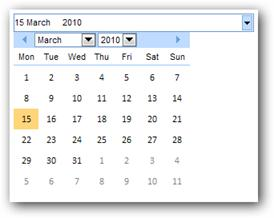
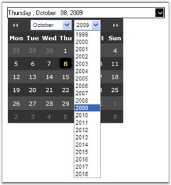
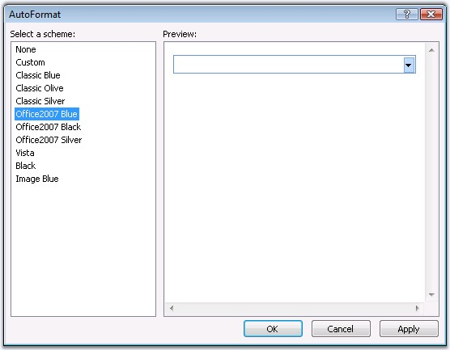
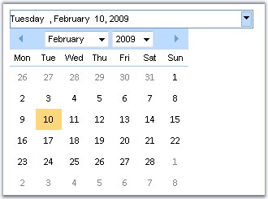
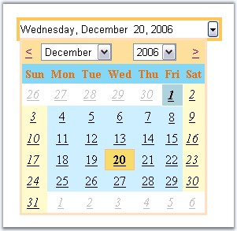

::: {style="DISPLAY: none"}
{#d2h_url_template}{#d2h_package_url style="WIDTH: 0px; DISPLAY: none; HEIGHT: 0px"}
:::

:::::::::::::::::::::::::: {.d2h_secondary_topic style="PADDING-BOTTOM: 10pt; MARGIN: 0pt; PADDING-LEFT: 0pt; PADDING-RIGHT: 0pt; PADDING-TOP: 0pt"}
##### Concepts and Features {#concepts-and-features style="tab-stops: 0pt"}

 

This section discusses the various features of the DropDownCalendarControl. It includes the following topics:

###### 5.1.2.3.2.1 Behavior Settings {#behavior-settings style="tab-stops: 0pt"}

[]{style="FONT-FAMILY: 'Trebuchet MS','sans-serif'; COLOR: #15428b; FONT-SIZE: 9pt"} 

Aligning the control\'s value

[]{style="FONT-FAMILY: 'Trebuchet MS','sans-serif'; COLOR: #15428b; FONT-SIZE: 9pt"} 

The value of the calendar control inside the textbox can be aligned accordingly by setting the **TextAlignment** to the required option.

[]{style="FONT-FAMILY: 'Trebuchet MS','sans-serif'; COLOR: #15428b; FONT-SIZE: 9pt"} 

::: {align="center"}
+-----------------------------------+---------------------------------------------------------------------------------------------------+
|                                   |                                                                                                   |
|                                   |                                                                                                   |
| Property                          | Description                                                                                       |
+-----------------------------------+---------------------------------------------------------------------------------------------------+
| TextAlignment                     | Specifies the alignment of the value. Default value is Left. The options included are as follows: |
|                                   |                                                                                                   |
|                                   | [·      ]{style="FONT-FAMILY: Symbol"}Left                                                        |
|                                   |                                                                                                   |
|                                   | [·      ]{style="FONT-FAMILY: Symbol"}Right                                                       |
|                                   |                                                                                                   |
|                                   | [·      ]{style="FONT-FAMILY: Symbol"}Center                                                      |
|                                   |                                                                                                   |
|                                   | [·      ]{style="FONT-FAMILY: Symbol"}Justify                                                     |
+-----------------------------------+---------------------------------------------------------------------------------------------------+
:::

[]{style="FONT-FAMILY: 'Trebuchet MS','sans-serif'; COLOR: #15428b; FONT-SIZE: 9pt"} 

Programmatically the alignment can be set as follows.

[]{style="FONT-FAMILY: 'Trebuchet MS','sans-serif'; COLOR: #15428b; FONT-SIZE: 9pt"} 

+----------------------------------------------------------------------------------------------------------------------------------------------------------+
| **[\[C#\]]{style="FONT-FAMILY: 'Courier New'; FONT-SIZE: 9pt"}**                                                                                         |
|                                                                                                                                                          |
| []{style="FONT-FAMILY: 'Courier New'; COLOR: blue; FONT-SIZE: 9pt"}                                                                                      |
|                                                                                                                                                          |
| [DropDownCalendarControl1.TextAlignment = Syncfusion.Web.UI.[TextAlign]{style="COLOR: teal"}.Right;]{style="FONT-FAMILY: 'Courier New'; FONT-SIZE: 9pt"} |
+----------------------------------------------------------------------------------------------------------------------------------------------------------+

[]{style="FONT-FAMILY: 'Trebuchet MS','sans-serif'; COLOR: #15428b; FONT-SIZE: 9pt"} 

+-------------------------------------------------------------------------------------------------------------------------------------------------------------------------------------------------------------+
| **[\[VB\]]{style="FONT-FAMILY: 'Courier New'; FONT-SIZE: 9pt"}**                                                                                                                                            |
|                                                                                                                                                                                                             |
| []{style="FONT-FAMILY: 'Courier New'; COLOR: blue; FONT-SIZE: 9pt"}                                                                                                                                         |
|                                                                                                                                                                                                             |
| [Private]{style="FONT-FAMILY: 'Courier New'; COLOR: blue; FONT-SIZE: 9pt"}[ DropDownCalendarControl1.TextAlignment = Syncfusion.Web.UI.TextAlign.Right]{style="FONT-FAMILY: 'Courier New'; FONT-SIZE: 9pt"} |
+-------------------------------------------------------------------------------------------------------------------------------------------------------------------------------------------------------------+

[]{style="FONT-FAMILY: 'Trebuchet MS','sans-serif'; COLOR: #15428b; FONT-SIZE: 9pt"} 

Button Settings

[]{style="FONT-FAMILY: 'Trebuchet MS','sans-serif'; COLOR: #15428b; FONT-SIZE: 9pt"} 

Custom images can be set for the control that responds to user click action and drops down and displays the calendar. The default drop-down button can be replaced by setting the **DropDownElementType** to **Image**, and by providing the path of the image to the **DropDownImgSrc** property.

[]{style="FONT-FAMILY: 'Trebuchet MS','sans-serif'; COLOR: #15428b; FONT-SIZE: 9pt"} 

::: {align="center"}
+-----------------------------------+----------------------------------------------------------------------------------------------------------------------------------------------+
| Property                          | Description                                                                                                                                  |
+-----------------------------------+----------------------------------------------------------------------------------------------------------------------------------------------+
| DropDownElementType               | Specifies whether to display drop down button for calendar as button or image. Default value is Button. The options included are as follows. |
|                                   |                                                                                                                                              |
|                                   |                                                                                                                                              |
|                                   |                                                                                                                                              |
|                                   | [·      ]{style="FONT-FAMILY: Symbol"}*Button*                                                                                               |
|                                   |                                                                                                                                              |
|                                   | [·      ]{style="FONT-FAMILY: Symbol"}*Image*                                                                                                |
+-----------------------------------+----------------------------------------------------------------------------------------------------------------------------------------------+
| DropDownImgSrc                    | Specifies the full path of the image to be displayed as the drop down button, which on clicking displays the calendar.                       |
+-----------------------------------+----------------------------------------------------------------------------------------------------------------------------------------------+
:::

[]{style="FONT-FAMILY: 'Trebuchet MS','sans-serif'; COLOR: #15428b; FONT-SIZE: 9pt"} 

Null Date and Value Settings

[]{style="FONT-FAMILY: 'Trebuchet MS','sans-serif'; COLOR: #15428b; FONT-SIZE: 9pt"} 

The control can be enabled to accept null/empty values by setting the **EnableNullDate** property.

Assigning some text to the **NullString** property, displays that string, when no date is selected.

To display some text in the control by default, instead of displaying the current date, **IsNullDate** can be enabled and the text to be displayed has to be set to NullString property. If no text is set, then no value will be displayed, in the control, initially.

By setting **EnableNullKeys**, when BACKSPACE or DELETE key is pressed, null value or text string can be displayed, when the focus is on the control.

**[]{style="FONT-FAMILY: 'Trebuchet MS','sans-serif'; COLOR: #15428b; FONT-SIZE: 9pt"}** 

::: {align="center"}
  ---------------- ---------------------------------------------------------------------------------------------------------------------------------
  Property         Description
  EnableNullDate   Gets / sets the boolean value whether to enable null value. Default value is False.
  EnableNullKeys   Gets / sets the boolean value whether to reset the date to null when BACKSPACE or DELETE keys are used. Default value is False.
  IsNullDate       Gets / sets the boolean value to indicate if no date is selected. Default value is False.
  NullString       Specifies the text to display when no date is selected.
  ---------------- ---------------------------------------------------------------------------------------------------------------------------------
:::

[]{style="FONT-FAMILY: 'Trebuchet MS','sans-serif'; COLOR: #15428b; FONT-SIZE: 9pt"} 

Programmatically the null string settings can be specified as follows.

[]{style="FONT-FAMILY: 'Trebuchet MS','sans-serif'; COLOR: #15428b; FONT-SIZE: 9pt"} 

+--------------------------------------------------------------------------------------------------------------------------------------------------------+
| **[\[C#\]]{style="FONT-FAMILY: 'Courier New'; FONT-SIZE: 9pt"}**                                                                                       |
|                                                                                                                                                        |
| []{style="FONT-FAMILY: 'Courier New'; COLOR: blue; FONT-SIZE: 9pt"}                                                                                    |
|                                                                                                                                                        |
| [DropDownCalendarControl1.EnableNullDate = [true]{style="COLOR: blue"};]{style="FONT-FAMILY: 'Courier New'; FONT-SIZE: 9pt"}                           |
|                                                                                                                                                        |
| [DropDownCalendarControl1.EnableNullKeys = [true]{style="COLOR: blue"};]{style="FONT-FAMILY: 'Courier New'; FONT-SIZE: 9pt"}                           |
|                                                                                                                                                        |
| [DropDownCalendarControl1.NullString = [\"Select a date - not optional\"]{style="COLOR: maroon"};]{style="FONT-FAMILY: 'Courier New'; FONT-SIZE: 9pt"} |
|                                                                                                                                                        |
| [DropDownCalendarControl1.IsNullDate = [true]{style="COLOR: blue"};]{style="FONT-FAMILY: 'Courier New'; FONT-SIZE: 9pt"}                               |
+--------------------------------------------------------------------------------------------------------------------------------------------------------+

[]{style="FONT-FAMILY: 'Trebuchet MS','sans-serif'; COLOR: #15428b; FONT-SIZE: 9pt"} 

+----------------------------------------------------------------------------------------------------------------------------------------------------------------------------------------------------------------------------------+
| **[\[VB\]]{style="FONT-FAMILY: 'Courier New'; FONT-SIZE: 9pt"}**                                                                                                                                                                 |
|                                                                                                                                                                                                                                  |
| []{style="FONT-FAMILY: 'Courier New'; COLOR: blue; FONT-SIZE: 9pt"}                                                                                                                                                              |
|                                                                                                                                                                                                                                  |
| [Private]{style="FONT-FAMILY: 'Courier New'; COLOR: blue; FONT-SIZE: 9pt"}[ DropDownCalendarControl1.EnableNullDate = [True]{style="COLOR: blue"}]{style="FONT-FAMILY: 'Courier New'; FONT-SIZE: 9pt"}                           |
|                                                                                                                                                                                                                                  |
| [Private]{style="FONT-FAMILY: 'Courier New'; COLOR: blue; FONT-SIZE: 9pt"}[ DropDownCalendarControl1.EnableNullKeys = [True]{style="COLOR: blue"}]{style="FONT-FAMILY: 'Courier New'; FONT-SIZE: 9pt"}                           |
|                                                                                                                                                                                                                                  |
| [Private]{style="FONT-FAMILY: 'Courier New'; COLOR: blue; FONT-SIZE: 9pt"}[ DropDownCalendarControl1.NullString = [\"Select a date - not optional\"]{style="COLOR: maroon"}]{style="FONT-FAMILY: 'Courier New'; FONT-SIZE: 9pt"} |
|                                                                                                                                                                                                                                  |
| [Private]{style="FONT-FAMILY: 'Courier New'; COLOR: blue; FONT-SIZE: 9pt"}[ DropDownCalendarControl1.IsNullDate = [True]{style="COLOR: blue"}]{style="FONT-FAMILY: 'Courier New'; FONT-SIZE: 9pt"}                               |
+----------------------------------------------------------------------------------------------------------------------------------------------------------------------------------------------------------------------------------+

[]{style="FONT-FAMILY: 'Trebuchet MS','sans-serif'; COLOR: #15428b; FONT-SIZE: 9pt"} 

Setting Start and End dates

[]{style="FONT-FAMILY: 'Trebuchet MS','sans-serif'; COLOR: #15428b; FONT-SIZE: 9pt"} 

The start and end dates can be specified, such that values can be selected only between those dates by setting the **MaxVaue** and the **MinValue** properties. The default MaxValue is **12/31/2099** and the default MinValue is **1/1/1900**.

[]{style="FONT-FAMILY: 'Trebuchet MS','sans-serif'; COLOR: #15428b; FONT-SIZE: 9pt"} 

::: {align="center"}
+-----------------------------------+-------------------------------------------------------+
|                                   |                                                       |
|                                   |                                                       |
| Property                          | Description                                           |
+-----------------------------------+-------------------------------------------------------+
| MaxValue                          | Specifies the maximum value displayed by the control. |
+-----------------------------------+-------------------------------------------------------+
| MinValue                          | Specifies the minimum value displayed by the control. |
+-----------------------------------+-------------------------------------------------------+
:::

[]{style="FONT-FAMILY: 'Trebuchet MS','sans-serif'; COLOR: #15428b; FONT-SIZE: 9pt"} 

Programmatically the min and max dates can be set as follows.

[]{style="FONT-FAMILY: 'Trebuchet MS','sans-serif'; COLOR: #15428b; FONT-SIZE: 9pt"} 

+--------------------------------------------------------------------------------------------------------------------------------------------------------------------+
| **[\[C#\]]{style="FONT-FAMILY: 'Courier New'; FONT-SIZE: 9pt"}**                                                                                                   |
|                                                                                                                                                                    |
| []{style="FONT-FAMILY: 'Courier New'; COLOR: blue; FONT-SIZE: 9pt"}                                                                                                |
|                                                                                                                                                                    |
| [DropDownCalendarControl1.MaxValue = [new]{style="COLOR: blue"} [DateTime]{style="COLOR: teal"}(2007, 12, 1);]{style="FONT-FAMILY: 'Courier New'; FONT-SIZE: 9pt"} |
|                                                                                                                                                                    |
| [DropDownCalendarControl1.MinValue = [new]{style="COLOR: blue"} [DateTime]{style="COLOR: teal"}(2007, 1, 1);]{style="FONT-FAMILY: 'Courier New'; FONT-SIZE: 9pt"}  |
+--------------------------------------------------------------------------------------------------------------------------------------------------------------------+

[]{style="FONT-FAMILY: 'Trebuchet MS','sans-serif'; COLOR: #15428b; FONT-SIZE: 9pt"} 

+-----------------------------------------------------------------------------------------------------------------------------------------------------------------------------------------------------------------------+
| **[\[VB\]]{style="FONT-FAMILY: 'Courier New'; FONT-SIZE: 9pt"}**                                                                                                                                                      |
|                                                                                                                                                                                                                       |
| []{style="FONT-FAMILY: 'Courier New'; COLOR: blue; FONT-SIZE: 9pt"}                                                                                                                                                   |
|                                                                                                                                                                                                                       |
| [Private]{style="FONT-FAMILY: 'Courier New'; COLOR: blue; FONT-SIZE: 9pt"}[ DropDownCalendarControl1.MaxValue = [New]{style="COLOR: blue"} DateTime(2007, 12, 1)]{style="FONT-FAMILY: 'Courier New'; FONT-SIZE: 9pt"} |
|                                                                                                                                                                                                                       |
| [Private]{style="FONT-FAMILY: 'Courier New'; COLOR: blue; FONT-SIZE: 9pt"}[ DropDownCalendarControl1.MinValue = [New]{style="COLOR: blue"} DateTime(2007, 1, 1)]{style="FONT-FAMILY: 'Courier New'; FONT-SIZE: 9pt"}  |
+-----------------------------------------------------------------------------------------------------------------------------------------------------------------------------------------------------------------------+

[]{style="FONT-FAMILY: 'Trebuchet MS','sans-serif'; COLOR: #15428b; FONT-SIZE: 9pt"} 

Indicating error values

[]{style="FONT-FAMILY: 'Trebuchet MS','sans-serif'; COLOR: #15428b; FONT-SIZE: 9pt"} 

Back and fore colors can be applied to indicate the error values, i.e., values beyond the min and max values, by setting the **ErrorBackColor** and **ErrorForeColor** properties.

[]{style="FONT-FAMILY: 'Trebuchet MS','sans-serif'; COLOR: #15428b; FONT-SIZE: 9pt"} 

::: {align="center"}
  ---------------- ----------------------------------------------------------------------------
  Property         Description
  ErrorBackColor   Specifies the back color to use to indicate the date or time is not valid.
  ErrorForeColor   Specifies the fore color to use to indicate that the input is not valid.
  ---------------- ----------------------------------------------------------------------------
:::

[]{style="FONT-FAMILY: 'Trebuchet MS','sans-serif'; COLOR: #15428b; FONT-SIZE: 9pt"} 

Programmatically the error colors can be set as follows.

[]{style="FONT-FAMILY: 'Trebuchet MS','sans-serif'; COLOR: #15428b; FONT-SIZE: 9pt"} 

+-------------------------------------------------------------------------------------------------------------------------------------------------------------+
| **[\[C#\]]{style="FONT-FAMILY: 'Courier New'; FONT-SIZE: 9pt"}**                                                                                            |
|                                                                                                                                                             |
| []{style="FONT-FAMILY: 'Courier New'; COLOR: blue; FONT-SIZE: 9pt"}                                                                                         |
|                                                                                                                                                             |
| [DropDownCalendarControl1.ErrorBackColor = System.Drawing.[Color]{style="COLOR: teal"}.BlanchedAlmond;]{style="FONT-FAMILY: 'Courier New'; FONT-SIZE: 9pt"} |
|                                                                                                                                                             |
| [DropDownCalendarControl1.ErrorForeColor = System.Drawing.[Color]{style="COLOR: teal"}.CadetBlue;]{style="FONT-FAMILY: 'Courier New'; FONT-SIZE: 9pt"}      |
+-------------------------------------------------------------------------------------------------------------------------------------------------------------+

[]{style="FONT-FAMILY: 'Trebuchet MS','sans-serif'; COLOR: #15428b; FONT-SIZE: 9pt"} 

+----------------------------------------------------------------------------------------------------------------------------------------------------------------------------------------------------------------+
| **[\[VB\]]{style="FONT-FAMILY: 'Courier New'; FONT-SIZE: 9pt"}**                                                                                                                                               |
|                                                                                                                                                                                                                |
| []{style="FONT-FAMILY: 'Courier New'; COLOR: blue; FONT-SIZE: 9pt"}                                                                                                                                            |
|                                                                                                                                                                                                                |
| [Private]{style="FONT-FAMILY: 'Courier New'; COLOR: blue; FONT-SIZE: 9pt"}[ DropDownCalendarControl1.ErrorBackColor = System.Drawing.Color.BlanchedAlmond]{style="FONT-FAMILY: 'Courier New'; FONT-SIZE: 9pt"} |
|                                                                                                                                                                                                                |
| [Private]{style="FONT-FAMILY: 'Courier New'; COLOR: blue; FONT-SIZE: 9pt"}[ DropDownCalendarControl1.ErrorForeColor = System.Drawing.Color.CadetBlue]{style="FONT-FAMILY: 'Courier New'; FONT-SIZE: 9pt"}      |
+----------------------------------------------------------------------------------------------------------------------------------------------------------------------------------------------------------------+

[]{style="FONT-FAMILY: 'Trebuchet MS','sans-serif'; COLOR: #15428b; FONT-SIZE: 9pt"} 

When **SpaceSymbol** is set, the unoccupied spaces for the date, day, month, year and time will be replaced with that symbol. By default, the value is a single white space.

[]{style="FONT-FAMILY: 'Trebuchet MS','sans-serif'; COLOR: #15428b; FONT-SIZE: 9pt"} 

::: {align="center"}
  ------------- ------------------------------------------------------------------------------
  Property      Description
  SpaceSymbol   Specifies the symbol to use for filling the extra spaces of date time value.
  ------------- ------------------------------------------------------------------------------
:::

[]{style="FONT-FAMILY: 'Trebuchet MS','sans-serif'; COLOR: #15428b; FONT-SIZE: 9pt"} 

Programmatically the space symbol can be set as follows.

[]{style="FONT-FAMILY: 'Trebuchet MS','sans-serif'; COLOR: #15428b; FONT-SIZE: 9pt"} 

+-------------------------------------------------------------------------------------------------------------------------------+
| **[\[C#\]]{style="FONT-FAMILY: 'Courier New'; FONT-SIZE: 9pt"}**                                                              |
|                                                                                                                               |
| []{style="FONT-FAMILY: 'Courier New'; COLOR: blue; FONT-SIZE: 9pt"}                                                           |
|                                                                                                                               |
| [DropDownCalendarControl1.SpaceSymbol = [\'\*\']{style="COLOR: maroon"};]{style="FONT-FAMILY: 'Courier New'; FONT-SIZE: 9pt"} |
+-------------------------------------------------------------------------------------------------------------------------------+

[]{style="FONT-FAMILY: 'Trebuchet MS','sans-serif'; COLOR: #15428b; FONT-SIZE: 9pt"} 

+----------------------------------------------------------------------------------------------------------------------------------------------------------------------------------------------------------+
| **[\[VB\]]{style="FONT-FAMILY: 'Courier New'; FONT-SIZE: 9pt"}**                                                                                                                                         |
|                                                                                                                                                                                                          |
| []{style="FONT-FAMILY: 'Courier New'; COLOR: blue; FONT-SIZE: 9pt"}                                                                                                                                      |
|                                                                                                                                                                                                          |
| [Private ]{style="FONT-FAMILY: 'Courier New'; COLOR: blue; FONT-SIZE: 9pt"}[DropDownCalendarControl1.SpaceSymbol = [\"\*\"c]{style="COLOR: maroon"}]{style="FONT-FAMILY: 'Courier New'; FONT-SIZE: 9pt"} |
+----------------------------------------------------------------------------------------------------------------------------------------------------------------------------------------------------------+

[]{style="FONT-FAMILY: 'Trebuchet MS','sans-serif'; COLOR: black; FONT-SIZE: 9pt"} 

RightToLeft property

[]{style="FONT-FAMILY: 'Trebuchet MS','sans-serif'; COLOR: #15428b; FONT-SIZE: 9pt"} 

You can align the elements of the DropDownCalendarControl using this property.

[]{style="FONT-FAMILY: 'Trebuchet MS','sans-serif'; COLOR: #15428b; FONT-SIZE: 9pt"} 

::: {align="center"}
+-----------------------------------+------------------------------------------------------------------------------------------------------------------------------+
|                                   |                                                                                                                              |
|                                   |                                                                                                                              |
| Property                          | Description                                                                                                                  |
+-----------------------------------+------------------------------------------------------------------------------------------------------------------------------+
| RightToLeft                       | Gets / sets a value indicating whether the elements of the control are aligned to support locales using right-to-left fonts. |
+-----------------------------------+------------------------------------------------------------------------------------------------------------------------------+
:::

[]{style="FONT-FAMILY: 'Trebuchet MS','sans-serif'; COLOR: #15428b; FONT-SIZE: 9pt"} 

+---------------------------------------------------------------------------------------------------------------------------+
| **[\[C#\]]{style="FONT-FAMILY: 'Courier New'"}**                                                                          |
|                                                                                                                           |
| []{style="FONT-FAMILY: 'Courier New'; COLOR: blue; FONT-SIZE: 9pt"}                                                       |
|                                                                                                                           |
| [DropDownCalendarControl1.RightToLeft = [true]{style="COLOR: blue"};]{style="FONT-FAMILY: 'Courier New'; FONT-SIZE: 9pt"} |
+---------------------------------------------------------------------------------------------------------------------------+

[]{style="FONT-FAMILY: 'Trebuchet MS','sans-serif'; COLOR: #15428b; FONT-SIZE: 9pt"} 

+-----------------------------------------------------------------------------------------------------------------------------------------------------------------------------------------------------+
| **[\[VB\]]{style="FONT-FAMILY: 'Courier New'"}**                                                                                                                                                    |
|                                                                                                                                                                                                     |
| []{style="FONT-FAMILY: 'Courier New'; COLOR: blue; FONT-SIZE: 9pt"}                                                                                                                                 |
|                                                                                                                                                                                                     |
| [Private]{style="FONT-FAMILY: 'Courier New'; COLOR: blue; FONT-SIZE: 9pt"}[ DropDownCalendarControl1.RightToLeft = [True]{style="COLOR: blue"}]{style="FONT-FAMILY: 'Courier New'; FONT-SIZE: 9pt"} |
+-----------------------------------------------------------------------------------------------------------------------------------------------------------------------------------------------------+

 

 

{border="0"}

Figure 54: Elements of the DropDownCalendarControl is aligned to Left

 

###### 5.1.2.3.2.2 Display Setting for Year Combo {#display-setting-for-year-combo style="tab-stops: 0pt"}

[]{style="FONT-FAMILY: 'Trebuchet MS','sans-serif'; COLOR: #15428b; FONT-SIZE: 9pt"} 

Number of years to be displayed in the drop-down can be customized by setting the appropriate value to the **YearsCount** property.

[]{style="FONT-FAMILY: 'Trebuchet MS','sans-serif'; COLOR: #15428b; FONT-SIZE: 9pt"} 

::: {align="center"}
  ------------ ------------------------------------------------------------------------------------------------------------
  Property     Description
  YearsCount   Specifies the number of years to be displayed in the year drop down combo of the DropDownCalendar control.
  ------------ ------------------------------------------------------------------------------------------------------------
:::

[]{style="FONT-FAMILY: 'Trebuchet MS','sans-serif'; COLOR: #15428b; FONT-SIZE: 9pt"} 

The following code snippet illustrates setting of 20 years in the drop-down. For example: From the year 1999-2018.

[]{style="FONT-FAMILY: 'Trebuchet MS','sans-serif'; COLOR: #15428b; FONT-SIZE: 9pt"} 

+------------------------------------------------------------------------------------------------------------------------------------------------------------------------------------------------------------------------------------------------------------------------------------------------------------------------------------------------------------------------------------------------------------------------------------------------------------------------------------------------------------------------------------------------------------------------------------------+
| **[\[ASPX\]]{style="FONT-FAMILY: 'Courier New'; FONT-SIZE: 9pt"}**                                                                                                                                                                                                                                                                                                                                                                                                                                                                                                                       |
|                                                                                                                                                                                                                                                                                                                                                                                                                                                                                                                                                                                          |
| []{style="FONT-FAMILY: 'Courier New'; FONT-SIZE: 9pt"}                                                                                                                                                                                                                                                                                                                                                                                                                                                                                                                                   |
|                                                                                                                                                                                                                                                                                                                                                                                                                                                                                                                                                                                          |
| [\<]{style="FONT-FAMILY: 'Courier New'; COLOR: blue; FONT-SIZE: 9pt"}[syncfusion]{style="FONT-FAMILY: 'Courier New'; COLOR: #a31515; FONT-SIZE: 9pt"}[:]{style="FONT-FAMILY: 'Courier New'; COLOR: blue; FONT-SIZE: 9pt"}[DropDownCalendarControl]{style="FONT-FAMILY: 'Courier New'; COLOR: #a31515; FONT-SIZE: 9pt"}[ [ID]{style="COLOR: red"}[=\"DropDownCalendarControl1\"]{style="COLOR: blue"} [runat]{style="COLOR: red"}[=\"server\"]{style="COLOR: blue"} [YearsCount]{style="COLOR: red"}[=\"20\"\>]{style="COLOR: blue"}]{style="FONT-FAMILY: 'Courier New'; FONT-SIZE: 9pt"} |
|                                                                                                                                                                                                                                                                                                                                                                                                                                                                                                                                                                                          |
| [\</]{style="FONT-FAMILY: 'Courier New'; COLOR: blue; FONT-SIZE: 9pt"}[syncfusion]{style="FONT-FAMILY: 'Courier New'; COLOR: #a31515; FONT-SIZE: 9pt"}[:]{style="FONT-FAMILY: 'Courier New'; COLOR: blue; FONT-SIZE: 9pt"}[DropDownCalendarControl]{style="FONT-FAMILY: 'Courier New'; COLOR: #a31515; FONT-SIZE: 9pt"}[\>]{style="FONT-FAMILY: 'Courier New'; COLOR: blue; FONT-SIZE: 9pt"}                                                                                                                                                                                             |
+------------------------------------------------------------------------------------------------------------------------------------------------------------------------------------------------------------------------------------------------------------------------------------------------------------------------------------------------------------------------------------------------------------------------------------------------------------------------------------------------------------------------------------------------------------------------------------------+

[]{style="FONT-FAMILY: 'Trebuchet MS','sans-serif'; COLOR: #15428b; FONT-SIZE: 9pt"} 

+-------------------------------------------------------------------------------------------------+
| **[\[C#\]]{style="FONT-FAMILY: 'Courier New'; FONT-SIZE: 9pt"}**                                |
|                                                                                                 |
| **[]{style="FONT-FAMILY: 'Courier New'; FONT-SIZE: 9pt"}**                                      |
|                                                                                                 |
| [DropDownCalendarControl1.YearsCount = 20;]{style="FONT-FAMILY: 'Courier New'; FONT-SIZE: 9pt"} |
+-------------------------------------------------------------------------------------------------+

[]{style="FONT-FAMILY: 'Trebuchet MS','sans-serif'; COLOR: #15428b; FONT-SIZE: 9pt"} 

+---------------------------------------------------------------------------------------------------------------------------------------------------------------------------+
| **[\[VB.NET\]]{style="FONT-FAMILY: 'Courier New'; FONT-SIZE: 9pt"}**                                                                                                      |
|                                                                                                                                                                           |
| **[]{style="FONT-FAMILY: 'Courier New'; FONT-SIZE: 9pt"}**                                                                                                                |
|                                                                                                                                                                           |
| [Private]{style="FONT-FAMILY: 'Courier New'; COLOR: blue; FONT-SIZE: 9pt"}[ DropDownCalendarControl1.YearsCount = 20]{style="FONT-FAMILY: 'Courier New'; FONT-SIZE: 9pt"} |
+---------------------------------------------------------------------------------------------------------------------------------------------------------------------------+

[]{style="FONT-FAMILY: 'Trebuchet MS','sans-serif'; COLOR: #15428b; FONT-SIZE: 9pt"} 

{border="0"}

***[]{style="FONT-FAMILY: 'Trebuchet MS','sans-serif'; COLOR: #15428b; FONT-SIZE: 9pt"}*** 

Figure 55: YearsCount = \"20\"

 

###### 5.1.2.3.2.3 Date and Time Format {#date-and-time-format style="tab-stops: 0pt"}

[]{style="FONT-FAMILY: 'Trebuchet MS','sans-serif'; COLOR: #15428b; FONT-SIZE: 9pt"} 

The control offers various pre-defined formats, in which the date-time values can be displayed, by setting the required option to the **Format** property.

[]{style="FONT-FAMILY: 'Trebuchet MS','sans-serif'; COLOR: #15428b; FONT-SIZE: 9pt"} 

::: {align="center"}
+-----------------------------------+--------------------------------------------------------------------------------------+
| Property                          | Description                                                                          |
+-----------------------------------+--------------------------------------------------------------------------------------+
| Format                            | Represents the date-time format of the control. The options included are as follows: |
|                                   |                                                                                      |
|                                   | [·      ]{style="FONT-FAMILY: Symbol"}Long                                           |
|                                   |                                                                                      |
|                                   | [·      ]{style="FONT-FAMILY: Symbol"}Short                                          |
|                                   |                                                                                      |
|                                   | [·      ]{style="FONT-FAMILY: Symbol"}Time                                           |
|                                   |                                                                                      |
|                                   | [·      ]{style="FONT-FAMILY: Symbol"}CustomChar                                     |
|                                   |                                                                                      |
|                                   | [·      ]{style="FONT-FAMILY: Symbol"}CustomString                                   |
+-----------------------------------+--------------------------------------------------------------------------------------+
:::

[]{style="FONT-FAMILY: 'Trebuchet MS','sans-serif'; COLOR: #15428b; FONT-SIZE: 9pt"} 

When Format property is set to **CustomChar**, the values set for the **CustomFormatChar** property will be inherited and the date-time will be displayed in that format.

[]{style="FONT-FAMILY: 'Trebuchet MS','sans-serif'; COLOR: #15428b; FONT-SIZE: 9pt"} 

::: {align="center"}
  ------------------ ---------------------------------------------------------------------------------------------------------
  Property           Description
  CustomFormatChar   Specifies the date-time format type. The various values that can be set are \'D, F, G, M, R, S and Y\'.
  ------------------ ---------------------------------------------------------------------------------------------------------
:::

[]{style="FONT-FAMILY: 'Trebuchet MS','sans-serif'; COLOR: #15428b; FONT-SIZE: 9pt"} 

Programmatically the property can be set as follows.

[]{style="FONT-FAMILY: 'Trebuchet MS','sans-serif'; COLOR: #15428b; FONT-SIZE: 9pt"} 

+-----------------------------------------------------------------------------------------------------------------------------------------------+
| **[\[C#\]]{style="FONT-FAMILY: 'Courier New'; FONT-SIZE: 9pt"}**                                                                              |
|                                                                                                                                               |
| []{style="FONT-FAMILY: 'Courier New'; COLOR: blue; FONT-SIZE: 9pt"}                                                                           |
|                                                                                                                                               |
| [DropDownCalendarControl1.Format = [DateTimeFormatType]{style="COLOR: teal"}.CustomChar;]{style="FONT-FAMILY: 'Courier New'; FONT-SIZE: 9pt"} |
|                                                                                                                                               |
| [DropDownCalendarControl1.CustomFormatChar = [\'M\']{style="COLOR: maroon"};]{style="FONT-FAMILY: 'Courier New'; FONT-SIZE: 9pt"}             |
+-----------------------------------------------------------------------------------------------------------------------------------------------+

[]{style="FONT-FAMILY: 'Trebuchet MS','sans-serif'; COLOR: #15428b; FONT-SIZE: 9pt"} 

+--------------------------------------------------------------------------------------------------------------------------------------------------------------------------------------------------------------+
| **[\[VB\]]{style="FONT-FAMILY: 'Courier New'; FONT-SIZE: 9pt"}**                                                                                                                                             |
|                                                                                                                                                                                                              |
| []{style="FONT-FAMILY: 'Courier New'; COLOR: blue; FONT-SIZE: 9pt"}                                                                                                                                          |
|                                                                                                                                                                                                              |
| [Private]{style="FONT-FAMILY: 'Courier New'; COLOR: blue; FONT-SIZE: 9pt"}[ DropDownCalendarControl1.Format = DateTimeFormatType.CustomChar]{style="FONT-FAMILY: 'Courier New'; FONT-SIZE: 9pt"}             |
|                                                                                                                                                                                                              |
| [Private]{style="FONT-FAMILY: 'Courier New'; COLOR: blue; FONT-SIZE: 9pt"}[ DropDownCalendarControl1.CustomFormatChar = [\"M\"]{style="COLOR: maroon"}c]{style="FONT-FAMILY: 'Courier New'; FONT-SIZE: 9pt"} |
+--------------------------------------------------------------------------------------------------------------------------------------------------------------------------------------------------------------+

[]{style="FONT-FAMILY: 'Trebuchet MS','sans-serif'; COLOR: #15428b; FONT-SIZE: 9pt"} 

::: {align="center"}
  -------------------------- --------------------------------------------------------------------------------------------------------------------------------
           Property          Description
  CustomFormat               Specifies the date format when Format property of DropDownCalendarControl is set to CustomString. For eg: dd/mm/yyyy hh:mm:ss.
  -------------------------- --------------------------------------------------------------------------------------------------------------------------------
:::

 

###### 5.1.2.3.2.4 Culture Settings {#culture-settings style="tab-stops: 0pt"}

[]{style="FONT-FAMILY: 'Trebuchet MS','sans-serif'; COLOR: #15428b; FONT-SIZE: 9pt"} 

The culture information can be obtained either from the data posted by the browser (By setting the FromClient option) else from the web-server hosting page (By setting the FromServer option) or the user can define the culture settings.

The drop down calendar control allows you to override the default culture information (AM/PM Designator, Time/Date Separator, GroupSeparator, GroupSizes, NegativeSign and CurrencySymbol properties) when the **CultureSource** property is set to **UserOverride**.

[]{style="FONT-FAMILY: 'Trebuchet MS','sans-serif'; COLOR: #15428b; FONT-SIZE: 9pt"} 

::: {align="center"}
+-----------------------------------+---------------------------------------------------------------------------------------------------------+
| Property                          | Description                                                                                             |
+-----------------------------------+---------------------------------------------------------------------------------------------------------+
| CultureSource                     | Specifies the current culture for the control. The values included are as follows:                      |
|                                   |                                                                                                         |
|                                   | [·      ]{style="FONT-FAMILY: Symbol"}*FromClient*: culture is obtained from the data posted by browser |
|                                   |                                                                                                         |
|                                   | [·      ]{style="FONT-FAMILY: Symbol"}*FromServer*: culture is obtained from web-server hosting page    |
|                                   |                                                                                                         |
|                                   | [·      ]{style="FONT-FAMILY: Symbol"}*UserOverride*: user-defined culture                              |
+-----------------------------------+---------------------------------------------------------------------------------------------------------+
:::

[]{style="FONT-FAMILY: 'Trebuchet MS','sans-serif'; COLOR: #15428b; FONT-SIZE: 9pt"} 

Globalization

[]{style="FONT-FAMILY: 'Trebuchet MS','sans-serif'; COLOR: #15428b; FONT-SIZE: 9pt"} 

**UserOvrrideCulture** allows you to set the required culture to represent the value to the specific requirement whose default value is **English(United States)**.

[]{style="FONT-FAMILY: 'Trebuchet MS','sans-serif'; COLOR: #15428b; FONT-SIZE: 9pt"} 

::: {align="center"}
  --------------------- -------------------------------------------
  Property              Description
  UserOverrideCulture   Specifies the various cultures supported.
  --------------------- -------------------------------------------
:::

[]{style="FONT-FAMILY: 'Trebuchet MS','sans-serif'; COLOR: #15428b; FONT-SIZE: 9pt"} 

Programmatically UserOverrideCulture can be set as follows.

[]{style="FONT-FAMILY: 'Trebuchet MS','sans-serif'; COLOR: #15428b; FONT-SIZE: 9pt"} 

+-------------------------------------------------------------------------------------------------------------------------------------------------------+
| **[\[C#\]]{style="FONT-FAMILY: 'Courier New'; FONT-SIZE: 9pt"}**                                                                                      |
|                                                                                                                                                       |
| []{style="FONT-FAMILY: 'Courier New'; COLOR: blue; FONT-SIZE: 9pt"}                                                                                   |
|                                                                                                                                                       |
| [DropDownCalendarControl1.CultureSource = [CultureSourceType]{style="COLOR: teal"}.UserOverride;]{style="FONT-FAMILY: 'Courier New'; FONT-SIZE: 9pt"} |
+-------------------------------------------------------------------------------------------------------------------------------------------------------+

[]{style="FONT-FAMILY: 'Trebuchet MS','sans-serif'; COLOR: #15428b; FONT-SIZE: 9pt"} 

+----------------------------------------------------------------------------------------------------------------------------------------------------------------------------------------------------------+
| **[\[VB\]]{style="FONT-FAMILY: 'Courier New'; FONT-SIZE: 9pt"}**                                                                                                                                         |
|                                                                                                                                                                                                          |
| []{style="FONT-FAMILY: 'Courier New'; COLOR: blue; FONT-SIZE: 9pt"}                                                                                                                                      |
|                                                                                                                                                                                                          |
| [Private]{style="FONT-FAMILY: 'Courier New'; COLOR: blue; FONT-SIZE: 9pt"}[ DropDownCalendarControl1.CultureSource = CultureSourceType.UserOverride]{style="FONT-FAMILY: 'Courier New'; FONT-SIZE: 9pt"} |
+----------------------------------------------------------------------------------------------------------------------------------------------------------------------------------------------------------+

[]{style="FONT-FAMILY: 'Trebuchet MS','sans-serif'; COLOR: #15428b; FONT-SIZE: 9pt"} 

Designators and Separators for time and date

[]{style="FONT-FAMILY: 'Trebuchet MS','sans-serif'; COLOR: #15428b; FONT-SIZE: 9pt"} 

The AM and PM designators can be used to customize the time convention indicator.

[]{style="FONT-FAMILY: 'Trebuchet MS','sans-serif'; COLOR: #15428b; FONT-SIZE: 9pt"} 

::: {align="center"}
  -------------- ------------------------------------------------------------------------
  Property       Description
  AMDesignator   Specifies the culture specific AM designator. The default value is AM.
  PMDesignator   Specifies the culture specific PM designator. The default value is PM.
  -------------- ------------------------------------------------------------------------
:::

[]{style="FONT-FAMILY: 'Trebuchet MS','sans-serif'; COLOR: #15428b; FONT-SIZE: 9pt"} 

Programmatically the designators can be specified as follows.

[]{style="FONT-FAMILY: 'Trebuchet MS','sans-serif'; COLOR: #15428b; FONT-SIZE: 9pt"} 

+--------------------------------------------------------------------------------------------------------------------------------+
| **[\[C#\]]{style="FONT-FAMILY: 'Courier New'; FONT-SIZE: 9pt"}**                                                               |
|                                                                                                                                |
| []{style="FONT-FAMILY: 'Courier New'; COLOR: blue; FONT-SIZE: 9pt"}                                                            |
|                                                                                                                                |
| [DropDownCalendarControl1.AMDesignator=[\"A.M.\"]{style="COLOR: maroon"};]{style="FONT-FAMILY: 'Courier New'; FONT-SIZE: 9pt"} |
|                                                                                                                                |
| [DropDownCalendarControl1.PMDesignator=[\"P.M.\"]{style="COLOR: maroon"};]{style="FONT-FAMILY: 'Courier New'; FONT-SIZE: 9pt"} |
+--------------------------------------------------------------------------------------------------------------------------------+

[]{style="FONT-FAMILY: 'Trebuchet MS','sans-serif'; COLOR: #15428b; FONT-SIZE: 9pt"} 

+----------------------------------------------------------------------------------------------------------------------------------------------------------------------------------------------------------+
| **[\[VB\]]{style="FONT-FAMILY: 'Courier New'; FONT-SIZE: 9pt"}**                                                                                                                                         |
|                                                                                                                                                                                                          |
| []{style="FONT-FAMILY: 'Courier New'; COLOR: blue; FONT-SIZE: 9pt"}                                                                                                                                      |
|                                                                                                                                                                                                          |
| [Private]{style="FONT-FAMILY: 'Courier New'; COLOR: blue; FONT-SIZE: 9pt"}[ DropDownCalendarControl1.AMDesignator=[\"A.M.\"]{style="COLOR: maroon"}]{style="FONT-FAMILY: 'Courier New'; FONT-SIZE: 9pt"} |
|                                                                                                                                                                                                          |
| [Private]{style="FONT-FAMILY: 'Courier New'; COLOR: blue; FONT-SIZE: 9pt"}[ DropDownCalendarControl1.PMDesignator=[\"P.M.\"]{style="COLOR: maroon"}]{style="FONT-FAMILY: 'Courier New'; FONT-SIZE: 9pt"} |
+----------------------------------------------------------------------------------------------------------------------------------------------------------------------------------------------------------+

[]{style="FONT-FAMILY: 'Trebuchet MS','sans-serif'; COLOR: #15428b; FONT-SIZE: 9pt"} 

The separators for the date and time can be customized using the **DateSeparator** and **TimeSeparator** properties.

[]{style="FONT-FAMILY: 'Trebuchet MS','sans-serif'; COLOR: #15428b; FONT-SIZE: 9pt"} 

::: {align="center"}
+-----------------------------------+------------------------------------------------------------------+
|                                   |                                                                  |
|                                   |                                                                  |
| Property                          | Description                                                      |
+-----------------------------------+------------------------------------------------------------------+
| DateSeparator                     | Specifies the separator to use for date. Default value is \'/\'. |
+-----------------------------------+------------------------------------------------------------------+
| TimeSeparator                     | Specifies the separator to use for time. Default value is \':\'. |
+-----------------------------------+------------------------------------------------------------------+
:::

[]{style="FONT-FAMILY: 'Trebuchet MS','sans-serif'; COLOR: #15428b; FONT-SIZE: 9pt"} 

Programmatically the separators can be set as follows.

[]{style="FONT-FAMILY: 'Trebuchet MS','sans-serif'; COLOR: #15428b; FONT-SIZE: 9pt"} 

+--------------------------------------------------------------------------------------------------------------------------------+
| **[\[C#\]]{style="FONT-FAMILY: 'Courier New'; FONT-SIZE: 9pt"}**                                                               |
|                                                                                                                                |
| []{style="FONT-FAMILY: 'Courier New'; COLOR: blue; FONT-SIZE: 9pt"}                                                            |
|                                                                                                                                |
| [DropDownCalendarControl1.DateSeparator = [\"-\"]{style="COLOR: maroon"};]{style="FONT-FAMILY: 'Courier New'; FONT-SIZE: 9pt"} |
|                                                                                                                                |
| [DropDownCalendarControl1.TimeSeparator=[\".\"]{style="COLOR: maroon"};]{style="FONT-FAMILY: 'Courier New'; FONT-SIZE: 9pt"}   |
+--------------------------------------------------------------------------------------------------------------------------------+

[]{style="FONT-FAMILY: 'Trebuchet MS','sans-serif'; COLOR: #15428b; FONT-SIZE: 9pt"} 

+-----------------------------------------------------------------------------------------------------------------------------------------------------------------------------------------------------------+
| **[\[VB\]]{style="FONT-FAMILY: 'Courier New'; FONT-SIZE: 9pt"}**                                                                                                                                          |
|                                                                                                                                                                                                           |
| []{style="FONT-FAMILY: 'Courier New'; COLOR: blue; FONT-SIZE: 9pt"}                                                                                                                                       |
|                                                                                                                                                                                                           |
| [Private]{style="FONT-FAMILY: 'Courier New'; COLOR: blue; FONT-SIZE: 9pt"}[ DropDownCalendarControl1.DateSeparator = [\"-\"]{style="COLOR: maroon"};]{style="FONT-FAMILY: 'Courier New'; FONT-SIZE: 9pt"} |
|                                                                                                                                                                                                           |
| [Private]{style="FONT-FAMILY: 'Courier New'; COLOR: blue; FONT-SIZE: 9pt"}[ DropDownCalendarControl1.TimeSeparator=[\".\"]{style="COLOR: maroon"}]{style="FONT-FAMILY: 'Courier New'; FONT-SIZE: 9pt"}    |
+-----------------------------------------------------------------------------------------------------------------------------------------------------------------------------------------------------------+

 

###### 5.1.2.3.2.5 DropDown Calendar Settings {#dropdown-calendar-settings style="tab-stops: 0pt"}

[]{style="FONT-FAMILY: 'Trebuchet MS','sans-serif'; COLOR: #15428b; FONT-SIZE: 9pt"} 

Display setting for dropdown calendar

[]{style="FONT-FAMILY: 'Trebuchet MS','sans-serif'; COLOR: #15428b; FONT-SIZE: 9pt"} 

The dropdown calendar can be made visible by default at design time, on setting the **ShowDropDown** property.

Also the header of the calendar (displaying the month and year dropdowns, and the next and previous month navigation buttons) can be hidden by setting the **ShowHeader** property, which displays only the month that has been set and so the selection can be made only from that month.

[]{style="FONT-FAMILY: 'Trebuchet MS','sans-serif'; COLOR: #15428b; FONT-SIZE: 9pt"} 

::: {align="center"}
  -------------- --------------------------------------------------------
  Property       Description
  ShowDropDown   Specifies whether to show the dropdown at design time.
  ShowHeader     Indicates whether day header is displayed or not.
  -------------- --------------------------------------------------------
:::

[]{style="FONT-FAMILY: 'Trebuchet MS','sans-serif'; COLOR: #15428b; FONT-SIZE: 9pt"} 

Programmatically these properties can be set as follows.

[]{style="FONT-FAMILY: 'Trebuchet MS','sans-serif'; COLOR: #15428b; FONT-SIZE: 9pt"} 

+----------------------------------------------------------------------------------------------------------------------------+
| **[\[C#\]]{style="FONT-FAMILY: 'Courier New'; FONT-SIZE: 9pt"}**                                                           |
|                                                                                                                            |
| []{style="FONT-FAMILY: 'Courier New'; COLOR: blue; FONT-SIZE: 9pt"}                                                        |
|                                                                                                                            |
| [DropDownCalendarControl1.ShowDropDown = [true]{style="COLOR: blue"};]{style="FONT-FAMILY: 'Courier New'; FONT-SIZE: 9pt"} |
|                                                                                                                            |
| [DropDownCalendarControl1.ShowHeader = [false]{style="COLOR: blue"};]{style="FONT-FAMILY: 'Courier New'; FONT-SIZE: 9pt"}  |
+----------------------------------------------------------------------------------------------------------------------------+

[]{style="FONT-FAMILY: 'Trebuchet MS','sans-serif'; COLOR: #15428b; FONT-SIZE: 9pt"} 

+------------------------------------------------------------------------------------------------------------------------------------------------------------------------------------------------------+
| **[\[VB\]]{style="FONT-FAMILY: 'Courier New'; FONT-SIZE: 9pt"}**                                                                                                                                     |
|                                                                                                                                                                                                      |
| []{style="FONT-FAMILY: 'Courier New'; COLOR: blue; FONT-SIZE: 9pt"}                                                                                                                                  |
|                                                                                                                                                                                                      |
| [Private]{style="FONT-FAMILY: 'Courier New'; COLOR: blue; FONT-SIZE: 9pt"}[ DropDownCalendarControl1.ShowDropDown = [True]{style="COLOR: blue"}]{style="FONT-FAMILY: 'Courier New'; FONT-SIZE: 9pt"} |
|                                                                                                                                                                                                      |
| [Private]{style="FONT-FAMILY: 'Courier New'; COLOR: blue; FONT-SIZE: 9pt"}[ DropDownCalendarControl1.ShowHeader = [False]{style="COLOR: blue"}]{style="FONT-FAMILY: 'Courier New'; FONT-SIZE: 9pt"}  |
+------------------------------------------------------------------------------------------------------------------------------------------------------------------------------------------------------+

[]{style="FONT-FAMILY: 'Trebuchet MS','sans-serif'; COLOR: #15428b; FONT-SIZE: 9pt"} 

Display setting for week days

[]{style="FONT-FAMILY: 'Trebuchet MS','sans-serif'; COLOR: #15428b; FONT-SIZE: 9pt"} 

The week days can be either represented in short form or just the first or first two letters by setting the corresponding options to the **DayNameFormat**.

To customize the beginning day of the week, the required day can be set to the **StartWeekDay** property.

[]{style="FONT-FAMILY: 'Trebuchet MS','sans-serif'; COLOR: #15428b; FONT-SIZE: 9pt"} 

::: {align="center"}
+-----------------------------------+----------------------------------------------------------------------------------------------------------------------------+
| Property                          | Description                                                                                                                |
+-----------------------------------+----------------------------------------------------------------------------------------------------------------------------+
| DayNameFormat                     | Specifies the weekday format for the DropDownCalendarControl. Default value is Short. The options included are as follows: |
|                                   |                                                                                                                            |
|                                   | [·      ]{style="FONT-FAMILY: Symbol"}Short                                                                                |
|                                   |                                                                                                                            |
|                                   | [·      ]{style="FONT-FAMILY: Symbol"}FirstLetter                                                                          |
|                                   |                                                                                                                            |
|                                   | [·      ]{style="FONT-FAMILY: Symbol"}FirstTwoLetter                                                                       |
+-----------------------------------+----------------------------------------------------------------------------------------------------------------------------+
| StartWeekDay                      | Specifies the day to be used as starting day of the week for the control.                                                  |
+-----------------------------------+----------------------------------------------------------------------------------------------------------------------------+
:::

[]{style="FONT-FAMILY: 'Trebuchet MS','sans-serif'; COLOR: #15428b; FONT-SIZE: 9pt"} 

Programmatically the property can be set as follows.

[]{style="FONT-FAMILY: 'Trebuchet MS','sans-serif'; COLOR: #15428b; FONT-SIZE: 9pt"} 

+--------------------------------------------------------------------------------------------------------------------------------------------------------------------------------------+
| **[\[C#\]]{style="FONT-FAMILY: 'Courier New'; FONT-SIZE: 9pt"}**                                                                                                                     |
|                                                                                                                                                                                      |
| []{style="FONT-FAMILY: 'Courier New'; COLOR: blue; FONT-SIZE: 9pt"}                                                                                                                  |
|                                                                                                                                                                                      |
| [DropDownCalendarControl1.DayNameFormat = Syncfusion.Web.UI.WebControls.Tools.[DayNameFormat]{style="COLOR: teal"}.FirstLetter;]{style="FONT-FAMILY: 'Courier New'; FONT-SIZE: 9pt"} |
|                                                                                                                                                                                      |
| [DropDownCalendarControl1.StartWeekDay = [DayOfWeek]{style="COLOR: teal"}.Sunday;]{style="FONT-FAMILY: 'Courier New'; FONT-SIZE: 9pt"}                                               |
+--------------------------------------------------------------------------------------------------------------------------------------------------------------------------------------+

[]{style="FONT-FAMILY: 'Trebuchet MS','sans-serif'; COLOR: #15428b; FONT-SIZE: 9pt"} 

+-----------------------------------------------------------------------------------------------------------------------------------------------------------------------------------------------------------------------------------------+
| **[\[VB\]]{style="FONT-FAMILY: 'Courier New'; FONT-SIZE: 9pt"}**                                                                                                                                                                        |
|                                                                                                                                                                                                                                         |
| []{style="FONT-FAMILY: 'Courier New'; COLOR: blue; FONT-SIZE: 9pt"}                                                                                                                                                                     |
|                                                                                                                                                                                                                                         |
| [Private]{style="FONT-FAMILY: 'Courier New'; COLOR: blue; FONT-SIZE: 9pt"}[ DropDownCalendarControl1.DayNameFormat = Syncfusion.Web.UI.WebControls.Tools.DayNameFormat.FirstLetter]{style="FONT-FAMILY: 'Courier New'; FONT-SIZE: 9pt"} |
|                                                                                                                                                                                                                                         |
| [Private]{style="FONT-FAMILY: 'Courier New'; COLOR: blue; FONT-SIZE: 9pt"}[ DropDownCalendarControl1.StartWeekDay = DayOfWeek.Sunday]{style="FONT-FAMILY: 'Courier New'; FONT-SIZE: 9pt"}                                               |
+-----------------------------------------------------------------------------------------------------------------------------------------------------------------------------------------------------------------------------------------+

[]{style="FONT-FAMILY: 'Trebuchet MS','sans-serif'; COLOR: #15428b; FONT-SIZE: 9pt"} 

Month Navigation button settings

[]{style="FONT-FAMILY: 'Trebuchet MS','sans-serif'; COLOR: #15428b; FONT-SIZE: 9pt"} 

::: {align="center"}
  --------------- -------------------------------------------------------------------------------------------------------
  Property        Description
  NextMonthText   Specifies the text that will be used to indicate the next month string. The default value is \"&gt\".
  PrevMonthText   Specifies the text that will be used for indicating the previous month. The default value is \"&lt\".
  --------------- -------------------------------------------------------------------------------------------------------
:::

[]{style="FONT-FAMILY: 'Trebuchet MS','sans-serif'; COLOR: #15428b; FONT-SIZE: 9pt"} 

Programmatically the property can be set as follows.

[]{style="FONT-FAMILY: 'Trebuchet MS','sans-serif'; COLOR: #15428b; FONT-SIZE: 9pt"} 

+---------------------------------------------------------------------------------------------------------+
| **[\[C#\]]{style="FONT-FAMILY: 'Courier New'; FONT-SIZE: 9pt"}**                                        |
|                                                                                                         |
| []{style="FONT-FAMILY: 'Courier New'; COLOR: blue; FONT-SIZE: 9pt"}                                     |
|                                                                                                         |
| [DropDownCalendarControl1.NextMonthText= \"&gt\";]{style="FONT-FAMILY: 'Courier New'; FONT-SIZE: 9pt"}  |
|                                                                                                         |
| [DropDownCalendarControl1.PrevMonthText = \"&lt\";]{style="FONT-FAMILY: 'Courier New'; FONT-SIZE: 9pt"} |
+---------------------------------------------------------------------------------------------------------+

[]{style="FONT-FAMILY: 'Trebuchet MS','sans-serif'; COLOR: #15428b; FONT-SIZE: 9pt"} 

+-----------------------------------------------------------------------------------------------------------------------------------------------------------------------------------+
| **[\[VB\]]{style="FONT-FAMILY: 'Courier New'; FONT-SIZE: 9pt"}**                                                                                                                  |
|                                                                                                                                                                                   |
| []{style="FONT-FAMILY: 'Courier New'; FONT-SIZE: 9pt"}                                                                                                                            |
|                                                                                                                                                                                   |
| [Private ]{style="FONT-FAMILY: 'Courier New'; COLOR: blue; FONT-SIZE: 9pt"}[DropDownCalendarControl1.NextMonthText= \"&gt\"]{style="FONT-FAMILY: 'Courier New'; FONT-SIZE: 9pt"}  |
|                                                                                                                                                                                   |
| [Private ]{style="FONT-FAMILY: 'Courier New'; COLOR: blue; FONT-SIZE: 9pt"}[DropDownCalendarControl1.PrevMonthText = \"&lt\"]{style="FONT-FAMILY: 'Courier New'; FONT-SIZE: 9pt"} |
+-----------------------------------------------------------------------------------------------------------------------------------------------------------------------------------+

[]{style="FONT-FAMILY: 'Trebuchet MS','sans-serif'; COLOR: #15428b; FONT-SIZE: 9pt"} 

Cell settings

[]{style="FONT-FAMILY: 'Trebuchet MS','sans-serif'; COLOR: #15428b; FONT-SIZE: 9pt"} 

Padding for calendar cells can be applied using **CellPadding** and space between cells can be set through **CellSpacing** properties.

[]{style="FONT-FAMILY: 'Trebuchet MS','sans-serif'; COLOR: #15428b; FONT-SIZE: 9pt"} 

::: {align="center"}
  ------------- --------------------------------------------
  Property      Description
  CellPadding   Specifies the calendar table cell padding.
  CellSpacing   Specifies the calendar table cell spacing.
  ------------- --------------------------------------------
:::

[]{style="FONT-FAMILY: 'Trebuchet MS','sans-serif'; COLOR: #15428b; FONT-SIZE: 9pt"} 

Programmatically the property can be set as follows.

[]{style="FONT-FAMILY: 'Trebuchet MS','sans-serif'; COLOR: #15428b; FONT-SIZE: 9pt"} 

+------------------------------------------------------------------------------------------------------------------------------+
| **[\[C#\]]{style="FONT-FAMILY: 'Courier New'; FONT-SIZE: 9pt"}**                                                             |
|                                                                                                                              |
| []{style="FONT-FAMILY: 'Courier New'; COLOR: blue; FONT-SIZE: 9pt"}                                                          |
|                                                                                                                              |
| [DropDownCalendarControl1.CellPadding = [\'1\']{style="COLOR: maroon"};]{style="FONT-FAMILY: 'Courier New'; FONT-SIZE: 9pt"} |
|                                                                                                                              |
| [DropDownCalendarControl1.CellSpacing = [\'1\']{style="COLOR: maroon"};]{style="FONT-FAMILY: 'Courier New'; FONT-SIZE: 9pt"} |
+------------------------------------------------------------------------------------------------------------------------------+

[]{style="FONT-FAMILY: 'Trebuchet MS','sans-serif'; COLOR: #15428b; FONT-SIZE: 9pt"} 

+---------------------------------------------------------------------------------------------------------------------------------------------------------------------------------------------------------+
| **[\[VB\]]{style="FONT-FAMILY: 'Courier New'; FONT-SIZE: 9pt"}**                                                                                                                                        |
|                                                                                                                                                                                                         |
| []{style="FONT-FAMILY: 'Courier New'; COLOR: blue; FONT-SIZE: 9pt"}                                                                                                                                     |
|                                                                                                                                                                                                         |
| [Private]{style="FONT-FAMILY: 'Courier New'; COLOR: blue; FONT-SIZE: 9pt"}[ DropDownCalendarControl1.CellPadding = [\"1\"]{style="COLOR: maroon"}c]{style="FONT-FAMILY: 'Courier New'; FONT-SIZE: 9pt"} |
|                                                                                                                                                                                                         |
| [Private]{style="FONT-FAMILY: 'Courier New'; COLOR: blue; FONT-SIZE: 9pt"}[ DropDownCalendarControl1.CellSpacing = [\"1\"]{style="COLOR: maroon"}c]{style="FONT-FAMILY: 'Courier New'; FONT-SIZE: 9pt"} |
+---------------------------------------------------------------------------------------------------------------------------------------------------------------------------------------------------------+

###### 5.1.2.3.2.6 ClientObjectID {#clientobjectid style="tab-stops: 0pt"}

[]{style="FONT-FAMILY: 'Trebuchet MS','sans-serif'; COLOR: #15428b; FONT-SIZE: 9pt"} 

The ClientObjectID can be used to access the control\'s object model on the client side.

ClientObjectID can be effectively used to refer the control\'s objects when used with MasterPages and UserControls. By default, a client object id is computed by concatenating \'\_sf\' and the control\'s **ID** property. However in the case of hosting the control in a MasterPage or UserControl, the computed client object id is very unintuitive. To make things simpler you can specify a custom value on this property and access the client side object model using that value.

[]{style="FONT-FAMILY: 'Trebuchet MS','sans-serif'; COLOR: #15428b; FONT-SIZE: 9pt"} 

::: {align="center"}
  ---------------- ------------------------------------------------------------------------
  Property         Description
  ClientObjectID   Specifies the user defined id for accessing the object on client side.
  ---------------- ------------------------------------------------------------------------
:::

[]{style="FONT-FAMILY: 'Trebuchet MS','sans-serif'; COLOR: #15428b; FONT-SIZE: 9pt"} 

Programmatically the ClientObjectID can be set as follows.

[  ]{style="FONT-FAMILY: 'Trebuchet MS','sans-serif'; COLOR: #15428b; FONT-SIZE: 9pt"}

+-----------------------------------------------------------------------------------------------------------------------------------------+
| **[\[C#\]]{style="FONT-FAMILY: 'Courier New'; FONT-SIZE: 9pt"}**                                                                        |
|                                                                                                                                         |
| []{style="FONT-FAMILY: 'Courier New'; COLOR: blue; FONT-SIZE: 9pt"}                                                                     |
|                                                                                                                                         |
| [DropDownCalendarControl1.ClientObjectID = [\"Custom ID\"]{style="COLOR: maroon"};]{style="FONT-FAMILY: 'Courier New'; FONT-SIZE: 9pt"} |
+-----------------------------------------------------------------------------------------------------------------------------------------+

[]{style="FONT-FAMILY: 'Trebuchet MS','sans-serif'; COLOR: #15428b; FONT-SIZE: 9pt"} 

+-------------------------------------------------------------------------------------------------------------------------------------------------------------------------------------------------------------------+
| **[\[VB\]]{style="FONT-FAMILY: 'Courier New'; FONT-SIZE: 9pt"}**                                                                                                                                                  |
|                                                                                                                                                                                                                   |
| []{style="FONT-FAMILY: 'Courier New'; COLOR: blue; FONT-SIZE: 9pt"}                                                                                                                                               |
|                                                                                                                                                                                                                   |
| [Private]{style="FONT-FAMILY: 'Courier New'; COLOR: blue; FONT-SIZE: 9pt"}[ DropDownCalendarControl1.ClientObjectID = [\"Custom ID\"]{style="COLOR: maroon"}]{style="FONT-FAMILY: 'Courier New'; FONT-SIZE: 9pt"} |
+-------------------------------------------------------------------------------------------------------------------------------------------------------------------------------------------------------------------+

 

###### 5.1.2.3.2.7 Look and Feel Settings {#look-and-feel-settings style="tab-stops: 0pt"}

 

The DropDownCalendarControl can be customized with the pre-defined style settings by using the AutoFormat options and by handling the various style properties discussed in this section    []{#p73}

5.1.2.3.2.7.1      AutoFormat Style Options

[]{style="FONT-FAMILY: 'Trebuchet MS','sans-serif'; COLOR: #15428b; FONT-SIZE: 9pt"} 

The DropDownCalendarControl control provides pre-defined set of styles that can be applied to your control just on a click of the button. You can set the desired look and feel for the control that includes some popular styles too.

Right-clicking the control and selecting the \'Auto Format\...\' option opens the following Auto Format dialog box.

[]{style="FONT-FAMILY: 'Trebuchet MS','sans-serif'; COLOR: #15428b; FONT-SIZE: 9pt"} 

{border="0"}

Figure 56

[]{style="FONT-FAMILY: 'Trebuchet MS','sans-serif'; COLOR: #15428b; FONT-SIZE: 9pt"} 

The left pane lists the various pre-defined style scheme that are available. The right pane shows the preview of the currently selected scheme. Select the required style and click OK to apply the selected scheme to the control.

[]{style="FONT-FAMILY: 'Trebuchet MS','sans-serif'; COLOR: #15428b; FONT-SIZE: 9pt"} 

Example of a popular look and feel

[]{style="FONT-FAMILY: 'Trebuchet MS','sans-serif'; COLOR: #15428b; FONT-SIZE: 9pt"} 

The following image shows the DropDownCalendarControl with **Image Blue** style setting.

[]{style="FONT-FAMILY: 'Trebuchet MS','sans-serif'; COLOR: #15428b; FONT-SIZE: 9pt"} 

{border="0"}

Figure 57

 

5.1.2.3.2.7.2      Style Settings

[]{style="FONT-FAMILY: 'Trebuchet MS','sans-serif'; COLOR: #15428b; FONT-SIZE: 9pt"} 

The various style properties allows you to set styles for the various segments of the dropdown calendar control. Style settings enable to customize the font and it\'s styles, borders and it\'s styles, and the alignment of the values.

[]{style="FONT-FAMILY: 'Trebuchet MS','sans-serif'; COLOR: #15428b; FONT-SIZE: 9pt"} 

{border="0"}

[]{style="FONT-FAMILY: 'Trebuchet MS','sans-serif'; COLOR: #15428b; FONT-SIZE: 9pt"} 

Figure 58: Calendar control with style settings for dropdown calendar

[]{style="FONT-FAMILY: 'Trebuchet MS','sans-serif'; COLOR: #15428b; FONT-SIZE: 9pt"} 

::: {align="center"}
+-----------------------+-------------------------------+------------------------------------------------------------+
| Property              | Color                         | Description                                                |
+-----------------------+-------------------------------+------------------------------------------------------------+
| CalendarStyle         | ::: {align="center"}          | Specifies the style for the calendar.                      |
|                       |   --------------------------- |                                                            |
|                       |   []{style="COLOR: black"}    |                                                            |
|                       |   --------------------------- |                                                            |
|                       | :::                           |                                                            |
+-----------------------+-------------------------------+------------------------------------------------------------+
| DayHeaderStyle        | ::: {align="center"}          | Specifies the style of the calendar header.                |
|                       |   --------------------------- |                                                            |
|                       |   []{style="COLOR: black"}    |                                                            |
|                       |   --------------------------- |                                                            |
|                       | :::                           |                                                            |
+-----------------------+-------------------------------+------------------------------------------------------------+
| DayStyle              | ::: {align="center"}          | Indicates the day style.                                   |
|                       |   --------------------------- |                                                            |
|                       |   []{style="COLOR: black"}    |                                                            |
|                       |   --------------------------- |                                                            |
|                       | :::                           |                                                            |
+-----------------------+-------------------------------+------------------------------------------------------------+
| OtherDayStyle         | ::: {align="center"}          | Indicates the other days apart from that of current month. |
|                       |   --------------------------- |                                                            |
|                       |   []{style="COLOR: black"}    |                                                            |
|                       |   --------------------------- |                                                            |
|                       | :::                           |                                                            |
+-----------------------+-------------------------------+------------------------------------------------------------+
| SelectedDayStyle      | ::: {align="center"}          | Specifies the selected day style.                          |
|                       |   --------------------------- |                                                            |
|                       |   []{style="COLOR: black"}    |                                                            |
|                       |   --------------------------- |                                                            |
|                       | :::                           |                                                            |
+-----------------------+-------------------------------+------------------------------------------------------------+
| TitleStyle            | ::: {align="center"}          | Indicates the title style of the Calendar control.         |
|                       |   --------------------------- |                                                            |
|                       |   []{style="COLOR: black"}    |                                                            |
|                       |   --------------------------- |                                                            |
|                       | :::                           |                                                            |
+-----------------------+-------------------------------+------------------------------------------------------------+
| TodayDayStyle         | ::: {align="center"}          | Indicates the current day style.                           |
|                       |   --------------------------- |                                                            |
|                       |   []{style="COLOR: black"}    |                                                            |
|                       |   --------------------------- |                                                            |
|                       | :::                           |                                                            |
+-----------------------+-------------------------------+------------------------------------------------------------+
| WeekendDayStyle       | ::: {align="center"}          | Specifies weekend day style of the control.                |
|                       |   --------------------------- |                                                            |
|                       |   []{style="COLOR: black"}    |                                                            |
|                       |   --------------------------- |                                                            |
|                       | :::                           |                                                            |
+-----------------------+-------------------------------+------------------------------------------------------------+
:::

 

###### 5.1.2.3.2.8 Client-Side Object Model {#client-side-object-model style="tab-stops: 0pt"}

[]{style="FONT-FAMILY: 'Trebuchet MS','sans-serif'; COLOR: #15428b; FONT-SIZE: 9pt"} 

The client side methods can be used to control the behavior of the DropDownCalendarControl, that allows to interact with it. All the following methods of DropDownCalendarControl client side object are as follows.

[]{style="FONT-FAMILY: 'Trebuchet MS','sans-serif'; COLOR: #15428b; FONT-SIZE: 9pt"} 

::: {align="center"}
  ---------- ----------- ------------- ---------------------------------------
  Method     Parameter   Return Type   Description
  GetText    \-          string        Get text of TextBox.
  SetText    string      \-            Set text of TextBox.
  GetValue   \-          Date          Get value of DropDownCalendarControl.
  SetValue   Date        \-            Set value of DropDownCalendarControl.
  ---------- ----------- ------------- ---------------------------------------
:::

[]{style="FONT-FAMILY: 'Trebuchet MS','sans-serif'; COLOR: #15428b; FONT-SIZE: 9pt"} 

The following code snippet demonstrates how to use **GetText** method.

[]{style="FONT-FAMILY: 'Trebuchet MS','sans-serif'; COLOR: #15428b; FONT-SIZE: 9pt"} 

+----------------------------------------------------------------------------------------------------------------------------------------------------------------------------------------------------------------------------------------------------------------------------------------------------------------------------------------------------------------------------------------------------------------------------------------------------------------------------------------------------------------------------------------------------------------------------------------------------------------+
| [\<]{style="FONT-FAMILY: 'Courier New'; COLOR: blue; FONT-SIZE: 9pt"}[ssw]{style="FONT-FAMILY: 'Courier New'; COLOR: maroon; FONT-SIZE: 9pt"}[:]{style="FONT-FAMILY: 'Courier New'; COLOR: blue; FONT-SIZE: 9pt"}[DropDownCalendarControl]{style="FONT-FAMILY: 'Courier New'; COLOR: maroon; FONT-SIZE: 9pt"}[ [ID]{style="COLOR: red"}[=\"DropDownCalendarControl1\"]{style="COLOR: blue"} [ClientObjectId]{style="COLOR: red"}[=\"\_sfDropDownCalendarControl1\"]{style="COLOR: blue"} [runat]{style="COLOR: red"}[=\"server\"/\>]{style="COLOR: blue"}]{style="FONT-FAMILY: 'Courier New'; FONT-SIZE: 9pt"} |
|                                                                                                                                                                                                                                                                                                                                                                                                                                                                                                                                                                                                                |
| [\<]{style="FONT-FAMILY: 'Courier New'; COLOR: blue; FONT-SIZE: 9pt"}[input]{style="FONT-FAMILY: 'Courier New'; COLOR: maroon; FONT-SIZE: 9pt"}[ [type]{style="COLOR: red"}[=\"button\"]{style="COLOR: blue"} [value]{style="COLOR: red"}[=\"Show Date\"]{style="COLOR: blue"} [onclick]{style="COLOR: red"}[=\"alert(**\_sfDropDownCalendarControl1.GetText()**)\"]{style="COLOR: blue"} [/\>]{style="COLOR: blue"}]{style="FONT-FAMILY: 'Courier New'; FONT-SIZE: 9pt"}                                                                                                                                      |
+----------------------------------------------------------------------------------------------------------------------------------------------------------------------------------------------------------------------------------------------------------------------------------------------------------------------------------------------------------------------------------------------------------------------------------------------------------------------------------------------------------------------------------------------------------------------------------------------------------------+

**[]{style="FONT-FAMILY: 'Trebuchet MS','sans-serif'; COLOR: #15428b"}** 

ClientEventData Object for DropDownCalendarControl Client-Side Events

**[]{style="FONT-FAMILY: 'Trebuchet MS','sans-serif'; COLOR: #15428b"}** 

::: {align="center"}
  -------------- -------- -------------------------------------------------------------------------------------
  Property       Type     Description
  ID             string   Specifies the client side identifier.
  Text           string   Specifies the text of textbox.
  Tooltip        string   Specifies the help message that showing when user moves the mouse over the control.
  Value          Date     Value of DropDownCalendarControl.
  InstanceName   string   Specifies the client-side DropDownCalendarControl object identifier.
  Instance       object   Represents DropDownCalendarControl client-side object.
  HtmlID         string   Specifies DropDownCalendarControl HTML-element identifier.
  Element        object   Represents DropDownCalendarControl HTML-element.
  TextBox        object   Represents textbox HTML-element.
  Event          object   Represents event.
  -------------- -------- -------------------------------------------------------------------------------------
:::

[]{style="FONT-FAMILY: 'Trebuchet MS','sans-serif'; COLOR: #15428b; FONT-SIZE: 9pt"} 

See Also

[]{style="FONT-FAMILY: 'Trebuchet MS','sans-serif'; COLOR: #15428b; FONT-SIZE: 9pt"} 

[Client-Side Events]{.UGHyperlink}[]{.UGHyperlink}

 

[]{#related-topics}
::::::::::::::::::::::::::
