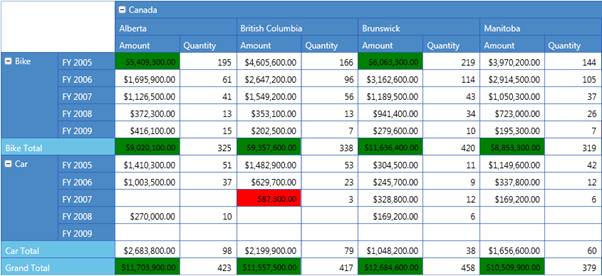

::: {style="DISPLAY: none"}
{#d2h_url_template}{#d2h_package_url style="WIDTH: 0px; DISPLAY: none; HEIGHT: 0px"}
:::

::::: {#nsbanner .d2h_main_nsbanner style="BORDER-BOTTOM: #999999 1px solid; POSITION: relative; PADDING-BOTTOM: 0px; BACKGROUND-COLOR: transparent; PADDING-LEFT: 0px; PADDING-RIGHT: 0px; DISPLAY: none; BORDER-TOP: #999999 1px solid; PADDING-TOP: 0px; LEFT: 0px"}
:::: {#TitleRow .d2h_main_titlerow style="PADDING-BOTTOM: 4px; BACKGROUND-COLOR: transparent; PADDING-LEFT: 22px; WIDTH: 100%; PADDING-RIGHT: 10px; DISPLAY: none; PADDING-TOP: 4px"}
::: {#ienav .d2h_main_ienav style="DISPLAY: none"}
{#D2HPrevious .D2HPreviousEnabled}  {#D2HNext .D2HNextEnabled}
:::
::::
:::::

:::: {#nstext .d2h_main_nstext style="PADDING-BOTTOM: 10px; BACKGROUND-COLOR: transparent; PADDING-LEFT: 22px; PADDING-RIGHT: 10px; HEIGHT: 100%; OVERFLOW: auto; PADDING-TOP: 5px" hasuserbackground="true" valign="bottom"}
::: {#d2h_breadcrumbs .d2h_breadcrumbs}
[Essential Studio User Guide Documentation](ms-xhelp:///?Id=12457748-09e3-4d74-a240-8e049cedf030){.d2h_breadcrumbsNormal}[ \> ]{.d2h_breadcrumbsLinkSeparator}[Business Intelligence Edition](ms-xhelp:///?Id=fdf33dd8-62b2-47b9-ad7b-fc50e590bca5){.d2h_breadcrumbsNormal}[ \> ]{.d2h_breadcrumbsLinkSeparator}[Essential BI Silverlight](ms-xhelp:///?Id=c006b39c-6aa2-4637-b7de-3e7b6cb3f9f9){.d2h_breadcrumbsNormal}[ \> ]{.d2h_breadcrumbsLinkSeparator}[Essential Pivot Grid]{.d2h_breadcrumbsContentsOnly}[ \> ]{.d2h_breadcrumbsLinkSeparator}[Features](ms-xhelp:///?Id=9d7968f1-d52c-4e79-a6ae-fb01305e9f98){.d2h_breadcrumbsNormal}
:::

## Conditional Formatting {#conditional-formatting style="tab-stops: 0pt"}

 

Conditional Formatting is the process of applying custom styles to any object based on certain conditions. Conditional Formatting for **PivotGrid** WPF allows you to format the Grid cells based on conditions. This can be achieved by defining **PivotGridDataConditionalFormat** for the Grid, which allows you to specify the criteria for filtering cells and styles to be applied for the filtered cells. After the specifications are defined, the specified styles are applied only to cells that satisfy the conditions specified. Conditional Formatting can be specified by using the **PivotGridControl.ConditionalFormats** property, which is an observable collection of type **PivotGridDataConditionalFormat**.

The criteria for filtering cells are specified by using the **PivotGridDataConditionalFormat.Conditions** property, which is a collection of **PivotGridDataCondition** objects. The style for each **ConditionalFormat** can be specified by using the **PivotGridDataConditionalFormat.CellStyle** property, which should be of type **PivotGridCellStyle**.

 

Adding Conditional Formatting

Conditional Formatting can be added both in code-behind and XAML, as shown in the following code snippets.

 

+------------------------------------------------------------------------------------------------------------------------------------------------------------------------------------------------------------------------------------------------------------------------------------------------------------------------------------------------------------------------------------------------------------------------------------------------------------------------------------------------------------------------------------------------------------+
| **[\[XAML\]]{style="FONT-FAMILY: 'Courier New'"}**                                                                                                                                                                                                                                                                                                                                                                                                                                                                                                         |
|                                                                                                                                                                                                                                                                                                                                                                                                                                                                                                                                                            |
| [  ]{style="FONT-FAMILY: 'Courier New'; COLOR: #a31515"}[\<!\--Specifying PivotRows.\--\>]{style="FONT-FAMILY: 'Courier New'"}                                                                                                                                                                                                                                                                                                                                                                                                                             |
|                                                                                                                                                                                                                                                                                                                                                                                                                                                                                                                                                            |
| [            [\<]{style="COLOR: blue"}syncfusion[:]{style="COLOR: blue"}PivotGridControl.PivotRows[\>]{style="COLOR: blue"}]{style="FONT-FAMILY: 'Courier New'"}                                                                                                                                                                                                                                                                                                                                                                                           |
|                                                                                                                                                                                                                                                                                                                                                                                                                                                                                                                                                            |
| [                [\<]{style="COLOR: blue"}syncfusion[:]{style="COLOR: blue"}PivotItem[ FieldMappingName]{style="COLOR: red"}[=\"Product\"]{style="COLOR: blue"}[ TotalHeader]{style="COLOR: red"}[=\"Total\"/\>]{style="COLOR: blue"}]{style="FONT-FAMILY: 'Courier New'"}                                                                                                                                                                                                                                                                                 |
|                                                                                                                                                                                                                                                                                                                                                                                                                                                                                                                                                            |
| [                [\<]{style="COLOR: blue"}syncfusion[:]{style="COLOR: blue"}PivotItem[ FieldMappingName]{style="COLOR: red"}[=\"Date\"]{style="COLOR: blue"}[ TotalHeader]{style="COLOR: red"}[=\"Total\"/\>]{style="COLOR: blue"}]{style="FONT-FAMILY: 'Courier New'"}                                                                                                                                                                                                                                                                                    |
|                                                                                                                                                                                                                                                                                                                                                                                                                                                                                                                                                            |
| [            [\</]{style="COLOR: blue"}syncfusion[:]{style="COLOR: blue"}PivotGridControl.PivotRows[\>]{style="COLOR: blue"}]{style="FONT-FAMILY: 'Courier New'"}                                                                                                                                                                                                                                                                                                                                                                                          |
|                                                                                                                                                                                                                                                                                                                                                                                                                                                                                                                                                            |
| [            ]{style="FONT-FAMILY: 'Courier New'; COLOR: #a31515"}[\<!\--Specifying PivotColumns.\--\>]{style="FONT-FAMILY: 'Courier New'"}                                                                                                                                                                                                                                                                                                                                                                                                                |
|                                                                                                                                                                                                                                                                                                                                                                                                                                                                                                                                                            |
| [            [\<]{style="COLOR: blue"}syncfusion[:]{style="COLOR: blue"}PivotGridControl.PivotColumns[\>]{style="COLOR: blue"}]{style="FONT-FAMILY: 'Courier New'"}                                                                                                                                                                                                                                                                                                                                                                                        |
|                                                                                                                                                                                                                                                                                                                                                                                                                                                                                                                                                            |
| [                [\<]{style="COLOR: blue"}syncfusion[:]{style="COLOR: blue"}PivotItem[ FieldMappingName]{style="COLOR: red"}[=\"Country\"]{style="COLOR: blue"}[ TotalHeader]{style="COLOR: red"}[=\"Total\"/\>]{style="COLOR: blue"}]{style="FONT-FAMILY: 'Courier New'"}                                                                                                                                                                                                                                                                                 |
|                                                                                                                                                                                                                                                                                                                                                                                                                                                                                                                                                            |
| [                [\<]{style="COLOR: blue"}syncfusion[:]{style="COLOR: blue"}PivotItem[ FieldMappingName]{style="COLOR: red"}[=\"State\"]{style="COLOR: blue"}[ TotalHeader]{style="COLOR: red"}[=\"Total\"/\>]{style="COLOR: blue"}]{style="FONT-FAMILY: 'Courier New'"}                                                                                                                                                                                                                                                                                   |
|                                                                                                                                                                                                                                                                                                                                                                                                                                                                                                                                                            |
| [            [\</]{style="COLOR: blue"}syncfusion[:]{style="COLOR: blue"}PivotGridControl.PivotColumns[\>]{style="COLOR: blue"}]{style="FONT-FAMILY: 'Courier New'"}                                                                                                                                                                                                                                                                                                                                                                                       |
|                                                                                                                                                                                                                                                                                                                                                                                                                                                                                                                                                            |
| [            ]{style="FONT-FAMILY: 'Courier New'; COLOR: #a31515"}[\<!\--Specifying PivotCalculationValues.\--\>[ ]{style="COLOR: #a31515"}]{style="FONT-FAMILY: 'Courier New'"}                                                                                                                                                                                                                                                                                                                                                                           |
|                                                                                                                                                                                                                                                                                                                                                                                                                                                                                                                                                            |
| [            [\<]{style="COLOR: blue"}syncfusion[:]{style="COLOR: blue"}PivotGridControl.PivotCalculations[\>]{style="COLOR: blue"}]{style="FONT-FAMILY: 'Courier New'"}                                                                                                                                                                                                                                                                                                                                                                                   |
|                                                                                                                                                                                                                                                                                                                                                                                                                                                                                                                                                            |
| [                [\<]{style="COLOR: blue"}syncfusion[:]{style="COLOR: blue"}PivotComputationInfo[ FieldName]{style="COLOR: red"}[=\"Amount\"]{style="COLOR: blue"}[ Format]{style="COLOR: red"}[=\"C\"]{style="COLOR: blue"}[ SummaryType]{style="COLOR: red"}[=\"DoubleTotalSum\"/\>]{style="COLOR: blue"}]{style="FONT-FAMILY: 'Courier New'"}                                                                                                                                                                                                           |
|                                                                                                                                                                                                                                                                                                                                                                                                                                                                                                                                                            |
| [                [\<]{style="COLOR: blue"}syncfusion[:]{style="COLOR: blue"}PivotComputationInfo[ FieldName]{style="COLOR: red"}[=\"Quantity\"]{style="COLOR: blue"}[ Format]{style="COLOR: red"}[=\"#,##0\"/\>]{style="COLOR: blue"}]{style="FONT-FAMILY: 'Courier New'"}                                                                                                                                                                                                                                                                                 |
|                                                                                                                                                                                                                                                                                                                                                                                                                                                                                                                                                            |
| [            [\</]{style="COLOR: blue"}syncfusion[:]{style="COLOR: blue"}PivotGridControl.PivotCalculations[\>]{style="COLOR: blue"}]{style="FONT-FAMILY: 'Courier New'"}                                                                                                                                                                                                                                                                                                                                                                                  |
|                                                                                                                                                                                                                                                                                                                                                                                                                                                                                                                                                            |
| **[]{style="FONT-FAMILY: 'Courier New'"}**                                                                                                                                                                                                                                                                                                                                                                                                                                                                                                                 |
|                                                                                                                                                                                                                                                                                                                                                                                                                                                                                                                                                            |
| [\<]{style="FONT-FAMILY: 'Courier New'; COLOR: blue"}[syncfusion[:]{style="COLOR: blue"}PivotGrid.ConditionalFormats[\>]{style="COLOR: blue"} ]{style="FONT-FAMILY: 'Courier New'"}                                                                                                                                                                                                                                                                                                                                                                        |
|                                                                                                                                                                                                                                                                                                                                                                                                                                                                                                                                                            |
| [   ]{style="FONT-FAMILY: 'Courier New'; COLOR: #a31515"}[\<!\-- Adding Conditions. \--\>[                       ]{style="COLOR: #a31515"}]{style="FONT-FAMILY: 'Courier New'"}                                                                                                                                                                                                                                                                                                                                                                            |
|                                                                                                                                                                                                                                                                                                                                                                                                                                                                                                                                                            |
| [   [\<]{style="COLOR: blue"}syncfusion[:]{style="COLOR: blue"}PivotGridDataConditionalFormat[ Name]{style="COLOR: red"}[=\"C1\"\>]{style="COLOR: blue"}]{style="FONT-FAMILY: 'Courier New'"}                                                                                                                                                                                                                                                                                                                                                              |
|                                                                                                                                                                                                                                                                                                                                                                                                                                                                                                                                                            |
| [      ]{style="FONT-FAMILY: 'Courier New'; COLOR: blue"}[\<!\-- Specifying the Cell Style. \--\>]{style="FONT-FAMILY: 'Courier New'"}                                                                                                                                                                                                                                                                                                                                                                                                                     |
|                                                                                                                                                                                                                                                                                                                                                                                                                                                                                                                                                            |
| [      [\<]{style="COLOR: blue"}syncfusion[:]{style="COLOR: blue"}PivotGridDataConditionalFormat.CellStyle[\>]{style="COLOR: blue"}]{style="FONT-FAMILY: 'Courier New'"}                                                                                                                                                                                                                                                                                                                                                                                   |
|                                                                                                                                                                                                                                                                                                                                                                                                                                                                                                                                                            |
| [          [\<]{style="COLOR: blue"}syncfusion[:]{style="COLOR: blue"}PivotGridCellStyle[ Background]{style="COLOR: red"}[=\"Green\" ]{style="COLOR: blue"}[FontFamily]{style="COLOR: red"}[=\"Calibri\"]{style="COLOR: blue"}[ FontSize]{style="COLOR: red"}[=\"12\"/\>]{style="COLOR: blue"}]{style="FONT-FAMILY: 'Courier New'"}                                                                                                                                                                                                                        |
|                                                                                                                                                                                                                                                                                                                                                                                                                                                                                                                                                            |
| [      [\</]{style="COLOR: blue"}syncfusion[:]{style="COLOR: blue"}PivotGridDataConditionalFormat.CellStyle[\>]{style="COLOR: blue"}]{style="FONT-FAMILY: 'Courier New'"}                                                                                                                                                                                                                                                                                                                                                                                  |
|                                                                                                                                                                                                                                                                                                                                                                                                                                                                                                                                                            |
| [      ]{style="FONT-FAMILY: 'Courier New'; COLOR: blue"}[\<!\-- Specifying Conditions. \--\>[ ]{style="COLOR: #a31515"}]{style="FONT-FAMILY: 'Courier New'"}                                                                                                                                                                                                                                                                                                                                                                                              |
|                                                                                                                                                                                                                                                                                                                                                                                                                                                                                                                                                            |
| [      [\<]{style="COLOR: blue"}syncfusion[:]{style="COLOR: blue"}PivotGridDataConditionalFormat.Conditions[\>]{style="COLOR: blue"}]{style="FONT-FAMILY: 'Courier New'"}                                                                                                                                                                                                                                                                                                                                                                                  |
|                                                                                                                                                                                                                                                                                                                                                                                                                                                                                                                                                            |
| [          ]{style="FONT-FAMILY: 'Courier New'; COLOR: #a31515"}[\<]{style="FONT-FAMILY: 'Courier New'; COLOR: blue"}[syncfusion]{style="FONT-FAMILY: 'Courier New'; COLOR: #a31515"}[:]{style="FONT-FAMILY: 'Courier New'; COLOR: blue"}[PivotGridDataCondition]{style="FONT-FAMILY: 'Courier New'; COLOR: #a31515"}[ ConditionType[=\"GreaterThan\"]{style="COLOR: blue"} Value[=\"5000000\"]{style="COLOR: blue"} SummaryElement[=\"Amount\"]{style="COLOR: blue"} PredicateType[=\"And\"/\>]{style="COLOR: blue"}]{style="FONT-FAMILY: 'Courier New'"} |
|                                                                                                                                                                                                                                                                                                                                                                                                                                                                                                                                                            |
| [          [\</]{style="COLOR: blue"}syncfusion[:]{style="COLOR: blue"}PivotGridDataConditionalFormat.Conditions[\>]{style="COLOR: blue"}]{style="FONT-FAMILY: 'Courier New'"}                                                                                                                                                                                                                                                                                                                                                                             |
|                                                                                                                                                                                                                                                                                                                                                                                                                                                                                                                                                            |
| [      [\</]{style="COLOR: blue"}syncfusion[:]{style="COLOR: blue"}PivotGridDataConditionalFormat[\>]{style="COLOR: blue"}]{style="FONT-FAMILY: 'Courier New'"}                                                                                                                                                                                                                                                                                                                                                                                            |
|                                                                                                                                                                                                                                                                                                                                                                                                                                                                                                                                                            |
| [   [\<]{style="COLOR: blue"}syncfusion[:]{style="COLOR: blue"}PivotGridDataConditionalFormat[ Name]{style="COLOR: red"}[=\"C2\"\>]{style="COLOR: blue"}]{style="FONT-FAMILY: 'Courier New'"}                                                                                                                                                                                                                                                                                                                                                              |
|                                                                                                                                                                                                                                                                                                                                                                                                                                                                                                                                                            |
| [      ]{style="FONT-FAMILY: 'Courier New'; COLOR: blue"}[\<!\-- Specifying the Cell Style \--\>]{style="FONT-FAMILY: 'Courier New'"}                                                                                                                                                                                                                                                                                                                                                                                                                      |
|                                                                                                                                                                                                                                                                                                                                                                                                                                                                                                                                                            |
| [      [\<]{style="COLOR: blue"}syncfusion[:]{style="COLOR: blue"}PivotGridDataConditionalFormat.CellStyle[\>]{style="COLOR: blue"}]{style="FONT-FAMILY: 'Courier New'"}                                                                                                                                                                                                                                                                                                                                                                                   |
|                                                                                                                                                                                                                                                                                                                                                                                                                                                                                                                                                            |
| [          [\<]{style="COLOR: blue"}syncfusion[:]{style="COLOR: blue"}PivotGridCellStyle[ Background]{style="COLOR: red"}[=\"Red\" ]{style="COLOR: blue"}[FontFamily]{style="COLOR: red"}[=\"Calibri\"]{style="COLOR: blue"}[ FontSize]{style="COLOR: red"}[=\"12\"/\>]{style="COLOR: blue"}]{style="FONT-FAMILY: 'Courier New'"}                                                                                                                                                                                                                          |
|                                                                                                                                                                                                                                                                                                                                                                                                                                                                                                                                                            |
| [      [\</]{style="COLOR: blue"}syncfusion[:]{style="COLOR: blue"}PivotGridDataConditionalFormat.CellStyle[\>]{style="COLOR: blue"}]{style="FONT-FAMILY: 'Courier New'"}                                                                                                                                                                                                                                                                                                                                                                                  |
|                                                                                                                                                                                                                                                                                                                                                                                                                                                                                                                                                            |
| [      ]{style="FONT-FAMILY: 'Courier New'; COLOR: blue"}[\<!\-- Specifying Conditions. \--\>[ ]{style="COLOR: #a31515"}]{style="FONT-FAMILY: 'Courier New'"}                                                                                                                                                                                                                                                                                                                                                                                              |
|                                                                                                                                                                                                                                                                                                                                                                                                                                                                                                                                                            |
| [      [\<]{style="COLOR: blue"}syncfusion[:]{style="COLOR: blue"}PivotGridDataConditionalFormat.Conditions[\>]{style="COLOR: blue"}]{style="FONT-FAMILY: 'Courier New'"}                                                                                                                                                                                                                                                                                                                                                                                  |
|                                                                                                                                                                                                                                                                                                                                                                                                                                                                                                                                                            |
| [          [\<]{style="COLOR: blue"}syncfusion[:]{style="COLOR: blue"}PivotGridDataCondition[ ConditionType]{style="COLOR: red"}[=\"LessThan\"]{style="COLOR: blue"}[ Value]{style="COLOR: red"}[=\"100000]{style="COLOR: blue"}]{style="FONT-FAMILY: 'Courier New'"}                                                                                                                                                                                                                                                                                      |
|                                                                                                                                                                                                                                                                                                                                                                                                                                                                                                                                                            |
| [\"]{style="FONT-FAMILY: 'Courier New'; COLOR: blue"}[ SummaryElement[=\"Amount\"]{style="COLOR: blue"} PredicateType[=\"And\"/\>]{style="COLOR: blue"}]{style="FONT-FAMILY: 'Courier New'"}                                                                                                                                                                                                                                                                                                                                                               |
|                                                                                                                                                                                                                                                                                                                                                                                                                                                                                                                                                            |
| [          [\</]{style="COLOR: blue"}syncfusion[:]{style="COLOR: blue"}PivotGridDataConditionalFormat.Conditions[\>]{style="COLOR: blue"}]{style="FONT-FAMILY: 'Courier New'"}                                                                                                                                                                                                                                                                                                                                                                             |
|                                                                                                                                                                                                                                                                                                                                                                                                                                                                                                                                                            |
| [      [\</]{style="COLOR: blue"}syncfusion[:]{style="COLOR: blue"}PivotGridDataConditionalFormat[\>]{style="COLOR: blue"}           ]{style="FONT-FAMILY: 'Courier New'"}                                                                                                                                                                                                                                                                                                                                                                                 |
|                                                                                                                                                                                                                                                                                                                                                                                                                                                                                                                                                            |
| [\</]{style="FONT-FAMILY: 'Courier New'; COLOR: blue"}[syncfusion[:]{style="COLOR: blue"}PivotGrid.ConditionalFormats[\>]{style="COLOR: blue"}]{style="FONT-FAMILY: 'Courier New'"}                                                                                                                                                                                                                                                                                                                                                                        |
|                                                                                                                                                                                                                                                                                                                                                                                                                                                                                                                                                            |
| []{style="FONT-FAMILY: 'Courier New'"}                                                                                                                                                                                                                                                                                                                                                                                                                                                                                                                     |
+------------------------------------------------------------------------------------------------------------------------------------------------------------------------------------------------------------------------------------------------------------------------------------------------------------------------------------------------------------------------------------------------------------------------------------------------------------------------------------------------------------------------------------------------------------+

 

+-----------------------------------------------------------------------------------------------------------------------------------------------------------------------------------------------------------------------------------------------------------------------------------------------------------------------------------------+
| **[\[C#\]]{style="FONT-FAMILY: 'Courier New'"}**                                                                                                                                                                                                                                                                                        |
|                                                                                                                                                                                                                                                                                                                                         |
| [// Specifying the PivotGridDataConditionalFormat]{style="FONT-FAMILY: 'Courier New'; COLOR: green"}[.]{style="FONT-FAMILY: 'Courier New'"}                                                                                                                                                                                             |
|                                                                                                                                                                                                                                                                                                                                         |
| [PivotGridDataConditionalFormat conditionalFormat1 = [new]{style="COLOR: blue"} PivotGridDataConditionalFormat();]{style="FONT-FAMILY: 'Courier New'"}                                                                                                                                                                                  |
|                                                                                                                                                                                                                                                                                                                                         |
| [// Adding Conditions to the PivotGridDataConditionalFormat]{style="FONT-FAMILY: 'Courier New'; COLOR: green"}[.]{style="FONT-FAMILY: 'Courier New'"}                                                                                                                                                                                   |
|                                                                                                                                                                                                                                                                                                                                         |
| [conditionalFormat1.Conditions.Add([new]{style="COLOR: blue"} [PivotGridDataCondition]{style="COLOR: #2b91af"}() { ]{style="FONT-FAMILY: 'Courier New'"}                                                                                                                                                                                |
|                                                                                                                                                                                                                                                                                                                                         |
| [            ConditionType= [PivotGridDataConditionType]{style="COLOR: #2b91af"}.GreaterThan , ]{style="FONT-FAMILY: 'Courier New'"}                                                                                                                                                                                                    |
|                                                                                                                                                                                                                                                                                                                                         |
| [            SummaryElement=[\"Amount\"]{style="COLOR: #a31515"},]{style="FONT-FAMILY: 'Courier New'"}                                                                                                                                                                                                                                  |
|                                                                                                                                                                                                                                                                                                                                         |
| [            Value=[\"5000000\"]{style="COLOR: #a31515"},]{style="FONT-FAMILY: 'Courier New'"}                                                                                                                                                                                                                                          |
|                                                                                                                                                                                                                                                                                                                                         |
| [            PredicateType = [PredicateType]{style="COLOR: #2b91af"}.And });]{style="FONT-FAMILY: 'Courier New'"}                                                                                                                                                                                                                       |
|                                                                                                                                                                                                                                                                                                                                         |
| []{style="FONT-FAMILY: 'Courier New'"}                                                                                                                                                                                                                                                                                                  |
|                                                                                                                                                                                                                                                                                                                                         |
| [// Specifying the Cell Style.]{style="FONT-FAMILY: 'Courier New'; COLOR: green"}                                                                                                                                                                                                                                                       |
|                                                                                                                                                                                                                                                                                                                                         |
| [conditionalFormat1.CellStyle = [new]{style="COLOR: blue"} [PivotGridCellStyle]{style="COLOR: #2b91af"}() { Background= [Brushes]{style="COLOR: #2b91af"}.Green, FontFamily = [new]{style="COLOR: blue"} [FontFamily]{style="COLOR: #2b91af"}([\"Calibri\"]{style="COLOR: #a31515"}), FontSize=12 ]{style="FONT-FAMILY: 'Courier New'"} |
|                                                                                                                                                                                                                                                                                                                                         |
| [};]{style="FONT-FAMILY: 'Courier New'"}                                                                                                                                                                                                                                                                                                |
|                                                                                                                                                                                                                                                                                                                                         |
| []{style="FONT-FAMILY: 'Courier New'"}                                                                                                                                                                                                                                                                                                  |
|                                                                                                                                                                                                                                                                                                                                         |
| []{style="FONT-FAMILY: 'Courier New'"}                                                                                                                                                                                                                                                                                                  |
|                                                                                                                                                                                                                                                                                                                                         |
| [// Specifying the PivotGridDataConditionalFormat.]{style="FONT-FAMILY: 'Courier New'; COLOR: green"}                                                                                                                                                                                                                                   |
|                                                                                                                                                                                                                                                                                                                                         |
| [PivotGridDataConditionalFormat conditionalFormat2 = [new]{style="COLOR: blue"} PivotGridDataConditionalFormat();]{style="FONT-FAMILY: 'Courier New'"}                                                                                                                                                                                  |
|                                                                                                                                                                                                                                                                                                                                         |
| [// Adding Conditions to the PivotGridDataConditionalFormat.]{style="FONT-FAMILY: 'Courier New'"}                                                                                                                                                                                                                                       |
|                                                                                                                                                                                                                                                                                                                                         |
| [conditionalFormat2.Conditions.Add([new]{style="COLOR: blue"} [PivotGridDataCondition]{style="COLOR: #2b91af"}() { ]{style="FONT-FAMILY: 'Courier New'"}                                                                                                                                                                                |
|                                                                                                                                                                                                                                                                                                                                         |
| [            ConditionType= [PivotGridDataConditionType]{style="COLOR: #2b91af"}.LessThan , ]{style="FONT-FAMILY: 'Courier New'"}                                                                                                                                                                                                       |
|                                                                                                                                                                                                                                                                                                                                         |
| [            SummaryElement=[\"Amount\"]{style="COLOR: #a31515"},]{style="FONT-FAMILY: 'Courier New'"}                                                                                                                                                                                                                                  |
|                                                                                                                                                                                                                                                                                                                                         |
| [            Value=[\"100000\"]{style="COLOR: #a31515"},]{style="FONT-FAMILY: 'Courier New'"}                                                                                                                                                                                                                                           |
|                                                                                                                                                                                                                                                                                                                                         |
| [            PredicateType = [PredicateType]{style="COLOR: #2b91af"}.And });]{style="FONT-FAMILY: 'Courier New'"}                                                                                                                                                                                                                       |
|                                                                                                                                                                                                                                                                                                                                         |
| []{style="FONT-FAMILY: 'Courier New'"}                                                                                                                                                                                                                                                                                                  |
|                                                                                                                                                                                                                                                                                                                                         |
| [// Specifying the Cell Style.]{style="FONT-FAMILY: 'Courier New'; COLOR: green"}                                                                                                                                                                                                                                                       |
|                                                                                                                                                                                                                                                                                                                                         |
| [conditionalFormat2.CellStyle = [new]{style="COLOR: blue"} [PivotGridCellStyle]{style="COLOR: #2b91af"}() { Background= [Brushes]{style="COLOR: #2b91af"}.Red, FontFamily = [new]{style="COLOR: blue"} [FontFamily]{style="COLOR: #2b91af"}([\"Calibri\"]{style="COLOR: #a31515"}), FontSize=12 ]{style="FONT-FAMILY: 'Courier New'"}   |
|                                                                                                                                                                                                                                                                                                                                         |
| [};]{style="FONT-FAMILY: 'Courier New'"}                                                                                                                                                                                                                                                                                                |
|                                                                                                                                                                                                                                                                                                                                         |
| []{style="FONT-FAMILY: 'Courier New'"}                                                                                                                                                                                                                                                                                                  |
|                                                                                                                                                                                                                                                                                                                                         |
| []{style="FONT-FAMILY: 'Courier New'"}                                                                                                                                                                                                                                                                                                  |
|                                                                                                                                                                                                                                                                                                                                         |
| [// Adding Conditions to the PivotGrid.]{style="FONT-FAMILY: 'Courier New'; COLOR: green"}                                                                                                                                                                                                                                              |
|                                                                                                                                                                                                                                                                                                                                         |
| [this]{style="FONT-FAMILY: 'Courier New'; COLOR: blue"}[.PivotGrid1.ConditionalFormats.Add(conditionalFormat1);]{style="FONT-FAMILY: 'Courier New'"}                                                                                                                                                                                    |
|                                                                                                                                                                                                                                                                                                                                         |
| [this]{style="FONT-FAMILY: 'Courier New'; COLOR: blue"}[.PivotGrid1.ConditionalFormats.Add(conditionalFormat2);]{style="FONT-FAMILY: 'Courier New'"}                                                                                                                                                                                    |
|                                                                                                                                                                                                                                                                                                                                         |
| []{style="FONT-FAMILY: 'Courier New'"}                                                                                                                                                                                                                                                                                                  |
+-----------------------------------------------------------------------------------------------------------------------------------------------------------------------------------------------------------------------------------------------------------------------------------------------------------------------------------------+

 

+-------------------------------------------------------------------------------------------------------------------------------------------------------------------------------------------------------------------------------------------------------------------------------------------------------+
| **[\[VB\]]{style="FONT-FAMILY: 'Courier New'"}**                                                                                                                                                                                                                                                      |
|                                                                                                                                                                                                                                                                                                       |
| [\' Specifying PivotGridDataConditionalFormat.]{style="FONT-FAMILY: 'Courier New'; COLOR: green"}                                                                                                                                                                                                     |
|                                                                                                                                                                                                                                                                                                       |
| [Dim]{style="FONT-FAMILY: 'Courier New'; COLOR: blue"}[ conditionalFormat1 [As]{style="COLOR: blue"} PivotGridDataConditionalFormat = [New]{style="COLOR: blue"} PivotGridDataConditionalFormat()]{style="FONT-FAMILY: 'Courier New'"}                                                                |
|                                                                                                                                                                                                                                                                                                       |
| [\' Adding Conditions to the PivotGridDataConditionalFormat.]{style="FONT-FAMILY: 'Courier New'; COLOR: green"}                                                                                                                                                                                       |
|                                                                                                                                                                                                                                                                                                       |
| [conditionalFormat1.Conditions.Add([New]{style="COLOR: blue"} PivotGridDataCondition() [With]{style="COLOR: blue"} {.ConditionType= PivotGridDataConditionType.GreaterThan, .SummaryElement=\"Amount\", .Value=\"5000000\", .PredicateType = PredicateType.And})]{style="FONT-FAMILY: 'Courier New'"} |
|                                                                                                                                                                                                                                                                                                       |
| []{style="FONT-FAMILY: 'Courier New'"}                                                                                                                                                                                                                                                                |
|                                                                                                                                                                                                                                                                                                       |
| [\' Specifying the Cell Style to the ConditionalFormat.]{style="FONT-FAMILY: 'Courier New'; COLOR: green"}                                                                                                                                                                                            |
|                                                                                                                                                                                                                                                                                                       |
| [conditionalFormat1.CellStyle = [New]{style="COLOR: blue"} PivotGridCellStyle()]{style="FONT-FAMILY: 'Courier New'"}                                                                                                                                                                                  |
|                                                                                                                                                                                                                                                                                                       |
| [      [Dim]{style="COLOR: blue"} TempFontFamily [As]{style="COLOR: blue"} FontFamily = [New]{style="COLOR: blue"} FontFamily(\"Calibri\"), FontSize=12]{style="FONT-FAMILY: 'Courier New'"}                                                                                                          |
|                                                                                                                                                                                                                                                                                                       |
| [      Brushes.Green, FontFamily = [New]{style="COLOR: blue"} FontFamily(\"Calibri\"), FontSize]{style="FONT-FAMILY: 'Courier New'"}                                                                                                                                                                  |
|                                                                                                                                                                                                                                                                                                       |
| [      Background= Brushes.Green, FontFamily]{style="FONT-FAMILY: 'Courier New'"}                                                                                                                                                                                                                     |
|                                                                                                                                                                                                                                                                                                       |
| []{style="FONT-FAMILY: 'Courier New'; COLOR: green"}                                                                                                                                                                                                                                                  |
|                                                                                                                                                                                                                                                                                                       |
| [\' Specifying the PivotGridDataConditionalFormat]{style="FONT-FAMILY: 'Courier New'; COLOR: green"}[.]{style="FONT-FAMILY: 'Courier New'"}                                                                                                                                                           |
|                                                                                                                                                                                                                                                                                                       |
| [Dim]{style="FONT-FAMILY: 'Courier New'; COLOR: blue"}[ conditionalFormat2 [As]{style="COLOR: blue"} PivotGridDataConditionalFormat = [New]{style="COLOR: blue"} PivotGridDataConditionalFormat()]{style="FONT-FAMILY: 'Courier New'"}                                                                |
|                                                                                                                                                                                                                                                                                                       |
| [\' Adding Conditions to the PivotGridDataConditionalFormat.]{style="FONT-FAMILY: 'Courier New'"}                                                                                                                                                                                                     |
|                                                                                                                                                                                                                                                                                                       |
| [conditionalFormat2.Conditions.Add([New]{style="COLOR: blue"} PivotGridDataCondition() [With]{style="COLOR: blue"} {.ConditionType= PivotGridDataConditionType.GreaterThan, .SummaryElement=\"Amount\", .Value=\"100000\", .PredicateType = PredicateType.And})]{style="FONT-FAMILY: 'Courier New'"}  |
|                                                                                                                                                                                                                                                                                                       |
| []{style="FONT-FAMILY: 'Courier New'"}                                                                                                                                                                                                                                                                |
|                                                                                                                                                                                                                                                                                                       |
| [\' Specifying the Cell Style to the ConditionalFormat.]{style="FONT-FAMILY: 'Courier New'; COLOR: green"}                                                                                                                                                                                            |
|                                                                                                                                                                                                                                                                                                       |
| [conditionalFormat2.CellStyle = [New]{style="COLOR: blue"} PivotGridCellStyle()]{style="FONT-FAMILY: 'Courier New'"}                                                                                                                                                                                  |
|                                                                                                                                                                                                                                                                                                       |
| [      [Dim]{style="COLOR: blue"} TempFontFamily [As]{style="COLOR: blue"} FontFamily = [New]{style="COLOR: blue"} FontFamily(\"Calibri\"), FontSize=12]{style="FONT-FAMILY: 'Courier New'"}                                                                                                          |
|                                                                                                                                                                                                                                                                                                       |
| [      Brushes.Red, FontFamily = [New]{style="COLOR: blue"} FontFamily(\"Calibri\"), FontSize]{style="FONT-FAMILY: 'Courier New'"}                                                                                                                                                                    |
|                                                                                                                                                                                                                                                                                                       |
| [      Background= Brushes.Red, FontFamily]{style="FONT-FAMILY: 'Courier New'"}                                                                                                                                                                                                                       |
|                                                                                                                                                                                                                                                                                                       |
| []{style="FONT-FAMILY: 'Courier New'; COLOR: green"}                                                                                                                                                                                                                                                  |
|                                                                                                                                                                                                                                                                                                       |
| [\' Adding Conditions to the PivotGrid.]{style="FONT-FAMILY: 'Courier New'; COLOR: green"}                                                                                                                                                                                                            |
|                                                                                                                                                                                                                                                                                                       |
| [Me]{style="FONT-FAMILY: 'Courier New'; COLOR: blue"}[.PivotGrid1.ConditionalFormats.Add(conditionalFormat1)]{style="FONT-FAMILY: 'Courier New'"}                                                                                                                                                     |
|                                                                                                                                                                                                                                                                                                       |
| [Me]{style="FONT-FAMILY: 'Courier New'; COLOR: blue"}[.PivotGrid1.ConditionalFormats.Add(conditionalFormat2)]{style="FONT-FAMILY: 'Courier New'"}                                                                                                                                                     |
+-------------------------------------------------------------------------------------------------------------------------------------------------------------------------------------------------------------------------------------------------------------------------------------------------------+

 

{border="0"}

Figure 11: Conditionally Formatted PivotGrid

 

Sample Link

***..\\..\\ Syncfusion\\BI\\Silverlight\\Syncfusion.PivotGrid.Silverlight.Samples\\Syncfusion.PivotGrid.Silverlight.Samples\\Samples\\CFDemo***

[]{#related-topics}
::::
