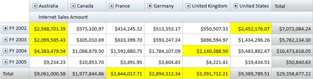

::: {style="DISPLAY: none"}
{#d2h_url_template} {#d2h_package_url style="WIDTH: 0px; DISPLAY: none; HEIGHT: 0px"}
:::

::::: {#nsbanner .d2h_main_nsbanner style="BORDER-BOTTOM: #999999 1px solid; POSITION: relative; PADDING-BOTTOM: 0px; BACKGROUND-COLOR: transparent; PADDING-LEFT: 0px; PADDING-RIGHT: 0px; DISPLAY: none; BORDER-TOP: #999999 1px solid; PADDING-TOP: 0px; LEFT: 0px"}
:::: {#TitleRow .d2h_main_titlerow style="PADDING-BOTTOM: 4px; BACKGROUND-COLOR: transparent; PADDING-LEFT: 22px; WIDTH: 100%; PADDING-RIGHT: 10px; DISPLAY: none; PADDING-TOP: 4px"}
::: {#ienav .d2h_main_ienav style="DISPLAY: none"}
{#D2HPrevious .D2HPreviousEnabled}  {#D2HNext .D2HNextEnabled}
:::
::::
:::::

:::: {#nstext .d2h_main_nstext style="PADDING-BOTTOM: 10px; BACKGROUND-COLOR: transparent; PADDING-LEFT: 22px; PADDING-RIGHT: 10px; HEIGHT: 100%; OVERFLOW: auto; PADDING-TOP: 5px" hasuserbackground="true" valign="bottom"}
::: {#d2h_breadcrumbs .d2h_breadcrumbs}
[Essential Studio User Guide Documentation](ms-xhelp:///?Id=12457748-09e3-4d74-a240-8e049cedf030){.d2h_breadcrumbsNormal} [ \> ]{.d2h_breadcrumbsLinkSeparator} [Business Intelligence Edition](ms-xhelp:///?Id=fdf33dd8-62b2-47b9-ad7b-fc50e590bca5){.d2h_breadcrumbsNormal} [ \> ]{.d2h_breadcrumbsLinkSeparator} [Essential BI WPF](ms-xhelp:///?Id=41e3d586-d922-4a01-8272-679fe4ae7343){.d2h_breadcrumbsNormal} [ \> ]{.d2h_breadcrumbsLinkSeparator} [Essential BI Grid]{.d2h_breadcrumbsContentsOnly} [ \> ]{.d2h_breadcrumbsLinkSeparator} [Concepts and Features](ms-xhelp:///?Id=ea758680-939d-4d65-8abe-8c3be198af29){.d2h_breadcrumbsNormal}
:::

## Conditional Formatting {#conditional-formatting style="tab-stops: 0pt"}

Conditional Formatting is the concept of applying custom style to any object based on certain conditions. Conditional Formatting for OlapGrid WPF allows you to format grid cells based on a certain condition. This can be achieved by defining **OlapGridDataConditionalFormat** for the grid. Using this class, you can specify the filter criteria for the cells and the style to be applied for filtered cells. Once these specifications are defined, the given styles are applied to only those cells that satisfy the condition specified. Conditional Formatting can be specified through the **OlapGrid.ConditionalFormats** property. This is an observable collection, into which you can add required number of formatters of type OlapGridDataConditionalFormat.

The filter criteria are specified by the **OlapGridDataConditionalFormat.Conditions** property, which is a collection of OlapGridDataCondition objects.

The style for each ConditionalFormat can be specified using **OlapGridDataConditionalFormat.CellStyle** property which should be of type OlapGridCellStyle.

 

Use Case Scenarios

Conditional Formatting can be used in Marketing scenarios, where you can easily track the product sales rate of different regions.

 

Adding Conditional Formatting

The following code snippets show how to create an OlapGrid and to add Conditional Formats.

 

+-------------------------------------------------------------------------------------------------------------------------------------------------------------------------------------------------------------------------------------------------------------------------------------------------------------------------------------------------------------------------------------------------------------------------------------------------------------------------------------------+
| **\[XAML\]**                                                                                                                                                                                                                                                                                                                                                                                                                                                                              |
|                                                                                                                                                                                                                                                                                                                                                                                                                                                                                           |
| [\<]{style="COLOR: blue"} [syncfusion]{style="COLOR: #a31515"} [:]{style="COLOR: blue"} [OlapGrid]{style="COLOR: #a31515"} [\>]{style="COLOR: blue"} **[]{style="FONT-SIZE: 11pt"}**                                                                                                                                                                                                                                                                                                      |
|                                                                                                                                                                                                                                                                                                                                                                                                                                                                                           |
| [ \<]{style="COLOR: blue"} [syncfusion]{style="COLOR: #a31515"} [:]{style="COLOR: blue"} [OlapGrid.ConditionalFormats]{style="COLOR: #a31515"} [\>]{style="COLOR: blue"} []{style="COLOR: #a31515"}                                                                                                                                                                                                                                                                                       |
|                                                                                                                                                                                                                                                                                                                                                                                                                                                                                           |
| [   ]{style="COLOR: #a31515"} [\<!\-- Adding Conditions \--\>]{style="COLOR: green"} [                       ]{style="COLOR: #a31515"}                                                                                                                                                                                                                                                                                                                                                    |
|                                                                                                                                                                                                                                                                                                                                                                                                                                                                                           |
| [   ]{style="COLOR: #a31515"} [\<]{style="COLOR: blue"} [syncfusion]{style="COLOR: #a31515"} [:]{style="COLOR: blue"} [OlapGridDataConditionalFormat]{style="COLOR: #a31515"} [ Name]{style="COLOR: red"} [=\"C1\"\>]{style="COLOR: blue"}                                                                                                                                                                                                                                                |
|                                                                                                                                                                                                                                                                                                                                                                                                                                                                                           |
| [      ]{style="COLOR: blue"} [\<!\-- Specifying Cell Style \--\>]{style="COLOR: green"}                                                                                                                                                                                                                                                                                                                                                                                                  |
|                                                                                                                                                                                                                                                                                                                                                                                                                                                                                           |
| [      ]{style="COLOR: #a31515"} [\<]{style="COLOR: blue"} [ syncfusion]{style="COLOR: #a31515"} [:]{style="COLOR: blue"} [OlapGridDataConditionalFormat.CellStyle]{style="COLOR: #a31515"} [\>]{style="COLOR: blue"}                                                                                                                                                                                                                                                                     |
|                                                                                                                                                                                                                                                                                                                                                                                                                                                                                           |
| [          ]{style="COLOR: #a31515"} [\<]{style="COLOR: blue"} [syncfusion]{style="COLOR: #a31515"} [:]{style="COLOR: blue"} [OlapGridCellStyle]{style="COLOR: #a31515"} [ Background]{style="COLOR: red"} [=\"Yellow\" ]{style="COLOR: blue"} [FontFamily]{style="COLOR: red"} [=\"Calibri\"]{style="COLOR: blue"} [ FontSize]{style="COLOR: red"} [=\"12\"/\>]{style="COLOR: blue"}                                                                                                     |
|                                                                                                                                                                                                                                                                                                                                                                                                                                                                                           |
| [          ]{style="COLOR: #a31515"} [\</]{style="COLOR: blue"} [syncfusion]{style="COLOR: #a31515"} [:]{style="COLOR: blue"} [OlapGridDataConditionalFormat.CellStyle]{style="COLOR: #a31515"} [\>]{style="COLOR: blue"}                                                                                                                                                                                                                                                                 |
|                                                                                                                                                                                                                                                                                                                                                                                                                                                                                           |
| [      ]{style="COLOR: blue"} [\<!\-- Specfying Conditions \--\>]{style="COLOR: green"} []{style="COLOR: #a31515"}                                                                                                                                                                                                                                                                                                                                                                        |
|                                                                                                                                                                                                                                                                                                                                                                                                                                                                                           |
| [      ]{style="COLOR: #a31515"} [\<]{style="COLOR: blue"} [syncfusion]{style="COLOR: #a31515"} [:]{style="COLOR: blue"} [OlapGridDataConditionalFormat.Conditions]{style="COLOR: #a31515"} [\>]{style="COLOR: blue"}                                                                                                                                                                                                                                                                     |
|                                                                                                                                                                                                                                                                                                                                                                                                                                                                                           |
| [          ]{style="COLOR: #a31515"} [\<]{style="COLOR: blue"} [syncfusion]{style="COLOR: #a31515"} [:]{style="COLOR: blue"} [OlapGridDataCondition]{style="COLOR: #a31515"} [ ConditionType]{style="COLOR: red"} [=\"GreaterThan\"]{style="COLOR: blue"} [ Value]{style="COLOR: red"} [=\"2000000\"]{style="COLOR: blue"} [ MeasureElement]{style="COLOR: red"} [=\"Internet Sales Amount\"]{style="COLOR: blue"} [ PredicateType]{style="COLOR: red"} [=\"Or\"/\>]{style="COLOR: blue"} |
|                                                                                                                                                                                                                                                                                                                                                                                                                                                                                           |
| [          ]{style="COLOR: #a31515"} [\<]{style="COLOR: blue"} [syncfusion]{style="COLOR: #a31515"} [:]{style="COLOR: blue"} [OlapGridDataCondition]{style="COLOR: #a31515"} [ ConditionType]{style="COLOR: red"} [=\"LessThan\"]{style="COLOR: blue"} [ Value]{style="COLOR: red"} [=\"5000000\"]{style="COLOR: blue"} [ MeasureElement]{style="COLOR: red"} [=\"Internet Sales Amount\"]{style="COLOR: blue"} [ PredicateType]{style="COLOR: red"} [=\"And\"/\>]{style="COLOR: blue"}   |
|                                                                                                                                                                                                                                                                                                                                                                                                                                                                                           |
| [          ]{style="COLOR: #a31515"} [\</]{style="COLOR: blue"} [syncfusion]{style="COLOR: #a31515"} [:]{style="COLOR: blue"} [OlapGridDataConditionalFormat.Conditions]{style="COLOR: #a31515"} [\>]{style="COLOR: blue"}                                                                                                                                                                                                                                                                |
|                                                                                                                                                                                                                                                                                                                                                                                                                                                                                           |
| [   ]{style="COLOR: #a31515"} [\</]{style="COLOR: blue"} [syncfusion]{style="COLOR: #a31515"} [:]{style="COLOR: blue"} [OlapGridDataConditionalFormat]{style="COLOR: #a31515"} [\>]{style="COLOR: blue"} [                        ]{style="COLOR: #a31515"}                                                                                                                                                                                                                               |
|                                                                                                                                                                                                                                                                                                                                                                                                                                                                                           |
| [ \</]{style="COLOR: blue"} [syncfusion]{style="COLOR: #a31515"} [:]{style="COLOR: blue"} [OlapGrid.ConditionalFormats]{style="COLOR: #a31515"} [\>]{style="COLOR: blue"}                                                                                                                                                                                                                                                                                                                 |
|                                                                                                                                                                                                                                                                                                                                                                                                                                                                                           |
| [\</]{style="COLOR: blue"} [syncfusion]{style="COLOR: #a31515"} [:]{style="COLOR: blue"} [OlapGrid]{style="COLOR: #a31515"} [\>]{style="COLOR: blue"}                                                                                                                                                                                                                                                                                                                                     |
|                                                                                                                                                                                                                                                                                                                                                                                                                                                                                           |
|                                                                                                                                                                                                                                                                                                                                                                                                                                                                                           |
+-------------------------------------------------------------------------------------------------------------------------------------------------------------------------------------------------------------------------------------------------------------------------------------------------------------------------------------------------------------------------------------------------------------------------------------------------------------------------------------------+

[]{style="COLOR: #c00000"} 

+-----------------------------------------------------------------------------------------------------------------------------------------------------------------------------------------------------------------------------------------------------------------------------------------------+
| **\[C#\]**                                                                                                                                                                                                                                                                                    |
|                                                                                                                                                                                                                                                                                               |
| [OlapGrid]{style="COLOR: #2b91af"} olapGrid1 = [new]{style="COLOR: blue"}[OlapGrid]{style="COLOR: #2b91af"}();                                                                                                                                                                                |
|                                                                                                                                                                                                                                                                                               |
| [// Instantiating OlapDataManager with Connection string.]{style="COLOR: green"}                                                                                                                                                                                                              |
|                                                                                                                                                                                                                                                                                               |
| [OlapDataManager]{style="COLOR: #2b91af"} olapDataManager = [new]{style="COLOR: blue"}[OlapDataManager]{style="COLOR: #2b91af"}(connectionString);                                                                                                                                            |
|                                                                                                                                                                                                                                                                                               |
| [// Set current report for OlapDataManager.]{style="COLOR: green"}                                                                                                                                                                                                                            |
|                                                                                                                                                                                                                                                                                               |
| olapDataManager.SetCurrentReport(olapReport());                                                                                                                                                                                                                                               |
|                                                                                                                                                                                                                                                                                               |
| [// Specifying OlapDataManager to Grid.]{style="COLOR: green"}                                                                                                                                                                                                                                |
|                                                                                                                                                                                                                                                                                               |
| olapGrid1.OlapDataManager = OlapDataManager;                                                                                                                                                                                                                                                  |
|                                                                                                                                                                                                                                                                                               |
|                                                                                                                                                                                                                                                                                               |
|                                                                                                                                                                                                                                                                                               |
| [ // Specifying OlapGridData Conditional Format.]{style="COLOR: green"}                                                                                                                                                                                                                       |
|                                                                                                                                                                                                                                                                                               |
| [OlapGridDataConditionalFormat]{style="COLOR: #2b91af"} conditionalFormat = [new]{style="COLOR: blue"}[OlapGridDataConditionalFormat]{style="COLOR: #2b91af"}();                                                                                                                              |
|                                                                                                                                                                                                                                                                                               |
| [// Adding Conditions to OlapGridData Conditional Format.]{style="COLOR: green"}                                                                                                                                                                                                              |
|                                                                                                                                                                                                                                                                                               |
| conditionalFormat.Conditions.Add([new]{style="COLOR: blue"}[OlapGridDataCondition]{style="COLOR: #2b91af"}() {                                                                                                                                                                                |
|                                                                                                                                                                                                                                                                                               |
|             ConditionType= [OlapGridDataConditionType]{style="COLOR: #2b91af"}.GreaterThan ,                                                                                                                                                                                                  |
|                                                                                                                                                                                                                                                                                               |
|             MeasureElement=[\"Internet Sales Amount\"]{style="COLOR: #a31515"},                                                                                                                                                                                                               |
|                                                                                                                                                                                                                                                                                               |
|             Value=[\"2000000\"]{style="COLOR: #a31515"},                                                                                                                                                                                                                                      |
|                                                                                                                                                                                                                                                                                               |
|             PredicateType = [PredicateType]{style="COLOR: #2b91af"}.Or });                                                                                                                                                                                                                    |
|                                                                                                                                                                                                                                                                                               |
| conditionalFormat.Conditions.Add([new]{style="COLOR: blue"}[OlapGridDataCondition]{style="COLOR: #2b91af"}() {                                                                                                                                                                                |
|                                                                                                                                                                                                                                                                                               |
|             ConditionType= [OlapGridDataConditionType]{style="COLOR: #2b91af"}.LessThan ,                                                                                                                                                                                                     |
|                                                                                                                                                                                                                                                                                               |
|             MeasureElement=[\"Internet Sales Amount\"]{style="COLOR: #a31515"},                                                                                                                                                                                                               |
|                                                                                                                                                                                                                                                                                               |
|             Value=[\"5000000\"]{style="COLOR: #a31515"},                                                                                                                                                                                                                                      |
|                                                                                                                                                                                                                                                                                               |
|             PredicateType = [PredicateType]{style="COLOR: #2b91af"}.And });                                                                                                                                                                                                                   |
|                                                                                                                                                                                                                                                                                               |
|                                                                                                                                                                                                                                                                                               |
|                                                                                                                                                                                                                                                                                               |
| [// Specifying Cell Style to Conditional Format.]{style="COLOR: green"}                                                                                                                                                                                                                       |
|                                                                                                                                                                                                                                                                                               |
| conditionalFormat.CellStyle = [new]{style="COLOR: blue"}[OlapGridCellStyle]{style="COLOR: #2b91af"}() { Background= [Brushes]{style="COLOR: #2b91af"}.Yellow, FontFamily = [new]{style="COLOR: blue"}[FontFamily]{style="COLOR: #2b91af"}([\"Calibri\"]{style="COLOR: #a31515"}), FontSize=12 |
|                                                                                                                                                                                                                                                                                               |
| };                                                                                                                                                                                                                                                                                            |
|                                                                                                                                                                                                                                                                                               |
| [// Adding Conditions to Grid.]{style="COLOR: green"}                                                                                                                                                                                                                                         |
|                                                                                                                                                                                                                                                                                               |
| [this]{style="COLOR: blue"}.olapgrid1.ConditionalFormats.Add(conditionalFormat);                                                                                                                                                                                                              |
|                                                                                                                                                                                                                                                                                               |
| [// Data Binding.]{style="COLOR: green"}                                                                                                                                                                                                                                                      |
|                                                                                                                                                                                                                                                                                               |
| [this]{style="COLOR: blue"}.olapgrid1.DataBind();                                                                                                                                                                                                                                             |
|                                                                                                                                                                                                                                                                                               |
|                                                                                                                                                                                                                                                                                               |
+-----------------------------------------------------------------------------------------------------------------------------------------------------------------------------------------------------------------------------------------------------------------------------------------------+

[]{style="COLOR: #c00000"} 

+----------------------------------------------------------------------------------------------------------------------------------------------------------------------------------------------------------------------------------------------------------------------------+
| **\[VB\]**                                                                                                                                                                                                                                                                 |
|                                                                                                                                                                                                                                                                            |
| [Dim]{style="COLOR: blue"} olapGrid1 [As]{style="COLOR: blue"} OlapGrid = [New]{style="COLOR: blue"} OlapGrid()                                                                                                                                                            |
|                                                                                                                                                                                                                                                                            |
| [\' Instantiating OlapDataManager with Connection string.]{style="COLOR: green"}                                                                                                                                                                                           |
|                                                                                                                                                                                                                                                                            |
| [Dim]{style="COLOR: blue"} olapDataManager [As]{style="COLOR: blue"} OlapDataManager = [New]{style="COLOR: blue"} OlapDataManager(connectionString)                                                                                                                        |
|                                                                                                                                                                                                                                                                            |
| [\' Set current report for OlapDataManager.]{style="COLOR: green"}                                                                                                                                                                                                         |
|                                                                                                                                                                                                                                                                            |
| olapDataManager.SetCurrentReport(olapReport())                                                                                                                                                                                                                             |
|                                                                                                                                                                                                                                                                            |
| [\' Specifying OlapDataManager to Grid.]{style="COLOR: green"}                                                                                                                                                                                                             |
|                                                                                                                                                                                                                                                                            |
| olapGrid1.OlapDataManager = OlapDataManager                                                                                                                                                                                                                                |
|                                                                                                                                                                                                                                                                            |
|                                                                                                                                                                                                                                                                            |
|                                                                                                                                                                                                                                                                            |
| [\' Specifying OlapGridData Conditional Format.]{style="COLOR: green"}                                                                                                                                                                                                     |
|                                                                                                                                                                                                                                                                            |
| [Dim]{style="COLOR: blue"} conditionalFormat [As]{style="COLOR: blue"} OlapGridDataConditionalFormat = [New]{style="COLOR: blue"} OlapGridDataConditionalFormat()                                                                                                          |
|                                                                                                                                                                                                                                                                            |
| [\' Adding Conditions to OlapGridData Conditional Format.]{style="COLOR: green"}                                                                                                                                                                                           |
|                                                                                                                                                                                                                                                                            |
| conditionalFormat.Conditions.Add([New]{style="COLOR: blue"} OlapGridDataCondition() [With]{style="COLOR: blue"} {.ConditionType= OlapGridDataConditionType.GreaterThan, .MeasureElement=\"Internet Sales Amount\", .Value=\"2000000\", .PredicateType = PredicateType.Or}) |
|                                                                                                                                                                                                                                                                            |
| conditionalFormat.Conditions.Add([New]{style="COLOR: blue"} OlapGridDataCondition() [With]{style="COLOR: blue"} {.ConditionType= OlapGridDataConditionType.LessThan, .MeasureElement=\"Internet Sales Amount\", .Value=\"5000000\", .PredicateType = PredicateType.And})   |
|                                                                                                                                                                                                                                                                            |
|                                                                                                                                                                                                                                                                            |
|                                                                                                                                                                                                                                                                            |
| [\' Specifying Cell Style to Conditional Format.]{style="COLOR: green"}                                                                                                                                                                                                    |
|                                                                                                                                                                                                                                                                            |
| conditionalFormat.CellStyle = [New]{style="COLOR: blue"} OlapGridCellStyle()                                                                                                                                                                                               |
|                                                                                                                                                                                                                                                                            |
|           [Dim]{style="COLOR: blue"} TempFontFamily [As]{style="COLOR: blue"} FontFamily = [New]{style="COLOR: blue"} FontFamily(\"Calibri\"), FontSize=12                                                                                                                 |
|                                                                                                                                                                                                                                                                            |
|           Brushes.Yellow, FontFamily = [New]{style="COLOR: blue"} FontFamily(\"Calibri\"), FontSize                                                                                                                                                                        |
|                                                                                                                                                                                                                                                                            |
|           Background= Brushes.Yellow, FontFamily                                                                                                                                                                                                                           |
|                                                                                                                                                                                                                                                                            |
| [\' Adding Conditions to Grid.]{style="COLOR: green"}                                                                                                                                                                                                                      |
|                                                                                                                                                                                                                                                                            |
| [Me]{style="COLOR: blue"}.olapgrid1.ConditionalFormats.Add(conditionalFormat)                                                                                                                                                                                              |
|                                                                                                                                                                                                                                                                            |
| [\' Data Binding.]{style="COLOR: green"}                                                                                                                                                                                                                                   |
|                                                                                                                                                                                                                                                                            |
| [Me]{style="COLOR: blue"}.olapgrid1.DataBind()                                                                                                                                                                                                                             |
|                                                                                                                                                                                                                                                                            |
|                                                                                                                                                                                                                                                                            |
+----------------------------------------------------------------------------------------------------------------------------------------------------------------------------------------------------------------------------------------------------------------------------+

[]{style="COLOR: #c00000"} 

{border="0"}

Figure 13: Conditionally Formatted OlapGrid

 

Sample Link

**..\\..\\ Syncfusion\\BI\\WPF\\OlapGrid.WPF\\Samples\\Appearance\\Conditional Formatting Demo**

 

[]{#related-topics}
::::
