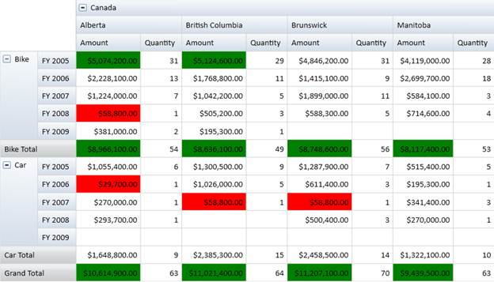

::: {style="DISPLAY: none"}
{#d2h_url_template} {#d2h_package_url style="WIDTH: 0px; DISPLAY: none; HEIGHT: 0px"}
:::

::: {.d2h_secondary_topic style="PADDING-BOTTOM: 10pt; MARGIN: 0pt; PADDING-LEFT: 0pt; PADDING-RIGHT: 0pt; PADDING-TOP: 0pt"}
#### Conditional Formatting {#conditional-formatting style="tab-stops: 0pt"}

Conditional formatting is the process of applying customized styles to any object based on specified conditions. Conditional Formatting for PivotGrid WPF allows you to format Grid cells based on specified conditions. This can be achieved by defining PivotGridDataConditionalFormat for the Grid, which allows you to specify the criteria for filtering the cells and the style to be applied to the filtered cells. After the specifications are defined, the styles are applied only to the cells that fulfil the specified conditions. Conditional Formatting can be specified by using the PivotGridControl.ConditionalFormats property, which is an observable collection of type PivotGridDataConditionalFormat.

The criteria for filtering the cells are specified by using the PivotGridDataConditionalFormat.Conditions property, which is a collection of PivotGridDataCondition objects. The Style for each ConditionalFormat can be specified by using the PivotGridDataConditionalFormat.CellStyle property, which should be of type PivotGridCellStyle.

**[]{style="FONT-FAMILY: 'Trebuchet MS','sans-serif'; COLOR: #15428b; FONT-SIZE: 9pt"}**  

Use Case Scenarios

Conditional Formatting can be used in Marketing software to help users easily trace the product sales rate for different regions.

 

{border="0"}

 

 Figure 18: Conditionally Formatted PivotGrid

 

Adding Conditional Formatting

Conditional Formatting can be added to code behind and XAML, as shown in the following code snippets.

[]{style="FONT-FAMILY: 'Trebuchet MS','sans-serif'; COLOR: #15428b; FONT-SIZE: 9pt"} 

+----------------------------------------------------------------------------------------------------------------------------------------------------------------------------------------------------------------------------------------------------------------------------------------------------------------------------------------------------------------------------------------------------------------------------------------------------------------------------------------------------------------------------------------------------------------------------------------------------------------------------------------------------------------------------------------------------------------------------------------------------------------------------------------------------------------------------------------------------------+
| **[\[XAML\]]{style="FONT-FAMILY: 'Courier New'"}**                                                                                                                                                                                                                                                                                                                                                                                                                                                                                                                                                                                                                                                                                                                                                                                                       |
|                                                                                                                                                                                                                                                                                                                                                                                                                                                                                                                                                                                                                                                                                                                                                                                                                                                          |
| [  ]{style="FONT-FAMILY: 'Courier New'; COLOR: #a31515"} [\<!\--Specifying PivotRows.\--\>]{style="FONT-FAMILY: 'Courier New'; COLOR: green"} []{style="FONT-FAMILY: 'Courier New'"}                                                                                                                                                                                                                                                                                                                                                                                                                                                                                                                                                                                                                                                                     |
|                                                                                                                                                                                                                                                                                                                                                                                                                                                                                                                                                                                                                                                                                                                                                                                                                                                          |
| [            ]{style="FONT-FAMILY: 'Courier New'; COLOR: #a31515"} [\<]{style="FONT-FAMILY: 'Courier New'; COLOR: blue"} [syncfusion]{style="FONT-FAMILY: 'Courier New'; COLOR: #a31515"} [:]{style="FONT-FAMILY: 'Courier New'; COLOR: blue"} [PivotGridControl.PivotRows]{style="FONT-FAMILY: 'Courier New'; COLOR: #a31515"} [\>]{style="FONT-FAMILY: 'Courier New'; COLOR: blue"} []{style="FONT-FAMILY: 'Courier New'"}                                                                                                                                                                                                                                                                                                                                                                                                                             |
|                                                                                                                                                                                                                                                                                                                                                                                                                                                                                                                                                                                                                                                                                                                                                                                                                                                          |
| [                ]{style="FONT-FAMILY: 'Courier New'; COLOR: #a31515"} [\<]{style="FONT-FAMILY: 'Courier New'; COLOR: blue"} [syncfusion]{style="FONT-FAMILY: 'Courier New'; COLOR: #a31515"} [:]{style="FONT-FAMILY: 'Courier New'; COLOR: blue"} [PivotItem]{style="FONT-FAMILY: 'Courier New'; COLOR: #a31515"} [ FieldMappingName]{style="FONT-FAMILY: 'Courier New'; COLOR: red"} [=\"Product\"]{style="FONT-FAMILY: 'Courier New'; COLOR: blue"} [ TotalHeader]{style="FONT-FAMILY: 'Courier New'; COLOR: red"} [=\"Total\"/\>]{style="FONT-FAMILY: 'Courier New'; COLOR: blue"} []{style="FONT-FAMILY: 'Courier New'"}                                                                                                                                                                                                                            |
|                                                                                                                                                                                                                                                                                                                                                                                                                                                                                                                                                                                                                                                                                                                                                                                                                                                          |
| [                ]{style="FONT-FAMILY: 'Courier New'; COLOR: #a31515"} [\<]{style="FONT-FAMILY: 'Courier New'; COLOR: blue"} [syncfusion]{style="FONT-FAMILY: 'Courier New'; COLOR: #a31515"} [:]{style="FONT-FAMILY: 'Courier New'; COLOR: blue"} [PivotItem]{style="FONT-FAMILY: 'Courier New'; COLOR: #a31515"} [ FieldMappingName]{style="FONT-FAMILY: 'Courier New'; COLOR: red"} [=\"Date\"]{style="FONT-FAMILY: 'Courier New'; COLOR: blue"} [ TotalHeader]{style="FONT-FAMILY: 'Courier New'; COLOR: red"} [=\"Total\"/\>]{style="FONT-FAMILY: 'Courier New'; COLOR: blue"} []{style="FONT-FAMILY: 'Courier New'"}                                                                                                                                                                                                                               |
|                                                                                                                                                                                                                                                                                                                                                                                                                                                                                                                                                                                                                                                                                                                                                                                                                                                          |
| [            ]{style="FONT-FAMILY: 'Courier New'; COLOR: #a31515"} [\</]{style="FONT-FAMILY: 'Courier New'; COLOR: blue"} [syncfusion]{style="FONT-FAMILY: 'Courier New'; COLOR: #a31515"} [:]{style="FONT-FAMILY: 'Courier New'; COLOR: blue"} [PivotGridControl.PivotRows]{style="FONT-FAMILY: 'Courier New'; COLOR: #a31515"} [\>]{style="FONT-FAMILY: 'Courier New'; COLOR: blue"} []{style="FONT-FAMILY: 'Courier New'"}                                                                                                                                                                                                                                                                                                                                                                                                                            |
|                                                                                                                                                                                                                                                                                                                                                                                                                                                                                                                                                                                                                                                                                                                                                                                                                                                          |
| [            ]{style="FONT-FAMILY: 'Courier New'; COLOR: #a31515"} [\<!\--Specifying PivotColumns.\--\>]{style="FONT-FAMILY: 'Courier New'; COLOR: green"} []{style="FONT-FAMILY: 'Courier New'"}                                                                                                                                                                                                                                                                                                                                                                                                                                                                                                                                                                                                                                                        |
|                                                                                                                                                                                                                                                                                                                                                                                                                                                                                                                                                                                                                                                                                                                                                                                                                                                          |
| [            ]{style="FONT-FAMILY: 'Courier New'; COLOR: #a31515"} [\<]{style="FONT-FAMILY: 'Courier New'; COLOR: blue"} [syncfusion]{style="FONT-FAMILY: 'Courier New'; COLOR: #a31515"} [:]{style="FONT-FAMILY: 'Courier New'; COLOR: blue"} [PivotGridControl.PivotColumns]{style="FONT-FAMILY: 'Courier New'; COLOR: #a31515"} [\>]{style="FONT-FAMILY: 'Courier New'; COLOR: blue"} []{style="FONT-FAMILY: 'Courier New'"}                                                                                                                                                                                                                                                                                                                                                                                                                          |
|                                                                                                                                                                                                                                                                                                                                                                                                                                                                                                                                                                                                                                                                                                                                                                                                                                                          |
| [                ]{style="FONT-FAMILY: 'Courier New'; COLOR: #a31515"} [\<]{style="FONT-FAMILY: 'Courier New'; COLOR: blue"} [syncfusion]{style="FONT-FAMILY: 'Courier New'; COLOR: #a31515"} [:]{style="FONT-FAMILY: 'Courier New'; COLOR: blue"} [PivotItem]{style="FONT-FAMILY: 'Courier New'; COLOR: #a31515"} [ FieldMappingName]{style="FONT-FAMILY: 'Courier New'; COLOR: red"} [=\"Country\"]{style="FONT-FAMILY: 'Courier New'; COLOR: blue"} [ TotalHeader]{style="FONT-FAMILY: 'Courier New'; COLOR: red"} [=\"Total\"/\>]{style="FONT-FAMILY: 'Courier New'; COLOR: blue"} []{style="FONT-FAMILY: 'Courier New'"}                                                                                                                                                                                                                            |
|                                                                                                                                                                                                                                                                                                                                                                                                                                                                                                                                                                                                                                                                                                                                                                                                                                                          |
| [                ]{style="FONT-FAMILY: 'Courier New'; COLOR: #a31515"} [\<]{style="FONT-FAMILY: 'Courier New'; COLOR: blue"} [syncfusion]{style="FONT-FAMILY: 'Courier New'; COLOR: #a31515"} [:]{style="FONT-FAMILY: 'Courier New'; COLOR: blue"} [PivotItem]{style="FONT-FAMILY: 'Courier New'; COLOR: #a31515"} [ FieldMappingName]{style="FONT-FAMILY: 'Courier New'; COLOR: red"} [=\"State\"]{style="FONT-FAMILY: 'Courier New'; COLOR: blue"} [ TotalHeader]{style="FONT-FAMILY: 'Courier New'; COLOR: red"} [=\"Total\"/\>]{style="FONT-FAMILY: 'Courier New'; COLOR: blue"} []{style="FONT-FAMILY: 'Courier New'"}                                                                                                                                                                                                                              |
|                                                                                                                                                                                                                                                                                                                                                                                                                                                                                                                                                                                                                                                                                                                                                                                                                                                          |
| [            ]{style="FONT-FAMILY: 'Courier New'; COLOR: #a31515"} [\</]{style="FONT-FAMILY: 'Courier New'; COLOR: blue"} [syncfusion]{style="FONT-FAMILY: 'Courier New'; COLOR: #a31515"} [:]{style="FONT-FAMILY: 'Courier New'; COLOR: blue"} [PivotGridControl.PivotColumns]{style="FONT-FAMILY: 'Courier New'; COLOR: #a31515"} [\>]{style="FONT-FAMILY: 'Courier New'; COLOR: blue"} []{style="FONT-FAMILY: 'Courier New'"}                                                                                                                                                                                                                                                                                                                                                                                                                         |
|                                                                                                                                                                                                                                                                                                                                                                                                                                                                                                                                                                                                                                                                                                                                                                                                                                                          |
| [            ]{style="FONT-FAMILY: 'Courier New'; COLOR: #a31515"} [\<!\--Specifying PivotCalculationValues.\--\>]{style="FONT-FAMILY: 'Courier New'; COLOR: green"} []{style="FONT-FAMILY: 'Courier New'; COLOR: #a31515"} []{style="FONT-FAMILY: 'Courier New'"}                                                                                                                                                                                                                                                                                                                                                                                                                                                                                                                                                                                       |
|                                                                                                                                                                                                                                                                                                                                                                                                                                                                                                                                                                                                                                                                                                                                                                                                                                                          |
| [            ]{style="FONT-FAMILY: 'Courier New'; COLOR: #a31515"} [\<]{style="FONT-FAMILY: 'Courier New'; COLOR: blue"} [syncfusion]{style="FONT-FAMILY: 'Courier New'; COLOR: #a31515"} [:]{style="FONT-FAMILY: 'Courier New'; COLOR: blue"} [PivotGridControl.PivotCalculations]{style="FONT-FAMILY: 'Courier New'; COLOR: #a31515"} [\>]{style="FONT-FAMILY: 'Courier New'; COLOR: blue"} []{style="FONT-FAMILY: 'Courier New'"}                                                                                                                                                                                                                                                                                                                                                                                                                     |
|                                                                                                                                                                                                                                                                                                                                                                                                                                                                                                                                                                                                                                                                                                                                                                                                                                                          |
| [                ]{style="FONT-FAMILY: 'Courier New'; COLOR: #a31515"} [\<]{style="FONT-FAMILY: 'Courier New'; COLOR: blue"} [syncfusion]{style="FONT-FAMILY: 'Courier New'; COLOR: #a31515"} [:]{style="FONT-FAMILY: 'Courier New'; COLOR: blue"} [PivotComputationInfo]{style="FONT-FAMILY: 'Courier New'; COLOR: #a31515"} [ FieldName]{style="FONT-FAMILY: 'Courier New'; COLOR: red"} [=\"Amount\"]{style="FONT-FAMILY: 'Courier New'; COLOR: blue"} [ Format]{style="FONT-FAMILY: 'Courier New'; COLOR: red"} [=\"C\"]{style="FONT-FAMILY: 'Courier New'; COLOR: blue"} [ SummaryType]{style="FONT-FAMILY: 'Courier New'; COLOR: red"} [=\"DoubleTotalSum\"/\>]{style="FONT-FAMILY: 'Courier New'; COLOR: blue"} []{style="FONT-FAMILY: 'Courier New'"}                                                                                            |
|                                                                                                                                                                                                                                                                                                                                                                                                                                                                                                                                                                                                                                                                                                                                                                                                                                                          |
| [                ]{style="FONT-FAMILY: 'Courier New'; COLOR: #a31515"} [\<]{style="FONT-FAMILY: 'Courier New'; COLOR: blue"} [syncfusion]{style="FONT-FAMILY: 'Courier New'; COLOR: #a31515"} [:]{style="FONT-FAMILY: 'Courier New'; COLOR: blue"} [PivotComputationInfo]{style="FONT-FAMILY: 'Courier New'; COLOR: #a31515"} [ FieldName]{style="FONT-FAMILY: 'Courier New'; COLOR: red"} [=\"Quantity\"]{style="FONT-FAMILY: 'Courier New'; COLOR: blue"} [ Format]{style="FONT-FAMILY: 'Courier New'; COLOR: red"} [=\"#,##0\"/\>]{style="FONT-FAMILY: 'Courier New'; COLOR: blue"} []{style="FONT-FAMILY: 'Courier New'"}                                                                                                                                                                                                                            |
|                                                                                                                                                                                                                                                                                                                                                                                                                                                                                                                                                                                                                                                                                                                                                                                                                                                          |
| [            ]{style="FONT-FAMILY: 'Courier New'; COLOR: #a31515"} [\</]{style="FONT-FAMILY: 'Courier New'; COLOR: blue"} [syncfusion]{style="FONT-FAMILY: 'Courier New'; COLOR: #a31515"} [:]{style="FONT-FAMILY: 'Courier New'; COLOR: blue"} [PivotGridControl.PivotCalculations]{style="FONT-FAMILY: 'Courier New'; COLOR: #a31515"} [\>]{style="FONT-FAMILY: 'Courier New'; COLOR: blue"} []{style="FONT-FAMILY: 'Courier New'"}                                                                                                                                                                                                                                                                                                                                                                                                                    |
|                                                                                                                                                                                                                                                                                                                                                                                                                                                                                                                                                                                                                                                                                                                                                                                                                                                          |
| **[]{style="FONT-FAMILY: 'Courier New'"}**                                                                                                                                                                                                                                                                                                                                                                                                                                                                                                                                                                                                                                                                                                                                                                                                               |
|                                                                                                                                                                                                                                                                                                                                                                                                                                                                                                                                                                                                                                                                                                                                                                                                                                                          |
| [\<]{style="FONT-FAMILY: 'Courier New'; COLOR: blue"} [syncfusion]{style="FONT-FAMILY: 'Courier New'; COLOR: #a31515"} [:]{style="FONT-FAMILY: 'Courier New'; COLOR: blue"} [PivotGrid.ConditionalFormats]{style="FONT-FAMILY: 'Courier New'; COLOR: #a31515"} [\>]{style="FONT-FAMILY: 'Courier New'; COLOR: blue"} []{style="FONT-FAMILY: 'Courier New'; COLOR: #a31515"}                                                                                                                                                                                                                                                                                                                                                                                                                                                                              |
|                                                                                                                                                                                                                                                                                                                                                                                                                                                                                                                                                                                                                                                                                                                                                                                                                                                          |
| [   ]{style="FONT-FAMILY: 'Courier New'; COLOR: #a31515"} [\<!\-- Adding Conditions. \--\>]{style="FONT-FAMILY: 'Courier New'; COLOR: green"} [                       ]{style="FONT-FAMILY: 'Courier New'; COLOR: #a31515"} []{style="FONT-FAMILY: 'Courier New'"}                                                                                                                                                                                                                                                                                                                                                                                                                                                                                                                                                                                       |
|                                                                                                                                                                                                                                                                                                                                                                                                                                                                                                                                                                                                                                                                                                                                                                                                                                                          |
| [   ]{style="FONT-FAMILY: 'Courier New'; COLOR: #a31515"} [\<]{style="FONT-FAMILY: 'Courier New'; COLOR: blue"} [syncfusion]{style="FONT-FAMILY: 'Courier New'; COLOR: #a31515"} [:]{style="FONT-FAMILY: 'Courier New'; COLOR: blue"} [PivotGridDataConditionalFormat]{style="FONT-FAMILY: 'Courier New'; COLOR: #a31515"} [ Name]{style="FONT-FAMILY: 'Courier New'; COLOR: red"} [=\"C1\"\>]{style="FONT-FAMILY: 'Courier New'; COLOR: blue"}                                                                                                                                                                                                                                                                                                                                                                                                          |
|                                                                                                                                                                                                                                                                                                                                                                                                                                                                                                                                                                                                                                                                                                                                                                                                                                                          |
| [      ]{style="FONT-FAMILY: 'Courier New'; COLOR: blue"} [\<!\-- Specifying the Cell Style. \--\>]{style="FONT-FAMILY: 'Courier New'; COLOR: green"}                                                                                                                                                                                                                                                                                                                                                                                                                                                                                                                                                                                                                                                                                                    |
|                                                                                                                                                                                                                                                                                                                                                                                                                                                                                                                                                                                                                                                                                                                                                                                                                                                          |
| [      ]{style="FONT-FAMILY: 'Courier New'; COLOR: #a31515"} [\<]{style="FONT-FAMILY: 'Courier New'; COLOR: blue"} [syncfusion]{style="FONT-FAMILY: 'Courier New'; COLOR: #a31515"} [:]{style="FONT-FAMILY: 'Courier New'; COLOR: blue"} [PivotGridDataConditionalFormat.CellStyle]{style="FONT-FAMILY: 'Courier New'; COLOR: #a31515"} [\>]{style="FONT-FAMILY: 'Courier New'; COLOR: blue"} []{style="FONT-FAMILY: 'Courier New'"}                                                                                                                                                                                                                                                                                                                                                                                                                     |
|                                                                                                                                                                                                                                                                                                                                                                                                                                                                                                                                                                                                                                                                                                                                                                                                                                                          |
| [          ]{style="FONT-FAMILY: 'Courier New'; COLOR: #a31515"} [\<]{style="FONT-FAMILY: 'Courier New'; COLOR: blue"} [syncfusion]{style="FONT-FAMILY: 'Courier New'; COLOR: #a31515"} [:]{style="FONT-FAMILY: 'Courier New'; COLOR: blue"} [PivotGridCellStyle]{style="FONT-FAMILY: 'Courier New'; COLOR: #a31515"} [ Background]{style="FONT-FAMILY: 'Courier New'; COLOR: red"} [=\"Green\" ]{style="FONT-FAMILY: 'Courier New'; COLOR: blue"} [FontFamily]{style="FONT-FAMILY: 'Courier New'; COLOR: red"} [=\"Calibri\"]{style="FONT-FAMILY: 'Courier New'; COLOR: blue"} [ FontSize]{style="FONT-FAMILY: 'Courier New'; COLOR: red"} [=\"12\"/\>]{style="FONT-FAMILY: 'Courier New'; COLOR: blue"} []{style="FONT-FAMILY: 'Courier New'"}                                                                                                         |
|                                                                                                                                                                                                                                                                                                                                                                                                                                                                                                                                                                                                                                                                                                                                                                                                                                                          |
| [      ]{style="FONT-FAMILY: 'Courier New'; COLOR: #a31515"} [\</]{style="FONT-FAMILY: 'Courier New'; COLOR: blue"} [syncfusion]{style="FONT-FAMILY: 'Courier New'; COLOR: #a31515"} [:]{style="FONT-FAMILY: 'Courier New'; COLOR: blue"} [PivotGridDataConditionalFormat.CellStyle]{style="FONT-FAMILY: 'Courier New'; COLOR: #a31515"} [\>]{style="FONT-FAMILY: 'Courier New'; COLOR: blue"}                                                                                                                                                                                                                                                                                                                                                                                                                                                           |
|                                                                                                                                                                                                                                                                                                                                                                                                                                                                                                                                                                                                                                                                                                                                                                                                                                                          |
| [      ]{style="FONT-FAMILY: 'Courier New'; COLOR: blue"} [\<!\-- Specifying Conditions. \--\>]{style="FONT-FAMILY: 'Courier New'; COLOR: green"} []{style="FONT-FAMILY: 'Courier New'; COLOR: #a31515"}                                                                                                                                                                                                                                                                                                                                                                                                                                                                                                                                                                                                                                                 |
|                                                                                                                                                                                                                                                                                                                                                                                                                                                                                                                                                                                                                                                                                                                                                                                                                                                          |
| [      ]{style="FONT-FAMILY: 'Courier New'; COLOR: #a31515"} [\<]{style="FONT-FAMILY: 'Courier New'; COLOR: blue"} [syncfusion]{style="FONT-FAMILY: 'Courier New'; COLOR: #a31515"} [:]{style="FONT-FAMILY: 'Courier New'; COLOR: blue"} [PivotGridDataConditionalFormat.Conditions]{style="FONT-FAMILY: 'Courier New'; COLOR: #a31515"} [\>]{style="FONT-FAMILY: 'Courier New'; COLOR: blue"} []{style="FONT-FAMILY: 'Courier New'"}                                                                                                                                                                                                                                                                                                                                                                                                                    |
|                                                                                                                                                                                                                                                                                                                                                                                                                                                                                                                                                                                                                                                                                                                                                                                                                                                          |
| [          ]{style="FONT-FAMILY: 'Courier New'; COLOR: #a31515"} [\<]{style="FONT-FAMILY: 'Courier New'; COLOR: blue"} [syncfusion]{style="FONT-FAMILY: 'Courier New'; COLOR: #a31515"} [:]{style="FONT-FAMILY: 'Courier New'; COLOR: blue"} [PivotGridDataCondition]{style="FONT-FAMILY: 'Courier New'; COLOR: #a31515"} [ ConditionType]{style="FONT-FAMILY: 'Courier New'; COLOR: red"} [=\"GreaterThan\"]{style="FONT-FAMILY: 'Courier New'; COLOR: blue"} [ Value]{style="FONT-FAMILY: 'Courier New'; COLOR: red"} [=\"5000000\"]{style="FONT-FAMILY: 'Courier New'; COLOR: blue"} [ MeasureElement]{style="FONT-FAMILY: 'Courier New'; COLOR: red"} [=\"Amount\"]{style="FONT-FAMILY: 'Courier New'; COLOR: blue"} [ PredicateType]{style="FONT-FAMILY: 'Courier New'; COLOR: red"} [=\"And\"/\>]{style="FONT-FAMILY: 'Courier New'; COLOR: blue"} |
|                                                                                                                                                                                                                                                                                                                                                                                                                                                                                                                                                                                                                                                                                                                                                                                                                                                          |
| [          ]{style="FONT-FAMILY: 'Courier New'; COLOR: #a31515"} [\</]{style="FONT-FAMILY: 'Courier New'; COLOR: blue"} [syncfusion]{style="FONT-FAMILY: 'Courier New'; COLOR: #a31515"} [:]{style="FONT-FAMILY: 'Courier New'; COLOR: blue"} [PivotGridDataConditionalFormat.Conditions]{style="FONT-FAMILY: 'Courier New'; COLOR: #a31515"} [\>]{style="FONT-FAMILY: 'Courier New'; COLOR: blue"} []{style="FONT-FAMILY: 'Courier New'"}                                                                                                                                                                                                                                                                                                                                                                                                               |
|                                                                                                                                                                                                                                                                                                                                                                                                                                                                                                                                                                                                                                                                                                                                                                                                                                                          |
| [      ]{style="FONT-FAMILY: 'Courier New'; COLOR: #a31515"} [\</]{style="FONT-FAMILY: 'Courier New'; COLOR: blue"} [syncfusion]{style="FONT-FAMILY: 'Courier New'; COLOR: #a31515"} [:]{style="FONT-FAMILY: 'Courier New'; COLOR: blue"} [PivotGridDataConditionalFormat]{style="FONT-FAMILY: 'Courier New'; COLOR: #a31515"} [\>]{style="FONT-FAMILY: 'Courier New'; COLOR: blue"}                                                                                                                                                                                                                                                                                                                                                                                                                                                                     |
|                                                                                                                                                                                                                                                                                                                                                                                                                                                                                                                                                                                                                                                                                                                                                                                                                                                          |
| [   ]{style="FONT-FAMILY: 'Courier New'; COLOR: #a31515"} [\<]{style="FONT-FAMILY: 'Courier New'; COLOR: blue"} [syncfusion]{style="FONT-FAMILY: 'Courier New'; COLOR: #a31515"} [:]{style="FONT-FAMILY: 'Courier New'; COLOR: blue"} [PivotGridDataConditionalFormat]{style="FONT-FAMILY: 'Courier New'; COLOR: #a31515"} [ Name]{style="FONT-FAMILY: 'Courier New'; COLOR: red"} [=\"C2\"\>]{style="FONT-FAMILY: 'Courier New'; COLOR: blue"}                                                                                                                                                                                                                                                                                                                                                                                                          |
|                                                                                                                                                                                                                                                                                                                                                                                                                                                                                                                                                                                                                                                                                                                                                                                                                                                          |
| [      ]{style="FONT-FAMILY: 'Courier New'; COLOR: blue"} [\<!\-- Specifying the Cell Style. \--\>]{style="FONT-FAMILY: 'Courier New'; COLOR: green"}                                                                                                                                                                                                                                                                                                                                                                                                                                                                                                                                                                                                                                                                                                    |
|                                                                                                                                                                                                                                                                                                                                                                                                                                                                                                                                                                                                                                                                                                                                                                                                                                                          |
| [      ]{style="FONT-FAMILY: 'Courier New'; COLOR: #a31515"} [\<]{style="FONT-FAMILY: 'Courier New'; COLOR: blue"} [syncfusion]{style="FONT-FAMILY: 'Courier New'; COLOR: #a31515"} [:]{style="FONT-FAMILY: 'Courier New'; COLOR: blue"} [PivotGridDataConditionalFormat.CellStyle]{style="FONT-FAMILY: 'Courier New'; COLOR: #a31515"} [\>]{style="FONT-FAMILY: 'Courier New'; COLOR: blue"} []{style="FONT-FAMILY: 'Courier New'"}                                                                                                                                                                                                                                                                                                                                                                                                                     |
|                                                                                                                                                                                                                                                                                                                                                                                                                                                                                                                                                                                                                                                                                                                                                                                                                                                          |
| [          ]{style="FONT-FAMILY: 'Courier New'; COLOR: #a31515"} [\<]{style="FONT-FAMILY: 'Courier New'; COLOR: blue"} [syncfusion]{style="FONT-FAMILY: 'Courier New'; COLOR: #a31515"} [:]{style="FONT-FAMILY: 'Courier New'; COLOR: blue"} [PivotGridCellStyle]{style="FONT-FAMILY: 'Courier New'; COLOR: #a31515"} [ Background]{style="FONT-FAMILY: 'Courier New'; COLOR: red"} [=\"Red\" ]{style="FONT-FAMILY: 'Courier New'; COLOR: blue"} [FontFamily]{style="FONT-FAMILY: 'Courier New'; COLOR: red"} [=\"Calibri\"]{style="FONT-FAMILY: 'Courier New'; COLOR: blue"} [ FontSize]{style="FONT-FAMILY: 'Courier New'; COLOR: red"} [=\"12\"/\>]{style="FONT-FAMILY: 'Courier New'; COLOR: blue"} []{style="FONT-FAMILY: 'Courier New'"}                                                                                                           |
|                                                                                                                                                                                                                                                                                                                                                                                                                                                                                                                                                                                                                                                                                                                                                                                                                                                          |
| [      ]{style="FONT-FAMILY: 'Courier New'; COLOR: #a31515"} [\</]{style="FONT-FAMILY: 'Courier New'; COLOR: blue"} [syncfusion]{style="FONT-FAMILY: 'Courier New'; COLOR: #a31515"} [:]{style="FONT-FAMILY: 'Courier New'; COLOR: blue"} [PivotGridDataConditionalFormat.CellStyle]{style="FONT-FAMILY: 'Courier New'; COLOR: #a31515"} [\>]{style="FONT-FAMILY: 'Courier New'; COLOR: blue"}                                                                                                                                                                                                                                                                                                                                                                                                                                                           |
|                                                                                                                                                                                                                                                                                                                                                                                                                                                                                                                                                                                                                                                                                                                                                                                                                                                          |
| [      ]{style="FONT-FAMILY: 'Courier New'; COLOR: blue"} [\<!\-- Specifying Conditions. \--\>]{style="FONT-FAMILY: 'Courier New'; COLOR: green"} []{style="FONT-FAMILY: 'Courier New'; COLOR: #a31515"}                                                                                                                                                                                                                                                                                                                                                                                                                                                                                                                                                                                                                                                 |
|                                                                                                                                                                                                                                                                                                                                                                                                                                                                                                                                                                                                                                                                                                                                                                                                                                                          |
| [      ]{style="FONT-FAMILY: 'Courier New'; COLOR: #a31515"} [\<]{style="FONT-FAMILY: 'Courier New'; COLOR: blue"} [syncfusion]{style="FONT-FAMILY: 'Courier New'; COLOR: #a31515"} [:]{style="FONT-FAMILY: 'Courier New'; COLOR: blue"} [PivotGridDataConditionalFormat.Conditions]{style="FONT-FAMILY: 'Courier New'; COLOR: #a31515"} [\>]{style="FONT-FAMILY: 'Courier New'; COLOR: blue"} []{style="FONT-FAMILY: 'Courier New'"}                                                                                                                                                                                                                                                                                                                                                                                                                    |
|                                                                                                                                                                                                                                                                                                                                                                                                                                                                                                                                                                                                                                                                                                                                                                                                                                                          |
| [          ]{style="FONT-FAMILY: 'Courier New'; COLOR: #a31515"} [\<]{style="FONT-FAMILY: 'Courier New'; COLOR: blue"} [syncfusion]{style="FONT-FAMILY: 'Courier New'; COLOR: #a31515"} [:]{style="FONT-FAMILY: 'Courier New'; COLOR: blue"} [PivotGridDataCondition]{style="FONT-FAMILY: 'Courier New'; COLOR: #a31515"} [ ConditionType]{style="FONT-FAMILY: 'Courier New'; COLOR: red"} [=\"LessThan\"]{style="FONT-FAMILY: 'Courier New'; COLOR: blue"} [ Value]{style="FONT-FAMILY: 'Courier New'; COLOR: red"} [=\"100000]{style="FONT-FAMILY: 'Courier New'; COLOR: blue"}                                                                                                                                                                                                                                                                        |
|                                                                                                                                                                                                                                                                                                                                                                                                                                                                                                                                                                                                                                                                                                                                                                                                                                                          |
| [\"]{style="FONT-FAMILY: 'Courier New'; COLOR: blue"} [ MeasureElement]{style="FONT-FAMILY: 'Courier New'; COLOR: red"} [=\"Amount\"]{style="FONT-FAMILY: 'Courier New'; COLOR: blue"} [ PredicateType]{style="FONT-FAMILY: 'Courier New'; COLOR: red"} [=\"And\"/\>]{style="FONT-FAMILY: 'Courier New'; COLOR: blue"}                                                                                                                                                                                                                                                                                                                                                                                                                                                                                                                                   |
|                                                                                                                                                                                                                                                                                                                                                                                                                                                                                                                                                                                                                                                                                                                                                                                                                                                          |
| [          ]{style="FONT-FAMILY: 'Courier New'; COLOR: #a31515"} [\</]{style="FONT-FAMILY: 'Courier New'; COLOR: blue"} [syncfusion]{style="FONT-FAMILY: 'Courier New'; COLOR: #a31515"} [:]{style="FONT-FAMILY: 'Courier New'; COLOR: blue"} [PivotGridDataConditionalFormat.Conditions]{style="FONT-FAMILY: 'Courier New'; COLOR: #a31515"} [\>]{style="FONT-FAMILY: 'Courier New'; COLOR: blue"} []{style="FONT-FAMILY: 'Courier New'"}                                                                                                                                                                                                                                                                                                                                                                                                               |
|                                                                                                                                                                                                                                                                                                                                                                                                                                                                                                                                                                                                                                                                                                                                                                                                                                                          |
| [      ]{style="FONT-FAMILY: 'Courier New'; COLOR: #a31515"} [\</]{style="FONT-FAMILY: 'Courier New'; COLOR: blue"} [syncfusion]{style="FONT-FAMILY: 'Courier New'; COLOR: #a31515"} [:]{style="FONT-FAMILY: 'Courier New'; COLOR: blue"} [PivotGridDataConditionalFormat]{style="FONT-FAMILY: 'Courier New'; COLOR: #a31515"} [\>]{style="FONT-FAMILY: 'Courier New'; COLOR: blue"} [           ]{style="FONT-FAMILY: 'Courier New'; COLOR: #a31515"} []{style="FONT-FAMILY: 'Courier New'"}                                                                                                                                                                                                                                                                                                                                                            |
|                                                                                                                                                                                                                                                                                                                                                                                                                                                                                                                                                                                                                                                                                                                                                                                                                                                          |
| [\</]{style="FONT-FAMILY: 'Courier New'; COLOR: blue"} [syncfusion]{style="FONT-FAMILY: 'Courier New'; COLOR: #a31515"} [:]{style="FONT-FAMILY: 'Courier New'; COLOR: blue"} [PivotGrid.ConditionalFormats]{style="FONT-FAMILY: 'Courier New'; COLOR: #a31515"} [\>]{style="FONT-FAMILY: 'Courier New'; COLOR: blue"}                                                                                                                                                                                                                                                                                                                                                                                                                                                                                                                                    |
|                                                                                                                                                                                                                                                                                                                                                                                                                                                                                                                                                                                                                                                                                                                                                                                                                                                          |
| []{style="FONT-FAMILY: 'Courier New'"}                                                                                                                                                                                                                                                                                                                                                                                                                                                                                                                                                                                                                                                                                                                                                                                                                   |
+----------------------------------------------------------------------------------------------------------------------------------------------------------------------------------------------------------------------------------------------------------------------------------------------------------------------------------------------------------------------------------------------------------------------------------------------------------------------------------------------------------------------------------------------------------------------------------------------------------------------------------------------------------------------------------------------------------------------------------------------------------------------------------------------------------------------------------------------------------+

[]{style="COLOR: #c00000"} 

+---------------------------------------------------------------------------------------------------------------------------------------------------------------------------------------------------------------------------------------------------------------------------------------------------------------------------------------+
| **[\[C#\]]{style="FONT-FAMILY: 'Courier New'"}**                                                                                                                                                                                                                                                                                      |
|                                                                                                                                                                                                                                                                                                                                       |
| [// Specifying PivotGridDataConditionalFormat.]{style="FONT-FAMILY: 'Courier New'; COLOR: green"} []{style="FONT-FAMILY: 'Courier New'"}                                                                                                                                                                                              |
|                                                                                                                                                                                                                                                                                                                                       |
| [PivotGridDataConditionalFormat]{style="FONT-FAMILY: 'Courier New'; COLOR: #2b91af"} [ conditionalFormat1 = [new]{style="COLOR: blue"}[PivotGridDataConditionalFormat]{style="COLOR: #2b91af"}();]{style="FONT-FAMILY: 'Courier New'"}                                                                                                |
|                                                                                                                                                                                                                                                                                                                                       |
| [// Adding Conditions to PivotGridDataConditionalFormat.]{style="FONT-FAMILY: 'Courier New'; COLOR: green"} []{style="FONT-FAMILY: 'Courier New'"}                                                                                                                                                                                    |
|                                                                                                                                                                                                                                                                                                                                       |
| [conditionalFormat1.Conditions.Add([new]{style="COLOR: blue"}[PivotGridDataCondition]{style="COLOR: #2b91af"}() { ]{style="FONT-FAMILY: 'Courier New'"}                                                                                                                                                                               |
|                                                                                                                                                                                                                                                                                                                                       |
| [            ConditionType= [PivotGridDataConditionType]{style="COLOR: #2b91af"}.GreaterThan , ]{style="FONT-FAMILY: 'Courier New'"}                                                                                                                                                                                                  |
|                                                                                                                                                                                                                                                                                                                                       |
| [            MeasureElement=[\"Amount\"]{style="COLOR: #a31515"},]{style="FONT-FAMILY: 'Courier New'"}                                                                                                                                                                                                                                |
|                                                                                                                                                                                                                                                                                                                                       |
| [            Value=[\"5000000\"]{style="COLOR: #a31515"},]{style="FONT-FAMILY: 'Courier New'"}                                                                                                                                                                                                                                        |
|                                                                                                                                                                                                                                                                                                                                       |
| [            PredicateType = [PredicateType]{style="COLOR: #2b91af"}.And });]{style="FONT-FAMILY: 'Courier New'"}                                                                                                                                                                                                                     |
|                                                                                                                                                                                                                                                                                                                                       |
| []{style="FONT-FAMILY: 'Courier New'"}                                                                                                                                                                                                                                                                                                |
|                                                                                                                                                                                                                                                                                                                                       |
| [// Specifying the Cell Style.]{style="FONT-FAMILY: 'Courier New'; COLOR: green"} []{style="FONT-FAMILY: 'Courier New'"}                                                                                                                                                                                                              |
|                                                                                                                                                                                                                                                                                                                                       |
| [conditionalFormat1.CellStyle = [new]{style="COLOR: blue"}[PivotGridCellStyle]{style="COLOR: #2b91af"}() { Background= [Brushes]{style="COLOR: #2b91af"}.Green, FontFamily = [new]{style="COLOR: blue"}[FontFamily]{style="COLOR: #2b91af"}([\"Calibri\"]{style="COLOR: #a31515"}), FontSize=12 ]{style="FONT-FAMILY: 'Courier New'"} |
|                                                                                                                                                                                                                                                                                                                                       |
| [};]{style="FONT-FAMILY: 'Courier New'"}                                                                                                                                                                                                                                                                                              |
|                                                                                                                                                                                                                                                                                                                                       |
| []{style="FONT-FAMILY: 'Courier New'"}                                                                                                                                                                                                                                                                                                |
|                                                                                                                                                                                                                                                                                                                                       |
| []{style="FONT-FAMILY: 'Courier New'"}                                                                                                                                                                                                                                                                                                |
|                                                                                                                                                                                                                                                                                                                                       |
| [// Specifying PivotGridDataConditionalFormat.]{style="FONT-FAMILY: 'Courier New'; COLOR: green"} []{style="FONT-FAMILY: 'Courier New'"}                                                                                                                                                                                              |
|                                                                                                                                                                                                                                                                                                                                       |
| [PivotGridDataConditionalFormat]{style="FONT-FAMILY: 'Courier New'; COLOR: #2b91af"} [ conditionalFormat2 = [new]{style="COLOR: blue"}[PivotGridDataConditionalFormat]{style="COLOR: #2b91af"}();]{style="FONT-FAMILY: 'Courier New'"}                                                                                                |
|                                                                                                                                                                                                                                                                                                                                       |
| [// Adding Conditions to PivotGridDataConditionalFormat.]{style="FONT-FAMILY: 'Courier New'; COLOR: green"} []{style="FONT-FAMILY: 'Courier New'"}                                                                                                                                                                                    |
|                                                                                                                                                                                                                                                                                                                                       |
| [conditionalFormat2.Conditions.Add([new]{style="COLOR: blue"}[PivotGridDataCondition]{style="COLOR: #2b91af"}() { ]{style="FONT-FAMILY: 'Courier New'"}                                                                                                                                                                               |
|                                                                                                                                                                                                                                                                                                                                       |
| [            ConditionType= [PivotGridDataConditionType]{style="COLOR: #2b91af"}.LessThan , ]{style="FONT-FAMILY: 'Courier New'"}                                                                                                                                                                                                     |
|                                                                                                                                                                                                                                                                                                                                       |
| [            MeasureElement=[\"Amount\"]{style="COLOR: #a31515"},]{style="FONT-FAMILY: 'Courier New'"}                                                                                                                                                                                                                                |
|                                                                                                                                                                                                                                                                                                                                       |
| [            Value=[\"100000\"]{style="COLOR: #a31515"},]{style="FONT-FAMILY: 'Courier New'"}                                                                                                                                                                                                                                         |
|                                                                                                                                                                                                                                                                                                                                       |
| [            PredicateType = [PredicateType]{style="COLOR: #2b91af"}.And });]{style="FONT-FAMILY: 'Courier New'"}                                                                                                                                                                                                                     |
|                                                                                                                                                                                                                                                                                                                                       |
| []{style="FONT-FAMILY: 'Courier New'"}                                                                                                                                                                                                                                                                                                |
|                                                                                                                                                                                                                                                                                                                                       |
| [// Specifying the Cell Style.]{style="FONT-FAMILY: 'Courier New'; COLOR: green"} []{style="FONT-FAMILY: 'Courier New'"}                                                                                                                                                                                                              |
|                                                                                                                                                                                                                                                                                                                                       |
| [conditionalFormat2.CellStyle = [new]{style="COLOR: blue"}[PivotGridCellStyle]{style="COLOR: #2b91af"}() { Background= [Brushes]{style="COLOR: #2b91af"}.Red, FontFamily = [new]{style="COLOR: blue"}[FontFamily]{style="COLOR: #2b91af"}([\"Calibri\"]{style="COLOR: #a31515"}), FontSize=12 ]{style="FONT-FAMILY: 'Courier New'"}   |
|                                                                                                                                                                                                                                                                                                                                       |
| [};]{style="FONT-FAMILY: 'Courier New'"}                                                                                                                                                                                                                                                                                              |
|                                                                                                                                                                                                                                                                                                                                       |
| []{style="FONT-FAMILY: 'Courier New'"}                                                                                                                                                                                                                                                                                                |
|                                                                                                                                                                                                                                                                                                                                       |
| []{style="FONT-FAMILY: 'Courier New'"}                                                                                                                                                                                                                                                                                                |
|                                                                                                                                                                                                                                                                                                                                       |
| [// Adding Conditions to PivotGrid.]{style="FONT-FAMILY: 'Courier New'; COLOR: green"} []{style="FONT-FAMILY: 'Courier New'"}                                                                                                                                                                                                         |
|                                                                                                                                                                                                                                                                                                                                       |
| [this]{style="FONT-FAMILY: 'Courier New'; COLOR: blue"} [.PivotGrid1.ConditionalFormats.Add(conditionalFormat1);]{style="FONT-FAMILY: 'Courier New'"}                                                                                                                                                                                 |
|                                                                                                                                                                                                                                                                                                                                       |
| [this]{style="FONT-FAMILY: 'Courier New'; COLOR: blue"} [.PivotGrid1.ConditionalFormats.Add(conditionalFormat2);]{style="FONT-FAMILY: 'Courier New'"}                                                                                                                                                                                 |
|                                                                                                                                                                                                                                                                                                                                       |
| []{style="FONT-FAMILY: 'Courier New'"}                                                                                                                                                                                                                                                                                                |
+---------------------------------------------------------------------------------------------------------------------------------------------------------------------------------------------------------------------------------------------------------------------------------------------------------------------------------------+

[]{style="COLOR: #c00000"} 

+-------------------------------------------------------------------------------------------------------------------------------------------------------------------------------------------------------------------------------------------------------------------------------------------------------+
| **[\[VB\]]{style="FONT-FAMILY: 'Courier New'"}**                                                                                                                                                                                                                                                      |
|                                                                                                                                                                                                                                                                                                       |
| [\' Specifying PivotGridDataConditionalFormat.]{style="FONT-FAMILY: 'Courier New'; COLOR: green"} []{style="FONT-FAMILY: 'Courier New'"}                                                                                                                                                              |
|                                                                                                                                                                                                                                                                                                       |
| [Dim]{style="FONT-FAMILY: 'Courier New'; COLOR: blue"} [ conditionalFormat1 [As]{style="COLOR: blue"} PivotGridDataConditionalFormat = [New]{style="COLOR: blue"} PivotGridDataConditionalFormat()]{style="FONT-FAMILY: 'Courier New'"}                                                               |
|                                                                                                                                                                                                                                                                                                       |
| [\' Adding Conditions to PivotGridDataConditionalFormat.]{style="FONT-FAMILY: 'Courier New'; COLOR: green"} []{style="FONT-FAMILY: 'Courier New'"}                                                                                                                                                    |
|                                                                                                                                                                                                                                                                                                       |
| [conditionalFormat1.Conditions.Add([New]{style="COLOR: blue"} PivotGridDataCondition() [With]{style="COLOR: blue"} {.ConditionType= PivotGridDataConditionType.GreaterThan, .MeasureElement=\"Amount\", .Value=\"5000000\", .PredicateType = PredicateType.And})]{style="FONT-FAMILY: 'Courier New'"} |
|                                                                                                                                                                                                                                                                                                       |
| []{style="FONT-FAMILY: 'Courier New'"}                                                                                                                                                                                                                                                                |
|                                                                                                                                                                                                                                                                                                       |
| [\' Specifying the Cell Style.]{style="FONT-FAMILY: 'Courier New'; COLOR: green"} []{style="FONT-FAMILY: 'Courier New'"}                                                                                                                                                                              |
|                                                                                                                                                                                                                                                                                                       |
| [conditionalFormat1.CellStyle = [New]{style="COLOR: blue"} PivotGridCellStyle()]{style="FONT-FAMILY: 'Courier New'"}                                                                                                                                                                                  |
|                                                                                                                                                                                                                                                                                                       |
| [      [Dim]{style="COLOR: blue"} TempFontFamily [As]{style="COLOR: blue"} FontFamily = [New]{style="COLOR: blue"} FontFamily(\"Calibri\"), FontSize=12]{style="FONT-FAMILY: 'Courier New'"}                                                                                                          |
|                                                                                                                                                                                                                                                                                                       |
| [      Brushes.Green, FontFamily = [New]{style="COLOR: blue"} FontFamily(\"Calibri\"), FontSize]{style="FONT-FAMILY: 'Courier New'"}                                                                                                                                                                  |
|                                                                                                                                                                                                                                                                                                       |
| [      Background= Brushes.Green, FontFamily]{style="FONT-FAMILY: 'Courier New'"}                                                                                                                                                                                                                     |
|                                                                                                                                                                                                                                                                                                       |
| []{style="FONT-FAMILY: 'Courier New'; COLOR: green"}                                                                                                                                                                                                                                                  |
|                                                                                                                                                                                                                                                                                                       |
| [\' Specifying PivotGridDataConditionalFormat.]{style="FONT-FAMILY: 'Courier New'; COLOR: green"} []{style="FONT-FAMILY: 'Courier New'"}                                                                                                                                                              |
|                                                                                                                                                                                                                                                                                                       |
| [Dim]{style="FONT-FAMILY: 'Courier New'; COLOR: blue"} [ conditionalFormat2 [As]{style="COLOR: blue"} PivotGridDataConditionalFormat = [New]{style="COLOR: blue"} PivotGridDataConditionalFormat()]{style="FONT-FAMILY: 'Courier New'"}                                                               |
|                                                                                                                                                                                                                                                                                                       |
| [\' Adding Conditions to PivotGridDataConditionalFormat.]{style="FONT-FAMILY: 'Courier New'; COLOR: green"} []{style="FONT-FAMILY: 'Courier New'"}                                                                                                                                                    |
|                                                                                                                                                                                                                                                                                                       |
| [conditionalFormat2.Conditions.Add([New]{style="COLOR: blue"} PivotGridDataCondition() [With]{style="COLOR: blue"} {.ConditionType= PivotGridDataConditionType.GreaterThan, .MeasureElement=\"Amount\", .Value=\"100000\", .PredicateType = PredicateType.And})]{style="FONT-FAMILY: 'Courier New'"}  |
|                                                                                                                                                                                                                                                                                                       |
| []{style="FONT-FAMILY: 'Courier New'"}                                                                                                                                                                                                                                                                |
|                                                                                                                                                                                                                                                                                                       |
| [\' Specifying the Cell Style.]{style="FONT-FAMILY: 'Courier New'; COLOR: green"} []{style="FONT-FAMILY: 'Courier New'"}                                                                                                                                                                              |
|                                                                                                                                                                                                                                                                                                       |
| [conditionalFormat2.CellStyle = [New]{style="COLOR: blue"} PivotGridCellStyle()]{style="FONT-FAMILY: 'Courier New'"}                                                                                                                                                                                  |
|                                                                                                                                                                                                                                                                                                       |
| [      [Dim]{style="COLOR: blue"} TempFontFamily [As]{style="COLOR: blue"} FontFamily = [New]{style="COLOR: blue"} FontFamily(\"Calibri\"), FontSize=12]{style="FONT-FAMILY: 'Courier New'"}                                                                                                          |
|                                                                                                                                                                                                                                                                                                       |
| [      Brushes.Red, FontFamily = [New]{style="COLOR: blue"} FontFamily(\"Calibri\"), FontSize]{style="FONT-FAMILY: 'Courier New'"}                                                                                                                                                                    |
|                                                                                                                                                                                                                                                                                                       |
| [      Background= Brushes.Red, FontFamily]{style="FONT-FAMILY: 'Courier New'"}                                                                                                                                                                                                                       |
|                                                                                                                                                                                                                                                                                                       |
| []{style="FONT-FAMILY: 'Courier New'; COLOR: green"}                                                                                                                                                                                                                                                  |
|                                                                                                                                                                                                                                                                                                       |
| []{style="FONT-FAMILY: 'Courier New'; COLOR: green"}                                                                                                                                                                                                                                                  |
|                                                                                                                                                                                                                                                                                                       |
| [\' Adding Conditions to PivotGrid.]{style="FONT-FAMILY: 'Courier New'; COLOR: green"} []{style="FONT-FAMILY: 'Courier New'"}                                                                                                                                                                         |
|                                                                                                                                                                                                                                                                                                       |
| [Me]{style="FONT-FAMILY: 'Courier New'; COLOR: blue"} [.PivotGrid1.ConditionalFormats.Add(conditionalFormat1)]{style="FONT-FAMILY: 'Courier New'"}                                                                                                                                                    |
|                                                                                                                                                                                                                                                                                                       |
| [Me]{style="FONT-FAMILY: 'Courier New'; COLOR: blue"} [.PivotGrid1.ConditionalFormats.Add(conditionalFormat2)]{style="FONT-FAMILY: 'Courier New'"}                                                                                                                                                    |
|                                                                                                                                                                                                                                                                                                       |
| **[]{style="FONT-FAMILY: 'Courier New'"}**                                                                                                                                                                                                                                                            |
+-------------------------------------------------------------------------------------------------------------------------------------------------------------------------------------------------------------------------------------------------------------------------------------------------------+

[]{style="COLOR: #c00000"} 

{border="0"}

 

Figure 19: Conditionally Formatted PivotGrid

[]{style="COLOR: #c00000"} 

Sample Link

A sample application that illustrates Conditional Formatting is distributed along with the Essential PivotGrid WPF installation and can be found at:

..\\Syncfusion\\BI\\WPF\\PivotAnalysis.WPF\\Samples\\Appearance\\ Conditional Formatting Demo.

 

To access a Conditional Formatting sample:

1    Open the Syncfusion Dashboard.

5.   Click **Business Intelligence**.

6.   Click the **WPF** drop-down list, and then select **Explore Samples**.

7.   Navigate to **PivotAnalysis.WPF** -\> **Samples** -\> **Appearance** -\> **Conditional Formatting Demo**.

[]{style="FONT-FAMILY: 'Trebuchet MS','sans-serif'; COLOR: #15428b; FONT-SIZE: 9pt"} 

[]{#related-topics}
:::
