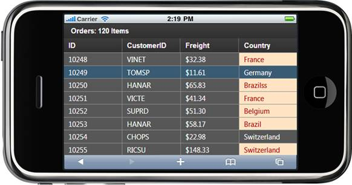

::: {style="DISPLAY: none"}
{#d2h_url_template}{#d2h_package_url style="WIDTH: 0px; DISPLAY: none; HEIGHT: 0px"}
:::

::::: {#nsbanner .d2h_main_nsbanner style="BORDER-BOTTOM: #999999 1px solid; POSITION: relative; PADDING-BOTTOM: 0px; BACKGROUND-COLOR: transparent; PADDING-LEFT: 0px; PADDING-RIGHT: 0px; DISPLAY: none; BORDER-TOP: #999999 1px solid; PADDING-TOP: 0px; LEFT: 0px"}
:::: {#TitleRow .d2h_main_titlerow style="PADDING-BOTTOM: 4px; BACKGROUND-COLOR: transparent; PADDING-LEFT: 22px; WIDTH: 100%; PADDING-RIGHT: 10px; DISPLAY: none; PADDING-TOP: 4px"}
::: {#ienav .d2h_main_ienav style="DISPLAY: none"}
{#D2HPrevious .D2HPreviousEnabled}  {#D2HNext .D2HNextEnabled}
:::
::::
:::::

:::: {#nstext .d2h_main_nstext style="PADDING-BOTTOM: 10px; BACKGROUND-COLOR: transparent; PADDING-LEFT: 22px; PADDING-RIGHT: 10px; HEIGHT: 100%; OVERFLOW: auto; PADDING-TOP: 5px" hasuserbackground="true" valign="bottom"}
::: {#d2h_breadcrumbs .d2h_breadcrumbs}
[Essential Studio User Guide Documentation](ms-xhelp:///?Id=12457748-09e3-4d74-a240-8e049cedf030){.d2h_breadcrumbsNormal}[ \> ]{.d2h_breadcrumbsLinkSeparator}[User Interface Edition](ms-xhelp:///?Id=c29296b7-531c-413b-a0ec-488ca1f7f669){.d2h_breadcrumbsNormal}[ \> ]{.d2h_breadcrumbsLinkSeparator}[Essential Mobile MVC](ms-xhelp:///?Id=74df42e3-5434-4590-9be6-3ae2f911cbbc){.d2h_breadcrumbsNormal}[ \> ]{.d2h_breadcrumbsLinkSeparator}[Essential Grid]{.d2h_breadcrumbsContentsOnly}[ \> ]{.d2h_breadcrumbsLinkSeparator}[Concepts and Features](ms-xhelp:///?Id=45772664-2e19-4523-9f80-67c80a02ab5e){.d2h_breadcrumbsNormal}[ \> ]{.d2h_breadcrumbsLinkSeparator}[Formatting](ms-xhelp:///?Id=2d37eba0-ec21-4071-905a-63219f5173f9){.d2h_breadcrumbsNormal}
:::

### Conditional Formatting {#conditional-formatting style="tab-stops: 0pt"}

This feature is used to format grid content based on some condition specified by the user.

1.  Create a model in the application (Refer to [[Getting Started \> Adding a Model to the Razor Application]{.ughyperlink}](ms-xhelp:///?Id=a78221a2-2f66-41bd-925e-bb300459b813)).

2.  Add the following code in the **Index.cshtml** file to create the Grid control in the view.

 

**[View \[cshtml\]]{style="FONT-FAMILY: 'Courier New'"}**

 [@]{style="FONT-FAMILY: 'Courier New'; BACKGROUND: yellow"}[{]{style="FONT-FAMILY: 'Courier New'"}

[Html.MobSyncfusion().Grid\<Order\>(\"grid\")]{style="FONT-FAMILY: Consolas; FONT-SIZE: 9.5pt"}

[           .Datasource(Model).Caption(\"Orders\")]{style="FONT-FAMILY: Consolas; FONT-SIZE: 9.5pt"}

[           .ActionMode(MobActionMode.Server).EnablePaging()]{style="FONT-FAMILY: Consolas; FONT-SIZE: 9.5pt"}

[           .Column(col =\>]{style="FONT-FAMILY: Consolas; FONT-SIZE: 9.5pt"}

[           {]{style="FONT-FAMILY: Consolas; FONT-SIZE: 9.5pt"}

[               col.Add(c =\> c.OrderID).HeaderText(\"ID\");]{style="FONT-FAMILY: Consolas; FONT-SIZE: 9.5pt"}

[               col.Add(c =\> c.CustomerID).HeaderText(\"CustomerID\");]{style="FONT-FAMILY: Consolas; FONT-SIZE: 9.5pt"}

[               col.Add(c =\> c.Freight).HeaderText(\"Freight\").Format(\"{0:C}\");]{style="FONT-FAMILY: Consolas; FONT-SIZE: 9.5pt"}

[               col.Add(c =\> c.ShipCountry).HeaderText(\"Country\");]{style="FONT-FAMILY: Consolas; FONT-SIZE: 9.5pt"}

[           }).PageSettings(p =\> p.ShowPager(true)).Render();]{style="FONT-FAMILY: Consolas; FONT-SIZE: 9.5pt"}

[}]{style="FONT-FAMILY: 'Courier New'; BACKGROUND: yellow"}[  ]{style="FONT-FAMILY: 'Courier New'"}[]{style="FONT-FAMILY: Consolas; FONT-SIZE: 9.5pt"}
::::

**[View \[ASPX\]]{style="FONT-FAMILY: 'Courier New'; COLOR: black"}** \
\
[]{style="FONT-FAMILY: Consolas; COLOR: blue; FONT-SIZE: 9.5pt"}

[   [\<%]{style="BACKGROUND: yellow"}[=]{style="COLOR: blue"} ]{style="FONT-FAMILY: 'Courier New'"}[Html.MobSyncfusion().Grid\<Order\>(\"grid\")]{style="FONT-FAMILY: Consolas; FONT-SIZE: 9.5pt"}

[           .Datasource(Model).Caption(\"Orders\")]{style="FONT-FAMILY: Consolas; FONT-SIZE: 9.5pt"}

[           .ActionMode(MobActionMode.Server).EnablePaging()]{style="FONT-FAMILY: Consolas; FONT-SIZE: 9.5pt"}

[           .Column(col =\>]{style="FONT-FAMILY: Consolas; FONT-SIZE: 9.5pt"}

[           {]{style="FONT-FAMILY: Consolas; FONT-SIZE: 9.5pt"}

[               col.Add(c =\> c.OrderID).HeaderText(\"ID\");]{style="FONT-FAMILY: Consolas; FONT-SIZE: 9.5pt"}

[               col.Add(c =\> c.CustomerID).HeaderText(\"CustomerID\");]{style="FONT-FAMILY: Consolas; FONT-SIZE: 9.5pt"}

[               col.Add(c =\> c.Freight).HeaderText(\"Freight\").Format(\"{0:C}\");]{style="FONT-FAMILY: Consolas; FONT-SIZE: 9.5pt"}

[               col.Add(c =\> c.ShipCountry).HeaderText(\"Country\");]{style="FONT-FAMILY: Consolas; FONT-SIZE: 9.5pt"}

[           }).PageSettings(p =\> p.ShowPager(true))]{style="FONT-FAMILY: Consolas; FONT-SIZE: 9.5pt"}

[]{style="FONT-FAMILY: 'Courier New'"} 

[%\>]{style="FONT-FAMILY: 'Courier New'; BACKGROUND: yellow"}[]{style="FONT-SIZE: 12pt"}

 

3.  Create a **MobGridPropertiesModel** object in the **Index** method. Assign grid properties in this model and pass the model from the **controller** to the **view** using the **ViewData** class as shown below:

 

+------------------------------------------------------------------------------------------------------------------------------------------------------------------------------------------------------------------------------------------------------------------------------+
| []{style="FONT-FAMILY: 'Courier New'; COLOR: blue"}                                                                                                                                                                                                                          |
|                                                                                                                                                                                                                                                                              |
| [public]{style="FONT-FAMILY: Consolas; COLOR: blue; FONT-SIZE: 9.5pt"}[ [ActionResult]{style="COLOR: #2b91af"} Index()]{style="FONT-FAMILY: Consolas; FONT-SIZE: 9.5pt"}                                                                                                     |
|                                                                                                                                                                                                                                                                              |
| [        {]{style="FONT-FAMILY: Consolas; FONT-SIZE: 9.5pt"}                                                                                                                                                                                                                 |
|                                                                                                                                                                                                                                                                              |
| [             ]{style="FONT-FAMILY: Consolas; FONT-SIZE: 9.5pt"}                                                                                                                                                                                                             |
|                                                                                                                                                                                                                                                                              |
| [            [var]{style="COLOR: blue"} data = [new]{style="COLOR: blue"} [NorthwindDataContext]{style="COLOR: #2b91af"}().Orders.Take(120).ToList();]{style="FONT-FAMILY: Consolas; FONT-SIZE: 9.5pt"}                                                                      |
|                                                                                                                                                                                                                                                                              |
| [            [MobGridPropertiesModel]{style="COLOR: #2b91af"}\<[Order]{style="COLOR: #2b91af"}\> model = [new]{style="COLOR: blue"} [MobGridPropertiesModel]{style="COLOR: #2b91af"}\<[Order]{style="COLOR: #2b91af"}\>();]{style="FONT-FAMILY: Consolas; FONT-SIZE: 9.5pt"} |
|                                                                                                                                                                                                                                                                              |
| [            model.ConditionalFormats = [this]{style="COLOR: blue"}.ConditionFormats;]{style="FONT-FAMILY: Consolas; FONT-SIZE: 9.5pt"}                                                                                                                                      |
|                                                                                                                                                                                                                                                                              |
| [            ViewData\[[\"grid\"]{style="COLOR: #a31515"}\] = model;]{style="FONT-FAMILY: Consolas; FONT-SIZE: 9.5pt"}                                                                                                                                                       |
|                                                                                                                                                                                                                                                                              |
| [            [return]{style="COLOR: blue"} View(data);]{style="FONT-FAMILY: Consolas; FONT-SIZE: 9.5pt"}                                                                                                                                                                     |
|                                                                                                                                                                                                                                                                              |
| [        }]{style="FONT-FAMILY: Consolas; FONT-SIZE: 9.5pt"}                                                                                                                                                                                                                 |
+------------------------------------------------------------------------------------------------------------------------------------------------------------------------------------------------------------------------------------------------------------------------------+

 

4.  Create the conditional format handler as below.

 

+--------------------------------------------------------------------------------------------------------------------------------------------------------------------------------------------------------------------------------------------------------------------------------------------------------------------------------------------------------------------------------------------------------------------------------+
| **[Controller]{style="FONT-FAMILY: 'Courier New'; COLOR: black"}**                                                                                                                                                                                                                                                                                                                                                             |
|                                                                                                                                                                                                                                                                                                                                                                                                                                |
| []{style="FONT-FAMILY: 'Courier New'"}                                                                                                                                                                                                                                                                                                                                                                                         |
|                                                                                                                                                                                                                                                                                                                                                                                                                                |
| [        [private]{style="COLOR: blue"} [Collection]{style="COLOR: #2b91af"}\<[MobGridConditionalFormatDescriptor]{style="COLOR: #2b91af"}\<[Order]{style="COLOR: #2b91af"}\>\> ConditionFormats]{style="FONT-FAMILY: Consolas; FONT-SIZE: 9.5pt"}                                                                                                                                                                             |
|                                                                                                                                                                                                                                                                                                                                                                                                                                |
| [        {]{style="FONT-FAMILY: Consolas; FONT-SIZE: 9.5pt"}                                                                                                                                                                                                                                                                                                                                                                   |
|                                                                                                                                                                                                                                                                                                                                                                                                                                |
| [            [get]{style="COLOR: blue"}]{style="FONT-FAMILY: Consolas; FONT-SIZE: 9.5pt"}                                                                                                                                                                                                                                                                                                                                      |
|                                                                                                                                                                                                                                                                                                                                                                                                                                |
| [            {]{style="FONT-FAMILY: Consolas; FONT-SIZE: 9.5pt"}                                                                                                                                                                                                                                                                                                                                                               |
|                                                                                                                                                                                                                                                                                                                                                                                                                                |
| [                [MobGridDataCondition]{style="COLOR: #2b91af"}\<[Order]{style="COLOR: #2b91af"}\> condition1 = [new]{style="COLOR: blue"} [MobGridDataCondition]{style="COLOR: #2b91af"}\<[Order]{style="COLOR: #2b91af"}\>(c =\> c.Freight) { ConditionType = [MobGridDataConditionType]{style="COLOR: #2b91af"}.GreaterThan, Value = 30 };]{style="FONT-FAMILY: Consolas; FONT-SIZE: 9.5pt"}                                |
|                                                                                                                                                                                                                                                                                                                                                                                                                                |
| [                [MobGridDataCondition]{style="COLOR: #2b91af"}\<[Order]{style="COLOR: #2b91af"}\> condition2 = [new]{style="COLOR: blue"} [MobGridDataCondition]{style="COLOR: #2b91af"}\<[Order]{style="COLOR: #2b91af"}\>(c =\> c.CustomerID) { ConditionType = [MobGridDataConditionType]{style="COLOR: #2b91af"}.Equals, Value = [\"BERGS\"]{style="COLOR: #a31515"} };]{style="FONT-FAMILY: Consolas; FONT-SIZE: 9.5pt"} |
|                                                                                                                                                                                                                                                                                                                                                                                                                                |
| [                [MobGridConditionalFormatDescriptor]{style="COLOR: #2b91af"}\<[Order]{style="COLOR: #2b91af"}\> cFormat = [new]{style="COLOR: blue"} [MobGridConditionalFormatDescriptor]{style="COLOR: #2b91af"}\<[Order]{style="COLOR: #2b91af"}\>();]{style="FONT-FAMILY: Consolas; FONT-SIZE: 9.5pt"}                                                                                                                     |
|                                                                                                                                                                                                                                                                                                                                                                                                                                |
| [                cFormat.Name = [\"c4\"]{style="COLOR: #a31515"};]{style="FONT-FAMILY: Consolas; FONT-SIZE: 9.5pt"}                                                                                                                                                                                                                                                                                                            |
|                                                                                                                                                                                                                                                                                                                                                                                                                                |
| [                cFormat.ApplyStyleToColumn = [\"ShipCountry\"]{style="COLOR: #a31515"};]{style="FONT-FAMILY: Consolas; FONT-SIZE: 9.5pt"}                                                                                                                                                                                                                                                                                     |
|                                                                                                                                                                                                                                                                                                                                                                                                                                |
| [                cFormat.Conditions.Add(condition1);]{style="FONT-FAMILY: Consolas; FONT-SIZE: 9.5pt"}                                                                                                                                                                                                                                                                                                                         |
|                                                                                                                                                                                                                                                                                                                                                                                                                                |
| [                [// cFormat.Conditions.Add(condition2);]{style="COLOR: green"}]{style="FONT-FAMILY: Consolas; FONT-SIZE: 9.5pt"}                                                                                                                                                                                                                                                                                              |
|                                                                                                                                                                                                                                                                                                                                                                                                                                |
| [                cFormat.Cell.HtmlAttributes\[[\"style\"]{style="COLOR: #a31515"}\] = [\"background-color: Bisque;Color:#ac0c0c;\"]{style="COLOR: #a31515"};]{style="FONT-FAMILY: Consolas; FONT-SIZE: 9.5pt"}                                                                                                                                                                                                                 |
|                                                                                                                                                                                                                                                                                                                                                                                                                                |
| []{style="FONT-FAMILY: Consolas; FONT-SIZE: 9.5pt"}                                                                                                                                                                                                                                                                                                                                                                            |
|                                                                                                                                                                                                                                                                                                                                                                                                                                |
| []{style="FONT-FAMILY: Consolas; FONT-SIZE: 9.5pt"}                                                                                                                                                                                                                                                                                                                                                                            |
|                                                                                                                                                                                                                                                                                                                                                                                                                                |
| [                [MobGridDataCondition]{style="COLOR: #2b91af"}\<[Order]{style="COLOR: #2b91af"}\> condition3 = [new]{style="COLOR: blue"} [MobGridDataCondition]{style="COLOR: #2b91af"}\<[Order]{style="COLOR: #2b91af"}\>(c =\> c.Freight) { ConditionType = [MobGridDataConditionType]{style="COLOR: #2b91af"}.LessThan, Value = 15 };]{style="FONT-FAMILY: Consolas; FONT-SIZE: 9.5pt"}                                   |
|                                                                                                                                                                                                                                                                                                                                                                                                                                |
| [                [MobGridConditionalFormatDescriptor]{style="COLOR: #2b91af"}\<[Order]{style="COLOR: #2b91af"}\> rowFormat = [new]{style="COLOR: blue"} [MobGridConditionalFormatDescriptor]{style="COLOR: #2b91af"}\<[Order]{style="COLOR: #2b91af"}\>();]{style="FONT-FAMILY: Consolas; FONT-SIZE: 9.5pt"}                                                                                                                   |
|                                                                                                                                                                                                                                                                                                                                                                                                                                |
| [                rowFormat.Name = [\"condition1\"]{style="COLOR: #a31515"};]{style="FONT-FAMILY: Consolas; FONT-SIZE: 9.5pt"}                                                                                                                                                                                                                                                                                                  |
|                                                                                                                                                                                                                                                                                                                                                                                                                                |
| [                rowFormat.Conditions.Add(condition3);]{style="FONT-FAMILY: Consolas; FONT-SIZE: 9.5pt"}                                                                                                                                                                                                                                                                                                                       |
|                                                                                                                                                                                                                                                                                                                                                                                                                                |
| [                rowFormat.Cell.HtmlAttributes\[[\"style\"]{style="COLOR: #a31515"}\] = [\"background-color: #395b73;color:white;\"]{style="COLOR: #a31515"};]{style="FONT-FAMILY: Consolas; FONT-SIZE: 9.5pt"}                                                                                                                                                                                                                |
|                                                                                                                                                                                                                                                                                                                                                                                                                                |
| []{style="FONT-FAMILY: Consolas; FONT-SIZE: 9.5pt"}                                                                                                                                                                                                                                                                                                                                                                            |
|                                                                                                                                                                                                                                                                                                                                                                                                                                |
| []{style="FONT-FAMILY: Consolas; FONT-SIZE: 9.5pt"}                                                                                                                                                                                                                                                                                                                                                                            |
|                                                                                                                                                                                                                                                                                                                                                                                                                                |
| [                [Collection]{style="COLOR: #2b91af"}\<[MobGridConditionalFormatDescriptor]{style="COLOR: #2b91af"}\<[Order]{style="COLOR: #2b91af"}\>\> cf = [new]{style="COLOR: blue"} [Collection]{style="COLOR: #2b91af"}\<[MobGridConditionalFormatDescriptor]{style="COLOR: #2b91af"}\<[Order]{style="COLOR: #2b91af"}\>\>();]{style="FONT-FAMILY: Consolas; FONT-SIZE: 9.5pt"}                                          |
|                                                                                                                                                                                                                                                                                                                                                                                                                                |
| [                cf.Add(cFormat);]{style="FONT-FAMILY: Consolas; FONT-SIZE: 9.5pt"}                                                                                                                                                                                                                                                                                                                                            |
|                                                                                                                                                                                                                                                                                                                                                                                                                                |
| [                cf.Add(rowFormat);]{style="FONT-FAMILY: Consolas; FONT-SIZE: 9.5pt"}                                                                                                                                                                                                                                                                                                                                          |
|                                                                                                                                                                                                                                                                                                                                                                                                                                |
| []{style="FONT-FAMILY: Consolas; FONT-SIZE: 9.5pt"}                                                                                                                                                                                                                                                                                                                                                                            |
|                                                                                                                                                                                                                                                                                                                                                                                                                                |
| []{style="FONT-FAMILY: Consolas; FONT-SIZE: 9.5pt"}                                                                                                                                                                                                                                                                                                                                                                            |
|                                                                                                                                                                                                                                                                                                                                                                                                                                |
| [                [return]{style="COLOR: blue"} cf;]{style="FONT-FAMILY: Consolas; FONT-SIZE: 9.5pt"}                                                                                                                                                                                                                                                                                                                           |
|                                                                                                                                                                                                                                                                                                                                                                                                                                |
| [            }]{style="FONT-FAMILY: Consolas; FONT-SIZE: 9.5pt"}                                                                                                                                                                                                                                                                                                                                                               |
|                                                                                                                                                                                                                                                                                                                                                                                                                                |
| [        }]{style="FONT-FAMILY: Consolas; FONT-SIZE: 9.5pt"}                                                                                                                                                                                                                                                                                                                                                                   |
|                                                                                                                                                                                                                                                                                                                                                                                                                                |
| []{style="FONT-SIZE: 12pt"}                                                                                                                                                                                                                                                                                                                                                                                                    |
+--------------------------------------------------------------------------------------------------------------------------------------------------------------------------------------------------------------------------------------------------------------------------------------------------------------------------------------------------------------------------------------------------------------------------------+

 

5.  In order to work with paging/sorting actions, create a **Post** method for **Index** actions and bind the data source and the conditional format handler to the grid as shown in the following code.

 

[  ]{style="FONT-FAMILY: Consolas; COLOR: gray; FONT-SIZE: 9.5pt"}

+-----------------------------------------------------------------------------------------------------------------------------------------------------------------------------------------------------------------------------------------------------------------------------+
| **[Controller]{style="FONT-FAMILY: 'Courier New'; COLOR: black"}**                                                                                                                                                                                                          |
|                                                                                                                                                                                                                                                                             |
| []{style="FONT-FAMILY: 'Courier New'"}                                                                                                                                                                                                                                      |
|                                                                                                                                                                                                                                                                             |
| []{style="FONT-FAMILY: Consolas; FONT-SIZE: 9.5pt"}[]{style="FONT-SIZE: 12pt"}                                                                                                                                                                                              |
|                                                                                                                                                                                                                                                                             |
| [\[[AcceptVerbs]{style="COLOR: #2b91af"}([HttpVerbs]{style="COLOR: #2b91af"}.Post)\]]{style="FONT-FAMILY: Consolas; FONT-SIZE: 9.5pt"}                                                                                                                                      |
|                                                                                                                                                                                                                                                                             |
| [        [public]{style="COLOR: blue"} [ActionResult]{style="COLOR: #2b91af"} Index([MobGridParams]{style="COLOR: #2b91af"} args)]{style="FONT-FAMILY: Consolas; FONT-SIZE: 9.5pt"}                                                                                         |
|                                                                                                                                                                                                                                                                             |
| [        {]{style="FONT-FAMILY: Consolas; FONT-SIZE: 9.5pt"}                                                                                                                                                                                                                |
|                                                                                                                                                                                                                                                                             |
| [            [var]{style="COLOR: blue"} data = [new]{style="COLOR: blue"} [NorthwindDataContext]{style="COLOR: #2b91af"}().Orders.Take(120).ToList();]{style="FONT-FAMILY: Consolas; FONT-SIZE: 9.5pt"}                                                                     |
|                                                                                                                                                                                                                                                                             |
| [            [var]{style="COLOR: blue"} engine = data.MobGridActions\<[Order]{style="COLOR: #2b91af"}\>() [as]{style="COLOR: blue"} [MobGridHtmlActionResult]{style="COLOR: #2b91af"}\<[Order]{style="COLOR: #2b91af"}\>;]{style="FONT-FAMILY: Consolas; FONT-SIZE: 9.5pt"} |
|                                                                                                                                                                                                                                                                             |
| [            engine.GridModel.ConditionalFormats = ConditionFormats;]{style="FONT-FAMILY: Consolas; FONT-SIZE: 9.5pt"}                                                                                                                                                      |
|                                                                                                                                                                                                                                                                             |
| [            [return]{style="COLOR: blue"} engine;]{style="FONT-FAMILY: Consolas; FONT-SIZE: 9.5pt"}                                                                                                                                                                        |
|                                                                                                                                                                                                                                                                             |
| []{style="FONT-FAMILY: Consolas; FONT-SIZE: 9.5pt"}                                                                                                                                                                                                                         |
|                                                                                                                                                                                                                                                                             |
| [        }]{style="FONT-FAMILY: Consolas; FONT-SIZE: 9.5pt"}                                                                                                                                                                                                                |
+-----------------------------------------------------------------------------------------------------------------------------------------------------------------------------------------------------------------------------------------------------------------------------+

 

6.  Run the application. The grid will appear as shown below.

 

{border="0"}

Figure 62: Grid---Conditional Formatting

 

[]{#related-topics}
