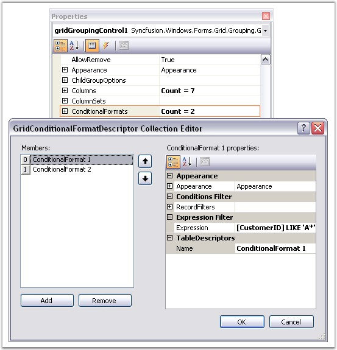
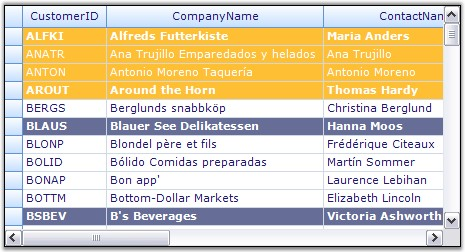

::: {style="DISPLAY: none"}
{#d2h_url_template}{#d2h_package_url style="WIDTH: 0px; DISPLAY: none; HEIGHT: 0px"}
:::

:::: {.d2h_secondary_topic style="PADDING-BOTTOM: 10pt; MARGIN: 0pt; PADDING-LEFT: 0pt; PADDING-RIGHT: 0pt; PADDING-TOP: 0pt"}
##### Conditional Formatting {#conditional-formatting style="tab-stops: 0pt"}

[]{style="FONT-FAMILY: 'Trebuchet MS','sans-serif'; COLOR: #15428b; FONT-SIZE: 9pt"} 

Grid Grouping control has in-built support for Conditional Formatting. This feature allows you to format grid cells based on a certain condition. This can be achieved by defining a **GridConditionalFormatDescriptor** for the grid. Using this descriptor, you can specify the filter criteria for the cells and the style to be applied for the filtered cells. Once these specifications are defined, then the given styles are applied to only those cells that satisfy the condition specified.

 

Conditional Formatting can be specified through the designer itself by accessing the **TableDescriptor.ConditionalFormats** property. This will open the GridConditionalFormatDescriptor editor wherein you can add as many formatters as you want. For each such formatter, you need to specify the filter criteria either by adding **RecordFilters** or by an **Expression**. The below property editor illustrates this process.

[]{style="FONT-FAMILY: 'Trebuchet MS','sans-serif'; COLOR: #15428b; FONT-SIZE: 9pt"} 

{border="0"}

[]{style="FONT-FAMILY: 'Trebuchet MS','sans-serif'; COLOR: #15428b; FONT-SIZE: 9pt"} 

*[Figure ]{style="FONT-SIZE: 9pt"}[324]{style="FONT-SIZE: 9pt"}[: GridConditionalFormatDescriptor Collection Editor]{style="FONT-SIZE: 9pt"}*

[]{style="FONT-FAMILY: 'Trebuchet MS','sans-serif'; COLOR: #15428b; FONT-SIZE: 9pt"} 

Programmatically

 

Following code example illustrates how to apply conditional formatting to the grouping grid.

[]{style="FONT-FAMILY: 'Trebuchet MS','sans-serif'; COLOR: #15428b; FONT-SIZE: 9pt"} 

1.   Define a Conditional Format Descriptor and specify a filter criteria and style to be applied.

[]{style="FONT-SIZE: 8pt"} 

+-------------------------------------------------------------------------------------------------------------------------------------------------------------------------------------------------------------------------------+
| **[\[C#\]]{style="FONT-FAMILY: 'Courier New'; COLOR: black"}**                                                                                                                                                                |
|                                                                                                                                                                                                                               |
| []{style="FONT-FAMILY: 'Courier New'; COLOR: green"}                                                                                                                                                                          |
|                                                                                                                                                                                                                               |
| [// Apply the following style to the records whose CustomerID starts with \'A\'.]{style="FONT-FAMILY: 'Courier New'; COLOR: green"}                                                                                           |
|                                                                                                                                                                                                                               |
| [GridConditionalFormatDescriptor]{style="FONT-FAMILY: 'Courier New'; COLOR: #2b91af"}[ format1 = [new]{style="COLOR: blue"} [GridConditionalFormatDescriptor]{style="COLOR: #2b91af"}();]{style="FONT-FAMILY: 'Courier New'"} |
|                                                                                                                                                                                                                               |
| [format1.Appearance.AnyRecordFieldCell.Interior = [new]{style="COLOR: blue"} BrushInfo([Color]{style="COLOR: #2b91af"}.FromArgb(255, 191, 52));]{style="FONT-FAMILY: 'Courier New'"}                                          |
|                                                                                                                                                                                                                               |
| [format1.Appearance.AnyRecordFieldCell.TextColor = [Color]{style="COLOR: #2b91af"}.White;]{style="FONT-FAMILY: 'Courier New'"}                                                                                                |
|                                                                                                                                                                                                                               |
| [format1.Expression = [\"\[CustomerID\]  LIKE \\\'A\*\\\'\"]{style="COLOR: #a31515"};]{style="FONT-FAMILY: 'Courier New'"}                                                                                                    |
|                                                                                                                                                                                                                               |
| [format1.Name = [\"ConditionalFormat 1\"]{style="COLOR: #a31515"};]{style="FONT-FAMILY: 'Courier New'"}                                                                                                                       |
|                                                                                                                                                                                                                               |
| []{style="FONT-FAMILY: 'Courier New'"}                                                                                                                                                                                        |
|                                                                                                                                                                                                                               |
| [// Apply the following style to the records whose ContactTitle = \'Sales Representative\'.]{style="FONT-FAMILY: 'Courier New'; COLOR: green"}                                                                                |
|                                                                                                                                                                                                                               |
| [GridConditionalFormatDescriptor]{style="FONT-FAMILY: 'Courier New'; COLOR: #2b91af"}[ format2 = [new]{style="COLOR: blue"} [GridConditionalFormatDescriptor]{style="COLOR: #2b91af"}();]{style="FONT-FAMILY: 'Courier New'"} |
|                                                                                                                                                                                                                               |
| [format2.Appearance.AnyRecordFieldCell.Font.Bold = [true]{style="COLOR: blue"};]{style="FONT-FAMILY: 'Courier New'"}                                                                                                          |
|                                                                                                                                                                                                                               |
| [format2.Appearance.AnyRecordFieldCell.Interior = [new]{style="COLOR: blue"} BrushInfo([Color]{style="COLOR: #2b91af"}.FromArgb(102, 110, 152));]{style="FONT-FAMILY: 'Courier New'"}                                         |
|                                                                                                                                                                                                                               |
| [format2.Appearance.AnyRecordFieldCell.TextColor = [Color]{style="COLOR: #2b91af"}.White;]{style="FONT-FAMILY: 'Courier New'"}                                                                                                |
|                                                                                                                                                                                                                               |
| [format2.Expression = [\"\[ContactTitle\] LIKE \\\'Sales Representative\\\'\"]{style="COLOR: #a31515"};]{style="FONT-FAMILY: 'Courier New'"}                                                                                  |
|                                                                                                                                                                                                                               |
| [format2.Name = [\"ConditionalFormat 2\"]{style="COLOR: #a31515"};]{style="FONT-FAMILY: 'Courier New'"}                                                                                                                       |
+-------------------------------------------------------------------------------------------------------------------------------------------------------------------------------------------------------------------------------+

[]{style="FONT-FAMILY: 'Trebuchet MS','sans-serif'; COLOR: #15428b; FONT-SIZE: 9pt"} 

+-------------------------------------------------------------------------------------------------------------------------------------------------------------------------------------------------------------------------------------------------------------------------------------------------------------------------------------------------------+
| **[\[VB.NET\]]{style="FONT-FAMILY: 'Courier New'; COLOR: black"}**                                                                                                                                                                                                                                                                                    |
|                                                                                                                                                                                                                                                                                                                                                       |
| []{style="FONT-FAMILY: 'Courier New'; COLOR: black"}                                                                                                                                                                                                                                                                                                  |
|                                                                                                                                                                                                                                                                                                                                                       |
| [\'Apply the following style to the records whose CustomerID starts with \'A\']{style="FONT-FAMILY: 'Courier New'; COLOR: green"}                                                                                                                                                                                                                     |
|                                                                                                                                                                                                                                                                                                                                                       |
| [Dim]{style="FONT-FAMILY: 'Courier New'; COLOR: blue"}[ ]{style="FONT-FAMILY: 'Courier New'; COLOR: teal"}[format1[ ]{style="COLOR: teal"}[As]{style="COLOR: blue"}[ GridConditionalFormatDescriptor]{style="COLOR: teal"} = [New]{style="COLOR: blue"} [GridConditionalFormatDescriptor]{style="COLOR: teal"}()]{style="FONT-FAMILY: 'Courier New'"} |
|                                                                                                                                                                                                                                                                                                                                                       |
| [format1.Appearance.AnyRecordFieldCell.Interior = [New]{style="COLOR: blue"} [BrushInfo]{style="COLOR: teal"}([Color]{style="COLOR: teal"}.FromArgb(255, 191, 52))]{style="FONT-FAMILY: 'Courier New'"}                                                                                                                                               |
|                                                                                                                                                                                                                                                                                                                                                       |
| [format1.Appearance.AnyRecordFieldCell.TextColor = [Color]{style="COLOR: teal"}.White]{style="FONT-FAMILY: 'Courier New'"}                                                                                                                                                                                                                            |
|                                                                                                                                                                                                                                                                                                                                                       |
| [format1.Expression = [\"\[CustomerID\]  LIKE \\\'A\*\\\'\"]{style="COLOR: maroon"}]{style="FONT-FAMILY: 'Courier New'"}                                                                                                                                                                                                                              |
|                                                                                                                                                                                                                                                                                                                                                       |
| [format1.Name = [\"ConditionalFormat 1\"]{style="COLOR: maroon"}]{style="FONT-FAMILY: 'Courier New'"}                                                                                                                                                                                                                                                 |
|                                                                                                                                                                                                                                                                                                                                                       |
| []{style="FONT-FAMILY: 'Courier New'"}                                                                                                                                                                                                                                                                                                                |
|                                                                                                                                                                                                                                                                                                                                                       |
| [\'Apply the following style to the records whose ContactTitle = \'Sales Representative\']{style="FONT-FAMILY: 'Courier New'; COLOR: green"}                                                                                                                                                                                                          |
|                                                                                                                                                                                                                                                                                                                                                       |
| [Dim]{style="FONT-FAMILY: 'Courier New'; COLOR: blue"}[ ]{style="FONT-FAMILY: 'Courier New'; COLOR: teal"}[format2[ ]{style="COLOR: teal"}[As ]{style="COLOR: blue"}[GridConditionalFormatDescriptor]{style="COLOR: teal"} = [New]{style="COLOR: blue"} [GridConditionalFormatDescriptor]{style="COLOR: teal"}()]{style="FONT-FAMILY: 'Courier New'"} |
|                                                                                                                                                                                                                                                                                                                                                       |
| [format2.Appearance.AnyRecordFieldCell.Font.Bold = [True]{style="COLOR: blue"}]{style="FONT-FAMILY: 'Courier New'"}                                                                                                                                                                                                                                   |
|                                                                                                                                                                                                                                                                                                                                                       |
| [format2.Appearance.AnyRecordFieldCell.Interior = [New]{style="COLOR: blue"} [BrushInfo]{style="COLOR: teal"}([Color]{style="COLOR: teal"}.FromArgb(102, 110, 152))]{style="FONT-FAMILY: 'Courier New'"}                                                                                                                                              |
|                                                                                                                                                                                                                                                                                                                                                       |
| [format2.Appearance.AnyRecordFieldCell.TextColor = [Color]{style="COLOR: teal"}.White]{style="FONT-FAMILY: 'Courier New'"}                                                                                                                                                                                                                            |
|                                                                                                                                                                                                                                                                                                                                                       |
| [format2.Expression = [\"\[ContactTitle\] LIKE \\\'Sales Representative\\\'\"]{style="COLOR: maroon"}]{style="FONT-FAMILY: 'Courier New'"}                                                                                                                                                                                                            |
|                                                                                                                                                                                                                                                                                                                                                       |
| [format2.Name = [\"ConditionalFormat 2\"]{style="COLOR: maroon"}]{style="FONT-FAMILY: 'Courier New'"}                                                                                                                                                                                                                                                 |
+-------------------------------------------------------------------------------------------------------------------------------------------------------------------------------------------------------------------------------------------------------------------------------------------------------------------------------------------------------+

[]{style="FONT-FAMILY: 'Trebuchet MS','sans-serif'; COLOR: #15428b; FONT-SIZE: 9pt"} 

2.   Add the descriptor to the TableDescriptor.ConditionalFormats property.

[]{style="FONT-SIZE: 8pt"} 

+---------------------------------------------------------------------------------------------------------------------------------------------------------------------+
| **[\[C#\]]{style="FONT-FAMILY: 'Courier New'; COLOR: black"}**                                                                                                      |
|                                                                                                                                                                     |
| []{style="FONT-FAMILY: 'Courier New'; COLOR: black"}                                                                                                                |
|                                                                                                                                                                     |
| [this]{style="FONT-FAMILY: 'Courier New'; COLOR: blue"}[.gridGroupingControl1.TableDescriptor.ConditionalFormats.Add(format1);]{style="FONT-FAMILY: 'Courier New'"} |
|                                                                                                                                                                     |
| [this]{style="FONT-FAMILY: 'Courier New'; COLOR: blue"}[.gridGroupingControl1.TableDescriptor.ConditionalFormats.Add(format2);]{style="FONT-FAMILY: 'Courier New'"} |
+---------------------------------------------------------------------------------------------------------------------------------------------------------------------+

[]{style="FONT-FAMILY: 'Trebuchet MS','sans-serif'; COLOR: #15428b; FONT-SIZE: 9pt"} 

+------------------------------------------------------------------------------------------------------------------------------------------------------------------+
| **[\[VB.NET\]]{style="FONT-FAMILY: 'Courier New'; COLOR: black"}**                                                                                               |
|                                                                                                                                                                  |
| []{style="FONT-FAMILY: 'Courier New'; COLOR: black"}                                                                                                             |
|                                                                                                                                                                  |
| [Me]{style="FONT-FAMILY: 'Courier New'; COLOR: blue"}[.gridGroupingControl1.TableDescriptor.ConditionalFormats.Add(format1)]{style="FONT-FAMILY: 'Courier New'"} |
|                                                                                                                                                                  |
| [Me]{style="FONT-FAMILY: 'Courier New'; COLOR: blue"}[.gridGroupingControl1.TableDescriptor.ConditionalFormats.Add(format2)]{style="FONT-FAMILY: 'Courier New'"} |
+------------------------------------------------------------------------------------------------------------------------------------------------------------------+

[]{style="FONT-FAMILY: 'Trebuchet MS','sans-serif'; COLOR: #15428b; FONT-SIZE: 9pt"} 

Given below is a sample screenshot.

[]{style="FONT-FAMILY: 'Trebuchet MS','sans-serif'; COLOR: #15428b; FONT-SIZE: 9pt"} 

{border="0"}

[]{style="FONT-FAMILY: 'Trebuchet MS','sans-serif'; COLOR: #15428b; FONT-SIZE: 9pt"} 

*[Figure ]{style="FONT-SIZE: 9pt"}[325]{style="FONT-SIZE: 9pt"}[: Conditional Formatting applied to the Grid Grouping Control]{style="FONT-SIZE: 9pt"}*

::: {style="BORDER-BOTTOM: windowtext 1pt solid; BORDER-LEFT: medium none; PADDING-BOTTOM: 1pt; MARGIN-TOP: 9pt; PADDING-LEFT: 0pt; PADDING-RIGHT: 0pt; MARGIN-BOTTOM: 9pt; BORDER-TOP: windowtext 1pt solid; BORDER-RIGHT: medium none; PADDING-TOP: 1pt"}
 

{border="0"}Note: For more details, refer the following browser sample:

 

\<Install Location\>\\Syncfusion\\EssentialStudio\\\[Version Number\]\\Windows\\Grid.Grouping.Windows\\Samples\\2.0\\Appearance\\Conditional Formatting Demo
:::

 

[]{#p452} 

 

[]{#related-topics}
::::
