::: {style="DISPLAY: none"}
{#d2h_url_template}{#d2h_package_url style="WIDTH: 0px; DISPLAY: none; HEIGHT: 0px"}
:::

::::: {.d2h_secondary_topic style="PADDING-BOTTOM: 10pt; MARGIN: 0pt; PADDING-LEFT: 0pt; PADDING-RIGHT: 0pt; PADDING-TOP: 0pt"}
##### Conditional Formatting {#conditional-formatting style="tab-stops: 0pt"}

[]{style="FONT-FAMILY: 'Trebuchet MS','sans-serif'; FONT-SIZE: 12pt"} 

Conditional formatting is a feature by which the contents of a cell are dynamically formatted, based on a value. It allows you to define and apply formatting to some cells, text, and numbers, based on the criteria that is set. For example, you can format a time sheet, to point out the overtime obtained by the employee. You can also use it to track the best sales employees in a company, by setting a quota that makes a cell range particular.

[]{style="FONT-FAMILY: 'Trebuchet MS','sans-serif'; COLOR: #15428b; FONT-SIZE: 9pt"} 

In MS Excel, Click the **Format** menu and then click **Conditional Formatting**. You can use any criteria of your choice. The formatting could be applied to cells\' values or a particular formula.

[]{style="FONT-FAMILY: 'Trebuchet MS','sans-serif'; COLOR: #15428b; FONT-SIZE: 9pt"} 

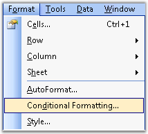{border="0"}

Figure 46: Conditional Formatting option displayed in Format Menu[]{style="FONT-FAMILY: 'Trebuchet MS','sans-serif'; COLOR: #15428b"}

***[]{style="FONT-FAMILY: 'Trebuchet MS','sans-serif'; COLOR: #15428b; FONT-SIZE: 9pt"}*** 

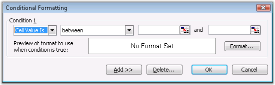{border="0"}

Figure 47: Using Conditional Formatting Feature in MS Excel[]{style="FONT-FAMILY: 'Trebuchet MS','sans-serif'; COLOR: #15428b"}

[]{style="FONT-FAMILY: 'Trebuchet MS','sans-serif'; COLOR: #15428b; FONT-SIZE: 9pt"} 

::: {style="BORDER-BOTTOM: windowtext 1pt solid; BORDER-LEFT: medium none; PADDING-BOTTOM: 1pt; MARGIN-TOP: 9pt; PADDING-LEFT: 0pt; PADDING-RIGHT: 0pt; MARGIN-BOTTOM: 9pt; BORDER-TOP: windowtext 1pt solid; BORDER-RIGHT: medium none; PADDING-TOP: 1pt"}
Note: Excel allows the addition of a maximum of three conditions only, for the same cell in the Biff8 format. However, this restriction is overcome in Excel 2007 formats.
:::

 

Conditional Formatting in XlsIO

 

XlsIO allows to create conditional formats by using **IConditionFormats**, and various conditions can be set by using its properties. It also provides support for applying more than  three conditional formats in the same cell, in the **.xlsx** format.

 

For more details, see [[http://www.syncfusion.com:91/products/xlsio/backoffice/Articles/conditional_formatting.aspx]{.UGHyperlink}](http://www.syncfusion.com:91/products/xlsio/backoffice/Articles/conditional_formatting.aspx).

 

Following is the code snippet for creating and applying various conditional formats in XlsIO.

 

+--------------------------------------------------------------------------------------------------------------------------------------------------------------------------------------------------+
| **[\[C#\]]{style="FONT-FAMILY: 'Courier New'"}**                                                                                                                                                 |
|                                                                                                                                                                                                  |
| []{style="FONT-FAMILY: 'Courier New'"}                                                                                                                                                           |
|                                                                                                                                                                                                  |
| [// Applying conditional formatting to \"A1\" for format type as CellValue(Between).]{style="FONT-FAMILY: 'Courier New'; COLOR: green"}                                                          |
|                                                                                                                                                                                                  |
| [IConditionalFormats]{style="FONT-FAMILY: 'Courier New'; COLOR: #2b91af"}[ condition = sheet.Range\[[\"A1\"]{style="COLOR: #a31515"}\].ConditionalFormats;]{style="FONT-FAMILY: 'Courier New'"}  |
|                                                                                                                                                                                                  |
| []{style="FONT-FAMILY: 'Courier New'"}                                                                                                                                                           |
|                                                                                                                                                                                                  |
| [// Adding formats to IConditionalFormats collection.]{style="FONT-FAMILY: 'Courier New'; COLOR: green"}                                                                                         |
|                                                                                                                                                                                                  |
| [IConditionalFormat]{style="FONT-FAMILY: 'Courier New'; COLOR: #2b91af"}[ condition1 = condition.AddCondition();]{style="FONT-FAMILY: 'Courier New'"}                                            |
|                                                                                                                                                                                                  |
| [sheet.Range\[[\"A1\"]{style="COLOR: #a31515"}\].Text = [\"Enter a Number between 10 to 20\"]{style="COLOR: #a31515"};]{style="FONT-FAMILY: 'Courier New'"}                                      |
|                                                                                                                                                                                                  |
| [condition1.FirstFormula = [\"10\"]{style="COLOR: #a31515"};]{style="FONT-FAMILY: 'Courier New'"}                                                                                                |
|                                                                                                                                                                                                  |
| [condition1.SecondFormula = [\"20\"]{style="COLOR: #a31515"};]{style="FONT-FAMILY: 'Courier New'"}                                                                                               |
|                                                                                                                                                                                                  |
| []{style="FONT-FAMILY: 'Courier New'"}                                                                                                                                                           |
|                                                                                                                                                                                                  |
| [// Setting format properties.]{style="FONT-FAMILY: 'Courier New'; COLOR: green"}                                                                                                                |
|                                                                                                                                                                                                  |
| [condition1.Operator = [ExcelComparisonOperator]{style="COLOR: #2b91af"}.Between;]{style="FONT-FAMILY: 'Courier New'"}                                                                           |
|                                                                                                                                                                                                  |
| [condition1.FormatType = [ExcelCFType]{style="COLOR: #2b91af"}.CellValue;]{style="FONT-FAMILY: 'Courier New'"}                                                                                   |
|                                                                                                                                                                                                  |
| [condition1.BackColor = [ExcelKnownColors]{style="COLOR: #2b91af"}.Light_orange;]{style="FONT-FAMILY: 'Courier New'"}                                                                            |
|                                                                                                                                                                                                  |
| [condition1.IsBold = [true]{style="COLOR: blue"};]{style="FONT-FAMILY: 'Courier New'"}                                                                                                           |
|                                                                                                                                                                                                  |
| [condition1.IsItalic = [true]{style="COLOR: blue"};]{style="FONT-FAMILY: 'Courier New'"}                                                                                                         |
|                                                                                                                                                                                                  |
| []{style="FONT-FAMILY: 'Courier New'"}                                                                                                                                                           |
|                                                                                                                                                                                                  |
| [// Applying conditional formatting to \"A3\" for format type as CellValue(Equal).]{style="FONT-FAMILY: 'Courier New'; COLOR: green"}                                                            |
|                                                                                                                                                                                                  |
| [IConditionalFormats]{style="FONT-FAMILY: 'Courier New'; COLOR: #2b91af"}[ condition2 = sheet.Range\[[\"A3\"]{style="COLOR: #a31515"}\].ConditionalFormats;]{style="FONT-FAMILY: 'Courier New'"} |
|                                                                                                                                                                                                  |
| []{style="FONT-FAMILY: 'Courier New'"}                                                                                                                                                           |
|                                                                                                                                                                                                  |
| [// Adding formats to the IConditionalFormats collection.]{style="FONT-FAMILY: 'Courier New'; COLOR: green"}                                                                                     |
|                                                                                                                                                                                                  |
| [IConditionalFormat]{style="FONT-FAMILY: 'Courier New'; COLOR: #2b91af"}[ condition3 = condition2.AddCondition();]{style="FONT-FAMILY: 'Courier New'"}                                           |
|                                                                                                                                                                                                  |
| [sheet.Range\[[\"A3\"]{style="COLOR: #a31515"}\].Text = [\"Enter the Number as 1000\"]{style="COLOR: #a31515"};]{style="FONT-FAMILY: 'Courier New'"}                                             |
|                                                                                                                                                                                                  |
| []{style="FONT-FAMILY: 'Courier New'"}                                                                                                                                                           |
|                                                                                                                                                                                                  |
| [// Setting format properties.]{style="FONT-FAMILY: 'Courier New'; COLOR: green"}                                                                                                                |
|                                                                                                                                                                                                  |
| [condition3.FormatType = [ExcelCFType]{style="COLOR: #2b91af"}.CellValue;]{style="FONT-FAMILY: 'Courier New'"}                                                                                   |
|                                                                                                                                                                                                  |
| [condition3.Operator = [ExcelComparisonOperator]{style="COLOR: #2b91af"}.Equal;]{style="FONT-FAMILY: 'Courier New'"}                                                                             |
|                                                                                                                                                                                                  |
| [condition3.FirstFormula = [\"1000\"]{style="COLOR: #a31515"};]{style="FONT-FAMILY: 'Courier New'"}                                                                                              |
|                                                                                                                                                                                                  |
| [condition3.FontColor = [ExcelKnownColors]{style="COLOR: #2b91af"}.Magenta;]{style="FONT-FAMILY: 'Courier New'"}                                                                                 |
|                                                                                                                                                                                                  |
| []{style="FONT-FAMILY: 'Courier New'"}                                                                                                                                                           |
|                                                                                                                                                                                                  |
| [// Applying conditional formatting to \"A5\" for format type as CellValue (Not between).]{style="FONT-FAMILY: 'Courier New'; COLOR: green"}                                                     |
|                                                                                                                                                                                                  |
| [IConditionalFormats]{style="FONT-FAMILY: 'Courier New'; COLOR: #2b91af"}[ condition4 = sheet.Range\[[\"A5\"]{style="COLOR: #a31515"}\].ConditionalFormats;]{style="FONT-FAMILY: 'Courier New'"} |
|                                                                                                                                                                                                  |
| []{style="FONT-FAMILY: 'Courier New'"}                                                                                                                                                           |
|                                                                                                                                                                                                  |
| [// Adding formats to the IConditionalFormats collection.]{style="FONT-FAMILY: 'Courier New'; COLOR: green"}                                                                                     |
|                                                                                                                                                                                                  |
| [IConditionalFormat]{style="FONT-FAMILY: 'Courier New'; COLOR: #2b91af"}[ condition5 = condition4.AddCondition();]{style="FONT-FAMILY: 'Courier New'"}                                           |
|                                                                                                                                                                                                  |
| [sheet.Range\[[\"A5\"]{style="COLOR: #a31515"}\].Text = [\"Enter a Number not between 100 to 200\"]{style="COLOR: #a31515"};]{style="FONT-FAMILY: 'Courier New'"}                                |
|                                                                                                                                                                                                  |
| []{style="FONT-FAMILY: 'Courier New'"}                                                                                                                                                           |
|                                                                                                                                                                                                  |
| [// Setting format properties.]{style="FONT-FAMILY: 'Courier New'; COLOR: green"}                                                                                                                |
|                                                                                                                                                                                                  |
| [condition5.FormatType = [ExcelCFType]{style="COLOR: #2b91af"}.CellValue;]{style="FONT-FAMILY: 'Courier New'"}                                                                                   |
|                                                                                                                                                                                                  |
| [condition5.Operator = [ExcelComparisonOperator]{style="COLOR: #2b91af"}.NotBetween;]{style="FONT-FAMILY: 'Courier New'"}                                                                        |
|                                                                                                                                                                                                  |
| [condition5.FirstFormula = [\"100\"]{style="COLOR: #a31515"};]{style="FONT-FAMILY: 'Courier New'"}                                                                                               |
|                                                                                                                                                                                                  |
| [condition5.SecondFormula = [\"200\"]{style="COLOR: #a31515"};]{style="FONT-FAMILY: 'Courier New'"}                                                                                              |
|                                                                                                                                                                                                  |
| [condition5.FillPattern = [ExcelPattern]{style="COLOR: #2b91af"}.DarkVertical;]{style="FONT-FAMILY: 'Courier New'"}                                                                              |
|                                                                                                                                                                                                  |
| []{style="FONT-FAMILY: 'Courier New'"}                                                                                                                                                           |
|                                                                                                                                                                                                  |
| [// Applying conditional formatting to \"A7\" for format type as CellValue(LessOrEqual).]{style="FONT-FAMILY: 'Courier New'; COLOR: green"}                                                      |
|                                                                                                                                                                                                  |
| [IConditionalFormats]{style="FONT-FAMILY: 'Courier New'; COLOR: #2b91af"}[ condition6 = sheet.Range\[[\"A7\"]{style="COLOR: #a31515"}\].ConditionalFormats;]{style="FONT-FAMILY: 'Courier New'"} |
|                                                                                                                                                                                                  |
| []{style="FONT-FAMILY: 'Courier New'"}                                                                                                                                                           |
|                                                                                                                                                                                                  |
| [//Adding formats to IConditionalFormats collection]{style="FONT-FAMILY: 'Courier New'; COLOR: green"}                                                                                           |
|                                                                                                                                                                                                  |
| [IConditionalFormat]{style="FONT-FAMILY: 'Courier New'; COLOR: #2b91af"}[ condition7 = condition6.AddCondition();]{style="FONT-FAMILY: 'Courier New'"}                                           |
|                                                                                                                                                                                                  |
| [sheet.Range\[[\"A7\"]{style="COLOR: #a31515"}\].Text = [\"Enter a Number which is less than or equal to 1000\"]{style="COLOR: #a31515"};]{style="FONT-FAMILY: 'Courier New'"}                   |
|                                                                                                                                                                                                  |
| []{style="FONT-FAMILY: 'Courier New'"}                                                                                                                                                           |
|                                                                                                                                                                                                  |
| [// Setting format properties.]{style="FONT-FAMILY: 'Courier New'; COLOR: green"}                                                                                                                |
|                                                                                                                                                                                                  |
| [condition7.FormatType = [ExcelCFType]{style="COLOR: #2b91af"}.CellValue;]{style="FONT-FAMILY: 'Courier New'"}                                                                                   |
|                                                                                                                                                                                                  |
| [condition7.Operator = [ExcelComparisonOperator]{style="COLOR: #2b91af"}.LessOrEqual;]{style="FONT-FAMILY: 'Courier New'"}                                                                       |
|                                                                                                                                                                                                  |
| [condition7.FirstFormula = [\"1000\"]{style="COLOR: #a31515"};]{style="FONT-FAMILY: 'Courier New'"}                                                                                              |
|                                                                                                                                                                                                  |
| [condition7.BackColor = [ExcelKnownColors]{style="COLOR: #2b91af"}.Light_green;]{style="FONT-FAMILY: 'Courier New'"}                                                                             |
|                                                                                                                                                                                                  |
| []{style="FONT-FAMILY: 'Courier New'"}                                                                                                                                                           |
|                                                                                                                                                                                                  |
| [// Applying conditional formatting to \"A9\" for format type as CellValue(NotEqual).]{style="FONT-FAMILY: 'Courier New'; COLOR: green"}                                                         |
|                                                                                                                                                                                                  |
| [IConditionalFormats]{style="FONT-FAMILY: 'Courier New'; COLOR: #2b91af"}[ condition8 = sheet.Range\[[\"A9\"]{style="COLOR: #a31515"}\].ConditionalFormats;]{style="FONT-FAMILY: 'Courier New'"} |
|                                                                                                                                                                                                  |
| []{style="FONT-FAMILY: 'Courier New'"}                                                                                                                                                           |
|                                                                                                                                                                                                  |
| [// Adding formats to the IConditionalFormats collection.]{style="FONT-FAMILY: 'Courier New'; COLOR: green"}                                                                                     |
|                                                                                                                                                                                                  |
| [IConditionalFormat]{style="FONT-FAMILY: 'Courier New'; COLOR: #2b91af"}[ condition9 = condition8.AddCondition();]{style="FONT-FAMILY: 'Courier New'"}                                           |
|                                                                                                                                                                                                  |
| [sheet.Range\[[\"A9\"]{style="COLOR: #a31515"}\].Text = [\"Enter a Number which is not equal to 1000\"]{style="COLOR: #a31515"};]{style="FONT-FAMILY: 'Courier New'"}                            |
|                                                                                                                                                                                                  |
| []{style="FONT-FAMILY: 'Courier New'"}                                                                                                                                                           |
|                                                                                                                                                                                                  |
| [// Setting format properties.]{style="FONT-FAMILY: 'Courier New'; COLOR: green"}                                                                                                                |
|                                                                                                                                                                                                  |
| [condition9.FormatType = [ExcelCFType]{style="COLOR: #2b91af"}.CellValue;]{style="FONT-FAMILY: 'Courier New'"}                                                                                   |
|                                                                                                                                                                                                  |
| [condition9.Operator = [ExcelComparisonOperator]{style="COLOR: #2b91af"}.NotEqual;]{style="FONT-FAMILY: 'Courier New'"}                                                                          |
|                                                                                                                                                                                                  |
| [condition9.FirstFormula = [\"1000\"]{style="COLOR: #a31515"};]{style="FONT-FAMILY: 'Courier New'"}                                                                                              |
|                                                                                                                                                                                                  |
| [condition9.BackColor = [ExcelKnownColors]{style="COLOR: #2b91af"}.Lime;  ]{style="FONT-FAMILY: 'Courier New'"}                                                                                  |
+--------------------------------------------------------------------------------------------------------------------------------------------------------------------------------------------------+

[]{style="FONT-FAMILY: 'Trebuchet MS','sans-serif'; COLOR: #15428b; FONT-SIZE: 9pt"} 

+-------------------------------------------------------------------------------------------------------------------------------------------------------------------------------------------------------------------------+
| **[\[VB.NET\]]{style="FONT-FAMILY: 'Courier New'"}**                                                                                                                                                                    |
|                                                                                                                                                                                                                         |
| **[]{style="FONT-FAMILY: 'Courier New'"}**                                                                                                                                                                              |
|                                                                                                                                                                                                                         |
| [\' Applying conditional formatting to \"A1\" for format type as CellValue(Between).]{style="FONT-FAMILY: 'Courier New'; COLOR: green"}                                                                                 |
|                                                                                                                                                                                                                         |
| [Dim]{style="FONT-FAMILY: 'Courier New'; COLOR: blue"}[ condition [As]{style="COLOR: blue"} IConditionalFormats = sheet.Range([\"A1\"]{style="COLOR: maroon"}).ConditionalFormats]{style="FONT-FAMILY: 'Courier New'"}  |
|                                                                                                                                                                                                                         |
| []{style="FONT-FAMILY: 'Courier New'"}                                                                                                                                                                                  |
|                                                                                                                                                                                                                         |
| [\' Adding formats to the IConditionalFormats collection.]{style="FONT-FAMILY: 'Courier New'; COLOR: green"}                                                                                                            |
|                                                                                                                                                                                                                         |
| [Dim]{style="FONT-FAMILY: 'Courier New'; COLOR: blue"}[ condition1 [As]{style="COLOR: blue"} IConditionalFormat = condition.AddCondition()]{style="FONT-FAMILY: 'Courier New'"}                                         |
|                                                                                                                                                                                                                         |
| [sheet.Range([\"A1\"]{style="COLOR: maroon"}).Text = [\"Enter a Number between 10 to 20\"]{style="COLOR: maroon"}]{style="FONT-FAMILY: 'Courier New'"}                                                                  |
|                                                                                                                                                                                                                         |
| [condition1.FirstFormula = [\"10\"]{style="COLOR: maroon"}]{style="FONT-FAMILY: 'Courier New'"}                                                                                                                         |
|                                                                                                                                                                                                                         |
| [condition1.SecondFormula = [\"20\"]{style="COLOR: maroon"}]{style="FONT-FAMILY: 'Courier New'"}                                                                                                                        |
|                                                                                                                                                                                                                         |
| []{style="FONT-FAMILY: 'Courier New'; COLOR: maroon"}                                                                                                                                                                   |
|                                                                                                                                                                                                                         |
| [\' Setting format properties.]{style="FONT-FAMILY: 'Courier New'; COLOR: green"}                                                                                                                                       |
|                                                                                                                                                                                                                         |
| [condition1.Operator = ExcelComparisonOperator.Between]{style="FONT-FAMILY: 'Courier New'"}                                                                                                                             |
|                                                                                                                                                                                                                         |
| [condition1.FormatType = ExcelCFType.CellValue]{style="FONT-FAMILY: 'Courier New'"}                                                                                                                                     |
|                                                                                                                                                                                                                         |
| [condition1.BackColor = ExcelKnownColors.Light_orange]{style="FONT-FAMILY: 'Courier New'"}                                                                                                                              |
|                                                                                                                                                                                                                         |
| [condition1.IsBold = [True]{style="COLOR: blue"}]{style="FONT-FAMILY: 'Courier New'"}                                                                                                                                   |
|                                                                                                                                                                                                                         |
| [condition1.IsItalic = [True]{style="COLOR: blue"}]{style="FONT-FAMILY: 'Courier New'"}                                                                                                                                 |
|                                                                                                                                                                                                                         |
| []{style="FONT-FAMILY: 'Courier New'; COLOR: blue"}                                                                                                                                                                     |
|                                                                                                                                                                                                                         |
| [\' Applying conditional formatting to \"A3\" for format type as CellValue(Equal).]{style="FONT-FAMILY: 'Courier New'; COLOR: green"}                                                                                   |
|                                                                                                                                                                                                                         |
| [Dim]{style="FONT-FAMILY: 'Courier New'; COLOR: blue"}[ condition2 [As]{style="COLOR: blue"} IConditionalFormats = sheet.Range([\"A3\"]{style="COLOR: maroon"}).ConditionalFormats]{style="FONT-FAMILY: 'Courier New'"} |
|                                                                                                                                                                                                                         |
| []{style="FONT-FAMILY: 'Courier New'"}                                                                                                                                                                                  |
|                                                                                                                                                                                                                         |
| [\' Adding formats to the IConditionalFormats collection.]{style="FONT-FAMILY: 'Courier New'; COLOR: green"}                                                                                                            |
|                                                                                                                                                                                                                         |
| [Dim]{style="FONT-FAMILY: 'Courier New'; COLOR: blue"}[ condition3 [As]{style="COLOR: blue"} IConditionalFormat = condition2.AddCondition()]{style="FONT-FAMILY: 'Courier New'"}                                        |
|                                                                                                                                                                                                                         |
| [sheet.Range([\"A3\"]{style="COLOR: maroon"}).Text = [\"Enter the Number as 1000\"]{style="COLOR: maroon"}]{style="FONT-FAMILY: 'Courier New'"}                                                                         |
|                                                                                                                                                                                                                         |
| []{style="FONT-FAMILY: 'Courier New'; COLOR: maroon"}                                                                                                                                                                   |
|                                                                                                                                                                                                                         |
| [\' Setting format properties.]{style="FONT-FAMILY: 'Courier New'; COLOR: green"}                                                                                                                                       |
|                                                                                                                                                                                                                         |
| [condition3.FormatType = ExcelCFType.CellValue]{style="FONT-FAMILY: 'Courier New'"}                                                                                                                                     |
|                                                                                                                                                                                                                         |
| [condition3.Operator = ExcelComparisonOperator.Equal]{style="FONT-FAMILY: 'Courier New'"}                                                                                                                               |
|                                                                                                                                                                                                                         |
| [condition3.FirstFormula = [\"1000\"]{style="COLOR: maroon"}]{style="FONT-FAMILY: 'Courier New'"}                                                                                                                       |
|                                                                                                                                                                                                                         |
| [condition3.FontColor = ExcelKnownColors.Magenta]{style="FONT-FAMILY: 'Courier New'"}                                                                                                                                   |
|                                                                                                                                                                                                                         |
| []{style="FONT-FAMILY: 'Courier New'"}                                                                                                                                                                                  |
|                                                                                                                                                                                                                         |
| [\' Applying conditional formatting to \"A5\" for format type as CellValue(Not between).]{style="FONT-FAMILY: 'Courier New'; COLOR: green"}                                                                             |
|                                                                                                                                                                                                                         |
| [Dim]{style="FONT-FAMILY: 'Courier New'; COLOR: blue"}[ condition4 [As]{style="COLOR: blue"} IConditionalFormats = sheet.Range([\"A5\"]{style="COLOR: maroon"}).ConditionalFormats]{style="FONT-FAMILY: 'Courier New'"} |
|                                                                                                                                                                                                                         |
| []{style="FONT-FAMILY: 'Courier New'"}                                                                                                                                                                                  |
|                                                                                                                                                                                                                         |
| [\' Adding formats to the IConditionalFormats collection.]{style="FONT-FAMILY: 'Courier New'; COLOR: green"}                                                                                                            |
|                                                                                                                                                                                                                         |
| [Dim]{style="FONT-FAMILY: 'Courier New'; COLOR: blue"}[ condition5 [As]{style="COLOR: blue"} IConditionalFormat = condition4.AddCondition()]{style="FONT-FAMILY: 'Courier New'"}                                        |
|                                                                                                                                                                                                                         |
| [sheet.Range([\"A5\"]{style="COLOR: maroon"}).Text = [\"Enter a Number not between 100 to 200\"]{style="COLOR: maroon"}]{style="FONT-FAMILY: 'Courier New'"}                                                            |
|                                                                                                                                                                                                                         |
| []{style="FONT-FAMILY: 'Courier New'; COLOR: maroon"}                                                                                                                                                                   |
|                                                                                                                                                                                                                         |
| [\' Setting format properties.]{style="FONT-FAMILY: 'Courier New'; COLOR: green"}                                                                                                                                       |
|                                                                                                                                                                                                                         |
| [condition5.FormatType = ExcelCFType.CellValue]{style="FONT-FAMILY: 'Courier New'"}                                                                                                                                     |
|                                                                                                                                                                                                                         |
| [condition5.Operator = ExcelComparisonOperator.NotBetween]{style="FONT-FAMILY: 'Courier New'"}                                                                                                                          |
|                                                                                                                                                                                                                         |
| [condition5.FirstFormula = [\"100\"]{style="COLOR: maroon"}]{style="FONT-FAMILY: 'Courier New'"}                                                                                                                        |
|                                                                                                                                                                                                                         |
| [condition5.SecondFormula = [\"200\"]{style="COLOR: maroon"}]{style="FONT-FAMILY: 'Courier New'"}                                                                                                                       |
|                                                                                                                                                                                                                         |
| [condition5.FillPattern = ExcelPattern.DarkVertical]{style="FONT-FAMILY: 'Courier New'"}                                                                                                                                |
|                                                                                                                                                                                                                         |
| []{style="FONT-FAMILY: 'Courier New'"}                                                                                                                                                                                  |
|                                                                                                                                                                                                                         |
| [\' Applying conditional formatting to \"A7\" for format type as CellValue(LessOrEqual).]{style="FONT-FAMILY: 'Courier New'; COLOR: green"}                                                                             |
|                                                                                                                                                                                                                         |
| [Dim]{style="FONT-FAMILY: 'Courier New'; COLOR: blue"}[ condition6 [As]{style="COLOR: blue"} IConditionalFormats = sheet.Range([\"A7\"]{style="COLOR: maroon"}).ConditionalFormats]{style="FONT-FAMILY: 'Courier New'"} |
|                                                                                                                                                                                                                         |
| []{style="FONT-FAMILY: 'Courier New'"}                                                                                                                                                                                  |
|                                                                                                                                                                                                                         |
| [\' Adding formats to the IConditionalFormats collection.]{style="FONT-FAMILY: 'Courier New'; COLOR: green"}                                                                                                            |
|                                                                                                                                                                                                                         |
| [Dim]{style="FONT-FAMILY: 'Courier New'; COLOR: blue"}[ condition7 [As]{style="COLOR: blue"} IConditionalFormat = condition6.AddCondition()]{style="FONT-FAMILY: 'Courier New'"}                                        |
|                                                                                                                                                                                                                         |
| [sheet.Range([\"A7\"]{style="COLOR: maroon"}).Text = [\"Enter a Number which is less than or equal to 1000\"]{style="COLOR: maroon"}]{style="FONT-FAMILY: 'Courier New'"}                                               |
|                                                                                                                                                                                                                         |
| []{style="FONT-FAMILY: 'Courier New'; COLOR: maroon"}                                                                                                                                                                   |
|                                                                                                                                                                                                                         |
| [\' Setting format properties.]{style="FONT-FAMILY: 'Courier New'; COLOR: green"}                                                                                                                                       |
|                                                                                                                                                                                                                         |
| [condition7.FormatType = ExcelCFType.CellValue]{style="FONT-FAMILY: 'Courier New'"}                                                                                                                                     |
|                                                                                                                                                                                                                         |
| [condition7.Operator = ExcelComparisonOperator.LessOrEqual]{style="FONT-FAMILY: 'Courier New'"}                                                                                                                         |
|                                                                                                                                                                                                                         |
| [condition7.FirstFormula = [\"1000\"]{style="COLOR: maroon"}]{style="FONT-FAMILY: 'Courier New'"}                                                                                                                       |
|                                                                                                                                                                                                                         |
| [condition7.BackColor = ExcelKnownColors.Light_green]{style="FONT-FAMILY: 'Courier New'"}                                                                                                                               |
|                                                                                                                                                                                                                         |
| []{style="FONT-FAMILY: 'Courier New'"}                                                                                                                                                                                  |
|                                                                                                                                                                                                                         |
| [\' Applying conditional formatting to \"A9\" for format type as CellValue(NotEqual).]{style="FONT-FAMILY: 'Courier New'; COLOR: green"}                                                                                |
|                                                                                                                                                                                                                         |
| [Dim]{style="FONT-FAMILY: 'Courier New'; COLOR: blue"}[ condition8 [As]{style="COLOR: blue"} IConditionalFormats = sheet.Range([\"A9\"]{style="COLOR: maroon"}).ConditionalFormats]{style="FONT-FAMILY: 'Courier New'"} |
|                                                                                                                                                                                                                         |
| []{style="FONT-FAMILY: 'Courier New'"}                                                                                                                                                                                  |
|                                                                                                                                                                                                                         |
| [\' Adding formats to the IConditionalFormats collection.]{style="FONT-FAMILY: 'Courier New'; COLOR: green"}                                                                                                            |
|                                                                                                                                                                                                                         |
| [Dim]{style="FONT-FAMILY: 'Courier New'; COLOR: blue"}[ condition9 [As]{style="COLOR: blue"} IConditionalFormat = condition8.AddCondition()]{style="FONT-FAMILY: 'Courier New'"}                                        |
|                                                                                                                                                                                                                         |
| [sheet.Range([\"A9\"]{style="COLOR: maroon"}).Text = [\"Enter a Number which is not equal to 1000\"]{style="COLOR: maroon"}]{style="FONT-FAMILY: 'Courier New'"}                                                        |
|                                                                                                                                                                                                                         |
| []{style="FONT-FAMILY: 'Courier New'; COLOR: maroon"}                                                                                                                                                                   |
|                                                                                                                                                                                                                         |
| [\' Setting format properties.]{style="FONT-FAMILY: 'Courier New'; COLOR: green"}                                                                                                                                       |
|                                                                                                                                                                                                                         |
| [condition9.FormatType = ExcelCFType.CellValue]{style="FONT-FAMILY: 'Courier New'"}                                                                                                                                     |
|                                                                                                                                                                                                                         |
| [condition9.Operator = ExcelComparisonOperator.NotEqual]{style="FONT-FAMILY: 'Courier New'"}                                                                                                                            |
|                                                                                                                                                                                                                         |
| [condition9.FirstFormula = [\"1000\"]{style="COLOR: maroon"}]{style="FONT-FAMILY: 'Courier New'"}                                                                                                                       |
|                                                                                                                                                                                                                         |
| [condition9.BackColor = ExcelKnownColors.Lime ]{style="FONT-FAMILY: 'Courier New'"}                                                                                                                                     |
+-------------------------------------------------------------------------------------------------------------------------------------------------------------------------------------------------------------------------+

**[]{style="FONT-FAMILY: 'Trebuchet MS','sans-serif'; COLOR: #15428b; FONT-SIZE: 9pt"}** 

**[]{style="FONT-FAMILY: 'Trebuchet MS','sans-serif'; COLOR: #15428b; FONT-SIZE: 9pt"}** 

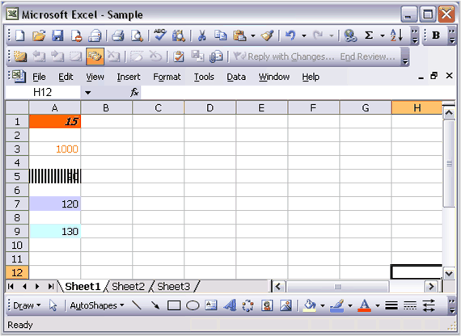{border="0"}

Figure 48: XlsIO with Conditional Formatting**[]{style="FONT-FAMILY: 'Trebuchet MS','sans-serif'; COLOR: #15428b"}**

 

Reading Conditional Formats in XlsIO

 

XlsIO also provides support for reading conditional formats. Following code example illustrates this.

[]{style="FONT-FAMILY: 'Trebuchet MS','sans-serif'; COLOR: #15428b; FONT-SIZE: 9pt"} 

+--------------------------------------------------------------------------------------------------------------------------------------------------------------------------------------------------------------+
| **[\[C#\]]{style="FONT-FAMILY: 'Courier New'"}**                                                                                                                                                             |
|                                                                                                                                                                                                              |
| **[]{style="FONT-FAMILY: 'Courier New'"}**                                                                                                                                                                   |
|                                                                                                                                                                                                              |
| [// Read Conditional Formatting Settings. ]{style="FONT-FAMILY: 'Courier New'; COLOR: green"}                                                                                                                |
|                                                                                                                                                                                                              |
| [this]{style="FONT-FAMILY: 'Courier New'; COLOR: blue"}[.textBox1.Text = sheet.Range\[[\"A1\"]{style="COLOR: #a31515"}\].ConditionalFormats\[0\].FormatType.ToString();]{style="FONT-FAMILY: 'Courier New'"} |
|                                                                                                                                                                                                              |
| [this]{style="FONT-FAMILY: 'Courier New'; COLOR: blue"}[.textBox2.Text = sheet.Range\[[\"A1\"]{style="COLOR: #a31515"}\].ConditionalFormats\[0\].Operator.ToString();]{style="FONT-FAMILY: 'Courier New'"}   |
|                                                                                                                                                                                                              |
| [this]{style="FONT-FAMILY: 'Courier New'; COLOR: blue"}[.textBox3.Text = sheet.Range\[[\"A1\"]{style="COLOR: #a31515"}\].ConditionalFormats\[0\].BackColor.ToString(); ]{style="FONT-FAMILY: 'Courier New'"} |
+--------------------------------------------------------------------------------------------------------------------------------------------------------------------------------------------------------------+

[]{style="FONT-FAMILY: 'Trebuchet MS','sans-serif'; COLOR: #15428b; FONT-SIZE: 9pt"} 

+------------------------------------------------------------------------------------------------------------------------------------------------------------------------------------------------------+
| **[\[VB.NET\]]{style="FONT-FAMILY: 'Courier New'"}**                                                                                                                                                 |
|                                                                                                                                                                                                      |
| **[]{style="FONT-FAMILY: 'Courier New'"}**                                                                                                                                                           |
|                                                                                                                                                                                                      |
| [\' Read Conditional Formatting Settings.]{style="FONT-FAMILY: 'Courier New'; COLOR: green"}                                                                                                         |
|                                                                                                                                                                                                      |
| [Me]{style="FONT-FAMILY: 'Courier New'; COLOR: blue"}[.textBox1.Text = sheet.Range([\"A1\"]{style="COLOR: maroon"}).ConditionalFormats(0).FormatType.ToString()]{style="FONT-FAMILY: 'Courier New'"} |
|                                                                                                                                                                                                      |
| [Me]{style="FONT-FAMILY: 'Courier New'; COLOR: blue"}[.textBox2.Text = sheet.Range([\"A1\"]{style="COLOR: maroon"}).ConditionalFormats(0).Operator.ToString()]{style="FONT-FAMILY: 'Courier New'"}   |
|                                                                                                                                                                                                      |
| [Me]{style="FONT-FAMILY: 'Courier New'; COLOR: blue"}[.textBox3.Text = sheet.Range([\"A1\"]{style="COLOR: maroon"}).ConditionalFormats(0).BackColor.ToString()]{style="FONT-FAMILY: 'Courier New'"}  |
+------------------------------------------------------------------------------------------------------------------------------------------------------------------------------------------------------+

 

Removing Conditional Formats in MS-Excel

 

With Microsoft Excel, you can delete conditional formats from the selected cells or from the entire sheet.

 

To remove the conditional formats in MS-Excel:

 

1.   Select the cell that has the conditional format that you want to delete.

2.   Click **Conditional Formatting** on **Home** tab, and then select **Clear Rules**. The Clear Rules property[ ]{style="FONT-FAMILY: 'Times New Roman','serif'; FONT-SIZE: 12pt"}can be applied to the selected cells or to the entire sheet.

 

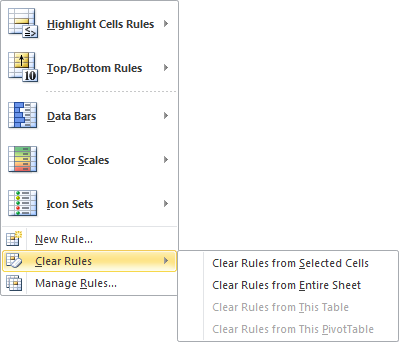{border="0"}

Figure 49: Removing Conditional Format by using Excel

 

Removing Conditional Formats in XlsIO

 

XlsIO also provides support for removing the conditional formats. Following are the methods for removing the conditional formats associated with the IConditionalFormat interface.

 

[·      ]{style="FONT-FAMILY: Symbol"}**Remove**

[·      ]{style="FONT-FAMILY: Symbol"}**RemoveAt**

 

Removing Conditional Formats at specified range

 

XlsIO removes the conditional formats at specified range by using **Remove** Method.

 

Following code example illustrates this.

           

+----------------------------------------------------------------------------------------------------------------------------------------------------------------------+
| **[\[C#\]]{style="FONT-FAMILY: 'Courier New'"}**[]{style="FONT-FAMILY: 'Times New Roman','serif'"}                                                                   |
|                                                                                                                                                                      |
| [// Removing Conditional Format at the specified Range ]{style="FONT-FAMILY: 'Courier New'; COLOR: green"}[]{style="FONT-FAMILY: 'Times New Roman','serif'"}         |
|                                                                                                                                                                      |
| [sheet.Range\[[\"E5\"]{style="COLOR: #a31515"}\].ConditionalFormats.Remove();]{style="FONT-FAMILY: 'Courier New'"}[]{style="FONT-FAMILY: 'Times New Roman','serif'"} |
+----------------------------------------------------------------------------------------------------------------------------------------------------------------------+

 

+---------------------------------------------------------------------------------------------------------------------------------------------------------------------+
| **[\[VB.NET\]]{style="FONT-FAMILY: 'Courier New'"}**[]{style="FONT-FAMILY: 'Times New Roman','serif'"}                                                              |
|                                                                                                                                                                     |
| [\' Removing Conditional Format at the specified Range ]{style="FONT-FAMILY: 'Courier New'; COLOR: green"}[]{style="FONT-FAMILY: 'Times New Roman','serif'"}        |
|                                                                                                                                                                     |
| [sheet.Range\[[\"E5\"]{style="COLOR: #a31515"}\].ConditionalFormats.Remove()]{style="FONT-FAMILY: 'Courier New'"}[]{style="FONT-FAMILY: 'Times New Roman','serif'"} |
+---------------------------------------------------------------------------------------------------------------------------------------------------------------------+

 

Removing Conditional Formats at specified index value

 

XlsIO removes the conditional formats at specified index value by using **RemoveAt** Method

 

Following code example illustrates this.

 

+-------------------------------------------------------------------------------------------------------------------------------------------------------------------------+
| **[\[C#\]]{style="FONT-FAMILY: 'Courier New'"}**[]{style="FONT-FAMILY: 'Times New Roman','serif'"}                                                                      |
|                                                                                                                                                                         |
| [// Removing Conditional Format at the specified Range ]{style="FONT-FAMILY: 'Courier New'; COLOR: green"}[]{style="FONT-FAMILY: 'Times New Roman','serif'"}            |
|                                                                                                                                                                         |
| [sheet.Range\[[\"E5\"]{style="COLOR: #a31515"}\].ConditionalFormats.RemoveAt(0);]{style="FONT-FAMILY: 'Courier New'"}[]{style="FONT-FAMILY: 'Times New Roman','serif'"} |
+-------------------------------------------------------------------------------------------------------------------------------------------------------------------------+

 

+------------------------------------------------------------------------------------------------------------------------------------------------------------------------+
| **[\[VB.NET\]]{style="FONT-FAMILY: 'Courier New'"}**[]{style="FONT-FAMILY: 'Times New Roman','serif'"}                                                                 |
|                                                                                                                                                                        |
| [\' Removing Conditional Format at the specified Range ]{style="FONT-FAMILY: 'Courier New'; COLOR: green"}[]{style="FONT-FAMILY: 'Times New Roman','serif'"}           |
|                                                                                                                                                                        |
| [sheet.Range\[[\"E5\"]{style="COLOR: #a31515"}\].ConditionalFormats.RemoveAt(0)]{style="FONT-FAMILY: 'Courier New'"}[]{style="FONT-FAMILY: 'Times New Roman','serif'"} |
+------------------------------------------------------------------------------------------------------------------------------------------------------------------------+

 

Removing Conditional Formats from entire sheet

 

XlsIO also provides support for removing conditional formats from the entire sheet. Following code example illustrates this.

 

+-------------------------------------------------------------------------------------------------------------------------------------------------------------------------+
| **[\[C#\]]{style="FONT-FAMILY: 'Courier New'"}**[ ]{style="FONT-FAMILY: 'Times New Roman','serif'"}                                                                     |
|                                                                                                                                                                         |
| [// Removing Conditional Formatting Settings From Entire Sheet. ]{style="FONT-FAMILY: 'Courier New'; COLOR: green"}[]{style="FONT-FAMILY: 'Times New Roman','serif'"}   |
|                                                                                                                                                                         |
| [sheet.UsedRange.Clear([ExcelClearOptions]{style="COLOR: #2b91af"}.ClearConditionalFormats);]{style="FONT-FAMILY: 'Courier New'"}[]{style="FONT-FAMILY: 'Courier New'"} |
|                                                                                                                                                                         |
| []{style="FONT-FAMILY: 'Courier New'"}[]{style="FONT-FAMILY: 'Times New Roman','serif'"}                                                                                |
+-------------------------------------------------------------------------------------------------------------------------------------------------------------------------+

 

+------------------------------------------------------------------------------------------------------------------------------------------------------------------------------------+
| **[\[VB.NET\]]{style="FONT-FAMILY: 'Courier New'"}**[ ]{style="FONT-FAMILY: 'Times New Roman','serif'"}                                                                            |
|                                                                                                                                                                                    |
| [\'Removing Conditional Formatting Settings From Entire Sheet. ]{style="FONT-FAMILY: 'Courier New'; COLOR: green"}                                                                 |
|                                                                                                                                                                                    |
| [sheet.UsedRange.Clear([ExcelClearOptions]{style="COLOR: #2b91af"}.ClearConditionalFormats)]{style="FONT-FAMILY: 'Courier New'"}[]{style="FONT-FAMILY: 'Times New Roman','serif'"} |
+------------------------------------------------------------------------------------------------------------------------------------------------------------------------------------+

 

Using FormulaR1C1 property in Conditional Formats

 

XlsIO returns or sets the formula for the conditional format by using R1C1-style notation. Following code example illustrates this.

 

+---------------------------------------------------------------------------------------------------------------------------------------------------------------------------------------------------------+
| **[\[C#\]]{style="FONT-FAMILY: 'Courier New'"}**[ ]{style="FONT-FAMILY: 'Times New Roman','serif'"}                                                                                                     |
|                                                                                                                                                                                                         |
| [// Using FormulaR1C1 property in Conditional Formatting ]{style="FONT-FAMILY: 'Courier New'; COLOR: green"}[]{style="FONT-FAMILY: 'Times New Roman','serif'"}                                          |
|                                                                                                                                                                                                         |
| [IConditionalFormats]{style="FONT-FAMILY: 'Courier New'; COLOR: #2b91af"}[ condition = worksheet.Range\[[\"E5:E18\"]{style="COLOR: #a31515"}\].ConditionalFormats;]{style="FONT-FAMILY: 'Courier New'"} |
|                                                                                                                                                                                                         |
| []{style="FONT-FAMILY: 'Courier New'"}                                                                                                                                                                  |
|                                                                                                                                                                                                         |
| [IConditionalFormat]{style="FONT-FAMILY: 'Courier New'; COLOR: #2b91af"}[ condition1 = condition.AddCondition();]{style="FONT-FAMILY: 'Courier New'"}                                                   |
|                                                                                                                                                                                                         |
| [            ]{style="FONT-FAMILY: 'Courier New'"}                                                                                                                                                      |
|                                                                                                                                                                                                         |
| [condition1.FirstFormulaR1C1 = [\"=R\[1\]C\[0\]\" ]{style="COLOR: #a31515"};[]{style="COLOR: #a31515"}]{style="FONT-FAMILY: 'Courier New'"}                                                             |
|                                                                                                                                                                                                         |
| [condition1.SecondFormulaR1C1 = [\"=R\[1\]C\[1\]\" ]{style="COLOR: #a31515"};[]{style="COLOR: #a31515"}]{style="FONT-FAMILY: 'Courier New'"}                                                            |
|                                                                                                                                                                                                         |
| []{style="FONT-FAMILY: 'Courier New'"}[]{style="FONT-FAMILY: 'Times New Roman','serif'"}                                                                                                                |
+---------------------------------------------------------------------------------------------------------------------------------------------------------------------------------------------------------+

 

+-------------------------------------------------------------------------------------------------------------------------------------------------------------------------------------------------------------------------------------------------------------------------------+
| **[\[VB.NET\]]{style="FONT-FAMILY: 'Courier New'"}**[ ]{style="FONT-FAMILY: 'Times New Roman','serif'"}                                                                                                                                                                       |
|                                                                                                                                                                                                                                                                               |
| [\' Using FormulaR1C1 property in Conditional Formatting]{style="FONT-FAMILY: 'Courier New'; COLOR: green"}                                                                                                                                                                   |
|                                                                                                                                                                                                                                                                               |
| [Dim]{style="FONT-FAMILY: 'Courier New'; COLOR: blue"}[ condition [As]{style="COLOR: blue"} IConditionalFormats = sheet.Range([\"]{style="COLOR: maroon"}[E5:E18]{style="COLOR: #a31515"}[\"]{style="COLOR: maroon"}).ConditionalFormats]{style="FONT-FAMILY: 'Courier New'"} |
|                                                                                                                                                                                                                                                                               |
| [Dim]{style="FONT-FAMILY: 'Courier New'; COLOR: blue"}[ condition1 [As]{style="COLOR: blue"} IConditionalFormat = condition.AddCondition()           ]{style="FONT-FAMILY: 'Courier New'"}[]{style="FONT-FAMILY: 'Times New Roman','serif'"}                                  |
|                                                                                                                                                                                                                                                                               |
| [condition1.FirstFormulaR1C1 = [\"=R\[1\]C\[0\]\" ]{style="COLOR: #a31515"}]{style="FONT-FAMILY: 'Courier New'"}                                                                                                                                                              |
|                                                                                                                                                                                                                                                                               |
| [condition1.SecondFormulaR1C1 = [\"=R\[1\]C\[1\]\" ]{style="COLOR: #a31515"}]{style="FONT-FAMILY: 'Courier New'"}                                                                                                                                                             |
+-------------------------------------------------------------------------------------------------------------------------------------------------------------------------------------------------------------------------------------------------------------------------------+

 

[Advanced Conditional Formatting]()

See Also

 

[[Cell]{.UGHyperlink}[[ Styles]{style="FONT-FAMILY: 'Trebuchet MS','sans-serif'; COLOR: blue; FONT-SIZE: 9pt"}]{.underline}](ms-xhelp:///?Id=e3e17bbe-6827-4671-baed-5aa5f4620ffb)[]{style="FONT-FAMILY: 'Trebuchet MS','sans-serif'; COLOR: #15428b; FONT-SIZE: 9pt"}

[]{#p48} 

###### []{#_Advanced_Conditional_Formatting}4.1.1.6.2.1 Advanced Conditional Formatting {#advanced-conditional-formatting style="tab-stops: 0pt"}

 

Excel 2007 introduces a new formatting that highlights cells once it meets respective constraints. Three new visualizations such as **Data** **Bars**, **Color Scales**, and **Icon Sets** help you to explore large datasets, identify trends and exceptions, and quickly compare data.

 

Data Bars

 

Data Bars give you an opportunity to create visual effects in your data that help you see how the value of a cell compares with other cells.

 

Excel compares the values in each of the selected cells, and draws a data bar in each cell representing the value of that cell relative to the other cells in the selected range. This bar provides a clear visual cue for users, making it easier to pick out larger and smaller values in a range.

 

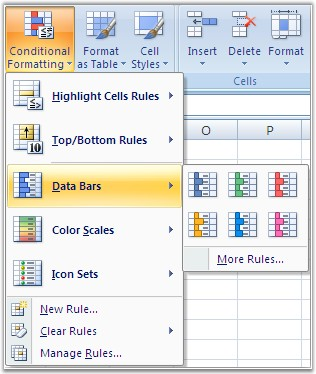{border="0"}

Figure 50: Data Bars[]{style="FONT-FAMILY: 'Trebuchet MS','sans-serif'; COLOR: #15428b"}

 

MS Excel enables to set these formats through the **Conditional Formatting** menu. It also allows to set the criteria through the **New Formatting Rule** dialog box shown below.

 

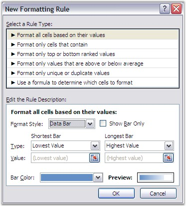{border="0"}

Figure 51: New Formatting Rule Dialog for setting Data Bar[]{style="FONT-FAMILY: 'Trebuchet MS','sans-serif'; COLOR: #15428b"}

 

Color Scales

 

Color Scales let you create visual effects in your data, to see how the value of a cell compares with the values in a range of cells. A color scale uses cell shading, as opposed to bars, to communicate relative values. This is especially useful when you want to communicate more about your data, beyond the relative size of the value of a cell.

[]{style="FONT-FAMILY: 'Trebuchet MS','sans-serif'; COLOR: #15428b; FONT-SIZE: 9pt"} 

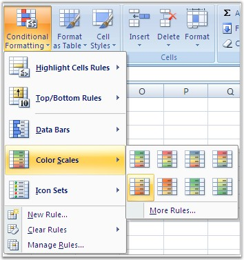{border="0"}

Figure 52: Color Scales[]{style="FONT-FAMILY: 'Trebuchet MS','sans-serif'; COLOR: #15428b"}

 

[You can customize the criteria through the New Formatting Rule dialog box in MS Excel.]{style="FONT-SIZE: 9pt"}

[]{style="FONT-SIZE: 9pt"} 

[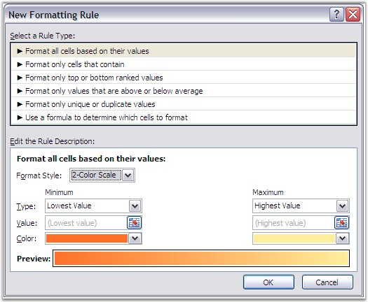{border="0"}]{style="FONT-FAMILY: 'Trebuchet MS','sans-serif'; COLOR: #15428b; FONT-SIZE: 9pt"}

Figure 53: New Formatting Dialog Box for setting Color Scales[]{style="FONT-FAMILY: 'Trebuchet MS','sans-serif'; COLOR: #15428b"}

 

**Icon Sets**

 

Icon Sets give you an opportunity to create visual effects in your data, to see how the value of a cell compares with other cells. Excel 2007 offers several choices of icon sets. You can choose the icons that are most appropriate for the data you are using. Icon sets come in three sizes, so as you increase or decrease the font size, the icon becomes larger or smaller, appropriately.

 

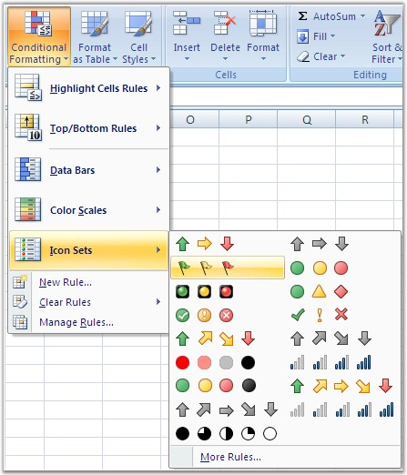{border="0"}

Figure 54: Icon Sets[]{style="FONT-FAMILY: 'Trebuchet MS','sans-serif'; COLOR: #15428b"}

 

It is possible to hide the value of the cell and just draw the icon, while applying a conditional formatting rule for icon sets, by using the **New Formatting Rule** dialog box.

 

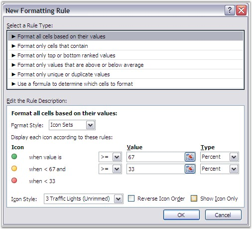{border="0"}

Figure 55: New Formatting Rule for setting Icon Sets[]{style="FONT-FAMILY: 'Trebuchet MS','sans-serif'; COLOR: #15428b"}

[]{style="FONT-FAMILY: 'Trebuchet MS','sans-serif'; COLOR: #15428b; FONT-SIZE: 9pt"} 

 

**Visualizations in XlsIO**

 

XlsIO also provides support for these visualizations through **IDataBar**, **IconSet** and **IColorScale** interfaces. You can also customize these visualizations by specifying the criteria, by using XlsIO. Following code example illustrates how to apply and customize various visualizations.

 

+--------------------------------------------------------------------------------------------------------------------------------------------------------------------------------------------------------------------------------------------+
| **[\[C#\]]{style="FONT-FAMILY: 'Courier New'"}**                                                                                                                                                                                           |
|                                                                                                                                                                                                                                            |
|                                                                                                                                                                                                                                            |
|                                                                                                                                                                                                                                            |
| [//Add condition for the range]{style="FONT-FAMILY: Consolas; COLOR: green; FONT-SIZE: 9.5pt"}[]{style="FONT-FAMILY: Consolas; FONT-SIZE: 9.5pt"}                                                                                          |
|                                                                                                                                                                                                                                            |
| [IConditionalFormats]{style="FONT-FAMILY: Consolas; COLOR: #2b91af; FONT-SIZE: 9.5pt"}[ conditionalFormats = worksheet.Range\[[\"C7:C46\"]{style="COLOR: #a31515"}\].ConditionalFormats;]{style="FONT-FAMILY: Consolas; FONT-SIZE: 9.5pt"} |
|                                                                                                                                                                                                                                            |
| [IConditionalFormat]{style="FONT-FAMILY: Consolas; COLOR: #2b91af; FONT-SIZE: 9.5pt"}[ conditionalFormat = conditionalFormats.AddCondition();]{style="FONT-FAMILY: Consolas; FONT-SIZE: 9.5pt"}                                            |
|                                                                                                                                                                                                                                            |
| []{style="FONT-FAMILY: Consolas; FONT-SIZE: 9.5pt"}                                                                                                                                                                                        |
|                                                                                                                                                                                                                                            |
| [//Set Data bar and icon set for the same cell]{style="FONT-FAMILY: Consolas; COLOR: green; FONT-SIZE: 9.5pt"}[]{style="FONT-FAMILY: Consolas; FONT-SIZE: 9.5pt"}                                                                          |
|                                                                                                                                                                                                                                            |
| [//Set the conditionalFormat type]{style="FONT-FAMILY: Consolas; COLOR: green; FONT-SIZE: 9.5pt"}[]{style="FONT-FAMILY: Consolas; FONT-SIZE: 9.5pt"}                                                                                       |
|                                                                                                                                                                                                                                            |
| [conditionalFormat.FormatType = [ExcelCFType]{style="COLOR: #2b91af"}.DataBar;]{style="FONT-FAMILY: Consolas; FONT-SIZE: 9.5pt"}                                                                                                           |
|                                                                                                                                                                                                                                            |
| [IDataBar]{style="FONT-FAMILY: Consolas; COLOR: #2b91af; FONT-SIZE: 9.5pt"}[ dataBar = conditionalFormat.DataBar;]{style="FONT-FAMILY: Consolas; FONT-SIZE: 9.5pt"}                                                                        |
|                                                                                                                                                                                                                                            |
| []{style="FONT-FAMILY: Consolas; FONT-SIZE: 9.5pt"}                                                                                                                                                                                        |
|                                                                                                                                                                                                                                            |
| [//Set the constraint]{style="FONT-FAMILY: Consolas; COLOR: green; FONT-SIZE: 9.5pt"}[]{style="FONT-FAMILY: Consolas; FONT-SIZE: 9.5pt"}                                                                                                   |
|                                                                                                                                                                                                                                            |
| [dataBar.MinPoint.Type = [ConditionValueType]{style="COLOR: #2b91af"}.LowestValue;]{style="FONT-FAMILY: Consolas; FONT-SIZE: 9.5pt"}                                                                                                       |
|                                                                                                                                                                                                                                            |
| [dataBar.MinPoint.Value = [\"0\"]{style="COLOR: #a31515"};]{style="FONT-FAMILY: Consolas; FONT-SIZE: 9.5pt"}                                                                                                                               |
|                                                                                                                                                                                                                                            |
| [dataBar.MaxPoint.Type = [ConditionValueType]{style="COLOR: #2b91af"}.HighestValue;]{style="FONT-FAMILY: Consolas; FONT-SIZE: 9.5pt"}                                                                                                      |
|                                                                                                                                                                                                                                            |
| [dataBar.MaxPoint.Value = [\"0\"]{style="COLOR: #a31515"};]{style="FONT-FAMILY: Consolas; FONT-SIZE: 9.5pt"}                                                                                                                               |
|                                                                                                                                                                                                                                            |
| []{style="FONT-FAMILY: Consolas; FONT-SIZE: 9.5pt"}                                                                                                                                                                                        |
|                                                                                                                                                                                                                                            |
| [//Set color for Bar]{style="FONT-FAMILY: Consolas; COLOR: green; FONT-SIZE: 9.5pt"}[]{style="FONT-FAMILY: Consolas; FONT-SIZE: 9.5pt"}                                                                                                    |
|                                                                                                                                                                                                                                            |
| [dataBar.BarColor = [Color]{style="COLOR: #2b91af"}.FromArgb(156, 208, 243);]{style="FONT-FAMILY: Consolas; FONT-SIZE: 9.5pt"}                                                                                                             |
|                                                                                                                                                                                                                                            |
| []{style="FONT-FAMILY: Consolas; FONT-SIZE: 9.5pt"}                                                                                                                                                                                        |
|                                                                                                                                                                                                                                            |
| [//Hide the value in data bar]{style="FONT-FAMILY: Consolas; COLOR: green; FONT-SIZE: 9.5pt"}[]{style="FONT-FAMILY: Consolas; FONT-SIZE: 9.5pt"}                                                                                           |
|                                                                                                                                                                                                                                            |
| [dataBar.ShowValue = [false]{style="COLOR: blue"};]{style="FONT-FAMILY: Consolas; FONT-SIZE: 9.5pt"}                                                                                                                                       |
|                                                                                                                                                                                                                                            |
| [dataBar.MaxPoint = [new]{style="COLOR: blue"} [ConditionValue]{style="COLOR: teal"}([ConditionValueType]{style="COLOR: teal"}.HighestValue, [\"0\"]{style="COLOR: maroon"});]{style="FONT-FAMILY: 'Courier New'"}                         |
|                                                                                                                                                                                                                                            |
| [dataBar.BarColor = [Color]{style="COLOR: teal"}.Red;]{style="FONT-FAMILY: 'Courier New'"}                                                                                                                                                 |
|                                                                                                                                                                                                                                            |
| [dataBar.ShowValue = [false]{style="COLOR: blue"};[]{style="COLOR: green"}]{style="FONT-FAMILY: 'Courier New'"}                                                                                                                            |
|                                                                                                                                                                                                                                            |
| []{style="FONT-FAMILY: 'Courier New'; COLOR: green"}                                                                                                                                                                                       |
|                                                                                                                                                                                                                                            |
| [//Add another condition in the same range]{style="FONT-FAMILY: Consolas; COLOR: green; FONT-SIZE: 9.5pt"}[]{style="FONT-FAMILY: Consolas; FONT-SIZE: 9.5pt"}                                                                              |
|                                                                                                                                                                                                                                            |
| [conditionalFormat = conditionalFormats.AddCondition();]{style="FONT-FAMILY: Consolas; FONT-SIZE: 9.5pt"}                                                                                                                                  |
|                                                                                                                                                                                                                                            |
| []{style="FONT-FAMILY: Consolas; FONT-SIZE: 9.5pt"}                                                                                                                                                                                        |
|                                                                                                                                                                                                                                            |
| [//Set Icon conditionalFormat type]{style="FONT-FAMILY: Consolas; COLOR: green; FONT-SIZE: 9.5pt"}[]{style="FONT-FAMILY: Consolas; FONT-SIZE: 9.5pt"}                                                                                      |
|                                                                                                                                                                                                                                            |
| [conditionalFormat.FormatType = [ExcelCFType]{style="COLOR: #2b91af"}.IconSet;]{style="FONT-FAMILY: Consolas; FONT-SIZE: 9.5pt"}                                                                                                           |
|                                                                                                                                                                                                                                            |
| [IIconSet]{style="FONT-FAMILY: Consolas; COLOR: #2b91af; FONT-SIZE: 9.5pt"}[ iconSet = conditionalFormat.IconSet;]{style="FONT-FAMILY: Consolas; FONT-SIZE: 9.5pt"}                                                                        |
|                                                                                                                                                                                                                                            |
| [iconSet.IconSet = [ExcelIconSetType]{style="COLOR: #2b91af"}.FourRating;]{style="FONT-FAMILY: Consolas; FONT-SIZE: 9.5pt"}                                                                                                                |
|                                                                                                                                                                                                                                            |
| [iconSet.IconCriteria\[0\].Type = [ConditionValueType]{style="COLOR: #2b91af"}.LowestValue;]{style="FONT-FAMILY: Consolas; FONT-SIZE: 9.5pt"}                                                                                              |
|                                                                                                                                                                                                                                            |
| [iconSet.IconCriteria\[0\].Value = [\"0\"]{style="COLOR: #a31515"};]{style="FONT-FAMILY: Consolas; FONT-SIZE: 9.5pt"}                                                                                                                      |
|                                                                                                                                                                                                                                            |
| [iconSet.IconCriteria\[1\].Type = [ConditionValueType]{style="COLOR: #2b91af"}.HighestValue;]{style="FONT-FAMILY: Consolas; FONT-SIZE: 9.5pt"}                                                                                             |
|                                                                                                                                                                                                                                            |
| [iconSet.IconCriteria\[1\].Value = [\"0\"]{style="COLOR: #a31515"};]{style="FONT-FAMILY: Consolas; FONT-SIZE: 9.5pt"}                                                                                                                      |
|                                                                                                                                                                                                                                            |
| [iconSet.ShowIconOnly = [true]{style="COLOR: blue"};]{style="FONT-FAMILY: Consolas; FONT-SIZE: 9.5pt"}                                                                                                                                     |
|                                                                                                                                                                                                                                            |
| []{style="FONT-FAMILY: Consolas; FONT-SIZE: 9.5pt"}                                                                                                                                                                                        |
|                                                                                                                                                                                                                                            |
| [//Sets Icon sets for another range]{style="FONT-FAMILY: Consolas; COLOR: green; FONT-SIZE: 9.5pt"}[]{style="FONT-FAMILY: Consolas; FONT-SIZE: 9.5pt"}                                                                                     |
|                                                                                                                                                                                                                                            |
| [conditionalFormats = worksheet.Range\[[\"E7:E46\"]{style="COLOR: #a31515"}\].ConditionalFormats;]{style="FONT-FAMILY: Consolas; FONT-SIZE: 9.5pt"}                                                                                        |
|                                                                                                                                                                                                                                            |
| [conditionalFormat = conditionalFormats.AddCondition();]{style="FONT-FAMILY: Consolas; FONT-SIZE: 9.5pt"}                                                                                                                                  |
|                                                                                                                                                                                                                                            |
| [conditionalFormat.FormatType = [ExcelCFType]{style="COLOR: #2b91af"}.IconSet;]{style="FONT-FAMILY: Consolas; FONT-SIZE: 9.5pt"}                                                                                                           |
|                                                                                                                                                                                                                                            |
| [iconSet = conditionalFormat.IconSet;]{style="FONT-FAMILY: Consolas; FONT-SIZE: 9.5pt"}                                                                                                                                                    |
|                                                                                                                                                                                                                                            |
| [iconSet.IconSet = [ExcelIconSetType]{style="COLOR: #2b91af"}.ThreeSymbols;]{style="FONT-FAMILY: Consolas; FONT-SIZE: 9.5pt"}                                                                                                              |
|                                                                                                                                                                                                                                            |
| [iconSet.IconCriteria\[0\].Type = [ConditionValueType]{style="COLOR: #2b91af"}.LowestValue;]{style="FONT-FAMILY: Consolas; FONT-SIZE: 9.5pt"}                                                                                              |
|                                                                                                                                                                                                                                            |
| [iconSet.IconCriteria\[0\].Value = [\"0\"]{style="COLOR: #a31515"};]{style="FONT-FAMILY: Consolas; FONT-SIZE: 9.5pt"}                                                                                                                      |
|                                                                                                                                                                                                                                            |
| [iconSet.IconCriteria\[1\].Type = [ConditionValueType]{style="COLOR: #2b91af"}.HighestValue;]{style="FONT-FAMILY: Consolas; FONT-SIZE: 9.5pt"}                                                                                             |
|                                                                                                                                                                                                                                            |
| [iconSet.IconCriteria\[1\].Value = [\"0\"]{style="COLOR: #a31515"};]{style="FONT-FAMILY: Consolas; FONT-SIZE: 9.5pt"}                                                                                                                      |
|                                                                                                                                                                                                                                            |
| [iconSet.ShowIconOnly = [true]{style="COLOR: blue"};]{style="FONT-FAMILY: Consolas; FONT-SIZE: 9.5pt"}                                                                                                                                     |
|                                                                                                                                                                                                                                            |
| []{style="FONT-FAMILY: Consolas; FONT-SIZE: 9.5pt"}                                                                                                                                                                                        |
|                                                                                                                                                                                                                                            |
| [//Sets Color scale conditional format type]{style="FONT-FAMILY: Consolas; COLOR: green; FONT-SIZE: 9.5pt"}                                                                                                                                |
|                                                                                                                                                                                                                                            |
| [conditionalFormats = worksheet.Range\[[\"D7:D46\"]{style="COLOR: #a31515"}\].ConditionalFormats;]{style="FONT-FAMILY: Consolas; FONT-SIZE: 9.5pt"}                                                                                        |
|                                                                                                                                                                                                                                            |
| [conditionalFormat = conditionalFormats.AddCondition();]{style="FONT-FAMILY: Consolas; FONT-SIZE: 9.5pt"}                                                                                                                                  |
|                                                                                                                                                                                                                                            |
| [conditionalFormat.FormatType = [ExcelCFType]{style="COLOR: #2b91af"}.ColorScale;]{style="FONT-FAMILY: Consolas; FONT-SIZE: 9.5pt"}                                                                                                        |
|                                                                                                                                                                                                                                            |
| [IColorScale]{style="FONT-FAMILY: Consolas; COLOR: #2b91af; FONT-SIZE: 9.5pt"}[ colorScale = conditionalFormat.ColorScale;]{style="FONT-FAMILY: Consolas; FONT-SIZE: 9.5pt"}                                                               |
|                                                                                                                                                                                                                                            |
| []{style="FONT-FAMILY: Consolas; FONT-SIZE: 9.5pt"}                                                                                                                                                                                        |
|                                                                                                                                                                                                                                            |
| [//Sets 3 - color scale.]{style="FONT-FAMILY: Consolas; COLOR: green; FONT-SIZE: 9.5pt"}[]{style="FONT-FAMILY: Consolas; FONT-SIZE: 9.5pt"}                                                                                                |
|                                                                                                                                                                                                                                            |
| [colorScale.SetConditionCount(3);]{style="FONT-FAMILY: Consolas; FONT-SIZE: 9.5pt"}                                                                                                                                                        |
|                                                                                                                                                                                                                                            |
| []{style="FONT-FAMILY: Consolas; FONT-SIZE: 9.5pt"}                                                                                                                                                                                        |
|                                                                                                                                                                                                                                            |
| [colorScale.Criteria\[0\].FormatColorRGB = [Color]{style="COLOR: #2b91af"}.FromArgb(230, 197, 218);]{style="FONT-FAMILY: Consolas; FONT-SIZE: 9.5pt"}                                                                                      |
|                                                                                                                                                                                                                                            |
| [colorScale.Criteria\[0\].Type = [ConditionValueType]{style="COLOR: #2b91af"}.LowestValue;]{style="FONT-FAMILY: Consolas; FONT-SIZE: 9.5pt"}                                                                                               |
|                                                                                                                                                                                                                                            |
| [colorScale.Criteria\[0\].Value = [\"0\"]{style="COLOR: #a31515"};]{style="FONT-FAMILY: Consolas; FONT-SIZE: 9.5pt"}                                                                                                                       |
|                                                                                                                                                                                                                                            |
| []{style="FONT-FAMILY: Consolas; FONT-SIZE: 9.5pt"}                                                                                                                                                                                        |
|                                                                                                                                                                                                                                            |
| [colorScale.Criteria\[1\].FormatColorRGB = [Color]{style="COLOR: #2b91af"}.FromArgb(244, 210, 178);]{style="FONT-FAMILY: Consolas; FONT-SIZE: 9.5pt"}                                                                                      |
|                                                                                                                                                                                                                                            |
| [colorScale.Criteria\[1\].Type = [ConditionValueType]{style="COLOR: #2b91af"}.Percentile;]{style="FONT-FAMILY: Consolas; FONT-SIZE: 9.5pt"}                                                                                                |
|                                                                                                                                                                                                                                            |
| [colorScale.Criteria\[1\].Value = [\"50\"]{style="COLOR: #a31515"};]{style="FONT-FAMILY: Consolas; FONT-SIZE: 9.5pt"}                                                                                                                      |
|                                                                                                                                                                                                                                            |
| []{style="FONT-FAMILY: Consolas; FONT-SIZE: 9.5pt"}                                                                                                                                                                                        |
|                                                                                                                                                                                                                                            |
| [colorScale.Criteria\[2\].FormatColorRGB = [Color]{style="COLOR: #2b91af"}.FromArgb(245, 247, 171);]{style="FONT-FAMILY: Consolas; FONT-SIZE: 9.5pt"}                                                                                      |
|                                                                                                                                                                                                                                            |
| [colorScale.Criteria\[2\].Type = [ConditionValueType]{style="COLOR: #2b91af"}.HighestValue;]{style="FONT-FAMILY: Consolas; FONT-SIZE: 9.5pt"}                                                                                              |
|                                                                                                                                                                                                                                            |
| [colorScale.Criteria\[2\].Value = [\"0\"]{style="COLOR: #a31515"};]{style="FONT-FAMILY: Consolas; FONT-SIZE: 9.5pt"}                                                                                                                       |
+--------------------------------------------------------------------------------------------------------------------------------------------------------------------------------------------------------------------------------------------+

[]{style="FONT-FAMILY: 'Trebuchet MS','sans-serif'; COLOR: #15428b; FONT-SIZE: 9pt"} 

[]{style="FONT-FAMILY: 'Trebuchet MS','sans-serif'; COLOR: #15428b; FONT-SIZE: 9pt"} 

[]{style="FONT-FAMILY: 'Trebuchet MS','sans-serif'; COLOR: #15428b; FONT-SIZE: 9pt"} 

+-----------------------------------------------------------------------------------------------------------------------------------------------------------------------------------------------------------------------------------------------------+
| **[\[VB.NET\]]{style="FONT-FAMILY: 'Courier New'"}**                                                                                                                                                                                                |
|                                                                                                                                                                                                                                                     |
|                                                                                                                                                                                                                                                     |
|                                                                                                                                                                                                                                                     |
| [\'Add condition for the range]{style="FONT-FAMILY: Consolas; COLOR: green; FONT-SIZE: 9.5pt"}[]{style="FONT-FAMILY: Consolas; FONT-SIZE: 9.5pt"}                                                                                                   |
|                                                                                                                                                                                                                                                     |
| [Dim]{style="FONT-FAMILY: Consolas; COLOR: blue; FONT-SIZE: 9.5pt"}[ formats [As]{style="COLOR: blue"} IConditionalFormats = sheet.Range([\"C7:C46\"]{style="COLOR: #a31515"}).ConditionalFormats]{style="FONT-FAMILY: Consolas; FONT-SIZE: 9.5pt"} |
|                                                                                                                                                                                                                                                     |
| [Dim]{style="FONT-FAMILY: Consolas; COLOR: blue; FONT-SIZE: 9.5pt"}[ format [As]{style="COLOR: blue"} IConditionalFormat = formats.AddCondition()]{style="FONT-FAMILY: Consolas; FONT-SIZE: 9.5pt"}                                                 |
|                                                                                                                                                                                                                                                     |
| []{style="FONT-FAMILY: Consolas; FONT-SIZE: 9.5pt"}                                                                                                                                                                                                 |
|                                                                                                                                                                                                                                                     |
| [\'Set Data bar and icon set for the same cell]{style="FONT-FAMILY: Consolas; COLOR: green; FONT-SIZE: 9.5pt"}[]{style="FONT-FAMILY: Consolas; FONT-SIZE: 9.5pt"}                                                                                   |
|                                                                                                                                                                                                                                                     |
| [\'Set the format type]{style="FONT-FAMILY: Consolas; COLOR: green; FONT-SIZE: 9.5pt"}[]{style="FONT-FAMILY: Consolas; FONT-SIZE: 9.5pt"}                                                                                                           |
|                                                                                                                                                                                                                                                     |
| [format.FormatType = ExcelCFType.DataBar]{style="FONT-FAMILY: Consolas; FONT-SIZE: 9.5pt"}                                                                                                                                                          |
|                                                                                                                                                                                                                                                     |
| [Dim]{style="FONT-FAMILY: Consolas; COLOR: blue; FONT-SIZE: 9.5pt"}[ dataBar [As]{style="COLOR: blue"} IDataBar = format.DataBar]{style="FONT-FAMILY: Consolas; FONT-SIZE: 9.5pt"}                                                                  |
|                                                                                                                                                                                                                                                     |
| []{style="FONT-FAMILY: Consolas; FONT-SIZE: 9.5pt"}                                                                                                                                                                                                 |
|                                                                                                                                                                                                                                                     |
| [\'Set the constraint]{style="FONT-FAMILY: Consolas; COLOR: green; FONT-SIZE: 9.5pt"}[]{style="FONT-FAMILY: Consolas; FONT-SIZE: 9.5pt"}                                                                                                            |
|                                                                                                                                                                                                                                                     |
| [dataBar.MinPoint.Type = ConditionValueType.LowestValue]{style="FONT-FAMILY: Consolas; FONT-SIZE: 9.5pt"}                                                                                                                                           |
|                                                                                                                                                                                                                                                     |
| [dataBar.MinPoint.Value = [\"0\"]{style="COLOR: #a31515"}]{style="FONT-FAMILY: Consolas; FONT-SIZE: 9.5pt"}                                                                                                                                         |
|                                                                                                                                                                                                                                                     |
| [dataBar.MaxPoint.Type = ConditionValueType.HighestValue]{style="FONT-FAMILY: Consolas; FONT-SIZE: 9.5pt"}                                                                                                                                          |
|                                                                                                                                                                                                                                                     |
| [dataBar.MaxPoint.Value = [\"0\"]{style="COLOR: #a31515"}]{style="FONT-FAMILY: Consolas; FONT-SIZE: 9.5pt"}                                                                                                                                         |
|                                                                                                                                                                                                                                                     |
| []{style="FONT-FAMILY: Consolas; FONT-SIZE: 9.5pt"}                                                                                                                                                                                                 |
|                                                                                                                                                                                                                                                     |
| [\'Set color for Bar]{style="FONT-FAMILY: Consolas; COLOR: green; FONT-SIZE: 9.5pt"}[]{style="FONT-FAMILY: Consolas; FONT-SIZE: 9.5pt"}                                                                                                             |
|                                                                                                                                                                                                                                                     |
| [dataBar.BarColor = System.Drawing.[Color]{style="COLOR: #2b91af"}.FromArgb(156, 208, 243)]{style="FONT-FAMILY: Consolas; FONT-SIZE: 9.5pt"}                                                                                                        |
|                                                                                                                                                                                                                                                     |
| []{style="FONT-FAMILY: Consolas; FONT-SIZE: 9.5pt"}                                                                                                                                                                                                 |
|                                                                                                                                                                                                                                                     |
| [\'Hide the value in data bar]{style="FONT-FAMILY: Consolas; COLOR: green; FONT-SIZE: 9.5pt"}[]{style="FONT-FAMILY: Consolas; FONT-SIZE: 9.5pt"}                                                                                                    |
|                                                                                                                                                                                                                                                     |
| [dataBar.ShowValue = [False]{style="COLOR: blue"}]{style="FONT-FAMILY: Consolas; FONT-SIZE: 9.5pt"}                                                                                                                                                 |
|                                                                                                                                                                                                                                                     |
| []{style="FONT-FAMILY: Consolas; COLOR: blue; FONT-SIZE: 9.5pt"}                                                                                                                                                                                    |
|                                                                                                                                                                                                                                                     |
| [\'Add another condition in the same range]{style="FONT-FAMILY: Consolas; COLOR: green; FONT-SIZE: 9.5pt"}[]{style="FONT-FAMILY: Consolas; FONT-SIZE: 9.5pt"}                                                                                       |
|                                                                                                                                                                                                                                                     |
| [format = formats.AddCondition()]{style="FONT-FAMILY: Consolas; FONT-SIZE: 9.5pt"}                                                                                                                                                                  |
|                                                                                                                                                                                                                                                     |
| []{style="FONT-FAMILY: Consolas; FONT-SIZE: 9.5pt"}                                                                                                                                                                                                 |
|                                                                                                                                                                                                                                                     |
| [\'Set Icon format type]{style="FONT-FAMILY: Consolas; COLOR: green; FONT-SIZE: 9.5pt"}[]{style="FONT-FAMILY: Consolas; FONT-SIZE: 9.5pt"}                                                                                                          |
|                                                                                                                                                                                                                                                     |
| [format.FormatType = ExcelCFType.IconSet]{style="FONT-FAMILY: Consolas; FONT-SIZE: 9.5pt"}                                                                                                                                                          |
|                                                                                                                                                                                                                                                     |
| [Dim]{style="FONT-FAMILY: Consolas; COLOR: blue; FONT-SIZE: 9.5pt"}[ iconSet [As]{style="COLOR: blue"} IIconSet = format.IconSet]{style="FONT-FAMILY: Consolas; FONT-SIZE: 9.5pt"}                                                                  |
|                                                                                                                                                                                                                                                     |
| [iconSet.IconSet = ExcelIconSetType.FourRating]{style="FONT-FAMILY: Consolas; FONT-SIZE: 9.5pt"}                                                                                                                                                    |
|                                                                                                                                                                                                                                                     |
| [iconSet.IconCriteria(0).Type = ConditionValueType.LowestValue]{style="FONT-FAMILY: Consolas; FONT-SIZE: 9.5pt"}                                                                                                                                    |
|                                                                                                                                                                                                                                                     |
| [iconSet.IconCriteria(0).Value = [\"0\"]{style="COLOR: #a31515"}]{style="FONT-FAMILY: Consolas; FONT-SIZE: 9.5pt"}                                                                                                                                  |
|                                                                                                                                                                                                                                                     |
| [iconSet.IconCriteria(1).Type = ConditionValueType.HighestValue]{style="FONT-FAMILY: Consolas; FONT-SIZE: 9.5pt"}                                                                                                                                   |
|                                                                                                                                                                                                                                                     |
| [iconSet.IconCriteria(1).Value = [\"0\"]{style="COLOR: #a31515"}]{style="FONT-FAMILY: Consolas; FONT-SIZE: 9.5pt"}                                                                                                                                  |
|                                                                                                                                                                                                                                                     |
| [iconSet.ShowIconOnly = [True]{style="COLOR: blue"}]{style="FONT-FAMILY: Consolas; FONT-SIZE: 9.5pt"}                                                                                                                                               |
|                                                                                                                                                                                                                                                     |
| []{style="FONT-FAMILY: Consolas; COLOR: blue; FONT-SIZE: 9.5pt"}                                                                                                                                                                                    |
|                                                                                                                                                                                                                                                     |
| [\'Sets Icon sets for another range]{style="FONT-FAMILY: Consolas; COLOR: green; FONT-SIZE: 9.5pt"}[]{style="FONT-FAMILY: Consolas; FONT-SIZE: 9.5pt"}                                                                                              |
|                                                                                                                                                                                                                                                     |
| [formats = sheet.Range([\"E7:E46\"]{style="COLOR: #a31515"}).ConditionalFormats]{style="FONT-FAMILY: Consolas; FONT-SIZE: 9.5pt"}                                                                                                                   |
|                                                                                                                                                                                                                                                     |
| [format = formats.AddCondition()]{style="FONT-FAMILY: Consolas; FONT-SIZE: 9.5pt"}                                                                                                                                                                  |
|                                                                                                                                                                                                                                                     |
| [format.FormatType = ExcelCFType.IconSet]{style="FONT-FAMILY: Consolas; FONT-SIZE: 9.5pt"}                                                                                                                                                          |
|                                                                                                                                                                                                                                                     |
| [iconSet = format.IconSet]{style="FONT-FAMILY: Consolas; FONT-SIZE: 9.5pt"}                                                                                                                                                                         |
|                                                                                                                                                                                                                                                     |
| [iconSet.IconSet = ExcelIconSetType.ThreeSymbols]{style="FONT-FAMILY: Consolas; FONT-SIZE: 9.5pt"}                                                                                                                                                  |
|                                                                                                                                                                                                                                                     |
| [iconSet.IconCriteria(0).Type = ConditionValueType.LowestValue]{style="FONT-FAMILY: Consolas; FONT-SIZE: 9.5pt"}                                                                                                                                    |
|                                                                                                                                                                                                                                                     |
| [iconSet.IconCriteria(0).Value = [\"0\"]{style="COLOR: #a31515"}]{style="FONT-FAMILY: Consolas; FONT-SIZE: 9.5pt"}                                                                                                                                  |
|                                                                                                                                                                                                                                                     |
| [iconSet.IconCriteria(1).Type = ConditionValueType.HighestValue]{style="FONT-FAMILY: Consolas; FONT-SIZE: 9.5pt"}                                                                                                                                   |
|                                                                                                                                                                                                                                                     |
| [iconSet.IconCriteria(1).Value = [\"0\"]{style="COLOR: #a31515"}]{style="FONT-FAMILY: Consolas; FONT-SIZE: 9.5pt"}                                                                                                                                  |
|                                                                                                                                                                                                                                                     |
| [iconSet.ShowIconOnly = [True]{style="COLOR: blue"}]{style="FONT-FAMILY: Consolas; FONT-SIZE: 9.5pt"}                                                                                                                                               |
|                                                                                                                                                                                                                                                     |
|                                                                                                                                                                                                                                                     |
|                                                                                                                                                                                                                                                     |
| [\'Sets Color Scale conditional format type]{style="FONT-FAMILY: Consolas; COLOR: green; FONT-SIZE: 9.5pt"}[]{style="FONT-FAMILY: Consolas; FONT-SIZE: 9.5pt"}                                                                                      |
|                                                                                                                                                                                                                                                     |
| [formats = sheet.Range([\"D7:D46\"]{style="COLOR: #a31515"}).ConditionalFormats]{style="FONT-FAMILY: Consolas; FONT-SIZE: 9.5pt"}                                                                                                                   |
|                                                                                                                                                                                                                                                     |
| [format = formats.AddCondition()]{style="FONT-FAMILY: Consolas; FONT-SIZE: 9.5pt"}                                                                                                                                                                  |
|                                                                                                                                                                                                                                                     |
| [format.FormatType = ExcelCFType.ColorScale]{style="FONT-FAMILY: Consolas; FONT-SIZE: 9.5pt"}                                                                                                                                                       |
|                                                                                                                                                                                                                                                     |
| [Dim]{style="FONT-FAMILY: Consolas; COLOR: blue; FONT-SIZE: 9.5pt"}[ colorScale [As]{style="COLOR: blue"} IColorScale = format.ColorScale]{style="FONT-FAMILY: Consolas; FONT-SIZE: 9.5pt"}                                                         |
|                                                                                                                                                                                                                                                     |
| []{style="FONT-FAMILY: Consolas; FONT-SIZE: 9.5pt"}                                                                                                                                                                                                 |
|                                                                                                                                                                                                                                                     |
| [\'Sets 3 - color scale.]{style="FONT-FAMILY: Consolas; COLOR: green; FONT-SIZE: 9.5pt"}[]{style="FONT-FAMILY: Consolas; FONT-SIZE: 9.5pt"}                                                                                                         |
|                                                                                                                                                                                                                                                     |
| [colorScale.SetConditionCount(3)]{style="FONT-FAMILY: Consolas; FONT-SIZE: 9.5pt"}                                                                                                                                                                  |
|                                                                                                                                                                                                                                                     |
| []{style="FONT-FAMILY: Consolas; FONT-SIZE: 9.5pt"}                                                                                                                                                                                                 |
|                                                                                                                                                                                                                                                     |
| [colorScale.Criteria(0).FormatColorRGB = System.Drawing.[Color]{style="COLOR: #2b91af"}.FromArgb(230, 197, 218)]{style="FONT-FAMILY: Consolas; FONT-SIZE: 9.5pt"}                                                                                   |
|                                                                                                                                                                                                                                                     |
| [colorScale.Criteria(0).Type = ConditionValueType.LowestValue]{style="FONT-FAMILY: Consolas; FONT-SIZE: 9.5pt"}                                                                                                                                     |
|                                                                                                                                                                                                                                                     |
| [colorScale.Criteria(0).Value = [\"0\"]{style="COLOR: #a31515"}]{style="FONT-FAMILY: Consolas; FONT-SIZE: 9.5pt"}                                                                                                                                   |
|                                                                                                                                                                                                                                                     |
| []{style="FONT-FAMILY: Consolas; FONT-SIZE: 9.5pt"}                                                                                                                                                                                                 |
|                                                                                                                                                                                                                                                     |
| [colorScale.Criteria(1).FormatColorRGB = System.Drawing.[Color]{style="COLOR: #2b91af"}.FromArgb(244, 210, 178)]{style="FONT-FAMILY: Consolas; FONT-SIZE: 9.5pt"}                                                                                   |
|                                                                                                                                                                                                                                                     |
| [colorScale.Criteria(1).Type = ConditionValueType.Percentile]{style="FONT-FAMILY: Consolas; FONT-SIZE: 9.5pt"}                                                                                                                                      |
|                                                                                                                                                                                                                                                     |
| [colorScale.Criteria(1).Value = [\"50\"]{style="COLOR: #a31515"}]{style="FONT-FAMILY: Consolas; FONT-SIZE: 9.5pt"}                                                                                                                                  |
|                                                                                                                                                                                                                                                     |
| []{style="FONT-FAMILY: Consolas; FONT-SIZE: 9.5pt"}                                                                                                                                                                                                 |
|                                                                                                                                                                                                                                                     |
| [colorScale.Criteria(2).FormatColorRGB = System.Drawing.[Color]{style="COLOR: #2b91af"}.FromArgb(245, 247, 171)]{style="FONT-FAMILY: Consolas; FONT-SIZE: 9.5pt"}                                                                                   |
|                                                                                                                                                                                                                                                     |
| [colorScale.Criteria(2).Type = ConditionValueType.HighestValue]{style="FONT-FAMILY: Consolas; FONT-SIZE: 9.5pt"}                                                                                                                                    |
|                                                                                                                                                                                                                                                     |
| [colorScale.Criteria(2).Value = [\"0\"]{style="COLOR: #a31515"}]{style="FONT-FAMILY: Consolas; FONT-SIZE: 9.5pt"}                                                                                                                                   |
+-----------------------------------------------------------------------------------------------------------------------------------------------------------------------------------------------------------------------------------------------------+

[]{style="FONT-FAMILY: 'Trebuchet MS','sans-serif'; COLOR: #15428b; FONT-SIZE: 9pt"} 

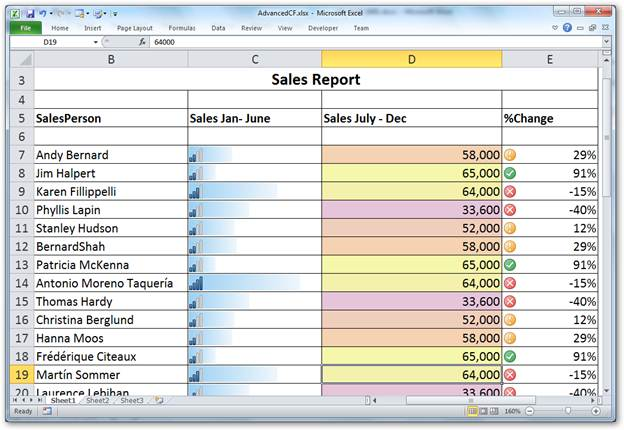{border="0"}

Figure 56: XlsIO Visualization[]{style="FONT-FAMILY: 'Trebuchet MS','sans-serif'; COLOR: #15428b"}

[]{style="FONT-FAMILY: 'Trebuchet MS','sans-serif'; COLOR: #15428b; FONT-SIZE: 9pt"} 

 

::: {style="BORDER-BOTTOM: windowtext 1pt solid; BORDER-LEFT: medium none; PADDING-BOTTOM: 1pt; MARGIN-TOP: 9pt; PADDING-LEFT: 0pt; PADDING-RIGHT: 0pt; MARGIN-BOTTOM: 9pt; BORDER-TOP: windowtext 1pt solid; BORDER-RIGHT: medium none; PADDING-TOP: 1pt"}
 Note: XlsIO visualization has been enhanced with backward compatibility for Advanced Conditional Formatting.
:::

 

[]{#related-topics}
:::::
