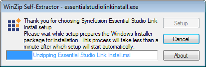
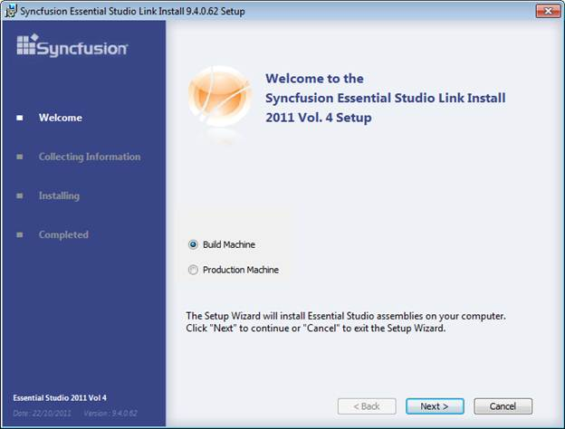
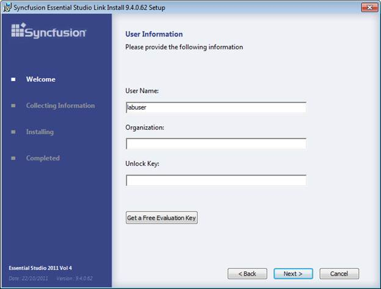
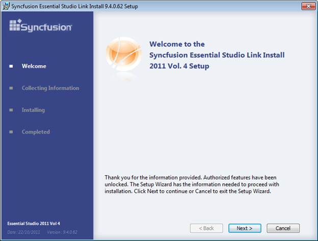
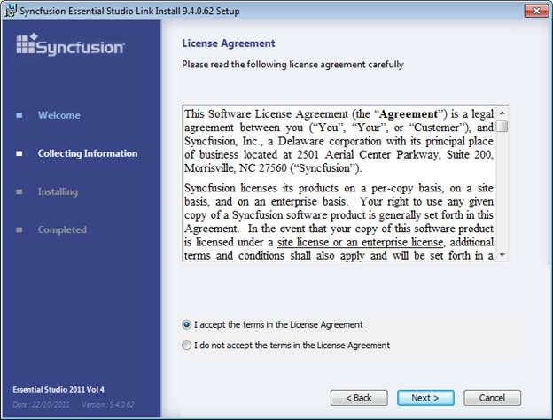
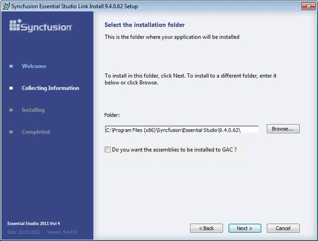
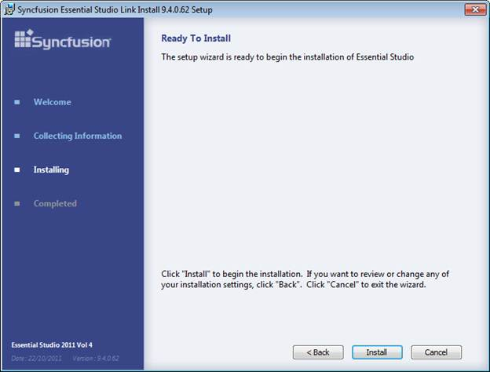
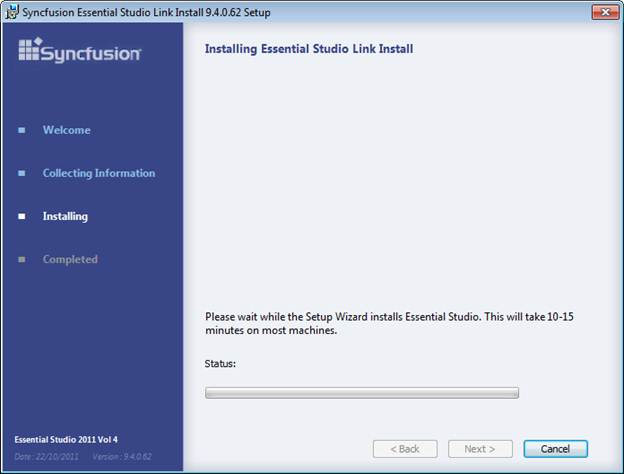
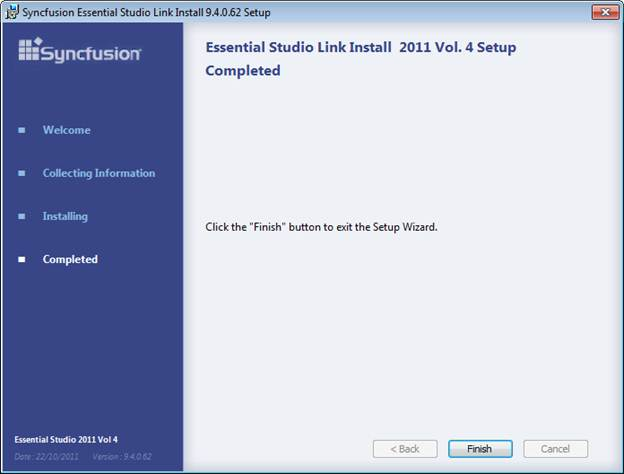

::: {style="DISPLAY: none"}
{#d2h_url_template}{#d2h_package_url style="WIDTH: 0px; DISPLAY: none; HEIGHT: 0px"}
:::

::::: {#nsbanner .d2h_main_nsbanner style="BORDER-BOTTOM: #999999 1px solid; POSITION: relative; PADDING-BOTTOM: 0px; BACKGROUND-COLOR: transparent; PADDING-LEFT: 0px; PADDING-RIGHT: 0px; DISPLAY: none; BORDER-TOP: #999999 1px solid; PADDING-TOP: 0px; LEFT: 0px"}
:::: {#TitleRow .d2h_main_titlerow style="PADDING-BOTTOM: 4px; BACKGROUND-COLOR: transparent; PADDING-LEFT: 22px; WIDTH: 100%; PADDING-RIGHT: 10px; DISPLAY: none; PADDING-TOP: 4px"}
::: {#ienav .d2h_main_ienav style="DISPLAY: none"}
{#D2HPrevious .D2HPreviousEnabled}  {#D2HNext .D2HNextEnabled}
:::
::::
:::::

:::::::: {#nstext .d2h_main_nstext style="PADDING-BOTTOM: 10px; BACKGROUND-COLOR: transparent; PADDING-LEFT: 22px; PADDING-RIGHT: 10px; HEIGHT: 100%; OVERFLOW: auto; PADDING-TOP: 5px" hasuserbackground="true" valign="bottom"}
::: {#d2h_breadcrumbs .d2h_breadcrumbs}
[Essential Studio User Guide Documentation](ms-xhelp:///?Id=12457748-09e3-4d74-a240-8e049cedf030){.d2h_breadcrumbsNormal}[ \> ]{.d2h_breadcrumbsLinkSeparator}[Essential Common](ms-xhelp:///?Id=2bfe10b6-fac1-4f91-a173-04db314f10c3){.d2h_breadcrumbsNormal}[ \> ]{.d2h_breadcrumbsLinkSeparator}[Installation and Deployment](ms-xhelp:///?Id=edacfc75-68a5-4518-870d-ce716c583177){.d2h_breadcrumbsNormal}
:::

## Configure Build Server {#configure-build-server style="tab-stops: 0pt"}

Syncfusion provides the **Link Install Setup,** to configure the Syncfusion controls in a build machine in which **Syncfusion Essential Studio** is not installed. This will install Essential Studio assemblies into the target folder.  It also registers the product key to enable you to compile a project developed on a build machine.

 

**Installing Link Install Setup**

The following procedure illustrates how to install **Link Install** Setup:

 

1.   Double-click the **Syncfusion Link Install Setup** file. A popup will appear when the setup is preparing to install.

 

{border="0"}

Figure 43: Extracting Setup

 

On completion of unzip operation, the **Setup - Syncfusion Essential Studio Link Install** dialog box opens.

 

{border="0"}

Figure 44: Welcome Screen

 

 

2.   Select **Build Machine** or **Production Machin**e as required.

 

::: {style="BORDER-BOTTOM: windowtext 1pt solid; BORDER-LEFT: medium none; PADDING-BOTTOM: 1pt; MARGIN-TOP: 9pt; PADDING-LEFT: 0pt; PADDING-RIGHT: 0pt; MARGIN-BOTTOM: 9pt; BORDER-TOP: windowtext 1pt solid; BORDER-RIGHT: medium none; PADDING-TOP: 1pt"}
{border="0"}Note: Select Build Machine, to configure assemblies in development machine. Select Production Machine, to configure assemblies in server machine.
:::

 

 

3.   Click **Next**. The **User Information** screen opens.

 

{border="0"}

Figure 45: User Information screen

 

4.   Enter **User Name**, **Organization** and **Unlock Key** in the corresponding text boxes provided.

5.   Click **Next**.

::: {style="BORDER-BOTTOM: windowtext 1pt solid; BORDER-LEFT: medium none; PADDING-BOTTOM: 1pt; MARGIN-TOP: 9pt; PADDING-LEFT: 0pt; PADDING-RIGHT: 0pt; MARGIN-BOTTOM: 9pt; BORDER-TOP: windowtext 1pt solid; BORDER-RIGHT: medium none; PADDING-TOP: 1pt"}
{border="0"}Note: The unlock key is validated and the preceding Welcome screen opens.
:::

 

{border="0"}

Figure 46: Setup

 

6.   Click **Next** to continue with installation. The **License Agreement** screen opens.

 

{border="0"}

Figure 47: License Agreement screen

 

7.   On accepting the terms, click **I accept the terms in the License Agreement** option.

8.   Click **Next**. The **Select the Installation Folder** screen opens.

 

{border="0"}

Figure 48: Select the Installation Folder screen

 

9.   To install in the default location it displays, click **Next**.

[]{style="FONT-FAMILY: 'Trebuchet MS','sans-serif'; COLOR: #15428b; FONT-SIZE: 9pt"} 

::: {style="BORDER-BOTTOM: windowtext 1pt solid; BORDER-LEFT: medium none; PADDING-BOTTOM: 1pt; MARGIN-TOP: 9pt; PADDING-LEFT: 0pt; PADDING-RIGHT: 0pt; MARGIN-BOTTOM: 9pt; BORDER-TOP: windowtext 1pt solid; BORDER-RIGHT: medium none; PADDING-TOP: 1pt"}
{border="0"}Note: You can also browse to choose a location clicking Browse.
:::

 

10.    Select **Do you want the assemblies to be installed to GAC?**, to install the assemblies in the GAC.

11.  Click **Next**. The **Ready to Install** dialog opens.

 

{border="0"}

Figure 49: Ready To Install

 

12.  Click **Install** to continue with the installation.

 

{border="0"}

Figure 50: Installing

::: {style="BORDER-BOTTOM: windowtext 1pt solid; BORDER-LEFT: medium none; PADDING-BOTTOM: 1pt; MARGIN-TOP: 9pt; PADDING-LEFT: 0pt; PADDING-RIGHT: 0pt; MARGIN-BOTTOM: 9pt; BORDER-TOP: windowtext 1pt solid; BORDER-RIGHT: medium none; PADDING-TOP: 1pt"}
 

{border="0"}Note: The Completed screen is displayed once the selected package is installed.
:::

 

{border="0"}

Figure 51: Installation Completed

 

13.  Click **Finish** to exit the Setup Wizard. Assemblies will be installed.

 

[]{#related-topics}
::::::::
