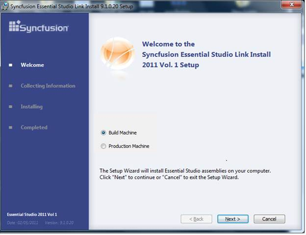
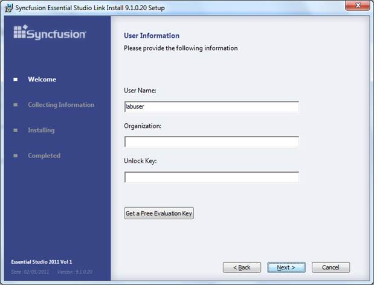
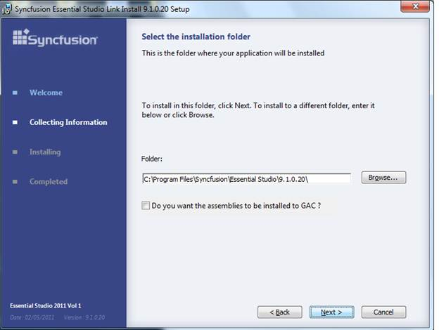

::: {style="DISPLAY: none"}
{#d2h_url_template}{#d2h_package_url style="WIDTH: 0px; DISPLAY: none; HEIGHT: 0px"}
:::

::: {.d2h_secondary_topic style="PADDING-BOTTOM: 10pt; MARGIN: 0pt; PADDING-LEFT: 0pt; PADDING-RIGHT: 0pt; PADDING-TOP: 0pt"}
#### Configuring a build machine to compile projects after version V8.1.0.30   {#configuring-a-build-machine-to-compile-projects-after-version-v8.1.0.30 style="tab-stops: 0pt"}

To compile projects that use Syncfusion controls in a build machine, Syncfusion helps to install the Link Install Setup. The setup installs Syncfusion assemblies into the target folder, and registers the product key to the registry. This allows you to compile a project, developed on a build machine. Please download the link install setup from the below location

[[http://files2.syncfusion.com/installs/v9.1.0.20/essentialstudiolinkinstall.exe]{.UGHyperlink}](http://files2.syncfusion.com/installs/v9.1.0.20/essentialstudiolinkinstall.exe)[]{.UGHyperlink}

 

Installing on a build machine

1.   Run Link Install Setup.[ ]{style="FONT-FAMILY: 'Verdana','sans-serif'; FONT-SIZE: 8.5pt"}[]{style="FONT-FAMILY: 'Times New Roman','serif'"}

2.   Choose the **Build Machine** option.  []{style="FONT-FAMILY: 'Times New Roman','serif'"}

3.   Click **Next**.[]{style="FONT-FAMILY: 'Times New Roman','serif'"}

[]{style="FONT-FAMILY: 'Times New Roman','serif'"} 

{border="0"}

Figure 389: Link Install Setup Dialog box

*[]{style="FONT-FAMILY: 'Times New Roman','serif'; FONT-SIZE: 12pt"}* 

[]{style="FONT-FAMILY: 'Calibri','sans-serif'; COLOR: black; FONT-SIZE: 12pt"} 

4.   A dialog box titled **User Information** opens

5.   In the dialog box, provide user information and unlock key.[ ]{style="FONT-FAMILY: 'Verdana','sans-serif'; FONT-SIZE: 8.5pt"}[]{style="FONT-FAMILY: 'Times New Roman','serif'"}

6.   Click **Next**.[]{style="FONT-FAMILY: 'Times New Roman','serif'"}

{border="0"}[]{style="FONT-SIZE: 11pt"}

Figure 390:User Information dialog box

*[]{style="FONT-FAMILY: 'Times New Roman','serif'; FONT-SIZE: 12pt"}* 

7.   Select the installation folder[]{style="FONT-FAMILY: 'Times New Roman','serif'"}

8.   Under Folder, make sure the correct folder has been chosen.[ ]{style="FONT-FAMILY: 'Verdana','sans-serif'; FONT-SIZE: 8.5pt"}[]{style="FONT-FAMILY: 'Times New Roman','serif'"}

9.   Choose Install into **GAC**, if needed.[ ]{style="FONT-FAMILY: 'Verdana','sans-serif'; FONT-SIZE: 8.5pt"}[]{style="FONT-FAMILY: 'Times New Roman','serif'"}

10.  Click **Next**.[]{style="FONT-FAMILY: 'Times New Roman','serif'"}

{border="0"}[]{style="FONT-SIZE: 11pt"}

Figure 391:Installation folder dialog box

*[]{style="FONT-FAMILY: 'Times New Roman','serif'; FONT-SIZE: 12pt"}* 

11.  In the next window, click **Finish** to complete the setup.

[]{style="FONT-FAMILY: 'Calibri','sans-serif'; COLOR: black; FONT-SIZE: 12pt"} 

 

 

[]{#related-topics}
:::
