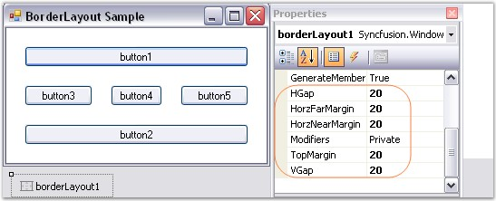

::: {style="DISPLAY: none"}
{#d2h_url_template}{#d2h_package_url style="WIDTH: 0px; DISPLAY: none; HEIGHT: 0px"}
:::

:::: {.d2h_secondary_topic style="PADDING-BOTTOM: 10pt; MARGIN: 0pt; PADDING-LEFT: 0pt; PADDING-RIGHT: 0pt; PADDING-TOP: 0pt"}
##### Configuring BorderLayout[]{#p817} {#configuring-borderlayout style="tab-stops: 0pt"}

[]{style="COLOR: #4a5c8c; FONT-SIZE: 8pt"} 

The configuration settings for the BorderLayout have been discussed in this topic.

[]{style="COLOR: #15428b"} 

Spacing

[]{style="COLOR: #15428b"} 

The horizontal and the vertical gap between the Child controls can be set using the properties given below.

[]{style="COLOR: #15428b"} 

::: {align="center"}
  ------------------------- ------------------------------------------------------------
  BorderLayout Properties   Description
  HGap                      Gets / sets the horizontal spacing between the components.
  VGap                      Gets / sets the vertical spacing between the components.
  ------------------------- ------------------------------------------------------------
:::

[]{style="COLOR: #15428b"} 

+------------------------------------------------------------------------------------------------------------------------+
| **[\[C#\]]{style="FONT-FAMILY: 'Courier New'; COLOR: black"}**                                                         |
|                                                                                                                        |
| []{style="FONT-FAMILY: 'Courier New'; COLOR: black"}                                                                   |
|                                                                                                                        |
| [this]{style="FONT-FAMILY: 'Courier New'; COLOR: blue"}[.borderLayout1.HGap = 10;]{style="FONT-FAMILY: 'Courier New'"} |
|                                                                                                                        |
| [this]{style="FONT-FAMILY: 'Courier New'; COLOR: blue"}[.borderLayout1.VGap = 10;]{style="FONT-FAMILY: 'Courier New'"} |
+------------------------------------------------------------------------------------------------------------------------+

[]{style="COLOR: #15428b"} 

+---------------------------------------------------------------------------------------------------------------------+
| **[\[VB.NET\]]{style="FONT-FAMILY: 'Courier New'; COLOR: black"}**                                                  |
|                                                                                                                     |
| []{style="FONT-FAMILY: 'Courier New'; COLOR: black"}                                                                |
|                                                                                                                     |
| [Me]{style="FONT-FAMILY: 'Courier New'; COLOR: blue"}[.borderLayout1.HGap = 10]{style="FONT-FAMILY: 'Courier New'"} |
|                                                                                                                     |
| [Me]{style="FONT-FAMILY: 'Courier New'; COLOR: blue"}[.borderLayout1.VGap = 10]{style="FONT-FAMILY: 'Courier New'"} |
+---------------------------------------------------------------------------------------------------------------------+

[]{style="COLOR: #15428b"} 

{border="0"}

[]{style="COLOR: #15428b"} 

Figure 657: Margin and Space Settings of BorderLayout

[]{style="COLOR: #15428b"} 

See Also

[]{style="COLOR: #15428b"} 

[Margin Settings]{.UGHyperlink}[, ]{.UGHyperlink}[Border Layout - Configuring Child Controls]{.UGHyperlink}[]{.UGHyperlink}

[]{#related-topics}
::::
