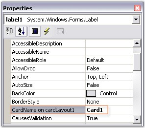

::: {style="DISPLAY: none"}
{#d2h_url_template}{#d2h_package_url style="WIDTH: 0px; DISPLAY: none; HEIGHT: 0px"}
:::

::::::::: {.d2h_secondary_topic style="PADDING-BOTTOM: 10pt; MARGIN: 0pt; PADDING-LEFT: 0pt; PADDING-RIGHT: 0pt; PADDING-TOP: 0pt"}
##### Configuring CardLayout     {#configuring-cardlayout style="tab-stops: 0pt"}

[]{style="COLOR: #15428b"} 

The configuration settings for the CardLayout have been discussed in this topic.

[]{style="COLOR: #15428b"} 

Card Names

[]{style="COLOR: #15428b"} 

By default, when a new Child control is added, the CardLayout will render a unique card name for it. This name can be modified by using the property given below.

[]{style="COLOR: #15428b"} 

::: {align="center"}
  --------------------- ---------------------------------
  CardLayout Property   Description
  CardName              Specifies the name of the card.
  --------------------- ---------------------------------
:::

[]{style="COLOR: #15428b"} 

+------------------------------------------------------------------------------------------------------------------------------------------------------------------------------------------------+
| **[\[C#\]]{style="FONT-FAMILY: 'Courier New'; COLOR: black"}**                                                                                                                                 |
|                                                                                                                                                                                                |
| []{style="FONT-FAMILY: 'Courier New'; COLOR: black"}                                                                                                                                           |
|                                                                                                                                                                                                |
| [this]{style="FONT-FAMILY: 'Courier New'; COLOR: blue"}[.cardLayout1.SetCardName([this]{style="COLOR: blue"}.label1, [\"Card1\"]{style="COLOR: maroon"});]{style="FONT-FAMILY: 'Courier New'"} |
+------------------------------------------------------------------------------------------------------------------------------------------------------------------------------------------------+

[]{style="COLOR: #15428b"} 

+-------------------------------------------------------------------------------------------------------------------------------------------------------------------------------------------+
| **[\[VB.NET\]]{style="FONT-FAMILY: 'Courier New'; COLOR: black"}**                                                                                                                        |
|                                                                                                                                                                                           |
| []{style="FONT-FAMILY: 'Courier New'; COLOR: blue"}                                                                                                                                       |
|                                                                                                                                                                                           |
| [Me]{style="FONT-FAMILY: 'Courier New'; COLOR: blue"}[.cardLayout1.SetCardName([Me]{style="COLOR: blue"}.label1, [\"Card1\"]{style="COLOR: maroon"})]{style="FONT-FAMILY: 'Courier New'"} |
+-------------------------------------------------------------------------------------------------------------------------------------------------------------------------------------------+

[]{style="COLOR: #15428b"} 

{border="0"}

[]{style="COLOR: #15428b"} 

Figure 661: Setting the Card Name

[]{style="COLOR: #15428b"} 

The methods associated with the above property are given below.

[]{style="COLOR: #15428b"} 

::: {align="center"}
  ---------------------- ----------------------------------------------------------------------------------
  Method                 Description
  GetCardName            Returns the card name of a Child component.
  GetCardNames           Returns an array containing the card names as strings.
  GetComponentFromName   Returns an associated control given a card name.
  GetNewCardName         Generates a new unique name for the card that could be added to this CardLayout.
  SetCardName            Sets the card name for a Child component.
  ---------------------- ----------------------------------------------------------------------------------
:::

[]{style="COLOR: #15428b"} 

::: {style="BORDER-BOTTOM: windowtext 1pt solid; BORDER-LEFT: medium none; PADDING-BOTTOM: 1pt; MARGIN-TOP: 9pt; PADDING-LEFT: 0pt; PADDING-RIGHT: 0pt; MARGIN-BOTTOM: 9pt; BORDER-TOP: windowtext 1pt solid; BORDER-RIGHT: medium none; PADDING-TOP: 1pt"}
{border="0"} Note: This property is added as an extended property in the properties window of the Child control added to the CardLayout.
:::

[]{style="COLOR: #4a5c8c; FONT-SIZE: 8pt"} 

Card Index

[]{style="COLOR: #4a5c8c; FONT-SIZE: 8pt"} 

The index of the previous and next cards can be determined using the below given properties.

[]{style="COLOR: #4a5c8c; FONT-SIZE: 8pt"} 

::: {align="center"}
  ----------------------- ---------------------------------------------------------------------------------------------------
  CardLayout Properties   Description
  NextCardIndex           Returns the index of the next card that will be shown when the Next() method gets called.
  PreviousCardIndex       Returns the index of the previous card that will be shown when the Previous() method gets called.
  ----------------------- ---------------------------------------------------------------------------------------------------
:::

[]{style="COLOR: #15428b"} 

Aspect Ratio

[]{style="COLOR: #4a5c8c; FONT-SIZE: 8pt"} 

The aspect ratio can be set using the property given below.

 

::: {align="center"}
  --------------------- -------------------------------------------------------------------------------------------
  CardLayout Property   Description
  MaintainAspectRatio   Indicates if the aspect ratio is to be maintained. The default value is set to \'False\'.
  --------------------- -------------------------------------------------------------------------------------------
:::

[]{style="COLOR: #15428b"} 

+----------------------------------------------------------------------------------------------------------------------------------------------------------------------------------------------------+
| **[\[C#\]]{style="FONT-FAMILY: 'Courier New'; COLOR: black"}**                                                                                                                                     |
|                                                                                                                                                                                                    |
| []{style="FONT-FAMILY: 'Courier New'; COLOR: blue"}                                                                                                                                                |
|                                                                                                                                                                                                    |
| [this]{style="FONT-FAMILY: 'Courier New'; COLOR: blue"}[.cardLayout1.SetMaintainAspectRatio([this]{style="COLOR: blue"}.label1, [true]{style="COLOR: blue"});]{style="FONT-FAMILY: 'Courier New'"} |
+----------------------------------------------------------------------------------------------------------------------------------------------------------------------------------------------------+

[]{style="COLOR: #15428b"} 

+-----------------------------------------------------------------------------------------------------------------------------------------------------------------------------------------------+
| **[\[VB.NET\]]{style="FONT-FAMILY: 'Courier New'; COLOR: black"}**                                                                                                                            |
|                                                                                                                                                                                               |
| []{style="FONT-FAMILY: 'Courier New'; COLOR: black"}                                                                                                                                          |
|                                                                                                                                                                                               |
| [Me]{style="FONT-FAMILY: 'Courier New'; COLOR: blue"}[.cardLayout1.SetMaintainAspectRatio([Me]{style="COLOR: blue"}.label1, [True]{style="COLOR: blue"})]{style="FONT-FAMILY: 'Courier New'"} |
+-----------------------------------------------------------------------------------------------------------------------------------------------------------------------------------------------+

[]{style="COLOR: #15428b"} 

The methods associated with the above property are given below.

[]{style="COLOR: #15428b"} 

::: {align="center"}
  ------------------------ ----------------------------------------------------------------------------------------
  Method                   Description
  GetMaintainAspectRatio   Returns the value for maintaining aspect ratio based on the control\'s preferred size.
  SetMaintainAspectRatio   Sets the value for maintaining aspect ratio based on the control\'s preferred size.
  ------------------------ ----------------------------------------------------------------------------------------
:::

[]{style="COLOR: #15428b"} 

See Also

[]{style="COLOR: black"} 

[Card Layout - Configuring Child Controls]{.UGHyperlink}[]{.UGHyperlink}

[]{#related-topics}
:::::::::
