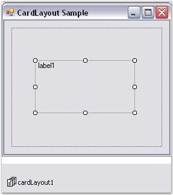
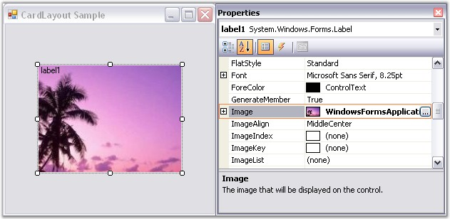
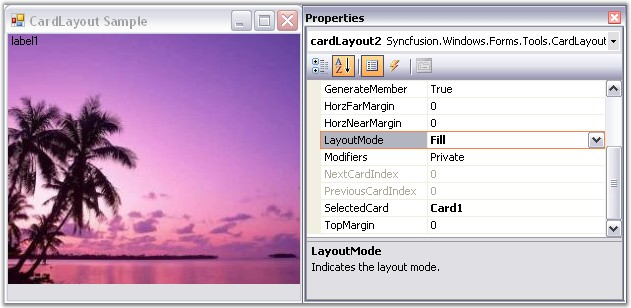
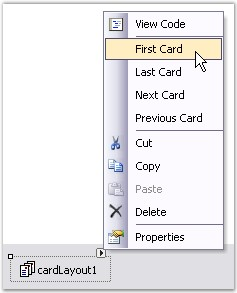
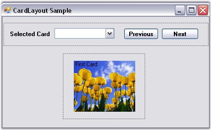
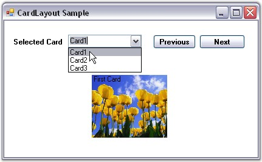

::: {style="DISPLAY: none"}
{#d2h_url_template}{#d2h_package_url style="WIDTH: 0px; DISPLAY: none; HEIGHT: 0px"}
:::

:::::::: {.d2h_secondary_topic style="PADDING-BOTTOM: 10pt; MARGIN: 0pt; PADDING-LEFT: 0pt; PADDING-RIGHT: 0pt; PADDING-TOP: 0pt"}
##### Configuring Child Controls {#configuring-child-controls style="tab-stops: 0pt"}

 

Deriving from the Layout Manager base, the CardLayout inherits all the functionality that the Layout Manager type exposes.

[]{style="COLOR: #15428b"} 

For example, when the CardLayout is added to a form, and a Panel control is added to it, then this Panel control acts as Card1, where the user can add the needed controls. Then another Panel control can be added which will act as Card2 and so on. During runtime, only one Card will be visible at a time. You can traverse through these cards by adding buttons and setting the appropriate code.

 

In the following screen shot, Panel control acts as the Container control and Label control acts as a card.

[]{style="COLOR: #15428b"} 

{border="0"}

[]{style="COLOR: #15428b"} 

Figure 662: Adding Labels as Cards

 

Image Settings

[]{style="COLOR: #15428b"} 

In the selected card, you can insert an image using the Child (Label) control property as shown below.

[]{style="COLOR: #15428b"} 

::: {align="center"}
  ------------------------ --------------------------------------------------------------
  Child Control Property   Description
  Image                    Gets / sets the image that will be displayed on the control.
  ------------------------ --------------------------------------------------------------
:::

[]{style="COLOR: #15428b"} 

+--------------------------------------------------------------------------------------------------------------------------------------------------------------------------------------------------------------------------------+
| **[\[C#\]]{style="FONT-FAMILY: 'Courier New'; COLOR: black"}**                                                                                                                                                                 |
|                                                                                                                                                                                                                                |
| []{style="FONT-FAMILY: 'Courier New'; COLOR: black"}                                                                                                                                                                           |
|                                                                                                                                                                                                                                |
| [this]{style="FONT-FAMILY: 'Courier New'; COLOR: blue"}[.label1.Image = ((System.Drawing.[Bitmap]{style="COLOR: teal"})(resources.GetObject([\"label1.Image\"]{style="COLOR: maroon"})));]{style="FONT-FAMILY: 'Courier New'"} |
+--------------------------------------------------------------------------------------------------------------------------------------------------------------------------------------------------------------------------------+

[]{style="COLOR: #15428b"} 

+---------------------------------------------------------------------------------------------------------------------------------------------------------------------------------------------------------------------------------------+
| **[\[VB.NET\]]{style="FONT-FAMILY: 'Courier New'; COLOR: black"}**                                                                                                                                                                    |
|                                                                                                                                                                                                                                       |
| []{style="FONT-FAMILY: 'Courier New'; COLOR: black"}                                                                                                                                                                                  |
|                                                                                                                                                                                                                                       |
| [Me]{style="FONT-FAMILY: 'Courier New'; COLOR: blue"}[.label1.Image = [DirectCast]{style="COLOR: blue"}((resources.GetObject([\"label1.Image\"]{style="COLOR: maroon"})), System.Drawing.Bitmap)]{style="FONT-FAMILY: 'Courier New'"} |
+---------------------------------------------------------------------------------------------------------------------------------------------------------------------------------------------------------------------------------------+

[]{style="COLOR: #15428b"} 

{border="0"}

[]{style="COLOR: #15428b"} 

Figure 663: Setting an Image for the Card

[]{style="COLOR: #15428b"} 

Size

[]{style="COLOR: #4a5c8c; FONT-SIZE: 8pt"} 

The preferred size and minimum size of the Child controls can be set using the **PreferredSize** and **MinimumSize** extended properties of the Child controls that are added to the CardLayout. Refer Child Control Settings to know about this topic.

[\
]{style="COLOR: #4a5c8c"}Layout Mode

[]{style="COLOR: #15428b"} 

The CardLayout provides two modes to layout the Child controls. The mode can be set using the property given below.

[]{style="COLOR: #15428b"} 

::: {align="center"}
+-----------------------------------+--------------------------------------------------------------------------------------------+
| CardLayout Property               | Description                                                                                |
+-----------------------------------+--------------------------------------------------------------------------------------------+
| LayoutMode                        | Specifies the layout mode for the Child controls. The default value is set to \'Default\'. |
|                                   |                                                                                            |
|                                   |                                                                                            |
|                                   |                                                                                            |
|                                   | The options included are as follows.                                                       |
|                                   |                                                                                            |
|                                   |                                                                                            |
|                                   |                                                                                            |
|                                   | Default and                                                                                |
|                                   |                                                                                            |
|                                   | Fill.                                                                                      |
+-----------------------------------+--------------------------------------------------------------------------------------------+
:::

 

When the layout mode of CardLayout is set to \'Default\', the Child control is simply centered within the Container when the Container\'s size is bigger than the Child control\'s preferred size. However, if the Container\'s size is smaller than the Child controls\'s preferred size, the Child control\'s size will shrink down to its minimum size. When shrunk, you have an option to specify whether the preferred width / height aspect ratio should be maintained for that Child control, which is specified using the extended **MaintainAspectRatio** property of each Child.

 

When the layout mode is set to \'Fill\', it simply resizes the Child control to fill the entire Container client area.

 

+---------------------------------------------------------------------------------------------------------------------------------------------------------------------------------------------------+
| **[\[C#\]]{style="FONT-FAMILY: 'Courier New'; COLOR: black"}**                                                                                                                                    |
|                                                                                                                                                                                                   |
| []{style="FONT-FAMILY: 'Courier New'; COLOR: black"}                                                                                                                                              |
|                                                                                                                                                                                                   |
| [this]{style="FONT-FAMILY: 'Courier New'; COLOR: blue"}[.cardLayout1.LayoutMode = Syncfusion.Windows.Forms.Tools.[CardLayoutMode]{style="COLOR: teal"}.Fill;]{style="FONT-FAMILY: 'Courier New'"} |
+---------------------------------------------------------------------------------------------------------------------------------------------------------------------------------------------------+

[]{style="COLOR: #15428b"} 

+-------------------------------------------------------------------------------------------------------------------------------------------------------------------------+
| **[\[VB.NET\]]{style="FONT-FAMILY: 'Courier New'; COLOR: black"}**                                                                                                      |
|                                                                                                                                                                         |
| []{style="FONT-FAMILY: 'Courier New'; COLOR: black"}                                                                                                                    |
|                                                                                                                                                                         |
| [Me]{style="FONT-FAMILY: 'Courier New'; COLOR: blue"}[.cardLayout1.LayoutMode = Syncfusion.Windows.Forms.Tools.CardLayoutMode.Fill]{style="FONT-FAMILY: 'Courier New'"} |
+-------------------------------------------------------------------------------------------------------------------------------------------------------------------------+

[]{style="COLOR: #15428b"} 

{border="0"}

[]{style="COLOR: #15428b"} 

Figure 664: Layout Mode set to \"Fill\"

[]{style="COLOR: #15428b"} 

See Also

[]{style="COLOR: #15428b"} 

[Configuring CardLayout]{.UGHyperlink}[, ]{.UGHyperlink}[Child Control Settings]{.UGHyperlink}[, ]{.UGHyperlink}

###### []{#p822}[]{#_Browsing_Through_Cards}3.4.4.3.2.1 Browsing Through Cards {#browsing-through-cards style="tab-stops: 0pt"}

[]{style="COLOR: #15428b"} 

This section discusses illustrates how to browse through the Cards (Child controls) that have been added to the CardLayout Manager.

[]{style="COLOR: #15428b"} 

Through Designer

[]{style="COLOR: #4a5c8c; FONT-SIZE: 8pt"} 

The selected card can be displayed using the property given below, which simply takes the card name as input.

[]{style="COLOR: #15428b"} 

::: {align="center"}
  --------------------- ---------------------------------------
  CardLayout Property   Description
  SelectedCard          Gets / sets the current card\'s name.
  --------------------- ---------------------------------------
:::

[]{style="COLOR: #15428b"} 

+--------------------------------------------------------------------------------------------------------------------------------------------------------------+
| **[\[C#\]]{style="FONT-FAMILY: 'Courier New'; COLOR: black"}**                                                                                               |
|                                                                                                                                                              |
| []{style="FONT-FAMILY: 'Courier New'; COLOR: black"}                                                                                                         |
|                                                                                                                                                              |
| [this]{style="FONT-FAMILY: 'Courier New'; COLOR: blue"}[.cardLayout1.SelectedCard = [\"Card1\"]{style="COLOR: maroon"};]{style="FONT-FAMILY: 'Courier New'"} |
+--------------------------------------------------------------------------------------------------------------------------------------------------------------+

[]{style="COLOR: #15428b"} 

+-----------------------------------------------------------------------------------------------------------------------------------------------------------+
| **[\[VB.NET\]]{style="FONT-FAMILY: 'Courier New'; COLOR: black"}**                                                                                        |
|                                                                                                                                                           |
| []{style="FONT-FAMILY: 'Courier New'; COLOR: black"}                                                                                                      |
|                                                                                                                                                           |
| [Me]{style="FONT-FAMILY: 'Courier New'; COLOR: blue"}[.cardLayout1.SelectedCard = [\"Card1\"]{style="COLOR: maroon"}]{style="FONT-FAMILY: 'Courier New'"} |
+-----------------------------------------------------------------------------------------------------------------------------------------------------------+

[]{style="COLOR: #15428b"} 

{border="0"}

[]{style="COLOR: #15428b"} 

Figure 665: Selecting Cards using Design Time Verbs

[]{style="COLOR: #15428b"} 

You can also browse through the different cards using the methods given below.

[]{style="COLOR: #15428b"} 

::: {align="center"}
  ---------- -------------------------------------
  Methods    Description
  First      Shows the first card.
  Next       Show the next card in the list.
  Previous   Show the previous card in the list.
  Last       Show the last card in the list.
  ---------- -------------------------------------
:::

[]{style="COLOR: #15428b"} 

::: {style="BORDER-BOTTOM: windowtext 1pt solid; BORDER-LEFT: medium none; PADDING-BOTTOM: 1pt; MARGIN-TOP: 9pt; PADDING-LEFT: 0pt; PADDING-RIGHT: 0pt; MARGIN-BOTTOM: 9pt; BORDER-TOP: windowtext 1pt solid; BORDER-RIGHT: medium none; PADDING-TOP: 1pt"}
{border="0"} Note: The SmartTag feature (available only in Visual Studio 2005) can also be used to browse through the cards of the CardLayout.
:::

[]{style="COLOR: #4a5c8c; FONT-SIZE: 8pt"} 

Through Code

[]{style="COLOR: #15428b"} 

Drag and drop the ComboBox and the Previous and Next Buttons for viewing the selected card. Use the **Previous()** and **Next()** methods of the CardLayout to see the CardLayout in action inside the Previous and Next Button Clicks.

[]{style="COLOR: #15428b"} 

+-------------------------------------------------------------------------------------------------------------------------------------------------------------------------------------------------------+
| **[\[C#\]]{style="FONT-FAMILY: 'Courier New'; COLOR: black"}**                                                                                                                                        |
|                                                                                                                                                                                                       |
| []{style="FONT-FAMILY: 'Courier New'; COLOR: black"}                                                                                                                                                  |
|                                                                                                                                                                                                       |
| [private]{style="FONT-FAMILY: 'Courier New'; COLOR: blue"}[ [void]{style="COLOR: blue"} Previous_Click([object]{style="COLOR: blue"} sender, System.EventArgs e)]{style="FONT-FAMILY: 'Courier New'"} |
|                                                                                                                                                                                                       |
| [{]{style="FONT-FAMILY: 'Courier New'"}                                                                                                                                                               |
|                                                                                                                                                                                                       |
| [this]{style="FONT-FAMILY: 'Courier New'; COLOR: blue"}[.cardLayout1.Previous();]{style="FONT-FAMILY: 'Courier New'"}                                                                                 |
|                                                                                                                                                                                                       |
| [}]{style="FONT-FAMILY: 'Courier New'"}                                                                                                                                                               |
|                                                                                                                                                                                                       |
| []{style="FONT-FAMILY: 'Courier New'"}                                                                                                                                                                |
|                                                                                                                                                                                                       |
| [private]{style="FONT-FAMILY: 'Courier New'; COLOR: blue"}[ [void]{style="COLOR: blue"} Next_Click([object]{style="COLOR: blue"} sender, System.EventArgs e)]{style="FONT-FAMILY: 'Courier New'"}     |
|                                                                                                                                                                                                       |
| [{]{style="FONT-FAMILY: 'Courier New'"}                                                                                                                                                               |
|                                                                                                                                                                                                       |
| [this]{style="FONT-FAMILY: 'Courier New'; COLOR: blue"}[.cardLayout1.Next();]{style="FONT-FAMILY: 'Courier New'"}                                                                                     |
|                                                                                                                                                                                                       |
| [}]{style="FONT-FAMILY: 'Courier New'"}                                                                                                                                                               |
+-------------------------------------------------------------------------------------------------------------------------------------------------------------------------------------------------------+

[]{style="COLOR: #15428b"} 

+--------------------------------------------------------------------------------------------------------------------------------------------------------------------------------------------------------------------------------------------------------------------------------------------------------------------+
| **[\[VB.NET\]]{style="FONT-FAMILY: 'Courier New'; COLOR: black"}**                                                                                                                                                                                                                                                 |
|                                                                                                                                                                                                                                                                                                                    |
| []{style="FONT-FAMILY: 'Courier New'; COLOR: black"}                                                                                                                                                                                                                                                               |
|                                                                                                                                                                                                                                                                                                                    |
| [Private]{style="FONT-FAMILY: 'Courier New'; COLOR: blue"}[ [Sub]{style="COLOR: blue"} Previous_Click([ByVal]{style="COLOR: blue"} sender [As]{style="COLOR: blue"} [Object]{style="COLOR: blue"}, [ByVal]{style="COLOR: blue"} e [As]{style="COLOR: blue"} System.EventArgs)]{style="FONT-FAMILY: 'Courier New'"} |
|                                                                                                                                                                                                                                                                                                                    |
| [Me]{style="FONT-FAMILY: 'Courier New'; COLOR: blue"}[.cardLayout1.Previous()]{style="FONT-FAMILY: 'Courier New'"}                                                                                                                                                                                                 |
|                                                                                                                                                                                                                                                                                                                    |
| [End]{style="FONT-FAMILY: 'Courier New'; COLOR: blue"}[ [Sub]{style="COLOR: blue"}]{style="FONT-FAMILY: 'Courier New'"}                                                                                                                                                                                            |
|                                                                                                                                                                                                                                                                                                                    |
| []{style="FONT-FAMILY: 'Courier New'; COLOR: blue"}                                                                                                                                                                                                                                                                |
|                                                                                                                                                                                                                                                                                                                    |
| [Private]{style="FONT-FAMILY: 'Courier New'; COLOR: blue"}[ [Sub]{style="COLOR: blue"} Next_Click([ByVal]{style="COLOR: blue"} sender [As]{style="COLOR: blue"} [Object]{style="COLOR: blue"}, [ByVal]{style="COLOR: blue"} e [As]{style="COLOR: blue"} System.EventArgs)]{style="FONT-FAMILY: 'Courier New'"}     |
|                                                                                                                                                                                                                                                                                                                    |
| [Me]{style="FONT-FAMILY: 'Courier New'; COLOR: blue"}[.cardLayout1.Next()]{style="FONT-FAMILY: 'Courier New'"}                                                                                                                                                                                                     |
|                                                                                                                                                                                                                                                                                                                    |
| [End]{style="FONT-FAMILY: 'Courier New'; COLOR: blue"}[ [Sub]{style="COLOR: blue"}]{style="FONT-FAMILY: 'Courier New'"}                                                                                                                                                                                            |
+--------------------------------------------------------------------------------------------------------------------------------------------------------------------------------------------------------------------------------------------------------------------------------------------------------------------+

[]{style="COLOR: #15428b"} 

{border="0"}

[]{style="COLOR: #15428b"} 

Figure 666: Adding Buttons And ComboBox

 

At run time, cards can be selected using the items in the ComboBox or by Button clicks.

[]{style="COLOR: #15428b"} 

{border="0"}

[]{style="COLOR: #15428b"} 

Figure 667: CardLayout showing one Picture at a Time

[]{style="COLOR: #15428b"} 

See Also

[]{style="COLOR: #15428b"} 

[Configuring CardLayout]{.UGHyperlink}[, ]{.UGHyperlink}[Configuring Child Controls]{.UGHyperlink}[, ]{.UGHyperlink}[Child Control Settings]{.UGHyperlink}[]{.UGHyperlink}

[]{#related-topics}
::::::::
