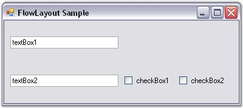

::: {style="DISPLAY: none"}
{#d2h_url_template}{#d2h_package_url style="WIDTH: 0px; DISPLAY: none; HEIGHT: 0px"}
:::

:::::::::: {.d2h_secondary_topic style="PADDING-BOTTOM: 10pt; MARGIN: 0pt; PADDING-LEFT: 0pt; PADDING-RIGHT: 0pt; PADDING-TOP: 0pt"}
##### Configuring Child Controls[]{style="FONT-SIZE: 9pt"} {#configuring-child-controls style="tab-stops: 0pt"}

Constraints on FlowLayout

[]{style="COLOR: #15428b"} 

Constrained FlowLayout is typically useful when creating resizable data entry forms filled with textboxes, checkboxes, and so on. During design time, the constraints can be specified for each Child control through its extended **Constraints on flowLayout** property. The constraints in the FlowLayout are described below in detail.

[]{style="COLOR: #15428b"} 

Setting the Constraints Through Designer

[]{style="COLOR: #15428b"} 

HAlign and VAlign

[]{style="COLOR: #15428b"} 

The alignment of the Child controls that have been placed within a row can be set using the properties given below. The alignment is done based upon the layout modes of the Child controls.

[]{style="COLOR: #15428b"} 

::: {align="center"}
+-----------------------------------+-----------------------------------------------------------------------------------+
| Child Control Constraints         | Description                                                                       |
+-----------------------------------+-----------------------------------------------------------------------------------+
| HAlign                            | Specifies the mode in which the Child control should be laid out within a row.    |
|                                   |                                                                                   |
|                                   |                                                                                   |
|                                   |                                                                                   |
|                                   | The options includes are as follows.                                              |
|                                   |                                                                                   |
|                                   |                                                                                   |
|                                   |                                                                                   |
|                                   | *Left,*                                                                           |
|                                   |                                                                                   |
|                                   | *Right,*                                                                          |
|                                   |                                                                                   |
|                                   | *Center and*                                                                      |
|                                   |                                                                                   |
|                                   | *Justify.*                                                                        |
+-----------------------------------+-----------------------------------------------------------------------------------+
| VAlign                            | Specifies the mode in which the Child control should be laid out within a column. |
|                                   |                                                                                   |
|                                   |                                                                                   |
|                                   |                                                                                   |
|                                   | The options includes are as follows.                                              |
|                                   |                                                                                   |
|                                   |                                                                                   |
|                                   |                                                                                   |
|                                   | *Top,*                                                                            |
|                                   |                                                                                   |
|                                   | *Bottom,*                                                                         |
|                                   |                                                                                   |
|                                   | *Center and*                                                                      |
|                                   |                                                                                   |
|                                   | *Justify.*                                                                        |
+-----------------------------------+-----------------------------------------------------------------------------------+
:::

[]{style="COLOR: #15428b"} 

When the alignment is set to \'Justify\', any extra space will be equally distributed across the other Child controls that have been justified differently within that same row. However, when there is a lack of sufficient space, the justified Child controls are shrunk proportionally based on their minimum size and preferred size settings (specifically, the difference between the two sizes).

[]{style="COLOR: #15428b"} 

::: {style="BORDER-BOTTOM: windowtext 1pt solid; BORDER-LEFT: medium none; PADDING-BOTTOM: 1pt; MARGIN-TOP: 9pt; PADDING-LEFT: 0pt; PADDING-RIGHT: 0pt; MARGIN-BOTTOM: 9pt; BORDER-TOP: windowtext 1pt solid; BORDER-RIGHT: medium none; PADDING-TOP: 1pt"}
{border="0"} Note:[ ]{style="COLOR: black; FONT-SIZE: 8pt"}The Alignment property should be set to \'True\' for the above properties to take effect.
:::

[]{style="COLOR: #15428b"} 

{border="0"}

[]{style="COLOR: #15428b"} 

Figure 674: Children with different HAlign Settings

[]{style="COLOR: #15428b"} 

::: {style="BORDER-BOTTOM: windowtext 1pt solid; BORDER-LEFT: medium none; PADDING-BOTTOM: 1pt; MARGIN-TOP: 9pt; PADDING-LEFT: 0pt; PADDING-RIGHT: 0pt; MARGIN-BOTTOM: 9pt; BORDER-TOP: windowtext 1pt solid; BORDER-RIGHT: medium none; PADDING-TOP: 1pt"}
{border="0"} Note: In the figure above, the textboxes have autolabels associated with them.
:::

[]{style="COLOR: #15428b"} 

Layout Participation

[]{style="COLOR: #15428b"} 

You can prevent a Child control from participating in the layout using the below given property.

[]{style="COLOR: #15428b"} 

::: {align="center"}
  -------------------------- -------------------------------------------------------------------------------------------------------------
  Child Control Constraint   Description
  Active                     Specifies whether the Child control should participate in the layout. The default value is set to \'True\'.
  -------------------------- -------------------------------------------------------------------------------------------------------------
:::

[]{style="COLOR: #15428b"} 

Line Beginner

[]{style="COLOR: #4a5c8c; FONT-SIZE: 8pt"} 

You can force a Child control to always start at a new row by setting the below given property.

[]{style="COLOR: #15428b"} 

::: {align="center"}
  -------------------------- -----------------------------------------------------------------------------------------------------------------------------------
  Child Control Constraint   Description
  NewLine                    Specifies whether the Child control should always be moved to the beginning of a new line. The default value is set to \'False\'.
  -------------------------- -----------------------------------------------------------------------------------------------------------------------------------
:::

[]{style="COLOR: #15428b"} 

Row Height and Column Width

[]{style="COLOR: #15428b"} 

By default, rows are not adjusted to take into account the remaining vertical space in the horizontal layout mode or horizontal space in the vertical layout mode. This can be done using the properties given below.

[]{style="COLOR: #15428b"} 

::: {align="center"}
  -------------------------- -----------------------------------------------------------------------------------------------------------------------
  Child Control Constraint   Description
  ProportionalColWidth       Specifies if proportional column widths should be used in the vertical layout. The default value is set to \'False\'.
  ProportionalRowHeight      Specifies if proportional row heights should be used in the horizontal layout. The default value is set to \'False\'.
  -------------------------- -----------------------------------------------------------------------------------------------------------------------
:::

[]{style="COLOR: #15428b"} 

{border="0"}

[]{style="COLOR: #15428b"} 

Figure 675: Two Proportionally Aligned Rows Split the Extra Horizontal Space Between Them

[]{style="COLOR: #15428b"} 

The methods associated with the above properties are given below.

[]{style="COLOR: #15428b"} 

::: {align="center"}
  ------------------- -------------------------------------------------------------------------------
  Methods             Description
  GetConstraints      Returns the constraints associated with the specified control.
  GetConstraintsRef   Returns a reference to the constraints associated with the specified control.
  SetConstraints      Specifies the constraints associated with the specified control.
  ------------------- -------------------------------------------------------------------------------
:::

[]{style="COLOR: #15428b"} 

In code, you can specify constraints through the **SetConstraints()** method. The **FlowLayoutConstraints** type defines the constraint that can be specified on a Child component.

[]{style="COLOR: #15428b"} 

Setting the Constraints Programmatically

[]{style="COLOR: #15428b"} 

In the coding given below, the constraints are set to the particular control along with the constraint values like Active, HAlign, VAlign, NewLine, ProportionalColWidth and ProportionalRowHeight.

[]{style="COLOR: #15428b"} 

+---------------------------------------------------------------------------------------------------------------------------------------------------------------------------------------------------------------------------------------------------------------------------------------------------------------------------------------------------------------------------------------------------------------------------------------------------------------------------------------------------------------------------------------------------------+
| **[\[C#\]]{style="FONT-FAMILY: 'Courier New'; COLOR: black"}**                                                                                                                                                                                                                                                                                                                                                                                                                                                                                          |
|                                                                                                                                                                                                                                                                                                                                                                                                                                                                                                                                                         |
| []{style="COLOR: black"}                                                                                                                                                                                                                                                                                                                                                                                                                                                                                                                                |
|                                                                                                                                                                                                                                                                                                                                                                                                                                                                                                                                                         |
| [this]{style="FONT-FAMILY: 'Courier New'; COLOR: blue"}[.flowLayout1.SetConstraints([this]{style="COLOR: blue"}.textBox1, [new]{style="COLOR: blue"} Syncfusion.Windows.Forms.Tools.[FlowLayoutConstraints]{style="COLOR: teal"}([true]{style="COLOR: blue"}, Syncfusion.Windows.Forms.Tools.[HorzFlowAlign]{style="COLOR: teal"}.Justify, Syncfusion.Windows.Forms.Tools.[VertFlowAlign]{style="COLOR: teal"}.Center, [false]{style="COLOR: blue"}, [false]{style="COLOR: blue"}, [false]{style="COLOR: blue"}));]{style="FONT-FAMILY: 'Courier New'"} |
+---------------------------------------------------------------------------------------------------------------------------------------------------------------------------------------------------------------------------------------------------------------------------------------------------------------------------------------------------------------------------------------------------------------------------------------------------------------------------------------------------------------------------------------------------------+

[]{style="COLOR: #15428b"} 

+-------------------------------------------------------------------------------------------------------------------------------------------------------------------------------------------------------------------------------------------------------------------------------------------------------------------------------------------------------------------------------------------------------------------------------------------------------------------------------+
| **[\[VB.NET\]]{style="FONT-FAMILY: 'Courier New'; COLOR: black"}**                                                                                                                                                                                                                                                                                                                                                                                                            |
|                                                                                                                                                                                                                                                                                                                                                                                                                                                                               |
| []{style="COLOR: black"}                                                                                                                                                                                                                                                                                                                                                                                                                                                      |
|                                                                                                                                                                                                                                                                                                                                                                                                                                                                               |
| [Me]{style="FONT-FAMILY: 'Courier New'; COLOR: blue"}[.flowLayout1.SetConstraints([Me]{style="COLOR: blue"}.textBox1, [New]{style="COLOR: blue"} Syncfusion.Windows.Forms.Tools.FlowLayoutConstraints([True]{style="COLOR: blue"}, Syncfusion.Windows.Forms.Tools.HorzFlowAlign.Justify, Syncfusion.Windows.Forms.Tools.VertFlowAlign.Center, [False]{style="COLOR: blue"}, [False]{style="COLOR: blue"}, [False]{style="COLOR: blue"}))]{style="FONT-FAMILY: 'Courier New'"} |
+-------------------------------------------------------------------------------------------------------------------------------------------------------------------------------------------------------------------------------------------------------------------------------------------------------------------------------------------------------------------------------------------------------------------------------------------------------------------------------+

[]{style="COLOR: #15428b"} 

See Also

[]{style="COLOR: #4a5c8c"} 

[Configuring FlowLayout]{.UGHyperlink}[, ]{.UGHyperlink}[Centering the Child Controls Horizontally and Vertically]{.UGHyperlink}[, ]{.UGHyperlink}[Enabling Constrained FlowLayout on a Container]{.UGHyperlink}[, ]{.UGHyperlink}[Rearranging the Controls laid out by FlowLayout]{.UGHyperlink}[, ]{.UGHyperlink}[Child Control Settings]{.UGHyperlink}[]{.UGHyperlink}

[]{#related-topics}
::::::::::
