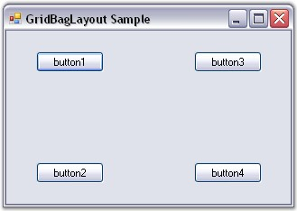
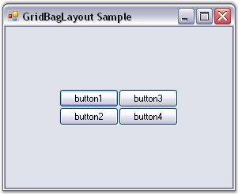
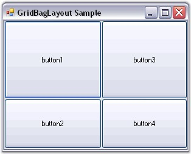
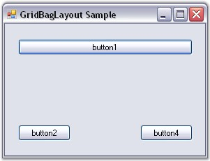
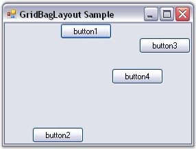
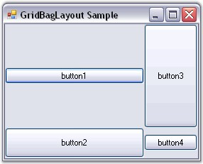
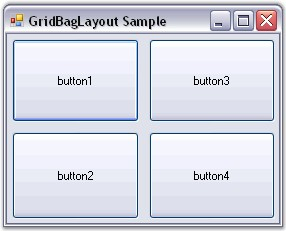

::: {style="DISPLAY: none"}
{#d2h_url_template}{#d2h_package_url style="WIDTH: 0px; DISPLAY: none; HEIGHT: 0px"}
:::

:::::::::::::: {.d2h_secondary_topic style="PADDING-BOTTOM: 10pt; MARGIN: 0pt; PADDING-LEFT: 0pt; PADDING-RIGHT: 0pt; PADDING-TOP: 0pt"}
##### Configuring Child Controls[]{#p834} {#configuring-child-controls style="tab-stops: 0pt"}

[]{style="COLOR: #15428b"} 

The GridBagLayout is completely configured through the GridBag Constraints set for each Child component. The number of rows and columns in the virtual grid is also derived from the specified constraints. The constraint for each Child component on the GridBagLayout can be specified through designer and programmatically.

[]{style="COLOR: #15428b"} 

Setting the Constraints Through Designer

 

GridPosX and GridPosY

[]{style="COLOR: #15428b"} 

The primary objective in setting the constraint for a Child control is usually to determine in which cell it should be laid out.

[]{style="COLOR: #15428b"} 

::: {style="BORDER-BOTTOM: windowtext 1pt solid; BORDER-LEFT: medium none; PADDING-BOTTOM: 1pt; MARGIN-TOP: 9pt; PADDING-LEFT: 0pt; PADDING-RIGHT: 0pt; MARGIN-BOTTOM: 9pt; BORDER-TOP: windowtext 1pt solid; BORDER-RIGHT: medium none; PADDING-TOP: 1pt"}
{border="0"} Note: Multiple Child controls can occupy the same cell potentially overlapping each other.
:::

[]{style="COLOR: #15428b"} 

::: {align="center"}
  --------------------------- -----------------------------------------------------------------------------------------------------------------------
  Child Control Constraints   Description
  GridPosX                    Specifies the column in the virtual grid, where the component\'s layout bounds begin. The default value is set to -1.
  GridPosY                    Specifies the row in the virtual grid, where the component\'s layout bounds begin. The default value is set to -1.
  --------------------------- -----------------------------------------------------------------------------------------------------------------------
:::

[]{style="COLOR: #15428b"} 

The following screen shot shows four buttons with non-zero weights with the **GridPosX** and **GridPosY** setting as follows: (0, 0), (0, 1), (1 ,0), (1, 1), resulting in a 2 x 2 virtual grid.

[]{style="COLOR: #15428b"} 

{border="0"}

[]{style="COLOR: #15428b"} 

Figure 691: GridPosX and GridPosY Set

[]{style="COLOR: #15428b"} 

WeightX and WeightY

[]{style="COLOR: #15428b"} 

The next setting determines the weights for each row and column. The GridBagLayout determines the width and height of the rows based on the preferred size setting of the Child components. Then it allocates the extra horizontal and vertical space available between these columns and rows based on their weights. The weight of a row or column is basically the largest weight of all the Child components in that row or column.

[]{style="COLOR: #15428b"} 

::: {align="center"}
  --------------------------- ------------------------------------------------------------------------------------------------------------------------
  Child Control Constraints   Description
  WeightX                     Specifies the weight of this component in containing the extra horizontal space. The default value is set to \'Null\'.
  WeightY                     Specifies the weight of this component in containing the extra vertical space. The default value is set to \'Null\'.
  --------------------------- ------------------------------------------------------------------------------------------------------------------------
:::

[]{style="COLOR: #15428b"} 

By default, the weights are set to \'Null\', in which case, the available space is not distributed to the rows and columns at all. The virtual grid will simply be centered to the Container\'s client area, as shown below.

[]{style="COLOR: #15428b"} 

{border="0"}

[]{style="COLOR: #15428b"} 

Figure 692: Buttons with 0 WeightX and WeightY

[]{style="COLOR: #15428b"} 

Following is another setting when the weights are different (the Child controls are set to **Fill.Both**).

 

In this screen shot, the WeightX and WeightY of button1 is (2, 1), button2 is (1, 2), button3 is (1, 1) and button4 is (1, 1). Based on these settings, the horizontal space is distributed between the 1st and 2nd column in the ratio 2:1 and the vertical space is distributed between the 2 rows in the ratio 2:1.

[]{style="COLOR: #15428b"} 

{border="0"}

[]{style="COLOR: #15428b"} 

Figure 693: Buttons with Custom WeightX and WeightY

[]{style="COLOR: #15428b"} 

::: {style="BORDER-BOTTOM: windowtext 1pt solid; BORDER-LEFT: medium none; PADDING-BOTTOM: 1pt; MARGIN-TOP: 9pt; PADDING-LEFT: 0pt; PADDING-RIGHT: 0pt; MARGIN-BOTTOM: 9pt; BORDER-TOP: windowtext 1pt solid; BORDER-RIGHT: medium none; PADDING-TOP: 1pt"}
{border="0"} Note: The GetLayoutWeights() method returns the row and column weights of the current layout.
:::

[]{style="COLOR: #15428b"} 

CellSpanX and CellSpanY

[]{style="COLOR: #15428b"} 

The Child controls by default span a single cell with these properties set to (1, 1). However, it can be made to span multiple rows and / or columns by changing these properties.

[]{style="COLOR: #15428b"} 

::: {align="center"}
  --------------------------- -----------------------------------------------------------------------------------------------------------------------
  Child Control Constraints   Description
  CellSpanX                   Specifies the number of columns this component should span in the virtual grid. The default value is set to \'Null\'.
  CellSpanY                   Specifies the number of rows this component should span in the virtual grid. The default value is set to \'Null\'.
  --------------------------- -----------------------------------------------------------------------------------------------------------------------
:::

[]{style="COLOR: #15428b"} 

The below screen shot shows button1 spanning 2 columns (CellSpanX = 2 and Fill = Horizontal). This also results in button1 overlapping button3, which also occupies the (1, 0) cell.

[]{style="COLOR: #15428b"} 

{border="0"}

[]{style="COLOR: #15428b"} 

Figure 694: Button1 Spanning Two Columns

[]{style="COLOR: #15428b"} 

Anchor

[]{style="COLOR: #15428b"} 

Once a Child control has been allocated the layout area (usually one or more cells) in the virtual grid, it may be anchored at the sides or the corners of that layout area. This can be done using the property given below.

[]{style="COLOR: #15428b"} 

::: {align="center"}
+-----------------------------------+-------------------------------------------------------------------------------------------------------------------------------------------------------+
| Child Control Constraint          | Description                                                                                                                                           |
+-----------------------------------+-------------------------------------------------------------------------------------------------------------------------------------------------------+
| Anchor                            | Specifies the justification of a component within it\'s available layout bounds (a cell in the virtual grid). The default value is set to \'Center\'. |
|                                   |                                                                                                                                                       |
|                                   |                                                                                                                                                       |
|                                   |                                                                                                                                                       |
|                                   | The options includes are as follows.                                                                                                                  |
|                                   |                                                                                                                                                       |
|                                   |                                                                                                                                                       |
|                                   |                                                                                                                                                       |
|                                   | *Center,*                                                                                                                                             |
|                                   |                                                                                                                                                       |
|                                   | *North,*                                                                                                                                              |
|                                   |                                                                                                                                                       |
|                                   | *NorthEast,*                                                                                                                                          |
|                                   |                                                                                                                                                       |
|                                   | *East,*                                                                                                                                               |
|                                   |                                                                                                                                                       |
|                                   | *SouthEast,*                                                                                                                                          |
|                                   |                                                                                                                                                       |
|                                   | *South,*                                                                                                                                              |
|                                   |                                                                                                                                                       |
|                                   | *SouthWest,*                                                                                                                                          |
|                                   |                                                                                                                                                       |
|                                   | *West and*                                                                                                                                            |
|                                   |                                                                                                                                                       |
|                                   | *NorthWest.*                                                                                                                                          |
+-----------------------------------+-------------------------------------------------------------------------------------------------------------------------------------------------------+
:::

[]{style="COLOR: #15428b"} 

The following screen shot shows the same four buttons with different anchor settings. Button1 is set to \'NorthEast\', button2 is set to \'South\', button3 is set to \'East\', and button4 is set to \'NorthWest\'.

[]{style="COLOR: #15428b"} 

{border="0"}

[]{style="COLOR: #15428b"} 

Figure 695: Buttons with Different Anchor Settings

 

::: {style="BORDER-BOTTOM: windowtext 1pt solid; BORDER-LEFT: medium none; PADDING-BOTTOM: 1pt; MARGIN-TOP: 9pt; PADDING-LEFT: 0pt; PADDING-RIGHT: 0pt; MARGIN-BOTTOM: 9pt; BORDER-TOP: windowtext 1pt solid; BORDER-RIGHT: medium none; PADDING-TOP: 1pt"}
{border="0"} Note: Anchoring is done within the Child control\'s layout area.
:::

[]{style="COLOR: #15428b"} 

Fill

[]{style="COLOR: #15428b"} 

You can also make the cell fill its layout area using the below given property.

[]{style="COLOR: #15428b"} 

::: {align="center"}
+-----------------------------------+-------------------------------------------------------------------------------------------------------------------+
| Child Control Constraint          | Description                                                                                                       |
+-----------------------------------+-------------------------------------------------------------------------------------------------------------------+
| Fill                              | Specifies whether to resize a component when the component\'s layout bounds are larger than it\'s preferred size. |
|                                   |                                                                                                                   |
|                                   |                                                                                                                   |
|                                   |                                                                                                                   |
|                                   | The options included are as follows.                                                                              |
|                                   |                                                                                                                   |
|                                   |                                                                                                                   |
|                                   |                                                                                                                   |
|                                   | *None,*                                                                                                           |
|                                   |                                                                                                                   |
|                                   | *Both,*                                                                                                           |
|                                   |                                                                                                                   |
|                                   | *Horizontal and*                                                                                                  |
|                                   |                                                                                                                   |
|                                   | *Vertical.*                                                                                                       |
+-----------------------------------+-------------------------------------------------------------------------------------------------------------------+
:::

[]{style="COLOR: #15428b"} 

The following screen shot shows the four buttons with different fill settings. In the following screen shot, button1 is set to \'Horizontal\', button2 is set to \'Vertical\' (with the Anchor property set to East), button3 is set to \'Both\', and button4 is set to \'None\'.

[]{style="COLOR: #15428b"} 

{border="0"}

[]{style="COLOR: #15428b"} 

Figure 696: Buttons with Different Fill Settings

[]{style="COLOR: #15428b"} 

IPadX and IPadY

[]{style="COLOR: #15428b"} 

The amount that should be added to the component\'s declared preferred size, when determining the preferred size for that component during layout can be specified using the properties given below.

[]{style="COLOR: #15428b"} 

::: {align="center"}
  --------------------------- ------------------------------------------------------------------------------------------------------------------------------------------
  Child Control Constraints   Description
  IpadX                       Specifies the pixels to be added to the size of the component when determining its overall width. The default value is set to \'Null\'.
  IpadY                       Specifies the pixels to be added to the size of the component when determining its overall height. The default value is set to \'Null\'.
  --------------------------- ------------------------------------------------------------------------------------------------------------------------------------------
:::

[]{style="COLOR: #15428b"} 

For example, if **IPadX** property is set to \'10\', then the preferred width of the Child control will be increased by 10 from that of the declared preferred size.

[]{style="COLOR: #15428b"} 

Insets Rectangle

[]{style="COLOR: #15428b"} 

The padding that is to be added around the Child component can be specified using the property given below. Similar to the IPad settings above, this space will be added to the Child control\'s preferred size when calculating the layout. However, unlike the IPad settings, this will not increase the size of the Child control, but indicates the minimum padding to be applied around the Child control.

[]{style="COLOR: #15428b"} 

::: {align="center"}
  -------------------------- --------------------------------------------------------------------------------------------------------------------------------------------------------------
  Child Control Constraint   Description
  Insets                     Specifies the extra space that the manager adds around a component\'s preferred bounds before layouting the component. The default value is set to \'Null\'.
  -------------------------- --------------------------------------------------------------------------------------------------------------------------------------------------------------
:::

[]{style="COLOR: #15428b"} 

The buttons below are all of equal non-zero weights and set to **Fill.Both**. However, they have an **Insets** property of (5,5,5,5), giving it a padding of 5 pixels on all sides.

[]{style="COLOR: #15428b"} 

{border="0"}

[]{style="COLOR: #15428b"} 

Figure 697: Buttons with Insets Set

 

The methods associated with the above properties are given below.

[]{style="COLOR: #15428b"} 

::: {align="center"}
  ------------------- -------------------------------------------------------------------------------
  Methods             Description
  GetConstraints      Returns the constraints associated with the specified control.
  GetConstraintsRef   Returns a reference to the constraints associated with the specified control.
  SetConstraints      Specifies the constraints associated with the specified control.
  ------------------- -------------------------------------------------------------------------------
:::

[]{style="COLOR: #15428b"} 

In code, you can specify constraints through the **SetConstraints()** method. The **GridBagConstraints** type defines the constraint that can be specified on a Child component.

[]{style="COLOR: black; FONT-SIZE: 8pt"} 

Setting the Constraints Programmatically

[]{style="COLOR: navy; FONT-SIZE: 8pt"} 

In the code given below, the GridBagLayout constraints can be set for the controls along with the constraint values for Insets, WeightX, WeightY, Anchor, Fill, GridPosX, GridPosY, IPadX and IPadY.

[]{style="COLOR: #15428b"} 

+---------------------------------------------------------------------------------------------------------------------------------------------------------------------------------------------------------------------------------------------------------------------------------------------------------------------------------------------------------------------------------------------------------------------------------------------------------------------------------------------------------------------------------------------------------------------------------+
| **[\[C#\]]{style="FONT-FAMILY: 'Courier New'; COLOR: black"}**                                                                                                                                                                                                                                                                                                                                                                                                                                                                                                                  |
|                                                                                                                                                                                                                                                                                                                                                                                                                                                                                                                                                                                 |
| []{style="FONT-FAMILY: 'Courier New'; COLOR: black"}                                                                                                                                                                                                                                                                                                                                                                                                                                                                                                                            |
|                                                                                                                                                                                                                                                                                                                                                                                                                                                                                                                                                                                 |
| [this]{style="FONT-FAMILY: 'Courier New'; COLOR: blue"}[.gridBayLayout.SetConstraints([this]{style="COLOR: blue"}.button1, [new]{style="COLOR: blue"} Syncfusion.Windows.Forms.Tools.[GridBagConstraints]{style="COLOR: teal"}(0, 0, 3, 1, 1, 1, Syncfusion.Windows.Forms.Tools.[AnchorTypes]{style="COLOR: teal"}.Center, Syncfusion.Windows.Forms.Tools.[FillType]{style="COLOR: teal"}.Both, [new]{style="COLOR: blue"} Syncfusion.Windows.Forms.Tools.[Insets]{style="COLOR: teal"}(0, 0, 0, 0), 0, 0, [false]{style="COLOR: blue"}));]{style="FONT-FAMILY: 'Courier New'"} |
+---------------------------------------------------------------------------------------------------------------------------------------------------------------------------------------------------------------------------------------------------------------------------------------------------------------------------------------------------------------------------------------------------------------------------------------------------------------------------------------------------------------------------------------------------------------------------------+

[]{style="COLOR: #15428b"} 

+--------------------------------------------------------------------------------------------------------------------------------------------------------------------------------------------------------------------------------------------------------------------------------------------------------------------------------------------------------------------------------------------------------------------------------------------------------------------------------+
| **[\[VB.NET\]]{style="FONT-FAMILY: 'Courier New'; COLOR: black"}**                                                                                                                                                                                                                                                                                                                                                                                                             |
|                                                                                                                                                                                                                                                                                                                                                                                                                                                                                |
| []{style="FONT-FAMILY: 'Courier New'; COLOR: black"}                                                                                                                                                                                                                                                                                                                                                                                                                           |
|                                                                                                                                                                                                                                                                                                                                                                                                                                                                                |
| [Me]{style="FONT-FAMILY: 'Courier New'; COLOR: blue"}[.gridBayLayout.SetConstraints([Me]{style="COLOR: blue"}.button1, [New]{style="COLOR: blue"} Syncfusion.Windows.Forms.Tools.GridBagConstraints(0, 0, 3, 1, 1, 1, Syncfusion.Windows.Forms.Tools.AnchorTypes.Center, Syncfusion.Windows.Forms.Tools.FillType.Both, [New]{style="COLOR: blue"} Syncfusion.Windows.Forms.Tools.Insets(0, 0, 0, 0), 0, 0, [False]{style="COLOR: blue"}))]{style="FONT-FAMILY: 'Courier New'"} |
+--------------------------------------------------------------------------------------------------------------------------------------------------------------------------------------------------------------------------------------------------------------------------------------------------------------------------------------------------------------------------------------------------------------------------------------------------------------------------------+

[]{style="COLOR: #15428b"} 

See Also

[]{style="COLOR: #4a5c8c"} 

Rearranging the Controls laid out by GridBagLayout[, ]{style="COLOR: black"}Child Control Settings[]{style="COLOR: black"}

[]{#related-topics}
::::::::::::::
