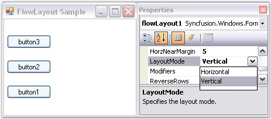
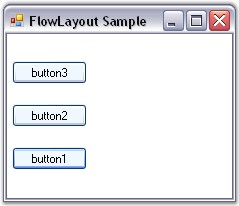
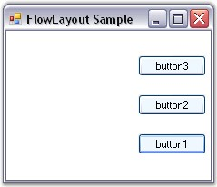
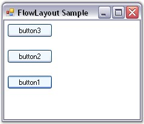
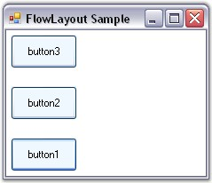

::: {style="DISPLAY: none"}
{#d2h_url_template}{#d2h_package_url style="WIDTH: 0px; DISPLAY: none; HEIGHT: 0px"}
:::

:::::::::::: {.d2h_secondary_topic style="PADDING-BOTTOM: 10pt; MARGIN: 0pt; PADDING-LEFT: 0pt; PADDING-RIGHT: 0pt; PADDING-TOP: 0pt"}
##### Configuring FlowLayout {#configuring-flowlayout style="tab-stops: 0pt"}

[]{style="COLOR: #15428b"} 

Layout Mode

[]{style="COLOR: #15428b"} 

The layout mode dictates the core function of a FlowLayout, whether to layout the Child controls horizontally or vertically. This property will be in effect for both the scenarios.

[]{style="COLOR: #15428b"} 

::: {align="center"}
+-----------------------------------+----------------------------------------------------------------------------------------------+
| FlowLayout Property               | Description                                                                                  |
+-----------------------------------+----------------------------------------------------------------------------------------------+
| LayoutMode                        | Specifies the layout mode of the Child controls. The default value is set to \'Horizontal\'. |
|                                   |                                                                                              |
|                                   |                                                                                              |
|                                   |                                                                                              |
|                                   | The options included are as follows.                                                         |
|                                   |                                                                                              |
|                                   |                                                                                              |
|                                   |                                                                                              |
|                                   | *Horizontal and*                                                                             |
|                                   |                                                                                              |
|                                   | *Vertical.*                                                                                  |
+-----------------------------------+----------------------------------------------------------------------------------------------+
:::

[]{style="COLOR: #15428b"} 

+-------------------------------------------------------------------------------------------------------------------------------------------------------------------------------------------------------+
| **[\[C#\]]{style="FONT-FAMILY: 'Courier New'; COLOR: black"}**                                                                                                                                        |
|                                                                                                                                                                                                       |
| []{style="FONT-FAMILY: 'Courier New'; COLOR: black"}                                                                                                                                                  |
|                                                                                                                                                                                                       |
| [this]{style="FONT-FAMILY: 'Courier New'; COLOR: blue"}[.flowLayout1.LayoutMode = Syncfusion.Windows.Forms.Tools.[FlowLayoutMode]{style="COLOR: teal"}.Vertical;]{style="FONT-FAMILY: 'Courier New'"} |
+-------------------------------------------------------------------------------------------------------------------------------------------------------------------------------------------------------+

[]{style="COLOR: #15428b"} 

+-----------------------------------------------------------------------------------------------------------------------------------------------------------------------------+
| **[\[VB.NET\]]{style="FONT-FAMILY: 'Courier New'; COLOR: black"}**                                                                                                          |
|                                                                                                                                                                             |
| []{style="FONT-FAMILY: 'Courier New'; COLOR: black"}                                                                                                                        |
|                                                                                                                                                                             |
| [Me]{style="FONT-FAMILY: 'Courier New'; COLOR: blue"}[.flowLayout1.LayoutMode = Syncfusion.Windows.Forms.Tools.FlowLayoutMode.Vertical]{style="FONT-FAMILY: 'Courier New'"} |
+-----------------------------------------------------------------------------------------------------------------------------------------------------------------------------+

[]{style="COLOR: #15428b"} 

{border="0"}

[]{style="COLOR: #15428b"} 

Figure 669: Layout Mode set to \"Vertical\"

[]{style="COLOR: #15428b"} 

ParticipateInLayout

[]{style="COLOR: #4a5c8c; FONT-SIZE: 8pt"} 

Child controls can be prevented from being laid out using the FlowLayout Manager. This can be done using the methods given below.

[]{style="COLOR: #15428b"} 

::: {align="center"}
  ------------------------ -------------------------------------------------------------
  Method                   Description
  GetParticipateInLayout   Indicates whether the component is in the layout list.
  SetParticipateInLayout   Adds or removes the specified control from the layout list.
  ------------------------ -------------------------------------------------------------
:::

[]{style="COLOR: #15428b"} 

The following code can be used to add or remove the Child control from the FlowLayout list programmatically.

[]{style="COLOR: #15428b"} 

+-----------------------------------------------------------------------------------------------------------------------------------------------------------------------------------------------------+
| **[\[C#\]]{style="FONT-FAMILY: 'Courier New'; COLOR: black"}**                                                                                                                                      |
|                                                                                                                                                                                                     |
| []{style="FONT-FAMILY: 'Courier New'; COLOR: black"}                                                                                                                                                |
|                                                                                                                                                                                                     |
| [this]{style="FONT-FAMILY: 'Courier New'; COLOR: blue"}[.flowLayout1.SetParticipateInLayout([this]{style="COLOR: blue"}.button1,[false]{style="COLOR: blue"});]{style="FONT-FAMILY: 'Courier New'"} |
+-----------------------------------------------------------------------------------------------------------------------------------------------------------------------------------------------------+

[]{style="COLOR: #15428b"} 

+------------------------------------------------------------------------------------------------------------------------------------------------------------------------------------------------+
| **[\[VB.NET\]]{style="FONT-FAMILY: 'Courier New'; COLOR: black"}**                                                                                                                             |
|                                                                                                                                                                                                |
| []{style="FONT-FAMILY: 'Courier New'; COLOR: black"}                                                                                                                                           |
|                                                                                                                                                                                                |
| [Me]{style="FONT-FAMILY: 'Courier New'; COLOR: blue"}[.flowLayout1.SetParticipateInLayout([Me]{style="COLOR: blue"}.button1,[False]{style="COLOR: blue"})]{style="FONT-FAMILY: 'Courier New'"} |
+------------------------------------------------------------------------------------------------------------------------------------------------------------------------------------------------+

[]{style="COLOR: #15428b"} 

HGap and VGap

[]{style="COLOR: #15428b"} 

The horizontal and the vertical gap between the Child controls can be set using the properties given below.

[]{style="COLOR: #15428b"} 

::: {align="center"}
  --------------------- ------------------------------------------------------------
  FlowLayout Property   Description
  HGap                  Gets / sets the horizontal spacing between the components.
  VGap                  Gets / sets the vertical spacing between the components.
  --------------------- ------------------------------------------------------------
:::

[]{style="COLOR: #4a5c8c; FONT-SIZE: 8pt"} 

+----------------------------------------------------------------------------------------------------------------------+
| **[\[C#\]]{style="FONT-FAMILY: 'Courier New'; COLOR: black"}**                                                       |
|                                                                                                                      |
| []{style="FONT-FAMILY: 'Courier New'; COLOR: black"}                                                                 |
|                                                                                                                      |
| [this]{style="FONT-FAMILY: 'Courier New'; COLOR: blue"}[.flowLayout1.HGap = 20;]{style="FONT-FAMILY: 'Courier New'"} |
|                                                                                                                      |
| [this]{style="FONT-FAMILY: 'Courier New'; COLOR: blue"}[.flowLayout1.VGap = 20;]{style="FONT-FAMILY: 'Courier New'"} |
+----------------------------------------------------------------------------------------------------------------------+

[]{style="COLOR: #15428b"} 

+-------------------------------------------------------------------------------------------------------------------+
| **[\[VB.NET\]]{style="FONT-FAMILY: 'Courier New'; COLOR: black"}**                                                |
|                                                                                                                   |
| []{style="FONT-FAMILY: 'Courier New'; COLOR: black"}                                                              |
|                                                                                                                   |
| [Me]{style="FONT-FAMILY: 'Courier New'; COLOR: blue"}[.flowLayout1.HGap = 20]{style="FONT-FAMILY: 'Courier New'"} |
|                                                                                                                   |
| [Me]{style="FONT-FAMILY: 'Courier New'; COLOR: blue"}[.flowLayout1.VGap = 20]{style="FONT-FAMILY: 'Courier New'"} |
+-------------------------------------------------------------------------------------------------------------------+

[]{style="COLOR: #15428b"} 

{border="0"}

[]{style="COLOR: #15428b"} 

Figure 670: HGap and VGap Set

[]{style="COLOR: #4a5c8c; FONT-SIZE: 8pt"} 

AutoHeight

[]{style="COLOR: #15428b"} 

The height of the Container control can be automatically increased when there is a lack of sufficient space to show the Child components in the horizontal alignment mode. This is useful to enforce minimum heights on Container controls and forms.

[]{style="COLOR: #15428b"} 

::: {align="center"}
  --------------------- -----------------------------------------------------------------------------------------------------------
  FlowLayout Property   Description
  AutoHeight            Specifies if the Container\'s height should be enforced to the minimum when in horizontal alignment mode.
  --------------------- -----------------------------------------------------------------------------------------------------------
:::

[]{style="COLOR: #4a5c8c; FONT-SIZE: 8pt"} 

+-----------------------------------------------------------------------------------------------------------------------------------------------------+
| **[\[C#\]]{style="FONT-FAMILY: 'Courier New'; COLOR: black"}**                                                                                      |
|                                                                                                                                                     |
| []{style="FONT-FAMILY: 'Courier New'; COLOR: black"}                                                                                                |
|                                                                                                                                                     |
| [this]{style="FONT-FAMILY: 'Courier New'; COLOR: blue"}[.flowLayout1.AutoHeight = [true]{style="COLOR: blue"};]{style="FONT-FAMILY: 'Courier New'"} |
+-----------------------------------------------------------------------------------------------------------------------------------------------------+

[]{style="COLOR: #15428b"} 

+--------------------------------------------------------------------------------------------------------------------------------------------------+
| **[\[VB.NET\]]{style="FONT-FAMILY: 'Courier New'; COLOR: black"}**                                                                               |
|                                                                                                                                                  |
| []{style="FONT-FAMILY: 'Courier New'; COLOR: black"}                                                                                             |
|                                                                                                                                                  |
| [Me]{style="FONT-FAMILY: 'Courier New'; COLOR: blue"}[.flowLayout1.AutoHeight = [True]{style="COLOR: blue"}]{style="FONT-FAMILY: 'Courier New'"} |
+--------------------------------------------------------------------------------------------------------------------------------------------------+

[]{style="COLOR: #15428b"} 

Layout Direction

[]{style="COLOR: #15428b"} 

FlowLayout allows you to layout the Child controls in the opposite direction (right to left or bottom to top).

[]{style="COLOR: #15428b"} 

::: {align="center"}
  --------------------- ------------------------------------------------------------------
  FlowLayout Property   Description
  ReverseRows           Specifies to layout the Child controls in the reverse direction.
  --------------------- ------------------------------------------------------------------
:::

[]{style="COLOR: #4a5c8c; FONT-SIZE: 8pt"} 

+------------------------------------------------------------------------------------------------------------------------------------------------------+
| **[\[C#\]]{style="FONT-FAMILY: 'Courier New'; COLOR: black"}**                                                                                       |
|                                                                                                                                                      |
| []{style="FONT-FAMILY: 'Courier New'; COLOR: black"}                                                                                                 |
|                                                                                                                                                      |
| [this]{style="FONT-FAMILY: 'Courier New'; COLOR: blue"}[.flowLayout1.ReverseRows = [true]{style="COLOR: blue"};]{style="FONT-FAMILY: 'Courier New'"} |
+------------------------------------------------------------------------------------------------------------------------------------------------------+

[]{style="COLOR: #15428b"} 

+---------------------------------------------------------------------------------------------------------------------------------------------------+
| **[\[VB.NET\]]{style="FONT-FAMILY: 'Courier New'; COLOR: black"}**                                                                                |
|                                                                                                                                                   |
| []{style="FONT-FAMILY: 'Courier New'; COLOR: black"}                                                                                              |
|                                                                                                                                                   |
| [Me]{style="FONT-FAMILY: 'Courier New'; COLOR: blue"}[.flowLayout1.ReverseRows = [True]{style="COLOR: blue"}]{style="FONT-FAMILY: 'Courier New'"} |
+---------------------------------------------------------------------------------------------------------------------------------------------------+

[]{style="COLOR: #15428b"} 

{border="0"}

[]{style="COLOR: #15428b"} 

Figure 671: ReverseRows property set to \"True\"

[]{style="COLOR: #15428b"} 

Alignment

[]{style="COLOR: #15428b"} 

The Alignment property is where you specify whether the current layout logic should be simple or constraint-based.

[]{style="COLOR: #15428b"} 

::: {style="BORDER-BOTTOM: windowtext 1pt solid; BORDER-LEFT: medium none; PADDING-BOTTOM: 1pt; MARGIN-TOP: 9pt; PADDING-LEFT: 0pt; PADDING-RIGHT: 0pt; MARGIN-BOTTOM: 9pt; BORDER-TOP: windowtext 1pt solid; BORDER-RIGHT: medium none; PADDING-TOP: 1pt"}
{border="0"} Note: Alignment is applied only along the direction of flow. For example, if the LayoutMode property is set to \'Horizontal\' and the Alignment property is set to \'Center\', then the rows will be centered horizontally.
:::

[]{style="COLOR: #15428b"} 

::: {align="center"}
+-----------------------------------+------------------------------------------------------------------------+
| FlowLayout Property               | Description                                                            |
+-----------------------------------+------------------------------------------------------------------------+
| Alignment                         | Specifies the alignment of layout components in the direction of flow. |
|                                   |                                                                        |
|                                   |                                                                        |
|                                   |                                                                        |
|                                   | The options included are as follows.                                   |
|                                   |                                                                        |
|                                   |                                                                        |
|                                   |                                                                        |
|                                   | Center,                                                                |
|                                   |                                                                        |
|                                   | Near,                                                                  |
|                                   |                                                                        |
|                                   | Far and                                                                |
|                                   |                                                                        |
|                                   | ChildConstraints.                                                      |
+-----------------------------------+------------------------------------------------------------------------+
:::

[]{style="COLOR: #4a5c8c; FONT-SIZE: 8pt"} 

+-------------------------------------------------------------------------------------------------------------------------------------------------------------------------------------------------+
| **[\[C#\]]{style="FONT-FAMILY: 'Courier New'; COLOR: black"}**                                                                                                                                  |
|                                                                                                                                                                                                 |
| []{style="FONT-FAMILY: 'Courier New'; COLOR: black"}                                                                                                                                            |
|                                                                                                                                                                                                 |
| [this]{style="FONT-FAMILY: 'Courier New'; COLOR: blue"}[.flowLayout1.Alignment = Syncfusion.Windows.Forms.Tools.[FlowAlignment]{style="COLOR: teal"}.Near;]{style="FONT-FAMILY: 'Courier New'"} |
+-------------------------------------------------------------------------------------------------------------------------------------------------------------------------------------------------+

[]{style="COLOR: #15428b"} 

+-----------------------------------------------------------------------------------------------------------------------------------------------------------------------+
| **[\[VB.NET\]]{style="FONT-FAMILY: 'Courier New'; COLOR: black"}**                                                                                                    |
|                                                                                                                                                                       |
| []{style="FONT-FAMILY: 'Courier New'; COLOR: black"}                                                                                                                  |
|                                                                                                                                                                       |
| [Me]{style="FONT-FAMILY: 'Courier New'; COLOR: blue"}[.flowLayout1.Alignment = Syncfusion.Windows.Forms.Tools.FlowAlignment.Near]{style="FONT-FAMILY: 'Courier New'"} |
+-----------------------------------------------------------------------------------------------------------------------------------------------------------------------+

[]{style="COLOR: #15428b"} 

{border="0"}

***[]{style="COLOR: #15428b"}*** 

Figure 672: Alignment = \"Near\"

[]{style="COLOR: #15428b"} 

Once you specify the alignment of a FlowLayout as \'**ChildConstraints\'**, the Layout Manager will use a constraint-based layout logic based on the constraints specified on each Child component. During design time, the constraints can be specified for each Child control through the following extended property.

[]{style="COLOR: #15428b"} 

::: {align="center"}
  --------------------------- -----------------------------------------------------------------------------------------------------------------------------------
  FlowLayout Property         Description
  Constraints on flowLayout   Specifies the alignment of layout components in the direction of flow when the Alignment property is set to \'ChildConstraints\'.
  --------------------------- -----------------------------------------------------------------------------------------------------------------------------------
:::

[]{style="COLOR: #15428b"} 

+-------------------------------------------------------------------------------------------------------------------------------------------------------------------------------------------------------------+
| **[\[C#\]]{style="FONT-FAMILY: 'Courier New'; COLOR: black"}**                                                                                                                                              |
|                                                                                                                                                                                                             |
| []{style="FONT-FAMILY: 'Courier New'; COLOR: black"}                                                                                                                                                        |
|                                                                                                                                                                                                             |
| [this]{style="FONT-FAMILY: 'Courier New'; COLOR: blue"}[.flowLayout1.Alignment = Syncfusion.Windows.Forms.Tools.[FlowAlignment]{style="COLOR: teal"}.ChildConstraints;]{style="FONT-FAMILY: 'Courier New'"} |
+-------------------------------------------------------------------------------------------------------------------------------------------------------------------------------------------------------------+

[]{style="COLOR: #15428b"} 

+-----------------------------------------------------------------------------------------------------------------------------------------------------------------------------------+
| **[\[VB.NET\]]{style="FONT-FAMILY: 'Courier New'; COLOR: black"}**                                                                                                                |
|                                                                                                                                                                                   |
| []{style="FONT-FAMILY: 'Courier New'; COLOR: black"}                                                                                                                              |
|                                                                                                                                                                                   |
| [Me]{style="FONT-FAMILY: 'Courier New'; COLOR: blue"}[.flowLayout1.Alignment = Syncfusion.Windows.Forms.Tools.FlowAlignment.ChildConstraints]{style="FONT-FAMILY: 'Courier New'"} |
+-----------------------------------------------------------------------------------------------------------------------------------------------------------------------------------+

**[]{style="COLOR: #15428b"}** 

{border="0"}

[]{style="COLOR: #15428b"} 

Figure 673: VAlign of Constraints on flowLayout property set to \"Justify\"

[]{style="COLOR: #15428b"} 

::: {style="BORDER-BOTTOM: windowtext 1pt solid; BORDER-LEFT: medium none; PADDING-BOTTOM: 1pt; MARGIN-TOP: 9pt; PADDING-LEFT: 0pt; PADDING-RIGHT: 0pt; MARGIN-BOTTOM: 9pt; BORDER-TOP: windowtext 1pt solid; BORDER-RIGHT: medium none; PADDING-TOP: 1pt"}
{border="0"} Note: Refer FlowLayout - Configuring Child Controls topic to know about HAlign, VAlign and other options provided by the Constraints on flowLayout property.
:::

[]{style="COLOR: #15428b"} 

See Also

[]{style="COLOR: #15428b"} 

[FlowLayout - Configuring Child Controls]{.UGHyperlink}[, ]{.UGHyperlink}[Centering the Child Controls Horizontally and Vertically]{.UGHyperlink}[, ]{.UGHyperlink}[Enabling Constrained FlowLayout on a Container]{.UGHyperlink}[, ]{.UGHyperlink}[Rearranging the Controls laid out by FlowLayout]{.UGHyperlink}[]{.UGHyperlink}

[[]{style="TEXT-DECORATION: none"}]{.UGHyperlink} 

[]{#p825}[[]{style="TEXT-DECORATION: none"}]{.UGHyperlink} 

 

[]{#related-topics}
::::::::::::
