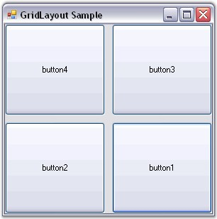

::: {style="DISPLAY: none"}
{#d2h_url_template}{#d2h_package_url style="WIDTH: 0px; DISPLAY: none; HEIGHT: 0px"}
:::

:::::: {.d2h_secondary_topic style="PADDING-BOTTOM: 10pt; MARGIN: 0pt; PADDING-LEFT: 0pt; PADDING-RIGHT: 0pt; PADDING-TOP: 0pt"}
##### Configuring GridLayout {#configuring-gridlayout style="tab-stops: 0pt"}

[]{style="COLOR: #15428b"} 

Rows and Columns

[]{style="COLOR: #15428b"} 

The GridLayout simply divides the available space into a number of rows and columns based on the number of Child controls. The number of rows and columns can be specified using the properties given below.

[]{style="COLOR: #15428b"} 

::: {align="center"}
  --------------------- ----------------------------------------------
  GridLayout Property   Description
  Rows                  Specifies the number of rows in the grid.
  Columns               Specifies the number of columns in the grid.
  --------------------- ----------------------------------------------
:::

[]{style="COLOR: #15428b"} 

The **Rows** property usually dictates the number of columns (overriding the Columns property setting) based on the number of Child controls, unless the Rows property is set to \'Null\' or less, in which case the **Columns** property will dictate the number of rows.

 

The following code snippet arranges the Child controls in one column and two rows.

[]{style="COLOR: #15428b"} 

+------------------------------------------------------------------------------------------------------------------------+
| **[\[C#\]]{style="FONT-FAMILY: 'Courier New'; COLOR: black"}**                                                         |
|                                                                                                                        |
| []{style="FONT-FAMILY: 'Courier New'; COLOR: black"}                                                                   |
|                                                                                                                        |
| [this]{style="FONT-FAMILY: 'Courier New'; COLOR: blue"}[.gridLayout1.Rows = 2;]{style="FONT-FAMILY: 'Courier New'"}    |
|                                                                                                                        |
| [this]{style="FONT-FAMILY: 'Courier New'; COLOR: blue"}[.gridLayout1.Columns = 1;]{style="FONT-FAMILY: 'Courier New'"} |
+------------------------------------------------------------------------------------------------------------------------+

[]{style="COLOR: #15428b"} 

+---------------------------------------------------------------------------------------------------------------------+
| **[\[VB.NET\]]{style="FONT-FAMILY: 'Courier New'; COLOR: black"}**                                                  |
|                                                                                                                     |
| []{style="FONT-FAMILY: 'Courier New'; COLOR: black"}                                                                |
|                                                                                                                     |
| [Me]{style="FONT-FAMILY: 'Courier New'; COLOR: blue"}[.gridLayout1.Rows = 2]{style="FONT-FAMILY: 'Courier New'"}    |
|                                                                                                                     |
| [Me]{style="FONT-FAMILY: 'Courier New'; COLOR: blue"}[.gridLayout1.Columns = 1]{style="FONT-FAMILY: 'Courier New'"} |
+---------------------------------------------------------------------------------------------------------------------+

[]{style="COLOR: #15428b"} 

HGap and VGap

[]{style="COLOR: #15428b"} 

The horizontal and the vertical gap between the Child controls can be set using the properties given below.

[]{style="COLOR: #15428b"} 

::: {align="center"}
  --------------------- ------------------------------------------------------------
  GridLayout Property   Description
  HGap                  Gets / sets the horizontal spacing between the components.
  VGap                  Gets / sets the vertical spacing between the components.
  --------------------- ------------------------------------------------------------
:::

[]{style="COLOR: #15428b"} 

+--------------------------------------------------------------------------------------------------------------------+
| **[\[C#\]]{style="FONT-FAMILY: 'Courier New'; COLOR: black"}**                                                     |
|                                                                                                                    |
| []{style="FONT-FAMILY: 'Courier New'; COLOR: black"}                                                               |
|                                                                                                                    |
| [this]{style="FONT-FAMILY: 'Courier New'; COLOR: blue"}[.gridLayout1.HGap=10;]{style="FONT-FAMILY: 'Courier New'"} |
|                                                                                                                    |
| [this]{style="FONT-FAMILY: 'Courier New'; COLOR: blue"}[.gridLayout1.VGap=10;]{style="FONT-FAMILY: 'Courier New'"} |
+--------------------------------------------------------------------------------------------------------------------+

**[]{style="COLOR: #15428b"}** 

+-----------------------------------------------------------------------------------------------------------------+
| **[\[VB.NET\]]{style="FONT-FAMILY: 'Courier New'; COLOR: black"}**                                              |
|                                                                                                                 |
| []{style="FONT-FAMILY: 'Courier New'; COLOR: black"}                                                            |
|                                                                                                                 |
| [Me]{style="FONT-FAMILY: 'Courier New'; COLOR: blue"}[.gridLayout1.HGap=10]{style="FONT-FAMILY: 'Courier New'"} |
|                                                                                                                 |
| [Me]{style="FONT-FAMILY: 'Courier New'; COLOR: blue"}[.gridLayout1.VGap=10]{style="FONT-FAMILY: 'Courier New'"} |
+-----------------------------------------------------------------------------------------------------------------+

[]{style="COLOR: #15428b"} 

{border="0"}

[]{style="COLOR: #15428b"} 

Figure 688: GridLayout with Rows, Columns, HGap and VGap properties Set

[]{style="COLOR: #15428b"} 

::: {style="BORDER-BOTTOM: windowtext 1pt solid; BORDER-LEFT: medium none; PADDING-BOTTOM: 1pt; MARGIN-TOP: 9pt; PADDING-LEFT: 0pt; PADDING-RIGHT: 0pt; MARGIN-BOTTOM: 9pt; BORDER-TOP: windowtext 1pt solid; BORDER-RIGHT: medium none; PADDING-TOP: 1pt"}
{border="0"} Note: To include some margin space along the borders, refer Margin Settings.
:::

[]{style="COLOR: #15428b"} 

See Also

[]{style="COLOR: black"} 

[GridLayout - Configuring Child Controls]{.UGHyperlink}[, ]{.UGHyperlink}[Rearranging the Controls laid out by GridLayout]{.UGHyperlink}[]{.UGHyperlink}

[]{#related-topics}
::::::
