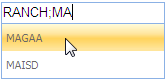

::: {style="DISPLAY: none"}
{#d2h_url_template}{#d2h_package_url style="WIDTH: 0px; DISPLAY: none; HEIGHT: 0px"}
:::

::: {.d2h_secondary_topic style="PADDING-BOTTOM: 10pt; MARGIN: 0pt; PADDING-LEFT: 0pt; PADDING-RIGHT: 0pt; PADDING-TOP: 0pt"}
#### Configuring the Filter Conditions {#configuring-the-filter-conditions style="tab-stops: 0pt"}

The Auto-complete textbox supports a wide range of filtering conditions.

 

Properties

+---------------+----------------------------------------------------------------------------+------------------------------------------------------------------------------------------------+--------------------------------------------------------------------------------------------------------------+-------------+
| Name          | Description                                                                | Type of the property                                                                           | Value it accepts                                                                                             | Dependecy   |
+---------------+----------------------------------------------------------------------------+------------------------------------------------------------------------------------------------+--------------------------------------------------------------------------------------------------------------+-------------+
| MinCharacter  | Sets the minimum number of characters that are required to start filtering | [[int]{style="COLOR: windowtext; TEXT-DECORATION: none; text-underline: none"}]{.UGHyperlink}  | 0 to [[int ]{style="COLOR: windowtext; TEXT-DECORATION: none; text-underline: none"}]{.UGHyperlink}.MaxValue | NA          |
|               |                                                                            |                                                                                                |                                                                                                              |             |
|               |                                                                            |                                                                                                |                                                                                                              |             |
+---------------+----------------------------------------------------------------------------+------------------------------------------------------------------------------------------------+--------------------------------------------------------------------------------------------------------------+-------------+
| Delimiter     | When set, allows continuous filtering separated by the specified delimiter | [[char]{style="COLOR: windowtext; TEXT-DECORATION: none; text-underline: none"}]{.UGHyperlink} | Any character                                                                                                | NA          |
|               |                                                                            |                                                                                                |                                                                                                              |             |
|               |                                                                            |                                                                                                |                                                                                                              |             |
+---------------+----------------------------------------------------------------------------+------------------------------------------------------------------------------------------------+--------------------------------------------------------------------------------------------------------------+-------------+
| CaseSensitive | When set, allows case sensitive filtering.                                 | [[bool]{style="COLOR: windowtext; TEXT-DECORATION: none; text-underline: none"}]{.UGHyperlink} | [[true/false]{style="COLOR: windowtext; TEXT-DECORATION: none; text-underline: none"}]{.UGHyperlink}         | NA          |
|               |                                                                            |                                                                                                |                                                                                                              |             |
|               |                                                                            |                                                                                                |                                                                                                              |             |
+---------------+----------------------------------------------------------------------------+------------------------------------------------------------------------------------------------+--------------------------------------------------------------------------------------------------------------+-------------+

*[[]{style="TEXT-DECORATION: none"}]{.underline}* 

Through Builder

Using Builder

The following steps explain the configuration of the filtering conditions for an auto-complete textbox using Builder.

 

1.   In **View**, invoke the auto-complete textbox helper with the control id as the first argument, followed by the **MinCharacter, Delimiter** and **CaseSensitive** methods with the desired options as arguments.

 

**[]{style="FONT-FAMILY: 'Calibri','sans-serif'"}** 

+--------------------------------------------------------------------------------------------------------------------------------------------------------------------------------------------------------------------------------------------+
| **[View\[aspx\]]{style="FONT-FAMILY: 'Courier New'"}**                                                                                                                                                                                     |
|                                                                                                                                                                                                                                            |
| [\<%]{style="FONT-FAMILY: 'Courier New'; BACKGROUND: yellow"}[=]{style="FONT-FAMILY: 'Courier New'; COLOR: blue"}[Html.Syncfusion().AutocompleteTextBox([\"myAutocomplete\"]{style="COLOR: #a31515"})]{style="FONT-FAMILY: 'Courier New'"} |
|                                                                                                                                                                                                                                            |
| [.**RequestMapper([\"Home/GetData\"]{style="COLOR: #a31515"})**]{style="FONT-FAMILY: 'Courier New'"}                                                                                                                                       |
|                                                                                                                                                                                                                                            |
| **[.MinCharacter(2)]{style="FONT-FAMILY: 'Courier New'"}**                                                                                                                                                                                 |
|                                                                                                                                                                                                                                            |
| **[.Delimiter([\';\']{style="COLOR: #a31515"})]{style="FONT-FAMILY: 'Courier New'"}**                                                                                                                                                      |
|                                                                                                                                                                                                                                            |
| **[.CaseSensitive([true]{style="COLOR: blue"})]{style="FONT-FAMILY: 'Courier New'"}**[%\>]{style="FONT-FAMILY: 'Courier New'; BACKGROUND: yellow"}                                                                                         |
+--------------------------------------------------------------------------------------------------------------------------------------------------------------------------------------------------------------------------------------------+

**[]{style="FONT-FAMILY: 'Calibri','sans-serif'"}** 

**[]{style="FONT-FAMILY: 'Calibri','sans-serif'"}** 

+--------------------------------------------------------------------------------------------------------------------------------------------------------------------------------------------------------------------------------------------+
| **[View\[cshtml\]]{style="FONT-FAMILY: 'Courier New'"}**                                                                                                                                                                                   |
|                                                                                                                                                                                                                                            |
| [\@{]{style="FONT-FAMILY: 'Courier New'; BACKGROUND: yellow"}[ ]{style="FONT-FAMILY: 'Courier New'; COLOR: blue"}[Html.Syncfusion().AutocompleteTextBox([\"myAutocomplete\"]{style="COLOR: #a31515"})]{style="FONT-FAMILY: 'Courier New'"} |
|                                                                                                                                                                                                                                            |
| [.**RequestMapper([\"Home/GetData\"]{style="COLOR: #a31515"})**]{style="FONT-FAMILY: 'Courier New'"}                                                                                                                                       |
|                                                                                                                                                                                                                                            |
| **[.MinCharacter(2)]{style="FONT-FAMILY: 'Courier New'"}**                                                                                                                                                                                 |
|                                                                                                                                                                                                                                            |
| **[.Delimiter([\';\']{style="COLOR: #a31515"})]{style="FONT-FAMILY: 'Courier New'"}**                                                                                                                                                      |
|                                                                                                                                                                                                                                            |
| **[.CaseSensitive([true]{style="COLOR: blue"}).Render();]{style="FONT-FAMILY: 'Courier New'"}**[}]{style="FONT-FAMILY: 'Courier New'; BACKGROUND: yellow"}                                                                                 |
+--------------------------------------------------------------------------------------------------------------------------------------------------------------------------------------------------------------------------------------------+

 

 

**[]{style="FONT-FAMILY: 'Calibri','sans-serif'"}** 

[]{style="FONT-FAMILY: Consolas; BACKGROUND: yellow; FONT-SIZE: 9.5pt"} 

2.   In the Controller, define the post action to which the auto-complete textbox requests the data source.

 

 

+------------------------------------------------------------------------------------------------------------------------------------------------------------------------------+
| **[\[Controller\]]{style="FONT-FAMILY: 'Courier New'"}**                                                                                                                     |
|                                                                                                                                                                              |
| **[]{style="FONT-FAMILY: 'Courier New'"}**                                                                                                                                   |
|                                                                                                                                                                              |
| [\[[AcceptVerbs]{style="COLOR: #2b91af"}([HttpVerbs]{style="COLOR: #2b91af"}.Post)\]]{style="FONT-FAMILY: 'Courier New'"}                                                    |
|                                                                                                                                                                              |
| [        [public]{style="COLOR: blue"} [ActionResult]{style="COLOR: #2b91af"} GetData([string]{style="COLOR: blue"} QueryString)]{style="FONT-FAMILY: 'Courier New'"}        |
|                                                                                                                                                                              |
| [        {]{style="FONT-FAMILY: 'Courier New'"}                                                                                                                              |
|                                                                                                                                                                              |
| [            [Northwind]{style="COLOR: #2b91af"} context = SqlCE;]{style="FONT-FAMILY: 'Courier New'"}                                                                       |
|                                                                                                                                                                              |
| [            [//Get the data source]{style="COLOR: green"}]{style="FONT-FAMILY: 'Courier New'"}                                                                              |
|                                                                                                                                                                              |
| [            [var]{style="COLOR: blue"} dataSource = [from]{style="COLOR: blue"} suggestion [in]{style="COLOR: blue"} context.Customers]{style="FONT-FAMILY: 'Courier New'"} |
|                                                                                                                                                                              |
| [                             [select]{style="COLOR: blue"} suggestion.CustomerID;]{style="FONT-FAMILY: 'Courier New'"}                                                      |
|                                                                                                                                                                              |
| []{style="FONT-FAMILY: 'Courier New'"}                                                                                                                                       |
|                                                                                                                                                                              |
| [            [//invoke the AutoCompleteActionResut]{style="COLOR: green"}]{style="FONT-FAMILY: 'Courier New'"}                                                               |
|                                                                                                                                                                              |
| [            [return]{style="COLOR: blue"} dataSource.AutocompleteActionResult();]{style="FONT-FAMILY: 'Courier New'"}                                                       |
|                                                                                                                                                                              |
| [        }]{style="FONT-FAMILY: 'Courier New'"}                                                                                                                              |
|                                                                                                                                                                              |
| []{style="FONT-FAMILY: 'Courier New'; BACKGROUND: yellow"}                                                                                                                   |
+------------------------------------------------------------------------------------------------------------------------------------------------------------------------------+

 

[]{style="FONT-FAMILY: 'Calibri','sans-serif'"} 

[]{style="FONT-FAMILY: Consolas; FONT-SIZE: 9.5pt"} 

3.   Build and run the application.

 

Using Properties Model

The following steps explain the configuration of the filtering conditions for an auto-complete textbox using the Properties model.

1.   In the Controller, create an instance of **AutoCompleteTextBoxModel**, define the **MinCharacter, Delimiter** and **CaseSensitive** properties and pass the instance through **View Specific Data** to the view as given below.

 

+-------------------------------------------------------------------------------------------------------------------------------------------------------------------------------------------------+
| **[\[Controller\]]{style="FONT-FAMILY: 'Courier New'"}**                                                                                                                                        |
|                                                                                                                                                                                                 |
| [public]{style="FONT-FAMILY: 'Courier New'; COLOR: blue"}[ [ActionResult]{style="COLOR: #2b91af"} Index()]{style="FONT-FAMILY: 'Courier New'"}                                                  |
|                                                                                                                                                                                                 |
| [        {]{style="FONT-FAMILY: 'Courier New'"}                                                                                                                                                 |
|                                                                                                                                                                                                 |
| [            [//create and instance of AutocompleteTextBoxModel]{style="COLOR: green"}]{style="FONT-FAMILY: 'Courier New'"}                                                                     |
|                                                                                                                                                                                                 |
| [            [AutocompleteTextBoxModel]{style="COLOR: #2b91af"} myModel = [new]{style="COLOR: blue"} [AutocompleteTextBoxModel]{style="COLOR: #2b91af"}();]{style="FONT-FAMILY: 'Courier New'"} |
|                                                                                                                                                                                                 |
| [            **myModel.RequestMapper = [\"Home/GetData\"]{style="COLOR: #a31515"};**]{style="FONT-FAMILY: 'Courier New'"}                                                                       |
|                                                                                                                                                                                                 |
| **[            myModel.MinCharacter = 2;]{style="FONT-FAMILY: 'Courier New'"}**                                                                                                                 |
|                                                                                                                                                                                                 |
| **[            myModel.Delimiter = [\';\']{style="COLOR: #a31515"};]{style="FONT-FAMILY: 'Courier New'"}**                                                                                      |
|                                                                                                                                                                                                 |
| **[            myModel.CaseSensitive = [true]{style="COLOR: blue"};]{style="FONT-FAMILY: 'Courier New'"}**                                                                                      |
|                                                                                                                                                                                                 |
| []{style="FONT-FAMILY: 'Courier New'"}                                                                                                                                                          |
|                                                                                                                                                                                                 |
| [            [//pass the instance through view data to the view]{style="COLOR: green"}]{style="FONT-FAMILY: 'Courier New'"}                                                                     |
|                                                                                                                                                                                                 |
| [            ViewData\[[\"myAutocomplete\"]{style="COLOR: #a31515"}\] = myModel;]{style="FONT-FAMILY: 'Courier New'"}                                                                           |
|                                                                                                                                                                                                 |
| [            [return]{style="COLOR: blue"} View();]{style="FONT-FAMILY: 'Courier New'"}                                                                                                         |
|                                                                                                                                                                                                 |
| [        }]{style="FONT-FAMILY: 'Courier New'"}                                                                                                                                                 |
|                                                                                                                                                                                                 |
| []{style="FONT-FAMILY: 'Courier New'; BACKGROUND: yellow"}                                                                                                                                      |
+-------------------------------------------------------------------------------------------------------------------------------------------------------------------------------------------------+

 

[]{style="FONT-FAMILY: Consolas; FONT-SIZE: 9.5pt"} 

2.   In **View**, invoke the auto-complete textbox helper with the view data key as the Control ID.

[]{style="FONT-FAMILY: Consolas; FONT-SIZE: 9.5pt"} 

[]{style="FONT-FAMILY: Consolas; FONT-SIZE: 9.5pt"} 

+-----------------------------------------------------------------------------------------------------------------------------------------------------------------------------------------------------------------------------------------------------------------------------+
| **[View\[aspx\]]{style="FONT-FAMILY: 'Courier New'"}**                                                                                                                                                                                                                      |
|                                                                                                                                                                                                                                                                             |
| **[]{style="FONT-FAMILY: 'Courier New'"}**                                                                                                                                                                                                                                  |
|                                                                                                                                                                                                                                                                             |
| [\<%]{style="FONT-FAMILY: 'Courier New'; BACKGROUND: yellow"}[=]{style="FONT-FAMILY: 'Courier New'; COLOR: blue"}[Html.Syncfusion().AutocompleteTextBox([\"myAutocomplete\"]{style="COLOR: #a31515"})[%\>]{style="BACKGROUND: yellow"}]{style="FONT-FAMILY: 'Courier New'"} |
|                                                                                                                                                                                                                                                                             |
| []{style="FONT-FAMILY: 'Courier New'; BACKGROUND: yellow"}                                                                                                                                                                                                                  |
+-----------------------------------------------------------------------------------------------------------------------------------------------------------------------------------------------------------------------------------------------------------------------------+

**[]{style="FONT-FAMILY: 'Calibri','sans-serif'"}** 

+-------------------------------------------------------------------------------------------------------------------------------------------------------------------------------------------------------------------------------------------------------------------------------------+
| **[View\[cshtml\]]{style="FONT-FAMILY: 'Courier New'"}**                                                                                                                                                                                                                            |
|                                                                                                                                                                                                                                                                                     |
| **[]{style="FONT-FAMILY: 'Courier New'"}**                                                                                                                                                                                                                                          |
|                                                                                                                                                                                                                                                                                     |
| [\@{]{style="FONT-FAMILY: 'Courier New'; BACKGROUND: yellow"}[ ]{style="FONT-FAMILY: 'Courier New'; COLOR: blue"}[Html.Syncfusion().AutocompleteTextBox([\"myAutocomplete\"]{style="COLOR: #a31515"}).Render();[}]{style="BACKGROUND: yellow"}]{style="FONT-FAMILY: 'Courier New'"} |
|                                                                                                                                                                                                                                                                                     |
| []{style="FONT-FAMILY: 'Courier New'; BACKGROUND: yellow"}                                                                                                                                                                                                                          |
+-------------------------------------------------------------------------------------------------------------------------------------------------------------------------------------------------------------------------------------------------------------------------------------+

[]{style="FONT-FAMILY: Consolas; FONT-SIZE: 9.5pt"} 

The output is shown in the following screenshot.

[]{style="FONT-FAMILY: 'Calibri','sans-serif'"} 

{border="0"} 

Figure 62: Auto-complete textbox with filter conditons

[]{#related-topics}
:::
