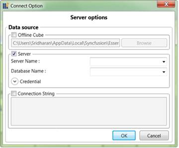

::: {style="DISPLAY: none"}
{#d2h_url_template} {#d2h_package_url style="WIDTH: 0px; DISPLAY: none; HEIGHT: 0px"}
:::

::::: {#nsbanner .d2h_main_nsbanner style="BORDER-BOTTOM: #999999 1px solid; POSITION: relative; PADDING-BOTTOM: 0px; BACKGROUND-COLOR: transparent; PADDING-LEFT: 0px; PADDING-RIGHT: 0px; DISPLAY: none; BORDER-TOP: #999999 1px solid; PADDING-TOP: 0px; LEFT: 0px"}
:::: {#TitleRow .d2h_main_titlerow style="PADDING-BOTTOM: 4px; BACKGROUND-COLOR: transparent; PADDING-LEFT: 22px; WIDTH: 100%; PADDING-RIGHT: 10px; DISPLAY: none; PADDING-TOP: 4px"}
::: {#ienav .d2h_main_ienav style="DISPLAY: none"}
{#D2HPrevious .D2HPreviousEnabled}  {#D2HNext .D2HNextEnabled}
:::
::::
:::::

:::: {#nstext .d2h_main_nstext style="PADDING-BOTTOM: 10px; BACKGROUND-COLOR: transparent; PADDING-LEFT: 22px; PADDING-RIGHT: 10px; HEIGHT: 100%; OVERFLOW: auto; PADDING-TOP: 5px" hasuserbackground="true" valign="bottom"}
::: {#d2h_breadcrumbs .d2h_breadcrumbs}
[Essential Studio User Guide Documentation](ms-xhelp:///?Id=12457748-09e3-4d74-a240-8e049cedf030){.d2h_breadcrumbsNormal} [ \> ]{.d2h_breadcrumbsLinkSeparator} [Business Intelligence Edition](ms-xhelp:///?Id=fdf33dd8-62b2-47b9-ad7b-fc50e590bca5){.d2h_breadcrumbsNormal} [ \> ]{.d2h_breadcrumbsLinkSeparator} [Essential BI WPF](ms-xhelp:///?Id=41e3d586-d922-4a01-8272-679fe4ae7343){.d2h_breadcrumbsNormal} [ \> ]{.d2h_breadcrumbsLinkSeparator} [Essential BI Client]{.d2h_breadcrumbsContentsOnly} [ \> ]{.d2h_breadcrumbsLinkSeparator} [Getting Started](ms-xhelp:///?Id=e2ccfc7e-65d6-4d37-b63a-4d82606af0e4){.d2h_breadcrumbsNormal}
:::

## Connection Option {#connection-option style="tab-stops: 0pt"}

[]{style="FONT-FAMILY: 'Calibri','sans-serif'; COLOR: black"} 

{border="0"}

Figure 9: Connection Option Dialog Widow

[]{style="FONT-FAMILY: 'Calibri','sans-serif'; COLOR: black"} 

Offline Cube:

[]{style="FONT-FAMILY: 'Trebuchet MS','sans-serif'; COLOR: #15428b; FONT-SIZE: 9pt"} 

To connect the offline cube, check the offline cube check box and select the offline cube by browsing.

[]{style="FONT-FAMILY: 'Trebuchet MS','sans-serif'; COLOR: #15428b; FONT-SIZE: 9pt"} 

Server:

 

1.   To connect an Analysis service server, check the server check box and  provide the server name and data base Name to connect the sever.

2.   If the server needs a Credential, then click the Credential menu and give the Credential information (User name and Pass word).

[]{style="FONT-FAMILY: 'Trebuchet MS','sans-serif'; COLOR: #15428b; FONT-SIZE: 9pt"} 

Connection String:

1.   You can also connect the server or Offline cube by providing the Connection string to connect.

2.   Check the Connection String check box and enter the connection in the following text box. Ex Connection string " DataSource= localhost; Initial Catalog= Adventure Works DW"

[]{style="FONT-FAMILY: 'Calibri','sans-serif'; COLOR: black"} 

**[]{style="FONT-FAMILY: 'Calibri','sans-serif'"}**  

+-----------------------------------------------------------------------------------------------------------------------------------------------+
| [\[C#\]]{style="FONT-FAMILY: 'Courier New'"}                                                                                                  |
|                                                                                                                                               |
| []{style="FONT-FAMILY: 'Courier New'"}                                                                                                        |
|                                                                                                                                               |
| [this]{style="FONT-FAMILY: 'Courier New'; COLOR: blue"} [.olapClient1.ShowConnectOption();]{style="FONT-FAMILY: 'Courier New'; COLOR: black"} |
|                                                                                                                                               |
| []{style="FONT-FAMILY: 'Courier New'"}                                                                                                        |
+-----------------------------------------------------------------------------------------------------------------------------------------------+

**[]{style="FONT-FAMILY: 'Calibri','sans-serif'; COLOR: black"}**  

+--------------------------------------------------------------------------------------------------------------------------------------------+
| [\[VB\]]{style="FONT-FAMILY: 'Courier New'"}                                                                                               |
|                                                                                                                                            |
| []{style="FONT-FAMILY: 'Courier New'"}                                                                                                     |
|                                                                                                                                            |
| [Me]{style="FONT-FAMILY: 'Courier New'; COLOR: blue"} [.OlapClient1.ShowConnectOption()]{style="FONT-FAMILY: 'Courier New'; COLOR: black"} |
|                                                                                                                                            |
| []{style="FONT-FAMILY: 'Courier New'"}                                                                                                     |
+--------------------------------------------------------------------------------------------------------------------------------------------+

More:

[ ]{#related-topics}

[{border="0" align="absMiddle"}ShowConnectionOptionDialog](ms-xhelp:///?Id=ead110b2-e0fa-479e-bfd0-44bf2c990aea){style="TEXT-DECORATION: none"}
::::
