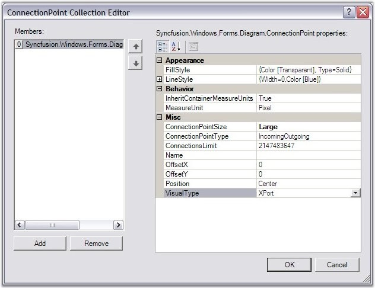
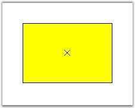
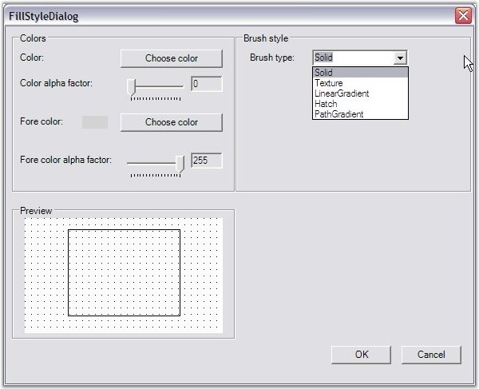
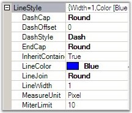
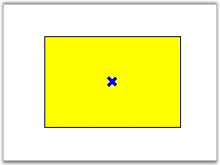
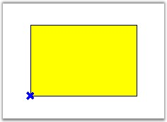
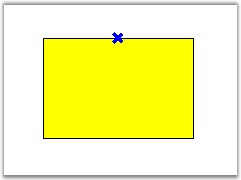
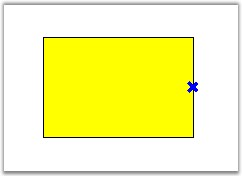
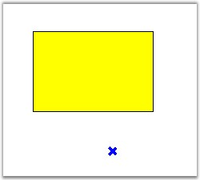

::: {style="DISPLAY: none"}
{#d2h_url_template}{#d2h_package_url style="WIDTH: 0px; DISPLAY: none; HEIGHT: 0px"}
:::

::::: {.d2h_secondary_topic style="PADDING-BOTTOM: 10pt; MARGIN: 0pt; PADDING-LEFT: 0pt; PADDING-RIGHT: 0pt; PADDING-TOP: 0pt"}
#### Connection Point Properties {#connection-point-properties style="tab-stops: 0pt"}

[]{style="FONT-FAMILY: 'Trebuchet MS','sans-serif'; COLOR: #15428b; FONT-SIZE: 9pt"} 

ConnectionPoint class provides points to connect to other nodes using a connector. It is available in different custom appearance and in different sizes.

[]{style="FONT-FAMILY: 'Trebuchet MS','sans-serif'; COLOR: #15428b; FONT-SIZE: 9pt"} 

The **ConnectionPointType** and **ConnectionsLimit** properties are available for the ports to define their nature.

[]{style="FONT-FAMILY: 'Trebuchet MS','sans-serif'; COLOR: #15428b; FONT-SIZE: 9pt"} 

::: {align="center"}
+-----------------------------------+---------------------------------------------------------------------------------------+
| Property                          | Description                                                                           |
+-----------------------------------+---------------------------------------------------------------------------------------+
| ConnectionPointType               | Specifies the type of connection to be used. The values included are as follows:      |
|                                   |                                                                                       |
|                                   | []{style="FONT-FAMILY: 'Trebuchet MS','sans-serif'; COLOR: #15428b; FONT-SIZE: 9pt"}  |
|                                   |                                                                                       |
|                                   | [·      ]{style="FONT-FAMILY: Symbol"}IncomingOutgoing (default)                      |
|                                   |                                                                                       |
|                                   | [·      ]{style="FONT-FAMILY: Symbol"}Outgoing                                        |
|                                   |                                                                                       |
|                                   | [·      ]{style="FONT-FAMILY: Symbol"}Incoming                                        |
+-----------------------------------+---------------------------------------------------------------------------------------+
| ConnectionsLimit                  | Specifies the number of connections to be allowed. Default value is 10.               |
+-----------------------------------+---------------------------------------------------------------------------------------+
:::

[]{style="FONT-FAMILY: 'Trebuchet MS','sans-serif'; COLOR: #15428b; FONT-SIZE: 9pt"} 

The following code snippet demonstrates their usage.

[]{style="FONT-FAMILY: 'Trebuchet MS','sans-serif'; COLOR: #15428b; FONT-SIZE: 9pt"} 

+----------------------------------------------------------------------------------------------------------------------------------------------------------------------------+
| **[\[C#\]]{style="FONT-FAMILY: 'Courier New'; COLOR: black"}**                                                                                                             |
|                                                                                                                                                                            |
| []{style="FONT-FAMILY: 'Courier New'"}                                                                                                                                     |
|                                                                                                                                                                            |
| [Syncfusion.Windows.Forms.Diagram.ConnectionPoint cp = [new]{style="COLOR: blue"} Syncfusion.Windows.Forms.Diagram.ConnectionPoint();]{style="FONT-FAMILY: 'Courier New'"} |
|                                                                                                                                                                            |
| [cp.ConnectionPointType = ConnectionPointType.Incoming;]{style="FONT-FAMILY: 'Courier New'"}                                                                               |
|                                                                                                                                                                            |
| [cp.ConnectionsLimit = 12;]{style="FONT-FAMILY: 'Courier New'"}                                                                                                            |
+----------------------------------------------------------------------------------------------------------------------------------------------------------------------------+

[]{style="FONT-FAMILY: 'Courier New'"} 

+---------------------------------------------------------------------------------------------------------------------------------------------------------------------------------------------------------+
| **[\[VB\]]{style="FONT-FAMILY: 'Courier New'; COLOR: black"}**                                                                                                                                          |
|                                                                                                                                                                                                         |
| []{style="FONT-FAMILY: 'Courier New'; COLOR: blue"}                                                                                                                                                     |
|                                                                                                                                                                                                         |
| [Dim]{style="FONT-FAMILY: 'Courier New'; COLOR: blue"}[ cp [As]{style="COLOR: blue"} [New]{style="COLOR: blue"} Syncfusion.Windows.Forms.Diagram.ConnectionPoint()]{style="FONT-FAMILY: 'Courier New'"} |
|                                                                                                                                                                                                         |
| [cp.ConnectionPointType = ConnectionPointType.Incoming]{style="FONT-FAMILY: 'Courier New'"}                                                                                                             |
|                                                                                                                                                                                                         |
| [cp.ConnectionsLimit = 12]{style="FONT-FAMILY: 'Courier New'"}                                                                                                                                          |
+---------------------------------------------------------------------------------------------------------------------------------------------------------------------------------------------------------+

[]{style="FONT-FAMILY: 'Trebuchet MS','sans-serif'; COLOR: #15428b; FONT-SIZE: 9pt"} 

{border="0"}

[]{style="FONT-FAMILY: 'Trebuchet MS','sans-serif'; COLOR: #15428b; FONT-SIZE: 9pt"} 

Figure 71: ConnectionPoint Collection Editor

[]{style="FONT-FAMILY: 'Trebuchet MS','sans-serif'; COLOR: #15428b; FONT-SIZE: 9pt"} 

Sample diagram  is as follows:

[]{style="FONT-FAMILY: 'Trebuchet MS','sans-serif'; COLOR: #15428b; FONT-SIZE: 9pt"} 

{border="0"}

[]{style="FONT-FAMILY: 'Trebuchet MS','sans-serif'; COLOR: #15428b; FONT-SIZE: 9pt"} 

Figure 72: Rectangle with ConnectionPoint

[]{style="FONT-FAMILY: 'Trebuchet MS','sans-serif'; COLOR: #15428b; FONT-SIZE: 9pt"} 

Some important properties are discussed below:

[]{style="FONT-FAMILY: 'Trebuchet MS','sans-serif'; COLOR: #15428b; FONT-SIZE: 9pt"} 

FillStyle

**[]{style="FONT-FAMILY: 'Trebuchet MS','sans-serif'; COLOR: #15428b"}** 

**FillStyle** property is used to create brushes for filling the interior region of the Connection Points.

[]{style="FONT-FAMILY: 'Trebuchet MS','sans-serif'; COLOR: #15428b; FONT-SIZE: 9pt"} 

+-------------------------------------------------------------------------------------------------------+
| **[\[C#\]]{style="FONT-FAMILY: 'Courier New'; COLOR: black"}**                                        |
|                                                                                                       |
| []{style="FONT-FAMILY: 'Courier New'"}                                                                |
|                                                                                                       |
| [FillStyle m_styleFill = [new]{style="COLOR: blue"} FillStyle();]{style="FONT-FAMILY: 'Courier New'"} |
|                                                                                                       |
| [m_styleFill.Color = [Color]{style="COLOR: teal"}.Transparent;]{style="FONT-FAMILY: 'Courier New'"}   |
|                                                                                                       |
| [m_styleFill.Type = FillStyleType.Solid;]{style="FONT-FAMILY: 'Courier New'"}                         |
|                                                                                                       |
| [m_styleFill.ColorAlphaFactor = 60;]{style="FONT-FAMILY: 'Courier New'"}                              |
+-------------------------------------------------------------------------------------------------------+

[]{style="FONT-FAMILY: 'Courier New'"} 

+---------------------------------------------------------------------------------------------------------------------------------------------------------------------------+
| **[\[VB\]]{style="FONT-FAMILY: 'Courier New'; COLOR: black"}**                                                                                                            |
|                                                                                                                                                                           |
| []{style="FONT-FAMILY: 'Courier New'; COLOR: blue"}                                                                                                                       |
|                                                                                                                                                                           |
| [Dim]{style="FONT-FAMILY: 'Courier New'; COLOR: blue"}[ m_styleFill [As]{style="COLOR: blue"} [New]{style="COLOR: blue"} FillStyle()]{style="FONT-FAMILY: 'Courier New'"} |
|                                                                                                                                                                           |
| [m_styleFill.Color = Color.Transparent]{style="FONT-FAMILY: 'Courier New'"}                                                                                               |
|                                                                                                                                                                           |
| [m_styleFill.Type = FillStyleType.Solid]{style="FONT-FAMILY: 'Courier New'"}                                                                                              |
|                                                                                                                                                                           |
| [m_styleFill.ColorAlphaFactor = 60]{style="FONT-FAMILY: 'Courier New'"}                                                                                                   |
+---------------------------------------------------------------------------------------------------------------------------------------------------------------------------+

[]{style="FONT-FAMILY: 'Trebuchet MS','sans-serif'; COLOR: #15428b; FONT-SIZE: 9pt"} 

The following image illustrates the above settings.

[]{style="FONT-FAMILY: 'Trebuchet MS','sans-serif'; COLOR: #15428b; FONT-SIZE: 9pt"} 

{border="0"}

[]{style="FONT-FAMILY: 'Trebuchet MS','sans-serif'; COLOR: #15428b; FONT-SIZE: 9pt"} 

Figure 73:  FillStyle Dialog Box

[]{style="FONT-FAMILY: 'Trebuchet MS','sans-serif'; COLOR: #15428b; FONT-SIZE: 9pt"} 

LineStyle

**[]{style="FONT-FAMILY: 'Trebuchet MS','sans-serif'; COLOR: #15428b"}** 

This property inturn has customization properties to set the style for the Connection Point Lines, similar to the other line types.

[]{style="FONT-FAMILY: 'Trebuchet MS','sans-serif'; COLOR: #15428b; FONT-SIZE: 9pt"} 

{border="0"}

[]{style="FONT-FAMILY: 'Trebuchet MS','sans-serif'; COLOR: #15428b; FONT-SIZE: 9pt"} 

Figure 74:  Line Style

[]{style="FONT-FAMILY: 'Trebuchet MS','sans-serif'; COLOR: #15428b; FONT-SIZE: 9pt"} 

+--------------------------------------------------------------------------------------------------+
| **[\[C#\]]{style="FONT-FAMILY: 'Courier New'; COLOR: black"}**                                   |
|                                                                                                  |
| **[]{style="FONT-FAMILY: 'Courier New'; COLOR: black"}**                                         |
|                                                                                                  |
| [m_styleLine = [new]{style="COLOR: blue"} LineStyle();]{style="FONT-FAMILY: 'Courier New'"}      |
|                                                                                                  |
| [m_styleLine.LineColor = [Color]{style="COLOR: teal"}.Blue;]{style="FONT-FAMILY: 'Courier New'"} |
|                                                                                                  |
| [m_styleLine.LineWidth = 0;]{style="FONT-FAMILY: 'Courier New'"}                                 |
|                                                                                                  |
| [m_styleLine.DashStyle = DashStyle.Dash;]{style="FONT-FAMILY: 'Courier New'"}                    |
+--------------------------------------------------------------------------------------------------+

[]{style="FONT-FAMILY: 'Courier New'"} 

+--------------------------------------------------------------------------------------------+
| **[\[VB\]]{style="FONT-FAMILY: 'Courier New'; COLOR: black"}**                             |
|                                                                                            |
| []{style="FONT-FAMILY: 'Courier New'; COLOR: blue"}                                        |
|                                                                                            |
| [m_styleLine = [New]{style="COLOR: blue"} LineStyle()]{style="FONT-FAMILY: 'Courier New'"} |
|                                                                                            |
| [m_styleLine.LineColor = Color.Blue]{style="FONT-FAMILY: 'Courier New'"}                   |
|                                                                                            |
| [m_styleLine.LineWidth = 0]{style="FONT-FAMILY: 'Courier New'"}                            |
|                                                                                            |
| [m_styleLine.DashStyle = DashStyle.Dash]{style="FONT-FAMILY: 'Courier New'"}               |
+--------------------------------------------------------------------------------------------+

[]{style="FONT-FAMILY: 'Trebuchet MS','sans-serif'; COLOR: #15428b; FONT-SIZE: 9pt"} 

The below images illustrates the above settings.

[]{style="FONT-FAMILY: 'Trebuchet MS','sans-serif'; COLOR: #15428b; FONT-SIZE: 9pt"} 

{border="0"}

[]{style="FONT-FAMILY: 'Trebuchet MS','sans-serif'; COLOR: #15428b; FONT-SIZE: 9pt"} 

Figure 75: Customized Connection Point

[]{style="FONT-FAMILY: 'Trebuchet MS','sans-serif'; COLOR: #15428b; FONT-SIZE: 9pt"} 

ConnectionPointSize

**[]{style="FONT-FAMILY: 'Trebuchet MS','sans-serif'; COLOR: #15428b; FONT-SIZE: 9pt"}** 

This property allows us to set the size of the Ports for current ConnectionPoint. This property accepts a ConnectionPointSize enumerator which has three predefined sizes as follows.

[]{style="FONT-FAMILY: 'Trebuchet MS','sans-serif'; COLOR: #15428b; FONT-SIZE: 9pt"} 

Large(12 \* 12), Medium (9 \*9) & Small (6 \* 6).

[]{style="FONT-FAMILY: 'Trebuchet MS','sans-serif'; COLOR: #15428b; FONT-SIZE: 9pt"} 

Position

[]{style="FONT-FAMILY: 'Trebuchet MS','sans-serif'; COLOR: #15428b; FONT-SIZE: 9pt"} 

The point at which the connection should be established can be easily customized by setting the Position property to one of the options. This automatically associates the link to the desired position. Offset values can be specified through OffsetX and OffsetY properties, which will be inherited when the Position is set to Custom.

[]{style="FONT-FAMILY: 'Trebuchet MS','sans-serif'; COLOR: #15428b; FONT-SIZE: 9pt"} 

::: {align="center"}
+-----------------------------------+---------------------------------------------------------------------------------------------------------------------------------------+
| Properties                        | Description                                                                                                                           |
+-----------------------------------+---------------------------------------------------------------------------------------------------------------------------------------+
| OffsetX                           | Specifies the position which takes the x value of the node. It positions the link with respect to the x value of the node.            |
+-----------------------------------+---------------------------------------------------------------------------------------------------------------------------------------+
| OffsetY                           | Specifies the Y offset value where the link should be aligned.  It positions the link with respect to the Y value of the node.        |
+-----------------------------------+---------------------------------------------------------------------------------------------------------------------------------------+
| Position                          | Specifies the position where the links should be connected to the node. Default value is Center. The options included are as follows: |
|                                   |                                                                                                                                       |
|                                   | []{style="FONT-FAMILY: 'Trebuchet MS','sans-serif'; COLOR: #15428b; FONT-SIZE: 9pt"}                                                  |
|                                   |                                                                                                                                       |
|                                   | [·      ]{style="FONT-FAMILY: Symbol"}Center                                                                                          |
|                                   |                                                                                                                                       |
|                                   | [·      ]{style="FONT-FAMILY: Symbol"}TopLeft                                                                                         |
|                                   |                                                                                                                                       |
|                                   | [·      ]{style="FONT-FAMILY: Symbol"}TopCenter                                                                                       |
|                                   |                                                                                                                                       |
|                                   | [·      ]{style="FONT-FAMILY: Symbol"}TopRight                                                                                        |
|                                   |                                                                                                                                       |
|                                   | [·      ]{style="FONT-FAMILY: Symbol"}MiddleLeft                                                                                      |
|                                   |                                                                                                                                       |
|                                   | [·      ]{style="FONT-FAMILY: Symbol"}MiddleRight                                                                                     |
|                                   |                                                                                                                                       |
|                                   | [·      ]{style="FONT-FAMILY: Symbol"}BottomLeft                                                                                      |
|                                   |                                                                                                                                       |
|                                   | [·      ]{style="FONT-FAMILY: Symbol"}BottomCenter                                                                                    |
|                                   |                                                                                                                                       |
|                                   | [·      ]{style="FONT-FAMILY: Symbol"}BottomRight                                                                                     |
|                                   |                                                                                                                                       |
|                                   | [·      ]{style="FONT-FAMILY: Symbol"}Custom                                                                                          |
+-----------------------------------+---------------------------------------------------------------------------------------------------------------------------------------+
:::

\
The following code snippet defines the setting of the position values for a node\'s port.

[]{style="FONT-FAMILY: 'Trebuchet MS','sans-serif'; COLOR: #15428b; FONT-SIZE: 9pt"} 

+----------------------------------------------------------------------------------------------------------------------------------------------------------------------------+
| **[\[C#\]]{style="FONT-FAMILY: 'Courier New'; COLOR: black"}**                                                                                                             |
|                                                                                                                                                                            |
| []{style="FONT-FAMILY: 'Courier New'"}                                                                                                                                     |
|                                                                                                                                                                            |
| [Syncfusion.Windows.Forms.Diagram.ConnectionPoint cp = [new]{style="COLOR: blue"} Syncfusion.Windows.Forms.Diagram.ConnectionPoint();]{style="FONT-FAMILY: 'Courier New'"} |
|                                                                                                                                                                            |
| [cp.Position = Position.BottomLeft;]{style="FONT-FAMILY: 'Courier New'"}                                                                                                   |
|                                                                                                                                                                            |
| [cp.OffsetX = 50;]{style="FONT-FAMILY: 'Courier New'"}                                                                                                                     |
|                                                                                                                                                                            |
| [cp.OffsetY = 10;]{style="FONT-FAMILY: 'Courier New'"}                                                                                                                     |
+----------------------------------------------------------------------------------------------------------------------------------------------------------------------------+

[]{style="FONT-FAMILY: 'Courier New'"} 

+---------------------------------------------------------------------------------------------------------------------------------------------------------------------------------------------------------+
| **[\[VB\]]{style="FONT-FAMILY: 'Courier New'; COLOR: black"}**                                                                                                                                          |
|                                                                                                                                                                                                         |
| **[]{style="FONT-FAMILY: 'Courier New'; COLOR: black"}**                                                                                                                                                |
|                                                                                                                                                                                                         |
| [Dim]{style="FONT-FAMILY: 'Courier New'; COLOR: blue"}[ cp [As]{style="COLOR: blue"} [New]{style="COLOR: blue"} Syncfusion.Windows.Forms.Diagram.ConnectionPoint()]{style="FONT-FAMILY: 'Courier New'"} |
|                                                                                                                                                                                                         |
| [cp.Position = Position.BottomLeft]{style="FONT-FAMILY: 'Courier New'"}                                                                                                                                 |
|                                                                                                                                                                                                         |
| [cp.OffsetX = 50]{style="FONT-FAMILY: 'Courier New'"}                                                                                                                                                   |
|                                                                                                                                                                                                         |
| [cp.OffsetY = 10]{style="FONT-FAMILY: 'Courier New'"}                                                                                                                                                   |
+---------------------------------------------------------------------------------------------------------------------------------------------------------------------------------------------------------+

[]{style="FONT-FAMILY: 'Trebuchet MS','sans-serif'; COLOR: #15428b; FONT-SIZE: 9pt"} 

Sample diagram is as follows,

 

{border="0"}

[]{style="FONT-FAMILY: 'Trebuchet MS','sans-serif'; COLOR: #15428b; FONT-SIZE: 9pt"} 

Figure 76: BottomLeft ConnectionPoint

**[]{style="FONT-FAMILY: 'Trebuchet MS','sans-serif'; COLOR: #15428b; FONT-SIZE: 9pt"}** 

{border="0"}

**[]{style="FONT-FAMILY: 'Trebuchet MS','sans-serif'; COLOR: #15428b; FONT-SIZE: 9pt"}** 

Figure 77: TopCenter ConnectionPoint

**[]{style="FONT-FAMILY: 'Trebuchet MS','sans-serif'; COLOR: #15428b; FONT-SIZE: 9pt"}** 

{border="0"}

**[]{style="FONT-FAMILY: 'Trebuchet MS','sans-serif'; COLOR: #15428b; FONT-SIZE: 9pt"}** 

Figure 78: MiddleRight ConnectionPoint

**[]{style="FONT-FAMILY: 'Trebuchet MS','sans-serif'; COLOR: #15428b; FONT-SIZE: 9pt"}** 

{border="0"}

**[]{style="FONT-FAMILY: 'Trebuchet MS','sans-serif'; COLOR: #15428b; FONT-SIZE: 9pt"}** 

Figure 79: ConnectionPoint in Specified X & Y Offset

[]{#p46} 

[]{#related-topics}
:::::
